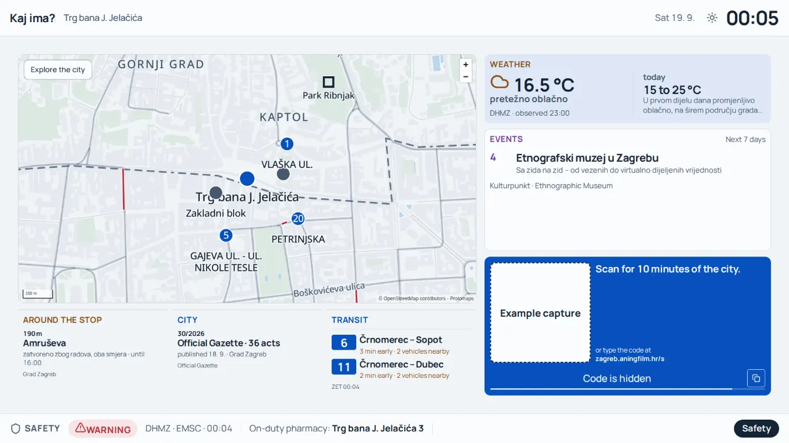
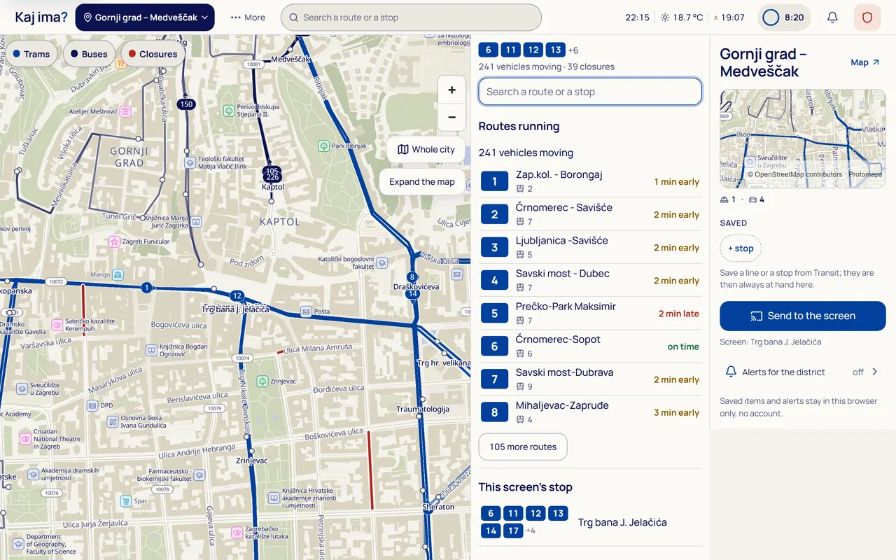
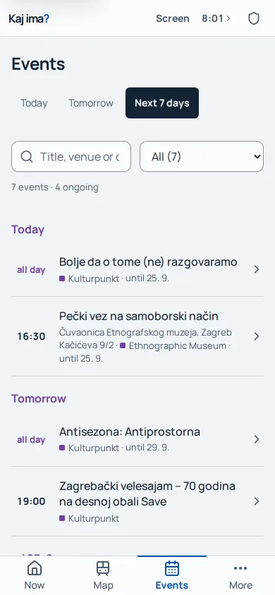

# Kaj ima?

**Less screen. More city.**

Zagreb publishes the movements of its trams, the streets being repaired, the weather, cultural events and the decisions shaping the city. Kaj ima? brings those separate sources into one place: a public window onto Zagreb that you can take with you on your phone.

Find your tram. Discover an exhibition. Check what is happening around you. Then get back to the city.

[Try the prototype](https://zagreb.aningfilm.hr) · [Run locally](#run-locally) · [Under the hood](#under-the-hood) · [Project proposal](docs/prijava/prijedlog-projekta.md)



*Actual application, English interface, September 21, 2026. Source data is real; pairing credentials are masked. This is an example capture, not current information.*

## A reason to look up

City information should help people inhabit their city, not keep them inside an app.

A screen in a café, library or neighbourhood office can be useful to anyone walking past, including someone without a phone. Scanning its rotating code gives you **ten minutes** of the city on your own device. You can give someone nearby **five minutes** through a code on your phone, once, without shortening your own session. They cannot pass it on again.

No account, installation, advertising or personal tracking. No push notifications calling you back. Access starts with a screen or another person. The code is an invitation, not proof of physical location.

When time runs out, updates stop—not your ability to keep what you found. The last view remains as a dated snapshot, with attribution and export actions. Safety information at [`/hitno`](https://zagreb.aningfilm.hr/hitno) stays open without a code, time limit or JavaScript.

## One city, three experiences

- **On the wall:** a passive overview with an anchored map, moving transport, current conditions, rotating highlights and persistent safety information. The scanning invitation has its own space.
- **In your hand:** local departures, search, saved stops and places, a map and an events agenda. Personal discovery stays on your device.
- **At your desk:** room to explore the map and its details together, with direct access to transport, weather, events, civic information and safety.

These share data and a visual language, not an identical layout stretched to three sizes.

**Access is not control.** Scanning never interrupts the public overview or someone else's presentation. Showing a selected item on the wall is a separate action through **Screen**. Taking over another person's presentation requires confirmation; delivery is acknowledged by the screen after rendering. A five-minute shared session cannot control the wall.

## What is in the city window?

Nine feed modules, a reference catalogue and live city services bring together:

| Explore | What you can find | Sources |
|---|---|---|
| Transport | Moving trams and buses, routes, stops, departures, closures, rail timetables | ZET, City, HŽPP |
| Places | BAJS bikes, drinking water, toilets, markets, Wi-Fi, sports grounds, cycling | BAJS / nextbike, City |
| Conditions | Weather, forecasts, warnings, air quality, Sava bulletin, sunrise/sunset | DHMZ, national air-quality service |
| Culture | Events, exhibitions, venues, street histories, protected heritage | Kulturpunkt, Ethnographic Museum, City, Ministry of Culture |
| Civic life | Assembly meetings, works, gazette acts and originals, consultations | City, eSavjetovanja |
| Safety | Warnings, earthquakes, assembly points, emergency contacts, pharmacies | DHMZ, EMSC, city and maintained references |

These are different kinds of knowledge. ZET countdowns are **derived estimates** for tracked vehicles, using timetable and delay information with next-stop refinement from the motion model. Other departures retain clock times; HŽ Passenger Transport boards are schedule-only. A mapped garage does not imply available spaces. Heritage boundaries are not entrances. An undated notice is not a calendar event.

<details>
<summary>See the desktop map and phone agenda</summary>





*September 21, 2026 captures from real local sessions. Interface controls are in English; original place names and event titles retain their source language.*

</details>

## Try it

1. Open the [city screen](https://zagreb.aningfilm.hr/kiosk/) on a computer or display and start it.
2. Keep it open. Scan the current QR code with your phone, or type the displayed code at [code entry](https://zagreb.aningfilm.hr/s/). The same Wi-Fi network works.
3. Explore privately. Use **Screen** only when you want to show something publicly.
4. Open the session controls and choose **Share the city** to give a second person their own five-minute session.

One device is enough: keep the screen in one tab and redeem its code in another. Opening a screen does not grant a personal session. This is the real data and pairing system, not a separate demo.

## Under the hood

### Movement reconstructed, not dots connected

The server-side transit engine combines each vehicle's sparse, delayed observations with the timetable, a directed rail graph and the stops its trip actually serves. It learns travel and dwell times and publishes motion plans; the browser draws along those plans instead of independently guessing where every tram went.

Trams share track and ordering constraints; buses follow their own route geometry. The bias is conservative: prefer lagging behind to racing ahead and correcting backwards. Recorded ZET frames make real days replayable; hindsight metrics compare plans with later evidence. Path matching and silence handling remain active areas of refinement, not solved problems.

### Data that keeps its meaning

Each source carries attribution, availability and timestamps. Observation, publication, event and retrieval times are distinct. A failed source can retain its last good data within a bounded age; another source's successful refresh must not make those old records look fresh.

Missing is not zero. An unavailable warning feed is not an all-clear.

The city catalogue publishes versioned chunks before its manifest and ships a bundled starting copy. Optional server-side AI condenses selected source texts into short display briefs, with cached results, validation and an original-title fallback. It does not generate vehicle movement or fill missing observations.

### Shared infrastructure, private exploration

A TypeScript client built with Vite talks to one Cloudflare Worker. Six SQLite-backed Durable Object classes handle the state that must outlive a request:

```text
Screen · phone · desktop
           │
Worker + static application
├─ Pairing and presentation
│  BeaconDO · RoomDO · IndexDO
├─ Transit model: TwinDO
├─ City ingestion: CatalogueDO
├─ Counters: MetricsDO
├─ Feeds: Cache API + KV
└─ R2
   Maps, catalogue, recordings
```

Signed data tokens avoid waking session objects for ordinary feed polling. Search text and private coordinates are not broadcast to the wall; saved choices stay in the browser. Temporary-screen evaluation metrics are separated from venue-pilot usage.

### Designed to remain accessible

The application includes Croatian and English interfaces, keyboard access, visible focus, reduced motion and light/dark themes. MapLibre renders a regional Protomaps/PMTiles basemap, with tiles, glyphs and sprites served from the application's own origin.

`?lagano=1` selects a lightweight experience without map libraries, downloaded fonts or canvas animation. Safety is server-rendered and printable. Automated checks do not replace physical-display, distance-scanning and Safari/VoiceOver checks, which remain necessary before a venue pilot.

## Run locally

Use **Node.js 22 or newer** and npm, from the repository root:

```sh
npm ci
cp .dev.vars.example .dev.vars
```

Set local-only `SESSION_SECRET` and `E2E_ADMIN_BYPASS` values in `.dev.vars`, replacing the example placeholders; the bypass must be at least 32 characters. Keep `APP_ENV=test`. Never copy these development values into production.

```sh
npm run dev -- --local --port 8787
```

Wrangler runs the configured application build before serving on `http://localhost:8787`. `--local` keeps bindings local, including disabling the remote AI binding; live upstream data still requires internet access. Rebuild with `npm run build` after frontend changes if needed.

Reference and transit artifacts are already checked in. The regional basemap archive is separate: follow the [map asset instructions](app/public/maps/README.md), then load the resulting file into local R2:

```sh
npx wrangler r2 object put vidikovac-maps/zagreb-v1.pmtiles \
  --file ./zagreb-v1.pmtiles --local
```

Without the archive, map tiles are unavailable; the lightweight and alternative list views remain useful.

<details>
<summary>Refreshing data artifacts</summary>

These are maintenance steps, not first-run prerequisites. They can change tracked files.

```sh
npm run gtfs:routes
npm run build:network
npm run build:trips
node scripts/gtfs-stops.mjs
npm run build:schema
npm run build:city
```

Keep the network, trip index and schematic on the same GTFS feed version; tests guard compatibility. City catalogue generation reuses cached downloads; `npm run build:city -- --fresh` fetches them again. The ordinary application build does not refresh upstream datasets.

Manual dwell settings live in [`stop-dwell-overrides.json`](app/public/data/stop-dwell-overrides.json), read directly by the engine without a data-generation step. See [verification and maintenance notes](docs/kaj-verification.md) for their format and network exceptions.

</details>

## Verification and deployment

```sh
npm run typecheck
npm run build
npm test                       # Unit tests and local Worker integration tests
npx playwright install chromium
npm run e2e                    # Browser flows, including real pairing and expiry
npm run e2e:a11y               # Accessibility checks
npm run a11y:lighthouse        # Requires a running local server
npm run check:izvori           # Source coverage and external-link checks
```

Run build and browser work sequentially: browser tests manage local servers sharing the built app. Coverage includes single-use codes, presentation acknowledgement and takeover, expiry, source recovery, lightweight mode and attributed exports. See the [verification record](docs/readable-city-2026-09-20.md).

Deployment uses **`git push` to `main` → Cloudflare Workers Builds**, not `wrangler deploy`. A production `SESSION_SECRET` is required. Unset `APP_ENV` means production; `E2E_ADMIN_BYPASS` works only with `APP_ENV=test`. The retired `NETWORK_CHECK` cannot enable test mode. Operator routes `/api/admin/*` and `/stats` require Cloudflare Access; unauthorised requests receive 404. Workers.dev and preview URLs are disabled.

The repository, Worker and existing storage names retain the original technical name **`vidikovac`**. The product is **Kaj ima?**

## Where this could go

The public prototype opened on September 14, 2026; the funding application has been submitted to the City of Zagreb. A venue pilot and continued development depend on City funding and partnership.

The broader proposal would reuse screens venues already own, bring local publishers' announcements into public view, and eventually support face-to-face civic connections. These are future ambitions, not shipped publisher tools or a social network. The starting point is already here: public data made useful in public space.

## Explore the project

`app/` holds the interfaces, `worker/` the services, and `shared/` their common city and motion logic. `test/` and `e2e/` hold checks; `scripts/` contains builders, replay and review tools. `video/` holds Remotion title and end cards.

- [Product](PRODUCT.md) and [design](DESIGN.md): governing decisions.
- [Architecture](docs/arhitektura.md), [public screens](docs/kiosk.md), and [sources and licences](docs/izvori.md): technical and operational detail.
- [City-data upgrade](docs/upgrade-city-2026-09-18.md) and [readable-city refinement](docs/readable-city-2026-09-20.md): implementation context and verification.
- [Submitted proposal](docs/prijava/prijedlog-projekta.md): the public-service vision and funded deliverables. It is a submission record, not a current UI specification.

Several supporting documents are in Croatian. Dated implementation records describe their own revisions. The [September 17 redesign](docs/redesign-2026-09-17.md) establishes the replacement of the historical [previous design system](newdesignsystem.md); earlier material under `docs/superpowers/` is history, not current visual guidance.

## Licence and authorship

Built by **Matija Radeljak / Aning Film d.o.o., Zagreb**.

Code: **AGPL-3.0-or-later**; see [LICENSE](LICENSE). The same code is also offered to the City of Zagreb under EUPL-1.2.

Selected derivatives are available through [`/open/`](https://zagreb.aningfilm.hr/open/). Eligible datasets use Croatia's Open Licence; EMSC retains its own terms. The city catalogue and session-tier feeds are not new `/open` exports. Upstream data is not blanket-relicensed. Basemap data credits OpenStreetMap contributors; see the [source register](docs/izvori.md) and [map attribution](app/public/maps/README.md).

ZET attribution: “Public dataset by ZET provided under Open license, dataset source http://www.zet.hr/odredbe/datoteke-u-gtfs-formatu/669”.

Copyright (C) 2026 Aning Film d.o.o. / Matija Radeljak.
