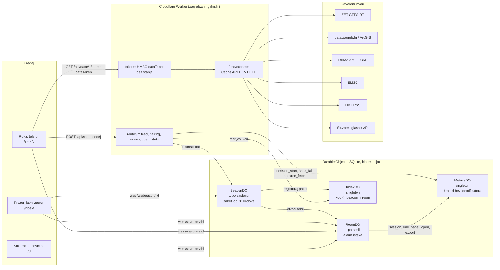

# Arhitektura na jednoj stranici

Vidikovac je jedan Cloudflare Worker (`worker/index.ts`) sa statičkim datotekama (`app/dist`), četiri Durable Object klase sa SQLite pohranom, jednim KV prostorom za posljednju dobru kopiju svakog izvora i tri ograničivača brzine. Nema baze korisnika, nema kolačića, nema identifikatora uređaja. Kod je AGPL-3.0-or-later, izvedeni podaci Otvorena dozvola.

## Tok podataka (feed)

Svaki izvor je modul (`worker/feed/modules/*.ts`) koji dohvaća, parsira i normalizira u `ModuleSnapshot` (`worker/feed/schema.ts`): `{ module, tier, status: live|stale|down, fetchedAt, sourceUpdatedAt, attribution, items[] }`. `getModule(env, id)` prvo pita Cache API (unutar `ttl`), inače dohvaća s rokom 6 s, upisuje Cache i KV `feed:<id>` kao posljednju dobru kopiju; kad izvor padne, servira KV kopiju kao `stale` do `maxStale`, a nakon toga `down` s praznim popisom. `Promise.allSettled` preko modula: stranica nikad nije prazna, svaki panel nosi vlastitu oznaku svježine i atribuciju. Cron (`*/5`) grije spore module. Tablica TTL-ova je u `docs/izvori.md`.

Dvije razine: `open` (sigurnosni sloj `/hitno`, teaser zaslona, `/open/*`) ne traži ništa; `session` traži `Authorization: Bearer <dataToken>`. Token je `base64url(roomId).expiresAt.base64url(HMAC-SHA256(SESSION_SECRET, roomId|expiresAt))` i provjerava se bez ijednog poziva u DO, pa anketiranje s telefona ne budi ništa.

## Model kretanja vozila (area T)

Matija, 12. rujna: oslanjamo se na rijetke podatke u stvarnom vremenu i pretpostavljamo da su, uz sva kašnjenja, pogrešni -- zato je pravilo da se prijavljena pozicija nikad ne prikazuje, nego se izračunava brzina svakog vozila iz vlastite povijesti očitanja i geometrije linije, pa je gibanje glatko oko prijavljenih koordinata. Prijavljena pozicija je dokaz, nikad ishod: svako iscrtano vozilo stoji ondje gdje ga model izračuna, a novo očitanje je nešto čemu model konvergira, nikad nešto na što skoči -- osim jedne izričite, ograničene iznimke (odstupanje veće od praga skoka, gdje bi daljnja "konvergencija" bila glatka laž).

ZET-ov feed (GTFS-Realtime, otkucaj ~30 s) šalje samo `trip{tripId, routeId, startDate}`, `position{lat, lon}`, `vehicle{id}` i vlastiti `timestamp` -- bez smjera i bez brzine (R-P3, `worker/feed/modules/zet-rt.ts`). Klijent (`app/src/motion/model.ts`) svaki takav zapis presavija u vlastitu povijest vozila (`update`) i tek na svakoj slici (`step`, u ritmu zaslona) izračunava gdje ono zapravo jest. Statičnu geometriju linija spaja klijent, ne Worker: skup kandidata za `tripId` je malen (medijan 3, najviše 17 oblika po liniji), a raspoređeni oblik nije dokaz gdje je vozilo zapravo skrenulo -- samo ostatak (`residual`) klijentskog spajanja odlučuje o načinu "slobodne ravnine". Mrežni artefakt (`app/public/data/zet-network.json`, opisan u `docs/izvori.md`) dohvaća se odvojeno od ulaznog paketa (nakon prvog iscrtavanja, nikad u lagano načinu, R-L4) i dekodira ga `app/src/motion/network.ts` iz stupčastog (struct-of-arrays) zapisa s lančano-delta kodiranim točkama -- ne iz skice kakvu je prvi nacrt zadatka T4 pretpostavljao (R-T3).

Svaka konstanta modela ima razlog, upisan uz nju u `app/src/motion/model.ts`; ovdje su na jednom mjestu:

| Konstanta | Vrijednost | Razlog |
|---|---|---|
| `MAX_SPEED_MS` | 22 m/s | Probom izmjereno: vozilo u pokretu prijeđe 100-620 m po otkucaju od 30 s, tj. bitno ispod 21 m/s; 22 ostavlja tračak zraka umjesto da odsiječe stvarno brz autobus. |
| `SILENCE_HOLD_S` / `SILENCE_HALFLIFE_S` / `STALE_S` | 90 / 45 / 300 s | Prati Workerov vlastiti `maxStale`: do 90 s tišine procjena i dalje vrijedi nepromijenjena, zatim se pouzdanost prepolavlja svakih 45 s (glatko, ne skokovito), a nakon 300 s vozilo se označava zastarjelim i prestaje se pomicati. |
| `DEAD_ZONE_M` | 15 m | Ispod ovoga model miruje: GPS i plutajući zarez ne smiju se čitati kao gibanje. |
| `TAU_FORWARD_S` / `TAU_BACKWARD_S` | 1.5 / 4 s | Meta ispred iscrtane pozicije znači da vozilo jednostavno nastavlja voziti (brza konvergencija); meta iza obično znači da je vozilo zapelo (semafor, gužva), pa je usporeno ublažavanje ispravak, ne trzaj. |
| `MIN_CATCHUP_MS` | 4 m/s | I pri procijenjenoj brzini nula model smije ispravljati do ove brzine, inače stvarno zaustavljeno, tek malo pogrešno pozicionirano vozilo nikad vidljivo ne bi sjelo na svoje stajalište. |
| `DISCREPANCY_LIMIT_M` | 150 m | Iznad ovoga model ne zna da je "malo u krivu" -- zna da je u krivu: iscrtani pomak po liniji tada skače umjesto da klizi (klizanje 150 m bilo bi vidljiva lažna sigurnost), a na svim kandidatima odjednom vozilo napušta geometriju u slobodnu ravninu. |
| `DIRECTION_PENALTY_M` / `HYSTERESIS_MARGIN_M` | 60 / 25 m | Kandidat čiji se smjer ne slaže s posljednjim stvarnim pomakom vozila kažnjava se 60 m i kada mu je sirova udaljenost manja (paralelna ulica, drugi kolosijek); novi oblik mora nadmašiti dosadašnji za više od 25 m da preuzme izbor, inače bi se skoro paralelni oblici (kratka varijanta, depo) mijenjali iz očitanja u očitanje. |
| Pojednostavljenje oblika na 5 m, dijagram na 120 m | `scripts/gtfs-shapes.mjs` | 5 m je iznad kvanta koordinata od ~1,1 m na 5 decimala; 120 m je razmak na kojem se oktilinearni dijagram još čita kao dijagram, ne kao šum. |
| Stajalište kao izlazni zapor | `net.nextStop` | Mrtvo računanje nikad ne smije provesti vozilo kroz stajalište koje nitko nije vidio da je prošlo -- što ujedno ograničava i lošu procjenu brzine na najviše jedan razmak stajališta. |

Stanje mirovanja prepoznaje se točnom jednakošću zaokruženih koordinata (feed ponavlja bajtovski identičnu poziciju), pa mirujuće vozilo stoji brzinom 0 i nikad ne "puzi"; smjer je pritom neodrediv i piše se "smjer nepoznat" (`motion.directionUnknown`) dok dokaz (pouzdanost) ne prijeđe 0,3, umjesto da se pogađa.

Iscrtavanje je na dva platna (`app/src/motion/schematic.ts`, `schematic-view.ts`): donje s linijama, repainta se samo kad se promijeni tema, veličina ili izrez; gornje s vozilima, iscrtava se svaku sliku u ritmu osvježavanja zaslona kroz vlastitu petlju (`app/src/motion/loop.ts`), koja parkira nakon osam nepromijenjenih slika i budi se na novi ulazni paket ili promjenu veličine, a pod `prefers-reduced-motion` ili u lagano načinu crta najviše jednom u sekundu, bez interpolacije. Ista petlja stoji iza brojača slika (`loop.frames()`) kojim `e2e/motion.spec.ts` (T11) dokazuje da se model doista pomiče na zaslonu, umjesto da se to samo pretpostavi. Ova shema iscrtava se na dva mjesta: sesijski sloj "U pokretu" (`app/src/layers/u-pokretu.ts`, cijela mreža) i zaključani kiosk (`app/src/kiosk.ts`, izrez oko zaslonove središnje točke, zadano Trg bana Jelačića, samo tramvaji, R-P1) -- oba dijele jednog domaćina (`schematic-host.ts`) koji čuva povijest vozila kroz cijeli životni vijek stranice, jer bi svaki novi prikaz inače bacio dokaz na koji se model oslanja. Puna MapLibre karta (`app/src/map/**`, T10) crta ista dojavljena očitanja kao dokaz na stvarnoj podlozi, nikad kao gotovu poziciju. Lagano izdanje sheme (R-L2) nije manje platno nego popis najbližih stajališta s linijama i kašnjenjem u riječima -- bez platna, bez WebGL-a, potpuno izostavljajući punu kartu.

## Tok uparivanja

1. Zaslon se spaja na `/ws/beacon/<beaconId>`; `BeaconDO` šalje nonce, zaslon odgovara `HMAC(secret, nonce)`. Nakon uspjeha `BeaconDO` kuje paket od 20 kodova po 30 s (Crockford base32, 8 znakova, 40 bita), registrira ga u `IndexDO` jednim pozivom i šalje zaslonu s `serverNow`. Zaslon rotira po zidnom satu i traži novi paket kad ostanu tri.
2. Telefon skenira `https://zagreb.aningfilm.hr/s#ABCD-EFGH` (kod je u fragmentu, nikad u zahtjevu ni u logu) i šalje `POST /api/scan {code}`. Worker računa `netKey = HMAC(NET_KEY_SECRET, asn|adresa)` iz `request.cf.asn` i `CF-Connecting-IP`, odbacuje sirove vrijednosti, pita `IndexDO` čiji je kod, pa `BeaconDO` provjerava prozor (slotStart − 5 s do slotEnd + 30 s), jednokratnost, opoziv i istu mrežu (`NETWORK_CHECK` enforce|warn|off). `BeaconDO` otvara `RoomDO` s `expiresAt = now + 10 min` i dvije jednokratne ulaznice; zaslon dobiva `{t:'unlocked'}`, telefon `ScanOk` i prikazuje karticu potvrde ("Zaslon: kafić, Donji grad, 10 minuta").
3. Oba uređaja ulaze u sobu (`/ws/room/<roomId>`, `{t:'join', ticket}`) i dobivaju `{t:'joined', role, expiresAt, resumeToken, dataToken}`. `view` ide samo od vozača prema zaslonu; `share` kuje kodove za drugu osobu (5 svježih minuta, jedan skok, bez mrežne provjere).
4. Alarm `RoomDO`-a: `live → warned60 → warned20 → closed` (idempotentno po fazi); `expiring` na 60 i 20 s, `expired` pa zatvaranje koda 4000. Telefon zamrzava prikaz kao statičku snimku s atribucijom; zaslon se vraća na teaser. Soba briše sve (`storage.deleteAll()`).

## Što se pohranjuje

Registar zaslona (id, tajna za postavljanje u izvornom obliku — HMAC izazova ključa se njome, vidi `BEACON_AUTH` u `worker/protocol.ts` — vrsta, četvrt, oznaka); redovi soba do 10 minuta; kodovi do 5 minuta nakon isteka; brojači `(dan, sat, dogadaj, dim1, dim2) → broj` u zatvorenim rječnicima. Ništa drugo: ni IP, ni User-Agent, ni identifikator uređaja, ni kolačić, ni koordinate. `netKey` zaslona živi samo u privitku WebSocket veze.

## Granice i ograničenja

`RL_SCAN` 10/60 s po IP-u, `RL_DATA` 240/60 s po tokenu, `RL_OPEN` 120/60 s po IP-u; `BeaconDO` usporava 60 s nakon 20 neuspjelih pokušaja; brojane sesije najviše 30 na sat i 200 na dan po zaslonu (višak se bilježi kao `over_cap` i ne ulazi u skup za Grad). Tijela zahtjeva su ograničena, `run_worker_first` drži statiku izvan Workera.

## Postavljanje

Deploy je `git push` (Workers Builds); `wrangler` služi samo za `secret put`, `kv namespace create` i `tail`. Runtime varijable žive u Cloudflareu (`keep_vars`): `SESSION_SECRET`, `NET_KEY_SECRET`, `SESSION_MINUTES=10`, `PEER_MINUTES=5`, `CODE_ROTATE_SECONDS=30`, `NETWORK_CHECK=enforce`, `SCAN_TURNSTILE=off`, `CF_ACCESS_TEAM_DOMAIN`, `CF_ACCESS_AUD`.
