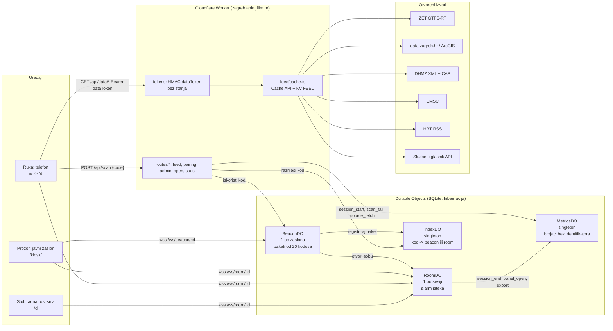

# Arhitektura na jednoj stranici

Kaj ima? je jedan Cloudflare Worker (`worker/index.ts`) sa statičkim datotekama (`app/dist`), četiri Durable Object klase sa SQLite pohranom, KV prostorom za posljednju dobru kopiju izvora i privatnim R2 spremnikom regionalne karte. Tehničko ime Workera i repozitorija ostaje `vidikovac`. Evaluacijska zaštita Accessa odvojena je od sesije proizvoda. Kod je AGPL-3.0-or-later; izvorne licence podataka ostaju očuvane.

## Važeće promjene za Kaj ima?

- **Uparivanje:** ista mreža dopuštena je. Nema mrežnog HMAC-a ni zadanog razvojnog ključa. `SESSION_SECRET` obvezan je; administrativni testni prolaz zahtijeva `APP_ENV=test`.
- **Privremeni zasloni:** `POST /api/screens` provjerava evaluacijski Access i stvara stvarni BeaconDO na 24 sata, s odabranim stajalištem. Quota je pet postava po provjerenom pseudonimnom principalu i trideset ukupno u pomičnom satu. Ne pohranjuje se identitet evaluatora. Isti BeaconDO/RoomDO put koriste privremeni i trajni zasloni.
- **Sesije:** deset minuta sa zaslona, pet minuta jednokratnog prosljeđivanja. Uklanjanje zaslona ne ukida izdanu sesiju. Rok sesije provjerava se i pri obradi poruke, ne samo alarmom.
- **Podaci:** `dateBasis`, pojedinačni `sources` i `coverage` čuvaju značenje datuma i neovisnu dostupnost. Djelomičan uspjeh ne briše posljednje valjane stavke drugog izvora. Njihova starost nije produljena novim dohvatom drugog izvora.
- **Klijent:** zajednički feed/view ugovori, stvarni odabir sloja i javne stavke, stabilno stanje kroz osvježavanja. Pretrage i privatne koordinate ne šalju se na zajednički zaslon. Mrežni zahtjev ograničen je na 15 sekundi.
- **Karta:** Protomaps v4 regionalni PMTiles arhiv u `vidikovac-maps`; dopuštene verzionirane putanje `/maps/zagreb-v1/{z}/{x}/{y}.mvt`. MapLibre 6.4.1, vlastiti glifovi i spriteovi, odvojena geometrija ZET mreže. Gibanje i dalje računa postojeći model.
- **Mjerenje:** aktivnosti privremenih zaslona vode se kao `evaluation`, odvojeno od brojača lokacija i izvoza Gradu. Nepripisiva odbijanja koda ne tumače se kao neuspjeh pilot-lokacije.
- **Postavljanje:** postojeći GitHub-povezani build; `workers_dev` i javni preview URL-ovi isključeni. Evaluacijski Access ostaje uključen.

## Tok podataka (feed)

Svaki izvor je modul (`worker/feed/modules/*.ts`) koji dohvaća, parsira i normalizira u `ModuleSnapshot` (`worker/feed/schema.ts`): `{ module, tier, status: live|stale|down, fetchedAt, sourceUpdatedAt, attribution, items[], sources?, coverage? }`. Cache API i KV `feed:<id>` čuvaju posljednje valjane podatke do `maxStale`. Neovisni izvori unutar modula imaju vlastita vremena i statuse; njihova uspješna prazna kolekcija nije isto što i nedostupan izvor. Klijent i `/hitno` razlikuju nepoznato stanje od potvrde da nema upozorenja. Cron (`*/5`) grije spore module. Tablica TTL-ova je u `docs/izvori.md`.

Dvije razine: `open` (sigurnosni sloj `/hitno`, teaser zaslona, `/open/*`) ne traži ništa; `session` traži `Authorization: Bearer <dataToken>`. Token je `base64url(roomId).expiresAt.base64url(HMAC-SHA256(SESSION_SECRET, roomId|expiresAt))` i provjerava se bez ijednog poziva u DO, pa anketiranje s telefona ne budi ništa.

## Model kretanja vozila (area T)

Matija, 12. rujna: oslanjamo se na rijetke podatke u stvarnom vremenu i pretpostavljamo da su, uz sva kašnjenja, pogrešni -- zato je pravilo da se prijavljena pozicija nikad ne prikazuje, nego se izračunava brzina svakog vozila iz vlastite povijesti očitanja i geometrije linije, pa je gibanje glatko oko prijavljenih koordinata. Prijavljena pozicija je dokaz, nikad ishod: svako iscrtano vozilo stoji ondje gdje ga model izračuna, a novo očitanje je nešto čemu model konvergira, nikad nešto na što skoči. U krivu model može biti jedino o tome *na kojoj je liniji* ili gdje je poprijeko nje -- ostatak spajanja preko praga, promjena oblika -- i tada mijenja odluku i bilježi je, ali oznaku vodi neprekinuto od mjesta gdje je bila; nikad je ne teleportira (R-F1, dolje).

ZET-ov feed (GTFS-Realtime, otkucaj ~30 s) šalje samo `trip{tripId, routeId, startDate}`, `position{lat, lon}`, `vehicle{id}` i vlastiti `timestamp` -- bez smjera i bez brzine (R-P3, `worker/feed/modules/zet-rt.ts`). Klijent (`app/src/motion/model.ts`) svaki takav zapis presavija u vlastitu povijest vozila (`update`) i tek na svakoj slici (`step`, u ritmu zaslona) izračunava gdje ono zapravo jest. Statičnu geometriju linija spaja klijent, ne Worker: skup kandidata za `tripId` je malen (medijan 3, najviše 17 oblika po liniji), a raspoređeni oblik nije dokaz gdje je vozilo zapravo skrenulo -- samo ostatak (`residual`) klijentskog spajanja odlučuje o načinu "slobodne ravnine". Mrežni artefakt (`app/public/data/zet-network.json`, opisan u `docs/izvori.md`) dohvaća se odvojeno od ulaznog paketa (nakon prvog iscrtavanja, nikad u lagano načinu, R-L4) i dekodira ga `app/src/motion/network.ts` iz stupčastog (struct-of-arrays) zapisa s lančano-delta kodiranim točkama -- ne iz skice kakvu je prvi nacrt zadatka T4 pretpostavljao (R-T3).

Svaka konstanta modela ima razlog, upisan uz nju u `app/src/motion/model.ts`; ovdje su na jednom mjestu:

| Konstanta | Vrijednost | Razlog |
|---|---|---|
| `MAX_SPEED_MS` | 22 m/s | Probom izmjereno: vozilo u pokretu prijeđe 100-620 m po otkucaju od 30 s, tj. bitno ispod 21 m/s; 22 ostavlja tračak zraka umjesto da odsiječe stvarno brz autobus. Loš razmak (GPS-ov šum, preskočeno očitanje koje nakratko napuhne ds/dt) ne smije se čitati kao doslovan dokaz da tramvaj vozi 60 km/h. |
| `SILENCE_HOLD_S` / `SILENCE_HALFLIFE_S` / `STALE_S` | 90 / 45 / 300 s | Prati Workerov vlastiti `maxStale`: do 90 s tišine procjena i dalje vrijedi nepromijenjena, zatim se pouzdanost i brzina prepolavljaju svakih 45 s (glatko, ne skokovito; mrtvo računanje integrira tu ovojnicu, pa se oznaka samo usporava do zaustavljanja i nikad ne vraća), a nakon 300 s izvještaj nije "malo star" nego ga nema: vozilo se izbacuje iz modela (R-F2), `size()` se smanjuje i ništa se ne crta, umjesto da se označi zastarjelim i vuče dalje -- pa nazivnik legende ostaje istinit, a trošak po slici ne raste s vremenom rada. |
| `DEAD_ZONE_M` | 15 m | Ispod ovoga model miruje: GPS i plutajući zarez ne smiju se čitati kao gibanje. Istom mjerom odlučuje i je li očitanje uzeto *na* stajalištu (R-F10, dolje). |
| `TAU_FORWARD_S` / `TAU_BACKWARD_S` | 1.5 / 4 s | Meta ispred iscrtane pozicije znači da vozilo jednostavno nastavlja voziti (brza konvergencija); meta iza obično znači da je vozilo zapelo (semafor, gužva, dulje stajanje), pa je usporeno ublažavanje ispravak, ne trzaj. |
| `SETTLE_GAIN_FACTOR` | 1.5 | Ispod `CATCHUP_GAP_M` oznaka sjeda na metu koja se i sama giba brzinom vozila, pa granica smirivanja mora biti veća od te brzine, inače je oznaka nikad ne bi sustigla: pri točno `speed` zaostatak od 15 do 50 m bio je trajan i ondje je sjedio dobar dio izmjerenog zaostatka (R-F9). Jedan i pol puta brzina vozila zatvara posljednjih 50 m u desetak sekundi, a još se čita kao tramvaj, ne kao strelica. |
| `SETTLE_MIN_MS` | 6 m/s | I pri procijenjenoj brzini nula model smije ispravljati do ove brzine, inače stvarno zaustavljeno, tek malo pogrešno pozicionirano vozilo nikad vidljivo ne bi sjelo na svoje stajalište (R-F9 podigao s 4, zajedno s faktorom i iz istog razloga: i spora procjena mora sustizati). |
| `CATCHUP_GAP_M` | 50 m | Uzdužni razmak veći od ovoga zaostatak je od jednog razmaka anketiranja (očitanje isporučeno 25 do 45 s kasno, zapor koji je držao kroz stajanje), ne vozilo nekoliko metara pored svoje oznake; odavde granica sustizanja raste da se razmak zatvori u otprilike jednom razmaku anketiranja (R-F1a). |
| `CATCHUP_BEHIND_MIN_MS` | 8 m/s | Podignuta granica: dvostruka brzina vozila, a nikad ispod 8 m/s da i spora ili tek zaustavljena procjena zatvori stvarni razmak -- zaostatak od 300 m tramvajskom brzinom nestane u 15 do 20 s, jednom razmaku anketiranja, što prolaznik čita kao tramvaj koji sustiže, ne kao teleportaciju. |
| `DISCREPANCY_LIMIT_M` | 150 m | Iznad ovoga model ne zna da je "malo u krivu" o tome *gdje poprijeko* linije jest -- zna da je na krivoj liniji: preko toga na tekućem obliku dodjela se odbacuje, preko toga na svakom kandidatu vozilo napušta geometriju u slobodnu ravninu. Uzduž linije ne znači ništa: zaostajanje je kašnjenje, a kašnjenje rješava sustizanje. |
| `GATE_DWELL_S` | 25 s | Koliko zapor stajališta drži vozilo čije je mrtvo računanje stiglo do idućeg stajališta koje nitko nije potvrdio da je prošlo: jedno stajanje -- vrata otvorena, ljudi van i unutra -- nakon kojeg je pravi tramvaj obično otišao, pa zapor pušta punom procijenjenom brzinom (R-F9: puštanje pola brzinom izmjereno je gradilo 87 do 375 m zaostatka po stajalištu, jer očitanje koje potvrđuje odlazak stiže 25 do 75 s nakon njega). |
| `GATE_RELEASE_CONFIDENCE_PENALTY` | 0.2 | Popust na dokaz za to pušteno gibanje: pogodak o odlasku koji nitko nije vidio, pa oznaka blijedi za toliko dok očitanje iza stajališta ne potvrdi odlazak -- i nikad iznad `STOP_GATE_CONFIDENCE_CAP`, da puštanje ne može posvijetliti oznaku ni pokazati smjer u trenutku kad model počinje pogađati (R-F9). |
| `DWELL_ASSUMED_S` | 20 s | Stajanje koje se obračuna razmaku između dvaju očitanja čiji je uzdužni odsječak prošao stajalište koje mreža poznaje: vrata otvorena, ljudi van i unutra, na ZET-ovu gradskom stajalištu traje 15 do 30 s, pa je razmak od 30 s koji je prošao stajalište dvije trećine stajao, a dijeljenje prijeđenog puta cijelim trajanjem čitalo je tramvaj koji vozi 10 m/s kao 7 -- F6 je to podcjenjivanje izmjerio kao izvor zaostatka, jer računanje na 7 zaostaje na svakoj vožnji (R-F10). Nikad se ne obračuna više od dvije trećine razmaka: pokretni dio je barem trećina izmjerenog trajanja, pa stajalište prijeđeno u kratkom razmaku ne može učiniti tramvaj tri puta bržim nego što jest. |
| `DIRECTION_PENALTY_M` / `HYSTERESIS_MARGIN_M` | 60 / 25 m | Kandidat čiji se smjer ne slaže s posljednjim stvarnim pomakom vozila kažnjava se 60 m i kada mu je sirova udaljenost manja (paralelna ulica, drugi kolosijek); novi oblik mora nadmašiti dosadašnji za više od 25 m da preuzme izbor, inače bi se skoro paralelni oblici (kratka varijanta, depo) mijenjali iz očitanja u očitanje. |
| `CONFIDENCE_EASE` | 0.6 | Koliko brzo pouzdanost (nakupljeni dokaz) ide prema 1 na očitanju koje je pokazalo stvarno gibanje, odnosno prema 0 na ponovljenom: 0,6 preostalog razmaka po očitanju, pa dva uzastopna potvrdna očitanja već prelaze prag smjera 0,3 (0 -> 0,6 -> 0,84) -- koliko se brzo mora razriješiti okret na okretištu. |
| `FREE_PLANE_CONFIDENCE_CAP` | 0.5 | Slobodna ravnina nema oblik prema kojem bi provjerila očitanje, pa se njezino uklapanje nikad ne može zamijeniti za ono provjereno oblikom: pouzdanost ne prelazi ovo. |
| `STOP_GATE_CONFIDENCE_CAP` | 0.25 | Držano na zaporu stajališta, model ne zna zašto (stajanje, zatvaranje, okretište) vozilo nije potvrđeno iza stajališta -- a ne znati zašto znači i ne znati kamo je još okrenuto, pa je pouzdanost ograničena ispod praga smjera 0,3. |
| `HEADING_CONFIDENCE_THRESHOLD` | 0.3 | Ispod ovoga smjer je neodrediv: crta se kao nepoznat ("smjer nepoznat"), ne pogađa se. |
| Pojednostavljenje oblika na 5 m, dijagram na 120 m | `scripts/gtfs-shapes.mjs` | 5 m je iznad kvanta koordinata od ~1,1 m na 5 decimala; 120 m je razmak na kojem se oktilinearni dijagram još čita kao dijagram, ne kao šum. |
| Stajalište kao izlazni zapor | `net.nextStop` | Mrtvo računanje nikad ne smije provesti vozilo kroz stajalište koje nitko nije vidio da je prošlo: ondje drži `GATE_DWELL_S`, zatim nastavlja punom brzinom najdalje do stajališta iza njega -- što ujedno ograničava i lošu procjenu brzine na najviše jedan razmak stajališta. |

Uzdužno pravilo (R-F1): zaostajati po liniji na kojoj vozilo već jest nije pogreška modela nego njegovo kašnjenje, pa se uzdužni razmak bilo koje veličine zatvara sustizanjem, nikad skokom. Iscrtani luk konvergira eksponencijalno prema meti (`TAU_FORWARD_S` naprijed, `TAU_BACKWARD_S` natrag), ispod `DEAD_ZONE_M` miruje, a po sekundi smije prijeći najviše granicu sustizanja: do `CATCHUP_GAP_M` razmaka `max(SETTLE_GAIN_FACTOR × brzina, SETTLE_MIN_MS)`, iznad njega `max(2 × brzina, CATCHUP_BEHIND_MIN_MS)`, da se zaostatak od jednog razmaka anketiranja zatvori u jednom razmaku anketiranja. U *krivu* model može biti samo poprijeko: ostatak spajanja preko `DISCREPANCY_LIMIT_M` ili promjena oblika mijenja odluku o liniji, a iscrtani luk se tada iznova zasije od mjesta gdje je oznaka *trenutačno* nacrtana, pa je i ta promjena neprekinuta -- prag od 150 m više nije prag skoka nego prag krive linije, i bilježi se (`lastSnapAt`) da test može dokazati da zaostajanje nikad ne broji kao pogreška. Pod tišinom mrtvo računanje integrira ovojnicu slabljenja, pa se oznaka samo usporava do zaustavljanja i nikad se ne vraća unatrag po liniji koju je već prešla.

Stanje mirovanja prepoznaje se točnom jednakošću zaokruženih koordinata (feed ponavlja bajtovski identičnu poziciju), pa mirujuće vozilo stoji brzinom 0 i nikad ne "puzi". Takav razmak ne ulazi u povijest brzine: ona čuva posljednja tri *pokretna* razmaka, procjena je njihov medijan ograničen na `MAX_SPEED_MS`, pa prvo očitanje koje se opet pomakne čita brzinu vožnje, a ne medijan koji je stajanje povuklo prema nuli (R-F10). Brzina svakog pokretnog razmaka računa se iz njegova pokretnog dijela: razmaku čiji je odsječak prošao poznato stajalište obračuna se `DWELL_ASSUMED_S`, a stajalištu unutar `DEAD_ZONE_M` od kraja odsječka -- očitanje uzeto na stajalištu, što se na otkucaju od 30 s dogodi u dva stajanja od tri -- pola toga, svakom od dvaju razmaka koja se ondje sastaju, jer nijedno očitanje ne kaže koliko je stajanja pripalo kojem. Smjer je pritom neodrediv i piše se "smjer nepoznat" (`motion.directionUnknown`) dok dokaz (pouzdanost) ne prijeđe 0,3, umjesto da se pogađa.

Iscrtavanje je na dva platna (`app/src/motion/schematic.ts`, `schematic-view.ts`): donje s linijama, repainta se samo kad se promijeni tema, veličina ili izrez; gornje s vozilima, iscrtava se svaku sliku u ritmu osvježavanja zaslona kroz vlastitu petlju (`app/src/motion/loop.ts`), koja parkira nakon osam nepromijenjenih slika i budi se na novi ulazni paket ili promjenu veličine, a pod `prefers-reduced-motion` ili u lagano načinu crta najviše jednom u sekundu, bez interpolacije. Ista petlja stoji iza brojača slika (`loop.frames()`) kojim `e2e/motion.spec.ts` (T11) dokazuje da se model doista pomiče na zaslonu, umjesto da se to samo pretpostavi. Ova shema iscrtava se na dva mjesta: sesijski sloj "U pokretu" (`app/src/layers/u-pokretu.ts`, cijela mreža) i zaključani kiosk (`app/src/kiosk.ts`, izrez oko zaslonove središnje točke, zadano Trg bana Jelačića, samo tramvaji, R-P1) -- oba dijele jednog domaćina (`schematic-host.ts`) koji čuva povijest vozila kroz cijeli životni vijek stranice, jer bi svaki novi prikaz inače bacio dokaz na koji se model oslanja. Puna MapLibre karta (`app/src/map/**`, T10) crta ista dojavljena očitanja kao dokaz na stvarnoj podlozi, nikad kao gotovu poziciju. Lagano izdanje sheme (R-L2) nije manje platno nego popis najbližih stajališta s linijama i kašnjenjem u riječima -- bez platna, bez WebGL-a, potpuno izostavljajući punu kartu.

## Tok uparivanja

1. Zaslon se spaja na `/ws/beacon/<beaconId>`; `BeaconDO` šalje nonce, zaslon odgovara `HMAC(secret, nonce)`. Nakon uspjeha `BeaconDO` kuje paket od 20 kodova po 30 s (Crockford base32, 8 znakova, 40 bita), registrira ga u `IndexDO` jednim pozivom i šalje zaslonu s `serverNow`. Zaslon rotira po zidnom satu i traži novi paket kad ostanu tri.
2. Telefon skenira `https://zagreb.aningfilm.hr/s#ABCD-EFGH` (kod je u fragmentu, nikad u zahtjevu ni u logu) i šalje `POST /api/scan {code}`. Worker računa `netKey = HMAC(NET_KEY_SECRET, asn|adresa)` iz `request.cf.asn` i `CF-Connecting-IP`, odbacuje sirove vrijednosti, pita `IndexDO` čiji je kod, pa `BeaconDO` provjerava prozor (slotStart − 5 s do slotEnd + 30 s), jednokratnost, opoziv i istu mrežu (`NETWORK_CHECK` enforce|warn|off). `BeaconDO` otvara `RoomDO` s `expiresAt = now + 10 min` i dvije jednokratne ulaznice; zaslon dobiva `{t:'unlocked'}`, telefon `ScanOk` i prikazuje karticu potvrde ("Zaslon: kafić, Donji grad, 10 minuta").
3. Oba uređaja ulaze u sobu (`/ws/room/<roomId>`, `{t:'join', ticket}`) i dobivaju `{t:'joined', role, expiresAt, resumeToken, dataToken}`. `view` ide samo od vozača prema zaslonu; `share` kuje kodove za drugu osobu (5 svježih minuta, jedan skok, bez mrežne provjere).
4. Alarm `RoomDO`-a: `live → warned60 → warned20 → closed` (idempotentno po fazi); `expiring` na 60 i 20 s, `expired` pa zatvaranje koda 4000. Telefon zamrzava prikaz kao statičku snimku s atribucijom; zaslon se vraća na teaser. Soba briše sve (`storage.deleteAll()`).

## Što se pohranjuje

Registar zaslona (id, tajna za postavljanje u izvornom obliku — HMAC izazova ključa se njome, vidi `BEACON_AUTH` u `worker/protocol.ts` — vrsta, četvrt, oznaka); redovi soba do 10 minuta; kodovi do 5 minuta nakon isteka; brojači `(dan, sat, dogadaj, dim1, dim2) → broj` u zatvorenim rječnicima. Ništa drugo: ni IP, ni User-Agent, ni identifikator uređaja, ni kolačić, ni koordinate. `netKey` zaslona živi samo u privitku WebSocket veze.

## Granice i ograničenja

`RL_SCAN` 10/60 s po IP-u, `RL_DATA` 240/60 s po tokenu, `RL_OPEN` 120/60 s po IP-u; `BeaconDO` usporava 60 s nakon 20 neuspjelih pokušaja; brojane sesije najviše 30 na sat i 200 na dan po zaslonu (višak se bilježi kao `over_cap` i ne ulazi u skup za Grad). Tijela zahtjeva su ograničena, `run_worker_first` drži statiku izvan Workera.

## Postavljanje

Deploy je `git push` (Workers Builds); `wrangler` služi samo za `secret put`, `kv namespace create` i `tail`. Runtime varijable žive u Cloudflareu (`keep_vars`): `SESSION_SECRET`, `NET_KEY_SECRET`, `SESSION_MINUTES=10`, `PEER_MINUTES=5`, `CODE_ROTATE_SECONDS=30`, `NETWORK_CHECK=enforce`, `SCAN_TURNSTILE=off`, `CF_ACCESS_TEAM_DOMAIN`, `CF_ACCESS_AUD`.
