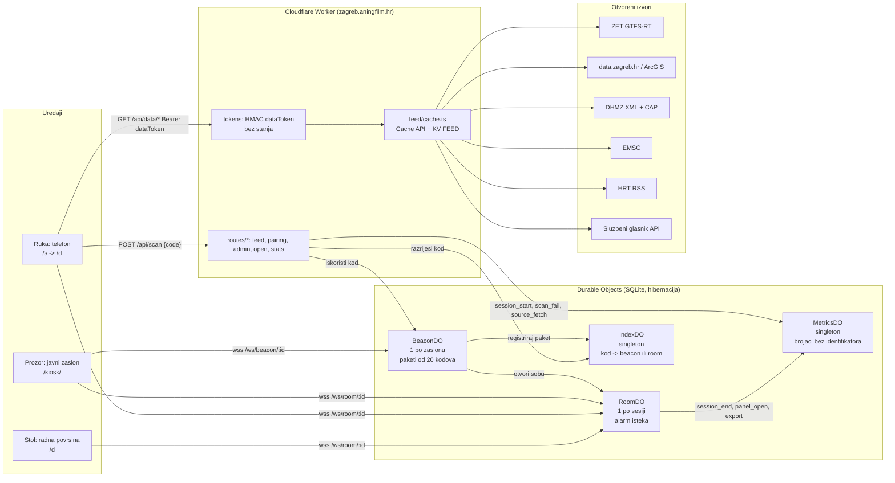

# Arhitektura na jednoj stranici

Vidikovac je jedan Cloudflare Worker (`worker/index.ts`) sa statičkim datotekama (`app/dist`), četiri Durable Object klase sa SQLite pohranom, jednim KV prostorom za posljednju dobru kopiju svakog izvora i tri ograničivača brzine. Nema baze korisnika, nema kolačića, nema identifikatora uređaja. Kod je AGPL-3.0-or-later, izvedeni podaci Otvorena dozvola.

## Tok podataka (feed)

Svaki izvor je modul (`worker/feed/modules/*.ts`) koji dohvaća, parsira i normalizira u `ModuleSnapshot` (`worker/feed/schema.ts`): `{ module, tier, status: live|stale|down, fetchedAt, sourceUpdatedAt, attribution, items[] }`. `getModule(env, id)` prvo pita Cache API (unutar `ttl`), inače dohvaća s rokom 6 s, upisuje Cache i KV `feed:<id>` kao posljednju dobru kopiju; kad izvor padne, servira KV kopiju kao `stale` do `maxStale`, a nakon toga `down` s praznim popisom. `Promise.allSettled` preko modula: stranica nikad nije prazna, svaki panel nosi vlastitu oznaku svježine i atribuciju. Cron (`*/5`) grije spore module. Tablica TTL-ova je u `docs/izvori.md`.

Dvije razine: `open` (sigurnosni sloj `/hitno`, teaser zaslona, `/open/*`) ne traži ništa; `session` traži `Authorization: Bearer <dataToken>`. Token je `base64url(roomId).expiresAt.base64url(HMAC-SHA256(SESSION_SECRET, roomId|expiresAt))` i provjerava se bez ijednog poziva u DO, pa anketiranje s telefona ne budi ništa.

## Tok uparivanja

1. Zaslon se spaja na `/ws/beacon/<beaconId>`; `BeaconDO` šalje nonce, zaslon odgovara `HMAC(secret, nonce)`. Nakon uspjeha `BeaconDO` kuje paket od 20 kodova po 30 s (Crockford base32, 8 znakova, 40 bita), registrira ga u `IndexDO` jednim pozivom i šalje zaslonu s `serverNow`. Zaslon rotira po zidnom satu i traži novi paket kad ostanu tri.
2. Telefon skenira `https://zagreb.aningfilm.hr/s#ABCD-EFGH` (kod je u fragmentu, nikad u zahtjevu ni u logu) i šalje `POST /api/scan {code}`. Worker računa `netKey = HMAC(NET_KEY_SECRET, asn|adresa)` iz `request.cf.asn` i `CF-Connecting-IP`, odbacuje sirove vrijednosti, pita `IndexDO` čiji je kod, pa `BeaconDO` provjerava prozor (slotStart − 5 s do slotEnd + 30 s), jednokratnost, opoziv i istu mrežu (`NETWORK_CHECK` enforce|warn|off). `BeaconDO` otvara `RoomDO` s `expiresAt = now + 10 min` i dvije jednokratne ulaznice; zaslon dobiva `{t:'unlocked'}`, telefon `ScanOk` i prikazuje karticu potvrde ("Zaslon: kafić, Donji grad, 10 minuta").
3. Oba uređaja ulaze u sobu (`/ws/room/<roomId>`, `{t:'join', ticket}`) i dobivaju `{t:'joined', role, expiresAt, resumeToken, dataToken}`. `view` ide samo od vozača prema zaslonu; `share` kuje kodove za drugu osobu (5 svježih minuta, jedan skok, bez mrežne provjere).
4. Alarm `RoomDO`-a: `live → warned60 → warned20 → closed` (idempotentno po fazi); `expiring` na 60 i 20 s, `expired` pa zatvaranje koda 4000. Telefon zamrzava prikaz kao statičku snimku s atribucijom; zaslon se vraća na teaser. Soba briše sve (`storage.deleteAll()`).

## Što se pohranjuje

Registar zaslona (id, tajna za postavljanje u izvornom obliku — HMAC izazova ključa se njome, vidi `BEACON_AUTH` u `worker/protocol.ts` — vrsta, četvrt, oznaka); redovi soba do 10 minuta; kodovi do 5 minuta nakon isteka; brojači `(dan, sat, dogadaj, dim1, dim2) → broj` u zatvorenim rječnicima. Ništa drugo: ni IP, ni User-Agent, ni identifikator uređaja, ni kolačić, ni koordinate. `netKey` zaslona živi samo u privitku WebSocket veze.

## Granice i ograničenja

`RL_SCAN` 10/60 s po IP-u, `RL_DATA` 240/60 s po tokenu, `RL_OPEN` 120/60 s po IP-u; `BeaconDO` usporava 60 s nakon 20 neuspjelih pokušaja; brojane sesije najviše 30 na sat i 200 na dan po zaslonu (višak se bilježi kao `over_cap` i ne ulazi u skup za Grad). Tijela zahtjeva su ograničena, `run_worker_first` drži statiku izvan Workera.

## Postavljanje

Deploy je `git push` (Workers Builds); `wrangler` služi samo za `secret put`, `kv namespace create` i `tail`. Runtime varijable žive u Cloudflareu (`keep_vars`): `SESSION_SECRET`, `NET_KEY_SECRET`, `SESSION_MINUTES=10`, `PEER_MINUTES=5`, `CODE_ROTATE_SECONDS=30`, `NETWORK_CHECK=enforce`, `SCAN_TURNSTILE=off`, `CF_ACCESS_TEAM_DOMAIN`, `CF_ACCESS_AUD`.
