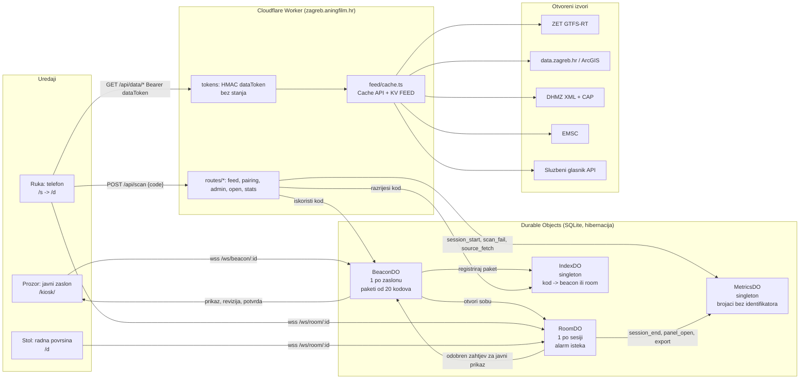

# Arhitektura na jednoj stranici

Kaj ima? je jedan Cloudflare Worker (`worker/index.ts`) sa statičkim datotekama (`app/dist`), pet Durable Object klasa sa SQLite pohranom, KV prostorom za posljednju dobru kopiju izvora i privatnim R2 spremnikom regionalne karte. Tehničko ime Workera i repozitorija ostaje `vidikovac`. Adresa je javna od 14. rujna 2026.; Cloudflare Access štiti samo operaterske rute `/api/admin/*` i `/stats`, odvojeno od sesije proizvoda. Kod je AGPL-3.0-or-later; izvorne licence podataka ostaju očuvane.

## Važeće promjene za Kaj ima?

- **Uparivanje:** ista mreža dopuštena je. Nema mrežnog HMAC-a ni zadanog razvojnog ključa. `SESSION_SECRET` obvezan je; administrativni testni prolaz zahtijeva `APP_ENV=test`.
- **Privremeni zasloni:** `POST /api/screens` stvara stvarni BeaconDO na 24 sata, s odabranim stajalištem. Quota je pet postava po pseudonimnom ključu i trideset ukupno u pomičnom satu; ključ je Access identitet kad ga zahtjev nosi, inače mreža s koje zahtjev dolazi (adresa ili prvih 64 bita IPv6 adrese, kroz HMAC tajnom sesije, pa redovi quote ne nose adresu). Ne pohranjuje se identitet ni adresa u izvornom obliku; redovi kvote nose HMAC prefiksa i brišu se nakon sat vremena. Isti BeaconDO/RoomDO put koriste privremeni i trajni zasloni.
- **Sesije:** deset minuta sa zaslona, pet minuta jednokratnog prosljeđivanja. Uklanjanje zaslona ne ukida izdanu sesiju. Rok sesije provjerava se i pri obradi poruke, ne samo alarmom.
- **Prikazivanje:** `BeaconDO` upravlja javnim prikazom neovisno o osobnim sobama. `RoomDO` provjerava pravo izravnog skenera pa prosljeđuje verzionirani zahtjev. Novi sken ne preuzima prikaz; preuzimanje traži potvrdu revizije, a uspjeh potvrdu stvarnog iscrtavanja.
- **Podaci:** `dateBasis`, pojedinačni `sources` i `coverage` čuvaju značenje datuma i neovisnu dostupnost. Djelomičan uspjeh ne briše posljednje valjane stavke drugog izvora. Njihova starost nije produljena novim dohvatom drugog izvora.
- **Klijent:** zajednički feed/view ugovori, stvarni odabir sloja i javne stavke, stabilno stanje kroz osvježavanja. Pretrage i privatne koordinate ne šalju se na zajednički zaslon. Mrežni zahtjev ograničen je na 15 sekundi.
- **Karta:** Protomaps v4 regionalni PMTiles arhiv u `vidikovac-maps`; dopuštene verzionirane putanje `/maps/zagreb-v1/{z}/{x}/{y}.mvt`. MapLibre 6.4.1, vlastiti glifovi i spriteovi, odvojena geometrija ZET mreže. Gibanje i dalje računa postojeći model.
- **Mjerenje:** aktivnosti privremenih zaslona vode se kao `evaluation`, odvojeno od brojača lokacija i izvoza Gradu. Nepripisiva odbijanja koda ne tumače se kao neuspjeh pilot-lokacije.
- **Postavljanje:** postojeći GitHub-povezani build; `workers_dev` i javni preview URL-ovi isključeni. Od 14. rujna 2026. adresa je javna, bez Cloudflare Accessa; `/api/admin/*` i `/stats` i dalje prihvaćaju samo zahtjev s valjanim Access JWT-om i svima ostalima odgovaraju 404.

## Tok podataka (feed)

Svaki izvor je modul (`worker/feed/modules/*.ts`) koji dohvaća, parsira i normalizira u `ModuleSnapshot` (`worker/feed/schema.ts`): `{ module, tier, status: live|stale|down, fetchedAt, sourceUpdatedAt, attribution, items[], sources?, coverage? }`. Cache API i KV `feed:<id>` čuvaju posljednje valjane podatke do `maxStale`. Neovisni izvori unutar modula imaju vlastita vremena i statuse; njihova uspješna prazna kolekcija nije isto što i nedostupan izvor. Klijent i `/hitno` razlikuju nepoznato stanje od potvrde da nema upozorenja. Cron (`*/5`) grije spore module. Tablica TTL-ova je u `docs/izvori.md`.

Dvije razine: `open` (sigurnosni sloj `/hitno`, teaser zaslona, `/open/*`) ne traži ništa; `session` traži `Authorization: Bearer <dataToken>`. Token je `base64url(roomId).expiresAt.base64url(HMAC-SHA256(SESSION_SECRET, roomId|expiresAt))` i provjerava se bez ijednog poziva u DO, pa anketiranje s telefona ne budi ništa.

## Model kretanja vozila (blizanac, planovi `twin-engine` i `promet-krug-f`, 19. rujna 2026)

Matija, 12. rujna: oslanjamo se na rijetke podatke u stvarnom vremenu i pretpostavljamo da su, uz sva kašnjenja, pogrešni -- zato je pravilo da se prijavljena pozicija nikad ne prikazuje, nego se kretanje svakog vozila izračunava iz njegove vlastite povijesti očitanja, geometrije pruge i voznog reda, pa je gibanje glatko oko prijavljenih koordinata (R-P2). Matija, 16. rujna: motor mora poštovati fiziku pruge (tramvaj ne vozi unatrag i ne pretječe na istom kolosijeku), smjer mora biti poznat, vozila se moraju gibati od prve slike, a kad GPS ne stiže, motor se oslanja na prosjeke koje uči kroz dane (D1, D2). Iz toga je motor preseljen s klijenta na poslužitelj: jedan proces koji nadživi stranicu.

**Pravilo kruga F.** Matija, 18. rujna, u prijevodu s engleskoga: očekujem da ekstrapoliramo iz svih podataka i stvarnog iskustva do najboljeg mogućeg rezultata, gdje u većini slučajeva ono što vidiš na našoj karti i ono što vidiš na ulici izgleda kao praćenje u stvarnom vremenu; a ono što nije, korisniku izgleda kao da GPS kasni, a ne kao da naša aplikacija ne radi. Vlasnik je pritom odbio fiksno kašnjenje prikaza. Ostalo je jedno pravilo koje veže cijeli motor: **radije iza, nikad ispred; sustizanje samo naprijed; držanje kad dokazi proturječe.** Oznaka iza pravog tramvaja čita se kao kašnjenje GPS-a; oznaka ispred, koja se poslije mora vraćati, čita se kao pokvarena aplikacija. Redoslijed je važan: plan se prvo čini *točnim* (fantomska stajališta nestaju), pa se tek onda po konstrukciji nagne kasno. Svaki dio motora to poštuje na svoj način:

- **klijent** nikad ne crta unatrag i nema više povratne vremenske konstante: meta iza oznake je **držanje** dok je plan ne sustigne (`Drawn.holding`), a biti iza po stazi je zaostatak koji se sustiže, ne greška iz koje se iskače;
- **planer** knjiži dionice i zadržavanja na kvantilu 0,9 svoje izmjerene razdiobe, nikad na medijanu -- medijan po konstrukciji stavlja polovicu planova ispred njihovih tramvaja;
- **objavljeni pod** drži novi plan na luku koji je prošli plan već objavio kad je sidro unutar šuma GPS-a iza njega (`ANCHOR_NOISE_M`): klijent bi oznaku ionako samo zadržao, a blizanac bi izgubio luk na kojem je već stajao;
- **registar redoslijeda** zadržava sljedbenika, ali nikad iza njegova vlastitog očitanja, a vođu gura samo naprijed i samo od trenutka tog očitanja nadalje;
- **ocjena unatrag s predznakom** mjeri točno taj udio: `ahead_ge50` je greška koju krug zabranjuje i to je broj kojim `/stats` vodi.

**Što ZET šalje.** GTFS-Realtime feed se objavljuje svakih 10 s (mjereno 16. rujna: zaglavlje raste za +10, oko dvije trećine vozila dobije novo očitanje po otkucaju), s `trip{tripId, routeId, startDate}`, `position{lat, lon}`, `vehicle{id}` i vlastitim `timestamp` -- bez smjera, brzine, stajališta i statusa (R-P3, R-TE1). Uz svako vozilo ide `TripUpdate` s idućim stajalištem (`stopSequence`, `stopId`, kašnjenje, često i vrijeme). Statični GTFS u `trips.txt` za svaku vožnju zna `direction_id`, odredište, oblik i blok; identifikatori vožnji iz feeda u stvarnom vremenu točno mu odgovaraju.

**Statični artefakti** (`scripts/gtfs-shapes.mjs`, `scripts/gtfs-trips.mjs`, ista `feed_version`, test to provjerava): `app/public/data/zet-network.json` **verzije 3** nosi graf pruge i, od kruga F, posluženi popis stajališta.

*Graf pruge.* ZET crta svih 100 tramvajskih oblika iz jednog skupa točaka osi kolosijeka (98 % odsječaka dijeli se bit za bit, kolosijeci dvaju smjerova su 3 do 6 m razmaknuti), pa su bridovi maksimalni nizovi odsječaka s istim skupom vlasnika, čvorovi njihovi krajevi, bridovi usmjereni; bliski dvostruki nacrti istog kolosijeka spajaju se (Hausdorff 2,5 m kroz 30 m i više, R-TE20), okreti i kratke petlje sažimaju (R-TE21); stajališta stoje na bridovima s točnim lukom (decimetri, R-TE23), autobusni oblici ostaju polilinije. Krug F dodaje **čvorove na križanjima na kojima linija stvarno skreće, a nijedan oblik ne crta to skretanje**: gradnja prijavi hop sintetičke staze koji ide preko dvostruke zračne linije, traži stvarno sjecište dviju polilinija pod kutom od najmanje `JUNCTION_MIN_ANGLE_DEG`, i tek ondje reže bridove -- uz to da čvor preživi samo ako neka staza kroz njega doista skrene. Graf je time narastao s 287 bridova i 209 čvorova na **293 brida i 212 čvorova**, od devet dugih obilazaka ostala su dva.

*Sintetičke staze.* Obrasci bez oblika (linija 1 i skraćene varijante linija 2, 5 i 13) dobivaju stazu najkraćim lancem bridova kroz svoj slijed stajališta. Od kruga F **svaki tramvajski uzorak ima stazu**: 52 sintetičke uz 100 s oblikom, 152 od 152 s bridovima, jer se usmjeravanje vodi po posluženim vezama na 60 m (`SERVED_STOP_MAX_METRES`), a prvo i zadnje stajalište smiju biti do 200 m od nacrtane pruge (`TERMINUS_STOP_MAX_METRES`). Nijedno vozilo tramvajskog uzorka više ne vozi u slobodnoj ravnini.

*Posluženi popis stajališta.* Uz geometrijske veze stajališta na bridove (40 m, koje od motora ne čita nitko: ostaju smještaču dijagrama u `shared/motion/schema.ts` i mjerilu fantomskih zapisa u ponavljanju) svaka staza sada nosi `served` -- perone na kojima **njezini vlastiti uzorci stvarno staju**, po luku -- a svako stajalište nosi `terminal`. Motor (matcher, planer, registar, učenje, procjena brzine, objava) čita isključivo `served` kroz `stopsOnPath` iz `shared/motion/graph.ts`, pa više ne knjiži zadržavanje na peronu suprotnog smjera tri metra dalje ni na peronu druge linije na istim tračnicama. Na snimljenom danu 17. rujna takvih je fantomskih zapisa bilo **6.410 od 10.599**; sada ih je **0 od 11.004** (3.302 poslužena).

*`graphHash`.* Ime samog grafa: sažetak nad uređenim bridovima onako kako ih nosi žica. Indeks brida znači nešto samo unutar jednog grafa, pa blizanac pri podizanju uspoređuje hash s onim u SQLite-u i, kad se razlikuje, **izbacuje sve naučeno po bridu i po čvoru** -- a od popravka I1 i nezapisanu minutu koja još stoji u retku stanja i prsten objavljenih planova, koji nosi stare indekse staza. Prazan hash je artefakt prije kruga F i računa se kao drugi graf.

*Imenovane iznimke gradnje* stoje u `scripts/gtfs-shapes-overrides.json`, svaka s razlogom i mjerom: `unreachableStops`, `servedGaps` i `longLegs` na feedu 000395 su prazni, a `connectors` dodaju osamnaest skretanja i okretišnih spojeva koje nijedan oblik ne crta. Na Glavnom kolodvoru istočni kolosijek Mihanovićeve završava, a sjeverni Trga kralja Tomislava počinje 6,79 m dalje, pa se dvije polilinije nikad ne sijeku; uz spoj hop Botanički vrt → Zrinjevac linija 6 i 9 ide kroz skretanje, a ne oko bloka. Dva spoja zatvaraju okretišne petlje na Mihaljevcu (14,66 m) i u Dubravi (1,36 m). Odlukom 25 (23. rujna 2026.) dodano je skretanje sa zapadnog kolosijeka Ilice na Republike Austrije na Trgu dr. F. Tuđmana za liniju 1 (36 m), bez kojeg se sintetičke staze linije 1 nisu mogle provesti do Zapadnog kolodvora, i trinaest okretišnih spojeva od kraja dolaznog oblika do početka odlaznog, ravnih ili s jednom međutočkom i najviše 300 m dugih, ondje gdje oblici stanu prije okretišne petlje koju tramvaj stvarno vozi; mjera je snimljeno kretanje tramvaja 21. rujna 2026. U drugom krugu (24. rujna 2026.) dodan je spoj okretišne petlje na Zapruđu za liniju 14 (128 m): tramvaji prolaze peron, voze istočno do stajanja iza nacrtanih tračnica i vraćaju se zapadnim kolosijekom na početak odlazne staze, što nijedan oblik ne crta. Petlja smije voziti spoj samo unutar 300 m od jednog od svoja dva perona, a sintetička staza čiji završni peron leži dalje od tračnica reže se, kao i petlja, 70 m iza završnog perona. Bez unosa gradnja **pada**: predugi obilazak je u pravilu nedostajući čvor, ne ruta.

`app/public/data/zet-trips.json` (R-TE16) je indeks vožnji: obrasci s redoslijedom stajališta i medijanom rasporednih sekundi između susjednih stajališta po satu, vožnje kodirane sažeto, blokovi. Oba artefakta dekodira `shared/motion/` (bez DOM-a), pa ih čitaju i Worker i klijent.

**Blizanac** (`worker/do/twin-do.ts`, jedan Durable Object). Budi se vlastitim alarmom u ritmu feeda (zaglavlje + 10 s + 1,5 s, pod 3 s, iznad 12 s, čisti otkucaj kad feed zastane 30 s; `worker/twin/clock.ts`), dohvaća okvir uvjetnim zahtjevom (`If-None-Match`; 304 ili isto zaglavlje = nema novog dokaza), i u jednom otkucaju (`worker/twin/tick.ts`): slaže očitanja u trag svakog vozila (najnovije po vozilu, nedatirano očitanje datirano zaglavljem, nova vožnja = novi trag, 180 s tišine = izbačeno), spaja `tripId` s indeksom (smjer, odredište, oblik, blok), **spaja na graf** (`shared/motion/match.ts`: kandidati su bridovi do 60 m, prvo oni na stazi vožnje, s kaznom 60 m za brid protiv posljednjeg pomaka, kaznom za nedostižnost preko 22 m/s × dt + 50 m i kaznom 40 m za točku iza idućeg stajališta iz `TripUpdate`; izvan staze tek nakon dvaju očitanja preko 60 m, izvan grafa nakon dvaju preko 150 m; tramvaj se spaja samo na staze vlastite linije, prvo na stazu svoje vožnje, nikad na stazu druge linije ni na stazu uzorka čija usluga toga dana ne vozi, a kad nijedna tračnica vlastite linije ne pristaje, tramvaj ostaje bez staze i crta se po očitanjima dok tračnice opet ne pristanu; autobusi se spajaju na svoje polilinije uz 25 m histereze i nikad na prugu; staza koja prolazi uz samu sebe, kružne linije i okretišta, nudi više najbližih točaka, pa smješteno vozilo bira među preklopima u dosegu posljednjeg luka, a pomak protiv smjera pruge je krivi preklop, R-TE45; od kruga F dva uzastopna takva pomaka umjesto toga **preokreću smjer staze** -- tramvaj koji se okrenuo na okretištu dok ZET još piše staru vožnju), procjenjuje **brzinu** (`speed.ts`, R-TE26, R-TE50, R-TE51: medijan posljednja tri pokretna razmaka čija su oba kraja izvan zone stajališta od 40 m, stajalište unutar razmaka od 25 s ili duljeg tereti jedno stajanje po tablici zadržavanja, a kad čistog razmaka nema govori najbrži od posljednja tri pokretna tempa), gradi **plan** (`plan.ts`, niže), provodi **registar redoslijeda** jednom nad svim tramvajima (`order.ts`, niže), zatim **ocjenu unatrag** (`hindsight.ts`, R-TE31: svako svježe očitanje mjeri se protiv planova objavljenih 10, 30 i 60 s ranije, greška po luku u razrede do 25, 50, 100, 200 i preko 200 m, a od kruga F i **po predznaku** -- `ahead_ge50`, `within50`, `behind_ge50` -- jednim skupnim upisom `twin_hindsight` i `twin_hindsight_sign` po otkucaju), pamti stanje u tri retka SQLite-a (R-TE32) i sirovi okvir u R2 (`vidikovac-feed`, sedam dana), i **objavljuje** modul `zet-rt`: položaj svakog vozila je plan u trenutku zaglavlja (R-TE13), `motion` nosi stazu i čvorove plana (decimetri, cijele sekunde), `data` nosi smjer, odredište, oblik, iduće stajalište, kašnjenje, vlastitu brzinu, pouzdanost, stajanje i -- od kruga F -- **`behind`**, id vozila iza kojega je ovo vozilo u registru (R-TE1, R-TE2). Predmemorija modula vrijedi do idućeg otkucaja (`validUntil`, R-TE4); status snimke je zdravlje blizanca, ZET-ova tišina piše se u `sources.zet` (R-TE5). Vozni red daje dionicama vrijeme po satu (`times.ts`); nula stajanja u ZET-ovu redu znači "nepoznato", pa se zadano stajanje knjiži iz dionice (R-TE34). **Učenje** (`shared/motion/learn.ts`, R-TE39 do R-TE44): svaki otkucaj iz svježih očitanja tramvaja izvlači dokaze -- vožnju po bridu iz para čistih očitanja (oba izvan zone stajališta, bez perona između) i stajanje iz niza očitanja na stajalištu omeđenog čistima, kojemu se odbije putovanje ocijenjeno po naučenim bridovima ili po vlastitoj združenoj vožnji vozila (nikad po jednom kratkom paru) -- i broji ih u logaritamske histograme od 32 razreda (1 do 1800 s) po bridu, stajalištu odnosno čvoru, satu i vrsti dana; planer čita gdje je ćelija punija od deset uzoraka (tanka ćelija posuđuje od druge vrste dana, pa susjednih sati), inače vozni red; nakupljena minuta ide u SQLite (`edge_time`, `stop_dwell`, `node_wait`) jednom u minuti u jednoj transakciji, a do tada putuje u retku stanja, pa izbacivanje objekta ništa ne gubi.

**Planer** (`plan.ts`, R-TE27/R-TE29/R-TE46 do R-TE49, F11): čvorovi (t, s) monotoni u oboje, 20 s unatrag i 90 s unaprijed, sidro u posljednjem spoju; do idućeg stajališta po ZET-ovu vremenu ako je unutar [0,5×, 2×] kinematičke procjene, inače vlastitom brzinom prvih 15 s pa očekivanim vremenom dionice; stajanje po tablici zadržavanja; vozilo koje stoji izvan perona stoji još otprilike koliko je stajalo; stajanje koje je prešlo predviđeno završava otkucaj kasnije; vožnja čiji red polaska nije došao čeka; kraj staze je okretište na kojem se čeka promjena vožnje; kad vozilo u feedu šuti dulje od 30 s, plan ga zadržava na idućem stajalištu i ne vodi dalje (T8), a pouzdanost linearno pada do nule na 180 s, kad se vozilo izbacuje. Krug F mijenja pet stvari, sve u smjeru pravila "radije iza":

- **Dionice i zadržavanja na kvantilu 0,9** (`PLAN_QUANTILE`, `DWELL_PLAN_QUANTILE`) izmjerene razdiobe, ne na medijanu.
- **Popravak stanja vozila (D8).** Mirovanje se sudi na `STAND_SCATTER_M` = 30 m, ne na mrtvoj zoni od 15 m: ZET-ov GPS na peronu rasipa do 30 m, pa je stajaći tramvaj bio čitan kao pokretni i plan je odlazio krstarećom brzinom izmjerenom *prije* stajanja. Tramvaj koji je prošao točku stajališta izlazi iz stajanja samo ako je u **zadnjem** razmaku prešao više od tog rasipanja (`movingNow`); brojač `stand_fix` kaže koliko je puta to zadržalo tramvaj na peronu.
- **Objavljeni pod** (`floor`): kad je sidro manje od `ANCHOR_NOISE_M` = 25 m iza luka na kojem objavljeni plan vozilo drži upravo sada, plan kreće s objavljenog luka. Dalje od toga neslaganje je stvarno i ide iskren plan.
- **Čekanja na križanjima** (`junction_wait`, `shared/motion/junction.ts`): u zoni od `JUNCTION_ZONE_M` = 60 m prije čvora uči se koliko često tramvaji ondje stanu i koliko dugo stoje; planer knjiži čekanje samo kad je udio stajanja iznad `JUNCTION_STOP_SHARE` = 0,4 nad barem `JUNCTION_MIN_PASSES` = 10 prolazaka, i to na **medijanu** čekanja, jer je čekanje već uvjetovano time da se uopće stalo. Nazivnik nije nepristran i zna se u kojem smjeru: prolazak se broji samo kad je križanje omeđeno dvama čistim očitanjima, pa križanje odmah iza perona gubi prolaske koje bi inače brojalo -- što p(stajanja) ondje gura gore.
- **`eta_bound_skipped`**: ZET-ov `TripUpdate` koji tvrdi da je vozilo već otišlo s idućeg stajališta, a očitanja kažu da stoji, ne vjeruje se.

Četiri brojača idu na `/stats` pod `twin_plan` (dim1 `floor` | `junction_wait` | `stand_fix` | `eta_bound_skipped`, dim2 vrsta vozila).

**Registar redoslijeda** (`shared/motion/order.ts`, R-TE7, E3) zamjenjuje parni zakon koji je red izvodio iz dvaju **planova** u svakom otkucaju (stari `laws.ts`, dijagnoze D5 do D7). Tko je iza koga zapisuje se jednom, **iz očitanja**, i onda stoji:

- **Uspostava ide po očitanjima, nikad po ekstrapoliranim planovima**: dva očitanja razmaknuta više od `ORDER_ESTABLISH_M` = 60 m po dijeljenoj dionici, koja se na `ORDER_WITNESSES` = 2 uzastopna svježa očitanja čitaju na istu stranu. Uz to i ZET-ov vlastiti svjedok: `TripUpdate`-ovi koji poslužena stajališta imenuju u strogom slijedu na istoj stazi. **Njih dvoje se ne nadglasavaju.** `next_stop` kod zakašnjelog tramvaja trči jedno stajalište naprijed, pa par u kojem ZET-ov svjedok proturječi očitanjima razmaknutima više od 60 m **ne uspostavlja ništa** taj otkucaj (popravak I2 iz završnog pregleda: prekršaji redoslijeda u prozoru 1.884 → 313, vidljiva križanja 5.895 → 3.175).
- **Odnos je ljepljiv.** Ne kida ga ni zbijanje (tada je red najvažniji, a dokazi najslabiji) ni metarski mikro-brid koji ostaje iza čvora na križanju: odnos je zaveden po **tračnicama koje dvoje dijele**, ne po vođinu trenutnom bridu.
- **Prestaje na tri načina**: dvoje izađu jedno drugome s tračnica; sljedbenikovo očitanje je ispred vođina više nego što ijedna zamjena može objasniti (`SWAP_LIMIT_M` = 300 m -- odnos koji je prestao značiti, jer je vođa pod istim brojem vozila počeo iduću vožnju); ili vođa **ustupi**, nakon `CONCESSION_FIXES` = 3 svježa sljedbenikova očitanja ispred njega, uz vođu do `CONCESSION_NEAR_STOP_M` = 40 m od poslužena stajališta ili kraja staze -- nigdje drugdje tramvaj ne silazi s jednog kolosijeka. Sljedbenik čije je očitanje **izašlo s dijeljene dionice ispred** vođe je presudan odmah (decisive swap).
- **Ponovno zavođenje**: sljedbenik kojemu se u međuvrijeme umetnuo bliži tramvaj ne preokreće odnos nego se prijavljuje iza onoga neposredno ispred sebe, čiji razmak doista veže.
- **Provedba mete registar vođa-prvo**, jednom, i ne ovisi o redoslijedu kojim su tragovi stigli (korijeni se uzimaju po najstarijem očitanju, pa po id-u; prsten odnosa prekida se na najmlađem). **Zadržavanje** (hold) sljedbenika spušta na jednu duljinu tramvaja iza vođe, ali **nikad iza sljedbenikova vlastitog očitanja**. **Guranje** (push) podiže čvorove ustajalog vođe samo u trenucima **na ili poslije** sljedbenikova očitanja -- to očitanje je donja granica za vođu *od tada nadalje*, a ne ranije, pa se vođino sidro ne miče (D6). Guranja idu prva, najdublji sljedbenik naprijed, pa tek onda zadržavanja.
- Svjedok para pada nakon `WITNESS_TTL_S` = 60 s; inače bi dan vrijedan svakog tramvaja koji je prošao pokraj svakog drugog jahao u retku stanja bez svrhe. Vozilo koje šuti dulje od `SILENT_AFTER_S` = 20 s nikoga ne sputava. Autobusi su izuzeti: oni pretječu.

Što je registar napravio u otkucaju ide na `/stats` pod `twin_order` (dim1 `established` | `dropped` | `hold` | `push` | `concession` | `swap`, dim2 vrsta). Stojeći broj odnosa je mjerilo, ne događaj, pa ostaje izvan tog zbroja.

**Tablica zadržavanja** (`shared/motion/dwell.ts`, F11). Zadano stajanje od 20 s zamijenjeno je tablicom po peronu, koja se čita u tri sloja, od najjačeg prema najslabijem:

1. **Ručni unos vlasnika** s `"pin": true` -- broj koji planer knjiži, bez pogovora.
2. **Dinamička mjera**: kvantil `DWELL_PLAN_QUANTILE` nad zadnjih `DWELL_RECENT_N` = 30 uzoraka unutar `DWELL_RECENT_WINDOW_S` = 90 minuta, ako ih ima barem `DWELL_RECENT_MIN` = 5; inače isti kvantil nad naučenim histogramom po satu i vrsti dana (`LEARN_MIN_SAMPLES` = 10, s posudbom kao i drugdje). Rezultat je ograničen na `DWELL_PLAN_MAX_S` = 300 s: dulje od toga je okretanje, kvar ili zapreka, ne stajanje na peronu.
3. **Polazna vrijednost**: ručni unos bez `pin`, inače ZET-ov raspored, inače `DWELL_DEFAULT_S` = 20 s.

Ručna tablica je **`app/public/data/stop-dwell-overrides.json`**, imovina koja se objavljuje: blizanac je dohvaća s `/data/stop-dwell-overrides.json` istim putem kojim dohvaća mrežu i indeks vožnji, pa između vlasnikove izmjene i onoga što planer čita nema nijednog koraka gradnje. Redak je `{ stop, route?, defaultSec, pin?, reason }`. `stop` je id perona iz GTFS-a ili **ime stajališta**, a ime pogađa sve perone tog imena **koje vozi neki tramvaj** -- nikad autobusno ugibalište istog imena, jer tablicu čita i procjena brzine, pa bi okretnički broj naplaćen autobusu gurnuo autobusov plan ispred njega. `route` sužava redak na perone koje ta linija stvarno vozi; redak s id-om perona jači je od retka s imenom, a redak s linijom od retka bez nje. `reason` je obavezan. Neispravan redak **ruši učitavanje cijele datoteke i ispisuje se cijeli** (blizanac tada vozi bez ijednog ručnog unosa, a ne s polovicom njih), što se vidi na `/stats` uz tablicu zadržavanja i pod `twin_tick` / `overrides_unreadable`; unos koji ne pogodi nijedan peron ne ruši ništa nego se imenuje. Sjeme u datoteci je dvadeset okretišta tramvajskih uzoraka na 60 s, s razlogom "terminus layover placeholder -- owner to adjust": popis za uređivanje, ne prazna datoteka. Cijela tablica -- polazna vrijednost, ručni unos, naučeni p50 i p90, broj uzoraka i kada je zadnji, te sekunde koje planer stvarno knjiži -- čita se na `/stats` pod **Zadržavanje po stajalištu**.

**Provjera mirovanja i njezina pristranost preživjelih.** Uzorak zadržavanja se broji samo kad su barem dva očitanja u zoni perona i barem jedno od njih miruje. To odbija dvije različite stvari, a samo je jedna od njih bila greška: dokazan prolazak pokraj perona (dva ili više očitanja, sva u pokretu) doista nije zadržavanje, ali kandidat sa **samo jednim** očitanjem u zoni je dvosmislen -- a pri ZET-ovu osvježavanju dva od tri baš **kratko** zadržavanje najčešće ostavi jedno očitanje. Uzorci koji prežive zato naginju na dugu stranu, pa ih tablica čita još i na kvantilu 0,9: dvije pristranosti u istom smjeru. Na cijelom snimljenom danu to je 4.150 dvosmislenih od 62.608 kandidata (6,6 %); mjera stoji u `docs/kaj-verification.md`, a ispravak (procjenitelj koji zna da su podaci cenzurirani) je posao idućeg kruga.

**Klijent** (`app/src/motion/integrator.ts`, R-TE35) ne procjenjuje: čita plan i geometriju (stazu iz artefakta, autobusnu poliliniju ili slobodnu ravninu) i svaku sliku konvergira iscrtani luk prema planu u tom trenutku, nikad skokom (τ 1,5 s naprijed; mrtva zona 1 m; smirivanje max(6, 1,5 × v) m/s pod 50 m razmaka, sustizanje max(8, 2 × v) iznad; jedna slika integrira najviše 1,0 s, koliko traje otkucaj petlje za smanjeno kretanje). Od kruga F **nema povratne τ**: meta iza oznake je **držanje** (`Drawn.holding`) dok je plan ne sustigne, jer i najblaže vraćanje unatrag je vozilo nacrtano u krivom smjeru. Strop sljedbenika više ne dolazi iz planova ove slike nego **sa žice**: `behind` kaže koga je blizanac upisao ispred, pa oznaka ostaje jednu duljinu tramvaja iza vođe na **svim** stazama koje dijele tračnice, a ne samo na jednoj geometriji; strop se čita preslikavanjem luka koje zna za preklope (`mapArcNear`), pa staza koja istim bridom prolazi dvaput ne može zamrznuti sljedbenika krug iza. Vođa sa žice koji je više od `SWAP_LIMIT_M` iza sljedbenikova vlastitog plana ispušta se, a registar `behind` povlači isti otkucaj kad odnos prestane. Pouzdanost je blizančeva, oslabljena starošću plana; smjer je tangenta staze iznad 0,3; izbacivanje na 180 s. Prije nego artefakt stigne crta se blizančev položaj i miruje. Oba iscrtavanja (MapLibre karta `app/src/map/*`, dvoplatna shema `app/src/motion/schematic*.ts`) i kartice čitaju isti `Drawn`; kartica piše "smjer {odredište}" i "sljedeće stajalište {ime}" iz spoja (R-TE38), a rečenica ispod sheme glasi: "Položaj je izračunat iz vlastitih očitanja svakog vozila, geometrije pruge i voznog reda; ZET ne objavljuje smjer ni brzinu." Anketiranje: promet svakih 10 s poravnato s `validUntil` (1,5 s poslije) ili s fazom feeda (+3,5 s), ostali moduli svojim ritmom od 30 s (R-TE4); klijent zadržava kretanje na snimci `stale`, miruje samo na `down` (R-TE5).

**Provjera.** Jedinični testovi na sintetičkom koridoru sa simulatorom (`test/motion/simulator.ts`): šest tramvaja, 20 minuta, šum 8 m, 2 od 3 osvježenja po otkucaju, kašnjenje 2 do 25 s -- 0 pretjecanja, 0 vožnji unatrag, smjer poznat nakon prvog očitanja, svaki prvi plan u pokretu, ocjena unatrag na 30 s p95 41 m (R-TE30; 32 m prije kruga E, jer simulator vozi točno po voznom redu pa nagrađuje red i kažnjava vlastitu brzinu, obrnuto od živog feeda). Mjera od zapisa za promjene motora je ponavljanje **snimljenog dana** kroz pravi `runTick` (R-TE53), ne simulator: krug F vodi svaki zahvat kroz istih 7.972 okvira 17. rujna i uspoređuje ga s polaznom tablicom, a uz blizančeve brojke mjeri i ono što bi gledatelj vidio -- slike unatrag, vidljiva križanja, udio držanja -- vozeći pravi integrator nad upravo objavljenim teretima. Radni testovi voze cijele otkucaje blizanca kroz `runDurableObjectAlarm`, uključujući hladno podizanje registra i pad naučenog pri promjeni `graphHash`-a. `/stats` pokazuje otkucaje po ishodu (`twin_tick`), ocjenu unatrag po horizontu, razredu i predznaku (`twin_hindsight`, `twin_hindsight_sign`), rad registra (`twin_order`), zahvate planera (`twin_plan`), tablicu zadržavanja i čekanja na križanjima, te provjeru statičnog GTFS-a (`static_watch`, R-TE18). Mjerenja i pragovi kruga F stoje u `docs/kaj-verification.md`.

| Konstanta | Vrijednost | Razlog |
|---|---|---|
| Otkucaj / jastuk / pod / strop / zastoj (`worker/twin/clock.ts`) | 10 / 1,5 / 3 / 12 / 30 s | ZET objavljuje svakih 10 s i datoteka se pojavi unutar sekunde od svog zaglavlja; pod čuva izvor od naleta ponovljenih alarma, strop od zaglavlja s krivim satom, zastoj vraća čisti ritam kad zaglavlje više ništa ne govori. |
| `SUPPORTED_VERSION` (`network.ts`) | 3 | Artefakt iz druge gradnje nikad se ne smije dekodirati kao da je ovaj; verzija 3 nosi posluženi popis, `terminal` i `graphHash`. Zastarjela predmemorirana kopija pada glasno (`NetworkVersionError`), ne tiho krivo pročitana. |
| `SERVED_STOP_MAX_METRES` / `TERMINUS_STOP_MAX_METRES` / `TERMINUS_TRIM_STOPS` (`scripts/gtfs-shapes.mjs`) | 60 / 200 m / 2 | Geometrijskih 40 m odgovara na pitanje "pokraj kojih perona ovaj kolosijek prolazi" i mora ostati usko; posluženih 60 m odgovara na "gdje sjedi vlastiti peron ove linije", što je feed već razriješio (Olipska 251_2 je 42,8 m od tračnica svih četiriju linija koje ondje staju). Okretišni peron koji vozi samo ta linija u feedu nema vlastiti oblik (linija 1 na Zapadnom kolodvoru, 168 m iza zadnje nacrtane tračnice), pa prvo i zadnje stajalište smiju do 200 m; unutarnje stajalište tako daleko je greška podataka i ruši gradnju. Staza smije odbaciti najviše dva stajališta po kraju. |
| `HOP_DETOUR_FACTOR` + `HOP_DETOUR_EXCESS_METRES` (`scripts/gtfs-shapes.mjs`) | 2× + 500 m | Nad 984 hopa feeda 000395 usmjereni lanac je najviše 1,78× zračne linije i najviše 189 m dulji; devet koji ispadnu 4,2 do 6,4× i 1,5 do 2,7 km dulji su sve jedno te isto -- graf nema čvor ondje gdje linija skreće. Preko oba praga gradnja traži imenovani unos s razlogom. |
| `JUNCTION_SEARCH_METRES` / `JUNCTION_MIN_ANGLE_DEG` (`scripts/gtfs-shapes.mjs`) | 120 m / 20° | Čvor na križanju rađa skretanja u svim smjerovima, pa se traži usko: samo bridovi koji prolaze unutar 120 m od jednog od dvaju perona samog hopa (tračnica na koju linija skreće je najviše 60 m od perona; Šubićeva 163_2 je 59,9 m od ulice kojom silazi). Ispod 20° dvije polilinije nisu križanje ulica nego dva nacrta istog koridora koji se mimoilaze (dva kolosijeka Kralja Zvonimira "sijeku se" pod 6,8° i 8,1°, a svako stvarno križanje koje hopovi trebaju pod 48° do 50°). Kandidat preživi samo ako neka staza kroz njega doista skrene. |
| `SNAP_METRES` / `SNAP_MIN_RUN_METRES` (`scripts/gtfs-shapes.mjs`) | 2,5 m / 30 m | Dva crteža istog kolosijeka spajaju se u jedan brid kad se razlikuju manje od 2,5 m (Hausdorff) na dionici od barem 30 m. To je ispod polovice izmjerenih 3 do 6 m između dvaju kolosijeka iste linije, pa suprotni smjer nikad ne upada, a daleko iznad kvanta koordinata od 1,1 m, pa dva nacrta istog kolosijeka uvijek upadaju; 30 m dionice isključuje slučajne dodire na križanjima. |
| `NEAR_M` / `DIRECTION_PENALTY_M` / `REACH_PENALTY_M` + `REACH_SLACK_M` / `PAST_NEXT_STOP_PENALTY_M` (`match.ts`) | 60 / 60 / 60 + 50 / 40 m | Očitanje dalje od 60 m nije na tom bridu; brid protiv posljednjeg pomaka je drugi kolosijek; točka koju vozilo nije moglo dostići brzinom 22 m/s je krivi brid; točka iza stajališta koje `TripUpdate` tek najavljuje je vjerojatno krivi smjer. |
| `BACK_WINDOW_M` / `ARC_PRIOR_WEIGHT` / `NEXT_STOP_DISTANCE_WEIGHT` / `FOLD_MOVE_M` / `FOLD_FIXES` (`match.ts`, R-TE45, D4) | 60 m / 0,5 / 0,01 / 50 m / 2 | Staza koja prolazi uz samu sebe (kružne linije 9 i 17, okretišta, kružni autobusi) nudi više najbližih točaka: smješteno vozilo bira među preklopima u dosegu posljednjeg luka (60 m unatrag, 22 m/s × dt + 50 m naprijed) po odstupanju plus pola metra po metru luka od očekivanog položaja; prvo smještanje po odstupanju, smjeru pomaka i stajalištu koje ZET najavljuje. Jedan pomak od 50 m protiv smjera pruge je krivi preklop; **dva uzastopna** su tramvaj koji se okrenuo na okretištu dok ZET još piše staru vožnju, pa se staza preokrene. |
| `OFF_PATH_FIXES` / `OFF_GRAPH_M` / `OFF_GRAPH_FIXES` / `BUS_HYSTERESIS_M` (`match.ts`) | 2 / 150 m / 2 / 25 m | Jedno očitanje pored staze je šum, dva su obilazak; 150 m od svakog brida je izvan pruge (petlja okretišta, spremište, radovi); autobus ne mijenja poliliniju bez 25 m prednosti. |
| `DEAD_ZONE_M` / `MAX_SPEED_MS` / `SPEED_INTERVALS` / `STOP_ZONE_M` / `DWELL_CHARGE_S` / `CHARGEABLE_INTERVAL_S` (`speed.ts`, R-TE26, R-TE50, R-TE51) | 15 m / 22 m/s / 3 / 40 m / 20 s / 25 s | Ispod 15 m je šum GPS-a; 22 m/s ostavlja zraka najbržem autobusu; medijan triju razmaka guši jedan loš; razmak čiji kraj stoji uz stajalište ne govori o vožnji; stajalište unutar razmaka stoji ~20 s (od kruga F po tablici zadržavanja), ali razmak kraći od 25 s ne može sakriti stajanje, pa se na njemu ništa ne tereti; kad nijedan razmak nije čist od zone stajališta, govori najbrži od posljednja tri pokretna tempa. |
| `PLAN_PAST_S` / `PLAN_AHEAD_S` / `DWELL_DEFAULT_S` / `DEFAULT_CRUISE_MS` / `MIN_OWN_SPEED_MS` (`plan.ts`) | 20 / 90 s / 20 s / 8 m/s / 0,5 m/s | Plan pokriva klijentovo poravnanje unatrag i devet otkucaja unaprijed; ZET-ovo gradsko stajanje traje 15 do 30 s (mjereno 16. rujna: medijan 15 s za tramvaj, 11 s za autobus); 8 m/s je gradska brzina kad ništa drugo nije poznato; vlastita brzina ispod pola metra u sekundi je vozilo koje stoji. |
| `PLAN_QUANTILE` (`plan.ts`, F11) | 0,9 | Medijansko vrijeme dionice po konstrukciji stavlja polovicu svakog plana ispred njegova tramvaja, a pravilo kruga je "radije iza". 0,9 jer ponavljanje 17. rujna tako kaže: 0,65 → 17,6 %, 0,8 → 16,5 %, 0,9 → 15,6 % očitanja s planom ispred na 30 s, uz cijenu od 0,8 postotnih bodova udjela "unutar 50 m" na 10 s. Kroz isti raspon regresije među planovima padaju 24.608 → 19.827 (−19 %), a držanja na klijentu 20.281 → 14.156 (−30 %): plan koji je pošteno kasno idući dokaz ne mora vući natrag. Više se nije išlo -- kvantil iznad najsporije desetine prestaje opisivati dionicu. |
| `STAND_SCATTER_M` / `ANCHOR_NOISE_M` (`plan.ts`, F11, D8) | 30 / 25 m | ZET-ov GPS na peronu rasipa do 30 m, pa je mrtva zona od 15 m stajaći tramvaj čitala kao pokretni i plan mu je odlazio krstarećom brzinom izmjerenom prije stajanja; na feedovu otkucaju od 10 s tih 30 m je 3 m/s, dakle tramvaj koji stoji u prometu kako god se gleda. Sidro manje od 25 m iza već objavljenog luka je šum, ne vožnja unatrag: klijent bi oznaku svejedno zadržao, a blizanac bi izgubio luk na kojem je već stajao. |
| `ETA_BAND` / `OWN_SPEED_HOLD_S` / `ETA_SLACK_S` (R-TE46) | [0,5×, 2×] / 15 s / 10 s | ZET-ovo vrijeme dolaska vjeruje se kad je unutar pola do dvostrukog kinematičkog; vlastita brzina je dokaz o sadašnjosti i vrijedi 15 s od sidra, zatim dionicu vozi njezino uobičajeno vrijeme (miješanje s prosjekom voznog reda podcjenjivalo je svako vozilo u pokretu: planirano 4,2 m/s naspram izmjerenih 11,3 m/s); deset sekundi je zrno ZET-ovih vremena. |
| `STAND_HOLD_MIN_S` / `STAND_HOLD_MAX_S` / `STAND_EXTEND_S` / `TRIP_START_MAX_AHEAD_S` (`plan.ts`, R-TE47 do R-TE49) | 10 / 40 s / 12 s / 45 min | Vozilo koje stoji izvan perona (semafor, kolona, kolosijek za odmor) stajat će još otprilike koliko je već stajalo, između jednog otkucaja i ciklusa semafora; stajanje na peronu koje je već prešlo predviđeno završava otkucaj kasnije, ne "sada" (to "sada" ponavljano svakim otkucajem griješi za cijeli pogled unaprijed); vožnja čiji red polaska još nije došao čeka gdje stoji, do 45 minuta unaprijed, jer ZET-ov `TripUpdate` na okretištu ne nosi buduće vrijeme polaska. |
| `DWELL_PLAN_QUANTILE` / `DWELL_RECENT_N` / `DWELL_RECENT_WINDOW_S` / `DWELL_RECENT_MIN` / `DWELL_PLAN_MAX_S` (`dwell.ts`, F11) | 0,9 / 30 / 5400 s / 5 / 300 s | ZET-ovi peroni izmjereni su na p50 15 s, p75 23 s, p90 37 s: medijansko zadržavanje ostavlja tri tramvaja od deset još na peronu dok je plan otišao -- jedina greška koju krug zabranjuje. Trideset uzoraka pokriva cijeli vršni sat na liniji koja vozi svake dvije minute i još stane u redak stanja; 90 minuta je otprilike jedan obrat najdulje linije, pa prozor uvijek opisuje uvjete koje će idući tramvaj još zateći; ispod pet uzoraka kvantil je mišljenje jednog tramvaja; preko 300 s to više nije stajanje na peronu nego okretanje, kvar ili zapreka. |
| `OVERRIDE_MAX_SEC` (`dwell.ts`) | 3600 s | Najdulje zadržavanje koje ručni unos smije tvrditi. Preko toga je tipfeler (60000 umjesto 60), a tipfeler koji tiho parkira tramvaj na cijeli dan je točno ono zbog čega datoteka pada glasno. |
| `JUNCTION_ZONE_M` / `JUNCTION_STOP_SHARE` / `JUNCTION_WAIT_QUANTILE` / `JUNCTION_MIN_PASSES` / `MAX_JUNCTION_WAIT_S` (`junction.ts`, F11) | 60 m / 0,4 / 0,5 / 10 / 300 s | Šezdeset metara je otprilike gdje ZET-ov signal stoji pred križanjem, plus dva rasipanja GPS-a za očitanje koje javlja da vozilo stoji. Ispod udjela 0,4 čekanje je iznimka i knjižiti ga značilo bi zadržati šest planova od deset iza tramvaja koji su prošli bez zaustavljanja (prolaz na 0,25 knjižio je 21 % više čekanja za 0,5 % regresija i 0,7 % križanja, uz ocjenu po predznaku istu do desetine boda). Knjiži se **medijan**, ne 0,9 kao kod zadržavanja, jer je čekanje već uvjetovano time da se stalo -- inače bi se isti plan nagnuo kasno dvaput. Deset prolazaka je ista granica koju učenje traži za svaki histogram. Čekanje dulje od 300 s je zapreka, ne ciklus semafora. |
| `SILENCE_HOLD_S` / `EVICT_S` (`plan.ts`, T8) | 30 / 180 s | Tri otkucaja tišine su obično kašnjenje; dulje od toga vozilo stoji na idućem stajalištu, a pouzdanost mu linearno pada do nule na 180 s, kad se vozilo izbacuje. 180 s, a ne 120 s: u ponedjeljak 21. rujna 3.505 tišina iste vožnje trajalo je od 120 do 180 s, u 91 % njih vozilo se pomaknulo najviše 50 m, a 90 % ih je bilo unutar 150 m od okretišta, pa bi prag od 120 s dnevno oko 3.200 puta skinuo s karte tramvaj koji mirno stoji na okretištu. |
| `CONFIDENCE_ON_GEOMETRY` / `CONFIDENCE_SINGLE_FIX` / `CONFIDENCE_FREE_CAP` (`plan.ts`) | 0,9 / 0,6 / 0,5 | Spoj na graf s poviješću je gotovo siguran; jedno očitanje na geometriji već zna smjer (spoj s indeksom); slobodna ravnina nikad ne prelazi pola. |
| `VEHICLE_LENGTH_M` / `VEHICLE_WIDTH_M` (`shared/motion/vehicle.ts`) | 32 m tramvaj, 12 m autobus / 2,5 m | Jedna duljina po vrsti, ne modeli flote: TMK 2200 je 32 m; solo ZET-ov autobus 12 m (zglobni su 18, vlasnik je odabrao jedan broj). Ista se duljina crta pod oznakom od zumiranja 16 i ulazi u razmak reda; širina je tijelo crte pod pločicom. Autobusi razmaka nemaju, jer se pretječu. |
| `HEADWAY_M` / `SILENT_AFTER_S` (`order.ts`) | duljina tramvaja + 3 m = 35 m / 20 s | Jedan tramvaj plus odbojnici: `VEHICLE_LENGTH_M.tram` (32 m) i 3 m, koliko je Crotramov niskopodni dulji preko odbojnika. Vrijednost je ostala 35, pa ponavljanje ne zna za promjenu. Vozilo koje šuti dva otkucaja feeda ima ustajao dokaz i nikoga ne sputava. |
| `ORDER_ESTABLISH_M` / `ORDER_WITNESSES` (`order.ts`, E3) | 60 m / 2 | ZET-ov GPS pada unutar tridesetak metara od tračnice na kojoj je, pa je 60 m dva rasipanja i šum ga ne može izmisliti između dvaju tramvaja koji stoje nos uz rep. Jedno čitanje je čitanje, dva uzastopna su dokaz: pisanje iz jednog čitanja je upravo ono lepršanje koje je stari parni zakon proizvodio svaki put kad bi se dva plana križala (D5). |
| `CONCESSION_FIXES` / `CONCESSION_NEAR_STOP_M` / `SWAP_LIMIT_M` (`order.ts`, R-TE52) | 3 / 40 m / 300 m | Tri proturječna svježa sljedbenikova očitanja uz posluženo stajalište ili kraj staze su stvarna zamjena: nigdje drugdje tramvaj ne silazi s jednog kolosijeka. Odnos u kojem je sljedbenikovo očitanje više od dva razmaka stajališta ispred vođina nije zamjena nego odnos koji je prestao značiti (vođa je pod istim brojem vozila počeo iduću vožnju na početku kruga), pa se odbacuje i uspostavlja iznova -- na živom feedu je sljedbenik šest kilometara dalje ovako bio zadržavan na luku nula minutama (16. rujna). |
| `WITNESS_TTL_S` (`order.ts`) | 60 s | Svjedoci moraju biti **uzastopna** svježa očitanja, pa stariji ionako ne može ničemu doprinijeti; bez ovoga bi dan vrijedan svakog tramvaja koji je ikad prošao pokraj svakog drugog jahao u retku stanja bez svrhe. |
| Ocjena unatrag: prsten planova / horizonti / razredi / razredi po predznaku (`hindsight.ts`) | 7 / 10, 30, 60 s / <25, <50, <100, <200, ≥200 m / ±50 m | Sedam planova pokriva minutu; horizonti su jedan, tri i šest otkucaja; razredi su ono što oko na karti razlikuje. Pojas od 50 m za predznak je isti prag na kojem se "ispred" i "iza" prestaju čitati kao ista oznaka. |
| Integrator: τ naprijed / mrtva zona / smirivanje / sustizanje / slika / razmak (`app/src/motion/integrator.ts`) | 1,5 s / 1 m / max(6, 1,5 v) / max(8, 2 v) / 1,0 s / 35 m | Naprijed je nastavak vožnje; **povratne konstante nema** -- meta iza oznake je držanje, jer je i najblaže vraćanje vozilo nacrtano u krivom smjeru. Ispod metra nema što ispravljati (meta klizi, pa mrtva zona čuva samo titraj zaokruživanja); oznaka mora sustizati metu koja se i sama giba, a iznad 50 m razmaka strop raste da se zaostatak zatvori u otprilike jednom anketnom razmaku. Slika dulja od sekunde je zaustavljena petlja (skrivena kartica, parkirana pozornica), a ne vrijeme koje treba nadoknaditi odjednom -- granica je otkucaj petlje za smanjeno kretanje i mora ostati baš to, inače bi taj put svakim otkucajem ostajao sve dalje iza plana. Sljedbenik ostaje jednu duljinu tramvaja iza vođe **sa žice** i na klijentu. |
| Anketiranje: otkucaj / jastuk faze / jastuk `validUntil` / ostali moduli (`app/src/motion/loop.ts`, `dashboard.ts`) | 10 s / 3,5 s / 1,5 s / 30 s | Klijent slijeće poslije blizanca i ruba; jedini zahtjev koji nosi nove dokaze ubrzava, ostali ne (R-TE4). |

## Shema linija

Promet ima dva iscrtavanja istih planova: gradsku kartu i ZET-ovu shemu.
`scripts/zet-schema.mjs` čita izvorni `zet-zagreb-tram-lines-map.svg`, slaže sve
ugniježđene transformacije u koordinatni sustav stranice, dekodira nazive iz
znakova fonta i stvara `app/public/data/zet-schema.json`. Izvorni SVG ne ide u
javnu imovinu. Na platnu ostaju linije, stajališta, nazivi i voda, bez zaglavlja,
legende, logotipa, popisa brojeva na krajevima i bijelih oznaka koje prekrivaju
linije. Krivulje vode se uzorkuju i pojednostavljuju, polilinije linija ostaju
izvorni vrhovi.

Artefakt verzije 1 ima 19 linija (15 dnevnih i četiri noćne) te istu oznaku
`feedVersion` kao mreža i indeks vožnji. Ponovna gradnja istih ulaza daje iste
bajtove; `builtAt` je datum ugrađene mreže, ne trenutno vrijeme naredbe.
`npm run build:schema` ispisuje dokaze identiteta, pokrivenost stajališta i
staza i uz shemu emitira tablicu boja
`app/src/data/zet-line-colours.json`; `node scripts/zet-schema.mjs --check` ne piše ništa i pada ako je
ugrađeni artefakt zastario. `--verbose` daje svaku pojedinačnu poveznicu.

**Identitet i iznimke.** Boja nije identifikator: dvije linije imaju istu boju,
a četiri noćne linije istu tamnoplavu. Svaka linija ima glasove obojenih brojčanih
oznaka i provjerene krajnje točke uz terminalne kružiće. Povijesni nacrt i
GTFS 000395 nemaju uvijek iste krajnje stanice; svaka takva odluka imenovana je
u `scripts/zet-schema-overrides.json`. Kratka linija 15 u izvorniku ima samo
jednu obojenu oznaku: ta je iznimka zapisana uz obje krajnje točke, bez
pretvaranja crnih popisa u dodatne glasove. Nazivi zadržavaju dijakritike;
skraćenice se spajaju samo prema pravilima iz skripte ili imenovanom aliasu.
Od 122 GTFS naziva 114 se spaja, osam kojih u starijoj shemi nema izričito je
popisano. Pet naziva koje nacrt ima, a ugrađena mreža nema, ostaje kao kontekst.

**Smještaj vozila.** Integrator izlaže postojeći indeks staze `Drawn.path` i luk
`Drawn.s`, poslije vlastitog ograničenja reda vozila. Ni plan, ni brzina, ni
pravila motora time se ne mijenjaju. `shared/motion/schema.ts` priprema tablicu
po pojavljivanju stajališta na stazi, ne po samom nazivu; lokalne višestruke
projekcije istog perona sažimaju se, stvarni kasniji prolazak ostaje zaseban.
Između dvaju susjednih podudarnih stajališta interpolira se luk nacrtane linije;
preskočene stanice daju ravnu spojnicu bez tangente. Prije prvog i poslije
zadnjeg podudarnog stajališta položaj se zadržava na kraju. Predznak smjera
dolazi iz tablice, nikad iz `direction_id`. Nema bočnog pomaka po smjeru.
Autobusi, slobodna ravnina i staze s manje od dva podudarna stajališta nisu
iscrtani. Za ugrađenu mrežu 146 od 152 staze ima smještaj; šest kratkih ili
depo-staza s nedovoljno pokrivenosti imenovano je u istom overrides dokumentu.
Svaka monotona dionica provjerava se zasebno, pa povratni prolazak ostaje
valjan umjesto da se briše drugi dio staze.

**Prikaz.** `schema-map.ts` implementira isti `CityMapHandle`. Osnovni nacrt i
vozila su na odvojenim platnima; statika se ne crta ponovno za svaku sliku.
`schematic-view.ts` dijeli pristupačan popis, tipkovnički izbor i čuvanje
fokusa između geografskog i novog koordinatnog sustava. Izbor na shemi
otvara postojeći list prijevoza, ne dijalog. Nazivi koriste Manrope i postaju
vidljivi od 1,4 CSS px po jedinici izvornika (oko 11px za izvornih 7,92).
Javni zaslon s prikazom sheme pokazuje cijelu mrežu u jednom kadru, s
nazivima iz nacrta od najmanje 28px, onoliko koliko ih stane bez
preklapanja: najprije okretišta, zatim stajališta na kojima staje najviše
linija. Telefon kadrira svoje stajalište na čitljivoj skali, s podom naziva
24px; bez prepoznatog stajališta pokazuje cijelu mrežu bez naziva. Početni kadar
obuhvaća zadržanu geometriju, ne praznine uklonjenog zaglavlja i legende.
Povlačenje, pinch, kotačić i dvostruki dodir rade kroz Pointer Events;
`+`, `-`, `0` mijenjaju skalu, Shift i strelice pomiču kadar, obične strelice
biraju vozila. Skala je ograničena na početni fit do 8× fit, bez inercije.

Preferencija `kajima:map-mode:v1` vrijedi samo na uređaju (`map` ili `schema`,
zadano `map`). Na zaslonu `?prikaz=shema|karta` ima prednost i preživljava
čišćenje jednokratnog fragmenta. Promet mijenja map-slot, oslobađa stari
renderer i pamti zadnju geografsku kameru. Shema i njezina imovina učitavaju
se dinamički; lagano ih nikada ne dohvaća. Kad kretanje na žici nazove drugi
graf (`graphHash`) od onoga na kojem se crta, karta i shema jednako postupaju:
brišu oznake, ponovno dohvaćaju mrežni artefakt mimo predmemorije i nove lukove
crtaju tek na novom grafu; neuspjeli dohvat ostaje prazan i ponavlja se sa
sljedećom anketom. Kvart se otvara kao zasebni pogled,
bez stalne druge karte uz radni prostor. `stale` nastavlja plan, samo `down` zaustavlja
slike; pauza sesije i uništavanje čiste petlju, događaje i zakašnjele dohvate.

### Kako se vozila i nazivi crtaju (krug F)

**Brojčane oznake i skupine.** Ispod zumiranja `PILL_ZOOM` = 12,5 vozilo je točkica u boji svoje vrste;
od tog zumiranja svako vozilo nosi svoj broj, i **nikad ga ne izgubi**. Na karti je `icon-allow-overlap`
uključen na svakom zumiranju, pa MapLibreov sudarni prolaz nijednu oznaku ne odbacuje, a nazivi se crtaju
ispod oznaka vozila. Na telefonu i računalu uključen je i `icon-ignore-placement`, pa nijedna oznaka ne gura
naziv stajališta s karte. Na javnom zaslonu (odluka 17) oznake vozila zadržavaju svoje mjesto: naziv
stajališta ili mjesta najprije se premjesti na drugu stranu točke, a ako ni ondje nema mjesta, skloni se dok
vozilo ne prođe. Naziv koji se vrati ostaje na karti najmanje dvije sekunde, osim ako vozilo prekrije taj naziv, a
naziv koji se skloni ne vraća se prije isteka jedne sekunde (odluka 19). Naziv mjesta samog zaslona uvijek je
na karti, ispod oznaka vozila, a ostali nazivi ustupaju mjesto tom nazivu. Broj u krugu stanice BAJS ostaje na svojem mjestu, a oznaka vozila koja prolazi preko
kruga na trenutak prekrije taj broj. Ono što gužvu drži čitljivom je **skupina**:
prije nego što se izvor gurne u kartu, oznake čije se kutije na zaslonu preklapaju (`app/src/motion/pills.ts`,
unija-nalaz uz `CLUSTER_PADDING_PX` = 2 px oko svake kutije) spajaju se u jedno obilježje s natpisom
koji ispisuje svaku liniju, tipa „6·11·12·14”, i s popisom članova. Skupina se
otvara dodirom i nudi svoje članove; tramvaji i autobusi se ne miješaju u istu skupinu, pa skup jedne
vrste ne može nestati pod filtrom druge. Jedan redak natpisa skupine ide do `PILL_MAX_CHARS_CLUSTER` = 40 znakova
(svih petnaest tramvajskih linija, „1·2·3·4·5·6·7·8·9·11·12·13·14·15·17”, stane u 35 znakova) i kapsula raste s njim;
broj skrivenih linija („+n”) ne piše nikad. Dulji natpis, kakav imaju velika autobusna čvorišta, prelama se u drugi
redak na razdjelniku „·” i, po potrebi, u treći, tako da su svi retci podjednako široki, a kapsula je za svaki dodatni
redak viša, s istim zaobljenim uglovima (odluka 23: `PILL_MAX_LINES` = 3, ukupno do 120 znakova). U tablici stajališta
tri retka treba samo Črnomerec, s 23 autobusne linije (91 znak), i sve stanu. Tek natpis koji ne stane ni u tri retka
zadržava cijele linije koje stanu, redom, a ostale izostavlja. Tramvaj nosi pločicu s jedva zaobljenim uglovima, a autobus kapsulu (pravilo značke iz signage.css:
najprije na javnom zaslonu, D4, od rujna 2026. na svakoj karti i u čipovima legende nad kartom, `map.css`), a na
javnom zaslonu kutije skupina računaju se na zaslonovoj skali oznaka, pa se ne spajaju na pola stvarne udaljenosti.
Shema crta iste oznake u istoj tinti (`schema-map.ts` čita `PILL_INKS` iz istog modula i predaje tintu slikaru u `schema-paint.ts`), s istim
pravilom skupina i s prstenom oko skupine.

**Nos smjera** crta se samo u vlastitom pojasu, između `NOSE_MIN_ZOOM` = 14,5 i `NOSE_MAX_ZOOM` = 16,5:
ispod toga oznake su pregusto da bi se smjer čitao, iznad toga svaki tramvaj sjedi na svojoj tračnici i
smjer se vidi iz same pruge. Javni zaslon donju granicu uzima iz vlastitog zumiranja polja (R-KP2).
Odabrano ili praćeno vozilo crta se na svakom zumiranju, ali i njegov nos ostaje u istom pojasu.

**Tijelo vozila.** Od zumiranja `BODY_ZOOM` = 16 svako vozilo pod svojom oznakom nosi tijelo: crtu široku
`VEHICLE_WIDTH_M` = 2,5 m i dugu `VEHICLE_LENGTH_M` -- 32 m za svaki tramvaj, 12 m za svaki autobus
(`shared/motion/vehicle.ts`). Nisu to modeli flote nego jedna duljina po vrsti: karta izgleda kao da zna koliko
je tramvaj dug. Tijelo je **centrirano na oznaci**, jer nitko ne zna gdje na vozilu sjedi antena, pa nijedan
kraj nije pouzdaniji od drugoga. Tramvajsko tijelo prati krivulju svoje tračnice (isječak staze
`polyline.slice` oko luka `s`, na okretištu odrezan), autobusno je ravan odsječak duž smjera -- 12 m se ne
savija vidljivo -- a oznaka koja ne zna kamo leži tijela nema. Širina i duljina su u metrima, ne u pikselima:
`line-width` raste s `metresPerPixel` (`app/src/map/scale.ts`), pa je tramvaj 38 px na 16, 77 px na 17 i
154 px na 18, autobus 14, 29 i 58 px, uz pločicu od 24 px; zumiranje ranije tijelo bi bilo kraće od pločice nad
njim i ne bi govorilo ništa. Tijelo nosi tintu svoje vrste, prigušuje se s „samo ovom linijom” i nestaje s
prekidačem vrste kao i pločica; ispod `BODY_ZOOM` izvor se gurne prazan jednom i dalje preskače. Ista je
duljina i **najmanji razmak** interpolacije: `HEADWAY_M` = duljina tramvaja + 3 m, na žici (zakon reda) i na
klijentu (strop sljedbenika), pa dva tijela nikad ne ulaze jedno u drugo. Autobusi tog zakona nemaju, jer se
pretječu. Shema tijela **ne crta**: dijagram nije u mjerilu i jedinica po metru mijenja se na svakom
zagradku stajališta, pa bi 32 m od dionice do dionice disalo.

**Skupina koja se mimoilazi.** Dva tramvaja istog broja spojena u jednu oznaku i dalje su jedna pločica „6”
s prstenom skupine, i po tome se od jednog tramvaja razlikuju samo prstenom. Kad se članovi voze u
**suprotnim smjerovima** (dva člana sa znanim smjerom razmaknuta više od `TWO_WAY_MIN_DEG` = 120°),
oznaka dobiva mali trokut nosa sa svake strane, duž pruge u oba smjera (`vehicle-twoway-fore` i `-aft`,
isti trokut kao nos, drugi zaokrenut za 180°). Crta se **na svakom zumiranju** od `PILL_ZOOM` naviše, i
iznad pojasa nosa, jer tračnica ne može reći kamo ide spojeni par. Skupina u istom smjeru ne mijenja
ništa. Na shemi vrijedi isto: smjer vožnje po dionici (`track × sign`, samo kad integrator zna smjer)
putuje s oznakom, skupina je dvosmjerna kad je skalarni umnožak dvaju smjerova negativan, a slikar uz rub
pločice crta dva trokuta nosovih razmjera (`NOSE_LENGTH_PX` × `NOSE_WIDTH_PX` iz `pills.ts`) u tinti
pločice s oreolom papira.

**Nazivi stajališta vodoravno.** Na shemi nazivi teku vodoravno i presijecaju obojene linije na prstenu
stajališta, a oznake vozila se crtaju **preko** teksta (vlasnikova odluka od 18. rujna, potvrđena protiv
dviju alternativa s prikazima). Koliko ih stane odlučuje sudarni prolaz: svaki naziv se izmjeri, kutija
mu je najširi redak puta visina redaka plus oreol (i plus čipovi ako je okretište), i postavlja se ako
se razmakne od svega već postavljenog za `LABEL_GAP_PX`. Redoslijed je rang, pa jedna skala uvijek
ispusti isti naziv umjesto da titra između dvaju: **prvo vlastito stajalište površine** (`priorityStop`),
zatim okretišta, zatim stajališta na kojima staje najviše linija, pa sam naziv abecedno. Nazivi postaju
vidljivi od 1,4 CSS px po jedinici izvornika (oko 11 px za izvornih 7,92) i rastu do 16 px.

**Okretišta** nose veći ispunjeni kolut s prstenom, naziv **podebljano i verzalom** (hrvatska dijakritika
preživljava verzal), i ispod njega niz malih brojčanih čipova linija koje ondje završavaju. Naziv
okretišta ide **ispod** koluta, s razmakom od pola em-a, a čipovi pod njim: kolut ne smije sjediti na
svom nazivu. Obični prstenovi stajališta crtaju se prije naziva, pa nijedan prsten ne prelazi preko
slova; prstenovi isticanja ostaju iznad. Čipovi nose ZET-ovu boju linije, a broj u njima bira se po
kontrastu prema toj boji (`app/src/ui/contrast.ts` čita hex, `rgb()` i `oklch()`).

**„Samo ova linija”.** Kad je linija ili vozilo odabrano, radni prostor po zadanom crta **samo tu
liniju**: na gradskoj karti ostala mreža nestaje (nije zatamnjena, nego je nema), na shemi se ostale
linije prigušuju na `SCHEMA_FOCUS_DIM_ALPHA` = 0,2, a prstenovi i nazivi stajališta prate liniju u
fokusu -- nazivi skrivene linije su šum. Linija u fokusu crta se u svojoj **ZET-ovoj boji**, dok njezina
oznaka ostaje ista tramvajski plava pločica kao i drugdje, pa broj ostaje čitljiv. Svako drugo vozilo
i dalje nosi svoj broj. Prekidač u listu prijevoza („Samo ova linija na karti”) vraća cijelu mrežu;
naziv prekidača je stalan, a stanje nosi `aria-checked`. Odabir je preferencija uređaja
(`kajima:line-focus:v1`, zadano uključeno) i nikad se ne prenosi u sobu; javni zaslon ga nema.

**Tablica boja.** `scripts/zet-schema.mjs` uz shemu emitira i `app/src/data/zet-line-colours.json`:
jedna boja po liniji, izvučena iz ZET-ova kartografskog djela (19 linija, s istom oznakom `feedVersion`
kao mreža i shema). Boja nije identifikator -- linije 5 i 9 dijele istu, a četiri noćne istu tamnoplavu --
pa se koristi samo za crtanje (linija u fokusu, čipovi okretišta), nikad za prepoznavanje linije.

**Javni zaslon.** Kiosk crta iste oznake i skupine i ne ispušta nijednu, ali **sudarni prolaz naziva
vozi jednako kao svaka druga površina**, sa svojim stajalištem prvim u rangu: zaslon koji pokaže baš
svaki naziv pokaže ih jedne preko drugih. Donja granica naziva od 24 CSS px vrijedi i dalje i ujedno
je ono što površinu proglašava javnim zaslonom.

### Autobusi: predaja

Autobusi i dalje voze po vlastitim polilinijama, bez tramvajskih zakona reda
i bez učenja. Nakon horizonta vlastite brzine slijedi `DEFAULT_CRUISE_MS`,
jer `TimesProvider` iz `times.ts` povezuje rasporede samo s tramvajskim stazama.
Budući zasebni krug dodao bi provider voznog reda za autobusne oblike iz
indeksa vožnji i učenje na tim oblicima (R-TE44). Uspjeh se mjeri ponavljanjem
snimljenih okvira, s mjerilom odvojenim po vrsti vozila (R-TE53).
Vlasnik je autobusni krug odgodio; nije dio sheme ni ove isporuke.

## Tok uparivanja

1. Zaslon se spaja na `/ws/beacon/<beaconId>`; `BeaconDO` šalje nonce, zaslon odgovara `HMAC(secret, nonce)`. Nakon uspjeha `BeaconDO` kuje paket od 20 kodova po 30 s (Crockford base32, 8 znakova, 40 bita), registrira ga u `IndexDO` jednim pozivom i šalje zaslonu s `serverNow`. Zaslon rotira po zidnom satu i traži novi paket kad ostanu tri.
2. Telefon skenira `https://zagreb.aningfilm.hr/s/#ABCD-EFGH` i šalje `POST /api/scan {code}`. Kod iz fragmenta ne ide u URL mrežnog zahtjeva. Provjere vremenskog prozora, jednokratnosti, opoziva i učestalosti ostaju iste. `BeaconDO` otvara desetominutni `RoomDO` i na poslužitelju ga veže uz zaslon. Zaslon s `presentationVersion: 1` dobiva samo potvrdu pristupa `{t:'paired'}`; sadržaj se ne mijenja. Ulaznice za stariji protokol ostaju radi kompatibilnosti.
3. Telefon izravno ulazi u sobu i dobiva ulogu, rok, `resumeToken`, `dataToken` te stanje prikaza. **Zaslon** šalje `{t:'present', command}` s verzijom, ključem ponavljanja i očekivanom revizijom. Soba dopušta samo izravnom skeneru zahtjev prema svojem zaslonu. `BeaconDO` serijalizira promjene, traži izričito preuzimanje zauzetog zaslona i šalje javni cilj autentificiranoj vezi zaslona. Tek `{t:'presented'}` potvrđuje iscrtavanje. Pretraga, spremljeni popisi i koordinate uređaja nisu dio dopuštenog cilja.
4. `share` i dalje izdaje zasebnu petominutnu sobu bez upravljanja zaslonom i bez daljnjeg dijeljenja. Alarm osobne sobe provodi `live → warned60 → warned20 → closed`, upozorenja na 60 i 20 sekundi i brisanje po isteku. `BeaconDO` zasebno provjerava rok prikaza, vraća javni pregled i čisti privremene veze i potvrde zahtjeva. Zamrznuti osobni pogled ostaje atributirana snimka s izvozom.

### Ugovor prikazivanja

`worker/presentation.ts` odvaja `PresentationTarget` od privatnog `ViewState`.
Cilj sadrži poznato područje ili `kvart`, opcionalni javni izbor, poznatu
gradsku četvrt i vremenski raspon. Nema HTML-a, slobodnog teksta ili kamere.
Klijent šalje očekivanu reviziju i `requestId`; ponavljanje već prihvaćenog
zahtjeva ne vraća nadjačani sadržaj. Statusi su `idle`, `pending`, `displayed`
i `unavailable`. Osam sekundi bez potvrde nije uspjeh.

Na novoj vezi zaslona revizija se poveća i traži se nova potvrda iscrtavanja;
zakašnjela potvrda stare veze ne može potvrditi nov renderer. Token za podatke
aktivnog prikaza šalje se samo autentificiranom zaslonu. Korisnici vide
`self` ili `other`, ne identitet druge osobe. Nema nove javne HTTP rute ni
novih Cloudflare resursa; dodane tablice nalaze se u postojećem `BeaconDO`.
Potvrda prati stvarno iscrtani predmet i nakon prvog prikaza: uklonjena stavka
postaje `unavailable`, a povratak izvora može vratiti `displayed` bez preuzimanja
ili nove revizije. Neizmijenjene potvrde ne šalju se na svakom otkucaju.
Nova postava zaslona u istom pregledniku dobiva vlastiti slijed revizija.

## Što se pohranjuje

Registar zaslona čuva id, tajnu za postavljanje, vrstu, četvrt, oznaku i javno
stajalište. Tajna ostaje u izvornom obliku jer se njome ključa HMAC izazova
(`BEACON_AUTH` u `worker/protocol.ts`). Redovi soba žive do deset minuta, kodovi
do pet minuta nakon isteka. `BeaconDO` čuva aktivni javni cilj, njegovu reviziju,
stanje iscrtavanja, rok te privremenu vezu s ovlaštenom sobom. Veze soba i
ključevi ponavljanja zahtjeva čiste se po isteku; prestankom prikaza uklanja se
cilj i vlasnik, a ostaje revizija potrebna za odbijanje zakašnjelih zahtjeva.

Brojači `(dan, sat, dogadaj, dim1, dim2) → broj` koriste zatvorene rječnike.
Adresa prolazi kroz ograničivače na rubu Cloudflarea i, kao HMAC prefiksa, kroz
satnu kvotu samoposlužnih zaslona; redovi kvote ne nose izvornu adresu i žive
najviše sat vremena. Nema trajnog identifikatora osobe ili uređaja, povijesti
privatnog pregledavanja, privatne pretrage, GPS-a telefona ili kolačića za praćenje.

To nije tvrdnja da sustav ne čuva javne koordinate: predmemorija izvora, GTFS
artefakti i model kretanja gore opisan čuvaju javnu geografiju i podatke vozila,
ne lokaciju korisnika. Privici WebSocket veza čuvaju stanje autentifikacije,
verziju protokola ili ulogu sudionika potrebnu za tu kratkotrajnu vezu.

## Granice i ograničenja

`RL_SCAN` 10/60 s po IP-u, `RL_DATA` 240/60 s po tokenu, `RL_OPEN` 120/60 s po IP-u; `BeaconDO` usporava 60 s nakon 20 neuspjelih pokušaja; brojane sesije najviše 30 na sat i 200 na dan po zaslonu (višak se bilježi kao `over_cap` i ne ulazi u skup za Grad). Tijela zahtjeva su ograničena, `run_worker_first` drži statiku izvan Workera.

## Kasnije

- **Web push obavijesti nisu dio ovog plana.** List "Obavijesti" (`kajima:notify:v1`, lokalna pohrana) nudi četiri prekidača (kašnjenja na spremljenim linijama, radovi u kvartu, odvoz sutra, upozorenja DHMZ-a) koji danas samo ističu odgovarajuću pločicu na vremenskoj traci ovim istim uređajem, bez ičega poslanog ikamo ("Ništa se ne šalje..." u listu). Kad worker dobije rutu za Web Push (anonimna `subscriptions` KV po hashu push-krajnje točke, bez identiteta ili adrese), rečenica u listu se mijenja s te izjave na obećanje stvarne dostave, a svaki prekidač prije prve pretplate dobiva korak traženja dopuštenja preglednika (`Notification.requestPermission()`), s objašnjenjem što se događa kad je dopuštenje odbijeno ili već uskraćeno.

## Postavljanje

Deploy je `git push` (Workers Builds); `wrangler` služi samo za `secret put`, `kv namespace create` i `tail`. Runtime varijable žive u Cloudflareu (`keep_vars`): `SESSION_SECRET` (obvezna, bez ugrađene zamjene), `SESSION_MINUTES=10`, `PEER_MINUTES=5`, `CODE_ROTATE_SECONDS=30`, `CF_ACCESS_TEAM_DOMAIN`, `CF_ACCESS_AUD`. `SCAN_TURNSTILE` je deklariran za Turnstile iza zastavice (M1), a kod ga još ne čita; `NETWORK_CHECK` i `NET_KEY_SECRET` su umirovljeni: kod ih zanemaruje, a stara postava ih smije zadržati.
