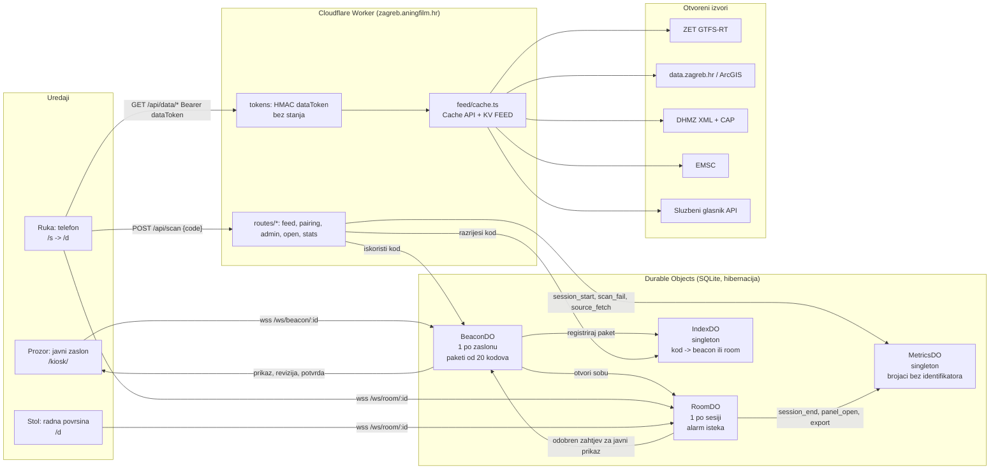

# Arhitektura na jednoj stranici

Kaj ima? je jedan Cloudflare Worker (`worker/index.ts`) sa statičkim datotekama (`app/dist`), pet Durable Object klasa sa SQLite pohranom, KV prostorom za posljednju dobru kopiju izvora i privatnim R2 spremnikom regionalne karte. Tehničko ime Workera i repozitorija ostaje `vidikovac`. Adresa je javna od 14. rujna 2026.; Cloudflare Access štiti samo operaterske rute `/api/admin/*` i `/stats`, odvojeno od sesije proizvoda. Kod je AGPL-3.0-or-later; izvorne licence podataka ostaju očuvane.

## Važeće promjene za Kaj ima?

- **Uparivanje:** ista mreža dopuštena je. Nema mrežnog HMAC-a ni zadanog razvojnog ključa. `SESSION_SECRET` obvezan je; administrativni testni prolaz zahtijeva `APP_ENV=test`.
- **Privremeni zasloni:** `POST /api/screens` stvara stvarni BeaconDO na 24 sata, s odabranim stajalištem. Quota je pet postava po pseudonimnom ključu i trideset ukupno u pomičnom satu; ključ je Access identitet kad ga zahtjev nosi, inače mreža s koje zahtjev dolazi (adresa ili prvih 64 bita IPv6 adrese, kroz HMAC tajnom sesije, pa redovi quote ne nose adresu). Ne pohranjuje se identitet ni adresa u izvornom obliku; redovi kvote nose HMAC prefiksa i brišu se nakon sat vremena. Isti BeaconDO/RoomDO put koriste privremeni i trajni zasloni.
- **Sesije:** deset minuta sa zaslona, pet minuta jednokratnog prosljeđivanja. Uklanjanje zaslona ne ukida izdanu sesiju. Rok sesije provjerava se i pri obradi poruke, ne samo alarmom.
- **Prikazivanje:** `BeaconDO` upravlja javnim prikazom neovisno o osobnim sobama. `RoomDO` provjerava pravo izravnog skenera pa prosljeđuje verzionirani zahtjev. Novi sken ne preuzima prikaz; preuzimanje traži potvrdu revizije, a uspjeh potvrdu stvarnog iscrtavanja.
- **Podaci:** `dateBasis`, pojedinačni `sources` i `coverage` čuvaju značenje datuma i neovisnu dostupnost. Djelomičan uspjeh ne briše posljednje valjane stavke drugog izvora. Njihova starost nije produljena novim dohvatom drugog izvora.
- **Klijent:** zajednički feed/view ugovori, stvarni odabir sloja i javne stavke, stabilno stanje kroz osvježavanja. Pretrage i privatne koordinate ne šalju se na zajednički zaslon. Mrežni zahtjev ograničen je na 15 sekundi.
- **Karta:** Protomaps v4 regionalni PMTiles arhiv u `vidikovac-maps`; dopuštene verzionirane putanje `/maps/zagreb-v1/{z}/{x}/{y}.mvt`. MapLibre 6.4.1, vlastiti glifovi i spriteovi, odvojena geometrija ZET mreže. Gibanje i dalje računa postojeći model.
- **Mjerenje:** aktivnosti privremenih zaslona vode se kao `evaluation`, odvojeno od brojača lokacija i izvoza Gradu. Nepripisiva odbijanja koda ne tumače se kao neuspjeh pilot-lokacije.
- **Postavljanje:** postojeći GitHub-povezani build; `workers_dev` i javni preview URL-ovi isključeni. Od 14. rujna 2026. adresa je javna, bez Cloudflare Accessa; `/api/admin/*` i `/stats` i dalje prihvaćaju samo zahtjev s valjanim Access JWT-om i svima ostalima odgovaraju 404.

## Tok podataka (feed)

Svaki izvor je modul (`worker/feed/modules/*.ts`) koji dohvaća, parsira i normalizira u `ModuleSnapshot` (`worker/feed/schema.ts`): `{ module, tier, status: live|stale|down, fetchedAt, sourceUpdatedAt, attribution, items[], sources?, coverage? }`. Cache API i KV `feed:<id>` čuvaju posljednje valjane podatke do `maxStale`. Neovisni izvori unutar modula imaju vlastita vremena i statuse; njihova uspješna prazna kolekcija nije isto što i nedostupan izvor. Klijent i `/hitno` razlikuju nepoznato stanje od potvrde da nema upozorenja. Cron (`*/5`) grije spore module. Tablica TTL-ova je u `docs/izvori.md`.

Dvije razine: `open` (sigurnosni sloj `/hitno`, teaser zaslona, `/open/*`) ne traži ništa; `session` traži `Authorization: Bearer <dataToken>`. Token je `base64url(roomId).expiresAt.base64url(HMAC-SHA256(SESSION_SECRET, roomId|expiresAt))` i provjerava se bez ijednog poziva u DO, pa anketiranje s telefona ne budi ništa.

## Model kretanja vozila (blizanac, plan `twin-engine`, 16. rujna 2026)

Matija, 12. rujna: oslanjamo se na rijetke podatke u stvarnom vremenu i pretpostavljamo da su, uz sva kašnjenja, pogrešni -- zato je pravilo da se prijavljena pozicija nikad ne prikazuje, nego se kretanje svakog vozila izračunava iz njegove vlastite povijesti očitanja, geometrije pruge i voznog reda, pa je gibanje glatko oko prijavljenih koordinata (R-P2). Matija, 16. rujna: motor mora poštovati fiziku pruge (tramvaj ne vozi unatrag i ne pretječe na istom kolosijeku), smjer mora biti poznat, vozila se moraju gibati od prve slike, a kad GPS ne stiže, motor se oslanja na prosjeke koje uči kroz dane (D1, D2). Iz toga je motor preseljen s klijenta na poslužitelj: jedan proces koji nadživi stranicu.

**Što ZET šalje.** GTFS-Realtime feed se objavljuje svakih 10 s (mjereno 16. rujna: zaglavlje raste za +10, oko dvije trećine vozila dobije novo očitanje po otkucaju), s `trip{tripId, routeId, startDate}`, `position{lat, lon}`, `vehicle{id}` i vlastitim `timestamp` -- bez smjera, brzine, stajališta i statusa (R-P3, R-TE1). Uz svako vozilo ide `TripUpdate` s idućim stajalištem (`stopSequence`, `stopId`, kašnjenje, često i vrijeme). Statični GTFS u `trips.txt` za svaku vožnju zna `direction_id`, odredište, oblik i blok; identifikatori vožnji iz feeda u stvarnom vremenu točno mu odgovaraju.

**Statični artefakti** (`scripts/gtfs-shapes.mjs`, `scripts/gtfs-trips.mjs`, ista `feed_version`, test to provjerava): `app/public/data/zet-network.json` (verzija 2) nosi **graf pruge**: ZET crta svih 100 tramvajskih oblika iz jednog skupa točaka osi kolosijeka (98 % odsječaka dijeli se bit za bit, kolosijeci dvaju smjerova su 3 do 6 m razmaknuti), pa su bridovi maksimalni nizovi odsječaka s istim skupom vlasnika, čvorovi njihovi krajevi, bridovi usmjereni (287 bridova, 209 čvorova); bliski dvostruki nacrti istog kolosijeka spajaju se (Hausdorff 2,5 m kroz 30 m i više, R-TE20), okreti i kratke petlje sažimaju (R-TE21), svaki tramvajski oblik postaje niz bridova, a obrasci bez oblika (linija 1) dobivaju sintetičku stazu najkraćim lancem kroz svoj slijed stajališta (R-TE22; 45 izgrađenih, 7 obilaznica bez staze); stajališta stoje na bridovima s točnim lukom (decimetri, R-TE23), autobusni oblici ostaju polilinije. `app/public/data/zet-trips.json` (R-TE16) je indeks vožnji: obrasci s redoslijedom stajališta i medijanom rasporednih sekundi između susjednih stajališta po satu, vožnje kodirane sažeto, blokovi. Oba artefakta dekodira `shared/motion/` (bez DOM-a), pa ih čitaju i Worker i klijent.

**Blizanac** (`worker/do/twin-do.ts`, jedan Durable Object). Budi se vlastitim alarmom u ritmu feeda (zaglavlje + 10 s + 1,5 s, pod 3 s, iznad 12 s, čisti otkucaj kad feed zastane 30 s; `worker/twin/clock.ts`), dohvaća okvir uvjetnim zahtjevom (`If-None-Match`; 304 ili isto zaglavlje = nema novog dokaza), i u jednom otkucaju (`worker/twin/tick.ts`): slaže očitanja u trag svakog vozila (najnovije po vozilu, nedatirano očitanje datirano zaglavljem, nova vožnja = novi trag, 300 s tišine = izbačeno), spaja `tripId` s indeksom (smjer, odredište, oblik, blok), **spaja na graf** (`shared/motion/match.ts`: kandidati su bridovi do 60 m, prvo oni na stazi vožnje, s kaznom 60 m za brid protiv posljednjeg pomaka, kaznom za nedostižnost preko 22 m/s × dt + 50 m i kaznom 40 m za točku iza idućeg stajališta iz `TripUpdate`; izvan staze tek nakon dvaju očitanja preko 60 m, izvan grafa nakon dvaju preko 150 m; autobusi se spajaju na svoje polilinije uz 25 m histereze i nikad na prugu; staza koja prolazi uz samu sebe, kružne linije i okretišta, nudi više najbližih točaka, pa smješteno vozilo bira među preklopima u dosegu posljednjeg luka, prvo smještanje po smjeru pomaka i idućem stajalištu, a pomak protiv smjera pruge je krivi preklop, R-TE45), procjenjuje **brzinu** (`speed.ts`, R-TE26, R-TE50, R-TE51: medijan posljednja tri pokretna razmaka čija su oba kraja izvan zone stajališta od 40 m, stajalište unutar razmaka od 25 s ili duljeg tereti jedno stajanje, a kad čistog razmaka nema govori najbrži od posljednja tri pokretna tempa), gradi **plan** (`plan.ts`, R-TE27/R-TE29/R-TE46 do R-TE49: čvorovi (t, s) monotoni u oboje, 20 s unatrag i 90 s unaprijed, sidro u posljednjem spoju, do idućeg stajališta po ZET-ovu vremenu ako je unutar [0,5×, 2×] kinematičke procjene, inače vlastitom brzinom prvih 15 s pa očekivanim vremenom dionice, stajanje po naučenom ili zadanih 20 s, vozilo koje stoji izvan perona stoji još otprilike koliko je stajalo, stajanje koje je prešlo predviđeno završava otkucaj kasnije, vožnja čiji red polaska nije došao čeka, dalje po očekivanim vremenima, kraj staze je okretište na kojem se čeka promjenu vožnje; tišina ne zaustavlja plan (D2), nego mu pouzdanost drži 30 s, prepolavlja svakih 60 s i gasi na 300 s), pa **zakone** jednom nad svim tramvajima (`laws.ts`, R-TE7/R-TE28: na dijeljenom usmjerenom bridu sljedbenik ostaje 35 m iza vođe u svakom čvoru; kad svježe očitanje to prekrši, miče se onaj sa starijim dokazom -- svježe očitanje sljedbenika gura vođu naprijed, svježe očitanje vođe zadržava sljedbenika; par unutar 35 m je neuređen; vozilo bez očitanja dulje od 20 s nikoga ne sputava; zamjena redoslijeda priznaje se tek nakon tri uzastopna proturječna očitanja s vođom do 40 m od stajališta ili kraja staze; odnos koji sama očitanja proturječe za više od 300 m odbacuje se i uspostavlja iznova, a zadržavanje nikad ne ide iza vlastitog očitanja, R-TE52; čvorovi tramvaja nikad ne padaju, jedini okret je promjena vožnje; autobusi su izuzeti), zatim **ocjenu unatrag** (`hindsight.ts`, R-TE31: svako svježe očitanje mjeri se protiv planova objavljenih 10, 30 i 60 s ranije, greška po luku u razrede do 25, 50, 100, 200 i preko 200 m, jednim skupnim upisom `twin_hindsight` po otkucaju), pamti stanje u tri retka SQLite-a (R-TE32) i sirovi okvir u R2 (`vidikovac-feed`, sedam dana), i **objavljuje** modul `zet-rt`: položaj svakog vozila je plan u trenutku zaglavlja (R-TE13), `motion` nosi stazu i čvorove plana (decimetri, cijele sekunde), `data` nosi smjer, odredište, oblik, iduće stajalište, kašnjenje te vlastitu brzinu, pouzdanost i stajanje (R-TE1, R-TE2). Predmemorija modula vrijedi do idućeg otkucaja (`validUntil`, R-TE4); status snimke je zdravlje blizanca, ZET-ova tišina piše se u `sources.zet` (R-TE5). Vozni red daje dionicama vrijeme po satu (`times.ts`); nula stajanja u ZET-ovu redu znači "nepoznato", pa se zadano stajanje knjiži iz dionice (R-TE34). **Učenje** (`shared/motion/learn.ts`, R-TE39 do R-TE44): svaki otkucaj iz svježih očitanja tramvaja izvlači dokaze -- vožnju po bridu iz para čistih očitanja (oba izvan zone stajališta, bez perona između) i stajanje iz niza očitanja na stajalištu omeđenog čistima, kojemu se odbije putovanje ocijenjeno po naučenim bridovima ili po vlastitoj združenoj vožnji vozila (nikad po jednom kratkom paru) -- i broji ih u logaritamske histograme od 32 razreda (1 do 1800 s) po bridu odnosno stajalištu, satu i vrsti dana; planer čita medijan gdje je ćelija punija od deset uzoraka (tanka ćelija posuđuje od druge vrste dana, pa susjednih sati), inače vozni red; nakupljena minuta ide u SQLite (`edge_time`, `stop_dwell`) jednom u minuti u jednoj transakciji, a do tada putuje u retku stanja, pa izbacivanje objekta ništa ne gubi.

**Klijent** (`app/src/motion/integrator.ts`, R-TE35) više ne procjenjuje: čita plan i geometriju (stazu iz artefakta, autobusnu poliliniju ili slobodnu ravninu) i svaku sliku konvergira iscrtani luk prema planu u tom trenutku, nikad skokom (τ 1,5 s naprijed, 4 s natrag; unatrag najviše 1 m/s i 30 m po planu za tramvaj; mrtva zona 1 m; smirivanje max(6, 1,5 × v) m/s pod 50 m razmaka, sustizanje max(8, 2 × v) iznad; jedna slika integrira najviše 0,25 s, pa parkirana petlja sustiže kroz slike); sljedbenika na istoj geometriji drži 35 m iza vođe; pouzdanost je blizančeva, oslabljena starošću plana; smjer je tangenta staze iznad 0,3; izbacivanje na 300 s. Prije nego artefakt stigne crta se blizančev položaj i miruje. Oba iscrtavanja (MapLibre karta `app/src/map/*`, dvoplatna shema `app/src/motion/schematic*.ts`) i kartice čitaju isti `Drawn`; kartica piše "smjer {odredište}" i "sljedeće stajalište {ime}" iz spoja (R-TE38), a rečenica ispod sheme glasi: "Položaj je izračunat iz vlastitih očitanja svakog vozila, geometrije pruge i voznog reda; ZET ne objavljuje smjer ni brzinu." Anketiranje: promet svakih 10 s poravnato s `validUntil` (1,5 s poslije) ili s fazom feeda (+3,5 s), ostali moduli svojim ritmom od 30 s (R-TE4); klijent zadržava kretanje na snimci `stale`, miruje samo na `down` (R-TE5).

**Provjera.** Jedinični testovi na sintetičkom koridoru sa simulatorom (`test/motion/simulator.ts`): šest tramvaja, 20 minuta, šum 8 m, 2 od 3 osvježenja po otkucaju, kašnjenje 2 do 25 s -- 0 pretjecanja, 0 vožnji unatrag, smjer poznat nakon prvog očitanja, svaki prvi plan u pokretu, ocjena unatrag na 30 s p95 41 m (R-TE30; 32 m prije kruga E, jer simulator vozi točno po voznom redu pa nagrađuje red i kažnjava vlastitu brzinu, obrnuto od živog feeda). Mjera od zapisa za promjene motora je ponavljanje snimljenih živih okvira kroz pravi `runTick` (R-TE53), ne simulator. Radni testovi voze cijele otkucaje blizanca kroz `runDurableObjectAlarm`. `/stats` pokazuje otkucaje po ishodu (`twin_tick`), ocjenu unatrag po horizontu i razredu te provjeru statičnog GTFS-a (`static_watch`, R-TE18); ponavljanje snimljenih okvira iz R2 istim mjerilima opisuje `docs/kaj-verification.md`.

| Konstanta | Vrijednost | Razlog |
|---|---|---|
| Otkucaj / jastuk / pod / strop / zastoj (`worker/twin/clock.ts`) | 10 / 1,5 / 3 / 12 / 30 s | ZET objavljuje svakih 10 s i datoteka se pojavi unutar sekunde od svog zaglavlja; pod čuva izvor od naleta ponovljenih alarma, strop od zaglavlja s krivim satom, zastoj vraća čisti ritam kad zaglavlje više ništa ne govori. |
| `NEAR_M` / `DIRECTION_PENALTY_M` / `REACH_PENALTY_M` + `REACH_SLACK_M` / `PAST_NEXT_STOP_PENALTY_M` (`match.ts`) | 60 / 60 / 60 + 50 / 40 m | Očitanje dalje od 60 m nije na tom bridu; brid protiv posljednjeg pomaka je drugi kolosijek; točka koju vozilo nije moglo dostići brzinom 22 m/s je krivi brid; točka iza stajališta koje `TripUpdate` tek najavljuje je vjerojatno krivi smjer. |
| `BACK_WINDOW_M` / `ARC_PRIOR_WEIGHT` / `NEXT_STOP_DISTANCE_WEIGHT` / `FOLD_MOVE_M` (`match.ts`, R-TE45) | 60 m / 0,5 / 0,01 / 50 m | Staza koja prolazi uz samu sebe (kružne linije 9 i 17, okretišta, kružni autobusi) nudi više najbližih točaka: smješteno vozilo bira među preklopima u dosegu posljednjeg luka (60 m unatrag, 22 m/s × dt + 50 m naprijed) po odstupanju plus pola metra po metru luka od očekivanog položaja; prvo smještanje po odstupanju, smjeru pomaka i stajalištu koje ZET najavljuje (jedan centimetar po metru luka prije njega, pa preklop čiji je peron idući pobjeđuje onaj krug ranije); 50 m pomaka protiv smjera pruge je krivi preklop, ne šum. |
| `OFF_PATH_FIXES` / `OFF_GRAPH_M` / `OFF_GRAPH_FIXES` / `BUS_HYSTERESIS_M` | 2 / 150 m / 2 / 25 m | Jedno očitanje pored staze je šum, dva su obilazak; 150 m od svakog brida je izvan pruge (petlja okretišta, spremište, radovi); autobus ne mijenja poliliniju bez 25 m prednosti. |
| `DEAD_ZONE_M` / `MAX_SPEED_MS` / `SPEED_INTERVALS` / `STOP_ZONE_M` / `DWELL_CHARGE_S` / `CHARGEABLE_INTERVAL_S` (`speed.ts`, R-TE26, R-TE50, R-TE51) | 15 m / 22 m/s / 3 / 40 m / 20 s / 25 s | Ispod 15 m je šum GPS-a; 22 m/s ostavlja zraka najbržem autobusu; medijan triju razmaka guši jedan loš; razmak čiji kraj stoji uz stajalište ne govori o vožnji; stajalište unutar razmaka stoji ~20 s, ali razmak kraći od 25 s ne može sakriti stajanje (vozilo bi bilo viđeno na peronu), pa se na njemu ništa ne tereti; kad nijedan razmak nije čist od zone stajališta, govori najbrži od posljednja tri pokretna tempa (luk kroz vrijeme, sa stajanjima: donja granica vožnje). |
| `PLAN_PAST_S` / `PLAN_AHEAD_S` / `DWELL_DEFAULT_S` / `DEFAULT_CRUISE_MS` (`plan.ts`) | 20 / 90 s / 20 s / 8 m/s | Plan pokriva klijentovo poravnanje unatrag i devet otkucaja unaprijed; ZET-ovo gradsko stajanje traje 15 do 30 s (mjereno na živom feedu 16. rujna: medijan raspona između prvog i posljednjeg očitanja na peronu 15 s za tramvaj, 11 s za autobus, čemu se dodaje do jednog razmaka na svakom kraju); 8 m/s je gradska brzina kad ništa drugo nije poznato. |
| `ETA_BAND` / `OWN_SPEED_HOLD_S` / `ETA_SLACK_S` (R-TE46) | [0,5×, 2×] / 15 s / 10 s | ZET-ovo vrijeme dolaska vjeruje se kad je unutar pola do dvostrukog kinematičkog; vlastita brzina je dokaz o sadašnjosti i vrijedi 15 s od sidra, zatim dionicu vozi njezino uobičajeno vrijeme (miješanje s prosjekom voznog reda, koji u sebi nosi svaki semafor i peron, podcjenjivalo je svako vozilo u pokretu: planirano 4,2 m/s naspram izmjerenih 11,3 m/s); deset sekundi je zrno ZET-ovih vremena. |
| `STAND_HOLD_MIN_S` / `STAND_HOLD_MAX_S` / `STAND_EXTEND_S` / `TRIP_START_MAX_AHEAD_S` (`plan.ts`, R-TE47 do R-TE49) | 10 / 40 s / 12 s / 45 min | Vozilo koje stoji izvan perona (semafor, kolona, kolosijek za odmor) stajat će još otprilike koliko je već stajalo, između jednog otkucaja i ciklusa semafora; stajanje na peronu koje je već prešlo predviđeno završava otkucaj kasnije, ne "sada" (to "sada" ponavljano svakim otkucajem griješi za cijeli pogled unaprijed); vožnja čiji red polaska (početak iz indeksa na dan iz `startDate`, plus ZET-ovo nenegativno kašnjenje) još nije došao čeka gdje stoji, do 45 minuta unaprijed, jer ZET-ov `TripUpdate` na okretištu ne nosi buduće vrijeme polaska. |
| `SILENCE_HOLD_S` / `SILENCE_HALFLIFE_S` / `EVICT_S` | 30 / 60 / 300 s | Tri otkucaja tišine su obično kašnjenje; potom se pouzdanost prepolavlja svake minute i gasi na pet, kad se vozilo izbacuje (R-F2 nepromijenjen). |
| `CONFIDENCE_ON_GEOMETRY` / `CONFIDENCE_SINGLE_FIX` / `CONFIDENCE_FREE_CAP` | 0,9 / 0,6 / 0,5 | Spoj na graf s poviješću je gotovo siguran; jedno očitanje na geometriji već zna smjer (spoj s indeksom); slobodna ravnina nikad ne prelazi pola. |
| `HEADWAY_M` / `SILENT_AFTER_S` / `CONCESSION_FIXES` / `CONCESSION_NEAR_STOP_M` / `SWAP_LIMIT_M` (`laws.ts`, R-TE52) | 35 m / 20 s / 3 / 40 m / 300 m | Jedan tramvaj dug; vozilo koje šuti dva otkucaja ne smije zaustavljati druge; tri proturječna očitanja uz stajalište ili okretište su stvarna zamjena (kratki obrat, povlačenje); odnos koji sama očitanja dvaju vozila proturječe za više od dva razmaka stajališta nije zamjena nego odnos koji je prestao značiti (vođa je pod istim brojem vozila počeo iduću vožnju na početku kruga), pa se odbacuje i uspostavlja iznova iz planova; zadržavanje nikad ne stavlja sljedbenika iza njegova vlastitog očitanja. |
| Ocjena unatrag: prsten planova / horizonti / razredi (`hindsight.ts`) | 7 / 10, 30, 60 s / <25, <50, <100, <200, ≥200 m | Sedam planova pokriva minutu; horizonti su jedan, tri i šest otkucaja; razredi su ono što oko na karti razlikuje. |
| Integrator: τ / unatrag / mrtva zona / smirivanje / sustizanje / slika / razmak (`app/src/motion/integrator.ts`) | 1,5 s, 4 s / 1 m/s, 30 m / 1 m / max(6, 1,5 v) / max(8, 2 v) / 0,25 s / 35 m | Naprijed je nastavak vožnje, natrag ispravak; tramvaj vidljivo ne vozi unatrag; ispod metra nema što ispravljati; oznaka mora sustizati metu koja se i sama giba; parkirana petlja ne smije sletjeti odjednom; sljedbenik ostaje iza vođe i na klijentu. |
| Anketiranje: otkucaj / jastuk faze / jastuk `validUntil` / ostali moduli (`app/src/motion/loop.ts`, `dashboard.ts`) | 10 s / 3,5 s / 1,5 s / 30 s | Klijent slijeće poslije blizanca i ruba; jedini zahtjev koji nosi nove dokaze ubrzava, ostali ne (R-TE4). |

## Shema linija

Promet ima dva iscrtavanja istih planova: gradsku kartu i ZET-ovu shemu.
`scripts/zet-schema.mjs` čita izvorni `zet-zagreb-tram-lines-map.svg`, slaže sve
ugniježđene transformacije u koordinatni sustav stranice, dekodira nazive iz
znakova fonta i stvara `app/public/data/zet-schema.json`. Izvorni SVG ne ide u
javnu imovinu. Na platnu ostaju linije, stajališta, nazivi i voda, bez zaglavlja,
legende, logotipa, popisa brojeva na krajevima i bijelih oznaka koje prekrivaju
linije. Krivulje vode se uzorkuju i pojednostavljuju, polilinije linija ostaju
izvorni vrhovi.

Artefakt verzije 1 ima 19 linija (15 dnevnih i četiri noćne) te istu oznaku
`feedVersion` kao mreža i indeks vožnji. Ponovna gradnja istih ulaza daje iste
bajtove; `builtAt` je datum ugrađene mreže, ne trenutno vrijeme naredbe.
`npm run build:schema` ispisuje dokaze identiteta, pokrivenost stajališta i
staza; `node scripts/zet-schema.mjs --check` ne piše ništa i pada ako je
ugrađeni artefakt zastario. `--verbose` daje svaku pojedinačnu poveznicu.

**Identitet i iznimke.** Boja nije identifikator: dvije linije imaju istu boju,
a četiri noćne linije istu tamnoplavu. Svaka linija ima glasove obojenih brojčanih
oznaka i provjerene krajnje točke uz terminalne kružiće. Povijesni nacrt i
GTFS 000395 nemaju uvijek iste krajnje stanice; svaka takva odluka imenovana je
u `scripts/zet-schema-overrides.json`. Kratka linija 15 u izvorniku ima samo
jednu obojenu oznaku: ta je iznimka zapisana uz obje krajnje točke, bez
pretvaranja crnih popisa u dodatne glasove. Nazivi zadržavaju dijakritike;
skraćenice se spajaju samo prema pravilima iz skripte ili imenovanom aliasu.
Od 122 GTFS naziva 114 se spaja, osam kojih u starijoj shemi nema izričito je
popisano. Pet naziva koje nacrt ima, a ugrađena mreža nema, ostaje kao kontekst.

**Smještaj vozila.** Integrator izlaže postojeći indeks staze `Drawn.path` i luk
`Drawn.s`, poslije vlastitog ograničenja reda vozila. Ni plan, ni brzina, ni
pravila motora time se ne mijenjaju. `shared/motion/schema.ts` priprema tablicu
po pojavljivanju stajališta na stazi, ne po samom nazivu; lokalne višestruke
projekcije istog perona sažimaju se, stvarni kasniji prolazak ostaje zaseban.
Između dvaju susjednih podudarnih stajališta interpolira se luk nacrtane linije;
preskočene stanice daju ravnu spojnicu bez tangente. Prije prvog i poslije
zadnjeg podudarnog stajališta položaj se zadržava na kraju. Predznak smjera
dolazi iz tablice, nikad iz `direction_id`. Nema bočnog pomaka po smjeru.
Autobusi, slobodna ravnina i staze s manje od dva podudarna stajališta nisu
iscrtani. Za ugrađenu mrežu 139 od 145 staza ima smještaj; šest kratkih ili
depo-staza s nedovoljno pokrivenosti imenovano je u istom overrides dokumentu.
Svaka monotona dionica provjerava se zasebno, pa povratni prolazak ostaje
valjan umjesto da se briše drugi dio staze.

**Prikaz.** `schema-map.ts` implementira isti `CityMapHandle`. Osnovni nacrt i
vozila su na odvojenim platnima; statika se ne crta ponovno za svaku sliku.
`schematic-view.ts` dijeli pristupačan popis, tipkovnički izbor i čuvanje
fokusa između geografskog i novog koordinatnog sustava. Izbor na shemi
otvara postojeći list prijevoza, ne dijalog. Nazivi koriste Manrope i postaju
vidljivi od 1,4 CSS px po jedinici izvornika (oko 11px za izvornih 7,92).
Javni zaslon kadrira svoje stajalište na čitljivoj skali, s podom naziva 24px;
bez prepoznatog stajališta pokazuje cijelu mrežu bez naziva. Početni kadar
obuhvaća zadržanu geometriju, ne praznine uklonjenog zaglavlja i legende.
Povlačenje, pinch, kotačić i dvostruki dodir rade kroz Pointer Events;
`+`, `-`, `0` mijenjaju skalu, Shift i strelice pomiču kadar, obične strelice
biraju vozila. Skala je ograničena na početni fit do 8× fit, bez inercije.

Preferencija `kajima:map-mode:v1` vrijedi samo na uređaju (`map` ili `schema`,
zadano `map`). Na zaslonu `?prikaz=shema|karta` ima prednost i preživljava
čišćenje jednokratnog fragmenta. Promet mijenja map-slot, oslobađa stari
renderer i pamti zadnju geografsku kameru. Shema i njezina imovina učitavaju
se dinamički; lagano ih nikada ne dohvaća. Kvart se otvara kao zasebni pogled,
bez stalne druge karte uz radni prostor. `stale` nastavlja plan, samo `down` zaustavlja
slike; pauza sesije i uništavanje čiste petlju, događaje i zakašnjele dohvate.

### Autobusi: predaja

Autobusi i dalje voze po vlastitim polilinijama, bez tramvajskih zakona reda
i bez učenja. Nakon horizonta vlastite brzine slijedi `DEFAULT_CRUISE_MS`,
jer `TimesProvider` iz `times.ts` povezuje rasporede samo s tramvajskim stazama.
Budući zasebni krug dodao bi provider voznog reda za autobusne oblike iz
indeksa vožnji i učenje na tim oblicima (R-TE44). Uspjeh se mjeri ponavljanjem
snimljenih okvira, s mjerilom odvojenim po vrsti vozila (R-TE53).
Vlasnik je autobusni krug odgodio; nije dio sheme ni ove isporuke.

## Tok uparivanja

1. Zaslon se spaja na `/ws/beacon/<beaconId>`; `BeaconDO` šalje nonce, zaslon odgovara `HMAC(secret, nonce)`. Nakon uspjeha `BeaconDO` kuje paket od 20 kodova po 30 s (Crockford base32, 8 znakova, 40 bita), registrira ga u `IndexDO` jednim pozivom i šalje zaslonu s `serverNow`. Zaslon rotira po zidnom satu i traži novi paket kad ostanu tri.
2. Telefon skenira `https://zagreb.aningfilm.hr/s/#ABCD-EFGH` i šalje `POST /api/scan {code}`. Kod iz fragmenta ne ide u URL mrežnog zahtjeva. Provjere vremenskog prozora, jednokratnosti, opoziva i učestalosti ostaju iste. `BeaconDO` otvara desetominutni `RoomDO` i na poslužitelju ga veže uz zaslon. Zaslon s `presentationVersion: 1` dobiva samo potvrdu pristupa `{t:'paired'}`; sadržaj se ne mijenja. Ulaznice za stariji protokol ostaju radi kompatibilnosti.
3. Telefon izravno ulazi u sobu i dobiva ulogu, rok, `resumeToken`, `dataToken` te stanje prikaza. **Zaslon** šalje `{t:'present', command}` s verzijom, ključem ponavljanja i očekivanom revizijom. Soba dopušta samo izravnom skeneru zahtjev prema svojem zaslonu. `BeaconDO` serijalizira promjene, traži izričito preuzimanje zauzetog zaslona i šalje javni cilj autentificiranoj vezi zaslona. Tek `{t:'presented'}` potvrđuje iscrtavanje. Pretraga, spremljeni popisi i koordinate uređaja nisu dio dopuštenog cilja.
4. `share` i dalje izdaje zasebnu petominutnu sobu bez upravljanja zaslonom i bez daljnjeg dijeljenja. Alarm osobne sobe provodi `live → warned60 → warned20 → closed`, upozorenja na 60 i 20 sekundi i brisanje po isteku. `BeaconDO` zasebno provjerava rok prikaza, vraća javni pregled i čisti privremene veze i potvrde zahtjeva. Zamrznuti osobni pogled ostaje atributirana snimka s izvozom.

### Ugovor prikazivanja

`worker/presentation.ts` odvaja `PresentationTarget` od privatnog `ViewState`.
Cilj sadrži poznato područje ili `kvart`, opcionalni javni izbor, poznatu
gradsku četvrt i vremenski raspon. Nema HTML-a, slobodnog teksta ili kamere.
Klijent šalje očekivanu reviziju i `requestId`; ponavljanje već prihvaćenog
zahtjeva ne vraća nadjačani sadržaj. Statusi su `idle`, `pending`, `displayed`
i `unavailable`. Osam sekundi bez potvrde nije uspjeh.

Na novoj vezi zaslona revizija se poveća i traži se nova potvrda iscrtavanja;
zakašnjela potvrda stare veze ne može potvrditi nov renderer. Token za podatke
aktivnog prikaza šalje se samo autentificiranom zaslonu. Korisnici vide
`self` ili `other`, ne identitet druge osobe. Nema nove javne HTTP rute ni
novih Cloudflare resursa; dodane tablice nalaze se u postojećem `BeaconDO`.
Potvrda prati stvarno iscrtani predmet i nakon prvog prikaza: uklonjena stavka
postaje `unavailable`, a povratak izvora može vratiti `displayed` bez preuzimanja
ili nove revizije. Neizmijenjene potvrde ne šalju se na svakom otkucaju.
Nova postava zaslona u istom pregledniku dobiva vlastiti slijed revizija.

## Što se pohranjuje

Registar zaslona čuva id, tajnu za postavljanje, vrstu, četvrt, oznaku i javno
stajalište. Tajna ostaje u izvornom obliku jer se njome ključa HMAC izazova
(`BEACON_AUTH` u `worker/protocol.ts`). Redovi soba žive do deset minuta, kodovi
do pet minuta nakon isteka. `BeaconDO` čuva aktivni javni cilj, njegovu reviziju,
stanje iscrtavanja, rok te privremenu vezu s ovlaštenom sobom. Veze soba i
ključevi ponavljanja zahtjeva čiste se po isteku; prestankom prikaza uklanja se
cilj i vlasnik, a ostaje revizija potrebna za odbijanje zakašnjelih zahtjeva.

Brojači `(dan, sat, dogadaj, dim1, dim2) → broj` koriste zatvorene rječnike.
Adresa prolazi kroz ograničivače na rubu Cloudflarea i, kao HMAC prefiksa, kroz
satnu kvotu samoposlužnih zaslona; redovi kvote ne nose izvornu adresu i žive
najviše sat vremena. Nema trajnog identifikatora osobe ili uređaja, povijesti
privatnog pregledavanja, privatne pretrage, GPS-a telefona ili kolačića za praćenje.

To nije tvrdnja da sustav ne čuva javne koordinate: predmemorija izvora, GTFS
artefakti i model kretanja gore opisan čuvaju javnu geografiju i podatke vozila,
ne lokaciju korisnika. Privici WebSocket veza čuvaju stanje autentifikacije,
verziju protokola ili ulogu sudionika potrebnu za tu kratkotrajnu vezu.

## Granice i ograničenja

`RL_SCAN` 10/60 s po IP-u, `RL_DATA` 240/60 s po tokenu, `RL_OPEN` 120/60 s po IP-u; `BeaconDO` usporava 60 s nakon 20 neuspjelih pokušaja; brojane sesije najviše 30 na sat i 200 na dan po zaslonu (višak se bilježi kao `over_cap` i ne ulazi u skup za Grad). Tijela zahtjeva su ograničena, `run_worker_first` drži statiku izvan Workera.

## Kasnije

- **Web push obavijesti nisu dio ovog plana.** List "Obavijesti" (`kajima:notify:v1`, lokalna pohrana) nudi četiri prekidača (kašnjenja na spremljenim linijama, radovi u kvartu, odvoz sutra, upozorenja DHMZ-a) koji danas samo ističu odgovarajuću pločicu na vremenskoj traci ovim istim uređajem, bez ičega poslanog ikamo ("Ništa se ne šalje..." u listu). Kad worker dobije rutu za Web Push (anonimna `subscriptions` KV po hashu push-krajnje točke, bez identiteta ili adrese), rečenica u listu se mijenja s te izjave na obećanje stvarne dostave, a svaki prekidač prije prve pretplate dobiva korak traženja dopuštenja preglednika (`Notification.requestPermission()`), s objašnjenjem što se događa kad je dopuštenje odbijeno ili već uskraćeno.

## Postavljanje

Deploy je `git push` (Workers Builds); `wrangler` služi samo za `secret put`, `kv namespace create` i `tail`. Runtime varijable žive u Cloudflareu (`keep_vars`): `SESSION_SECRET` (obvezna, bez ugrađene zamjene), `SESSION_MINUTES=10`, `PEER_MINUTES=5`, `CODE_ROTATE_SECONDS=30`, `CF_ACCESS_TEAM_DOMAIN`, `CF_ACCESS_AUD`. `SCAN_TURNSTILE` je deklariran za Turnstile iza zastavice (M1), a kod ga još ne čita; `NETWORK_CHECK` i `NET_KEY_SECRET` su umirovljeni: kod ih zanemaruje, a stara postava ih smije zadržati.
