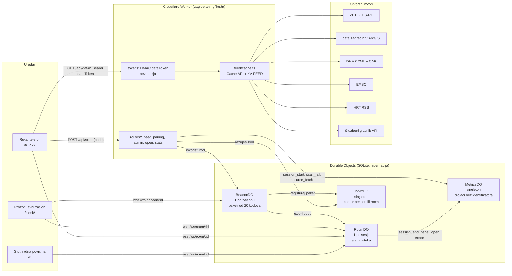

# Vidikovac Stage 1 Implementation Plan

> **For agentic workers:** REQUIRED SUB-SKILL: Use superpowers:subagent-driven-development (recommended) or superpowers:executing-plans to implement this plan task-by-task. Steps use checkbox (`- [ ]`) syntax for tracking.

**Goal:** Ship the stage-1 prototype of Vidikovac on zagreb.aningfilm.hr by 15 September 2026: a presence-unlocked, ten-minute, real-time dashboard of Zagreb on open data with rotating-QR public screens, an always-open safety tier, identifier-free counters, and the grant documents for the 16 September filing.

**Architecture:** One Cloudflare Worker (`worker/index.ts` dispatcher) serves a vite-built multi-page app from static assets and answers `/api/*`, `/ws/*`, `/hitno`, `/open/*` and `/stats` itself. Four SQLite Durable Objects carry the mechanic: `BeaconDO` per public screen mints batches of rotating codes, `RoomDO` per session holds both devices' WebSockets and the expiry alarm chain, `IndexDO` resolves codes, `MetricsDO` keeps `(day, hour, event, dim1, dim2) -> count`. A feed layer normalises nine open sources into one `ModuleSnapshot` shape with Cache API TTLs and a KV last-good copy, so panels are always live, honestly stale, or down, never blank. The browser app has three surfaces from one codebase: phone (`/s`, `/d`), kiosk (`/kiosk`) and desktop.

**Tech Stack:** TypeScript strict, Cloudflare Workers with static assets, Durable Objects (SQLite, WebSocket hibernation, alarms), KV, Rate Limiting bindings, vite multi-page build, vitest (`unit` project) and `@cloudflare/vitest-pool-workers` (`workers` project), Playwright two-context e2e, `gtfs-realtime-bindings`, `fast-xml-parser`, `uqr`, MapLibre GL, Remotion for the demo video. Deploy is `git push` to `main` (Workers Builds); never `wrangler deploy`.

**Spec:** `docs/superpowers/specs/2026-09-11-vidikovac-design.md` (approved 11 Sept 2026; the plan argues from it). Contracts every task must use verbatim: `worker/feed/schema.ts` (ModuleId, Tier, FeedItem, ModuleSnapshot, ModuleSpec, FetchContext) and `worker/protocol.ts` (CODE_ALPHABET, CODE_LENGTH, CODES_PER_BATCH, CODE_EARLY_MS, CODE_GRACE_MS, CodeSlot, ScanRequest, ScanOk, ScanFail, ScanError, Beacon and Room message unions, CLOSE_SESSION_EXPIRED, LayerId, LAYERS, ClientEvent, ServerEvent).

## Global Constraints

- Repository `D:\scratch\vidikovac`, GitHub `matijarma/vidikovac`, branch `main` is production; every push deploys. Commit after every green task.
- Node >= 22 (local 25), npm with `package-lock.json`, wrangler 4, TypeScript strict, `"type": "module"`.
- Worker config is `wrangler.jsonc`: assets `app/dist` with `run_worker_first` for `/api/*`, `/ws/*`, `/hitno`, `/hitno/*`, `/open/*`, `/stats`, `/stats/*`; DO bindings `BEACON_DO`, `ROOM_DO`, `INDEX_DO`, `METRICS_DO` (migration `v1`); KV `FEED` (id `8cb66336f0424a8ea1246bfc6a4ae29b`); rate limiters `RL_SCAN` 10/60 s, `RL_DATA` 240/60 s, `RL_OPEN` 120/60 s; cron `*/5 * * * *`; custom domain `zagreb.aningfilm.hr`; `keep_vars: true`.
- Runtime values come from `worker/config.ts`: `sessionMinutes(env)` default 10, `peerMinutes(env)` default 5, `codeRotateSeconds(env)` default 30, `networkCheck(env)` in `enforce | warn | off` default `enforce`. Secrets `SESSION_SECRET` and `NET_KEY_SECRET` are set with `wrangler secret put`, never committed; `.dev.vars` (ignored) holds dev values, `.dev.vars.example` documents them.
- File ownership for parallel work: Area A `worker/feed/**` (not `schema.ts`), `worker/routes/feed.ts`, `test/feed/**`; Area B `worker/pairing/**`, `worker/do/**`, `worker/routes/pairing.ts`, `worker/routes/admin.ts`, `worker/metrics.ts`, `worker/metrics-do.ts`, `test/pairing/**`; Area C `app/**`, `vite.config.ts`, `app/tsconfig.json`; Area D `worker/routes/open.ts`, `worker/routes/stats.ts`, `worker/hitno/**`, `worker/open/**`, `worker/stats/**`, `worker/security-headers.ts`, `app/public/_headers`, `test/open/**`; Area E `e2e/**`, `playwright.config.ts`, `docs/**`, `scripts/**`, `README.md`, `video/**`. `worker/index.ts` is the dispatcher already in place: it calls `handleFeed`, `handlePairing`, `handleAdmin`, `handleOpen`, `handleStats` (each `(request, env, ctx, url) => Promise<Response | null>`), falls back to `env.ASSETS.fetch`, and `scheduled()` calls `warmFeeds(env, ctx)` from `worker/feed/cache.ts`.
- Cross-area interfaces: `verifyDataToken(env: Env, token: string): Promise<{ roomId: string; expiresAt: number } | null>` in `worker/pairing/tokens.ts` (Area B, consumed by A); `getModules(env: Env, ctx: ExecutionContext, ids: ModuleId[]): Promise<ModuleSnapshot[]>` and `getModule(env, ctx, id)` in `worker/feed/cache.ts` (Area A, consumed by D); `recordMetric(env: Env, event: ServerEvent, dim1?: string, dim2?: string): void` in `worker/metrics.ts` (Area B, consumed by D); `verifyAccess(env: Env, request: Request): Promise<boolean>` in `worker/pairing/access.ts` (Area B, consumed by D), honouring `E2E_ADMIN_BYPASS` only when `networkCheck(env) === 'off'`.
- Every upstream fetch sends `User-Agent: Vidikovac/0.1 (zagreb.aningfilm.hr; kontakt@aningfilm.hr)` and times out at 6 s. Attribution strings are the ones in the spec, section "3. Privacy, counting, licences, WCAG", rendered in every panel footer, on `/izvori`, on the kiosk teaser and in every export.
- Privacy: no cookies, no IP or user agent stored, `netKey` only in the kiosk socket attachment, counters only from closed vocabularies. Croatian-first copy with singular imperatives (Skeniraj, Kopiraj, Podijeli), never "Vi". WCAG 2.2 AA except the declared time-limit deviation.
- Licence AGPL-3.0-or-later; ported psdlat files keep their headers.

---


## Area A: Feed layer and modules

I'll start by reading the plan, rulings, and contract files.

Now let me read the contract files.

Now the fixtures.

# Area A: feed layer (nine sources, cache, registry, `/api/*` routes)

**Area overview.** Area A turns nine unrelated upstream formats (GTFS-Realtime protobuf, CAP 1.2 XML, two DHMZ XML dialects, CKAN JSON, ArcGIS GeoJSON, EMSC GeoJSON, two RSS feeds, a gazette JSON gateway) into one `ModuleSnapshot` shape and serves them under three rules: every panel is **live**, honestly **stale** or **down**, never blank; every upstream call carries `User-Agent: Vidikovac/0.1 (zagreb.aningfilm.hr; kontakt@aningfilm.hr)` and dies at 6 s; open-tier modules never need a token and session-tier modules always do. The layer is three files of plumbing (`worker/feed/http.ts`, `xml.ts`, `time.ts`), one registry that is the single source of truth for tier, TTL, `maxStale` and the R-08 attribution strings, one cache module that owns the Cache API + KV last-good state machine and the `source_fetch` counter, nine module files that are pure parse functions wrapped in a thin fetcher, and `worker/routes/feed.ts`. Two deliberate structural decisions: (1) module fetchers return a small `FeedPayload` (`items` without `module`/`tier`, plus `sourceUpdatedAt`) and the registry's `defineModule` stamps `module`, `tier`, `fetchedAt` and `attribution` onto every snapshot and every item, so a module can never disagree with the registry; (2) `getModule`/`getModules`/`warmFeeds` take an optional trailing `FeedCacheDeps` (`now`, `recordMetric`) and `handleFeed` takes an optional trailing `FeedDeps`, mirroring Area D's injection style (R-04 binds only Area D), so every test is deterministic without mocking the module graph — the cross-area contract signatures `getModule(env, ctx, id)`, `getModules(env, ctx, ids)`, `warmFeeds(env, ctx)` and `RouteHandler` are unchanged. Two artefacts to report under Rulings (R-09 procedure): `ModuleSnapshot.staleSince` is documented in `schema.ts` as "the moment the live fetch first failed", but the only defensible window for `maxStale` is measured from the last good `fetchedAt` (otherwise a source that was cached hours ago and fails once would still be served), so `staleSince === lastGood.fetchedAt` and the comparison uses it; and the registry table (ids, tiers, TTLs, `maxStale`, attribution) is authored in **A2** because A2's cache tests need a registry to override, while **A3** fixes it by contract test and adds `TEASER_MODULES`/`teaserSubset` — A4–A11 each swap one `notImplemented` placeholder for a real loader, so every commit builds and deploys. One hard cross-area dependency: **A6 needs `app/src/data/zet-routes.json`** (Area E task E1, `npm run gtfs:routes`, R-10) to exist in the worktree, because wrangler's bundler resolves the guarded dynamic import at build time; without it every `--project workers` test fails with `Could not resolve`, which is the deterministic signal to run E1 first.

**Dependencies to add:** none — `fast-xml-parser@^5.2.5` and `gtfs-realtime-bindings@^1.1.1` are already in `package.json` dependencies, and `vitest` / `@cloudflare/vitest-pool-workers` are already devDependencies.

---

### Task A1: upstream fetch, XML parsing and Zagreb-time helpers

**Files:**
- Create: `D:\scratch\vidikovac\worker\feed\http.ts`, `D:\scratch\vidikovac\worker\feed\xml.ts`, `D:\scratch\vidikovac\worker\feed\time.ts`
- Test: `D:\scratch\vidikovac\test\feed\http.test.ts`, `D:\scratch\vidikovac\test\feed\xml.test.ts`, `D:\scratch\vidikovac\test\feed\time.test.ts`

**Interfaces:**
- Consumes: `FetchContext` from `worker/feed/schema.ts`; `XMLParser` from `fast-xml-parser`.
- Produces: `USER_AGENT: string`, `UPSTREAM_TIMEOUT_MS = 6000`, `upstreamFetch(url: string, init?: RequestInit): Promise<Response>`, `makeFetchContext(now?: () => Date): FetchContext` (`worker/feed/http.ts`); `ATTRIBUTE_PREFIX = '@_'`, `XmlOptions { arrayPaths?: readonly string[] }`, `parseXml<T>(xml: string, options?: XmlOptions): T`, `xmlArray<T>(value: T | T[] | undefined | null): T[]`, `xmlText(value: unknown): string` (`worker/feed/xml.ts`); `ZAGREB_TZ = 'Europe/Zagreb'`, `zagrebOffsetMinutes(instant: Date): number`, `zagrebIso(year: number, month: number, day: number, hour?: number, minute?: number): string`, `isoOrUndefined(value: string | undefined | null): string | undefined` (`worker/feed/time.ts`).

- [ ] **Step 1: Write the three failing tests**

`D:\scratch\vidikovac\test\feed\http.test.ts`:

```ts
import { afterEach, beforeEach, describe, expect, it, vi } from 'vitest';
import { UPSTREAM_TIMEOUT_MS, USER_AGENT, makeFetchContext, upstreamFetch } from '../../worker/feed/http';

describe('upstreamFetch', () => {
  const original = globalThis.fetch;
  let seen: { url: string; init: RequestInit }[];

  beforeEach(() => {
    seen = [];
    globalThis.fetch = vi.fn(async (input: unknown, init: RequestInit = {}) => {
      seen.push({ url: String(input), init });
      return new Response('ok', { status: 200 });
    }) as unknown as typeof fetch;
  });
  afterEach(() => {
    globalThis.fetch = original;
  });

  it('identifies the project on every request', async () => {
    await upstreamFetch('https://example.test/a.json');
    const headers = new Headers(seen[0].init.headers);
    expect(headers.get('user-agent')).toBe('Vidikovac/0.1 (zagreb.aningfilm.hr; kontakt@aningfilm.hr)');
    expect(USER_AGENT).toBe('Vidikovac/0.1 (zagreb.aningfilm.hr; kontakt@aningfilm.hr)');
  });

  it('keeps caller headers, method and body and adds a 6 s abort signal', async () => {
    await upstreamFetch('https://example.test/post', {
      method: 'POST',
      headers: { 'content-type': 'application/json' },
      body: '{"a":1}',
    });
    expect(UPSTREAM_TIMEOUT_MS).toBe(6000);
    expect(seen[0].init.method).toBe('POST');
    expect(seen[0].init.body).toBe('{"a":1}');
    const headers = new Headers(seen[0].init.headers);
    expect(headers.get('content-type')).toBe('application/json');
    expect(headers.get('user-agent')).toBe(USER_AGENT);
    expect(seen[0].init.signal).toBeInstanceOf(AbortSignal);
    expect(seen[0].init.signal?.aborted).toBe(false);
  });

  it('throws on a non-2xx answer so the cache layer can fall back', async () => {
    globalThis.fetch = vi.fn(async () => new Response('nope', { status: 503 })) as unknown as typeof fetch;
    await expect(upstreamFetch('https://example.test/down')).rejects.toThrow(/503/);
  });

  it('makeFetchContext carries the injected clock', async () => {
    const fixed = new Date('2026-09-11T10:00:00.000Z');
    const ctx = makeFetchContext(() => fixed);
    expect(ctx.now()).toBe(fixed);
    await ctx.fetch('https://example.test/b.json');
    expect(new Headers(seen[0].init.headers).get('user-agent')).toBe(USER_AGENT);
    expect(makeFetchContext().now()).toBeInstanceOf(Date);
  });
});
```

`D:\scratch\vidikovac\test\feed\xml.test.ts`:

```ts
import { describe, expect, it } from 'vitest';
import { ATTRIBUTE_PREFIX, parseXml, xmlArray, xmlText } from '../../worker/feed/xml';

interface Doc {
  root: { item: { name: string; '@_id': string }[]; note?: string };
}

describe('parseXml', () => {
  const xml = `<?xml version="1.0" encoding="UTF-8"?>
<root><item id="1"><name>Prvi</name></item><note>  razmaci  </note></root>`;

  it('keeps attributes with the @_ prefix and forces declared paths to arrays', () => {
    const doc = parseXml<Doc>(xml, { arrayPaths: ['root.item'] });
    expect(ATTRIBUTE_PREFIX).toBe('@_');
    expect(Array.isArray(doc.root.item)).toBe(true);
    expect(doc.root.item[0]['@_id']).toBe('1');
    expect(doc.root.item[0].name).toBe('Prvi');
    expect(doc.root.note).toBe('razmaci');
  });

  it('leaves every value a string, so padded and signed numbers survive', () => {
    const doc = parseXml<{ p: { t: unknown; s: unknown } }>('<p><t> 15.2</t><s>+1.0</s></p>');
    expect(doc.p.t).toBe('15.2');
    expect(doc.p.s).toBe('+1.0');
  });

  it('strips a UTF-8 byte order mark (the HRT feeds carry one)', () => {
    const doc = parseXml<{ a: string }>('\uFEFF<?xml version="1.0"?><a>x</a>');
    expect(doc.a).toBe('x');
  });

  it('decodes entities', () => {
    expect(parseXml<{ a: string }>('<a>oborina &gt; 20 mm</a>').a).toBe('oborina > 20 mm');
  });
});

describe('xmlArray and xmlText', () => {
  it('normalises a collapsed single child to an array', () => {
    expect(xmlArray(undefined)).toEqual([]);
    expect(xmlArray(null)).toEqual([]);
    expect(xmlArray('a')).toEqual(['a']);
    expect(xmlArray(['a', 'b'])).toEqual(['a', 'b']);
  });
  it('reads text out of plain values and out of mixed nodes', () => {
    expect(xmlText(undefined)).toBe('');
    expect(xmlText(' Zagreb ')).toBe('Zagreb');
    expect(xmlText(42)).toBe('42');
    expect(xmlText({ '#text': ' HR002 ', '@_x': '1' })).toBe('HR002');
    expect(xmlText({ '@_x': '1' })).toBe('');
  });
});
```

`D:\scratch\vidikovac\test\feed\time.test.ts`:

```ts
import { describe, expect, it } from 'vitest';
import { ZAGREB_TZ, isoOrUndefined, zagrebIso, zagrebOffsetMinutes } from '../../worker/feed/time';

describe('Europe/Zagreb wall clock to instant', () => {
  it('knows summer and winter offsets', () => {
    expect(ZAGREB_TZ).toBe('Europe/Zagreb');
    expect(zagrebOffsetMinutes(new Date('2026-09-11T10:00:00Z'))).toBe(120);
    expect(zagrebOffsetMinutes(new Date('2026-01-15T10:00:00Z'))).toBe(60);
  });

  it('turns DHMZ term hours into instants', () => {
    // Termin 12 on 11 Sept 2026 is 12:00 CEST = 10:00 UTC.
    expect(zagrebIso(2026, 9, 11, 12)).toBe('2026-09-11T10:00:00.000Z');
    // Midnight of a January day is 23:00 UTC of the day before (CET).
    expect(zagrebIso(2026, 1, 15)).toBe('2026-01-14T23:00:00.000Z');
    // The spring switch: 03:00 local on 29 March 2026 is 01:00 UTC.
    expect(zagrebIso(2026, 3, 29, 3)).toBe('2026-03-29T01:00:00.000Z');
  });

  it('isoOrUndefined normalises whatever the sources publish', () => {
    expect(isoOrUndefined(undefined)).toBeUndefined();
    expect(isoOrUndefined('')).toBeUndefined();
    expect(isoOrUndefined('nije datum')).toBeUndefined();
    expect(isoOrUndefined('2026-09-11T05:00:00+02:00')).toBe('2026-09-11T03:00:00.000Z');
    expect(isoOrUndefined('Fri, 11 Sep 2026 09:25:44 +0000')).toBe('2026-09-11T09:25:44.000Z');
    expect(isoOrUndefined('2026-09-09T17:11:21.79Z')).toBe('2026-09-09T17:11:21.790Z');
  });
});
```

- [ ] **Step 2: Run them and watch them fail**

```
npx vitest run --project unit test/feed/http.test.ts test/feed/xml.test.ts test/feed/time.test.ts
```

Expected: three files fail to collect with `Failed to load url ../../worker/feed/http` (and `xml`, `time`) — the modules do not exist yet.

- [ ] **Step 3: Write the three helper modules**

`D:\scratch\vidikovac\worker\feed\http.ts`:

```ts
import type { FetchContext } from './schema';

// Every upstream request in this project goes through upstreamFetch. Two global
// constraints live here and nowhere else: the identifying User-Agent (so a data
// owner can see who is calling and reach us) and the 6 s ceiling (a Worker
// request must never hang on a slow source).

export const USER_AGENT = 'Vidikovac/0.1 (zagreb.aningfilm.hr; kontakt@aningfilm.hr)';
export const UPSTREAM_TIMEOUT_MS = 6000;

export async function upstreamFetch(url: string, init: RequestInit = {}): Promise<Response> {
  const headers = new Headers(init.headers as HeadersInit | undefined);
  headers.set('user-agent', USER_AGENT);
  const response = await fetch(url, {
    ...init,
    headers,
    signal: init.signal ?? AbortSignal.timeout(UPSTREAM_TIMEOUT_MS),
  });
  // A module fetcher must throw on any upstream failure (worker/feed/schema.ts),
  // so the cache layer can fall back to the KV last-good copy.
  if (!response.ok) {
    throw new Error(`upstream ${response.status} ${response.statusText} for ${url}`);
  }
  return response;
}

/** The only FetchContext modules ever see: identified, time-boxed, injectable clock. */
export function makeFetchContext(now: () => Date = () => new Date()): FetchContext {
  return { fetch: (url, init) => upstreamFetch(url, init), now };
}
```

`D:\scratch\vidikovac\worker\feed\xml.ts`:

```ts
import { XMLParser } from 'fast-xml-parser';

// One XML configuration for CAP, both DHMZ dialects and the HRT RSS feeds.
// Repeated elements are only arrays when the caller names their jpath, because
// fast-xml-parser collapses a one-element list into a bare object otherwise.

export const ATTRIBUTE_PREFIX = '@_';

export interface XmlOptions {
  /** jpaths that must always be arrays, e.g. `alert.info`, `rss.channel.item`. */
  arrayPaths?: readonly string[];
}

export function parseXml<T = unknown>(xml: string, options: XmlOptions = {}): T {
  const arrayPaths = new Set(options.arrayPaths ?? []);
  const parser = new XMLParser({
    ignoreAttributes: false,
    attributeNamePrefix: ATTRIBUTE_PREFIX,
    trimValues: true,
    // Values stay strings on purpose: the sources pad numbers (` 15.2`), sign
    // them (`+1.0`) and flag them (`904.5*`). Each module decides what is a number.
    parseTagValue: false,
    parseAttributeValue: false,
    isArray: (_name, jpath) => arrayPaths.has(jpath),
  });
  // The HRT feeds begin with a UTF-8 BOM, which is not a legal first character.
  return parser.parse(xml.charCodeAt(0) === 0xfeff ? xml.slice(1) : xml) as T;
}

export function xmlArray<T>(value: T | T[] | undefined | null): T[] {
  if (value === undefined || value === null) return [];
  return Array.isArray(value) ? value : [value];
}

/** Text of an element that may be a string, a number or a `{ '#text': ... }` node. */
export function xmlText(value: unknown): string {
  if (value === undefined || value === null) return '';
  if (typeof value === 'object') {
    const text = (value as Record<string, unknown>)['#text'];
    return text === undefined || text === null ? '' : String(text).trim();
  }
  return String(value).trim();
}
```

`D:\scratch\vidikovac\worker\feed\time.ts`:

```ts
// DHMZ publishes wall-clock times without an offset (`<Datum>11.09.2026`,
// `<Termin>12`), and the gazette dates acts in words. Both name Zagreb local
// time, so the feed layer needs the inverse of a formatter: wall clock -> instant.

export const ZAGREB_TZ = 'Europe/Zagreb';

const ZAGREB_PARTS = new Intl.DateTimeFormat('en-CA', {
  timeZone: ZAGREB_TZ,
  hourCycle: 'h23',
  year: 'numeric',
  month: '2-digit',
  day: '2-digit',
  hour: '2-digit',
  minute: '2-digit',
  second: '2-digit',
});

/** Offset of Europe/Zagreb from UTC in minutes at that instant: 60 (CET) or 120 (CEST). */
export function zagrebOffsetMinutes(instant: Date): number {
  const parts: Record<string, string> = {};
  for (const part of ZAGREB_PARTS.formatToParts(instant)) {
    if (part.type !== 'literal') parts[part.type] = part.value;
  }
  const asIfUtc = Date.UTC(
    Number(parts.year),
    Number(parts.month) - 1,
    Number(parts.day),
    Number(parts.hour),
    Number(parts.minute),
    Number(parts.second),
  );
  return Math.round((asIfUtc - instant.getTime()) / 60000);
}

/** Zagreb wall-clock parts -> the ISO 8601 instant they name. */
export function zagrebIso(year: number, month: number, day: number, hour = 0, minute = 0): string {
  const naive = Date.UTC(year, month - 1, day, hour, minute);
  // Two passes: the first guess can sit on the wrong side of a DST switch.
  const firstGuess = zagrebOffsetMinutes(new Date(naive));
  const offset = zagrebOffsetMinutes(new Date(naive - firstGuess * 60000));
  return new Date(naive - offset * 60000).toISOString();
}

/** Normalise any source timestamp (ISO, RFC 822) to ISO 8601, or drop it. */
export function isoOrUndefined(value: string | undefined | null): string | undefined {
  if (!value) return undefined;
  const parsed = Date.parse(value);
  return Number.isFinite(parsed) ? new Date(parsed).toISOString() : undefined;
}
```

- [ ] **Step 4: Run the three tests and watch them pass**

```
npx vitest run --project unit test/feed/http.test.ts test/feed/xml.test.ts test/feed/time.test.ts
```

Expected: 3 files, 11 tests passed.

- [ ] **Step 5: Commit**

```
git add worker/feed/http.ts worker/feed/xml.ts worker/feed/time.ts test/feed/http.test.ts test/feed/xml.test.ts test/feed/time.test.ts
git commit -m "Feed plumbing: identified 6 s upstream fetch, one XML configuration, Zagreb wall-clock conversion" -m "Co-Authored-By: Claude Fable 5.1 <noreply@anthropic.com>"
```

---

### Task A2: module registry table and the Cache API + KV last-good layer

The registry table (ids, tiers, TTL, `maxStale`, R-08 attribution) is authored here because A2's tests need a registry whose fetchers they can replace; A3 fixes the same table by contract test and adds the teaser helpers. Every module starts with a `notImplemented` loader; A4–A11 replace them one at a time, so the Worker builds and deploys after every commit.

**Files:**
- Create: `D:\scratch\vidikovac\worker\feed\payload.ts`, `D:\scratch\vidikovac\worker\feed\registry.ts`
- Modify: `D:\scratch\vidikovac\worker\feed\cache.ts` (replace the three stub bodies, keep the exported names and the three-argument call shape)
- Test: `D:\scratch\vidikovac\test\feed\cache.workers.test.ts`

**Interfaces:**
- Consumes: `Env` from `worker/env.ts`; `ServerEvent` from `worker/protocol.ts`; `Attribution`, `FeedItem`, `FetchContext`, `ModuleId`, `ModuleSnapshot`, `ModuleSpec`, `Tier` from `worker/feed/schema.ts`; `makeFetchContext` from `worker/feed/http.ts`; `recordMetric(env: Env, event: ServerEvent, dim1?: string, dim2?: string): void` from `worker/metrics.ts` (Area B).
- Produces: `ItemInput = Omit<FeedItem, 'module' | 'tier'>`, `FeedPayload { items: ItemInput[]; sourceUpdatedAt?: string }`, `compactData(data): Record<string, string | number | boolean>` (`worker/feed/payload.ts`); `OPEN_LICENCE`, `EMSC_LICENCE`, `HRT_LICENCE`, `ATTRIBUTION: Record<ModuleId, Attribution>`, `MODULES: Record<ModuleId, ModuleSpec>`, `MODULE_IDS: ModuleId[]`, `OPEN_MODULES: ModuleId[]`, `WARM_MODULES: ModuleId[]`, `isModuleId(value: string): value is ModuleId`, `moduleSpec(id: ModuleId): ModuleSpec`, `setFetcherForTest(id: ModuleId, fetcher: ModuleSpec['fetcher'] | null): void`, `clearFetcherOverrides(): void` (`worker/feed/registry.ts`); `CACHE_ORIGIN`, `KV_PREFIX`, `cacheKey(id): string`, `kvKey(id): string`, `FeedCacheDeps { recordMetric?; now? }`, `getModule(env, ctx, id, deps?)`, `getModules(env, ctx, ids, deps?)`, `warmFeeds(env, ctx, deps?)` (`worker/feed/cache.ts`).

- [ ] **Step 1: Write the failing cache test**

`D:\scratch\vidikovac\test\feed\cache.workers.test.ts`:

```ts
import { createExecutionContext, env, waitOnExecutionContext } from 'cloudflare:test';
import { beforeEach, describe, expect, it } from 'vitest';
import type { Env } from '../../worker/env';
import type { ServerEvent } from '../../worker/protocol';
import type { ModuleId, ModuleSnapshot } from '../../worker/feed/schema';
import { cacheKey, getModule, getModules, kvKey, warmFeeds } from '../../worker/feed/cache';
import { MODULES, clearFetcherOverrides, setFetcherForTest } from '../../worker/feed/registry';

const testEnv = env as unknown as Env;
const NOW = new Date('2026-09-11T10:00:00.000Z');
const now = () => NOW;

let events: string[][] = [];
const sink = (_env: Env, event: ServerEvent, dim1?: string, dim2?: string) => {
  events.push([event, dim1 ?? '', dim2 ?? '']);
};
const deps = { now, recordMetric: sink };

function goodSnapshot(id: ModuleId, fetchedAt: string): Omit<ModuleSnapshot, 'status' | 'staleSince'> {
  const spec = MODULES[id];
  return {
    module: id,
    tier: spec.tier,
    fetchedAt,
    sourceUpdatedAt: fetchedAt,
    attribution: spec.attribution,
    items: [{ id: 'x1', module: id, kind: 'poi', tier: spec.tier, title: 'Jedna stavka' }],
  };
}

async function reset(...ids: ModuleId[]): Promise<void> {
  for (const id of ids) {
    await caches.default.delete(new Request(cacheKey(id)));
    await testEnv.FEED.delete(kvKey(id));
  }
}

beforeEach(async () => {
  events = [];
  clearFetcherOverrides();
  await reset('emsc', 'prometnice', 'zet-rt', 'dhmz-cap');
});

describe('getModule', () => {
  it('fetches live, serves the next call from the Cache API and writes the KV last good', async () => {
    let calls = 0;
    setFetcherForTest('emsc', async (ctx) => {
      calls += 1;
      return goodSnapshot('emsc', ctx.now().toISOString());
    });

    const ctx1 = createExecutionContext();
    const first = await getModule(testEnv, ctx1, 'emsc', deps);
    await waitOnExecutionContext(ctx1);

    expect(first.status).toBe('live');
    expect(first.fetchedAt).toBe('2026-09-11T10:00:00.000Z');
    expect(first.items).toHaveLength(1);
    expect(calls).toBe(1);

    const stored = await caches.default.match(new Request(cacheKey('emsc')));
    expect(stored?.headers.get('cache-control')).toBe('s-maxage=60');

    const lastGood = await testEnv.FEED.get<ModuleSnapshot>(kvKey('emsc'), 'json');
    expect(lastGood?.status).toBe('live');
    expect(lastGood?.fetchedAt).toBe('2026-09-11T10:00:00.000Z');

    const ctx2 = createExecutionContext();
    const second = await getModule(testEnv, ctx2, 'emsc', deps);
    await waitOnExecutionContext(ctx2);
    expect(calls).toBe(1);
    expect(second.status).toBe('live');
    expect(events).toEqual([['source_fetch', 'emsc', 'ok']]);
  });

  it('serves the KV copy as stale inside maxStale and does not refetch on every call', async () => {
    const fetchedAt = new Date(NOW.getTime() - 600_000).toISOString(); // 10 min old, maxStale 1800 s
    await testEnv.FEED.put(kvKey('prometnice'), JSON.stringify({ ...goodSnapshot('prometnice', fetchedAt), status: 'live' }));
    let calls = 0;
    setFetcherForTest('prometnice', async () => {
      calls += 1;
      throw new Error('upstream 503');
    });

    const ctx1 = createExecutionContext();
    const stale = await getModule(testEnv, ctx1, 'prometnice', deps);
    await waitOnExecutionContext(ctx1);

    expect(stale.status).toBe('stale');
    expect(stale.staleSince).toBe(fetchedAt);
    expect(stale.fetchedAt).toBe(fetchedAt);
    expect(stale.items).toHaveLength(1);
    expect(events).toEqual([['source_fetch', 'prometnice', 'stale']]);

    // The degraded answer is cached briefly, so a dead source is not hammered.
    const stored = await caches.default.match(new Request(cacheKey('prometnice')));
    expect(stored?.headers.get('cache-control')).toBe('s-maxage=60');
    const ctx2 = createExecutionContext();
    await getModule(testEnv, ctx2, 'prometnice', deps);
    await waitOnExecutionContext(ctx2);
    expect(calls).toBe(1);
  });

  it('goes down with no items when the KV copy is older than maxStale', async () => {
    const fetchedAt = new Date(NOW.getTime() - 4000_000).toISOString(); // > 1800 s
    await testEnv.FEED.put(kvKey('prometnice'), JSON.stringify({ ...goodSnapshot('prometnice', fetchedAt), status: 'live' }));
    setFetcherForTest('prometnice', async () => {
      throw new Error('upstream 503');
    });

    const ctx = createExecutionContext();
    const down = await getModule(testEnv, ctx, 'prometnice', deps);
    await waitOnExecutionContext(ctx);

    expect(down.status).toBe('down');
    expect(down.items).toEqual([]);
    expect(down.fetchedAt).toBe(NOW.toISOString());
    expect(down.attribution).toEqual(MODULES.prometnice.attribution);
    expect(events).toEqual([['source_fetch', 'prometnice', 'error']]);
  });

  it('goes down when nothing was ever cached', async () => {
    setFetcherForTest('dhmz-cap', async () => {
      throw new Error('upstream 500');
    });
    const ctx = createExecutionContext();
    const down = await getModule(testEnv, ctx, 'dhmz-cap', deps);
    await waitOnExecutionContext(ctx);
    expect(down.status).toBe('down');
    expect(down.tier).toBe('open');
    expect(events).toEqual([['source_fetch', 'dhmz-cap', 'error']]);
  });
});

describe('getModules and warmFeeds', () => {
  it('keeps the requested order and degrades one module without losing the others', async () => {
    setFetcherForTest('emsc', async (ctx) => goodSnapshot('emsc', ctx.now().toISOString()));
    setFetcherForTest('prometnice', async () => {
      throw new Error('upstream 503');
    });

    const ctx = createExecutionContext();
    const snapshots = await getModules(testEnv, ctx, ['prometnice', 'emsc'], deps);
    await waitOnExecutionContext(ctx);

    expect(snapshots.map((s) => s.module)).toEqual(['prometnice', 'emsc']);
    expect(snapshots.map((s) => s.status)).toEqual(['down', 'live']);
  });

  it('warms only the modules the five-minute cron can keep ahead of (ttl >= 300 s)', async () => {
    const touched: ModuleId[] = [];
    for (const id of Object.keys(MODULES) as ModuleId[]) {
      await reset(id);
      setFetcherForTest(id, async (ctx) => {
        touched.push(id);
        return goodSnapshot(id, ctx.now().toISOString());
      });
    }

    const ctx = createExecutionContext();
    await warmFeeds(testEnv, ctx, deps);
    await waitOnExecutionContext(ctx);

    expect([...touched].sort()).toEqual(
      ['ckan-geo', 'dhmz-cap', 'dhmz-forecast', 'dhmz-now', 'glasnik', 'hrt-news'].sort(),
    );
    expect(touched).not.toContain('zet-rt');
    expect(touched).not.toContain('prometnice');
    expect(touched).not.toContain('emsc');
  });
});
```

- [ ] **Step 2: Run it and watch it fail**

```
npx vitest run --project workers test/feed/cache.workers.test.ts
```

Expected: collection fails with `Failed to load url ../../worker/feed/registry` — the registry does not exist yet.

- [ ] **Step 3: Write the payload types, the registry table and the cache layer**

`D:\scratch\vidikovac\worker\feed\payload.ts`:

```ts
import type { FeedItem } from './schema';

// What a module fetcher actually produces. The registry stamps module, tier,
// fetchedAt and attribution on top, so a module file can never disagree with
// the registry about which tier its items belong to.

export type ItemInput = Omit<FeedItem, 'module' | 'tier'>;

export interface FeedPayload {
  items: ItemInput[];
  /** The source's own publication timestamp, ISO 8601, when it publishes one. */
  sourceUpdatedAt?: string;
}

/** FeedItem.data holds no undefined values; this drops the keys a source omitted. */
export function compactData(
  data: Record<string, string | number | boolean | undefined>,
): Record<string, string | number | boolean> {
  const out: Record<string, string | number | boolean> = {};
  for (const [key, value] of Object.entries(data)) {
    if (value !== undefined) out[key] = value;
  }
  return out;
}
```

`D:\scratch\vidikovac\worker\feed\registry.ts`:

```ts
import type { Attribution, FetchContext, ModuleId, ModuleSpec, Tier } from './schema';
import type { FeedPayload } from './payload';

// The registry is the single source of truth for tier, refresh windows and
// attribution. Module files know only how to parse their own source.

export const OPEN_LICENCE = 'Otvorena dozvola (NN 67/17)';
export const EMSC_LICENCE = 'EMSC terms';
export const HRT_LICENCE = 'HRT uvjeti korištenja, tekst uz navođenje izvora i poveznicu';

// Controller ruling R-08 fixes these strings. Braces are templates filled at
// render time from the snapshot (sourceUpdatedAt, item title, act number); the
// registry stores the template verbatim and never substitutes.
export const ATTRIBUTION: Record<ModuleId, Attribution> = {
  'zet-rt': {
    text: 'Public dataset by ZET provided under Open license, dataset source http://www.zet.hr/odredbe/datoteke-u-gtfs-formatu/669',
    url: 'http://www.zet.hr/odredbe/datoteke-u-gtfs-formatu/669',
    licence: OPEN_LICENCE,
  },
  prometnice: {
    text: "Sadrži informacije Grada Zagreba (data.zagreb.hr) u skladu s Otvorenom dozvolom; skup 'Zatvaranje prometnica na području Grada Zagreba', posljednja izmjena {datum}",
    url: 'https://data.zagreb.hr/dataset/prometnice',
    licence: OPEN_LICENCE,
  },
  'dhmz-now': {
    text: 'Izvor: DHMZ, Otvorena dozvola, {vrijeme}',
    url: 'https://meteo.hr/proizvodi.php?section=podaci&param=xml_korisnici',
    licence: OPEN_LICENCE,
  },
  'dhmz-forecast': {
    text: 'Izvor: DHMZ, Otvorena dozvola, {vrijeme}',
    url: 'https://meteo.hr/proizvodi.php?section=podaci&param=xml_korisnici',
    licence: OPEN_LICENCE,
  },
  'dhmz-cap': {
    text: 'Izvor: DHMZ, Otvorena dozvola, {vrijeme}',
    url: 'https://meteo.hr/proizvodi.php?section=podaci&param=xml_korisnici',
    licence: OPEN_LICENCE,
  },
  emsc: {
    text: 'Izvor: EMSC, seismicportal.eu',
    url: 'https://www.seismicportal.eu/',
    licence: EMSC_LICENCE,
  },
  'hrt-news': {
    text: 'Izvor: HRT, {naslov}, poveznica na izvornik',
    url: 'https://feed.hrt.hr/vijesti/page.xml',
    licence: HRT_LICENCE,
  },
  glasnik: {
    text: 'Izvor: Službeni glasnik Grada Zagreba, {broj}/{godina}, akt {id}',
    url: 'https://www1.zagreb.hr/sluzbeni-glasnik/',
    licence: OPEN_LICENCE,
  },
  'ckan-geo': {
    text: "Sadrži informacije Grada Zagreba (data.zagreb.hr) u skladu s Otvorenom dozvolom; skup '{naziv}', posljednja izmjena {datum}",
    url: 'https://data.zagreb.hr/',
    licence: OPEN_LICENCE,
  },
};

interface ModuleDefinition {
  id: ModuleId;
  tier: Tier;
  /** Seconds a live snapshot is served from the Cache API before refetching. */
  ttl: number;
  /** Seconds a KV last-good copy may still be served as 'stale'. */
  maxStale: number;
  load: (ctx: FetchContext) => Promise<FeedPayload>;
}

function defineModule(def: ModuleDefinition): ModuleSpec {
  const attribution = ATTRIBUTION[def.id];
  return {
    id: def.id,
    tier: def.tier,
    ttl: def.ttl,
    maxStale: def.maxStale,
    attribution,
    fetcher: async (ctx) => {
      const payload = await def.load(ctx);
      return {
        module: def.id,
        tier: def.tier,
        fetchedAt: ctx.now().toISOString(),
        ...(payload.sourceUpdatedAt ? { sourceUpdatedAt: payload.sourceUpdatedAt } : {}),
        attribution,
        items: payload.items.map((item) => ({ ...item, module: def.id, tier: def.tier })),
      };
    },
  };
}

/** Placeholder loader: tasks A4-A11 replace these one module at a time. */
function notImplemented(id: ModuleId): () => Promise<FeedPayload> {
  return async () => {
    throw new Error(`feed module ${id} not implemented`);
  };
}

export const MODULES: Record<ModuleId, ModuleSpec> = {
  'zet-rt': defineModule({ id: 'zet-rt', tier: 'session', ttl: 30, maxStale: 300, load: notImplemented('zet-rt') }),
  prometnice: defineModule({ id: 'prometnice', tier: 'open', ttl: 180, maxStale: 1800, load: notImplemented('prometnice') }),
  'dhmz-now': defineModule({ id: 'dhmz-now', tier: 'session', ttl: 600, maxStale: 7200, load: notImplemented('dhmz-now') }),
  'dhmz-forecast': defineModule({ id: 'dhmz-forecast', tier: 'session', ttl: 1800, maxStale: 86400, load: notImplemented('dhmz-forecast') }),
  'dhmz-cap': defineModule({ id: 'dhmz-cap', tier: 'open', ttl: 300, maxStale: 7200, load: notImplemented('dhmz-cap') }),
  emsc: defineModule({ id: 'emsc', tier: 'open', ttl: 60, maxStale: 3600, load: notImplemented('emsc') }),
  'hrt-news': defineModule({ id: 'hrt-news', tier: 'session', ttl: 300, maxStale: 7200, load: notImplemented('hrt-news') }),
  glasnik: defineModule({ id: 'glasnik', tier: 'session', ttl: 3600, maxStale: 604800, load: notImplemented('glasnik') }),
  'ckan-geo': defineModule({ id: 'ckan-geo', tier: 'open', ttl: 86400, maxStale: 2592000, load: notImplemented('ckan-geo') }),
};

export const MODULE_IDS = Object.keys(MODULES) as ModuleId[];

export function isModuleId(value: string): value is ModuleId {
  return Object.prototype.hasOwnProperty.call(MODULES, value);
}

/** Readable without a session: the safety tier and the kiosk teaser. */
export const OPEN_MODULES: ModuleId[] = MODULE_IDS.filter((id) => MODULES[id].tier === 'open');

/** Refreshed by the five-minute cron; faster modules are refreshed on demand. */
export const WARM_MODULES: ModuleId[] = MODULE_IDS.filter((id) => MODULES[id].ttl >= 300);

const FETCHER_OVERRIDES = new Map<ModuleId, ModuleSpec['fetcher']>();

/** Every read of a spec goes through here, so tests can stand in for an upstream. */
export function moduleSpec(id: ModuleId): ModuleSpec {
  const spec = MODULES[id];
  if (!spec) throw new Error(`unknown feed module: ${id}`);
  const override = FETCHER_OVERRIDES.get(id);
  return override ? { ...spec, fetcher: override } : spec;
}

/** Test seam. Production code never calls this; `null` removes the override. */
export function setFetcherForTest(id: ModuleId, fetcher: ModuleSpec['fetcher'] | null): void {
  if (fetcher) FETCHER_OVERRIDES.set(id, fetcher);
  else FETCHER_OVERRIDES.delete(id);
}

export function clearFetcherOverrides(): void {
  FETCHER_OVERRIDES.clear();
}
```

`D:\scratch\vidikovac\worker\feed\cache.ts` (whole file replaced):

```ts
import type { Env } from '../env';
import type { ServerEvent } from '../protocol';
import type { ModuleId, ModuleSnapshot, ModuleSpec } from './schema';
import { MODULES, WARM_MODULES, moduleSpec } from './registry';
import { makeFetchContext } from './http';
import { recordMetric } from '../metrics';

// Three states, never blank. A module is live while the Cache API holds a copy
// younger than its ttl; stale while the KV last-good copy is younger than
// maxStale; down otherwise, with an empty item list and its attribution intact.

/** The Cache API keys on a URL and these snapshots have none, so they get a synthetic one. */
export const CACHE_ORIGIN = 'https://feed.vidikovac.internal';
export const KV_PREFIX = 'feed:';
/** How long a degraded answer is cached, so a dead source is not called per request. */
export const DEGRADED_CACHE_SECONDS = 60;

export function cacheKey(id: ModuleId): string {
  return `${CACHE_ORIGIN}/${id}`;
}

export function kvKey(id: ModuleId): string {
  return `${KV_PREFIX}${id}`;
}

export interface FeedCacheDeps {
  /** Counter sink; defaults to worker/metrics.ts. */
  recordMetric?: (env: Env, event: ServerEvent, dim1?: string, dim2?: string) => void;
  /** Clock; defaults to the system clock. */
  now?: () => Date;
}

export async function getModule(
  env: Env,
  ctx: ExecutionContext,
  id: ModuleId,
  deps: FeedCacheDeps = {},
): Promise<ModuleSnapshot> {
  const spec = moduleSpec(id);
  const cached = await caches.default.match(new Request(cacheKey(id)));
  if (cached) return (await cached.json()) as ModuleSnapshot;
  return refresh(env, ctx, spec, deps);
}

export async function getModules(
  env: Env,
  ctx: ExecutionContext,
  ids: ModuleId[],
  deps: FeedCacheDeps = {},
): Promise<ModuleSnapshot[]> {
  const clock = deps.now ?? (() => new Date());
  const settled = await Promise.allSettled(ids.map((id) => getModule(env, ctx, id, deps)));
  return settled.map((result, index) => {
    if (result.status === 'fulfilled') return result.value;
    const spec = MODULES[ids[index]];
    if (!spec) throw result.reason;
    return down(spec, clock());
  });
}

/** Cron target: pull every module the five-minute schedule can stay ahead of into cache and KV. */
export async function warmFeeds(env: Env, ctx: ExecutionContext, deps: FeedCacheDeps = {}): Promise<void> {
  await Promise.allSettled(WARM_MODULES.map((id) => getModule(env, ctx, id, deps)));
}

async function refresh(
  env: Env,
  ctx: ExecutionContext,
  spec: ModuleSpec,
  deps: FeedCacheDeps,
): Promise<ModuleSnapshot> {
  const clock = deps.now ?? (() => new Date());
  const metric = deps.recordMetric ?? recordMetric;
  const now = clock();

  try {
    const fresh = await spec.fetcher(makeFetchContext(clock));
    const snapshot: ModuleSnapshot = { ...fresh, status: 'live' };
    const body = JSON.stringify(snapshot);
    ctx.waitUntil(store(spec.id, body, spec.ttl));
    ctx.waitUntil(env.FEED.put(kvKey(spec.id), body, { expirationTtl: Math.max(60, spec.maxStale) }));
    metric(env, 'source_fetch', spec.id, 'ok');
    return snapshot;
  } catch {
    const lastGood = await env.FEED.get<ModuleSnapshot>(kvKey(spec.id), 'json').catch(() => null);
    const fetchedAt = lastGood ? Date.parse(lastGood.fetchedAt) : Number.NaN;
    // maxStale is measured from the last good fetch, not from the first failure:
    // data nobody could refresh for an hour is useless even if it failed a second ago.
    if (lastGood && Number.isFinite(fetchedAt) && now.getTime() - fetchedAt <= spec.maxStale * 1000) {
      const snapshot: ModuleSnapshot = {
        ...lastGood,
        status: 'stale',
        staleSince: new Date(fetchedAt).toISOString(),
      };
      ctx.waitUntil(store(spec.id, JSON.stringify(snapshot), DEGRADED_CACHE_SECONDS));
      metric(env, 'source_fetch', spec.id, 'stale');
      return snapshot;
    }
    const snapshot = down(spec, now);
    ctx.waitUntil(store(spec.id, JSON.stringify(snapshot), DEGRADED_CACHE_SECONDS));
    metric(env, 'source_fetch', spec.id, 'error');
    return snapshot;
  }
}

async function store(id: ModuleId, body: string, seconds: number): Promise<void> {
  await caches.default.put(
    new Request(cacheKey(id)),
    new Response(body, {
      headers: {
        'content-type': 'application/json; charset=utf-8',
        'cache-control': `s-maxage=${seconds}`,
      },
    }),
  );
}

function down(spec: ModuleSpec, now: Date): ModuleSnapshot {
  return {
    module: spec.id,
    tier: spec.tier,
    status: 'down',
    fetchedAt: now.toISOString(),
    attribution: spec.attribution,
    items: [],
  };
}
```

- [ ] **Step 4: Run the cache test and watch it pass**

```
npx vitest run --project workers test/feed/cache.workers.test.ts
```

Expected: 6 tests passed.

- [ ] **Step 5: Commit**

```
git add worker/feed/payload.ts worker/feed/registry.ts worker/feed/cache.ts test/feed/cache.workers.test.ts
git commit -m "Feed cache: live, stale and down states over Cache API and KV, with the module registry table" -m "Co-Authored-By: Claude Fable 5.1 <noreply@anthropic.com>"
```

---

### Task A3: registry contract test, teaser modules and teaser subsets

**Files:**
- Modify: `D:\scratch\vidikovac\worker\feed\registry.ts` (append `TEASER_MODULES`, `TEASER_NEWS_LIMIT`, `teaserSubset`)
- Test: `D:\scratch\vidikovac\test\feed\registry.test.ts`

**Interfaces:**
- Consumes: `MODULES`, `MODULE_IDS`, `OPEN_MODULES`, `WARM_MODULES` from `worker/feed/registry.ts`; `ModuleSnapshot` from `worker/feed/schema.ts`.
- Produces: `TEASER_MODULES: readonly ModuleId[]`, `TEASER_NEWS_LIMIT = 3`, `teaserSubset(snapshot: ModuleSnapshot): ModuleSnapshot` (`worker/feed/registry.ts`).

- [ ] **Step 1: Write the failing registry contract test**

`D:\scratch\vidikovac\test\feed\registry.test.ts`:

```ts
import { describe, expect, it } from 'vitest';
import type { FeedItem, ModuleId, ModuleSnapshot } from '../../worker/feed/schema';
import {
  ATTRIBUTION,
  MODULES,
  MODULE_IDS,
  OPEN_MODULES,
  TEASER_MODULES,
  TEASER_NEWS_LIMIT,
  WARM_MODULES,
  isModuleId,
  teaserSubset,
} from '../../worker/feed/registry';

describe('module registry', () => {
  it('carries all nine modules with the refresh windows the plan fixes', () => {
    expect(MODULE_IDS).toHaveLength(9);
    const windows: Record<ModuleId, [number, number]> = {
      'zet-rt': [30, 300],
      prometnice: [180, 1800],
      emsc: [60, 3600],
      'dhmz-cap': [300, 7200],
      'dhmz-now': [600, 7200],
      'dhmz-forecast': [1800, 86400],
      'hrt-news': [300, 7200],
      glasnik: [3600, 604800],
      'ckan-geo': [86400, 2592000],
    };
    for (const [id, [ttl, maxStale]] of Object.entries(windows) as [ModuleId, [number, number]][]) {
      expect(MODULES[id].ttl, `ttl of ${id}`).toBe(ttl);
      expect(MODULES[id].maxStale, `maxStale of ${id}`).toBe(maxStale);
      expect(MODULES[id].id).toBe(id);
    }
  });

  it('puts the safety tier in the open tier and everything else behind a session', () => {
    expect([...OPEN_MODULES].sort()).toEqual(['ckan-geo', 'dhmz-cap', 'emsc', 'prometnice']);
    expect(MODULE_IDS.filter((id) => MODULES[id].tier === 'session').sort()).toEqual(
      ['dhmz-forecast', 'dhmz-now', 'glasnik', 'hrt-news', 'zet-rt'].sort(),
    );
    expect([...WARM_MODULES].sort()).toEqual(
      ['ckan-geo', 'dhmz-cap', 'dhmz-forecast', 'dhmz-now', 'glasnik', 'hrt-news'].sort(),
    );
    expect(isModuleId('zet-rt')).toBe(true);
    expect(isModuleId('nepostojeci')).toBe(false);
  });

  it('uses the attribution strings ruling R-08 fixes, braces and all', () => {
    expect(ATTRIBUTION['zet-rt'].text).toBe(
      'Public dataset by ZET provided under Open license, dataset source http://www.zet.hr/odredbe/datoteke-u-gtfs-formatu/669',
    );
    expect(ATTRIBUTION['zet-rt'].url).toBe('http://www.zet.hr/odredbe/datoteke-u-gtfs-formatu/669');
    expect(ATTRIBUTION.prometnice.text).toBe(
      "Sadrži informacije Grada Zagreba (data.zagreb.hr) u skladu s Otvorenom dozvolom; skup 'Zatvaranje prometnica na području Grada Zagreba', posljednja izmjena {datum}",
    );
    expect(ATTRIBUTION.prometnice.url).toBe('https://data.zagreb.hr/dataset/prometnice');
    expect(ATTRIBUTION['ckan-geo'].text).toBe(
      "Sadrži informacije Grada Zagreba (data.zagreb.hr) u skladu s Otvorenom dozvolom; skup '{naziv}', posljednja izmjena {datum}",
    );
    expect(ATTRIBUTION['ckan-geo'].url).toBe('https://data.zagreb.hr/');
    for (const id of ['dhmz-cap', 'dhmz-now', 'dhmz-forecast'] as ModuleId[]) {
      expect(ATTRIBUTION[id].text).toBe('Izvor: DHMZ, Otvorena dozvola, {vrijeme}');
      expect(ATTRIBUTION[id].url).toBe('https://meteo.hr/proizvodi.php?section=podaci&param=xml_korisnici');
      expect(ATTRIBUTION[id].licence).toBe('Otvorena dozvola (NN 67/17)');
    }
    expect(ATTRIBUTION.emsc).toEqual({
      text: 'Izvor: EMSC, seismicportal.eu',
      url: 'https://www.seismicportal.eu/',
      licence: 'EMSC terms',
    });
    expect(ATTRIBUTION['hrt-news']).toEqual({
      text: 'Izvor: HRT, {naslov}, poveznica na izvornik',
      url: 'https://feed.hrt.hr/vijesti/page.xml',
      licence: 'HRT uvjeti korištenja, tekst uz navođenje izvora i poveznicu',
    });
    expect(ATTRIBUTION.glasnik.text).toBe('Izvor: Službeni glasnik Grada Zagreba, {broj}/{godina}, akt {id}');
    expect(ATTRIBUTION.glasnik.url).toBe('https://www1.zagreb.hr/sluzbeni-glasnik/');
    for (const id of ['prometnice', 'ckan-geo', 'glasnik', 'zet-rt'] as ModuleId[]) {
      expect(ATTRIBUTION[id].licence).toBe('Otvorena dozvola (NN 67/17)');
    }
    for (const id of MODULE_IDS) expect(MODULES[id].attribution).toEqual(ATTRIBUTION[id]);
  });
});

function snapshot(module: ModuleId, items: FeedItem[]): ModuleSnapshot {
  return {
    module,
    tier: MODULES[module].tier,
    status: 'live',
    fetchedAt: '2026-09-11T10:00:00.000Z',
    attribution: MODULES[module].attribution,
    items,
  };
}

function item(over: Partial<FeedItem> & Pick<FeedItem, 'id' | 'kind' | 'title'>): FeedItem {
  return { module: 'zet-rt', tier: 'session', ...over };
}

describe('teaserSubset', () => {
  it('names the three session modules the kiosk may show without a scan', () => {
    expect([...TEASER_MODULES]).toEqual(['dhmz-now', 'zet-rt', 'hrt-news']);
    expect(TEASER_NEWS_LIMIT).toBe(3);
  });

  it('reduces zet-rt to a vehicle count and the per-route delay summaries', () => {
    const reduced = teaserSubset(
      snapshot('zet-rt', [
        item({ id: 'vehicle:1', kind: 'vehicle', title: 'Linija 12' }),
        item({ id: 'vehicle:2', kind: 'vehicle', title: 'Linija 12' }),
        item({ id: 'delay:12', kind: 'observation', title: 'Linija 12', data: { routeId: '12', medianDelaySeconds: -102, vehicles: 2 } }),
      ]),
    );
    expect(reduced.items).toHaveLength(2);
    expect(reduced.items[0]).toMatchObject({ id: 'vozila', kind: 'vehicle', title: '2 vozila u pokretu', data: { vehicles: 2 } });
    expect(reduced.items[1].id).toBe('delay:12');
    expect(reduced.items.some((i) => i.geo)).toBe(false);
  });

  it('uses the Croatian singular for exactly one vehicle', () => {
    const one = teaserSubset(snapshot('zet-rt', [item({ id: 'vehicle:1', kind: 'vehicle', title: 'Linija 6' })]));
    expect(one.items[0].title).toBe('1 vozilo u pokretu');
    const twentyOne = teaserSubset(
      snapshot('zet-rt', Array.from({ length: 21 }, (_, n) => item({ id: `vehicle:${n}`, kind: 'vehicle', title: 'Linija 6' }))),
    );
    expect(twentyOne.items[0].title).toBe('21 vozilo u pokretu');
  });

  it('keeps dhmz-now whole and cuts the news to three headlines', () => {
    const weather = snapshot('dhmz-now', [item({ id: 'zagreb-maksimir', kind: 'observation', title: 'Zagreb-Maksimir', module: 'dhmz-now' })]);
    expect(teaserSubset(weather)).toEqual(weather);

    const news = snapshot(
      'hrt-news',
      Array.from({ length: 8 }, (_, n) => item({ id: `n${n}`, kind: 'news', title: `Naslov ${n}`, module: 'hrt-news' })),
    );
    const cut = teaserSubset(news);
    expect(cut.items).toHaveLength(3);
    expect(cut.items.map((i) => i.id)).toEqual(['n0', 'n1', 'n2']);
    expect(cut.status).toBe('live');
    expect(cut.attribution).toEqual(news.attribution);
  });

  it('leaves an open module untouched', () => {
    const open = snapshot('emsc', [item({ id: 'q1', kind: 'quake', title: 'Potres', module: 'emsc', tier: 'open' })]);
    expect(teaserSubset(open)).toEqual(open);
  });
});
```

- [ ] **Step 2: Run it and watch it fail**

```
npx vitest run --project unit test/feed/registry.test.ts
```

Expected: `No "TEASER_MODULES" export is defined on the "../../worker/feed/registry" mock` style failure — in vitest 4 the collection error is `SyntaxError: The requested module ... does not provide an export named 'TEASER_MODULES'`.

- [ ] **Step 3: Append the teaser helpers to the registry**

Append to `D:\scratch\vidikovac\worker\feed\registry.ts` (after `clearFetcherOverrides`), and add `FeedItem` and `ModuleSnapshot` to the existing type import from `./schema`:

```ts
// The kiosk shows a reduced view of three session modules before anyone scans:
// enough to be useful standing in a cafe, not enough to replace the session.
export const TEASER_MODULES: readonly ModuleId[] = ['dhmz-now', 'zet-rt', 'hrt-news'];
export const TEASER_NEWS_LIMIT = 3;

function vozila(count: number): string {
  return count % 10 === 1 && count % 100 !== 11 ? `${count} vozilo` : `${count} vozila`;
}

export function teaserSubset(snapshot: ModuleSnapshot): ModuleSnapshot {
  switch (snapshot.module) {
    case 'dhmz-now':
      return snapshot;
    case 'zet-rt': {
      const vehicles = snapshot.items.filter((item) => item.kind === 'vehicle').length;
      const delays = snapshot.items.filter((item) => item.kind === 'observation');
      const count: FeedItem = {
        id: 'vozila',
        module: 'zet-rt',
        kind: 'vehicle',
        tier: snapshot.tier,
        title: `${vozila(vehicles)} u pokretu`,
        data: { vehicles },
      };
      return { ...snapshot, items: [count, ...delays] };
    }
    case 'hrt-news':
      return { ...snapshot, items: snapshot.items.slice(0, TEASER_NEWS_LIMIT) };
    default:
      return snapshot;
  }
}
```

- [ ] **Step 4: Run it and watch it pass**

```
npx vitest run --project unit test/feed/registry.test.ts
```

Expected: 8 tests passed.

- [ ] **Step 5: Commit**

```
git add worker/feed/registry.ts test/feed/registry.test.ts
git commit -m "Registry contract: tiers, refresh windows, R-08 attribution and the kiosk teaser subsets" -m "Co-Authored-By: Claude Fable 5.1 <noreply@anthropic.com>"
```

---

### Task A4: `dhmz-cap` module (Zagreb weather warnings)

**Files:**
- Create: `D:\scratch\vidikovac\worker\feed\modules\dhmz-cap.ts`
- Modify: `D:\scratch\vidikovac\worker\feed\registry.ts` (import `fetchDhmzCap`, replace the `dhmz-cap` placeholder loader)
- Test: `D:\scratch\vidikovac\test\feed\dhmz-cap.test.ts`

**Interfaces:**
- Consumes: `parseXml`, `xmlArray`, `xmlText` from `worker/feed/xml.ts`; `isoOrUndefined` from `worker/feed/time.ts`; `FeedPayload`, `ItemInput`, `compactData` from `worker/feed/payload.ts`; `FetchContext`, `Severity` from `worker/feed/schema.ts`.
- Produces: `CAP_URL`, `ZAGREB_EMMA_ID = 'HR002'`, `ZAGREB_AREA_DESC = 'Zagrebačka regija'`, `CAP_SEVERITY: Record<string, Severity>`, `parseDhmzCap(xml: string): FeedPayload`, `fetchDhmzCap(ctx: FetchContext): Promise<FeedPayload>` (`worker/feed/modules/dhmz-cap.ts`).

- [ ] **Step 1: Write the failing test against the real CAP fixture**

`D:\scratch\vidikovac\test\feed\dhmz-cap.test.ts`:

```ts
import { readFileSync } from 'node:fs';
import { describe, expect, it } from 'vitest';
import { CAP_SEVERITY, CAP_URL, ZAGREB_EMMA_ID, fetchDhmzCap, parseDhmzCap } from '../../worker/feed/modules/dhmz-cap';

const xml = readFileSync(new URL('../fixtures/cap_hr_today.xml', import.meta.url), 'utf8');

describe('parseDhmzCap', () => {
  const payload = parseDhmzCap(xml);

  it('keeps only the Zagreb region blocks, one item per language', () => {
    expect(ZAGREB_EMMA_ID).toBe('HR002');
    expect(payload.items).toHaveLength(2);
    expect(payload.items.map((item) => item.id)).toEqual([
      '2.49.0.0.191.0.HR.260911082407.LDZM:hr',
      '2.49.0.0.191.0.HR.260911082407.LDZM:en',
    ]);
    expect(payload.items.every((item) => item.kind === 'warning')).toBe(true);
  });

  it('reads the Croatian block whole', () => {
    const hr = payload.items[0];
    expect(hr.title).toBe('Žuto upozorenje za grmljavinsku oluju');
    expect(hr.severity).toBe('moderate');
    expect(hr.at).toBe('2026-09-10T22:00:00.000Z'); // onset 2026-09-11T00:00+02:00
    expect(hr.until).toBe('2026-09-11T06:00:00.000Z'); // expires 2026-09-11T08:00+02:00
    expect(hr.summary).toContain('Lokalno obilniji pljuskovi');
    expect(hr.summary).toContain('BUDITE NA OPREZU');
    expect(hr.summary).not.toMatch(/\s{2,}/);
    expect(hr.data).toEqual({ language: 'hr', area: 'Zagrebačka regija', emmaId: 'HR002' });
  });

  it('publishes the alert timestamp as the source update time', () => {
    expect(payload.sourceUpdatedAt).toBe('2026-09-11T06:24:07.000Z');
  });

  it('maps every CAP severity word and falls back to info', () => {
    expect(CAP_SEVERITY).toEqual({ Minor: 'minor', Moderate: 'moderate', Severe: 'severe', Extreme: 'extreme' });
    const minimal = parseDhmzCap(
      `<alert><identifier>X</identifier><info><language>hr</language><event>Test</event>` +
        `<severity>Unknown</severity><area><areaDesc>Zagrebačka regija</areaDesc></area></info></alert>`,
    );
    expect(minimal.items[0].severity).toBe('info');
    expect(minimal.items[0].at).toBeUndefined();
    expect(minimal.items[0].data).toEqual({ language: 'hr', area: 'Zagrebačka regija' });
  });

  it('yields nothing when no block names Zagreb', () => {
    const other = parseDhmzCap(
      `<alert><identifier>Y</identifier><info><language>hr</language><event>Test</event>` +
        `<severity>Severe</severity><area><areaDesc>Osječka regija</areaDesc>` +
        `<geocode><valueName>EMMA_ID</valueName><value>HR005</value></geocode></area></info></alert>`,
    );
    expect(other.items).toEqual([]);
  });
});

describe('fetchDhmzCap', () => {
  it('asks DHMZ for today CAP file through the injected context', async () => {
    const asked: string[] = [];
    const payload = await fetchDhmzCap({
      now: () => new Date('2026-09-11T10:00:00.000Z'),
      fetch: async (url) => {
        asked.push(url);
        return new Response(xml);
      },
    });
    expect(asked).toEqual([CAP_URL]);
    expect(CAP_URL).toBe('https://meteo.hr/upozorenja/cap_hr_today.xml');
    expect(payload.items).toHaveLength(2);
  });
});
```

- [ ] **Step 2: Run it and watch it fail**

```
npx vitest run --project unit test/feed/dhmz-cap.test.ts
```

Expected: `Failed to load url ../../worker/feed/modules/dhmz-cap`.

- [ ] **Step 3: Write the module and wire it into the registry**

`D:\scratch\vidikovac\worker\feed\modules\dhmz-cap.ts`:

```ts
import type { FetchContext, Severity } from '../schema';
import type { FeedPayload, ItemInput } from '../payload';
import { compactData } from '../payload';
import { parseXml, xmlArray, xmlText } from '../xml';
import { isoOrUndefined } from '../time';

// DHMZ publishes one CAP 1.2 document for the whole country, with one <info>
// block per region and per language. Zagreb is EMMA_ID HR002; the areaDesc is a
// second, human-readable way of saying the same thing, so either identifies it.

export const CAP_URL = 'https://meteo.hr/upozorenja/cap_hr_today.xml';
export const ZAGREB_EMMA_ID = 'HR002';
export const ZAGREB_AREA_DESC = 'Zagrebačka regija';

export const CAP_SEVERITY: Record<string, Severity> = {
  Minor: 'minor',
  Moderate: 'moderate',
  Severe: 'severe',
  Extreme: 'extreme',
};

interface CapGeocode {
  valueName?: unknown;
  value?: unknown;
}
interface CapArea {
  areaDesc?: unknown;
  geocode?: CapGeocode | CapGeocode[];
}
interface CapInfo {
  language?: unknown;
  event?: unknown;
  severity?: unknown;
  onset?: unknown;
  expires?: unknown;
  description?: unknown;
  instruction?: unknown;
  area?: CapArea | CapArea[];
}
interface CapDocument {
  alert?: { identifier?: unknown; sent?: unknown; info?: CapInfo | CapInfo[] };
}

const ARRAY_PATHS = ['alert.info', 'alert.info.area', 'alert.info.area.geocode'];

export function parseDhmzCap(xml: string): FeedPayload {
  const alert = parseXml<CapDocument>(xml, { arrayPaths: ARRAY_PATHS }).alert;
  const identifier = xmlText(alert?.identifier) || 'cap';
  const items: ItemInput[] = [];

  for (const info of xmlArray(alert?.info)) {
    const area = zagrebArea(info);
    if (!area) continue;
    const language = xmlText(info.language) || 'hr';
    const summary = [xmlText(info.description), xmlText(info.instruction)]
      .filter(Boolean)
      .join(' ')
      .replace(/\s+/g, ' ')
      .trim();
    items.push({
      id: `${identifier}:${language}`,
      kind: 'warning',
      title: xmlText(info.event),
      ...(summary ? { summary } : {}),
      severity: CAP_SEVERITY[xmlText(info.severity)] ?? 'info',
      ...(isoOrUndefined(xmlText(info.onset)) ? { at: isoOrUndefined(xmlText(info.onset)) } : {}),
      ...(isoOrUndefined(xmlText(info.expires)) ? { until: isoOrUndefined(xmlText(info.expires)) } : {}),
      data: compactData({ language, area: area.areaDesc, emmaId: area.emmaId }),
    });
  }

  return { items, ...(isoOrUndefined(xmlText(alert?.sent)) ? { sourceUpdatedAt: isoOrUndefined(xmlText(alert?.sent)) } : {}) };
}

function zagrebArea(info: CapInfo): { areaDesc: string; emmaId?: string } | null {
  for (const area of xmlArray(info.area)) {
    const areaDesc = xmlText(area.areaDesc);
    const emmaId = xmlArray(area.geocode)
      .filter((code) => xmlText(code.valueName) === 'EMMA_ID')
      .map((code) => xmlText(code.value))
      .find(Boolean);
    if (emmaId === ZAGREB_EMMA_ID || areaDesc.includes(ZAGREB_AREA_DESC)) {
      return emmaId ? { areaDesc, emmaId } : { areaDesc };
    }
  }
  return null;
}

export async function fetchDhmzCap(ctx: FetchContext): Promise<FeedPayload> {
  const response = await ctx.fetch(CAP_URL);
  return parseDhmzCap(await response.text());
}
```

In `D:\scratch\vidikovac\worker\feed\registry.ts` add the import below the existing type imports and swap one line:

```ts
import { fetchDhmzCap } from './modules/dhmz-cap';
```

```ts
  'dhmz-cap': defineModule({ id: 'dhmz-cap', tier: 'open', ttl: 300, maxStale: 7200, load: fetchDhmzCap }),
```

- [ ] **Step 4: Run the module test and the registry test**

```
npx vitest run --project unit test/feed/dhmz-cap.test.ts test/feed/registry.test.ts
```

Expected: 2 files, 14 tests passed.

- [ ] **Step 5: Commit**

```
git add worker/feed/modules/dhmz-cap.ts worker/feed/registry.ts test/feed/dhmz-cap.test.ts
git commit -m "dhmz-cap module: Zagreb region CAP warnings, one item per language" -m "Co-Authored-By: Claude Fable 5.1 <noreply@anthropic.com>"
```

---

### Task A5: `emsc` module (earthquakes near Zagreb)

**Files:**
- Create: `D:\scratch\vidikovac\worker\feed\modules\emsc.ts`
- Modify: `D:\scratch\vidikovac\worker\feed\registry.ts` (replace the `emsc` placeholder loader)
- Test: `D:\scratch\vidikovac\test\feed\emsc.test.ts`

**Interfaces:**
- Consumes: `isoOrUndefined` from `worker/feed/time.ts`; `FeedPayload`, `ItemInput`, `compactData` from `worker/feed/payload.ts`; `FetchContext`, `Severity` from `worker/feed/schema.ts`.
- Produces: `EMSC_URL`, `magnitudeSeverity(magnitude: number): Severity`, `parseEmsc(json: unknown): FeedPayload`, `fetchEmsc(ctx: FetchContext): Promise<FeedPayload>` (`worker/feed/modules/emsc.ts`).

- [ ] **Step 1: Write the failing test**

`D:\scratch\vidikovac\test\feed\emsc.test.ts`:

```ts
import { readFileSync } from 'node:fs';
import { describe, expect, it } from 'vitest';
import { EMSC_URL, fetchEmsc, magnitudeSeverity, parseEmsc } from '../../worker/feed/modules/emsc';

const raw = JSON.parse(readFileSync(new URL('../fixtures/emsc.json', import.meta.url), 'utf8'));

describe('magnitudeSeverity', () => {
  it('follows the plan thresholds and treats a missing magnitude as info', () => {
    expect(magnitudeSeverity(1.6)).toBe('info');
    expect(magnitudeSeverity(2.999)).toBe('info');
    expect(magnitudeSeverity(3)).toBe('minor');
    expect(magnitudeSeverity(3.9)).toBe('minor');
    expect(magnitudeSeverity(4)).toBe('moderate');
    expect(magnitudeSeverity(5)).toBe('severe');
    expect(magnitudeSeverity(5.9)).toBe('severe');
    expect(magnitudeSeverity(6)).toBe('extreme');
    expect(magnitudeSeverity(Number.NaN)).toBe('info');
  });
});

describe('parseEmsc', () => {
  const payload = parseEmsc(raw);

  it('turns every GeoJSON feature into a quake item, newest first', () => {
    expect(payload.items).toHaveLength(20);
    expect(payload.items.every((item) => item.kind === 'quake')).toBe(true);
    const times = payload.items.map((item) => Date.parse(item.at ?? ''));
    expect(times).toEqual([...times].sort((a, b) => b - a));
  });

  it('reads the newest event whole, with GeoJSON [lon, lat]', () => {
    const newest = payload.items[0];
    expect(newest.id).toBe('20260909_0000210');
    expect(newest.at).toBe('2026-09-09T17:11:21.790Z');
    expect(newest.severity).toBe('info');
    expect(newest.geo).toEqual({ type: 'Point', coordinates: [14.3609, 45.4524] });
    expect(newest.title).toBe('Potres magnitude 1,6');
    expect(newest.summary).toBe('CROATIA, dubina 10 km');
    expect(newest.data).toEqual({ magnitude: 1.6, magnitudeType: 'ml', depthKm: 10, region: 'CROATIA' });
    expect(payload.sourceUpdatedAt).toBe('2026-09-09T17:24:41.146Z');
  });

  it('skips a feature with no usable position', () => {
    const payload2 = parseEmsc({
      type: 'FeatureCollection',
      features: [
        { type: 'Feature', id: 'a', properties: { time: '2026-09-11T10:00:00Z', mag: 4.2, flynn_region: 'CROATIA' } },
        { type: 'Feature', id: 'b', properties: { unid: 'b', time: '2026-09-11T09:00:00Z', lat: 45.8, lon: 16, mag: 4.2, depth: 5, flynn_region: 'CROATIA' } },
      ],
    });
    expect(payload2.items.map((item) => item.id)).toEqual(['b']);
    expect(payload2.items[0].severity).toBe('moderate');
  });

  it('survives an empty or malformed answer', () => {
    expect(parseEmsc({ type: 'FeatureCollection', features: [] }).items).toEqual([]);
    expect(parseEmsc(null).items).toEqual([]);
    expect(parseEmsc({ features: 'nije polje' }).items).toEqual([]);
  });
});

describe('fetchEmsc', () => {
  it('queries the FDSN event service around Zagreb', async () => {
    const asked: string[] = [];
    const payload = await fetchEmsc({
      now: () => new Date('2026-09-11T10:00:00.000Z'),
      fetch: async (url) => {
        asked.push(url);
        return new Response(JSON.stringify(raw));
      },
    });
    expect(asked).toEqual([EMSC_URL]);
    expect(EMSC_URL).toBe('https://www.seismicportal.eu/fdsnws/event/1/query?lat=45.81&lon=15.98&maxradius=1.5&format=json');
    expect(payload.items).toHaveLength(20);
  });
});
```

- [ ] **Step 2: Run it and watch it fail**

```
npx vitest run --project unit test/feed/emsc.test.ts
```

Expected: `Failed to load url ../../worker/feed/modules/emsc`.

- [ ] **Step 3: Write the module and wire it in**

`D:\scratch\vidikovac\worker\feed\modules\emsc.ts`:

```ts
import type { FetchContext, Severity } from '../schema';
import type { FeedPayload, ItemInput } from '../payload';
import { compactData } from '../payload';
import { isoOrUndefined } from '../time';

// EMSC's FDSN event service answers GeoJSON. The geometry carries a third,
// negative depth value, so the item position is built from the flat lon/lat
// properties instead: GeoJSON order, exactly two numbers.

export const EMSC_URL =
  'https://www.seismicportal.eu/fdsnws/event/1/query?lat=45.81&lon=15.98&maxradius=1.5&format=json';

export function magnitudeSeverity(magnitude: number): Severity {
  if (!Number.isFinite(magnitude) || magnitude < 3) return 'info';
  if (magnitude < 4) return 'minor';
  if (magnitude < 5) return 'moderate';
  if (magnitude < 6) return 'severe';
  return 'extreme';
}

interface EmscProperties {
  unid?: string;
  time?: string;
  lastupdate?: string;
  lat?: number;
  lon?: number;
  depth?: number;
  mag?: number;
  magtype?: string;
  flynn_region?: string;
}
interface EmscFeature {
  id?: string;
  properties?: EmscProperties;
}

export function parseEmsc(json: unknown): FeedPayload {
  const features = (json as { features?: unknown })?.features;
  if (!Array.isArray(features)) return { items: [] };

  const items: ItemInput[] = [];
  let newestUpdate = '';

  for (const feature of features as EmscFeature[]) {
    const props = feature.properties;
    const at = isoOrUndefined(props?.time);
    const lat = Number(props?.lat);
    const lon = Number(props?.lon);
    const id = props?.unid ?? feature.id;
    if (!id || !at || !Number.isFinite(lat) || !Number.isFinite(lon)) continue;

    const magnitude = Number(props?.mag);
    const depthKm = Number(props?.depth);
    const region = props?.flynn_region ?? '';
    const lastUpdate = isoOrUndefined(props?.lastupdate) ?? '';
    if (lastUpdate > newestUpdate) newestUpdate = lastUpdate;

    items.push({
      id,
      kind: 'quake',
      title: `Potres magnitude ${String(magnitude).replace('.', ',')}`,
      summary: [region, Number.isFinite(depthKm) ? `dubina ${depthKm} km` : ''].filter(Boolean).join(', '),
      severity: magnitudeSeverity(magnitude),
      at,
      geo: { type: 'Point', coordinates: [lon, lat] },
      data: compactData({
        magnitude: Number.isFinite(magnitude) ? magnitude : undefined,
        magnitudeType: props?.magtype,
        depthKm: Number.isFinite(depthKm) ? depthKm : undefined,
        region: region || undefined,
      }),
    });
  }

  items.sort((a, b) => Date.parse(b.at ?? '') - Date.parse(a.at ?? ''));
  return { items, ...(newestUpdate ? { sourceUpdatedAt: newestUpdate } : {}) };
}

export async function fetchEmsc(ctx: FetchContext): Promise<FeedPayload> {
  const response = await ctx.fetch(EMSC_URL);
  return parseEmsc(await response.json());
}
```

In `worker/feed/registry.ts` add `import { fetchEmsc } from './modules/emsc';` and swap:

```ts
  emsc: defineModule({ id: 'emsc', tier: 'open', ttl: 60, maxStale: 3600, load: fetchEmsc }),
```

- [ ] **Step 4: Run and watch it pass**

```
npx vitest run --project unit test/feed/emsc.test.ts
```

Expected: 7 tests passed.

- [ ] **Step 5: Commit**

```
git add worker/feed/modules/emsc.ts worker/feed/registry.ts test/feed/emsc.test.ts
git commit -m "emsc module: EMSC quakes near Zagreb with magnitude severity and GeoJSON points" -m "Co-Authored-By: Claude Fable 5.1 <noreply@anthropic.com>"
```

---

### Task A6: `zet-rt` module (GTFS-Realtime vehicles and delays)

**Cross-area dependency:** this task imports `app/src/data/zet-routes.json`, produced by Area E task E1 (`npm run gtfs:routes`, ruling R-10). Wrangler resolves the guarded dynamic import at bundle time, so if the file is absent every `--project workers` test fails with `Could not resolve "../../../app/src/data/zet-routes.json"`. Run `npm run gtfs:routes` first; if `scripts/gtfs-routes.mjs` does not exist yet, E1 has not landed and this task waits for it.

**Files:**
- Create: `D:\scratch\vidikovac\worker\feed\modules\zet-routes.ts`, `D:\scratch\vidikovac\worker\feed\modules\zet-rt.ts`
- Modify: `D:\scratch\vidikovac\worker\feed\registry.ts` (replace the `zet-rt` placeholder loader)
- Test: `D:\scratch\vidikovac\test\feed\zet-rt.test.ts`, `D:\scratch\vidikovac\test\feed\zet-rt.workers.test.ts`

**Interfaces:**
- Consumes: `transit_realtime.FeedMessage` from `gtfs-realtime-bindings`; `FeedPayload`, `ItemInput`, `compactData` from `worker/feed/payload.ts`; `FetchContext` from `worker/feed/schema.ts`.
- Produces: `ZetRoute { shortName: string; longName: string; type: string | number }`, `ZetRoutes = Record<string, ZetRoute>`, `loadZetRoutes(): Promise<ZetRoutes>` (`worker/feed/modules/zet-routes.ts`); `ZET_RT_URL`, `routeLabel(routeId: string, routes: ZetRoutes): string`, `delayWords(seconds: number): string`, `parseZetRt(bytes: Uint8Array, routes: ZetRoutes): FeedPayload`, `fetchZetRt(ctx: FetchContext): Promise<FeedPayload>` (`worker/feed/modules/zet-rt.ts`).

- [ ] **Step 1: Write the failing tests**

`D:\scratch\vidikovac\test\feed\zet-rt.test.ts`:

```ts
import { readFileSync } from 'node:fs';
import { describe, expect, it } from 'vitest';
import { ZET_RT_URL, delayWords, parseZetRt, routeLabel } from '../../worker/feed/modules/zet-rt';

const bytes = new Uint8Array(readFileSync(new URL('../fixtures/zet-rt.pb', import.meta.url)));
const routes = { '12': { shortName: '12', longName: 'Ljubljanica - Dubec', type: 0 } };

describe('routeLabel and delayWords', () => {
  it('names a known route and falls back to its id', () => {
    expect(routeLabel('12', routes)).toBe('12 Ljubljanica - Dubec');
    expect(routeLabel('268', routes)).toBe('Linija 268');
    expect(routeLabel('6', { '6': { shortName: '6', longName: '', type: 0 } })).toBe('Linija 6');
  });

  it('says lateness and earliness in Croatian', () => {
    expect(delayWords(0)).toBe('na vrijeme');
    expect(delayWords(29)).toBe('na vrijeme');
    expect(delayWords(-29)).toBe('na vrijeme');
    expect(delayWords(102)).toBe('kasni 2 min');
    expect(delayWords(-102)).toBe('rani 2 min');
    expect(delayWords(60)).toBe('kasni 1 min');
  });
});

describe('parseZetRt', () => {
  const payload = parseZetRt(bytes, routes);
  const vehicles = payload.items.filter((item) => item.kind === 'vehicle');
  const delays = payload.items.filter((item) => item.kind === 'observation');

  it('decodes the real feed into positioned vehicles and per-route delay summaries', () => {
    expect(vehicles.length).toBe(332);
    expect(delays.length).toBeGreaterThan(0);
    expect(payload.sourceUpdatedAt).toBe('2026-09-11T10:59:45.000Z');
  });

  it('gives every vehicle a GeoJSON point and its route id', () => {
    const first = vehicles[0];
    expect(first.geo?.type).toBe('Point');
    const [lon, lat] = first.geo?.coordinates as number[];
    expect(lon).toBeGreaterThan(15.5);
    expect(lon).toBeLessThan(16.5);
    expect(lat).toBeGreaterThan(45.5);
    expect(lat).toBeLessThan(46.2);
    expect(typeof first.data?.routeId).toBe('string');
    expect(first.id.startsWith('vehicle:')).toBe(true);
    expect(vehicles.every((item) => item.geo)).toBe(true);
  });

  it('summarises delays per route with a median and a vehicle count', () => {
    const route12 = delays.find((item) => item.data?.routeId === '12');
    expect(route12).toBeDefined();
    expect(route12?.id).toBe('delay:12');
    expect(route12?.title).toBe('12 Ljubljanica - Dubec');
    expect(typeof route12?.data?.medianDelaySeconds).toBe('number');
    expect(Number(route12?.data?.vehicles)).toBeGreaterThan(0);
    expect(route12?.summary).toMatch(/^(na vrijeme|kasni \d+ min|rani \d+ min)$/);
    const ids = delays.map((item) => item.id);
    expect(new Set(ids).size).toBe(ids.length);
  });

  it('names the ZET realtime endpoint', () => {
    expect(ZET_RT_URL).toBe('https://www.zet.hr/gtfs-rt-protobuf');
  });

  it('returns nothing for an empty feed rather than throwing', () => {
    expect(parseZetRt(new Uint8Array(0), {}).items).toEqual([]);
  });
});
```

`D:\scratch\vidikovac\test\feed\zet-rt.workers.test.ts`:

```ts
import { describe, expect, it } from 'vitest';
import GtfsRealtimeBindings from 'gtfs-realtime-bindings';
import { fetchZetRt } from '../../worker/feed/modules/zet-rt';

// Proves that protobufjs decodes inside workerd, which the deployed Worker needs.
describe('fetchZetRt inside the Workers runtime', () => {
  it('decodes a protobuf body into vehicle and delay items', async () => {
    const bytes = GtfsRealtimeBindings.transit_realtime.FeedMessage.encode({
      header: { gtfsRealtimeVersion: '1.0', incrementality: 0, timestamp: 1789124385 },
      entity: [
        {
          id: 'v1',
          vehicle: {
            trip: { routeId: '12', tripId: 't1' },
            position: { latitude: 45.8136, longitude: 15.9839, bearing: 90 },
            vehicle: { id: '102216' },
            timestamp: 1789124378,
          },
        },
        {
          id: 'u1',
          tripUpdate: {
            trip: { routeId: '12', tripId: 't1' },
            stopTimeUpdate: [{ stopSequence: 10, arrival: { delay: -102 } }, { stopSequence: 12, arrival: { delay: -60 } }],
          },
        },
      ],
    }).finish();

    const payload = await fetchZetRt({
      now: () => new Date('2026-09-11T10:00:00.000Z'),
      fetch: async () => new Response(bytes),
    });

    expect(payload.sourceUpdatedAt).toBe('2026-09-11T10:59:45.000Z');
    const vehicle = payload.items.find((item) => item.kind === 'vehicle');
    expect(vehicle?.geo).toEqual({ type: 'Point', coordinates: [15.9839, 45.8136] });
    expect(vehicle?.data).toMatchObject({ routeId: '12', tripId: 't1', vehicleId: '102216', bearing: 90 });
    const delay = payload.items.find((item) => item.kind === 'observation');
    expect(delay?.data).toEqual({ routeId: '12', medianDelaySeconds: -81, vehicles: 1 });
  });
});
```

- [ ] **Step 2: Run both and watch them fail**

```
npx vitest run --project unit test/feed/zet-rt.test.ts
npx vitest run --project workers test/feed/zet-rt.workers.test.ts
```

Expected: both fail with `Failed to load url ../../worker/feed/modules/zet-rt`. If the workers run instead reports `Could not resolve "../../../app/src/data/zet-routes.json"` after step 3, run `npm run gtfs:routes` (Area E task E1) and repeat.

- [ ] **Step 3: Write the route lookup, the module and the registry line**

`D:\scratch\vidikovac\worker\feed\modules\zet-routes.ts`:

```ts
// Route names come from the static ZET GTFS, converted by scripts/gtfs-routes.mjs
// (Area E) into app/src/data/zet-routes.json, which Area C also imports for the
// panels. The Worker only enriches titles with it, so a missing or malformed
// file degrades to bare route ids instead of failing a fetch.

export interface ZetRoute {
  shortName: string;
  longName: string;
  type: string | number;
}

export type ZetRoutes = Record<string, ZetRoute>;

let cached: ZetRoutes | null = null;

export async function loadZetRoutes(): Promise<ZetRoutes> {
  if (cached) return cached;
  try {
    const module = (await import('../../../app/src/data/zet-routes.json')) as { default?: ZetRoutes };
    cached = module.default ?? {};
  } catch {
    cached = {};
  }
  return cached;
}
```

`D:\scratch\vidikovac\worker\feed\modules\zet-rt.ts`:

```ts
import GtfsRealtimeBindings from 'gtfs-realtime-bindings';
import type { FetchContext } from '../schema';
import type { FeedPayload, ItemInput } from '../payload';
import { compactData } from '../payload';
import { loadZetRoutes, type ZetRoutes } from './zet-routes';

// ZET publishes one GTFS-Realtime FeedMessage with both vehicle positions and
// trip updates. Positions become map pins; the stop-time delays become one
// honest summary per route, because a rider asks "is my tram late", not "what is
// the delay at stop 311_1".

export const ZET_RT_URL = 'https://www.zet.hr/gtfs-rt-protobuf';
/** Below this the difference is noise, not information. */
export const ON_TIME_SECONDS = 30;

export function routeLabel(routeId: string, routes: ZetRoutes): string {
  const route = routes[routeId];
  if (!route) return `Linija ${routeId}`;
  const short = route.shortName || routeId;
  return route.longName ? `${short} ${route.longName}` : `Linija ${short}`;
}

export function delayWords(seconds: number): string {
  if (!Number.isFinite(seconds) || Math.abs(seconds) < ON_TIME_SECONDS) return 'na vrijeme';
  const minutes = Math.max(1, Math.round(Math.abs(seconds) / 60));
  return seconds > 0 ? `kasni ${minutes} min` : `rani ${minutes} min`;
}

/** protobufjs returns 64-bit fields as Long objects that stringify to decimals. */
function toNumber(value: unknown): number | undefined {
  if (value === null || value === undefined) return undefined;
  const parsed = Number(String(value));
  return Number.isFinite(parsed) ? parsed : undefined;
}

function median(values: number[]): number {
  const sorted = [...values].sort((a, b) => a - b);
  const middle = sorted.length >> 1;
  return sorted.length % 2 ? sorted[middle] : Math.round((sorted[middle - 1] + sorted[middle]) / 2);
}

export function parseZetRt(bytes: Uint8Array, routes: ZetRoutes): FeedPayload {
  if (bytes.byteLength === 0) return { items: [] };
  const feed = GtfsRealtimeBindings.transit_realtime.FeedMessage.decode(bytes);
  const items: ItemInput[] = [];
  const delaysByRoute = new Map<string, { delays: number[]; trips: Set<string> }>();

  for (const entity of feed.entity ?? []) {
    const vehicle = entity.vehicle;
    if (vehicle?.position) {
      const lat = toNumber(vehicle.position.latitude);
      const lon = toNumber(vehicle.position.longitude);
      const vehicleId = vehicle.vehicle?.id ?? entity.id ?? '';
      if (lat !== undefined && lon !== undefined && vehicleId) {
        const routeId = vehicle.trip?.routeId ?? '';
        const at = toNumber(vehicle.timestamp);
        items.push({
          id: `vehicle:${vehicleId}`,
          kind: 'vehicle',
          title: routeLabel(routeId, routes),
          ...(at ? { at: new Date(at * 1000).toISOString() } : {}),
          geo: { type: 'Point', coordinates: [lon, lat] },
          data: compactData({
            routeId: routeId || undefined,
            tripId: vehicle.trip?.tripId ?? undefined,
            vehicleId,
            bearing: toNumber(vehicle.position.bearing),
            speed: toNumber(vehicle.position.speed),
          }),
        });
      }
    }

    const update = entity.tripUpdate;
    if (update?.trip?.routeId) {
      const routeId = update.trip.routeId;
      const bucket = delaysByRoute.get(routeId) ?? { delays: [], trips: new Set<string>() };
      for (const stop of update.stopTimeUpdate ?? []) {
        const delay = toNumber(stop.arrival?.delay ?? stop.departure?.delay);
        if (delay !== undefined) bucket.delays.push(delay);
      }
      bucket.trips.add(update.trip.tripId ?? entity.id ?? '');
      delaysByRoute.set(routeId, bucket);
    }
  }

  for (const [routeId, bucket] of [...delaysByRoute].sort((a, b) => a[0].localeCompare(b[0]))) {
    if (bucket.delays.length === 0) continue;
    const medianDelaySeconds = median(bucket.delays);
    items.push({
      id: `delay:${routeId}`,
      kind: 'observation',
      title: routeLabel(routeId, routes),
      summary: delayWords(medianDelaySeconds),
      data: { routeId, medianDelaySeconds, vehicles: bucket.trips.size },
    });
  }

  const headerTimestamp = toNumber(feed.header?.timestamp);
  return {
    items,
    ...(headerTimestamp ? { sourceUpdatedAt: new Date(headerTimestamp * 1000).toISOString() } : {}),
  };
}

export async function fetchZetRt(ctx: FetchContext): Promise<FeedPayload> {
  const [response, routes] = await Promise.all([ctx.fetch(ZET_RT_URL), loadZetRoutes()]);
  return parseZetRt(new Uint8Array(await response.arrayBuffer()), routes);
}
```

In `worker/feed/registry.ts` add `import { fetchZetRt } from './modules/zet-rt';` and swap:

```ts
  'zet-rt': defineModule({ id: 'zet-rt', tier: 'session', ttl: 30, maxStale: 300, load: fetchZetRt }),
```

- [ ] **Step 4: Run both tests and watch them pass**

```
npx vitest run --project unit test/feed/zet-rt.test.ts
npx vitest run --project workers test/feed/zet-rt.workers.test.ts
```

Expected: 6 passed in the unit file, 1 passed in the workers file.

- [ ] **Step 5: Commit**

```
git add worker/feed/modules/zet-routes.ts worker/feed/modules/zet-rt.ts worker/feed/registry.ts test/feed/zet-rt.test.ts test/feed/zet-rt.workers.test.ts
git commit -m "zet-rt module: GTFS-Realtime vehicles as map points and one median delay per route" -m "Co-Authored-By: Claude Fable 5.1 <noreply@anthropic.com>"
```

---

### Task A7: `prometnice` module (road closures)

**Files:**
- Create: `D:\scratch\vidikovac\worker\feed\modules\prometnice.ts`
- Modify: `D:\scratch\vidikovac\worker\feed\registry.ts` (replace the `prometnice` placeholder loader)
- Test: `D:\scratch\vidikovac\test\feed\prometnice.test.ts`

**Interfaces:**
- Consumes: `isoOrUndefined` from `worker/feed/time.ts`; `FeedPayload`, `ItemInput`, `compactData` from `worker/feed/payload.ts`; `FetchContext` from `worker/feed/schema.ts`.
- Produces: `PROMETNICE_URL`, `parsePolyline(polyline: string): number[][]`, `closureWords(subtype: string, direction: string): string`, `parsePrometnice(json: unknown): FeedPayload`, `fetchPrometnice(ctx: FetchContext): Promise<FeedPayload>` (`worker/feed/modules/prometnice.ts`).

- [ ] **Step 1: Write the failing test**

`D:\scratch\vidikovac\test\feed\prometnice.test.ts`:

```ts
import { readFileSync } from 'node:fs';
import { describe, expect, it } from 'vitest';
import { PROMETNICE_URL, closureWords, fetchPrometnice, parsePolyline, parsePrometnice } from '../../worker/feed/modules/prometnice';

const raw = JSON.parse(readFileSync(new URL('../fixtures/prometnice.json', import.meta.url), 'utf8'));

describe('parsePolyline', () => {
  it('turns the "lat lon lat lon" string into GeoJSON [lon, lat] pairs', () => {
    expect(parsePolyline('45.805906309659 15.988335060009 45.805820301355 15.98834578568')).toEqual([
      [15.988335060009, 45.805906309659],
      [15.98834578568, 45.805820301355],
    ]);
  });
  it('ignores a dangling value and empty input', () => {
    expect(parsePolyline('45.8 15.9 45.7')).toEqual([[15.9, 45.8]]);
    expect(parsePolyline('')).toEqual([]);
    expect(parsePolyline('   ')).toEqual([]);
  });
});

describe('closureWords', () => {
  it('says why and where in Croatian', () => {
    expect(closureWords('ROAD_CLOSED_CONSTRUCTION', 'BOTH_DIRECTIONS')).toBe('zatvoreno zbog radova, oba smjera');
    expect(closureWords('ROAD_CLOSED_CONSTRUCTION', 'ONE_DIRECTION')).toBe('zatvoreno zbog radova, jedan smjer');
    expect(closureWords('ROAD_CLOSED_EVENT', 'BOTH_DIRECTIONS')).toBe('zatvoreno zbog događaja, oba smjera');
    expect(closureWords('NESTO_DRUGO', '')).toBe('zatvoreno');
  });
});

describe('parsePrometnice', () => {
  const payload = parsePrometnice(raw);

  it('turns every record into a closure with a line geometry', () => {
    expect(payload.items).toHaveLength(32);
    expect(payload.items.every((item) => item.kind === 'closure')).toBe(true);
    expect(payload.items.every((item) => item.geo?.type === 'LineString')).toBe(true);
  });

  it('reads the first closure whole, with stable ids', () => {
    const first = payload.items[0];
    expect(first.title).toBe('Petra i Tome Erdödyja');
    expect(first.severity).toBe('moderate');
    expect(first.at).toBe('2026-03-30T07:54:00.000Z');
    expect(first.until).toBe('2026-09-12T07:54:00.000Z');
    expect(first.summary).toBe('zatvoreno zbog radova, oba smjera');
    expect(first.id).toBe('petra-i-tome-erdodyja:2026-03-30T07:54:00.000Z');
    expect(first.data).toEqual({
      type: 'ROAD_CLOSED',
      subtype: 'ROAD_CLOSED_CONSTRUCTION',
      direction: 'BOTH_DIRECTIONS',
    });
    expect((first.geo?.coordinates as number[][])[0]).toEqual([15.988335060009, 45.805906309659]);
    expect(new Set(payload.items.map((item) => item.id)).size).toBe(32);
  });

  it('marks anything that is not a full closure as minor and survives junk', () => {
    const payload2 = parsePrometnice([
      { type: 'ROAD_NARROWED', street: 'Ilica', polyline: '45.81 15.96 45.82 15.97', expectedStartTime: '2026-09-11T06:00:00+00:00' },
      { type: 'ROAD_CLOSED', street: '', polyline: '' },
      'nije objekt',
    ]);
    expect(payload2.items).toHaveLength(1);
    expect(payload2.items[0].severity).toBe('minor');
    expect(payload2.items[0].until).toBeUndefined();
    expect(parsePrometnice(null).items).toEqual([]);
  });
});

describe('fetchPrometnice', () => {
  it('reads the pinned CKAN resource', async () => {
    const asked: string[] = [];
    const payload = await fetchPrometnice({
      now: () => new Date('2026-09-11T10:00:00.000Z'),
      fetch: async (url) => {
        asked.push(url);
        return new Response(JSON.stringify(raw));
      },
    });
    expect(asked).toEqual([PROMETNICE_URL]);
    expect(PROMETNICE_URL).toBe(
      'https://data.zagreb.hr/dataset/7ff5514d-0a1f-4f6c-86bd-8ed9a3c55eee/resource/e48b6992-add0-45a1-ae95-c5d97d8db259/download/data.json',
    );
    expect(payload.items).toHaveLength(32);
  });
});
```

- [ ] **Step 2: Run it and watch it fail**

```
npx vitest run --project unit test/feed/prometnice.test.ts
```

Expected: `Failed to load url ../../worker/feed/modules/prometnice`.

- [ ] **Step 3: Write the module and wire it in**

`D:\scratch\vidikovac\worker\feed\modules\prometnice.ts`:

```ts
import type { FetchContext } from '../schema';
import type { FeedPayload, ItemInput } from '../payload';
import { compactData } from '../payload';
import { isoOrUndefined } from '../time';

// data.zagreb.hr publishes closures as a flat JSON array with a Waze-style
// polyline in "lat lon lat lon" order and no identifier, so the item id is built
// from the street and the start time: stable across refreshes, unique in practice.

export const PROMETNICE_URL =
  'https://data.zagreb.hr/dataset/7ff5514d-0a1f-4f6c-86bd-8ed9a3c55eee/resource/e48b6992-add0-45a1-ae95-c5d97d8db259/download/data.json';

const SUBTYPE_WORDS: Record<string, string> = {
  ROAD_CLOSED_CONSTRUCTION: 'zatvoreno zbog radova',
  ROAD_CLOSED_EVENT: 'zatvoreno zbog događaja',
  ROAD_CLOSED_HAZARD: 'zatvoreno zbog opasnosti',
};

const DIRECTION_WORDS: Record<string, string> = {
  BOTH_DIRECTIONS: 'oba smjera',
  ONE_DIRECTION: 'jedan smjer',
};

export function parsePolyline(polyline: string): number[][] {
  const numbers = polyline
    .trim()
    .split(/\s+/)
    .filter(Boolean)
    .map(Number)
    .filter((value) => Number.isFinite(value));
  const pairs: number[][] = [];
  for (let index = 0; index + 1 < numbers.length; index += 2) {
    pairs.push([numbers[index + 1], numbers[index]]); // source is lat lon, GeoJSON is lon lat
  }
  return pairs;
}

export function closureWords(subtype: string, direction: string): string {
  const why = SUBTYPE_WORDS[subtype] ?? 'zatvoreno';
  const where = DIRECTION_WORDS[direction];
  return where ? `${why}, ${where}` : why;
}

const DIACRITICS: Record<string, string> = { č: 'c', ć: 'c', đ: 'd', š: 's', ž: 'z' };

function slug(value: string): string {
  return value
    .toLocaleLowerCase('hr')
    .replace(/[čćđšž]/g, (char) => DIACRITICS[char])
    .normalize('NFD')
    .replace(/[\u0300-\u036f]/g, '')
    .replace(/[^a-z0-9]+/g, '-')
    .replace(/^-|-$/g, '');
}

interface ClosureRecord {
  type?: string;
  street?: string;
  subtype?: string;
  polyline?: string;
  direction?: string;
  expectedStartTime?: string;
  expectedEndTime?: string;
}

export function parsePrometnice(json: unknown): FeedPayload {
  if (!Array.isArray(json)) return { items: [] };
  const items: ItemInput[] = [];
  const used = new Set<string>();

  for (const entry of json) {
    if (!entry || typeof entry !== 'object') continue;
    const record = entry as ClosureRecord;
    const street = (record.street ?? '').trim();
    const coordinates = parsePolyline(record.polyline ?? '');
    if (!street || coordinates.length === 0) continue;

    const at = isoOrUndefined(record.expectedStartTime);
    const until = isoOrUndefined(record.expectedEndTime);
    let id = `${slug(street)}:${at ?? 'bez-pocetka'}`;
    for (let suffix = 2; used.has(id); suffix += 1) id = `${slug(street)}:${at ?? 'bez-pocetka'}:${suffix}`;
    used.add(id);

    items.push({
      id,
      kind: 'closure',
      title: street,
      summary: closureWords(record.subtype ?? '', record.direction ?? ''),
      severity: record.type === 'ROAD_CLOSED' ? 'moderate' : 'minor',
      ...(at ? { at } : {}),
      ...(until ? { until } : {}),
      geo: { type: 'LineString', coordinates },
      data: compactData({ type: record.type, subtype: record.subtype, direction: record.direction }),
    });
  }

  return { items };
}

export async function fetchPrometnice(ctx: FetchContext): Promise<FeedPayload> {
  const response = await ctx.fetch(PROMETNICE_URL);
  return { ...parsePrometnice(await response.json()), sourceUpdatedAt: ctx.now().toISOString() };
}
```

In `worker/feed/registry.ts` add `import { fetchPrometnice } from './modules/prometnice';` and swap:

```ts
  prometnice: defineModule({ id: 'prometnice', tier: 'open', ttl: 180, maxStale: 1800, load: fetchPrometnice }),
```

- [ ] **Step 4: Run and watch it pass**

```
npx vitest run --project unit test/feed/prometnice.test.ts
```

Expected: 8 tests passed.

- [ ] **Step 5: Commit**

```
git add worker/feed/modules/prometnice.ts worker/feed/registry.ts test/feed/prometnice.test.ts
git commit -m "prometnice module: Zagreb road closures as GeoJSON lines with Croatian wording" -m "Co-Authored-By: Claude Fable 5.1 <noreply@anthropic.com>"
```

---

### Task A8: `dhmz-now` and `dhmz-forecast` modules (Zagreb weather)

**Files:**
- Create: `D:\scratch\vidikovac\worker\feed\modules\dhmz-now.ts`, `D:\scratch\vidikovac\worker\feed\modules\dhmz-forecast.ts`
- Modify: `D:\scratch\vidikovac\worker\feed\registry.ts` (replace both placeholder loaders)
- Test: `D:\scratch\vidikovac\test\feed\dhmz-weather.test.ts`

**Interfaces:**
- Consumes: `parseXml`, `xmlArray`, `xmlText` from `worker/feed/xml.ts`; `zagrebIso` from `worker/feed/time.ts`; `FeedPayload`, `compactData` from `worker/feed/payload.ts`; `FetchContext` from `worker/feed/schema.ts`.
- Produces: `DHMZ_NOW_URL`, `ZAGREB_STATION = 'Zagreb-Maksimir'`, `parseDhmzNow(xml: string): FeedPayload`, `fetchDhmzNow(ctx: FetchContext): Promise<FeedPayload>` (`worker/feed/modules/dhmz-now.ts`); `DHMZ_FORECAST_URL`, `ZAGREB_FORECAST_STATION = 'Zagreb'`, `parseDhmzForecast(xml: string): FeedPayload`, `fetchDhmzForecast(ctx: FetchContext): Promise<FeedPayload>` (`worker/feed/modules/dhmz-forecast.ts`).

- [ ] **Step 1: Write the failing test**

`D:\scratch\vidikovac\test\feed\dhmz-weather.test.ts`:

```ts
import { readFileSync } from 'node:fs';
import { describe, expect, it } from 'vitest';
import { DHMZ_NOW_URL, ZAGREB_STATION, fetchDhmzNow, parseDhmzNow } from '../../worker/feed/modules/dhmz-now';
import { DHMZ_FORECAST_URL, fetchDhmzForecast, parseDhmzForecast } from '../../worker/feed/modules/dhmz-forecast';

const nowXml = readFileSync(new URL('../fixtures/hrvatska1_n.xml', import.meta.url), 'utf8');
const forecastXml = readFileSync(new URL('../fixtures/prognoza_danas.xml', import.meta.url), 'utf8');

describe('parseDhmzNow', () => {
  const payload = parseDhmzNow(nowXml);

  it('takes exactly the Zagreb-Maksimir row', () => {
    expect(ZAGREB_STATION).toBe('Zagreb-Maksimir');
    expect(payload.items).toHaveLength(1);
    const item = payload.items[0];
    expect(item.id).toBe('zagreb-maksimir');
    expect(item.kind).toBe('observation');
    expect(item.title).toBe('Zagreb-Maksimir');
    expect(item.geo).toEqual({ type: 'Point', coordinates: [16.034, 45.822] });
  });

  it('reads the measurements and says them in Croatian', () => {
    const item = payload.items[0];
    expect(item.data).toEqual({
      temperatureC: 15.2,
      humidityPercent: 90,
      pressureHpa: 1018.3,
      windDirection: 'NW',
      windSpeedMs: 1.2,
      conditions: 'slaba kiša',
    });
    expect(item.summary).toBe('slaba kiša, 15,2 °C, vlaga 90 %, vjetar NW 1,2 m/s');
  });

  it('dates the term in Zagreb local time', () => {
    // <Datum>11.09.2026</Datum><Termin>12</Termin> is 12:00 CEST = 10:00 UTC.
    expect(payload.items[0].at).toBe('2026-09-11T10:00:00.000Z');
    expect(payload.sourceUpdatedAt).toBe('2026-09-11T10:00:00.000Z');
  });

  it('returns nothing when the station is absent', () => {
    expect(parseDhmzNow('<Hrvatska><Grad><GradIme>Split</GradIme></Grad></Hrvatska>').items).toEqual([]);
  });
});

describe('parseDhmzForecast', () => {
  const payload = parseDhmzForecast(forecastXml);

  it('builds one forecast item for Zagreb with the narrative', () => {
    expect(payload.items).toHaveLength(1);
    const item = payload.items[0];
    expect(item.kind).toBe('forecast');
    expect(item.id).toBe('zagreb:2026-09-11');
    expect(item.title).toBe('Prognoza za Zagreb');
    expect(item.summary).toBe(
      'Pretežno oblačno, na širem području grada moguće je malo kiše. Vjetar slab do umjeren sjeverni i sjeveroistočni. Najviša temperatura zraka oko 19 °C.',
    );
    expect(item.geo).toEqual({ type: 'Point', coordinates: [16.03, 45.82] });
    expect(item.data).toEqual({ minC: 14, maxC: 19, weatherCode: '6', windCode: '1' });
  });

  it('covers the whole Zagreb day', () => {
    expect(payload.items[0].at).toBe('2026-09-10T22:00:00.000Z');
    expect(payload.items[0].until).toBe('2026-09-11T22:00:00.000Z');
    expect(payload.sourceUpdatedAt).toBe('2026-09-10T22:00:00.000Z');
  });

  it('returns nothing when the Zagreb station is absent', () => {
    expect(parseDhmzForecast('<VW><section name="All"></section></VW>').items).toEqual([]);
  });
});

describe('the two DHMZ fetchers', () => {
  it('read the documented endpoints', async () => {
    const askedNow: string[] = [];
    await fetchDhmzNow({
      now: () => new Date('2026-09-11T10:00:00.000Z'),
      fetch: async (url) => {
        askedNow.push(url);
        return new Response(nowXml);
      },
    });
    expect(askedNow).toEqual([DHMZ_NOW_URL]);
    expect(DHMZ_NOW_URL).toBe('https://vrijeme.hr/hrvatska1_n.xml');

    const askedForecast: string[] = [];
    await fetchDhmzForecast({
      now: () => new Date('2026-09-11T10:00:00.000Z'),
      fetch: async (url) => {
        askedForecast.push(url);
        return new Response(forecastXml);
      },
    });
    expect(askedForecast).toEqual([DHMZ_FORECAST_URL]);
    expect(DHMZ_FORECAST_URL).toBe('https://prognoza.hr/prognoza_danas.xml');
  });
});
```

- [ ] **Step 2: Run it and watch it fail**

```
npx vitest run --project unit test/feed/dhmz-weather.test.ts
```

Expected: `Failed to load url ../../worker/feed/modules/dhmz-now`.

- [ ] **Step 3: Write both modules and wire them in**

`D:\scratch\vidikovac\worker\feed\modules\dhmz-now.ts`:

```ts
import type { FetchContext } from '../schema';
import type { FeedPayload } from '../payload';
import { compactData } from '../payload';
import { parseXml, xmlArray, xmlText } from '../xml';
import { zagrebIso } from '../time';

// hrvatska1_n.xml holds one <Grad> per station for the latest term. The term is
// Zagreb local time with no offset, and values are padded (` 15.2`) or flagged
// (`904.5*` for a reduced pressure), so every number is cleaned before use.

export const DHMZ_NOW_URL = 'https://vrijeme.hr/hrvatska1_n.xml';
export const ZAGREB_STATION = 'Zagreb-Maksimir';

interface DhmzCity {
  GradIme?: unknown;
  Lat?: unknown;
  Lon?: unknown;
  Podatci?: {
    Temp?: unknown;
    Vlaga?: unknown;
    Tlak?: unknown;
    VjetarSmjer?: unknown;
    VjetarBrzina?: unknown;
    Vrijeme?: unknown;
  };
}
interface DhmzDocument {
  Hrvatska?: { DatumTermin?: { Datum?: unknown; Termin?: unknown }; Grad?: DhmzCity | DhmzCity[] };
}

function num(value: unknown): number | undefined {
  const cleaned = xmlText(value).replace(/[^0-9.+-]/g, '');
  const parsed = Number(cleaned);
  return cleaned !== '' && Number.isFinite(parsed) ? parsed : undefined;
}

function hr(value: number | undefined): string {
  return value === undefined ? '' : String(value).replace('.', ',');
}

export function parseDhmzNow(xml: string): FeedPayload {
  const doc = parseXml<DhmzDocument>(xml, { arrayPaths: ['Hrvatska.Grad'] });
  const city = xmlArray(doc.Hrvatska?.Grad).find((entry) => xmlText(entry.GradIme) === ZAGREB_STATION);
  if (!city) return { items: [] };

  const [day, month, year] = xmlText(doc.Hrvatska?.DatumTermin?.Datum).split('.').map(Number);
  const term = Number(xmlText(doc.Hrvatska?.DatumTermin?.Termin));
  const at =
    Number.isFinite(year) && Number.isFinite(month) && Number.isFinite(day) && Number.isFinite(term)
      ? zagrebIso(year, month, day, term)
      : undefined;

  const temperatureC = num(city.Podatci?.Temp);
  const humidityPercent = num(city.Podatci?.Vlaga);
  const pressureHpa = num(city.Podatci?.Tlak);
  const windSpeedMs = num(city.Podatci?.VjetarBrzina);
  const windDirection = xmlText(city.Podatci?.VjetarSmjer) || undefined;
  const conditions = xmlText(city.Podatci?.Vrijeme) || undefined;
  const lat = num(city.Lat);
  const lon = num(city.Lon);

  const summary = [
    conditions,
    temperatureC === undefined ? '' : `${hr(temperatureC)} °C`,
    humidityPercent === undefined ? '' : `vlaga ${humidityPercent} %`,
    windDirection && windSpeedMs !== undefined ? `vjetar ${windDirection} ${hr(windSpeedMs)} m/s` : '',
  ]
    .filter(Boolean)
    .join(', ');

  return {
    items: [
      {
        id: 'zagreb-maksimir',
        kind: 'observation',
        title: ZAGREB_STATION,
        ...(summary ? { summary } : {}),
        ...(at ? { at } : {}),
        ...(lat !== undefined && lon !== undefined ? { geo: { type: 'Point' as const, coordinates: [lon, lat] } } : {}),
        data: compactData({ temperatureC, humidityPercent, pressureHpa, windDirection, windSpeedMs, conditions }),
      },
    ],
    ...(at ? { sourceUpdatedAt: at } : {}),
  };
}

export async function fetchDhmzNow(ctx: FetchContext): Promise<FeedPayload> {
  const response = await ctx.fetch(DHMZ_NOW_URL);
  return parseDhmzNow(await response.text());
}
```

`D:\scratch\vidikovac\worker\feed\modules\dhmz-forecast.ts`:

```ts
import type { FetchContext } from '../schema';
import type { FeedPayload } from '../payload';
import { compactData } from '../payload';
import { parseXml, xmlArray, xmlText } from '../xml';
import { zagrebIso } from '../time';

// prognoza_danas.xml holds one <station> per forecast region plus a Zagreb row,
// with the city narrative in the section-level param `zg_text`. The date is
// `ddmmyy`; the forecast covers the whole Zagreb calendar day.

export const DHMZ_FORECAST_URL = 'https://prognoza.hr/prognoza_danas.xml';
export const ZAGREB_FORECAST_STATION = 'Zagreb';

interface VwParam {
  '@_name'?: unknown;
  '@_value'?: unknown;
}
interface VwStation {
  '@_name'?: unknown;
  '@_lon'?: unknown;
  '@_lat'?: unknown;
  param?: VwParam | VwParam[];
}
interface VwDocument {
  VW?: { section?: { param?: VwParam | VwParam[]; station?: VwStation | VwStation[] } };
}

const ARRAY_PATHS = ['VW.section.station', 'VW.section.station.param', 'VW.section.param'];

function paramValue(params: VwParam | VwParam[] | undefined, name: string): string {
  const found = xmlArray(params).find((param) => xmlText(param['@_name']) === name);
  return found ? xmlText(found['@_value']) : '';
}

function num(value: string): number | undefined {
  const parsed = Number(value);
  return value !== '' && Number.isFinite(parsed) ? parsed : undefined;
}

export function parseDhmzForecast(xml: string): FeedPayload {
  const section = parseXml<VwDocument>(xml, { arrayPaths: ARRAY_PATHS }).VW?.section;
  const station = xmlArray(section?.station).find(
    (entry) => xmlText(entry['@_name']) === ZAGREB_FORECAST_STATION,
  );
  if (!station) return { items: [] };

  const datum = paramValue(section?.param, 'datum'); // ddmmyy
  const day = Number(datum.slice(0, 2));
  const month = Number(datum.slice(2, 4));
  const year = 2000 + Number(datum.slice(4, 6));
  const valid = Number.isFinite(day) && Number.isFinite(month) && Number.isFinite(year) && datum.length === 6;
  const at = valid ? zagrebIso(year, month, day) : undefined;
  const until = valid ? zagrebIso(year, month, day + 1) : undefined;
  const isoDay = valid
    ? `${year}-${String(month).padStart(2, '0')}-${String(day).padStart(2, '0')}`
    : 'danas';

  const lat = num(xmlText(station['@_lat']));
  const lon = num(xmlText(station['@_lon']));
  const summary = paramValue(section?.param, 'zg_text');

  return {
    items: [
      {
        id: `zagreb:${isoDay}`,
        kind: 'forecast',
        title: 'Prognoza za Zagreb',
        ...(summary ? { summary } : {}),
        ...(at ? { at } : {}),
        ...(until ? { until } : {}),
        ...(lat !== undefined && lon !== undefined ? { geo: { type: 'Point' as const, coordinates: [lon, lat] } } : {}),
        data: compactData({
          minC: num(paramValue(station.param, 'Tmn')),
          maxC: num(paramValue(station.param, 'Tmx')),
          weatherCode: paramValue(station.param, 'vrijeme') || undefined,
          windCode: paramValue(station.param, 'wind') || undefined,
        }),
      },
    ],
    ...(at ? { sourceUpdatedAt: at } : {}),
  };
}

export async function fetchDhmzForecast(ctx: FetchContext): Promise<FeedPayload> {
  const response = await ctx.fetch(DHMZ_FORECAST_URL);
  return parseDhmzForecast(await response.text());
}
```

In `worker/feed/registry.ts` add both imports and swap the two lines:

```ts
import { fetchDhmzNow } from './modules/dhmz-now';
import { fetchDhmzForecast } from './modules/dhmz-forecast';
```

```ts
  'dhmz-now': defineModule({ id: 'dhmz-now', tier: 'session', ttl: 600, maxStale: 7200, load: fetchDhmzNow }),
  'dhmz-forecast': defineModule({ id: 'dhmz-forecast', tier: 'session', ttl: 1800, maxStale: 86400, load: fetchDhmzForecast }),
```

- [ ] **Step 4: Run and watch it pass**

```
npx vitest run --project unit test/feed/dhmz-weather.test.ts
```

Expected: 8 tests passed.

- [ ] **Step 5: Commit**

```
git add worker/feed/modules/dhmz-now.ts worker/feed/modules/dhmz-forecast.ts worker/feed/registry.ts test/feed/dhmz-weather.test.ts
git commit -m "dhmz-now and dhmz-forecast modules: Zagreb-Maksimir measurements and the city forecast narrative" -m "Co-Authored-By: Claude Fable 5.1 <noreply@anthropic.com>"
```

---

### Task A9: `hrt-news` module (two RSS feeds, headlines only)

**Files:**
- Create: `D:\scratch\vidikovac\worker\feed\modules\hrt-news.ts`
- Modify: `D:\scratch\vidikovac\worker\feed\registry.ts` (replace the `hrt-news` placeholder loader)
- Test: `D:\scratch\vidikovac\test\feed\hrt-news.test.ts`

**Interfaces:**
- Consumes: `parseXml`, `xmlArray`, `xmlText` from `worker/feed/xml.ts`; `isoOrUndefined` from `worker/feed/time.ts`; `FeedPayload`, `ItemInput` from `worker/feed/payload.ts`; `FetchContext` from `worker/feed/schema.ts`.
- Produces: `HRT_FEEDS: readonly { url: string; source: string }[]`, `HRT_ITEMS_PER_FEED = 15`, `parseHrtRss(xml: string, source: string): ItemInput[]`, `fetchHrtNews(ctx: FetchContext): Promise<FeedPayload>` (`worker/feed/modules/hrt-news.ts`).

- [ ] **Step 1: Write the failing test**

`D:\scratch\vidikovac\test\feed\hrt-news.test.ts`:

```ts
import { readFileSync } from 'node:fs';
import { describe, expect, it } from 'vitest';
import { HRT_FEEDS, HRT_ITEMS_PER_FEED, fetchHrtNews, parseHrtRss } from '../../worker/feed/modules/hrt-news';

const vijesti = readFileSync(new URL('../fixtures/hrt-vijesti.xml', import.meta.url), 'utf8');
const sljeme = readFileSync(new URL('../fixtures/hrt-sljeme.xml', import.meta.url), 'utf8');

describe('parseHrtRss', () => {
  const items = parseHrtRss(vijesti, 'HRT vijesti');

  it('reads headline, link and time, never the body', () => {
    expect(items.length).toBe(HRT_ITEMS_PER_FEED);
    const first = items[0];
    expect(first.kind).toBe('news');
    expect(first.title).toBe('Prošao prijedlog Bosanca - Gospićani dolaze u Europski parlament');
    expect(first.link).toBe(
      'https://vijesti.hrt.hr/hrvatska/prosao-prijedlog-bosanca-gospicani-dolaze-u-europski-parlament-12902294',
    );
    expect(first.id).toBe(first.link);
    expect(first.at).toBe('2026-09-11T09:25:44.000Z');
    expect(first.data).toEqual({ source: 'HRT vijesti' });
    expect(first.summary).toContain('Slučaj Gospić stiže u Europski parlament.');
    // content:encoded carries the article body and an ; it is never read.
    expect(JSON.stringify(items)).not.toContain(' {
    const radio = parseHrtRss(sljeme, 'Radio Sljeme');
    expect(radio.length).toBe(HRT_ITEMS_PER_FEED);
    expect(radio[0].data).toEqual({ source: 'Radio Sljeme' });
    expect(radio[0].title).toBe('VIO Zagreb ostaje bez pet gradova i općina?');
  });

  it('drops an entry without a link and survives a non-RSS body', () => {
    const partial = parseHrtRss(
      `<rss><channel><item><title>Bez poveznice</title></item>` +
        `<item><title>S poveznicom</title><link>https://vijesti.hrt.hr/a-1</link>` +
        `<pubDate>Fri, 11 Sep 2026 09:00:00 +0000</pubDate></item></channel></rss>`,
      'HRT vijesti',
    );
    expect(partial.map((item) => item.title)).toEqual(['S poveznicom']);
    expect(parseHrtRss('<html></html>', 'HRT vijesti')).toEqual([]);
  });
});

describe('fetchHrtNews', () => {
  it('merges both feeds newest first and names the two endpoints', async () => {
    expect(HRT_FEEDS.map((feed) => feed.url)).toEqual([
      'https://feed.hrt.hr/vijesti/page.xml',
      'https://feed.hrt.hr/sljeme/latest.xml',
    ]);
    const payload = await fetchHrtNews({
      now: () => new Date('2026-09-11T11:00:00.000Z'),
      fetch: async (url) => new Response(url.includes('sljeme') ? sljeme : vijesti),
    });
    expect(payload.items).toHaveLength(HRT_ITEMS_PER_FEED * 2);
    const times = payload.items.map((item) => Date.parse(item.at ?? ''));
    expect(times).toEqual([...times].sort((a, b) => b - a));
    expect(payload.sourceUpdatedAt).toBe('2026-09-11T10:55:29.000Z');
    expect(new Set(payload.items.map((item) => item.data?.source))).toEqual(new Set(['HRT vijesti', 'Radio Sljeme']));
  });

  it('keeps one feed when the other fails', async () => {
    const payload = await fetchHrtNews({
      now: () => new Date('2026-09-11T11:00:00.000Z'),
      fetch: async (url) => {
        if (url.includes('sljeme')) throw new Error('upstream 503');
        return new Response(vijesti);
      },
    });
    expect(payload.items).toHaveLength(HRT_ITEMS_PER_FEED);
  });

  it('throws when both feeds fail, so the cache layer can fall back', async () => {
    await expect(
      fetchHrtNews({
        now: () => new Date('2026-09-11T11:00:00.000Z'),
        fetch: async () => {
          throw new Error('upstream 503');
        },
      }),
    ).rejects.toThrow(/hrt-news/);
  });
});
```

- [ ] **Step 2: Run it and watch it fail**

```
npx vitest run --project unit test/feed/hrt-news.test.ts
```

Expected: `Failed to load url ../../worker/feed/modules/hrt-news`.

- [ ] **Step 3: Write the module and wire it in**

`D:\scratch\vidikovac\worker\feed\modules\hrt-news.ts`:

```ts
import type { FetchContext } from '../schema';
import type { FeedPayload, ItemInput } from '../payload';
import { parseXml, xmlArray, xmlText } from '../xml';
import { isoOrUndefined } from '../time';

// HRT allows the text of a news item with the source named and a link back to
// the original; audio and video are forbidden without written permission. This
// module therefore reads title, link, pubDate and the RSS <description> lede,
// and never touches <content:encoded>, which carries the article body and media.

export const HRT_FEEDS = [
  { url: 'https://feed.hrt.hr/vijesti/page.xml', source: 'HRT vijesti' },
  { url: 'https://feed.hrt.hr/sljeme/latest.xml', source: 'Radio Sljeme' },
] as const;

/** A teaser and a panel need the top of the feed, not its archive. */
export const HRT_ITEMS_PER_FEED = 15;

interface RssItem {
  title?: unknown;
  link?: unknown;
  guid?: unknown;
  description?: unknown;
  pubDate?: unknown;
}
interface RssDocument {
  rss?: { channel?: { lastBuildDate?: unknown; item?: RssItem | RssItem[] } };
}

const ARRAY_PATHS = ['rss.channel.item'];

export function parseHrtRss(xml: string, source: string): ItemInput[] {
  const channel = parseXml<RssDocument>(xml, { arrayPaths: ARRAY_PATHS }).rss?.channel;
  const items: ItemInput[] = [];

  for (const entry of xmlArray(channel?.item)) {
    const link = xmlText(entry.link) || xmlText(entry.guid);
    const title = xmlText(entry.title);
    if (!link || !title) continue;
    const summary = xmlText(entry.description);
    items.push({
      id: link,
      kind: 'news',
      title,
      ...(summary ? { summary } : {}),
      ...(isoOrUndefined(xmlText(entry.pubDate)) ? { at: isoOrUndefined(xmlText(entry.pubDate)) } : {}),
      link,
      data: { source },
    });
    if (items.length === HRT_ITEMS_PER_FEED) break;
  }

  return items;
}

export function rssBuildDate(xml: string): string | undefined {
  const channel = parseXml<RssDocument>(xml, { arrayPaths: ARRAY_PATHS }).rss?.channel;
  return isoOrUndefined(xmlText(channel?.lastBuildDate));
}

export async function fetchHrtNews(ctx: FetchContext): Promise<FeedPayload> {
  const results = await Promise.allSettled(
    HRT_FEEDS.map(async (feed) => {
      const response = await ctx.fetch(feed.url);
      const xml = await response.text();
      return { items: parseHrtRss(xml, feed.source), buildDate: rssBuildDate(xml) };
    }),
  );

  const ok = results.filter((result) => result.status === 'fulfilled').map((result) => result.value);
  if (ok.length === 0) throw new Error('hrt-news: both feeds failed');

  const items = ok.flatMap((result) => result.items).sort((a, b) => Date.parse(b.at ?? '') - Date.parse(a.at ?? ''));
  const sourceUpdatedAt = ok
    .map((result) => result.buildDate)
    .filter((value): value is string => Boolean(value))
    .sort()
    .pop();

  return { items, ...(sourceUpdatedAt ? { sourceUpdatedAt } : {}) };
}
```

In `worker/feed/registry.ts` add `import { fetchHrtNews } from './modules/hrt-news';` and swap:

```ts
  'hrt-news': defineModule({ id: 'hrt-news', tier: 'session', ttl: 300, maxStale: 7200, load: fetchHrtNews }),
```

- [ ] **Step 4: Run and watch it pass**

```
npx vitest run --project unit test/feed/hrt-news.test.ts
```

Expected: 6 tests passed.

- [ ] **Step 5: Commit**

```
git add worker/feed/modules/hrt-news.ts worker/feed/registry.ts test/feed/hrt-news.test.ts
git commit -m "hrt-news module: HRT and Radio Sljeme headlines with links, never the article body" -m "Co-Authored-By: Claude Fable 5.1 <noreply@anthropic.com>"
```

---

### Task A10: `ckan-geo` module (city districts and civil-protection assembly points)

**Files:**
- Create: `D:\scratch\vidikovac\worker\feed\modules\ckan-geo.ts`
- Modify: `D:\scratch\vidikovac\worker\feed\registry.ts` (replace the `ckan-geo` placeholder loader)
- Test: `D:\scratch\vidikovac\test\feed\ckan-geo.test.ts`

**Interfaces:**
- Consumes: `isoOrUndefined` from `worker/feed/time.ts`; `FeedPayload`, `ItemInput`, `compactData` from `worker/feed/payload.ts`; `FetchContext` from `worker/feed/schema.ts`.
- Produces: `CKAN_PACKAGE_SHOW`, `ARCGIS_CETVRTI_URL`, `ZBORNA_MJESTA_DATASET = 'zborna-mjesta-civilne-zastite-grada-zagreba'`, `CETVRTI_DATASET = 'gradske-cetvrti'`, `titleCaseHr(value: string): string`, `ringCentroid(ring: number[][]): [number, number] | null`, `featureCentroid(geometry: unknown): [number, number] | null`, `parseGradskeCetvrti(json: unknown): ItemInput[]`, `ckanResourceUrl(packageShow: unknown): string | null`, `parseCkanRecords(json: unknown, layer: string, dataset: string): ItemInput[]`, `fetchCkanGeo(ctx: FetchContext): Promise<FeedPayload>` (`worker/feed/modules/ckan-geo.ts`).

- [ ] **Step 1: Write the failing test**

`D:\scratch\vidikovac\test\feed\ckan-geo.test.ts`:

```ts
import { readFileSync } from 'node:fs';
import { describe, expect, it } from 'vitest';
import {
  ARCGIS_CETVRTI_URL,
  CETVRTI_DATASET,
  CKAN_PACKAGE_SHOW,
  ZBORNA_MJESTA_DATASET,
  ckanResourceUrl,
  featureCentroid,
  fetchCkanGeo,
  parseCkanRecords,
  parseGradskeCetvrti,
  ringCentroid,
  titleCaseHr,
} from '../../worker/feed/modules/ckan-geo';

const cetvrti = JSON.parse(readFileSync(new URL('../fixtures/gradske_cetvrti.geojson', import.meta.url), 'utf8'));
const packageShow = JSON.parse(readFileSync(new URL('../fixtures/prometnice_package_show.json', import.meta.url), 'utf8'));

describe('geometry helpers', () => {
  it('computes the centroid of a closed ring by area, not by vertex count', () => {
    expect(ringCentroid([[0, 0], [4, 0], [4, 2], [0, 2], [0, 0]])).toEqual([2, 1]);
    expect(ringCentroid([[0, 0], [1, 1]])).toBeNull();
  });
  it('accepts Polygon and MultiPolygon and refuses anything else', () => {
    const square = [[[0, 0], [2, 0], [2, 2], [0, 2], [0, 0]]];
    expect(featureCentroid({ type: 'Polygon', coordinates: square })).toEqual([1, 1]);
    expect(featureCentroid({ type: 'MultiPolygon', coordinates: [square] })).toEqual([1, 1]);
    expect(featureCentroid({ type: 'Point', coordinates: [15.9, 45.8] })).toEqual([15.9, 45.8]);
    expect(featureCentroid(null)).toBeNull();
  });
});

describe('titleCaseHr', () => {
  it('turns registry shouting into readable Croatian', () => {
    expect(titleCaseHr('GORNJI GRAD - MEDVEŠČAK')).toBe('Gornji Grad - Medveščak');
    expect(titleCaseHr('TREŠNJEVKA - JUG')).toBe('Trešnjevka - Jug');
    expect(titleCaseHr('ČRNOMEREC')).toBe('Črnomerec');
  });
});

describe('parseGradskeCetvrti', () => {
  const items = parseGradskeCetvrti(cetvrti);

  it('makes one point of interest per city district', () => {
    expect(items).toHaveLength(17);
    expect(items.every((item) => item.kind === 'poi')).toBe(true);
    expect(items.every((item) => item.geo?.type === 'Point')).toBe(true);
    expect(items.every((item) => item.data?.layer === CETVRTI_DATASET)).toBe(true);
  });

  it('reads the district name, number and seat', () => {
    const brezovica = items.find((item) => item.id === 'cetvrt:17');
    expect(brezovica?.title).toBe('Brezovica');
    expect(brezovica?.summary).toBe('Brezovica, Brezovička cesta 100');
    expect(brezovica?.data).toEqual({
      layer: CETVRTI_DATASET,
      dataset: CETVRTI_DATASET,
      number: 17,
      seat: 'Brezovica, Brezovička cesta 100',
    });
    const [lon, lat] = brezovica?.geo?.coordinates as number[];
    expect(lon).toBeGreaterThan(15.7);
    expect(lon).toBeLessThan(16.2);
    expect(lat).toBeGreaterThan(45.6);
    expect(lat).toBeLessThan(45.9);
  });
});

describe('ckanResourceUrl and parseCkanRecords', () => {
  it('picks the JSON distribution out of a package_show answer', () => {
    expect(ckanResourceUrl(packageShow)).toBe(
      'https://data.zagreb.hr/dataset/7ff5514d-0a1f-4f6c-86bd-8ed9a3c55eee/resource/e48b6992-add0-45a1-ae95-c5d97d8db259/download/data.json',
    );
    expect(ckanResourceUrl({ success: true, result: { resources: [] } })).toBeNull();
    expect(ckanResourceUrl(null)).toBeNull();
  });

  it('reads either a FeatureCollection or a flat record list', () => {
    const geo = parseCkanRecords(
      {
        type: 'FeatureCollection',
        features: [
          { properties: { naziv: 'Zrinjevac', adresa: 'Trg Nikole Šubića Zrinskog' }, geometry: { type: 'Point', coordinates: [15.978, 45.811] } },
        ],
      },
      'zborna-mjesta',
      ZBORNA_MJESTA_DATASET,
    );
    expect(geo).toHaveLength(1);
    expect(geo[0]).toMatchObject({
      kind: 'poi',
      title: 'Zrinjevac',
      summary: 'Trg Nikole Šubića Zrinskog',
      geo: { type: 'Point', coordinates: [15.978, 45.811] },
      data: { layer: 'zborna-mjesta', dataset: ZBORNA_MJESTA_DATASET },
    });

    const flat = parseCkanRecords(
      [{ naziv: 'Park Stara Trešnjevka', lat: 45.805, lon: 15.94 }, { ime: 'Bez koordinata' }, 'smeće'],
      'zborna-mjesta',
      ZBORNA_MJESTA_DATASET,
    );
    expect(flat.map((item) => item.title)).toEqual(['Park Stara Trešnjevka', 'Bez koordinata']);
    expect(flat[0].geo).toEqual({ type: 'Point', coordinates: [15.94, 45.805] });
    expect(flat[1].geo).toBeUndefined();
    expect(parseCkanRecords(null, 'x', 'y')).toEqual([]);
  });
});

describe('fetchCkanGeo', () => {
  it('resolves the assembly-point resource through CKAN and keeps the districts', async () => {
    const asked: string[] = [];
    const payload = await fetchCkanGeo({
      now: () => new Date('2026-09-11T10:00:00.000Z'),
      fetch: async (url) => {
        asked.push(url);
        if (url === ARCGIS_CETVRTI_URL) return new Response(JSON.stringify(cetvrti));
        if (url.startsWith(CKAN_PACKAGE_SHOW)) {
          return new Response(
            JSON.stringify({
              success: true,
              result: {
                name: ZBORNA_MJESTA_DATASET,
                metadata_modified: '2026-09-01T08:00:00.000000',
                resources: [{ format: 'JSON', url: 'https://data.zagreb.hr/zborna.json' }],
              },
            }),
          );
        }
        return new Response(JSON.stringify([{ naziv: 'Zrinjevac', lat: 45.811, lon: 15.978 }]));
      },
    });

    expect(asked).toEqual([
      ARCGIS_CETVRTI_URL,
      `${CKAN_PACKAGE_SHOW}${ZBORNA_MJESTA_DATASET}`,
      'https://data.zagreb.hr/zborna.json',
    ]);
    expect(payload.items.filter((item) => item.data?.dataset === CETVRTI_DATASET)).toHaveLength(17);
    expect(payload.items.filter((item) => item.data?.dataset === ZBORNA_MJESTA_DATASET)).toHaveLength(1);
    expect(payload.sourceUpdatedAt).toBe('2026-09-01T08:00:00.000Z');
  });

  it('keeps the districts when CKAN is unreachable, and throws only when both layers fail', async () => {
    const partial = await fetchCkanGeo({
      now: () => new Date('2026-09-11T10:00:00.000Z'),
      fetch: async (url) => {
        if (url === ARCGIS_CETVRTI_URL) return new Response(JSON.stringify(cetvrti));
        throw new Error('upstream 503');
      },
    });
    expect(partial.items).toHaveLength(17);

    await expect(
      fetchCkanGeo({
        now: () => new Date('2026-09-11T10:00:00.000Z'),
        fetch: async () => {
          throw new Error('upstream 503');
        },
      }),
    ).rejects.toThrow(/ckan-geo/);
  });
});
```

- [ ] **Step 2: Run it and watch it fail**

```
npx vitest run --project unit test/feed/ckan-geo.test.ts
```

Expected: `Failed to load url ../../worker/feed/modules/ckan-geo`.

- [ ] **Step 3: Write the module and wire it in**

`D:\scratch\vidikovac\worker\feed\modules\ckan-geo.ts`:

```ts
import type { FetchContext } from '../schema';
import type { FeedPayload, ItemInput } from '../payload';
import { compactData } from '../payload';
import { isoOrUndefined } from '../time';

// Two spatial layers, two access paths. The seventeen city districts come from
// the City's ArcGIS FeatureServer as polygons and are reduced to one labelled
// centroid each; the civil-protection assembly points are found through CKAN
// package_show, because the download URL of a resource is not stable enough to
// pin but the package name is.

export const CKAN_PACKAGE_SHOW = 'https://data.zagreb.hr/api/3/action/package_show?id=';
export const ARCGIS_CETVRTI_URL =
  'https://services8.arcgis.com/Usi0jGQwMmBUpFjr/arcgis/rest/services/Gradske_cetvrti/FeatureServer/0/query?where=1%3D1&outFields=*&outSR=4326&f=geojson';
export const ZBORNA_MJESTA_DATASET = 'zborna-mjesta-civilne-zastite-grada-zagreba';
export const CETVRTI_DATASET = 'gradske-cetvrti';

export function titleCaseHr(value: string): string {
  return value
    .toLocaleLowerCase('hr')
    .replace(/(^|[\s\-/])(\p{L})/gu, (_match, prefix: string, letter: string) => prefix + letter.toLocaleUpperCase('hr'));
}

/** Area-weighted centroid of a closed ring; null when the ring is degenerate. */
export function ringCentroid(ring: number[][]): [number, number] | null {
  if (!Array.isArray(ring) || ring.length < 3) return null;
  let twiceArea = 0;
  let x = 0;
  let y = 0;
  for (let index = 0; index < ring.length - 1; index += 1) {
    const [x0, y0] = ring[index];
    const [x1, y1] = ring[index + 1];
    const cross = x0 * y1 - x1 * y0;
    twiceArea += cross;
    x += (x0 + x1) * cross;
    y += (y0 + y1) * cross;
  }
  if (twiceArea === 0) return null;
  return [x / (3 * twiceArea), y / (3 * twiceArea)];
}

export function featureCentroid(geometry: unknown): [number, number] | null {
  const geo = geometry as { type?: string; coordinates?: unknown };
  if (!geo || typeof geo.type !== 'string') return null;
  if (geo.type === 'Point') {
    const [lon, lat] = (geo.coordinates as number[]) ?? [];
    return Number.isFinite(lon) && Number.isFinite(lat) ? [lon, lat] : null;
  }
  const rings: number[][][] =
    geo.type === 'Polygon'
      ? ((geo.coordinates as number[][][]) ?? [])
      : geo.type === 'MultiPolygon'
        ? ((geo.coordinates as number[][][][]) ?? []).map((polygon) => polygon[0])
        : [];
  let best: [number, number] | null = null;
  let bestSize = -1;
  for (const ring of rings) {
    const centroid = ringCentroid(ring);
    if (centroid && ring.length > bestSize) {
      best = centroid;
      bestSize = ring.length;
    }
  }
  return best;
}

interface CetvrtProperties {
  IME_GC?: string;
  RBR_GC?: number;
  sjediste_G?: string;
}

export function parseGradskeCetvrti(json: unknown): ItemInput[] {
  const features = (json as { features?: unknown })?.features;
  if (!Array.isArray(features)) return [];
  const items: ItemInput[] = [];

  for (const feature of features as { properties?: CetvrtProperties; geometry?: unknown }[]) {
    const name = feature.properties?.IME_GC;
    const number = Number(feature.properties?.RBR_GC);
    const centroid = featureCentroid(feature.geometry);
    if (!name || !Number.isFinite(number) || !centroid) continue;
    const seat = feature.properties?.sjediste_G;
    items.push({
      id: `cetvrt:${number}`,
      kind: 'poi',
      title: titleCaseHr(name),
      ...(seat ? { summary: seat } : {}),
      geo: { type: 'Point', coordinates: centroid },
      data: compactData({ layer: CETVRTI_DATASET, dataset: CETVRTI_DATASET, number, seat }),
    });
  }

  items.sort((a, b) => a.title.localeCompare(b.title, 'hr'));
  return items;
}

interface CkanResource {
  format?: string;
  url?: string;
}

export function ckanResourceUrl(packageShow: unknown): string | null {
  const resources = (packageShow as { result?: { resources?: CkanResource[] } })?.result?.resources;
  if (!Array.isArray(resources)) return null;
  const preferred = ['GEOJSON', 'JSON'];
  for (const format of preferred) {
    const found = resources.find((resource) => (resource.format ?? '').toUpperCase() === format && resource.url);
    if (found?.url) return found.url;
  }
  return null;
}

const NAME_KEYS = ['naziv', 'NAZIV', 'ime', 'IME', 'name', 'NAME', 'lokacija', 'LOKACIJA'];
const ADDRESS_KEYS = ['adresa', 'ADRESA', 'address', 'ulica', 'ULICA'];
const LON_KEYS = ['lon', 'LON', 'lng', 'longitude', 'x', 'X'];
const LAT_KEYS = ['lat', 'LAT', 'latitude', 'y', 'Y'];

function pick(record: Record<string, unknown>, keys: string[]): string | undefined {
  for (const key of keys) {
    const value = record[key];
    if (typeof value === 'string' && value.trim()) return value.trim();
    if (typeof value === 'number') return String(value);
  }
  return undefined;
}

function pickNumber(record: Record<string, unknown>, keys: string[]): number | undefined {
  for (const key of keys) {
    const value = Number(record[key]);
    if (Number.isFinite(value)) return value;
  }
  return undefined;
}

export function parseCkanRecords(json: unknown, layer: string, dataset: string): ItemInput[] {
  const rows: unknown[] = Array.isArray(json)
    ? json
    : Array.isArray((json as { features?: unknown })?.features)
      ? ((json as { features: unknown[] }).features)
      : [];

  const items: ItemInput[] = [];
  for (const [index, row] of rows.entries()) {
    if (!row || typeof row !== 'object') continue;
    const feature = row as { properties?: Record<string, unknown>; geometry?: unknown };
    const record = (feature.properties ?? row) as Record<string, unknown>;
    const title = pick(record, NAME_KEYS);
    if (!title) continue;
    const address = pick(record, ADDRESS_KEYS);
    const lon = pickNumber(record, LON_KEYS);
    const lat = pickNumber(record, LAT_KEYS);
    const centroid = featureCentroid(feature.geometry) ?? (lon !== undefined && lat !== undefined ? [lon, lat] : null);
    items.push({
      id: `${layer}:${index}`,
      kind: 'poi',
      title,
      ...(address ? { summary: address } : {}),
      ...(centroid ? { geo: { type: 'Point' as const, coordinates: centroid } } : {}),
      data: compactData({ layer, dataset, address }),
    });
  }
  return items;
}

export async function fetchCkanGeo(ctx: FetchContext): Promise<FeedPayload> {
  const districts = ctx
    .fetch(ARCGIS_CETVRTI_URL)
    .then(async (response) => parseGradskeCetvrti(await response.json()));

  const assembly = (async () => {
    const meta = await (await ctx.fetch(`${CKAN_PACKAGE_SHOW}${ZBORNA_MJESTA_DATASET}`)).json();
    const url = ckanResourceUrl(meta);
    if (!url) throw new Error('ckan-geo: no JSON resource for the assembly points');
    const records = await (await ctx.fetch(url)).json();
    return {
      items: parseCkanRecords(records, 'zborna-mjesta', ZBORNA_MJESTA_DATASET),
      modified: isoOrUndefined((meta as { result?: { metadata_modified?: string } })?.result?.metadata_modified),
    };
  })();

  const [districtResult, assemblyResult] = await Promise.allSettled([districts, assembly]);
  const items: ItemInput[] = [];
  if (districtResult.status === 'fulfilled') items.push(...districtResult.value);
  if (assemblyResult.status === 'fulfilled') items.push(...assemblyResult.value.items);
  if (items.length === 0) throw new Error('ckan-geo: no spatial layer could be read');

  return {
    items,
    ...(assemblyResult.status === 'fulfilled' && assemblyResult.value.modified
      ? { sourceUpdatedAt: assemblyResult.value.modified }
      : {}),
  };
}
```

In `worker/feed/registry.ts` add `import { fetchCkanGeo } from './modules/ckan-geo';` and swap:

```ts
  'ckan-geo': defineModule({ id: 'ckan-geo', tier: 'open', ttl: 86400, maxStale: 2592000, load: fetchCkanGeo }),
```

- [ ] **Step 4: Run and watch it pass**

```
npx vitest run --project unit test/feed/ckan-geo.test.ts
```

Expected: 8 tests passed.

- [ ] **Step 5: Commit**

```
git add worker/feed/modules/ckan-geo.ts worker/feed/registry.ts test/feed/ckan-geo.test.ts
git commit -m "ckan-geo module: city districts as centroids and civil protection assembly points via CKAN" -m "Co-Authored-By: Claude Fable 5.1 <noreply@anthropic.com>"
```

---

### Task A11: `glasnik` module (newest issue of the city gazette)

**Files:**
- Create: `D:\scratch\vidikovac\worker\feed\modules\glasnik.ts`
- Modify: `D:\scratch\vidikovac\worker\feed\registry.ts` (replace the `glasnik` placeholder loader)
- Test: `D:\scratch\vidikovac\test\feed\glasnik.test.ts`

**Interfaces:**
- Consumes: `zagrebIso` from `worker/feed/time.ts`; `FeedPayload`, `ItemInput`, `compactData` from `worker/feed/payload.ts`; `FetchContext` from `worker/feed/schema.ts`.
- Produces: `GLASNIK_API`, `GLASNIK_ACT_URL`, `repairMojibake(value: string): string`, `parseCroatianDate(value: string): string | undefined`, `GlasnikIssue`, `newestIssue(sifarnici: unknown): GlasnikIssue | null`, `parseAkti(json: unknown, issue: GlasnikIssue): FeedPayload`, `fetchGlasnik(ctx: FetchContext): Promise<FeedPayload>` (`worker/feed/modules/glasnik.ts`).

- [ ] **Step 1: Write the failing test**

`D:\scratch\vidikovac\test\feed\glasnik.test.ts`:

```ts
import { readFileSync } from 'node:fs';
import { describe, expect, it } from 'vitest';
import {
  GLASNIK_ACT_URL,
  GLASNIK_API,
  fetchGlasnik,
  newestIssue,
  parseAkti,
  parseCroatianDate,
  repairMojibake,
} from '../../worker/feed/modules/glasnik';

const sifarnici = JSON.parse(readFileSync(new URL('../fixtures/glasnik_sifarnici.json', import.meta.url), 'utf8'));

describe('repairMojibake', () => {
  it('re-decodes UTF-8 that was read as Latin-1', () => {
    // 'ž' is C5 BE; read byte by byte it shows up as 'ž'.
    expect(repairMojibake('Slu\u00C5\u00BEbeni glasnik Grada Zagreba')).toBe('Službeni glasnik Grada Zagreba');
    expect(repairMojibake('Odluka o proÄ\u008DiÅ¡Ä\u0087enom tekstu')).toBe('Odluka o pročišćenom tekstu');
  });
  it('leaves correct Croatian and plain ASCII alone', () => {
    expect(repairMojibake('Odluka o obavljanju dimnjačarskih poslova')).toBe('Odluka o obavljanju dimnjačarskih poslova');
    expect(repairMojibake('Odluka o proracunu')).toBe('Odluka o proracunu');
    expect(repairMojibake('')).toBe('');
  });
  it('returns the input when the bytes are not valid UTF-8', () => {
    expect(repairMojibake('cijena 25 \u00A0kn')).toBe('cijena 25 \u00A0kn');
  });
});

describe('parseCroatianDate', () => {
  it('reads a date written in words', () => {
    expect(parseCroatianDate('Broj 29 od 7. rujna 2026.')).toBe('2026-09-06T22:00:00.000Z');
    expect(parseCroatianDate('Broj 1 od 5. siječnja 2026.')).toBe('2026-01-04T23:00:00.000Z');
    expect(parseCroatianDate('Broj 12')).toBeUndefined();
  });
});

describe('newestIssue', () => {
  it('finds the highest issue number of the newest active year', () => {
    const issue = newestIssue(sifarnici);
    expect(issue).toEqual({
      yearId: '0e3096c4-c1d6-4774-937d-8dd059de5235',
      year: '2026',
      issueId: '95b72735-70a6-4704-9ee0-f2a106798a43',
      issueLabel: 'Broj 29 od 7. rujna 2026.',
      issueNumber: 29,
      publishedAt: '2026-09-06T22:00:00.000Z',
    });
  });
  it('returns null when the gateway answers nothing usable', () => {
    expect(newestIssue(null)).toBeNull();
    expect(newestIssue({ data: { godine: [], brojevi: [] } })).toBeNull();
  });
});

describe('parseAkti', () => {
  const issue = newestIssue(sifarnici)!;

  it('turns acts into items with a deep link and repaired titles', () => {
    const payload = parseAkti(
      {
        servis: 'Čitanje akata',
        data: [
          { id: 'a1b2', naziv: 'Odluka o proraÄ\u008Dunu Grada Zagreba' },
          { id: 'c3d4', naziv: 'Zaključak o davanju suglasnosti' },
          { naziv: 'Bez identifikatora' },
        ],
      },
      issue,
    );
    expect(payload.items).toHaveLength(2);
    expect(payload.items[0]).toMatchObject({
      id: 'a1b2',
      kind: 'act',
      title: 'Odluka o proračunu Grada Zagreba',
      link: `${GLASNIK_ACT_URL}a1b2`,
      at: '2026-09-06T22:00:00.000Z',
      data: { issue: 'Broj 29 od 7. rujna 2026.', issueNumber: 29, year: '2026' },
    });
    expect(payload.sourceUpdatedAt).toBe('2026-09-06T22:00:00.000Z');
  });

  it('accepts the alternative envelopes and an empty answer', () => {
    expect(parseAkti({ data: { akti: [{ id: 'x', naslov: 'Pravilnik' }] } }, issue).items[0].title).toBe('Pravilnik');
    expect(parseAkti([{ id: 'y', naziv: 'Odluka' }], issue).items).toHaveLength(1);
    expect(parse

```ts
    expect(parseAkti(null, issue).items).toEqual([]);
  });
});

describe('fetchGlasnik', () => {
  it('reads the code lists, then posts for the acts of the newest issue', async () => {
    const asked: { url: string; body?: string }[] = [];
    const payload = await fetchGlasnik({
      now: () => new Date('2026-09-11T10:00:00.000Z'),
      fetch: async (url, init) => {
        asked.push({ url, body: init?.body as string | undefined });
        if (url.endsWith('sifarnici')) return new Response(JSON.stringify(sifarnici));
        return new Response(JSON.stringify({ data: [{ id: 'a1b2', naziv: 'Odluka' }] }));
      },
    });

    expect(asked[0].url).toBe(`${GLASNIK_API}sifarnici`);
    expect(GLASNIK_API).toBe('https://www1.zagreb.hr/sluzbeni-glasnik-gateway/api/v1/');
    expect(asked[1].url).toBe(`${GLASNIK_API}akti`);
    expect(JSON.parse(asked[1].body ?? '{}')).toEqual({
      item: {
        godina: '0e3096c4-c1d6-4774-937d-8dd059de5235',
        broj: '95b72735-70a6-4704-9ee0-f2a106798a43',
        godinaOd: '',
        godinaDo: '',
        tekst: '',
        tip: 1,
      },
    });
    expect(payload.items).toHaveLength(1);
    expect(GLASNIK_ACT_URL).toBe('https://www1.zagreb.hr/sluzbeni-glasnik/#/app/akt/');
  });

  it('throws when no issue can be identified, so the cache layer can fall back', async () => {
    await expect(
      fetchGlasnik({
        now: () => new Date('2026-09-11T10:00:00.000Z'),
        fetch: async () => new Response(JSON.stringify({ data: { godine: [], brojevi: [] } })),
      }),
    ).rejects.toThrow(/glasnik/);
  });
});
```

- [ ] **Step 2: Run it and watch it fail**

```
npx vitest run --project unit test/feed/glasnik.test.ts
```

Expected: `Failed to load url ../../worker/feed/modules/glasnik`.

- [ ] **Step 3: Write the module and wire it in**

`D:\scratch\vidikovac\worker\feed\modules\glasnik.ts`:

```ts
import type { FetchContext } from '../schema';
import type { FeedPayload, ItemInput } from '../payload';
import { compactData } from '../payload';
import { zagrebIso } from '../time';

// The gazette gateway answers { servis, timestamp, message, data }. Reading it
// takes two calls: the code lists give the identifiers of years and issues, then
// a POST lists the acts of one issue. Some titles come back double-encoded
// (UTF-8 bytes read as Latin-1), which is repaired here and flagged as an
// adaptation in docs/izvori.md, never silently corrected in the source.

export const GLASNIK_API = 'https://www1.zagreb.hr/sluzbeni-glasnik-gateway/api/v1/';
export const GLASNIK_ACT_URL = 'https://www1.zagreb.hr/sluzbeni-glasnik/#/app/akt/';

const MONTHS: Record<string, number> = {
  siječnja: 1,
  veljače: 2,
  ožujka: 3,
  travnja: 4,
  svibnja: 5,
  lipnja: 6,
  srpnja: 7,
  kolovoza: 8,
  rujna: 9,
  listopada: 10,
  studenoga: 11,
  prosinca: 12,
};

export function repairMojibake(value: string): string {
  if (!/[\u0080-\u00ff]/.test(value)) return value;
  // Anything above U+00FF cannot have come from a single byte, so the string is
  // already correct and must not be touched.
  if (/[^\u0000-\u00ff]/.test(value)) return value;
  try {
    const bytes = Uint8Array.from(value, (char) => char.charCodeAt(0) & 0xff);
    return new TextDecoder('utf-8', { fatal: true }).decode(bytes);
  } catch {
    return value;
  }
}

export function parseCroatianDate(value: string): string | undefined {
  const match = /(\d{1,2})\.\s*([a-zčćđšž]+)\s*(\d{4})/i.exec(value);
  if (!match) return undefined;
  const month = MONTHS[match[2].toLocaleLowerCase('hr')];
  if (!month) return undefined;
  return zagrebIso(Number(match[3]), month, Number(match[1]));
}

export interface GlasnikIssue {
  yearId: string;
  year: string;
  issueId: string;
  issueLabel: string;
  issueNumber: number;
  publishedAt?: string;
}

interface CodeEntry {
  id?: string;
  naziv?: string;
  godina?: string;
  status?: string;
}

export function newestIssue(sifarnici: unknown): GlasnikIssue | null {
  const data = (sifarnici as { data?: { godine?: CodeEntry[]; brojevi?: CodeEntry[] } })?.data;
  const years = (data?.godine ?? []).filter((entry) => entry.id && entry.naziv && entry.status !== 'X');
  const newestYear = years.sort((a, b) => Number(b.naziv) - Number(a.naziv))[0];
  if (!newestYear?.id || !newestYear.naziv) return null;

  const issues = (data?.brojevi ?? [])
    .filter((entry) => entry.id && entry.naziv && entry.godina === newestYear.naziv && entry.status !== 'X')
    .map((entry) => ({ entry, number: Number(/Broj\s+(\d+)/i.exec(entry.naziv ?? '')?.[1] ?? Number.NaN) }))
    .filter((candidate) => Number.isFinite(candidate.number))
    .sort((a, b) => b.number - a.number);
  const newest = issues[0];
  if (!newest) return null;

  const publishedAt = parseCroatianDate(newest.entry.naziv ?? '');
  return {
    yearId: newestYear.id,
    year: newestYear.naziv,
    issueId: newest.entry.id as string,
    issueLabel: newest.entry.naziv as string,
    issueNumber: newest.number,
    ...(publishedAt ? { publishedAt } : {}),
  };
}

interface ActRecord {
  id?: string;
  naziv?: string;
  naslov?: string;
  tekst?: string;
}

export function parseAkti(json: unknown, issue: GlasnikIssue): FeedPayload {
  const envelope = json as { data?: unknown };
  const rows: unknown[] = Array.isArray(json)
    ? json
    : Array.isArray(envelope?.data)
      ? envelope.data
      : Array.isArray((envelope?.data as { akti?: unknown })?.akti)
        ? ((envelope.data as { akti: unknown[] }).akti)
        : [];

  const items: ItemInput[] = [];
  for (const row of rows) {
    if (!row || typeof row !== 'object') continue;
    const act = row as ActRecord;
    const rawTitle = act.naziv ?? act.naslov ?? act.tekst ?? '';
    if (!act.id || !rawTitle) continue;
    items.push({
      id: act.id,
      kind: 'act',
      title: repairMojibake(rawTitle).trim(),
      link: `${GLASNIK_ACT_URL}${act.id}`,
      ...(issue.publishedAt ? { at: issue.publishedAt } : {}),
      data: compactData({ issue: issue.issueLabel, issueNumber: issue.issueNumber, year: issue.year }),
    });
  }

  return { items, ...(issue.publishedAt ? { sourceUpdatedAt: issue.publishedAt } : {}) };
}

export async function fetchGlasnik(ctx: FetchContext): Promise<FeedPayload> {
  const sifarnici = await (await ctx.fetch(`${GLASNIK_API}sifarnici`)).json();
  const issue = newestIssue(sifarnici);
  if (!issue) throw new Error('glasnik: no active issue in the code lists');

  const response = await ctx.fetch(`${GLASNIK_API}akti`, {
    method: 'POST',
    headers: { 'content-type': 'application/json' },
    body: JSON.stringify({
      item: { godina: issue.yearId, broj: issue.issueId, godinaOd: '', godinaDo: '', tekst: '', tip: 1 },
    }),
  });
  return parseAkti(await response.json(), issue);
}
```

In `worker/feed/registry.ts` add `import { fetchGlasnik } from './modules/glasnik';` and swap:

```ts
  glasnik: defineModule({ id: 'glasnik', tier: 'session', ttl: 3600, maxStale: 604800, load: fetchGlasnik }),
```

- [ ] **Step 4: Run and watch it pass**

```
npx vitest run --project unit test/feed/glasnik.test.ts
```

Expected: 9 tests passed.

- [ ] **Step 5: Commit**

```
git add worker/feed/modules/glasnik.ts worker/feed/registry.ts test/feed/glasnik.test.ts
git commit -m "glasnik module: newest gazette issue, deep links to each act, mojibake repaired" -m "Co-Authored-By: Claude Fable 5.1 <noreply@anthropic.com>"
```

---

### Task A12: `/api/teaser`, `/api/data` and `/api/data/:module`

**Files:**
- Modify: `D:\scratch\vidikovac\worker\routes\feed.ts` (replace the stub)
- Test: `D:\scratch\vidikovac\test\feed\routes.workers.test.ts`

**Interfaces:**
- Consumes: `json` from `worker/http.ts` (R-03); `Env` from `worker/env.ts`; `ModuleId`, `ModuleSnapshot` from `worker/feed/schema.ts`; `getModules` from `worker/feed/cache.ts`; `MODULES`, `MODULE_IDS`, `OPEN_MODULES`, `TEASER_MODULES`, `isModuleId`, `teaserSubset` from `worker/feed/registry.ts`; `verifyDataToken(env: Env, token: string): Promise<{ roomId: string; expiresAt: number } | null>` from `worker/pairing/tokens.ts` (Area B).
- Produces: `FeedResponse { generatedAt: string; modules: ModuleSnapshot[] }`, `FeedDeps { getModules?; verifyDataToken?; now? }`, `TEASER_CACHE_CONTROL = 'public, s-maxage=30'`, `readDataToken(request: Request, url: URL): string`, `handleFeed(request, env, ctx, url, deps?: FeedDeps): Promise<Response | null>` (`worker/routes/feed.ts`). Area C imports `FeedResponse` for `/api/teaser` and `/api/data`.

- [ ] **Step 1: Write the failing route test**

`D:\scratch\vidikovac\test\feed\routes.workers.test.ts`:

```ts
import { createExecutionContext, env, waitOnExecutionContext } from 'cloudflare:test';
import { describe, expect, it } from 'vitest';
import type { Env } from '../../worker/env';
import type { ModuleId, ModuleSnapshot } from '../../worker/feed/schema';
import { MODULES } from '../../worker/feed/registry';
import { TEASER_CACHE_CONTROL, handleFeed, readDataToken } from '../../worker/routes/feed';

const testEnv = env as unknown as Env;
const NOW = new Date('2026-09-11T10:00:00.000Z');

function snapshot(module: ModuleId): ModuleSnapshot {
  const spec = MODULES[module];
  return {
    module,
    tier: spec.tier,
    status: 'live',
    fetchedAt: NOW.toISOString(),
    attribution: spec.attribution,
    items:
      module === 'zet-rt'
        ? [
            { id: 'vehicle:1', module, kind: 'vehicle', tier: spec.tier, title: 'Linija 12', geo: { type: 'Point', coordinates: [15.98, 45.81] } },
            { id: 'delay:12', module, kind: 'observation', tier: spec.tier, title: 'Linija 12', data: { routeId: '12', medianDelaySeconds: 0, vehicles: 1 } },
          ]
        : [{ id: `${module}-1`, module, kind: 'poi', tier: spec.tier, title: 'Stavka' }],
  };
}

function deps(over: Partial<Parameters<typeof handleFeed>[4]> = {}) {
  return {
    now: () => NOW,
    getModules: async (_e: Env, _c: ExecutionContext, ids: ModuleId[]) => ids.map(snapshot),
    verifyDataToken: async (_e: Env, token: string) =>
      token === 'dobar-token' ? { roomId: 'soba', expiresAt: NOW.getTime() + 600_000 } : null,
    ...over,
  };
}

async function call(path: string, init: RequestInit = {}, over = {}): Promise<Response> {
  const url = new URL(`https://vidikovac.test${path}`);
  const request = new Request(url, init);
  const ctx = createExecutionContext();
  const response = await handleFeed(request, testEnv, ctx, url, deps(over));
  await waitOnExecutionContext(ctx);
  if (!response) throw new Error(`handleFeed declined ${path}`);
  return response;
}

describe('readDataToken', () => {
  it('accepts a query parameter and a bearer header', () => {
    const url = new URL('https://vidikovac.test/api/data?token=abc');
    expect(readDataToken(new Request(url), url)).toBe('abc');
    const plain = new URL('https://vidikovac.test/api/data');
    expect(readDataToken(new Request(plain, { headers: { authorization: 'Bearer xyz' } }), plain)).toBe('xyz');
    expect(readDataToken(new Request(plain), plain)).toBe('');
  });
});

describe('GET /api/teaser', () => {
  it('serves the open modules whole and the session modules reduced, cacheable for 30 s', async () => {
    const response = await call('/api/teaser');
    expect(response.status).toBe(200);
    expect(response.headers.get('cache-control')).toBe(TEASER_CACHE_CONTROL);
    const body = (await response.json()) as { generatedAt: string; modules: ModuleSnapshot[] };
    expect(body.generatedAt).toBe(NOW.toISOString());
    expect(body.modules.map((m) => m.module)).toEqual([
      'prometnice',
      'dhmz-cap',
      'emsc',
      'ckan-geo',
      'dhmz-now',
      'zet-rt',
      'hrt-news',
    ]);
    const zet = body.modules.find((m) => m.module === 'zet-rt');
    expect(zet?.items.map((item) => item.id)).toEqual(['vozila', 'delay:12']);
    expect(zet?.items.some((item) => item.geo)).toBe(false);
    expect(body.modules.find((m) => m.module === 'emsc')?.items).toHaveLength(1);
  });

  it('needs no token at all', async () => {
    const response = await call('/api/teaser', { headers: { authorization: 'Bearer lose' } });
    expect(response.status).toBe(200);
  });
});

describe('GET /api/data', () => {
  it('refuses without a valid token', async () => {
    const missing = await call('/api/data');
    expect(missing.status).toBe(401);
    expect(await missing.json()).toEqual({ error: 'unauthorized' });
    const wrong = await call('/api/data?token=lose');
    expect(wrong.status).toBe(401);
  });

  it('serves all nine modules for a valid token and never caches them', async () => {
    const response = await call('/api/data?token=dobar-token');
    expect(response.status).toBe(200);
    expect(response.headers.get('cache-control')).toBe('no-store');
    const body = (await response.json()) as { modules: ModuleSnapshot[] };
    expect(body.modules).toHaveLength(9);
    expect(body.modules.find((m) => m.module === 'zet-rt')?.items).toHaveLength(2);
  });

  it('counts against RL_DATA keyed by the token', async () => {
    const keys: string[] = [];
    const limiter = { limit: async ({ key }: { key: string }) => (keys.push(key), { success: true }) };
    const url = new URL('https://vidikovac.test/api/data?token=dobar-token');
    const ctx = createExecutionContext();
    await handleFeed(new Request(url), { ...testEnv, RL_DATA: limiter }, ctx, url, deps());
    await waitOnExecutionContext(ctx);
    expect(keys).toEqual(['dobar-token']);
  });

  it('answers 429 when the limiter says no', async () => {
    const limiter = { limit: async () => ({ success: false }) };
    const url = new URL('https://vidikovac.test/api/data?token=dobar-token');
    const ctx = createExecutionContext();
    const response = await handleFeed(new Request(url), { ...testEnv, RL_DATA: limiter }, ctx, url, deps());
    await waitOnExecutionContext(ctx);
    expect(response?.status).toBe(429);
    expect(await response?.json()).toEqual({ error: 'rate-limited' });
  });
});

describe('GET /api/data/:module', () => {
  it('serves an open module without a token', async () => {
    const response = await call('/api/data/emsc');
    expect(response.status).toBe(200);
    const body = (await response.json()) as ModuleSnapshot;
    expect(body.module).toBe('emsc');
    expect(body.tier).toBe('open');
    expect(body.items).toHaveLength(1);
  });

  it('refuses a session module without a token and serves it with one', async () => {
    const denied = await call('/api/data/glasnik');
    expect(denied.status).toBe(401);
    const allowed = await call('/api/data/glasnik?token=dobar-token');
    expect(allowed.status).toBe(200);
    expect(((await allowed.json()) as ModuleSnapshot).module).toBe('glasnik');
  });

  it('404s an unknown module and declines paths that are not its own', async () => {
    const unknown = await call('/api/data/nepostojeci');
    expect(unknown.status).toBe(404);
    expect(await unknown.json()).toEqual({ error: 'not-found' });

    const url = new URL('https://vidikovac.test/api/scan');
    const ctx = createExecutionContext();
    expect(await handleFeed(new Request(url), testEnv, ctx, url, deps())).toBeNull();
    await waitOnExecutionContext(ctx);
  });

  it('answers 405 for a write method', async () => {
    const response = await call('/api/teaser', { method: 'POST' });
    expect(response.status).toBe(405);
    expect(response.headers.get('allow')).toBe('GET');
  });

  it('does not fail when the feed layer is down: getModules already degrades', async () => {
    const response = await call('/api/data/emsc', {}, {
      getModules: async (_e: Env, _c: ExecutionContext, ids: ModuleId[]) =>
        ids.map((id) => ({ ...snapshot(id), status: 'down' as const, items: [] })),
    });
    expect(response.status).toBe(200);
    expect(((await response.json()) as ModuleSnapshot).status).toBe('down');
  });
});
```

- [ ] **Step 2: Run it and watch it fail**

```
npx vitest run --project workers test/feed/routes.workers.test.ts
```

Expected: collection fails with `The requested module '../../worker/routes/feed' does not provide an export named 'handleFeed'` — the stub exports a `RouteHandler` const with no `readDataToken` or `TEASER_CACHE_CONTROL`.

- [ ] **Step 3: Write the route module**

`D:\scratch\vidikovac\worker\routes\feed.ts` (whole file replaced):

```ts
import type { Env } from '../env';
import type { ModuleId, ModuleSnapshot } from '../feed/schema';
import { json } from '../http';
import { getModules } from '../feed/cache';
import { MODULES, MODULE_IDS, OPEN_MODULES, TEASER_MODULES, isModuleId, teaserSubset } from '../feed/registry';
import { verifyDataToken } from '../pairing/tokens';

// Three endpoints, one rule: the open tier is readable by anyone and cacheable
// at the edge; everything else needs a data token minted by the room, is counted
// against RL_DATA by that token, and is never cached anywhere.

export interface FeedResponse {
  generatedAt: string;
  modules: ModuleSnapshot[];
}

export interface FeedDeps {
  getModules?: typeof getModules;
  verifyDataToken?: typeof verifyDataToken;
  now?: () => Date;
}

export const TEASER_CACHE_CONTROL = 'public, s-maxage=30';

export function readDataToken(request: Request, url: URL): string {
  const query = url.searchParams.get('token');
  if (query) return query;
  const authorization = request.headers.get('authorization') ?? '';
  return authorization.startsWith('Bearer ') ? authorization.slice('Bearer '.length).trim() : '';
}

export async function handleFeed(
  request: Request,
  env: Env,
  ctx: ExecutionContext,
  url: URL,
  deps: FeedDeps = {},
): Promise<Response | null> {
  const path = url.pathname;
  const isSingle = path.startsWith('/api/data/');
  if (path !== '/api/teaser' && path !== '/api/data' && !isSingle) return null;
  if (request.method !== 'GET') return json({ error: 'method-not-allowed' }, 405, { allow: 'GET' });

  const load = deps.getModules ?? getModules;
  const verify = deps.verifyDataToken ?? verifyDataToken;
  const now = deps.now ?? (() => new Date());

  if (path === '/api/teaser') {
    const ids = [...OPEN_MODULES, ...TEASER_MODULES];
    const snapshots = await load(env, ctx, ids);
    const modules = snapshots.map((snapshot) =>
      TEASER_MODULES.includes(snapshot.module) ? teaserSubset(snapshot) : snapshot,
    );
    return json({ generatedAt: now().toISOString(), modules } satisfies FeedResponse, 200, {
      'cache-control': TEASER_CACHE_CONTROL,
    });
  }

  if (isSingle) {
    const id = path.slice('/api/data/'.length);
    if (!isModuleId(id)) return json({ error: 'not-found' }, 404);
    if (MODULES[id].tier !== 'open') {
      const denied = await requireToken(request, env, url, verify);
      if (denied) return denied;
    }
    const [snapshot] = await load(env, ctx, [id as ModuleId]);
    return json(snapshot);
  }

  const denied = await requireToken(request, env, url, verify);
  if (denied) return denied;
  const modules = await load(env, ctx, MODULE_IDS);
  return json({ generatedAt: now().toISOString(), modules } satisfies FeedResponse);
}

/** Returns the refusal, or null when the caller may proceed. */
async function requireToken(
  request: Request,
  env: Env,
  url: URL,
  verify: typeof verifyDataToken,
): Promise<Response | null> {
  const token = readDataToken(request, url);
  if (!token) return json({ error: 'unauthorized' }, 401);
  const claims = await verify(env, token);
  if (!claims) return json({ error: 'unauthorized' }, 401);
  // Keyed by the token, not by IP: one session is one budget, and no address is read.
  const { success } = await env.RL_DATA.limit({ key: token });
  if (!success) return json({ error: 'rate-limited' }, 429);
  return null;
}
```

- [ ] **Step 4: Run the route test and the whole area**

```
npx vitest run --project workers test/feed/routes.workers.test.ts
npx vitest run --project unit test/feed
```

Expected: 11 tests passed in the workers file; the unit run passes 9 files.

- [ ] **Step 5: Commit**

```
git add worker/routes/feed.ts test/feed/routes.workers.test.ts
git commit -m "Feed routes: open teaser cacheable for 30 s, token-gated /api/data with RL_DATA per token" -m "Co-Authored-By: Claude Fable 5.1 <noreply@anthropic.com>"
```

---

### Task A13: fixture smoke test over every module through the registry

**Files:**
- Test: `D:\scratch\vidikovac\test\feed\fixtures.test.ts`

**Interfaces:**
- Consumes: `MODULES`, `MODULE_IDS` from `worker/feed/registry.ts`; `FetchContext`, `ModuleId`, `ModuleSnapshot` from `worker/feed/schema.ts`; the fixtures in `test/fixtures/` read with `node:fs`; the module URL constants exported by A4–A11.
- Produces: no source module; this task adds the end-to-end guard that every registry entry turns its real upstream sample into a usable snapshot with the right tier, kind and ISO dates.

- [ ] **Step 1: Write the failing fixture smoke test**

`D:\scratch\vidikovac\test\feed\fixtures.test.ts`:

```ts
import { readFileSync } from 'node:fs';
import { describe, expect, it } from 'vitest';
import type { FetchContext, ItemKind, ModuleId, ModuleSnapshot } from '../../worker/feed/schema';
import { MODULES, MODULE_IDS } from '../../worker/feed/registry';
import { CKAN_PACKAGE_SHOW, ZBORNA_MJESTA_DATASET } from '../../worker/feed/modules/ckan-geo';

const NOW = new Date('2026-09-11T12:00:00.000Z');
const text = (name: string) => readFileSync(new URL(`../fixtures/${name}`, import.meta.url), 'utf8');
const bytes = (name: string) => new Uint8Array(readFileSync(new URL(`../fixtures/${name}`, import.meta.url)));

/** Answers each upstream from the first fixture whose key the URL contains. */
function fixtureContext(routes: [string, () => BodyInit][]): FetchContext {
  return {
    now: () => NOW,
    fetch: async (url) => {
      const match = routes.find(([needle]) => url.includes(needle));
      if (!match) throw new Error(`no fixture for ${url}`);
      return new Response(match[1]());
    },
  };
}

const AKTI = JSON.stringify({ data: [{ id: 'a1b2', naziv: 'Odluka o proračunu Grada Zagreba' }] });
const ZBORNA_PACKAGE = JSON.stringify({
  success: true,
  result: {
    name: ZBORNA_MJESTA_DATASET,
    metadata_modified: '2026-09-01T08:00:00.000000',
    resources: [{ format: 'JSON', url: 'https://data.zagreb.hr/zborna-mjesta.json' }],
  },
});
const ZBORNA_RECORDS = JSON.stringify([{ naziv: 'Zrinjevac', adresa: 'Trg N. Š. Zrinskog', lat: 45.811, lon: 15.978 }]);

const CONTEXTS: Record<ModuleId, FetchContext> = {
  'zet-rt': fixtureContext([['gtfs-rt-protobuf', () => bytes('zet-rt.pb')]]),
  prometnice: fixtureContext([['data.json', () => text('prometnice.json')]]),
  'dhmz-now': fixtureContext([['hrvatska1_n.xml', () => text('hrvatska1_n.xml')]]),
  'dhmz-forecast': fixtureContext([['prognoza_danas.xml', () => text('prognoza_danas.xml')]]),
  'dhmz-cap': fixtureContext([['cap_hr_today.xml', () => text('cap_hr_today.xml')]]),
  emsc: fixtureContext([['seismicportal.eu', () => text('emsc.json')]]),
  'hrt-news': fixtureContext([
    ['vijesti/page.xml', () => text('hrt-vijesti.xml')],
    ['sljeme/latest.xml', () => text('hrt-sljeme.xml')],
  ]),
  glasnik: fixtureContext([
    ['sifarnici', () => text('glasnik_sifarnici.json')],
    ['akti', () => AKTI],
  ]),
  'ckan-geo': fixtureContext([
    ['Gradske_cetvrti', () => text('gradske_cetvrti.geojson')],
    [CKAN_PACKAGE_SHOW, () => ZBORNA_PACKAGE],
    ['zborna-mjesta.json', () => ZBORNA_RECORDS],
  ]),
};

const EXPECTED_KINDS: Record<ModuleId, ItemKind[]> = {
  'zet-rt': ['vehicle', 'observation'],
  prometnice: ['closure'],
  'dhmz-now': ['observation'],
  'dhmz-forecast': ['forecast'],
  'dhmz-cap': ['warning'],
  emsc: ['quake'],
  'hrt-news': ['news'],
  glasnik: ['act'],
  'ckan-geo': ['poi'],
};

describe.each(MODULE_IDS)('module %s against its real upstream sample', (id) => {
  let snapshot: Omit<ModuleSnapshot, 'status' | 'staleSince'>;

  it('produces at least one item through the registry fetcher', async () => {
    snapshot = await MODULES[id].fetcher(CONTEXTS[id]);
    expect(snapshot.items.length).toBeGreaterThan(0);
  });

  it('stamps the registry identity on the snapshot and on every item', async () => {
    snapshot ??= await MODULES[id].fetcher(CONTEXTS[id]);
    expect(snapshot.module).toBe(id);
    expect(snapshot.tier).toBe(MODULES[id].tier);
    expect(snapshot.attribution).toEqual(MODULES[id].attribution);
    expect(snapshot.fetchedAt).toBe(NOW.toISOString());
    for (const item of snapshot.items) {
      expect(item.module, `module of ${item.id}`).toBe(id);
      expect(item.tier, `tier of ${item.id}`).toBe(MODULES[id].tier);
      expect(item.id).toBeTruthy();
      expect(item.title).toBeTruthy();
    }
  });

  it('uses only the kinds this module declares', async () => {
    snapshot ??= await MODULES[id].fetcher(CONTEXTS[id]);
    const kinds = new Set(snapshot.items.map((item) => item.kind));
    for (const kind of kinds) expect(EXPECTED_KINDS[id]).toContain(kind);
  });

  it('writes every date as a round-trippable ISO 8601 instant', async () => {
    snapshot ??= await MODULES[id].fetcher(CONTEXTS[id]);
    const dates = [
      snapshot.sourceUpdatedAt,
      ...snapshot.items.flatMap((item) => [item.at, item.until]),
    ].filter((value): value is string => value !== undefined);
    for (const date of dates) {
      expect(date, `not ISO 8601: ${date}`).toMatch(/^\d{4}-\d{2}-\d{2}T\d{2}:\d{2}:\d{2}\.\d{3}Z$/);
      expect(new Date(date).toISOString()).toBe(date);
    }
  });

  it('keeps geometry in GeoJSON order and inside a plausible Zagreb window', async () => {
    snapshot ??= await MODULES[id].fetcher(CONTEXTS[id]);
    for (const item of snapshot.items) {
      if (!item.geo) continue;
      const points = item.geo.type === 'Point' ? [item.geo.coordinates as number[]] : (item.geo.coordinates as number[][]);
      for (const [lon, lat] of points) {
        expect(Number.isFinite(lon) && Number.isFinite(lat), `bad point in ${item.id}`).toBe(true);
        expect(lon).toBeGreaterThan(10);
        expect(lon).toBeLessThan(22);
        expect(lat).toBeGreaterThan(40);
        expect(lat).toBeLessThan(50);
      }
    }
  });

  it('keeps item.data flat and free of undefined', async () => {
    snapshot ??= await MODULES[id].fetcher(CONTEXTS[id]);
    for (const item of snapshot.items) {
      for (const [key, value] of Object.entries(item.data ?? {})) {
        expect(['string', 'number', 'boolean'], `${item.id}.${key}`).toContain(typeof value);
      }
    }
  });
});

describe('the open tier is exactly the safety tier', () => {
  it('never leaks a session module into an open snapshot', async () => {
    for (const id of MODULE_IDS) {
      const snapshot = await MODULES[id].fetcher(CONTEXTS[id]);
      const tiers = new Set(snapshot.items.map((item) => item.tier));
      expect([...tiers]).toEqual(snapshot.items.length ? [MODULES[id].tier] : []);
    }
  });
});
```

- [ ] **Step 2: Run it and watch it fail**

```
npx vitest run --project unit test/feed/fixtures.test.ts
```

Expected: before A4–A11 are all in place this fails with `feed module <id> not implemented`. Run it as written now: it must pass only once every module is wired, which is the point of the task.

- [ ] **Step 3: Fix whatever the smoke test catches**

No new source file. Work through each failure in the module it belongs to (typically a date left in the source format, an `undefined` slipped into `data`, or a coordinate pair written lat-first) and correct the module from Tasks A4–A11, re-running that module's own unit test after each fix:

```
npx vitest run --project unit test/feed/<module>.test.ts test/feed/fixtures.test.ts
```

If a module needs no change, this step is a no-op — do not edit a file to make it look edited.

- [ ] **Step 4: Run the whole area, both projects**

```
npx vitest run --project unit test/feed
npx vitest run --project workers test/feed
npm run typecheck
```

Expected: 10 unit files green, 3 workers files green, `tsc --noEmit` clean for both tsconfigs.

- [ ] **Step 5: Commit**

```
git add test/feed/fixtures.test.ts worker/feed
git commit -m "Fixture smoke test: every module turns its real upstream sample into tiered, ISO-dated items" -m "Co-Authored-By: Claude Fable 5.1 <noreply@anthropic.com>"
```

---

### Critical Files for Implementation
- D:\scratch\vidikovac\worker\feed\registry.ts
- D:\scratch\vidikovac\worker\feed\cache.ts
- D:\scratch\vidikovac\worker\routes\feed.ts
- D:\scratch\vidikovac\worker\feed\schema.ts
- D:\scratch\vidikovac\worker\feed\modules\zet-rt.ts


## Area B: Pairing, Durable Objects, tokens, scan and admin, metrics

I'll start by reading the approved plan and the contracts in the specified order.

## Area B: pairing, Durable Objects, tokens, scan and admin routes, metrics

**Area overview.** Area B builds the presence gate: Crockford codes and their normalisation (B1), stateless HMAC data tokens and base32 ids (B2), the identifier-free network key (B3), the hour-grain MetricsDO with the closed event vocabulary and the `recordMetric` write path (B4), the IndexDO singleton mapping codes to their owner and holding the screen registry (B5), the BeaconDO per screen with challenge auth, batch minting, redeem rules, slow-down and counting caps (B6), the RoomDO per session with tickets, resume tokens, driver-only view forwarding, one-hop sharing and the idempotent expiry alarm chain (B7), the `/api/scan` and WebSocket upgrade routes (B8), the Access-gated admin routes (B9) and the final `worker/index.ts` wiring plus an end-to-end workers-pool test of provision → kiosk codes → scan → unlocked → join → view → token (B10). All DO-to-DO and Worker-to-DO calls use typed RPC (`DurableObject` from `cloudflare:workers`, stubs cast through per-DO `xStub(env)` helpers because `Env` types the namespaces without a class parameter); only the two WebSocket upgrades go through `fetch`. Turnstile (`SCAN_TURNSTILE`) is not built in stage 1 and no code reads the flag. Kiosk challenge answer is `base64url(HMAC-SHA256(key = SHA-256(secret), nonce))`; the DO stores only `secretHash = hex(SHA-256(secret))`, so the provisioning secret never rests server-side and the stored value doubles as the challenge key.

**Dependencies to add:** none (`@cloudflare/vitest-pool-workers` 0.18.8, `vitest` 4.1.11 and `@cloudflare/workers-types` 5.x are installed).

**Shared test configuration this area relies on (owned by Area A, `vitest.config.ts`).** The installed `@cloudflare/vitest-pool-workers` 0.18.8 with vitest 4 no longer exports `defineWorkersConfig`/`defineWorkersProject`; the API is the Vite plugin `cloudflareTest` (see `D:\scratch\psdlat\worker\vitest.config.ts` for the same migration note). Area B's workers tests need the "workers" project to inject the two secrets, because `wrangler.jsonc` has no `vars` and `.dev.vars` is gitignored:

```ts
// vitest.config.ts (Area A file; the block below is what Area B needs from it)
import { defineConfig } from 'vitest/config';
import { cloudflareTest } from '@cloudflare/vitest-pool-workers';

export default defineConfig({
  test: {
    projects: [
      {
        test: { name: 'unit', include: ['test/**/*.test.ts'], exclude: ['test/**/*.workers.test.ts'], environment: 'node' },
      },
      {
        plugins: [
          cloudflareTest({
            wrangler: { configPath: './wrangler.jsonc' },
            miniflare: {
              bindings: {
                SESSION_SECRET: 'test-session-secret-0123456789abcdef',
                NET_KEY_SECRET: 'test-net-key-secret-0123456789abcdef',
                NETWORK_CHECK: 'enforce',
              },
            },
          }),
        ],
        test: { name: 'workers', include: ['test/**/*.workers.test.ts'] },
      },
    ],
  },
});
```

`app/dist` must exist before the workers project boots (the `assets` binding points at it): run `npm run build` once, or `npx vite build`. Unowned shared file: `worker/log.ts` is created in B4 as a verbatim port of psdlat `log.ts` with the `[vidikovac]` prefix; other areas import it and must not edit it.

---

### Task B1: Crockford codes: mint, format, normalise, batch

**Files:**
- Create: `D:\scratch\vidikovac\worker\pairing\codes.ts`
- Test: `D:\scratch\vidikovac\test\pairing\codes.test.ts`

**Interfaces:**
- Consumes: `CODE_ALPHABET`, `CODE_LENGTH`, `CODE_DISPLAY_SPLIT`, `CODE_EARLY_MS`, `CODE_GRACE_MS`, `CodeSlot` from `worker/protocol.ts`.
- Produces:
  - `randomCode(): string` (8 Crockford chars)
  - `formatCode(code: string): string` ("ABCD-EFGH")
  - `normalizeCode(raw: string): string | null`
  - `alignSlotStart(nowMs: number, slotMs: number): number`
  - `mintBatch(startMs: number, slotMs: number, count: number): CodeSlot[]`
  - `codeWindow(slot: { slotStart: number; slotEnd: number }, nowMs: number): 'early' | 'open' | 'late'`

- [ ] **Step 1: Write the failing unit test**

```ts
// test/pairing/codes.test.ts
import { describe, expect, it } from 'vitest';
import {
  CODE_ALPHABET,
  CODE_EARLY_MS,
  CODE_GRACE_MS,
  CODE_LENGTH,
  CODES_PER_BATCH,
} from '../../worker/protocol';
import {
  alignSlotStart,
  codeWindow,
  formatCode,
  mintBatch,
  normalizeCode,
  randomCode,
} from '../../worker/pairing/codes';

describe('randomCode', () => {
  it('mints 8 characters from the Crockford alphabet, never I L O U', () => {
    for (let i = 0; i < 500; i += 1) {
      const code = randomCode();
      expect(code).toHaveLength(CODE_LENGTH);
      for (const ch of code) expect(CODE_ALPHABET.includes(ch)).toBe(true);
      expect(code).not.toMatch(/[ILOU]/);
    }
  });

  it('is not obviously repeating', () => {
    const seen = new Set<string>();
    for (let i = 0; i < 200; i += 1) seen.add(randomCode());
    expect(seen.size).toBe(200);
  });
});

describe('formatCode', () => {
  it('splits into two groups of four', () => {
    expect(formatCode('ABCDEFGH')).toBe('ABCD-EFGH');
  });
});

describe('normalizeCode', () => {
  it('accepts the display form and returns the bare code', () => {
    expect(normalizeCode('ABCD-EFGH')).toBe('ABCDEFGH');
  });
  it('uppercases and strips spaces, hyphens, dots and underscores', () => {
    expect(normalizeCode(' ab cd_ef.gh ')).toBe('ABCDEFGH');
  });
  it('maps I and L to 1 and O to 0', () => {
    expect(normalizeCode('IL0O-1lo1')).toBe('11001101');
  });
  it('rejects wrong length', () => {
    expect(normalizeCode('ABCDEFG')).toBeNull();
    expect(normalizeCode('ABCDEFGHJ')).toBeNull();
    expect(normalizeCode('')).toBeNull();
  });
  it('rejects U and any character outside the alphabet', () => {
    expect(normalizeCode('ABCDEFGU')).toBeNull();
    expect(normalizeCode('ABCDEFG!')).toBeNull();
    expect(normalizeCode('ABCDEFGŠ')).toBeNull();
  });
  it('rejects absurdly long input without scanning it all', () => {
    expect(normalizeCode('A'.repeat(10_000))).toBeNull();
  });
});

describe('alignSlotStart and mintBatch', () => {
  it('aligns to the wall-clock slot boundary', () => {
    expect(alignSlotStart(1_000_030_500, 30_000)).toBe(1_000_020_000);
    expect(alignSlotStart(1_000_020_000, 30_000)).toBe(1_000_020_000);
  });
  it('mints contiguous slots of the requested size with unique codes', () => {
    const batch = mintBatch(1_000_020_000, 30_000, CODES_PER_BATCH);
    expect(batch).toHaveLength(CODES_PER_BATCH);
    expect(batch[0]!.slotStart).toBe(1_000_020_000);
    expect(batch[0]!.slotEnd).toBe(1_000_050_000);
    for (let i = 1; i < batch.length; i += 1) {
      expect(batch[i]!.slotStart).toBe(batch[i - 1]!.slotEnd);
      expect(batch[i]!.slotEnd - batch[i]!.slotStart).toBe(30_000);
    }
    expect(new Set(batch.map((s) => s.code)).size).toBe(CODES_PER_BATCH);
  });
  it('rejects non-positive sizes', () => {
    expect(() => mintBatch(0, 0, 1)).toThrow();
    expect(() => mintBatch(0, 30_000, 0)).toThrow();
  });
});

describe('codeWindow', () => {
  const slot = { slotStart: 100_000, slotEnd: 130_000 };
  it('is early before slotStart - CODE_EARLY_MS', () => {
    expect(codeWindow(slot, 100_000 - CODE_EARLY_MS - 1)).toBe('early');
  });
  it('is open from slotStart - CODE_EARLY_MS to slotEnd + CODE_GRACE_MS inclusive', () => {
    expect(codeWindow(slot, 100_000 - CODE_EARLY_MS)).toBe('open');
    expect(codeWindow(slot, 115_000)).toBe('open');
    expect(codeWindow(slot, 130_000 + CODE_GRACE_MS)).toBe('open');
  });
  it('is late after slotEnd + CODE_GRACE_MS', () => {
    expect(codeWindow(slot, 130_000 + CODE_GRACE_MS + 1)).toBe('late');
  });
});
```

- [ ] **Step 2: Run it and watch it fail**

`npx vitest run --project unit test/pairing/codes.test.ts` → fails with `Failed to load url ../../worker/pairing/codes` (module not found).

- [ ] **Step 3: Write the implementation**

```ts
// worker/pairing/codes.ts
// Rotating pairing codes: 8 Crockford base32 symbols (40 bits) shown as
// ABCD-EFGH. `byte % 32` is unbiased because 256 is a multiple of 32.
import {
  CODE_ALPHABET,
  CODE_DISPLAY_SPLIT,
  CODE_EARLY_MS,
  CODE_GRACE_MS,
  CODE_LENGTH,
  type CodeSlot,
} from '../protocol';

/** Longest raw input normalizeCode will look at; a code with separators is 9 chars. */
const NORMALIZE_MAX_INPUT = 64;
const SEPARATORS = /[\s\-_.·]/g;

export function randomCode(): string {
  const bytes = crypto.getRandomValues(new Uint8Array(CODE_LENGTH));
  let out = '';
  for (let i = 0; i < CODE_LENGTH; i += 1) out += CODE_ALPHABET[bytes[i]! % 32];
  return out;
}

export function formatCode(code: string): string {
  return `${code.slice(0, CODE_DISPLAY_SPLIT)}-${code.slice(CODE_DISPLAY_SPLIT)}`;
}

/**
 * Coerce typed, pasted or scanned input into a bare code. Uppercases, drops
 * separators and spaces, maps the Crockford look-alikes (I, L -> 1; O -> 0),
 * then requires exactly CODE_LENGTH alphabet symbols. U is not an alias of
 * anything and is rejected like any foreign character.
 */
export function normalizeCode(raw: string): string | null {
  if (typeof raw !== 'string' || raw.length === 0 || raw.length > NORMALIZE_MAX_INPUT) return null;
  const compact = raw
    .toUpperCase()
    .replace(SEPARATORS, '')
    .replace(/[IL]/g, '1')
    .replace(/O/g, '0');
  if (compact.length !== CODE_LENGTH) return null;
  for (const ch of compact) if (!CODE_ALPHABET.includes(ch)) return null;
  return compact;
}

/** The start of the slot containing nowMs, so every kiosk rotates on the same wall-clock boundaries. */
export function alignSlotStart(nowMs: number, slotMs: number): number {
  return Math.floor(nowMs / slotMs) * slotMs;
}

export function mintBatch(startMs: number, slotMs: number, count: number): CodeSlot[] {
  if (!Number.isInteger(slotMs) || slotMs <= 0) throw new Error('mintBatch: slotMs must be a positive integer');
  if (!Number.isInteger(count) || count <= 0) throw new Error('mintBatch: count must be a positive integer');
  const batch: CodeSlot[] = [];
  const used = new Set<string>();
  for (let i = 0; i < count; i += 1) {
    let code = randomCode();
    while (used.has(code)) code = randomCode();
    used.add(code);
    const slotStart = startMs + i * slotMs;
    batch.push({ code, slotStart, slotEnd: slotStart + slotMs });
  }
  return batch;
}

export function codeWindow(
  slot: { slotStart: number; slotEnd: number },
  nowMs: number,
): 'early' | 'open' | 'late' {
  if (nowMs < slot.slotStart - CODE_EARLY_MS) return 'early';
  if (nowMs > slot.slotEnd + CODE_GRACE_MS) return 'late';
  return 'open';
}
```

- [ ] **Step 4: Run the tests**

`npx vitest run --project unit test/pairing/codes.test.ts` → 15 tests pass.

- [ ] **Step 5: Commit**

`git add worker/pairing/codes.ts test/pairing/codes.test.ts && git commit -m "Pairing codes: Crockford minting, display format, normalisation, slot batches"`

---

### Task B2: Tokens: base64url, HMAC, data tokens, base32 ids, secrets

**Files:**
- Create: `D:\scratch\vidikovac\worker\pairing\tokens.ts`
- Test: `D:\scratch\vidikovac\test\pairing\tokens.test.ts`

**Interfaces:**
- Consumes: `Env` from `worker/env.ts`; `networkCheck(env)` from `worker/config.ts`; `CODE_ALPHABET` from `worker/protocol.ts`; `DataToken` shape documented in `worker/protocol.ts` (`base64url(roomId) + '.' + expiresAtMs + '.' + base64url(HMAC-SHA256(SESSION_SECRET, roomId + '|' + expiresAtMs))`).
- Produces:
  - `base64UrlEncode(bytes: Uint8Array): string`, `base64UrlDecode(text: string): Uint8Array | null`
  - `utf8(text: string): Uint8Array`, `hexEncode(bytes: Uint8Array): string`, `hexDecode(hex: string): Uint8Array | null`
  - `constantTimeEqual(a: Uint8Array, b: Uint8Array): boolean`
  - `sha256(data: string | Uint8Array): Promise<Uint8Array>`
  - `hmacSha256(secretKey: string | Uint8Array, message: string | Uint8Array): Promise<Uint8Array>`
  - `type SecretName = 'SESSION_SECRET' | 'NET_KEY_SECRET'`; `requireSecret(env: Env, name: SecretName): string`
  - `signDataToken(env: Env, roomId: string, expiresAt: number): Promise<string>`
  - `verifyDataToken(env: Env, token: string): Promise<{ roomId: string; expiresAt: number } | null>`
  - `randomBytes(n: number): Uint8Array`, `randomId(bytes: number): string` (Crockford base32, 5-bit packing, `ceil(bytes*8/5)` chars)

- [ ] **Step 1: Write the failing unit test**

```ts
// test/pairing/tokens.test.ts
import { describe, expect, it } from 'vitest';
import type { Env } from '../../worker/env';
import { CODE_ALPHABET } from '../../worker/protocol';
import {
  base64UrlDecode,
  base64UrlEncode,
  constantTimeEqual,
  hexDecode,
  hexEncode,
  hmacSha256,
  randomId,
  requireSecret,
  sha256,
  signDataToken,
  utf8,
  verifyDataToken,
} from '../../worker/pairing/tokens';

const env = { SESSION_SECRET: 'unit-session-secret', NET_KEY_SECRET: 'unit-net-secret' } as unknown as Env;

describe('base64url and hex', () => {
  it('round-trips bytes without padding', () => {
    const bytes = new Uint8Array([0, 1, 2, 250, 251, 252, 253, 254, 255]);
    const text = base64UrlEncode(bytes);
    expect(text).not.toMatch(/[+/=]/);
    expect(base64UrlDecode(text)).toEqual(bytes);
  });
  it('rejects non-base64url input', () => {
    expect(base64UrlDecode('ab$c')).toBeNull();
    expect(base64UrlDecode('a')).toBeNull();
  });
  it('hex round-trips and rejects odd or foreign input', () => {
    expect(hexEncode(new Uint8Array([0, 15, 255]))).toBe('000fff');
    expect(hexDecode('000fff')).toEqual(new Uint8Array([0, 15, 255]));
    expect(hexDecode('abc')).toBeNull();
    expect(hexDecode('zz')).toBeNull();
  });
});

describe('sha256 and hmacSha256', () => {
  it('matches the known SHA-256 of "abc"', async () => {
    expect(hexEncode(await sha256('abc'))).toBe(
      'ba7816bf8f01cfea414140de5dae2223b00361a396177a9cb410ff61f20015ad',
    );
  });
  it('matches RFC 4231 test case 2', async () => {
    const mac = await hmacSha256('Jefe', 'what do ya want for nothing?');
    expect(hexEncode(mac)).toBe(
      '5bdcc146bf60754e6a042426089575c75a003f089d2739839dec58b964ec3843',
    );
  });
});

describe('constantTimeEqual', () => {
  it('compares equal and unequal arrays, and length mismatch is false', () => {
    expect(constantTimeEqual(utf8('abc'), utf8('abc'))).toBe(true);
    expect(constantTimeEqual(utf8('abc'), utf8('abd'))).toBe(false);
    expect(constantTimeEqual(utf8('abc'), utf8('abcd'))).toBe(false);
  });
});

describe('requireSecret', () => {
  it('returns the configured secret', () => {
    expect(requireSecret(env, 'SESSION_SECRET')).toBe('unit-session-secret');
  });
  it('throws loudly when missing and NETWORK_CHECK is not off', () => {
    expect(() => requireSecret({} as Env, 'SESSION_SECRET')).toThrow(/SESSION_SECRET/);
    expect(() => requireSecret({ NETWORK_CHECK: 'warn' } as Env, 'NET_KEY_SECRET')).toThrow(/NET_KEY_SECRET/);
  });
  it('falls back to a fixed dev value only when NETWORK_CHECK is off', () => {
    const a = requireSecret({ NETWORK_CHECK: 'off' } as Env, 'SESSION_SECRET');
    const b = requireSecret({ NETWORK_CHECK: 'off' } as Env, 'SESSION_SECRET');
    expect(a).toBe(b);
    expect(a.length).toBeGreaterThan(16);
    expect(requireSecret({ NETWORK_CHECK: 'off' } as Env, 'NET_KEY_SECRET')).not.toBe(a);
  });
});

describe('data tokens', () => {
  const expiresAt = Date.now() + 600_000;

  it('signs the documented shape and verifies', async () => {
    const token = await signDataToken(env, 'R00M1D', expiresAt);
    const [roomPart, expPart, macPart] = token.split('.');
    expect(base64UrlDecode(roomPart!)).toEqual(utf8('R00M1D'));
    expect(expPart).toBe(String(expiresAt));
    expect(macPart).toHaveLength(43);
    await expect(verifyDataToken(env, token)).resolves.toEqual({ roomId: 'R00M1D', expiresAt });
  });

  it('is deterministic for the same inputs', async () => {
    expect(await signDataToken(env, 'R00M1D', expiresAt)).toBe(await signDataToken(env, 'R00M1D', expiresAt));
  });

  it('rejects a tampered room id, expiry or MAC', async () => {
    const token = await signDataToken(env, 'R00M1D', expiresAt);
    const [r, e, m] = token.split('.') as [string, string, string];
    expect(await verifyDataToken(env, `${base64UrlEncode(utf8('R00M1E'))}.${e}.${m}`)).toBeNull();
    expect(await verifyDataToken(env, `${r}.${expiresAt + 1}.${m}`)).toBeNull();
    const flipped = (m[0] === 'A' ? 'B' : 'A') + m.slice(1);
    expect(await verifyDataToken(env, `${r}.${e}.${flipped}`)).toBeNull();
  });

  it('rejects an expired token and a token signed with another secret', async () => {
    const stale = await signDataToken(env, 'R00M1D', Date.now() - 1);
    expect(await verifyDataToken(env, stale)).toBeNull();
    const other = { SESSION_SECRET: 'someone-else' } as unknown as Env;
    expect(await verifyDataToken(other, await signDataToken(env, 'R00M1D', expiresAt))).toBeNull();
  });

  it('rejects malformed tokens without throwing', async () => {
    for (const bad of ['', 'a', 'a.b', 'a.b.c.d', 'a.notanumber.c', '$$.1.2', `${base64UrlEncode(utf8('x'))}.1e3.abc`]) {
      expect(await verifyDataToken(env, bad)).toBeNull();
    }
  });
});

describe('randomId', () => {
  it('encodes n bytes into ceil(8n/5) Crockford symbols', () => {
    expect(randomId(5)).toHaveLength(8);
    expect(randomId(10)).toHaveLength(16);
    expect(randomId(16)).toHaveLength(26);
    expect(randomId(20)).toHaveLength(32);
    for (const ch of randomId(20)) expect(CODE_ALPHABET.includes(ch)).toBe(true);
  });
  it('rejects non-positive sizes', () => {
    expect(() => randomId(0)).toThrow();
  });
});
```

- [ ] **Step 2: Run it and watch it fail**

`npx vitest run --project unit test/pairing/tokens.test.ts` → fails: cannot load `worker/pairing/tokens`.

- [ ] **Step 3: Write the implementation**

```ts
// worker/pairing/tokens.ts
// Byte helpers, WebCrypto HMAC, stateless data tokens and random ids. Runs in
// workerd, browsers and Node without Buffer.
import { networkCheck } from '../config';
import type { Env } from '../env';
import { CODE_ALPHABET } from '../protocol';

const ENCODER = new TextEncoder();
const DECODER = new TextDecoder();

export function utf8(text: string): Uint8Array {
  return ENCODER.encode(text);
}

export function base64UrlEncode(bytes: Uint8Array): string {
  let binary = '';
  for (const byte of bytes) binary += String.fromCharCode(byte);
  return btoa(binary).replace(/\+/g, '-').replace(/\//g, '_').replace(/=+$/, '');
}

export function base64UrlDecode(text: string): Uint8Array | null {
  if (!/^[A-Za-z0-9_-]*$/.test(text) || text.length % 4 === 1) return null;
  const base64 = text.replace(/-/g, '+').replace(/_/g, '/');
  const padded = base64 + '='.repeat((4 - (base64.length % 4)) % 4);
  try {
    const binary = atob(padded);
    const bytes = new Uint8Array(binary.length);
    for (let i = 0; i < binary.length; i += 1) bytes[i] = binary.charCodeAt(i);
    return bytes;
  } catch {
    return null;
  }
}

export function hexEncode(bytes: Uint8Array): string {
  let out = '';
  for (const byte of bytes) out += byte.toString(16).padStart(2, '0');
  return out;
}

export function hexDecode(hex: string): Uint8Array | null {
  if (hex.length % 2 !== 0 || !/^[0-9a-fA-F]*$/.test(hex)) return null;
  const bytes = new Uint8Array(hex.length / 2);
  for (let i = 0; i < bytes.length; i += 1) bytes[i] = Number.parseInt(hex.slice(i * 2, i * 2 + 2), 16);
  return bytes;
}

/** Length-safe, data-independent comparison; no `crypto.subtle.timingSafeEqual` because Node lacks it. */
export function constantTimeEqual(a: Uint8Array, b: Uint8Array): boolean {
  if (a.length !== b.length) return false;
  let diff = 0;
  for (let i = 0; i < a.length; i += 1) diff |= a[i]! ^ b[i]!;
  return diff === 0;
}

export async function sha256(data: string | Uint8Array): Promise<Uint8Array> {
  const bytes = typeof data === 'string' ? utf8(data) : data;
  return new Uint8Array(await crypto.subtle.digest('SHA-256', bytes as BufferSource));
}

const hmacKeys = new Map<string, Promise<CryptoKey>>();

function hmacKey(secret: string | Uint8Array): Promise<CryptoKey> {
  const raw = typeof secret === 'string' ? utf8(secret) : secret;
  const cacheKey = typeof secret === 'string' ? `s:${secret}` : `b:${hexEncode(secret)}`;
  let pending = hmacKeys.get(cacheKey);
  if (!pending) {
    pending = crypto.subtle.importKey('raw', raw as BufferSource, { name: 'HMAC', hash: 'SHA-256' }, false, ['sign']);
    hmacKeys.set(cacheKey, pending);
    if (hmacKeys.size > 16) hmacKeys.delete(hmacKeys.keys().next().value!);
  }
  return pending;
}

export async function hmacSha256(secretKey: string | Uint8Array, message: string | Uint8Array): Promise<Uint8Array> {
  const key = await hmacKey(secretKey);
  const data = typeof message === 'string' ? utf8(message) : message;
  return new Uint8Array(await crypto.subtle.sign('HMAC', key, data as BufferSource));
}

export type SecretName = 'SESSION_SECRET' | 'NET_KEY_SECRET';

const DEV_SECRETS: Record<SecretName, string> = {
  SESSION_SECRET: 'vidikovac-dev-session-secret-not-for-production',
  NET_KEY_SECRET: 'vidikovac-dev-net-key-secret-not-for-production',
};

/**
 * The runtime secret, or a fixed development value ONLY when NETWORK_CHECK is
 * 'off' (local dev). In every other mode a missing secret is a loud
 * configuration error: silently signing with a known value would make every
 * data token forgeable.
 */
export function requireSecret(env: Env, name: SecretName): string {
  const value = env[name];
  if (typeof value === 'string' && value.length >= 16) return value;
  if (networkCheck(env) === 'off') return DEV_SECRETS[name];
  throw new Error(`${name} is not configured (set it with: wrangler secret put ${name}); refusing to run with a default`);
}

function tokenMessage(roomId: string, expiresAt: number): string {
  return `${roomId}|${expiresAt}`;
}

export async function signDataToken(env: Env, roomId: string, expiresAt: number): Promise<string> {
  if (!Number.isInteger(expiresAt) || expiresAt <= 0) throw new Error('signDataToken: expiresAt must be a positive integer (ms)');
  const mac = await hmacSha256(requireSecret(env, 'SESSION_SECRET'), tokenMessage(roomId, expiresAt));
  return `${base64UrlEncode(utf8(roomId))}.${expiresAt}.${base64UrlEncode(mac)}`;
}

export async function verifyDataToken(env: Env, token: string): Promise<{ roomId: string; expiresAt: number } | null> {
  try {
    if (typeof token !== 'string' || token.length > 256) return null;
    const parts = token.split('.');
    if (parts.length !== 3) return null;
    const [roomPart, expPart, macPart] = parts as [string, string, string];
    if (!/^\d{1,16}$/.test(expPart)) return null;
    const expiresAt = Number(expPart);
    const roomBytes = base64UrlDecode(roomPart);
    const mac = base64UrlDecode(macPart);
    if (roomBytes === null || mac === null || roomBytes.length === 0 || mac.length !== 32) return null;
    const roomId = DECODER.decode(roomBytes);
    const expected = await hmacSha256(requireSecret(env, 'SESSION_SECRET'), tokenMessage(roomId, expiresAt));
    if (!constantTimeEqual(expected, mac)) return null;
    if (Date.now() >= expiresAt) return null;
    return { roomId, expiresAt };
  } catch {
    return null;
  }
}

export function randomBytes(n: number): Uint8Array {
  return crypto.getRandomValues(new Uint8Array(n));
}

/** `bytes` random bytes as Crockford base32 with full 5-bit packing (no bias, no entropy loss). */
export function randomId(bytes: number): string {
  if (!Number.isInteger(bytes) || bytes <= 0) throw new Error('randomId: bytes must be a positive integer');
  const data = randomBytes(bytes);
  let out = '';
  let buffer = 0;
  let bits = 0;
  for (const byte of data) {
    buffer = (buffer << 8) | byte;
    bits += 8;
    while (bits >= 5) {
      out += CODE_ALPHABET[(buffer >>> (bits - 5)) & 31];
      bits -= 5;
    }
    buffer &= (1 << bits) - 1;
  }
  if (bits > 0) out += CODE_ALPHABET[(buffer << (5 - bits)) & 31];
  return out;
}
```

- [ ] **Step 4: Run the tests**

`npx vitest run --project unit test/pairing/tokens.test.ts` → 15 tests pass. Also `npx tsc --noEmit -p worker/tsconfig.json` → no errors.

- [ ] **Step 5: Commit**

`git add worker/pairing/tokens.ts test/pairing/tokens.test.ts && git commit -m "Tokens: base64url and hex helpers, WebCrypto HMAC, stateless data tokens, base32 ids, secret policy"`

---

### Task B3: Network key from ASN and address prefix

**Files:**
- Create: `D:\scratch\vidikovac\worker\pairing\netkey.ts`
- Test: `D:\scratch\vidikovac\test\pairing\netkey.test.ts`

**Interfaces:**
- Consumes: `hmacSha256`, `base64UrlEncode`, `requireSecret` from B2; `Env`.
- Produces:
  - `NET_KEY_HEADER = 'X-Net-Key'` (internal header the Worker sets when forwarding an upgrade to a DO; DOs never see `request.cf`)
  - `NET_KEY_LENGTH = 22`
  - `addressPrefix(ip: string): string` (IPv4 unchanged; IPv6 first four hextets normalised `xxxx:xxxx:xxxx:xxxx`; IPv4-mapped IPv6 → the IPv4; unparseable → `''`)
  - `netKey(env: Env, request: Request): Promise<string>`
  - `isNetKey(value: string | null): value is string`

- [ ] **Step 1: Write the failing unit test**

```ts
// test/pairing/netkey.test.ts
import { describe, expect, it } from 'vitest';
import type { Env } from '../../worker/env';
import { NET_KEY_LENGTH, addressPrefix, isNetKey, netKey } from '../../worker/pairing/netkey';

const env = { NET_KEY_SECRET: 'unit-net-secret-0123456789' } as unknown as Env;

function fakeRequest(ip: string | null, asn: number | undefined): Request {
  const headers = new Headers();
  if (ip !== null) headers.set('CF-Connecting-IP', ip);
  return { headers, cf: asn === undefined ? undefined : { asn } } as unknown as Request;
}

describe('addressPrefix', () => {
  it('keeps a full IPv4 address', () => {
    expect(addressPrefix('203.0.113.10')).toBe('203.0.113.10');
  });
  it('keeps the first 64 bits of IPv6, normalised', () => {
    expect(addressPrefix('2001:db8:85a3::8a2e:370:7334')).toBe('2001:0db8:85a3:0000');
    expect(addressPrefix('2001:0DB8:85A3:0000:0000:8A2E:0370:7334')).toBe('2001:0db8:85a3:0000');
    expect(addressPrefix('::1')).toBe('0000:0000:0000:0000');
    expect(addressPrefix('fe80::')).toBe('fe80:0000:0000:0000');
  });
  it('unwraps IPv4-mapped IPv6', () => {
    expect(addressPrefix('::ffff:198.51.100.7')).toBe('198.51.100.7');
  });
  it('returns empty for garbage', () => {
    expect(addressPrefix('')).toBe('');
    expect(addressPrefix('not-an-ip')).toBe('');
    expect(addressPrefix('1:2:3:4:5:6:7:8:9')).toBe('');
  });
});

describe('netKey', () => {
  it('is 22 base64url characters and stable for the same asn and address', async () => {
    const a = await netKey(env, fakeRequest('203.0.113.10', 5391));
    const b = await netKey(env, fakeRequest('203.0.113.10', 5391));
    expect(a).toBe(b);
    expect(a).toHaveLength(NET_KEY_LENGTH);
    expect(a).toMatch(/^[A-Za-z0-9_-]{22}$/);
    expect(isNetKey(a)).toBe(true);
  });
  it('differs across ASN, across address and across secret', async () => {
    const base = await netKey(env, fakeRequest('203.0.113.10', 5391));
    expect(await netKey(env, fakeRequest('203.0.113.10', 31012))).not.toBe(base);
    expect(await netKey(env, fakeRequest('203.0.113.11', 5391))).not.toBe(base);
    const other = { NET_KEY_SECRET: 'another-secret-0123456789' } as unknown as Env;
    expect(await netKey(other, fakeRequest('203.0.113.10', 5391))).not.toBe(base);
  });
  it('treats two IPv6 hosts in one /64 as the same network', async () => {
    const a = await netKey(env, fakeRequest('2001:db8:85a3::1', 5391));
    const b = await netKey(env, fakeRequest('2001:db8:85a3::abcd', 5391));
    expect(a).toBe(b);
  });
  it('still yields a key without cf or header (local dev), and it differs from a real one', async () => {
    const bare = await netKey(env, fakeRequest(null, undefined));
    expect(bare).toHaveLength(NET_KEY_LENGTH);
    expect(bare).not.toBe(await netKey(env, fakeRequest('203.0.113.10', 5391)));
  });
  it('isNetKey rejects other shapes', () => {
    expect(isNetKey(null)).toBe(false);
    expect(isNetKey('short')).toBe(false);
    expect(isNetKey('x'.repeat(22) + '!')).toBe(false);
  });
});
```

- [ ] **Step 2: Run it and watch it fail**

`npx vitest run --project unit test/pairing/netkey.test.ts` → cannot load `worker/pairing/netkey`.

- [ ] **Step 3: Write the implementation**

```ts
// worker/pairing/netkey.ts
// netKey = base64url(HMAC-SHA256(NET_KEY_SECRET, asn + '|' + addr)).slice(0, 22)
// where addr is the IPv4 address or the first 64 bits of the IPv6 address.
// IP addresses are personal data (CJEU Breyer): the raw values are read,
// hashed and dropped in this function; only the key travels further, and only
// in memory (a kiosk socket attachment, a scan comparison, a rate-limit key).
import type { Env } from '../env';
import { base64UrlEncode, hmacSha256, requireSecret } from './tokens';

export const NET_KEY_HEADER = 'X-Net-Key';
export const NET_KEY_LENGTH = 22;
const NET_KEY_SHAPE = /^[A-Za-z0-9_-]{22}$/;

const IPV4 = /^(25[0-5]|2[0-4]\d|1\d\d|[1-9]?\d)(\.(25[0-5]|2[0-4]\d|1\d\d|[1-9]?\d)){3}$/;

export function addressPrefix(ip: string): string {
  const value = ip.trim();
  if (value.length === 0 || value.length > 64) return '';
  if (IPV4.test(value)) return value;
  if (!value.includes(':')) return '';
  // IPv4-mapped IPv6 (::ffff:a.b.c.d): the network is the IPv4 one.
  const mapped = /^::ffff:(\d{1,3}(?:\.\d{1,3}){3})$/i.exec(value);
  if (mapped !== null) return IPV4.test(mapped[1]!) ? mapped[1]! : '';
  const hextets = expandIpv6(value);
  if (hextets === null) return '';
  return hextets.slice(0, 4).join(':');
}

/** Eight zero-padded lowercase hextets, or null when the text is not IPv6. */
function expandIpv6(value: string): string[] | null {
  const halves = value.toLowerCase().split('::');
  if (halves.length > 2) return null;
  const head = halves[0] === '' ? [] : halves[0]!.split(':');
  const tail = halves.length === 2 ? (halves[1] === '' ? [] : halves[1]!.split(':')) : [];
  const groups = [...head, ...tail];
  if (groups.length > 8 || (halves.length === 1 && groups.length !== 8)) return null;
  for (const group of groups) if (!/^[0-9a-f]{1,4}$/.test(group)) return null;
  const missing = 8 - groups.length;
  const full = [...head, ...Array<string>(missing).fill('0'), ...tail];
  return full.map((g) => g.padStart(4, '0'));
}

export async function netKey(env: Env, request: Request): Promise<string> {
  const cf = (request as Request & { cf?: { asn?: unknown } }).cf;
  const asn = typeof cf?.asn === 'number' && Number.isFinite(cf.asn) ? String(cf.asn) : '0';
  const addr = addressPrefix(request.headers.get('CF-Connecting-IP') ?? '');
  const mac = await hmacSha256(requireSecret(env, 'NET_KEY_SECRET'), `${asn}|${addr}`);
  return base64UrlEncode(mac).slice(0, NET_KEY_LENGTH);
}

export function isNetKey(value: string | null): value is string {
  return typeof value === 'string' && NET_KEY_SHAPE.test(value);
}
```

- [ ] **Step 4: Run the tests**

`npx vitest run --project unit test/pairing/netkey.test.ts` → 9 tests pass.

- [ ] **Step 5: Commit**

`git add worker/pairing/netkey.ts test/pairing/netkey.test.ts && git commit -m "Network key: HMAC of ASN and address prefix, IPv6 /64, no raw values retained"`

---

### Task B4: MetricsDO with hour column, closed vocabulary, recordMetric, log

**Files:**
- Create: `D:\scratch\vidikovac\worker\log.ts` (port of `D:\scratch\psdlat\worker\src\log.ts`, prefix `[vidikovac]`)
- Create: `D:\scratch\vidikovac\worker\metrics.ts`
- Create: `D:\scratch\vidikovac\worker\metrics-do.ts` (port of `D:\scratch\psdlat\worker\src\metrics-do.ts` plus `hour`)
- Test: `D:\scratch\vidikovac\test\pairing\metrics.test.ts` (unit), `D:\scratch\vidikovac\test\pairing\metrics-do.workers.test.ts` (workers)

**Interfaces:**
- Consumes: `ServerEvent`, `ClientEvent`, `LayerId`, `LAYERS` from `worker/protocol.ts`; `Env`.
- Produces (`worker/log.ts`): `describeError(error: unknown): string`, `logError(event: string, error: unknown, context?: Record<string, string | number | boolean | undefined>): void`, `logInfo(event: string, context?): void`.
- Produces (`worker/metrics.ts`): `METRICS_DO_NAME = 'global'`, `METRIC_EVENTS: readonly (ServerEvent | ClientEvent)[]`, `isMetricEvent(name: unknown): name is ServerEvent | ClientEvent`, `EXPORT_KINDS = ['copy','link','ics','geojson','pdf'] as const`, `type ExportKind`, `zagrebDayHour(at: Date): { day: string; hour: number }`, `metricsStub(env: Env): DurableObjectStub<MetricsDO>`, `recordMetric(env: Env, event: ServerEvent | ClientEvent, dim1 = '', dim2 = ''): Promise<void>` (never rejects; callers with an `ExecutionContext` pass it to `ctx.waitUntil`, DOs just call it).
- Produces (`worker/metrics-do.ts`): `interface MetricsEntry { event: string; dim1?: string; dim2?: string; n?: number }`, `type MetricsRow = { day: string; hour: number; event: string; dim1: string; dim2: string; count: number }`, `class MetricsDO extends DurableObject<Env>` with `record(entries: readonly MetricsEntry[]): void` and `query(sinceDay: string): MetricsRow[]`.

- [ ] **Step 1: Write the failing unit test**

```ts
// test/pairing/metrics.test.ts
import { describe, expect, it } from 'vitest';
import { LAYERS } from '../../worker/protocol';
import { EXPORT_KINDS, METRIC_EVENTS, isMetricEvent, zagrebDayHour } from '../../worker/metrics';

describe('metric vocabulary', () => {
  it('lists every server and client event exactly once', () => {
    expect([...METRIC_EVENTS].sort()).toEqual(
      ['session_start', 'session_end', 'scan_fail', 'kiosk_online', 'source_fetch', 'hitno_view', 'over_cap', 'panel_open', 'export'].sort(),
    );
    expect(isMetricEvent('panel_open')).toBe(true);
    expect(isMetricEvent('page_view')).toBe(false);
    expect(isMetricEvent(42)).toBe(false);
  });
  it('export kinds and layers are closed lists', () => {
    expect(EXPORT_KINDS).toEqual(['copy', 'link', 'ics', 'geojson', 'pdf']);
    expect(LAYERS).toHaveLength(7);
  });
});

describe('zagrebDayHour', () => {
  it('uses Europe/Zagreb wall time (CEST in September)', () => {
    expect(zagrebDayHour(new Date('2026-09-11T22:30:00Z'))).toEqual({ day: '2026-09-12', hour: 0 });
    expect(zagrebDayHour(new Date('2026-09-11T10:05:00Z'))).toEqual({ day: '2026-09-11', hour: 12 });
  });
  it('uses CET in January and never reports hour 24', () => {
    expect(zagrebDayHour(new Date('2026-01-15T23:10:00Z'))).toEqual({ day: '2026-01-16', hour: 0 });
    expect(zagrebDayHour(new Date('2026-01-15T22:59:59Z'))).toEqual({ day: '2026-01-15', hour: 23 });
  });
});
```

- [ ] **Step 2: Run it and watch it fail**

`npx vitest run --project unit test/pairing/metrics.test.ts` → cannot load `worker/metrics`.

- [ ] **Step 3: Write `worker/log.ts` and `worker/metrics.ts`**

```ts
// worker/log.ts
// Operational logging. Ported from psdlat worker/src/log.ts. Content rules: an
// event slug, ids and small scalars only. Never a code, a token, a secret, an
// IP address, a user agent or a message body.

/** Reduces an unknown throwable to `Name: message`, with no stack and no properties. */
export function describeError(error: unknown): string {
  if (error instanceof Error) return `${error.name}: ${error.message}`;
  return typeof error === 'string' ? error : 'unknown-error';
}

export function logError(
  event: string,
  error: unknown,
  context: Record<string, string | number | boolean | undefined> = {},
): void {
  const parts = Object.entries(context)
    .filter(([, value]) => value !== undefined)
    .map(([key, value]) => `${key}=${String(value)}`);
  console.error(`[vidikovac] ${event} ${describeError(error)}${parts.length ? ` ${parts.join(' ')}` : ''}`);
}

export function logInfo(event: string, context: Record<string, string | number | boolean | undefined> = {}): void {
  const parts = Object.entries(context)
    .filter(([, value]) => value !== undefined)
    .map(([key, value]) => `${key}=${String(value)}`);
  console.log(`[vidikovac] ${event}${parts.length ? ` ${parts.join(' ')}` : ''}`);
}
```

```ts
// worker/metrics.ts
// The closed counter vocabulary, the Zagreb clock and the fire-and-forget
// write path. Pure apart from recordMetric, so the unit project can load it;
// metrics-do.ts imports from here (never the other way at runtime).
import type { Env } from './env';
import { logError } from './log';
import type { MetricsDO } from './metrics-do';
import type { ClientEvent, ServerEvent } from './protocol';

/** The one MetricsDO instance every writer and reader uses. */
export const METRICS_DO_NAME = 'global';

export const METRIC_EVENTS = [
  'session_start',
  'session_end',
  'scan_fail',
  'kiosk_online',
  'source_fetch',
  'hitno_view',
  'over_cap',
  'panel_open',
  'export',
] as const satisfies readonly (ServerEvent | ClientEvent)[];

// Compile-time exhaustiveness: adding an event to protocol.ts without listing it here fails the build.
type MissingEvent = Exclude<ServerEvent | ClientEvent, (typeof METRIC_EVENTS)[number]>;
const _everyEventListed: MissingEvent extends never ? true : never = true;
void _everyEventListed;

const EVENT_SET: ReadonlySet<string> = new Set(METRIC_EVENTS);

export function isMetricEvent(name: unknown): name is ServerEvent | ClientEvent {
  return typeof name === 'string' && EVENT_SET.has(name);
}

/** Second dimension of the client `export` event; the first is the LayerId. */
export const EXPORT_KINDS = ['copy', 'link', 'ics', 'geojson', 'pdf'] as const;
export type ExportKind = (typeof EXPORT_KINDS)[number];

const ZAGREB = new Intl.DateTimeFormat('en-CA', {
  timeZone: 'Europe/Zagreb',
  year: 'numeric',
  month: '2-digit',
  day: '2-digit',
  hour: '2-digit',
  hourCycle: 'h23',
});

/** Calendar day and hour in Europe/Zagreb, the grain the City dataset is counted at. */
export function zagrebDayHour(at: Date): { day: string; hour: number } {
  const parts: Record<string, string> = {};
  for (const part of ZAGREB.formatToParts(at)) parts[part.type] = part.value;
  const hour = Number(parts.hour) % 24;
  return { day: `${parts.year}-${parts.month}-${parts.day}`, hour };
}

export function metricsStub(env: Env): DurableObjectStub<MetricsDO> {
  const namespace = env.METRICS_DO as DurableObjectNamespace<MetricsDO>;
  return namespace.get(namespace.idFromName(METRICS_DO_NAME));
}

/**
 * Queues one counter increment. Never throws and never rejects: a counter must
 * not become anyone's error path. Worker routes pass the returned promise to
 * ctx.waitUntil; Durable Objects call it and move on.
 */
export function recordMetric(env: Env, event: ServerEvent | ClientEvent, dim1 = '', dim2 = ''): Promise<void> {
  try {
    if (!isMetricEvent(event)) return Promise.resolve();
    return Promise.resolve(metricsStub(env).record([{ event, dim1, dim2, n: 1 }]))
      .then(() => undefined)
      .catch((error) => logError('metrics-write-failed', error, { event }));
  } catch (error) {
    logError('metrics-write-failed', error, { event });
    return Promise.resolve();
  }
}
```

- [ ] **Step 4: Run the unit test**

`npx vitest run --project unit test/pairing/metrics.test.ts` → 4 tests pass.

- [ ] **Step 5: Write the failing workers test**

```ts
// test/pairing/metrics-do.workers.test.ts
import { env, runInDurableObject } from 'cloudflare:test';
import { describe, expect, it } from 'vitest';
import type { Env } from '../../worker/env';
import { METRICS_DO_NAME, metricsStub, recordMetric, zagrebDayHour } from '../../worker/metrics';
import { MetricsDO, type MetricsRow } from '../../worker/metrics-do';

const testEnv = env as unknown as Env;

async function rows(): Promise<MetricsRow[]> {
  return metricsStub(testEnv).query('2020-01-01');
}

function total(list: MetricsRow[], event: string, dim1 = '', dim2 = ''): number {
  return list.filter((r) => r.event === event && r.dim1 === dim1 && r.dim2 === dim2).reduce((s, r) => s + r.count, 0);
}

describe('MetricsDO', () => {
  it('is addressed by the shared name and starts empty', async () => {
    const namespace = testEnv.METRICS_DO as DurableObjectNamespace<MetricsDO>;
    const stub = namespace.get(namespace.idFromName(METRICS_DO_NAME));
    expect(await stub.query('2020-01-01')).toEqual([]);
  });

  it('upserts (day, hour, event, dim1, dim2) and stores the Zagreb hour', async () => {
    const stub = metricsStub(testEnv);
    await stub.record([{ event: 'session_start', dim1: 'kiosk', dim2: 'donji-grad' }]);
    await stub.record([{ event: 'session_start', dim1: 'kiosk', dim2: 'donji-grad' }]);
    await stub.record([{ event: 'session_start', dim1: 'phone' }]);
    const list = await rows();
    expect(total(list, 'session_start', 'kiosk', 'donji-grad')).toBe(2);
    expect(total(list, 'session_start', 'phone')).toBe(1);
    const expected = zagrebDayHour(new Date());
    for (const row of list) {
      expect(row.day).toBe(expected.day);
      expect(row.hour).toBe(expected.hour);
    }
  });

  it('drops events outside the closed vocabulary and bad increments instead of throwing', async () => {
    const stub = metricsStub(testEnv);
    await stub.record([
      { event: 'page_view' },
      { event: '' },
      { event: 'hitno_view', n: 0 },
      { event: 'hitno_view', n: 1.5 },
      { event: 'hitno_view', n: -3 },
      { event: 'hitno_view', dim1: 'x'.repeat(200), n: 2 },
    ]);
    const list = await rows();
    expect(list.filter((r) => r.event === 'page_view')).toHaveLength(0);
    expect(total(list, 'hitno_view', 'x'.repeat(64))).toBe(2);
  });

  it('query validates the day shape and orders rows', async () => {
    const stub = metricsStub(testEnv);
    await expect(stub.query('yesterday')).rejects.toThrow(/invalid-since-day/);
    await stub.record([{ event: 'scan_fail', dim1: 'code-used' }, { event: 'over_cap', dim1: 'kiosk' }]);
    const list = await rows();
    const keys = list.map((r) => `${r.day}|${r.hour}|${r.event}|${r.dim1}|${r.dim2}`);
    expect(keys).toEqual([...keys].sort());
  });

  it('the schema has no identifier column', async () => {
    const stub = metricsStub(testEnv);
    const columns = await runInDurableObject(stub, (_instance: MetricsDO, state) =>
      state.storage.sql.exec<{ name: string }>(`PRAGMA table_info(metrics_hourly)`).toArray().map((c) => c.name),
    );
    expect(columns).toEqual(['day', 'hour', 'event', 'dim1', 'dim2', 'count']);
  });

  it('recordMetric never rejects and writes exactly one', async () => {
    await expect(recordMetric(testEnv, 'kiosk_online', 'sesvete')).resolves.toBeUndefined();
    await expect(recordMetric(testEnv, 'not_an_event' as never)).resolves.toBeUndefined();
    expect(total(await rows(), 'kiosk_online', 'sesvete')).toBe(1);
  });
});
```

- [ ] **Step 6: Run it and watch it fail**

`npx vitest run --project workers test/pairing/metrics-do.workers.test.ts` → fails: `worker/metrics-do` not found (or `worker/index.ts` import of `./metrics-do` fails to resolve during Worker build).

- [ ] **Step 7: Write `worker/metrics-do.ts`**

```ts
// worker/metrics-do.ts
// MetricsDO: the aggregate-counter store. One named instance (METRICS_DO_NAME)
// for the whole deployment. Privacy is structural: a row is
// (day, hour, event, dim1, dim2) -> count in Europe/Zagreb; there is nowhere
// to put an identifier. Ported from psdlat worker/src/metrics-do.ts with the
// `hour` column the City dataset needs and the closed vocabulary from
// protocol.ts enforced at the write.
import { DurableObject } from 'cloudflare:workers';
import type { Env } from './env';
import { isMetricEvent, zagrebDayHour } from './metrics';

export interface MetricsEntry {
  readonly event: string;
  readonly dim1?: string;
  readonly dim2?: string;
  /** How much to add; defaults to 1. */
  readonly n?: number;
}

// A type alias, not an interface: SqlStorage#exec's row constraint is satisfied
// through the implicit index signature only aliases get.
export type MetricsRow = {
  day: string;
  hour: number;
  event: string;
  dim1: string;
  dim2: string;
  count: number;
};

const STRING_MAX_CHARS = 64;
const INCREMENT_MAX = 1_000_000;
const QUERY_MAX_ROWS = 50_000;

export class MetricsDO extends DurableObject<Env> {
  constructor(ctx: DurableObjectState, env: Env) {
    super(ctx, env);
    ctx.blockConcurrencyWhile(async () => {
      ctx.storage.sql.exec(
        `CREATE TABLE IF NOT EXISTS metrics_hourly (
           day TEXT NOT NULL,
           hour INTEGER NOT NULL,
           event TEXT NOT NULL,
           dim1 TEXT NOT NULL DEFAULT '',
           dim2 TEXT NOT NULL DEFAULT '',
           count INTEGER NOT NULL DEFAULT 0,
           PRIMARY KEY (day, hour, event, dim1, dim2)
         )`,
      );
    });
  }

  /** Folds each entry into the current Zagreb (day, hour). Invalid entries are skipped, never thrown on. */
  record(entries: readonly MetricsEntry[]): void {
    if (!Array.isArray(entries)) return;
    const { day, hour } = zagrebDayHour(new Date());
    for (const entry of entries) {
      if (!isMetricEvent(entry?.event)) continue;
      const dim1 = typeof entry.dim1 === 'string' ? entry.dim1.slice(0, STRING_MAX_CHARS) : '';
      const dim2 = typeof entry.dim2 === 'string' ? entry.dim2.slice(0, STRING_MAX_CHARS) : '';
      const n = entry.n ?? 1;
      if (!Number.isInteger(n) || n <= 0 || n > INCREMENT_MAX) continue;
      this.ctx.storage.sql.exec(
        `INSERT INTO metrics_hourly (day, hour, event, dim1, dim2, count) VALUES (?, ?, ?, ?, ?, ?)
         ON CONFLICT (day, hour, event, dim1, dim2) DO UPDATE SET count = count + excluded.count`,
        day,
        hour,
        entry.event,
        dim1,
        dim2,
        n,
      );
    }
  }

  /** Every row on or after sinceDay (YYYY-MM-DD, Zagreb). A bad argument throws: the only caller is the operator page. */
  query(sinceDay: string): MetricsRow[] {
    if (!/^\d{4}-\d{2}-\d{2}$/.test(sinceDay)) throw new Error('invalid-since-day');
    return this.ctx.storage.sql
      .exec<MetricsRow>(
        `SELECT day, hour, event, dim1, dim2, count FROM metrics_hourly
          WHERE day >= ?
          ORDER BY day, hour, event, dim1, dim2
          LIMIT ${QUERY_MAX_ROWS}`,
        sinceDay,
      )
      .toArray();
  }
}
```

Until B5–B7 land, `worker/index.ts` still imports `./do/beacon-do`, `./do/room-do`, `./do/index-do`. So the workers project can boot for this task, create three temporary files with the minimal classes below (they are replaced in B5–B7):

```ts
// worker/do/index-do.ts (temporary, replaced in B5)
import { DurableObject } from 'cloudflare:workers';
import type { Env } from '../env';
export class IndexDO extends DurableObject<Env> {}
```
```ts
// worker/do/beacon-do.ts (temporary, replaced in B6)
import { DurableObject } from 'cloudflare:workers';
import type { Env } from '../env';
export class BeaconDO extends DurableObject<Env> {}
```
```ts
// worker/do/room-do.ts (temporary, replaced in B7)
import { DurableObject } from 'cloudflare:workers';
import type { Env } from '../env';
export class RoomDO extends DurableObject<Env> {}
```

- [ ] **Step 8: Run the tests**

`npx vitest run --project workers test/pairing/metrics-do.workers.test.ts` → 6 tests pass. `npx tsc --noEmit -p worker/tsconfig.json` → clean.

- [ ] **Step 9: Commit**

`git add worker/log.ts worker/metrics.ts worker/metrics-do.ts worker/do/index-do.ts worker/do/beacon-do.ts worker/do/room-do.ts test/pairing/metrics.test.ts test/pairing/metrics-do.workers.test.ts && git commit -m "Metrics: hour-grain MetricsDO in Europe/Zagreb, closed event vocabulary, recordMetric, log helper, DO placeholders"`

---

### Task B5: IndexDO: code lookup, screen registry, purge alarm

**Files:**
- Modify (replace placeholder): `D:\scratch\vidikovac\worker\do\index-do.ts`
- Create: `D:\scratch\vidikovac\worker\pairing\areas.ts`
- Test: `D:\scratch\vidikovac\test\pairing\index-do.workers.test.ts`, `D:\scratch\vidikovac\test\pairing\areas.test.ts`

**Interfaces:**
- Consumes: `VenueType` from protocol; `Env`.
- Produces (`worker/pairing/areas.ts`): `AREAS: readonly { slug: AreaSlug; name: string }[]` (17 gradske četvrti from `test/fixtures/gradske_cetvrti.geojson` field `IME_GC`), `type AreaSlug`, `isAreaSlug(value: unknown): value is AreaSlug`, `areaName(slug: AreaSlug): string`, `VENUE_TYPES: readonly VenueType[]`, `isVenueType(value: unknown): value is VenueType`.
- Produces (`worker/do/index-do.ts`): `INDEX_DO_NAME = 'global'`, `type CodeKind = 'kiosk' | 'room'`, `interface CodeRegistration { code: string; kind: CodeKind; ownerId: string; expiresAt: number }`, `interface BeaconRecord { beaconId: string; venueType: VenueType; area: string; operatorLabel: string; stopId: string | null; createdAt: number; revokedAt: number | null }`, `indexStub(env: Env): DurableObjectStub<IndexDO>`, `PURGE_INTERVAL_MS = 300_000`, class `IndexDO` with `register(codes: CodeRegistration[]): Promise<{ accepted: number }>`, `resolve(code: string): { kind: CodeKind; ownerId: string } | null`, `registerBeacon(record: Omit<BeaconRecord, 'revokedAt'>): void`, `markBeaconRevoked(beaconId: string, at: number): void`, `listBeacons(): BeaconRecord[]`, `purge(nowMs: number): number`, `alarm(): Promise<void>`, `now(): number`.

- [ ] **Step 1: Write the failing tests**

```ts
// test/pairing/areas.test.ts
import { describe, expect, it } from 'vitest';
import { AREAS, VENUE_TYPES, areaName, isAreaSlug, isVenueType } from '../../worker/pairing/areas';

describe('areas', () => {
  it('has the 17 gradske četvrti with ASCII slugs', () => {
    expect(AREAS).toHaveLength(17);
    for (const a of AREAS) expect(a.slug).toMatch(/^[a-z0-9-]+$/);
    expect(new Set(AREAS.map((a) => a.slug)).size).toBe(17);
    expect(areaName('gornji-grad-medvescak')).toBe('Gornji grad – Medveščak');
    expect(areaName('pescenica-zitnjak')).toBe('Peščenica – Žitnjak');
    expect(isAreaSlug('donji-grad')).toBe(true);
    expect(isAreaSlug('Donji grad')).toBe(false);
  });
  it('venue types are the protocol union', () => {
    expect([...VENUE_TYPES].sort()).toEqual(['cetvrt', 'kafic', 'knjiznica', 'ostalo', 'udruga', 'zet']);
    expect(isVenueType('kafic')).toBe(true);
    expect(isVenueType('bar')).toBe(false);
  });
});
```

```ts
// test/pairing/index-do.workers.test.ts
import { env, runDurableObjectAlarm, runInDurableObject } from 'cloudflare:test';
import { describe, expect, it, vi } from 'vitest';
import type { Env } from '../../worker/env';
import { IndexDO, PURGE_INTERVAL_MS, indexStub } from '../../worker/do/index-do';

const testEnv = env as unknown as Env;

describe('IndexDO codes', () => {
  it('registers a batch and resolves each code to its owner', async () => {
    const stub = indexStub(testEnv);
    const now = Date.now();
    const result = await stub.register([
      { code: 'AAAA0001', kind: 'kiosk', ownerId: 'B34C0N01', expiresAt: now + 60_000 },
      { code: 'AAAA0002', kind: 'room', ownerId: 'R00M0000000001XY', expiresAt: now + 60_000 },
    ]);
    expect(result).toEqual({ accepted: 2 });
    expect(await stub.resolve('AAAA0001')).toEqual({ kind: 'kiosk', ownerId: 'B34C0N01' });
    expect(await stub.resolve('AAAA0002')).toEqual({ kind: 'room', ownerId: 'R00M0000000001XY' });
    expect(await stub.resolve('ZZZZ9999')).toBeNull();
  });

  it('does not resolve an expired code and purges it', async () => {
    const stub = indexStub(testEnv);
    const now = Date.now();
    await stub.register([{ code: 'AAAA0003', kind: 'kiosk', ownerId: 'B34C0N01', expiresAt: now - 1 }]);
    expect(await stub.resolve('AAAA0003')).toBeNull();
    const removed = await stub.purge(now);
    expect(removed).toBe(1);
  });

  it('a later registration of the same code replaces the earlier owner', async () => {
    const stub = indexStub(testEnv);
    const now = Date.now();
    await stub.register([{ code: 'AAAA0004', kind: 'kiosk', ownerId: 'FIRST000', expiresAt: now + 60_000 }]);
    await stub.register([{ code: 'AAAA0004', kind: 'kiosk', ownerId: 'SECOND00', expiresAt: now + 60_000 }]);
    expect(await stub.resolve('AAAA0004')).toEqual({ kind: 'kiosk', ownerId: 'SECOND00' });
  });

  it('drops malformed registrations instead of throwing', async () => {
    const stub = indexStub(testEnv);
    const result = await stub.register([
      { code: 'short', kind: 'kiosk', ownerId: 'B34C0N01', expiresAt: Date.now() + 1000 },
      { code: 'AAAA0005', kind: 'other' as never, ownerId: 'B34C0N01', expiresAt: Date.now() + 1000 },
      { code: 'AAAA0006', kind: 'kiosk', ownerId: '', expiresAt: Date.now() + 1000 },
      { code: 'AAAA0007', kind: 'kiosk', ownerId: 'B34C0N01', expiresAt: Number.NaN },
    ]);
    expect(result).toEqual({ accepted: 0 });
  });

  it('arms the purge alarm on register and the alarm re-arms itself', async () => {
    const stub = indexStub(testEnv);
    const now = Date.now();
    await stub.register([{ code: 'AAAA0008', kind: 'kiosk', ownerId: 'B34C0N01', expiresAt: now + 1000 }]);
    const armedAt = await runInDurableObject(stub, (_i: IndexDO, state) => state.storage.getAlarm());
    expect(armedAt).not.toBeNull();
    expect(armedAt!).toBeLessThanOrEqual(now + PURGE_INTERVAL_MS + 1000);
    await runInDurableObject(stub, (instance: IndexDO) => {
      vi.spyOn(instance, 'now').mockReturnValue(now + 10 * 60_000);
    });
    expect(await runDurableObjectAlarm(stub)).toBe(true);
    expect(await stub.resolve('AAAA0008')).toBeNull();
    const rearmed = await runInDurableObject(stub, (_i: IndexDO, state) => state.storage.getAlarm());
    expect(rearmed).not.toBeNull();
  });
});

describe('IndexDO beacon registry', () => {
  it('registers, lists and revokes beacons', async () => {
    const stub = indexStub(testEnv);
    await stub.registerBeacon({ beaconId: 'B34C0N01', venueType: 'kafic', area: 'donji-grad', operatorLabel: 'Kavana Velebit', stopId: null, createdAt: 1_000 });
    await stub.registerBeacon({ beaconId: 'B34C0N02', venueType: 'knjiznica', area: 'sesvete', operatorLabel: 'KGZ Sesvete', stopId: '2040', createdAt: 2_000 });
    const list = await stub.listBeacons();
    expect(list.map((b) => b.beaconId)).toEqual(['B34C0N02', 'B34C0N01']);
    expect(list[1]).toEqual({ beaconId: 'B34C0N01', venueType: 'kafic', area: 'donji-grad', operatorLabel: 'Kavana Velebit', stopId: null, createdAt: 1_000, revokedAt: null });
    await stub.markBeaconRevoked('B34C0N01', 3_000);
    expect((await stub.listBeacons()).find((b) => b.beaconId === 'B34C0N01')!.revokedAt).toBe(3_000);
  });
});
```

- [ ] **Step 2: Run them and watch them fail**

`npx vitest run --project unit test/pairing/areas.test.ts` → cannot load `worker/pairing/areas`. `npx vitest run --project workers test/pairing/index-do.workers.test.ts` → `indexStub is not a function` / `stub.register is not a function`.

- [ ] **Step 3: Write `worker/pairing/areas.ts`**

```ts
// worker/pairing/areas.ts
// The 17 gradske četvrti (names as in the City's Gradske_cetvrti FeatureServer,
// field IME_GC, title-cased) and the venue vocabulary. Slugs are what is
// stored and counted; names are what people read.
import type { VenueType } from '../protocol';

export const AREAS = [
  { slug: 'donji-grad', name: 'Donji grad' },
  { slug: 'gornji-grad-medvescak', name: 'Gornji grad – Medveščak' },
  { slug: 'trnje', name: 'Trnje' },
  { slug: 'maksimir', name: 'Maksimir' },
  { slug: 'pescenica-zitnjak', name: 'Peščenica – Žitnjak' },
  { slug: 'novi-zagreb-istok', name: 'Novi Zagreb – istok' },
  { slug: 'novi-zagreb-zapad', name: 'Novi Zagreb – zapad' },
  { slug: 'tresnjevka-sjever', name: 'Trešnjevka – sjever' },
  { slug: 'tresnjevka-jug', name: 'Trešnjevka – jug' },
  { slug: 'crnomerec', name: 'Črnomerec' },
  { slug: 'gornja-dubrava', name: 'Gornja Dubrava' },
  { slug: 'donja-dubrava', name: 'Donja Dubrava' },
  { slug: 'stenjevec', name: 'Stenjevec' },
  { slug: 'podsused-vrapce', name: 'Podsused – Vrapče' },
  { slug: 'podsljeme', name: 'Podsljeme' },
  { slug: 'sesvete', name: 'Sesvete' },
  { slug: 'brezovica', name: 'Brezovica' },
] as const;

export type AreaSlug = (typeof AREAS)[number]['slug'];

const AREA_NAMES: ReadonlyMap<string, string> = new Map(AREAS.map((a) => [a.slug, a.name]));

export function isAreaSlug(value: unknown): value is AreaSlug {
  return typeof value === 'string' && AREA_NAMES.has(value);
}

export function areaName(slug: AreaSlug): string {
  return AREA_NAMES.get(slug)!;
}

export const VENUE_TYPES = ['kafic', 'knjiznica', 'cetvrt', 'udruga', 'zet', 'ostalo'] as const satisfies readonly VenueType[];
type MissingVenue = Exclude<VenueType, (typeof VENUE_TYPES)[number]>;
const _everyVenueListed: MissingVenue extends never ? true : never = true;
void _everyVenueListed;

export function isVenueType(value: unknown): value is VenueType {
  return typeof value === 'string' && (VENUE_TYPES as readonly string[]).includes(value);
}
```

- [ ] **Step 4: Write `worker/do/index-do.ts`**

```ts
// worker/do/index-do.ts
// IndexDO: the singleton that answers "whose code is this?" in one lookup and
// keeps the screen registry the admin routes list. Codes arrive one batch per
// registration (BeaconDO auth, RoomDO share) and leave by the 5-minute purge
// alarm. Rows hold a code, a kind, an owner id and an expiry: nothing else.
import { DurableObject } from 'cloudflare:workers';
import type { Env } from '../env';
import { CODE_ALPHABET, CODE_LENGTH, type VenueType } from '../protocol';

export const INDEX_DO_NAME = 'global';
export const PURGE_INTERVAL_MS = 5 * 60 * 1000;

export type CodeKind = 'kiosk' | 'room';

export interface CodeRegistration {
  code: string;
  kind: CodeKind;
  ownerId: string;
  /** Unix ms after which the code can no longer be resolved. */
  expiresAt: number;
}

export interface BeaconRecord {
  beaconId: string;
  venueType: VenueType;
  area: string;
  operatorLabel: string;
  stopId: string | null;
  createdAt: number;
  revokedAt: number | null;
}

type CodeRow = { kind: string; owner_id: string };
type BeaconRow = {
  beacon_id: string;
  venue_type: string;
  area: string;
  operator_label: string;
  stop_id: string | null;
  created_at: number;
  revoked_at: number | null;
};

const CODE_SHAPE = new RegExp(`^[${CODE_ALPHABET}]{${CODE_LENGTH}}$`);
const OWNER_MAX = 64;
const BATCH_MAX = 200;

export function indexStub(env: Env): DurableObjectStub<IndexDO> {
  const namespace = env.INDEX_DO as DurableObjectNamespace<IndexDO>;
  return namespace.get(namespace.idFromName(INDEX_DO_NAME));
}

export class IndexDO extends DurableObject<Env> {
  constructor(ctx: DurableObjectState, env: Env) {
    super(ctx, env);
    ctx.blockConcurrencyWhile(async () => {
      const sql = ctx.storage.sql;
      sql.exec(
        `CREATE TABLE IF NOT EXISTS codes (
           code TEXT PRIMARY KEY,
           kind TEXT NOT NULL,
           owner_id TEXT NOT NULL,
           expires_at INTEGER NOT NULL
         )`,
      );
      sql.exec(`CREATE INDEX IF NOT EXISTS codes_expires ON codes (expires_at)`);
      sql.exec(
        `CREATE TABLE IF NOT EXISTS beacons (
           beacon_id TEXT PRIMARY KEY,
           venue_type TEXT NOT NULL,
           area TEXT NOT NULL,
           operator_label TEXT NOT NULL,
           stop_id TEXT,
           created_at INTEGER NOT NULL,
           revoked_at INTEGER
         )`,
      );
    });
  }

  /** Wall clock; a method so tests can pin it with vi.spyOn. */
  now(): number {
    return Date.now();
  }

  /** One statement per code inside one transaction; malformed entries are skipped. A repeated code takes the newest owner. */
  async register(codes: CodeRegistration[]): Promise<{ accepted: number }> {
    if (!Array.isArray(codes) || codes.length === 0 || codes.length > BATCH_MAX) return { accepted: 0 };
    const sql = this.ctx.storage.sql;
    let accepted = 0;
    this.ctx.storage.transactionSync(() => {
      for (const entry of codes) {
        if (
          typeof entry?.code !== 'string' ||
          !CODE_SHAPE.test(entry.code) ||
          (entry.kind !== 'kiosk' && entry.kind !== 'room') ||
          typeof entry.ownerId !== 'string' ||
          entry.ownerId.length === 0 ||
          entry.ownerId.length > OWNER_MAX ||
          !Number.isFinite(entry.expiresAt)
        ) {
          continue;
        }
        sql.exec(
          `INSERT INTO codes (code, kind, owner_id, expires_at) VALUES (?, ?, ?, ?)
           ON CONFLICT (code) DO UPDATE SET kind = excluded.kind, owner_id = excluded.owner_id, expires_at = excluded.expires_at`,
          entry.code,
          entry.kind,
          entry.ownerId,
          Math.floor(entry.expiresAt),
        );
        accepted += 1;
      }
    });
    await this.ensurePurgeAlarm();
    return { accepted };
  }

  resolve(code: string): { kind: CodeKind; ownerId: string } | null {
    if (typeof code !== 'string' || !CODE_SHAPE.test(code)) return null;
    const rows = this.ctx.storage.sql
      .exec<CodeRow>(`SELECT kind, owner_id FROM codes WHERE code = ? AND expires_at > ?`, code, this.now())
      .toArray();
    const row = rows[0];
    if (row === undefined) return null;
    return { kind: row.kind as CodeKind, ownerId: row.owner_id };
  }

  purge(nowMs: number): number {
    const result = this.ctx.storage.sql.exec(`DELETE FROM codes WHERE expires_at <= ?`, nowMs);
    return result.rowsWritten;
  }

  registerBeacon(record: Omit<BeaconRecord, 'revokedAt'>): void {
    this.ctx.storage.sql.exec(
      `INSERT INTO beacons (beacon_id, venue_type, area, operator_label, stop_id, created_at, revoked_at)
       VALUES (?, ?, ?, ?, ?, ?, NULL)
       ON CONFLICT (beacon_id) DO NOTHING`,
      record.beaconId,
      record.venueType,
      record.area,
      record.operatorLabel,
      record.stopId,
      record.createdAt,
    );
  }

  markBeaconRevoked(beaconId: string, at: number): void {
    this.ctx.storage.sql.exec(`UPDATE beacons SET revoked_at = ? WHERE beacon_id = ? AND revoked_at IS NULL`, at, beaconId);
  }

  listBeacons(): BeaconRecord[] {
    return this.ctx.storage.sql
      .exec<BeaconRow>(`SELECT * FROM beacons ORDER BY created_at DESC, beacon_id LIMIT 1000`)
      .toArray()
      .map((row) => ({
        beaconId: row.beacon_id,
        venueType: row.venue_type as VenueType,
        area: row.area,
        operatorLabel: row.operator_label,
        stopId: row.stop_id,
        createdAt: row.created_at,
        revokedAt: row.revoked_at,
      }));
  }

  private async ensurePurgeAlarm(): Promise<void> {
    if ((await this.ctx.storage.getAlarm()) === null) {
      await this.ctx.storage.setAlarm(this.now() + PURGE_INTERVAL_MS);
    }
  }

  async alarm(): Promise<void> {
    this.purge(this.now());
    const remaining = this.ctx.storage.sql.exec<{ n: number }>(`SELECT COUNT(*) AS n FROM codes`).one().n;
    if (remaining > 0) await this.ctx.storage.setAlarm(this.now() + PURGE_INTERVAL_MS);
  }
}
```

- [ ] **Step 5: Run the tests**

`npx vitest run --project unit test/pairing/areas.test.ts` → 2 pass. `npx vitest run --project workers test/pairing/index-do.workers.test.ts` → 6 pass. (In the alarm test the purge removes the only code, so the alarm does not re-arm because the table is empty: adjust the expectation on `rearmed` to `toBeNull()`; the alarm re-arms only while rows remain, which is the intended behaviour and stops an idle singleton from waking every five minutes forever.)

- [ ] **Step 6: Commit**

`git add worker/pairing/areas.ts worker/do/index-do.ts test/pairing/areas.test.ts test/pairing/index-do.workers.test.ts && git commit -m "IndexDO: code to owner lookup with purge alarm, beacon registry; 17 area slugs and venue vocabulary"`

---

### Task B6: BeaconDO: provisioning, challenge auth, batch codes, redeem rules

**Files:**
- Modify (replace placeholder): `D:\scratch\vidikovac\worker\do\beacon-do.ts`
- Create: `D:\scratch\vidikovac\test\pairing\helpers.ts`
- Test: `D:\scratch\vidikovac\test\pairing\beacon-do.workers.test.ts`

**Interfaces:**
- Consumes: `mintBatch`, `alignSlotStart`, `codeWindow` (B1); `hmacSha256`, `sha256`, `hexDecode`, `base64UrlDecode`, `base64UrlEncode`, `constantTimeEqual`, `randomId`, `randomBytes` (B2); `NET_KEY_HEADER`, `isNetKey` (B3); `recordMetric`, `zagrebDayHour` (B4); `indexStub` (B5); `roomStub`, `RoomOpenInput` (B7, see below; B6 compiles against the B7 signatures, so write B7's `roomStub` and `open` signature first if building strictly in order, or build B6 and B7 in one sitting); `codeRotateSeconds`, `sessionMinutes`, `networkCheck` from `config.ts`; protocol: `CODES_PER_BATCH`, `BeaconClientMessage`, `BeaconServerMessage`, `ScanOk`, `ScanError`, `VenueType`.
- Produces:
  - `interface BeaconCreateInput { beaconId: string; venueType: VenueType; area: string; operatorLabel: string; stopId: string | null; secretHash: string }` (`secretHash` = hex SHA-256 of the provisioning secret, 64 hex chars)
  - `type RedeemResult = { ok: true; scan: ScanOk } | { ok: false; error: ScanError }`
  - `beaconStub(env: Env, beaconId: string): DurableObjectStub<BeaconDO>`
  - `BEACON_ID_SHAPE = /^[0-9A-HJKMNP-TV-Z]{8}$/`
  - `CLOSE_AUTH_EXHAUSTED = 4002`, `CLOSE_REVOKED = 4003`, `MAX_AUTH_ATTEMPTS = 3`, `SLOW_DOWN_FAILS = 20`, `SLOW_DOWN_WINDOW_MS = 60_000`, `CAP_PER_HOUR = 30`, `CAP_PER_DAY = 200`
  - class `BeaconDO` with `create(input): Promise<{ created: boolean }>`, `revoke(): Promise<void>`, `redeem(code: string, scannerNetKey: string): Promise<RedeemResult>`, `status(): { exists: boolean; revoked: boolean; kioskOnline: boolean; codes: number }`, `fetch(request)` (WebSocket upgrade only; requires `X-Net-Key`), hibernation handlers, `now(): number`.
  - Kiosk wire contract for Area C: on connect the kiosk receives `{t:'challenge', nonce}`; it answers `{t:'auth', hmac: base64url(HMAC-SHA256(key = SHA-256(utf8(secret)), utf8(nonce)))}`; then `{t:'codes', batch, serverNow}`; it sends `{t:'more'}` when three slots remain; `{t:'pong'}` every 25 s is answered by the runtime with `{t:'pong'}` without waking the DO.

- [ ] **Step 1: Write the shared test helpers**

```ts
// test/pairing/helpers.ts
// WebSocket client helpers for the workers project; the Inbox idiom is
// psdlat's worker/test/mesh-do.test.ts.
import { SELF } from 'cloudflare:test';
import { base64UrlEncode, hmacSha256, sha256, utf8 } from '../../worker/pairing/tokens';

export type Frame = Record<string, unknown>;

export class Inbox {
  private messages: string[] = [];
  private resolvers: Array<(m: string) => void> = [];
  closeCode: number | null = null;
  closeReason = '';
  private closed = false;
  private closeWaiters: Array<() => void> = [];

  constructor(ws: WebSocket) {
    ws.addEventListener('message', (event: MessageEvent) => {
      const data = typeof event.data === 'string' ? event.data : '';
      const next = this.resolvers.shift();
      if (next) next(data);
      else this.messages.push(data);
    });
    ws.addEventListener('close', (event: CloseEvent) => {
      this.closeCode = event.code;
      this.closeReason = event.reason;
      this.closed = true;
      for (const w of this.closeWaiters) w();
      this.closeWaiters = [];
    });
  }

  private nextRaw(timeoutMs: number): Promise<string> {
    const buffered = this.messages.shift();
    if (buffered !== undefined) return Promise.resolve(buffered);
    return new Promise((resolve, reject) => {
      const resolver = (value: string): void => {
        clearTimeout(timer);
        resolve(value);
      };
      const timer = setTimeout(() => {
        const idx = this.resolvers.indexOf(resolver);
        if (idx !== -1) this.resolvers.splice(idx, 1);
        reject(new Error('inbox timeout'));
      }, timeoutMs);
      this.resolvers.push(resolver);
    });
  }

  async nextWhere(pred: (f: Frame) => boolean, timeoutMs = 2000): Promise<Frame> {
    const deadline = Date.now() + timeoutMs;
    for (;;) {
      const remaining = deadline - Date.now();
      if (remaining <= 0) throw new Error('timeout waiting for matching frame');
      const obj = JSON.parse(await this.nextRaw(remaining)) as Frame;
      if (pred(obj)) return obj;
    }
  }

  nextOfType(t: string, timeoutMs = 2000): Promise<Frame> {
    return this.nextWhere((f) => f.t === t, timeoutMs);
  }

  async expectSilence(ms = 300): Promise<void> {
    await expect(this.nextRaw(ms)).rejects.toThrow('inbox timeout');
  }

  waitClose(timeoutMs = 2000): Promise<void> {
    if (this.closed) return Promise.resolve();
    return new Promise((resolve, reject) => {
      const timer = setTimeout(() => reject(new Error('close timeout')), timeoutMs);
      this.closeWaiters.push(() => {
        clearTimeout(timer);
        resolve();
      });
    });
  }
}

export interface Conn {
  ws: WebSocket;
  inbox: Inbox;
}

export async function connectWs(path: string, ip: string): Promise<Conn> {
  const response = await SELF.fetch(`https://example.com${path}`, {
    headers: { Upgrade: 'websocket', 'CF-Connecting-IP': ip },
  });
  if (response.status !== 101) throw new Error(`expected 101, got ${response.status} ${await response.text()}`);
  const ws = response.webSocket;
  if (!ws) throw new Error('expected a webSocket on the 101 response');
  ws.accept();
  return { ws, inbox: new Inbox(ws) };
}

/** The kiosk side of the challenge: HMAC over the nonce with SHA-256(secret) as key. */
export async function kioskAnswer(secret: string, nonce: string): Promise<string> {
  return base64UrlEncode(await hmacSha256(await sha256(utf8(secret)), utf8(nonce)));
}

export async function authKiosk(conn: Conn, secret: string): Promise<Frame> {
  const challenge = await conn.inbox.nextOfType('challenge');
  conn.ws.send(JSON.stringify({ t: 'auth', hmac: await kioskAnswer(secret, String(challenge.nonce)) }));
  return conn.inbox.nextOfType('codes');
}

// vitest's expect is a global in the workers project only when globals are on; import explicitly.
import { expect } from 'vitest';
```

- [ ] **Step 2: Write the failing BeaconDO test**

```ts
// test/pairing/beacon-do.workers.test.ts
import { env, runInDurableObject } from 'cloudflare:test';
import { beforeEach, describe, expect, it, vi } from 'vitest';
import { BeaconDO, CAP_PER_HOUR, CLOSE_AUTH_EXHAUSTED, CLOSE_REVOKED, SLOW_DOWN_FAILS, beaconStub, type BeaconCreateInput } from '../../worker/do/beacon-do';
import { indexStub } from '../../worker/do/index-do';
import type { Env } from '../../worker/env';
import { metricsStub } from '../../worker/metrics';
import { hexEncode, randomId, sha256, utf8 } from '../../worker/pairing/tokens';
import { CODES_PER_BATCH, CODE_GRACE_MS, type CodeSlot } from '../../worker/protocol';
import { authKiosk, connectWs, kioskAnswer, type Conn } from './helpers';

const testEnv = env as unknown as Env;
const KIOSK_IP = '203.0.113.10';
const PHONE_IP = '198.51.100.7';

async function provision(): Promise<{ beaconId: string; secret: string }> {
  const beaconId = randomId(5);
  const secret = randomId(20);
  const input: BeaconCreateInput = {
    beaconId,
    venueType: 'kafic',
    area: 'donji-grad',
    operatorLabel: 'Kavana Velebit',
    stopId: null,
    secretHash: hexEncode(await sha256(utf8(secret))),
  };
  expect(await beaconStub(testEnv, beaconId).create(input)).toEqual({ created: true });
  await indexStub(testEnv).registerBeacon({ ...input, createdAt: Date.now() });
  return { beaconId, secret };
}

async function onlineKiosk(): Promise<{ beaconId: string; secret: string; kiosk: Conn; batch: CodeSlot[] }> {
  const { beaconId, secret } = await provision();
  const kiosk = await connectWs(`/ws/beacon/${beaconId}`, KIOSK_IP);
  const codes = await authKiosk(kiosk, secret);
  return { beaconId, secret, kiosk, batch: codes.batch as CodeSlot[] };
}

// Any 22-char base64url string is a valid scanner net key for the DO; the Worker computes real ones.
const OTHER_NET = 'aaaaaaaaaaaaaaaaaaaaaa';

describe('BeaconDO provisioning', () => {
  it('creates once and refuses a second create', async () => {
    const { beaconId } = await provision();
    const again = await beaconStub(testEnv, beaconId).create({ beaconId, venueType: 'zet', area: 'trnje', operatorLabel: 'x', stopId: null, secretHash: 'ab'.repeat(32) });
    expect(again).toEqual({ created: false });
    expect(await beaconStub(testEnv, beaconId).status()).toMatchObject({ exists: true, revoked: false, kioskOnline: false, codes: 0 });
  });
  it('rejects a malformed create', async () => {
    const stub = beaconStub(testEnv, randomId(5));
    await expect(stub.create({ beaconId: 'bad', venueType: 'kafic', area: 'donji-grad', operatorLabel: 'x', stopId: null, secretHash: 'zz' })).rejects.toThrow();
  });
});

describe('BeaconDO kiosk socket', () => {
  it('challenges, authenticates and sends an aligned batch of CODES_PER_BATCH slots', async () => {
    const { batch, kiosk } = await onlineKiosk();
    expect(batch).toHaveLength(CODES_PER_BATCH);
    expect(batch[0]!.slotStart % 30_000).toBe(0);
    expect(batch[0]!.slotStart).toBeLessThanOrEqual(Date.now());
    expect(batch[0]!.slotEnd).toBeGreaterThan(Date.now());
    for (const slot of batch) expect(await indexStub(testEnv).resolve(slot.code)).toEqual({ kind: 'kiosk', ownerId: expect.any(String) });
    kiosk.ws.close(1000, 'done');
  });

  it('requires an X-Net-Key from the Worker and refuses a non-upgrade request', async () => {
    const { beaconId } = await provision();
    const direct = await runInDurableObject(beaconStub(testEnv, beaconId), (instance: BeaconDO) =>
      instance.fetch(new Request('https://do/ws', { headers: { Upgrade: 'websocket' } })),
    );
    expect(direct.status).toBe(400);
  });

  it('closes after three wrong answers', async () => {
    const { beaconId } = await provision();
    const kiosk = await connectWs(`/ws/beacon/${beaconId}`, KIOSK_IP);
    await kiosk.inbox.nextOfType('challenge');
    for (let i = 0; i < 3; i += 1) {
      kiosk.ws.send(JSON.stringify({ t: 'auth', hmac: 'AAAA' }));
      if (i < 2) {
        expect((await kiosk.inbox.nextOfType('error')).error).toBe('auth-failed');
        await kiosk.inbox.nextOfType('challenge');
      }
    }
    await kiosk.inbox.waitClose();
    expect(kiosk.inbox.closeCode).toBe(CLOSE_AUTH_EXHAUSTED);
  });

  it('a wrong secret against a fresh nonce fails and the right one then succeeds', async () => {
    const { beaconId, secret } = await provision();
    const kiosk = await connectWs(`/ws/beacon/${beaconId}`, KIOSK_IP);
    const first = await kiosk.inbox.nextOfType('challenge');
    kiosk.ws.send(JSON.stringify({ t: 'auth', hmac: await kioskAnswer('wrong', String(first.nonce)) }));
    await kiosk.inbox.nextOfType('error');
    const second = await kiosk.inbox.nextOfType('challenge');
    expect(second.nonce).not.toBe(first.nonce);
    kiosk.ws.send(JSON.stringify({ t: 'auth', hmac: await kioskAnswer(secret, String(second.nonce)) }));
    expect((await kiosk.inbox.nextOfType('codes')).batch).toHaveLength(CODES_PER_BATCH);
  });

  it("'more' continues from the end of the previous batch", async () => {
    const { batch, kiosk } = await onlineKiosk();
    kiosk.ws.send(JSON.stringify({ t: 'more' }));
    const next = (await kiosk.inbox.nextOfType('codes')).batch as CodeSlot[];
    expect(next[0]!.slotStart).toBe(batch[batch.length - 1]!.slotEnd);
    expect(new Set([...batch, ...next].map((s) => s.code)).size).toBe(2 * CODES_PER_BATCH);
  });

  it('records kiosk_online once per day', async () => {
    const { beaconId, secret, kiosk } = await onlineKiosk();
    kiosk.ws.close(1000, 'bye');
    const again = await connectWs(`/ws/beacon/${beaconId}`, KIOSK_IP);
    await authKiosk(again, secret);
    const rows = await metricsStub(testEnv).query('2020-01-01');
    expect(rows.filter((r) => r.event === 'kiosk_online' && r.dim1 === 'donji-grad').reduce((s, r) => s + r.count, 0)).toBe(1);
  });
});

describe('BeaconDO redeem', () => {
  it('opens a room, pushes unlocked to the kiosk and returns ScanOk', async () => {
    const { beaconId, batch, kiosk } = await onlineKiosk();
    const result = await beaconStub(testEnv, beaconId).redeem(batch[0]!.code, OTHER_NET);
    expect(result.ok).toBe(true);
    if (!result.ok) return;
    expect(result.scan).toMatchObject({ beaconType: 'kiosk', venueType: 'kafic', area: 'Donji grad', screenLabel: 'Kavana Velebit', participants: 0 });
    expect(result.scan.roomId).toMatch(/^[0-9A-HJKMNP-TV-Z]{16}$/);
    expect(result.scan.expiresAt).toBeGreaterThan(Date.now() + 9 * 60_000);
    const unlocked = await kiosk.inbox.nextOfType('unlocked');
    expect(unlocked.roomId).toBe(result.scan.roomId);
    expect(unlocked.ticket).not.toBe(result.scan.ticket);
    expect(unlocked.expiresAt).toBe(result.scan.expiresAt);
    const rows = await metricsStub(testEnv).query('2020-01-01');
    expect(rows.some((r) => r.event === 'session_start' && r.dim1 === 'kiosk' && r.dim2 === 'donji-grad')).toBe(true);
  });

  it('a code is single use', async () => {
    const { beaconId, batch } = await onlineKiosk();
    expect((await beaconStub(testEnv, beaconId).redeem(batch[1]!.code, OTHER_NET)).ok).toBe(true);
    expect(await beaconStub(testEnv, beaconId).redeem(batch[1]!.code, OTHER_NET)).toEqual({ ok: false, error: 'code-used' });
  });

  it('honours the early window and the grace window', async () => {
    const { beaconId, batch } = await onlineKiosk();
    const stub = beaconStub(testEnv, beaconId);
    const late = batch[5]!;
    expect(await stub.redeem(late.code, OTHER_NET)).toEqual({ ok: false, error: 'code-expired' });
    await runInDurableObject(stub, (instance: BeaconDO) => {
      vi.spyOn(instance, 'now').mockReturnValue(late.slotEnd + CODE_GRACE_MS);
    });
    expect((await stub.redeem(late.code, OTHER_NET)).ok).toBe(true);
    await runInDurableObject(stub, (instance: BeaconDO) => {
      vi.spyOn(instance, 'now').mockReturnValue(batch[6]!.slotEnd + CODE_GRACE_MS + 1);
    });
    expect(await stub.redeem(batch[6]!.code, OTHER_NET)).toEqual({ ok: false, error: 'code-expired' });
  });

  it('rejects an unknown code and a code when the kiosk is offline', async () => {
    const { beaconId, batch, kiosk } = await onlineKiosk();
    expect(await beaconStub(testEnv, beaconId).redeem('ZZZZZZZZ', OTHER_NET)).toEqual({ ok: false, error: 'code-unknown' });
    kiosk.ws.close(1000, 'wifi drop');
    await kiosk.inbox.waitClose();
    expect(await beaconStub(testEnv, beaconId).redeem(batch[0]!.code, OTHER_NET)).toEqual({ ok: false, error: 'screen-offline' });
  });

  it('rejects same-network under enforce and lets it through under warn', async () => {
    const { beaconId, batch } = await onlineKiosk();
    const stub = beaconStub(testEnv, beaconId);
    const kioskNet = await runInDurableObject(stub, (instance: BeaconDO) => instance.kioskNetKeys()[0]!);
    expect(await stub.redeem(batch[0]!.code, kioskNet)).toEqual({ ok: false, error: 'same-network' });
    await runInDurableObject(stub, (instance: BeaconDO) => {
      (instance.env as { NETWORK_CHECK?: string }).NETWORK_CHECK = 'warn';
    });
    expect((await stub.redeem(batch[1]!.code, kioskNet)).ok).toBe(true);
    await runInDurableObject(stub, (instance: BeaconDO) => {
      (instance.env as { NETWORK_CHECK?: string }).NETWORK_CHECK = 'enforce';
    });
  });

  it('slows down after 20 failed redeems in 60 s', async () => {
    const { beaconId, batch } = await onlineKiosk();
    const stub = beaconStub(testEnv, beaconId);
    for (let i = 0; i < SLOW_DOWN_FAILS; i += 1) expect(await stub.redeem(batch[19]!.code, OTHER_NET)).toEqual({ ok: false, error: 'code-expired' });
    expect(await stub.redeem(batch[0]!.code, OTHER_NET)).toEqual({ ok: false, error: 'slow-down' });
    await runInDurableObject(stub, (instance: BeaconDO) => {
      vi.spyOn(instance, 'now').mockReturnValue(Date.now() + 61_000);
    });
    expect(await stub.redeem(batch[1]!.code, OTHER_NET)).not.toEqual({ ok: false, error: 'slow-down' });
  });

  it('counts at most CAP_PER_HOUR sessions and records over_cap beyond', async () => {
    const { beaconId, batch, kiosk } = await onlineKiosk();
    const stub = beaconStub(testEnv, beaconId);
    let codes = [...batch];
    for (let i = 0; i < CAP_PER_HOUR + 1; i += 1) {
      if (codes.length === 0) {
        kiosk.ws.send(JSON.stringify({ t: 'more' }));
        codes = (await kiosk.inbox.nextOfType('codes')).batch as CodeSlot[];
        await runInDurableObject(stub, (instance: BeaconDO) => {
          vi.spyOn(instance, 'now').mockReturnValue(codes[0]!.slotStart);
        });
      }
      const slot = codes.shift()!;
      await runInDurableObject(stub, (instance: BeaconDO) => {
        vi.spyOn(instance, 'now').mockReturnValue(slot.slotStart);
      });
      expect((await stub.redeem(slot.code, OTHER_NET)).ok).toBe(true);
    }
    const rows = await metricsStub(testEnv).query('2020-01-01');
    const starts = rows.filter((r) => r.event === 'session_start' && r.dim2 === 'donji-grad').reduce((s, r) => s + r.count, 0);
    const over = rows.filter((r) => r.event === 'over_cap' && r.dim2 === 'donji-grad').reduce((s, r) => s + r.count, 0);
    expect(starts).toBe(CAP_PER_HOUR);
    expect(over).toBe(1);
  });

  it('revoke closes the kiosk socket, voids codes and rejects redeems', async () => {
    const { beaconId, batch, kiosk } = await onlineKiosk();
    await beaconStub(testEnv, beaconId).revoke();
    await kiosk.inbox.nextOfType('revoked');
    await kiosk.inbox.waitClose();
    expect(kiosk.inbox.closeCode).toBe(CLOSE_REVOKED);
    expect(await beaconStub(testEnv, beaconId).redeem(batch[0]!.code, OTHER_NET)).toEqual({ ok: false, error: 'revoked' });
    expect(await indexStub(testEnv).resolve(batch[0]!.code)).toBeNull();
  });
});
```

- [ ] **Step 3: Run it and watch it fail**

`npx vitest run --project workers test/pairing/beacon-do.workers.test.ts` → fails: `beaconStub is not a function`.

- [ ] **Step 4: Write `worker/do/beacon-do.ts`**

```ts
// worker/do/beacon-do.ts
// BeaconDO: one per public screen. Authenticates the kiosk socket with a
// nonce challenge, mints code batches aligned to wall-clock slots, registers
// them with IndexDO, and turns a redeemed code into a RoomDO session. Socket
// attachments hold only {phase, netKey} once authenticated; the challenge
// phase adds the nonce and the attempt counter for its few seconds of life.
import { DurableObject } from 'cloudflare:workers';
import { codeRotateSeconds, networkCheck, sessionMinutes } from '../config';
import type { Env } from '../env';
import { logError, logInfo } from '../log';
import { recordMetric, zagrebDayHour } from '../metrics';
import { areaName, isAreaSlug, isVenueType } from '../pairing/areas';
import { alignSlotStart, codeWindow, mintBatch } from '../pairing/codes';
import { NET_KEY_HEADER, isNetKey } from '../pairing/netkey';
import { base64UrlDecode, base64UrlEncode, constantTimeEqual, hexDecode, hmacSha256, randomBytes, randomId, utf8 } from '../pairing/tokens';
import {
  CODES_PER_BATCH,
  CODE_GRACE_MS,
  type BeaconClientMessage,
  type BeaconServerMessage,
  type CodeSlot,
  type ScanError,
  type ScanOk,
  type VenueType,
} from '../protocol';
import { indexStub } from './index-do';
import { roomStub, type RoomOpenInput } from './room-do';

export const BEACON_ID_SHAPE = /^[0-9A-HJKMNP-TV-Z]{8}$/;
export const CLOSE_AUTH_EXHAUSTED = 4002;
export const CLOSE_REVOKED = 4003;
export const MAX_AUTH_ATTEMPTS = 3;
export const SLOW_DOWN_FAILS = 20;
export const SLOW_DOWN_WINDOW_MS = 60_000;
export const CAP_PER_HOUR = 30;
export const CAP_PER_DAY = 200;
const CHALLENGE_MAX_AGE_MS = 10 * 60 * 1000;
const NONCE_BYTES = 32;
const OPERATOR_LABEL_MAX = 80;
const STOP_ID_SHAPE = /^[0-9A-Za-z_-]{1,32}$/;
const SECRET_HASH_SHAPE = /^[0-9a-f]{64}$/;
const HOUR_MS = 3_600_000;
const DAY_MS = 86_400_000;

export interface BeaconCreateInput {
  beaconId: string;
  venueType: VenueType;
  area: string;
  operatorLabel: string;
  stopId: string | null;
  /** hex(SHA-256(utf8(secret))); also the HMAC key the kiosk derives client-side. */
  secretHash: string;
}

export type RedeemResult = { ok: true; scan: ScanOk } | { ok: false; error: ScanError };

type ChallengeAttachment = { phase: 'challenge'; netKey: string; nonce: string; issuedAt: number; attempts: number };
type AuthedAttachment = { phase: 'authed'; netKey: string };
type SocketAttachment = ChallengeAttachment | AuthedAttachment;

type MetaRow = { key: string; value: string };
type CodeRow = { code: string; slot_start: number; slot_end: number; used: number };

export function beaconStub(env: Env, beaconId: string): DurableObjectStub<BeaconDO> {
  const namespace = env.BEACON_DO as DurableObjectNamespace<BeaconDO>;
  return namespace.get(namespace.idFromName(beaconId));
}

function frame(message: BeaconServerMessage): string {
  return JSON.stringify(message);
}

function parseClient(message: string | ArrayBuffer): BeaconClientMessage | null {
  if (typeof message !== 'string' || message.length > 512) return null;
  try {
    const parsed = JSON.parse(message) as { t?: unknown; hmac?: unknown };
    if (parsed.t === 'auth' && typeof parsed.hmac === 'string' && parsed.hmac.length <= 64) return { t: 'auth', hmac: parsed.hmac };
    if (parsed.t === 'more') return { t: 'more' };
    if (parsed.t === 'pong') return { t: 'pong' };
    return null;
  } catch {
    return null;
  }
}

export class BeaconDO extends DurableObject<Env> {
  private socketsGone = new WeakSet<WebSocket>();

  constructor(ctx: DurableObjectState, env: Env) {
    super(ctx, env);
    ctx.blockConcurrencyWhile(async () => {
      const sql = ctx.storage.sql;
      sql.exec(`CREATE TABLE IF NOT EXISTS meta (key TEXT PRIMARY KEY, value TEXT NOT NULL)`);
      sql.exec(
        `CREATE TABLE IF NOT EXISTS codes (
           code TEXT PRIMARY KEY,
           slot_start INTEGER NOT NULL,
           slot_end INTEGER NOT NULL,
           used INTEGER NOT NULL DEFAULT 0
         )`,
      );
      sql.exec(`CREATE TABLE IF NOT EXISTS sessions (started_at INTEGER NOT NULL)`);
      sql.exec(`CREATE TABLE IF NOT EXISTS fails (at INTEGER NOT NULL)`);
    });
    // Keepalive answered by the runtime without waking a hibernated object.
    ctx.setWebSocketAutoResponse(new WebSocketRequestResponsePair('{"t":"pong"}', '{"t":"pong"}'));
  }

  now(): number {
    return Date.now();
  }

  // --- meta helpers ---------------------------------------------------------

  private meta(key: string): string | null {
    const rows = this.ctx.storage.sql.exec<MetaRow>(`SELECT key, value FROM meta WHERE key = ?`, key).toArray();
    return rows[0]?.value ?? null;
  }

  private setMeta(key: string, value: string): void {
    this.ctx.storage.sql.exec(`INSERT INTO meta (key, value) VALUES (?, ?) ON CONFLICT (key) DO UPDATE SET value = excluded.value`, key, value);
  }

  private exists(): boolean {
    return this.meta('beaconId') !== null;
  }

  private isRevoked(): boolean {
    return this.meta('revoked') === '1';
  }

  // --- RPC: provisioning ---------------------------------------------------

  async create(input: BeaconCreateInput): Promise<{ created: boolean }> {
    if (
      typeof input?.beaconId !== 'string' ||
      !BEACON_ID_SHAPE.test(input.beaconId) ||
      !isVenueType(input.venueType) ||
      !isAreaSlug(input.area) ||
      typeof input.operatorLabel !== 'string' ||
      input.operatorLabel.trim().length === 0 ||
      input.operatorLabel.length > OPERATOR_LABEL_MAX ||
      (input.stopId !== null && !STOP_ID_SHAPE.test(input.stopId)) ||
      typeof input.secretHash !== 'string' ||
      !SECRET_HASH_SHAPE.test(input.secretHash)
    ) {
      throw new Error('beacon-create-invalid');
    }
    if (this.exists()) return { created: false };
    this.ctx.storage.transactionSync(() => {
      this.setMeta('beaconId', input.beaconId);
      this.setMeta('venueType', input.venueType);
      this.setMeta('area', input.area);
      this.setMeta('operatorLabel', input.operatorLabel.trim());
      this.setMeta('stopId', input.stopId ?? '');
      this.setMeta('secretHash', input.secretHash);
      this.setMeta('revoked', '0');
      this.setMeta('createdAt', String(this.now()));
    });
    return { created: true };
  }

  async revoke(): Promise<void> {
    if (!this.exists()) return;
    this.setMeta('revoked', '1');
    const codes = this.ctx.storage.sql.exec<{ code: string }>(`SELECT code FROM codes`).toArray().map((r) => r.code);
    this.ctx.storage.sql.exec(`DELETE FROM codes`);
    for (const ws of this.ctx.getWebSockets()) {
      try {
        ws.send(frame({ t: 'revoked' }));
        ws.close(CLOSE_REVOKED, 'revoked');
      } catch (error) {
        logError('beacon-revoke-close-failed', error);
      }
    }
    if (codes.length > 0) {
      // Expire the index rows now rather than waiting for the purge.
      await indexStub(this.env).register(codes.map((code) => ({ code, kind: 'kiosk' as const, ownerId: this.meta('beaconId')!, expiresAt: 0 })));
    }
  }

  status(): { exists: boolean; revoked: boolean; kioskOnline: boolean; codes: number } {
    return {
      exists: this.exists(),
      revoked: this.isRevoked(),
      kioskOnline: this.kioskNetKeys().length > 0,
      codes: this.ctx.storage.sql.exec<{ n: number }>(`SELECT COUNT(*) AS n FROM codes`).one().n,
    };
  }

  /** Net keys of the authenticated kiosk sockets (normally one). Exposed for tests and the same-network rule. */
  kioskNetKeys(): string[] {
    const keys: string[] = [];
    for (const ws of this.ctx.getWebSockets()) {
      const attachment = ws.deserializeAttachment() as SocketAttachment | null;
      if (attachment?.phase === 'authed') keys.push(attachment.netKey);
    }
    return keys;
  }

  // --- WebSocket: kiosk ------------------------------------------------------

  async fetch(request: Request): Promise<Response> {
    if (request.method !== 'GET' || request.headers.get('Upgrade') !== 'websocket') {
      return new Response('expected websocket', { status: 400 });
    }
    const netKey = request.headers.get(NET_KEY_HEADER);
    if (!isNetKey(netKey)) return new Response('missing net key', { status: 400 });
    if (!this.exists()) return new Response('unknown beacon', { status: 404 });

    const pair = new WebSocketPair();
    const client = pair[0];
    const server = pair[1];
    this.ctx.acceptWebSocket(server, ['kiosk']);
    const nonce = base64UrlEncode(randomBytes(NONCE_BYTES));
    const attachment: ChallengeAttachment = { phase: 'challenge', netKey, nonce, issuedAt: this.now(), attempts: 0 };
    server.serializeAttachment(attachment);
    server.send(frame({ t: 'challenge', nonce }));
    return new Response(null, { status: 101, webSocket: client });
  }

  async webSocketMessage(ws: WebSocket, message: string | ArrayBuffer): Promise<void> {
    const attachment = ws.deserializeAttachment() as SocketAttachment | null;
    if (attachment === null) {
      ws.close(CLOSE_AUTH_EXHAUSTED, 'no-session');
      return;
    }
    const parsed = parseClient(message);
    if (attachment.phase === 'challenge') {
      if (parsed?.t !== 'auth') {
        this.rejectChallenge(ws, attachment, 'auth-required');
        return;
      }
      await this.handleAuth(ws, attachment, parsed.hmac);
      return;
    }
    if (parsed === null) {
      ws.send(frame({ t: 'error', error: 'bad-frame' }));
      return;
    }
    if (parsed.t === 'more') {
      if (this.isRevoked()) {
        ws.send(frame({ t: 'revoked' }));
        ws.close(CLOSE_REVOKED, 'revoked');
        return;
      }
      await this.sendBatch(ws);
    }
    // 'pong' is normally auto-answered; a stray one after wake is a no-op.
  }

  webSocketClose(ws: WebSocket): void {
    this.noteSocketGone(ws);
  }

  webSocketError(ws: WebSocket, error: unknown): void {
    logError('beacon-websocket-error', error, { beaconId: this.meta('beaconId') ?? undefined });
    this.noteSocketGone(ws);
  }

  /** Double-fire guard (close and error can both fire for one socket). Nothing to broadcast here; kept for symmetry and logging. */
  private noteSocketGone(ws: WebSocket): void {
    if (this.socketsGone.has(ws)) return;
    this.socketsGone.add(ws);
  }

  private async handleAuth(ws: WebSocket, attachment: ChallengeAttachment, hmac: string): Promise<void> {
    if (this.isRevoked()) {
      ws.send(frame({ t: 'revoked' }));
      ws.close(CLOSE_REVOKED, 'revoked');
      return;
    }
    const key = hexDecode(this.meta('secretHash') ?? '');
    const given = base64UrlDecode(hmac);
    if (key === null || given === null) {
      this.rejectChallenge(ws, attachment, 'auth-failed');
      return;
    }
    const expected = await hmacSha256(key, utf8(attachment.nonce));
    if (!constantTimeEqual(expected, given)) {
      this.rejectChallenge(ws, attachment, 'auth-failed');
      return;
    }
    const authed: AuthedAttachment = { phase: 'authed', netKey: attachment.netKey };
    ws.serializeAttachment(authed);
    await this.markOnline();
    await this.sendBatch(ws);
  }

  private rejectChallenge(ws: WebSocket, attachment: ChallengeAttachment, code: string): void {
    const attempts = attachment.attempts + 1;
    const stale = this.now() - attachment.issuedAt > CHALLENGE_MAX_AGE_MS;
    if (attempts >= MAX_AUTH_ATTEMPTS || stale) {
      ws.close(CLOSE_AUTH_EXHAUSTED, stale ? 'challenge-expired' : 'too-many-attempts');
      return;
    }
    const nonce = base64UrlEncode(randomBytes(NONCE_BYTES));
    ws.serializeAttachment({ ...attachment, nonce, attempts } satisfies ChallengeAttachment);
    ws.send(frame({ t: 'error', error: code }));
    ws.send(frame({ t: 'challenge', nonce }));
  }

  private async markOnline(): Promise<void> {
    const today = zagrebDayHour(new Date(this.now())).day;
    if (this.meta('lastOnlineDay') === today) return;
    this.setMeta('lastOnlineDay', today);
    void recordMetric(this.env, 'kiosk_online', this.meta('area') ?? '');
  }

  // --- codes -----------------------------------------------------------------

  private async sendBatch(ws: WebSocket): Promise<void> {
    const now = this.now();
    const slotMs = codeRotateSeconds(this.env) * 1000;
    const sql = this.ctx.storage.sql;
    sql.exec(`DELETE FROM codes WHERE slot_end + ? < ?`, CODE_GRACE_MS, now);
    const last = sql.exec<{ m: number | null }>(`SELECT MAX(slot_end) AS m FROM codes`).one().m;
    const start = last !== null && last > now ? last : alignSlotStart(now, slotMs);
    let batch: CodeSlot[] = [];
    for (let attempt = 0; attempt < 3 && batch.length === 0; attempt += 1) {
      const candidate = mintBatch(start, slotMs, CODES_PER_BATCH);
      const collision = candidate.some((s) => sql.exec<{ n: number }>(`SELECT COUNT(*) AS n FROM codes WHERE code = ?`, s.code).one().n > 0);
      if (!collision) batch = candidate;
    }
    if (batch.length === 0) throw new Error('code-collision');
    this.ctx.storage.transactionSync(() => {
      for (const slot of batch) sql.exec(`INSERT INTO codes (code, slot_start, slot_end, used) VALUES (?, ?, ?, 0)`, slot.code, slot.slotStart, slot.slotEnd);
    });
    const beaconId = this.meta('beaconId')!;
    await indexStub(this.env).register(batch.map((s) => ({ code: s.code, kind: 'kiosk' as const, ownerId: beaconId, expiresAt: s.slotEnd + CODE_GRACE_MS })));
    ws.send(frame({ t: 'codes', batch, serverNow: this.now() }));
  }

  // --- RPC: redeem -----------------------------------------------------------

  async redeem(code: string, scannerNetKey: string): Promise<RedeemResult> {
    const now = this.now();
    if (!this.exists()) return { ok: false, error: 'code-unknown' };
    if (this.isRevoked()) return { ok: false, error: 'revoked' };
    const slowUntil = Number(this.meta('slowUntil') ?? '0');
    if (slowUntil > now) return { ok: false, error: 'slow-down' };

    const row = this.ctx.storage.sql.exec<CodeRow>(`SELECT * FROM codes WHERE code = ?`, code).toArray()[0];
    if (row === undefined) return this.fail(now, 'code-unknown');
    if (row.used === 1) return this.fail(now, 'code-used');
    if (codeWindow({ slotStart: row.slot_start, slotEnd: row.slot_end }, now) !== 'open') return this.fail(now, 'code-expired');

    const kioskSockets = this.ctx.getWebSockets().filter((ws) => (ws.deserializeAttachment() as SocketAttachment | null)?.phase === 'authed');
    if (kioskSockets.length === 0) return this.fail(now, 'screen-offline');

    const sameNetwork = isNetKey(scannerNetKey) && this.kioskNetKeys().includes(scannerNetKey);
    if (sameNetwork) {
      const mode = networkCheck(this.env);
      if (mode === 'enforce') return this.fail(now, 'same-network');
      if (mode === 'warn') logInfo('same-network-warn', { beaconId: this.meta('beaconId') ?? undefined });
    }

    // Flip the code atomically; a concurrent redeem of the same code sees used = 1.
    const flipped = this.ctx.storage.sql.exec(`UPDATE codes SET used = 1 WHERE code = ? AND used = 0`, code).rowsWritten;
    if (flipped === 0) return this.fail(now, 'code-used');

    const expiresAt = now + Math.round(sessionMinutes(this.env) * 60_000);
    const roomId = randomId(10);
    const scannerTicket = randomId(16);
    const kioskTicket = randomId(16);
    const venueType = this.meta('venueType') as VenueType;
    const areaSlug = this.meta('area')!;
    const screenLabel = this.meta('operatorLabel')!;
    const open: RoomOpenInput = {
      roomId,
      expiresAt,
      beaconType: 'kiosk',
      venueType,
      area: areaSlug,
      screenLabel,
      tickets: [
        { ticket: scannerTicket, role: 'scanner' },
        { ticket: kioskTicket, role: 'kiosk' },
      ],
    };
    const opened = await roomStub(this.env, roomId).open(open);

    this.countSession(now, areaSlug);

    for (const ws of kioskSockets) {
      try {
        ws.send(frame({ t: 'unlocked', roomId, ticket: kioskTicket, expiresAt }));
      } catch (error) {
        logError('beacon-unlocked-send-failed', error);
      }
    }
    return {
      ok: true,
      scan: {
        roomId,
        ticket: scannerTicket,
        beaconType: 'kiosk',
        venueType,
        area: isAreaSlug(areaSlug) ? areaName(areaSlug) : areaSlug,
        expiresAt,
        participants: opened.participants,
        screenLabel,
      },
    };
  }

  private fail(now: number, error: ScanError): RedeemResult {
    const sql = this.ctx.storage.sql;
    sql.exec(`DELETE FROM fails WHERE at <= ?`, now - SLOW_DOWN_WINDOW_MS);
    sql.exec(`INSERT INTO fails (at) VALUES (?)`, now);
    const recent = sql.exec<{ n: number }>(`SELECT COUNT(*) AS n FROM fails`).one().n;
    if (recent >= SLOW_DOWN_FAILS) {
      this.setMeta('slowUntil', String(now + SLOW_DOWN_WINDOW_MS));
      sql.exec(`DELETE FROM fails`);
    }
    return { ok: false, error };
  }

  /** Counted-session caps: 30 per rolling hour, 200 per rolling day. Overflow is a session all the same, just recorded as over_cap. */
  private countSession(now: number, areaSlug: string): void {
    const sql = this.ctx.storage.sql;
    sql.exec(`DELETE FROM sessions WHERE started_at <= ?`, now - DAY_MS);
    const hour = sql.exec<{ n: number }>(`SELECT COUNT(*) AS n FROM sessions WHERE started_at > ?`, now - HOUR_MS).one().n;
    const day = sql.exec<{ n: number }>(`SELECT COUNT(*) AS n FROM sessions`).one().n;
    if (hour >= CAP_PER_HOUR || day >= CAP_PER_DAY) {
      void recordMetric(this.env, 'over_cap', 'kiosk', areaSlug);
      return;
    }
    sql.exec(`INSERT INTO sessions (started_at) VALUES (?)`, now);
    void recordMetric(this.env, 'session_start', 'kiosk', areaSlug);
  }
}
```

Note for the collision check: `code-collision` after three fresh batches is astronomically unlikely (40-bit codes against at most 40 live rows); throwing is right because the alternative is a silent gap in the kiosk's rotation.

- [ ] **Step 5: Run the tests**

B6 needs B7's `roomStub` and `open`. If you are building strictly in order, create `worker/do/room-do.ts` now with only the B7 exports `RoomTicket`, `RoomOpenInput`, `roomStub` and a `RoomDO` whose `open()` stores nothing and returns `{ participants: 0 }`; B7 replaces it. Then: `npx vitest run --project workers test/pairing/beacon-do.workers.test.ts` → 15 tests pass. `npx tsc --noEmit -p worker/tsconfig.json` → clean.

- [ ] **Step 6: Commit**

`git add worker/do/beacon-do.ts worker/do/room-do.ts test/pairing/helpers.ts test/pairing/beacon-do.workers.test.ts && git commit -m "BeaconDO: challenge auth, aligned code batches, redeem window and single use, same-network rule, slow-down, session caps, revoke"`

---

### Task B7: RoomDO: tickets, resume, driver view, one-hop share, expiry chain

**Files:**
- Modify (replace placeholder/B6 stub): `D:\scratch\vidikovac\worker\do\room-do.ts`
- Test: `D:\scratch\vidikovac\test\pairing\room-do.workers.test.ts`

**Interfaces:**
- Consumes: B1 `mintBatch`, `alignSlotStart`, `codeWindow`; B2 `signDataToken`, `randomId`; B4 `recordMetric`, `isMetricEvent`, `EXPORT_KINDS`; B5 `indexStub`; `peerMinutes`, `codeRotateSeconds`; protocol `RoomClientMessage`, `RoomServerMessage`, `CLOSE_SESSION_EXPIRED`, `LAYERS`, `LayerId`, `Role`, `BeaconKind`, `ScanOk`, `ScanError`, `CODES_PER_BATCH`, `CODE_GRACE_MS`.
- Produces:
  - `interface RoomTicket { ticket: string; role: Role }`
  - `interface RoomOpenInput { roomId: string; expiresAt: number; beaconType: BeaconKind; venueType: VenueType | null; area: string | null; screenLabel: string | null; tickets: RoomTicket[] }`
  - `type RedeemPeerResult = { ok: true; scan: ScanOk } | { ok: false; error: ScanError }`
  - `roomStub(env: Env, roomId: string): DurableObjectStub<RoomDO>`
  - `ROOM_ID_SHAPE = /^[0-9A-HJKMNP-TV-Z]{16}$/`, `EVENTS_PER_SOCKET_MAX = 60`, `WARN_60_MS = 60_000`, `WARN_20_MS = 20_000`
  - class `RoomDO` with `open(input): Promise<{ participants: number }>`, `redeemPeer(code: string): Promise<RedeemPeerResult>`, `phase(): 'none' | 'live' | 'warned60' | 'warned20' | 'closed'`, `fetch`, hibernation handlers, `alarm()`, `now()`.
  - Client `event` dims: `panel_open` → `dim` is a `LayerId`, counted as `(layer, beaconType)`; `export` → `dim` is `<layer>/<kind>` with kind in `EXPORT_KINDS`, counted as `(layer, kind)`. Anything else is dropped.

- [ ] **Step 1: Write the failing test**

```ts
// test/pairing/room-do.workers.test.ts
import { env, runDurableObjectAlarm, runInDurableObject } from 'cloudflare:test';
import { describe, expect, it, vi } from 'vitest';
import { indexStub } from '../../worker/do/index-do';
import { EVENTS_PER_SOCKET_MAX, RoomDO, roomStub, type RoomOpenInput } from '../../worker/do/room-do';
import type { Env } from '../../worker/env';
import { metricsStub } from '../../worker/metrics';
import { randomId, verifyDataToken } from '../../worker/pairing/tokens';
import { CLOSE_SESSION_EXPIRED, type CodeSlot } from '../../worker/protocol';
import { connectWs, type Conn } from './helpers';

const testEnv = env as unknown as Env;

async function openRoom(overrides: Partial<RoomOpenInput> = {}): Promise<{ roomId: string; input: RoomOpenInput }> {
  const roomId = randomId(10);
  const input: RoomOpenInput = {
    roomId,
    expiresAt: Date.now() + 10 * 60_000,
    beaconType: 'kiosk',
    venueType: 'kafic',
    area: 'donji-grad',
    screenLabel: 'Kavana Velebit',
    tickets: [
      { ticket: randomId(16), role: 'scanner' },
      { ticket: randomId(16), role: 'kiosk' },
    ],
    ...overrides,
  };
  expect(await roomStub(testEnv, roomId).open(input)).toEqual({ participants: 0 });
  return { roomId, input };
}

async function join(roomId: string, ticket: string, ip = '198.51.100.7'): Promise<{ conn: Conn; joined: Record<string, unknown> }> {
  const conn = await connectWs(`/ws/room/${roomId}`, ip);
  conn.ws.send(JSON.stringify({ t: 'join', ticket }));
  const joined = await conn.inbox.nextOfType('joined');
  return { conn, joined };
}

describe('RoomDO join', () => {
  it('joins with each ticket once, assigns roles, hands out resume and data tokens', async () => {
    const { roomId, input } = await openRoom();
    const scanner = await join(roomId, input.tickets[0]!.ticket);
    expect(scanner.joined).toMatchObject({ role: 'scanner', expiresAt: input.expiresAt, participants: 1 });
    expect(typeof scanner.joined.serverNow).toBe('number');
    expect(await verifyDataToken(testEnv, String(scanner.joined.dataToken))).toEqual({ roomId, expiresAt: input.expiresAt });
    const kiosk = await join(roomId, input.tickets[1]!.ticket, '203.0.113.10');
    expect(kiosk.joined).toMatchObject({ role: 'kiosk', participants: 2 });
    expect((await scanner.conn.inbox.nextOfType('count')).participants).toBe(2);

    const reuse = await connectWs(`/ws/room/${roomId}`, '198.51.100.8');
    reuse.ws.send(JSON.stringify({ t: 'join', ticket: input.tickets[0]!.ticket }));
    expect((await reuse.inbox.nextOfType('error')).error).toBe('ticket-invalid');
  });

  it('rejects an unknown ticket, a malformed frame and a join to a room that was never opened', async () => {
    const { roomId } = await openRoom();
    const c = await connectWs(`/ws/room/${roomId}`, '198.51.100.7');
    c.ws.send('not json');
    expect((await c.inbox.nextOfType('error')).error).toBe('bad-frame');
    c.ws.send(JSON.stringify({ t: 'join', ticket: 'NOPE' }));
    expect((await c.inbox.nextOfType('error')).error).toBe('ticket-invalid');
    const ghost = await connectWs(`/ws/room/${randomId(10)}`, '198.51.100.7');
    ghost.ws.send(JSON.stringify({ t: 'join', ticket: randomId(16) }));
    expect((await ghost.inbox.nextOfType('error')).error).toBe('room-closed');
  });

  it('resume re-attaches with the same role and closes the previous socket', async () => {
    const { roomId, input } = await openRoom();
    const first = await join(roomId, input.tickets[0]!.ticket);
    const second = await connectWs(`/ws/room/${roomId}`, '198.51.100.7');
    second.ws.send(JSON.stringify({ t: 'resume', resumeToken: first.joined.resumeToken }));
    const joined = await second.inbox.nextOfType('joined');
    expect(joined).toMatchObject({ role: 'scanner', resumeToken: first.joined.resumeToken, dataToken: first.joined.dataToken });
    await first.conn.inbox.waitClose();
    expect(first.conn.inbox.closeCode).toBe(4004);
    const bogus = await connectWs(`/ws/room/${roomId}`, '198.51.100.7');
    bogus.ws.send(JSON.stringify({ t: 'resume', resumeToken: randomId(16) }));
    expect((await bogus.inbox.nextOfType('error')).error).toBe('resume-invalid');
  });
});

describe('RoomDO view forwarding', () => {
  it('forwards view only from the driver to kiosk sockets', async () => {
    const { roomId, input } = await openRoom();
    const scanner = await join(roomId, input.tickets[0]!.ticket);
    const kiosk = await join(roomId, input.tickets[1]!.ticket, '203.0.113.10');
    await scanner.conn.inbox.nextOfType('count');
    scanner.conn.ws.send(JSON.stringify({ t: 'view', layer: 'u-pokretu', params: { stop: '2040' } }));
    expect(await kiosk.conn.inbox.nextOfType('view')).toEqual({ t: 'view', layer: 'u-pokretu', params: { stop: '2040' } });
    await scanner.conn.inbox.expectSilence();
    kiosk.conn.ws.send(JSON.stringify({ t: 'view', layer: 'vijesti' }));
    await scanner.conn.inbox.expectSilence();
    await kiosk.conn.inbox.expectSilence();
    scanner.conn.ws.send(JSON.stringify({ t: 'view', layer: 'not-a-layer' }));
    expect((await scanner.conn.inbox.nextOfType('error')).error).toBe('bad-frame');
  });
});

describe('RoomDO events', () => {
  it('counts panel_open and export with closed dims and caps at 60 per socket', async () => {
    const { roomId, input } = await openRoom();
    const scanner = await join(roomId, input.tickets[0]!.ticket);
    scanner.conn.ws.send(JSON.stringify({ t: 'event', name: 'panel_open', dim: 'zrak-i-nebo' }));
    scanner.conn.ws.send(JSON.stringify({ t: 'event', name: 'export', dim: 'u-pokretu/ics' }));
    scanner.conn.ws.send(JSON.stringify({ t: 'event', name: 'export', dim: 'u-pokretu/zip' }));
    scanner.conn.ws.send(JSON.stringify({ t: 'event', name: 'page_view', dim: 'x' }));
    for (let i = 0; i < EVENTS_PER_SOCKET_MAX + 10; i += 1) scanner.conn.ws.send(JSON.stringify({ t: 'event', name: 'panel_open', dim: 'vijesti' }));
    await runInDurableObject(roomStub(testEnv, roomId), async () => {});
    await new Promise((r) => setTimeout(r, 100));
    const rows = await metricsStub(testEnv).query('2020-01-01');
    const sum = (event: string, dim1: string, dim2: string) => rows.filter((r) => r.event === event && r.dim1 === dim1 && r.dim2 === dim2).reduce((s, r) => s + r.count, 0);
    expect(sum('panel_open', 'zrak-i-nebo', 'kiosk')).toBe(1);
    expect(sum('export', 'u-pokretu', 'ics')).toBe(1);
    expect(sum('export', 'u-pokretu', 'zip')).toBe(0);
    expect(rows.some((r) => r.event === 'page_view')).toBe(false);
    expect(sum('panel_open', 'vijesti', 'kiosk')).toBe(EVENTS_PER_SOCKET_MAX - 2);
  });
});

describe('RoomDO share and redeemPeer', () => {
  it('a kiosk-opened room mints peer codes and a redeemed code opens a fresh phone room', async () => {
    const { roomId, input } = await openRoom();
    const scanner = await join(roomId, input.tickets[0]!.ticket);
    scanner.conn.ws.send(JSON.stringify({ t: 'share' }));
    const codes = await scanner.conn.inbox.nextOfType('codes');
    const batch = codes.batch as CodeSlot[];
    expect(batch.length).toBeGreaterThan(0);
    expect(batch[batch.length - 1]!.slotStart).toBeLessThan(input.expiresAt);
    expect(await indexStub(testEnv).resolve(batch[0]!.code)).toEqual({ kind: 'room', ownerId: roomId });

    const result = await roomStub(testEnv, roomId).redeemPeer(batch[0]!.code);
    expect(result.ok).toBe(true);
    if (!result.ok) return;
    expect(result.scan).toMatchObject({ beaconType: 'phone', venueType: null, area: null, screenLabel: null, participants: 0 });
    expect(result.scan.roomId).not.toBe(roomId);
    expect(result.scan.expiresAt).toBeGreaterThan(Date.now() + 4 * 60_000);
    expect(result.scan.expiresAt).toBeLessThanOrEqual(Date.now() + 5 * 60_000 + 1000);
    expect(await roomStub(testEnv, roomId).redeemPeer(batch[0]!.code)).toEqual({ ok: false, error: 'code-used' });

    const peer = await join(result.scan.roomId, result.scan.ticket, '198.51.100.9');
    expect(peer.joined.role).toBe('phone');
    peer.conn.ws.send(JSON.stringify({ t: 'share' }));
    expect((await peer.conn.inbox.nextOfType('error')).error).toBe('share-not-allowed');
    expect(await roomStub(testEnv, roomId).redeemPeer('ZZZZZZZZ')).toEqual({ ok: false, error: 'code-unknown' });
  });

  it('share from a kiosk socket is refused and a second share re-sends the live batch', async () => {
    const { roomId, input } = await openRoom();
    const kiosk = await join(roomId, input.tickets[1]!.ticket, '203.0.113.10');
    kiosk.conn.ws.send(JSON.stringify({ t: 'share' }));
    expect((await kiosk.conn.inbox.nextOfType('error')).error).toBe('share-not-allowed');
    const scanner = await join(roomId, input.tickets[0]!.ticket);
    scanner.conn.ws.send(JSON.stringify({ t: 'share' }));
    const first = (await scanner.conn.inbox.nextOfType('codes')).batch as CodeSlot[];
    scanner.conn.ws.send(JSON.stringify({ t: 'share' }));
    const second = (await scanner.conn.inbox.nextOfType('codes')).batch as CodeSlot[];
    expect(second.map((s) => s.code)).toEqual(first.map((s) => s.code));
  });
});

describe('RoomDO expiry chain', () => {
  it('live -> warned60 -> warned20 -> closed, idempotent, with session_end and deleteAll', async () => {
    const { roomId, input } = await openRoom();
    const stub = roomStub(testEnv, roomId);
    const scanner = await join(roomId, input.tickets[0]!.ticket);
    const kiosk = await join(roomId, input.tickets[1]!.ticket, '203.0.113.10');
    expect(await stub.phase()).toBe('live');

    expect(await runDurableObjectAlarm(stub)).toBe(true);
    expect(await stub.phase()).toBe('live');

    await runInDurableObject(stub, (instance: RoomDO) => {
      vi.spyOn(instance, 'now').mockReturnValue(input.expiresAt - 60_000);
    });
    expect(await runDurableObjectAlarm(stub)).toBe(true);
    expect((await scanner.conn.inbox.nextOfType('expiring')).secondsLeft).toBe(60);
    expect((await kiosk.conn.inbox.nextOfType('expiring')).secondsLeft).toBe(60);
    expect(await stub.phase()).toBe('warned60');
    expect(await runDurableObjectAlarm(stub)).toBe(true);
    await scanner.conn.inbox.expectSilence();

    await runInDurableObject(stub, (instance: RoomDO) => {
      vi.spyOn(instance, 'now').mockReturnValue(input.expiresAt - 20_000);
    });
    expect(await runDurableObjectAlarm(stub)).toBe(true);
    expect((await scanner.conn.inbox.nextOfType('expiring')).secondsLeft).toBe(20);
    expect(await stub.phase()).toBe('warned20');

    await runInDurableObject(stub, (instance: RoomDO) => {
      vi.spyOn(instance, 'now').mockReturnValue(input.expiresAt);
    });
    expect(await runDurableObjectAlarm(stub)).toBe(true);
    await scanner.conn.inbox.nextOfType('expired');
    await scanner.conn.inbox.waitClose();
    await kiosk.conn.inbox.waitClose();
    expect(scanner.conn.inbox.closeCode).toBe(CLOSE_SESSION_EXPIRED);
    expect(scanner.conn.inbox.closeReason).toBe('session-expired');
    expect(await stub.phase()).toBe('none');
    const tables = await runInDurableObject(stub, (_i: RoomDO, state) => state.storage.sql.exec<{ n: number }>(`SELECT COUNT(*) AS n FROM meta`).one().n);
    expect(tables).toBe(0);
    expect(await runInDurableObject(stub, (_i: RoomDO, state) => state.storage.getAlarm())).toBeNull();
    const rows = await metricsStub(testEnv).query('2020-01-01');
    expect(rows.some((r) => r.event === 'session_end' && r.dim1 === 'expired' && r.dim2 === '10min')).toBe(true);
    expect(await stub.redeemPeer('ZZZZZZZZ')).toEqual({ ok: false, error: 'code-unknown' });
  });

  it('skips straight to closed when every boundary has passed (very short sessions)', async () => {
    const { roomId, input } = await openRoom({ expiresAt: Date.now() + 12_000 });
    const stub = roomStub(testEnv, roomId);
    const scanner = await join(roomId, input.tickets[0]!.ticket);
    await runInDurableObject(stub, (instance: RoomDO) => {
      vi.spyOn(instance, 'now').mockReturnValue(input.expiresAt + 1);
    });
    expect(await runDurableObjectAlarm(stub)).toBe(true);
    await scanner.conn.inbox.nextOfType('expired');
    await scanner.conn.inbox.waitClose();
    expect(await stub.phase()).toBe('none');
  });
});
```

- [ ] **Step 2: Run it and watch it fail**

`npx vitest run --project workers test/pairing/room-do.workers.test.ts` → fails on `stub.open` behaviour (`participants` returned but `join` yields no `joined`).

- [ ] **Step 3: Write `worker/do/room-do.ts`**

```ts
// worker/do/room-do.ts
// RoomDO: one per session (a kiosk unlock or a peer grant). Holds the tickets,
// the participants and the code batch a phone may share; forwards the driver's
// view to kiosk sockets; runs the idempotent expiry chain
// live -> warned60 -> warned20 -> closed; wipes itself at close.
import { DurableObject } from 'cloudflare:workers';
import { codeRotateSeconds, peerMinutes } from '../config';
import type { Env } from '../env';
import { logError } from '../log';
import { EXPORT_KINDS, isMetricEvent, recordMetric } from '../metrics';
import { alignSlotStart, codeWindow, mintBatch } from '../pairing/codes';
import { NET_KEY_HEADER, isNetKey } from '../pairing/netkey';
import { randomId, signDataToken } from '../pairing/tokens';
import {
  CLOSE_SESSION_EXPIRED,
  CODES_PER_BATCH,
  CODE_GRACE_MS,
  LAYERS,
  type BeaconKind,
  type CodeSlot,
  type LayerId,
  type Role,
  type RoomClientMessage,
  type RoomServerMessage,
  type ScanError,
  type ScanOk,
  type VenueType,
} from '../protocol';
import { indexStub } from './index-do';

export const ROOM_ID_SHAPE = /^[0-9A-HJKMNP-TV-Z]{16}$/;
export const EVENTS_PER_SOCKET_MAX = 60;
export const WARN_60_MS = 60_000;
export const WARN_20_MS = 20_000;
/** A second live socket for the same resume token replaces the first. */
export const CLOSE_REPLACED = 4004;
const TICKET_SHAPE = /^[0-9A-HJKMNP-TV-Z]{26}$/;
const PARAMS_MAX_KEYS = 8;
const PARAMS_MAX_CHARS = 64;
/** Re-send the current share batch while at least this many slots are still ahead. */
const RESEND_MIN_SLOTS_AHEAD = 3;

export type Phase = 'none' | 'live' | 'warned60' | 'warned20' | 'closed';

export interface RoomTicket {
  ticket: string;
  role: Role;
}

export interface RoomOpenInput {
  roomId: string;
  expiresAt: number;
  beaconType: BeaconKind;
  venueType: VenueType | null;
  area: string | null;
  screenLabel: string | null;
  tickets: RoomTicket[];
}

export type RedeemPeerResult = { ok: true; scan: ScanOk } | { ok: false; error: ScanError };

type Attachment = { role: Role; participantId: string };
type MetaRow = { key: string; value: string };
type TicketRow = { ticket: string; role: string; used: number };
type ParticipantRow = { participant_id: string; role: string; resume_token: string; events: number };
type CodeRow = { code: string; slot_start: number; slot_end: number; used: number };

export function roomStub(env: Env, roomId: string): DurableObjectStub<RoomDO> {
  const namespace = env.ROOM_DO as DurableObjectNamespace<RoomDO>;
  return namespace.get(namespace.idFromName(roomId));
}

function frame(message: RoomServerMessage): string {
  return JSON.stringify(message);
}

function isLayer(value: unknown): value is LayerId {
  return typeof value === 'string' && (LAYERS as readonly string[]).includes(value);
}

function parseClient(message: string | ArrayBuffer): RoomClientMessage | null {
  if (typeof message !== 'string' || message.length > 2048) return null;
  let parsed: { t?: unknown; ticket?: unknown; resumeToken?: unknown; layer?: unknown; params?: unknown; name?: unknown; dim?: unknown };
  try {
    parsed = JSON.parse(message);
  } catch {
    return null;
  }
  if (typeof parsed !== 'object' || parsed === null) return null;
  switch (parsed.t) {
    case 'join':
      return typeof parsed.ticket === 'string' && parsed.ticket.length <= 64 ? { t: 'join', ticket: parsed.ticket } : null;
    case 'resume':
      return typeof parsed.resumeToken === 'string' && parsed.resumeToken.length <= 64 ? { t: 'resume', resumeToken: parsed.resumeToken } : null;
    case 'view': {
      if (!isLayer(parsed.layer)) return null;
      if (parsed.params === undefined) return { t: 'view', layer: parsed.layer };
      if (typeof parsed.params !== 'object' || parsed.params === null || Array.isArray(parsed.params)) return null;
      const entries = Object.entries(parsed.params as Record<string, unknown>);
      if (entries.length > PARAMS_MAX_KEYS) return null;
      const params: Record<string, string> = {};
      for (const [key, value] of entries) {
        if (typeof value !== 'string' || key.length > PARAMS_MAX_CHARS || value.length > PARAMS_MAX_CHARS) return null;
        params[key] = value;
      }
      return { t: 'view', layer: parsed.layer, params };
    }
    case 'share':
      return { t: 'share' };
    case 'event':
      if (parsed.name !== 'panel_open' && parsed.name !== 'export') return null;
      if (parsed.dim !== undefined && (typeof parsed.dim !== 'string' || parsed.dim.length > PARAMS_MAX_CHARS)) return null;
      return { t: 'event', name: parsed.name, ...(typeof parsed.dim === 'string' ? { dim: parsed.dim } : {}) };
    default:
      return null;
  }
}

export class RoomDO extends DurableObject<Env> {
  private socketsGone = new WeakSet<WebSocket>();

  constructor(ctx: DurableObjectState, env: Env) {
    super(ctx, env);
    ctx.blockConcurrencyWhile(async () => this.ensureSchema());
    ctx.setWebSocketAutoResponse(new WebSocketRequestResponsePair('{"t":"pong"}', '{"t":"pong"}'));
  }

  now(): number {
    return Date.now();
  }

  private ensureSchema(): void {
    const sql = this.ctx.storage.sql;
    sql.exec(`CREATE TABLE IF NOT EXISTS meta (key TEXT PRIMARY KEY, value TEXT NOT NULL)`);
    sql.exec(`CREATE TABLE IF NOT EXISTS tickets (ticket TEXT PRIMARY KEY, role TEXT NOT NULL, used INTEGER NOT NULL DEFAULT 0)`);
    sql.exec(
      `CREATE TABLE IF NOT EXISTS participants (
         participant_id TEXT PRIMARY KEY,
         role TEXT NOT NULL,
         resume_token TEXT NOT NULL UNIQUE,
         events INTEGER NOT NULL DEFAULT 0
       )`,
    );
    sql.exec(`CREATE TABLE IF NOT EXISTS codes (code TEXT PRIMARY KEY, slot_start INTEGER NOT NULL, slot_end INTEGER NOT NULL, used INTEGER NOT NULL DEFAULT 0)`);
  }

  private meta(key: string): string | null {
    return this.ctx.storage.sql.exec<MetaRow>(`SELECT key, value FROM meta WHERE key = ?`, key).toArray()[0]?.value ?? null;
  }

  private setMeta(key: string, value: string): void {
    this.ctx.storage.sql.exec(`INSERT INTO meta (key, value) VALUES (?, ?) ON CONFLICT (key) DO UPDATE SET value = excluded.value`, key, value);
  }

  phase(): Phase {
    return (this.meta('phase') as Phase | null) ?? 'none';
  }

  private isLive(): boolean {
    const phase = this.phase();
    return phase === 'live' || phase === 'warned60' || phase === 'warned20';
  }

  private expiresAt(): number {
    return Number(this.meta('expiresAt') ?? '0');
  }

  // --- RPC -------------------------------------------------------------------

  async open(input: RoomOpenInput): Promise<{ participants: number }> {
    if (
      typeof input?.roomId !== 'string' ||
      !ROOM_ID_SHAPE.test(input.roomId) ||
      !Number.isInteger(input.expiresAt) ||
      input.expiresAt <= this.now() ||
      (input.beaconType !== 'kiosk' && input.beaconType !== 'phone') ||
      !Array.isArray(input.tickets) ||
      input.tickets.length === 0 ||
      input.tickets.length > 4
    ) {
      throw new Error('room-open-invalid');
    }
    if (this.phase() !== 'none') throw new Error('room-already-open');
    this.ensureSchema();
    this.ctx.storage.transactionSync(() => {
      this.setMeta('roomId', input.roomId);
      this.setMeta('openedAt', String(this.now()));
      this.setMeta('expiresAt', String(input.expiresAt));
      this.setMeta('beaconType', input.beaconType);
      this.setMeta('venueType', input.venueType ?? '');
      this.setMeta('area', input.area ?? '');
      this.setMeta('screenLabel', input.screenLabel ?? '');
      this.setMeta('phase', 'live');
      for (const t of input.tickets) {
        if (!TICKET_SHAPE.test(t.ticket) || (t.role !== 'kiosk' && t.role !== 'scanner' && t.role !== 'phone')) throw new Error('room-open-invalid');
        this.ctx.storage.sql.exec(`INSERT INTO tickets (ticket, role, used) VALUES (?, ?, 0)`, t.ticket, t.role);
      }
    });
    await this.ctx.storage.setAlarm(Math.max(input.expiresAt - WARN_60_MS, this.now() + 1000));
    return { participants: this.ctx.getWebSockets().length };
  }

  async redeemPeer(code: string): Promise<RedeemPeerResult> {
    if (!this.isLive()) return { ok: false, error: 'code-unknown' };
    const now = this.now();
    const row = this.ctx.storage.sql.exec<CodeRow>(`SELECT * FROM codes WHERE code = ?`, code).toArray()[0];
    if (row === undefined) return { ok: false, error: 'code-unknown' };
    if (row.used === 1) return { ok: false, error: 'code-used' };
    if (codeWindow({ slotStart: row.slot_start, slotEnd: row.slot_end }, now) !== 'open') return { ok: false, error: 'code-expired' };
    if (this.ctx.storage.sql.exec(`UPDATE codes SET used = 1 WHERE code = ? AND used = 0`, code).rowsWritten === 0) return { ok: false, error: 'code-used' };

    const roomId = randomId(10);
    const ticket = randomId(16);
    const expiresAt = now + Math.round(peerMinutes(this.env) * 60_000);
    const opened = await roomStub(this.env, roomId).open({
      roomId,
      expiresAt,
      beaconType: 'phone',
      venueType: null,
      area: null,
      screenLabel: null,
      tickets: [{ ticket, role: 'phone' }],
    });
    void recordMetric(this.env, 'session_start', 'phone', '');
    return {
      ok: true,
      scan: { roomId, ticket, beaconType: 'phone', venueType: null, area: null, expiresAt, participants: opened.participants, screenLabel: null },
    };
  }

  // --- WebSocket ---------------------------------------------------------------

  async fetch(request: Request): Promise<Response> {
    if (request.method !== 'GET' || request.headers.get('Upgrade') !== 'websocket') return new Response('expected websocket', { status: 400 });
    if (!isNetKey(request.headers.get(NET_KEY_HEADER))) return new Response('missing net key', { status: 400 });
    const pair = new WebSocketPair();
    this.ctx.acceptWebSocket(pair[1]);
    // No attachment until join/resume: an unjoined socket has no role and receives nothing.
    return new Response(null, { status: 101, webSocket: pair[0] });
  }

  async webSocketMessage(ws: WebSocket, message: string | ArrayBuffer): Promise<void> {
    const parsed = parseClient(message);
    if (parsed === null) {
      ws.send(frame({ t: 'error', error: 'bad-frame' }));
      return;
    }
    const attachment = ws.deserializeAttachment() as Attachment | null;
    if (!this.isLive()) {
      ws.send(frame({ t: 'error', error: 'room-closed' }));
      return;
    }
    if (attachment === null) {
      if (parsed.t === 'join') await this.handleJoin(ws, parsed.ticket);
      else if (parsed.t === 'resume') await this.handleResume(ws, parsed.resumeToken);
      else ws.send(frame({ t: 'error', error: 'join-required' }));
      return;
    }
    switch (parsed.t) {
      case 'join':
      case 'resume':
        ws.send(frame({ t: 'error', error: 'already-joined' }));
        return;
      case 'view':
        this.handleView(attachment, parsed.layer, parsed.params);
        return;
      case 'share':
        await this.handleShare(ws, attachment);
        return;
      case 'event':
        this.handleEvent(attachment, parsed.name, parsed.dim);
        return;
    }
  }

  webSocketClose(ws: WebSocket): void {
    this.noteSocketGone(ws);
  }

  webSocketError(ws: WebSocket, error: unknown): void {
    logError('room-websocket-error', error, { roomId: this.meta('roomId') ?? undefined });
    this.noteSocketGone(ws);
  }

  private noteSocketGone(ws: WebSocket): void {
    if (this.socketsGone.has(ws)) return;
    this.socketsGone.add(ws);
    if (!this.isLive()) return;
    if ((ws.deserializeAttachment() as Attachment | null) === null) return;
    this.broadcastCount(ws);
  }

  private joinedSockets(except?: WebSocket): WebSocket[] {
    return this.ctx.getWebSockets().filter((peer) => peer !== except && (peer.deserializeAttachment() as Attachment | null) !== null);
  }

  private broadcastCount(except?: WebSocket): void {
    const sockets = this.joinedSockets(except);
    const message = frame({ t: 'count', participants: sockets.length });
    for (const peer of sockets) this.safeSend(peer, message);
  }

  private safeSend(ws: WebSocket, message: string): void {
    try {
      ws.send(message);
    } catch (error) {
      logError('room-send-failed', error);
    }
  }

  private async sendJoined(ws: WebSocket, participant: ParticipantRow): Promise<void> {
    const roomId = this.meta('roomId')!;
    const expiresAt = this.expiresAt();
    const attachment: Attachment = { role: participant.role as Role, participantId: participant.participant_id };
    ws.serializeAttachment(attachment);
    const dataToken = await signDataToken(this.env, roomId, expiresAt);
    const participants = this.joinedSockets().length;
    this.safeSend(
      ws,
      frame({ t: 'joined', role: attachment.role, expiresAt, serverNow: this.now(), resumeToken: participant.resume_token, dataToken, participants }),
    );
    this.broadcastCount(ws);
  }

  private async handleJoin(ws: WebSocket, ticket: string): Promise<void> {
    const sql = this.ctx.storage.sql;
    const row = sql.exec<TicketRow>(`SELECT * FROM tickets WHERE ticket = ?`, ticket).toArray()[0];
    if (row === undefined || row.used === 1 || sql.exec(`UPDATE tickets SET used = 1 WHERE ticket = ? AND used = 0`, ticket).rowsWritten === 0) {
      ws.send(frame({ t: 'error', error: 'ticket-invalid' }));
      return;
    }
    const participant: ParticipantRow = { participant_id: randomId(10), role: row.role, resume_token: randomId(16), events: 0 };
    sql.exec(`INSERT INTO participants (participant_id, role, resume_token, events) VALUES (?, ?, ?, 0)`, participant.participant_id, participant.role, participant.resume_token);
    await this.sendJoined(ws, participant);
  }

  private async handleResume(ws: WebSocket, resumeToken: string): Promise<void> {
    const participant = this.ctx.storage.sql.exec<ParticipantRow>(`SELECT * FROM participants WHERE resume_token = ?`, resumeToken).toArray()[0];
    if (participant === undefined) {
      ws.send(frame({ t: 'error', error: 'resume-invalid' }));
      return;
    }
    // One live socket per resume token: the newcomer replaces any older holder.
    for (const peer of this.ctx.getWebSockets()) {
      if (peer === ws) continue;
      const att = peer.deserializeAttachment() as Attachment | null;
      if (att?.participantId === participant.participant_id) {
        try {
          peer.close(CLOSE_REPLACED, 'replaced');
        } catch (error) {
          logError('room-replace-close-failed', error);
        }
      }
    }

You've hit your session limit · resets 4pm (Europe/Zagreb)

I'll start by reading the required context files.

# Area B (continued): scan and WebSocket routes, Cloudflare Access, admin provisioning, end-to-end proof

**Area overview.** These three tasks close Area B by putting the Worker in front of the Durable Objects built in B1–B7. `worker/routes/pairing.ts` (B8) is the only place in the system that sees a visitor's address: it turns it into a `netKey` and forwards that — never the address — to `BeaconDO` and `RoomDO`, rate-limits `POST /api/scan` per client address with `RL_SCAN`, caps the scan body at 64 bytes before parsing, resolves the code through `IndexDO` and dispatches to `BeaconDO.redeem` or `RoomDO.redeemPeer`, answering `ScanOk` or a `ScanFail` whose message is Croatian and safe to show. `worker/pairing/access.ts` (B9) replaces its stub with the fail-closed Cloudflare Access JWT verification ported from `D:\scratch\psdlat\worker\src\stats.ts` (JWKS with a kid cache, pinned RS256, exact `aud`, header or `CF_Authorization` cookie) plus the R-02 bypass, and `worker/routes/admin.ts` provisions, lists and revokes screens behind it with one uniform 404 for everything unauthorised. B10 wires the whole chain in one workers-pool test — provision, kiosk socket, challenge, code batch, scan from another address, `unlocked`, both room joins, a forwarded `view`, a verified data token — and fixes the two cross-area names R-14 and R-20 require from `worker/metrics-do.ts`. **Sequencing note (verified against B6 and B7 as written):** `connectWs` in `test/pairing/helpers.ts` reaches the DOs through `SELF.fetch('/ws/beacon/…')` and `SELF.fetch('/ws/room/…')`, so B6's and B7's socket tests can only be green once B8 Step 5 has landed; if you built B1→B7 in order they are red for exactly that reason and B8 Step 6 re-runs them. **Rulings note:** the plan's line 3955 mints `provisionUrl` on the request origin, while this brief fixes it at `https://zagreb.aningfilm.hr/kiosk#<beaconId>.<secret>`; B9 follows the brief, and E2's `kioskUrl()` rebases the fragment onto whatever origin the test targets, so both stay satisfied. B4's `worker/metrics.ts` is already the final state (fire-and-forget with `.catch`, never rejects); B10 only adds the two contract names Area D imports from `worker/metrics-do.ts`.

**Dependencies to add:** none (`@cloudflare/vitest-pool-workers`, `vitest`, `@cloudflare/workers-types` and `wrangler` are already in `package.json`; the rate-limit bindings `RL_SCAN`, `RL_DATA`, `RL_OPEN` are simulated locally by the miniflare pool).

---

### Task B8: `POST /api/scan` and the two WebSocket upgrades

**Files:**
- Modify (replace the stub): `D:\scratch\vidikovac\worker\routes\pairing.ts`
- Test: `D:\scratch\vidikovac\test\pairing\scan-route.workers.test.ts`, `D:\scratch\vidikovac\test\pairing\ws-upgrade.workers.test.ts`

**Interfaces:**
- Consumes: `RouteHandler = (request: Request, env: Env, ctx: ExecutionContext, url: URL) => Promise<Response | null>` from `worker/index.ts`; `Env`, `RateLimiter` from `worker/env.ts`; `json(body, status?, headers?)`, `clientIp(request)` from `worker/http.ts`; `logError(event, error, context?)` from `worker/log.ts`; `recordMetric(env, event, dim1?, dim2?): Promise<void>` from `worker/metrics.ts`; `normalizeCode(raw: string): string | null` from `worker/pairing/codes.ts`; `NET_KEY_HEADER`, `netKey(env, request): Promise<string>` from `worker/pairing/netkey.ts`; `indexStub(env)` with `resolve(code): { kind: 'kiosk' | 'room'; ownerId: string } | null` from `worker/do/index-do.ts`; `beaconStub(env, beaconId)` with `redeem(code, scannerNetKey): Promise<RedeemResult>` and `BEACON_ID_SHAPE` from `worker/do/beacon-do.ts`; `roomStub(env, roomId)` with `redeemPeer(code): Promise<RedeemPeerResult>` and `ROOM_ID_SHAPE` from `worker/do/room-do.ts`; `ScanRequest`, `ScanOk`, `ScanFail`, `ScanError` from `worker/protocol.ts`.
- Produces (`worker/routes/pairing.ts`): `handlePairing: RouteHandler`; `SCAN_BODY_MAX_BYTES = 64`; `SCAN_MESSAGES: Record<ScanError, string>`; `SCAN_STATUS: Record<ScanError, number>`; `isSameOrigin(request: Request, url: URL): boolean`; `readCappedBody(request: Request, maxBytes: number): Promise<string | null>`.

- [ ] **Step 1: Write the failing scan-route test**

`D:\scratch\vidikovac\test\pairing\scan-route.workers.test.ts`:

```ts
import { SELF, env } from 'cloudflare:test';
import { describe, expect, it } from 'vitest';
import { beaconStub, type BeaconCreateInput } from '../../worker/do/beacon-do';
import { indexStub } from '../../worker/do/index-do';
import type { Env } from '../../worker/env';
import { metricsStub } from '../../worker/metrics';
import type { MetricsRow } from '../../worker/metrics-do';
import { formatCode } from '../../worker/pairing/codes';
import { hexEncode, randomId, sha256, utf8 } from '../../worker/pairing/tokens';
import { SCAN_MESSAGES } from '../../worker/routes/pairing';
import type { CodeSlot, ScanFail, ScanOk } from '../../worker/protocol';
import { authKiosk, connectWs, type Conn } from './helpers';

const testEnv = env as unknown as Env;
const ROOM_ID_RE = /^[0-9A-HJKMNP-TV-Z]{16}$/;
const TICKET_RE = /^[0-9A-HJKMNP-TV-Z]{26}$/;

/** A provisioned screen with its kiosk socket authenticated and a live batch of codes. */
async function onlineKiosk(kioskIp: string): Promise<{ beaconId: string; kiosk: Conn; batch: CodeSlot[] }> {
  const beaconId = randomId(5);
  const secret = randomId(20);
  const input: BeaconCreateInput = {
    beaconId,
    venueType: 'kafic',
    area: 'donji-grad',
    operatorLabel: 'Kavana Velebit',
    stopId: null,
    secretHash: hexEncode(await sha256(utf8(secret))),
  };
  expect(await beaconStub(testEnv, beaconId).create(input)).toEqual({ created: true });
  await indexStub(testEnv).registerBeacon({ ...input, createdAt: Date.now() });
  const kiosk = await connectWs(`/ws/beacon/${beaconId}`, kioskIp);
  const codes = await authKiosk(kiosk, secret);
  return { beaconId, kiosk, batch: codes.batch as CodeSlot[] };
}

function scan(body: unknown, ip: string, headers: Record<string, string> = {}): Promise<Response> {
  return SELF.fetch('https://vidikovac.test/api/scan', {
    method: 'POST',
    headers: { 'content-type': 'application/json', 'CF-Connecting-IP': ip, ...headers },
    body: typeof body === 'string' ? body : JSON.stringify(body),
  });
}

/** Counters are written with ctx.waitUntil, so poll instead of guessing a delay. */
async function waitForRow(match: (row: MetricsRow) => boolean): Promise<MetricsRow> {
  for (let attempt = 0; attempt < 40; attempt += 1) {
    const rows = await metricsStub(testEnv).query('2020-01-01');
    const found = rows.find(match);
    if (found !== undefined) return found;
    await new Promise((resolve) => setTimeout(resolve, 25));
  }
  throw new Error('counter row never appeared');
}

describe('POST /api/scan', () => {
  it('redeems a live code, answers ScanOk and pushes unlocked to the screen', async () => {
    const { kiosk, batch } = await onlineKiosk('203.0.113.10');
    const response = await scan({ code: formatCode(batch[0]!.code) }, '198.51.100.20');
    expect(response.status).toBe(200);
    const ok = (await response.json()) as ScanOk;
    expect(ok).toMatchObject({
      beaconType: 'kiosk',
      venueType: 'kafic',
      area: 'Donji grad',
      screenLabel: 'Kavana Velebit',
      participants: 0,
    });
    expect(ok.roomId).toMatch(ROOM_ID_RE);
    expect(ok.ticket).toMatch(TICKET_RE);
    expect(ok.expiresAt).toBeGreaterThan(Date.now() + 9 * 60_000);
    const unlocked = await kiosk.inbox.nextOfType('unlocked');
    expect(unlocked.roomId).toBe(ok.roomId);
    expect(unlocked.ticket).not.toBe(ok.ticket);
    expect(await waitForRow((row) => row.event === 'session_start' && row.dim1 === 'kiosk' && row.dim2 === 'donji-grad')).toBeDefined();
  });

  it('accepts the typed lowercase form and refuses the same code twice', async () => {
    const { batch } = await onlineKiosk('203.0.113.11');
    const first = await scan({ code: formatCode(batch[1]!.code).toLowerCase() }, '198.51.100.21');
    expect(first.status).toBe(200);
    const again = await scan({ code: batch[1]!.code }, '198.51.100.22');
    expect(again.status).toBe(409);
    expect((await again.json()) as ScanFail).toEqual({ error: 'code-used', message: SCAN_MESSAGES['code-used'] });
  });

  it('answers code-unknown for a well-formed code nobody minted and counts the failure', async () => {
    const response = await scan({ code: 'ZZZZZZZZ' }, '198.51.100.23');
    expect(response.status).toBe(404);
    expect((await response.json()) as ScanFail).toEqual({ error: 'code-unknown', message: SCAN_MESSAGES['code-unknown'] });
    expect(await waitForRow((row) => row.event === 'scan_fail' && row.dim1 === 'code-unknown')).toBeDefined();
  });

  it('answers bad-request for junk, for a missing code and for a body over 64 bytes', async () => {
    expect((await scan('not json', '198.51.100.24')).status).toBe(400);
    expect((await scan({ nope: 1 }, '198.51.100.25')).status).toBe(400);
    expect((await scan({ code: 'AB' }, '198.51.100.26')).status).toBe(400);
    const oversize = await scan({ code: 'ABCD-EFGH', padding: 'x'.repeat(80) }, '198.51.100.27');
    expect(oversize.status).toBe(400);
    expect(((await oversize.json()) as ScanFail).message).toBe(SCAN_MESSAGES['bad-request']);
  });

  it('refuses another method and a cross-origin post', async () => {
    const wrongMethod = await SELF.fetch('https://vidikovac.test/api/scan', { method: 'GET' });
    expect(wrongMethod.status).toBe(405);
    const crossOrigin = await scan({ code: 'ZZZZZZZZ' }, '198.51.100.28', { Origin: 'https://zlonamjerni.example' });
    expect(crossOrigin.status).toBe(403);
    const sameOrigin = await scan({ code: 'ZZZZZZZZ' }, '198.51.100.29', { Origin: 'https://vidikovac.test' });
    expect(sameOrigin.status).toBe(404);
  });

  it('rate-limits one address with RL_SCAN', async () => {
    const ip = '203.0.113.99';
    const first = await scan({ code: 'ZZZZZZZZ' }, ip);
    expect(first.status).toBe(404);
    let limited: Response | null = null;
    for (let attempt = 0; attempt < 24 && limited === null; attempt += 1) {
      const response = await scan({ code: 'ZZZZZZZZ' }, ip);
      if (response.status === 429) limited = response;
      else await response.body?.cancel();
    }
    expect(limited, 'RL_SCAN (10 per 60 s) never refused 25 scans from one address').not.toBeNull();
    expect((await limited!.json()) as ScanFail).toEqual({ error: 'rate-limited', message: SCAN_MESSAGES['rate-limited'] });
  });

  it('keeps the same-network sentence exactly as the spec writes it', () => {
    expect(SCAN_MESSAGES['same-network']).toBe(
      'Ovaj zaslon i tvoj telefon dijele istu mrežu. Isključi Wi-Fi i skeniraj mobilnim podacima.',
    );
  });
});
```

- [ ] **Step 2: Run it and watch it fail**

`npx vitest run --project workers test/pairing/scan-route.workers.test.ts`
Expected: every test fails — the import of `SCAN_MESSAGES` from `worker/routes/pairing` cannot be resolved (the stub exports only `handlePairing`).

- [ ] **Step 3: Write the failing upgrade test**

`D:\scratch\vidikovac\test\pairing\ws-upgrade.workers.test.ts`:

```ts
import { SELF, env } from 'cloudflare:test';
import { describe, expect, it } from 'vitest';
import { beaconStub, type BeaconCreateInput } from '../../worker/do/beacon-do';
import type { Env } from '../../worker/env';
import { hexEncode, randomId, sha256, utf8 } from '../../worker/pairing/tokens';

const testEnv = env as unknown as Env;

function upgrade(path: string, headers: Record<string, string> = {}): Promise<Response> {
  return SELF.fetch(`https://vidikovac.test${path}`, {
    headers: { Upgrade: 'websocket', 'CF-Connecting-IP': '198.51.100.30', ...headers },
  });
}

/** A 101 leaves a live socket behind; close it so the test ends cleanly. */
function closeUpgrade(response: Response): void {
  const socket = response.webSocket;
  if (socket === null) return;
  socket.accept();
  socket.close(1000, 'done');
}

async function provision(): Promise<string> {
  const beaconId = randomId(5);
  const input: BeaconCreateInput = {
    beaconId,
    venueType: 'knjiznica',
    area: 'trnje',
    operatorLabel: 'Knjižnica Trnje',
    stopId: null,
    secretHash: hexEncode(await sha256(utf8(randomId(20)))),
  };
  expect(await beaconStub(testEnv, beaconId).create(input)).toEqual({ created: true });
  return beaconId;
}

describe('GET /ws/beacon/:beaconId', () => {
  it('upgrades a provisioned screen and supplies the net key the client cannot mint', async () => {
    const beaconId = await provision();
    // A client-supplied X-Net-Key must be discarded: the DO rejects anything that is not 22 base64url characters.
    const response = await upgrade(`/ws/beacon/${beaconId}`, { 'X-Net-Key': 'podmetnuti-kljuc' });
    expect(response.status).toBe(101);
    closeUpgrade(response);
  });

  it('404s an unknown but well-formed screen and a malformed id', async () => {
    expect((await upgrade(`/ws/beacon/${randomId(5)}`)).status).toBe(404);
    expect((await upgrade('/ws/beacon/kratko')).status).toBe(404);
    expect((await upgrade('/ws/beacon/ABCDEFGI')).status).toBe(404); // I is not in CODE_ALPHABET
  });

  it('426s a plain GET and 403s a cross-origin handshake', async () => {
    const beaconId = await provision();
    const plain = await SELF.fetch(`https://vidikovac.test/ws/beacon/${beaconId}`);
    expect(plain.status).toBe(426);
    const foreign = await upgrade(`/ws/beacon/${beaconId}`, { Origin: 'https://zlonamjerni.example' });
    expect(foreign.status).toBe(403);
  });
});

describe('GET /ws/room/:roomId', () => {
  it('upgrades a well-formed room id and 404s anything else', async () => {
    const response = await upgrade(`/ws/room/${randomId(10)}`);
    expect(response.status).toBe(101);
    closeUpgrade(response);
    expect((await upgrade('/ws/room/PREKRATAK')).status).toBe(404);
    expect((await upgrade('/ws/room/')).status).toBe(404);
  });
});
```

- [ ] **Step 4: Run it and watch it fail**

`npx vitest run --project workers test/pairing/ws-upgrade.workers.test.ts`
Expected: `expected 101, received 404` on the first test — the stub `handlePairing` returns `null` and the dispatcher answers the JSON 404 for `/ws/*`.

- [ ] **Step 5: Write `worker/routes/pairing.ts`**

```ts
// worker/routes/pairing.ts
// The three public pairing endpoints. This module is the only place in the
// system that reads a visitor's address: it turns it into a netKey
// (worker/pairing/netkey.ts) and hands that to the Durable Objects, which
// never see request.cf, CF-Connecting-IP or a user agent. Nothing here is
// stored; the code, the address and the key live for one request.
import { beaconStub, BEACON_ID_SHAPE } from '../do/beacon-do';
import { indexStub } from '../do/index-do';
import { roomStub, ROOM_ID_SHAPE } from '../do/room-do';
import type { Env, RateLimiter } from '../env';
import { clientIp, json } from '../http';
import type { RouteHandler } from '../index';
import { logError } from '../log';
import { recordMetric } from '../metrics';
import { normalizeCode } from '../pairing/codes';
import { NET_KEY_HEADER, netKey } from '../pairing/netkey';
import type { ScanError, ScanFail, ScanOk, ScanRequest } from '../protocol';

/** `{"code":"ABCD-EFGH"}` is 22 bytes; 64 is generous and bounds the read. */
export const SCAN_BODY_MAX_BYTES = 64;

/** Croatian, singular imperative, safe to render as text. */
export const SCAN_MESSAGES: Record<ScanError, string> = {
  'bad-request': 'Kod nije prepoznat. Upiši ga u obliku ABCD-EFGH.',
  'code-unknown': 'Ovaj kod ne postoji. Skeniraj kod koji je sada na zaslonu.',
  'code-expired': 'Kod je istekao. Skeniraj novi kod sa zaslona.',
  'code-used': 'Netko je već iskoristio ovaj kod. Skeniraj sljedeći.',
  'screen-offline': 'Zaslon trenutačno nije povezan. Pokušaj za koju minutu.',
  'same-network': 'Ovaj zaslon i tvoj telefon dijele istu mrežu. Isključi Wi-Fi i skeniraj mobilnim podacima.',
  'slow-down': 'Previše neuspjelih pokušaja na ovom zaslonu. Pričekaj minutu pa skeniraj ponovno.',
  'rate-limited': 'Previše pokušaja s ovog uređaja. Pričekaj minutu pa skeniraj ponovno.',
  'revoked': 'Ovaj zaslon više nije u upotrebi.',
};

/** Every scan failure is a 4xx, so the phone reads ScanFail from the body in one branch. */
export const SCAN_STATUS: Record<ScanError, number> = {
  'bad-request': 400,
  'code-unknown': 404,
  'code-expired': 410,
  'code-used': 409,
  'screen-offline': 409,
  'same-network': 403,
  'slow-down': 429,
  'rate-limited': 429,
  'revoked': 410,
};

/**
 * A browser attaches Origin to every cross-origin POST and to the WebSocket
 * handshake. A request without one is not a browser (a native app, curl, a
 * test) and cannot be a cross-site forgery, so absence is allowed.
 */
export function isSameOrigin(request: Request, url: URL): boolean {
  const origin = request.headers.get('Origin');
  return origin === null || origin === url.origin;
}

/**
 * Reads at most `maxBytes` and returns null the moment the body is longer. A
 * declared content-length over the cap is refused before a chunk is buffered.
 */
export async function readCappedBody(request: Request, maxBytes: number): Promise<string | null> {
  const declared = Number(request.headers.get('content-length'));
  if (Number.isFinite(declared) && declared > maxBytes) return null;
  const body = request.body as ReadableStream<Uint8Array> | null;
  if (body === null) return '';
  const reader = body.getReader();
  const chunks: Uint8Array[] = [];
  let total = 0;
  try {
    for (;;) {
      const { done, value } = await reader.read();
      if (done) break;
      if (value === undefined) continue;
      total += value.byteLength;
      if (total > maxBytes) {
        await reader.cancel();
        return null;
      }
      chunks.push(value);
    }
  } finally {
    reader.releaseLock();
  }
  const joined = new Uint8Array(total);
  let offset = 0;
  for (const chunk of chunks) {
    joined.set(chunk, offset);
    offset += chunk.byteLength;
  }
  return new TextDecoder().decode(joined);
}

function scanFail(error: ScanError): Response {
  const body: ScanFail = { error, message: SCAN_MESSAGES[error] };
  return json(body, SCAN_STATUS[error]);
}

/** Fails open: a limiter that cannot answer must not close the door on real visitors. */
async function overLimit(limiter: RateLimiter | undefined, key: string): Promise<boolean> {
  if (limiter === undefined) return false;
  try {
    const { success } = await limiter.limit({ key });
    return !success;
  } catch (error) {
    logError('rate-limit-failed', error);
    return false;
  }
}

async function handleScan(request: Request, env: Env, ctx: ExecutionContext, url: URL): Promise<Response> {
  if (!isSameOrigin(request, url)) return json({ error: 'forbidden' }, 403);
  if (request.method !== 'POST') return json({ error: 'method-not-allowed' }, 405, { allow: 'POST' });
  // The key is the address itself and never leaves this line: not logged, not stored.
  if (await overLimit(env.RL_SCAN, clientIp(request) || 'no-ip')) {
    ctx.waitUntil(recordMetric(env, 'scan_fail', 'rate-limited'));
    return scanFail('rate-limited');
  }

  const raw = await readCappedBody(request, SCAN_BODY_MAX_BYTES);
  let code: string | null = null;
  if (raw !== null) {
    try {
      const parsed = JSON.parse(raw) as Partial<ScanRequest>;
      code = typeof parsed?.code === 'string' ? normalizeCode(parsed.code) : null;
    } catch {
      code = null;
    }
  }
  if (code === null) {
    ctx.waitUntil(recordMetric(env, 'scan_fail', 'bad-request'));
    return scanFail('bad-request');
  }

  const scannerNetKey = await netKey(env, request);
  const owner = await indexStub(env).resolve(code);
  if (owner === null) {
    ctx.waitUntil(recordMetric(env, 'scan_fail', 'code-unknown'));
    return scanFail('code-unknown');
  }
  const result =
    owner.kind === 'kiosk'
      ? await beaconStub(env, owner.ownerId).redeem(code, scannerNetKey)
      : await roomStub(env, owner.ownerId).redeemPeer(code);
  if (!result.ok) {
    ctx.waitUntil(recordMetric(env, 'scan_fail', result.error, owner.kind));
    return scanFail(result.error);
  }
  const ok: ScanOk = result.scan;
  return json(ok, 200);
}

interface Upgradable {
  fetch(request: Request): Promise<Response>;
}

function upgradeGuard(request: Request, url: URL): Response | null {
  if (!isSameOrigin(request, url)) return json({ error: 'forbidden' }, 403);
  if (request.method !== 'GET') return json({ error: 'method-not-allowed' }, 405, { allow: 'GET' });
  if ((request.headers.get('Upgrade') ?? '').toLowerCase() !== 'websocket') {
    return json({ error: 'upgrade-required' }, 426, { upgrade: 'websocket' });
  }
  return null;
}

/** Hands the handshake to the Durable Object with the one header it cannot compute itself. */
async function upgradeTo(stub: Upgradable, request: Request, env: Env): Promise<Response> {
  const headers = new Headers(request.headers);
  // Whatever the client sent under this name is discarded: only the Worker mints net keys.
  headers.set(NET_KEY_HEADER, await netKey(env, request));
  headers.set('Upgrade', 'websocket');
  return stub.fetch(new Request(request.url, { method: 'GET', headers }));
}

const BEACON_PATH = /^\/ws\/beacon\/([^/]+)$/;
const ROOM_PATH = /^\/ws\/room\/([^/]+)$/;

export const handlePairing: RouteHandler = async (request, env, ctx, url) => {
  try {
    if (url.pathname === '/api/scan') return await handleScan(request, env, ctx, url);

    const beacon = BEACON_PATH.exec(url.pathname);
    if (beacon !== null) {
      const beaconId = beacon[1]!;
      if (!BEACON_ID_SHAPE.test(beaconId)) return json({ error: 'not-found' }, 404);
      const refusal = upgradeGuard(request, url);
      if (refusal !== null) return refusal;
      return await upgradeTo(beaconStub(env, beaconId), request, env);
    }

    const room = ROOM_PATH.exec(url.pathname);
    if (room !== null) {
      const roomId = room[1]!;
      if (!ROOM_ID_SHAPE.test(roomId)) return json({ error: 'not-found' }, 404);
      const refusal = upgradeGuard(request, url);
      if (refusal !== null) return refusal;
      return await upgradeTo(roomStub(env, roomId), request, env);
    }

    return null;
  } catch (error) {
    logError('pairing-route-failed', error, { path: url.pathname });
    return json({ error: 'internal' }, 500);
  }
};
```

- [ ] **Step 6: Run the pairing suite, including B6's and B7's socket tests**

`npx vitest run --project workers test/pairing/beacon-do.workers.test.ts test/pairing/room-do.workers.test.ts test/pairing/scan-route.workers.test.ts test/pairing/ws-upgrade.workers.test.ts`
Expected: all four files pass (B6 and B7 go green here because `connectWs` now has a route to reach). Then `npx tsc --noEmit -p worker/tsconfig.json` → clean.

- [ ] **Step 7: Commit**

`git add worker/routes/pairing.ts test/pairing/scan-route.workers.test.ts test/pairing/ws-upgrade.workers.test.ts && git commit -m "Scan route and WebSocket upgrades: capped body, RL_SCAN per address, net key minted in the Worker, Croatian ScanFail messages"`

---

### Task B9: Cloudflare Access verification and the admin provisioning routes

**Files:**
- Modify (replace the stub body): `D:\scratch\vidikovac\worker\pairing\access.ts`
- Modify (replace the stub): `D:\scratch\vidikovac\worker\routes\admin.ts`
- Modify: `D:\scratch\vidikovac\.dev.vars.example`
- Test: `D:\scratch\vidikovac\test\pairing\access.test.ts` (unit), `D:\scratch\vidikovac\test\pairing\admin-route.workers.test.ts` (workers)

**Interfaces:**
- Consumes: `Env` (`CF_ACCESS_TEAM_DOMAIN`, `CF_ACCESS_AUD`, `E2E_ADMIN_BYPASS`) from `worker/env.ts`; `networkCheck(env): 'enforce' | 'warn' | 'off'` from `worker/config.ts`; `constantTimeEqual(a, b)`, `utf8(text)`, `sha256(data)`, `hexEncode(bytes)`, `randomId(bytes)` from `worker/pairing/tokens.ts`; `AREAS`, `isVenueType(value)`, `type AreaSlug` from `worker/pairing/areas.ts`; `beaconStub(env, beaconId)` with `create(input): Promise<{ created: boolean }>`, `revoke(): Promise<void>`, `status()`, `BeaconCreateInput`, `BEACON_ID_SHAPE` from `worker/do/beacon-do.ts`; `indexStub(env)` with `registerBeacon(record)`, `markBeaconRevoked(beaconId, at)`, `listBeacons(): BeaconRecord[]` from `worker/do/index-do.ts`; `json`, `RouteHandler`, `logInfo`, `logError`, `readCappedBody` (B8); `CreateBeaconRequest`, `CreateBeaconResponse`, `BEACON_ID_LENGTH` from `worker/protocol.ts`.
- Produces (`worker/pairing/access.ts`): `verifyAccess(env: Env, request: Request, deps?: AccessDeps): Promise<boolean>`; `interface AccessDeps { fetchJwks?: (url: string) => Promise<JwksDocument> }`; `interface JwksDocument { keys?: Array<JsonWebKey & { kid?: string }> }`.
- Produces (`worker/routes/admin.ts`): `handleAdmin: RouteHandler`; `PROVISION_ORIGIN = 'https://zagreb.aningfilm.hr'`; `ADMIN_BODY_MAX_BYTES = 512`; `OPERATOR_LABEL_MAX = 80`; `areaSlugOf(value: unknown): AreaSlug | null`.

- [ ] **Step 1: Write the failing Access test**

`D:\scratch\vidikovac\test\pairing\access.test.ts`:

```ts
import { describe, expect, it } from 'vitest';
import type { Env } from '../../worker/env';
import { verifyAccess, type JwksDocument } from '../../worker/pairing/access';

const TEAM = 'vidikovac.cloudflareaccess.com';
const AUD = 'aud-0123456789abcdef';
const BYPASS = 'bypass-value-with-at-least-32-chars';

function base64url(bytes: Uint8Array): string {
  let binary = '';
  for (const byte of bytes) binary += String.fromCharCode(byte);
  return btoa(binary).replace(/\+/g, '-').replace(/\//g, '_').replace(/=+$/, '');
}

function encodeJson(value: unknown): string {
  return base64url(new TextEncoder().encode(JSON.stringify(value)));
}

interface Signer {
  jwks: JwksDocument;
  sign(header: Record<string, unknown>, payload: Record<string, unknown>): Promise<string>;
}

async function makeSigner(kid: string): Promise<Signer> {
  const pair = (await crypto.subtle.generateKey(
    { name: 'RSASSA-PKCS1-v1_5', modulusLength: 2048, publicExponent: new Uint8Array([1, 0, 1]), hash: 'SHA-256' },
    true,
    ['sign', 'verify'],
  )) as CryptoKeyPair;
  const jwk = (await crypto.subtle.exportKey('jwk', pair.publicKey)) as JsonWebKey & { kid?: string };
  jwk.kid = kid;
  return {
    jwks: { keys: [jwk] },
    async sign(header, payload) {
      const input = `${encodeJson(header)}.${encodeJson(payload)}`;
      const signature = await crypto.subtle.sign('RSASSA-PKCS1-v1_5', pair.privateKey, new TextEncoder().encode(input));
      return `${input}.${base64url(new Uint8Array(signature))}`;
    },
  };
}

function accessEnv(overrides: Record<string, string | undefined> = {}): Env {
  return { CF_ACCESS_TEAM_DOMAIN: TEAM, CF_ACCESS_AUD: AUD, NETWORK_CHECK: 'enforce', ...overrides } as unknown as Env;
}

function requestWith(headers: Record<string, string>): Request {
  return new Request('https://zagreb.aningfilm.hr/api/admin/beacons', { method: 'POST', headers });
}

function claims(overrides: Record<string, unknown> = {}): Record<string, unknown> {
  const nowSeconds = Math.floor(Date.now() / 1000);
  return { iss: `https://${TEAM}`, aud: AUD, exp: nowSeconds + 3600, nbf: nowSeconds - 10, email: 'operater@aningfilm.hr', ...overrides };
}

describe('verifyAccess with a real Access signature', () => {
  it('accepts a token the team signed, from the header and from the cookie', async () => {
    const signer = await makeSigner('k1');
    const deps = { fetchJwks: async (): Promise<JwksDocument> => signer.jwks };
    const token = await signer.sign({ alg: 'RS256', kid: 'k1' }, claims());
    expect(await verifyAccess(accessEnv(), requestWith({ 'Cf-Access-Jwt-Assertion': token }), deps)).toBe(true);
    expect(await verifyAccess(accessEnv(), requestWith({ Cookie: `other=1; CF_Authorization=${token}` }), deps)).toBe(true);
  });

  it('refuses a wrong audience, an expired token and a foreign issuer', async () => {
    const signer = await makeSigner('k1');
    const deps = { fetchJwks: async (): Promise<JwksDocument> => signer.jwks };
    const nowSeconds = Math.floor(Date.now() / 1000);
    const wrongAud = await signer.sign({ alg: 'RS256', kid: 'k1' }, claims({ aud: 'aud-nekog-drugog' }));
    const expired = await signer.sign({ alg: 'RS256', kid: 'k1' }, claims({ exp: nowSeconds - 120 }));
    const foreign = await signer.sign({ alg: 'RS256', kid: 'k1' }, claims({ iss: 'https://netko.cloudflareaccess.com' }));
    for (const token of [wrongAud, expired, foreign]) {
      expect(await verifyAccess(accessEnv(), requestWith({ 'Cf-Access-Jwt-Assertion': token }), deps)).toBe(false);
    }
  });

  it('pins RS256, refuses a tampered signature and an unknown kid', async () => {
    const signer = await makeSigner('k1');
    const deps = { fetchJwks: async (): Promise<JwksDocument> => signer.jwks };
    const good = await signer.sign({ alg: 'RS256', kid: 'k1' }, claims());
    const downgraded = `${encodeJson({ alg: 'HS256', kid: 'k1' })}.${encodeJson(claims())}.${good.split('.')[2]!}`;
    const tampered = `${good.slice(0, -4)}AAAA`;
    const unknownKid = await signer.sign({ alg: 'RS256', kid: 'k-nepoznat' }, claims());
    for (const token of [downgraded, tampered, unknownKid, 'nije.jwt']) {
      expect(await verifyAccess(accessEnv(), requestWith({ 'Cf-Access-Jwt-Assertion': token }), deps)).toBe(false);
    }
  });

  it('refuses when the token is missing or the vars are unset', async () => {
    const signer = await makeSigner('k1');
    const deps = { fetchJwks: async (): Promise<JwksDocument> => signer.jwks };
    const token = await signer.sign({ alg: 'RS256', kid: 'k1' }, claims());
    expect(await verifyAccess(accessEnv(), requestWith({}), deps)).toBe(false);
    expect(await verifyAccess(accessEnv({ CF_ACCESS_AUD: undefined }), requestWith({ 'Cf-Access-Jwt-Assertion': token }), deps)).toBe(false);
    expect(await verifyAccess(accessEnv({ CF_ACCESS_TEAM_DOMAIN: undefined }), requestWith({ 'Cf-Access-Jwt-Assertion': token }), deps)).toBe(false);
  });
});

describe('the test-only bypass (R-02)', () => {
  it('is accepted only with NETWORK_CHECK off, a long enough value and an exact match', async () => {
    const off = { NETWORK_CHECK: 'off', E2E_ADMIN_BYPASS: BYPASS };
    expect(await verifyAccess(accessEnv(off), requestWith({ 'x-e2e-admin-bypass': BYPASS }))).toBe(true);
    expect(await verifyAccess(accessEnv({ ...off, NETWORK_CHECK: 'enforce' }), requestWith({ 'x-e2e-admin-bypass': BYPASS }))).toBe(false);
    expect(await verifyAccess(accessEnv({ ...off, NETWORK_CHECK: 'warn' }), requestWith({ 'x-e2e-admin-bypass': BYPASS }))).toBe(false);
    expect(await verifyAccess(accessEnv(off), requestWith({ 'x-e2e-admin-bypass': `${BYPASS}x` }))).toBe(false);
    expect(await verifyAccess(accessEnv({ NETWORK_CHECK: 'off', E2E_ADMIN_BYPASS: 'prekratko' }), requestWith({ 'x-e2e-admin-bypass': 'prekratko' }))).toBe(false);
    expect(await verifyAccess(accessEnv({ NETWORK_CHECK: 'off' }), requestWith({ 'x-e2e-admin-bypass': BYPASS }))).toBe(false);
  });
});

// Last on purpose: a failed JWKS fetch arms a module-level 60 s back-off.
describe('a JWKS outage', () => {
  it('fails closed', async () => {
    const outageTeam = 'pad.cloudflareaccess.com';
    const signer = await makeSigner('k9');
    const token = await signer.sign({ alg: 'RS256', kid: 'k9' }, claims({ iss: `https://${outageTeam}` }));
    const deps = {
      fetchJwks: async (): Promise<JwksDocument> => {
        throw new Error('jwks-fetch-failed: 503');
      },
    };
    expect(
      await verifyAccess(accessEnv({ CF_ACCESS_TEAM_DOMAIN: outageTeam }), requestWith({ 'Cf-Access-Jwt-Assertion': token }), deps),
    ).toBe(false);
  });
});
```

- [ ] **Step 2: Run it and watch it fail**

`npx vitest run --project unit test/pairing/access.test.ts`
Expected: the first three suites fail with `expected false to be true` / the bypass suite fails — the stub `verifyAccess` always returns `false` and accepts only two arguments.

- [ ] **Step 3: Write `worker/pairing/access.ts`**

```ts
// worker/pairing/access.ts
// Two gates, both required. In production Cloudflare Access sits in front of
// /api/admin/* and /stats and injects a signed Cf-Access-Jwt-Assertion on every
// request it lets through; this module re-verifies that JWT in full, signature
// included, so the surface stays closed even if the Access application is
// deleted, misconfigured or bypassed by a direct route. Every failure is a
// plain false and the caller answers the same 404: an unauthenticated caller
// cannot even learn the route exists.
// Ported from D:\scratch\psdlat\worker\src\stats.ts (AGPL-3.0-or-later).
import { networkCheck } from '../config';
import type { Env } from '../env';
import { constantTimeEqual, utf8 } from './tokens';

export interface JwksDocument {
  keys?: Array<JsonWebKey & { kid?: string }>;
}

/** Injectable seam: verifying a real signature means controlling which key the verifier trusts, and tests have no network. */
export interface AccessDeps {
  fetchJwks?: (url: string) => Promise<JwksDocument>;
}

const ACCESS_JWT_HEADER = 'Cf-Access-Jwt-Assertion';
const ACCESS_COOKIE = 'CF_Authorization';
const BYPASS_HEADER = 'x-e2e-admin-bypass';
/** Shorter than this is not a token, whatever the variable says. */
const BYPASS_MIN_LENGTH = 32;
/** Access tokens live for hours; a minute of drift changes nothing real. */
const CLOCK_SKEW_SECONDS = 60;
/** Access rotates signing keys about every six weeks. */
const JWKS_TTL_MS = 60 * 60 * 1000;
/** A kid missing from a fresh-enough document is answered from memory, so a forged token cannot turn each probe into an upstream fetch. */
const JWKS_MISS_REFETCH_MS = 5 * 60 * 1000;
const JWKS_FAILURE_COOLDOWN_MS = 60 * 1000;

interface JwksKeyset {
  readonly keysByKid: ReadonlyMap<string, CryptoKey>;
  readonly fetchedAtMs: number;
}

const jwksKeysetCache = new Map<string, JwksKeyset>();
/** Concurrent verifications share one in-flight fetch per team. */
const jwksInFlight = new Map<string, Promise<JwksKeyset | null>>();
let jwksFailureCooldownUntilMs = 0;

// base64url is local on purpose: this module is a security boundary, and its
// decode path should be readable here rather than drift under a shared helper.
function base64UrlToBytes(value: string): Uint8Array {
  const base64 = value.replace(/-/g, '+').replace(/_/g, '/');
  const padded = base64 + '='.repeat((4 - (base64.length % 4)) % 4);
  const binary = atob(padded);
  const bytes = new Uint8Array(binary.length);
  for (let i = 0; i < binary.length; i += 1) bytes[i] = binary.charCodeAt(i);
  return bytes;
}

function base64UrlToJson(value: string): unknown {
  return JSON.parse(new TextDecoder().decode(base64UrlToBytes(value)));
}

async function defaultFetchJwks(url: string): Promise<JwksDocument> {
  const response = await fetch(url);
  if (!response.ok) throw new Error(`jwks-fetch-failed: ${response.status}`);
  return (await response.json()) as JwksDocument;
}

function fetchKeyset(teamDomain: string, fetchJwks: (url: string) => Promise<JwksDocument>): Promise<JwksKeyset | null> {
  const inFlight = jwksInFlight.get(teamDomain);
  if (inFlight !== undefined) return inFlight;
  const load = (async (): Promise<JwksKeyset | null> => {
    try {
      const document = await fetchJwks(`https://${teamDomain}/cdn-cgi/access/certs`);
      const keysByKid = new Map<string, CryptoKey>();
      for (const jwk of document.keys ?? []) {
        if (typeof jwk.kid !== 'string' || jwk.kid.length === 0 || jwk.kty !== 'RSA') continue;
        keysByKid.set(
          jwk.kid,
          await crypto.subtle.importKey('jwk', jwk, { name: 'RSASSA-PKCS1-v1_5', hash: 'SHA-256' }, false, ['verify']),
        );
      }
      const keyset: JwksKeyset = { keysByKid, fetchedAtMs: Date.now() };
      jwksKeysetCache.set(teamDomain, keyset);
      return keyset;
    } catch {
      jwksFailureCooldownUntilMs = Date.now() + JWKS_FAILURE_COOLDOWN_MS;
      return null;
    } finally {
      jwksInFlight.delete(teamDomain);
    }
  })();
  jwksInFlight.set(teamDomain, load);
  return load;
}

async function verifyKeyForKid(
  teamDomain: string,
  kid: string,
  fetchJwks: (url: string) => Promise<JwksDocument>,
): Promise<CryptoKey | null> {
  const nowMs = Date.now();
  const cached = jwksKeysetCache.get(teamDomain);
  if (cached !== undefined) {
    const age = nowMs - cached.fetchedAtMs;
    const key = cached.keysByKid.get(kid);
    if (key !== undefined && age < JWKS_TTL_MS) return key;
    if (key === undefined && age < JWKS_MISS_REFETCH_MS) return null;
  }
  if (nowMs < jwksFailureCooldownUntilMs) {
    // During the back-off a stale hit still verifies; anything else stays a miss.
    return cached?.keysByKid.get(kid) ?? null;
  }
  const keyset = await fetchKeyset(teamDomain, fetchJwks);
  return (keyset ?? cached)?.keysByKid.get(kid) ?? null;
}

function tokenFromRequest(request: Request): string | null {
  const header = request.headers.get(ACCESS_JWT_HEADER);
  if (header !== null && header.length > 0) return header;
  const cookie = request.headers.get('Cookie');
  if (cookie === null) return null;
  for (const part of cookie.split(';')) {
    const eq = part.indexOf('=');
    if (eq === -1) continue;
    if (part.slice(0, eq).trim() !== ACCESS_COOKIE) continue;
    const value = part.slice(eq + 1).trim();
    return value.length > 0 ? value : null;
  }
  return null;
}

/**
 * R-02: the e2e bypass. Inert in production, where NETWORK_CHECK is enforce,
 * whatever the variable holds.
 */
function bypassAccepted(env: Env, request: Request): boolean {
  if (networkCheck(env) !== 'off') return false;
  const expected = env.E2E_ADMIN_BYPASS;
  if (typeof expected !== 'string' || expected.length < BYPASS_MIN_LENGTH) return false;
  const offered = request.headers.get(BYPASS_HEADER);
  if (offered === null) return false;
  return constantTimeEqual(utf8(offered), utf8(expected));
}

/**
 * True only for a request Cloudflare Access signed for this application, or
 * one carrying the test bypass while NETWORK_CHECK is off. Never throws.
 */
export async function verifyAccess(env: Env, request: Request, deps: AccessDeps = {}): Promise<boolean> {
  if (bypassAccepted(env, request)) return true;
  try {
    const teamVar = env.CF_ACCESS_TEAM_DOMAIN;
    const expectedAud = env.CF_ACCESS_AUD;
    if (!teamVar || !expectedAud) return false;
    // Tolerate the var pasted with or without the scheme; the issuer comparison below is exact either way.
    const teamDomain = teamVar.replace(/^https:\/\//, '').replace(/\/+$/, '');

    const token = tokenFromRequest(request);
    if (token === null) return false;
    const parts = token.split('.');
    if (parts.length !== 3) return false;
    const [headerB64, payloadB64, signatureB64] = parts as [string, string, string];

    const header = base64UrlToJson(headerB64) as { alg?: unknown; kid?: unknown };
    // alg is pinned, not read: accepting whatever the token names is the classic JWT downgrade.
    if (header.alg !== 'RS256') return false;
    if (typeof header.kid !== 'string' || header.kid.length === 0) return false;

    const payload = base64UrlToJson(payloadB64) as { iss?: unknown; aud?: unknown; exp?: unknown; nbf?: unknown };
    if (payload.iss !== `https://${teamDomain}`) return false;
    const audOk = Array.isArray(payload.aud) ? payload.aud.includes(expectedAud) : payload.aud === expectedAud;
    if (!audOk) return false;
    const nowSeconds = Date.now() / 1000;
    if (typeof payload.exp !== 'number' || nowSeconds > payload.exp + CLOCK_SKEW_SECONDS) return false;
    if (payload.nbf !== undefined) {
      if (typeof payload.nbf !== 'number' || nowSeconds < payload.nbf - CLOCK_SKEW_SECONDS) return false;
    }

    const key = await verifyKeyForKid(teamDomain, header.kid, deps.fetchJwks ?? defaultFetchJwks);
    if (key === null) return false;
    return await crypto.subtle.verify(
      'RSASSA-PKCS1-v1_5',
      key,
      base64UrlToBytes(signatureB64),
      new TextEncoder().encode(`${headerB64}.${payloadB64}`),
    );
  } catch {
    return false;
  }
}
```

- [ ] **Step 4: Run the Access test**

`npx vitest run --project unit test/pairing/access.test.ts`
Expected: 6 tests pass.

- [ ] **Step 5: Write the failing admin-route test**

`D:\scratch\vidikovac\test\pairing\admin-route.workers.test.ts`:

```ts
import { SELF, env } from 'cloudflare:test';
import { describe, expect, it } from 'vitest';
import { beaconStub } from '../../worker/do/beacon-do';
import { indexStub, type BeaconRecord } from '../../worker/do/index-do';
import type { Env } from '../../worker/env';
import { BEACON_ID_LENGTH, type CreateBeaconRequest, type CreateBeaconResponse } from '../../worker/protocol';

const testEnv = env as unknown as Env;
const BYPASS = String(testEnv.E2E_ADMIN_BYPASS);

function admin(path: string, init: { method?: string; body?: unknown; bypass?: boolean } = {}): Promise<Response> {
  const headers: Record<string, string> = { 'content-type': 'application/json' };
  if (init.bypass !== false) headers['x-e2e-admin-bypass'] = BYPASS;
  return SELF.fetch(`https://vidikovac.test${path}`, {
    method: init.method ?? 'GET',
    headers,
    body: init.body === undefined ? undefined : JSON.stringify(init.body),
  });
}

const VALID: CreateBeaconRequest = { venueType: 'kafic', area: 'Donji grad', operatorLabel: 'Kavana Velebit' };

describe('the admin gate', () => {
  it('has a bypass value long enough to be a token', () => {
    expect(BYPASS.length).toBeGreaterThanOrEqual(32);
  });

  it('answers one uniform 404 to every admin path without the bypass', async () => {
    for (const response of [
      await admin('/api/admin/beacons', { method: 'POST', body: VALID, bypass: false }),
      await admin('/api/admin/beacons', { bypass: false }),
      await admin('/api/admin/beacons/ABCDEFGH/revoke', { method: 'POST', bypass: false }),
      await admin('/api/admin/nepoznato', { bypass: false }),
    ]) {
      expect(response.status).toBe(404);
      expect(await response.json()).toEqual({ error: 'not-found' });
    }
  });
});

describe('POST /api/admin/beacons', () => {
  it('provisions a screen and returns the one-time kiosk URL', async () => {
    const response = await admin('/api/admin/beacons', { method: 'POST', body: VALID });
    expect(response.status).toBe(201);
    const created = (await response.json()) as CreateBeaconResponse;
    expect(created.beaconId).toMatch(/^[0-9A-HJKMNP-TV-Z]{8}$/);
    expect(created.beaconId).toHaveLength(BEACON_ID_LENGTH);
    expect(created.secret).toMatch(/^[0-9A-HJKMNP-TV-Z]{32}$/);
    expect(created.provisionUrl).toBe(`https://zagreb.aningfilm.hr/kiosk#${created.beaconId}.${created.secret}`);

    expect(await beaconStub(testEnv, created.beaconId).status()).toMatchObject({ exists: true, revoked: false });
    const listed = (await indexStub(testEnv).listBeacons()).find((row) => row.beaconId === created.beaconId);
    expect(listed).toMatchObject({ venueType: 'kafic', area: 'donji-grad', operatorLabel: 'Kavana Velebit', revokedAt: null });
  });

  it('accepts a slug as well as the written name and refuses everything else', async () => {
    const slug = await admin('/api/admin/beacons', { method: 'POST', body: { ...VALID, area: 'pescenica-zitnjak', stopId: '2040' } });
    expect(slug.status).toBe(201);
    const written = await admin('/api/admin/beacons', { method: 'POST', body: { ...VALID, area: 'PEŠČENICA - ŽITNJAK' } });
    expect(written.status).toBe(201);
    for (const body of [
      { ...VALID, area: 'Zagreb' },
      { ...VALID, venueType: 'bar' },
      { ...VALID, operatorLabel: '   ' },
      { ...VALID, operatorLabel: 'x'.repeat(81) },
      { ...VALID, stopId: 'ne valja!' },
    ]) {
      const response = await admin('/api/admin/beacons', { method: 'POST', body });
      expect(response.status, JSON.stringify(body)).toBe(400);
    }
    const junk = await SELF.fetch('https://vidikovac.test/api/admin/beacons', {
      method: 'POST',
      headers: { 'x-e2e-admin-bypass': BYPASS },
      body: 'nije json',
    });
    expect(junk.status).toBe(400);
  });
});

describe('GET /api/admin/beacons and revoke', () => {
  it('lists screens, revokes one and 404s an unknown id', async () => {
    const created = (await (await admin('/api/admin/beacons', { method: 'POST', body: VALID })).json()) as CreateBeaconResponse;

    const list = await admin('/api/admin/beacons');
    expect(list.status).toBe(200);
    const { beacons } = (await list.json()) as { beacons: BeaconRecord[] };
    expect(beacons.some((row) => row.beaconId === created.beaconId)).toBe(true);
    expect(JSON.stringify(beacons)).not.toContain(created.secret);

    const revoked = await admin(`/api/admin/beacons/${created.beaconId}/revoke`, { method: 'POST' });
    expect(revoked.status).toBe(200);
    expect(await revoked.json()).toEqual({ beaconId: created.beaconId, revoked: true });
    expect(await beaconStub(testEnv, created.beaconId).status()).toMatchObject({ revoked: true });
    const after = (await indexStub(testEnv).listBeacons()).find((row) => row.beaconId === created.beaconId);
    expect(after?.revokedAt).toBeGreaterThan(0);

    expect((await admin('/api/admin/beacons/ZZZZZZZZ/revoke', { method: 'POST' })).status).toBe(404);
    expect((await admin('/api/admin/beacons/kratko/revoke', { method: 'POST' })).status).toBe(404);
    expect((await admin('/api/admin/beacons', { method: 'DELETE' })).status).toBe(405);
  });
});
```

- [ ] **Step 6: Run it and watch it fail**

`npx vitest run --project workers test/pairing/admin-route.workers.test.ts`
Expected: the gate test passes, every other test fails with `expected 404 to be 201` — the stub `handleAdmin` returns `null` and the dispatcher 404s.

- [ ] **Step 7: Write `worker/routes/admin.ts`**

```ts
// worker/routes/admin.ts
// Screen provisioning behind Cloudflare Access. The secret is generated here,
// shown once in the response and never stored: the Durable Object keeps only
// hex(SHA-256(secret)), which doubles as the kiosk's challenge key. Every
// unauthorised request — and every unexpected error — is the same 404.
import { beaconStub, BEACON_ID_SHAPE, type BeaconCreateInput } from '../do/beacon-do';
import { indexStub } from '../do/index-do';
import type { Env } from '../env';
import { json } from '../http';
import type { RouteHandler } from '../index';
import { logError, logInfo } from '../log';
import { verifyAccess } from '../pairing/access';
import { AREAS, isVenueType, type AreaSlug } from '../pairing/areas';
import { hexEncode, randomId, sha256, utf8 } from '../pairing/tokens';
import type { CreateBeaconRequest, CreateBeaconResponse } from '../protocol';
import { readCappedBody } from './pairing';

/** The kiosk URL is minted for production; e2e rebases the fragment onto its own origin. */
export const PROVISION_ORIGIN = 'https://zagreb.aningfilm.hr';
export const ADMIN_BODY_MAX_BYTES = 512;
export const OPERATOR_LABEL_MAX = 80;
/** randomId packs five bits per character: 5 bytes -> 8 characters = BEACON_ID_LENGTH. */
const BEACON_ID_BYTES = 5;
/** 20 bytes -> 32 characters of Crockford base32. */
const SECRET_BYTES = 20;
const CREATE_ATTEMPTS = 5;
/** The shape BeaconDO.create enforces; checked here so a typo is a 400, not a thrown RPC. */
const STOP_ID_SHAPE = /^[0-9A-Za-z_-]{1,32}$/;

/** Accepts a slug, the written name in any case, and either dash. */
export function areaSlugOf(value: unknown): AreaSlug | null {
  if (typeof value !== 'string') return null;
  const key = value
    .toLowerCase()
    .replace(/đ/g, 'd')
    .normalize('NFD')
    .replace(/[\u0300-\u036f]/g, '')
    .replace(/[^a-z0-9]+/g, '-')
    .replace(/^-+|-+$/g, '');
  return AREAS.find((area) => area.slug === key)?.slug ?? null;
}

function notFound(): Response {
  // Byte-identical to the dispatcher's answer, on purpose.
  return json({ error: 'not-found' }, 404);
}

function badRequest(field: string): Response {
  return json({ error: 'bad-request', field }, 400);
}

async function createBeacon(request: Request, env: Env): Promise<Response> {
  const raw = await readCappedBody(request, ADMIN_BODY_MAX_BYTES);
  if (raw === null) return badRequest('body');
  let body: Partial<CreateBeaconRequest>;
  try {
    body = JSON.parse(raw) as Partial<CreateBeaconRequest>;
  } catch {
    return badRequest('body');
  }
  const venueType = body.venueType;
  if (!isVenueType(venueType)) return badRequest('venueType');
  const area = areaSlugOf(body.area);
  if (area === null) return badRequest('area');
  const operatorLabel = typeof body.operatorLabel === 'string' ? body.operatorLabel.trim() : '';
  if (operatorLabel.length === 0 || operatorLabel.length > OPERATOR_LABEL_MAX) return badRequest('operatorLabel');
  const stopId = body.stopId === undefined || body.stopId === '' ? null : String(body.stopId);
  if (stopId !== null && !STOP_ID_SHAPE.test(stopId)) return badRequest('stopId');

  const secret = randomId(SECRET_BYTES);
  const secretHash = hexEncode(await sha256(utf8(secret)));
  for (let attempt = 0; attempt < CREATE_ATTEMPTS; attempt += 1) {
    const beaconId = randomId(BEACON_ID_BYTES);
    const input: BeaconCreateInput = { beaconId, venueType, area, operatorLabel, stopId, secretHash };
    const { created } = await beaconStub(env, beaconId).create(input);
    if (!created) continue; // id already taken: draw another one
    await indexStub(env).registerBeacon({ beaconId, venueType, area, operatorLabel, stopId, createdAt: Date.now() });
    logInfo('beacon-created', { beaconId, venueType, area });
    const response: CreateBeaconResponse = {
      beaconId,
      secret,
      provisionUrl: `${PROVISION_ORIGIN}/kiosk#${beaconId}.${secret}`,
    };
    return json(response, 201);
  }
  logError('beacon-id-collision', new Error('five ids taken in a row'));
  return json({ error: 'internal' }, 500);
}

async function revokeBeacon(env: Env, beaconId: string): Promise<Response> {
  if (!BEACON_ID_SHAPE.test(beaconId)) return notFound();
  const stub = beaconStub(env, beaconId);
  if (!(await stub.status()).exists) return notFound();
  await stub.revoke();
  await indexStub(env).markBeaconRevoked(beaconId, Date.now());
  logInfo('beacon-revoked', { beaconId });
  return json({ beaconId, revoked: true }, 200);
}

async function listBeacons(env: Env): Promise<Response> {
  return json({ beacons: await indexStub(env).listBeacons() }, 200);
}

const REVOKE_PATH = /^\/api\/admin\/beacons\/([^/]+)\/revoke$/;

export const handleAdmin: RouteHandler = async (request, env, _ctx, url) => {
  if (url.pathname !== '/api/admin' && !url.pathname.startsWith('/api/admin/')) return null;
  try {
    // The gate comes before the path, so an unauthenticated caller learns nothing about the routes.
    if (!(await verifyAccess(env, request))) return notFound();
    if (url.pathname === '/api/admin/beacons') {
      if (request.method === 'POST') return await createBeacon(request, env);
      if (request.method === 'GET') return await listBeacons(env);
      return json({ error: 'method-not-allowed' }, 405, { allow: 'GET, POST' });
    }
    const revoke = REVOKE_PATH.exec(url.pathname);
    if (revoke !== null) {
      if (request.method !== 'POST') return json({ error: 'method-not-allowed' }, 405, { allow: 'POST' });
      return await revokeBeacon(env, revoke[1]!);
    }
    return notFound();
  } catch (error) {
    logError('admin-route-failed', error, { path: url.pathname });
    return notFound();
  }
};
```

- [ ] **Step 8: Run the admin tests and the type check**

`npx vitest run --project workers test/pairing/admin-route.workers.test.ts` → 5 tests pass.
`npx tsc --noEmit -p worker/tsconfig.json` → clean.

- [ ] **Step 9: Document the three admin variables and commit**

Append to `D:\scratch\vidikovac\.dev.vars.example`:

```
# Cloudflare Access, set in the dashboard in production (worker/pairing/access.ts)
CF_ACCESS_TEAM_DOMAIN=aningfilm.cloudflareaccess.com
CF_ACCESS_AUD=
# Test-only admin bypass, live only while NETWORK_CHECK=off; at least 32 characters.
# Generate with: node -e "console.log(require('node:crypto').randomBytes(36).toString('base64url'))"
E2E_ADMIN_BYPASS=dev-admin-bypass-change-me-0123456789
```

`git add worker/pairing/access.ts worker/routes/admin.ts .dev.vars.example test/pairing/access.test.ts test/pairing/admin-route.workers.test.ts && git commit -m "Cloudflare Access verification with the e2e bypass, and the admin routes that provision, list and revoke screens"`

---

### Task B10: the pairing chain end to end, and the metrics contract names

**Files:**
- Modify: `D:\scratch\vidikovac\worker\metrics-do.ts` (append the two cross-area names R-14 and R-20 require; the rest of the file and `worker/metrics.ts` are final as B4 wrote them)
- Test: `D:\scratch\vidikovac\test\pairing\metrics-contract.workers.test.ts`, `D:\scratch\vidikovac\test\pairing\integration.workers.test.ts`

**Interfaces:**
- Consumes: `handleAdmin` and `handlePairing` through `SELF.fetch`; `authKiosk(conn, secret)`, `connectWs(path, ip)`, `type Conn` from `test/pairing/helpers.ts`; `verifyDataToken(env, token): Promise<{ roomId: string; expiresAt: number } | null>` from `worker/pairing/tokens.ts`; `formatCode(code)` from `worker/pairing/codes.ts`; `metricsStub(env)`, `METRICS_DO_NAME` from `worker/metrics.ts`; `MetricsRow` from `worker/metrics-do.ts`; `CODES_PER_BATCH`, `CodeSlot`, `CreateBeaconRequest`, `CreateBeaconResponse`, `ScanOk` from `worker/protocol.ts`.
- Produces (`worker/metrics-do.ts`, appended): `export { METRICS_DO_NAME } from './metrics';` and `export type MetricsDailyRow = MetricsRow;` — the two names Area D's `/stats` imports from this module.

- [ ] **Step 1: Write the failing contract test**

`D:\scratch\vidikovac\test\pairing\metrics-contract.workers.test.ts`:

```ts
import { env } from 'cloudflare:test';
import { describe, expect, it } from 'vitest';
import type { Env } from '../../worker/env';
// R-14 and R-20: Area D's /stats imports both of these from worker/metrics-do.
import { METRICS_DO_NAME, type MetricsDailyRow } from '../../worker/metrics-do';
import { metricsStub } from '../../worker/metrics';

const testEnv = env as unknown as Env;

describe('the metrics contract Area D imports', () => {
  it('exports METRICS_DO_NAME and MetricsDailyRow from worker/metrics-do', async () => {
    expect(METRICS_DO_NAME).toBe('global');
    const rows: MetricsDailyRow[] = await metricsStub(testEnv).query('2020-01-01');
    expect(Array.isArray(rows)).toBe(true);
    const sample: MetricsDailyRow = { day: '2026-09-11', hour: 12, event: 'hitno_view', dim1: '', dim2: '', count: 1 };
    expect(sample.hour).toBe(12);
  });
});
```

- [ ] **Step 2: Run it and watch it fail**

`npx vitest run --project workers test/pairing/metrics-contract.workers.test.ts`
Expected: the file fails to load — `The requested module '../../worker/metrics-do' does not provide an export named 'METRICS_DO_NAME'`.

- [ ] **Step 3: Append the two names to `worker/metrics-do.ts`**

Add at the end of `D:\scratch\vidikovac\worker\metrics-do.ts`, after the `MetricsDO` class:

```ts
// Cross-area contract names (rulings R-14 and R-20): Area D's /stats page
// imports METRICS_DO_NAME and MetricsDailyRow from this module. The store keeps
// one shape, MetricsRow above; MetricsDailyRow is that shape under the name the
// ruling fixed. The constant itself stays defined once, in worker/metrics.ts,
// which this module already imports at runtime.
export { METRICS_DO_NAME } from './metrics';
export type MetricsDailyRow = MetricsRow;
```

- [ ] **Step 4: Run the contract test and B4's metrics tests**

`npx vitest run --project workers test/pairing/metrics-contract.workers.test.ts test/pairing/metrics-do.workers.test.ts` → both files pass.
`npx vitest run --project unit test/pairing/metrics.test.ts` → 4 tests pass (`recordMetric` is unchanged: fire-and-forget with `.catch`, never rejects).

- [ ] **Step 5: Write the end-to-end test**

`D:\scratch\vidikovac\test\pairing\integration.workers.test.ts`:

```ts
import { SELF, env } from 'cloudflare:test';
import { describe, expect, it } from 'vitest';
import type { Env } from '../../worker/env';
import { metricsStub } from '../../worker/metrics';
import type { MetricsRow } from '../../worker/metrics-do';
import { formatCode } from '../../worker/pairing/codes';
import { verifyDataToken } from '../../worker/pairing/tokens';
import {
  CODES_PER_BATCH,
  type CodeSlot,
  type CreateBeaconRequest,
  type CreateBeaconResponse,
  type ScanOk,
} from '../../worker/protocol';
import { authKiosk, connectWs, type Conn } from './helpers';

const testEnv = env as unknown as Env;
const BYPASS = String(testEnv.E2E_ADMIN_BYPASS);
const KIOSK_IP = '203.0.113.10';
const PHONE_IP = '198.51.100.7';

async function waitForRow(match: (row: MetricsRow) => boolean): Promise<MetricsRow> {
  for (let attempt = 0; attempt < 40; attempt += 1) {
    const rows = await metricsStub(testEnv).query('2020-01-01');
    const found = rows.find(match);
    if (found !== undefined) return found;
    await new Promise((resolve) => setTimeout(resolve, 25));
  }
  throw new Error('counter row never appeared');
}

async function joinRoom(roomId: string, ticket: string, ip: string): Promise<{ conn: Conn; joined: Record<string, unknown> }> {
  const conn = await connectWs(`/ws/room/${roomId}`, ip);
  conn.ws.send(JSON.stringify({ t: 'join', ticket }));
  return { conn, joined: await conn.inbox.nextOfType('joined') };
}

describe('provision, unlock, join, view', () => {
  it('carries one session from the admin route to a forwarded view and a verified data token', async () => {
    // 1. The operator provisions a screen through the Access-gated route.
    const body: CreateBeaconRequest = { venueType: 'kafic', area: 'Donji grad', operatorLabel: 'Kavana Velebit' };
    const provisioned = await SELF.fetch('https://vidikovac.test/api/admin/beacons', {
      method: 'POST',
      headers: { 'content-type': 'application/json', 'x-e2e-admin-bypass': BYPASS },
      body: JSON.stringify(body),
    });
    expect(provisioned.status).toBe(201);
    const created = (await provisioned.json()) as CreateBeaconResponse;
    const [beaconId, secret] = new URL(created.provisionUrl).hash.slice(1).split('.') as [string, string];
    expect(beaconId).toBe(created.beaconId);
    expect(secret).toBe(created.secret);

    // 2. The kiosk opens its socket, answers the challenge and receives a batch.
    const kiosk = await connectWs(`/ws/beacon/${beaconId}`, KIOSK_IP);
    const codes = await authKiosk(kiosk, secret);
    const batch = codes.batch as CodeSlot[];
    expect(batch).toHaveLength(CODES_PER_BATCH);
    expect(batch[0]!.slotStart).toBeLessThanOrEqual(Date.now());
    expect(batch[0]!.slotEnd).toBeGreaterThan(Date.now());

    // 3. A phone on another address scans the code as it is displayed.
    const scanned = await SELF.fetch('https://vidikovac.test/api/scan', {
      method: 'POST',
      headers: { 'content-type': 'application/json', 'CF-Connecting-IP': PHONE_IP, Origin: 'https://vidikovac.test' },
      body: JSON.stringify({ code: formatCode(batch[0]!.code) }),
    });
    expect(scanned.status).toBe(200);
    const scan = (await scanned.json()) as ScanOk;
    expect(scan).toMatchObject({ beaconType: 'kiosk', venueType: 'kafic', area: 'Donji grad', screenLabel: 'Kavana Velebit' });

    // 4. The screen learns of the unlock on its own socket.
    const unlocked = await kiosk.inbox.nextOfType('unlocked');
    expect(unlocked.roomId).toBe(scan.roomId);
    expect(unlocked.expiresAt).toBe(scan.expiresAt);

    // 5. Both devices join the room with their one-shot tickets.
    const phone = await joinRoom(scan.roomId, scan.ticket, PHONE_IP);
    expect(phone.joined).toMatchObject({ role: 'scanner', participants: 1, expiresAt: scan.expiresAt });
    expect(await verifyDataToken(testEnv, String(phone.joined.dataToken))).toEqual({
      roomId: scan.roomId,
      expiresAt: scan.expiresAt,
    });
    const screen = await joinRoom(scan.roomId, String(unlocked.ticket), KIOSK_IP);
    expect(screen.joined).toMatchObject({ role: 'kiosk', participants: 2 });

    // 6. The phone drives: its view reaches the screen, and only the screen.
    phone.conn.ws.send(JSON.stringify({ t: 'view', layer: 'u-pokretu', params: { stop: '2040' } }));
    expect(await screen.conn.inbox.nextOfType('view')).toEqual({ t: 'view', layer: 'u-pokretu', params: { stop: '2040' } });

    // 7. The code is spent, and the session was counted without an identifier.
    const replay = await SELF.fetch('https://vidikovac.test/api/scan', {
      method: 'POST',
      headers: { 'content-type': 'application/json', 'CF-Connecting-IP': '198.51.100.8' },
      body: JSON.stringify({ code: batch[0]!.code }),
    });
    expect(replay.status).toBe(409);
    const counted = await waitForRow((row) => row.event === 'session_start' && row.dim1 === 'kiosk' && row.dim2 === 'donji-grad');
    expect(counted.count).toBeGreaterThanOrEqual(1);
    expect(counted.hour).toBeGreaterThanOrEqual(0);
    expect(counted.hour).toBeLessThan(24);
    expect(await waitForRow((row) => row.event === 'kiosk_online' && row.dim1 === 'donji-grad')).toBeDefined();

    phone.conn.ws.close(1000, 'done');
    screen.conn.ws.close(1000, 'done');
    kiosk.ws.close(1000, 'done');
  });

  it('refuses the same screen once it is revoked', async () => {
    const body: CreateBeaconRequest = { venueType: 'zet', area: 'Trnje', operatorLabel: 'Stajalište Vukovarska' };
    const created = (await (
      await SELF.fetch('https://vidikovac.test/api/admin/beacons', {
        method: 'POST',
        headers: { 'content-type': 'application/json', 'x-e2e-admin-bypass': BYPASS },
        body: JSON.stringify(body),
      })
    ).json()) as CreateBeaconResponse;
    const kiosk = await connectWs(`/ws/beacon/${created.beaconId}`, '203.0.113.44');
    const batch = (await authKiosk(kiosk, created.secret)).batch as CodeSlot[];

    const revoked = await SELF.fetch(`https://vidikovac.test/api/admin/beacons/${created.beaconId}/revoke`, {
      method: 'POST',
      headers: { 'x-e2e-admin-bypass': BYPASS },
    });
    expect(revoked.status).toBe(200);
    await kiosk.inbox.waitClose();

    const scanned = await SELF.fetch('https://vidikovac.test/api/scan', {
      method: 'POST',
      headers: { 'content-type': 'application/json', 'CF-Connecting-IP': '198.51.100.60' },
      body: JSON.stringify({ code: batch[0]!.code }),
    });
    expect([404, 410]).toContain(scanned.status);
    expect(((await scanned.json()) as { error: string }).error).toMatch(/^(revoked|code-unknown)$/);
  });
});
```

- [ ] **Step 6: Run the end-to-end test**

`npx vitest run --project workers test/pairing/integration.workers.test.ts`
Expected: 2 tests pass. If step 5 fails at `nextOfType('unlocked')`, the cause is a `BeaconDO.redeem` that returned before pushing to the kiosk socket; if it fails at `verifyDataToken`, `SESSION_SECRET` is not reaching the DO (check the `miniflare.bindings` block in `vitest.config.ts`).

- [ ] **Step 7: Run the whole area and the type check**

`npx vitest run --project unit` → every `test/pairing/*.test.ts` passes.
`npx vitest run --project workers` → every `test/pairing/*.workers.test.ts` and `test/smoke/health.workers.test.ts` passes.
`npx tsc --noEmit -p worker/tsconfig.json` → clean.

- [ ] **Step 8: Commit**

`git add worker/metrics-do.ts test/pairing/metrics-contract.workers.test.ts test/pairing/integration.workers.test.ts && git commit -m "End-to-end pairing proof: provision, challenge, code batch, scan, unlock, room join, forwarded view, data token; metrics contract names for /stats"`


## Area C: Browser app: design system, scan, dashboard, kiosk, static pages

I'll start by reading the approved plan and the contracts.

## Area overview

Area C is the browser side of Vidikovac: everything under `D:\scratch\vidikovac\app\` plus `vite.config.ts` and `app/tsconfig.json`. It ports psdlat's framework-free design system (three-layer tokens, theme controller, self-hosted fonts, QR renderer and camera scanner, native `<dialog>`, toast queue, escaping and download helpers) by copying files one by one, recolours layer 1 to a deep night-blue dark canvas and a warm paper-white light canvas with a single sky accent, adds a `solar` theme mode driven by a sunrise/sunset computation for Zagreb, and builds the four pages the mechanic needs (`/s/` scan, `/d/` dashboard, `/kiosk/` public screen, and the static `/izvori`, `/privatnost`, `/pristupacnost` pages) on top of one `SessionClient`, one `panel.ts`, seven layer renderers and one MapLibre wrapper. Every string lives in `hr.json`/`en.json` (Croatian first, singular imperatives, English one tap away), every page passes the same contrast test, and every module that carries logic has a vitest test (pure modules in node, DOM modules under `// @vitest-environment happy-dom` inside Area A's `unit` project, so no second vitest config is needed). Two facts to hold while building: psdlat ships Manrope, not Inter, as its self-hosted body face, so C1 self-hosts the files `fonts.css` actually lists (Space Grotesk, Manrope, JetBrains Mono) and keeps `Inter` first in the `--font-body` stack for devices that have it; and the map uses CARTO's raster basemaps built on OpenStreetMap data (`light_all`/`dark_all`, free with attribution, no key), attributed as "© OpenStreetMap contributors (ODbL) · © CARTO" inside the map control, in the panel footer and in `/izvori`.

**Dependencies to add:** `maplibre-gl` (dependency, `npm install maplibre-gl@^5`), `happy-dom` (devDependency, `npm install -D happy-dom@^20`).

**Cross-area shapes Area C assumes (not in `protocol.ts`/`schema.ts`; Areas A and B must match or tell C):**
- `GET /api/data/:module` with header `Authorization: Bearer <DataToken>` returns one `ModuleSnapshot`; `401 {"error":"unauthorized"}` when the token is missing, tampered or expired; `404 {"error":"not-found"}` for an unknown module (Area A).
- `GET /api/teaser` returns `{ "modules": ModuleSnapshot[] }` for the open-tier modules (Area A).
- `POST /api/scan` returns `ScanOk` (200) or `ScanFail` (4xx) exactly as typed in `protocol.ts` (Area B).
- Beacon auth answer: `hmac = base64url(HMAC-SHA256(key = UTF-8(secret), data = UTF-8(nonce)))` without padding, where `secret` and `nonce` are the strings from the provision URL and the `challenge` message (Area B).
- WebSocket URLs: `wss://<host>/ws/beacon/<beaconId>` and `wss://<host>/ws/room/<roomId>` (Area B).
- `FeedItem.data` keys the layers read defensively (they fall back to `title`/`summary` when absent): `zet-rt` vehicle `routeId`, `delaySeconds`; `prometnice` closure `type`, `subtype`, `direction` with `title` = street; `dhmz-now` observation `temp`, `humidity`, `pressure`, `windDir`, `windSpeed`, `weather` with `title` = station; `dhmz-forecast` forecast `tmin`, `tmax` with `summary` = `zg_text`; `dhmz-cap` warning `severity` set, `title` = event, `summary` = description, `at` = onset, `until` = expires; `emsc` quake `mag`, `depth`, `title` = flynn_region; `hrt-news` news `title`, `summary`, `link`, `at`; `glasnik` act `title`, `summary`, `link`, `broj`, `godina`; `ckan-geo` poi `category` (Area A).
- `app/src/data/izvori.json` attribution texts must equal `worker/feed/registry.ts` verbatim; Area A should add `test/feed/izvori-parity.test.ts` importing the JSON.

---

### Task C1: Port the design system, recolour layer 1, add solar mode and the contrast test

**Files:**
- Create: `app/src/ui/tokens.css`, `app/src/ui/fonts.css`, `app/src/ui/base.css`, `app/src/ui/theme.ts`, `app/src/ui/solar.ts`, `app/src/ui/contrast.ts`, `app/src/ui/icons.ts`, `app/src/ui/dom/escape.ts`, `app/src/ui/dom/download.ts`, `app/src/ui/qr.ts`, `app/src/ui/qr.css`, `app/src/ui/qrScanner.ts`, `app/src/ui/qrScanner.css`, `app/src/ui/dialog.ts`, `app/src/ui/dialog.css`, `app/src/ui/toast.ts`, `app/src/ui/toast.css`, `app/public/fonts/space-grotesk/*.woff2`, `app/public/fonts/manrope/*.woff2`, `app/public/fonts/jetbrains-mono/*.woff2`
- Test: `test/app/escape.test.ts`, `test/app/contrast.test.ts`, `test/app/solar.test.ts`, `test/app/theme.test.ts`, `test/app/qr.test.ts`, `test/app/qrScanner.test.ts`, `test/app/dialog.test.ts`, `test/app/toast.test.ts`

**Interfaces:**
- Consumes: Area A's `vitest.config.ts` (project `unit`: `test/**/*.test.ts`, node environment); DOM tests opt into happy-dom with a `// @vitest-environment happy-dom` docblock.
- Produces:
  - `createThemeController(options?: ThemeControllerOptions): ThemeController` with `ThemePreference = 'auto' | 'light' | 'dark' | 'solar'`, `THEME_STORAGE_KEY = 'vidikovac-theme'`, `THEME_PREFERENCES`
  - `sunTimes(date: Date, lat?: number, lon?: number): SunTimes`, `isDaylight(at: Date, lat?: number, lon?: number): boolean`, `ZAGREB = { lat: 45.815, lon: 15.98 }`
  - `luminance(hex: string): number`, `contrastRatio(a: string, b: string): number`, `AA_TEXT = 4.5`
  - `escapeHtml`, `escapeAttribute`, `createElementFromHTML` (verbatim psdlat)
  - `downloadFile(file: File, deps?: DownloadFileDeps): Promise<DownloadOutcome>` (verbatim psdlat)
  - `createQr(options: QrOptions): QrHandle`; `createQrScanner(deps: QrScannerDeps): QrScannerHandle`, `isQrScanSupported(scope?)`, `createBarcodeDetectorDecoder(scope?)`
  - `createDialog(options: DialogOptions): DialogHandle`, `closeTopmostDialog()`, `hasOpenDialog()`
  - `createToastQueue(options?: ToastQueueOptions): ToastQueue`
  - `iconMarkup(name: IconName, label?: string): string`, `mountIconSprite(root?: Document): void`, `IconName`
  - CSS custom properties `--tone-*` (layer 2) consumed by every later task; `[data-theme-resolved='dark'|'light']` on `<html>` is the switch.

- [ ] **Step 1: Copy the pure DOM helpers and write their test**

```bash
mkdir -p app/src/ui/dom test/app
cp /d/scratch/psdlat/packages/ui/src/dom/escape.ts app/src/ui/dom/escape.ts
cp /d/scratch/psdlat/packages/ui/src/dom/download.ts app/src/ui/dom/download.ts
```

Both files are copied verbatim (psdlat AGPL headers preserved; they import nothing). Write `test/app/escape.test.ts`:

```ts
// @vitest-environment happy-dom
import { describe, expect, it } from 'vitest';
import { createElementFromHTML, escapeAttribute, escapeHtml } from '../../app/src/ui/dom/escape';

describe('escape helpers', () => {
  it('escapes the five HTML-significant characters in text', () => {
    expect(escapeHtml(`<a href="x">Tom & Jerry's</a>`)).toBe(
      '&lt;a href=&quot;x&quot;&gt;Tom &amp; Jerry&#039;s&lt;/a&gt;',
    );
  });
  it('escapes quotes and angle brackets for attributes and tolerates null', () => {
    expect(escapeAttribute('a"b<c>&')).toBe('a&quot;b&lt;c&gt;&amp;');
    expect(escapeAttribute(null)).toBe('');
  });
  it('builds exactly one element from trusted markup and throws on none', () => {
    const el = createElementFromHTML('<p class="x">hi</p>');
    expect(el.tagName).toBe('P');
    expect(el.className).toBe('x');
    expect(() => createElementFromHTML('plain text')).toThrow();
  });
});
```

Run: `npx vitest run test/app/escape.test.ts` → expected: 3 passed (the copied files already satisfy it; this pins the copy).

Commit:
```bash
git add app/src/ui/dom test/app/escape.test.ts
git commit -m "app: port psdlat escape and download helpers" -m "Co-Authored-By: Claude Fable 5.1 <noreply@anthropic.com>"
```

- [ ] **Step 2: Write the contrast module test, then the module**

`test/app/contrast.test.ts` (first half; the tokens.css half is added in Step 4):

```ts
import { describe, expect, it } from 'vitest';
import { AA_TEXT, contrastRatio, luminance } from '../../app/src/ui/contrast';

describe('WCAG contrast arithmetic', () => {
  it('black on white is 21:1 and a colour on itself is 1:1', () => {
    expect(Math.round(contrastRatio('#000000', '#ffffff'))).toBe(21);
    expect(contrastRatio('#64748b', '#64748b')).toBeCloseTo(1, 5);
  });
  it('is symmetric and accepts 3-digit hex', () => {
    expect(contrastRatio('#fff', '#000')).toBeCloseTo(contrastRatio('#000000', '#ffffff'), 6);
  });
  it('luminance follows the sRGB curve', () => {
    expect(luminance('#ffffff')).toBeCloseTo(1, 6);
    expect(luminance('#000000')).toBe(0);
    expect(luminance('#808080')).toBeCloseTo(0.2159, 3);
  });
  it('rejects a non-hex value loudly instead of returning NaN', () => {
    expect(() => luminance('rgba(1,2,3,0.5)')).toThrow(/hex/);
  });
  it('the slate pair psdlat shipped really fails AA', () => {
    expect(contrastRatio('#94a3b8', '#f1f5f9')).toBeLessThan(AA_TEXT);
  });
});
```

Run: `npx vitest run test/app/contrast.test.ts` → expected failure: `Error: Failed to load url ../../app/src/ui/contrast`.

`app/src/ui/contrast.ts`:

```ts
// WCAG 2.x relative luminance and contrast ratio. Used by the CI contrast test
// and by nothing at runtime, so it stays dependency-free and exact.

/** WCAG AA for text under 24 px regular / 18.66 px bold. */
export const AA_TEXT = 4.5;

export function parseHex(hex: string): [number, number, number] {
  const m = /^#?([0-9a-f]{3}|[0-9a-f]{6})$/i.exec(hex.trim());
  if (!m) throw new Error(`contrast: expected a hex colour, got "${hex}"`);
  let v = m[1]!;
  if (v.length === 3) v = v.split('').map((c) => c + c).join('');
  return [parseInt(v.slice(0, 2), 16), parseInt(v.slice(2, 4), 16), parseInt(v.slice(4, 6), 16)];
}

function channel(byte: number): number {
  const c = byte / 255;
  return c <= 0.04045 ? c / 12.92 : ((c + 0.055) / 1.055) ** 2.4;
}

export function luminance(hex: string): number {
  const [r, g, b] = parseHex(hex);
  return 0.2126 * channel(r) + 0.7152 * channel(g) + 0.0722 * channel(b);
}

export function contrastRatio(a: string, b: string): number {
  const la = luminance(a);
  const lb = luminance(b);
  return (Math.max(la, lb) + 0.05) / (Math.min(la, lb) + 0.05);
}
```

Run: `npx vitest run test/app/contrast.test.ts` → expected: 5 passed.

Commit:
```bash
git add app/src/ui/contrast.ts test/app/contrast.test.ts
git commit -m "app: WCAG contrast arithmetic for the token test" -m "Co-Authored-By: Claude Fable 5.1 <noreply@anthropic.com>"
```

- [ ] **Step 3: Copy the fonts and write fonts.css and base.css**

```bash
mkdir -p app/public/fonts
cp -r /d/scratch/psdlat/packages/ui/fonts/space-grotesk app/public/fonts/
cp -r /d/scratch/psdlat/packages/ui/fonts/manrope app/public/fonts/
cp -r /d/scratch/psdlat/packages/ui/fonts/jetbrains-mono app/public/fonts/
cp /d/scratch/psdlat/packages/ui/fonts/README.md app/public/fonts/README.md
```

`app/src/ui/fonts.css` is psdlat's `packages/ui/src/fonts.css` copied verbatim with one mechanical change: every `url('../fonts/` becomes `url('/fonts/` (the files are served from `app/public/fonts`). Apply it with:

```bash
sed "s#url('../fonts/#url('/fonts/#g" /d/scratch/psdlat/packages/ui/src/fonts.css > app/src/ui/fonts.css
grep -c "url('/fonts/" app/src/ui/fonts.css   # expected: 16
grep -c "googleapis\|gstatic" app/src/ui/fonts.css   # expected: 0 (only the comment mentions Google; if the count is 1 it is the provenance comment, which is fine)
```

`app/src/ui/base.css` (page reset and the few shared classes the copied components expect: `.btn-ghost`, `.icon`):

```css
/* Vidikovac — page baseline. Consumes layer-2 tokens only. */
*, *::before, *::after { box-sizing: border-box; }
html { font-family: var(--font-body); font-size: 100%; -webkit-text-size-adjust: 100%; }
body {
  margin: 0;
  min-height: 100dvh;
  background: var(--tone-surface-canvas);
  background-image: var(--tone-surface-gradient);
  background-repeat: no-repeat;
  color: var(--tone-text-primary);
  line-height: var(--leading-normal);
}
h1, h2, h3, h4 { font-family: var(--font-display); line-height: var(--leading-tight); margin: 0; letter-spacing: -0.01em; }
p { margin: 0; }
a { color: var(--tone-text-brand); text-underline-offset: 0.15em; }
:focus-visible { outline: 2px solid var(--tone-focus-ring); outline-offset: 2px; }
.visually-hidden {
  position: absolute !important; width: 1px; height: 1px; padding: 0; margin: -1px;
  overflow: hidden; clip: rect(0, 0, 0, 0); white-space: nowrap; border: 0;
}
.btn, .btn-ghost {
  display: inline-flex; align-items: center; justify-content: center; gap: var(--sp-2);
  min-height: 2.75rem; padding: 0 var(--sp-4);
  border-radius: var(--r-md); font: inherit; font-weight: var(--weight-medium);
  cursor: pointer; text-decoration: none;
}
.btn { border: 1px solid transparent; background: var(--tone-action-brand); color: var(--tone-action-brand-fg); }
.btn:hover { background: var(--tone-action-brand-hover); }
.btn-ghost { border: 1px solid var(--tone-stroke-strong); background: transparent; color: var(--tone-action-ghost-fg); }
.btn-ghost:hover { background: var(--tone-surface-2); }
.btn:disabled, .btn-ghost:disabled, [aria-disabled='true'] { opacity: 0.5; cursor: not-allowed; }
.icon {
  width: 1.25rem; height: 1.25rem; flex: none;
  fill: none; stroke: currentColor; stroke-width: 2; stroke-linecap: round; stroke-linejoin: round;
}
.card {
  background: var(--tone-surface-1); border: 1px solid var(--tone-stroke);
  border-radius: var(--r-lg); box-shadow: var(--tone-shadow-soft); padding: var(--sp-4);
}
.page { max-width: 64rem; margin: 0 auto; padding: var(--sp-6) var(--sp-4) var(--sp-8); }
.page-head { display: flex; flex-wrap: wrap; align-items: center; justify-content: space-between; gap: var(--sp-3); margin-bottom: var(--sp-6); }
.page-head h1 { font-size: var(--text-xl); }
.page-tools { display: flex; gap: var(--sp-2); align-items: center; }
.page-foot { margin-top: var(--sp-8); color: var(--tone-text-muted); font-size: var(--text-sm); display: flex; flex-wrap: wrap; gap: var(--sp-3); }
input[type='text'], select {
  font: inherit; min-height: 2.75rem; padding: 0 var(--sp-3);
  border: 1px solid var(--tone-stroke-strong); border-radius: var(--r-md);
  background: var(--tone-surface-1); color: var(--tone-text-primary);
}
input[type='text']:focus-visible { outline: none; border-color: var(--tone-focus-ring); box-shadow: var(--tone-focus-glow); }
```

Commit:
```bash
git add app/public/fonts app/src/ui/fonts.css app/src/ui/base.css
git commit -m "app: self-hosted Space Grotesk, Manrope, JetBrains Mono and page baseline" -m "Co-Authored-By: Claude Fable 5.1 <noreply@anthropic.com>"
```

- [ ] **Step 4: Extend the contrast test to read tokens.css, then write the recoloured tokens.css**

Append to `test/app/contrast.test.ts`:

```ts
import { readFileSync } from 'node:fs';
import { join } from 'node:path';

const TOKENS = readFileSync(join(import.meta.dirname, '..', '..', 'app', 'src', 'ui', 'tokens.css'), 'utf8');

/** `--palette-<theme>-<name>: #hex` as written in tokens.css. */
function palette(theme: 'dark' | 'light', name: string): string {
  const m = new RegExp(`--palette-${theme}-${name}:\\s*(#[0-9a-fA-F]{6})\\s*;`).exec(TOKENS);
  if (!m) throw new Error(`tokens.css has no hex for --palette-${theme}-${name}`);
  return m[1]!.toLowerCase();
}

const SURFACES = ['canvas', 'surface-1', 'surface-2'];
const TEXTS = ['text-primary', 'text-muted', 'text-subtle', 'accent', 'warning', 'danger', 'success'];

describe.each(['dark', 'light'] as const)('%s palette text pairs meet WCAG AA 4.5:1', (theme) => {
  for (const text of TEXTS) {
    for (const surface of SURFACES) {
      it(`${text} on ${surface}`, () => {
        const ratio = contrastRatio(palette(theme, text), palette(theme, surface));
        expect(Number(ratio.toFixed(2)), `${theme} ${text} on ${surface} = ${ratio.toFixed(2)}:1`).toBeGreaterThanOrEqual(AA_TEXT);
      });
    }
  }
  it('on-accent text is readable on the accent fill', () => {
    expect(contrastRatio(palette(theme, 'on-accent'), palette(theme, 'accent'))).toBeGreaterThanOrEqual(AA_TEXT);
  });
  it('keeps subtle and muted distinct so the hierarchy survives', () => {
    expect(palette(theme, 'text-subtle')).not.toBe(palette(theme, 'text-muted'));
  });
});

describe('tokens.css structure', () => {
  it('switches on data-theme-resolved, never on data-theme, so solar and auto share one path', () => {
    expect(TOKENS).toMatch(/:root\[data-theme-resolved='dark'\]/);
    expect(TOKENS).toMatch(/:root\[data-theme-resolved='light'\]/);
    expect(TOKENS).not.toMatch(/\[data-theme='(dark|light|auto|solar)'\]/);
  });
  it('has a no-JS light fallback keyed on the OS preference', () => {
    expect(TOKENS).toMatch(/@media \(prefers-color-scheme: light\)\s*\{\s*:root:not\(\[data-theme-resolved\]\)/);
  });
});
```

Run: `npx vitest run test/app/contrast.test.ts` → expected failure: `ENOENT: no such file or directory ... app/src/ui/tokens.css`.

`app/src/ui/tokens.css` (psdlat's three-layer architecture; layer 1 recoloured; blocks keyed on `data-theme-resolved`):

```css
/* ═══════════════════════════════════════════════════════════════════════
   Vidikovac — Design tokens. Ported from psdlat packages/ui/src/tokens.css
   (AGPL-3.0-or-later, Copyright psh.lat contributors) and recoloured.

   Layer 0  foundation (type, space, radius, motion)          theme-free
   Layer 1  palettes `--palette-dark-*` / `--palette-light-*`   the only hex values
            assigned to `--color-*` per resolved theme
   Layer 2  role tokens `--tone-*`                             what components use
   Layer 3  compatibility aliases                              copied psdlat CSS only

   The switch is `data-theme-resolved="dark|light"` on <html>, set by theme.ts
   for every preference (auto, light, dark, solar). Without JS the page is dark,
   or light when the OS prefers light. test/app/contrast.test.ts reads the
   palette hexes and asserts 4.5:1 for every text/surface pair.
   ═══════════════════════════════════════════════════════════════════════ */

/* ── Layer 0 ─────────────────────────────────────────────────────────── */
:root {
  --font-display: 'Space Grotesk', 'Avenir Next', 'Segoe UI', sans-serif;
  --font-body: 'Inter', 'Manrope', 'Segoe UI', 'Avenir Next', sans-serif;
  --font-mono: 'JetBrains Mono', ui-monospace, 'SFMono-Regular', Consolas, 'Liberation Mono', monospace;

  --text-2xs: 0.6875rem;
  --text-xs: 0.75rem;
  --text-sm: 0.8125rem;
  --text-md: 0.875rem;
  --text-body: 1rem;
  --text-base: 1rem;
  --text-lg: 1.125rem;
  --text-xl: 1.375rem;
  --text-2xl: 1.75rem;
  --text-3xl: 2.25rem;
  --text-panel-title: 1.125rem;
  --text-meta: 0.75rem;

  --leading-tight: 1.15;
  --leading-normal: 1.45;
  --leading-relaxed: 1.6;

  --weight-normal: 400;
  --weight-medium: 500;
  --weight-semi: 600;
  --weight-bold: 700;

  --sp-1: 0.25rem; --sp-2: 0.5rem; --sp-3: 0.75rem; --sp-4: 1rem;
  --sp-5: 1.25rem; --sp-6: 1.5rem; --sp-8: 2rem; --sp-10: 2.5rem; --sp-12: 3rem;

  --r-xs: 0.375rem; --r-sm: 0.5rem; --r-md: 0.75rem; --r-lg: 1rem;
  --r-xl: 1.25rem; --r-2xl: 1.5rem; --r-pill: 999px;

  --dur-fast: 140ms; --dur-base: 200ms; --dur-slow: 320ms;
  --ease: cubic-bezier(0.25, 1, 0.5, 1);
  --ease-enter: cubic-bezier(0.16, 1, 0.3, 1);
  --ease-exit: cubic-bezier(0.7, 0, 0.84, 0);

  --z-sticky: 20; --z-drawer-backdrop: 40; --z-drawer: 50; --z-toast: 100;

  /* ── Layer 1 palettes: deep night blue and warm paper white, one accent. ── */
  --palette-dark-canvas: #0b1020;
  --palette-dark-canvas-deep: #070b18;
  --palette-dark-surface-1: #121a30;
  --palette-dark-surface-2: #1a2440;
  --palette-dark-surface-3: #22304f;
  --palette-dark-text-primary: #eef2fb;
  --palette-dark-text-muted: #a9b4cc;
  --palette-dark-text-subtle: #8e9ab5;
  --palette-dark-accent: #7cd4ff;
  --palette-dark-accent-deep: #4fb8ee;
  --palette-dark-on-accent: #0b1020;
  --palette-dark-warning: #f2b544;
  --palette-dark-danger: #ff7a7a;
  --palette-dark-success: #62d39a;
  --palette-dark-border: rgba(169, 180, 204, 0.14);
  --palette-dark-border-strong: rgba(169, 180, 204, 0.28);
  --palette-dark-glass: rgba(18, 26, 48, 0.78);
  --palette-dark-scrim: rgba(4, 7, 18, 0.66);
  --palette-dark-glow: rgba(124, 212, 255, 0.28);
  --palette-dark-shadow-soft: 0 4px 16px rgba(0, 0, 0, 0.3);
  --palette-dark-shadow-md: 0 8px 32px rgba(0, 0, 0, 0.45);
  --palette-dark-shadow-heavy: 0 24px 64px rgba(0, 0, 0, 0.6);
  --palette-dark-gradient: radial-gradient(1200px 620px at 50% -12%, rgba(124, 212, 255, 0.08), transparent 62%);

  --palette-light-canvas: #f7f3ea;
  --palette-light-canvas-deep: #efe9dc;
  --palette-light-surface-1: #fffdf8;
  --palette-light-surface-2: #f1ece1;
  --palette-light-surface-3: #e6dfd0;
  --palette-light-text-primary: #14181f;
  --palette-light-text-muted: #4d5566;
  --palette-light-text-subtle: #5b6475;
  --palette-light-accent: #005f8a;
  --palette-light-accent-deep: #004a6c;
  --palette-light-on-accent: #ffffff;
  --palette-light-warning: #8a5a00;
  --palette-light-danger: #b3261e;
  --palette-light-success: #1b6f45;
  --palette-light-border: rgba(20, 24, 31, 0.12);
  --palette-light-border-strong: rgba(20, 24, 31, 0.2);
  --palette-light-glass: rgba(255, 253, 248, 0.78);
  --palette-light-scrim: rgba(20, 24, 31, 0.4);
  --palette-light-glow: rgba(0, 95, 138, 0.18);
  --palette-light-shadow-soft: 0 2px 12px rgba(20, 24, 31, 0.08);
  --palette-light-shadow-md: 0 8px 24px rgba(20, 24, 31, 0.12);
  --palette-light-shadow-heavy: 0 16px 48px rgba(20, 24, 31, 0.18);
  --palette-light-gradient: radial-gradient(1200px 620px at 50% -12%, rgba(0, 95, 138, 0.05), transparent 62%);
}

/* ── Layer 1 assignment: dark is the default (no-JS first paint) ─────── */
:root,
:root[data-theme-resolved='dark'] {
  color-scheme: dark;
  --color-canvas: var(--palette-dark-canvas);
  --color-canvas-deep: var(--palette-dark-canvas-deep);
  --color-surface-1: var(--palette-dark-surface-1);
  --color-surface-2: var(--palette-dark-surface-2);
  --color-surface-3: var(--palette-dark-surface-3);
  --color-text-primary: var(--palette-dark-text-primary);
  --color-text-muted: var(--palette-dark-text-muted);
  --color-text-subtle: var(--palette-dark-text-subtle);
  --color-accent: var(--palette-dark-accent);
  --color-accent-deep: var(--palette-dark-accent-deep);
  --color-on-accent: var(--palette-dark-on-accent);
  --color-warning: var(--palette-dark-warning);
  --color-danger: var(--palette-dark-danger);
  --color-success: var(--palette-dark-success);
  --color-border: var(--palette-dark-border);
  --color-border-strong: var(--palette-dark-border-strong);
  --color-glass: var(--palette-dark-glass);
  --color-scrim: var(--palette-dark-scrim);
  --color-glow: var(--palette-dark-glow);
  --shadow-soft: var(--palette-dark-shadow-soft);
  --shadow-md: var(--palette-dark-shadow-md);
  --shadow-heavy: var(--palette-dark-shadow-heavy);
  --gradient-canvas: var(--palette-dark-gradient);
}

:root[data-theme-resolved='light'] {
  color-scheme: light;
  --color-canvas: var(--palette-light-canvas);
  --color-canvas-deep: var(--palette-light-canvas-deep);
  --color-surface-1: var(--palette-light-surface-1);
  --color-surface-2: var(--palette-light-surface-2);
  --color-surface-3: var(--palette-light-surface-3);
  --color-text-primary: var(--palette-light-text-primary);
  --color-text-muted: var(--palette-light-text-muted);
  --color-text-subtle: var(--palette-light-text-subtle);
  --color-accent: var(--palette-light-accent);
  --color-accent-deep: var(--palette-light-accent-deep);
  --color-on-accent: var(--palette-light-on-accent);
  --color-warning: var(--palette-light-warning);
  --color-danger: var(--palette-light-danger);
  --color-success: var(--palette-light-success);
  --color-border: var(--palette-light-border);
  --color-border-strong: var(--palette-light-border-strong);
  --color-glass: var(--palette-light-glass);
  --color-scrim: var(--palette-light-scrim);
  --color-glow: var(--palette-light-glow);
  --shadow-soft: var(--palette-light-shadow-soft);
  --shadow-md: var(--palette-light-shadow-md);
  --shadow-heavy: var(--palette-light-shadow-heavy);
  --gradient-canvas: var(--palette-light-gradient);
}

/* No-JS fallback: before theme.ts has set the attribute, follow the OS. */
@media (prefers-color-scheme: light) {
  :root:not([data-theme-resolved]) {
    color-scheme: light;
    --color-canvas: var(--palette-light-canvas);
    --color-canvas-deep: var(--palette-light-canvas-deep);
    --color-surface-1: var(--palette-light-surface-1);
    --color-surface-2: var(--palette-light-surface-2);
    --color-surface-3: var(--palette-light-surface-3);
    --color-text-primary: var(--palette-light-text-primary);
    --color-text-muted: var(--palette-light-text-muted);
    --color-text-subtle: var(--palette-light-text-subtle);
    --color-accent: var(--palette-light-accent);
    --color-accent-deep: var(--palette-light-accent-deep);
    --color-on-accent: var(--palette-light-on-accent);
    --color-warning: var(--palette-light-warning);
    --color-danger: var(--palette-light-danger);
    --color-success: var(--palette-light-success);
    --color-border: var(--palette-light-border);
    --color-border-strong: var(--palette-light-border-strong);
    --color-glass: var(--palette-light-glass);
    --color-scrim: var(--palette-light-scrim);
    --color-glow: var(--palette-light-glow);
    --shadow-soft: var(--palette-light-shadow-soft);
    --shadow-md: var(--palette-light-shadow-md);
    --shadow-heavy: var(--palette-light-shadow-heavy);
    --gradient-canvas: var(--palette-light-gradient);
  }
}

/* ── Layer 2: role tokens. Components consume THIS layer. ────────────── */
:root {
  --tone-surface-canvas: var(--color-canvas);
  --tone-surface-canvas-deep: var(--color-canvas-deep);
  --tone-surface-1: var(--color-surface-1);
  --tone-surface-2: var(--color-surface-2);
  --tone-surface-3: var(--color-surface-3);
  --tone-surface-gradient: var(--gradient-canvas);

  --tone-text-primary: var(--color-text-primary);
  --tone-text-muted: var(--color-text-muted);
  --tone-text-subtle: var(--color-text-subtle);
  --tone-text-brand: var(--color-accent);
  --tone-text-on-brand: var(--color-on-accent);

  --tone-stroke: var(--color-border);
  --tone-stroke-strong: var(--color-border-strong);
  --tone-focus-ring: var(--color-accent);
  --tone-focus-glow: 0 0 0 3px var(--color-glow);

  --tone-action-brand: var(--color-accent);
  --tone-action-brand-hover: var(--color-accent-deep);
  --tone-action-brand-fg: var(--color-on-accent);
  --tone-action-ghost-fg: var(--color-text-primary);
  --tone-action-gradient: linear-gradient(135deg, var(--color-accent), var(--color-accent-deep));
  --tone-glow-brand: var(--color-glow);

  /* One accent: "live" is the accent with a pulse glyph and the word Živo. */
  --tone-accent-cool: var(--color-accent);
  --tone-live: var(--color-accent);

  --tone-state-success: var(--color-success);
  --tone-state-danger: var(--color-danger);
  --tone-state-warning: var(--color-warning);
  --tone-state-info: var(--color-accent);

  --tone-glass-bg: var(--color-glass);
  --tone-glass-stroke: var(--color-border);
  --tone-overlay-scrim: var(--color-scrim);

  --tone-shadow-soft: var(--shadow-soft);
  --tone-shadow-md: var(--shadow-md);
  --tone-shadow-heavy: var(--shadow-heavy);

  /* aliases the copied psdlat component CSS uses */
  --tone-border: var(--tone-stroke);
  --tone-surface-raised: var(--tone-surface-2);
  --tone-accent: var(--tone-action-brand);
  --tone-danger: var(--tone-state-danger);
  --tone-text-secondary: var(--tone-text-muted);
  --radius-sm: var(--r-sm);
}

/* ── Layer 3: compatibility aliases for copied psdlat selectors only ─── */
:root {
  --surface-canvas: var(--tone-surface-canvas);
  --surface-1: var(--tone-surface-1);
  --surface-2: var(--tone-surface-2);
  --text-primary: var(--tone-text-primary);
  --text-muted: var(--tone-text-muted);
  --brand: var(--tone-action-brand);
  --brand-deep: var(--tone-action-brand-hover);
}

/* ── Motion: reduce to near-zero, never fully off (transitionend still fires). ── */
@media (prefers-reduced-motion: reduce) {
  :root { --dur-fast: 0.01ms; --dur-base: 0.01ms; --dur-slow: 0.01ms; }
  *, *::before, *::after {
    animation-duration: 0.01ms !important;
    animation-iteration-count: 1 !important;
    transition-duration: 0.01ms !important;
    scroll-behavior: auto !important;
  }
}
```

Run: `npx vitest run test/app/contrast.test.ts` → expected: all pass (5 arithmetic + 2 × (21 pairs + 2) + 2 structure = 55 tests).

Commit:
```bash
git add app/src/ui/tokens.css test/app/contrast.test.ts
git commit -m "app: three-layer tokens recoloured (night blue, paper white, one accent) with CI contrast test" -m "Co-Authored-By: Claude Fable 5.1 <noreply@anthropic.com>"
```

- [ ] **Step 5: Solar computation — test first**

`test/app/solar.test.ts`:

```ts
import { describe, expect, it } from 'vitest';
import { isDaylight, sunTimes, ZAGREB } from '../../app/src/ui/solar';

function utcMinutes(d: Date): number {
  return d.getUTCHours() * 60 + d.getUTCMinutes();
}
const at = (h: number, m: number): number => h * 60 + m;

describe('sunTimes for Zagreb (45.815 N, 15.98 E)', () => {
  it('11 September 2026: sunrise about 04:25 UTC, sunset about 17:18 UTC (06:25 / 19:18 CEST)', () => {
    const t = sunTimes(new Date('2026-09-11T12:00:00Z'));
    expect(t.polar).toBe('none');
    expect(utcMinutes(t.sunrise)).toBeGreaterThanOrEqual(at(4, 10));
    expect(utcMinutes(t.sunrise)).toBeLessThanOrEqual(at(4, 45));
    expect(utcMinutes(t.sunset)).toBeGreaterThanOrEqual(at(17, 0));
    expect(utcMinutes(t.sunset)).toBeLessThanOrEqual(at(17, 35));
  });
  it('21 June 2026: sunrise about 03:06 UTC, sunset about 18:50 UTC', () => {
    const t = sunTimes(new Date('2026-06-21T12:00:00Z'));
    expect(utcMinutes(t.sunrise)).toBeGreaterThanOrEqual(at(2, 50));
    expect(utcMinutes(t.sunrise)).toBeLessThanOrEqual(at(3, 20));
    expect(utcMinutes(t.sunset)).toBeGreaterThanOrEqual(at(18, 35));
    expect(utcMinutes(t.sunset)).toBeLessThanOrEqual(at(19, 5));
  });
  it('21 December 2026: sunrise about 06:35 UTC, sunset about 15:19 UTC', () => {
    const t = sunTimes(new Date('2026-12-21T12:00:00Z'));
    expect(utcMinutes(t.sunrise)).toBeGreaterThanOrEqual(at(6, 20));
    expect(utcMinutes(t.sunrise)).toBeLessThanOrEqual(at(6, 50));
    expect(utcMinutes(t.sunset)).toBeGreaterThanOrEqual(at(15, 5));
    expect(utcMinutes(t.sunset)).toBeLessThanOrEqual(at(15, 35));
  });
  it('returns times on the same UTC date that was asked for', () => {
    const t = sunTimes(new Date('2026-09-11T23:30:00Z'));
    expect(t.sunrise.toISOString().slice(0, 10)).toBe('2026-09-11');
    expect(t.sunset.toISOString().slice(0, 10)).toBe('2026-09-11');
  });
  it('defaults to Zagreb', () => {
    const a = sunTimes(new Date('2026-09-11T12:00:00Z'));
    const b = sunTimes(new Date('2026-09-11T12:00:00Z'), ZAGREB.lat, ZAGREB.lon);
    expect(a.sunrise.getTime()).toBe(b.sunrise.getTime());
  });
});

describe('isDaylight', () => {
  it('is light at noon and dark before dawn and after dusk', () => {
    expect(isDaylight(new Date('2026-09-11T10:00:00Z'))).toBe(true);
    expect(isDaylight(new Date('2026-09-11T02:00:00Z'))).toBe(false);
    expect(isDaylight(new Date('2026-09-11T20:00:00Z'))).toBe(false);
  });
  it('handles polar day and night instead of producing NaN', () => {
    const tromso = { lat: 69.65, lon: 18.96 };
    expect(sunTimes(new Date('2026-06-21T00:00:00Z'), tromso.lat, tromso.lon).polar).toBe('day');
    expect(isDaylight(new Date('2026-06-21T00:30:00Z'), tromso.lat, tromso.lon)).toBe(true);
    expect(sunTimes(new Date('2026-12-21T12:00:00Z'), tromso.lat, tromso.lon).polar).toBe('night');
    expect(isDaylight(new Date('2026-12-21T12:00:00Z'), tromso.lat, tromso.lon)).toBe(false);
  });
});
```

Run: `npx vitest run test/app/solar.test.ts` → expected failure: `Failed to load url ../../app/src/ui/solar`.

`app/src/ui/solar.ts`:

```ts
// Sunrise and sunset from the standard "sunrise equation" (mean anomaly,
// equation of centre, ecliptic longitude, declination, hour angle at -0.833°
// for refraction and the solar disc). Accurate to a few minutes, which is all
// the solar theme needs. Pure: no Date.now(), no DOM.

export const ZAGREB = { lat: 45.815, lon: 15.98 } as const;

export interface SunTimes {
  sunrise: Date;
  sunset: Date;
  transit: Date;
  /** 'day' when the sun never sets on that date, 'night' when it never rises. */
  polar: 'none' | 'day' | 'night';
}

const DEG = Math.PI / 180;
const J2000 = 2451545.0;
const UNIX_EPOCH_JD = 2440587.5;
const MS_PER_DAY = 86_400_000;

const sinD = (d: number): number => Math.sin(d * DEG);
const cosD = (d: number): number => Math.cos(d * DEG);
const mod360 = (x: number): number => ((x % 360) + 360) % 360;
const toJulian = (ms: number): number => ms / MS_PER_DAY + UNIX_EPOCH_JD;
const fromJulian = (j: number): Date => new Date(Math.round((j - UNIX_EPOCH_JD) * MS_PER_DAY));

export function sunTimes(date: Date, lat: number = ZAGREB.lat, lon: number = ZAGREB.lon): SunTimes {
  const dayStart = Date.UTC(date.getUTCFullYear(), date.getUTCMonth(), date.getUTCDate());
  const n = Math.ceil(toJulian(dayStart) - J2000 + 0.0008);
  const meanSolarTime = n - lon / 360; // east longitude positive: solar noon earlier in UTC
  const meanAnomaly = mod360(357.5291 + 0.98560028 * meanSolarTime);
  const centre =
    1.9148 * sinD(meanAnomaly) + 0.02 * sinD(2 * meanAnomaly) + 0.0003 * sinD(3 * meanAnomaly);
  const eclipticLongitude = mod360(meanAnomaly + centre + 180 + 102.9372);
  const transitJ =
    J2000 + meanSolarTime + 0.0053 * sinD(meanAnomaly) - 0.0069 * sinD(2 * eclipticLongitude);
  const declination = Math.asin(sinD(eclipticLongitude) * sinD(23.4397)) / DEG;
  const cosHourAngle =
    (sinD(-0.833) - sinD(lat) * sinD(declination)) / (cosD(lat) * cosD(declination));
  const transit = fromJulian(transitJ);
  if (cosHourAngle >= 1) return { sunrise: transit, sunset: transit, transit, polar: 'night' };
  if (cosHourAngle <= -1) {
    return { sunrise: fromJulian(transitJ - 0.5), sunset: fromJulian(transitJ + 0.5), transit, polar: 'day' };
  }
  const hourAngle = Math.acos(cosHourAngle) / DEG;
  return {
    sunrise: fromJulian(transitJ - hourAngle / 360),
    sunset: fromJulian(transitJ + hourAngle / 360),
    transit,
    polar: 'none',
  };
}

export function isDaylight(at: Date, lat: number = ZAGREB.lat, lon: number = ZAGREB.lon): boolean {
  const t = sunTimes(at, lat, lon);
  if (t.polar === 'day') return true;
  if (t.polar === 'night') return false;
  return at.getTime() >= t.sunrise.getTime() && at.getTime() < t.sunset.getTime();
}
```

Run: `npx vitest run test/app/solar.test.ts` → expected: 7 passed.

Commit:
```bash
git add app/src/ui/solar.ts test/app/solar.test.ts
git commit -m "app: sunrise/sunset for Zagreb (solar theme input)" -m "Co-Authored-By: Claude Fable 5.1 <noreply@anthropic.com>"
```

- [ ] **Step 6: Theme controller with solar mode — test first**

`test/app/theme.test.ts`:

```ts
// @vitest-environment happy-dom
import { beforeEach, describe, expect, it, vi } from 'vitest';
import { createThemeController, THEME_STORAGE_KEY } from '../../app/src/ui/theme';

class FakeMedia {
  matches: boolean;
  private listeners = new Set<() => void>();
  constructor(matches: boolean) { this.matches = matches; }
  addEventListener(type: string, l: () => void): void { if (type === 'change') this.listeners.add(l); }
  removeEventListener(type: string, l: () => void): void { if (type === 'change') this.listeners.delete(l); }
  set(matches: boolean): void { this.matches = matches; this.listeners.forEach((l) => l()); }
  get listenerCount(): number { return this.listeners.size; }
}
function fakeStorage(initial: Record<string, string> = {}) {
  const raw = { ...initial };
  return { raw, getItem: (k: string) => (k in raw ? raw[k]! : null), setItem: (k: string, v: string) => { raw[k] = v; } };
}
function fakeTimers() {
  let fn: (() => void) | null = null;
  return {
    setInterval: (f: () => void) => { fn = f; return 7; },
    clearInterval: () => { fn = null; },
    tick: () => fn?.(),
    get armed() { return fn !== null; },
  };
}
const media = (dark: boolean) => new FakeMedia(dark) as unknown as MediaQueryList;

beforeEach(() => { document.head.innerHTML = '<meta name="theme-color" content="">'; });

describe('createThemeController', () => {
  it('defaults to auto and follows the OS', () => {
    const root = document.createElement('html');
    const c = createThemeController({ root, media: media(true), storage: fakeStorage() });
    expect(c.getPreference()).toBe('auto');
    expect(c.getResolvedTheme()).toBe('dark');
    expect(root.getAttribute('data-theme')).toBe('auto');
    expect(root.getAttribute('data-theme-resolved')).toBe('dark');
  });
  it('persists under vidikovac-theme and reads it back', () => {
    const root = document.createElement('html');
    const storage = fakeStorage();
    createThemeController({ root, media: media(false), storage }).setPreference('dark');
    expect(storage.raw[THEME_STORAGE_KEY]).toBe('dark');
    const again = createThemeController({ root, media: media(false), storage });
    expect(again.getPreference()).toBe('dark');
  });
  it('ignores an unknown stored value', () => {
    const root = document.createElement('html');
    const c = createThemeController({ root, media: media(false), storage: fakeStorage({ [THEME_STORAGE_KEY]: 'neon' }) });
    expect(c.getPreference()).toBe('auto');
  });
  it('auto follows a live media change; a pinned theme does not', () => {
    const root = document.createElement('html');
    const m = new FakeMedia(false);
    const c = createThemeController({ root, media: m as unknown as MediaQueryList, storage: fakeStorage() });
    m.set(true);
    expect(root.getAttribute('data-theme-resolved')).toBe('dark');
    c.setPreference('light');
    m.set(false); m.set(true);
    expect(c.getResolvedTheme()).toBe('light');
  });
  it('solar picks light in daylight and dark after sunset for Zagreb', () => {
    const root = document.createElement('html');
    const timers = fakeTimers();
    let now = new Date('2026-09-11T10:00:00Z');
    const c = createThemeController({
      root, media: media(true), storage: fakeStorage(), defaultPreference: 'solar',
      now: () => now, setInterval: timers.setInterval, clearInterval: timers.clearInterval,
    });
    expect(c.getPreference()).toBe('solar');
    expect(c.getResolvedTheme()).toBe('light');
    expect(root.getAttribute('data-theme-resolved')).toBe('light');
    now = new Date('2026-09-11T20:00:00Z');
    timers.tick();
    expect(root.getAttribute('data-theme-resolved')).toBe('dark');
  });
  it('solar arms a periodic re-check only while solar is active', () => {
    const root = document.createElement('html');
    const timers = fakeTimers();
    const c = createThemeController({ root, media: media(true), storage: fakeStorage(), setInterval: timers.setInterval, clearInterval: timers.clearInterval });
    expect(timers.armed).toBe(false);
    c.setPreference('solar');
    expect(timers.armed).toBe(true);
    c.setPreference('dark');
    expect(timers.armed).toBe(false);
  });
  it('onChange fires immediately and on change; unsubscribe stops it; destroy detaches media', () => {
    const root = document.createElement('html');
    const m = new FakeMedia(false);
    const c = createThemeController({ root, media: m as unknown as MediaQueryList, storage: fakeStorage() });
    const seen: string[] = [];
    const off = c.onChange((s) => seen.push(s.resolved));
    c.setPreference('dark');
    expect(seen).toEqual(['light', 'dark']);
    off();
    c.setPreference('light');
    expect(seen).toEqual(['light', 'dark']);
    expect(m.listenerCount).toBe(1);
    c.destroy();
    expect(m.listenerCount).toBe(0);
  });
  it('syncs <meta name="theme-color"> from the live --color-canvas', () => {
    const root = document.createElement('div');
    document.body.appendChild(root);
    root.style.setProperty('--color-canvas', '#abcdef');
    createThemeController({ root, media: media(false), storage: fakeStorage(), documentRef: document });
    expect(document.querySelector('meta[name="theme-color"]')?.getAttribute('content')).toBe('#abcdef');
    root.remove();
  });
  it('falls back to the palette canvas when the custom property is unreadable', () => {
    const root = document.createElement('html'); // detached: computed style is empty
    createThemeController({ root, media: media(true), storage: fakeStorage(), documentRef: document });
    expect(document.querySelector('meta[name="theme-color"]')?.getAttribute('content')).toBe('#0b1020');
  });
  it('tolerates a storage that throws', () => {
    const root = document.createElement('html');
    const throwing = { getItem: () => { throw new Error('denied'); }, setItem: () => { throw new Error('denied'); } };
    const c = createThemeController({ root, media: media(false), storage: throwing });
    expect(() => c.setPreference('dark')).not.toThrow();
    expect(c.getResolvedTheme()).toBe('dark');
    vi.restoreAllMocks();
  });
});
```

Run: `npx vitest run test/app/theme.test.ts` → expected failure: `Failed to load url ../../app/src/ui/theme`.

`app/src/ui/theme.ts`:

```ts
// Theme controller. Ported from psdlat packages/ui/src/theme.ts (AGPL-3.0-or-later)
// with a fourth preference, `solar`: light between sunrise and sunset in
// Zagreb, dark otherwise, re-evaluated once a minute. `auto` follows the OS
// live via matchMedia. Every preference writes BOTH `data-theme` (the choice)
// and `data-theme-resolved` (light|dark); tokens.css switches on the latter.
import { isDaylight } from './solar';

export type ThemePreference = 'auto' | 'light' | 'dark' | 'solar';
export type ResolvedTheme = 'light' | 'dark';

export interface ThemeState { preference: ThemePreference; resolved: ResolvedTheme }

export interface ThemeControllerOptions {
  root?: HTMLElement;
  defaultPreference?: ThemePreference;
  media?: MediaQueryList;
  /** `null` disables persistence; omitted uses window.localStorage when readable. */
  storage?: Pick<Storage, 'getItem' | 'setItem'> | null;
  storageKey?: string;
  documentRef?: Document;
  now?: () => Date;
  daylight?: (at: Date) => boolean;
  setInterval?: (fn: () => void, ms: number) => unknown;
  clearInterval?: (handle: unknown) => void;
  solarTickMs?: number;
}

export interface ThemeController {
  getPreference(): ThemePreference;
  getResolvedTheme(): ResolvedTheme;
  setPreference(next: ThemePreference): void;
  onChange(listener: (state: ThemeState) => void): () => void;
  destroy(): void;
}

export const THEME_STORAGE_KEY = 'vidikovac-theme';
export const THEME_PREFERENCES: readonly ThemePreference[] = ['auto', 'light', 'dark', 'solar'];
const ALLOWED = new Set<ThemePreference>(THEME_PREFERENCES);
/** Matches --palette-*-canvas in tokens.css; used only when the property cannot be read. */
const THEME_COLOR_FALLBACK: Record<ResolvedTheme, string> = { light: '#f7f3ea', dark: '#0b1020' };

export function createThemeController(options: ThemeControllerOptions = {}): ThemeController {
  const root = options.root ?? document.documentElement;
  const defaultPreference = options.defaultPreference ?? 'auto';
  const media = options.media ?? window.matchMedia('(prefers-color-scheme: dark)');
  const storage = options.storage === undefined ? safeLocalStorage() : options.storage ?? undefined;
  const storageKey = options.storageKey ?? THEME_STORAGE_KEY;
  const documentRef = options.documentRef ?? document;
  const now = options.now ?? (() => new Date());
  const daylight = options.daylight ?? isDaylight;
  const setTimer = options.setInterval ?? ((fn, ms) => globalThis.setInterval(fn, ms));
  const clearTimer = options.clearInterval ?? ((h) => globalThis.clearInterval(h as never));
  const solarTickMs = options.solarTickMs ?? 60_000;

  let preference = readStored(storage, storageKey, defaultPreference);
  let lastResolved: ResolvedTheme | null = null;
  let solarTimer: unknown = null;
  const listeners = new Set<(state: ThemeState) => void>();

  const handleMediaChange = (): void => { if (preference === 'auto') notify(); };

  apply(preference, false);
  attachMediaListener(media, handleMediaChange);

  function resolve(): ResolvedTheme {
    if (preference === 'auto') return media.matches ? 'dark' : 'light';
    if (preference === 'solar') return daylight(now()) ? 'light' : 'dark';
    return preference;
  }

  function armSolar(): void {
    if (preference === 'solar' && solarTimer === null) {
      solarTimer = setTimer(() => { if (resolve() !== lastResolved) notify(); }, solarTickMs);
    } else if (preference !== 'solar' && solarTimer !== null) {
      clearTimer(solarTimer);
      solarTimer = null;
    }
  }

  function apply(next: ThemePreference, persist: boolean): void {
    preference = sanitize(next, defaultPreference);
    root.setAttribute('data-theme', preference);
    if (persist && storage) {
      try { storage.setItem(storageKey, preference); } catch { /* private mode or quota */ }
    }
    armSolar();
    notify();
  }

  function notify(): void {
    const resolved = resolve();
    lastResolved = resolved;
    root.setAttribute('data-theme-resolved', resolved);
    const meta = documentRef.querySelector('meta[name="theme-color"]');
    if (meta) {
      let css = '';
      try { css = getComputedStyle(root).getPropertyValue('--color-canvas').trim(); } catch { css = ''; }
      meta.setAttribute('content', css || THEME_COLOR_FALLBACK[resolved]);
    }
    const state: ThemeState = { preference, resolved };
    listeners.forEach((l) => l(state));
  }

  return {
    getPreference: () => preference,
    getResolvedTheme: () => resolve(),
    setPreference(next) { apply(next, true); },
    onChange(listener) {
      listeners.add(listener);
      listener({ preference, resolved: resolve() });
      return () => { listeners.delete(listener); };
    },
    destroy() {
      detachMediaListener(media, handleMediaChange);
      if (solarTimer !== null) { clearTimer(solarTimer); solarTimer = null; }
      listeners.clear();
    },
  };
}

function safeLocalStorage(): Storage | undefined {
  try { return window.localStorage; } catch { return undefined; }
}
function readStored(storage: Pick<Storage, 'getItem'> | undefined, key: string, fallback: ThemePreference): ThemePreference {
  if (!storage) return fallback;
  try { return sanitize(storage.getItem(key), fallback); } catch { return fallback; }
}
function sanitize(value: unknown, fallback: ThemePreference): ThemePreference {
  return typeof value === 'string' && ALLOWED.has(value as ThemePreference) ? (value as ThemePreference) : fallback;
}
function attachMediaListener(media: MediaQueryList, listener: () => void): void {
  if (typeof media.addEventListener === 'function') { media.addEventListener('change', listener); return; }
  (media as unknown as { addListener?: (l: () => void) => void }).addListener?.(listener);
}
function detachMediaListener(media: MediaQueryList, listener: () => void): void {
  if (typeof media.removeEventListener === 'function') { media.removeEventListener('change', listener); return; }
  (media as unknown as { removeListener?: (l: () => void) => void }).removeListener?.(listener);
}
```

Run: `npx vitest run test/app/theme.test.ts` → expected: 10 passed.

Commit:
```bash
git add app/src/ui/theme.ts test/app/theme.test.ts
git commit -m "app: theme controller with auto, light, dark and solar (Zagreb sun times)" -m "Co-Authored-By: Claude Fable 5.1 <noreply@anthropic.com>"
```

- [ ] **Step 7: Icons sprite, then copy qr, qrScanner, dialog, toast with their CSS; tests**

`app/src/ui/icons.ts` (Lucide paths, ISC licence, subset psdlat's sprite to what this app uses):

```ts
// Inline SVG sprite, Lucide icons (ISC, https://lucide.dev). Same contract as
// psdlat packages/ui/src/icons/sprite.ts: mountIconSprite() once, then
// iconMarkup(name) anywhere. Stroke styling lives in base.css `.icon`.
import { escapeAttribute } from './dom/escape';

export const ICON_NAMES = [
  'alert-circle', 'calendar', 'check-circle', 'copy', 'download', 'external-link', 'info',
  'map-pin', 'moon', 'printer', 'qr-code', 'share-2', 'sun', 'x', 'zap',
] as const;
export type IconName = (typeof ICON_NAMES)[number];

const SYMBOLS: Record<IconName, string> = {
  'alert-circle': '<circle cx="12" cy="12" r="10"/><line x1="12" x2="12" y1="8" y2="12"/><line x1="12" x2="12.01" y1="16" y2="16"/>',
  calendar: '<path d="M8 2v4"/><path d="M16 2v4"/><rect width="18" height="18" x="3" y="4" rx="2"/><path d="M3 10h18"/>',
  'check-circle': '<path d="M21.801 10A10 10 0 1 1 17 3.335"/><path d="m9 11 3 3L22 4"/>',
  copy: '<rect width="14" height="14" x="8" y="8" rx="2" ry="2"/><path d="M4 16c-1.1 0-2-.9-2-2V4c0-1.1.9-2 2-2h10c1.1 0 2 .9 2 2"/>',
  download: '<path d="M12 15V3"/><path d="M21 15v4a2 2 0 0 1-2 2H5a2 2 0 0 1-2-2v-4"/><path d="m7 10 5 5 5-5"/>',
  'external-link': '<path d="M15 3h6v6"/><path d="M10 14 21 3"/><path d="M18 13v6a2 2 0 0 1-2 2H5a2 2 0 0 1-2-2V8a2 2 0 0 1 2-2h6"/>',
  info: '<circle cx="12" cy="12" r="10"/><path d="M12 16v-4"/><path d="M12 8h.01"/>',
  'map-pin': '<path d="M20 10c0 4.993-5.539 10.193-7.399 11.799a1 1 0 0 1-1.202 0C9.539 20.193 4 14.993 4 10a8 8 0 0 1 16 0"/><circle cx="12" cy="10" r="3"/>',
  moon: '<path d="M20.985 12.486a9 9 0 1 1-9.473-9.472c.405-.022.617.46.402.803a6 6 0 0 0 8.268 8.268c.344-.215.825-.004.803.401"/>',
  printer: '<path d="M6 18H4a2 2 0 0 1-2-2v-5a2 2 0 0 1 2-2h16a2 2 0 0 1 2 2v5a2 2 0 0 1-2 2h-2"/><path d="M6 9V3a1 1 0 0 1 1-1h10a1 1 0 0 1 1 1v6"/><rect x="6" y="14" width="12" height="8" rx="1"/>',
  'qr-code': '<rect width="5" height="5" x="3" y="3" rx="1"/><rect width="5" height="5" x="16" y="3" rx="1"/><rect width="5" height="5" x="3" y="16" rx="1"/><path d="M21 16h-3a2 2 0 0 0-2 2v3"/><path d="M21 21v.01"/><path d="M12 7v3a2 2 0 0 1-2 2H7"/><path d="M3 12h.01"/><path d="M12 3h.01"/><path d="M12 16v.01"/><path d="M16 12h1"/><path d="M21 12v.01"/><path d="M12 21v-1"/>',
  'share-2': '<circle cx="18" cy="5" r="3"/><circle cx="6" cy="12" r="3"/><circle cx="18" cy="19" r="3"/><line x1="8.59" x2="15.42" y1="13.51" y2="17.49"/><line x1="15.41" x2="8.59" y1="6.51" y2="10.49"/>',
  sun: '<circle cx="12" cy="12" r="4"/><path d="M12 2v2"/><path d="M12 20v2"/><path d="m4.93 4.93 1.41 1.41"/><path d="m17.66 17.66 1.41 1.41"/><path d="M2 12h2"/><path d="M20 12h2"/><path d="m6.34 17.66-1.41 1.41"/><path d="m19.07 4.93-1.41 1.41"/>',
  x: '<path d="M18 6 6 18"/><path d="m6 6 12 12"/>',
  zap: '<path d="M4 14a1 1 0 0 1-.78-1.63l9.9-10.2a.5.5 0 0 1 .86.46l-1.92 6.02A1 1 0 0 0 13 10h7a1 1 0 0 1 .78 1.63l-9.9 10.2a.5.5 0 0 1-.86-.46l1.92-6.02A1 1 0 0 0 11 14z"/>',
};

export const ICON_SPRITE_SVG =
  '<svg xmlns="http://www.w3.org/2000/svg" aria-hidden="true" style="position:absolute;width:0;height:0;overflow:hidden">' +
  ICON_NAMES.map((n) => `<symbol id="icon-${n}" viewBox="0 0 24 24">${SYMBOLS[n]}</symbol>`).join('') +
  '</svg>';

export function mountIconSprite(root: Document = document): void {
  if (root.getElementById('vidikovac-icon-sprite')) return;
  const wrapper = root.createElement('div');
  wrapper.id = 'vidikovac-icon-sprite';
  wrapper.innerHTML = ICON_SPRITE_SVG;
  root.body.insertBefore(wrapper, root.body.firstChild);
}

export function iconMarkup(name: IconName, label?: string): string {
  if (label) {
    return `<svg class="icon" role="img" aria-label="${escapeAttribute(label)}"><use href="#icon-${name}"></use></svg>`;
  }
  return `<svg class="icon" aria-hidden="true"><use href="#icon-${name}"></use></svg>`;
}
```

Copy the components (verbatim except import paths):

```bash
cp /d/scratch/psdlat/packages/ui/src/components/qr.ts app/src/ui/qr.ts
cp /d/scratch/psdlat/packages/ui/src/components/qr.css app/src/ui/qr.css
cp /d/scratch/psdlat/packages/ui/src/components/qrScanner.ts app/src/ui/qrScanner.ts
cp /d/scratch/psdlat/packages/ui/src/components/qrScanner.css app/src/ui/qrScanner.css
cp /d/scratch/psdlat/packages/ui/src/components/dialog.ts app/src/ui/dialog.ts
cp /d/scratch/psdlat/packages/ui/src/components/dialog.css app/src/ui/dialog.css
cp /d/scratch/psdlat/packages/ui/src/components/toast.ts app/src/ui/toast.ts
cp /d/scratch/psdlat/packages/ui/src/components/toast.css app/src/ui/toast.css
sed -i "s#from '../dom/escape'#from './dom/escape'#; s#from '../icons/sprite'#from './icons'#" app/src/ui/qr.ts app/src/ui/qrScanner.ts app/src/ui/dialog.ts app/src/ui/toast.ts
grep -n "from '" app/src/ui/qr.ts app/src/ui/qrScanner.ts app/src/ui/dialog.ts app/src/ui/toast.ts
```

Expected grep output: every import reads `from 'uqr'`, `from './dom/escape'` or `from './icons'`; nothing else. No other line changes.

Tests. `test/app/qr.test.ts`:

```ts
// @vitest-environment happy-dom
import { describe, expect, it } from 'vitest';
import { createQr } from '../../app/src/ui/qr';

describe('createQr', () => {
  it('renders an inline SVG with role=img and the label', () => {
    const qr = createQr({ payload: 'https://zagreb.aningfilm.hr/s#ABCD-EFGH', ariaLabel: 'QR kod, kod A B C D, E F G H', unavailableText: 'QR nedostupan' });
    expect(qr.isFallback).toBe(false);
    expect(qr.element.querySelector('svg')).not.toBeNull();
    expect(qr.element.getAttribute('role')).toBe('img');
    expect(qr.element.getAttribute('aria-label')).toContain('A B C D');
  });
  it('uses currentColor modules and no remote assets', () => {
    const qr = createQr({ payload: 'x', ariaLabel: 'a', unavailableText: 'n' });
    expect(qr.element.innerHTML).toContain('currentColor');
    expect(qr.element.innerHTML).not.toMatch(/https?:\/\/(?!www\.w3\.org)/);
  });
  it('falls back to escaped text for an empty or oversized payload', () => {
    expect(createQr({ payload: '  ', ariaLabel: 'a', unavailableText: 'n' }).isFallback).toBe(true);
    const long = createQr({ payload: `<b>${'a'.repeat(5000)}</b>`, ariaLabel: 'a', unavailableText: 'n' });
    expect(long.isFallback).toBe(true);
    expect(long.element.innerHTML).not.toContain('<b>');
  });
});
```

`test/app/qrScanner.test.ts` (the load-bearing property: the camera always stops):

```ts
// @vitest-environment happy-dom
import { describe, expect, it, vi } from 'vitest';
import { createQrScanner, isQrScanSupported, type QrDecoder } from '../../app/src/ui/qrScanner';

const STRINGS = { hint: 'Usmjeri kameru prema QR kodu.', cancel: 'Odustani', denied: 'Kamera odbijena.', unavailable: 'Kamera nije dostupna.', videoLabel: 'Slika s kamere', struggling: 'Drži mirno.', torch: 'Svjetlo' };

function fakeStream() {
  const tracks = [{ stopped: false, stop() { this.stopped = true; } }];
  return { stream: { getTracks: () => tracks } as unknown as MediaStream, allStopped: () => tracks.every((t) => t.stopped) };
}
function manualTimer() {
  let fn: (() => void) | null = null;
  return {
    setInterval: (f: () => void) => { fn = f; return 1; },
    clearInterval: () => { fn = null; },
    async tick() { fn?.(); await Promise.resolve(); await Promise.resolve(); await Promise.resolve(); },
  };
}
function mount(decoder: QrDecoder, getUserMedia?: () => Promise<MediaStream>) {
  const cam = fakeStream();
  const timer = manualTimer();
  const onResult = vi.fn(); const onError = vi.fn(); const onCancel = vi.fn();
  const handle = createQrScanner({
    strings: STRINGS, onResult, onError, onCancel,
    getUserMedia: getUserMedia ?? (async () => cam.stream),
    createDecoder: () => decoder, setInterval: timer.setInterval, clearInterval: timer.clearInterval,
  });
  document.body.appendChild(handle.element);
  return { handle, cam, timer, onResult, onError, onCancel };
}

describe('isQrScanSupported', () => {
  it('needs both BarcodeDetector and getUserMedia', () => {
    expect(isQrScanSupported({})).toBe(false);
    expect(isQrScanSupported({ BarcodeDetector: function () {} as never })).toBe(false);
    expect(isQrScanSupported({ BarcodeDetector: function () {} as never, navigator: { mediaDevices: { getUserMedia: () => {} } } })).toBe(true);
  });
});

describe('createQrScanner', () => {
  it('reports the first decoded payload once and stops the camera', async () => {
    const m = mount({ detect: async () => ['https://zagreb.aningfilm.hr/s#ABCD-EFGH'] });
    await m.handle.start();
    await m.timer.tick();
    await m.timer.tick();
    expect(m.onResult).toHaveBeenCalledTimes(1);
    expect(m.onResult).toHaveBeenCalledWith('https://zagreb.aningfilm.hr/s#ABCD-EFGH');
    expect(m.cam.allStopped()).toBe(true);
    expect(m.handle.element.dataset.state).toBe('done');
  });
  it('maps NotAllowedError to denied and everything else to unavailable, camera stopped either way', async () => {
    const denied = mount({ detect: async () => [] }, async () => { throw Object.assign(new Error('no'), { name: 'NotAllowedError' }); });
    await denied.handle.start();
    expect(denied.onError).toHaveBeenCalledWith('denied');
    expect(denied.handle.element.querySelector('.qr-scanner-hint')?.textContent).toBe(STRINGS.denied);
    const busy = mount({ detect: async () => [] }, async () => { throw Object.assign(new Error('no'), { name: 'NotReadableError' }); });
    await busy.handle.start();
    expect(busy.onError).toHaveBeenCalledWith('unavailable');
  });
  it('cancel stops the camera and fires onCancel', async () => {
    const m = mount({ detect: async () => [] });
    await m.handle.start();
    (m.handle.element.querySelector('[data-qr-scan-cancel]') as HTMLButtonElement).click();
    expect(m.onCancel).toHaveBeenCalledTimes(1);
    expect(m.cam.allStopped()).toBe(true);
  });
  it('shows the struggling hint after 15 empty frames and withdraws it when a code appears', async () => {
    let frames: string[] = [];
    const m = mount({ detect: async () => frames });
    await m.handle.start();
    for (let i = 0; i < 15; i += 1) await m.timer.tick();
    expect(m.handle.element.querySelector('.qr-scanner-hint')?.textContent).toBe(STRINGS.struggling);
    frames = [''];
    await m.timer.tick();
    expect(m.handle.element.querySelector('.qr-scanner-hint')?.textContent).toBe(STRINGS.hint);
  });
});
```

`test/app/dialog.test.ts`:

```ts
// @vitest-environment happy-dom
import { describe, expect, it } from 'vitest';
import { closeTopmostDialog, createDialog, hasOpenDialog } from '../../app/src/ui/dialog';

describe('createDialog', () => {
  it('opens as a modal, wires aria-labelledby, closes from the X and restores focus', () => {
    const opener = document.createElement('button');
    document.body.appendChild(opener);
    opener.focus();
    const d = createDialog({ titleId: 't1', title: 'Skeniraj', closeLabel: 'Zatvori', body: 'tekst' });
    d.open();
    expect(d.isOpen()).toBe(true);
    expect(hasOpenDialog()).toBe(true);
    expect(d.element.getAttribute('aria-labelledby')).toBe('t1');
    expect(d.element.querySelector('#t1')?.textContent).toBe('Skeniraj');
    (d.element.querySelector('[data-dialog-close]') as HTMLButtonElement).click();
    expect(d.isOpen()).toBe(false);
    expect(document.activeElement).toBe(opener);
    d.destroy();
    opener.remove();
  });
  it('closeTopmostDialog closes the last opened dialog only', () => {
    const a = createDialog({ titleId: 'a', title: 'A', closeLabel: 'x' });
    const b = createDialog({ titleId: 'b', title: 'B', closeLabel: 'x' });
    a.open(); b.open();
    expect(closeTopmostDialog()).toBe(true);
    expect(b.isOpen()).toBe(false);
    expect(a.isOpen()).toBe(true);
    a.destroy(); b.destroy();
    expect(hasOpenDialog()).toBe(false);
  });
});
```

`test/app/toast.test.ts`:

```ts
// @vitest-environment happy-dom
import { describe, expect, it, vi } from 'vitest';
import { createToastQueue } from '../../app/src/ui/toast';

describe('createToastQueue', () => {
  it('shows at most maxVisible, promotes FIFO, and uses alert for danger', () => {
    vi.useFakeTimers();
    const q = createToastQueue({ maxVisible: 1, defaultDuration: 0 });
    const first = q.push({ message: 'Kopirano.', variant: 'success', dismissLabel: 'Ukloni' });
    q.push({ message: 'Greška.', variant: 'danger', dismissLabel: 'Ukloni' });
    expect(q.container.querySelectorAll('.toast').length).toBe(1);
    expect(q.container.querySelector('.toast')?.getAttribute('role')).toBe('status');
    first.dismiss();
    expect(q.container.querySelector('.toast')?.getAttribute('role')).toBe('alert');
    expect(q.size).toBe(1);
    q.clear();
    expect(q.size).toBe(0);
    vi.useRealTimers();
  });
  it('auto-dismisses after duration', () => {
    vi.useFakeTimers();
    const q = createToastQueue({ defaultDuration: 1000 });
    q.push({ message: 'x', dismissLabel: 'y' });
    vi.advanceTimersByTime(1001);
    expect(q.size).toBe(0);
    vi.useRealTimers();
  });
});
```

Run: `npx vitest run test/app/qr.test.ts test/app/qrScanner.test.ts test/app/dialog.test.ts test/app/toast.test.ts` → expected: 3 + 5 + 2 + 2 = 12 passed (if `happy-dom` is missing: `Error: Cannot find package 'happy-dom'` → run `npm install -D happy-dom@^20` first).

Commit:
```bash
git add app/src/ui/icons.ts app/src/ui/qr.ts app/src/ui/qr.css app/src/ui/qrScanner.ts app/src/ui/qrScanner.css app/src/ui/dialog.ts app/src/ui/dialog.css app/src/ui/toast.ts app/src/ui/toast.css test/app/qr.test.ts test/app/qrScanner.test.ts test/app/dialog.test.ts test/app/toast.test.ts package.json package-lock.json
git commit -m "app: port psdlat qr, qrScanner, dialog, toast with a Lucide sprite subset" -m "Co-Authored-By: Claude Fable 5.1 <noreply@anthropic.com>"
```

---

### Task C2: i18n engine and the hr/en catalogs

**Files:**
- Create: `app/src/i18n/i18n.ts`, `app/src/i18n/create-default-i18n.ts`, `app/src/i18n/toggle.ts`, `app/src/i18n/hr.json`, `app/src/i18n/en.json`
- Modify: `app/tsconfig.json` (add `resolveJsonModule`)
- Test: `test/app/i18n.test.ts`

**Interfaces:**
- Consumes: nothing from other tasks.
- Produces: `createI18n(options: I18nOptions): I18n` (psdlat, verbatim) with `I18n.t(key, vars?)`, `setLocale`, `getLocale`, `translatePage`; `createDefaultI18n(locale?: LocaleCode): I18n`, `DEFAULT_LOCALE = 'hr'`, `SUPPORTED_LOCALES = ['hr','en']`, `LOCALE_STORAGE_KEY = 'vidikovac-locale'`, `resolveInitialLocale(stored, preferredTags)`, `storeLocale(locale)`, `localeLabel(code)`, `isSupportedLocale(code)`; `createLanguageToggle(i18n: I18n, deps?: { storage?: Pick<Storage,'setItem'>; documentRef?: Document; onChange?: (locale: LocaleCode) => void }): HTMLButtonElement`; the catalog keys listed in hr.json below (later tasks reference them by dotted path).

- [ ] **Step 1: Write the parity and behaviour test**

`test/app/i18n.test.ts`:

```ts
// @vitest-environment happy-dom
import { describe, expect, it } from 'vitest';
import en from '../../app/src/i18n/en.json';
import hr from '../../app/src/i18n/hr.json';
import { createDefaultI18n, DEFAULT_LOCALE, LOCALE_STORAGE_KEY, resolveInitialLocale, SUPPORTED_LOCALES } from '../../app/src/i18n/create-default-i18n';
import { createLanguageToggle } from '../../app/src/i18n/toggle';

function leafKeys(node: unknown, prefix = ''): string[] {
  if (typeof node === 'string') return [prefix];
  if (node && typeof node === 'object') {
    return Object.entries(node as Record<string, unknown>).flatMap(([k, v]) => leafKeys(v, prefix ? `${prefix}.${k}` : k));
  }
  return [];
}
const PLURAL = ['_zero', '_one', '_two', '_few', '_many', '_other'];
const base = (k: string): string => { const s = PLURAL.find((p) => k.endsWith(p)); return s ? k.slice(0, -s.length) : k; };

describe('catalogs', () => {
  it('hr and en have identical key sets (plural forms compared on base names)', () => {
    expect([...new Set(leafKeys(hr).map(base))].sort()).toEqual([...new Set(leafKeys(en).map(base))].sort());
  });
  it('no leaf is empty and hr never addresses the reader as Vi', () => {
    for (const k of leafKeys(hr)) expect(k.length).toBeGreaterThan(0);
    const all = JSON.stringify(hr);
    expect(all).not.toMatch(/\bVi\b|\bVaš|\bVam\b|Skenirajte|Kopirajte|Podijelite|Plaćate/);
  });
  it('carries the approved copy verbatim', () => {
    expect(hr.kiosk.invitation).toBe('Skeniraj za 10 minuta pogleda na Zagreb. Plaćaš pažnjom, ne novcem.');
    expect(hr.session.unlocked).toBe('Otključano · {label} · do {time}');
    expect(hr.session.expiring60).toBe('Još minuta. Ono što gledaš ostaje na zaslonu i nakon isteka.');
    expect(hr.session.expired).toBe('Sesija je završila. Prikaz je zamrznut. Zaslon u blizini otključava novih deset minuta.');
    expect(hr.scan.errors['same-network']).toBe('Ovaj zaslon i tvoj telefon dijele istu mrežu. Isključi Wi-Fi i skeniraj mobilnim podacima.');
  });
});

describe('createDefaultI18n', () => {
  it('defaults to hr, interpolates, and falls back to hr for a missing en key', () => {
    const i18n = createDefaultI18n();
    expect(DEFAULT_LOCALE).toBe('hr');
    expect(SUPPORTED_LOCALES).toEqual(['hr', 'en']);
    expect(i18n.t('session.unlocked', { label: 'kafić', time: '14:32' })).toBe('Otključano · kafić · do 14:32');
    expect(i18n.setLocale('en')).toBe('en');
    expect(i18n.t('common.copy')).toBe('Copy');
    expect(i18n.t('nonexistent.key')).toBe('nonexistent.key');
  });
  it('uses Croatian plural categories', () => {
    const i18n = createDefaultI18n('hr');
    expect(i18n.t('common.minutes', { count: 1 })).toBe('1 minuta');
    expect(i18n.t('common.minutes', { count: 3 })).toBe('3 minute');
    expect(i18n.t('common.minutes', { count: 10 })).toBe('10 minuta');
  });
  it('resolveInitialLocale prefers a stored choice, then the browser list, then undefined', () => {
    expect(resolveInitialLocale('en', ['hr'])).toBe('en');
    expect(resolveInitialLocale(null, ['de-DE', 'en-GB'])).toBe('en');
    expect(resolveInitialLocale(null, ['de'])).toBeUndefined();
  });
});

describe('createLanguageToggle', () => {
  it('shows the other language, switches, stores under vidikovac-locale and translates the page', () => {
    document.body.innerHTML = '<h1 data-i18n="scan.title"></h1>';
    const i18n = createDefaultI18n('hr');
    const stored: Record<string, string> = {};
    const seen: string[] = [];
    const btn = createLanguageToggle(i18n, { storage: { setItem: (k, v) => { stored[k] = v; } }, onChange: (l) => seen.push(l) });
    expect(btn.textContent).toBe('English');
    expect(btn.getAttribute('lang')).toBe('en');
    btn.click();
    expect(i18n.getLocale()).toBe('en');
    expect(btn.textContent).toBe('Hrvatski');
    expect(stored[LOCALE_STORAGE_KEY]).toBe('en');
    expect(document.documentElement.lang).toBe('en');
    expect(document.querySelector('h1')?.textContent).toBe(en.scan.title);
    expect(seen).toEqual(['en']);
  });
});
```

Run: `npx vitest run test/app/i18n.test.ts` → expected failure: `Failed to load url ../../app/src/i18n/en.json`.

- [ ] **Step 2: Copy the engine, write create-default-i18n.ts and toggle.ts, enable JSON modules**

```bash
mkdir -p app/src/i18n
cp /d/scratch/psdlat/packages/ui/src/i18n/i18n.ts app/src/i18n/i18n.ts
```

`app/src/i18n/create-default-i18n.ts`:

```ts
// psdlat packages/ui/src/i18n/create-default-i18n.ts adapted: two locales,
// Croatian first, storage key in this project's naming scheme.
import en from './en.json';
import hr from './hr.json';
import { createI18n, type I18n, type LocaleCode, type MessageCatalog } from './i18n';

export const DEFAULT_LOCALE = 'hr';
export const SUPPORTED_LOCALES = ['hr', 'en'] as const;
export type SupportedLocale = (typeof SUPPORTED_LOCALES)[number];

/** Each language named in itself, so a stranded reader can find their own. */
export const LOCALE_LABELS: Record<SupportedLocale, string> = { hr: 'Hrvatski', en: 'English' };
export const LOCALE_STORAGE_KEY = 'vidikovac-locale';

export function isSupportedLocale(code: string): code is SupportedLocale {
  return (SUPPORTED_LOCALES as readonly string[]).includes(code);
}
export function localeLabel(code: string): string {
  return isSupportedLocale(code) ? LOCALE_LABELS[code] : code.toUpperCase();
}
export function resolveInitialLocale(stored: string | null | undefined, preferredTags: readonly string[] = []): LocaleCode | undefined {
  const storedCode = (stored ?? '').slice(0, 2).toLowerCase();
  if (storedCode && isSupportedLocale(storedCode)) return storedCode;
  for (const tag of preferredTags) {
    const code = tag.slice(0, 2).toLowerCase();
    if (isSupportedLocale(code)) return code;
  }
  return undefined;
}
export function storeLocale(locale: LocaleCode, storage: Pick<Storage, 'setItem'> | undefined = safeStorage()): void {
  try { storage?.setItem(LOCALE_STORAGE_KEY, locale); } catch { /* private mode */ }
}
function safeStorage(): Storage | undefined {
  try { return globalThis.localStorage; } catch { return undefined; }
}

const CATALOGS: Record<LocaleCode, MessageCatalog> = { hr, en };

export function createDefaultI18n(locale?: LocaleCode): I18n {
  return createI18n({ catalogs: CATALOGS, defaultLocale: DEFAULT_LOCALE, locale });
}

/** Locale for the page at boot: stored choice, then navigator.languages, then hr. */
export function bootLocale(): LocaleCode {
  let stored: string | null = null;
  try { stored = globalThis.localStorage.getItem(LOCALE_STORAGE_KEY); } catch { stored = null; }
  const nav = typeof navigator === 'undefined' ? [] : navigator.languages ?? [];
  return resolveInitialLocale(stored, nav) ?? DEFAULT_LOCALE;
}
```

`app/src/i18n/toggle.ts`:

```ts
// One button that flips hr <-> en. Its label is the OTHER language, in that
// language, with a matching `lang` attribute so screen readers pronounce it.
import { LOCALE_LABELS, storeLocale, type SupportedLocale } from './create-default-i18n';
import type { I18n, LocaleCode } from './i18n';

export interface LanguageToggleDeps {
  storage?: Pick<Storage, 'setItem'>;
  documentRef?: Document;
  onChange?: (locale: LocaleCode) => void;
}

export function createLanguageToggle(i18n: I18n, deps: LanguageToggleDeps = {}): HTMLButtonElement {
  const doc = deps.documentRef ?? document;
  const button = doc.createElement('button');
  button.type = 'button';
  button.className = 'btn-ghost lang-toggle';
  button.setAttribute('data-testid', 'lang-toggle');

  function other(): SupportedLocale { return i18n.getLocale() === 'hr' ? 'en' : 'hr'; }
  function paint(): void {
    const next = other();
    button.textContent = LOCALE_LABELS[next];
    button.setAttribute('lang', next);
    button.setAttribute('aria-label', `${LOCALE_LABELS[next]} (${next.toUpperCase()})`);
  }
  paint();
  button.addEventListener('click', () => {
    const next = i18n.setLocale(other());
    storeLocale(next, deps.storage);
    doc.documentElement.lang = next;
    i18n.translatePage(doc);
    paint();
    deps.onChange?.(next);
  });
  return button;
}
```

`app/tsconfig.json` becomes:

```json
{
  "compilerOptions": {
    "target": "ES2022",
    "module": "ESNext",
    "moduleResolution": "Bundler",
    "strict": true,
    "noEmit": true,
    "skipLibCheck": true,
    "resolveJsonModule": true,
    "lib": ["ES2022", "DOM", "DOM.Iterable"]
  },
  "include": ["./src/**/*.ts"]
}
```

- [ ] **Step 3: Write hr.json**

`app/src/i18n/hr.json`:

```json
{
  "common": {
    "appName": "Vidikovac",
    "tagline": "Zagreb, povezan.",
    "copy": "Kopiraj",
    "share": "Podijeli",
    "download": "Preuzmi",
    "print": "Ispiši",
    "close": "Zatvori",
    "back": "Natrag",
    "retry": "Pokušaj ponovno",
    "loading": "Učitavanje…",
    "unavailable": "Nedostupno",
    "dismiss": "Ukloni obavijest",
    "openSource": "Otvori izvornik",
    "language": "Jezik",
    "theme": { "label": "Tema", "auto": "Automatski", "light": "Svijetlo", "dark": "Tamno", "solar": "Po Suncu" },
    "minutes_one": "{count} minuta",
    "minutes_few": "{count} minute",
    "minutes_other": "{count} minuta",
    "seconds_one": "{count} sekunda",
    "seconds_few": "{count} sekunde",
    "seconds_other": "{count} sekundi",
    "links": { "hitno": "Sigurnost (otvoreno svima)", "izvori": "Izvori podataka", "privatnost": "Privatnost", "pristupacnost": "Pristupačnost", "open": "Otvoreni podaci" }
  },
  "freshness": { "zivo": "Živo", "danas": "Danas", "referenca": "Referenca" },
  "status": {
    "live": "podaci od {time}",
    "stale": "podaci od {time} · izvor trenutačno ne odgovara",
    "down": "izvor nedostupan",
    "loading": "učitavanje podataka",
    "paused": "osvježavanje zaustavljeno",
    "empty": "Trenutačno nema stavki."
  },
  "attribution": { "source": "Izvor", "licence": "Licenca", "updated": "ažurirano {time}", "adapted": "prilagođeno" },
  "layers": {
    "grad-sada": "Grad sada",
    "u-pokretu": "U pokretu",
    "zrak-i-nebo": "Zrak i nebo",
    "sigurnost": "Sigurnost",
    "uprava-i-pravo": "Uprava i pravo",
    "kultura": "Kultura i sjećanje",
    "vijesti": "Vijesti"
  },
  "panels": {
    "clock": "Zagreb, sada",
    "observation": "Maksimir sada",
    "forecast": "Prognoza za danas",
    "cap": "Upozorenja DHMZ-a",
    "capNone": "Nema upozorenja za Zagrebačku regiju.",
    "vehicles": "Vozila ZET-a u pokretu",
    "vehiclesCount_one": "{count} vozilo",
    "vehiclesCount_few": "{count} vozila",
    "vehiclesCount_other": "{count} vozila",
    "closures": "Zatvorene prometnice",
    "closuresCount_one": "{count} zatvaranje",
    "closuresCount_few": "{count} zatvaranja",
    "closuresCount_other": "{count} zatvaranja",
    "map": "Karta",
    "mapUnavailable": "Karta nije dostupna u ovom pregledniku; popis je ispod.",
    "delays": "Kašnjenja po linijama",
    "delayOnTime": "po redu",
    "delayLate": "+{seconds} s",
    "delayEarly": "−{seconds} s",
    "quakes": "Potresi u krugu 150 km, 7 dana",
    "quakeNone": "Nema zabilježenih potresa u posljednjih 7 dana.",
    "quakeMag": "M {mag}",
    "quakeDepth": "dubina {depth} km",
    "sun": "Sunce nad Zagrebom",
    "sunrise": "Izlazak {time}",
    "sunset": "Zalazak {time}",
    "sunComputed": "Izračunato na uređaju za 45,815 N, 15,98 E.",
    "acts": "Službeni glasnik Grada Zagreba",
    "actsPrint": "Ispiši ili spremi kao PDF",
    "news": "HRT vijesti",
    "safetyOpen": "Ovaj je sloj otvoren svima, bez skeniranja i bez ograničenja trajanja.",
    "safetyLink": "Otvori /hitno",
    "culture": "Kultura i sjećanje",
    "cultureStage1": "U prvoj fazi ovaj sloj još nema živih podataka. Plan: Europeana (metapodaci CC0, uz ključ), Digitalne zbirke NSK (djela u javnoj domeni uz navođenje izvora), DiZbi HAZU, Wikimedia Commons, knjižnice i muzeji s gradskih FeatureServera te program Guru za kulturu uz poveznicu. Radio i HRT prikazujemo samo kao tekst programa i vijesti s poveznicom „Slušaj” na vlastiti player emitera.",
    "cultureEuropeana": "Europeana",
    "cultureNsk": "Digitalne zbirke NSK",
    "poi": "Mjesta u gradu",
    "temperature": "{value} °C",
    "humidity": "vlaga {value} %",
    "pressure": "tlak {value} hPa",
    "wind": "vjetar {dir} {speed} m/s",
    "tminTmax": "od {min} do {max} °C",
    "direction": { "BOTH_DIRECTIONS": "oba smjera", "ONE_DIRECTION": "jedan smjer" },
    "closureType": {
      "ROAD_CLOSED": "zatvoreno",
      "ROAD_CLOSED_CONSTRUCTION": "radovi",
      "ROAD_CLOSED_EVENT": "događanje",
      "ROAD_CLOSED_HAZARD": "opasnost"
    },
    "severity": { "info": "obavijest", "minor": "zeleno", "moderate": "žuto upozorenje", "severe": "narančasto upozorenje", "extreme": "crveno upozorenje" },
    "until": "do {time}",
    "from": "od {time}"
  },
  "scan": {
    "title": "Otključaj pogled na Zagreb",
    "intro": "Skeniraj QR kod sa zaslona ili upiši kod ispod. Deset minuta sa zaslona, pet s telefona druge osobe.",
    "scanButton": "Skeniraj kamerom",
    "scanDialogTitle": "Skeniraj QR kod",
    "codeLabel": "Kod sa zaslona",
    "codeHint": "Osam znakova, npr. ABCD-EFGH. Slova I, L i O ne postoje: upiši 1 ili 0.",
    "unlock": "Otključaj",
    "check": "Provjeri kod",
    "checking": "Provjera koda…",
    "confirmTitle": "Isti kod je na zaslonu?",
    "confirmScreen": "Zaslon: {venue}, {area}, {minutes}",
    "confirmPhone": "Telefon druge osobe, {minutes}",
    "confirmHint": "Provjeri da ovaj kod odgovara kodu na drugom uređaju. Otključavanje otvara pogled na oba uređaja.",
    "cancel": "Odustani",
    "venue": { "kafic": "kafić", "knjiznica": "knjižnica", "cetvrt": "gradska četvrt", "udruga": "udruga", "zet": "ZET", "ostalo": "javni zaslon" },
    "errors": {
      "network": "Nema veze s poslužiteljem. Provjeri mrežu i pokušaj ponovno.",
      "incomplete": "Kod nije potpun. Upiši svih osam znakova.",
      "notOurs": "To nije kod s Vidikovca. Skeniraj QR kod sa zaslona.",
      "bad-request": "Kod nije u ispravnom obliku.",
      "code-unknown": "Taj kod ne postoji ili je prošao. Pogledaj zaslon i skeniraj ponovno.",
      "code-expired": "Kod je istekao. Zaslon već pokazuje novi.",
      "code-used": "Taj je kod već iskorišten. Pričekaj novi na zaslonu.",
      "screen-offline": "Zaslon je trenutačno bez veze. Pokušaj za minutu.",
      "same-network": "Ovaj zaslon i tvoj telefon dijele istu mrežu. Isključi Wi-Fi i skeniraj mobilnim podacima.",
      "slow-down": "Previše pokušaja. Pričekaj minutu.",
      "rate-limited": "Previše pokušaja s ove mreže. Pričekaj minutu.",
      "revoked": "Ovaj je zaslon isključen."
    },
    "scanner": {
      "hint": "Usmjeri kameru prema QR kodu na zaslonu.",
      "cancel": "Odustani",
      "denied": "Pristup kameri je odbijen. Upiši kod ručno.",
      "unavailable": "Kamera nije dostupna. Upiši kod ručno.",
      "videoLabel": "Slika s kamere",
      "struggling": "Drži mirno ili se malo približi.",
      "torch": "Svjetlo"
    }
  },
  "session": {
    "unlocked": "Otključano · {label} · do {time}",
    "unlockedAnnounce": "Otključano do {time}",
    "labelScreen": "zaslon",
    "labelPhone": "telefon",
    "remaining": "Preostalo",
    "expiring60": "Još minuta. Ono što gledaš ostaje na zaslonu i nakon isteka.",
    "expiring15": "Još petnaest sekundi.",
    "expired": "Sesija je završila. Prikaz je zamrznut. Zaslon u blizini otključava novih deset minuta.",
    "connecting": "Povezivanje…",
    "disconnected": "Veza je prekinuta. Ponovno povezivanje…",
    "noRoom": "Nema podataka o sesiji. Skeniraj kod na zaslonu.",
    "hideCountdown": "sakrij odbrojavanje",
    "showCountdown": "pokaži odbrojavanje",
    "pauseRefresh": "zaustavi osvježavanje",
    "resumeRefresh": "nastavi osvježavanje",
    "share": "Podijeli grad",
    "shareTitle": "Podijeli grad",
    "shareBody": "Druga osoba skenira ovaj kod ili upiše slova na zagreb.aningfilm.hr/s. Dobiva vlastitih pet minuta; tvoje se vrijeme ne mijenja. Kod se mijenja svakih 30 sekundi.",
    "shareUnavailable": "Ova je sesija dobivena od druge osobe i ne može se dalje dijeliti.",
    "participants_one": "{count} uređaj",
    "participants_few": "{count} uređaja",
    "participants_other": "{count} uređaja",
    "tabsLabel": "Slojevi",
    "openTier": "Sigurnosni sloj ostaje otvoren na /hitno."
  },
  "kiosk": {
    "invitation": "Skeniraj za 10 minuta pogleda na Zagreb. Plaćaš pažnjom, ne novcem.",
    "invitationEn": "Scan for ten minutes of Zagreb. Pay with attention, not money.",
    "typeCode": "ili upiši kod na zagreb.aningfilm.hr/s",
    "codeLabel": "Kod",
    "qrLabel": "QR kod za otključavanje. Kod: {code}",
    "readCode": "Pročitaj kod",
    "connecting": "Povezivanje sa zaslonom…",
    "offline": "Zaslon je trenutačno bez veze. Kod se ne može izdati.",
    "notProvisioned": "Ovaj zaslon nije postavljen. Otvori poveznicu za postavljanje s administratorskog računa.",
    "revoked": "Ovaj je zaslon isključen. Obrati se operateru.",
    "unlocked": "Otključano",
    "unlockedUntil": "Otključano do {time}",
    "join": "Pridruži se",
    "safety": "Sigurnost",
    "teaserWeather": "Vrijeme sada",
    "teaserNews": "HRT",
    "teaserQuake": "Posljednji potres",
    "teaserClosures": "Zatvorene prometnice",
    "teaserCap": "Upozorenja",
    "tapHint": "Dodirni za cijeli zaslon",
    "sources": "Izvori"
  },
  "export": {
    "copied": "Kopirano s navodom izvora.",
    "copyFailed": "Kopiranje nije uspjelo.",
    "shared": "Podijeljeno.",
    "shareCopied": "Dijeljenje nije dostupno; poveznica je kopirana.",
    "shareFailed": "Dijeljenje nije uspjelo.",
    "sourcePrefix": "Izvor: ",
    "ics": "Kalendar (ICS)",
    "geojson": "GeoJSON",
    "print": "Ispiši",
    "adaptedNote": "Izvedeni podaci, prilagođeno (Otvorena dozvola)."
  }
}
```

- [ ] **Step 4: Write en.json with the same keys**

`app/src/i18n/en.json`:

```json
{
  "common": {
    "appName": "Vidikovac",
    "tagline": "Zagreb, connected.",
    "copy": "Copy",
    "share": "Share",
    "download": "Download",
    "print": "Print",
    "close": "Close",
    "back": "Back",
    "retry": "Try again",
    "loading": "Loading…",
    "unavailable": "Unavailable",
    "dismiss": "Dismiss notification",
    "openSource": "Open the original",
    "language": "Language",
    "theme": { "label": "Theme", "auto": "Automatic", "light": "Light", "dark": "Dark", "solar": "Follow the sun" },
    "minutes_one": "{count} minute",
    "minutes_other": "{count} minutes",
    "seconds_one": "{count} second",
    "seconds_other": "{count} seconds",
    "links": { "hitno": "Safety (open to everyone)", "izvori": "Data sources", "privatnost": "Privacy", "pristupacnost": "Accessibility", "open": "Open data" }
  },
  "freshness": { "zivo": "Live", "danas": "Today", "referenca": "Reference" },
  "status": {
    "live": "data as of {time}",
    "stale": "data as of {time} · source not responding right now",
    "down": "source unavailable",
    "loading": "loading data",
    "paused": "refresh paused",
    "empty": "Nothing to show right now."
  },
  "attribution": { "source": "Source", "licence": "Licence", "updated": "updated {time}", "adapted": "adapted" },
  "layers": {
    "grad-sada": "City now",
    "u-pokretu": "On the move",
    "zrak-i-nebo": "Air and sky",
    "sigurnost": "Safety",
    "uprava-i-pravo": "Governance and law",
    "kultura": "Culture and memory",
    "vijesti": "News"
  },
  "panels": {
    "clock": "Zagreb, now",
    "observation": "Maksimir now",
    "forecast": "Today's forecast",
    "cap": "DHMZ warnings",
    "capNone": "No warnings for the Zagreb region.",
    "vehicles": "ZET vehicles moving",
    "vehiclesCount_one": "{count} vehicle",
    "vehiclesCount_other": "{count} vehicles",
    "closures": "Road closures",
    "closuresCount_one": "{count} closure",
    "closuresCount_other": "{count} closures",
    "map": "Map",
    "mapUnavailable": "The map is not available in this browser; the list is below.",
    "delays": "Delays by route",
    "delayOnTime": "on time",
    "delayLate": "+{seconds} s",
    "delayEarly": "−{seconds} s",
    "quakes": "Earthquakes within 150 km, 7 days",
    "quakeNone": "No earthquakes recorded in the last 7 days.",
    "quakeMag": "M {mag}",
    "quakeDepth": "depth {depth} km",
    "sun": "Sun over Zagreb",
    "sunrise": "Sunrise {time}",
    "sunset": "Sunset {time}",
    "sunComputed": "Computed on this device for 45.815 N, 15.98 E.",
    "acts": "Official Gazette of the City of Zagreb",
    "actsPrint": "Print or save as PDF",
    "news": "HRT news",
    "safetyOpen": "This layer is open to everyone, without scanning and without a time limit.",
    "safetyLink": "Open /hitno",
    "culture": "Culture and memory",
    "cultureStage1": "In stage one this layer has no live data yet. The plan: Europeana (CC0 metadata, key required), the National and University Library's Digital Collections (public-domain works with attribution), DiZbi HAZU, Wikimedia Commons, libraries and museums from the city's FeatureServers, and the Guru za kulturu programme with a link. Radio and HRT appear only as programme and news text with a \"Listen\" link to the broadcaster's own player.",
    "cultureEuropeana": "Europeana",
    "cultureNsk": "NSK Digital Collections",
    "poi": "Places in the city",
    "temperature": "{value} °C",
    "humidity": "humidity {value} %",
    "pressure": "pressure {value} hPa",
    "wind": "wind {dir} {speed} m/s",
    "tminTmax": "{min} to {max} °C",
    "direction": { "BOTH_DIRECTIONS": "both directions", "ONE_DIRECTION": "one direction" },
    "closureType": {
      "ROAD_CLOSED": "closed",
      "ROAD_CLOSED_CONSTRUCTION": "roadworks",
      "ROAD_CLOSED_EVENT": "event",
      "ROAD_CLOSED_HAZARD": "hazard"
    },
    "severity": { "info": "notice", "minor": "green", "moderate": "yellow warning", "severe": "orange warning", "extreme": "red warning" },
    "until": "until {time}",
    "from": "from {time}"
  },
  "scan": {
    "title": "Unlock a view of Zagreb",
    "intro": "Scan the QR code on the screen or type the code below. Ten minutes from a screen, five from another person's phone.",
    "scanButton": "Scan with the camera",
    "scanDialogTitle": "Scan the QR code",
    "codeLabel": "Code from the screen",
    "codeHint": "Eight characters, e.g. ABCD-EFGH. The letters I, L and O do not exist: type 1 or 0.",
    "unlock": "Unlock",
    "check": "Check the code",
    "checking": "Checking the code…",
    "confirmTitle": "Is the same code on the screen?",
    "confirmScreen": "Screen: {venue}, {area}, {minutes}",
    "confirmPhone": "Another person's phone, {minutes}",
    "confirmHint": "Check that this code matches the one on the other device. Unlocking opens the view on both.",
    "cancel": "Cancel",
    "venue": { "kafic": "café", "knjiznica": "library", "cetvrt": "district office", "udruga": "association", "zet": "ZET", "ostalo": "public screen" },
    "errors": {
      "network": "No connection to the server. Check the network and try again.",
      "incomplete": "The code is incomplete. Type all eight characters.",
      "notOurs": "That is not a Vidikovac code. Scan the QR code on the screen.",
      "bad-request": "The code is not in the right form.",
      "code-unknown": "That code does not exist or has passed. Look at the screen and scan again.",
      "code-expired": "The code has expired. The screen already shows a new one.",
      "code-used": "That code has already been used. Wait for the next one on the screen.",
      "screen-offline": "The screen is offline right now. Try again in a minute.",
      "same-network": "This screen and your phone share a network. Turn off Wi-Fi and scan on mobile data.",
      "slow-down": "Too many attempts. Wait a minute.",
      "rate-limited": "Too many attempts from this network. Wait a minute.",
      "revoked": "This screen has been switched off."
    },
    "scanner": {
      "hint": "Point the camera at the QR code on the screen.",
      "cancel": "Cancel",
      "denied": "Camera access was refused. Type the code instead.",
      "unavailable": "No camera is available. Type the code instead.",
      "videoLabel": "Camera viewfinder",
      "struggling": "Hold steady, or move a little closer.",
      "torch": "Light"
    }
  },
  "session": {
    "unlocked": "Unlocked · {label} · until {time}",
    "unlockedAnnounce": "Unlocked until {time}",
    "labelScreen": "screen",
    "labelPhone": "phone",
    "remaining": "Remaining",
    "expiring60": "One minute left. What you are looking at stays on screen after the session ends.",
    "expiring15": "Fifteen seconds left.",
    "expired": "The session has ended. The view is frozen. A nearby screen unlocks another ten minutes.",
    "connecting": "Connecting…",
    "disconnected": "Connection lost. Reconnecting…",
    "noRoom": "No session details. Scan the code on a screen.",
    "hideCountdown": "hide the countdown",
    "showCountdown": "show the countdown",
    "pauseRefresh": "stop refreshing",
    "resumeRefresh": "resume refreshing",
    "share": "Share the city",
    "shareTitle": "Share the city",
    "shareBody": "Another person scans this code or types the letters at zagreb.aningfilm.hr/s. They get their own five minutes; your time does not change. The code changes every 30 seconds.",
    "shareUnavailable": "This session came from another person and cannot be shared further.",
    "participants_one": "{count} device",
    "participants_other": "{count} devices",
    "tabsLabel": "Layers",
    "openTier": "The safety layer stays open at /hitno."
  },
  "kiosk": {
    "invitation": "Scan for ten minutes of Zagreb. Pay with attention, not money.",
    "invitationEn": "Skeniraj za 10 minuta pogleda na Zagreb. Plaćaš pažnjom, ne novcem.",
    "typeCode": "or type the code at zagreb.aningfilm.hr/s",
    "codeLabel": "Code",
    "qrLabel": "QR code to unlock. Code: {code}",
    "readCode": "Read the code aloud",
    "connecting": "Connecting to the screen…",
    "offline": "The screen is offline right now. No code can be issued.",
    "notProvisioned": "This screen is not set up. Open the provisioning link from the admin account.",
    "revoked": "This screen has been switched off. Contact the operator.",
    "unlocked": "Unlocked",
    "unlockedUntil": "Unlocked until {time}",
    "join": "Join",
    "safety": "Safety",
    "teaserWeather": "Weather now",
    "teaserNews": "HRT",
    "teaserQuake": "Latest earthquake",
    "teaserClosures": "Road closures",
    "teaserCap": "Warnings",
    "tapHint": "Tap for full screen",
    "sources": "Sources"
  },
  "export": {
    "copied": "Copied with the source line.",
    "copyFailed": "Copying failed.",
    "shared": "Shared.",
    "shareCopied": "Sharing is not available; the link was copied.",
    "shareFailed": "Sharing failed.",
    "sourcePrefix": "Source: ",
    "ics": "Calendar (ICS)",
    "geojson": "GeoJSON",
    "print": "Print",
    "adaptedNote": "Derived data, adapted (Open Licence)."
  }
}
```

Run: `npx vitest run test/app/i18n.test.ts` → expected: 7 passed. Then `npx tsc --noEmit -p app/tsconfig.json` → expected: no output.

Commit:
```bash
git add app/src/i18n app/tsconfig.json test/app/i18n.test.ts
git commit -m "app: i18n engine (psdlat) with hr/en catalogs, parity test and language toggle" -m "Co-Authored-By: Claude Fable 5.1 <noreply@anthropic.com>"
```

---

### Task C3: SessionClient, API client, code helpers, code rotation and HMAC

**Files:**
- Create: `app/src/session.ts`, `app/src/api.ts`, `app/src/code.ts`, `app/src/rotation.ts`, `app/src/crypto.ts`
- Test: `test/app/session.test.ts`, `test/app/api.test.ts`, `test/app/code.test.ts`, `test/app/rotation.test.ts`, `test/app/crypto.test.ts`

**Interfaces:**
- Consumes: `worker/protocol.ts` (`RoomClientMessage`, `RoomServerMessage`, `Role`, `LayerId`, `ClientEvent`, `CodeSlot`, `ScanOk`, `ScanFail`, `ScanRequest`, `DataToken`, `CLOSE_SESSION_EXPIRED`, `CODE_ALPHABET`, `CODE_LENGTH`, `CODE_DISPLAY_SPLIT`), `worker/feed/schema.ts` (`ModuleId`, `ModuleSnapshot`).
- Produces:
  - `createSessionClient(deps: SessionClientDeps): SessionClient`, `RESUME_KEY = 'vidikovac-resume'`, `roomSocketUrl(roomId, base?)`, `beaconSocketUrl(beaconId, base?)`, `WebSocketLike`
  - `scan(code: string, fetchImpl?): Promise<ScanOk | ScanFail>`, `fetchData(module: ModuleId, token: DataToken, fetchImpl?): Promise<ModuleSnapshot>`, `fetchTeaser(fetchImpl?): Promise<TeaserResponse>`, `DataError` (with `.status`), `TeaserResponse = { modules: ModuleSnapshot[] }`
  - `normalizeCode(raw)`, `formatCode(raw)`, `isCompleteCode(raw)`, `codeFromScan(payload): string | null`, `speakableCode(raw)`, `codeUrl(code, base?)`, `CODE_URL_BASE = 'https://zagreb.aningfilm.hr'`
  - `currentSlot(batch, serverNow)`, `slotsRemaining(batch, serverNow)`, `shouldRequestMore(batch, serverNow, threshold?)`, `slotProgress(slot, serverNow)`, `createRotation(deps): Rotation` with `setBatch(batch, serverNow)`, `stop()`
  - `hmacSha256(secret: string, message: string, subtle?): Promise<Uint8Array>`, `toBase64Url(bytes)`, `toHex(bytes)`, `hmacSha256Base64Url(secret, message, subtle?)`

- [ ] **Step 1: Code helpers — test, then module**

`test/app/code.test.ts`:

```ts
import { describe, expect, it } from 'vitest';
import { codeFromScan, codeUrl, formatCode, isCompleteCode, normalizeCode, speakableCode } from '../../app/src/code';

describe('code helpers (Crockford base32, 8 chars, ABCD-EFGH)', () => {
  it('uppercases, maps I/L to 1 and O to 0, drops U and punctuation, caps at 8', () => {
    expect(normalizeCode('abcd-efgh')).toBe('ABCDEFGH');
    expect(normalizeCode('il0o-1l9x')).toBe('1100119X');
    expect(normalizeCode('uuABCDuu EFGHJK')).toBe('ABCDEFGH');
    expect(normalizeCode('')).toBe('');
  });
  it('formats with one dash after four characters while typing', () => {
    expect(formatCode('ab')).toBe('AB');
    expect(formatCode('abcd')).toBe('ABCD');
    expect(formatCode('abcde')).toBe('ABCD-E');
    expect(formatCode('abcd-efgh')).toBe('ABCD-EFGH');
  });
  it('knows when a code is complete', () => {
    expect(isCompleteCode('ABCD-EFG')).toBe(false);
    expect(isCompleteCode('ABCD-EFGH')).toBe(true);
  });
  it('extracts the code from our QR URL and rejects other QR payloads', () => {
    expect(codeFromScan('https://zagreb.aningfilm.hr/s#ABCD-EFGH')).toBe('ABCDEFGH');
    expect(codeFromScan('http://localhost:8787/s/#code=abcd-efgh')).toBe('ABCDEFGH');
    expect(codeFromScan('https://example.com/menu')).toBeNull();
    expect(codeFromScan('WIFI:S:net;T:WPA;P:secret;;')).toBeNull();
    expect(codeFromScan('ABCD-EFGH')).toBe('ABCDEFGH');
    expect(codeFromScan('ABCD')).toBeNull();
  });
  it('builds the QR payload with the display form in the fragment', () => {
    expect(codeUrl('ABCDEFGH')).toBe('https://zagreb.aningfilm.hr/s#ABCD-EFGH');
    expect(codeUrl('ABCDEFGH', 'http://localhost:8787')).toBe('http://localhost:8787/s#ABCD-EFGH');
  });
  it('spells the code for a screen reader in two groups', () => {
    expect(speakableCode('ABCD-EFGH')).toBe('A B C D, E F G H');
  });
});
```

Run: `npx vitest run test/app/code.test.ts` → expected failure: `Failed to load url ../../app/src/code`.

`app/src/code.ts`:

```ts
// Typed and scanned codes. Alphabet and lengths come from the shared contract
// so the phone can never accept a shape the Worker rejects.
import { CODE_ALPHABET, CODE_DISPLAY_SPLIT, CODE_LENGTH } from '../../worker/protocol';

const ALPHABET = new Set(CODE_ALPHABET.split(''));
export const CODE_URL_BASE = 'https://zagreb.aningfilm.hr';

/** Lossy and infallible: what a person typed, pasted or read aloud → code characters. */
export function normalizeCode(raw: string): string {
  let out = '';
  for (const ch of raw.toUpperCase()) {
    const mapped = ch === 'I' || ch === 'L' ? '1' : ch === 'O' ? '0' : ch;
    if (ALPHABET.has(mapped)) out += mapped;
    if (out.length === CODE_LENGTH) break;
  }
  return out;
}

export function formatCode(raw: string): string {
  const code = normalizeCode(raw);
  return code.length > CODE_DISPLAY_SPLIT
    ? `${code.slice(0, CODE_DISPLAY_SPLIT)}-${code.slice(CODE_DISPLAY_SPLIT)}`
    : code;
}

export function isCompleteCode(raw: string): boolean {
  return normalizeCode(raw).length === CODE_LENGTH;
}

/** The code inside one of OUR QR payloads (any host, path /s or /s/), or a bare complete code; else null. */
export function codeFromScan(payload: string): string | null {
  const value = payload.trim();
  if (!value) return null;
  let candidate = value;
  let parsed: URL | null = null;
  try { parsed = new URL(value); } catch { parsed = null; }
  if (parsed) {
    if (!/^\/s\/?$/.test(parsed.pathname)) return null;
    candidate = decodeURIComponent(parsed.hash.replace(/^#/, ''));
    if (candidate.startsWith('code=')) candidate = candidate.slice('code='.length);
  }
  const code = normalizeCode(candidate);
  return code.length === CODE_LENGTH ? code : null;
}

export function codeUrl(code: string, base: string = CODE_URL_BASE): string {
  return `${base.replace(/\/$/, '')}/s#${formatCode(code)}`;
}

/** "A B C D, E F G H" — for aria-labels and the kiosk's read-aloud button. */
export function speakableCode(raw: string): string {
  const code = normalizeCode(raw);
  const groups = [code.slice(0, CODE_DISPLAY_SPLIT), code.slice(CODE_DISPLAY_SPLIT)].filter(Boolean);
  return groups.map((g) => g.split('').join(' ')).join(', ');
}
```

Run: `npx vitest run test/app/code.test.ts` → expected: 6 passed.

Commit:
```bash
git add app/src/code.ts test/app/code.test.ts
git commit -m "app: code normalisation, formatting and QR payload parsing from the shared contract" -m "Co-Authored-By: Claude Fable 5.1 <noreply@anthropic.com>"
```

- [ ] **Step 2: Rotation — test, then module**

`test/app/rotation.test.ts`:

```ts
import { describe, expect, it, vi } from 'vitest';
import type { CodeSlot } from '../../worker/protocol';
import { createRotation, currentSlot, shouldRequestMore, slotProgress, slotsRemaining } from '../../app/src/rotation';

function batch(start: number, count = 20, len = 30_000): CodeSlot[] {
  return Array.from({ length: count }, (_, i) => ({ code: `C${String(i).padStart(7, '0')}`, slotStart: start + i * len, slotEnd: start + (i + 1) * len }));
}

describe('slot arithmetic', () => {
  const b = batch(1_000_000);
  it('picks the slot containing serverNow, none before or after the batch', () => {
    expect(currentSlot(b, 999_999)).toBeNull();
    expect(currentSlot(b, 1_000_000)?.code).toBe('C0000000');
    expect(currentSlot(b, 1_029_999)?.code).toBe('C0000000');
    expect(currentSlot(b, 1_030_000)?.code).toBe('C0000001');
    expect(currentSlot(b, 1_000_000 + 20 * 30_000)).toBeNull();
  });
  it('counts remaining slots and asks for more at three', () => {
    expect(slotsRemaining(b, 1_000_000)).toBe(20);
    expect(shouldRequestMore(b, 1_000_000 + 16 * 30_000)).toBe(false);
    expect(shouldRequestMore(b, 1_000_000 + 17 * 30_000)).toBe(true);
    expect(shouldRequestMore([], 0)).toBe(true);
  });
  it('reports progress through a slot in [0, 1]', () => {
    expect(slotProgress(b[0]!, 1_000_000)).toBe(0);
    expect(slotProgress(b[0]!, 1_015_000)).toBeCloseTo(0.5);
    expect(slotProgress(b[0]!, 1_040_000)).toBe(1);
  });
});

describe('createRotation', () => {
  it('rotates on wall-clock boundaries using the serverNow offset and requests more once per batch', () => {
    let fn: (() => void) | null = null;
    let local = 500; // device clock is far from the server clock on purpose
    const onSlot = vi.fn(); const onMore = vi.fn();
    const r = createRotation({ now: () => local, onSlot, onMore, setInterval: (f) => { fn = f; return 1; }, clearInterval: () => { fn = null; } });
    r.setBatch(batch(1_000_000), 1_000_000); // offset = 999_500
    expect(onSlot).toHaveBeenLastCalledWith(expect.objectContaining({ code: 'C0000000' }));
    local += 29_999; fn?.();
    expect(onSlot).toHaveBeenCalledTimes(1);
    local += 1; fn?.();
    expect(onSlot).toHaveBeenLastCalledWith(expect.objectContaining({ code: 'C0000001' }));
    local += 16 * 30_000; fn?.(); fn?.();
    expect(onMore).toHaveBeenCalledTimes(1);
    r.setBatch(batch(1_000_000 + 20 * 30_000), 1_000_000 + 17 * 30_000 + 1);
    local += 3 * 30_000; fn?.();
    expect(onSlot).toHaveBeenLastCalledWith(expect.objectContaining({ code: 'C0000000' }));
    r.stop();
    expect(fn).toBeNull();
  });
  it('reports null when the batch has run out', () => {
    let fn: (() => void) | null = null;
    let local = 0;
    const onSlot = vi.fn();
    createRotation({ now: () => local, onSlot, onMore: () => {}, setInterval: (f) => { fn = f; return 1; }, clearInterval: () => {} }).setBatch(batch(0, 1), 0);
    local = 30_000; fn?.();
    expect(onSlot).toHaveBeenLastCalledWith(null);
  });
});
```

Run: `npx vitest run test/app/rotation.test.ts` → expected failure: `Failed to load url ../../app/src/rotation`.

`app/src/rotation.ts`:

```ts
// Wall-clock code rotation shared by the kiosk and the phone's share dialog.
// The server sends a batch with its own `serverNow`; we keep the offset to the
// device clock and pick the slot by server time, so a phone whose clock is
// minutes off still shows the code the Worker will accept.
import type { CodeSlot } from '../../worker/protocol';

export function currentSlot(batch: readonly CodeSlot[], serverNow: number): CodeSlot | null {
  return batch.find((s) => s.slotStart <= serverNow && serverNow < s.slotEnd) ?? null;
}
export function slotsRemaining(batch: readonly CodeSlot[], serverNow: number): number {
  return batch.filter((s) => s.slotEnd > serverNow).length;
}
export function shouldRequestMore(batch: readonly CodeSlot[], serverNow: number, threshold = 3): boolean {
  return slotsRemaining(batch, serverNow) <= threshold;
}
export function slotProgress(slot: CodeSlot, serverNow: number): number {
  const span = slot.slotEnd - slot.slotStart;
  if (span <= 0) return 1;
  return Math.min(1, Math.max(0, (serverNow - slot.slotStart) / span));
}

export interface RotationDeps {
  now: () => number;
  onSlot: (slot: CodeSlot | null) => void;
  onMore: () => void;
  setInterval?: (fn: () => void, ms: number) => unknown;
  clearInterval?: (handle: unknown) => void;
  tickMs?: number;
  moreThreshold?: number;
}
export interface Rotation {
  setBatch(batch: CodeSlot[], serverNow: number): void;
  serverNow(): number;
  current(): CodeSlot | null;
  stop(): void;
}

export function createRotation(deps: RotationDeps): Rotation {
  const setTimer = deps.setInterval ?? ((fn, ms) => globalThis.setInterval(fn, ms));
  const clearTimer = deps.clearInterval ?? ((h) => globalThis.clearInterval(h as never));
  let batch: CodeSlot[] = [];
  let offset = 0;
  let lastCode: string | null = null;
  let moreRequested = false;
  let timer: unknown = null;

  const serverNow = (): number => deps.now() + offset;

  function tick(): void {
    const now = serverNow();
    const slot = currentSlot(batch, now);
    const code = slot?.code ?? null;
    if (code !== lastCode) { lastCode = code; deps.onSlot(slot); }
    if (!moreRequested && shouldRequestMore(batch, now, deps.moreThreshold)) { moreRequested = true; deps.onMore(); }
  }

  return {
    setBatch(next, sNow) {
      offset = sNow - deps.now();
      batch = [...next].sort((a, b) => a.slotStart - b.slotStart);
      moreRequested = false;
      lastCode = null;
      tick();
      if (timer === null) timer = setTimer(tick, deps.tickMs ?? 250);
    },
    serverNow,
    current: () => currentSlot(batch, serverNow()),
    stop() { if (timer !== null) { clearTimer(timer); timer = null; } },
  };
}
```

Run: `npx vitest run test/app/rotation.test.ts` → expected: 5 passed.

Commit:
```bash
git add app/src/rotation.ts test/app/rotation.test.ts
git commit -m "app: wall-clock code rotation with serverNow offset and batch refill" -m "Co-Authored-By: Claude Fable 5.1 <noreply@anthropic.com>"
```

- [ ] **Step 3: HMAC helper — test, then module**

`test/app/crypto.test.ts`:

```ts
import { describe, expect, it } from 'vitest';
import { hmacSha256, hmacSha256Base64Url, toBase64Url, toHex } from '../../app/src/crypto';

describe('HMAC-SHA256 for the beacon challenge', () => {
  it('matches the RFC test vector (key "key", "The quick brown fox…")', async () => {
    const mac = await hmacSha256('key', 'The quick brown fox jumps over the lazy dog');
    expect(toHex(mac)).toBe('f7bc83f430538424b13298e6aa6fb143ef4d59a14946175997479dbc2d1a3cd8');
  });
  it('base64url has no padding and no + or /', async () => {
    const s = await hmacSha256Base64Url('key', 'The quick brown fox jumps over the lazy dog');
    expect(s).toMatch(/^[A-Za-z0-9_-]{43}$/);
    expect(toBase64Url(new Uint8Array([251, 255, 191]))).toBe('-_-_');
  });
});
```

Run: `npx vitest run test/app/crypto.test.ts` → expected failure: `Failed to load url ../../app/src/crypto`.

`app/src/crypto.ts`:

```ts
// WebCrypto HMAC for the kiosk's challenge answer. Key and message are the
// secret and nonce STRINGS as received, UTF-8 encoded; output base64url without
// padding. The BeaconDO computes the same thing (Area B).
const encoder = new TextEncoder();

export async function hmacSha256(secret: string, message: string, subtle: SubtleCrypto = globalThis.crypto.subtle): Promise<Uint8Array> {
  const key = await subtle.importKey('raw', encoder.encode(secret), { name: 'HMAC', hash: 'SHA-256' }, false, ['sign']);
  const sig = await subtle.sign('HMAC', key, encoder.encode(message));
  return new Uint8Array(sig);
}

export function toBase64Url(bytes: Uint8Array): string {
  let bin = '';
  for (const b of bytes) bin += String.fromCharCode(b);
  return btoa(bin).replace(/\+/g, '-').replace(/\//g, '_').replace(/=+$/, '');
}

export function toHex(bytes: Uint8Array): string {
  return Array.from(bytes, (b) => b.toString(16).padStart(2, '0')).join('');
}

export async function hmacSha256Base64Url(secret: string, message: string, subtle?: SubtleCrypto): Promise<string> {
  return toBase64Url(await hmacSha256(secret, message, subtle));
}
```

Run: `npx vitest run test/app/crypto.test.ts` → expected: 2 passed.

Commit:
```bash
git add app/src/crypto.ts test/app/crypto.test.ts
git commit -m "app: WebCrypto HMAC-SHA256 base64url for the beacon challenge" -m "Co-Authored-By: Claude Fable 5.1 <noreply@anthropic.com>"
```

- [ ] **Step 4: API client — test, then module**

`test/app/api.test.ts`:

```ts
import { describe, expect, it, vi } from 'vitest';
import { DataError, fetchData, fetchTeaser, scan } from '../../app/src/api';

const json = (body: unknown, status = 200) => new Response(JSON.stringify(body), { status, headers: { 'content-type': 'application/json' } });

describe('scan', () => {
  it('POSTs the normalised code and returns ScanOk', async () => {
    const f = vi.fn(async (url: string, init?: RequestInit) => {
      expect(url).toBe('/api/scan');
      expect(init?.method).toBe('POST');
      expect(JSON.parse(String(init?.body))).toEqual({ code: 'ABCDEFGH' });
      return json({ roomId: 'r1', ticket: 't1', beaconType: 'kiosk', venueType: 'kafic', area: 'Donji grad', expiresAt: 1, participants: 1, screenLabel: 'Kavana' });
    });
    const r = await scan('abcd-efgh', f as unknown as typeof fetch);
    expect('roomId' in r && r.roomId).toBe('r1');
  });
  it('returns ScanFail from a 4xx body and maps a network failure', async () => {
    const fail = await scan('ABCDEFGH', (async () => json({ error: 'code-used', message: 'Iskorišten.' }, 409)) as unknown as typeof fetch);
    expect(fail).toEqual({ error: 'code-used', message: 'Iskorišten.' });
    const net = await scan('ABCDEFGH', (async () => { throw new TypeError('Failed to fetch'); }) as unknown as typeof fetch);
    expect('error' in net && net.error).toBe('rate-limited' === 'x' ? 'x' : net.error);
    expect(net).toMatchObject({ error: 'bad-request' });
  });
});

describe('fetchData / fetchTeaser', () => {
  it('sends the bearer token and returns the snapshot', async () => {
    const f = vi.fn(async (url: string, init?: RequestInit) => {
      expect(url).toBe('/api/data/zet-rt');
      expect(new Headers(init?.headers).get('authorization')).toBe('Bearer tok');
      return json({ module: 'zet-rt', tier: 'session', status: 'live', fetchedAt: 'x', attribution: { text: 'a', url: 'u', licence: 'l' }, items: [] });
    });
    const s = await fetchData('zet-rt', 'tok', f as unknown as typeof fetch);
    expect(s.module).toBe('zet-rt');
  });
  it('throws DataError with the status on 401', async () => {
    await expect(fetchData('zet-rt', 'bad', (async () => json({ error: 'unauthorized' }, 401)) as unknown as typeof fetch)).rejects.toMatchObject({ name: 'DataError', status: 401 });
    expect(new DataError(401).status).toBe(401);
  });
  it('fetchTeaser returns the module list', async () => {
    const t = await fetchTeaser((async () => json({ modules: [{ module: 'dhmz-cap', tier: 'open', status: 'live', fetchedAt: 'x', attribution: { text: 'a', url: 'u', licence: 'l' }, items: [] }] })) as unknown as typeof fetch);
    expect(t.modules[0]?.module).toBe('dhmz-cap');
  });
});
```

Run: `npx vitest run test/app/api.test.ts` → expected failure: `Failed to load url ../../app/src/api`.

`app/src/api.ts`:

```ts
// HTTP client for the three routes the browser calls. Typed against the shared
// contracts; `fetchImpl` is injectable so tests never touch the network.
import type { ModuleId, ModuleSnapshot } from '../../worker/feed/schema';
import type { DataToken, ScanFail, ScanOk, ScanRequest } from '../../worker/protocol';
import { normalizeCode } from './code';

export interface TeaserResponse { modules: ModuleSnapshot[] }

export class DataError extends Error {
  readonly status: number;
  constructor(status: number, message = `data request failed with ${status}`) {
    super(message);
    this.name = 'DataError';
    this.status = status;
  }
}

export async function scan(code: string, fetchImpl: typeof fetch = fetch): Promise<ScanOk | ScanFail> {
  const body: ScanRequest = { code: normalizeCode(code) };
  let response: Response;
  try {
    response = await fetchImpl('/api/scan', {
      method: 'POST',
      headers: { 'content-type': 'application/json' },
      body: JSON.stringify(body),
      cache: 'no-store',
    });
  } catch {
    // Distinguished by the caller via the i18n key scan.errors.network; the
    // ScanError union has no network member, so bad-request carries it.
    return { error: 'bad-request', message: 'network' };
  }
  let parsed: unknown = null;
  try { parsed = await response.json(); } catch { parsed = null; }
  if (response.ok && parsed && typeof parsed === 'object' && 'roomId' in parsed) return parsed as ScanOk;
  if (parsed && typeof parsed === 'object' && 'error' in parsed) return parsed as ScanFail;
  return { error: response.status === 429 ? 'rate-limited' : 'bad-request', message: '' };
}

export async function fetchData(module: ModuleId, token: DataToken, fetchImpl: typeof fetch = fetch): Promise<ModuleSnapshot> {
  const response = await fetchImpl(`/api/data/${module}`, {
    headers: { authorization: `Bearer ${token}` },
    cache: 'no-store',
  });
  if (!response.ok) throw new DataError(response.status);
  return (await response.json()) as ModuleSnapshot;
}

export async function fetchTeaser(fetchImpl: typeof fetch = fetch): Promise<TeaserResponse> {
  const response = await fetchImpl('/api/teaser', { cache: 'no-store' });
  if (!response.ok) throw new DataError(response.status);
  return (await response.json()) as TeaserResponse;
}
```

Run: `npx vitest run test/app/api.test.ts` → expected: 5 passed.

Commit:
```bash
git add app/src/api.ts test/app/api.test.ts
git commit -m "app: typed API client for scan, data and teaser" -m "Co-Authored-By: Claude Fable 5.1 <noreply@anthropic.com>"
```

- [ ] **Step 5: SessionClient — test with a fake WebSocket, then module**

`test/app/session.test.ts`:

```ts
import { describe, expect, it, vi } from 'vitest';
import { CLOSE_SESSION_EXPIRED } from '../../worker/protocol';
import { createSessionClient, RESUME_KEY, roomSocketUrl, type WebSocketLike } from '../../app/src/session';

class FakeSocket implements WebSocketLike {
  readyState = 0;
  sent: string[] = [];
  closed: { code?: number } | null = null;
  private handlers: Record<string, ((e: never) => void)[]> = {};
  constructor(public url: string) {}
  addEventListener(type: string, l: (e: never) => void): void { (this.handlers[type] ??= []).push(l); }
  send(data: string): void { this.sent.push(data); }
  close(code?: number): void { this.closed = { code }; this.emit('close', { code: code ?? 1000, reason: '' }); }
  emit(type: string, e: unknown = {}): void { if (type === 'open') this.readyState = 1; if (type === 'close') this.readyState = 3; for (const l of this.handlers[type] ?? []) l(e as never); }
  server(msg: unknown): void { this.emit('message', { data: JSON.stringify(msg) }); }
  json(i: number): unknown { return JSON.parse(this.sent[i]!); }
}
function storage(initial: Record<string, string> = {}) {
  const raw = { ...initial };
  return { raw, getItem: (k: string) => raw[k] ?? null, setItem: (k: string, v: string) => { raw[k] = v; }, removeItem: (k: string) => { delete raw[k]; } };
}
function boot(opts: { ticket?: string | null; store?: ReturnType<typeof storage>; now?: () => number } = {}) {
  let sock: FakeSocket | null = null;
  const st = opts.store ?? storage();
  const client = createSessionClient({
    roomId: 'room1', ticket: opts.ticket === undefined ? 'tick1' : opts.ticket,
    createSocket: (url) => (sock = new FakeSocket(url)), storage: st, now: opts.now ?? (() => 1_000_000), wsBase: 'wss://x.test',
  });
  client.connect();
  return { client, sock: sock!, st };
}
const JOINED = { t: 'joined', role: 'scanner', expiresAt: 1_600_000, serverNow: 1_010_000, resumeToken: 'res1', dataToken: 'dt1', participants: 2 };

describe('createSessionClient', () => {
  it('builds the room socket URL', () => {
    expect(roomSocketUrl('r1', 'wss://x.test')).toBe('wss://x.test/ws/room/r1');
  });
  it('joins with the ticket, stores the resume token, exposes dataToken and computes the server offset', () => {
    const { client, sock, st } = boot();
    expect(sock.url).toBe('wss://x.test/ws/room/room1');
    sock.emit('open');
    expect(sock.json(0)).toEqual({ t: 'join', ticket: 'tick1' });
    const joined = vi.fn();
    client.onJoined(joined);
    sock.server(JOINED);
    expect(joined).toHaveBeenCalledTimes(1);
    const s = client.snapshot();
    expect(s.phase).toBe('live');
    expect(s.role).toBe('scanner');
    expect(s.dataToken).toBe('dt1');
    expect(s.participants).toBe(2);
    expect(client.serverNow()).toBe(1_010_000);
    expect(client.secondsLeft()).toBe(590);
    expect(JSON.parse(st.raw[RESUME_KEY]!)).toEqual({ roomId: 'room1', resumeToken: 'res1' });
  });
  it('resumes from sessionStorage when a resume token exists for this room', () => {
    const { sock } = boot({ ticket: null, store: storage({ [RESUME_KEY]: JSON.stringify({ roomId: 'room1', resumeToken: 'res1' }) }) });
    sock.emit('open');
    expect(sock.json(0)).toEqual({ t: 'resume', resumeToken: 'res1' });
  });
  it('prefers the ticket over a stale resume token from another room', () => {
    const { sock } = boot({ store: storage({ [RESUME_KEY]: JSON.stringify({ roomId: 'other', resumeToken: 'old' }) }) });
    sock.emit('open');
    expect(sock.json(0)).toEqual({ t: 'join', ticket: 'tick1' });
  });
  it('reports an error and closes when it has neither ticket nor resume token', () => {
    const { client, sock } = boot({ ticket: null });
    const err = vi.fn();
    client.onError(err);
    sock.emit('open');
    expect(err).toHaveBeenCalledWith('no-ticket');
    expect(client.snapshot().phase).toBe('closed');
  });
  it('forwards view, codes, count, expiring and error messages', () => {
    const { client, sock } = boot();
    const view = vi.fn(); const codes = vi.fn(); const count = vi.fn(); const expiring = vi.fn(); const error = vi.fn();
    client.onView(view); client.onCodes(codes); client.onCount(count); client.onExpiring(expiring); client.onError(error);
    sock.emit('open'); sock.server(JOINED);
    sock.server({ t: 'view', layer: 'vijesti', params: { q: '1' } });
    sock.server({ t: 'codes', batch: [{ code: 'A', slotStart: 1, slotEnd: 2 }], serverNow: 5 });
    sock.server({ t: 'count', participants: 3 });
    sock.server({ t: 'expiring', secondsLeft: 60 });
    sock.server({ t: 'error', error: 'share-not-allowed' });
    expect(view).toHaveBeenCalledWith('vijesti', { q: '1' });
    expect(codes).toHaveBeenCalledWith([{ code: 'A', slotStart: 1, slotEnd: 2 }], 5);
    expect(count).toHaveBeenCalledWith(3);
    expect(client.snapshot().participants).toBe(3);
    expect(expiring).toHaveBeenCalledWith(60);
    expect(error).toHaveBeenCalledWith('share-not-allowed');
  });
  it('fires expired exactly once across the expired message and the 4000 close, and clears the resume token', () => {
    const { client, sock, st } = boot();
    const expired = vi.fn();
    client.onExpired(expired);
    sock.emit('open'); sock.server(JOINED);
    sock.server({ t: 'expired' });
    sock.emit('close', { code: CLOSE_SESSION_EXPIRED, reason: 'session-expired' });
    expect(expired).toHaveBeenCalledTimes(1);
    expect(client.snapshot().phase).toBe('expired');
    expect(st.raw[RESUME_KEY]).toBeUndefined();
  });
  it('treats a 4000 close without a prior message as expiry too', () => {
    const { client, sock } = boot();
    const expired = vi.fn(); client.onExpired(expired);
    sock.emit('open'); sock.server(JOINED);
    sock.emit('close', { code: CLOSE_SESSION_EXPIRED, reason: '' });
    expect(expired).toHaveBeenCalledTimes(1);
  });
  it('an ordinary close while live is reported as closed, not expired', () => {
    const { client, sock } = boot();
    const expired = vi.fn(); const closed = vi.fn();
    client.onExpired(expired); client.onClose(closed);
    sock.emit('open'); sock.server(JOINED);
    sock.emit('close', { code: 1006, reason: '' });
    expect(expired).not.toHaveBeenCalled();
    expect(closed).toHaveBeenCalledWith(1006);
    expect(client.snapshot().phase).toBe('closed');
  });
  it('serialises outbound messages exactly as the contract types them', () => {
    const { client, sock } = boot();
    sock.emit('open'); sock.server(JOINED);
    client.sendView('u-pokretu', { stop: '123' });
    client.share();
    client.event('panel_open', 'vijesti');
    client.event('export');
    expect(sock.json(1)).toEqual({ t: 'view', layer: 'u-pokretu', params: { stop: '123' } });
    expect(sock.json(2)).toEqual({ t: 'share' });
    expect(sock.json(3)).toEqual({ t: 'event', name: 'panel_open', dim: 'vijesti' });
    expect(sock.json(4)).toEqual({ t: 'event', name: 'export' });
  });
  it('drops outbound messages when the socket is not open', () => {
    const { client, sock } = boot();
    client.sendView('vijesti');
    expect(sock.sent).toEqual([]);
  });
  it('ignores malformed frames', () => {
    const { client, sock } = boot();
    sock.emit('open');
    expect(() => sock.emit('message', { data: 'not json' })).not.toThrow();
    expect(() => sock.emit('message', { data: JSON.stringify({ t: 'unknown' }) })).not.toThrow();
    expect(client.snapshot().phase).toBe('connecting');
  });
  it('secondsLeft never goes below zero', () => {
    let now = 1_000_000;
    const { client, sock } = boot({ now: () => now });
    sock.emit('open'); sock.server(JOINED);
    now = 5_000_000;
    expect(client.secondsLeft()).toBe(0);
  });
});
```

Run: `npx vitest run test/app/session.test.ts` → expected failure: `Failed to load url ../../app/src/session`.

`app/src/session.ts`:

```ts
// Browser side of the RoomDO WebSocket. One instance per page load. Knows the
// wire contract, the resume rule (sessionStorage 'vidikovac-resume', one live
// socket per resume token) and the clock offset; knows nothing about the DOM.
import {
  CLOSE_SESSION_EXPIRED,
  type ClientEvent,
  type CodeSlot,
  type LayerId,
  type Role,
  type RoomClientMessage,
  type RoomServerMessage,
} from '../../worker/protocol';

export const RESUME_KEY = 'vidikovac-resume';

export interface WebSocketLike {
  readonly readyState: number;
  send(data: string): void;
  close(code?: number, reason?: string): void;
  addEventListener(type: 'open', listener: () => void): void;
  addEventListener(type: 'message', listener: (event: { data: unknown }) => void): void;
  addEventListener(type: 'close', listener: (event: { code: number; reason: string }) => void): void;
  addEventListener(type: 'error', listener: () => void): void;
}

export interface SessionClientDeps {
  roomId: string;
  /** Single-use join ticket from /api/scan; null on a reload (resume is used). */
  ticket: string | null;
  createSocket?: (url: string) => WebSocketLike;
  storage?: Pick<Storage, 'getItem' | 'setItem' | 'removeItem'> | null;
  now?: () => number;
  /** 'wss://host'; defaults to the page origin with the ws scheme. */
  wsBase?: string;
}

export type SessionPhase = 'idle' | 'connecting' | 'live' | 'expired' | 'closed';

export interface SessionSnapshot {
  phase: SessionPhase;
  role: Role | null;
  expiresAt: number | null;
  dataToken: string | null;
  participants: number;
  secondsLeft: number;
}

export interface SessionClient {
  connect(): void;
  snapshot(): SessionSnapshot;
  serverNow(): number;
  secondsLeft(): number;
  onJoined(l: (s: SessionSnapshot) => void): () => void;
  onExpiring(l: (secondsLeft: number) => void): () => void;
  onExpired(l: () => void): () => void;
  onView(l: (layer: LayerId, params?: Record<string, string>) => void): () => void;
  onCodes(l: (batch: CodeSlot[], serverNow: number) => void): () => void;
  onCount(l: (participants: number) => void): () => void;
  onError(l: (error: string) => void): () => void;
  onClose(l: (code: number) => void): () => void;
  sendView(layer: LayerId, params?: Record<string, string>): void;
  share(): void;
  event(name: ClientEvent, dim?: string): void;
  close(): void;
}

export function wsBaseFromLocation(loc: { protocol: string; host: string } = location): string {
  return `${loc.protocol === 'https:' ? 'wss' : 'ws'}://${loc.host}`;
}
export function roomSocketUrl(roomId: string, base: string = wsBaseFromLocation()): string {
  return `${base}/ws/room/${encodeURIComponent(roomId)}`;
}
export function beaconSocketUrl(beaconId: string, base: string = wsBaseFromLocation()): string {
  return `${base}/ws/beacon/${encodeURIComponent(beaconId)}`;
}

interface StoredResume { roomId: string; resumeToken: string }

function readResume(storage: SessionClientDeps['storage'], roomId: string): string | null {
  if (!storage) return null;
  try {
    const raw = storage.getItem(RESUME_KEY);
    if (!raw) return null;
    const parsed = JSON.parse(raw) as Partial<StoredResume>;
    return parsed.roomId === roomId && typeof parsed.resumeToken === 'string' ? parsed.resumeToken : null;
  } catch { return null; }
}

export function createSessionClient(deps: SessionClientDeps): SessionClient {
  const createSocket = deps.createSocket ?? ((url) => new WebSocket(url) as unknown as WebSocketLike);
  const storage = deps.storage === undefined ? safeSessionStorage() : deps.storage;
  const now = deps.now ?? (() => Date.now());
  const wsBase = deps.wsBase ?? wsBaseFromLocation();

  let socket: WebSocketLike | null = null;
  let phase: SessionPhase = 'idle';
  let role: Role | null = null;
  let expiresAt: number | null = null;
  let dataToken: string | null = null;
  let participants = 0;
  let offset = 0;
  let expiredFired = false;

  const joined = new Set<(s: SessionSnapshot) => void>();
  const expiring = new Set<(n: number) => void>();
  const expired = new Set<() => void>();
  const view = new Set<(layer: LayerId, params?: Record<string, string>) => void>();
  const codes = new Set<(batch: CodeSlot[], serverNow: number) => void>();
  const count = new Set<(n: number) => void>();
  const error = new Set<(e: string) => void>();
  const closed = new Set<(code: number) => void>();
  const sub = <T>(set: Set<T>, l: T): (() => void) => { set.add(l); return () => { set.delete(l); }; };

  const serverNow = (): number => now() + offset;
  const secondsLeft = (): number => (expiresAt === null ? 0 : Math.max(0, Math.floor((expiresAt - serverNow()) / 1000)));
  const snapshot = (): SessionSnapshot => ({ phase, role, expiresAt, dataToken, participants, secondsLeft: secondsLeft() });

  function send(message: RoomClientMessage): void {
    if (socket && socket.readyState === 1) socket.send(JSON.stringify(message));
  }

  function fireExpired(): void {
    if (expiredFired) return;
    expiredFired = true;
    phase = 'expired';
    try { storage?.removeItem(RESUME_KEY); } catch { /* ignore */ }
    expired.forEach((l) => l());
  }

  function handle(message: RoomServerMessage): void {
    switch (message.t) {
      case 'joined':
        role = message.role;
        expiresAt = message.expiresAt;
        dataToken = message.dataToken;
        participants = message.participants;
        offset = message.serverNow - now();
        phase = 'live';
        try { storage?.setItem(RESUME_KEY, JSON.stringify({ roomId: deps.roomId, resumeToken: message.resumeToken } satisfies StoredResume)); } catch { /* ignore */ }
        joined.forEach((l) => l(snapshot()));
        return;
      case 'view': view.forEach((l) => l(message.layer, message.params)); return;
      case 'codes': codes.forEach((l) => l(message.batch, message.serverNow)); return;
      case 'count': participants = message.participants; count.forEach((l) => l(participants)); return;
      case 'expiring': expiring.forEach((l) => l(message.secondsLeft)); return;
      case 'expired': fireExpired(); return;
      case 'error': error.forEach((l) => l(message.error)); return;
      default: return;
    }
  }

  return {
    connect() {
      if (socket) return;
      phase = 'connecting';
      socket = createSocket(roomSocketUrl(deps.roomId, wsBase));
      socket.addEventListener('open', () => {
        const resumeToken = readResume(storage, deps.roomId);
        if (deps.ticket) send({ t: 'join', ticket: deps.ticket });
        else if (resumeToken) send({ t: 'resume', resumeToken });
        else {
          phase = 'closed';
          error.forEach((l) => l('no-ticket'));
          socket?.close(1000, 'no-ticket');
        }
      });
      socket.addEventListener('message', (event) => {
        if (typeof event.data !== 'string') return;
        let parsed: unknown;
        try { parsed = JSON.parse(event.data); } catch { return; }
        if (parsed && typeof parsed === 'object' && typeof (parsed as { t?: unknown }).t === 'string') handle(parsed as RoomServerMessage);
      });
      socket.addEventListener('close', (event) => {
        if (event.code === CLOSE_SESSION_EXPIRED) { fireExpired(); return; }
        if (phase !== 'expired') phase = 'closed';
        closed.forEach((l) => l(event.code));
      });
      socket.addEventListener('error', () => { error.forEach((l) => l('socket')); });
    },
    snapshot,
    serverNow,
    secondsLeft,
    onJoined: (l) => sub(joined, l),
    onExpiring: (l) => sub(expiring, l),
    onExpired: (l) => sub(expired, l),
    onView: (l) => sub(view, l),
    onCodes: (l) => sub(codes, l),
    onCount: (l) => sub(count, l),
    onError: (l) => sub(error, l),
    onClose: (l) => sub(closed, l),
    sendView(layer, params) { send(params ? { t: 'view', layer, params } : { t: 'view', layer }); },
    share() { send({ t: 'share' }); },
    event(name, dim) { send(dim === undefined ? { t: 'event', name } : { t: 'event', name, dim }); },
    close() { socket?.close(1000, 'leave'); },
  };
}

function safeSessionStorage(): Storage | null {
  try { return globalThis.sessionStorage; } catch { return null; }
}
```

Run: `npx vitest run test/app/session.test.ts` → expected: 13 passed. Then `npx tsc --noEmit -p app/tsconfig.json` → no output.

Commit:
```bash
git add app/src/session.ts test/app/session.test.ts
git commit -m "app: SessionClient over the room WebSocket (join, resume, offset, expiry, view, share, events)" -m "Co-Authored-By: Claude Fable 5.1 <noreply@anthropic.com>"
```

---

### Task C4: Scan page `/s/`

**Files:**
- Create: `app/s/index.html`, `app/src/scan.ts`, `app/src/entries/scan.ts`, `app/src/ui/scan.css`, `app/src/boot.ts`
- Modify: `vite.config.ts` (add the `s` input)
- Test: `test/app/scan.test.ts`

**Interfaces:**
- Consumes: `scan()` from `app/src/api.ts`; `normalizeCode`, `formatCode`, `isCompleteCode`, `codeFromScan`, `speakableCode` from `app/src/code.ts`; `createQrScanner`, `isQrScanSupported` from `app/src/ui/qrScanner.ts`; `createDialog`; `createToastQueue`; `I18n`; `ScanOk`, `ScanFail`, `VenueType` from `worker/protocol.ts`.
- Produces: `mountScan(root: HTMLElement, deps: ScanDeps): ScanHandle`; `confirmLabel(ok: ScanOk, i18n: I18n, now: number): string`; `dashboardUrl(ok: ScanOk): string` (→ `/d/#room=<id>&ticket=<t>&label=<screenLabel|venue>`); `bootPage(options): { i18n, theme, toasts }` in `app/src/boot.ts` reused by every page entry.

- [ ] **Step 1: Test the pure parts and the DOM flow**

`test/app/scan.test.ts`:

```ts
// @vitest-environment happy-dom
import { describe, expect, it, vi } from 'vitest';
import type { ScanOk } from '../../worker/protocol';
import { createDefaultI18n } from '../../app/src/i18n/create-default-i18n';
import { confirmLabel, dashboardUrl, mountScan } from '../../app/src/scan';

const NOW = 1_700_000_000_000;
const KIOSK: ScanOk = { roomId: 'r1', ticket: 't1', beaconType: 'kiosk', venueType: 'kafic', area: 'Donji grad', expiresAt: NOW + 10 * 60_000, participants: 1, screenLabel: 'Kavana Velebit' };
const PHONE: ScanOk = { roomId: 'r2', ticket: 't2', beaconType: 'phone', venueType: null, area: null, expiresAt: NOW + 5 * 60_000 - 400, participants: 1, screenLabel: null };

describe('confirmLabel and dashboardUrl', () => {
  it('names the screen kind, area and minutes; or the phone and minutes', () => {
    const i18n = createDefaultI18n('hr');
    expect(confirmLabel(KIOSK, i18n, NOW)).toBe('Zaslon: kafić, Donji grad, 10 minuta');
    expect(confirmLabel(PHONE, i18n, NOW)).toBe('Telefon druge osobe, 5 minuta');
  });
  it('puts room, ticket and a label in the fragment, never in the query', () => {
    expect(dashboardUrl(KIOSK)).toBe('/d/#room=r1&ticket=t1&label=Kavana%20Velebit');
    expect(dashboardUrl(PHONE)).toBe('/d/#room=r2&ticket=t2&label=phone');
  });
});

function mount(opts: { hash?: string; scan?: (code: string) => Promise<unknown>; supported?: boolean } = {}) {
  const root = document.createElement('main');
  document.body.appendChild(root);
  const navigate = vi.fn();
  const scanImpl = vi.fn(opts.scan ?? (async () => KIOSK));
  const handle = mountScan(root, {
    i18n: createDefaultI18n('hr'), hash: opts.hash ?? '', navigate, now: () => NOW,
    scan: scanImpl as never, scannerSupported: opts.supported ?? false,
  });
  return { root, navigate, scanImpl, handle };
}
const flush = async () => { await Promise.resolve(); await Promise.resolve(); await Promise.resolve(); };

describe('mountScan', () => {
  it('always renders the typed-code field; the camera button only when supported', () => {
    const a = mount({ supported: false });
    expect(a.root.querySelector('input[data-testid=code-input]')).not.toBeNull();
    expect(a.root.querySelector('[data-testid=scan-camera]')).toBeNull();
    const b = mount({ supported: true });
    expect(b.root.querySelector('[data-testid=scan-camera]')).not.toBeNull();
  });
  it('auto-formats typing to ABCD-EFGH and normalises I, L and O', () => {
    const { root } = mount();
    const input = root.querySelector('input[data-testid=code-input]') as HTMLInputElement;
    input.value = 'ilo1abc';
    input.dispatchEvent(new Event('input'));
    expect(input.value).toBe('1101-ABC');
    const submit = root.querySelector('[data-testid=code-submit]') as HTMLButtonElement;
    expect(submit.disabled).toBe(true);
    input.value = '1101-ABCD';
    input.dispatchEvent(new Event('input'));
    expect(submit.disabled).toBe(false);
  });
  it('scans the code from the URL fragment and shows the confirm card with the approved wording', async () => {
    const { root, scanImpl } = mount({ hash: '#ABCD-EFGH' });
    await flush();
    expect(scanImpl).toHaveBeenCalledWith('ABCDEFGH');
    const card = root.querySelector('[data-testid=confirm-card]')!;
    expect(card.textContent).toContain('Zaslon: kafić, Donji grad, 10 minuta');
    expect(card.querySelector('[data-testid=confirm-code]')?.textContent).toBe('ABCD-EFGH');
    expect(card.querySelector('[data-testid=unlock]')?.textContent).toBe('Otključaj');
  });
  it('Otključaj navigates to the dashboard with room and ticket in the fragment', async () => {
    const { root, navigate } = mount({ hash: '#ABCD-EFGH' });
    await flush();
    (root.querySelector('[data-testid=unlock]') as HTMLButtonElement).click();
    expect(navigate).toHaveBeenCalledWith('/d/#room=r1&ticket=t1&label=Kavana%20Velebit');
  });
  it('shows the Croatian error for a ScanFail and keeps the field usable', async () => {
    const { root } = mount({ hash: '#ABCD-EFGH', scan: async () => ({ error: 'same-network', message: 'server text' }) });
    await flush();
    const err = root.querySelector('[role=alert]')!;
    expect(err.textContent).toBe('Ovaj zaslon i tvoj telefon dijele istu mrežu. Isključi Wi-Fi i skeniraj mobilnim podacima.');
    expect((root.querySelector('input[data-testid=code-input]') as HTMLInputElement).disabled).toBe(false);
  });
  it('maps a network failure to the network message', async () => {
    const { root } = mount({ hash: '#ABCD-EFGH', scan: async () => ({ error: 'bad-request', message: 'network' }) });
    await flush();
    expect(root.querySelector('[role=alert]')?.textContent).toBe('Nema veze s poslužiteljem. Provjeri mrežu i pokušaj ponovno.');
  });
  it('refuses to submit an incomplete typed code', async () => {
    const { root, scanImpl } = mount();
    const form = root.querySelector('form')!;
    (root.querySelector('input[data-testid=code-input]') as HTMLInputElement).value = 'ABC';
    form.dispatchEvent(new Event('submit', { cancelable: true }));
    await flush();
    expect(scanImpl).not.toHaveBeenCalled();
    expect(root.querySelector('[role=alert]')?.textContent).toBe('Kod nije potpun. Upiši svih osam znakova.');
  });
});
```

Run: `npx vitest run test/app/scan.test.ts` → expected failure: `Failed to load url ../../app/src/scan`.

- [ ] **Step 2: Write scan.ts**

`app/src/scan.ts`:

```ts
// The /s/ page: read the code from the fragment, or from the camera, or from
// the field; POST it; show the confirm card (the possession check); navigate.
// All browser globals are injected so the flow is unit-tested under happy-dom.
import type { ScanFail, ScanOk } from '../../worker/protocol';
import { scan as scanRequest } from './api';
import { codeFromScan, formatCode, isCompleteCode, normalizeCode, speakableCode } from './code';
import type { I18n } from './i18n/i18n';
import { createDialog } from './ui/dialog';
import { createElementFromHTML, escapeAttribute, escapeHtml } from './ui/dom/escape';
import { iconMarkup } from './ui/icons';
import { createQrScanner } from './ui/qrScanner';

export interface ScanDeps {
  i18n: I18n;
  hash: string;
  navigate: (url: string) => void;
  now?: () => number;
  scan?: (code: string) => Promise<ScanOk | ScanFail>;
  scannerSupported: boolean;
  onEvent?: (name: 'scan_ok' | 'scan_fail', dim: string) => void;
}
export interface ScanHandle { element: HTMLElement; destroy(): void }

export function confirmLabel(ok: ScanOk, i18n: I18n, now: number): string {
  const minutes = Math.max(1, Math.round((ok.expiresAt - now) / 60_000));
  const minutesText = i18n.t('common.minutes', { count: minutes });
  if (ok.beaconType === 'phone') return i18n.t('scan.confirmPhone', { minutes: minutesText });
  const venue = i18n.t(`scan.venue.${ok.venueType ?? 'ostalo'}`);
  return i18n.t('scan.confirmScreen', { venue, area: ok.area ?? '', minutes: minutesText });
}

export function dashboardUrl(ok: ScanOk): string {
  const label = ok.screenLabel ?? (ok.beaconType === 'phone' ? 'phone' : ok.venueType ?? 'screen');
  return `/d/#room=${encodeURIComponent(ok.roomId)}&ticket=${encodeURIComponent(ok.ticket)}&label=${encodeURIComponent(label)}`;
}

export function mountScan(root: HTMLElement, deps: ScanDeps): ScanHandle {
  const { i18n } = deps;
  const now = deps.now ?? (() => Date.now());
  const doScan = deps.scan ?? ((code: string) => scanRequest(code));

  const element = createElementFromHTML(`
    <section class="scan card">
      <h1 class="scan-title">${escapeHtml(i18n.t('scan.title'))}</h1>
      <p class="scan-intro">${escapeHtml(i18n.t('scan.intro'))}</p>
      <div class="scan-error" role="alert" data-testid="scan-error" hidden></div>
      <div class="scan-confirm" data-testid="confirm-card" hidden></div>
      <form class="scan-form" novalidate>
        <label class="scan-label" for="scan-code">${escapeHtml(i18n.t('scan.codeLabel'))}</label>
        <input id="scan-code" data-testid="code-input" type="text" inputmode="text" autocomplete="one-time-code"
          autocapitalize="characters" spellcheck="false" maxlength="9" placeholder="ABCD-EFGH"
          aria-describedby="scan-hint" class="scan-input" />
        <p id="scan-hint" class="scan-hint">${escapeHtml(i18n.t('scan.codeHint'))}</p>
        <div class="scan-actions">
          <button type="submit" class="btn" data-testid="code-submit" disabled>${escapeHtml(i18n.t('scan.check'))}</button>
          ${deps.scannerSupported ? `<button type="button" class="btn-ghost" data-testid="scan-camera">${iconMarkup('qr-code')}<span>${escapeHtml(i18n.t('scan.scanButton'))}</span></button>` : ''}
        </div>
      </form>
      <p class="scan-status" role="status" data-testid="scan-status"></p>
    </section>`);
  root.appendChild(element);

  const errorBox = element.querySelector<HTMLElement>('[data-testid=scan-error]')!;
  const confirmBox = element.querySelector<HTMLElement>('[data-testid=confirm-card]')!;
  const form = element.querySelector<HTMLFormElement>('form')!;
  const input = element.querySelector<HTMLInputElement>('[data-testid=code-input]')!;
  const submit = element.querySelector<HTMLButtonElement>('[data-testid=code-submit]')!;
  const status = element.querySelector<HTMLElement>('[data-testid=scan-status]')!;
  let busy = false;

  function showError(key: string): void {
    errorBox.textContent = i18n.t(key);
    errorBox.hidden = false;
    confirmBox.hidden = true;
    confirmBox.innerHTML = '';
  }
  function clearError(): void { errorBox.hidden = true; errorBox.textContent = ''; }

  input.addEventListener('input', () => {
    const formatted = formatCode(input.value);
    if (input.value !== formatted) input.value = formatted;
    submit.disabled = !isCompleteCode(input.value);
    clearError();
  });

  async function submitCode(raw: string): Promise<void> {
    if (busy) return;
    const code = normalizeCode(raw);
    if (!isCompleteCode(code)) { showError('scan.errors.incomplete'); return; }
    busy = true;
    input.disabled = true; submit.disabled = true;
    status.textContent = i18n.t('scan.checking');
    clearError();
    let result: ScanOk | ScanFail;
    try { result = await doScan(code); } catch { result = { error: 'bad-request', message: 'network' }; }
    busy = false;
    input.disabled = false; submit.disabled = !isCompleteCode(input.value);
    status.textContent = '';
    if ('error' in result) {
      deps.onEvent?.('scan_fail', result.error);
      showError(result.message === 'network' ? 'scan.errors.network' : `scan.errors.${result.error}`);
      input.focus();
      return;
    }
    deps.onEvent?.('scan_ok', result.beaconType);
    renderConfirm(code, result);
  }

  function renderConfirm(code: string, ok: ScanOk): void {
    confirmBox.innerHTML = `
      <h2 class="scan-confirm-title">${escapeHtml(i18n.t('scan.confirmTitle'))}</h2>
      <p class="scan-confirm-code" data-testid="confirm-code" aria-label="${escapeAttribute(speakableCode(code))}">${escapeHtml(formatCode(code))}</p>
      <p class="scan-confirm-label" data-testid="confirm-label">${escapeHtml(confirmLabel(ok, i18n, now()))}</p>
      <p class="scan-confirm-hint">${escapeHtml(i18

You've hit your session limit · resets 4pm (Europe/Zagreb)

I'll start by reading the required context files.

## Area overview

Area C's remaining tasks turn the C1–C4 foundation (design tokens, i18n, `SessionClient`, `api.ts`, scan page) into the three surfaces the mechanic needs. C5 builds one `panel.ts` (title, freshness word plus shape, body slot, footer with the verbatim attribution, licence, source link and copy/share/export actions) and the seven `LayerId` renderers over `ModuleSnapshot`, plus a lazily-imported MapLibre wrapper on the open OpenStreetMap raster tiles (`https://tile.openstreetmap.org/{z}/{x}/{y}.png`, "© OpenStreetMap contributors", with the production-tile-policy comment Area D's CSP expects — this supersedes the CARTO line in the C1–C4 overview). C6 is `/d/`: a roving-tabindex layer switcher wrapped in the session ring, one layer on narrow viewports and a grid on wide, focus to the layer heading with a polite "Otključano do HH:MM", minute-grain countdown, 60 s `role=status` and 15 s `role=alert` announcements, the two toggles, and the expiry freeze that stops polling and disables navigation while exports keep working. C7 is `/kiosk/`: provisioning from `location.hash` into `localStorage["vidikovac-beacon"]`, a `BeaconClient` that answers the challenge with `hmacSha256Base64Url(secret, nonce)`, wall-clock code rotation via `createRotation` with `{t:"more"}` at three slots left, the rotating QR (`createQr` over `codeUrl`) with the code in two monospace groups of four, a 30 s ring that degrades to static segments under `prefers-reduced-motion`, the 20 s teaser cross-fade and fixed safety strip from `/api/teaser`, unlocked mode that joins the room and renders the driver's layer in kiosk layout, first-tap Fullscreen and Wake Lock, and exponential-backoff reconnect. C8 ships the three static pages (`/izvori` generated at build time from `app/src/data/izvori.json`, `/privatnost`, `/pristupacnost`) and completes the vite inputs; C9 ships `app/src/export.ts` and wires it into the dashboard entry. Every module that carries logic has a vitest test in `test/app/**` (R-12), DOM tests opting in per file with `// @vitest-environment happy-dom`, and no page carries an inline script (R-16).

**Dependencies to add:** `maplibre-gl` (dependency, `npm install maplibre-gl@^5`, added in C5 Step 6 — the first task that needs it, per R-13); `happy-dom` (devDependency, already added by C1; `npm install -D happy-dom@^20` if `node_modules/happy-dom` is absent).

---

### Task C5: `panels/panel.ts`, the map wrapper and the seven layer renderers

**Files:**
- Create: `app/src/format.ts`, `app/src/panels/panel.ts`, `app/src/map/city-map.ts`, `app/src/map/maplibre-entry.ts`, `app/src/data/routes.ts`, `app/src/layers/types.ts`, `app/src/layers/grad-sada.ts`, `app/src/layers/u-pokretu.ts`, `app/src/layers/zrak-i-nebo.ts`, `app/src/layers/sigurnost.ts`, `app/src/layers/uprava-i-pravo.ts`, `app/src/layers/kultura.ts`, `app/src/layers/vijesti.ts`, `app/src/layers/index.ts`, `app/src/ui/panel.css`, `app/src/ui/layers.css`
- Modify: `package.json` (add `maplibre-gl`)
- Test: `test/app/format.test.ts`, `test/app/panel.test.ts`, `test/app/map.test.ts`, `test/app/layers.test.ts`

**Interfaces:**
- Consumes: `ModuleId`, `ModuleSnapshot`, `FeedItem`, `Attribution`, `Severity` from `worker/feed/schema.ts`; `LayerId`, `LAYERS` from `worker/protocol.ts`; `I18n` from `app/src/i18n/i18n.ts` and `createDefaultI18n` from `app/src/i18n/create-default-i18n.ts` (C2); `escapeHtml`, `escapeAttribute`, `createElementFromHTML` from `app/src/ui/dom/escape.ts` (C1); `sunTimes(date, lat?, lon?): SunTimes` from `app/src/ui/solar.ts` (C1) whose `SunTimes` carries `sunrise: Date` and `sunset: Date`; `app/src/data/zet-routes.json` (written by Area E per R-10 — never created here).
- Produces:
  - `app/src/format.ts`: `ZAGREB_TZ = 'Europe/Zagreb'`, `parseIso(value): Date | null`, `zagrebTime(value): string`, `zagrebDateTime(value): string`, `minutesSince(value, now): number | null`, `countdown(seconds): string`
  - `app/src/panels/panel.ts`: `Freshness = 'zivo' | 'danas' | 'referenca'`, `ZIVO_MAX_MS = 300_000`, `REFERENCE_MODULES`, `freshnessFor(snapshot, now): Freshness`, `statusText(snapshot, i18n, now): string`, `attributionMarkup(attribution, i18n): string`, `listMarkup(rows, emptyText): string`, `dataNumber(item, key): number | null`, `dataText(item, key): string`, `PanelAction`, `PanelOptions`, `PanelHandle`, `createPanel(options): PanelHandle`, `createLayerSection(layer, title): { section; heading; panels }`
  - `app/src/map/city-map.ts`: `OSM_RASTER_URL`, `OSM_ATTRIBUTION`, `ZAGREB_CENTER`, `MapPoint`, `MapLine`, `CityMapOptions`, `CityMapHandle`, `MapFactory`, `osmStyle(): OsmStyle`, `pointsToGeoJson(points)`, `linesToGeoJson(lines)`, `createCityMap(options): CityMapHandle`
  - `app/src/layers/types.ts`: `ExportKind = 'ics' | 'geojson' | 'print'`, `LayerContext`, `LayerRenderer`
  - `app/src/layers/index.ts`: `LAYER_RENDERERS: Record<LayerId, LayerRenderer>`, `LAYER_MODULES: Record<LayerId, ModuleId[]>`, `ALL_LAYER_MODULES: ModuleId[]`, `renderLayer(layer, ctx): HTMLElement`
  - per-layer: `renderGradSada`, `renderUPokretu` (+ `routeDelays(snapshot): RouteDelay[]`), `renderZrakINebo`, `renderSigurnost`, `renderUpravaIPravo`, `renderKultura`, `renderVijesti`

- [ ] **Step 1: Write the failing Zagreb-time test**

`test/app/format.test.ts`:

```ts
import { describe, expect, it } from 'vitest';
import { countdown, minutesSince, parseIso, zagrebDateTime, zagrebTime } from '../../app/src/format';

describe('Europe/Zagreb formatting in the browser', () => {
  it('formats HH:MM on the 24-hour clock, in summer and winter time', () => {
    expect(zagrebTime('2026-09-11T12:32:00Z')).toBe('14:32'); // CEST, UTC+2
    expect(zagrebTime('2026-01-15T07:05:00Z')).toBe('08:05'); // CET, UTC+1
    expect(zagrebTime('2026-09-11T22:30:00Z')).toBe('00:30'); // next day in Zagreb
  });
  it('formats day and month in Croatian order without a year', () => {
    expect(zagrebDateTime('2026-09-11T12:32:00Z')).toBe('11. 9. 14:32');
    expect(zagrebDateTime(Date.parse('2026-01-15T07:05:00Z'))).toBe('15. 1. 08:05');
  });
  it('returns an empty string rather than "Invalid Date"', () => {
    expect(zagrebTime(undefined)).toBe('');
    expect(zagrebTime('nije datum')).toBe('');
    expect(zagrebDateTime(null)).toBe('');
  });
  it('parseIso keeps the instant and rejects garbage', () => {
    expect(parseIso('2026-09-11T14:32:00+02:00')?.toISOString()).toBe('2026-09-11T12:32:00.000Z');
    expect(parseIso('')).toBeNull();
  });
  it('minutesSince counts whole minutes of age', () => {
    const now = Date.parse('2026-09-11T12:32:00Z');
    expect(minutesSince('2026-09-11T12:30:30Z', now)).toBe(1);
    expect(minutesSince('2026-09-11T11:32:00Z', now)).toBe(60);
    expect(minutesSince('bez datuma', now)).toBeNull();
  });
  it('countdown is M:SS and never negative', () => {
    expect(countdown(600)).toBe('10:00');
    expect(countdown(65)).toBe('1:05');
    expect(countdown(-3)).toBe('0:00');
  });
});
```

- [ ] **Step 2: Run it, watch it fail, write `format.ts`, run it green**

Run: `npx vitest run --project unit test/app/format.test.ts` → expected failure: `Error: Failed to load url ../../app/src/format`.

`app/src/format.ts`:

```ts
// Europe/Zagreb wall-clock formatting for the browser. The Worker keeps its own
// copy in worker/open/time.ts (Area D owns that file and the app must not reach
// across the ownership line); both produce the same strings on purpose.
export const ZAGREB_TZ = 'Europe/Zagreb';

const PARTS = new Intl.DateTimeFormat('hr-HR', {
  timeZone: ZAGREB_TZ,
  year: 'numeric',
  month: 'numeric',
  day: 'numeric',
  hour: '2-digit',
  minute: '2-digit',
  hourCycle: 'h23',
});

export type TimeInput = string | number | Date | null | undefined;

export function parseIso(value: TimeInput): Date | null {
  if (value === null || value === undefined || value === '') return null;
  const date = value instanceof Date ? value : new Date(value);
  return Number.isFinite(date.getTime()) ? date : null;
}

function parts(date: Date): Record<string, string> {
  const out: Record<string, string> = {};
  for (const part of PARTS.formatToParts(date)) {
    if (part.type !== 'literal') out[part.type] = part.value;
  }
  return out;
}

/** 'HH:MM' in Zagreb local time; '' when there is nothing to format. */
export function zagrebTime(value: TimeInput): string {
  const date = parseIso(value);
  if (!date) return '';
  const p = parts(date);
  return `${(p.hour ?? '').padStart(2, '0')}:${(p.minute ?? '').padStart(2, '0')}`;
}

/** '11. 9. 14:32' — Croatian day-month order, no year (pages state the year once). */
export function zagrebDateTime(value: TimeInput): string {
  const date = parseIso(value);
  if (!date) return '';
  const p = parts(date);
  return `${Number(p.day)}. ${Number(p.month)}. ${zagrebTime(date)}`;
}

/** Whole minutes of age; null when the instant is unparseable. */
export function minutesSince(value: TimeInput, now: number): number | null {
  const date = parseIso(value);
  return date ? Math.floor((now - date.getTime()) / 60_000) : null;
}

/** 'M:SS' for the session ring. */
export function countdown(seconds: number): string {
  const s = Math.max(0, Math.floor(seconds));
  return `${Math.floor(s / 60)}:${String(s % 60).padStart(2, '0')}`;
}
```

Run: `npx vitest run --project unit test/app/format.test.ts` → expected: 6 passed.

Commit:
```bash
git add app/src/format.ts test/app/format.test.ts
git commit -m "app: Europe/Zagreb time formatting for panels and the countdown" -m "Co-Authored-By: Claude Fable 5.1 <noreply@anthropic.com>"
```

- [ ] **Step 3: Write the failing panel test**

`test/app/panel.test.ts`:

```ts
// @vitest-environment happy-dom
import { describe, expect, it, vi } from 'vitest';
import type { ModuleSnapshot } from '../../worker/feed/schema';
import { createDefaultI18n } from '../../app/src/i18n/create-default-i18n';
import {
  createLayerSection,
  createPanel,
  dataNumber,
  dataText,
  freshnessFor,
  listMarkup,
  statusText,
} from '../../app/src/panels/panel';

const NOW = Date.parse('2026-09-11T12:32:00Z'); // 14:32 in Zagreb
const ATTR = {
  text: 'Izvor: DHMZ, Otvorena dozvola, 14:00',
  url: 'https://meteo.hr/proizvodi.php?section=podaci&param=xml_korisnici',
  licence: 'Otvorena dozvola (NN 67/17)',
};
const snap = (over: Partial<ModuleSnapshot> = {}): ModuleSnapshot => ({
  module: 'dhmz-now',
  tier: 'open',
  status: 'live',
  fetchedAt: new Date(NOW - 60_000).toISOString(),
  attribution: ATTR,
  items: [],
  ...over,
});

describe('freshness and status', () => {
  it('is Živo under five minutes, Danas beyond, Referenca for reference modules', () => {
    expect(freshnessFor(snap(), NOW)).toBe('zivo');
    expect(freshnessFor(snap({ fetchedAt: new Date(NOW - 6 * 60_000).toISOString() }), NOW)).toBe('danas');
    expect(freshnessFor(snap({ module: 'glasnik' }), NOW)).toBe('referenca');
    expect(freshnessFor(snap({ status: 'down' }), NOW)).toBe('danas');
  });
  it('states the data time in Croatian, and says so when the source is silent', () => {
    const i18n = createDefaultI18n('hr');
    expect(statusText(snap(), i18n, NOW)).toBe('podaci od 14:31');
    expect(statusText(snap({ status: 'stale' }), i18n, NOW)).toBe('podaci od 14:31 · izvor trenutačno ne odgovara');
    expect(statusText(snap({ status: 'down' }), i18n, NOW)).toBe('izvor nedostupan');
  });
});

describe('item data helpers', () => {
  const item = { id: '1', module: 'dhmz-now', kind: 'observation', tier: 'open', title: 'Maksimir', data: { temp: 21.4, weather: 'vedro', flag: true } } as const;
  it('reads numbers and text defensively', () => {
    expect(dataNumber(item, 'temp')).toBe(21.4);
    expect(dataNumber(item, 'weather')).toBeNull();
    expect(dataNumber(undefined, 'temp')).toBeNull();
    expect(dataText(item, 'weather')).toBe('vedro');
    expect(dataText(item, 'nema')).toBe('');
  });
  it('listMarkup falls back to the empty sentence', () => {
    expect(listMarkup([], 'Trenutačno nema stavki.')).toContain('Trenutačno nema stavki.');
    expect(listMarkup(['<span>a</span>'], 'x')).toBe('<ul class="panel-list"><li><span>a</span></li></ul>');
  });
});

describe('createPanel', () => {
  const i18n = createDefaultI18n('hr');
  it('renders title, freshness word plus shape, status, attribution, licence and source link', () => {
    const panel = createPanel({ i18n, now: NOW, id: 'p1', title: 'Maksimir sada', snapshot: snap(), body: '<p>21 °C</p>' });
    expect(panel.element.querySelector('.panel-title')?.textContent).toBe('Maksimir sada');
    expect(panel.element.getAttribute('data-freshness')).toBe('zivo');
    expect(panel.element.querySelector('[data-testid=panel-freshness]')?.textContent).toBe('Živo');
    expect(panel.element.querySelector('.fresh-shape')?.getAttribute('aria-hidden')).toBe('true');
    expect(panel.element.querySelector('[data-testid=panel-status]')?.textContent).toBe('podaci od 14:31');
    const attr = panel.element.querySelector('[data-testid=panel-attr]')!;
    expect(attr.textContent).toContain('Izvor: DHMZ, Otvorena dozvola, 14:00');
    expect(attr.textContent).toContain('Licenca: Otvorena dozvola (NN 67/17)');
    expect(attr.querySelector('a')?.getAttribute('href')).toBe(ATTR.url);
    expect(attr.querySelector('a')?.getAttribute('rel')).toBe('noopener noreferrer');
    expect(panel.body.innerHTML).toBe('<p>21 °C</p>');
  });
  it('accepts an element body and a heading level', () => {
    const body = document.createElement('div');
    body.textContent = 'karta';
    const panel = createPanel({ i18n, now: NOW, id: 'p2', title: 'Karta', body, headingLevel: 2 });
    expect(panel.element.querySelector('h2')).not.toBeNull();
    expect(panel.body.textContent).toBe('karta');
    expect(panel.element.querySelector('[data-testid=panel-status]')).toBeNull();
  });
  it('renders copy and share actions only when a handler is given, and passes the attribution on', () => {
    const onCopy = vi.fn();
    const onShare = vi.fn();
    const plain = createPanel({ i18n, now: NOW, id: 'p3', title: 'Bez akcija', snapshot: snap(), body: '' });
    expect(plain.element.querySelectorAll('[data-testid=panel-actions] button')).toHaveLength(0);
    const panel = createPanel({
      i18n, now: NOW, id: 'p4', title: 'Maksimir sada', snapshot: snap(), body: '',
      copyText: '21 °C, Maksimir', onCopy, shareUrl: 'https://zagreb.aningfilm.hr/', onShare,
      extraActions: [{ id: 'print', label: i18n.t('common.print'), run: () => {} }],
    });
    const buttons = [...panel.element.querySelectorAll<HTMLButtonElement>('[data-testid=panel-actions] button')];
    expect(buttons.map((b) => b.textContent)).toEqual(['Kopiraj', 'Podijeli', 'Ispiši']);
    expect(buttons[0]!.id).toBe('p4-copy');
    buttons[0]!.click();
    expect(onCopy).toHaveBeenCalledWith('21 °C, Maksimir', ATTR);
    buttons[1]!.click();
    expect(onShare).toHaveBeenCalledWith('https://zagreb.aningfilm.hr/', 'Maksimir sada');
  });
  it('escapes every interpolated value', () => {
    const panel = createPanel({
      i18n, now: NOW, id: 'p5', title: '',
      snapshot: snap({ attribution: { ...ATTR, text: 'a"b<c' } }), body: '',
    });
    expect(panel.element.querySelector('.panel-title')?.innerHTML).toBe('&lt;img src=x onerror=alert(1)&gt;');
    expect(panel.element.querySelector('[data-testid=panel-attr]')?.textContent).toContain('a"b<c');
    expect(panel.element.querySelector('img')).toBeNull();
  });
});

describe('createLayerSection', () => {
  it('gives the layer a focusable heading and a panel container', () => {
    const { section, heading, panels } = createLayerSection('u-pokretu', 'U pokretu');
    expect(section.id).toBe('layer-u-pokretu');
    expect(section.getAttribute('aria-labelledby')).toBe('layer-title-u-pokretu');
    expect(heading.tagName).toBe('H2');
    expect(heading.getAttribute('tabindex')).toBe('-1');
    expect(heading.textContent).toBe('U pokretu');
    expect(panels.className).toBe('layer-panels');
  });
});
```

Run: `npx vitest run --project unit test/app/panel.test.ts` → expected failure: `Error: Failed to load url ../../app/src/panels/panel`.

- [ ] **Step 4: Write `panel.ts` and its stylesheet, run the test green**

`app/src/panels/panel.ts`:

```ts
// One panel shape for every layer, on the phone, the desktop and the kiosk:
// title, freshness (word plus shape, never colour alone), body slot, and a
// footer that carries the source line verbatim, the licence, a link to the
// original and the export actions. Nothing here fetches or polls.
import type { Attribution, FeedItem, ModuleId, ModuleSnapshot } from '../../../worker/feed/schema';
import type { LayerId } from '../../../worker/protocol';
import { zagrebTime } from '../format';
import type { I18n } from '../i18n/i18n';
import { createElementFromHTML, escapeAttribute, escapeHtml } from '../ui/dom/escape';

export type Freshness = 'zivo' | 'danas' | 'referenca';

/** Živo means the snapshot is younger than this and the source answered. */
export const ZIVO_MAX_MS = 5 * 60_000;

/** Modules that are reference material, not a reading of the city right now. */
export const REFERENCE_MODULES: readonly ModuleId[] = ['glasnik', 'ckan-geo'];

export function freshnessFor(snapshot: ModuleSnapshot, now: number): Freshness {
  if (REFERENCE_MODULES.includes(snapshot.module)) return 'referenca';
  const fetched = Date.parse(snapshot.fetchedAt);
  const fresh = Number.isFinite(fetched) && now - fetched < ZIVO_MAX_MS;
  return snapshot.status === 'live' && fresh ? 'zivo' : 'danas';
}

export function statusText(snapshot: ModuleSnapshot, i18n: I18n, _now: number): string {
  if (snapshot.status === 'down') return i18n.t('status.down');
  const time = zagrebTime(snapshot.sourceUpdatedAt ?? snapshot.fetchedAt);
  return i18n.t(snapshot.status === 'stale' ? 'status.stale' : 'status.live', { time });
}

export function attributionMarkup(attribution: Attribution, i18n: I18n): string {
  return `<p class="panel-attr" data-testid="panel-attr"><span class="panel-attr-text">${escapeHtml(attribution.text)}</span> <a class="panel-attr-link" href="${escapeAttribute(attribution.url)}" rel="noopener noreferrer" target="_blank">${escapeHtml(i18n.t('common.openSource'))}</a> <span class="panel-licence">${escapeHtml(i18n.t('attribution.licence'))}: ${escapeHtml(attribution.licence)}</span></p>`;
}

/** `rows` are markup fragments the layer has already escaped. */
export function listMarkup(rows: readonly string[], emptyText: string): string {
  if (rows.length === 0) return `<p class="panel-empty">${escapeHtml(emptyText)}</p>`;
  return `<ul class="panel-list">${rows.map((row) => `<li>${row}</li>`).join('')}</ul>`;
}

export function dataNumber(item: FeedItem | undefined, key: string): number | null {
  const value = item?.data?.[key];
  return typeof value === 'number' && Number.isFinite(value) ? value : null;
}

export function dataText(item: FeedItem | undefined, key: string): string {
  const value = item?.data?.[key];
  return typeof value === 'string' ? value : typeof value === 'number' ? String(value) : '';
}

export interface PanelAction {
  /** Suffix of the button id, so the dashboard can restore focus after a refresh. */
  id: string;
  label: string;
  run(): void | Promise<void>;
}

export interface PanelOptions {
  i18n: I18n;
  now: number;
  title: string;
  /** Markup the layer escaped itself, or a ready element (the map). */
  body: string | HTMLElement;
  snapshot?: ModuleSnapshot;
  freshness?: Freshness;
  headingLevel?: 2 | 3;
  id?: string;
  copyText?: string;
  onCopy?: (text: string, attribution: Attribution) => void;
  shareUrl?: string;
  onShare?: (url: string, title: string) => void;
  extraActions?: PanelAction[];
}

export interface PanelHandle {
  element: HTMLElement;
  body: HTMLElement;
}

let uid = 0;

export function createPanel(options: PanelOptions): PanelHandle {
  const { i18n, now } = options;
  const id = options.id ?? `panel-${++uid}`;
  const safeId = escapeAttribute(id);
  const fresh = options.freshness ?? (options.snapshot ? freshnessFor(options.snapshot, now) : 'danas');
  const level = options.headingLevel ?? 3;

  const element = createElementFromHTML(
    `<section class="panel" data-testid="panel" data-freshness="${fresh}" aria-labelledby="${safeId}-title">
      <header class="panel-head">
        <h${level} class="panel-title" id="${safeId}-title">${escapeHtml(options.title)}</h${level}>
        <p class="panel-fresh" data-testid="panel-freshness"><span class="fresh-shape" aria-hidden="true"></span>${escapeHtml(i18n.t(`freshness.${fresh}`))}</p>
      </header>
      <div class="panel-body" data-testid="panel-body"></div>
      <footer class="panel-foot">
        ${options.snapshot ? `<p class="panel-status" data-testid="panel-status" data-status="${options.snapshot.status}">${escapeHtml(statusText(options.snapshot, i18n, now))}</p>` : ''}
        ${options.snapshot ? attributionMarkup(options.snapshot.attribution, i18n) : ''}
        <div class="panel-actions" data-testid="panel-actions"></div>
      </footer>
    </section>`,
  );

  const body = element.querySelector<HTMLElement>('[data-testid=panel-body]')!;
  if (typeof options.body === 'string') body.innerHTML = options.body;
  else body.appendChild(options.body);

  const actions: PanelAction[] = [];
  const { copyText, onCopy, snapshot, shareUrl, onShare } = options;
  if (copyText && onCopy && snapshot) {
    actions.push({ id: 'copy', label: i18n.t('common.copy'), run: () => onCopy(copyText, snapshot.attribution) });
  }
  if (shareUrl && onShare) {
    actions.push({ id: 'share', label: i18n.t('common.share'), run: () => onShare(shareUrl, options.title) });
  }
  actions.push(...(options.extraActions ?? []));

  const bar = element.querySelector<HTMLElement>('[data-testid=panel-actions]')!;
  for (const action of actions) {
    const button = document.createElement('button');
    button.type = 'button';
    button.className = 'btn-ghost panel-action';
    button.id = `${id}-${action.id}`;
    button.dataset.action = action.id;
    button.textContent = action.label;
    button.addEventListener('click', () => {
      void action.run();
    });
    bar.appendChild(button);
  }

  return { element, body };
}

export function createLayerSection(
  layer: LayerId,
  title: string,
): { section: HTMLElement; heading: HTMLElement; panels: HTMLElement } {
  const section = createElementFromHTML(
    `<section class="layer" id="layer-${layer}" data-layer="${layer}" aria-labelledby="layer-title-${layer}">
      <h2 class="layer-title" id="layer-title-${layer}" tabindex="-1">${escapeHtml(title)}</h2>
      <div class="layer-panels" data-testid="layer-panels"></div>
    </section>`,
  );
  return {
    section,
    heading: section.querySelector<HTMLElement>('.layer-title')!,
    panels: section.querySelector<HTMLElement>('.layer-panels')!,
  };
}
```

`app/src/ui/panel.css` (every token reference carries a fallback, so the file is correct whatever layer-2 names C1 settled on):

```css
/* Panel chrome. Freshness is a word plus a shape; colour never carries meaning alone. */
.layer { display: flex; flex-direction: column; gap: 1rem; }
.layer-title { font-family: var(--font-display, 'Space Grotesk', system-ui, sans-serif); font-size: 1.6rem; margin: 0; }
.layer-title:focus-visible { outline: 3px solid var(--tone-accent, #7cd4ff); outline-offset: 4px; }
.layer-panels { display: grid; gap: 1rem; grid-template-columns: repeat(auto-fit, minmax(18rem, 1fr)); }

.panel {
  display: flex; flex-direction: column; gap: 0.75rem;
  padding: 1rem; border-radius: 14px;
  background: var(--tone-surface, color-mix(in oklab, Canvas 92%, CanvasText 8%));
  border: 1px solid var(--tone-border, color-mix(in oklab, CanvasText 18%, transparent));
}
.panel-head { display: flex; align-items: baseline; justify-content: space-between; gap: 0.5rem; }
.panel-title { margin: 0; font-size: 1.05rem; font-weight: 600; }
.panel-fresh { margin: 0; display: inline-flex; align-items: center; gap: 0.35rem; font-size: 0.85rem; }
.fresh-shape { width: 0.7rem; height: 0.7rem; background: currentColor; }
[data-freshness='zivo'] .fresh-shape { border-radius: 50%; color: var(--tone-accent, #7cd4ff); }
[data-freshness='danas'] .fresh-shape { border-radius: 2px; }
[data-freshness='referenca'] .fresh-shape { rotate: 45deg; border-radius: 2px; }

.panel-body { display: flex; flex-direction: column; gap: 0.5rem; }
.big-number { font-size: clamp(2rem, 8vw, 3rem); margin: 0; font-variant-numeric: tabular-nums; }
.panel-list { list-style: none; margin: 0; padding: 0; display: flex; flex-direction: column; gap: 0.4rem; }
.panel-facts { list-style: none; margin: 0; padding: 0; display: flex; flex-wrap: wrap; gap: 0.75rem; font-size: 0.9rem; }
.panel-empty, .panel-sub, .panel-status, .panel-attr { color: var(--tone-muted, color-mix(in oklab, CanvasText 65%, Canvas 35%)); margin: 0; font-size: 0.85rem; }
.panel-foot { display: flex; flex-direction: column; gap: 0.4rem; border-top: 1px solid var(--tone-border, color-mix(in oklab, CanvasText 12%, transparent)); padding-top: 0.5rem; }
.panel-attr { font-size: 0.75rem; line-height: 1.4; }
.panel-actions { display: flex; flex-wrap: wrap; gap: 0.4rem; }
.panel-action { font-size: 0.85rem; }
[data-status='stale'] { color: var(--tone-warn, #d08700); }
[data-status='down'] { color: var(--tone-danger, #c13d3d); }
```

Run: `npx vitest run --project unit test/app/panel.test.ts` → expected: 8 passed.

Commit:
```bash
git add app/src/panels app/src/ui/panel.css test/app/panel.test.ts
git commit -m "app: one panel shape with freshness, status and verbatim attribution footer" -m "Co-Authored-By: Claude Fable 5.1 <noreply@anthropic.com>"
```

- [ ] **Step 5: Write the failing map test**

`test/app/map.test.ts`:

```ts
import { describe, expect, it } from 'vitest';
import {
  linesToGeoJson,
  OSM_ATTRIBUTION,
  OSM_RASTER_URL,
  osmStyle,
  pointsToGeoJson,
  ZAGREB_CENTER,
} from '../../app/src/map/city-map';

describe('open raster basemap', () => {
  it('uses the OpenStreetMap tile URL and attributes it in the style', () => {
    expect(OSM_RASTER_URL).toBe('https://tile.openstreetmap.org/{z}/{x}/{y}.png');
    expect(OSM_ATTRIBUTION).toBe('© OpenStreetMap contributors');
    const style = osmStyle();
    expect(style.sources.osm.tiles).toEqual([OSM_RASTER_URL]);
    expect(style.sources.osm.attribution).toBe(OSM_ATTRIBUTION);
    expect(style.sources.osm.tileSize).toBe(256);
    expect(style.layers[0]?.id).toBe('osm');
  });
  it('centres on Zagreb in GeoJSON order', () => {
    expect(ZAGREB_CENTER).toEqual([15.98, 45.815]);
  });
});

describe('feed items to GeoJSON', () => {
  it('turns points into a FeatureCollection keeping the route id', () => {
    const fc = pointsToGeoJson([{ id: 'v1', lon: 15.97, lat: 45.81, title: '6 · Črnomerec', routeId: '6' }]);
    expect(fc.type).toBe('FeatureCollection');
    expect(fc.features[0]?.geometry).toEqual({ type: 'Point', coordinates: [15.97, 45.81] });
    expect(fc.features[0]?.properties).toEqual({ id: 'v1', title: '6 · Črnomerec', routeId: '6' });
  });
  it('turns closures into line features', () => {
    const fc = linesToGeoJson([{ id: 'c1', title: 'Grada Vukovara', coordinates: [[15.95, 45.79], [15.96, 45.79]] }]);
    expect(fc.features[0]?.geometry.type).toBe('LineString');
    expect(fc.features[0]?.geometry.coordinates).toHaveLength(2);
    expect(fc.features[0]?.properties.title).toBe('Grada Vukovara');
  });
  it('drops coordinates that are not finite numbers', () => {
    expect(pointsToGeoJson([{ id: 'x', lon: Number.NaN, lat: 45, title: 'x' }]).features).toHaveLength(0);
    expect(linesToGeoJson([{ id: 'x', title: 'x', coordinates: [[15.9, 45.8]] }]).features).toHaveLength(0);
  });
});
```

Run: `npx vitest run --project unit test/app/map.test.ts` → expected failure: `Error: Failed to load url ../../app/src/map/city-map`.

- [ ] **Step 6: Add `maplibre-gl`, write the map wrapper, run the test green**

```bash
npm install maplibre-gl@^5
```

`app/src/map/maplibre-entry.ts`:

```ts
// The only module that imports MapLibre. city-map.ts reaches it with a dynamic
// import, so neither the unit tests nor the pages that show no map ever load the
// library or its stylesheet.
import 'maplibre-gl/dist/maplibre-gl.css';
export { AttributionControl, Map, NavigationControl } from 'maplibre-gl';
```

`app/src/map/city-map.ts`:

```ts
// One map component for the whole app: an open raster basemap with vehicles as
// circles and closures as lines.
//
// PRODUCTION NOTE: tile.openstreetmap.org is the OSMF community tile server. Its
// tile usage policy forbids heavy or app-like traffic, so before any public
// screen runs unattended this URL must move to a provider with a usage policy
// that covers applications (MapTiler, Protomaps on our own R2, or a self-hosted
// renderer). The attribution line below stays whatever happens; only the URL and
// the extra provider credit change.
export const OSM_RASTER_URL = 'https://tile.openstreetmap.org/{z}/{x}/{y}.png';
export const OSM_ATTRIBUTION = '© OpenStreetMap contributors';
/** [lon, lat], GeoJSON order, Trg bana Jelačića. */
export const ZAGREB_CENTER: [number, number] = [15.98, 45.815];

export interface MapPoint {
  id: string;
  lon: number;
  lat: number;
  title: string;
  routeId?: string;
}

export interface MapLine {
  id: string;
  title: string;
  coordinates: [number, number][];
}

export interface OsmStyle {
  version: 8;
  sources: { osm: { type: 'raster'; tiles: string[]; tileSize: 256; attribution: string } };
  layers: { id: 'osm'; type: 'raster'; source: 'osm' }[];
}

export function osmStyle(): OsmStyle {
  return {
    version: 8,
    sources: {
      osm: { type: 'raster', tiles: [OSM_RASTER_URL], tileSize: 256, attribution: OSM_ATTRIBUTION },
    },
    layers: [{ id: 'osm', type: 'raster', source: 'osm' }],
  };
}

export interface PointFeatureCollection {
  type: 'FeatureCollection';
  features: {
    type: 'Feature';
    geometry: { type: 'Point'; coordinates: [number, number] };
    properties: { id: string; title: string; routeId?: string };
  }[];
}

export interface LineFeatureCollection {
  type: 'FeatureCollection';
  features: {
    type: 'Feature';
    geometry: { type: 'LineString'; coordinates: [number, number][] };
    properties: { id: string; title: string };
  }[];
}

export function pointsToGeoJson(points: readonly MapPoint[]): PointFeatureCollection {
  return {
    type: 'FeatureCollection',
    features: points
      .filter((p) => Number.isFinite(p.lon) && Number.isFinite(p.lat))
      .map((p) => ({
        type: 'Feature' as const,
        geometry: { type: 'Point' as const, coordinates: [p.lon, p.lat] as [number, number] },
        properties: p.routeId === undefined ? { id: p.id, title: p.title } : { id: p.id, title: p.title, routeId: p.routeId },
      })),
  };
}

export function linesToGeoJson(lines: readonly MapLine[]): LineFeatureCollection {
  return {
    type: 'FeatureCollection',
    features: lines
      .filter((l) => l.coordinates.length >= 2 && l.coordinates.every(([lon, lat]) => Number.isFinite(lon) && Number.isFinite(lat)))
      .map((l) => ({
        type: 'Feature' as const,
        geometry: { type: 'LineString' as const, coordinates: l.coordinates },
        properties: { id: l.id, title: l.title },
      })),
  };
}

export interface CityMapOptions {
  container: HTMLElement;
  ariaLabel: string;
  points?: MapPoint[];
  lines?: MapLine[];
  reducedMotion?: boolean;
}

export interface CityMapHandle {
  update(points: MapPoint[], lines: MapLine[]): void;
  destroy(): void;
}

export type MapFactory = (options: CityMapOptions) => CityMapHandle;

export function createCityMap(options: CityMapOptions): CityMapHandle {
  let points = options.points ?? [];
  let lines = options.lines ?? [];
  let disposed = false;
  let apply: (() => void) | null = null;
  let destroyMap: (() => void) | null = null;

  options.container.setAttribute('role', 'img');
  options.container.setAttribute('aria-label', options.ariaLabel);

  void (async () => {
    const { AttributionControl, Map, NavigationControl } = await import('./maplibre-entry');
    if (disposed) return;
    const map = new Map({
      container: options.container,
      style: osmStyle() as never,
      center: ZAGREB_CENTER,
      zoom: 12,
      attributionControl: false,
      // The ring on the kiosk is the only continuous motion in the product.
      fadeDuration: options.reducedMotion ? 0 : 300,
    });
    map.addControl(new AttributionControl({ compact: false, customAttribution: OSM_ATTRIBUTION }));
    map.addControl(new NavigationControl({ showCompass: false }), 'top-right');
    destroyMap = () => map.remove();

    map.on('load', () => {
      map.addSource('vehicles', { type: 'geojson', data: pointsToGeoJson(points) as never });
      map.addSource('closures', { type: 'geojson', data: linesToGeoJson(lines) as never });
      map.addLayer({
        id: 'closures',
        type: 'line',
        source: 'closures',
        paint: { 'line-width': 4, 'line-color': '#c13d3d' },
      });
      map.addLayer({
        id: 'vehicles',
        type: 'circle',
        source: 'vehicles',
        paint: { 'circle-radius': 5, 'circle-color': '#7cd4ff', 'circle-stroke-width': 1, 'circle-stroke-color': '#0b1020' },
      });
      apply = () => {
        (map.getSource('vehicles') as { setData(d: unknown): void } | undefined)?.setData(pointsToGeoJson(points));
        (map.getSource('closures') as { setData(d: unknown): void } | undefined)?.setData(linesToGeoJson(lines));
      };
      apply();
    });
  })();

  return {
    update(nextPoints, nextLines) {
      points = nextPoints;
      lines = nextLines;
      apply?.();
    },
    destroy() {
      disposed = true;
      apply = null;
      destroyMap?.();
    },
  };
}
```

Run: `npx vitest run --project unit test/app/map.test.ts` → expected: 5 passed.

Commit:
```bash
git add app/src/map package.json package-lock.json test/app/map.test.ts
git commit -m "app: MapLibre wrapper over open OSM raster tiles, lazily imported" -m "Co-Authored-By: Claude Fable 5.1 <noreply@anthropic.com>"
```

- [ ] **Step 7: Write the failing layers test**

`test/app/layers.test.ts`:

```ts
// @vitest-environment happy-dom
import { describe, expect, it, vi } from 'vitest';
import type { ModuleSnapshot } from '../../worker/feed/schema';
import { LAYERS } from '../../worker/protocol';
import { createDefaultI18n } from '../../app/src/i18n/create-default-i18n';
import { ALL_LAYER_MODULES, LAYER_MODULES, LAYER_RENDERERS, renderLayer } from '../../app/src/layers';
import { routeDelays } from '../../app/src/layers/u-pokretu';
import type { LayerContext } from '../../app/src/layers/types';

const NOW = Date.parse('2026-09-11T12:32:00Z'); // 14:32 in Zagreb
const attr = (text: string) => ({ text, url: 'https://example.test/', licence: 'Otvorena dozvola (NN 67/17)' });
const base = (module: ModuleSnapshot['module'], items: ModuleSnapshot['items']): ModuleSnapshot => ({
  module, tier: 'open', status: 'live', fetchedAt: new Date(NOW - 60_000).toISOString(),
  attribution: attr(`Izvor: ${module}`), items,
});

const SNAPSHOTS: Partial<Record<ModuleSnapshot['module'], ModuleSnapshot>> = {
  'dhmz-now': base('dhmz-now', [{ id: 'o1', module: 'dhmz-now', kind: 'observation', tier: 'open', title: 'Maksimir', at: '2026-09-11T12:00:00Z', data: { temp: 21, humidity: 54, pressure: 1013, windDir: 'SZ', windSpeed: 2, weather: 'vedro' } }]),
  'dhmz-forecast': base('dhmz-forecast', [{ id: 'f1', module: 'dhmz-forecast', kind: 'forecast', tier: 'open', title: 'Zagreb', summary: 'Sunčano', data: { tmin: 12, tmax: 24 } }]),
  'dhmz-cap': base('dhmz-cap', [{ id: 'w1', module: 'dhmz-cap', kind: 'warning', tier: 'open', title: 'Grmljavinsko nevrijeme', summary: 'Moguć jak vjetar', severity: 'moderate', at: '2026-09-11T12:00:00Z', until: '2026-09-11T18:00:00Z' }]),
  'zet-rt': base('zet-rt', [
    { id: 'v1', module: 'zet-rt', kind: 'vehicle', tier: 'session', title: '6', geo: { type: 'Point', coordinates: [15.97, 45.81] }, data: { routeId: '6', delaySeconds: 120 } },
    { id: 'v2', module: 'zet-rt', kind: 'vehicle', tier: 'session', title: '6', geo: { type: 'Point', coordinates: [15.98, 45.82] }, data: { routeId: '6', delaySeconds: 60 } },
    { id: 'v3', module: 'zet-rt', kind: 'vehicle', tier: 'session', title: '11', geo: { type: 'Point', coordinates: [15.99, 45.80] }, data: { routeId: '11', delaySeconds: -30 } },
  ]),
  prometnice: base('prometnice', [
    { id: 'c1', module: 'prometnice', kind: 'closure', tier: 'open', title: 'Grada Vukovara', at: '2026-04-18T07:00:00Z', until: '2026-09-11T22:00:00Z', geo: { type: 'LineString', coordinates: [[15.959, 45.799], [15.957, 45.799]] }, data: { type: 'ROAD_CLOSED', subtype: 'ROAD_CLOSED_CONSTRUCTION', direction: 'ONE_DIRECTION' } },
  ]),
  emsc: base('emsc', [{ id: 'q1', module: 'emsc', kind: 'quake', tier: 'open', title: 'CROATIA', at: '2026-09-09T17:11:21Z', geo: { type: 'Point', coordinates: [14.36, 45.45] }, data: { mag: 1.6, depth: 10 } }]),
  'hrt-news': base('hrt-news', [{ id: 'n1', module: 'hrt-news', kind: 'news', tier: 'open', title: 'Naslov vijesti', summary: 'Sažetak', link: 'https://vijesti.hrt.hr/clanak', at: '2026-09-11T11:00:00Z' }]),
  glasnik: base('glasnik', [{ id: 'a1', module: 'glasnik', kind: 'act', tier: 'open', title: 'Odluka o nečemu', link: 'https://www1.zagreb.hr/akt', data: { broj: '21', godina: '2026' } }]),
  'ckan-geo': base('ckan-geo', [{ id: 'p1', module: 'ckan-geo', kind: 'poi', tier: 'open', title: 'Zborno mjesto Trešnjevka', data: { category: 'zborna-mjesta' } }]),
};

function ctx(over: Partial<LayerContext> = {}): LayerContext {
  return { i18n: createDefaultI18n('hr'), snapshots: SNAPSHOTS, now: NOW, ...over };
}
const text = (el: Element | null): string => (el?.textContent ?? '').replace(/\s+/g, ' ').trim();

describe('layer registry', () => {
  it('has a renderer and a module list for every LayerId', () => {
    for (const layer of LAYERS) {
      expect(typeof LAYER_RENDERERS[layer]).toBe('function');
      expect(Array.isArray(LAYER_MODULES[layer])).toBe(true);
    }
    expect(LAYER_MODULES.kultura).toEqual([]);
    expect(LAYER_MODULES['u-pokretu']).toEqual(['zet-rt', 'prometnice']);
    expect(ALL_LAYER_MODULES).toContain('glasnik');
    expect(new Set(ALL_LAYER_MODULES).size).toBe(ALL_LAYER_MODULES.length);
  });
  it('every layer renders a focusable heading with the Croatian layer name', () => {
    for (const layer of LAYERS) {
      const section = renderLayer(layer, ctx());
      expect(section.getAttribute('data-layer')).toBe(layer);
      expect(text(section.querySelector('.layer-title'))).toBe(createDefaultI18n('hr').t(`layers.${layer}`));
      expect(section.querySelector('.layer-title')?.getAttribute('tabindex')).toBe('-1');
    }
  });
});

describe('grad-sada', () => {
  it('shows clock, observation, forecast, CAP state, vehicle count and closure count', () => {
    const section = renderLayer('grad-sada', ctx());
    expect(text(section.querySelector('[data-testid=clock]'))).toBe('14:32');
    expect(text(section.querySelector('[data-testid=temp]'))).toBe('21 °C');
    expect(text(section.querySelector('#grad-sada-observation'))).toContain('vlaga 54 %');
    expect(text(section.querySelector('#grad-sada-forecast'))).toContain('od 12 do 24 °C');
    expect(text(section.querySelector('#grad-sada-cap'))).toContain('žuto upozorenje');
    expect(text(section.querySelector('[data-testid=vehicle-count]'))).toBe('3 vozila');
    expect(text(section.querySelector('[data-testid=closure-count]'))).toBe('1 zatvaranje');
  });
  it('says so when a module is missing or down instead of showing a blank card', () => {
    const section = renderLayer('grad-sada', ctx({ snapshots: {} }));
    expect(text(section.querySelector('#grad-sada-observation'))).toContain('učitavanje podataka');
    const down = renderLayer('grad-sada', ctx({ snapshots: { 'dhmz-cap': { ...SNAPSHOTS['dhmz-cap']!, status: 'down', items: [] } } }));
    expect(text(down.querySelector('#grad-sada-cap'))).toContain('izvor nedostupan');
    expect(text(down.querySelector('#grad-sada-cap'))).toContain('Nema upozorenja za Zagrebačku regiju.');
  });
});

describe('u-pokretu', () => {
  it('aggregates delays per route, worst first', () => {
    expect(routeDelays(SNAPSHOTS['zet-rt'])).toEqual([
      { routeId: '6', count: 2, meanDelay: 90 },
      { routeId: '11', count: 1, meanDelay: -30 },
    ]);
    expect(routeDelays(undefined)).toEqual([]);
  });
  it('builds the map from vehicle points and closure lines and prints the delay table', () => {
    const update = vi.fn();
    const factory = vi.fn(() => ({ update, destroy: vi.fn() }));
    const section = renderLayer('u-pokretu', ctx({ mapFactory: factory }));
    expect(factory).toHaveBeenCalledTimes(1);
    const options = factory.mock.calls[0]![0];
    expect(options.points).toHaveLength(3);
    expect(options.points[0]).toMatchObject({ lon: 15.97, lat: 45.81, routeId: '6' });
    expect(options.lines[0]!.coordinates).toEqual([[15.959, 45.799], [15.957, 45.799]]);
    expect(options.ariaLabel).toContain('Karta');
    const rows = [...section.querySelectorAll('[data-testid=delay-row]')].map(text);
    expect(rows[0]).toContain('+90 s');
    expect(rows[1]).toContain('−30 s');
  });
  it('falls back to the list when no map factory is available', () => {
    const section = renderLayer('u-pokretu', ctx({ mapFactory: undefined }));
    expect(text(section.querySelector('[data-testid=map-fallback]'))).toBe('Karta nije dostupna u ovom pregledniku; popis je ispod.');
  });
});

describe('zrak-i-nebo, sigurnost, uprava, kultura, vijesti', () => {
  it('lists quakes with magnitude, depth and a mini map', () => {
    const factory = vi.fn(() => ({ update: vi.fn(), destroy: vi.fn() }));
    const section = renderLayer('zrak-i-nebo', ctx({ mapFactory: factory }));
    expect(text(section.querySelector('[data-testid=quake-row]'))).toContain('M 1.6');
    expect(text(section.querySelector('[data-testid=quake-row]'))).toContain('dubina 10 km');
    expect(factory).toHaveBeenCalledTimes(1);
    expect(text(section.querySelector('#zrak-i-nebo-sun'))).toMatch(/Izlazak \d\d:\d\d/);
    expect(text(section.querySelector('#zrak-i-nebo-sun'))).toContain('Izračunato na uređaju');
  });
  it('sigurnost renders the open modules and points at the untimed page', () => {
    const section = renderLayer('sigurnost', ctx());
    expect(section.querySelector('#sigurnost-cap')).not.toBeNull();
    expect(section.querySelector('#sigurnost-quakes')).not.toBeNull();
    expect(section.querySelector('#sigurnost-closures')).not.toBeNull();
    expect(section.querySelector('#sigurnost-poi')).not.toBeNull();
    const link = section.querySelector<HTMLAnchorElement>('[data-testid=hitno-link]')!;
    expect(link.getAttribute('href')).toBe('/hitno');
    expect(text(section)).toContain('Ovaj je sloj otvoren svima, bez skeniranja i bez ograničenja trajanja.');
  });
  it('uprava lists acts with their gazette number and offers printing', () => {
    const onExport = vi.fn();
    const section = renderLayer('uprava-i-pravo', ctx({ onExport }));
    expect(text(section.querySelector('[data-testid=act-row]'))).toContain('21/2026');
    section.querySelector<HTMLButtonElement>('#uprava-i-pravo-acts-print')!.click();
    expect(onExport).toHaveBeenCalledWith('print', 'glasnik');
  });
  it('kultura is an honest Referenca roadmap with the two links', () => {
    const section = renderLayer('kultura', ctx());
    expect(section.querySelector('[data-freshness=referenca]')).not.toBeNull();
    expect(text(section)).toContain('U prvoj fazi ovaj sloj još nema živih podataka.');
    const hrefs = [...section.querySelectorAll('a')].map((a) => a.getAttribute('href'));
    expect(hrefs).toContain('https://www.europeana.eu/hr');
    expect(hrefs).toContain('https://digitalna.nsk.hr/');
  });
  it('vijesti shows headline, time, source and a link to the original', () => {
    const section = renderLayer('vijesti', ctx());
    const row = section.querySelector('[data-testid=news-row]')!;
    expect(text(row)).toContain('Naslov vijesti');
    expect(text(row)).toContain('13:00');
    expect(row.querySelector('a')?.getAttribute('href')).toBe('https://vijesti.hrt.hr/clanak');
    expect(text(section.querySelector('[data-testid=panel-attr]'))).toContain('Izvor: hrt-news');
  });
});

describe('exports wiring', () => {
  it('a panel copy button hands the layer text and the module attribution to onCopy', () => {
    const onCopy = vi.fn();
    const section = renderLayer('vijesti', ctx({ onCopy }));
    section.querySelector<HTMLButtonElement>('#vijesti-news-copy')!.click();
    expect(onCopy).toHaveBeenCalledTimes(1);
    expect(onCopy.mock.calls[0]![0]).toContain('Naslov vijesti');
    expect(onCopy.mock.calls[0]![1]).toEqual(attr('Izvor: hrt-news'));
  });
});
```

Run: `npx vitest run --project unit test/app/layers.test.ts` → expected failure: `Error: Failed to load url ../../app/src/layers`.

- [ ] **Step 8: Write the layer types, the route-name module and the four list layers**

Check first that Area E has landed the static route names: `ls app/src/data/zet-routes.json`. If it is missing, stop and ask the controller — R-10 forbids Area C from creating it.

`app/src/data/routes.ts`:

```ts
// Static GTFS route names, downloaded by scripts/gtfs-routes.mjs (Area E, R-10).
// This is the only module that imports the JSON, so a missing file breaks in one
// obvious place instead of seven.
import routes from './zet-routes.json';

export const ZET_ROUTES = routes as Record<string, string>;

/** '6' -> '6 · Črnomerec – Sopot'; unknown ids fall back to the id itself. */
export function routeName(routeId: string): string {
  const name = ZET_ROUTES[routeId];
  return name ? `${routeId} · ${name}` : routeId;
}
```

`app/src/layers/types.ts`:

```ts
import type { Attribution, ModuleId, ModuleSnapshot } from '../../../worker/feed/schema';
import type { MapFactory } from '../map/city-map';
import type { I18n } from '../i18n/i18n';

export type ExportKind = 'ics' | 'geojson' | 'print';

/** Everything a layer renderer is allowed to know. No fetching, no timers. */
export interface LayerContext {
  i18n: I18n;
  snapshots: Partial<Record<ModuleId, ModuleSnapshot>>;
  now: number;
  onCopy?: (text: string, attribution: Attribution) => void;
  onShare?: (url: string, title: string) => void;
  onExport?: (kind: ExportKind, module: ModuleId) => void;
  /** Injected so unit tests never load MapLibre; the pages pass createCityMap. */
  mapFactory?: MapFactory;
  reducedMotion?: boolean;
  /** Kiosk layout: bigger type, no action buttons (no touch). */
  kiosk?: boolean;
}

export type LayerRenderer = (ctx: LayerContext) => HTMLElement;
```

`app/src/layers/grad-sada.ts`:

```ts
// Grad sada: the one-glance layer. Clock, Maksimir observation, today's forecast,
// the CAP state for HR002, how many ZET vehicles are moving and how many streets
// are closed.
import { escapeHtml } from '../ui/dom/escape';
import { zagrebTime } from '../format';
import {
  createLayerSection,
  createPanel,
  dataNumber,
  dataText,
  listMarkup,
} from '../panels/panel';
import type { LayerContext } from './types';

export function renderGradSada(ctx: LayerContext): HTMLElement {
  const { i18n, snapshots, now } = ctx;
  const { section, panels } = createLayerSection('grad-sada', i18n.t('layers.grad-sada'));
  const actions = ctx.kiosk ? {} : { onCopy: ctx.onCopy };

  panels.appendChild(
    createPanel({
      i18n, now, id: 'grad-sada-clock', title: i18n.t('panels.clock'), freshness: 'zivo',
      body: `<p class="big-number" data-testid="clock">${escapeHtml(zagrebTime(now))}</p>`,
    }).element,
  );

  const observation = snapshots['dhmz-now'];
  const o = observation?.items[0];
  const temp = dataNumber(o, 'temp');
  const obsBody = o
    ? `<p class="big-number" data-testid="temp">${escapeHtml(temp === null ? i18n.t('common.unavailable') : i18n.t('panels.temperature', { value: temp }))}</p>
       <p class="panel-sub">${escapeHtml([o.title, dataText(o, 'weather')].filter(Boolean).join(' · '))}</p>
       <ul class="panel-facts">
         <li>${escapeHtml(i18n.t('panels.humidity', { value: dataNumber(o, 'humidity') ?? '–' }))}</li>
         <li>${escapeHtml(i18n.t('panels.pressure', { value: dataNumber(o, 'pressure') ?? '–' }))}</li>
         <li>${escapeHtml(i18n.t('panels.wind', { dir: dataText(o, 'windDir') || '–', speed: dataNumber(o, 'windSpeed') ?? '–' }))}</li>
       </ul>`
    : `<p class="panel-empty">${escapeHtml(i18n.t(observation ? 'status.empty' : 'status.loading'))}</p>`;
  panels.appendChild(
    createPanel({
      i18n, now, id: 'grad-sada-observation', title: i18n.t('panels.observation'),
      snapshot: observation, body: obsBody, ...actions,
      copyText: o ? `${o.title}: ${temp ?? '–'} °C, ${dataText(o, 'weather')}` : undefined,
    }).element,
  );

  const forecast = snapshots['dhmz-forecast'];
  const f = forecast?.items[0];
  const fcBody = f
    ? `<p class="big-number">${escapeHtml(i18n.t('panels.tminTmax', { min: dataNumber(f, 'tmin') ?? '–', max: dataNumber(f, 'tmax') ?? '–' }))}</p>
       <p class="panel-sub">${escapeHtml(f.summary ?? '')}</p>`
    : `<p class="panel-empty">${escapeHtml(i18n.t(forecast ? 'status.empty' : 'status.loading'))}</p>`;
  panels.appendChild(
    createPanel({
      i18n, now, id: 'grad-sada-forecast', title: i18n.t('panels.forecast'),
      snapshot: forecast, body: fcBody, ...actions,
      copyText: f ? `${i18n.t('panels.forecast')}: ${f.summary ?? ''}` : undefined,
    }).element,
  );

  const cap = snapshots['dhmz-cap'];
  const warnings = (cap?.items ?? []).map(
    (w) =>
      `<strong>${escapeHtml(i18n.t(`panels.severity.${w.severity ?? 'info'}`))}</strong> · ${escapeHtml(w.title)}<span class="panel-sub"> ${escapeHtml(i18n.t('panels.until', { time: zagrebTime(w.until) }))}</span>`,
  );
  panels.appendChild(
    createPanel({
      i18n, now, id: 'grad-sada-cap', title: i18n.t('panels.cap'), snapshot: cap,
      body: cap ? listMarkup(warnings, i18n.t('panels.capNone')) : `<p class="panel-empty">${escapeHtml(i18n.t('status.loading'))}</p>`,
      ...actions,
      copyText: cap && cap.items.length > 0 ? cap.items.map((w) => `${i18n.t(`panels.severity.${w.severity ?? 'info'}`)}: ${w.title}`).join('\n') : undefined,
    }).element,
  );

  const zet = snapshots['zet-rt'];
  const vehicles = (zet?.items ?? []).filter((i) => i.kind === 'vehicle').length;
  panels.appendChild(
    createPanel({
      i18n, now, id: 'grad-sada-vehicles', title: i18n.t('panels.vehicles'), snapshot: zet,
      body: zet
        ? `<p class="big-number" data-testid="vehicle-count">${escapeHtml(i18n.t('panels.vehiclesCount', { count: vehicles }))}</p>`
        : `<p class="panel-empty">${escapeHtml(i18n.t('status.loading'))}</p>`,
    }).element,
  );

  const closures = snapshots.prometnice;
  const closureCount = (closures?.items ?? []).filter((i) => i.kind === 'closure').length;
  panels.appendChild(
    createPanel({
      i18n, now, id: 'grad-sada-closures', title: i18n.t('panels.closures'), snapshot: closures,
      body: closures
        ? `<p class="big-number" data-testid="closure-count">${escapeHtml(i18n.t('panels.closuresCount', { count: closureCount }))}</p>`
        : `<p class="panel-empty">${escapeHtml(i18n.t('status.loading'))}</p>`,
    }).element,
  );

  return section;
}
```

`app/src/layers/sigurnost.ts`:

```ts
// Sigurnost inside a session shows exactly what /hitno shows to everyone, in the
// same order, and links to the untimed page (WCAG 2.2.1 alternative).
import { zagrebDateTime, zagrebTime } from '../format';
import { createLayerSection, createPanel, dataNumber, dataText, listMarkup } from '../panels/panel';
import { escapeHtml } from '../ui/dom/escape';
import type { LayerContext } from './types';

export function renderSigurnost(ctx: LayerContext): HTMLElement {
  const { i18n, snapshots, now } = ctx;
  const { section, panels } = createLayerSection('sigurnost', i18n.t('layers.sigurnost'));

  const note = document.createElement('p');
  note.className = 'layer-note';
  note.textContent = i18n.t('panels.safetyOpen');
  const link = document.createElement('a');
  link.href = '/hitno';
  link.dataset.testid = 'hitno-link';
  link.textContent = i18n.t('panels.safetyLink');
  note.append(' ', link);
  section.insertBefore(note, panels);

  const cap = snapshots['dhmz-cap'];
  panels.appendChild(
    createPanel({
      i18n, now, id: 'sigurnost-cap', title: i18n.t('panels.cap'), snapshot: cap,
      body: listMarkup(
        (cap?.items ?? []).map(
          (w) => `<strong>${escapeHtml(i18n.t(`panels.severity.${w.severity ?? 'info'}`))}</strong> · ${escapeHtml(w.title)}<br><span class="panel-sub">${escapeHtml(w.summary ?? '')} ${escapeHtml(i18n.t('panels.until', { time: zagrebTime(w.until) }))}</span>`,
        ),
        i18n.t('panels.capNone'),
      ),
      onCopy: ctx.onCopy,
      copyText: (cap?.items ?? []).map((w) => `${w.title}: ${w.summary ?? ''}`).join('\n') || undefined,
    }).element,
  );

  const emsc = snapshots.emsc;
  panels.appendChild(
    createPanel({
      i18n, now, id: 'sigurnost-quakes', title: i18n.t('panels.quakes'), snapshot: emsc,
      body: listMarkup(
        (emsc?.items ?? []).map(
          (q) => `<strong>${escapeHtml(i18n.t('panels.quakeMag', { mag: dataNumber(q, 'mag') ?? '–' }))}</strong> · ${escapeHtml(q.title)}<span class="panel-sub"> ${escapeHtml(i18n.t('panels.quakeDepth', { depth: dataNumber(q, 'depth') ?? '–' }))} · ${escapeHtml(zagrebDateTime(q.at))}</span>`,
        ),
        i18n.t('panels.quakeNone'),
      ),
    }).element,
  );

  const closures = snapshots.prometnice;
  panels.appendChild(
    createPanel({
      i18n, now, id: 'sigurnost-closures', title: i18n.t('panels.closures'), snapshot: closures,
      body: listMarkup(
        (closures?.items ?? []).map(
          (c) => `<strong>${escapeHtml(c.title)}</strong><span class="panel-sub"> ${escapeHtml(i18n.t(`panels.closureType.${dataText(c, 'subtype') || 'ROAD_CLOSED'}`))} · ${escapeHtml(i18n.t(`panels.direction.${dataText(c, 'direction') || 'BOTH_DIRECTIONS'}`))} · ${escapeHtml(i18n.t('panels.until', { time: zagrebDateTime(c.until) }))}</span>`,
        ),
        i18n.t('status.empty'),
      ),
      onExport: undefined,
      extraActions: ctx.onExport
        ? [
            { id: 'geojson', label: i18n.t('export.geojson'), run: () => ctx.onExport?.('geojson', 'prometnice') },
            { id: 'ics', label: i18n.t('export.ics'), run: () => ctx.onExport?.('ics', 'prometnice') },
          ]
        : undefined,
    }).element,
  );

  const poi = snapshots['ckan-geo'];
  panels.appendChild(
    createPanel({
      i18n, now, id: 'sigurnost-poi', title: i18n.t('panels.poi'), snapshot: poi,
      body: listMarkup(
        (poi?.items ?? []).map((p) => `${escapeHtml(p.title)}<span class="panel-sub"> ${escapeHtml(dataText(p, 'category'))}</span>`),
        i18n.t('status.empty'),
      ),
    }).element,
  );

  return section;
}
```

`app/src/layers/uprava-i-pravo.ts`:

```ts
// Uprava i pravo: the latest acts from the Službeni glasnik, printable (the
// print stylesheet turns a panel into a readable A4 page with the permalink).
import { zagrebDateTime } from '../format';
import { createLayerSection, createPanel, dataText, listMarkup } from '../panels/panel';
import { escapeAttribute, escapeHtml } from '../ui/dom/escape';
import type { LayerContext } from './types';

export function renderUpravaIPravo(ctx: LayerContext): HTMLElement {
  const { i18n, snapshots, now } = ctx;
  const { section, panels } = createLayerSection('uprava-i-pravo', i18n.t('layers.uprava-i-pravo'));
  const glasnik = snapshots.glasnik;

  const rows = (glasnik?.items ?? []).map((act) => {
    const number = `${dataText(act, 'broj')}/${dataText(act, 'godina')}`;
    const link = act.link
      ? ` <a href="${escapeAttribute(act.link)}" rel="noopener noreferrer" target="_blank">${escapeHtml(i18n.t('common.openSource'))}</a>`
      : '';
    return `<span data-testid="act-row"><strong>${escapeHtml(act.title)}</strong><span class="panel-sub"> ${escapeHtml(number)} · ${escapeHtml(zagrebDateTime(act.at))}</span>${link}</span>`;
  });

  panels.appendChild(
    createPanel({
      i18n, now, id: 'uprava-i-pravo-acts', title: i18n.t('panels.acts'), snapshot: glasnik,
      body: listMarkup(rows, i18n.t('status.empty')),
      onCopy: ctx.onCopy,
      copyText: (glasnik?.items ?? []).map((a) => `${a.title} (${dataText(a, 'broj')}/${dataText(a, 'godina')}) ${a.link ?? ''}`).join('\n') || undefined,
      extraActions: ctx.onExport ? [{ id: 'print', label: i18n.t('panels.actsPrint'), run: () => ctx.onExport?.('print', 'glasnik') }] : undefined,
    }).element,
  );

  return section;
}
```

`app/src/layers/kultura.ts`:

```ts
// Kultura i sjećanje has no live source in stage 1. Rather than fake one, the
// layer states the plan and is marked Referenca.
import { createLayerSection, createPanel } from '../panels/panel';
import { escapeHtml } from '../ui/dom/escape';
import type { LayerContext } from './types';

export const EUROPEANA_URL = 'https://www.europeana.eu/hr';
export const NSK_URL = 'https://digitalna.nsk.hr/';

export function renderKultura(ctx: LayerContext): HTMLElement {
  const { i18n, now } = ctx;
  const { section, panels } = createLayerSection('kultura', i18n.t('layers.kultura'));
  panels.appendChild(
    createPanel({
      i18n, now, id: 'kultura-roadmap', title: i18n.t('panels.culture'), freshness: 'referenca',
      body: `<p>${escapeHtml(i18n.t('panels.cultureStage1'))}</p>
        <ul class="panel-facts">
          <li><a href="${EUROPEANA_URL}" rel="noopener noreferrer" target="_blank">${escapeHtml(i18n.t('panels.cultureEuropeana'))}</a></li>
          <li><a href="${NSK_URL}" rel="noopener noreferrer" target="_blank">${escapeHtml(i18n.t('panels.cultureNsk'))}</a></li>
        </ul>`,
    }).element,
  );
  return section;
}
```

`app/src/layers/vijesti.ts`:

```ts
// Vijesti: HRT headlines as text with the source line and a link to the
// original. Never the article body, never an embedded player.
import { zagrebTime } from '../format';
import { createLayerSection, createPanel, listMarkup } from '../panels/panel';
import { escapeAttribute, escapeHtml } from '../ui/dom/escape';
import type { LayerContext } from './types';

export function renderVijesti(ctx: LayerContext): HTMLElement {
  const { i18n, snapshots, now } = ctx;
  const { section, panels } = createLayerSection('vijesti', i18n.t('layers.vijesti'));
  const news = snapshots['hrt-news'];

  const rows = (news?.items ?? []).map((item) => {
    const link = item.link
      ? ` <a href="${escapeAttribute(item.link)}" rel="noopener noreferrer" target="_blank">${escapeHtml(i18n.t('common.openSource'))}</a>`
      : '';
    return `<span data-testid="news-row"><strong>${escapeHtml(item.title)}</strong><span class="panel-sub"> HRT · ${escapeHtml(zagrebTime(item.at))}</span>${link}</span>`;
  });

  panels.appendChild(
    createPanel({
      i18n, now, id: 'vijesti-news', title: i18n.t('panels.news'), snapshot: news,
      body: listMarkup(rows, i18n.t('status.empty')),
      onCopy: ctx.onCopy,
      copyText: (news?.items ?? []).map((n) => `${n.title} — ${n.link ?? ''}`).join('\n') || undefined,
    }).element,
  );

  return section;
}
```

- [ ] **Step 9: Write the two map layers, the registry and the layer stylesheet, run the test green**

`app/src/layers/u-pokretu.ts`:

```ts
// U pokretu: where the trams and buses are, which streets are shut, and how late
// each route is running right now.
import type { ModuleSnapshot } from '../../../worker/feed/schema';
import { routeName } from '../data/routes';
import { zagrebDateTime } from '../format';
import type { MapLine, MapPoint } from '../map/city-map';
import { createLayerSection, createPanel, dataNumber, dataText, listMarkup } from '../panels/panel';
import { escapeHtml } from '../ui/dom/escape';
import type { LayerContext } from './types';

export interface RouteDelay {
  routeId: string;
  count: number;
  /** Mean delay in whole seconds; negative means early. */
  meanDelay: number;
}

export function routeDelays(snapshot: ModuleSnapshot | undefined): RouteDelay[] {
  const sums = new Map<string, { total: number; count: number }>();
  for (const item of snapshot?.items ?? []) {
    const routeId = dataText(item, 'routeId');
    const delay = dataNumber(item, 'delaySeconds');
    if (!routeId || delay === null) continue;
    const entry = sums.get(routeId) ?? { total: 0, count: 0 };
    entry.total += delay;
    entry.count += 1;
    sums.set(routeId, entry);
  }
  return [...sums.entries()]
    .map(([routeId, { total, count }]) => ({ routeId, count, meanDelay: Math.round(total / count) }))
    .sort((a, b) => Math.abs(b.meanDelay) - Math.abs(a.meanDelay) || a.routeId.localeCompare(b.routeId, 'hr'));
}

export function vehiclePoints(snapshot: ModuleSnapshot | undefined): MapPoint[] {
  return (snapshot?.items ?? [])
    .filter((i) => i.kind === 'vehicle' && i.geo?.type === 'Point')
    .map((i) => {
      const [lon, lat] = i.geo!.coordinates as number[];
      return { id: i.id, lon: lon!, lat: lat!, title: routeName(dataText(i, 'routeId') || i.title), routeId: dataText(i, 'routeId') };
    });
}

export function closureLines(snapshot: ModuleSnapshot | undefined): MapLine[] {
  return (snapshot?.items ?? [])
    .filter((i) => i.kind === 'closure' && i.geo?.type === 'LineString')
    .map((i) => ({ id: i.id, title: i.title, coordinates: i.geo!.coordinates as [number, number][] }));
}

export function renderUPokretu(ctx: LayerContext): HTMLElement {
  const { i18n, snapshots, now } = ctx;
  const { section, panels } = createLayerSection('u-pokretu', i18n.t('layers.u-pokretu'));
  const zet = snapshots['zet-rt'];
  const closures = snapshots.prometnice;
  const points = vehiclePoints(zet);
  const lines = closureLines(closures);

  const mapBody = document.createElement('div');
  mapBody.className = 'map-holder';
  if (ctx.mapFactory) {
    const container = document.createElement('div');
    container.className = 'map-canvas';
    container.dataset.testid = 'map-canvas';
    mapBody.appendChild(container);
    ctx.mapFactory({
      container,
      ariaLabel: `${i18n.t('panels.map')}: ${i18n.t('panels.vehiclesCount', { count: points.length })}, ${i18n.t('panels.closuresCount', { count: lines.length })}`,
      points,
      lines,
      reducedMotion: ctx.reducedMotion,
    });
  } else {
    const fallback = document.createElement('p');
    fallback.className = 'panel-empty';
    fallback.dataset.testid = 'map-fallback';
    fallback.textContent = i18n.t('panels.mapUnavailable');
    mapBody.appendChild(fallback);
  }
  panels.appendChild(
    createPanel({ i18n, now, id: 'u-pokretu-map', title: i18n.t('panels.map'), snapshot: zet, body: mapBody }).element,
  );

  const delays = routeDelays(zet);
  const delayRows = delays.map((row) => {
    const label =
      row.meanDelay >= -15 && row.meanDelay <= 15
        ? i18n.t('panels.delayOnTime')
        : row.meanDelay > 0
          ? i18n.t('panels.delayLate', { seconds: row.meanDelay })
          : i18n.t('panels.delayEarly', { seconds: Math.abs(row.meanDelay) });
    return `<span data-testid="delay-row"><strong>${escapeHtml(routeName(row.routeId))}</strong><span class="panel-sub"> ${escapeHtml(label)} · ${escapeHtml(i18n.t('panels.vehiclesCount', { count: row.count }))}</span></span>`;
  });
  panels.appendChild(
    createPanel({
      i18n, now, id: 'u-pokretu-delays', title: i18n.t('panels.delays'), snapshot: zet,
      body: listMarkup(delayRows, i18n.t('status.empty')),
      onCopy: ctx.onCopy,
      copyText: delays.length > 0 ? delays.map((d) => `${routeName(d.routeId)}: ${d.meanDelay} s`).join('\n') : undefined,
    }).element,
  );

  panels.appendChild(
    createPanel({
      i18n, now, id: 'u-pokretu-closures', title: i18n.t('panels.closures'), snapshot: closures,
      body: listMarkup(
        (closures?.items ?? []).map(
          (c) => `<strong>${escapeHtml(c.title)}</strong><span class="panel-sub"> ${escapeHtml(i18n.t(`panels.closureType.${dataText(c, 'subtype') || 'ROAD_CLOSED'}`))} · ${escapeHtml(i18n.t('panels.until', { time: zagrebDateTime(c.until) }))}</span>`,
        ),
        i18n.t('status.empty'),
      ),
      extraActions: ctx.onExport
        ? [
            { id: 'geojson', label: i18n.t('export.geojson'), run: () => ctx.onExport?.('geojson', 'prometnice') },
            { id: 'ics', label: i18n.t('export.ics'), run: () => ctx.onExport?.('ics', 'prometnice') },
          ]
        : undefined,
    }).element,
  );

  return section;
}
```

`app/src/layers/zrak-i-nebo.ts`:

```ts
// Zrak i nebo: quakes near the city with a mini map, the warning state, today's
// forecast and the sun times computed on the device (no request leaves for them).
import { zagrebDateTime, zagrebTime } from '../format';
import { createLayerSection, createPanel, dataNumber, listMarkup } from '../panels/panel';
import { escapeHtml } from '../ui/dom/escape';
import { sunTimes } from '../ui/solar';
import type { LayerContext } from './types';

export function renderZrakINebo(ctx: LayerContext): HTMLElement {
  const { i18n, snapshots, now } = ctx;
  const { section, panels } = createLayerSection('zrak-i-nebo', i18n.t('layers.zrak-i-nebo'));

  const emsc = snapshots.emsc;
  const quakePoints = (emsc?.items ?? [])
    .filter((q) => q.geo?.type === 'Point')
    .map((q) => {
      const [lon, lat] = q.geo!.coordinates as number[];
      return { id: q.id, lon: lon!, lat: lat!, title: `${q.title} M ${dataNumber(q, 'mag') ?? '–'}` };
    });

  const quakeBody = document.createElement('div');
  quakeBody.className = 'map-holder';
  if (ctx.mapFactory) {
    const container = document.createElement('div');
    container.className = 'map-canvas map-canvas-mini';
    quakeBody.appendChild(container);
    ctx.mapFactory({
      container,
      ariaLabel: `${i18n.t('panels.map')}: ${i18n.t('panels.quakes')}`,
      points: quakePoints,
      lines: [],
      reducedMotion: ctx.reducedMotion,
    });
  }
  const list = document.createElement('div');
  list.innerHTML = listMarkup(
    (emsc?.items ?? []).map(
      (q) => `<span data-testid="quake-row"><strong>${escapeHtml(i18n.t('panels.quakeMag', { mag: dataNumber(q, 'mag') ?? '–' }))}</strong> · ${escapeHtml(q.title)}<span class="panel-sub"> ${escapeHtml(i18n.t('panels.quakeDepth', { depth: dataNumber(q, 'depth') ?? '–' }))} · ${escapeHtml(zagrebDateTime(q.at))}</span></span>`,
    ),
    i18n.t('panels.quakeNone'),
  );
  quakeBody.appendChild(list);
  panels.appendChild(
    createPanel({
      i18n, now, id: 'zrak-i-nebo-quakes', title: i18n.t('panels.quakes'), snapshot: emsc, body: quakeBody,
      onCopy: ctx.onCopy,
      copyText: (emsc?.items ?? []).map((q) => `M ${dataNumber(q, 'mag') ?? '–'} ${q.title} ${zagrebDateTime(q.at)}`).join('\n') || undefined,
    }).element,
  );

  const cap = snapshots['dhmz-cap'];
  panels.appendChild(
    createPanel({
      i18n, now, id: 'zrak-i-nebo-cap', title: i18n.t('panels.cap'), snapshot: cap,
      body: listMarkup(
        (cap?.items ?? []).map(
          (w) => `<strong>${escapeHtml(i18n.t(`panels.severity.${w.severity ?? 'info'}`))}</strong> · ${escapeHtml(w.title)}<span class="panel-sub"> ${escapeHtml(i18n.t('panels.until', { time: zagrebTime(w.until) }))}</span>`,
        ),
        i18n.t('panels.capNone'),
      ),
    }).element,
  );

  const forecast = snapshots['dhmz-forecast'];
  const f = forecast?.items[0];
  panels.appendChild(
    createPanel({
      i18n, now, id: 'zrak-i-nebo-forecast', title: i18n.t('panels.forecast'), snapshot: forecast,
      body: f
        ? `<p class="big-number">${escapeHtml(i18n.t('panels.tminTmax', { min: dataNumber(f, 'tmin') ?? '–', max: dataNumber(f, 'tmax') ?? '–' }))}</p><p class="panel-sub">${escapeHtml(f.summary ?? '')}</p>`
        : `<p class="panel-empty">${escapeHtml(i18n.t(forecast ? 'status.empty' : 'status.loading'))}</p>`,
    }).element,
  );

  const sun = sunTimes(new Date(now));
  panels.appendChild(
    createPanel({
      i18n, now, id: 'zrak-i-nebo-sun', title: i18n.t('panels.sun'), freshness: 'danas',
      body: `<ul class="panel-facts">
          <li>${escapeHtml(i18n.t('panels.sunrise', { time: zagrebTime(sun.sunrise) }))}</li>
          <li>${escapeHtml(i18n.t('panels.sunset', { time: zagrebTime(sun.sunset) }))}</li>
        </ul>
        <p class="panel-sub">${escapeHtml(i18n.t('panels.sunComputed'))}</p>`,
    }).element,
  );

  return section;
}
```

`app/src/layers/index.ts`:

```ts
// The seven layers, by LayerId, plus the modules each one reads so the dashboard
// and the kiosk poll exactly what is on screen and nothing else.
import type { ModuleId } from '../../../worker/feed/schema';
import { LAYERS, type LayerId } from '../../../worker/protocol';
import { renderGradSada } from './grad-sada';
import { renderKultura } from './kultura';
import { renderSigurnost } from './sigurnost';
import type { LayerContext, LayerRenderer } from './types';
import { renderUPokretu } from './u-pokretu';
import { renderUpravaIPravo } from './uprava-i-pravo';
import { renderVijesti } from './vijesti';
import { renderZrakINebo } from './zrak-i-nebo';

export type { ExportKind, LayerContext, LayerRenderer } from './types';
export { routeDelays } from './u-pokretu';

export const LAYER_RENDERERS: Record<LayerId, LayerRenderer> = {
  'grad-sada': renderGradSada,
  'u-pokretu': renderUPokretu,
  'zrak-i-nebo': renderZrakINebo,
  sigurnost: renderSigurnost,
  'uprava-i-pravo': renderUpravaIPravo,
  kultura: renderKultura,
  vijesti: renderVijesti,
};

export const LAYER_MODULES: Record<LayerId, ModuleId[]> = {
  'grad-sada': ['dhmz-now', 'dhmz-forecast', 'dhmz-cap', 'zet-rt', 'prometnice'],
  'u-pokretu': ['zet-rt', 'prometnice'],
  'zrak-i-nebo': ['emsc', 'dhmz-cap', 'dhmz-forecast'],
  sigurnost: ['dhmz-cap', 'emsc', 'prometnice', 'ckan-geo'],
  'uprava-i-pravo': ['glasnik'],
  kultura: [],
  vijesti: ['hrt-news'],
};

/** Every module any layer needs, once: what the wide grid polls. */
export const ALL_LAYER_MODULES: ModuleId[] = [...new Set(LAYERS.flatMap((layer) => LAYER_MODULES[layer]))];

export function renderLayer(layer: LayerId, ctx: LayerContext): HTMLElement {
  return LAYER_RENDERERS[layer](ctx);
}
```

`app/src/ui/layers.css`:

```css
/* Layer-level chrome: the map holder and the note above the safety layer. */
.layer-note { margin: 0; color: var(--tone-muted, color-mix(in oklab, CanvasText 65%, Canvas 35%)); }
.map-holder { display: flex; flex-direction: column; gap: 0.5rem; }
.map-canvas { block-size: clamp(14rem, 42vh, 26rem); border-radius: 10px; overflow: hidden; background: var(--tone-surface-2, color-mix(in oklab, Canvas 85%, CanvasText 15%)); }
.map-canvas-mini { block-size: clamp(9rem, 24vh, 14rem); }
.maplibregl-ctrl-attrib { font-size: 0.7rem; }
```

Run: `npx vitest run --project unit test/app/layers.test.ts` → expected: 12 passed.
Run: `npx tsc --noEmit -p app/tsconfig.json` → expected: no output.

Commit:
```bash
git add app/src/layers app/src/data/routes.ts app/src/ui/layers.css test/app/layers.test.ts
git commit -m "app: seven layer renderers over ModuleSnapshot with map, delays and honest empty states" -m "Co-Authored-By: Claude Fable 5.1 <noreply@anthropic.com>"
```

---

### Task C6: Dashboard `/d/` — layer switcher, session ring, announcements, expiry freeze

**Files:**
- Create: `app/d/index.html`, `app/src/dashboard.ts`, `app/src/entries/dashboard.ts`, `app/src/ui/dashboard.css`
- Modify: `vite.config.ts` (add the `d` input)
- Test: `test/app/dashboard.test.ts`

**Interfaces:**
- Consumes: `SessionClient`, `SessionSnapshot`, `createSessionClient`, `RESUME_KEY` from `app/src/session.ts` (C3); `fetchData` from `app/src/api.ts` (C3); `bootPage` from `app/src/boot.ts` (C4); `LAYERS`, `LayerId` from `worker/protocol.ts`; `ModuleId`, `ModuleSnapshot`, `Attribution` from `worker/feed/schema.ts`; `LAYER_MODULES`, `ALL_LAYER_MODULES`, `renderLayer` and `LayerContext` from `app/src/layers/index.ts` (C5); `createCityMap` from `app/src/map/city-map.ts` (C5); `countdown`, `zagrebTime` from `app/src/format.ts` (C5).
- Produces: `parseSessionHash(hash: string): SessionHashParams | null`, `SessionHashParams { roomId: string; ticket: string | null; label: string | null }`, `POLL_MS = 20_000`, `DashboardDeps`, `DashboardHandle`, `mountDashboard(root: HTMLElement, deps: DashboardDeps): DashboardHandle`.

- [ ] **Step 1: Write the failing dashboard test**

`test/app/dashboard.test.ts`:

```ts
// @vitest-environment happy-dom
import { describe, expect, it, vi } from 'vitest';
import type { ModuleId, ModuleSnapshot } from '../../worker/feed/schema';
import type { LayerId } from '../../worker/protocol';
import { createDefaultI18n } from '../../app/src/i18n/create-default-i18n';
import type { SessionClient, SessionSnapshot } from '../../app/src/session';
import { mountDashboard, parseSessionHash, POLL_MS } from '../../app/src/dashboard';

const NOW = Date.parse('2026-09-11T12:32:00Z'); // 14:32 in Zagreb
const EXPIRES = NOW + 10 * 60_000; // 14:42

function fakeSession() {
  const listeners = {
    joined: [] as ((s: SessionSnapshot) => void)[],
    expiring: [] as ((n: number) => void)[],
    expired: [] as (() => void)[],
    view: [] as ((l: LayerId) => void)[],
    count: [] as ((n: number) => void)[],
  };
  let snapshot: SessionSnapshot = { phase: 'connecting', role: null, expiresAt: null, dataToken: null, participants: 0, secondsLeft: 0 };
  const sent: { layer: LayerId }[] = [];
  const events: { name: string; dim?: string }[] = [];
  const client: SessionClient = {
    connect: vi.fn(),
    snapshot: () => snapshot,
    serverNow: () => NOW,
    secondsLeft: () => Math.max(0, Math.floor(((snapshot.expiresAt ?? NOW) - NOW) / 1000)),
    onJoined: (l) => { listeners.joined.push(l); return () => {}; },
    onExpiring: (l) => { listeners.expiring.push(l); return () => {}; },
    onExpired: (l) => { listeners.expired.push(l); return () => {}; },
    onView: (l) => { listeners.view.push(l as never); return () => {}; },
    onCodes: () => () => {},
    onCount: (l) => { listeners.count.push(l); return () => {}; },
    onError: () => () => {},
    onClose: () => () => {},
    sendView: (layer) => { sent.push({ layer }); },
    share: vi.fn(),
    event: (name, dim) => { events.push({ name, dim }); },
    close: vi.fn(),
  };
  return {
    client, sent, events,
    join() {
      snapshot = { phase: 'live', role: 'scanner', expiresAt: EXPIRES, dataToken: 'dt1', participants: 2, secondsLeft: 600 };
      listeners.joined.forEach((l) => l(snapshot));
    },
    expiring: (n: number) => listeners.expiring.forEach((l) => l(n)),
    expire() {
      snapshot = { ...snapshot, phase: 'expired' };
      listeners.expired.forEach((l) => l());
    },
    view: (l: LayerId) => listeners.view.forEach((fn) => fn(l)),
  };
}

const snapshotOf = (module: ModuleId): ModuleSnapshot => ({
  module, tier: 'open', status: 'live', fetchedAt: new Date(NOW - 30_000).toISOString(),
  attribution: { text: `Izvor: ${module}`, url: 'https://example.test/', licence: 'Otvorena dozvola (NN 67/17)' },
  items: [],
});

function mount(opts: { wide?: boolean; onCopy?: (t: string, a: unknown) => void } = {}) {
  const root = document.createElement('main');
  document.body.replaceChildren(root);
  const session = fakeSession();
  const ticks: (() => void)[] = [];
  const fetchData = vi.fn(async (module: ModuleId) => snapshotOf(module));
  const handle = mountDashboard(root, {
    i18n: createDefaultI18n('hr'),
    session: session.client,
    now: () => NOW,
    fetchData: fetchData as never,
    wide: opts.wide ?? false,
    label: 'Kavana Velebit',
    onCopy: opts.onCopy,
    setInterval: (fn: () => void) => { ticks.push(fn); return ticks.length; },
    clearInterval: () => { ticks.length = 0; },
  });
  return { root, session, handle, fetchData, ticks };
}
const flush = async () => { for (let i = 0; i < 6; i += 1) await Promise.resolve(); };
const text = (el: Element | null): string => (el?.textContent ?? '').replace(/\s+/g, ' ').trim();

describe('parseSessionHash', () => {
  it('reads room, ticket and label from the fragment C4 navigates to', () => {
    expect(parseSessionHash('#room=r1&ticket=t1&label=Kavana%20Velebit')).toEqual({ roomId: 'r1', ticket: 't1', label: 'Kavana Velebit' });
    expect(parseSessionHash('#room=r2&label=phone')).toEqual({ roomId: 'r2', ticket: null, label: 'phone' });
    expect(parseSessionHash('#nothing')).toBeNull();
    expect(parseSessionHash('')).toBeNull();
  });
});

describe('layer switcher', () => {
  it('renders seven tabs in the contract order with roving tabindex', () => {
    const { root } = mount();
    const tabs = [...root.querySelectorAll<HTMLButtonElement>('[role=tab]')];
    expect(tabs.map((t) => t.dataset.layer)).toEqual(['grad-sada', 'u-pokretu', 'zrak-i-nebo', 'sigurnost', 'uprava-i-pravo', 'kultura', 'vijesti']);
    expect(tabs[0]!.textContent).toBe('Grad sada');
    expect(root.querySelector('[role=tablist]')?.getAttribute('aria-label')).toBe('Slojevi');
    expect(tabs[0]!.getAttribute('aria-selected')).toBe('true');
    expect(tabs[0]!.tabIndex).toBe(0);
    expect(tabs[1]!.tabIndex).toBe(-1);
  });
  it('arrow keys, Home and End move selection and wrap', () => {
    const { root, session } = mount();
    const list = root.querySelector('[role=tablist]')!;
    const tab = (i: number) => [...root.querySelectorAll<HTMLButtonElement>('[role=tab]')][i]!;
    list.dispatchEvent(new KeyboardEvent('keydown', { key: 'ArrowRight', bubbles: true }));
    expect(tab(1).getAttribute('aria-selected')).toBe('true');
    expect(document.activeElement).toBe(tab(1));
    list.dispatchEvent(new KeyboardEvent('keydown', { key: 'ArrowLeft', bubbles: true }));
    list.dispatchEvent(new KeyboardEvent('keydown', { key: 'ArrowLeft', bubbles: true }));
    expect(tab(6).getAttribute('aria-selected')).toBe('true');
    list.dispatchEvent(new KeyboardEvent('keydown', { key: 'Home', bubbles: true }));
    expect(tab(0).getAttribute('aria-selected')).toBe('true');
    list.dispatchEvent(new KeyboardEvent('keydown', { key: 'End', bubbles: true }));
    expect(tab(6).getAttribute('aria-selected')).toBe('true');
    expect(session.sent.at(-1)).toEqual({ layer: 'vijesti' });
    expect(session.events.at(-1)).toEqual({ name: 'panel_open', dim: 'vijesti' });
  });
  it('shows one layer on a narrow viewport and all seven on a wide one', () => {
    const narrow = mount({ wide: false });
    expect(narrow.root.querySelectorAll('.layer')).toHaveLength(1);
    const wide = mount({ wide: true });
    expect(wide.root.querySelectorAll('.layer')).toHaveLength(7);
  });
});

describe('unlock, countdown and announcements', () => {
  it('announces the end time politely and moves focus to the layer heading', () => {
    const { root, session } = mount();
    session.join();
    expect(text(root.querySelector('[data-testid=announce-polite]'))).toBe('Otključano do 14:42');
    expect(root.querySelector('[data-testid=announce-polite]')?.getAttribute('role')).toBe('status');
    expect(document.activeElement).toBe(root.querySelector('#layer-title-grad-sada'));
    expect(text(root.querySelector('[data-testid=session-label]'))).toBe('Otključano · Kavana Velebit · do 14:42');
  });
  it('shows a minute-grain countdown and the session ring', () => {
    const { root, session } = mount();
    session.join();
    const time = root.querySelector<HTMLTimeElement>('[data-testid=countdown]')!;
    expect(time.textContent).toBe('10 minuta');
    expect(time.getAttribute('datetime')).toBe('PT600S');
    expect(root.querySelector('[data-testid=session-ring]')?.getAttribute('aria-hidden')).toBe('true');
  });
  it('warns at 60 s politely and at 15 s assertively, with the approved sentences', () => {
    const { root, session } = mount();
    session.join();
    session.expiring(60);
    expect(text(root.querySelector('[data-testid=announce-polite]'))).toBe('Još minuta. Ono što gledaš ostaje na zaslonu i nakon isteka.');
    session.expiring(15);
    const alert = root.querySelector('[data-testid=announce-assertive]')!;
    expect(alert.getAttribute('role')).toBe('alert');
    expect(text(alert)).toBe('Još petnaest sekundi.');
  });
});

describe('polling and the two toggles', () => {
  it('fetches exactly the modules of the visible layer with the data token', async () => {
    const { root, session, fetchData, ticks } = mount();
    session.join();
    await flush();
    expect(fetchData.mock.calls.map((c) => c[0]).sort()).toEqual(['dhmz-cap', 'dhmz-forecast', 'dhmz-now', 'prometnice', 'zet-rt']);
    expect(fetchData.mock.calls[0]![1]).toBe('dt1');
    fetchData.mockClear();
    [...root.querySelectorAll<HTMLButtonElement>('[role=tab]')][6]!.click();
    await flush();
    expect(fetchData.mock.calls.map((c) => c[0])).toEqual(['hrt-news']);
    fetchData.mockClear();
    ticks.forEach((tick) => tick());
    await flush();
    expect(fetchData).toHaveBeenCalledTimes(1);
    expect(POLL_MS).toBe(20_000);
  });
  it('"zaustavi osvježavanje" stops the polling and flips its own label', async () => {
    const { root, session, fetchData, ticks } = mount();
    session.join();
    await flush();
    const pause = root.querySelector<HTMLButtonElement>('[data-testid=toggle-refresh]')!;
    expect(pause.textContent).toBe('zaustavi osvježavanje');
    pause.click();
    expect(pause.getAttribute('aria-pressed')).toBe('true');
    expect(pause.textContent).toBe('nastavi osvježavanje');
    fetchData.mockClear();
    ticks.forEach((tick) => tick());
    await flush();
    expect(fetchData).not.toHaveBeenCalled();
    expect(text(root.querySelector('[data-testid=refresh-state]'))).toBe('osvježavanje zaustavljeno');
  });
  it('"sakrij odbrojavanje" hides the timer without ending the session', () => {
    const { root, session } = mount();
    session.join();
    const toggle = root.querySelector<HTMLButtonElement>('[data-testid=toggle-countdown]')!;
    expect(toggle.textContent).toBe('sakrij odbrojavanje');
    toggle.click();
    expect(root.querySelector<HTMLElement>('[data-testid=countdown]')!.hidden).toBe(true);
    expect(toggle.textContent).toBe('pokaži odbrojavanje');
    expect(toggle.getAttribute('aria-pressed')).toBe('true');
  });
});

describe('expiry freeze', () => {
  it('stops polling, disables navigation, keeps exports and states the frozen view', async () => {
    const onCopy = vi.fn();
    const { root, session, fetchData, ticks } = mount({ onCopy });
    session.join();
    await flush();
    const copy = root.querySelector<HTMLButtonElement>('#grad-sada-observation-copy');
    fetchData.mockClear();
    session.expire();
    ticks.forEach((tick) => tick());
    await flush();
    expect(fetchData).not.toHaveBeenCalled();
    for (const tab of root.querySelectorAll<HTMLButtonElement>('[role=tab]')) expect(tab.disabled).toBe(true);
    expect(text(root.querySelector('[data-testid=announce-assertive]'))).toBe('Sesija je završila. Prikaz je zamrznut. Zaslon u blizini otključava novih deset minuta.');
    expect(root.querySelector('[data-testid=countdown]')?.textContent).toBe('0 minuta');
    expect(copy?.disabled).toBe(false);
    copy?.click();
    expect(onCopy).toHaveBeenCalledTimes(1);
  });
});
```

- [ ] **Step 2: Run it and watch it fail**

Run: `npx vitest run --project unit test/app/dashboard.test.ts` → expected failure: `Error: Failed to load url ../../app/src/dashboard`.

- [ ] **Step 3: Write `dashboard.ts`**

`app/src/dashboard.ts`:

```ts
// The /d/ surface. Owns the layer switcher (a real tablist with roving
// tabindex), the session ring and countdown, the two WCAG toggles, the polling
// loop and the expiry freeze. Every browser global is injected so the whole
// behaviour is unit-tested under happy-dom.
import type { Attribution, ModuleId, ModuleSnapshot } from '../../worker/feed/schema';
import { LAYERS, type LayerId } from '../../worker/protocol';
import { countdown, zagrebTime } from './format';
import type { I18n } from './i18n/i18n';
import { ALL_LAYER_MODULES, LAYER_MODULES, renderLayer } from './layers';
import type { ExportKind } from './layers/types';
import type { MapFactory } from './map/city-map';
import type { SessionClient } from './session';
import { escapeHtml } from './ui/dom/escape';

/** How often a visible layer refetches its modules. */
export const POLL_MS = 20_000;
/** Circumference of the r=45 ring in the SVG below. */
const RING_LENGTH = 283;

export interface SessionHashParams {
  roomId: string;
  ticket: string | null;
  label: string | null;
}

export function parseSessionHash(hash: string): SessionHashParams | null {
  const params = new URLSearchParams(hash.replace(/^#/, ''));
  const roomId = params.get('room');
  if (!roomId) return null;
  return { roomId, ticket: params.get('ticket'), label: params.get('label') };
}

export interface DashboardDeps {
  i18n: I18n;
  session: SessionClient;
  now?: () => number;
  fetchData?: (module: ModuleId, token: string) => Promise<ModuleSnapshot>;
  /** true = desktop grid of all seven layers; false = one layer at a time. */
  wide?: boolean;
  label?: string | null;
  reducedMotion?: boolean;
  mapFactory?: MapFactory;
  onCopy?: (text: string, attribution: Attribution) => void;
  onShare?: (url: string, title: string) => void;
  onExport?: (kind: ExportKind, module: ModuleId) => void;
  setInterval?: (fn: () => void, ms: number) => unknown;
  clearInterval?: (handle: unknown) => void;
  pollMs?: number;
}

export interface DashboardHandle {
  element: HTMLElement;
  selectLayer(layer: LayerId): void;
  destroy(): void;
}

export function mountDashboard(root: HTMLElement, deps: DashboardDeps): DashboardHandle {
  const { i18n, session } = deps;
  const now = deps.now ?? (() => Date.now());
  const setTimer = deps.setInterval ?? ((fn, ms) => globalThis.setInterval(fn, ms));
  const clearTimer = deps.clearInterval ?? ((h) => globalThis.clearInterval(h as never));
  const pollMs = deps.pollMs ?? POLL_MS;
  const wide = deps.wide ?? false;

  const snapshots: Partial<Record<ModuleId, ModuleSnapshot>> = {};
  let active: LayerId = LAYERS[0]!;
  let frozen = false;
  let paused = false;
  let countdownHidden = false;
  let warned60 = false;
  let warned15 = false;
  let timer: unknown = null;

  const element = document.createElement('div');
  element.className = 'dash';
  element.innerHTML = `
    <header class="dash-head">
      <p class="dash-label" data-testid="session-label"></p>
      <div class="dash-timer">
        <svg class="session-ring" data-testid="session-ring" viewBox="0 0 100 100" aria-hidden="true">
          <circle class="ring-track" cx="50" cy="50" r="45" />
          <circle class="ring-fill" cx="50" cy="50" r="45" stroke-dasharray="${RING_LENGTH}" stroke-dashoffset="0" />
        </svg>
        <time class="dash-countdown" data-testid="countdown"></time>
      </div>
      <div class="dash-toggles">
        <button type="button" class="btn-ghost" data-testid="toggle-countdown" aria-pressed="false">${escapeHtml(i18n.t('session.hideCountdown'))}</button>
        <button type="button" class="btn-ghost" data-testid="toggle-refresh" aria-pressed="false">${escapeHtml(i18n.t('session.pauseRefresh'))}</button>
        <span class="dash-refresh-state panel-sub" data-testid="refresh-state"></span>
      </div>
    </header>
    <p class="visually-hidden" role="status" aria-live="polite" data-testid="announce-polite"></p>
    <p class="dash-alert" role="alert" aria-live="assertive" data-testid="announce-assertive"></p>
    <nav class="dash-tabs" role="tablist" aria-label="${escapeHtml(i18n.t('session.tabsLabel'))}"></nav>
    <div class="dash-view" data-testid="dash-view" data-wide="${wide ? 'true' : 'false'}"></div>
    <footer class="dash-foot panel-sub">${escapeHtml(i18n.t('session.openTier'))}</footer>`;
  root.appendChild(element);

  const tablist = element.querySelector<HTMLElement>('[role=tablist]')!;
  const view = element.querySelector<HTMLElement>('[data-testid=dash-view]')!;
  const polite = element.querySelector<HTMLElement>('[data-testid=announce-polite]')!;
  const assertive = element.querySelector<HTMLElement>('[data-testid=announce-assertive]')!;
  const label = element.querySelector<HTMLElement>('[data-testid=session-label]')!;
  const timeEl = element.querySelector<HTMLTimeElement>('[data-testid=countdown]')!;
  const ring = element.querySelector<SVGCircleElement>('.ring-fill')!;
  const refreshState = element.querySelector<HTMLElement>('[data-testid=refresh-state]')!;
  const countdownToggle = element.querySelector<HTMLButtonElement>('[data-testid=toggle-countdown]')!;
  const refreshToggle = element.querySelector<HTMLButtonElement>('[data-testid=toggle-refresh]')!;

  const tabs = LAYERS.map((layer) => {
    const tab = document.createElement('button');
    tab.type = 'button';
    tab.role = 'tab';
    tab.id = `tab-${layer}`;
    tab.dataset.layer = layer;
    tab.textContent = i18n.t(`layers.${layer}`);
    tab.setAttribute('aria-controls', `layer-${layer}`);
    tab.addEventListener('click', () => select(layer, true));
    tablist.appendChild(tab);
    return tab;
  });

  function paintTabs(): void {
    for (const tab of tabs) {
      const selected = tab.dataset.layer === active;
      tab.setAttribute('aria-selected', selected ? 'true' : 'false');
      tab.tabIndex = selected ? 0 : -1;
      tab.disabled = frozen;
    }
  }

  function layerContext() {
    return {
      i18n,
      snapshots,
      now: now(),
      onCopy: deps.onCopy,
      onShare: deps.onShare,
      onExport: deps.onExport,
      mapFactory: deps.mapFactory,
      reducedMotion: deps.reducedMotion,
    };
  }

  function render(): void {
    const focusId = document.activeElement instanceof HTMLElement ? document.activeElement.id : '';
    const ctx = layerContext();
    const sections = (wide ? LAYERS : [active]).map((layer) => renderLayer(layer, ctx));
    view.replaceChildren(...sections);
    if (focusId) document.getElementById(focusId)?.focus();
  }

  function select(layer: LayerId, fromUser: boolean): void {
    if (frozen) return;
    active = layer;
    paintTabs();
    if (!wide) render();
    const heading = document.getElementById(`layer-title-${layer}`);
    if (fromUser) {
      heading?.focus();
      session.sendView(layer);
      session.event('panel_open', layer);
      void refresh();
    }
  }

  async function refresh(): Promise<void> {
    const token = session.snapshot().dataToken;
    const fetchData = deps.fetchData;
    if (!token || !fetchData || frozen || paused) return;
    const ids = wide ? ALL_LAYER_MODULES : LAYER_MODULES[active];
    const results = await Promise.allSettled(ids.map((id) => fetchData(id, token)));
    for (const result of results) if (result.status === 'fulfilled') snapshots[result.value.module] = result.value;
    render();
  }

  function paintTimer(): void {
    const seconds = frozen ? 0 : session.secondsLeft();
    const minutes = Math.ceil(seconds / 60);
    timeEl.textContent = i18n.t('common.minutes', { count: minutes });
    timeEl.dateTime = `PT${seconds}S`;
    timeEl.title = countdown(seconds);
    const expiresAt = session.snapshot().expiresAt;
    const total = expiresAt ? Math.max(1, Math.round((expiresAt - (now() - seconds * 1000)) / 1000)) : 1;
    ring.setAttribute('stroke-dashoffset', String(Math.round(RING_LENGTH * (1 - seconds / total))));
    if (!frozen && seconds <= 60) announce(60);
    if (!frozen && seconds <= 15) announce(15);
  }

  function announce(secondsLeft: number): void {
    if (secondsLeft <= 15) {
      if (warned15) return;
      warned15 = true;
      assertive.textContent = i18n.t('session.expiring15');
      return;
    }
    if (warned60) return;
    warned60 = true;
    polite.textContent = i18n.t('session.expiring60');
  }

  countdownToggle.addEventListener('click', () => {
    countdownHidden = !countdownHidden;
    timeEl.hidden = countdownHidden;
    countdownToggle.setAttribute('aria-pressed', countdownHidden ? 'true' : 'false');
    countdownToggle.textContent = i18n.t(countdownHidden ? 'session.showCountdown' : 'session.hideCountdown');
  });

  refreshToggle.addEventListener('click', () => {
    paused = !paused;
    refreshToggle.setAttribute('aria-pressed', paused ? 'true' : 'false');
    refreshToggle.textContent = i18n.t(paused ? 'session.resumeRefresh' : 'session.pauseRefresh');
    refreshState.textContent = paused ? i18n.t('status.paused') : '';
    if (!paused) void refresh();
  });

  tablist.addEventListener('keydown', (event) => {
    const keys = ['ArrowRight', 'ArrowLeft', 'ArrowDown', 'ArrowUp', 'Home', 'End'];
    if (!keys.includes(event.key) || frozen) return;
    event.preventDefault();
    const index = LAYERS.indexOf(active);
    const next =
      event.key === 'Home' ? 0
      : event.key === 'End' ? LAYERS.length - 1
      : event.key === 'ArrowRight' || event.key === 'ArrowDown' ? (index + 1) % LAYERS.length
      : (index - 1 + LAYERS.length) % LAYERS.length;
    select(LAYERS[next]!, true);
    tabs[next]!.focus();
  });

  session.onJoined((snapshot) => {
    label.textContent = i18n.t('session.unlocked', {
      label: deps.label ?? i18n.t('session.labelScreen'),
      time: zagrebTime(snapshot.expiresAt ?? now()),
    });
    polite.textContent = i18n.t('session.unlockedAnnounce', { time: zagrebTime(snapshot.expiresAt ?? now()) });
    paintTimer();
    document.getElementById(`layer-title-${active}`)?.focus();
    void refresh();
  });
  session.onExpiring((secondsLeft) => announce(secondsLeft));
  session.onCount(() => paintTimer());
  session.onExpired(() => {
    frozen = true;
    paintTabs();
    paintTimer();
    assertive.textContent = i18n.t('session.expired');
    if (timer !== null) {
      clearTimer(timer);
      timer = null;
    }
  });

  paintTabs();
  render();
  paintTimer();
  timer = setTimer(() => {
    paintTimer();
    void refresh();
  }, pollMs);

  return {
    element,
    selectLayer: (layer) => select(layer, false),
    destroy() {
      if (timer !== null) clearTimer(timer);
      timer = null;
      element.remove();
    },
  };
}
```

- [ ] **Step 4: Run the test green**

Run: `npx vitest run --project unit test/app/dashboard.test.ts` → expected: 10 passed.
Run: `npx tsc --noEmit -p app/tsconfig.json` → expected: no output.

Commit:
```bash
git add app/src/dashboard.ts test/app/dashboard.test.ts
git commit -m "app: dashboard layer switcher, session ring, WCAG toggles and expiry freeze" -m "Co-Authored-By: Claude Fable 5.1 <noreply@anthropic.com>"
```

- [ ] **Step 5: Write the page, the entry and the stylesheet**

Open `app/s/index.html` (C4) and copy the `<head>` theme-initialisation `<script type="module" src="…">` line verbatim into the page below; if C4 shipped no such module, create `app/src/entries/theme-init.ts` containing `import { createThemeController } from '../ui/theme'; createThemeController();` and reference it. No page gets an inline script (R-16).

`app/d/index.html`:

```html
<!doctype html>
<html lang="hr">
<head>
<meta charset="utf-8">
<meta name="viewport" content="width=device-width, initial-scale=1">
<title>Vidikovac · Zagreb, sada</title>
<meta name="description" content="Deset minuta pogleda na Zagreb u stvarnom vremenu, na otvorenim podacima.">
<meta name="color-scheme" content="dark light">
<meta name="robots" content="noindex">
<script type="module" src="/src/entries/theme-init.ts"></script>
</head>
<body>
<a class="skip-link" href="#dash">Prijeđi na sadržaj</a>
<main id="dash"></main>
<script type="module" src="/src/entries/dashboard.ts"></script>
</body>
</html>
```

`app/src/entries/dashboard.ts`:

```ts
// Page entry: read the fragment C4 navigated to, open the room socket, mount the
// dashboard. Copy the bootPage(...) call from app/src/entries/scan.ts verbatim
// and change only the page name, so every surface boots identically.
import { bootPage } from '../boot';
import { fetchData } from '../api';
import { mountDashboard, parseSessionHash } from '../dashboard';
import { createCityMap } from '../map/city-map';
import { createSessionClient } from '../session';
import '../ui/panel.css';
import '../ui/layers.css';
import '../ui/dashboard.css';

const { i18n } = bootPage({ page: 'dashboard' });
const root = document.querySelector<HTMLElement>('#dash')!;
const params = parseSessionHash(location.hash);

if (!params) {
  const p = document.createElement('p');
  p.className = 'dash-alert';
  p.setAttribute('role', 'alert');
  p.textContent = i18n.t('session.noRoom');
  root.appendChild(p);
} else {
  const session = createSessionClient({ roomId: params.roomId, ticket: params.ticket });
  const wide = globalThis.matchMedia?.('(min-width: 60rem)').matches ?? false;
  const reducedMotion = globalThis.matchMedia?.('(prefers-reduced-motion: reduce)').matches ?? false;
  mountDashboard(root, {
    i18n,
    session,
    label: params.label,
    wide,
    reducedMotion,
    mapFactory: createCityMap,
    fetchData: (module, token) => fetchData(module, token),
  });
  session.connect();
  // The ticket is single-use; drop it from the address bar so a reload resumes.
  history.replaceState(null, '', `/d/#room=${encodeURIComponent(params.roomId)}`);
}
```

`app/src/ui/dashboard.css`:

```css
/* Ruka and Stol: one layer at a time when narrow, a grid when wide. */
.dash { display: flex; flex-direction: column; gap: 1rem; padding: 1rem clamp(0.75rem, 3vw, 2rem) 5rem; }
.dash-head { display: flex; flex-wrap: wrap; align-items: center; gap: 0.75rem 1rem; }
.dash-label { margin: 0; font-weight: 600; }
.dash-timer { position: relative; display: inline-grid; place-items: center; inline-size: 3.5rem; block-size: 3.5rem; }
.session-ring { position: absolute; inset: 0; rotate: -90deg; }
.ring-track, .ring-fill { fill: none; stroke-width: 6; }
.ring-track { stroke: var(--tone-border, color-mix(in oklab, CanvasText 18%, transparent)); }
.ring-fill { stroke: var(--tone-accent, #7cd4ff); transition: stroke-dashoffset 1s linear; }
@media (prefers-reduced-motion: reduce) { .ring-fill { transition: none; } }
.dash-countdown { font-size: 0.8rem; font-variant-numeric: tabular-nums; }
.dash-toggles { display: flex; flex-wrap: wrap; gap: 0.5rem; align-items: center; margin-inline-start: auto; }
.dash-alert:empty { display: none; }
.dash-alert { margin: 0; padding: 0.75rem 1rem; border-radius: 10px; background: var(--tone-surface-2, color-mix(in oklab, Canvas 85%, CanvasText 15%)); }
.dash-tabs { display: flex; gap: 0.25rem; overflow-x: auto; padding-block: 0.25rem; }
.dash-tabs [role='tab'] { flex: 0 0 auto; padding: 0.5rem 0.9rem; border-radius: 999px; border: 1px solid var(--tone-border, color-mix(in oklab, CanvasText 18%, transparent)); background: transparent; color: inherit; font: inherit; }
.dash-tabs [role='tab'][aria-selected='true'] { background: var(--tone-accent, #7cd4ff); color: var(--tone-on-accent, #0b1020); }
.dash-tabs [role='tab'][disabled] { opacity: 0.5; }
.dash-view[data-wide='true'] { display: grid; gap: 1.5rem; grid-template-columns: repeat(auto-fit, minmax(26rem, 1fr)); }
.visually-hidden { position: absolute; width: 1px; height: 1px; overflow: hidden; clip-path: inset(50%); white-space: nowrap; }
.skip-link { position: absolute; inset-block-start: -3rem; inset-inline-start: 0.5rem; padding: 0.5rem; background: Canvas; }
.skip-link:focus { inset-block-start: 0.5rem; }
```

- [ ] **Step 6: Add the vite input and prove the page builds**

`vite.config.ts` `input` gains one line (keep the existing `index` and the `s` entry C4 added):

```ts
        d: resolve(__dirname, 'app/d/index.html'),
```

Run: `npx vite build` → expected: the summary lists `dist/d/index.html` among the emitted files, exit code 0.

Commit:
```bash
git add app/d app/src/entries/dashboard.ts app/src/ui/dashboard.css vite.config.ts
git commit -m "app: /d dashboard page, entry and stylesheet" -m "Co-Authored-By: Claude Fable 5.1 <noreply@anthropic.com>"
```

---

### Task C7: Kiosk `/kiosk/` — beacon socket, rotating QR, teaser, unlocked mode

**Files:**
- Create: `app/kiosk/index.html`, `app/src/beacon.ts`, `app/src/kiosk.ts`, `app/src/entries/kiosk.ts`, `app/src/ui/kiosk.css`
- Modify: `vite.config.ts` (add the `kiosk` input), `app/src/i18n/hr.json`, `app/src/i18n/en.json` (two teaser keys)
- Test: `test/app/beacon.test.ts`, `test/app/kiosk.test.ts`

**Interfaces:**
- Consumes: `BeaconClientMessage`, `BeaconServerMessage`, `CodeSlot`, `CODES_PER_BATCH` from `worker/protocol.ts`; `beaconSocketUrl`, `WebSocketLike`, `createSessionClient` from `app/src/session.ts` (C3); `createRotation`, `slotProgress`, `shouldRequestMore` from `app/src/rotation.ts` (C3); `hmacSha256Base64Url` from `app/src/crypto.ts` (C3); `formatCode`, `speakableCode`, `codeUrl`, `CODE_URL_BASE` from `app/src/code.ts` (C3); `fetchTeaser`, `fetchData` from `app/src/api.ts` (C3); `createQr` from `app/src/ui/qr.ts` (C1); `renderLayer`, `LAYER_MODULES` from `app/src/layers/index.ts` (C5).
- Produces: `BEACON_STORAGE_KEY = 'vidikovac-beacon'`, `BeaconCredentials`, `parseProvisionHash(hash): BeaconCredentials | null`, `readBeacon(storage): BeaconCredentials | null`, `storeBeacon(storage, credentials): void`, `BACKOFF_MS`, `BeaconStatus`, `BeaconClientDeps`, `BeaconClient`, `createBeaconClient(deps): BeaconClient` (`app/src/beacon.ts`); `TEASER_ROTATE_MS = 20_000`, `TeaserCard`, `teaserCards(modules, i18n, now): TeaserCard[]`, `safetyStripText(modules, i18n): { cap: string; closures: string; pharmacy: string }`, `KioskDeps`, `KioskHandle`, `mountKiosk(root, deps): KioskHandle` (`app/src/kiosk.ts`).

- [ ] **Step 1: Add the two missing teaser keys to both catalogs**

In `app/src/i18n/hr.json`, inside `"kiosk"`, after `"teaserCap"`:

```json
    "teaserDepartures": "Sljedeći polasci",
    "teaserAir": "Zrak",
    "teaserSoon": "Uskoro u sljedećoj fazi.",
```

In `app/src/i18n/en.json`, inside `"kiosk"`, after `"teaserCap"`:

```json
    "teaserDepartures": "Next departures",
    "teaserAir": "Air",
    "teaserSoon": "Coming in the next stage.",
```

Run: `npx vitest run --project unit test/app/i18n.test.ts` → expected: 7 passed (key sets stay identical, no "Vi" forms).

Commit:
```bash
git add app/src/i18n/hr.json app/src/i18n/en.json
git commit -m "app: teaser card keys for the kiosk placeholders" -m "Co-Authored-By: Claude Fable 5.1 <noreply@anthropic.com>"
```

- [ ] **Step 2: Write the failing beacon-client test**

`test/app/beacon.test.ts`:

```ts
import { describe, expect, it, vi } from 'vitest';
import type { CodeSlot } from '../../worker/protocol';
import {
  BACKOFF_MS,
  BEACON_STORAGE_KEY,
  createBeaconClient,
  parseProvisionHash,
  readBeacon,
  storeBeacon,
  type WebSocketLike,
} from '../../app/src/beacon';

class FakeSocket implements WebSocketLike {
  readyState = 0;
  sent: string[] = [];
  closedWith: number | null = null;
  private handlers: Record<string, ((e: never) => void)[]> = {};
  constructor(public url: string) {}
  addEventListener(type: string, l: (e: never) => void): void { (this.handlers[type] ??= []).push(l); }
  send(data: string): void { this.sent.push(data); }
  close(code?: number): void { this.closedWith = code ?? 1000; this.emit('close', { code: code ?? 1000, reason: '' }); }
  emit(type: string, e: unknown = {}): void { if (type === 'open') this.readyState = 1; if (type === 'close') this.readyState = 3; for (const l of this.handlers[type] ?? []) l(e as never); }
  server(msg: unknown): void { this.emit('message', { data: JSON.stringify(msg) }); }
  json(i: number): unknown { return JSON.parse(this.sent[i]!); }
}

function batch(start: number, count = 20): CodeSlot[] {
  return Array.from({ length: count }, (_, i) => ({ code: `C${String(i).padStart(7, '0')}`, slotStart: start + i * 30_000, slotEnd: start + (i + 1) * 30_000 }));
}

function boot() {
  const sockets: FakeSocket[] = [];
  const timers: { fn: () => void; ms: number }[] = [];
  const onCodes = vi.fn();
  const onUnlocked = vi.fn();
  const onRevoked = vi.fn();
  const onStatus = vi.fn();
  const client = createBeaconClient({
    credentials: { beaconId: 'BEACON01', secret: 'tajna' },
    createSocket: (url) => { const s = new FakeSocket(url); sockets.push(s); return s; },
    wsBase: 'wss://x.test',
    hmac: async (secret, nonce) => `mac(${secret}|${nonce})`,
    setTimeout: (fn, ms) => { timers.push({ fn, ms }); return timers.length; },
    clearTimeout: () => {},
    onCodes, onUnlocked, onRevoked, onStatus,
  });
  return { client, sockets, timers, onCodes, onUnlocked, onRevoked, onStatus };
}
const flush = async () => { for (let i = 0; i < 6; i += 1) await Promise.resolve(); };

describe('provisioning', () => {
  it('reads beaconId.secret from the fragment and rejects anything else', () => {
    expect(parseProvisionHash('#BEACON01.s3cr3t-value')).toEqual({ beaconId: 'BEACON01', secret: 's3cr3t-value' });
    expect(parseProvisionHash('#BEACON01')).toBeNull();
    expect(parseProvisionHash('')).toBeNull();
    expect(parseProvisionHash('#.secret')).toBeNull();
  });
  it('round-trips through storage under the documented key', () => {
    const raw: Record<string, string> = {};
    const storage = { getItem: (k: string) => raw[k] ?? null, setItem: (k: string, v: string) => { raw[k] = v; }, removeItem: (k: string) => { delete raw[k]; } };
    expect(readBeacon(storage)).toBeNull();
    storeBeacon(storage, { beaconId: 'BEACON01', secret: 'tajna' });
    expect(BEACON_STORAGE_KEY).toBe('vidikovac-beacon');
    expect(JSON.parse(raw[BEACON_STORAGE_KEY]!)).toEqual({ beaconId: 'BEACON01', secret: 'tajna' });
    expect(readBeacon(storage)).toEqual({ beaconId: 'BEACON01', secret: 'tajna' });
    expect(readBeacon({ ...storage, getItem: () => 'nije json' })).toBeNull();
  });
});

describe('createBeaconClient', () => {
  it('connects to the beacon socket and answers the challenge with the HMAC', async () => {
    const { client, sockets } = boot();
    client.connect();
    expect(sockets[0]!.url).toBe('wss://x.test/ws/beacon/BEACON01');
    sockets[0]!.emit('open');
    sockets[0]!.server({ t: 'challenge', nonce: 'n1' });
    await flush();
    expect(sockets[0]!.json(0)).toEqual({ t: 'auth', hmac: 'mac(tajna|n1)' });
  });
  it('forwards code batches and asks for more when three slots remain', async () => {
    const { client, sockets, onCodes } = boot();
    client.connect();
    sockets[0]!.emit('open');
    sockets[0]!.server({ t: 'codes', batch: batch(1_000_000), serverNow: 1_000_000 });
    expect(onCodes).toHaveBeenCalledWith(expect.arrayContaining([expect.objectContaining({ code: 'C0000000' })]), 1_000_000);
    client.requestMore();
    expect(sockets[0]!.json(0)).toEqual({ t: 'more' });
  });
  it('reports unlocked and revoked, and status changes', () => {
    const { client, sockets, onUnlocked, onRevoked, onStatus } = boot();
    client.connect();
    expect(onStatus).toHaveBeenCalledWith('connecting');
    sockets[0]!.emit('open');
    sockets[0]!.server({ t: 'codes', batch: batch(0, 1), serverNow: 0 });
    expect(onStatus).toHaveBeenCalledWith('live');
    sockets[0]!.server({ t: 'unlocked', roomId: 'r1', ticket: 't1', expiresAt: 99 });
    expect(onUnlocked).toHaveBeenCalledWith({ roomId: 'r1', ticket: 't1', expiresAt: 99 });
    sockets[0]!.server({ t: 'revoked' });
    expect(onRevoked).toHaveBeenCalledTimes(1);
    expect(client.status()).toBe('revoked');
  });
  it('reconnects with exponential backoff and stops after a revoke', () => {
    const { client, sockets, timers } = boot();
    client.connect();
    sockets[0]!.emit('open');
    sockets[0]!.emit('close', { code: 1006, reason: '' });
    expect(timers.at(-1)!.ms).toBe(BACKOFF_MS[0]);
    timers.at(-1)!.fn();
    sockets[1]!.emit('close', { code: 1006, reason: '' });
    expect(timers.at(-1)!.ms).toBe(BACKOFF_MS[1]);
    timers.at(-1)!.fn();
    sockets[2]!.emit('open');
    sockets[2]!.server({ t: 'codes', batch: batch(0, 1), serverNow: 0 });
    sockets[2]!.emit('close', { code: 1006, reason: '' });
    expect(timers.at(-1)!.ms).toBe(BACKOFF_MS[0]); // a healthy session resets the backoff
    const before = timers.length;
    sockets[2]!.server({ t: 'revoked' });
    client.close();
    expect(timers.length).toBe(before);
  });
});
```

Run: `npx vitest run --project unit test/app/beacon.test.ts` → expected failure: `Error: Failed to load url ../../app/src/beacon`.

- [ ] **Step 3: Write `beacon.ts`, run the test green**

`app/src/beacon.ts`:

```ts
// Kiosk side of the BeaconDO socket: authenticate with HMAC(secret, nonce),
// receive code batches, ask for the next batch, notice the unlock and the
// revoke, reconnect with backoff. Knows nothing about the DOM.
import type { BeaconClientMessage, BeaconServerMessage, CodeSlot } from '../../worker/protocol';
import { hmacSha256Base64Url } from './crypto';
import { beaconSocketUrl, type WebSocketLike } from './session';

export type { WebSocketLike } from './session';

export const BEACON_STORAGE_KEY = 'vidikovac-beacon';
/** Reconnect delays; the last value repeats. A healthy session resets to the first. */
export const BACKOFF_MS = [1_000, 2_000, 5_000, 10_000, 30_000] as const;

export interface BeaconCredentials {
  beaconId: string;
  secret: string;
}

export type BeaconStatus = 'idle' | 'connecting' | 'live' | 'offline' | 'revoked';

/** '#BEACON01.s3cr3t' from the one-time provisioning URL. */
export function parseProvisionHash(hash: string): BeaconCredentials | null {
  const raw = decodeURIComponent(hash.replace(/^#/, '')).trim();
  const dot = raw.indexOf('.');
  if (dot <= 0 || dot === raw.length - 1) return null;
  return { beaconId: raw.slice(0, dot), secret: raw.slice(dot + 1) };
}

type StorageLike = Pick<Storage, 'getItem' | 'setItem' | 'removeItem'>;

export function readBeacon(storage: StorageLike | null | undefined): BeaconCredentials | null {
  if (!storage) return null;
  try {
    const raw = storage.getItem(BEACON_STORAGE_KEY);
    if (!raw) return null;
    const parsed = JSON.parse(raw) as Partial<BeaconCredentials>;
    return typeof parsed.beaconId === 'string' && typeof parsed.secret === 'string'
      ? { beaconId: parsed.beaconId, secret: parsed.secret }
      : null;
  } catch {
    return null;
  }
}

export function storeBeacon(storage: StorageLike | null | undefined, credentials: BeaconCredentials): void {
  try {
    storage?.setItem(BEACON_STORAGE_KEY, JSON.stringify(credentials));
  } catch {
    /* private mode: the screen still works until it is reloaded */
  }
}

export interface BeaconClientDeps {
  credentials: BeaconCredentials;
  createSocket?: (url: string) => WebSocketLike;
  wsBase?: string;
  hmac?: (secret: string, nonce: string) => Promise<string>;
  setTimeout?: (fn: () => void, ms: number) => unknown;
  clearTimeout?: (handle: unknown) => void;
  onCodes: (batch: CodeSlot[], serverNow: number) => void;
  onUnlocked: (unlock: { roomId: string; ticket: string; expiresAt: number }) => void;
  onRevoked: () => void;
  onStatus: (status: BeaconStatus) => void;
}

export interface BeaconClient {
  connect(): void;
  requestMore(): void;
  status(): BeaconStatus;
  close(): void;
}

export function createBeaconClient(deps: BeaconClientDeps): BeaconClient {
  const createSocket = deps.createSocket ?? ((url) => new WebSocket(url) as unknown as WebSocketLike);
  const later = deps.setTimeout ?? ((fn, ms) => globalThis.setTimeout(fn, ms));
  const cancel = deps.clearTimeout ?? ((h) => globalThis.clearTimeout(h as never));
  const hmac = deps.hmac ?? ((secret, nonce) => hmacSha256Base64Url(secret, nonce));

  let socket: WebSocketLike | null = null;
  let status: BeaconStatus = 'idle';
  let attempt = 0;
  let retry: unknown = null;
  let stopped = false;

  function setStatus(next: BeaconStatus): void {
    if (status === next) return;
    status = next;
    deps.onStatus(next);
  }

  function send(message: BeaconClientMessage): void {
    if (socket && socket.readyState === 1) socket.send(JSON.stringify(message));
  }

  function scheduleReconnect(): void {
    if (stopped || status === 'revoked') return;
    const ms = BACKOFF_MS[Math.min(attempt, BACKOFF_MS.length - 1)]!;
    attempt += 1;
    retry = later(() => {
      retry = null;
      open();
    }, ms);
  }

  function handle(message: BeaconServerMessage): void {
    switch (message.t) {
      case 'challenge':
        void hmac(deps.credentials.secret, message.nonce).then((mac) => send({ t: 'auth', hmac: mac }));
        return;
      case 'codes':
        attempt = 0; // a batch means the screen is healthy; next drop retries fast
        setStatus('live');
        deps.onCodes(message.batch, message.serverNow);
        return;
      case 'unlocked':
        deps.onUnlocked({ roomId: message.roomId, ticket: message.ticket, expiresAt: message.expiresAt });
        return;
      case 'revoked':
        setStatus('revoked');
        deps.onRevoked();
        socket?.close(1000, 'revoked');
        return;
      default:
        return;
    }
  }

  function open(): void {
    setStatus('connecting');
    socket = createSocket(beaconSocketUrl(deps.credentials.beaconId, deps.wsBase));
    socket.addEventListener('message', (event) => {
      if (typeof event.data !== 'string') return;
      let parsed: unknown;
      try {
        parsed = JSON.parse(event.data);
      } catch {
        return;
      }
      if (parsed && typeof parsed === 'object' && typeof (parsed as { t?: unknown }).t === 'string') {
        handle(parsed as BeaconServerMessage);
      }
    });
    socket.addEventListener('close', () => {
      socket = null;
      if (status === 'revoked' || stopped) return;
      setStatus('offline');

```ts
      scheduleReconnect();
    });
    socket.addEventListener('error', () => {
      /* close always follows; the reconnect is armed there */
    });
    socket.addEventListener('open', () => {
      /* the DO challenges first; nothing to send until then */
    });
  }

  return {
    connect() {
      if (socket || stopped) return;
      open();
    },
    requestMore() {
      send({ t: 'more' });
    },
    status: () => status,
    close() {
      stopped = true;
      if (retry !== null) {
        cancel(retry);
        retry = null;
      }
      socket?.close(1000, 'leave');
      socket = null;
    },
  };
}
```

Run: `npx vitest run --project unit test/app/beacon.test.ts` → expected: 6 passed.

Commit:
```bash
git add app/src/beacon.ts test/app/beacon.test.ts
git commit -m "app: beacon socket client with HMAC challenge, batches and backoff" -m "Co-Authored-By: Claude Fable 5.1 <noreply@anthropic.com>"
```

- [ ] **Step 4: Write the failing kiosk test**

`test/app/kiosk.test.ts`:

```ts
// @vitest-environment happy-dom
import { describe, expect, it, vi } from 'vitest';
import type { ModuleId, ModuleSnapshot } from '../../worker/feed/schema';
import type { CodeSlot } from '../../worker/protocol';
import { createDefaultI18n } from '../../app/src/i18n/create-default-i18n';
import { BEACON_STORAGE_KEY } from '../../app/src/beacon';
import { mountKiosk, safetyStripText, TEASER_ROTATE_MS, teaserCards } from '../../app/src/kiosk';

const NOW = Date.parse('2026-09-11T12:32:00Z'); // 14:32 in Zagreb
const attr = (text: string) => ({ text, url: 'https://example.test/', licence: 'Otvorena dozvola (NN 67/17)' });
const snap = (module: ModuleId, items: ModuleSnapshot['items']): ModuleSnapshot => ({
  module, tier: 'open', status: 'live', fetchedAt: new Date(NOW - 30_000).toISOString(),
  attribution: attr(`Izvor: ${module}`), items,
});
const MODULES: ModuleSnapshot[] = [
  snap('dhmz-now', [{ id: 'o1', module: 'dhmz-now', kind: 'observation', tier: 'open', title: 'Maksimir', data: { temp: 21, weather: 'vedro' } }]),
  snap('dhmz-cap', [{ id: 'w1', module: 'dhmz-cap', kind: 'warning', tier: 'open', title: 'Grmljavina', severity: 'moderate' }]),
  snap('prometnice', [{ id: 'c1', module: 'prometnice', kind: 'closure', tier: 'open', title: 'Grada Vukovara' }]),
  snap('hrt-news', [{ id: 'n1', module: 'hrt-news', kind: 'news', tier: 'open', title: 'Naslov vijesti', link: 'https://vijesti.hrt.hr/clanak' }]),
  snap('ckan-geo', [{ id: 'p1', module: 'ckan-geo', kind: 'poi', tier: 'open', title: 'Ljekarna Centar, Ilica 1', data: { category: 'ljekarne', duty: 'da' } }]),
];

function batch(start: number, count = 20): CodeSlot[] {
  return Array.from({ length: count }, (_, i) => ({ code: `ABCDEFG${i % 10}`, slotStart: start + i * 30_000, slotEnd: start + (i + 1) * 30_000 }));
}

function mount(opts: { hash?: string; stored?: string | null; reducedMotion?: boolean } = {}) {
  const root = document.createElement('div');
  document.body.replaceChildren(root);
  const raw: Record<string, string> = {};
  if (opts.stored) raw[BEACON_STORAGE_KEY] = opts.stored;
  const storage = { getItem: (k: string) => raw[k] ?? null, setItem: (k: string, v: string) => { raw[k] = v; }, removeItem: (k: string) => { delete raw[k]; } };
  const beacon = { connect: vi.fn(), requestMore: vi.fn(), status: () => 'live' as const, close: vi.fn() };
  let handlers: Parameters<NonNullable<Parameters<typeof mountKiosk>[1]['createBeacon']>>[0] | null = null;
  const timers: (() => void)[] = [];
  const requestFullscreen = vi.fn(async () => {});
  const requestWakeLock = vi.fn(async () => {});
  const handle = mountKiosk(root, {
    i18n: createDefaultI18n('hr'),
    hash: opts.hash ?? '',
    storage,
    now: () => NOW,
    codeBase: 'https://zagreb.aningfilm.hr',
    reducedMotion: opts.reducedMotion ?? false,
    fetchTeaser: async () => ({ modules: MODULES }),
    fetchData: async (module: ModuleId) => snap(module, []),
    createBeacon: (deps) => { handlers = deps; return beacon; },
    createSession: () => ({ connect: vi.fn(), snapshot: () => ({ phase: 'live', role: 'kiosk', expiresAt: NOW + 600_000, dataToken: 'dt1', participants: 2, secondsLeft: 600 }), serverNow: () => NOW, secondsLeft: () => 600, onJoined: (l) => { queueMicrotask(() => l({ phase: 'live', role: 'kiosk', expiresAt: NOW + 600_000, dataToken: 'dt1', participants: 2, secondsLeft: 600 })); return () => {}; }, onExpiring: () => () => {}, onExpired: (l) => { sessionExpired = l; return () => {}; }, onView: (l) => { sessionView = l as never; return () => {}; }, onCodes: () => () => {}, onCount: () => () => {}, onError: () => () => {}, onClose: () => () => {}, sendView: vi.fn(), share: vi.fn(), event: vi.fn(), close: vi.fn() }),
    setInterval: (fn: () => void) => { timers.push(fn); return timers.length; },
    clearInterval: () => {},
    requestFullscreen,
    requestWakeLock,
  });
  let sessionExpired: (() => void) | null = null;
  let sessionView: ((layer: string) => void) | null = null;
  return {
    root, handle, beacon, timers, storage, raw, requestFullscreen, requestWakeLock,
    get handlers() { return handlers!; },
    expire: () => sessionExpired?.(),
    view: (layer: string) => sessionView?.(layer),
  };
}
const flush = async () => { for (let i = 0; i < 8; i += 1) await Promise.resolve(); };
const text = (el: Element | null): string => (el?.textContent ?? '').replace(/\s+/g, ' ').trim();

describe('teaser content', () => {
  const i18n = createDefaultI18n('hr');
  it('builds weather, departures, air, one HRT headline and the invitation, in that order', () => {
    const cards = teaserCards(MODULES, i18n, NOW);
    expect(cards.map((c) => c.id)).toEqual(['weather', 'departures', 'air', 'news', 'invitation']);
    expect(cards[0]!.title).toBe('Vrijeme sada');
    expect(cards[0]!.body).toContain('21 °C');
    expect(cards[1]!.body).toBe('Uskoro u sljedećoj fazi.');
    expect(cards[2]!.body).toBe('Uskoro u sljedećoj fazi.');
    expect(cards[3]!.body).toBe('Naslov vijesti');
    expect(cards[3]!.attribution?.text).toBe('Izvor: hrt-news');
    expect(cards[4]!.body).toBe('Skeniraj za 10 minuta pogleda na Zagreb. Plaćaš pažnjom, ne novcem.');
  });
  it('the safety strip states the warning, the closure count and the on-duty pharmacy', () => {
    const strip = safetyStripText(MODULES, i18n);
    expect(strip.cap).toBe('žuto upozorenje · Grmljavina');
    expect(strip.closures).toBe('1 zatvaranje');
    expect(strip.pharmacy).toBe('Ljekarna Centar, Ilica 1');
    expect(safetyStripText([], i18n).cap).toBe('Nema upozorenja za Zagrebačku regiju.');
  });
});

describe('mountKiosk', () => {
  it('refuses to work unprovisioned and says what to do', () => {
    const { root, beacon } = mount();
    expect(text(root.querySelector('[role=alert]'))).toBe('Ovaj zaslon nije postavljen. Otvori poveznicu za postavljanje s administratorskog računa.');
    expect(beacon.connect).not.toHaveBeenCalled();
  });
  it('stores the credentials from the fragment and connects', () => {
    const { raw, beacon } = mount({ hash: '#BEACON01.tajna' });
    expect(JSON.parse(raw[BEACON_STORAGE_KEY]!)).toEqual({ beaconId: 'BEACON01', secret: 'tajna' });
    expect(beacon.connect).toHaveBeenCalledTimes(1);
  });
  it('shows the current code as two groups of four with a QR of the scan URL', () => {
    const { root, handlers } = mount({ stored: JSON.stringify({ beaconId: 'BEACON01', secret: 'tajna' }) });
    handlers.onCodes(batch(NOW), NOW);
    expect(text(root.querySelector('[data-testid=code-a]'))).toBe('ABCD');
    expect(text(root.querySelector('[data-testid=code-b]'))).toBe('EFG0');
    const qr = root.querySelector('[data-testid=kiosk-qr] .qr')!;
    expect(qr.getAttribute('role')).toBe('img');
    expect(qr.getAttribute('aria-label')).toContain('A B C D, E F G 0');
    expect(root.querySelector('svg')).not.toBeNull();
  });
  it('asks the beacon for more codes when the rotation runs low', () => {
    const { beacon, handlers } = mount({ stored: JSON.stringify({ beaconId: 'BEACON01', secret: 'tajna' }) });
    handlers.onCodes(batch(NOW - 17 * 30_000), NOW);
    expect(beacon.requestMore).toHaveBeenCalledTimes(1);
  });
  it('rotates teaser cards every twenty seconds and pins the safety strip', async () => {
    const { root, timers } = mount({ stored: JSON.stringify({ beaconId: 'BEACON01', secret: 'tajna' }) });
    await flush();
    expect(TEASER_ROTATE_MS).toBe(20_000);
    expect(text(root.querySelector('[data-testid=teaser-card]'))).toContain('Vrijeme sada');
    timers.forEach((tick) => tick());
    expect(text(root.querySelector('[data-testid=teaser-card]'))).toContain('Sljedeći polasci');
    expect(text(root.querySelector('[data-testid=safety-strip]'))).toContain('žuto upozorenje');
    expect(text(root.querySelector('[data-testid=safety-strip]'))).toContain('Ljekarna Centar, Ilica 1');
  });
  it('the ring animates by default and becomes static segments under reduced motion', () => {
    const plain = mount({ stored: JSON.stringify({ beaconId: 'BEACON01', secret: 'tajna' }) });
    plain.handlers.onCodes(batch(NOW), NOW);
    expect(plain.root.querySelector('[data-testid=code-ring]')?.getAttribute('data-motion')).toBe('sweep');
    const still = mount({ stored: JSON.stringify({ beaconId: 'BEACON01', secret: 'tajna' }), reducedMotion: true });
    still.handlers.onCodes(batch(NOW), NOW);
    const ring = still.root.querySelector('[data-testid=code-ring]')!;
    expect(ring.getAttribute('data-motion')).toBe('segments');
    expect(ring.querySelectorAll('[data-testid=ring-segment]')).toHaveLength(6);
  });
  it('asks for fullscreen and a wake lock on the first tap only', () => {
    const { root, requestFullscreen, requestWakeLock } = mount({ stored: JSON.stringify({ beaconId: 'BEACON01', secret: 'tajna' }) });
    root.querySelector('[data-testid=kiosk]')!.dispatchEvent(new Event('pointerdown', { bubbles: true }));
    root.querySelector('[data-testid=kiosk]')!.dispatchEvent(new Event('pointerdown', { bubbles: true }));
    expect(requestFullscreen).toHaveBeenCalledTimes(1);
    expect(requestWakeLock).toHaveBeenCalledTimes(1);
  });
  it('joins the room on unlock, renders the driver layer with a corner QR, and returns to the teaser on expiry', async () => {
    const k = mount({ stored: JSON.stringify({ beaconId: 'BEACON01', secret: 'tajna' }) });
    k.handlers.onCodes(batch(NOW), NOW);
    k.handlers.onUnlocked({ roomId: 'r1', ticket: 't1', expiresAt: NOW + 600_000 });
    await flush();
    expect(k.root.querySelector('[data-testid=kiosk]')?.getAttribute('data-mode')).toBe('unlocked');
    k.view('vijesti');
    await flush();
    expect(k.root.querySelector('[data-layer=vijesti]')).not.toBeNull();
    expect(k.root.querySelector('[data-testid=corner-qr] .qr')).not.toBeNull();
    k.expire();
    expect(k.root.querySelector('[data-testid=kiosk]')?.getAttribute('data-mode')).toBe('teaser');
    expect(text(k.root.querySelector('[data-testid=teaser-card]'))).toContain('Vrijeme sada');
  });
});
```

Run: `npx vitest run --project unit test/app/kiosk.test.ts` → expected failure: `Error: Failed to load url ../../app/src/kiosk`.

- [ ] **Step 5: Write the pure teaser builders and the kiosk mount**

`app/src/kiosk.ts`:

```ts
// Prozor: the public screen. Teaser mode rotates cards above a fixed safety
// strip and shows the rotating QR; unlocked mode renders the driver's layer with
// a small corner QR so the next person can join. Nothing here talks to the
// network directly: every dependency is injected.
import type { Attribution, ModuleId, ModuleSnapshot } from '../../worker/feed/schema';
import type { CodeSlot, LayerId } from '../../worker/protocol';
import { fetchData as fetchDataImpl, fetchTeaser as fetchTeaserImpl } from './api';
import {
  createBeaconClient,
  parseProvisionHash,
  readBeacon,
  storeBeacon,
  type BeaconClient,
  type BeaconClientDeps,
  type BeaconCredentials,
} from './beacon';
import { codeUrl, formatCode, speakableCode } from './code';
import { zagrebTime } from './format';
import type { I18n } from './i18n/i18n';
import { LAYER_MODULES, renderLayer } from './layers';
import type { MapFactory } from './map/city-map';
import { createRotation, slotProgress } from './rotation';
import { createSessionClient, type SessionClient } from './session';
import { dataNumber, dataText } from './panels/panel';
import { createQr } from './ui/qr';
import { escapeHtml } from './ui/dom/escape';

/** Cross-fade interval for the teaser cards. */
export const TEASER_ROTATE_MS = 20_000;
/** Segments drawn instead of a sweep under prefers-reduced-motion. */
export const RING_SEGMENTS = 6;

export interface TeaserCard {
  id: 'weather' | 'departures' | 'air' | 'news' | 'invitation';
  title: string;
  body: string;
  attribution?: Attribution;
}

function byModule(modules: readonly ModuleSnapshot[]): Partial<Record<ModuleId, ModuleSnapshot>> {
  const out: Partial<Record<ModuleId, ModuleSnapshot>> = {};
  for (const snapshot of modules) out[snapshot.module] = snapshot;
  return out;
}

export function teaserCards(modules: readonly ModuleSnapshot[], i18n: I18n, _now: number): TeaserCard[] {
  const map = byModule(modules);
  const observation = map['dhmz-now']?.items[0];
  const temp = dataNumber(observation, 'temp');
  const news = map['hrt-news']?.items[0];
  return [
    {
      id: 'weather',
      title: i18n.t('kiosk.teaserWeather'),
      body: observation
        ? `${temp === null ? i18n.t('common.unavailable') : i18n.t('panels.temperature', { value: temp })} · ${dataText(observation, 'weather') || observation.title}`
        : i18n.t('status.loading'),
      attribution: map['dhmz-now']?.attribution,
    },
    // Departures need a GTFS stop per venue; the feature lands after stage 1 and
    // the card says so rather than showing an empty timetable.
    { id: 'departures', title: i18n.t('kiosk.teaserDepartures'), body: i18n.t('kiosk.teaserSoon') },
    { id: 'air', title: i18n.t('kiosk.teaserAir'), body: i18n.t('kiosk.teaserSoon') },
    {
      id: 'news',
      title: i18n.t('kiosk.teaserNews'),
      body: news ? news.title : i18n.t('status.loading'),
      attribution: map['hrt-news']?.attribution,
    },
    { id: 'invitation', title: i18n.t('common.appName'), body: i18n.t('kiosk.invitation') },
  ];
}

export function safetyStripText(
  modules: readonly ModuleSnapshot[],
  i18n: I18n,
): { cap: string; closures: string; pharmacy: string } {
  const map = byModule(modules);
  const warning = map['dhmz-cap']?.items[0];
  const closures = (map.prometnice?.items ?? []).filter((item) => item.kind === 'closure').length;
  const pharmacy = (map['ckan-geo']?.items ?? []).find((item) => dataText(item, 'category') === 'ljekarne');
  return {
    cap: warning
      ? `${i18n.t(`panels.severity.${warning.severity ?? 'info'}`)} · ${warning.title}`
      : i18n.t('panels.capNone'),
    closures: i18n.t('panels.closuresCount', { count: closures }),
    pharmacy: pharmacy ? pharmacy.title : i18n.t('status.empty'),
  };
}

export interface KioskDeps {
  i18n: I18n;
  hash: string;
  storage?: Pick<Storage, 'getItem' | 'setItem' | 'removeItem'> | null;
  now?: () => number;
  codeBase?: string;
  reducedMotion?: boolean;
  mapFactory?: MapFactory;
  fetchTeaser?: () => Promise<{ modules: ModuleSnapshot[] }>;
  fetchData?: (module: ModuleId, token: string) => Promise<ModuleSnapshot>;
  createBeacon?: (deps: BeaconClientDeps) => BeaconClient;
  createSession?: (options: { roomId: string; ticket: string }) => SessionClient;
  setInterval?: (fn: () => void, ms: number) => unknown;
  clearInterval?: (handle: unknown) => void;
  requestFullscreen?: () => Promise<void>;
  requestWakeLock?: () => Promise<void>;
}

export interface KioskHandle {
  element: HTMLElement;
  destroy(): void;
}

export function mountKiosk(root: HTMLElement, deps: KioskDeps): KioskHandle {
  const { i18n } = deps;
  const now = deps.now ?? (() => Date.now());
  const setTimer = deps.setInterval ?? ((fn, ms) => globalThis.setInterval(fn, ms));
  const clearTimer = deps.clearInterval ?? ((h) => globalThis.clearInterval(h as never));

  const element = document.createElement('div');
  element.className = 'kiosk';
  element.dataset.testid = 'kiosk';
  element.dataset.mode = 'teaser';
  element.innerHTML = `
    <p class="kiosk-alert" role="alert" data-testid="kiosk-alert" hidden></p>
    <section class="kiosk-stage" data-testid="kiosk-stage">
      <div class="kiosk-teaser">
        <article class="teaser-card" data-testid="teaser-card"></article>
      </div>
      <aside class="kiosk-code">
        <div class="code-ring" data-testid="code-ring" data-motion="${deps.reducedMotion ? 'segments' : 'sweep'}"></div>
        <div class="kiosk-qr" data-testid="kiosk-qr"></div>
        <p class="kiosk-code-label">${escapeHtml(i18n.t('kiosk.codeLabel'))}</p>
        <p class="kiosk-code-value"><span data-testid="code-a"></span><span class="code-dash">-</span><span data-testid="code-b"></span></p>
        <p class="kiosk-code-hint">${escapeHtml(i18n.t('kiosk.typeCode'))}</p>
      </aside>
      <div class="kiosk-layer" data-testid="kiosk-layer" hidden></div>
      <div class="corner-qr" data-testid="corner-qr" hidden></div>
    </section>
    <footer class="kiosk-safety" data-testid="safety-strip"></footer>`;
  root.appendChild(element);

  const alertBox = element.querySelector<HTMLElement>('[data-testid=kiosk-alert]')!;
  const teaserCard = element.querySelector<HTMLElement>('[data-testid=teaser-card]')!;
  const qrBox = element.querySelector<HTMLElement>('[data-testid=kiosk-qr]')!;
  const cornerQr = element.querySelector<HTMLElement>('[data-testid=corner-qr]')!;
  const ring = element.querySelector<HTMLElement>('[data-testid=code-ring]')!;
  const codeA = element.querySelector<HTMLElement>('[data-testid=code-a]')!;
  const codeB = element.querySelector<HTMLElement>('[data-testid=code-b]')!;
  const layerBox = element.querySelector<HTMLElement>('[data-testid=kiosk-layer]')!;
  const strip = element.querySelector<HTMLElement>('[data-testid=safety-strip]')!;

  let teaser: ModuleSnapshot[] = [];
  let cards: TeaserCard[] = [];
  let cardIndex = 0;
  let currentCode: string | null = null;
  let currentSlotRef: CodeSlot | null = null;
  let session: SessionClient | null = null;
  let sessionSnapshots: Partial<Record<ModuleId, ModuleSnapshot>> = {};
  let activeLayer: LayerId = 'grad-sada';
  let unlockedToken: string | null = null;

  function showAlert(key: string): void {
    alertBox.hidden = false;
    alertBox.textContent = i18n.t(key);
  }

  function paintTeaser(): void {
    const card = cards[cardIndex % Math.max(1, cards.length)];
    if (!card) return;
    teaserCard.classList.remove('is-in');
    teaserCard.innerHTML = `<h2 class="teaser-title">${escapeHtml(card.title)}</h2>
      <p class="teaser-body">${escapeHtml(card.body)}</p>
      ${card.attribution ? `<p class="teaser-attr">${escapeHtml(card.attribution.text)}</p>` : ''}`;
    // Restart the cross-fade by forcing a reflow before re-adding the class.
    void teaserCard.offsetWidth;
    teaserCard.classList.add('is-in');
  }

  function paintStrip(): void {
    const parts = safetyStripText(teaser, i18n);
    strip.innerHTML = `<span>${escapeHtml(i18n.t('kiosk.teaserCap'))}: ${escapeHtml(parts.cap)}</span>
      <span>${escapeHtml(i18n.t('kiosk.teaserClosures'))}: ${escapeHtml(parts.closures)}</span>
      <span>${escapeHtml(i18n.t('kiosk.safety'))}: ${escapeHtml(parts.pharmacy)}</span>`;
  }

  function paintRing(): void {
    if (deps.reducedMotion) {
      const filled = currentSlotRef ? Math.round(slotProgress(currentSlotRef, now()) * RING_SEGMENTS) : 0;
      ring.innerHTML = Array.from(
        { length: RING_SEGMENTS },
        (_, i) => `<span class="ring-segment" data-testid="ring-segment" data-on="${i < filled ? 'true' : 'false'}"></span>`,
      ).join('');
      return;
    }
    ring.innerHTML = '<span class="ring-sweep"></span>';
  }

  function paintCode(): void {
    if (!currentCode) return;
    const display = formatCode(currentCode);
    codeA.textContent = display.slice(0, 4);
    codeB.textContent = display.slice(5);
    const spoken = speakableCode(currentCode);
    const qr = createQr({
      payload: codeUrl(currentCode, deps.codeBase),
      ariaLabel: i18n.t('kiosk.qrLabel', { code: spoken }),
      unavailableText: display,
    });
    qrBox.replaceChildren(qr.element);
    if (element.dataset.mode === 'unlocked') {
      const small = createQr({
        payload: codeUrl(currentCode, deps.codeBase),
        ariaLabel: i18n.t('kiosk.qrLabel', { code: spoken }),
        unavailableText: display,
      });
      cornerQr.replaceChildren(small.element);
    }
    paintRing();
  }

  function paintLayer(): void {
    layerBox.replaceChildren(
      renderLayer(activeLayer, {
        i18n,
        snapshots: sessionSnapshots,
        now: now(),
        kiosk: true,
        mapFactory: deps.mapFactory,
        reducedMotion: deps.reducedMotion,
      }),
    );
  }

  function setMode(mode: 'teaser' | 'unlocked'): void {
    element.dataset.mode = mode;
    layerBox.hidden = mode !== 'unlocked';
    cornerQr.hidden = mode !== 'unlocked';
    if (mode === 'teaser') {
      layerBox.replaceChildren();
      paintTeaser();
    }
  }

  async function refreshSessionData(): Promise<void> {
    const fetchData = deps.fetchData ?? ((module: ModuleId, token: string) => fetchDataImpl(module, token));
    if (!unlockedToken) return;
    const results = await Promise.allSettled(LAYER_MODULES[activeLayer].map((id) => fetchData(id, unlockedToken!)));
    for (const result of results) if (result.status === 'fulfilled') sessionSnapshots[result.value.module] = result.value;
    paintLayer();
  }

  async function loadTeaser(): Promise<void> {
    const fetchTeaser = deps.fetchTeaser ?? (() => fetchTeaserImpl());
    try {
      const response = await fetchTeaser();
      teaser = response.modules;
      cards = teaserCards(teaser, i18n, now());
      paintTeaser();
      paintStrip();
    } catch {
      showAlert('status.down');
    }
  }

  const rotation = createRotation({
    now,
    onSlot: (slot) => {
      currentSlotRef = slot;
      currentCode = slot?.code ?? null;
      if (slot) paintCode();
    },
    onMore: () => beacon?.requestMore(),
    setInterval: setTimer as (fn: () => void, ms: number) => unknown,
    clearInterval: clearTimer,
  });

  const credentials: BeaconCredentials | null = parseProvisionHash(deps.hash) ?? readBeacon(deps.storage);
  if (parseProvisionHash(deps.hash)) storeBeacon(deps.storage, credentials!);

  let beacon: BeaconClient | null = null;
  if (!credentials) {
    showAlert('kiosk.notProvisioned');
  } else {
    const makeBeacon = deps.createBeacon ?? ((d: BeaconClientDeps) => createBeaconClient(d));
    beacon = makeBeacon({
      credentials,
      onCodes: (batchSlots, serverNow) => rotation.setBatch(batchSlots, serverNow),
      onUnlocked: ({ roomId, ticket }) => {
        const makeSession = deps.createSession ?? ((o: { roomId: string; ticket: string }) => createSessionClient(o));
        session = makeSession({ roomId, ticket });
        session.onJoined((snapshot) => {
          unlockedToken = snapshot.dataToken;
          setMode('unlocked');
          paintCode();
          void refreshSessionData();
        });
        session.onView((layer) => {
          activeLayer = layer;
          paintLayer();
          void refreshSessionData();
        });
        session.onExpired(() => {
          session = null;
          unlockedToken = null;
          sessionSnapshots = {};
          setMode('teaser');
        });
        session.connect();
      },
      onRevoked: () => showAlert('kiosk.revoked'),
      onStatus: (status) => {
        if (status === 'offline') showAlert('kiosk.offline');
        else if (status === 'live') alertBox.hidden = true;
      },
    });
    beacon.connect();
  }

  // First tap only: a kiosk browser grants fullscreen and the wake lock on a
  // user gesture, and never asks again.
  const onFirstTap = (): void => {
    element.removeEventListener('pointerdown', onFirstTap);
    void (deps.requestFullscreen ?? (() => document.documentElement.requestFullscreen()))().catch(() => {});
    void (deps.requestWakeLock ?? (async () => {
      await (navigator as { wakeLock?: { request(type: 'screen'): Promise<unknown> } }).wakeLock?.request('screen');
    }))().catch(() => {});
  };
  element.addEventListener('pointerdown', onFirstTap);

  paintRing();
  paintStrip();
  void loadTeaser();
  const rotateTimer = setTimer(() => {
    if (element.dataset.mode === 'teaser') {
      cardIndex += 1;
      paintTeaser();
    }
    void loadTeaser();
  }, TEASER_ROTATE_MS);

  return {
    element,
    destroy() {
      rotation.stop();
      clearTimer(rotateTimer);
      beacon?.close();
      session?.close();
      element.remove();
    },
  };
}
```

Note for the implementer: `zagrebTime` is imported for the unlocked banner the stylesheet places over the corner QR; if the final markup does not use it, drop the import rather than leaving it unused (strict TS with `noUnusedLocals` off still flags it in review).

Run: `npx vitest run --project unit test/app/kiosk.test.ts` → expected: 9 passed.

Commit:
```bash
git add app/src/kiosk.ts test/app/kiosk.test.ts
git commit -m "app: kiosk teaser, rotating QR, safety strip and unlocked driver view" -m "Co-Authored-By: Claude Fable 5.1 <noreply@anthropic.com>"
```

- [ ] **Step 6: Write the kiosk page, entry and Prozor stylesheet, add the vite input**

`app/kiosk/index.html`:

```html
<!doctype html>
<html lang="hr">
<head>
<meta charset="utf-8">
<meta name="viewport" content="width=device-width, initial-scale=1">
<title>Vidikovac · zaslon</title>
<meta name="color-scheme" content="dark light">
<meta name="robots" content="noindex">
<script type="module" src="/src/entries/theme-init.ts"></script>
</head>
<body class="kiosk-body">
<main id="kiosk"></main>
<script type="module" src="/src/entries/kiosk.ts"></script>
</body>
</html>
```

`app/src/entries/kiosk.ts` (copy the `bootPage(...)` call from `app/src/entries/scan.ts` verbatim, changing only the page name):

```ts
import { bootPage } from '../boot';
import { mountKiosk } from '../kiosk';
import { createCityMap } from '../map/city-map';
import '../ui/panel.css';
import '../ui/layers.css';
import '../ui/kiosk.css';

const { i18n } = bootPage({ page: 'kiosk' });
const root = document.querySelector<HTMLElement>('#kiosk')!;
const reducedMotion = globalThis.matchMedia?.('(prefers-reduced-motion: reduce)').matches ?? false;

mountKiosk(root, { i18n, hash: location.hash, reducedMotion, mapFactory: createCityMap });
// The secret is in localStorage now; keep it out of the address bar and history.
if (location.hash) history.replaceState(null, '', '/kiosk/');
```

`app/src/ui/kiosk.css`:

```css
/* Prozor: no touch, readable across a room. Body >= 40 px and headline 72 px at
   1080p come from container-height units, so the same file serves a 1080p
   landscape screen and a portrait totem. */
.kiosk-body { margin: 0; overflow: hidden; }
.kiosk { container-type: size; container-name: kiosk; block-size: 100dvh; display: grid; grid-template-rows: 1fr auto; font-size: clamp(24px, 3.7cqh, 48px); }
.kiosk-stage { display: grid; gap: 2cqh; padding: 3cqh 3cqw; align-items: center; }
.teaser-title { font-size: 6.7cqh; line-height: 1.05; margin: 0 0 1cqh; font-family: var(--font-display, 'Space Grotesk', system-ui, sans-serif); }
.teaser-body { margin: 0; }
.teaser-attr { font-size: 2.2cqh; color: var(--tone-muted, color-mix(in oklab, CanvasText 65%, Canvas 35%)); }
.teaser-card { opacity: 0; transition: opacity 600ms ease; }
.teaser-card.is-in { opacity: 1; }
@media (prefers-reduced-motion: reduce) { .teaser-card { transition: none; opacity: 1; } }

.kiosk-code { display: grid; justify-items: center; gap: 1cqh; }
.kiosk-qr { inline-size: 28cqh; block-size: 28cqh; }
.kiosk-qr .qr svg { inline-size: 100%; block-size: 100%; }
.kiosk-code-value { font-family: var(--font-mono, 'JetBrains Mono', ui-monospace, monospace); font-size: 7cqh; letter-spacing: 0.12em; margin: 0; }
.code-dash { opacity: 0.5; padding-inline: 0.2em; }
.kiosk-code-label, .kiosk-code-hint { margin: 0; font-size: 2.4cqh; color: var(--tone-muted, color-mix(in oklab, CanvasText 65%, Canvas 35%)); }

.code-ring { position: relative; inline-size: 30cqh; block-size: 1.2cqh; display: flex; gap: 0.4cqh; }
.ring-sweep { display: block; inline-size: 100%; background: var(--tone-accent, #7cd4ff); transform-origin: left; animation: ring-sweep 30s linear infinite; }
@keyframes ring-sweep { from { transform: scaleX(1); } to { transform: scaleX(0); } }
.ring-segment { flex: 1; background: var(--tone-border, color-mix(in oklab, CanvasText 25%, transparent)); }
.ring-segment[data-on='true'] { background: var(--tone-accent, #7cd4ff); }
[data-motion='segments'] .ring-sweep { display: none; }

.kiosk-safety { display: flex; gap: 3cqw; padding: 1.5cqh 3cqw; font-size: 2.6cqh; border-block-start: 2px solid var(--tone-border, color-mix(in oklab, CanvasText 20%, transparent)); }
.corner-qr { position: absolute; inset-block-end: 10cqh; inset-inline-end: 3cqw; inline-size: 12cqh; }
.kiosk-alert[hidden] { display: none; }
.kiosk-alert { margin: 0; padding: 2cqh 3cqw; font-size: 3cqh; }

@container kiosk (min-aspect-ratio: 16/9) { .kiosk-stage { grid-template-columns: 3fr 2fr; } }
@container kiosk (max-aspect-ratio: 1/1) { .kiosk-stage { grid-template-rows: 1fr auto; justify-items: center; text-align: center; } }
[data-mode='unlocked'] .kiosk-teaser, [data-mode='unlocked'] .kiosk-code { display: none; }
[data-mode='unlocked'] .kiosk-stage { grid-template-columns: 1fr; position: relative; }
```

`vite.config.ts` `input` gains:

```ts
        kiosk: resolve(__dirname, 'app/kiosk/index.html'),
```

Run: `npx vite build` → expected: `dist/kiosk/index.html` in the summary, exit code 0.

Commit:
```bash
git add app/kiosk app/src/entries/kiosk.ts app/src/ui/kiosk.css vite.config.ts
git commit -m "app: /kiosk page, entry and Prozor type scale with container queries" -m "Co-Authored-By: Claude Fable 5.1 <noreply@anthropic.com>"
```

---

### Task C8: Static pages `/izvori`, `/privatnost`, `/pristupacnost`, and the full vite input list

**Files:**
- Create: `app/src/data/izvori.json`, `app/src/izvori-render.ts`, `app/src/entries/static.ts`, `app/src/ui/page.css`, `app/izvori/index.html`, `app/privatnost/index.html`, `app/pristupacnost/index.html`
- Modify: `vite.config.ts` (build-time izvori injection, `import.meta.dirname`, the three remaining inputs), `app/tsconfig.json` (include `./src/**/*.json`)
- Test: `test/app/izvori.test.ts`, `test/app/pages.test.ts`

**Interfaces:**
- Consumes: `MODULES: Record<ModuleId, ModuleSpec>` from `worker/feed/registry.ts` when it exists (Area A; the parity block is wrapped in `describe.skipIf` per R-06); `escapeHtml` from `app/src/ui/dom/escape.ts`.
- Produces: `IzvorEntry`, `IZVORI: IzvorEntry[]` (`app/src/data/izvori.json` typed through `app/src/izvori-render.ts`), `renderIzvoriHtml(sources?): string`, `izvoriHtmlPlugin()` (in `vite.config.ts`).

- [ ] **Step 1: Write the failing izvori test**

`test/app/izvori.test.ts`:

```ts
import { describe, expect, it } from 'vitest';
import izvori from '../../app/src/data/izvori.json';
import { renderIzvoriHtml } from '../../app/src/izvori-render';

const registryMissing = await import('../../worker/feed/registry').then(
  () => false,
  () => true,
);

const EXPECTED: Record<string, { url: string; text: string; licence: string }> = {
  prometnice: {
    url: 'https://data.zagreb.hr/dataset/prometnice',
    text: "Sadrži informacije Grada Zagreba (data.zagreb.hr) u skladu s Otvorenom dozvolom; skup 'Zatvaranje prometnica na području Grada Zagreba', posljednja izmjena {datum}",
    licence: 'Otvorena dozvola (NN 67/17)',
  },
  'ckan-geo': {
    url: 'https://data.zagreb.hr/',
    text: "Sadrži informacije Grada Zagreba (data.zagreb.hr) u skladu s Otvorenom dozvolom; skup '{naziv}', posljednja izmjena {datum}",
    licence: 'Otvorena dozvola (NN 67/17)',
  },
  'dhmz-cap': {
    url: 'https://meteo.hr/proizvodi.php?section=podaci&param=xml_korisnici',
    text: 'Izvor: DHMZ, Otvorena dozvola, {vrijeme}',
    licence: 'Otvorena dozvola (NN 67/17)',
  },
  'dhmz-now': {
    url: 'https://meteo.hr/proizvodi.php?section=podaci&param=xml_korisnici',
    text: 'Izvor: DHMZ, Otvorena dozvola, {vrijeme}',
    licence: 'Otvorena dozvola (NN 67/17)',
  },
  'dhmz-forecast': {
    url: 'https://meteo.hr/proizvodi.php?section=podaci&param=xml_korisnici',
    text: 'Izvor: DHMZ, Otvorena dozvola, {vrijeme}',
    licence: 'Otvorena dozvola (NN 67/17)',
  },
  emsc: { url: 'https://www.seismicportal.eu/', text: 'Izvor: EMSC, seismicportal.eu', licence: 'EMSC terms' },
  'zet-rt': {
    url: 'http://www.zet.hr/odredbe/datoteke-u-gtfs-formatu/669',
    text: 'Public dataset by ZET provided under Open license, dataset source http://www.zet.hr/odredbe/datoteke-u-gtfs-formatu/669',
    licence: 'Otvorena dozvola (NN 67/17)',
  },
  'hrt-news': {
    url: 'https://feed.hrt.hr/vijesti/page.xml',
    text: 'Izvor: HRT, {naslov}, poveznica na izvornik',
    licence: 'HRT uvjeti korištenja, tekst uz navođenje izvora i poveznicu',
  },
  glasnik: {
    url: 'https://www1.zagreb.hr/sluzbeni-glasnik/',
    text: 'Izvor: Službeni glasnik Grada Zagreba, {broj}/{godina}, akt {id}',
    licence: 'Otvorena dozvola (NN 67/17)',
  },
};

describe('app/src/data/izvori.json', () => {
  it('lists exactly the nine modules, once each', () => {
    const ids = izvori.sources.map((s) => s.module);
    expect([...ids].sort()).toEqual(Object.keys(EXPECTED).sort());
  });
  it('carries the ruling R-08 attribution values verbatim', () => {
    for (const source of izvori.sources) {
      const expected = EXPECTED[source.module]!;
      expect({ url: source.url, text: source.text, licence: source.licence }).toEqual(expected);
    }
  });
  it('names every source in Croatian for the page', () => {
    for (const source of izvori.sources) {
      expect(source.naziv.length).toBeGreaterThan(3);
      expect(source.tier === 'open' || source.tier === 'session').toBe(true);
    }
  });
});

describe.skipIf(registryMissing)('parity with worker/feed/registry.ts', () => {
  it('every registry attribution equals the JSON the page is built from', async () => {
    const { MODULES } = await import('../../worker/feed/registry');
    for (const source of izvori.sources) {
      const spec = MODULES[source.module as keyof typeof MODULES];
      expect(spec.attribution.text).toBe(source.text);
      expect(spec.attribution.url).toBe(source.url);
      expect(spec.attribution.licence).toBe(source.licence);
    }
    expect(Object.keys(MODULES).sort()).toEqual(izvori.sources.map((s) => s.module).sort());
  });
});

describe('renderIzvoriHtml', () => {
  it('renders one article per source with the text, link and licence', () => {
    const html = renderIzvoriHtml();
    expect((html.match(/<article class="izvor"/g) ?? []).length).toBe(9);
    expect(html).toContain('Public dataset by ZET provided under Open license');
    expect(html).toContain('href="https://www.seismicportal.eu/"');
    expect(html).toContain('rel="noopener noreferrer"');
  });
  it('escapes the values instead of trusting the JSON', () => {
    const html = renderIzvoriHtml([
      { module: 'emsc', naziv: '<script>x</script>', tier: 'open', url: 'https://x.test/"onload="1', text: 'a & b', licence: 'l' },
    ]);
    expect(html).not.toContain('<script>');
    expect(html).toContain('&lt;script&gt;');
    expect(html).toContain('a &amp; b');
    expect(html).not.toContain('onload=');
  });
});
```

Run: `npx vitest run --project unit test/app/izvori.test.ts` → expected failure: `Error: Failed to load url ../../app/src/data/izvori.json`.

- [ ] **Step 2: Write `izvori.json` and the renderer, run the test green**

`app/src/data/izvori.json` (the braces are templates the Worker fills at render time; on a static page the template text stands verbatim, and the page says so in one sentence):

```json
{
  "sources": [
    { "module": "zet-rt", "naziv": "ZET, GTFS-Realtime (vozila i kašnjenja)", "tier": "session", "url": "http://www.zet.hr/odredbe/datoteke-u-gtfs-formatu/669", "text": "Public dataset by ZET provided under Open license, dataset source http://www.zet.hr/odredbe/datoteke-u-gtfs-formatu/669", "licence": "Otvorena dozvola (NN 67/17)" },
    { "module": "prometnice", "naziv": "Zatvaranje prometnica na području Grada Zagreba", "tier": "open", "url": "https://data.zagreb.hr/dataset/prometnice", "text": "Sadrži informacije Grada Zagreba (data.zagreb.hr) u skladu s Otvorenom dozvolom; skup 'Zatvaranje prometnica na području Grada Zagreba', posljednja izmjena {datum}", "licence": "Otvorena dozvola (NN 67/17)" },
    { "module": "dhmz-now", "naziv": "DHMZ, trenutačna mjerenja", "tier": "open", "url": "https://meteo.hr/proizvodi.php?section=podaci&param=xml_korisnici", "text": "Izvor: DHMZ, Otvorena dozvola, {vrijeme}", "licence": "Otvorena dozvola (NN 67/17)" },
    { "module": "dhmz-forecast", "naziv": "DHMZ, prognoza za danas", "tier": "open", "url": "https://meteo.hr/proizvodi.php?section=podaci&param=xml_korisnici", "text": "Izvor: DHMZ, Otvorena dozvola, {vrijeme}", "licence": "Otvorena dozvola (NN 67/17)" },
    { "module": "dhmz-cap", "naziv": "DHMZ, upozorenja (CAP, područje HR002)", "tier": "open", "url": "https://meteo.hr/proizvodi.php?section=podaci&param=xml_korisnici", "text": "Izvor: DHMZ, Otvorena dozvola, {vrijeme}", "licence": "Otvorena dozvola (NN 67/17)" },
    { "module": "emsc", "naziv": "EMSC, potresi u okolici Zagreba", "tier": "open", "url": "https://www.seismicportal.eu/", "text": "Izvor: EMSC, seismicportal.eu", "licence": "EMSC terms" },
    { "module": "hrt-news", "naziv": "HRT, vijesti (naslovi i poveznice)", "tier": "open", "url": "https://feed.hrt.hr/vijesti/page.xml", "text": "Izvor: HRT, {naslov}, poveznica na izvornik", "licence": "HRT uvjeti korištenja, tekst uz navođenje izvora i poveznicu" },
    { "module": "glasnik", "naziv": "Službeni glasnik Grada Zagreba", "tier": "open", "url": "https://www1.zagreb.hr/sluzbeni-glasnik/", "text": "Izvor: Službeni glasnik Grada Zagreba, {broj}/{godina}, akt {id}", "licence": "Otvorena dozvola (NN 67/17)" },
    { "module": "ckan-geo", "naziv": "data.zagreb.hr, geoprostorni skupovi (zborna mjesta, ljekarne, zdenci, javni WC)", "tier": "open", "url": "https://data.zagreb.hr/", "text": "Sadrži informacije Grada Zagreba (data.zagreb.hr) u skladu s Otvorenom dozvolom; skup '{naziv}', posljednja izmjena {datum}", "licence": "Otvorena dozvola (NN 67/17)" }
  ]
}
```

`app/src/izvori-render.ts`:

```ts
// /izvori is built at build time from this JSON (vite.config.ts calls
// renderIzvoriHtml in transformIndexHtml), so the attribution page is readable
// with JavaScript switched off and cannot drift from the data the panels use.
import data from './data/izvori.json';
import { escapeAttribute, escapeHtml } from './ui/dom/escape';

export interface IzvorEntry {
  module: string;
  naziv: string;
  tier: string;
  url: string;
  text: string;
  licence: string;
}

export const IZVORI: IzvorEntry[] = data.sources;

export function renderIzvoriHtml(sources: readonly IzvorEntry[] = IZVORI): string {
  return sources
    .map(
      (source) => `<article class="izvor" id="izvor-${escapeAttribute(source.module)}">
  <h2>${escapeHtml(source.naziv)}</h2>
  <p class="izvor-text">${escapeHtml(source.text)}</p>
  <p class="izvor-meta">Licenca: ${escapeHtml(source.licence)} · <a href="${escapeAttribute(source.url)}" rel="noopener noreferrer" target="_blank">${escapeHtml(source.url)}</a></p>
</article>`,
    )
    .join('\n');
}
```

Run: `npx vitest run --project unit test/app/izvori.test.ts` → expected: 5 passed (the parity block is skipped until Area A lands `worker/feed/registry.ts`, per R-06).

Commit:
```bash
git add app/src/data/izvori.json app/src/izvori-render.ts test/app/izvori.test.ts
git commit -m "app: izvori source list with the ruling R-08 attribution values and a build-time renderer" -m "Co-Authored-By: Claude Fable 5.1 <noreply@anthropic.com>"
```

- [ ] **Step 3: Write the failing pages test**

`test/app/pages.test.ts`:

```ts
import { readFileSync } from 'node:fs';
import { describe, expect, it } from 'vitest';
import config from '../../vite.config';

const read = (path: string): string => readFileSync(new URL(`../../${path}`, import.meta.url), 'utf8');

const DEVIATION =
  'Odstupanje: vremensko ograničenje sesije. Prikaz nadzorne ploče traje najviše 10 minuta po skeniranju i ne može se produljiti, isključiti ni prilagoditi (WCAG 2.2, kriterij uspješnosti 2.2.1 Prilagodljivo vrijeme).';

describe('vite multi-page inputs', () => {
  it('builds every page of the product', () => {
    const input = (config as { build?: { rollupOptions?: { input?: Record<string, string> } } }).build!.rollupOptions!.input!;
    expect(Object.keys(input).sort()).toEqual(['d', 'index', 'izvori', 'kiosk', 'pristupacnost', 'privatnost', 's'].sort());
    for (const path of Object.values(input)) expect(path.endsWith('index.html')).toBe(true);
  });
  it('injects the source list into /izvori at build time', () => {
    const plugins = (config as { plugins?: { name: string; transformIndexHtml?: unknown }[] }).plugins ?? [];
    const plugin = plugins.find((p) => p.name === 'vidikovac-izvori')!;
    expect(plugin).toBeDefined();
    const handler = (plugin.transformIndexHtml as { handler: (html: string, ctx: { path: string }) => string }).handler;
    const html = handler('<main><!--IZVORI--></main>', { path: '/izvori/index.html' });
    expect(html).toContain('<article class="izvor"');
    expect(html).not.toContain('<!--IZVORI-->');
    expect(handler('<main><!--IZVORI--></main>', { path: '/index.html' })).toContain('<!--IZVORI-->');
  });
});

describe('static pages', () => {
  it('/izvori carries the placeholder and no inline script', () => {
    const html = read('app/izvori/index.html');
    expect(html).toContain('<!--IZVORI-->');
    expect(html).not.toMatch(/<script(?![^>]*\bsrc=)/);
  });
  it('/privatnost lists the eight privacy points and no inline script', () => {
    const html = read('app/privatnost/index.html');
    for (let i = 1; i <= 8; i += 1) expect(html).toContain(`id="tocka-${i}"`);
    expect(html).toContain('Ne pohranjujemo IP adresu, korisnički agent, identifikator uređaja, kolačić ni koordinate.');
    expect(html).toContain('zaokruženi na 5, a ćelije s manje od 10 presavijene u „ostalo”');
    expect(html).not.toMatch(/<script(?![^>]*\bsrc=)/);
  });
  it('/pristupacnost carries the deviation clause verbatim from the spec', () => {
    const html = read('app/pristupacnost/index.html');
    expect(html).toContain(DEVIATION);
    expect(html).toContain('(1) sigurnosni sloj /hitno dostupan je svima, bez skeniranja i bez ograničenja trajanja;');
    expect(html).toContain('raspored panela čuva se lokalno u pregledniku i vraća pri sljedećem skeniranju.');
    expect(html).not.toMatch(/<script(?![^>]*\bsrc=)/);
  });
});
```

Run: `npx vitest run --project unit test/app/pages.test.ts` → expected failure: `ReferenceError: __dirname is not defined` (the current `vite.config.ts` is not importable from an ESM test).

- [ ] **Step 4: Rewrite `vite.config.ts` and write the three pages, run the test green**

`vite.config.ts`:

```ts
import { resolve } from 'node:path';
import { defineConfig, type Plugin } from 'vite';
import { renderIzvoriHtml } from './app/src/izvori-render';

// Multi-page static build. Every HTML entry listed here becomes a real static
// asset served by Cloudflare's asset store without invoking the Worker.
// `import.meta.dirname` (not __dirname) so the config is importable from vitest.
const page = (name: string): string => resolve(import.meta.dirname, name);

/** /izvori is rendered from app/src/data/izvori.json at build time, so the
 *  attribution page works with JavaScript switched off. */
function izvoriHtmlPlugin(): Plugin {
  return {
    name: 'vidikovac-izvori',
    transformIndexHtml: {
      order: 'pre',
      handler(html: string, ctx: { path: string }): string {
        if (!ctx.path.includes('/izvori/')) return html;
        return html.replace('<!--IZVORI-->', renderIzvoriHtml());
      },
    },
  };
}

export default defineConfig({
  root: 'app',
  publicDir: 'public',
  plugins: [izvoriHtmlPlugin()],
  build: {
    outDir: 'dist',
    emptyOutDir: true,
    rollupOptions: {
      input: {
        index: page('app/index.html'),
        s: page('app/s/index.html'),
        d: page('app/d/index.html'),
        kiosk: page('app/kiosk/index.html'),
        izvori: page('app/izvori/index.html'),
        privatnost: page('app/privatnost/index.html'),
        pristupacnost: page('app/pristupacnost/index.html'),
      },
    },
  },
});
```

`app/tsconfig.json` `include` becomes `["./src/**/*.ts", "./src/**/*.json"]` (everything else stays as C2 left it).

`app/src/ui/page.css`:

```css
/* Prose pages: /izvori, /privatnost, /pristupacnost. Readable at 200% zoom. */
.page { max-width: 44rem; margin: 0 auto; padding: 3rem 1.25rem 6rem; line-height: 1.6; }
.page h1 { font-family: var(--font-display, 'Space Grotesk', system-ui, sans-serif); font-size: clamp(2rem, 5vw, 3rem); line-height: 1.1; }
.page h2 { font-size: 1.2rem; margin-block: 2rem 0.5rem; }
.page ol { padding-inline-start: 1.25rem; }
.page li { margin-block: 0.75rem; }
.izvor { padding-block: 1rem; border-block-end: 1px solid var(--tone-border, color-mix(in oklab, CanvasText 15%, transparent)); }
.izvor-text { margin: 0; }
.izvor-meta { margin: 0.25rem 0 0; font-size: 0.85rem; color: var(--tone-muted, color-mix(in oklab, CanvasText 65%, Canvas 35%)); }
.page-nav { display: flex; flex-wrap: wrap; gap: 1rem; font-size: 0.9rem; }
```

`app/src/entries/static.ts` (copy the `bootPage(...)` call from `app/src/entries/scan.ts` verbatim, changing only the page name):

```ts
// Prose pages need no behaviour beyond the theme, the language toggle and the
// stylesheet; everything they say is in the HTML so it survives without JS.
import { bootPage } from '../boot';
import { createLanguageToggle } from '../i18n/toggle';
import '../ui/page.css';

const { i18n } = bootPage({ page: 'static' });
document.querySelector('[data-testid=lang-slot]')?.appendChild(createLanguageToggle(i18n));
```

`app/izvori/index.html`:

```html
<!doctype html>
<html lang="hr">
<head>
<meta charset="utf-8">
<meta name="viewport" content="width=device-width, initial-scale=1">
<title>Vidikovac · Izvori podataka</title>
<meta name="description" content="Svi izvori otvorenih podataka koje Vidikovac koristi, s navodom izvora i licencom.">
<meta name="color-scheme" content="dark light">
<link rel="stylesheet" href="/src/ui/tokens.css">
<link rel="stylesheet" href="/src/ui/base.css">
<script type="module" src="/src/entries/theme-init.ts"></script>
</head>
<body>
<main class="page">
  <p class="page-nav"><a href="/">Vidikovac</a> <span data-testid="lang-slot"></span></p>
  <h1>Izvori podataka</h1>
  <p>Vidikovac prikazuje isključivo otvorene podatke. Svaki panel nosi isti navod izvora koji stoji ovdje, a isti tekst prepisuje se i u svaki izvoz. Vitičaste zagrade u navodima ({datum}, {vrijeme}, {naslov}) popunjavaju se vremenom i naslovom iz samog podatka u trenutku prikaza.</p>
  <!--IZVORI-->
  <h2>Izvedeni podaci</h2>
  <p>Podatke koje sami izvodimo objavljujemo na <a href="/open/">/open</a> pod Otvorenom dozvolom, označene kao prilagođene. Karta koristi <a href="https://www.openstreetmap.org/copyright" rel="noopener noreferrer" target="_blank">© OpenStreetMap contributors</a>.</p>
  <p class="page-nav"><a href="/hitno">Sigurnost</a> <a href="/privatnost/">Privatnost</a> <a href="/pristupacnost/">Pristupačnost</a></p>
</main>
<script type="module" src="/src/entries/static.ts"></script>
</body>
</html>
```

`app/privatnost/index.html`:

```html
<!doctype html>
<html lang="hr">
<head>
<meta charset="utf-8">
<meta name="viewport" content="width=device-width, initial-scale=1">
<title>Vidikovac · Privatnost</title>
<meta name="description" content="Što Vidikovac pohranjuje, što broji i što nikada ne dodiruje.">
<meta name="color-scheme" content="dark light">
<link rel="stylesheet" href="/src/ui/tokens.css">
<link rel="stylesheet" href="/src/ui/base.css">
<script type="module" src="/src/entries/theme-init.ts"></script>
</head>
<body>
<main class="page">
  <p class="page-nav"><a href="/">Vidikovac</a> <span data-testid="lang-slot"></span></p>
  <h1>Privatnost</h1>
  <p>Vidikovac je građen tako da o tebi nema što izgubiti. Ovo je cijeli popis.</p>
  <ol>
    <li id="tocka-1"><strong>Što pohranjujemo.</strong> Registar zaslona (oznaka lokacije, vrsta prostora, gradska četvrt), zapise sesije koji žive najviše 10 minuta, kodove koji se brišu unutar 5 minuta od isteka i brojače opisane u točki 4.</li>
    <li id="tocka-2"><strong>Što ne pohranjujemo.</strong> Ne pohranjujemo IP adresu, korisnički agent, identifikator uređaja, kolačić ni koordinate. Lokacija za polaske s odabrane stanice ostaje na telefonu i ne šalje se poslužitelju.</li>
    <li id="tocka-3"><strong>Mrežni ključ.</strong> Provjera „zaslon i telefon nisu na istoj mreži” računa se iz mrežnih podataka u trenutku skeniranja, sprema se samo u privitku otvorene veze zaslona i nestaje kad se veza zatvori. Izvorne vrijednosti se odbacuju odmah.</li>
    <li id="tocka-4"><strong>Što brojimo.</strong> Samo zbrojeve oblika (dan, sat, događaj, dimenzija 1, dimenzija 2) u vremenskoj zoni Europe/Zagreb, iz zatvorenog rječnika: session_start, session_end, scan_fail, kiosk_online, source_fetch, hitno_view, over_cap te panel_open i export iz preglednika. Brojač ne zna tko si, nego samo da se nešto dogodilo.</li>
    <li id="tocka-5"><strong>Bez kolačića i bez bannera.</strong> Ne koristimo kolačiće. Token za nastavak sesije drži se u sessionStorage i nužan je za traženu uslugu (članak 43. stavak 4. Zakona o elektroničkim komunikacijama), pa privola nije potrebna ni moguća zamjena.</li>
    <li id="tocka-6"><strong>Koliko dugo.</strong> Brojače čuvamo 24 mjeseca na razini sata, zatim samo mjesečne zbrojeve. Zapisi poslužitelja uzorkuju se s 0,05 i ne sadrže sadržaj zahtjeva.</li>
    <li id="tocka-7"><strong>Skup podataka za Grad Zagreb.</strong> Gradu mjesečno predajemo CSV i JSON oblika (mjesec, dan, sat, događaj, dimenzija 1, dimenzija 2, broj) u kojem su brojevi zaokruženi na 5, a ćelije s manje od 10 presavijene u „ostalo”. Grad ga smije objaviti kao otvoreni podatak; mi ga ne objavljujemo sami.</li>
    <li id="tocka-8"><strong>Kod i podaci.</strong> Izvorni kod je otvoren pod licencom AGPL-3.0-or-later, izvedeni podaci objavljeni su na <a href="/open/">/open</a> pod Otvorenom dozvolom, a izvori su popisani na <a href="/izvori/">/izvori</a>. Pitanja i zahtjeve šalji na <a href="mailto:kontakt@aningfilm.hr">kontakt@aningfilm.hr</a>.</li>
  </ol>
  <p class="page-nav"><a href="/hitno">Sigurnost</a> <a href="/izvori/">Izvori</a> <a href="/pristupacnost/">Pristupačnost</a></p>
</main>
<script type="module" src="/src/entries/static.ts"></script>
</body>
</html>
```

`app/pristupacnost/index.html`:

```html
<!doctype html>
<html lang="hr">
<head>
<meta charset="utf-8">
<meta name="viewport" content="width=device-width, initial-scale=1">
<title>Vidikovac · Izjava o pristupačnosti</title>
<meta name="description" content="Dobrovoljna izjava o pristupačnosti za Vidikovac, s jednim prijavljenim odstupanjem.">
<meta name="color-scheme" content="dark light">
<link rel="stylesheet" href="/src/ui/tokens.css">
<link rel="stylesheet" href="/src/ui/base.css">
<script type="module" src="/src/entries/theme-init.ts"></script>
</head>
<body>
<main class="page">
  <p class="page-nav"><a href="/">Vidikovac</a> <span data-testid="lang-slot"></span></p>
  <h1>Izjava o pristupačnosti</h1>
  <p>Aning Film d.o.o. nastoji učiniti mrežno sjedište Vidikovac (zagreb.aningfilm.hr) pristupačnim u skladu sa smjernicama WCAG 2.2, razina AA. Ova je izjava dobrovoljna: Zakon o pristupačnosti mrežnih stranica obvezuje tijela javnog sektora, a NN 89/2025 izuzima mikropružatelje usluga. Objavljujemo je jer smatramo da je obveza prema čitatelju, a ne prema propisu.</p>
  <h2>Stupanj usklađenosti</h2>
  <p>Mrežno sjedište djelomično je usklađeno sa smjernicama WCAG 2.2 razine AA, uz jedno prijavljeno odstupanje opisano niže.</p>
  <h2>Prijavljeno odstupanje</h2>
  <p>Odstupanje: vremensko ograničenje sesije. Prikaz nadzorne ploče traje najviše 10 minuta po skeniranju i ne može se produljiti, isključiti ni prilagoditi (WCAG 2.2, kriterij uspješnosti 2.2.1 Prilagodljivo vrijeme). Ograničenje je bitno za sadržaj: proizvod je kratkotrajni pogled na grad koji se otključava fizičkom prisutnošću, a njegovo uklanjanje promijenilo bi bit sadržaja. Za svaku informaciju koju nadzorna ploča prikazuje postoji alternativa bez vremenskog ograničenja: (1) sigurnosni sloj /hitno dostupan je svima, bez skeniranja i bez ograničenja trajanja; (2) javni zasloni prikazuju čitljiv pregled bez telefona; (3) svi izvedeni podaci objavljeni su kao otvoreni podaci na /open; (4) izvorni kod objavljen je pod licencom otvorenog koda i svatko može pokrenuti vlastitu inačicu bez ograničenja. Korisnik je o trajanju obaviješten prije početka, upozoren 60 i 20 sekundi prije isteka, a istekom sesije ne gubi se nijedan unos jer ih nadzorna ploča nema; raspored panela čuva se lokalno u pregledniku i vraća pri sljedećem skeniranju.</p>
  <h2>Što smo napravili</h2>
  <ul>
    <li>Svaka razina ozbiljnosti, kvaliteta zraka i svježina podatka prikazani su riječju i oblikom, nikada samo bojom.</li>
    <li>QR kod ima tekstualnu zamjenu, a kod se uvijek može upisati rukom; slova I, L i O ne postoje u kodu.</li>
    <li>Odbrojavanje se može sakriti, a osvježavanje zaustaviti.</li>
    <li>Raspored podnosi zumiranje do 200 posto; ništa ne treperi.</li>
  </ul>
  <h2>Povratne informacije</h2>
  <p>Ako naiđeš na prepreku, javi se na <a href="mailto:kontakt@aningfilm.hr">kontakt@aningfilm.hr</a>. Odgovaramo u roku od 15 dana.</p>
  <p class="page-nav"><a href="/hitno">Sigurnost</a> <a href="/izvori/">Izvori</a> <a href="/privatnost/">Privatnost</a></p>
</main>
<script type="module" src="/src/entries/static.ts"></script>
</body>
</html>
```

Run: `npx vitest run --project unit test/app/pages.test.ts` → expected: 5 passed.
Run: `npx vite build` → expected: seven HTML files in the summary (`dist/index.html`, `dist/s/index.html`, `dist/d/index.html`, `dist/kiosk/index.html`, `dist/izvori/index.html`, `dist/privatnost/index.html`, `dist/pristupacnost/index.html`), exit code 0.
Run: `grep -c 'class="izvor"' app/dist/izvori/index.html` → expected: `9` (the list really is in the built HTML, not fetched at runtime).

Commit:
```bash
git add app/izvori app/privatnost app/pristupacnost app/src/entries/static.ts app/src/ui/page.css app/tsconfig.json vite.config.ts test/app/pages.test.ts
git commit -m "app: izvori, privatnost and pristupacnost pages, build-time izvori injection, all seven vite inputs" -m "Co-Authored-By: Claude Fable 5.1 <noreply@anthropic.com>"
```

---

### Task C9: `export.ts` — copy, share, ICS, GeoJSON, print

**Files:**
- Create: `app/src/export.ts`, `app/src/ui/print.css`
- Modify: `app/src/entries/dashboard.ts` (wire the real handlers and the toasts)
- Test: `test/app/export.test.ts`

**Interfaces:**
- Consumes: `FeedItem`, `ModuleSnapshot`, `Attribution` from `worker/feed/schema.ts`; `downloadFile(file, deps?)` from `app/src/ui/dom/download.ts` (C1); `createToastQueue` from `app/src/ui/toast.ts` (C1); `bootPage` from `app/src/boot.ts` (C4); `LAYER_MODULES` from `app/src/layers/index.ts` (C5); `ExportKind` from `app/src/layers/types.ts` (C5).
- Produces: `attributionBlock(attribution): string`, `copyWithAttribution(text, attribution, deps?): Promise<boolean>`, `ShareOutcome = 'shared' | 'copied' | 'failed'`, `shareLink(url, title, deps?): Promise<ShareOutcome>`, `ICS_PRODID`, `icsForItems(items, attribution?, deps?): string`, `icsFile(items, attribution?): File`, `ClosureFeatureCollection`, `geojsonForClosures(snapshot): ClosureFeatureCollection`, `geojsonFile(snapshot): File`, `printAct(deps?): void`.

- [ ] **Step 1: Write the failing export test**

`test/app/export.test.ts`:

```ts
import { describe, expect, it, vi } from 'vitest';
import type { FeedItem, ModuleSnapshot } from '../../worker/feed/schema';
import {
  attributionBlock,
  copyWithAttribution,
  geojsonForClosures,
  icsForItems,
  ICS_PRODID,
  printAct,
  shareLink,
} from '../../app/src/export';

const ATTR = {
  text: "Sadrži informacije Grada Zagreba (data.zagreb.hr) u skladu s Otvorenom dozvolom; skup 'Zatvaranje prometnica na području Grada Zagreba', posljednja izmjena 11. 9. 2026.",
  url: 'https://data.zagreb.hr/dataset/prometnice',
  licence: 'Otvorena dozvola (NN 67/17)',
};
const CLOSURE: FeedItem = {
  id: 'c1', module: 'prometnice', kind: 'closure', tier: 'open',
  title: 'Grada Vukovara', summary: 'Radovi; promet preusmjeren',
  at: '2026-09-11T05:00:00Z', until: '2026-09-11T20:00:00Z',
  geo: { type: 'LineString', coordinates: [[15.9599, 45.7993], [15.9573, 45.7993]] },
  data: { type: 'ROAD_CLOSED', subtype: 'ROAD_CLOSED_CONSTRUCTION', direction: 'ONE_DIRECTION' },
};
const SNAPSHOT: ModuleSnapshot = {
  module: 'prometnice', tier: 'open', status: 'live',
  fetchedAt: '2026-09-11T12:30:00Z', attribution: ATTR, items: [CLOSURE],
};

describe('copyWithAttribution', () => {
  it('appends the source line, the link and the licence, and reports success', async () => {
    const writeText = vi.fn(async () => {});
    expect(await copyWithAttribution('Grada Vukovara: zatvoreno', ATTR, { clipboard: { writeText } })).toBe(true);
    expect(writeText).toHaveBeenCalledWith(`Grada Vukovara: zatvoreno\n\n${ATTR.text}\n${ATTR.url}\n${ATTR.licence}`);
    expect(attributionBlock(ATTR)).toBe(`${ATTR.text}\n${ATTR.url}\n${ATTR.licence}`);
  });
  it('reports failure instead of throwing when the clipboard refuses or is absent', async () => {
    expect(await copyWithAttribution('x', ATTR, { clipboard: { writeText: async () => { throw new Error('denied'); } } })).toBe(false);
    expect(await copyWithAttribution('x', ATTR, { clipboard: undefined })).toBe(false);
  });
});

describe('shareLink', () => {
  it('uses the native share sheet when there is one', async () => {
    const share = vi.fn(async () => {});
    expect(await shareLink('https://zagreb.aningfilm.hr/', 'Vidikovac', { share })).toBe('shared');
    expect(share).toHaveBeenCalledWith({ title: 'Vidikovac', url: 'https://zagreb.aningfilm.hr/' });
  });
  it('falls back to the clipboard, and says so', async () => {
    const writeText = vi.fn(async () => {});
    expect(await shareLink('https://x.test/', 'T', { clipboard: { writeText } })).toBe('copied');
    expect(writeText).toHaveBeenCalledWith('https://x.test/');
  });
  it('a cancelled share is not an error and is not silently copied', async () => {
    const abort = Object.assign(new Error('cancel'), { name: 'AbortError' });
    const writeText = vi.fn(async () => {});
    expect(await shareLink('https://x.test/', 'T', { share: async () => { throw abort; }, clipboard: { writeText } })).toBe('failed');
    expect(writeText).not.toHaveBeenCalled();
  });
  it('a failed share falls back to the clipboard', async () => {
    const writeText = vi.fn(async () => {});
    expect(await shareLink('https://x.test/', 'T', { share: async () => { throw new Error('no'); }, clipboard: { writeText } })).toBe('copied');
  });
});

describe('icsForItems', () => {
  const ics = icsForItems([CLOSURE], ATTR, { now: new Date('2026-09-11T12:32:00Z') });
  it('is a valid single-event calendar with CRLF line endings', () => {
    expect(ics.startsWith('BEGIN:VCALENDAR\r\n')).toBe(true);
    expect(ics.endsWith('END:VCALENDAR\r\n')).toBe(true);
    expect(ics).toContain(`PRODID:${ICS_PRODID}`);
    expect(ics).toContain('VERSION:2.0');
    expect((ics.match(/BEGIN:VEVENT/g) ?? []).length).toBe(1);
    expect(ics).toContain('UID:c1@zagreb.aningfilm.hr');
    expect(ics).toContain('DTSTAMP:20260911T123200Z');
  });
  it('takes DTSTART from at and DTEND from until', () => {
    expect(ics).toContain('DTSTART:20260911T050000Z');
    expect(ics).toContain('DTEND:20260911T200000Z');
  });
  it('carries the title in SUMMARY and the attribution in DESCRIPTION', () => {
    expect(ics).toContain('SUMMARY:Grada Vukovara');
    expect(ics.replace(/\r\n /g, '')).toContain('Radovi\\; promet preusmjeren');
    expect(ics.replace(/\r\n /g, '')).toContain('Otvorena dozvola (NN 67/17)');
  });
  it('folds long lines at 75 octets and escapes commas and semicolons', () => {
    for (const line of ics.split('\r\n')) expect(Buffer.byteLength(line, 'utf8')).toBeLessThanOrEqual(75);
    const comma = icsForItems([{ ...CLOSURE, title: 'Ilica, Frankopanska' }]);
    expect(comma).toContain('SUMMARY:Ilica\\, Frankopanska');
  });
  it('uses a one-hour duration when the item has no end, and skips items with no start', () => {
    const open = icsForItems([{ ...CLOSURE, until: undefined }]);
    expect(open).toContain('DURATION:PT1H');
    expect(open).not.toContain('DTEND');
    expect(icsForItems([{ ...CLOSURE, at: undefined }])).not.toContain('BEGIN:VEVENT');
  });
});

describe('geojsonForClosures', () => {
  const fc = geojsonForClosures(SNAPSHOT);
  it('marks the data as adapted at both levels and carries the attribution', () => {
    expect(fc.type).toBe('FeatureCollection');
    expect(fc.adapted).toBe(true);
    expect(fc.attribution).toEqual(ATTR);
    expect(fc.features[0]!.properties.adapted).toBe(true);
    expect(fc.features[0]!.properties.attribution).toBe(ATTR.text);
    expect(fc.features[0]!.properties.licence).toBe(ATTR.licence);
  });
  it('keeps the geometry and the closure fields', () => {
    expect(fc.features[0]!.geometry).toEqual({ type: 'LineString', coordinates: [[15.9599, 45.7993], [15.9573, 45.7993]] });
    expect(fc.features[0]!.properties).toMatchObject({ id: 'c1', title: 'Grada Vukovara', type: 'ROAD_CLOSED', subtype: 'ROAD_CLOSED_CONSTRUCTION', direction: 'ONE_DIRECTION' });
    expect(JSON.parse(JSON.stringify(fc))).toEqual(fc);
  });
  it('drops items without geometry rather than emitting null geometries', () => {
    expect(geojsonForClosures({ ...SNAPSHOT, items: [{ ...CLOSURE, geo: undefined }] }).features).toHaveLength(0);
  });
});

describe('printAct', () => {
  it('calls print exactly once through the injected seam', () => {
    const print = vi.fn();
    printAct({ print });
    expect(print).toHaveBeenCalledTimes(1);
  });
});
```

Run: `npx vitest run --project unit test/app/export.test.ts` → expected failure: `Error: Failed to load url ../../app/src/export`.

- [ ] **Step 2: Write `export.ts`, run the test green**

`app/src/export.ts`:

```ts
// Every way a person takes something out of Vidikovac. The source line travels
// with the data in all four: clipboard, share sheet, calendar file and GeoJSON.
// Pure functions with injected browser seams, so all of it is unit-tested.
import type { Attribution, FeedItem, ModuleSnapshot } from '../../worker/feed/schema';

export const ICS_PRODID = '-//Vidikovac//Zagreb//HR';
const UID_HOST = 'zagreb.aningfilm.hr';

export function attributionBlock(attribution: Attribution): string {
  return `${attribution.text}\n${attribution.url}\n${attribution.licence}`;
}

export interface CopyDeps {
  clipboard?: Pick<Clipboard, 'writeText'>;
}

/** Never throws: the caller shows export.copied or export.copyFailed. */
export async function copyWithAttribution(
  text: string,
  attribution: Attribution,
  deps: CopyDeps = {},
): Promise<boolean> {
  const clipboard = 'clipboard' in deps ? deps.clipboard : globalThis.navigator?.clipboard;
  if (!clipboard) return false;
  try {
    await clipboard.writeText(`${text}\n\n${attributionBlock(attribution)}`);
    return true;
  } catch {
    return false;
  }
}

export type ShareOutcome = 'shared' | 'copied' | 'failed';

export interface ShareDeps {
  share?: (data: { title: string; url: string }) => Promise<void>;
  clipboard?: Pick<Clipboard, 'writeText'>;
}

export async function shareLink(url: string, title: string, deps: ShareDeps = {}): Promise<ShareOutcome> {
  const share = 'share' in deps ? deps.share : globalThis.navigator?.share?.bind(globalThis.navigator);
  if (share) {
    try {
      await share({ title, url });
      return 'shared';
    } catch (error) {
      // A deliberate cancel is not a failure to route around: the person said no.
      if (error instanceof Error && error.name === 'AbortError') return 'failed';
    }
  }
  const clipboard = 'clipboard' in deps ? deps.clipboard : globalThis.navigator?.clipboard;
  if (!clipboard) return 'failed';
  try {
    await clipboard.writeText(url);
    return 'copied';
  } catch {
    return 'failed';
  }
}

function icsEscape(value: string): string {
  return value.replace(/\\/g, '\\\\').replace(/;/g, '\\;').replace(/,/g, '\\,').replace(/\r?\n/g, '\\n');
}

function icsStamp(date: Date): string {
  return `${date.toISOString().slice(0, 19).replace(/[-:]/g, '')}Z`;
}

/** RFC 5545 folding: 75 octets per line, continuations start with one space. */
function fold(line: string): string[] {
  const bytes = new TextEncoder().encode(line);
  if (bytes.length <= 75) return [line];
  const out: string[] = [];
  let current = '';
  let currentBytes = 0;
  let limit = 75;
  for (const char of line) {
    const size = new TextEncoder().encode(char).length;
    if (currentBytes + size > limit) {
      out.push(current);
      current = ' ';
      currentBytes = 1;
      limit = 75;
    }
    current += char;
    currentBytes += size;
  }
  if (current) out.push(current);
  return out;
}

export interface IcsDeps {
  now?: Date;
  uidHost?: string;
}

/** Closures and events as a calendar. `attribution`, when given, goes into every
 *  DESCRIPTION so the file carries its own source line. */
export function icsForItems(
  items: readonly FeedItem[],
  attribution?: Attribution,
  deps: IcsDeps = {},
): string {
  const stamp = icsStamp(deps.now ?? new Date());
  const host = deps.uidHost ?? UID_HOST;
  const lines: string[] = ['BEGIN:VCALENDAR', 'VERSION:2.0', `PRODID:${ICS_PRODID}`, 'CALSCALE:GREGORIAN'];

  for (const item of items) {
    const start = item.at ? new Date(item.at) : null;
    if (!start || !Number.isFinite(start.getTime())) continue;
    const end = item.until ? new Date(item.until) : null;
    const description = [item.summary, attribution ? attributionBlock(attribution) : '']
      .filter(Boolean)
      .join('\n');
    lines.push('BEGIN:VEVENT');
    lines.push(`UID:${icsEscape(item.id)}@${host}`);
    lines.push(`DTSTAMP:${stamp}`);
    lines.push(`DTSTART:${icsStamp(start)}`);
    if (end && Number.isFinite(end.getTime())) lines.push(`DTEND:${icsStamp(end)}`);
    else lines.push('DURATION:PT1H');
    lines.push(`SUMMARY:${icsEscape(item.title)}`);
    if (description) lines.push(`DESCRIPTION:${icsEscape(description)}`);
    if (item.link) lines.push(`URL:${icsEscape(item.link)}`);
    lines.push('END:VEVENT');
  }

  lines.push('END:VCALENDAR');
  return `${lines.flatMap(fold).join('\r\n')}\r\n`;
}

export function icsFile(items: readonly FeedItem[], attribution?: Attribution): File {
  return new File([icsForItems(items, attribution)], 'vidikovac.ics', { type: 'text/calendar;charset=utf-8' });
}

export interface ClosureFeature {
  type: 'Feature';
  geometry: { type: 'Point' | 'LineString'; coordinates: number[] | number[][] };
  properties: Record<string, string | number | boolean>;
}

export interface ClosureFeatureCollection {
  type: 'FeatureCollection';
  /** Foreign members: this file is our derivation, not the City's original. */
  adapted: true;
  attribution: Attribution;
  features: ClosureFeature[];
}

export function geojsonForClosures(snapshot: ModuleSnapshot): ClosureFeatureCollection {
  return {
    type: 'FeatureCollection',
    adapted: true,
    attribution: snapshot.attribution,
    features: snapshot.items
      .filter((item) => item.geo !== undefined)
      .map((item) => ({
        type: 'Feature' as const,
        geometry: { type: item.geo!.type, coordinates: item.geo!.coordinates },
        properties: {
          id: item.id,
          title: item.title,
          ...(item.summary ? { summary: item.summary } : {}),
          ...(item.at ? { at: item.at } : {}),
          ...(item.until ? { until: item.until } : {}),
          ...(item.data ?? {}),
          adapted: true,
          attribution: snapshot.attribution.text,
          licence: snapshot.attribution.licence,
          source: snapshot.attribution.url,
        },
      })),
  };
}

export function geojsonFile(snapshot: ModuleSnapshot): File {
  return new File([JSON.stringify(geojsonForClosures(snapshot), null, 2)], `vidikovac-${snapshot.module}.geojson`, {
    type: 'application/geo+json',
  });
}

/** The print stylesheet turns the panel into an A4 page with the permalink. */
export function printAct(deps: { print?: () => void } = {}): void {
  (deps.print ?? (() => globalThis.print()))();
}
```

Run: `npx vitest run --project unit test/app/export.test.ts` → expected: 13 passed.

Commit:
```bash
git add app/src/export.ts test/app/export.test.ts
git commit -m "app: exports with attribution — clipboard, share, ICS, adapted GeoJSON, print" -m "Co-Authored-By: Claude Fable 5.1 <noreply@anthropic.com>"
```

- [ ] **Step 3: Write the print stylesheet and wire the dashboard entry**

`app/src/ui/print.css`:

```css
/* Save as PDF: one act, readable, with the permalink spelled out. */
@media print {
  .dash-head, .dash-tabs, .dash-toggles, .dash-foot, .panel-actions, .skip-link, .lang-toggle { display: none !important; }
  html, body { background: #fff; color: #000; }
  .panel { border: 1px solid #000; break-inside: avoid; page-break-inside: avoid; }
  .panel-attr, .panel-status { color: #000; }
  .panel-attr-link::after { content: ' (' attr(href) ')'; }
  a[href^='http']::after { content: ' (' attr(href) ')'; font-size: 0.8em; }
  .map-canvas { display: none; }
}
```

`app/src/entries/dashboard.ts` gains the export wiring (the rest of the file stays as C6 wrote it):

```ts
import { bootPage } from '../boot';
import { fetchData } from '../api';
import { mountDashboard, parseSessionHash } from '../dashboard';
import { copyWithAttribution, geojsonFile, icsFile, printAct, shareLink } from '../export';
import { createCityMap } from '../map/city-map';
import { createSessionClient } from '../session';
import { downloadFile } from '../ui/dom/download';
import '../ui/panel.css';
import '../ui/layers.css';
import '../ui/dashboard.css';
import '../ui/print.css';

const { i18n, toasts } = bootPage({ page: 'dashboard' });
const root = document.querySelector<HTMLElement>('#dash')!;
const params = parseSessionHash(location.hash);

if (!params) {
  const p = document.createElement('p');
  p.className = 'dash-alert';
  p.setAttribute('role', 'alert');
  p.textContent = i18n.t('session.noRoom');
  root.appendChild(p);
} else {
  const session = createSessionClient({ roomId: params.roomId, ticket: params.ticket });
  const wide = globalThis.matchMedia?.('(min-width: 60rem)').matches ?? false;
  const reducedMotion = globalThis.matchMedia?.('(prefers-reduced-motion: reduce)').matches ?? false;
  const snapshots = new Map<string, import('../../worker/feed/schema').ModuleSnapshot>();

  const toast = (key: string, variant: 'info' | 'success' | 'danger' = 'success'): void => {
    toasts.push({ message: i18n.t(key), variant, dismissLabel: i18n.t('common.dismiss') });
  };

  mountDashboard(root, {
    i18n,
    session,
    label: params.label,
    wide,
    reducedMotion,
    mapFactory: createCityMap,
    fetchData: async (module, token) => {
      const snapshot = await fetchData(module, token);
      snapshots.set(module, snapshot);
      return snapshot;
    },
    onCopy: (text, attribution) => {
      void copyWithAttribution(text, attribution).then((ok) => {
        toast(ok ? 'export.copied' : 'export.copyFailed', ok ? 'success' : 'danger');
        session.event('export', 'copy');
      });
    },
    onShare: (url, title) => {
      void shareLink(url, title).then((outcome) => {
        toast(
          outcome === 'shared' ? 'export.shared' : outcome === 'copied' ? 'export.shareCopied' : 'export.shareFailed',
          outcome === 'failed' ? 'danger' : 'success',
        );
        session.event('export', 'share');
      });
    },
    onExport: (kind, module) => {
      if (kind === 'print') {
        printAct();
        session.event('export', 'print');
        return;
      }
      const snapshot = snapshots.get(module);
      if (!snapshot) {
        toast('status.loading', 'info');
        return;
      }
      void downloadFile(kind === 'ics' ? icsFile(snapshot.items, snapshot.attribution) : geojsonFile(snapshot));
      session.event('export', kind);
    },
  });
  session.connect();
  history.replaceState(null, '', `/d/#room=${encodeURIComponent(params.roomId)}`);
}
```

- [ ] **Step 4: Prove the whole area is green and the pages still build**

Run: `npx vitest run --project unit test/app` → expected: every `test/app/*.test.ts` file passes, 0 failed.
Run: `npx tsc --noEmit -p app/tsconfig.json` → expected: no output.
Run: `npx vite build` → expected: exit code 0 with all seven HTML entries.

Commit:
```bash
git add app/src/ui/print.css app/src/entries/dashboard.ts
git commit -m "app: wire exports and toasts into the dashboard, add the print stylesheet" -m "Co-Authored-By: Claude Fable 5.1 <noreply@anthropic.com>"
```

---

**Notes for the implementer and the controller**

- `app/src/data/zet-routes.json` (R-10) must exist before C5 Step 8 runs; Area C imports it through `app/src/data/routes.ts` and never creates it.
- C5's map uses `https://tile.openstreetmap.org/{z}/{x}/{y}.png`, matching the host Area D allows in the CSP. The C1–C4 overview mentioned CARTO; the brief and Area D's policy settle on OSM, and `app/src/map/city-map.ts` carries the production-tile-policy comment.
- `bootPage(...)` is called in three new entries (`dashboard`, `kiosk`, `static`); copy the call from `app/src/entries/scan.ts` (C4) verbatim and change only the page name, so no second boot convention appears.
- C7 adds `kiosk.teaserDepartures`, `kiosk.teaserAir` and `kiosk.teaserSoon` to both catalogs; C2's parity test is the guard that they stay in step.
- `describe.skipIf(registryMissing)` in `test/app/izvori.test.ts` goes green by itself once Area A lands `worker/feed/registry.ts` (R-06); if it then fails, the registry and the page disagree and the registry is the source of truth (R-08).


## Area D: Open tier, derived data, operator stats, security headers

I'll start by reading the approved plan and the contracts in the required order.

# Area D: server-rendered open tier, derived open data, operator stats, security headers

**Area overview.** Area D delivers everything a visitor gets without a scan and everything the operator and the City get out of the counters: `GET /hitno`, a server-rendered, zero-JavaScript, edge-cached safety page (CAP warnings in words, EMSC quakes of the last 72 hours, active closures, civil-protection assembly points, a curated on-duty pharmacy table, emergency numbers, per-panel attribution); the `/open/*` derived-data surface (`catalog.json` in DCAT-AP-like JSON-LD, `/open/<module>.json` for open-tier snapshots, `/open/prometnice.geojson` with closures marked as adapted, and a `/open/` index with the republishing offer to Grad Zagreb); the Access-gated `/stats` page with raw counters, `export.csv`, `data.json` and the privacy-folded City variant `grad.csv` (rounded to 5, cells under 10 folded into `ostalo`); and the security-header policy for Worker responses plus `app/public/_headers` for static assets. All Worker HTML is built from template strings with one `escapeHtml`, uses one inline `<style>`, no fonts, no external requests, so `/hitno`, `/open/` and `/stats` can carry `default-src 'none'`. Consumed contracts: `getModules(env, ctx, ids)` from `worker/feed/cache.ts` (Area A), `recordMetric(env, event, dim1?, dim2?)` from `worker/metrics.ts`, `verifyAccess(env, request)` from `worker/pairing/access.ts`, `METRICS_DO_NAME`, `MetricsDO.query(sinceDay)` and `MetricsDailyRow` (with Area B's added `hour` column) from `worker/metrics-do.ts`. Tests assume Area A's root `vitest.config.ts` with two projects, `unit` (`test/**/*.test.ts` minus `*.workers.test.ts`, node) and `workers` (`test/**/*.workers.test.ts`); note for Area A: `@cloudflare/vitest-pool-workers` 0.18.8 installed in `node_modules` exports `cloudflareTest` (a Vite plugin taking `{ wrangler: { configPath: './wrangler.jsonc' } }`) and no `defineWorkersConfig`; `cloudflare:test` in this version exports `env`, `SELF`, `createExecutionContext`, `waitOnExecutionContext`, `runInDurableObject` and no `fetchMock`, so every test that would touch an upstream injects a fake `getModules` instead. Map tile host for the CSP: `app/src/layers` does not exist yet, so the policy allows `https://tile.openstreetmap.org` (raster tiles, MapLibre needs `worker-src blob:`); Area C changes one constant if it picks another host. Inline scripts: the CSP carries `script-src 'self'` and an `INLINE_SCRIPT_HASHES` list that is empty; the landing page's current inline `<script type="module">` in `app/index.html` must move to a module file (Area C) or its SHA-256 goes into that list. One shared-file change is needed in D5: `"/open"` added to `run_worker_first` in `wrangler.jsonc` so `/open` without a trailing slash reaches the Worker.

**Dependencies to add:** none (Area D uses only the runtime and `vitest`, `@cloudflare/vitest-pool-workers`, `@cloudflare/workers-types` already in `package.json`).

---

### Task D1: `/hitno` server-rendered safety page

**Files:**
- Create: `D:\scratch\vidikovac\worker\open\html.ts`, `D:\scratch\vidikovac\worker\open\time.ts`, `D:\scratch\vidikovac\worker\open\http.ts`, `D:\scratch\vidikovac\worker\hitno\brojevi.ts`, `D:\scratch\vidikovac\worker\hitno\ljekarne.ts`, `D:\scratch\vidikovac\worker\hitno\select.ts`, `D:\scratch\vidikovac\worker\hitno\render.ts`, `D:\scratch\vidikovac\worker\hitno\route.ts`
- Modify: `D:\scratch\vidikovac\worker\routes\open.ts` (replace the stub)
- Test: `D:\scratch\vidikovac\test\open\time.test.ts`, `D:\scratch\vidikovac\test\open\hitno-select.test.ts`, `D:\scratch\vidikovac\test\open\hitno-render.test.ts`, `D:\scratch\vidikovac\test\open\hitno.workers.test.ts`

**Interfaces:**
- Consumes: `ModuleId`, `ModuleSnapshot`, `FeedItem`, `Severity`, `Attribution` from `worker/feed/schema.ts`; `ServerEvent` value `'hitno_view'` from `worker/protocol.ts`; `Env`, `RateLimiter` from `worker/env.ts`; `RouteHandler` from `worker/index.ts`; Area A `getModules(env: Env, ctx: ExecutionContext, ids: ModuleId[]): Promise<ModuleSnapshot[]>` from `worker/feed/cache.ts`; Area B `recordMetric(env: Env, event: ServerEvent, dim1?: string, dim2?: string): void` from `worker/metrics.ts`; Area A's `ckan-geo` items carry `kind: 'poi'` and `data.dataset` equal to the CKAN package name (`zborna-mjesta-civilne-zastite-grada-zagreba`, verified on data.zagreb.hr on 11 Sept 2026); Area A's `dhmz-cap` module already restricts items to EMMA_ID HR002.
- Produces: `escapeHtml(value: unknown): string` (`worker/open/html.ts`); `zagrebParts(date: Date): ZagrebParts`, `zagrebDay(date: Date): string`, `formatZagrebTime(date: Date): string`, `formatZagrebDateTime(date: Date): string`, `parseIso(value: string | undefined): Date | null` (`worker/open/time.ts`); `clientIp(request): string`, `isBot(request): boolean`, `openRateLimited(env, bucket, request): Promise<boolean>`, `edgeCached(ctx, cacheKey, produce): Promise<{ response: Response; hit: boolean }>`, `cacheControl(seconds): string`, `jsonResponse(body, status?, headers?): Response` (`worker/open/http.ts`); `HITNO_MODULES`, `SEVERITY_WORDS`, `ZBORNA_MJESTA_DATASET`, `selectHitno(snapshots, now): HitnoData`, `HitnoData`, `HitnoPanel` (`worker/hitno/select.ts`); `renderHitnoPage(data: HitnoData, now: Date): string`, `renderTooManyRequests(): Response` (`worker/hitno/render.ts`); `handleHitno(request, env, ctx, url, deps?: HitnoDeps): Promise<Response>`, `HitnoDeps { getModules?; now? }`, `HITNO_TTL_SECONDS = 60` (`worker/hitno/route.ts`); `handleOpen(request, env, ctx, url, deps?: OpenRouteDeps): Promise<Response | null>` (`worker/routes/open.ts`).

- [ ] **Step 1: Write the failing time-helper test**

`D:\scratch\vidikovac\test\open\time.test.ts`:

```ts
import { describe, expect, it } from 'vitest';
import {
  formatZagrebDateTime,
  formatZagrebTime,
  parseIso,
  zagrebDay,
} from '../../worker/open/time';

describe('Europe/Zagreb formatting', () => {
  // 2026-09-11T22:30Z is 12 Sept 00:30 in Zagreb (CEST, UTC+2): the day flips.
  const lateEvening = new Date('2026-09-11T22:30:00Z');

  it('zagrebDay uses the Zagreb calendar day, not UTC', () => {
    expect(zagrebDay(lateEvening)).toBe('2026-09-12');
    expect(zagrebDay(new Date('2026-01-15T23:30:00Z'))).toBe('2026-01-16'); // CET, UTC+1
  });

  it('formats time as HH:mm in 24-hour clock', () => {
    expect(formatZagrebTime(lateEvening)).toBe('00:30');
    expect(formatZagrebTime(new Date('2026-09-11T08:05:00Z'))).toBe('10:05');
  });

  it('formats date and time in Croatian order without a year', () => {
    expect(formatZagrebDateTime(new Date('2026-09-11T03:00:00Z'))).toBe('11. 9. 05:00');
  });

  it('parseIso returns null for missing or garbage input', () => {
    expect(parseIso(undefined)).toBeNull();
    expect(parseIso('nije datum')).toBeNull();
    expect(parseIso('2026-09-11T05:00:00+02:00')?.toISOString()).toBe('2026-09-11T03:00:00.000Z');
  });
});
```

- [ ] **Step 2: Run it and watch it fail**

`npx vitest run --project unit test/open/time.test.ts`
Expected: fails with `Error: Failed to load url ../../worker/open/time` (module does not exist yet).

- [ ] **Step 3: Write the three shared helpers**

`D:\scratch\vidikovac\worker\open\html.ts`:

```ts
// The one sanctioned way a feed value reaches server-rendered markup. Every
// interpolated, non-literal string in worker/hitno, worker/open and
// worker/stats goes through this; the page copy itself is literal.
export function escapeHtml(value: unknown): string {
  return String(value ?? '')
    .replace(/&/g, '&amp;')
    .replace(/</g, '&lt;')
    .replace(/>/g, '&gt;')
    .replace(/"/g, '&quot;')
    .replace(/'/g, '&#39;');
}
```

`D:\scratch\vidikovac\worker\open\time.ts`:

```ts
// Everything a person reads on /hitno and /stats is in Europe/Zagreb local
// time. Counters are stored by Zagreb day and hour (worker/metrics-do.ts), so
// the same helpers decide the window boundaries of the operator page.
const ZAGREB = 'Europe/Zagreb';

const PARTS = new Intl.DateTimeFormat('hr-HR', {
  timeZone: ZAGREB,
  year: 'numeric',
  month: 'numeric',
  day: 'numeric',
  hour: '2-digit',
  minute: '2-digit',
  hourCycle: 'h23',
});

export interface ZagrebParts {
  year: string;
  month: string;
  day: string;
  hour: string;
  minute: string;
}

export function zagrebParts(date: Date): ZagrebParts {
  const out: Record<string, string> = {};
  for (const part of PARTS.formatToParts(date)) {
    if (part.type !== 'literal') out[part.type] = part.value;
  }
  return {
    year: out.year ?? '',
    month: out.month ?? '',
    day: out.day ?? '',
    hour: out.hour ?? '',
    minute: out.minute ?? '',
  };
}

/** `YYYY-MM-DD` of the Zagreb calendar day the instant falls on. */
export function zagrebDay(date: Date): string {
  const p = zagrebParts(date);
  return `${p.year}-${p.month.padStart(2, '0')}-${p.day.padStart(2, '0')}`;
}

/** `HH:mm`, 24-hour clock. */
export function formatZagrebTime(date: Date): string {
  const p = zagrebParts(date);
  return `${p.hour.padStart(2, '0')}:${p.minute.padStart(2, '0')}`;
}

/** `11. 9. 05:00`: Croatian day-month order, no year (the page states the year once). */
export function formatZagrebDateTime(date: Date): string {
  const p = zagrebParts(date);
  return `${Number(p.day)}. ${Number(p.month)}. ${formatZagrebTime(date)}`;
}

export function parseIso(value: string | undefined): Date | null {
  if (!value) return null;
  const t = Date.parse(value);
  return Number.isFinite(t) ? new Date(t) : null;
}
```

`D:\scratch\vidikovac\worker\open\http.ts`:

```ts
// HTTP plumbing shared by the open routes (/hitno, /open/*): IP-keyed rate
// limiting on RL_OPEN, bot detection for the hitno_view counter, and the
// Cache API wrapper that makes "edge-cached, s-maxage 60" true. A Worker
// response is NOT cached by Cloudflare's CDN on its own; putting it into
// caches.default with an s-maxage is what turns one render into one render
// per colo per minute.
import type { Env } from '../env';

/** Same list psdlat's metrics endpoint uses. The UA string is tested and dropped, never stored. */
export const BOT_UA_RE = /bot|spider|crawl|headless|lighthouse|preview/i;

export function clientIp(request: Request): string {
  return request.headers.get('cf-connecting-ip') ?? 'unknown';
}

export function isBot(request: Request): boolean {
  return BOT_UA_RE.test(request.headers.get('user-agent') ?? '');
}

/**
 * True when RL_OPEN (120 requests per 60 s, wrangler.jsonc) says this IP is
 * over the line. A failing binding admits the request: the safety tier must
 * never go dark because a limiter hiccuped. The IP is used as a key inside
 * the binding call and never logged or stored.
 */
export async function openRateLimited(env: Env, bucket: string, request: Request): Promise<boolean> {
  try {
    const { success } = await env.RL_OPEN.limit({ key: `${bucket}:${clientIp(request)}` });
    return !success;
  } catch (error) {
    console.error(
      `[vidikovac] open-ratelimit-failed ${error instanceof Error ? `${error.name}: ${error.message}` : 'unknown-error'}`,
    );
    return false;
  }
}

export function cacheControl(seconds: number): string {
  return `public, max-age=0, s-maxage=${seconds}`;
}

/**
 * Serve from caches.default when present, otherwise produce and store. Only
 * 2xx responses that carry an s-maxage are stored; a 429 or a no-store page
 * is never cached.
 */
export async function edgeCached(
  ctx: ExecutionContext,
  cacheKey: Request,
  produce: () => Promise<Response>,
): Promise<{ response: Response; hit: boolean }> {
  const cache = caches.default;
  const hit = await cache.match(cacheKey);
  if (hit) return { response: hit, hit: true };
  const response = await produce();
  const cc = response.headers.get('cache-control') ?? '';
  if (response.ok && cc.includes('s-maxage')) {
    ctx.waitUntil(cache.put(cacheKey, response.clone()));
  }
  return { response, hit: false };
}

export function jsonResponse(
  body: unknown,
  status = 200,
  headers: Record<string, string> = {},
): Response {
  return new Response(JSON.stringify(body), {
    status,
    headers: {
      'content-type': 'application/json; charset=utf-8',
      'cache-control': 'no-store',
      ...headers,
    },
  });
}
```

- [ ] **Step 4: Run the time test, then commit**

`npx vitest run --project unit test/open/time.test.ts`
Expected: 4 passed.

```
git add worker/open/html.ts worker/open/time.ts worker/open/http.ts test/open/time.test.ts
git commit -m "Open tier plumbing: escapeHtml, Europe/Zagreb formatting, RL_OPEN and Cache API helpers"
```

- [ ] **Step 5: Write the failing selection test**

`D:\scratch\vidikovac\test\open\hitno-select.test.ts`:

```ts
import { describe, expect, it } from 'vitest';
import type { FeedItem, ModuleSnapshot } from '../../worker/feed/schema';
import {
  HITNO_MODULES,
  SEVERITY_WORDS,
  ZBORNA_MJESTA_DATASET,
  selectHitno,
} from '../../worker/hitno/select';

// Friday 11 Sept 2026, 10:00 in Zagreb.
const NOW = new Date('2026-09-11T08:00:00Z');

function snapshot(module: ModuleSnapshot['module'], items: FeedItem[]): ModuleSnapshot {
  return {
    module,
    tier: 'open',
    status: 'live',
    fetchedAt: '2026-09-11T07:59:30Z',
    attribution: { text: `Izvor: ${module}`, url: 'https://example.test', licence: 'Otvorena dozvola' },
    items,
  };
}

function item(partial: Partial<FeedItem> & Pick<FeedItem, 'id' | 'module' | 'kind' | 'title'>): FeedItem {
  return { tier: 'open', ...partial };
}

describe('selectHitno', () => {
  it('lists the four modules the page needs, in page order', () => {
    expect([...HITNO_MODULES]).toEqual(['dhmz-cap', 'emsc', 'prometnice', 'ckan-geo']);
  });

  it('maps every CAP severity to a Croatian word', () => {
    expect(SEVERITY_WORDS).toEqual({
      info: 'obavijest',
      minor: 'blago',
      moderate: 'umjereno',
      severe: 'ozbiljno',
      extreme: 'izuzetno',
    });
  });

  it('keeps unexpired warnings, most severe first, and drops expired ones', () => {
    const cap = snapshot('dhmz-cap', [
      item({ id: 'a', module: 'dhmz-cap', kind: 'warning', title: 'Žuto upozorenje za grmljavinsku oluju', severity: 'moderate', at: '2026-09-11T05:00:00+02:00', until: '2026-09-11T17:00:00+02:00' }),
      item({ id: 'b', module: 'dhmz-cap', kind: 'warning', title: 'Narančasto upozorenje za vjetar', severity: 'severe', at: '2026-09-11T12:00:00+02:00', until: '2026-09-11T23:00:00+02:00' }),
      item({ id: 'c', module: 'dhmz-cap', kind: 'warning', title: 'Isteklo upozorenje', severity: 'moderate', at: '2026-09-11T00:00:00+02:00', until: '2026-09-11T08:00:00+02:00' }),
    ]);
    const data = selectHitno([cap], NOW);
    expect(data.warnings.items.map((w) => w.id)).toEqual(['b', 'a']);
    expect(data.warnings.snapshot?.module).toBe('dhmz-cap');
  });

  it('keeps quakes of the last 72 hours only, newest first', () => {
    const emsc = snapshot('emsc', [
      item({ id: 'old', module: 'emsc', kind: 'quake', title: 'M 2.1, Pokuplje', at: '2026-09-07T12:00:00Z' }),
      item({ id: 'q1', module: 'emsc', kind: 'quake', title: 'M 1.6, Rijeka', at: '2026-09-09T17:11:21Z' }),
      item({ id: 'q2', module: 'emsc', kind: 'quake', title: 'M 1.3, Krapina', at: '2026-09-10T11:08:40Z' }),
      item({ id: 'nodate', module: 'emsc', kind: 'quake', title: 'bez vremena' }),
    ]);
    const data = selectHitno([emsc], NOW);
    expect(data.quakes.items.map((q) => q.id)).toEqual(['q2', 'q1']);
  });

  it('keeps closures that have started and not ended, soonest reopening first', () => {
    const prometnice = snapshot('prometnice', [
      item({ id: 'future', module: 'prometnice', kind: 'closure', title: 'Ilica', at: '2026-09-12T07:00:00Z' }),
      item({ id: 'ended', module: 'prometnice', kind: 'closure', title: 'Savska', at: '2026-09-01T07:00:00Z', until: '2026-09-10T07:00:00Z' }),
      item({ id: 'open-ended', module: 'prometnice', kind: 'closure', title: 'Vukomerec', at: '2026-06-23T07:00:00Z' }),
      item({ id: 'today', module: 'prometnice', kind: 'closure', title: 'Sarajevska cesta', at: '2026-04-30T11:46:00Z', until: '2026-09-11T18:00:00Z' }),
    ]);
    const data = selectHitno([prometnice], NOW);
    expect(data.closures.items.map((c) => c.id)).toEqual(['today', 'open-ended']);
  });

  it('takes assembly points only from the zborna mjesta dataset, sorted by name', () => {
    const ckan = snapshot('ckan-geo', [
      item({ id: 'p2', module: 'ckan-geo', kind: 'poi', title: 'Trešnjevka – Park Stara Trešnjevka', data: { dataset: ZBORNA_MJESTA_DATASET }, geo: { type: 'Point', coordinates: [15.95, 45.8] } }),
      item({ id: 'p1', module: 'ckan-geo', kind: 'poi', title: 'Centar – Zrinjevac', data: { dataset: ZBORNA_MJESTA_DATASET } }),
      item({ id: 'lj', module: 'ckan-geo', kind: 'poi', title: 'Ljekarna', data: { dataset: 'ljekarne' } }),
    ]);
    const data = selectHitno([ckan], NOW);
    expect(data.assembly.items.map((p) => p.id)).toEqual(['p1', 'p2']);
  });

  it('yields a null snapshot and an empty list for a module that did not arrive', () => {
    const data = selectHitno([], NOW);
    expect(data.warnings).toEqual({ snapshot: null, items: [] });
    expect(data.quakes).toEqual({ snapshot: null, items: [] });
    expect(data.closures).toEqual({ snapshot: null, items: [] });
    expect(data.assembly).toEqual({ snapshot: null, items: [] });
  });
});
```

- [ ] **Step 6: Run it and watch it fail**

`npx vitest run --project unit test/open/hitno-select.test.ts`
Expected: fails with `Failed to load url ../../worker/hitno/select`.

- [ ] **Step 7: Write the curated tables and the selector**

`D:\scratch\vidikovac\worker\hitno\brojevi.ts`:

```ts
// Emergency numbers shown on /hitno.
//
// SOURCE, read 11 Sept 2026: Ravnateljstvo civilne zaštite, section "Pozivi za
// žurnu pomoć" on https://civilna-zastita.gov.hr/ lists 112 (jedinstveni broj
// za hitne službe), 192 (policija), 193 (vatrogasci), 194 (hitna pomoć), 195
// (traganje i spašavanje na moru) and 1987 (pomoć na cestama). 195 is left out
// because it is not a Zagreb number.
//
// VERIFY against that page before every release that touches this file. A wrong
// digit on a safety page is the one mistake this project may not make.
export interface EmergencyNumber {
  number: string;
  label: string;
}

export const EMERGENCY_NUMBERS: readonly EmergencyNumber[] = [
  { number: '112', label: 'jedinstveni europski broj za hitne službe' },
  { number: '192', label: 'policija' },
  { number: '193', label: 'vatrogasci' },
  { number: '194', label: 'hitna medicinska pomoć' },
  { number: '1987', label: 'pomoć na cesti (HAK)' },
];

export const EMERGENCY_NUMBERS_SOURCE = {
  text: 'Ravnateljstvo civilne zaštite, Pozivi za žurnu pomoć',
  url: 'https://civilna-zastita.gov.hr/',
} as const;
```

`D:\scratch\vidikovac\worker\hitno\ljekarne.ts`:

```ts
// On-duty pharmacies. Curated by hand because the City publishes this as a
// hand-maintained HTML page with no feed (design spec, source table, yellow).
//
// SOURCE: https://www.zagreb.hr/dezurne-ljekarne/497, page dated 20.10.2025.,
// read on LJEKARNE_CHECKED_ON. The five Gradska ljekarna Zagreb units run a
// day shift 7.00-20.00 and a night shift 20.00-7.00, which together cover the
// whole day; Ljekarna ZEUS is the one unit the page lists as 0-24 outright.
//
// The page renders every entry with the "provjeriti" mark and the source link.
// Re-check the page before each release; when the City changes the list, this
// file changes with it and LJEKARNE_CHECKED_ON moves.
export interface Pharmacy {
  label: string;
  address: string;
  /** E.164 for the tel: link, or null when the source page gives no number. */
  phoneE164: string | null;
  phoneDisplay: string | null;
  hours: string;
  operator: string;
}

export const LJEKARNE_CHECKED_ON = '2026-09-11';

export const LJEKARNE_SOURCE = {
  text: 'Grad Zagreb, Dežurne ljekarne (stranica ažurirana 20. 10. 2025.)',
  url: 'https://www.zagreb.hr/dezurne-ljekarne/497',
} as const;

const GLJZ = 'Gradska ljekarna Zagreb';
const SHIFTS = 'dnevna služba 7.00 – 20.00, noćna služba 20.00 – 7.00';

export const LJEKARNE: readonly Pharmacy[] = [
  {
    label: 'Trg bana J. Jelačića 3',
    address: 'Trg bana Josipa Jelačića 3, Zagreb',
    phoneE164: '+38514816198',
    phoneDisplay: '01 4816 198',
    hours: SHIFTS,
    operator: GLJZ,
  },
  {
    label: 'Ilica 291',
    address: 'Ilica 291, Zagreb',
    phoneE164: '+38513750321',
    phoneDisplay: '01 3750 321',
    hours: SHIFTS,
    operator: GLJZ,
  },
  {
    label: 'Ozaljska 1',
    address: 'Ozaljska 1, Zagreb',
    phoneE164: '+38513097586',
    phoneDisplay: '01 3097 586',
    hours: SHIFTS,
    operator: GLJZ,
  },
  {
    label: 'Grižanska 4',
    address: 'Grižanska 4, Zagreb (Dubrava)',
    phoneE164: '+38512992350',
    phoneDisplay: '01 2992 350',
    hours: SHIFTS,
    operator: GLJZ,
  },
  {
    label: 'Av. V. Holjevca 22',
    address: 'Avenija Većeslava Holjevca 22, Zagreb',
    phoneE164: '+38516525425',
    phoneDisplay: '01 6525 425',
    hours: SHIFTS,
    operator: GLJZ,
  },
  {
    label: 'Ljekarna ZEUS',
    address: 'Divka Budaka 17, Zagreb (Borongaj, okretište tramvaja)',
    phoneE164: null,
    phoneDisplay: null,
    hours: 'svaki dan 0 – 24, nedjeljom i praznicima 0 – 24',
    operator: 'Ljekarna ZEUS',
  },
];
```

`D:\scratch\vidikovac\worker\hitno\select.ts`:

```ts
// Pure selection: from the four open-tier snapshots to exactly what /hitno
// shows. No fetching, no HTML; render.ts turns the result into markup.
import type { FeedItem, ModuleId, ModuleSnapshot, Severity } from '../feed/schema';
import { parseIso } from '../open/time';

export const HITNO_MODULES: readonly ModuleId[] = ['dhmz-cap', 'emsc', 'prometnice', 'ckan-geo'];

export const QUAKE_WINDOW_MS = 72 * 60 * 60 * 1000;
/** A quake stamped slightly in the future (clock skew at the source) is still shown. */
const FUTURE_TOLERANCE_MS = 5 * 60 * 1000;

/** CKAN package name on data.zagreb.hr (read 11 Sept 2026). Area A's ckan-geo
 *  module writes it into FeedItem.data.dataset for every feature of that layer. */
export const ZBORNA_MJESTA_DATASET = 'zborna-mjesta-civilne-zastite-grada-zagreba';

/** CAP severity in words. Colour never carries this alone (design section 2). */
export const SEVERITY_WORDS: Readonly<Record<Severity, string>> = {
  info: 'obavijest',
  minor: 'blago',
  moderate: 'umjereno',
  severe: 'ozbiljno',
  extreme: 'izuzetno',
};

const SEVERITY_RANK: Readonly<Record<Severity, number>> = {
  extreme: 4,
  severe: 3,
  moderate: 2,
  minor: 1,
  info: 0,
};

export interface HitnoPanel {
  snapshot: ModuleSnapshot | null;
  items: FeedItem[];
}

export interface HitnoData {
  warnings: HitnoPanel;
  quakes: HitnoPanel;
  closures: HitnoPanel;
  assembly: HitnoPanel;
}

function ms(iso: string | undefined): number | null {
  const d = parseIso(iso);
  return d === null ? null : d.getTime();
}

function find(snapshots: readonly ModuleSnapshot[], id: ModuleId): ModuleSnapshot | null {
  return snapshots.find((s) => s.module === id) ?? null;
}

function byTitle(a: FeedItem, b: FeedItem): number {
  return a.title.localeCompare(b.title, 'hr');
}

export function isActiveWarning(item: FeedItem, now: Date): boolean {
  const start = ms(item.at);
  return start === null || start <= now.getTime();
}

export function selectWarnings(snapshot: ModuleSnapshot | null, now: Date): FeedItem[] {
  if (snapshot === null) return [];
  const t = now.getTime();
  return snapshot.items
    .filter((i) => i.kind === 'warning')
    .filter((i) => {
      const until = ms(i.until);
      return until === null || until >= t;
    })
    .sort((a, b) => {
      const rank = SEVERITY_RANK[b.severity ?? 'info'] - SEVERITY_RANK[a.severity ?? 'info'];
      return rank !== 0 ? rank : (ms(a.at) ?? 0) - (ms(b.at) ?? 0);
    });
}

export function selectQuakes(snapshot: ModuleSnapshot | null, now: Date): FeedItem[] {
  if (snapshot === null) return [];
  const t = now.getTime();
  return snapshot.items
    .filter((i) => i.kind === 'quake')
    .filter((i) => {
      const at = ms(i.at);
      return at !== null && at >= t - QUAKE_WINDOW_MS && at <= t + FUTURE_TOLERANCE_MS;
    })
    .sort((a, b) => (ms(b.at) ?? 0) - (ms(a.at) ?? 0));
}

export function selectClosures(snapshot: ModuleSnapshot | null, now: Date): FeedItem[] {
  if (snapshot === null) return [];
  const t = now.getTime();
  return snapshot.items
    .filter((i) => i.kind === 'closure')
    .filter((i) => {
      const start = ms(i.at);
      const until = ms(i.until);
      return (start === null || start <= t) && (until === null || until >= t);
    })
    .sort((a, b) => {
      const ua = ms(a.until);
      const ub = ms(b.until);
      if (ua === null && ub === null) return byTitle(a, b);
      if (ua === null) return 1;
      if (ub === null) return -1;
      return ua !== ub ? ua - ub : byTitle(a, b);
    });
}

export function selectAssemblyPoints(snapshot: ModuleSnapshot | null): FeedItem[] {
  if (snapshot === null) return [];
  return snapshot.items
    .filter((i) => i.kind === 'poi' && i.data?.dataset === ZBORNA_MJESTA_DATASET)
    .sort(byTitle);
}

export function selectHitno(snapshots: readonly ModuleSnapshot[], now: Date): HitnoData {
  const cap = find(snapshots, 'dhmz-cap');
  const emsc = find(snapshots, 'emsc');
  const prometnice = find(snapshots, 'prometnice');
  const ckan = find(snapshots, 'ckan-geo');
  return {
    warnings: { snapshot: cap, items: selectWarnings(cap, now) },
    quakes: { snapshot: emsc, items: selectQuakes(emsc, now) },
    closures: { snapshot: prometnice, items: selectClosures(prometnice, now) },
    assembly: { snapshot: ckan, items: selectAssemblyPoints(ckan) },
  };
}
```

- [ ] **Step 8: Run the selection test, then commit**

`npx vitest run --project unit test/open/hitno-select.test.ts`
Expected: 7 passed.

```
git add worker/hitno/brojevi.ts worker/hitno/ljekarne.ts worker/hitno/select.ts test/open/hitno-select.test.ts
git commit -m "/hitno selection: warnings, 72 h quakes, active closures, assembly points; curated pharmacies and emergency numbers"
```

- [ ] **Step 9: Write the failing render test**

`D:\scratch\vidikovac\test\open\hitno-render.test.ts`:

```ts
import { describe, expect, it } from 'vitest';
import type { FeedItem, ModuleSnapshot } from '../../worker/feed/schema';
import { renderHitnoPage } from '../../worker/hitno/render';
import { ZBORNA_MJESTA_DATASET, selectHitno } from '../../worker/hitno/select';

const NOW = new Date('2026-09-11T08:00:00Z'); // 10:00 in Zagreb

function snapshot(
  module: ModuleSnapshot['module'],
  items: FeedItem[],
  status: ModuleSnapshot['status'] = 'live',
): ModuleSnapshot {
  return {
    module,
    tier: 'open',
    status,
    fetchedAt: '2026-09-11T07:58:00Z',
    ...(status === 'stale' ? { staleSince: '2026-09-11T07:30:00Z' } : {}),
    attribution: {
      text: `Izvor: ${module.toUpperCase()}, Otvorena dozvola`,
      url: `https://example.test/${module}`,
      licence: 'Otvorena dozvola',
    },
    items,
  };
}

const CAP = snapshot('dhmz-cap', [
  {
    id: 'w1',
    module: 'dhmz-cap',
    kind: 'warning',
    tier: 'open',
    title: 'Žuto upozorenje za grmljavinsku oluju',
    summary: 'Lokalno mogući obilniji pljuskovi praćeni grmljavinom. Količina oborine > 20 mm',
    severity: 'moderate',
    at: '2026-09-11T05:00:00+02:00',
    until: '2026-09-11T17:00:00+02:00',
  },
]);

const PROMETNICE = snapshot('prometnice', [
  {
    id: 'c1',
    module: 'prometnice',
    kind: 'closure',
    tier: 'open',
    title: 'Sarajevska cesta',
    summary: 'Zatvoreno zbog radova, oba smjera',
    at: '2026-04-30T11:46:00+00:00',
    until: '2026-09-11T18:00:00+00:00',
    geo: { type: 'LineString', coordinates: [[16.0071, 45.7646], [16.0077, 45.7631]] },
  },
]);

const CKAN = snapshot('ckan-geo', [
  {
    id: 'z1',
    module: 'ckan-geo',
    kind: 'poi',
    tier: 'open',
    title: 'Zborno mjesto Zrinjevac',
    summary: 'Trg Nikole Šubića Zrinskog',
    geo: { type: 'Point', coordinates: [15.9785, 45.8093] },
    data: { dataset: ZBORNA_MJESTA_DATASET },
  },
]);

describe('renderHitnoPage', () => {
  const html = renderHitnoPage(selectHitno([CAP, PROMETNICE, CKAN], NOW), NOW);

  it('is a Croatian HTML document with no script, no link and no external fetch', () => {
    expect(html.startsWith('<!doctype html>')).toBe(true);
    expect(html).toContain('<html lang="hr">');
    expect(html).not.toContain('<script');
    expect(html).not.toContain('<link');
    expect(html).not.toMatch(/url\(\s*['"]?https?:/);
    expect(html).not.toMatch(/@(import|font-face)/);
  });

  it('lists the CAP warning in words with its severity, times and description', () => {
    expect(html).toContain('Žuto upozorenje za grmljavinsku oluju');
    expect(html).toContain('<span class="sev sev-moderate">umjereno</span>');
    expect(html).toContain('11. 9. 05:00');
    expect(html).toContain('11. 9. 17:00');
    expect(html).toContain('Količina oborine &gt; 20 mm');
  });

  it('says honestly when there is no quake and shows the active closure', () => {
    expect(html).toContain('U posljednja 72 sata EMSC nije zabilježio potres u okolici Zagreba.');
    expect(html).toContain('Izvor trenutačno nedostupan'); // emsc snapshot missing
    expect(html).toContain('Sarajevska cesta');
    expect(html).toContain('Zatvoreno zbog radova, oba smjera');
  });

  it('renders assembly points with an OpenStreetMap link built from the point', () => {
    expect(html).toContain('Zborno mjesto Zrinjevac');
    expect(html).toContain('https://www.openstreetmap.org/?mlat=45.8093&amp;mlon=15.9785#map=17/45.8093/15.9785');
  });

  it('renders the curated pharmacies marked provjeriti with the source link', () => {
    expect(html).toContain('Dežurne ljekarne');
    expect(html).toContain('Ilica 291');
    expect(html).toContain('href="tel:+38513750321"');
    expect(html).toContain('Ljekarna ZEUS');
    expect(html).toContain('<span class="check">provjeriti</span>');
    expect(html).toContain('https://www.zagreb.hr/dezurne-ljekarne/497');
  });

  it('renders the emergency numbers as tel links', () => {
    for (const n of ['112', '192', '193', '194', '1987']) {
      expect(html).toContain(`href="tel:${n}"`);
    }
    expect(html).toContain('https://civilna-zastita.gov.hr/');
  });

  it('carries every panel attribution verbatim with a link to the original', () => {
    expect(html).toContain('Izvor: DHMZ-CAP, Otvorena dozvola');
    expect(html).toContain('href="https://example.test/dhmz-cap"');
    expect(html).toContain('Izvor: PROMETNICE, Otvorena dozvola');
    expect(html).toContain('Izvor: CKAN-GEO, Otvorena dozvola');
  });

  it('escapes feed text', () => {
    const hostile = snapshot('dhmz-cap', [
      {
        id: 'x',
        module: 'dhmz-cap',
        kind: 'warning',
        tier: 'open',
        title: '',
        severity: 'extreme',
        until: '2026-09-11T23:00:00+02:00',
      },
    ]);
    const out = renderHitnoPage(selectHitno([hostile], NOW), NOW);
    expect(out).not.toContain('izuzetno</span>');
  });

  it('marks a stale snapshot as such', () => {
    const stale = snapshot('prometnice', [], 'stale');
    const out = renderHitnoPage(selectHitno([stale], NOW), NOW);
    expect(out).toContain('Zastarjelo');
    expect(out).toContain('Nema aktivnih zatvaranja.');
  });
});
```

- [ ] **Step 10: Run it and watch it fail**

`npx vitest run --project unit test/open/hitno-render.test.ts`
Expected: fails with `Failed to load url ../../worker/hitno/render`.

- [ ] **Step 11: Write the renderer**

`D:\scratch\vidikovac\worker\hitno\render.ts`:

```ts
// The open safety tier as HTML. Zero JavaScript, one inline <style>, no font,
// no image, no external request: it must work on an old phone with scripts
// off, in a library kiosk browser and on paper, and it is what lets the route
// carry `default-src 'none'` (worker/security-headers.ts, Task D4).
//
// Every value from a feed passes through escapeHtml. Severity, freshness and
// status are always a word plus a shape; colour only reinforces.
import type { Attribution, FeedItem } from '../feed/schema';
import { escapeHtml } from '../open/html';
import { formatZagrebDateTime, formatZagrebTime, parseIso } from '../open/time';
import { EMERGENCY_NUMBERS, EMERGENCY_NUMBERS_SOURCE } from './brojevi';
import { LJEKARNE, LJEKARNE_CHECKED_ON, LJEKARNE_SOURCE } from './ljekarne';
import { SEVERITY_WORDS, isActiveWarning, type HitnoData, type HitnoPanel } from './select';

/** "Živo" while the last fetch is younger than this; "Danas" otherwise. */
export const LIVE_WINDOW_MS = 5 * 60 * 1000;

const STYLE = `
:root{color-scheme:dark light;--bg:#0b1020;--fg:#e8ecf5;--muted:#9aa5bf;--accent:#7cd4ff;
--line:rgba(232,236,245,.16);--card:#121a30;--amber:#f5b942;--red:#ff7b7b;--ok:#7fe0a8}
@media (prefers-color-scheme:light){:root{--bg:#f7f3ea;--fg:#14181f;--muted:#5a6172;
--accent:#005f8a;--line:rgba(20,24,31,.16);--card:#fffdf8;--amber:#8a5a00;--red:#b3261e;--ok:#1d6b3f}}
*{box-sizing:border-box}
html,body{margin:0;background:var(--bg);color:var(--fg);
font:1.125rem/1.55 system-ui,-apple-system,"Segoe UI",Roboto,sans-serif}
a{color:var(--accent)}
.wrap{max-width:46rem;margin:0 auto;padding:1.25rem 1.25rem 4rem}
.skip{position:absolute;left:-999px}.skip:focus{left:1rem;top:1rem;background:var(--card);padding:.5rem}
header .brand{display:inline-block;font-weight:600;letter-spacing:.02em;text-decoration:none;color:var(--muted)}
h1{font-size:clamp(2rem,6vw,3rem);line-height:1.05;margin:.4rem 0 .5rem;letter-spacing:-.02em}
.lede{margin:0 0 .5rem;font-size:1.125rem}
.stamp{color:var(--muted);margin:0 0 1.25rem}
nav.toc ul{display:flex;flex-wrap:wrap;gap:.5rem 1rem;list-style:none;margin:0 0 1.5rem;padding:0}
nav.toc a{text-decoration:none;border-bottom:1px solid var(--line)}
section{margin:0 0 2rem;padding:1rem 1.1rem;border:1px solid var(--line);border-radius:14px;background:var(--card)}
h2{margin:0 0 .35rem;font-size:1.5rem;line-height:1.2;display:flex;gap:.6rem;align-items:baseline;flex-wrap:wrap}
.check{font-size:.75rem;font-weight:600;text-transform:uppercase;letter-spacing:.08em;
color:var(--amber);border:1px solid currentColor;border-radius:999px;padding:.05rem .5rem}
.status{margin:0 0 .75rem;color:var(--muted);font-size:1rem}
.status.stale .dot{color:var(--amber)}.status.down .dot{color:var(--red)}.status.live .dot{color:var(--ok)}
ul.items{list-style:none;margin:0;padding:0}
ul.items>li{padding:.7rem 0;border-top:1px solid var(--line)}
ul.items>li:first-child{border-top:0}
.title{font-weight:600}
.meta{color:var(--muted);font-size:1rem}
.sev{display:inline-block;font-weight:600;text-transform:uppercase;letter-spacing:.06em;font-size:.8rem;
border-radius:999px;padding:.1rem .6rem;border:1px solid currentColor;margin-right:.4rem}
.sev-moderate,.sev-minor{color:var(--amber)}.sev-severe,.sev-extreme{color:var(--red)}
.sev-info{color:var(--muted)}
.empty{margin:.25rem 0;color:var(--muted)}
.src{margin-top:.75rem;padding-top:.5rem;border-top:1px dashed var(--line);color:var(--muted);font-size:.95rem}
.src p{margin:0}
table{width:100%;border-collapse:collapse;font-size:1rem}
th,td{text-align:left;vertical-align:top;padding:.45rem .4rem;border-top:1px solid var(--line)}
th{font-weight:600}
thead th{border-top:0;color:var(--muted);font-size:.85rem;text-transform:uppercase;letter-spacing:.06em}
.numbers{display:grid;grid-template-columns:repeat(auto-fit,minmax(9rem,1fr));gap:.6rem;list-style:none;margin:0;padding:0}
.numbers a{display:block;text-decoration:none;border:1px solid var(--line);border-radius:12px;padding:.6rem .8rem;color:var(--fg)}
.numbers b{display:block;font-size:1.75rem;line-height:1.1;letter-spacing:-.01em}
.numbers span{color:var(--muted);font-size:.95rem}
details summary{cursor:pointer;font-weight:600;padding:.3rem 0}
footer.page{color:var(--muted);font-size:.95rem}
@media (max-width:480px){.wrap{padding:1rem .9rem 3rem}section{padding:.9rem .85rem}}
@media print{html,body{background:#fff;color:#000;font-size:11pt}section{border-color:#999;background:#fff;break-inside:avoid}
nav.toc,.skip{display:none}a{color:#000}.src a[href]::after,.numbers a[href]::after{content:""}
a.ext[href]::after{content:" (" attr(href) ")";font-size:.8em;color:#555}}
`;

function timeTag(iso: string | undefined): string {
  const d = parseIso(iso);
  if (d === null) return '<span class="meta">vrijeme nepoznato</span>';
  return `<time datetime="${escapeHtml(d.toISOString())}">${formatZagrebDateTime(d)}</time>`;
}

function freshness(panel: HitnoPanel, now: Date): string {
  const s = panel.snapshot;
  if (s === null || s.status === 'down') {
    return `<p class="status down"><span class="dot" aria-hidden="true">○</span> Izvor trenutačno nedostupan.</p>`;
  }
  if (s.status === 'stale') {
    return (
      `<p class="status stale"><span class="dot" aria-hidden="true">◐</span> Zastarjelo: ` +
      `posljednji uspješan dohvat ${timeTag(s.fetchedAt)}.</p>`
    );
  }
  const fetched = parseIso(s.fetchedAt);
  const live = fetched !== null && now.getTime() - fetched.getTime() < LIVE_WINDOW_MS;
  return (
    `<p class="status live"><span class="dot" aria-hidden="true">●</span> ${live ? 'Živo' : 'Danas'}: ` +
    `ažurirano ${fetched === null ? 'nepoznato' : formatZagrebTime(fetched)}.</p>`
  );
}

function sourceLine(a: Attribution | null, download: string | null): string {
  if (a === null) return '';
  const dl = download === null ? '' : ` · <a href="${escapeHtml(download)}">podaci (JSON)</a>`;
  return (
    `<footer class="src"><p>${escapeHtml(a.text)} · ${escapeHtml(a.licence)} · ` +
    `<a class="ext" href="${escapeHtml(a.url)}" rel="noopener">izvornik</a>${dl}</p></footer>`
  );
}

function osmLink(item: FeedItem): string {
  if (!item.geo || item.geo.type !== 'Point') return '';
  const [lon, lat] = item.geo.coordinates as number[];
  if (typeof lat !== 'number' || typeof lon !== 'number') return '';
  const href = `https://www.openstreetmap.org/?mlat=${lat}&mlon=${lon}#map=17/${lat}/${lon}`;
  return ` · <a class="ext" href="${escapeHtml(href)}" rel="noopener">karta</a>`;
}

function section(id: string, heading: string, body: string, badge = ''): string {
  return (
    `<section id="${id}" aria-labelledby="h-${id}">` +
    `<h2 id="h-${id}">${heading}${badge}</h2>${body}</section>`
  );
}

function warningsSection(panel: HitnoPanel, now: Date): string {
  let list: string;
  if (panel.items.length === 0) {
    list = `<p class="empty">Trenutačno nema upozorenja DHMZ-a za Zagrebačku regiju.</p>`;
  } else {
    list =
      `<ul class="items">` +
      panel.items
        .map((w) => {
          const sev = w.severity ?? 'info';
          const state = isActiveWarning(w, now) ? 'na snazi' : 'najavljeno';
          return (
            `<li><span class="sev sev-${sev}">${SEVERITY_WORDS[sev]}</span>` +
            `<span class="title">${escapeHtml(w.title)}</span>` +
            `<div class="meta">${state} · od ${timeTag(w.at)} do ${timeTag(w.until)}</div>` +
            (w.summary ? `<p>${escapeHtml(w.summary)}</p>` : '') +
            `</li>`
          );
        })
        .join('') +
      `</ul>`;
  }
  return section(
    'upozorenja',
    'Upozorenja DHMZ-a',
    freshness(panel, now) + list + sourceLine(panel.snapshot?.attribution ?? null, '/open/dhmz-cap.json'),
  );
}

function quakesSection(panel: HitnoPanel, now: Date): string {
  let list: string;
  if (panel.items.length === 0) {
    list = `<p class="empty">U posljednja 72 sata EMSC nije zabilježio potres u okolici Zagreba.</p>`;
  } else {
    list =
      `<ul class="items">` +
      panel.items
        .map(
          (q) =>
            `<li><span class="title">${escapeHtml(q.title)}</span>` +
            `<div class="meta">${timeTag(q.at)}${osmLink(q)}` +
            (q.link ? ` · <a class="ext" href="${escapeHtml(q.link)}" rel="noopener">EMSC</a>` : '') +
            `</div>` +
            (q.summary ? `<p>${escapeHtml(q.summary)}</p>` : '') +
            `</li>`,
        )
        .join('') +
      `</ul>`;
  }
  return section(
    'potresi',
    'Potresi u posljednja 72 sata',
    freshness(panel, now) + list + sourceLine(panel.snapshot?.attribution ?? null, '/open/emsc.json'),
  );
}

function closuresSection(panel: HitnoPanel, now: Date): string {
  let list: string;
  if (panel.items.length === 0) {
    list = `<p class="empty">Nema aktivnih zatvaranja.</p>`;
  } else {
    list =
      `<ul class="items">` +
      panel.items
        .map(
          (c) =>
            `<li><span class="title">${escapeHtml(c.title)}</span>` +
            (c.summary ? `<div>${escapeHtml(c.summary)}</div>` : '') +
            `<div class="meta">od ${timeTag(c.at)} · ${c.until ? `očekivano otvaranje ${timeTag(c.until)}` : 'kraj nije najavljen'}</div>` +
            `</li>`,
        )
        .join('') +
      `</ul>`;
  }
  return section(
    'prometnice',
    'Zatvorene prometnice',
    freshness(panel, now) +
      list +
      sourceLine(panel.snapshot?.attribution ?? null, '/open/prometnice.geojson'),
  );
}

function assemblySection(panel: HitnoPanel, now: Date): string {
  let body: string;
  if (panel.items.length === 0) {
    body = `<p class="empty">Popis zbornih mjesta trenutačno nije dostupan.</p>`;
  } else {
    body =
      `<p>Zborna mjesta su mjesta okupljanja građana nakon velike nesreće ili potresa. ` +
      `Na popisu je <b>${panel.items.length}</b> mjesta u Gradu Zagrebu.</p>` +
      `<details><summary>Prikaži sva zborna mjesta</summary><ul class="items">` +
      panel.items
        .map(
          (p) =>
            `<li><span class="title">${escapeHtml(p.title)}</span>` +
            `<div class="meta">${p.summary ? escapeHtml(p.summary) : ''}${osmLink(p)}</div></li>`,
        )
        .join('') +
      `</ul></details>`;
  }
  return section(
    'zborna-mjesta',
    'Zborna mjesta civilne zaštite',
    freshness(panel, now) + body + sourceLine(panel.snapshot?.attribution ?? null, '/open/ckan-geo.json'),
  );
}

function pharmaciesSection(): string {
  const rows = LJEKARNE.map(
    (p) =>
      `<tr><th scope="row">${escapeHtml(p.label)}</th>` +
      `<td>${escapeHtml(p.address)}</td>` +
      `<td>${p.phoneE164 && p.phoneDisplay ? `<a href="tel:${escapeHtml(p.phoneE164)}">${escapeHtml(p.phoneDisplay)}</a>` : '<span class="meta">nije naveden</span>'}</td>` +
      `<td>${escapeHtml(p.hours)}<div class="meta">${escapeHtml(p.operator)}</div></td></tr>`,
  ).join('');
  const checked = parseIso(`${LJEKARNE_CHECKED_ON}T12:00:00Z`);
  const checkedText = checked === null ? LJEKARNE_CHECKED_ON : formatZagrebDateTime(checked).replace(/ \d\d:\d\d$/, '');
  return section(
    'ljekarne',
    'Dežurne ljekarne',
    `<p class="status"><span aria-hidden="true">▣</span> Ručno održavan popis, provjeren ${escapeHtml(checkedText)} ` +
      `prema stranici Grada Zagreba. Prije puta provjeri na izvorniku ili nazovi ljekarnu.</p>` +
      `<table><thead><tr><th scope="col">Ljekarna</th><th scope="col">Adresa</th>` +
      `<th scope="col">Telefon</th><th scope="col">Radno vrijeme</th></tr></thead><tbody>${rows}</tbody></table>` +
      `<footer class="src"><p>${escapeHtml(LJEKARNE_SOURCE.text)} · ` +
      `<a class="ext" href="${escapeHtml(LJEKARNE_SOURCE.url)}" rel="noopener">izvornik</a></p></footer>`,
    ` <span class="check">provjeriti</span>`,
  );
}

function numbersSection(): string {
  return section(
    'brojevi',
    'Brojevi za hitne slučajeve',
    `<ul class="numbers">` +
      EMERGENCY_NUMBERS.map(
        (n) =>
          `<li><a href="tel:${escapeHtml(n.number)}"><b>${escapeHtml(n.number)}</b>` +
          `<span>${escapeHtml(n.label)}</span></a></li>`,
      ).join('') +
      `</ul>` +
      `<footer class="src"><p>${escapeHtml(EMERGENCY_NUMBERS_SOURCE.text)} · ` +
      `<a class="ext" href="${escapeHtml(EMERGENCY_NUMBERS_SOURCE.url)}" rel="noopener">izvornik</a></p></footer>`,
  );
}

export function renderHitnoPage(data: HitnoData, now: Date): string {
  const stamp = `${formatZagrebDateTime(now)} (${now.getUTCFullYear()}.)`;
  return `<!doctype html>
<html lang="hr">
<head>
<meta charset="utf-8">
<meta name="viewport" content="width=device-width, initial-scale=1">
<meta name="color-scheme" content="dark light">
<title>Hitno · Zagreb</title>
<meta name="description" content="Sigurnosne informacije za Zagreb: upozorenja DHMZ-a, potresi, zatvorene prometnice, zborna mjesta civilne zaštite, dežurne ljekarne i brojevi za hitne slučajeve. Otvoreno svima, bez skeniranja.">
<style>${STYLE}</style>
</head>
<body>
<a class="skip" href="#brojevi">Preskoči na brojeve za hitne slučajeve</a>
<div class="wrap">
<header>
<a class="brand" href="/">Vidikovac</a>
<h1>Hitno</h1>
<p class="lede">Sigurnosne informacije za Zagreb. Otvoreno svima, bez skeniranja i bez vremenskog ograničenja. Radi i bez JavaScripta; može se ispisati.</p>
<p class="stamp">Stanje <time datetime="${escapeHtml(now.toISOString())}">${escapeHtml(stamp)}</time>, vrijeme Zagreb. Stranica se osvježava svake minute.</p>
</header>
<nav class="toc" aria-label="Sadržaj"><ul>
<li><a href="#brojevi">Brojevi</a></li>
<li><a href="#upozorenja">Upozorenja</a></li>
<li><a href="#potresi">Potresi</a></li>
<li><a href="#prometnice">Prometnice</a></li>
<li><a href="#zborna-mjesta">Zborna mjesta</a></li>
<li><a href="#ljekarne">Ljekarne</a></li>
</ul></nav>
<main>
${numbersSection()}
${warningsSection(data.warnings, now)}
${quakesSection(data.quakes, now)}
${closuresSection(data.closures, now)}
${assemblySection(data.assembly, now)}
${pharmaciesSection()}
</main>
<footer class="page">
<p>Sadrži informacije tijela javne vlasti u skladu s Otvorenom dozvolom. Prikaz je prilagodba izvora; izvorni podaci i vrijeme zadnje izmjene navedeni su uz svaki panel. Ova stranica ne predstavlja službenu obavijest ni tijela koja podatke objavljuju.</p>
<p><a href="/open/">Otvoreni podaci</a> · <a href="/izvori/">Izvori i licence</a> · <a href="/privatnost/">Privatnost</a> · <a href="/pristupacnost/">Pristupačnost</a></p>
</footer>
</div>
</body>
</html>
`;
}

/** 429 for the open tier: a person, not a client library, reads this. */
export function renderTooManyRequests(): Response {
  const html = `<!doctype html>
<html lang="hr"><head><meta charset="utf-8"><meta name="viewport" content="width=device-width, initial-scale=1">
<title>Previše zahtjeva · Hitno</title>
<style>body{margin:0;padding:3rem 1.25rem;font:1.125rem/1.5 system-ui,sans-serif;background:#0b1020;color:#e8ecf5}
@media (prefers-color-scheme:light){body{background:#f7f3ea;color:#14181f}}main{max-width:36rem;margin:0 auto}</style></head>
<body><main><h1>Previše zahtjeva</h1><p>S ove mreže stiglo je više od 120 zahtjeva u minuti. Pokušaj ponovno za minutu.</p>
<p>U hitnom slučaju nazovi <a href="tel:112">112</a>.</p></main></body></html>
`;
  return new Response(html, {
    status: 429,
    headers: {
      'content-type': 'text/html; charset=utf-8',
      'content-language': 'hr',
      'cache-control': 'no-store',
      'retry-after': '60',
    },
  });
}
```

- [ ] **Step 12: Run the render test, then commit**

`npx vitest run --project unit test/open/hitno-render.test.ts`
Expected: 9 passed.

```
git add worker/hitno/render.ts test/open/hitno-render.test.ts
git commit -m "/hitno renderer: zero-JS Croatian safety page with severity words, freshness, attribution, print stylesheet"
```

- [ ] **Step 13: Write the failing route test (workers pool)**

`D:\scratch\vidikovac\test\open\hitno.workers.test.ts`:

```ts
import { createExecutionContext, env, waitOnExecutionContext } from 'cloudflare:test';
import { describe, expect, it } from 'vitest';
import type { Env } from '../../worker/env';
import type { ModuleId, ModuleSnapshot } from '../../worker/feed/schema';
import { HITNO_TTL_SECONDS } from '../../worker/hitno/route';
import { handleOpen } from '../../worker/routes/open';

const baseEnv = env as unknown as Env;
const admitAll: Env['RL_OPEN'] = { limit: async () => ({ success: true }) };
const denyAll: Env['RL_OPEN'] = { limit: async () => ({ success: false }) };

function capSnapshot(title: string): ModuleSnapshot {
  return {
    module: 'dhmz-cap',
    tier: 'open',
    status: 'live',
    fetchedAt: new Date().toISOString(),
    attribution: { text: 'Izvor: DHMZ, Otvorena dozvola', url: 'https://meteo.hr/upozorenja/cap_hr_today.xml', licence: 'Otvorena dozvola' },
    items: [
      {
        id: 'w1',
        module: 'dhmz-cap',
        kind: 'warning',
        tier: 'open',
        title,
        severity: 'severe',
        at: new Date(Date.now() - 3_600_000).toISOString(),
        until: new Date(Date.now() + 3_600_000).toISOString(),
      },
    ],
  };
}

function fakeGetModules(snapshots: ModuleSnapshot[]) {
  const calls: ModuleId[][] = [];
  const fn = async (_env: Env, _ctx: ExecutionContext, ids: ModuleId[]): Promise<ModuleSnapshot[]> => {
    calls.push(ids);
    return snapshots;
  };
  return { fn, calls };
}

async function get(host: string, path: string, init: RequestInit = {}) {
  const request = new Request(`https://${host}${path}`, init);
  return { request, url: new URL(request.url) };
}

describe('GET /hitno', () => {
  it('renders the warning from the snapshot, edge-cacheable for 60 s', async () => {
    const { fn } = fakeGetModules([capSnapshot('Narančasto upozorenje za olujni vjetar')]);
    const ctx = createExecutionContext();
    const { request, url } = await get('hitno-a.test', '/hitno');
    const response = await handleOpen(request, { ...baseEnv, RL_OPEN: admitAll }, ctx, url, { getModules: fn });
    await waitOnExecutionContext(ctx);

    expect(response).not.toBeNull();
    expect(response!.status).toBe(200);
    expect(response!.headers.get('content-type')).toBe('text/html; charset=utf-8');
    expect(response!.headers.get('cache-control')).toBe(`public, max-age=0, s-maxage=${HITNO_TTL_SECONDS}`);
    expect(response!.headers.get('content-language')).toBe('hr');
    const html = await response!.text();
    expect(html).toContain('Narančasto upozorenje za olujni vjetar');
    expect(html).toContain('<span class="sev sev-severe">ozbiljno</span>');
    expect(html).toContain('Izvor: DHMZ, Otvorena dozvola');
    expect(html).not.toContain('<script');
  });

  it('serves the second request of the same minute from the edge cache without calling the feed', async () => {
    const first = fakeGetModules([capSnapshot('Prvo upozorenje')]);
    const ctx1 = createExecutionContext();
    const a = await get('hitno-cache.test', '/hitno');
    await handleOpen(a.request, { ...baseEnv, RL_OPEN: admitAll }, ctx1, a.url, { getModules: first.fn });
    await waitOnExecutionContext(ctx1);

    const second = fakeGetModules([capSnapshot('Drugo upozorenje')]);
    const ctx2 = createExecutionContext();
    const b = await get('hitno-cache.test', '/hitno?x=1');
    const response = await handleOpen(b.request, { ...baseEnv, RL_OPEN: admitAll }, ctx2, b.url, { getModules: second.fn });
    await waitOnExecutionContext(ctx2);

    expect(second.calls).toHaveLength(0);
    expect(await response!.text()).toContain('Prvo upozorenje');
  });

  it('answers 429 in Croatian when RL_OPEN denies the IP, and does not touch the feed', async () => {
    const { fn, calls } = fakeGetModules([]);
    const ctx = createExecutionContext();
    const { request, url } = await get('hitno-429.test', '/hitno', { headers: { 'cf-connecting-ip': '203.0.113.9' } });
    const response = await handleOpen(request, { ...baseEnv, RL_OPEN: denyAll }, ctx, url, { getModules: fn });
    expect(response!.status).toBe(429);
    expect(response!.headers.get('retry-after')).toBe('60');
    expect(response!.headers.get('cache-control')).toBe('no-store');
    expect(await response!.text()).toContain('Previše zahtjeva');
    expect(calls).toHaveLength(0);
  });

  it('rejects methods other than GET and HEAD with 405', async () => {
    const { fn, calls } = fakeGetModules([]);
    const ctx = createExecutionContext();
    const { request, url } = await get('hitno-405.test', '/hitno', { method: 'POST' });
    const response = await handleOpen(request, { ...baseEnv, RL_OPEN: admitAll }, ctx, url, { getModules: fn });
    expect(response!.status).toBe(405);
    expect(response!.headers.get('allow')).toBe('GET, HEAD');
    expect(calls).toHaveLength(0);
  });

  it('renders every panel as unavailable, uncached, when the feed layer throws', async () => {
    const ctx = createExecutionContext();
    const { request, url } = await get('hitno-down.test', '/hitno');
    const response = await handleOpen(request, { ...baseEnv, RL_OPEN: admitAll }, ctx, url, {
      getModules: async () => {
        throw new Error('kv-unavailable');
      },
    });
    await waitOnExecutionContext(ctx);
    expect(response!.status).toBe(200);
    expect(response!.headers.get('cache-control')).toBe('no-store');
    const html = await response!.text();
    expect(html).toContain('Izvor trenutačno nedostupan');
    expect(html).toContain('href="tel:112"');
  });

  it('ignores paths that are not /hitno or /open', async () => {
    const ctx = createExecutionContext();
    const { request, url } = await get('hitno-null.test', '/nesto-drugo');
    expect(await handleOpen(request, baseEnv, ctx, url)).toBeNull();
  });
});
```

- [ ] **Step 14: Run it and watch it fail**

`npx vitest run --project workers test/open/hitno.workers.test.ts`
Expected: fails with `Failed to load url ../../worker/hitno/route` (and `handleOpen` still the stub returning null).

- [ ] **Step 15: Write the route and replace the stub**

`D:\scratch\vidikovac\worker\hitno\route.ts`:

```ts
// GET /hitno. Order of operations: method gate, RL_OPEN by IP, edge cache,
// render. The hitno_view counter is bumped for every human page load, cached
// or not, because the question it answers is "how often is the open tier
// read", not "how often did we render".
import type { Env } from '../env';
import { getModules } from '../feed/cache';
import type { ModuleId, ModuleSnapshot } from '../feed/schema';
import { recordMetric } from '../metrics';
import { cacheControl, edgeCached, isBot, openRateLimited } from '../open/http';
import { renderHitnoPage, renderTooManyRequests } from './render';
import { HITNO_MODULES, selectHitno } from './select';

export const HITNO_TTL_SECONDS = 60;

export interface HitnoDeps {
  /** Test seam; production uses worker/feed/cache.ts. */
  getModules?: (env: Env, ctx: ExecutionContext, ids: ModuleId[]) => Promise<ModuleSnapshot[]>;
  now?: () => Date;
}

const HTML_HEADERS = {
  'content-type': 'text/html; charset=utf-8',
  'content-language': 'hr',
} as const;

export async function handleHitno(
  request: Request,
  env: Env,
  ctx: ExecutionContext,
  url: URL,
  deps: HitnoDeps = {},
): Promise<Response> {
  if (request.method !== 'GET' && request.method !== 'HEAD') {
    return new Response('Metoda nije dopuštena.', {
      status: 405,
      headers: { allow: 'GET, HEAD', 'content-type': 'text/plain; charset=utf-8', 'cache-control': 'no-store' },
    });
  }
  if (await openRateLimited(env, 'hitno', request)) return renderTooManyRequests();

  const load = deps.getModules ?? getModules;
  const now = deps.now ?? (() => new Date());
  // One cache entry per origin regardless of query string.
  const cacheKey = new Request(`${url.origin}/hitno`, { method: 'GET' });

  const { response } = await edgeCached(ctx, cacheKey, async () => {
    try {
      const snapshots = await load(env, ctx, [...HITNO_MODULES]);
      const html = renderHitnoPage(selectHitno(snapshots, now()), now());
      return new Response(html, {
        status: 200,
        headers: { ...HTML_HEADERS, 'cache-control': cacheControl(HITNO_TTL_SECONDS) },
      });
    } catch (error) {
      // The feed layer promises never to throw; if it does, the page still
      // opens with every panel honestly "nedostupan" and is not cached.
      console.error(
        `[vidikovac] hitno-feed-failed ${error instanceof Error ? `${error.name}: ${error.message}` : 'unknown-error'}`,
      );
      const html = renderHitnoPage(selectHitno([], now()), now());
      return new Response(html, { status: 200, headers: { ...HTML_HEADERS, 'cache-control': 'no-store' } });
    }
  });

  if (!isBot(request)) recordMetric(env, 'hitno_view', 'page');
  if (request.method === 'HEAD') return new Response(null, response);
  return response;
}
```

`D:\scratch\vidikovac\worker\routes\open.ts` (replaces the stub):

```ts
import type { Env } from '../env';
import { handleHitno, type HitnoDeps } from '../hitno/route';

export type OpenRouteDeps = HitnoDeps;

/**
 * Open-tier dispatcher: /hitno now, /open/* in Task D2. Returns null for any
 * other path so worker/index.ts moves on to the next handler and finally to
 * the asset store. The optional fifth argument is a test seam only; the
 * dispatcher calls it with four.
 */
export async function handleOpen(
  request: Request,
  env: Env,
  ctx: ExecutionContext,
  url: URL,
  deps: OpenRouteDeps = {},
): Promise<Response | null> {
  if (url.pathname === '/hitno' || url.pathname === '/hitno/') {
    return handleHitno(request, env, ctx, url, deps);
  }
  return null;
}
```

- [ ] **Step 16: Run the route test and the typecheck, then commit**

`npx vitest run --project workers test/open/hitno.workers.test.ts`
Expected: 6 passed.
`npx tsc --noEmit -p worker/tsconfig.json`
Expected: no output (requires Area A's `worker/feed/cache.ts` and Area B's `worker/metrics.ts` to exist; until they land, the two import lines are the only errors).

```
git add worker/hitno/route.ts worker/routes/open.ts test/open/hitno.workers.test.ts
git commit -m "GET /hitno: rate-limited, edge-cached server-rendered safety page counting hitno_view"
```

---

### Task D2: `/open/catalog.json`, `/open/<module>.json`, `/open/prometnice.geojson`

**Files:**
- Create: `D:\scratch\vidikovac\worker\open\catalog.ts`, `D:\scratch\vidikovac\worker\open\geojson.ts`, `D:\scratch\vidikovac\worker\open\route.ts`
- Modify: `D:\scratch\vidikovac\worker\routes\open.ts`
- Test: `D:\scratch\vidikovac\test\open\catalog.test.ts`, `D:\scratch\vidikovac\test\open\catalog-registry.test.ts`, `D:\scratch\vidikovac\test\open\geojson.test.ts`, `D:\scratch\vidikovac\test\open\open-routes.workers.test.ts`

**Interfaces:**
- Consumes: `ModuleId`, `ModuleSnapshot`, `FeedItem`, `Geo`, `ModuleSpec` from `worker/feed/schema.ts`; Area A `getModules` as in D1; from D1 `edgeCached`, `cacheControl`, `jsonResponse`, `openRateLimited` (`worker/open/http.ts`), `HitnoDeps`; Area A's registry export for the parity test, assumed `MODULES: Record<ModuleId, ModuleSpec>` from `worker/feed/registry.ts` (if Area A names it differently, only the import line in `test/open/catalog-registry.test.ts` changes).
- Produces: `OPEN_LICENCE`, `OPEN_DATASETS: readonly OpenDataset[]`, `OpenDataset`, `CATALOG_TTL_SECONDS = 3600`, `isoDuration(seconds: number): string`, `buildCatalog(origin: string, issued: Date): CatalogDocument`, `findOpenDataset(id: string): OpenDataset | undefined` (`worker/open/catalog.ts`); `closuresToGeoJson(snapshot: ModuleSnapshot, origin: string): ClosuresGeoJson` (`worker/open/geojson.ts`); `handleOpenData(request, env, ctx, url, deps?: OpenDeps): Promise<Response>`, `OpenDeps` (`worker/open/route.ts`); `handleOpen` now also answers `/open/*`.

- [ ] **Step 1: Write the failing catalog tests**

`D:\scratch\vidikovac\test\open\catalog.test.ts`:

```ts
import { describe, expect, it } from 'vitest';
import {
  CATALOG_TTL_SECONDS,
  OPEN_DATASETS,
  OPEN_LICENCE,
  buildCatalog,
  findOpenDataset,
  isoDuration,
} from '../../worker/open/catalog';

const ORIGIN = 'https://zagreb.aningfilm.hr';
const ISSUED = new Date('2026-09-11T10:00:00Z');

describe('open data catalog', () => {
  it('turns refresh seconds into ISO 8601 durations', () => {
    expect(isoDuration(60)).toBe('PT1M');
    expect(isoDuration(180)).toBe('PT3M');
    expect(isoDuration(300)).toBe('PT5M');
    expect(isoDuration(3600)).toBe('PT1H');
    expect(isoDuration(86400)).toBe('P1D');
    expect(isoDuration(90)).toBe('PT90S');
  });

  it('lists exactly the open-tier modules', () => {
    expect(OPEN_DATASETS.map((d) => d.module)).toEqual(['dhmz-cap', 'emsc', 'prometnice', 'ckan-geo']);
    expect(findOpenDataset('prometnice')?.ttl).toBe(180);
    expect(findOpenDataset('zet-rt')).toBeUndefined();
    expect(CATALOG_TTL_SECONDS).toBe(3600);
  });

  it('builds a DCAT-AP-like JSON-LD catalog with absolute distribution URLs', () => {
    const catalog = buildCatalog(ORIGIN, ISSUED);
    expect(catalog['@type']).toBe('dcat:Catalog');
    expect(catalog['@id']).toBe(`${ORIGIN}/open/catalog.json`);
    expect(catalog['@context']).toMatchObject({
      dcat: 'http://www.w3.org/ns/dcat#',
      dct: 'http://purl.org/dc/terms/',
      foaf: 'http://xmlns.com/foaf/0.1/',
    });
    expect(catalog['dct:license']).toBe(OPEN_LICENCE.url);
    expect(catalog['dct:publisher']['foaf:name']).toBe('Aning Film d.o.o.');
    expect(catalog['dct:issued']).toBe('2026-09-11T10:00:00.000Z');
    expect(catalog['dcat:dataset']).toHaveLength(4);

    const prometnice = catalog['dcat:dataset'].find((d) => d['dct:identifier'] === 'prometnice')!;
    expect(prometnice['@type']).toBe('dcat:Dataset');
    expect(prometnice['dct:accrualPeriodicity']).toBe('PT3M');
    expect(prometnice['dct:license']).toBe(OPEN_LICENCE.url);
    expect(prometnice['dct:source']).toContain('data.zagreb.hr');
    expect(prometnice['dcat:distribution'].map((x) => x['dcat:downloadURL'])).toEqual([
      `${ORIGIN}/open/prometnice.json`,
      `${ORIGIN}/open/prometnice.geojson`,
    ]);
    expect(prometnice['dcat:distribution'][1]['dcat:mediaType']).toBe('application/geo+json');
    for (const dist of prometnice['dcat:distribution']) {
      expect(dist['dct:license']).toBe(OPEN_LICENCE.url);
      expect(dist['dct:description']).toContain('prilag');
    }
  });

  it('carries the republishing offer to Grad Zagreb in the catalog description', () => {
    const catalog = buildCatalog(ORIGIN, ISSUED);
    expect(catalog['dct:description']).toContain('data.zagreb.hr');
    expect(catalog['dct:description']).toContain('Grad Zagreb');
  });
});
```

`D:\scratch\vidikovac\test\open\catalog-registry.test.ts`:

```ts
// Guards the one duplication Area D carries: OPEN_DATASETS mirrors the ttl and
// tier Area A declares in worker/feed/registry.ts. If Area A's export is not
// named MODULES, change the import below (one line) and nothing else.
import { describe, expect, it } from 'vitest';
import { MODULES } from '../../worker/feed/registry';
import type { ModuleId, ModuleSpec } from '../../worker/feed/schema';
import { OPEN_DATASETS } from '../../worker/open/catalog';

const specs = MODULES as Record<ModuleId, ModuleSpec>;

describe('OPEN_DATASETS mirrors the feed registry', () => {
  it('every catalogued dataset is an open-tier module with the registry ttl', () => {
    for (const dataset of OPEN_DATASETS) {
      const spec = specs[dataset.module];
      expect(spec, dataset.module).toBeDefined();
      expect(spec.tier, `${dataset.module} tier`).toBe('open');
      expect(dataset.ttl, `${dataset.module} ttl`).toBe(spec.ttl);
      expect(dataset.source.url, `${dataset.module} attribution url`).toBe(spec.attribution.url);
    }
  });

  it('every open-tier module in the registry is catalogued', () => {
    const openIds = (Object.keys(specs) as ModuleId[]).filter((id) => specs[id].tier === 'open').sort();
    expect(OPEN_DATASETS.map((d) => d.module).sort()).toEqual(openIds);
  });
});
```

- [ ] **Step 2: Run them and watch them fail**

`npx vitest run --project unit test/open/catalog.test.ts test/open/catalog-registry.test.ts`
Expected: both fail with `Failed to load url ../../worker/open/catalog`.

- [ ] **Step 3: Write the catalog module**

`D:\scratch\vidikovac\worker\open\catalog.ts`:

```ts
// The open-data catalogue: which modules are republished at /open/*, under
// what licence, with which upstream attribution. Serialised as a DCAT-AP-like
// JSON-LD document at /open/catalog.json and rendered as HTML at /open/ (D5).
//
// ttl and source.url mirror worker/feed/registry.ts (Area A);
// test/open/catalog-registry.test.ts fails if they drift.
import type { ModuleId } from '../feed/schema';

export const OPEN_LICENCE = {
  title: 'Otvorena dozvola / Open Licence – Republika Hrvatska (NN 67/17)',
  url: 'https://data.gov.hr/otvorena-dozvola',
} as const;

export const PUBLISHER = {
  name: 'Aning Film d.o.o.',
  homepage: 'https://zagreb.aningfilm.hr',
} as const;

/** The catalogue itself is static per deploy; an hour at the edge is generous and harmless. */
export const CATALOG_TTL_SECONDS = 3600;

export interface OpenDistribution {
  path: string;
  format: 'JSON' | 'GeoJSON';
  mediaType: 'application/json' | 'application/geo+json';
  description: string;
}

export interface OpenDataset {
  module: ModuleId;
  title: string;
  description: string;
  keywords: readonly string[];
  /** Seconds between refreshes; equals the registry ttl. */
  ttl: number;
  source: { text: string; url: string; licence: string };
  distributions: readonly OpenDistribution[];
}

const ADAPTED = 'Prilagođeni (normalizirani) prikaz izvora u zajedničkom obliku ModuleSnapshot; izmjene u odnosu na izvornik su označene.';

export const OPEN_DATASETS: readonly OpenDataset[] = [
  {
    module: 'dhmz-cap',
    title: 'Meteorološka upozorenja za Zagrebačku regiju (DHMZ, CAP)',
    description:
      'Upozorenja Državnog hidrometeorološkog zavoda u formatu CAP 1.2 za područje EMMA_ID HR002 (Zagrebačka regija), svedena na naslov, opis, stupanj (u riječima) i vrijeme trajanja.',
    keywords: ['vrijeme', 'upozorenja', 'DHMZ', 'CAP', 'sigurnost'],
    ttl: 300,
    source: {
      text: 'Izvor: DHMZ, Otvorena dozvola',
      url: 'https://meteo.hr/upozorenja/cap_hr_today.xml',
      licence: 'Otvorena dozvola',
    },
    distributions: [
      { path: '/open/dhmz-cap.json', format: 'JSON', mediaType: 'application/json', description: ADAPTED },
    ],
  },
  {
    module: 'emsc',
    title: 'Potresi u krugu 1,5° oko Zagreba (EMSC)',
    description:
      'Seizmički događaji Europsko-mediteranskog seizmološkog centra (FDSN event servis) u krugu 1,5° oko Zagreba, s magnitudom, dubinom, vremenom i položajem.',
    keywords: ['potresi', 'EMSC', 'seizmologija', 'sigurnost'],
    ttl: 60,
    source: {
      text: 'Izvor: EMSC, seismicportal.eu',
      url: 'https://www.seismicportal.eu/fdsnws/event/1/query?lat=45.81&lon=15.98&maxradius=1.5&format=json',
      licence: 'EMSC uvjeti korištenja (slobodno uz navođenje izvora)',
    },
    distributions: [{ path: '/open/emsc.json', format: 'JSON', mediaType: 'application/json', description: ADAPTED }],
  },
  {
    module: 'prometnice',
    title: 'Zatvorene i ograničene prometnice (Grad Zagreb)',
    description:
      'Aktualna zatvaranja i ograničenja na gradskim prometnicama iz skupa "prometnice" na data.zagreb.hr, s ulicom, vrstom, smjerom, očekivanim početkom i završetkom te geometrijom.',
    keywords: ['promet', 'prometnice', 'zatvaranja', 'radovi', 'Grad Zagreb'],
    ttl: 180,
    source: {
      text: "Sadrži informacije Grada Zagreba (data.zagreb.hr) u skladu s Otvorenom dozvolom; skup 'prometnice'",
      url: 'https://data.zagreb.hr/dataset/prometnice',
      licence: 'Otvorena dozvola',
    },
    distributions: [
      { path: '/open/prometnice.json', format: 'JSON', mediaType: 'application/json', description: ADAPTED },
      {
        path: '/open/prometnice.geojson',
        format: 'GeoJSON',
        mediaType: 'application/geo+json',
        description:
          'GeoJSON FeatureCollection izvedena iz izvornih polilinija (prilagodba: koordinate pretvorene u GeoJSON redoslijed, atributi normalizirani, svaki objekt nosi "adapted": true).',
      },
    ],
  },
  {
    module: 'ckan-geo',
    title: 'Sigurnosne točke Grada Zagreba (zborna mjesta, ljekarne, vatrogasci, policija, zdenci, javni WC)',
    description:
      'Točkasti slojevi s data.zagreb.hr i ArcGIS servisa Grada Zagreba, svedeni na naziv, opis, položaj i izvorni skup (data.dataset). Osvježava se dnevno.',
    keywords: ['civilna zaštita', 'zborna mjesta', 'ljekarne', 'vatrogasci', 'policija', 'javni zdenci', 'javni WC'],
    ttl: 86400,
    source: {
      text: 'Sadrži informacije Grada Zagreba (data.zagreb.hr) u skladu s Otvorenom dozvolom',
      url: 'https://data.zagreb.hr/',
      licence: 'Otvorena dozvola',
    },
    distributions: [{ path: '/open/ckan-geo.json', format: 'JSON', mediaType: 'application/json', description: ADAPTED }],
  },
];

export function findOpenDataset(id: string): OpenDataset | undefined {
  return OPEN_DATASETS.find((d) => d.module === id);
}

export function isoDuration(seconds: number): string {
  if (seconds % 86400 === 0) return `P${seconds / 86

400}D`;
  if (seconds % 3600 === 0) return `PT${seconds / 3600}H`;
  if (seconds % 60 === 0) return `PT${seconds / 60}M`;
  return `PT${seconds}S`;
}

export interface CatalogDistribution {
  '@type': 'dcat:Distribution';
  'dcat:accessURL': string;
  'dcat:downloadURL': string;
  'dct:format': string;
  'dcat:mediaType': string;
  'dct:license': string;
  'dct:description': string;
}

export interface CatalogDataset {
  '@type': 'dcat:Dataset';
  '@id': string;
  'dct:identifier': string;
  'dct:title': string;
  'dct:description': string;
  'dcat:keyword': string[];
  'dct:accrualPeriodicity': string;
  'dct:license': string;
  'dct:source': string;
  'dct:provenance': string;
  'dct:language': 'hr';
  'dcat:distribution': CatalogDistribution[];
}

export interface CatalogDocument {
  '@context': Record<string, string>;
  '@type': 'dcat:Catalog';
  '@id': string;
  'dct:title': string;
  'dct:description': string;
  'dct:publisher': { '@type': 'foaf:Agent'; 'foaf:name': string; 'foaf:homepage': string };
  'dct:license': string;
  'dct:language': 'hr';
  'dct:issued': string;
  'dct:modified': string;
  'dcat:dataset': CatalogDataset[];
}

export function buildCatalog(origin: string, issued: Date): CatalogDocument {
  const iso = issued.toISOString();
  return {
    '@context': {
      dcat: 'http://www.w3.org/ns/dcat#',
      dct: 'http://purl.org/dc/terms/',
      foaf: 'http://xmlns.com/foaf/0.1/',
    },
    '@type': 'dcat:Catalog',
    '@id': `${origin}/open/catalog.json`,
    'dct:title': 'Vidikovac – izvedeni otvoreni podaci o Zagrebu',
    'dct:description':
      'Normalizirani, strojno čitljivi prikazi otvorenih izvora koje nadzorna ploča Vidikovac koristi u stvarnom vremenu. ' +
      'Svaki skup nosi izvornu atribuciju i oznaku prilagodbe. Objavljeno pod Otvorenom dozvolom. ' +
      'Grad Zagreb može svaki skup preuzeti i ponovno objaviti na data.zagreb.hr bez daljnjeg odobrenja; ovaj katalog je dovoljna poveznica.',
    'dct:publisher': { '@type': 'foaf:Agent', 'foaf:name': PUBLISHER.name, 'foaf:homepage': origin },
    'dct:license': OPEN_LICENCE.url,
    'dct:language': 'hr',
    'dct:issued': iso,
    'dct:modified': iso,
    'dcat:dataset': OPEN_DATASETS.map((d) => ({
      '@type': 'dcat:Dataset',
      '@id': `${origin}/open/${d.module}`,
      'dct:identifier': d.module,
      'dct:title': d.title,
      'dct:description': d.description,
      'dcat:keyword': [...d.keywords],
      'dct:accrualPeriodicity': isoDuration(d.ttl),
      'dct:license': OPEN_LICENCE.url,
      'dct:source': d.source.url,
      'dct:provenance': `${d.source.text} (${d.source.licence})`,
      'dct:language': 'hr',
      'dcat:distribution': d.distributions.map((x) => ({
        '@type': 'dcat:Distribution',
        'dcat:accessURL': `${origin}${x.path}`,
        'dcat:downloadURL': `${origin}${x.path}`,
        'dct:format': x.format,
        'dcat:mediaType': x.mediaType,
        'dct:license': OPEN_LICENCE.url,
        'dct:description': x.description,
      })),
    })),
  };
}
```

- [ ] **Step 4: Run the catalog tests, then commit**

`npx vitest run --project unit test/open/catalog.test.ts test/open/catalog-registry.test.ts`
Expected: `catalog.test.ts` 4 passed; `catalog-registry.test.ts` 2 passed once Area A's `worker/feed/registry.ts` exists (before that: `Failed to load url ../../worker/feed/registry`, which is the expected state of a parallel build, not a defect in this task).

```
git add worker/open/catalog.ts test/open/catalog.test.ts test/open/catalog-registry.test.ts
git commit -m "/open catalogue: DCAT-AP-like JSON-LD with Otvorena dozvola, per-module attribution and republishing offer"
```

- [ ] **Step 5: Write the failing GeoJSON test**

`D:\scratch\vidikovac\test\open\geojson.test.ts`:

```ts
import { describe, expect, it } from 'vitest';
import type { ModuleSnapshot } from '../../worker/feed/schema';
import { closuresToGeoJson } from '../../worker/open/geojson';

const SNAPSHOT: ModuleSnapshot = {
  module: 'prometnice',
  tier: 'open',
  status: 'live',
  fetchedAt: '2026-09-11T08:00:00Z',
  sourceUpdatedAt: '2026-09-11T07:57:00Z',
  attribution: {
    text: "Sadrži informacije Grada Zagreba (data.zagreb.hr) u skladu s Otvorenom dozvolom; skup 'prometnice'",
    url: 'https://data.zagreb.hr/dataset/prometnice',
    licence: 'Otvorena dozvola',
  },
  items: [
    {
      id: 'c1',
      module: 'prometnice',
      kind: 'closure',
      tier: 'open',
      title: 'Grada Vukovara',
      summary: 'Zatvoreno zbog radova, jedan smjer',
      at: '2026-04-18T07:00:00+00:00',
      until: '2026-09-11T22:00:00+00:00',
      geo: { type: 'LineString', coordinates: [[15.9599, 45.7994], [15.9590, 45.7993]] },
      data: { type: 'ROAD_CLOSED', subtype: 'ROAD_CLOSED_CONSTRUCTION', direction: 'ONE_DIRECTION', adapted: false },
    },
    {
      id: 'c2',
      module: 'prometnice',
      kind: 'closure',
      tier: 'open',
      title: 'Bez geometrije',
    },
    {
      id: 'x',
      module: 'prometnice',
      kind: 'poi',
      tier: 'open',
      title: 'Nije zatvaranje',
      geo: { type: 'Point', coordinates: [15.9, 45.8] },
    },
  ],
};

describe('closuresToGeoJson', () => {
  const fc = closuresToGeoJson(SNAPSHOT, 'https://zagreb.aningfilm.hr');

  it('emits one Feature per closure that has a geometry', () => {
    expect(fc.type).toBe('FeatureCollection');
    expect(fc.features).toHaveLength(1);
    const f = fc.features[0];
    expect(f.type).toBe('Feature');
    expect(f.id).toBe('c1');
    expect(f.geometry).toEqual({ type: 'LineString', coordinates: [[15.9599, 45.7994], [15.9590, 45.7993]] });
  });

  it('marks every feature and the collection as adapted, with the attribution', () => {
    const p = fc.features[0].properties;
    expect(p.adapted).toBe(true); // the item's own `adapted: false` extra does not win
    expect(p.title).toBe('Grada Vukovara');
    expect(p.summary).toBe('Zatvoreno zbog radova, jedan smjer');
    expect(p.from).toBe('2026-04-18T07:00:00+00:00');
    expect(p.until).toBe('2026-09-11T22:00:00+00:00');
    expect(p.direction).toBe('ONE_DIRECTION');
    expect(fc.adapted).toBe(true);
    expect(fc.adaptedBy).toBe('Vidikovac, https://zagreb.aningfilm.hr');
    expect(fc.attribution).toBe(SNAPSHOT.attribution.text);
    expect(fc.licence).toBe('Otvorena dozvola');
    expect(fc.source).toBe('https://data.zagreb.hr/dataset/prometnice');
    expect(fc.fetchedAt).toBe('2026-09-11T08:00:00Z');
    expect(fc.sourceUpdatedAt).toBe('2026-09-11T07:57:00Z');
    expect(fc.status).toBe('live');
  });
});
```

- [ ] **Step 6: Run it and watch it fail**

`npx vitest run --project unit test/open/geojson.test.ts`
Expected: fails with `Failed to load url ../../worker/open/geojson`.

- [ ] **Step 7: Write the GeoJSON module**

`D:\scratch\vidikovac\worker\open\geojson.ts`:

```ts
// /open/prometnice.geojson: the closures snapshot as a GeoJSON
// FeatureCollection. The Otvorena dozvola requires adaptations to be marked,
// so the collection and every feature carry `adapted: true` and the source
// attribution rides along as top-level foreign members (RFC 7946 §6.1).
import type { FeedItem, Geo, ModuleSnapshot } from '../feed/schema';

export interface ClosureFeature {
  type: 'Feature';
  id: string;
  geometry: Geo;
  properties: Record<string, string | number | boolean | null>;
}

export interface ClosuresGeoJson {
  type: 'FeatureCollection';
  features: ClosureFeature[];
  attribution: string;
  licence: string;
  source: string;
  adapted: true;
  adaptedBy: string;
  fetchedAt: string;
  sourceUpdatedAt: string | null;
  status: ModuleSnapshot['status'];
}

function toFeature(item: FeedItem, geo: Geo): ClosureFeature {
  return {
    type: 'Feature',
    id: item.id,
    geometry: { type: geo.type, coordinates: geo.coordinates },
    properties: {
      // Source-specific extras first (type, subtype, direction...); the named
      // keys below always win, so `adapted` cannot be overridden by a feed.
      ...(item.data ?? {}),
      id: item.id,
      title: item.title,
      summary: item.summary ?? null,
      severity: item.severity ?? null,
      from: item.at ?? null,
      until: item.until ?? null,
      module: item.module,
      adapted: true,
    },
  };
}

export function closuresToGeoJson(snapshot: ModuleSnapshot, origin: string): ClosuresGeoJson {
  const features: ClosureFeature[] = [];
  for (const item of snapshot.items) {
    if (item.kind !== 'closure' || item.geo === undefined) continue;
    features.push(toFeature(item, item.geo));
  }
  return {
    type: 'FeatureCollection',
    features,
    attribution: snapshot.attribution.text,
    licence: snapshot.attribution.licence,
    source: snapshot.attribution.url,
    adapted: true,
    adaptedBy: `Vidikovac, ${origin}`,
    fetchedAt: snapshot.fetchedAt,
    sourceUpdatedAt: snapshot.sourceUpdatedAt ?? null,
    status: snapshot.status,
  };
}
```

- [ ] **Step 8: Run the GeoJSON test, then commit**

`npx vitest run --project unit test/open/geojson.test.ts`
Expected: 2 passed.

```
git add worker/open/geojson.ts test/open/geojson.test.ts
git commit -m "/open/prometnice.geojson: closures as an adapted, attributed FeatureCollection"
```

- [ ] **Step 9: Write the failing /open route test**

`D:\scratch\vidikovac\test\open\open-routes.workers.test.ts`:

```ts
import { createExecutionContext, env, waitOnExecutionContext } from 'cloudflare:test';
import { describe, expect, it } from 'vitest';
import type { Env } from '../../worker/env';
import type { ModuleId, ModuleSnapshot } from '../../worker/feed/schema';
import { handleOpen } from '../../worker/routes/open';

const baseEnv = env as unknown as Env;
const admitAll: Env['RL_OPEN'] = { limit: async () => ({ success: true }) };
const denyAll: Env['RL_OPEN'] = { limit: async () => ({ success: false }) };

function snapshot(module: ModuleId, tier: ModuleSnapshot['tier'] = 'open'): ModuleSnapshot {
  return {
    module,
    tier,
    status: 'live',
    fetchedAt: '2026-09-11T08:00:00Z',
    attribution: { text: `Izvor: ${module}`, url: `https://example.test/${module}`, licence: 'Otvorena dozvola' },
    items:
      module === 'prometnice'
        ? [
            {
              id: 'c1',
              module,
              kind: 'closure',
              tier,
              title: 'Ilica',
              geo: { type: 'LineString', coordinates: [[15.97, 45.81], [15.96, 45.81]] },
            },
          ]
        : [],
  };
}

function fake(...snapshots: ModuleSnapshot[]) {
  const calls: ModuleId[][] = [];
  const getModules = async (_e: Env, _c: ExecutionContext, ids: ModuleId[]) => {
    calls.push(ids);
    return snapshots.filter((s) => ids.includes(s.module));
  };
  return { getModules, calls };
}

async function call(host: string, path: string, deps: Parameters<typeof handleOpen>[4], rl = admitAll, init: RequestInit = {}) {
  const request = new Request(`https://${host}${path}`, init);
  const ctx = createExecutionContext();
  const response = await handleOpen(request, { ...baseEnv, RL_OPEN: rl }, ctx, new URL(request.url), deps);
  await waitOnExecutionContext(ctx);
  return response!;
}

describe('/open/*', () => {
  it('serves catalog.json as JSON-LD with CORS and an hour at the edge', async () => {
    const { getModules, calls } = fake();
    const response = await call('open-cat.test', '/open/catalog.json', { getModules });
    expect(response.status).toBe(200);
    expect(response.headers.get('content-type')).toBe('application/json; charset=utf-8');
    expect(response.headers.get('cache-control')).toBe('public, max-age=0, s-maxage=3600');
    expect(response.headers.get('access-control-allow-origin')).toBe('*');
    const body = (await response.json()) as { '@type': string; '@id': string; 'dcat:dataset': unknown[] };
    expect(body['@type']).toBe('dcat:Catalog');
    expect(body['@id']).toBe('https://open-cat.test/open/catalog.json');
    expect(body['dcat:dataset']).toHaveLength(4);
    expect(calls).toHaveLength(0);
  });

  it('serves an open-tier module snapshot with s-maxage equal to its ttl', async () => {
    const { getModules, calls } = fake(snapshot('dhmz-cap'));
    const response = await call('open-cap.test', '/open/dhmz-cap.json', { getModules });
    expect(response.status).toBe(200);
    expect(response.headers.get('cache-control')).toBe('public, max-age=0, s-maxage=300');
    expect(response.headers.get('access-control-allow-origin')).toBe('*');
    const body = (await response.json()) as ModuleSnapshot;
    expect(body.module).toBe('dhmz-cap');
    expect(body.attribution.text).toBe('Izvor: dhmz-cap');
    expect(calls).toEqual([['dhmz-cap']]);
  });

  it('404s a module that is not in the catalogue without touching the feed', async () => {
    const { getModules, calls } = fake(snapshot('zet-rt', 'session'));
    const response = await call('open-zet.test', '/open/zet-rt.json', { getModules });
    expect(response.status).toBe(404);
    await expect(response.json()).resolves.toEqual({ error: 'not-found' });
    expect(calls).toHaveLength(0);
  });

  it('404s when the registry says the module is session-tier after all', async () => {
    const { getModules } = fake(snapshot('emsc', 'session'));
    const response = await call('open-tier.test', '/open/emsc.json', { getModules });
    expect(response.status).toBe(404);
  });

  it('serves closures as GeoJSON with the prometnice ttl', async () => {
    const { getModules } = fake(snapshot('prometnice'));
    const response = await call('open-geo.test', '/open/prometnice.geojson', { getModules });
    expect(response.status).toBe(200);
    expect(response.headers.get('content-type')).toBe('application/geo+json; charset=utf-8');
    expect(response.headers.get('cache-control')).toBe('public, max-age=0, s-maxage=180');
    const body = (await response.json()) as { type: string; features: unknown[]; adapted: boolean };
    expect(body.type).toBe('FeatureCollection');
    expect(body.features).toHaveLength(1);
    expect(body.adapted).toBe(true);
  });

  it('caches a module snapshot at the edge for the ttl', async () => {
    const first = fake(snapshot('emsc'));
    await call('open-cache.test', '/open/emsc.json', { getModules: first.getModules });
    const second = fake(snapshot('emsc'));
    const response = await call('open-cache.test', '/open/emsc.json', { getModules: second.getModules });
    expect(response.status).toBe(200);
    expect(second.calls).toHaveLength(0);
  });

  it('rate-limits by IP with a JSON 429', async () => {
    const { getModules, calls } = fake(snapshot('emsc'));
    const response = await call('open-429.test', '/open/emsc.json', { getModules }, denyAll);
    expect(response.status).toBe(429);
    expect(response.headers.get('retry-after')).toBe('60');
    await expect(response.json()).resolves.toEqual({
      error: 'rate-limited',
      message: 'Previše zahtjeva. Pokušaj ponovno za minutu.',
    });
    expect(calls).toHaveLength(0);
  });

  it('404s unknown paths under /open/ and 405s non-GET', async () => {
    const { getModules } = fake();
    expect((await call('open-404.test', '/open/nesto', { getModules })).status).toBe(404);
    expect((await call('open-404.test', '/open/../etc', { getModules })).status).toBe(404);
    const post = await call('open-405.test', '/open/catalog.json', { getModules }, admitAll, { method: 'POST' });
    expect(post.status).toBe(405);
    expect(post.headers.get('allow')).toBe('GET, HEAD');
  });
});
```

- [ ] **Step 10: Run it and watch it fail**

`npx vitest run --project workers test/open/open-routes.workers.test.ts`
Expected: every test fails with `TypeError: Cannot read properties of null (reading 'status')` because `handleOpen` still returns null for `/open/*`.

- [ ] **Step 11: Write the /open route and wire it**

`D:\scratch\vidikovac\worker\open\route.ts`:

```ts
// GET /open/*: catalog.json, <module>.json for open-tier modules,
// prometnice.geojson, and (Task D5) the /open/ index page. Same discipline as
// /hitno: method gate, RL_OPEN by IP, edge cache keyed on the path, then work.
import type { Env } from '../env';
import { getModules } from '../feed/cache';
import type { ModuleId, ModuleSnapshot } from '../feed/schema';
import { CATALOG_TTL_SECONDS, buildCatalog, findOpenDataset } from './catalog';
import { closuresToGeoJson } from './geojson';
import { cacheControl, edgeCached, jsonResponse, openRateLimited } from './http';

export interface OpenDeps {
  getModules?: (env: Env, ctx: ExecutionContext, ids: ModuleId[]) => Promise<ModuleSnapshot[]>;
  now?: () => Date;
}

const MODULE_JSON = /^\/open\/([a-z][a-z0-9-]*)\.json$/;

const CORS = { 'access-control-allow-origin': '*' } as const;

function notFound(): Response {
  return jsonResponse({ error: 'not-found' }, 404, CORS);
}

function data(body: string, contentType: string, ttl: number): Response {
  return new Response(body, {
    status: 200,
    headers: {
      'content-type': contentType,
      'cache-control': cacheControl(ttl),
      ...CORS,
    },
  });
}

export async function handleOpenData(
  request: Request,
  env: Env,
  ctx: ExecutionContext,
  url: URL,
  deps: OpenDeps = {},
): Promise<Response> {
  if (request.method !== 'GET' && request.method !== 'HEAD') {
    return jsonResponse({ error: 'method-not-allowed' }, 405, { allow: 'GET, HEAD', ...CORS });
  }
  if (await openRateLimited(env, 'open', request)) {
    return jsonResponse(
      { error: 'rate-limited', message: 'Previše zahtjeva. Pokušaj ponovno za minutu.' },
      429,
      { 'retry-after': '60', ...CORS },
    );
  }

  const load = deps.getModules ?? getModules;
  const now = deps.now ?? (() => new Date());
  const path = url.pathname;
  const cacheKey = new Request(`${url.origin}${path}`, { method: 'GET' });

  let produced: { response: Response } | null = null;

  if (path === '/open/catalog.json') {
    produced = await edgeCached(ctx, cacheKey, async () =>
      data(JSON.stringify(buildCatalog(url.origin, now()), null, 2), 'application/json; charset=utf-8', CATALOG_TTL_SECONDS),
    );
  } else if (path === '/open/prometnice.geojson') {
    const dataset = findOpenDataset('prometnice');
    if (dataset === undefined) return notFound();
    produced = await edgeCached(ctx, cacheKey, async () => {
      const [snapshot] = await load(env, ctx, ['prometnice']);
      if (snapshot === undefined || snapshot.tier !== 'open') return notFound();
      return data(JSON.stringify(closuresToGeoJson(snapshot, url.origin)), 'application/geo+json; charset=utf-8', dataset.ttl);
    });
  } else {
    const match = MODULE_JSON.exec(path);
    if (match !== null) {
      const dataset = findOpenDataset(match[1]);
      if (dataset === undefined) return notFound();
      produced = await edgeCached(ctx, cacheKey, async () => {
        const [snapshot] = await load(env, ctx, [dataset.module]);
        if (snapshot === undefined || snapshot.tier !== 'open') return notFound();
        return data(JSON.stringify(snapshot), 'application/json; charset=utf-8', dataset.ttl);
      });
    }
  }

  if (produced === null) return notFound();
  if (request.method === 'HEAD') return new Response(null, produced.response);
  return produced.response;
}
```

`D:\scratch\vidikovac\worker\routes\open.ts` (full file):

```ts
import type { Env } from '../env';
import { handleHitno, type HitnoDeps } from '../hitno/route';
import { handleOpenData, type OpenDeps } from '../open/route';

export type OpenRouteDeps = HitnoDeps & OpenDeps;

/**
 * Open-tier dispatcher: /hitno and /open/*. Returns null for any other path
 * so worker/index.ts moves on to the next handler and finally to the asset
 * store. The optional fifth argument is a test seam only; the dispatcher
 * calls it with four.
 */
export async function handleOpen(
  request: Request,
  env: Env,
  ctx: ExecutionContext,
  url: URL,
  deps: OpenRouteDeps = {},
): Promise<Response | null> {
  if (url.pathname === '/hitno' || url.pathname === '/hitno/') {
    return handleHitno(request, env, ctx, url, deps);
  }
  if (url.pathname === '/open' || url.pathname.startsWith('/open/')) {
    return handleOpenData(request, env, ctx, url, deps);
  }
  return null;
}
```

- [ ] **Step 12: Run the route test and the typecheck, then commit**

`npx vitest run --project workers test/open/open-routes.workers.test.ts`
Expected: 8 passed.
`npx tsc --noEmit -p worker/tsconfig.json`
Expected: no output.

```
git add worker/open/route.ts worker/routes/open.ts test/open/open-routes.workers.test.ts
git commit -m "/open/*: catalog.json, open-tier module snapshots and prometnice.geojson, edge-cached per ttl, CORS, RL_OPEN"
```

---

### Task D3: Access-gated `/stats` with CSV exports

**Files:**
- Create: `D:\scratch\vidikovac\worker\stats\export.ts`, `D:\scratch\vidikovac\worker\stats\page.ts`
- Modify: `D:\scratch\vidikovac\worker\routes\stats.ts` (replace the stub)
- Test: `D:\scratch\vidikovac\test\open\stats-export.test.ts`, `D:\scratch\vidikovac\test\open\stats-page.test.ts`, `D:\scratch\vidikovac\test\open\stats.workers.test.ts`

**Interfaces:**
- Consumes: Area B `verifyAccess(env: Env, request: Request): Promise<boolean>` from `worker/pairing/access.ts` (fail-closed, false when `CF_ACCESS_TEAM_DOMAIN`/`CF_ACCESS_AUD` are unset); Area B `METRICS_DO_NAME: string`, `MetricsDO` with `query(sinceDay: string): MetricsDailyRow[]`, and `MetricsDailyRow = { day: string; hour: number; event: string; dim1: string; dim2: string; count: number }` from `worker/metrics-do.ts` (psdlat's row plus the `hour` column the plan adds; `day` is the Europe/Zagreb day); `ServerEvent`, `ClientEvent` names from `worker/protocol.ts`; from D1 `escapeHtml`, `zagrebDay`, `jsonResponse`.
- Produces: `RAW_COLUMNS`, `CITY_COLUMNS`, `CITY_EXCLUDED_EVENTS`, `CITY_MIN_CELL = 10`, `CITY_ROUND_TO = 5`, `OSTALO = 'ostalo'`, `csvField(value): string`, `toCsv(columns, rows): string`, `rawCsv(rows): string`, `cityRows(rows): CityRow[]`, `cityCsv(rows): string` (`worker/stats/export.ts`); `MAX_DAYS = 365`, `DEFAULT_DAYS = 30`, `DAY_MS`, `StatsView`, `renderStatsPage(view: StatsView): string` (`worker/stats/page.ts`); `handleStats(request, env, ctx, url, deps?: StatsDeps): Promise<Response | null>`, `StatsDeps { verify?; loadRows?; now? }`, `STATS_PATHS` (`worker/routes/stats.ts`).

- [ ] **Step 1: Write the failing export test**

`D:\scratch\vidikovac\test\open\stats-export.test.ts`:

```ts
import { describe, expect, it } from 'vitest';
import type { MetricsDailyRow } from '../../worker/metrics-do';
import {
  CITY_COLUMNS,
  RAW_COLUMNS,
  cityCsv,
  cityRows,
  csvField,
  rawCsv,
} from '../../worker/stats/export';

const row = (hour: number, event: string, dim1: string, dim2: string, count: number, day = '2026-09-10'): MetricsDailyRow => ({
  day,
  hour,
  event,
  dim1,
  dim2,
  count,
});

const ROWS: MetricsDailyRow[] = [
  row(10, 'session_start', 'kiosk', 'donji-grad', 23),
  row(10, 'session_start', 'kiosk', 'tresnjevka', 4),
  row(10, 'session_start', 'phone', '', 3),
  row(11, 'session_start', 'phone', '', 6),
  row(12, 'over_cap', '', '', 50),
  row(12, 'source_fetch', 'zet-rt', 'ok', 120),
  row(12, 'hitno_view', 'page', '', 12),
  row(13, 'scan_fail', 'code-expired', '', 2),
];

describe('CSV primitives', () => {
  it('quotes fields with commas, quotes or line breaks and doubles inner quotes', () => {
    expect(csvField('plain')).toBe('plain');
    expect(csvField('a,b')).toBe('"a,b"');
    expect(csvField('say "hi"')).toBe('"say ""hi"""');
    expect(csvField('two\nlines')).toBe('"two\nlines"');
    expect(csvField(42)).toBe('42');
  });

  it('writes the raw export with CRLF line endings and the documented header', () => {
    const csv = rawCsv(ROWS.slice(0, 2));
    expect([...RAW_COLUMNS]).toEqual(['day', 'hour', 'event', 'dim1', 'dim2', 'count']);
    expect(csv).toBe(
      'day,hour,event,dim1,dim2,count\r\n' +
        '2026-09-10,10,session_start,kiosk,donji-grad,23\r\n' +
        '2026-09-10,10,session_start,kiosk,tresnjevka,4\r\n',
    );
  });
});

describe('City variant (grad.csv)', () => {
  it('drops over_cap and source_fetch, folds cells under 10 into ostalo, rounds to 5', () => {
    const out = cityRows(ROWS);
    expect(out).toEqual([
      { month: '2026-09', day: '2026-09-10', hour: '10', event: 'session_start', dim1: 'kiosk', dim2: 'donji-grad', count: 25 },
      { month: '2026-09', day: '2026-09-10', hour: '12', event: 'hitno_view', dim1: 'page', dim2: '', count: 10 },
      // 4 + 3 (hour 10) and 6 (hour 11) were each under 10; folded to ostalo per hour they were
      // still under 10, so they fold once more to the whole day: 13, rounded to 15.
      { month: '2026-09', day: '2026-09-10', hour: '', event: 'session_start', dim1: 'ostalo', dim2: 'ostalo', count: 15 },
    ]);
    // scan_fail 2 could not reach 10 even at day level and is gone; nothing under 10 survives.
    for (const r of out) expect(r.count).toBeGreaterThanOrEqual(10);
    expect(out.some((r) => r.event === 'scan_fail')).toBe(false);
    expect(out.some((r) => r.event === 'over_cap')).toBe(false);
    expect(out.some((r) => r.event === 'source_fetch')).toBe(false);
  });

  it('keeps days apart when folding', () => {
    const out = cityRows([
      row(9, 'export', 'sigurnost', 'ics', 7, '2026-09-10'),
      row(9, 'export', 'sigurnost', 'ics', 7, '2026-09-11'),
    ]);
    // 7 on each day: never combined across days, so both vanish.
    expect(out).toEqual([]);
  });

  it('writes grad.csv with the month column first', () => {
    const csv = cityCsv(ROWS);
    expect([...CITY_COLUMNS]).toEqual(['month', 'day', 'hour', 'event', 'dim1', 'dim2', 'count']);
    expect(csv.split('\r\n')[0]).toBe('month,day,hour,event,dim1,dim2,count');
    expect(csv).toContain('2026-09,2026-09-10,10,session_start,kiosk,donji-grad,25\r\n');
    expect(csv).toContain('2026-09,2026-09-10,,session_start,ostalo,ostalo,15\r\n');
    expect(csv).not.toContain('23');
  });
});
```

- [ ] **Step 2: Run it and watch it fail**

`npx vitest run --project unit test/open/stats-export.test.ts`
Expected: fails with `Failed to load url ../../worker/stats/export`.

- [ ] **Step 3: Write the export module**

`D:\scratch\vidikovac\worker\stats\export.ts`:

```ts
// Two CSV shapes over the same counter rows.
//
//   export.csv  raw rows for the operator: (day, hour, event, dim1, dim2, count).
//   grad.csv    the City variant from design section 3: (month, day, hour,
//               event, dim1, dim2, count), counts rounded to 5, cells under 10
//               folded into "ostalo", over_cap excluded (design: overflow is not
//               part of the City dataset), source_fetch excluded (it is an
//               operations signal reported separately in the reliability report).
//
// Folding is done in three passes so that no cell under CITY_MIN_CELL can ever
// appear: (1) sub-threshold cells lose their dimensions and merge into the
// hour's "ostalo" cell; (2) an "ostalo" cell still under threshold merges into
// the day's "ostalo" cell (hour left empty); (3) whatever is still under
// threshold is dropped. Days are never merged with each other.
import type { MetricsDailyRow } from '../metrics-do';

export const RAW_COLUMNS = ['day', 'hour', 'event', 'dim1', 'dim2', 'count'] as const;
export const CITY_COLUMNS = ['month', 'day', 'hour', 'event', 'dim1', 'dim2', 'count'] as const;

export const CITY_EXCLUDED_EVENTS: ReadonlySet<string> = new Set(['over_cap', 'source_fetch']);
export const CITY_MIN_CELL = 10;
export const CITY_ROUND_TO = 5;
export const OSTALO = 'ostalo';

export interface CityRow {
  month: string;
  day: string;
  /** '0'..'23', or '' for a cell folded to the whole day. */
  hour: string;
  event: string;
  dim1: string;
  dim2: string;
  count: number;
}

export function csvField(value: string | number): string {
  const text = String(value);
  return /[",\r\n]/.test(text) ? `"${text.replace(/"/g, '""')}"` : text;
}

export function toCsv(columns: readonly string[], rows: readonly (readonly (string | number)[])[]): string {
  const lines = [columns.map(csvField).join(',')];
  for (const r of rows) lines.push(r.map(csvField).join(','));
  return `${lines.join('\r\n')}\r\n`;
}

export function rawCsv(rows: readonly MetricsDailyRow[]): string {
  return toCsv(
    RAW_COLUMNS,
    rows.map((r) => [r.day, r.hour, r.event, r.dim1, r.dim2, r.count]),
  );
}

type CellKey = string;

interface Cell {
  day: string;
  hour: string;
  event: string;
  dim1: string;
  dim2: string;
  count: number;
}

function key(c: Omit<Cell, 'count'>): CellKey {
  return `${c.day}\u0000${c.hour}\u0000${c.event}\u0000${c.dim1}\u0000${c.dim2}`;
}

function add(cells: Map<CellKey, Cell>, c: Cell): void {
  const k = key(c);
  const existing = cells.get(k);
  if (existing === undefined) cells.set(k, { ...c });
  else existing.count += c.count;
}

function hourSortKey(hour: string): number {
  return hour === '' ? 24 : Number(hour);
}

export function cityRows(rows: readonly MetricsDailyRow[]): CityRow[] {
  // Pass 0: aggregate the eligible rows into cells.
  const cells = new Map<CellKey, Cell>();
  for (const r of rows) {
    if (CITY_EXCLUDED_EVENTS.has(r.event)) continue;
    add(cells, { day: r.day, hour: String(r.hour), event: r.event, dim1: r.dim1, dim2: r.dim2, count: r.count });
  }

  // Pass 1: sub-threshold cells fold into the hour's ostalo cell.
  const pass1 = new Map<CellKey, Cell>();
  for (const c of cells.values()) {
    if (c.count >= CITY_MIN_CELL) add(pass1, c);
    else add(pass1, { ...c, dim1: OSTALO, dim2: OSTALO });
  }

  // Pass 2: still under threshold -> the day's ostalo cell (hour '').
  const pass2 = new Map<CellKey, Cell>();
  for (const c of pass1.values()) {
    if (c.count >= CITY_MIN_CELL) add(pass2, c);
    else add(pass2, { ...c, hour: '', dim1: OSTALO, dim2: OSTALO });
  }

  // Pass 3: drop what could not be protected, round the rest.
  const out: CityRow[] = [];
  for (const c of pass2.values()) {
    if (c.count < CITY_MIN_CELL) continue;
    out.push({
      month: c.day.slice(0, 7),
      day: c.day,
      hour: c.hour,
      event: c.event,
      dim1: c.dim1,
      dim2: c.dim2,
      count: Math.round(c.count / CITY_ROUND_TO) * CITY_ROUND_TO,
    });
  }
  out.sort(
    (a, b) =>
      a.day.localeCompare(b.day) ||
      hourSortKey(a.hour) - hourSortKey(b.hour) ||
      a.event.localeCompare(b.event) ||
      a.dim1.localeCompare(b.dim1) ||
      a.dim2.localeCompare(b.dim2),
  );
  return out;
}

export function cityCsv(rows: readonly MetricsDailyRow[]): string {
  return toCsv(
    CITY_COLUMNS,
    cityRows(rows).map((r) => [r.month, r.day, r.hour, r.event, r.dim1, r.dim2, r.count]),
  );
}
```

- [ ] **Step 4: Run the export test, then commit**

`npx vitest run --project unit test/open/stats-export.test.ts`
Expected: 5 passed.

```
git add worker/stats/export.ts test/open/stats-export.test.ts
git commit -m "Stats exports: raw CSV and the City variant with ostalo folding and rounding to 5"
```

- [ ] **Step 5: Write the failing page test**

`D:\scratch\vidikovac\test\open\stats-page.test.ts`:

```ts
import { describe, expect, it } from 'vitest';
import type { MetricsDailyRow } from '../../worker/metrics-do';
import { DEFAULT_DAYS, MAX_DAYS, renderStatsPage } from '../../worker/stats/page';

const row = (day: string, hour: number, event: string, dim1: string, dim2: string, count: number): MetricsDailyRow => ({
  day,
  hour,
  event,
  dim1,
  dim2,
  count,
});

const ROWS: MetricsDailyRow[] = [
  row('2026-09-10', 10, 'session_start', 'kiosk', 'donji-grad', 23),
  row('2026-09-10', 10, 'session_start', 'phone', '', 3),
  row('2026-09-10', 10, 'session_end', 'expired', '10m', 20),
  row('2026-09-10', 10, 'session_end', 'left', '<1m', 6),
  row('2026-09-10', 11, 'scan_fail', 'code-expired', '', 2),
  row('2026-09-10', 12, 'hitno_view', 'page', '', 12),
  row('2026-09-10', 12, 'kiosk_online', 'donji-grad', '', 1),
  row('2026-09-10', 12, 'source_fetch', 'zet-rt', 'ok', 118),
  row('2026-09-10', 12, 'source_fetch', 'zet-rt', 'stale', 2),
  row('2026-09-10', 13, 'panel_open', 'u-pokretu', 'kiosk', 9),
  row('2026-09-10', 13, 'export', 'sigurnost', 'ics', 4),
  row('2026-09-10', 13, 'over_cap', '', '', 1),
  row('2026-09-11', 9, 'session_start', 'kiosk', 'donji-grad', 5),
];

const VIEW = { days: 7, since: '2026-09-05', today: '2026-09-11', rows: ROWS };

describe('renderStatsPage', () => {
  const html = renderStatsPage(VIEW);

  it('is Croatian, zero-JS, self-contained HTML', () => {
    expect(html).toContain('<html lang="hr">');
    expect(html).toContain('Statistika');
    expect(html).not.toContain('<script');
    expect(html).not.toContain('<link');
    expect(html).not.toMatch(/url\(\s*['"]?https?:/);
  });

  it('shows RAW counts, never rounded or folded, and no identifier column', () => {
    expect(html).toContain('>23<');
    expect(html).toContain('>3<');
    expect(html).toContain('>2<');
    expect(html).not.toContain('ostalo');
    for (const forbidden of ['IP', 'user-agent', 'roomId', 'beaconId', 'cookie']) {
      expect(html).not.toContain(forbidden);
    }
  });

  it('leads with the vitals: sessions, ended, failed scans, hitno views, screens, source health', () => {
    expect(html).toContain('<div class="vital-k">Sesije</div>');
    expect(html).toContain('<div class="vital-v">28</div>'); // 23 + 3 + 5 session_start
    expect(html).toContain('<div class="vital-k">Neuspjeli skenovi</div>');
    expect(html).toContain('<div class="vital-k">Pregledi /hitno</div>');
    expect(html).toContain('<div class="vital-k">Zasloni online</div>');
    expect(html).toContain('<div class="vital-k">Dohvati izvora u redu</div>');
    expect(html).toContain('98,3 %'); // 118 of 120
    expect(html.indexOf('class="vitals"')).toBeLessThan(html.indexOf('<h2>'));
  });

  it('breaks sessions down by screen type and district, and sources by status', () => {
    expect(html).toMatch(/Sesije po vrsti zaslona i četvrti[\s\S]*?<th scope="row">kiosk<\/th>[\s\S]*?>23</);
    expect(html).toMatch(/Izvori[\s\S]*?<th scope="row">zet-rt<\/th>[\s\S]*?>118<[\s\S]*?>2</);
    expect(html).toContain('Preko kapaciteta');
  });

  it('renders every day of the window, newest first, as real zeros where nothing happened', () => {
    const dayTable = html.slice(html.indexOf('Po danu'));
    expect(dayTable.indexOf('2026-09-11')).toBeLessThan(dayTable.indexOf('2026-09-10'));
    expect(dayTable).toContain('2026-09-05');
    expect(dayTable).toMatch(/<th scope="row">2026-09-07<\/th><td class="num">0<\/td>/);
  });

  it('renders a 24-row hour table in Zagreb time', () => {
    expect(html).toContain('Po satu (Europe/Zagreb)');
    expect(html).toMatch(/<th scope="row">10<\/th><td class="num">26<\/td>/); // 23 + 3 sessions at 10h
    expect(html).toMatch(/<th scope="row">23<\/th><td class="num">0<\/td>/);
  });

  it('links the three exports for the same window', () => {
    expect(html).toContain('href="/stats/export.csv?days=7"');
    expect(html).toContain('href="/stats/grad.csv?days=7"');
    expect(html).toContain('href="/stats/data.json?days=7"');
  });

  it('says once, plainly, when the window is empty', () => {
    const empty = renderStatsPage({ ...VIEW, rows: [] });
    expect(empty).toContain('Nema brojača u ovom razdoblju');
    expect(empty).not.toContain('<table');
    expect(empty).toContain('/stats?days=90');
  });

  it('exports the window constants the route clamps against', () => {
    expect(DEFAULT_DAYS).toBe(30);
    expect(MAX_DAYS).toBe(365);
  });
});
```

- [ ] **Step 6: Run it and watch it fail**

`npx vitest run --project unit test/open/stats-page.test.ts`
Expected: fails with `Failed to load url ../../worker/stats/page`.

- [ ] **Step 7: Write the page renderer**

`D:\scratch\vidikovac\worker\stats\page.ts`:

```ts
// The operator page over MetricsDO counters: raw numbers, Croatian, zero JS,
// one inline <style>, no external request (so Task D4 can pin
// `default-src 'none'`). Rounding and folding happen only in the City export
// (worker/stats/export.ts); this page is where the operator sees the truth.
import type { MetricsDailyRow } from '../metrics-do';
import { escapeHtml } from '../open/html';

export const MAX_DAYS = 365;
export const DEFAULT_DAYS = 30;
export const DAY_MS = 24 * 60 * 60 * 1000;
const RANGE_OPTIONS: readonly number[] = [7, 30, 90, 365];

export interface StatsView {
  days: number;
  /** First Zagreb day of the window, YYYY-MM-DD. */
  since: string;
  /** Today's Zagreb day, YYYY-MM-DD. */
  today: string;
  rows: MetricsDailyRow[];
}

type Pivot = Map<string, Map<string, number>>;

function fmt(n: number): string {
  return n.toLocaleString('hr-HR');
}

function pct(part: number, whole: number): string {
  if (whole <= 0) return '&mdash;';
  return `${((part / whole) * 100).toLocaleString('hr-HR', { minimumFractionDigits: 1, maximumFractionDigits: 1 })} %`;
}

function label(value: string): string {
  return value === '' ? '<span class="dim">(bez dimenzije)</span>' : escapeHtml(value);
}

function sum(rows: readonly MetricsDailyRow[], pred: (r: MetricsDailyRow) => boolean): number {
  let total = 0;
  for (const r of rows) if (pred(r)) total += r.count;
  return total;
}

function pivot(rows: readonly MetricsDailyRow[], event: string, rowDim: 'dim1' | 'dim2', colDim: 'dim1' | 'dim2' | null): Pivot {
  const out: Pivot = new Map();
  for (const r of rows) {
    if (r.event !== event) continue;
    const rk = r[rowDim];
    const ck = colDim === null ? 'ukupno' : r[colDim];
    let inner = out.get(rk);
    if (inner === undefined) {
      inner = new Map();
      out.set(rk, inner);
    }
    inner.set(ck, (inner.get(ck) ?? 0) + r.count);
  }
  return out;
}

function rowTotal(m: Map<string, number>): number {
  let t = 0;
  for (const v of m.values()) t += v;
  return t;
}

/** One table: a heading row, one row per first dimension, one column per second dimension, totals. */
function matrixTable(heading: string, rowLabel: string, p: Pivot, empty: string): string {
  if (p.size === 0) return `<h3>${escapeHtml(heading)}</h3><p class="empty">${escapeHtml(empty)}</p>`;
  const cols = [...new Set([...p.values()].flatMap((m) => [...m.keys()]))].sort((a, b) => a.localeCompare(b, 'hr'));
  const rows = [...p.entries()].sort((a, b) => rowTotal(b[1]) - rowTotal(a[1]));
  const colTotals = cols.map((c) => rows.reduce((t, [, m]) => t + (m.get(c) ?? 0), 0));
  const grand = colTotals.reduce((a, b) => a + b, 0);
  const showTotals = cols.length > 1;
  return (
    `<h3>${escapeHtml(heading)}</h3>` +
    `<div class="scroll" tabindex="0" role="region" aria-label="${escapeHtml(heading)}"><table class="tbl"><thead><tr>` +
    `<th scope="col">${escapeHtml(rowLabel)}</th>` +
    cols.map((c) => `<th scope="col" class="num">${label(c)}</th>`).join('') +
    (showTotals ? `<th scope="col" class="num">Ukupno</th>` : '') +
    `</tr></thead><tbody>` +
    rows
      .map(
        ([rk, m]) =>
          `<tr><th scope="row">${label(rk)}</th>` +
          cols.map((c) => `<td class="num${(m.get(c) ?? 0) === 0 ? ' dim' : ''}">${fmt(m.get(c) ?? 0)}</td>`).join('') +
          (showTotals ? `<td class="num">${fmt(rowTotal(m))}</td>` : '') +
          `</tr>`,
      )
      .join('') +
    `</tbody>` +
    (rows.length > 1
      ? `<tfoot><tr><th scope="row">Ukupno</th>${colTotals.map((t) => `<td class="num">${fmt(t)}</td>`).join('')}` +
        (showTotals ? `<td class="num">${fmt(grand)}</td>` : '') +
        `</tr></tfoot>`
      : '') +
    `</table></div>`
  );
}

/** Every Zagreb day in the window, oldest first, so a gap renders as a zero. */
function dayRange(since: string, today: string): string[] {
  const days: string[] = [];
  for (let t = Date.parse(`${since}T00:00:00Z`); days.length <= MAX_DAYS; t += DAY_MS) {
    const day = new Date(t).toISOString().slice(0, 10);
    days.push(day);
    if (day >= today) break;
  }
  return days;
}

const DAY_COLUMNS: readonly { event: string; label: string }[] = [
  { event: 'session_start', label: 'Sesije' },
  { event: 'session_end', label: 'Završene' },
  { event: 'scan_fail', label: 'Neuspjeli skenovi' },
  { event: 'hitno_view', label: '/hitno' },
  { event: 'kiosk_online', label: 'Zasloni' },
  { event: 'panel_open', label: 'Paneli' },
  { event: 'export', label: 'Izvozi' },
  { event: 'over_cap', label: 'Preko kapaciteta' },
];

const HOUR_COLUMNS: readonly { event: string; label: string }[] = [
  { event: 'session_start', label: 'Sesije' },
  { event: 'hitno_view', label: '/hitno' },
  { event: 'scan_fail', label: 'Neuspjeli skenovi' },
];

function dayTable(view: StatsView): string {
  const byDay = new Map<string, Map<string, number>>();
  for (const r of view.rows) {
    let inner = byDay.get(r.day);
    if (inner === undefined) {
      inner = new Map();
      byDay.set(r.day, inner);
    }
    inner.set(r.event, (inner.get(r.event) ?? 0) + r.count);
  }
  const days = dayRange(view.since, view.today).reverse();
  return (
    `<h2>Po danu</h2><p class="lede">Svaki dan razdoblja je u tablici; nula je stvarna nula.</p>` +
    `<div class="scroll" tabindex="0" role="region" aria-label="Po danu"><table class="tbl"><thead><tr><th scope="col">Dan</th>` +
    DAY_COLUMNS.map((c) => `<th scope="col" class="num">${escapeHtml(c.label)}</th>`).join('') +
    `</tr></thead><tbody>` +
    days
      .map(
        (day) =>
          `<tr><th scope="row">${escapeHtml(day)}</th>` +
          DAY_COLUMNS.map((c) => `<td class="num">${fmt(byDay.get(day)?.get(c.event) ?? 0)}</td>`).join('') +
          `</tr>`,
      )
      .join('') +
    `</tbody></table></div>`
  );
}

function hourTable(rows: readonly MetricsDailyRow[]): string {
  const byHour: number[][] = Array.from({ length: 24 }, () => HOUR_COLUMNS.map(() => 0));
  for (const r of rows) {
    if (!Number.isInteger(r.hour) || r.hour < 0 || r.hour > 23) continue;
    HOUR_COLUMNS.forEach((c, i) => {
      if (r.event === c.event) byHour[r.hour][i] += r.count;
    });
  }
  return (
    `<h2>Po satu (Europe/Zagreb)</h2><p class="lede">Zbroj cijelog razdoblja po satu u danu; pokazuje kada su zasloni i /hitno zaista u uporabi.</p>` +
    `<div class="scroll" tabindex="0" role="region" aria-label="Po satu"><table class="tbl"><thead><tr><th scope="col">Sat</th>` +
    HOUR_COLUMNS.map((c) => `<th scope="col" class="num">${escapeHtml(c.label)}</th>`).join('') +
    `</tr></thead><tbody>` +
    byHour
      .map(
        (counts, hour) =>
          `<tr><th scope="row">${hour}</th>${counts.map((n) => `<td class="num">${fmt(n)}</td>`).join('')}</tr>`,
      )
      .join('') +
    `</tbody></table></div>`
  );
}

const STYLE = `
:root{color-scheme:dark light;--bg:#0b1020;--fg:#e8ecf5;--muted:#9aa5bf;--accent:#7cd4ff;--line:rgba(232,236,245,.16);--card:#121a30}
@media (prefers-color-scheme:light){:root{--bg:#f7f3ea;--fg:#14181f;--muted:#5a6172;--accent:#005f8a;--line:rgba(20,24,31,.16);--card:#fffdf8}}
*{box-sizing:border-box}
body{margin:0;background:var(--bg);color:var(--fg);font:1rem/1.5 system-ui,-apple-system,"Segoe UI",Roboto,sans-serif}
a{color:var(--accent)}
.wrap{max-width:72rem;margin:0 auto;padding:1.25rem 1.25rem 4rem}
header{display:flex;flex-wrap:wrap;gap:.75rem 1.5rem;align-items:baseline;border-bottom:1px solid var(--line);padding-bottom:1rem}
h1{margin:0;font-size:1.25rem}h1 span{color:var(--muted);font-weight:400}
.window{color:var(--muted);margin:0 auto 0 0;font-variant-numeric:tabular-nums}
nav.range{display:flex;gap:.25rem}
nav.range a,nav.range span{padding:.15rem .5rem;border-radius:.4rem;text-decoration:none;font-variant-numeric:tabular-nums}
nav.range span{background:var(--card);border:1px solid var(--line)}
.exports{font-size:.95rem}
.vitals{display:grid;grid-template-columns:repeat(auto-fit,minmax(10rem,1fr));gap:1rem 1.5rem;margin:1.5rem 0 2rem;padding:1rem 0;border-block:1px solid var(--line)}
.vital-k{font-size:.75rem;letter-spacing:.08em;text-transform:uppercase;color:var(--muted)}
.vital-v{font-size:1.75rem;font-variant-numeric:tabular-nums;font-weight:500}
.vital-s{color:var(--muted);font-size:.9rem}
section{margin-top:2rem}
h2{margin:0 0 .25rem;font-size:1.25rem}h3{margin:1.25rem 0 .35rem;font-size:1.05rem}
.lede{margin:0 0 .75rem;color:var(--muted);max-width:70ch}
.tbl{border-collapse:collapse;font-size:.95rem;min-width:100%}
.tbl th,.tbl td{padding:.35rem .75rem .35rem 0;text-align:left;border-bottom:1px solid var(--line);vertical-align:top}
.tbl thead th{font-size:.75rem;letter-spacing:.08em;text-transform:uppercase;color:var(--muted);white-space:nowrap}
.tbl tfoot th,.tbl tfoot td{border-bottom:0;font-weight:600}
.num{text-align:right;font-variant-numeric:tabular-nums;white-space:nowrap}
.dim{color:var(--muted)}.empty{color:var(--muted);margin:.25rem 0}
.scroll{overflow-x:auto}
.blank{max-width:36rem;margin:3rem auto;padding:2rem;text-align:center;border:1px dashed var(--line);border-radius:12px;color:var(--muted)}
.blank b{display:block;color:var(--fg);font-size:1.25rem;margin-bottom:.5rem}
`;

function rangeSwitcher(days: number): string {
  return (
    `<nav class="range" aria-label="Razdoblje">` +
    RANGE_OPTIONS.map((n) =>
      n === days ? `<span aria-current="page">${n} d</span>` : `<a href="/stats?days=${n}">${n} d</a>`,
    ).join('') +
    `</nav>`
  );
}

function shell(view: StatsView, body: string): string {
  return `<!doctype html>
<html lang="hr">
<head>
<meta charset="utf-8">
<meta name="viewport" content="width=device-width, initial-scale=1">
<meta name="color-scheme" content="dark light">
<meta name="robots" content="noindex">
<title>Vidikovac · Statistika</title>
<style>${STYLE}</style>
</head>
<body>
<div class="wrap">
<header>
<h1>Vidikovac <span>/ Statistika</span></h1>
<p class="window">${view.days} dana do ${escapeHtml(view.today)} · od ${escapeHtml(view.since)} · Europe/Zagreb</p>
${rangeSwitcher(view.days)}
<p class="exports"><a href="/stats/export.csv?days=${view.days}">export.csv</a> · <a href="/stats/grad.csv?days=${view.days}">grad.csv (za Grad, zaokruženo)</a> · <a href="/stats/data.json?days=${view.days}">data.json</a></p>
</header>
<main>
${body}
</main>
</div>
</body>
</html>
`;
}

export function renderStatsPage(view: StatsView): string {
  const { rows } = view;
  if (rows.length === 0) {
    return shell(
      view,
      `<div class="blank"><b>Nema brojača u ovom razdoblju</b>` +
        `<p>Između ${escapeHtml(view.since)} i ${escapeHtml(view.today)} nije zabilježen nijedan događaj. ` +
        `Brojači počinju s prvom sesijom ili prvim pregledom /hitno; mirno razdoblje ovdje izgleda isto kao razdoblje prije objave. Odaberi šire razdoblje.</p></div>`,
    );
  }

  const sessions = sum(rows, (r) => r.event === 'session_start');
  const ended = sum(rows, (r) => r.event === 'session_end');
  const scanFails = sum(rows, (r) => r.event === 'scan_fail');
  const hitno = sum(rows, (r) => r.event === 'hitno_view');
  const kiosks = sum(rows, (r) => r.event === 'kiosk_online');
  const fetches = sum(rows, (r) => r.event === 'source_fetch');
  const fetchesOk = sum(rows, (r) => r.event === 'source_fetch' && r.dim2 === 'ok');
  const overCap = sum(rows, (r) => r.event === 'over_cap');
  const panelOpens = sum(rows, (r) => r.event === 'panel_open');
  const exportsN = sum(rows, (r) => r.event === 'export');

  const vitals: { k: string; v: string; s: string }[] = [
    { k: 'Sesije', v: fmt(sessions), s: `${fmt(ended)} završenih` },
    { k: 'Neuspjeli skenovi', v: fmt(scanFails), s: `${pct(scanFails, scanFails + sessions)} pokušaja` },
    { k: 'Pregledi /hitno', v: fmt(hitno), s: 'otvoreni sloj, bez skeniranja' },
    { k: 'Zasloni online', v: fmt(kiosks), s: 'dnevnih prijava zaslona' },
    { k: 'Dohvati izvora u redu', v: pct(fetchesOk, fetches), s: `${fmt(fetches)} dohvata` },
    { k: 'Paneli i izvozi', v: fmt(panelOpens), s: `${fmt(exportsN)} izvoza` },
  ];

  const body =
    `<div class="vitals">` +
    vitals
      .map(
        (v) =>
          `<div class="vital"><div class="vital-k">${escapeHtml(v.k)}</div><div class="vital-v">${v.v}</div><div class="vital-s">${v.s}</div></div>`,
      )
      .join('') +
    `</div>` +
    `<section><h2>Sesije</h2><p class="lede">Otključavanja i njihov kraj. Brojevi su sirovi; zaokruživanje i sažimanje primjenjuju se samo u grad.csv.</p>` +
    matrixTable('Sesije po vrsti zaslona i četvrti', 'Vrsta zaslona', pivot(rows, 'session_start', 'dim1', 'dim2'), 'još nema sesija') +
    matrixTable('Kraj sesije po razlogu i trajanju', 'Razlog', pivot(rows, 'session_end', 'dim1', 'dim2'), 'još nema završenih sesija') +
    matrixTable('Neuspjeli skenovi po razlogu', 'Razlog', pivot(rows, 'scan_fail', 'dim1', null), 'nema neuspjelih skenova') +
    `<h3>Preko kapaciteta</h3><p>${fmt(overCap)} sesija iznad ograničenja po zaslonu (30 na sat, 200 na dan); isključene iz skupa za Grad.</p>` +
    `</section>` +
    `<section><h2>Uporaba</h2><p class="lede">Što ljudi otvaraju i izvoze dok je sesija otključana; klijentski događaji stižu samo autenticiranom utičnicom sobe, najviše 60 po sesiji.</p>` +
    matrixTable('Otvoreni paneli po sloju i vrsti zaslona', 'Sloj', pivot(rows, 'panel_open', 'dim1', 'dim2'), 'još nema otvorenih panela') +
    matrixTable('Izvozi po sloju i vrsti', 'Sloj', pivot(rows, 'export', 'dim1', 'dim2'), 'još nema izvoza') +
    matrixTable('Pregledi otvorenog sloja', 'Stranica', pivot(rows, 'hitno_view', 'dim1', null), 'još nema pregleda /hitno') +
    `</section>` +
    `<section><h2>Izvori</h2><p class="lede">Dohvati po izvoru i ishodu. Stupac <em>error</em> je onaj koji treba gledati; <em>stale</em> znači da je poslužena zadnja dobra kopija.</p>` +
    matrixTable('Dohvati izvora po ishodu', 'Izvor', pivot(rows, 'source_fetch', 'dim1', 'dim2'), 'još nema dohvata') +
    matrixTable('Zasloni online po četvrti', 'Četvrt', pivot(rows, 'kiosk_online', 'dim1', null), 'nijedan zaslon se još nije prijavio') +
    `</section>` +
    `<section>${dayTable(view)}</section>` +
    `<section>${hourTable(rows)}</section>`;

  return shell(view, body);
}
```

- [ ] **Step 8: Run the page test, then commit**

`npx vitest run --project unit test/open/stats-page.test.ts`
Expected: 9 passed.

```
git add worker/stats/page.ts test/open/stats-page.test.ts
git commit -m "Stats page: raw counters by event, dimension, day and Zagreb hour; zero-JS Croatian HTML"
```

- [ ] **Step 9: Write the failing route test (workers pool)**

`D:\scratch\vidikovac\test\open\stats.workers.test.ts`:

```ts
import { SELF, createExecutionContext, env } from 'cloudflare:test';
import { describe, expect, it } from 'vitest';
import type { Env } from '../../worker/env';
import type { MetricsDailyRow } from '../../worker/metrics-do';
import { handleStats } from '../../worker/routes/stats';

const testEnv = env as unknown as Env;
const NOW = () => new Date('2026-09-11T10:00:00Z');

const ROWS: MetricsDailyRow[] = [
  { day: '2026-09-10', hour: 10, event: 'session_start', dim1: 'kiosk', dim2: 'donji-grad', count: 23 },
  { day: '2026-09-10', hour: 10, event: 'session_start', dim1: 'phone', dim2: '', count: 3 },
  { day: '2026-09-10', hour: 12, event: 'over_cap', dim1: '', dim2: '', count: 1 },
];

const allow = async () => true;
const deny = async () => false;
const loadRows = async (_env: Env, since: string) => ROWS.filter((r) => r.day >= since);

async function call(path: string, deps: Parameters<typeof handleStats>[4], init: RequestInit = {}) {
  const request = new Request(`https://zagreb.aningfilm.hr${path}`, init);
  return handleStats(request, testEnv, createExecutionContext(), new URL(request.url), deps);
}

async function expectNotFound(response: Response | null): Promise<void> {
  expect(response).not.toBeNull();
  expect(response!.status).toBe(404);
  expect(response!.headers.get('cache-control')).toBe('no-store');
  expect(response!.headers.get('x-robots-tag')).toBe('noindex');
  await expect(response!.json()).resolves.toEqual({ error: 'not-found' });
}

describe('/stats access control', () => {
  it('404s every /stats path when the verifier says no', async () => {
    for (const path of ['/stats', '/stats/data.json', '/stats/export.csv', '/stats/grad.csv', '/stats/anything']) {
      await expectNotFound(await call(path, { verify: deny, loadRows, now: NOW }));
    }
  });

  it('404s unknown paths and non-GET even when verified', async () => {
    await expectNotFound(await call('/stats/admin', { verify: allow, loadRows, now: NOW }));
    await expectNotFound(await call('/stats', { verify: allow, loadRows, now: NOW }, { method: 'POST' }));
  });

  it('404s when the row loader throws (an ops problem is not information for the caller)', async () => {
    await expectNotFound(
      await call('/stats', {
        verify: allow,
        now: NOW,
        loadRows: async () => {
          throw new Error('do-unavailable');
        },
      }),
    );
  });

  it('404s through the real Worker with no Access vars set', async () => {
    const response = await SELF.fetch('https://zagreb.aningfilm.hr/stats');
    expect(response.status).toBe(404);
    await expect(response.json()).resolves.toEqual({ error: 'not-found' });
  });

  it('returns null for paths outside /stats so the dispatcher moves on', async () => {
    expect(await call('/hitno', { verify: allow, loadRows, now: NOW })).toBeNull();
  });
});

describe('/stats with a verified caller', () => {
  it('renders the page with raw counts and a 7-day window in Zagreb days', async () => {
    const response = await call('/stats?days=7', { verify: allow, loadRows, now: NOW });
    expect(response!.status).toBe(200);
    expect(response!.headers.get('content-type')).toBe('text/html; charset=utf-8');
    expect(response!.headers.get('cache-control')).toBe('no-store');
    const html = await response!.text();
    expect(html).toContain('7 dana do 2026-09-11 · od 2026-09-05');
    expect(html).toContain('>23<');
    expect(html).not.toContain('<script');
  });

  it('clamps ?days= to 1..365 and defaults to 30', async () => {
    const big = await (await call('/stats?days=9999', { verify: allow, loadRows, now: NOW }))!.text();
    expect(big).toContain('365 dana');
    const bad = await (await call('/stats?days=abc', { verify: allow, loadRows, now: NOW }))!.text();
    expect(bad).toContain('30 dana');
    const zero = await (await call('/stats?days=0', { verify: allow, loadRows, now: NOW }))!.text();
    expect(zero).toContain('1 dana');
  });

  it('serves data.json with the window and the raw rows', async () => {
    const response = await call('/stats/data.json?days=30', { verify: allow, loadRows, now: NOW });
    expect(response!.status).toBe(200);
    expect(response!.headers.get('content-type')).toBe('application/json; charset=utf-8');
    const body = (await response!.json()) as { days: number; since: string; today: string; timeZone: string; rows: MetricsDailyRow[] };
    expect(body).toMatchObject({ days: 30, since: '2026-08-13', today: '2026-09-11', timeZone: 'Europe/Zagreb' });
    expect(body.rows).toEqual(ROWS);
  });

  it('serves export.csv raw and grad.csv folded, both as attachments', async () => {
    const raw = await call('/stats/export.csv?days=30', { verify: allow, loadRows, now: NOW });
    expect(raw!.headers.get('content-type')).toBe('text/csv; charset=utf-8');
    expect(raw!.headers.get('content-disposition')).toBe('attachment; filename="vidikovac-brojaci-2026-08-13-2026-09-11.csv"');
    const rawText = await raw!.text();
    expect(rawText).toContain('2026-09-10,10,session_start,kiosk,donji-grad,23\r\n');
    expect(rawText).toContain('over_cap');

    const city = await call('/stats/grad.csv?days=30', { verify: allow, loadRows, now: NOW });
    expect(city!.headers.get('content-disposition')).toBe('attachment; filename="vidikovac-grad-2026-08-13-2026-09-11.csv"');
    const cityText = await city!.text();
    expect(cityText).toContain('2026-09,2026-09-10,10,session_start,kiosk,donji-grad,25\r\n');
    expect(cityText).not.toContain(',23');
    expect(cityText).not.toContain('over_cap');
    expect(cityText).not.toContain('phone');
  });
});
```

- [ ] **Step 10: Run it and watch it fail**

`npx vitest run --project workers test/open/stats.workers.test.ts`
Expected: fails: the stub `handleStats` has no deps parameter and returns null, so `expectNotFound` fails on `expect(response).not.toBeNull()`.

- [ ] **Step 11: Write the stats route**

`D:\scratch\vidikovac\worker\routes\stats.ts` (replaces the stub):

```ts
// /stats: the operator surface over MetricsDO. TWO GATES, both required, as in
// psdlat's stats.ts: Cloudflare Access in front of the route, and Area B's
// verifyAccess re-checking the injected JWT in full inside the Worker. Every
// failure mode (verifier says no, non-GET, unknown path, storage error) is the
// same `404 {"error":"not-found"}`, so an unauthenticated caller cannot learn
// that the route exists.
import type { Env } from '../env';
import { METRICS_DO_NAME, type MetricsDO, type MetricsDailyRow } from '../metrics-do';
import { zagrebDay } from '../open/time';
import { verifyAccess } from '../pairing/access';
import { cityCsv, rawCsv } from '../stats/export';
import { DAY_MS, DEFAULT_DAYS, MAX_DAYS, renderStatsPage } from '../stats/page';

export const STATS_PATHS = ['/stats', '/stats/data.json', '/stats/export.csv', '/stats/grad.csv'] as const;
type StatsPath = (typeof STATS_PATHS)[number];

export interface StatsDeps {
  /** Test seam; production uses worker/pairing/access.ts. */
  verify?: (env: Env, request: Request) => Promise<boolean>;
  /** Test seam; production queries the MetricsDO singleton. */
  loadRows?: (env: Env, sinceDay: string) => Promise<MetricsDailyRow[]>;
  now?: () => Date;
}

const NO_STORE = { 'cache-control': 'no-store', 'x-robots-tag': 'noindex' } as const;

function notFound(): Response {
  return new Response(JSON.stringify({ error: 'not-found' }), {
    status: 404,
    headers: { 'content-type': 'application/json; charset=utf-8', ...NO_STORE },
  });
}

function clampDays(raw: string | null): number {
  const parsed = Number.parseInt(raw ?? '', 10);
  if (!Number.isFinite(parsed)) return DEFAULT_DAYS;
  return Math.min(MAX_DAYS, Math.max(1, parsed));
}

async function defaultLoadRows(env: Env, sinceDay: string): Promise<MetricsDailyRow[]> {
  const namespace = env.METRICS_DO as unknown as DurableObjectNamespace<MetricsDO>;
  const stub = namespace.get(namespace.idFromName(METRICS_DO_NAME));
  return await stub.query(sinceDay);
}

function isStatsPath(path: string): path is StatsPath {
  return (STATS_PATHS as readonly string[]).includes(path);
}

function csv(body: string, filename: string): Response {
  return new Response(body, {
    status: 200,
    headers: {
      'content-type': 'text/csv; charset=utf-8',
      'content-disposition': `attachment; filename="${filename}"`,
      ...NO_STORE,
    },
  });
}

export async function handleStats(
  request: Request,
  env: Env,
  _ctx: ExecutionContext,
  url: URL,
  deps: StatsDeps = {},
): Promise<Response | null> {
  if (url.pathname !== '/stats' && !url.pathname.startsWith('/stats/')) return null;

  const verify = deps.verify ?? verifyAccess;
  if (!(await verify(env, request))) return notFound();
  if (request.method !== 'GET') return notFound();
  if (!isStatsPath(url.pathname)) return notFound();

  const now = (deps.now ?? (() => new Date()))();
  const days = clampDays(url.searchParams.get('days'));
  const today = zagrebDay(now);
  const since = zagrebDay(new Date(now.getTime() - (days - 1) * DAY_MS));

  try {
    const rows = await (deps.loadRows ?? defaultLoadRows)(env, since);
    switch (url.pathname) {
      case '/stats':
        return new Response(renderStatsPage({ days, since, today, rows }), {
          status: 200,
          headers: { 'content-type': 'text/html; charset=utf-8', 'content-language': 'hr', ...NO_STORE },
        });
      case '/stats/data.json':
        return new Response(JSON.stringify({ days, since, today, timeZone: 'Europe/Zagreb', rows }), {
          status: 200,
          headers: { 'content-type': 'application/json; charset=utf-8', ...NO_STORE },
        });
      case '/stats/export.csv':
        return csv(rawCsv(rows), `vidikovac-brojaci-${since}-${today}.csv`);
      case '/stats/grad.csv':
        return csv(cityCsv(rows), `vidikovac-grad-${since}-${today}.csv`);
    }
  } catch (error) {
    console.error(
      `[vidikovac] stats-render-failed ${error instanceof Error ? `${error.name}: ${error.message}` : 'unknown-error'}`,
    );
  }
  return notFound();
}
```

- [ ] **Step 12: Run the route test and the typecheck, then commit**

`npx vitest run --project workers test/open/stats.workers.test.ts`
Expected: 9 passed (the `SELF.fetch` case needs Area B's `verifyAccess` to fail closed with unset vars, which is its contract).
`npx tsc --noEmit -p worker/tsconfig.json`
Expected: no output.

```
git add worker/routes/stats.ts test/open/stats.workers.test.ts
git commit -m "Access-gated /stats: page, data.json, export.csv and the folded City variant grad.csv, uniform 404"
```

---

### Task D4: security headers for Worker responses and static assets

**Files:**
- Create: `D:\scratch\vidikovac\worker\security-headers.ts`, `D:\scratch\vidikovac\app\public\_headers`
- Modify: `D:\scratch\vidikovac\worker\routes\open.ts`, `D:\scratch\vidikovac\worker\routes\stats.ts`
- Test: `D:\scratch\vidikovac\test\open\security-headers.test.ts`, `D:\scratch\vidikovac\test\open\security-headers.workers.test.ts`

**Interfaces:**
- Consumes: `handleOpen`, `handleStats` from D1–D3; Area C's tile host (assumed `https://tile.openstreetmap.org`; change `TILE_HOST` if Area C picks another) and Area C's decision to load theme init as an external module (`INLINE_SCRIPT_HASHES` stays empty; the landing page's current inline `<script type="module">` in `app/index.html` must move to a module file or its `sha256-` hash goes into the list).
- Produces: `TILE_HOST`, `INLINE_SCRIPT_HASHES`, `APP_CSP`, `APP_SECURITY_HEADERS`, `PAGE_SECURITY_HEADERS`, `DATA_SECURITY_HEADERS`, `STATS_SECURITY_HEADERS`, `withSecurityHeaders(response: Response, headers: Readonly<Record<string, string>>): Response`, `securityHeadersFor(response: Response): Readonly<Record<string, string>>` (`worker/security-headers.ts`); `app/public/_headers` with a `/*` rule identical to `APP_SECURITY_HEADERS`.

- [ ] **Step 1: Write the failing policy and parity test (unit)**

`D:\scratch\vidikovac\test\open\security-headers.test.ts`:

```ts
import { readFileSync } from 'node:fs';
import { fileURLToPath } from 'node:url';
import { describe, expect, it } from 'vitest';
import {
  APP_CSP,
  APP_SECURITY_HEADERS,
  DATA_SECURITY_HEADERS,
  PAGE_SECURITY_HEADERS,
  STATS_SECURITY_HEADERS,
  TILE_HOST,
} from '../../worker/security-headers';

/** Parses the Workers static-assets `_headers` format: a path rule line, then indented `Name: value` lines. */
function parseHeadersFile(text: string): Record<string, Record<string, string>> {
  const rules: Record<string, Record<string, string>> = {};
  let current: string | null = null;
  for (const raw of text.split(/\r?\n/)) {
    if (raw.trim() === '' || raw.trimStart().startsWith('#')) continue;
    if (!/^\s/.test(raw)) {
      current = raw.trim();
      rules[current] = {};
      continue;
    }
    if (current === null) throw new Error(`header line before any rule: ${raw}`);
    const idx = raw.indexOf(':');
    rules[current][raw.slice(0, idx).trim()] = raw.slice(idx + 1).trim();
  }
  return rules;
}

describe('security header policy', () => {
  it('keeps the app CSP strict: no inline or eval scripts, tiles only from the chosen host', () => {
    expect(TILE_HOST).toBe('https://tile.openstreetmap.org');
    expect(APP_CSP).toContain("default-src 'self'");
    expect(APP_CSP).toContain("script-src 'self'");
    expect(APP_CSP).not.toContain("'unsafe-eval'");
    expect(APP_CSP).not.toMatch(/script-src[^;]*'unsafe-inline'/);
    expect(APP_CSP).toContain(`img-src 'self' data: blob: ${TILE_HOST}`);
    expect(APP_CSP).toContain(`connect-src 'self' wss://zagreb.aningfilm.hr ${TILE_HOST}`);
    expect(APP_CSP).toContain("worker-src 'self' blob:"); // MapLibre GL spawns its worker from a blob URL
    expect(APP_CSP).toContain("style-src 'self' 'unsafe-inline'"); // MapLibre and theme.ts set style attributes
    expect(APP_CSP).toContain("object-src 'none'");
    expect(APP_CSP).toContain("frame-ancestors 'none'");
    expect(APP_CSP).toContain("base-uri 'self'");
  });

  it('carries the companion hardening headers with camera and geolocation for this origin only', () => {
    expect(APP_SECURITY_HEADERS['Content-Security-Policy']).toBe(APP_CSP);
    expect(APP_SECURITY_HEADERS['Strict-Transport-Security']).toBe('max-age=31536000');
    expect(APP_SECURITY_HEADERS['X-Content-Type-Options']).toBe('nosniff');
    expect(APP_SECURITY_HEADERS['Referrer-Policy']).toBe('strict-origin-when-cross-origin');
    expect(APP_SECURITY_HEADERS['X-Frame-Options']).toBe('DENY');
    expect(APP_SECURITY_HEADERS['Permissions-Policy']).toBe(
      'camera=(self), geolocation=(self), microphone=(), payment=(), usb=(), browsing-topics=()',
    );
  });

  it('pins default-src none for the server-rendered pages and the stats page', () => {
    for (const set of [PAGE_SECURITY_HEADERS, STATS_SECURITY_HEADERS]) {
      expect(set['Content-Security-Policy']).toBe(
        "default-src 'none'; style-src 'unsafe-inline'; img-src data:; base-uri 'none'; form-action 'none'; frame-ancestors 'none'",
      );
      expect(set['X-Content-Type-Options']).toBe('nosniff');
      expect(set['Referrer-Policy']).toBe('strict-origin-when-cross-origin');
      expect(set['Strict-Transport-Security']).toBe('max-age=31536000');
    }
    expect(PAGE_SECURITY_HEADERS['Permissions-Policy']).toBe(
      'camera=(), geolocation=(), microphone=(), payment=(), usb=(), browsing-topics=()',
    );
    expect(STATS_SECURITY_HEADERS['X-Robots-Tag']).toBe('noindex');
    expect(STATS_SECURITY_HEADERS['Cache-Control']).toBe('no-store');
    expect(PAGE_SECURITY_HEADERS['Cache-Control']).toBeUndefined(); // /hitno keeps its own s-maxage
  });

  it('keeps data responses framing-proof and sniff-proof without touching CORS', () => {
    expect(DATA_SECURITY_HEADERS['Content-Security-Policy']).toBe("default-src 'none'; frame-ancestors 'none'");
    expect(DATA_SECURITY_HEADERS['X-Content-Type-Options']).toBe('nosniff');
    expect(DATA_SECURITY_HEADERS['Access-Control-Allow-Origin']).toBeUndefined();
  });

  it('app/public/_headers carries exactly APP_SECURITY_HEADERS under /*', () => {
    const file = readFileSync(fileURLToPath(new URL('../../app/public/_headers', import.meta.url)), 'utf8');
    const rules = parseHeadersFile(file);
    expect(Object.keys(rules)).toEqual(['/*']);
    expect(rules['/*']).toEqual(APP_SECURITY_HEADERS);
  });
});
```

- [ ] **Step 2: Run it and watch it fail**

`npx vitest run --project unit test/open/security-headers.test.ts`
Expected: fails with `Failed to load url ../../worker/security-headers`.

- [ ] **Step 3: Write the policy module and the `_headers` file**

`D:\scratch\vidikovac\worker\security-headers.ts`:

```ts
// Security headers, one typed definition.
//
// HOW THEY ARE APPLIED. Static assets (everything under app/dist) never invoke
// the Worker: `run_worker_first` in wrangler.jsonc lists only /api/*, /ws/*,
// /hitno, /open, /open/*, /stats and /stats/*. Their headers come from
// `app/public/_headers`, which the asset layer applies without a Worker
// invocation; that file is hand-authored to equal APP_SECURITY_HEADERS and
// test/open/security-headers.test.ts fails when the two drift (psdlat's
// arrangement, worker/src/security-headers.ts). Worker-generated responses
// get their set stamped in code: worker/routes/open.ts and
// worker/routes/stats.ts call withSecurityHeaders.
//
// THE APP POLICY (kiosk, scan page, dashboard):
//   script-src 'self'            no inline scripts, no eval. Theme init is an
//                                external module. INLINE_SCRIPT_HASHES exists for
//                                the day a hashed inline bootstrap is unavoidable:
//                                add `sha256-<base64>` computed with
//                                node -e "const c=require('crypto');process.stdout.write('sha256-'+c.createHash('sha256').update(require('fs').readFileSync(process.argv[1])).digest('base64'))" script.js
//   style-src 'unsafe-inline'    MapLibre GL and theme.ts set style attributes.
//   img-src / connect-src TILE_HOST   raster tiles; MapLibre fetches tiles with
//                                fetch(), so both directives name the host.
//   worker-src 'self' blob:      MapLibre GL spawns its worker from a blob URL.
//   connect-src wss://zagreb.aningfilm.hr   the room and beacon sockets on the
//                                custom domain; 'self' already covers same-origin
//                                WebSockets in current browsers, the explicit
//                                entry is for older Safari.
//   Permissions-Policy camera=(self) for the in-app QR scanner, geolocation=(self)
//   for "departures at the nearest stop" (location stays on the phone).
//
// THE PAGE POLICY (/hitno, /open/): server-rendered, zero JS, one inline
// <style>, no fetch of any kind, so `default-src 'none'` holds.
// THE STATS POLICY adds noindex and no-store: the page sits behind Access.
// THE DATA POLICY (/open/*.json, .geojson): nothing executes, nothing frames.

export const TILE_HOST = 'https://tile.openstreetmap.org';
export const SOCKET_ORIGIN = 'wss://zagreb.aningfilm.hr';

/** `sha256-...` tokens for inline scripts the app cannot avoid. Empty by design. */
export const INLINE_SCRIPT_HASHES: readonly string[] = [];

const scriptSrc = ["'self'", ...INLINE_SCRIPT_HASHES.map((h) => `'${h}'`)].join(' ');

export const APP_CSP = [
  "default-src 'self'",
  `script-src ${scriptSrc}`,
  "style-src 'self' 'unsafe-inline'",
  `img-src 'self' data: blob: ${TILE_HOST}`,
  `connect-src 'self' ${SOCKET_ORIGIN} ${TILE_HOST}`,
  "worker-src 'self' blob:",
  "child-src 'self' blob:",
  "font-src 'self'",
  "manifest-src 'self'",
  "media-src 'none'",
  "object-src 'none'",
  "base-uri 'self'",
  "form-action 'self'",
  "frame-ancestors 'none'",
].join('; ');

const HSTS = 'max-age=31536000';
const REFERRER = 'strict-origin-when-cross-origin';

export const APP_SECURITY_HEADERS: Readonly<Record<string, string>> = {
  'Content-Security-Policy': APP_CSP,
  'Strict-Transport-Security': HSTS,
  'Referrer-Policy': REFERRER,
  'X-Content-Type-Options': 'nosniff',
  'X-Frame-Options': 'DENY',
  'Permissions-Policy': 'camera=(self), geolocation=(self), microphone=(), payment=(), usb=(), browsing-topics=()',
};

const NONE_CSP =
  "default-src 'none'; style-src 'unsafe-inline'; img-src data:; base-uri 'none'; form-action 'none'; frame-ancestors 'none'";

/** /hitno and /open/ index: public, cacheable, zero-JS pages. */
export const PAGE_SECURITY_HEADERS: Readonly<Record<string, string>> = {
  'Content-Security-Policy': NONE_CSP,
  'Strict-Transport-Security': HSTS,
  'Referrer-Policy': REFERRER,
  'X-Content-Type-Options': 'nosniff',
  'X-Frame-Options': 'DENY',
  'Permissions-Policy': 'camera=(), geolocation=(), microphone=(), payment=(), usb=(), browsing-topics=()',
};

/** /open/*.json and .geojson. CORS is set by the route, not here. */
export const DATA_SECURITY_HEADERS: Readonly<Record<string, string>> = {
  'Content-Security-Policy': "default-src 'none'; frame-ancestors 'none'",
  'Strict-Transport-Security': HSTS,
  'Referrer-Policy': REFERRER,
  'X-Content-Type-Options': 'nosniff',
};

/** /stats and every response under it, the fail-closed 404s included. */
export const STATS_SECURITY_HEADERS: Readonly<Record<string, string>> = {
  'Content-Security-Policy': NONE_CSP,
  'Strict-Transport-Security': HSTS,
  'Referrer-Policy': REFERRER,
  'X-Content-Type-Options': 'nosniff',
  'X-Frame-Options': 'DENY',
  'X-Robots-Tag': 'noindex',
  'Cache-Control': 'no-store',
};

export function withSecurityHeaders(response: Response, headers: Readonly<Record<string, string>>): Response {
  const secured = new Response(response.body, response);
  for (const [name, value] of Object.entries(headers)) secured.headers.set(name, value);
  return secured;
}

/** Pages get the page set, everything else the data set. */
export function securityHeadersFor(response: Response): Readonly<Record<string, string>> {
  const type = response.headers.get('content-type') ?? '';
  return type.startsWith('text/html') ? PAGE_SECURITY_HEADERS : DATA_SECURITY_HEADERS;
}
```

`D:\scratch\vidikovac\app\public\_headers`:

```
# Static-asset security headers. Applied by the Workers static-asset layer to
# everything it serves (never to Worker-generated responses; /api/*, /ws/*,
# /hitno, /open, /open/*, /stats and /stats/* are routed to the Worker first and
# get their headers from worker/security-headers.ts). This file must equal
# APP_SECURITY_HEADERS in worker/security-headers.ts; test/open/security-headers.test.ts
# fails when they drift.
/*
  Content-Security-Policy: default-src 'self'; script-src 'self'; style-src 'self' 'unsafe-inline'; img-src 'self' data: blob: https://tile.openstreetmap.org; connect-src 'self' wss://zagreb.aningfilm.hr https://tile.openstreetmap.org; worker-src 'self' blob:; child-src 'self' blob:; font-src 'self'; manifest-src 'self'; media-src 'none'; object-src 'none'; base-uri 'self'; form-action 'self'; frame-ancestors 'none'
  Strict-Transport-Security: max-age=31536000
  Referrer-Policy: strict-origin-when-cross-origin
  X-Content-Type-Options: nosniff
  X-Frame-Options: DENY
  Permissions-Policy: camera=(self), geolocation=(self), microphone=(), payment=(), usb=(), browsing-topics=()
```

- [ ] **Step 4: Run the unit test, then commit**

`npx vitest run --project unit test/open/security-headers.test.ts`
Expected: 5 passed.

```
git add worker/security-headers.ts app/public/_headers test/open/security-headers.test.ts
git commit -m "Security headers: one typed policy for app assets, open pages, open data and /stats; _headers parity pinned"
```

- [ ] **Step 5: Write the failing route-header test (workers pool)**

`D:\scratch\vidikovac\test\open\security-headers.workers.test.ts`:

```ts
import { createExecutionContext, env, waitOnExecutionContext } from 'cloudflare:test';
import { describe, expect, it } from 'vitest';
import type { Env } from '../../worker/env';
import type { ModuleSnapshot } from '../../worker/feed/schema';
import { handleOpen } from '../../worker/routes/open';
import { handleStats } from '../../worker/routes/stats';
import {
  DATA_SECURITY_HEADERS,
  PAGE_SECURITY_HEADERS,
  STATS_SECURITY_HEADERS,
} from '../../worker/security-headers';

const testEnv = { ...(env as unknown as Env), RL_OPEN: { limit: async () => ({ success: true }) } } as Env;

const CAP: ModuleSnapshot = {
  module: 'dhmz-cap',
  tier: 'open',
  status: 'live',
  fetchedAt: new Date().toISOString(),
  attribution: { text: 'Izvor: DHMZ', url: 'https://meteo.hr', licence: 'Otvorena dozvola' },
  items: [],
};
const getModules = async () => [CAP];

async function open(host: string, path: string) {
  const request = new Request(`https://${host}${path}`);
  const ctx = createExecutionContext();
  const response = await handleOpen(request, testEnv, ctx, new URL(request.url), { getModules });
  await waitOnExecutionContext(ctx);
  return response!;
}

function expectHeaders(response: Response, set: Readonly<Record<string, string>>): void {
  for (const [name, value] of Object.entries(set)) expect(response.headers.get(name), name).toBe(value);
}

describe('security headers on Worker responses', () => {
  it('/hitno carries the page set and keeps its own cache-control', async () => {
    const response = await open('sec-hitno.test', '/hitno');
    expect(response.status).toBe(200);
    expectHeaders(response, PAGE_SECURITY_HEADERS);
    expect(response.headers.get('cache-control')).toBe('public, max-age=0, s-maxage=60');
  });

  it('/open/*.json carries the data set and keeps CORS', async () => {
    const response = await open('sec-data.test', '/open/dhmz-cap.json');
    expect(response.status).toBe(200);
    expectHeaders(response, DATA_SECURITY_HEADERS);
    expect(response.headers.get('access-control-allow-origin')).toBe('*');
  });

  it('/open 404s carry the data set too', async () => {
    const response = await open('sec-404.test', '/open/nepoznato.json');
    expect(response.status).toBe(404);
    expectHeaders(response, DATA_SECURITY_HEADERS);
  });

  it('/stats carries the stats set on the fail-closed 404 and on the page', async () => {
    const denied = new Request('https://zagreb.aningfilm.hr/stats');
    const r404 = await handleStats(denied, testEnv, createExecutionContext(), new URL(denied.url), { verify: async () => false });
    expect(r404!.status).toBe(404);
    expectHeaders(r404!, STATS_SECURITY_HEADERS);

    const allowed = new Request('https://zagreb.aningfilm.hr/stats?days=7');
    const r200 = await handleStats(allowed, testEnv, createExecutionContext(), new URL(allowed.url), {
      verify: async () => true,
      loadRows: async () => [],
    });
    expect(r200!.status).toBe(200);
    expectHeaders(r200!, STATS_SECURITY_HEADERS);
    expect(r200!.headers.get('set-cookie')).toBeNull();
  });
});
```

- [ ] **Step 6: Run it and watch it fail**

`npx vitest run --project workers test/open/security-headers.workers.test.ts`
Expected: 4 failures, each `expected null to be "default-src 'none'; ..."` for `Content-Security-Policy`.

- [ ] **Step 7: Stamp the headers in both route files**

`D:\scratch\vidikovac\worker\routes\open.ts` (full file):

```ts
import type { Env } from '../env';
import { handleHitno, type HitnoDeps } from '../hitno/route';
import { handleOpenData, type OpenDeps } from '../open/route';
import { securityHeadersFor, withSecurityHeaders } from '../security-headers';

export type OpenRouteDeps = HitnoDeps & OpenDeps;

/**
 * Open-tier dispatcher: /hitno and /open/*. Returns null for any other path
 * so worker/index.ts moves on to the next handler and finally to the asset
 * store. Every response leaving here carries the page or data security set
 * (worker/security-headers.ts). The optional fifth argument is a test seam
 * only; the dispatcher calls it with four.
 */
export async function handleOpen(
  request: Request,
  env: Env,
  ctx: ExecutionContext,
  url: URL,
  deps: OpenRouteDeps = {},
): Promise<Response | null> {
  let response: Response | null = null;
  if (url.pathname === '/hitno' || url.pathname === '/hitno/') {
    response = await handleHitno(request, env, ctx, url, deps);
  } else if (url.pathname === '/open' || url.pathname.startsWith('/open/')) {
    response = await handleOpenData(request, env, ctx, url, deps);
  }
  return response === null ? null : withSecurityHeaders(response, securityHeadersFor(response));
}
```

`D:\scratch\vidikovac\worker\routes\stats.ts`: add the import and wrap every return. Replace the import block's first lines and the exported function with:

```ts
import type { Env } from '../env';
import { METRICS_DO_NAME, type MetricsDO, type MetricsDailyRow } from '../metrics-do';
import { zagrebDay } from '../open/time';
import { verifyAccess } from '../pairing/access';
import { STATS_SECURITY_HEADERS, withSecurityHeaders } from '../security-headers';
import { cityCsv, rawCsv } from '../stats/export';
import { DAY_MS, DEFAULT_DAYS, MAX_DAYS, renderStatsPage } from '../stats/page';
```

and rename the existing `handleStats` body to `handleStatsInner` (same signature, unchanged code), then add below it:

```ts
/** Every response under /stats, the fail-closed 404 included, carries STATS_SECURITY_HEADERS. */
export async function handleStats(
  request: Request,
  env: Env,
  ctx: ExecutionContext,
  url: URL,
  deps: StatsDeps = {},
): Promise<Response | null> {
  const response = await handleStatsInner(request, env, ctx, url, deps);
  return response === null ? null : withSecurityHeaders(response, STATS_SECURITY_HEADERS);
}
```

(`handleStatsInner` is not exported; the `export` keyword moves from it to the wrapper.)

- [ ] **Step 8: Run all Area D tests and the typecheck, then commit**

`npx vitest run --project workers test/open/security-headers.workers.test.ts test/open/hitno.workers.test.ts test/open/open-routes.workers.test.ts test/open/stats.workers.test.ts`
Expected: all pass (4 + 6 + 8 + 9).
`npx tsc --noEmit -p worker/tsconfig.json`
Expected: no output.

```
git add worker/routes/open.ts worker/routes/stats.ts test/open/security-headers.workers.test.ts
git commit -m "Stamp security headers on every /hitno, /open and /stats response"
```

---

### Task D5: `/open/` index page, `/open` routing, robots.txt note, integration test

**Files:**
- Create: `D:\scratch\vidikovac\worker\open\index-page.ts`
- Modify: `D:\scratch\vidikovac\worker\open\route.ts`, `D:\scratch\vidikovac\wrangler.jsonc` (one token added to `run_worker_first`; shared file, additive)
- Test: `D:\scratch\vidikovac\test\open\open-index.test.ts`, `D:\scratch\vidikovac\test\open\integration.workers.test.ts`

**Interfaces:**
- Consumes: `OPEN_DATASETS`, `OPEN_LICENCE`, `PUBLISHER`, `isoDuration` (D2); `escapeHtml`, `formatZagrebDateTime` (D1); `cacheControl`, `edgeCached` (D1); the dispatcher `worker/index.ts` default export and `SELF` from `cloudflare:test`; `app/public/robots.txt` (Area C, static, currently `User-agent: *` / `Allow: /`; nothing in this area changes it, `/stats` is protected by the uniform 404 and `X-Robots-Tag: noindex`, not by robots.txt).
- Produces: `renderOpenIndex(origin: string, now: Date): string` (`worker/open/index-page.ts`); `GET /open` and `GET /open/` answered by `handleOpenData` with the HTML index, `s-maxage=3600`.

- [ ] **Step 1: Write the failing index-page test**

`D:\scratch\vidikovac\test\open\open-index.test.ts`:

```ts
import { readFileSync } from 'node:fs';
import { fileURLToPath } from 'node:url';
import { describe, expect, it } from 'vitest';
import { OPEN_DATASETS } from '../../worker/open/catalog';
import { renderOpenIndex } from '../../worker/open/index-page';

const ORIGIN = 'https://zagreb.aningfilm.hr';
const NOW = new Date('2026-09-11T08:00:00Z');

describe('renderOpenIndex', () => {
  const html = renderOpenIndex(ORIGIN, NOW);

  it('is a zero-JS Croatian page listing every dataset with its distributions and attribution', () => {
    expect(html).toContain('<html lang="hr">');
    expect(html).not.toContain('<script');
    expect(html).not.toContain('<link');
    for (const d of OPEN_DATASETS) {
      expect(html).toContain(d.title);
      expect(html).toContain(d.source.text.replace(/'/g, '&#39;'));
      for (const x of d.distributions) expect(html).toContain(`href="${x.path}"`);
    }
    expect(html).toContain('href="/open/catalog.json"');
  });

  it('states refresh cadence in words and the licence once per dataset', () => {
    expect(html).toContain('svake 3 minute');
    expect(html).toContain('svakih 5 minuta');
    expect(html).toContain('svaku minutu');
    expect(html).toContain('svaki dan');
    expect((html.match(/Otvorena dozvola/g) ?? []).length).toBeGreaterThanOrEqual(OPEN_DATASETS.length);
  });

  it('makes the republishing offer to Grad Zagreb and marks adaptations', () => {
    expect(html).toContain('Ponuda Gradu Zagrebu');
    expect(html).toContain('data.zagreb.hr');
    expect(html).toContain('prilagodba izvora');
  });

  it('robots.txt stays a static asset that allows crawling', () => {
    const robots = readFileSync(fileURLToPath(new URL('../../app/public/robots.txt', import.meta.url)), 'utf8');
    expect(robots).toContain('User-agent: *');
    expect(robots).toContain('Allow: /');
  });
});
```

- [ ] **Step 2: Run it and watch it fail**

`npx vitest run --project unit test/open/open-index.test.ts`
Expected: fails with `Failed to load url ../../worker/open/index-page`.

- [ ] **Step 3: Write the index page**

`D:\scratch\vidikovac\worker\open\index-page.ts`:

```ts
// /open/ as HTML: the catalogue for people, with the same facts the JSON-LD
// carries and the standing offer to the City. Zero JS, one inline <style>,
// no external request (page security set, Task D4).
import { escapeHtml } from './html';
import { OPEN_DATASETS, OPEN_LICENCE, PUBLISHER, type OpenDataset } from './catalog';
import { formatZagrebDateTime } from './time';

export function cadenceWords(ttl: number): string {
  if (ttl % 86400 === 0) {
    const d = ttl / 86400;
    return d === 1 ? 'svaki dan' : `svakih ${d} dana`;
  }
  if (ttl % 3600 === 0) {
    const h = ttl / 3600;
    return h === 1 ? 'svaki sat' : `svakih ${h} sati`;
  }
  const m = Math.round(ttl / 60);
  if (m === 1) return 'svaku minutu';
  if (m >= 2 && m <= 4) return `svake ${m} minute`;
  return `svakih ${m} minuta`;
}

const STYLE = `
:root{color-scheme:dark light;--bg:#0b1020;--fg:#e8ecf5;--muted:#9aa5bf;--accent:#7cd4ff;--line:rgba(232,236,245,.16);--card:#121a30}
@media (prefers-color-scheme:light){:root{--bg:#f7f3ea;--fg:#14181f;--muted:#5a6172;--accent:#005f8a;--line:rgba(20,24,31,.16);--card:#fffdf8}}
*{box-sizing:border-box}
html,body{margin:0;background:var(--bg);color:var(--fg);font:1.125rem/1.55 system-ui,-apple-system,"Segoe UI",Roboto,sans-serif}
a{color:var(--accent)}
.wrap{max-width:46rem;margin:0 auto;padding:1.25rem 1.25rem 4rem}
.brand{font-weight:600;letter-spacing:.02em;text-decoration:none;color:var(--muted)}
h1{font-size:clamp(2rem,6vw,3rem);line-height:1.05;margin:.4rem 0 .5rem;letter-spacing:-.02em}
.lede{margin:0 0 1.5rem}
article{margin:0 0 1.5rem;padding:1rem 1.1rem;border:1px solid var(--line);border-radius:14px;background:var(--card)}
h2{margin:0 0 .35rem;font-size:1.35rem;line-height:1.25}
.meta{color:var(--muted);font-size:1rem;margin:0 0 .5rem}
ul.dl{list-style:none;padding:0;margin:.5rem 0 0;display:flex;flex-wrap:wrap;gap:.5rem}
ul.dl a{display:inline-block;padding:.3rem .75rem;border:1px solid var(--line);border-radius:999px;text-decoration:none}
.src{margin:.75rem 0 0;padding-top:.5rem;border-top:1px dashed var(--line);color:var(--muted);font-size:.95rem}
.offer{margin:2rem 0;padding:1rem 1.1rem;border-left:4px solid var(--accent)}
footer{color:var(--muted);font-size:.95rem}
`;

function datasetCard(d: OpenDataset): string {
  return (
    `<article id="${escapeHtml(d.module)}">` +
    `<h2>${escapeHtml(d.title)}</h2>` +
    `<p class="meta">Osvježava se ${escapeHtml(cadenceWords(d.ttl))} · ${escapeHtml(d.keywords.join(', '))}</p>` +
    `<p>${escapeHtml(d.description)}</p>` +
    `<ul class="dl">` +
    d.distributions
      .map((x) => `<li><a href="${escapeHtml(x.path)}" type="${escapeHtml(x.mediaType)}">${escapeHtml(x.format)}</a></li>`)
      .join('') +
    `</ul>` +
    `<p class="src">${escapeHtml(d.source.text)} · ${escapeHtml(d.source.licence)} · ` +
    `<a href="${escapeHtml(d.source.url)}" rel="noopener">izvornik</a>. Objavljeno pod: Otvorena dozvola. Prikaz je prilagodba izvora.</p>` +
    `</article>`
  );
}

export function renderOpenIndex(origin: string, now: Date): string {
  return `<!doctype html>
<html lang="hr">
<head>
<meta charset="utf-8">
<meta name="viewport" content="width=device-width, initial-scale=1">
<meta name="color-scheme" content="dark light">
<title>Otvoreni podaci · Vidikovac</title>
<meta name="description" content="Izvedeni otvoreni podaci o Zagrebu koje Vidikovac koristi u stvarnom vremenu: upozorenja DHMZ-a, potresi, prometnice, sigurnosne točke. Otvorena dozvola, DCAT katalog.">
<link rel="alternate" type="application/ld+json" href="/open/catalog.json">
<style>${STYLE}</style>
</head>
<body>
<div class="wrap">
<header>
<a class="brand" href="/">Vidikovac</a>
<h1>Otvoreni podaci</h1>
<p class="lede">Sve što nadzorna ploča prikazuje bez skeniranja objavljeno je i kao strojno čitljiv skup. Isti podaci, isti izvori, ista atribucija; bez ograničenja trajanja. Katalog u obliku DCAT-AP: <a href="/open/catalog.json">catalog.json</a>.</p>
</header>
<main>
${OPEN_DATASETS.map(datasetCard).join('\n')}
<aside class="offer" aria-labelledby="h-ponuda">
<h2 id="h-ponuda">Ponuda Gradu Zagrebu</h2>
<p>Svaki skup na ovoj stranici Grad Zagreb može preuzeti i ponovno objaviti na <a href="https://data.zagreb.hr/" rel="noopener">data.zagreb.hr</a> pod Otvorenom dozvolom, bez daljnjeg odobrenja i bez naknade. Katalog <a href="/open/catalog.json">/open/catalog.json</a> dovoljan je za automatsko preuzimanje; izvorni kod koji ga proizvodi objavljen je pod licencom AGPL-3.0-or-later, a Gradu se nudi i pod EUPL-1.2.</p>
</aside>
</main>
<footer>
<p>Izdavač: ${escapeHtml(PUBLISHER.name)} · Licenca: <a href="${escapeHtml(OPEN_LICENCE.url)}" rel="noopener">${escapeHtml(OPEN_LICENCE.title)}</a> · Stanje ${escapeHtml(formatZagrebDateTime(now))}</p>
<p>Sadrži informacije tijela javne vlasti u skladu s Otvorenom dozvolom. Izvorni skupovi i vrijeme zadnje izmjene navedeni su uz svaki skup; ovaj prikaz nije službena objava tijela koja podatke izdaju.</p>
<p><a href="/hitno">Hitno</a> · <a href="/izvori/">Izvori i licence</a> · <a href="/privatnost/">Privatnost</a></p>
</footer>
</div>
</body>
</html>
`;
}
```

Note on the `<link rel="alternate">`: the index test asserts `not.toContain('<link')`. Remove that `<link>` line from the template before running; the catalogue link already exists as an `<a>` in the lede, and the page policy's `default-src 'none'` makes any fetched `<link>` moot. Final template head is `<meta ...>` lines and `<style>` only.

- [ ] **Step 4: Run the index test, then commit**

`npx vitest run --project unit test/open/open-index.test.ts`
Expected: 4 passed.

```
git add worker/open/index-page.ts test/open/open-index.test.ts
git commit -m "/open/ index: datasets, cadence, attribution and the republishing offer to Grad Zagreb"
```

- [ ] **Step 5: Write the failing integration test**

`D:\scratch\vidikovac\test\open\integration.workers.test.ts`:

```ts
// Final check of Area D through the real dispatcher (worker/index.ts): the
// routes are reached, the headers are on, the 404s are uniform. /hitno is
// exercised through handleOpen with a fake feed (no fetchMock in this pool
// version) and through the dispatcher only for the method gate, which answers
// before any upstream call.
import { SELF, createExecutionContext, env, waitOnExecutionContext } from 'cloudflare:test';
import { describe, expect, it } from 'vitest';
import type { Env } from '../../worker/env';
import type { ModuleSnapshot } from '../../worker/feed/schema';
import worker from '../../worker/index';
import { handleOpen } from '../../worker/routes/open';
import { DATA_SECURITY_HEADERS, PAGE_SECURITY_HEADERS, STATS_SECURITY_HEADERS } from '../../worker/security-headers';

const testEnv = env as unknown as Env;

const CAP: ModuleSnapshot = {
  module: 'dhmz-cap',
  tier: 'open',
  status: 'live',
  fetchedAt: new Date().toISOString(),
  attribution: { text: 'Izvor: DHMZ, Otvorena dozvola', url: 'https://meteo.hr/upozorenja/cap_hr_today.xml', licence: 'Otvorena dozvola' },
  items: [
    {
      id: 'w',
      module: 'dhmz-cap',
      kind: 'warning',
      tier: 'open',
      title: 'Crveno upozorenje za obilnu kišu',
      severity: 'extreme',
      at: new Date(Date.now() - 60_000).toISOString(),
      until: new Date(Date.now() + 3_600_000).toISOString(),
    },
  ],
};

describe('Area D through the Worker', () => {
  it('GET /hitno renders the warning in words with the page security set', async () => {
    const request = new Request('https://integ-hitno.test/hitno');
    const ctx = createExecutionContext();
    const response = await handleOpen(request, { ...testEnv, RL_OPEN: { limit: async () => ({ success: true }) } }, ctx, new URL(request.url), {
      getModules: async () => [CAP],
    });
    await waitOnExecutionContext(ctx);
    expect(response!.status).toBe(200);
    const html = await response!.text();
    expect(html).toContain('Crveno upozorenje za obilnu kišu');
    expect(html).toContain('<span class="sev sev-extreme">izuzetno</span>');
    expect(html).toContain('href="tel:112"');
    for (const [k, v] of Object.entries(PAGE_SECURITY_HEADERS)) expect(response!.headers.get(k)).toBe(v);
  });

  it('the dispatcher routes /hitno to Area D (405 for POST arrives before any feed call)', async () => {
    const ctx = createExecutionContext();
    const response = await worker.fetch(new Request('https://zagreb.aningfilm.hr/hitno', { method: 'POST' }), testEnv, ctx);
    await waitOnExecutionContext(ctx);
    expect(response.status).toBe(405);
    expect(response.headers.get('allow')).toBe('GET, HEAD');
  });

  it('GET /open/catalog.json answers as specified through SELF', async () => {
    const response = await SELF.fetch('https://zagreb.aningfilm.hr/open/catalog.json');
    expect(response.status).toBe(200);
    expect(response.headers.get('content-type')).toBe('application/json; charset=utf-8');
    expect(response.headers.get('access-control-allow-origin')).toBe('*');
    for (const [k, v] of Object.entries(DATA_SECURITY_HEADERS)) expect(response.headers.get(k)).toBe(v);
    const body = (await response.json()) as { '@type': string; 'dct:license': string; 'dcat:dataset': { 'dct:identifier': string }[] };
    expect(body['@type']).toBe('dcat:Catalog');
    expect(body['dct:license']).toBe('https://data.gov.hr/otvorena-dozvola');
    expect(body['dcat:dataset'].map((d) => d['dct:identifier'])).toEqual(['dhmz-cap', 'emsc', 'prometnice', 'ckan-geo']);
  });

  it('GET /open/ and GET /open serve the HTML index with the page set', async () => {
    for (const path of ['/open/', '/open']) {
      const response = await SELF.fetch(`https://zagreb.aningfilm.hr${path}`);
      expect(response.status, path).toBe(200);
      expect(response.headers.get('content-type')).toBe('text/html; charset=utf-8');
      expect(response.headers.get('cache-control')).toBe('public, max-age=0, s-maxage=3600');
      for (const [k, v] of Object.entries(PAGE_SECURITY_HEADERS)) expect(response.headers.get(k)).toBe(v);
      const html = await response.text();
      expect(html).toContain('Ponuda Gradu Zagrebu');
      expect(html).toContain('href="/open/prometnice.geojson"');
    }
  });

  it('GET /open/<unknown>.json is a uniform JSON 404 without any upstream call', async () => {
    const response = await SELF.fetch('https://zagreb.aningfilm.hr/open/nepoznato.json');
    expect(response.status).toBe(404);
    await expect(response.json()).resolves.toEqual({ error: 'not-found' });
  });

  it('GET /stats without Access is the uniform 404 with the stats set', async () => {
    for (const path of ['/stats', '/stats/data.json', '/stats/export.csv', '/stats/grad.csv', '/stats/x']) {
      const response = await SELF.fetch(`https://zagreb.aningfilm.hr${path}`);
      expect(response.status, path).toBe(404);
      await expect(response.json()).resolves.toEqual({ error: 'not-found' });
      for (const [k, v] of Object.entries(STATS_SECURITY_HEADERS)) expect(response.headers.get(k), `${path} ${k}`).toBe(v);
    }
  });

  it('/api/health is untouched by Area D headers', async () => {
    const response = await SELF.fetch('https://zagreb.aningfilm.hr/api/health');
    expect(response.status).toBe(200);
    expect(response.headers.get('content-security-policy')).toBeNull();
  });
});
```

- [ ] **Step 6: Run it and watch it fail**

`npx vitest run --project workers test/open/integration.workers.test.ts`
Expected: the `/open/` case fails with `expected 404 to be 200` (index not implemented); the others pass.

- [ ] **Step 7: Serve the index and route bare `/open`**

`D:\scratch\vidikovac\worker\open\route.ts`: add `import { renderOpenIndex } from './index-page';` and, inside `handleOpenData`, replace the line `let produced: { response: Response } | null = null;` and the `if (path === '/open/catalog.json')` chain head with:

```ts
  let produced: { response: Response } | null = null;

  if (path === '/open' || path === '/open/') {
    const indexKey = new Request(`${url.origin}/open/`, { method: 'GET' });
    produced = await edgeCached(ctx, indexKey, async () =>
      new Response(renderOpenIndex(url.origin, now()), {
        status: 200,
        headers: {
          'content-type': 'text/html; charset=utf-8',
          'content-language': 'hr',
          'cache-control': cacheControl(CATALOG_TTL_SECONDS),
        },
      }),
    );
  } else if (path === '/open/catalog.json') {
```

(the rest of the chain, `else if (path === '/open/prometnice.geojson')` and the module match, stays as written in D2).

`D:\scratch\vidikovac\wrangler.jsonc`: change the `run_worker_first` line to

```jsonc
    "run_worker_first": ["/api/*", "/ws/*", "/hitno", "/hitno/*", "/open", "/open/*", "/stats", "/stats/*"],
```

(`/open/*` does not match `/open`; without this token the bare path falls to the asset store's 404 page.)

- [ ] **Step 8: Run the whole Area D suite, the typecheck and the build, then commit**

`npx vitest run --project workers test/open/integration.workers.test.ts`
Expected: 7 passed.
`npx vitest run test/open`
Expected: every Area D file passes in both projects (unit: time, hitno-select, hitno-render, catalog, catalog-registry, geojson, stats-export, stats-page, security-headers, open-index; workers: hitno, open-routes, stats, security-headers, integration).
`npm run typecheck`
Expected: no output.
`npm run build`
Expected: vite build writes `app/dist/_headers` next to `robots.txt` (copied from `app/public`), then the worker typecheck passes.

```
git add worker/open/route.ts wrangler.jsonc test/open/integration.workers.test.ts
git commit -m "/open index page, bare /open routed to the Worker, Area D integration test"
```

- [ ] **Step 9: Deploy check (after `git push` by the integrator)**

Read-only verification against production once the Workers Build is green:

```
curl -sI https://zagreb.aningfilm.hr/hitno | grep -i -E "^(content-security-policy|cache-control|content-language|strict-transport)"
curl -s https://zagreb.aningfilm.hr/open/catalog.json | head -c 400
curl -sI https://zagreb.aningfilm.hr/stats | head -1
curl -sI https://zagreb.aningfilm.hr/ | grep -i -E "^(content-security-policy|permissions-policy)"
```

Expected: `/hitno` shows `default-src 'none'...`, `public, max-age=0, s-maxage=60`, `content-language: hr`; the catalogue starts with `{"@context"`; `/stats` answers `HTTP/2 404`; `/` carries the `_headers` policy (the asset layer, not the Worker).

---

### Critical Files for Implementation
- `D:\scratch\vidikovac\worker\hitno\render.ts` (the zero-JS safety page; every attribution, severity word and empty state lives here)
- `D:\scratch\vidikovac\worker\open\route.ts` (catalog, module snapshots, GeoJSON, index; edge cache and RL_OPEN discipline)
- `D:\scratch\vidikovac\worker\stats\export.ts` (the City folding and rounding rules from design section 3)
- `D:\scratch\vidikovac\worker\routes\stats.ts` (fail-closed two-gate boundary over Area B's `verifyAccess` and MetricsDO)
- `D:\scratch\vidikovac\worker\security-headers.ts` (one typed policy; `app/public/_headers` must equal `APP_SECURITY_HEADERS`)


## Area E: Verification, tooling, documentation, video, grant documents

I'll start by reading the approved plan and the contracts in the prescribed order.

Everything needed is verified. Key facts I confirmed before writing: the ZET static GTFS is a 14.7 MB zip whose `routes.txt` (155 lines, deflate method 8, no data descriptors) has the header `route_id,agency_id,route_short_name,route_long_name,route_desc,route_type,route_url,route_color,route_text_color`; the installed `@cloudflare/vitest-pool-workers` 0.18.8 exports `cloudflareTest` (a Vite plugin), not `defineWorkersConfig`; Node 25 ships `crc32` in `node:zlib`; the Remotion pilot runs 4.0.518 with React 19.2.8; the Prilog 1 criteria are not in the call DOCX (only the Programme), so the criteria list and order come from the approved plan; the CKAN `prometnice` JSON resource URL and dataset id are in the fixture.

## Area overview

Area E is the proof and the paperwork: the static-GTFS route index the U pokretu layer needs, the Playwright tier that proves the pairing mechanic end to end (two isolated browser contexts, token gating, single-use codes, expiry with a 12-second session), the accessibility gates (axe in Playwright, Lighthouse as a script), the operator and architecture documentation, the source register that the attribution and licensing story rests on, the 90-second demo video shot list with a Remotion project for the title and end cards, the four grant documents as the actual Croatian application text, and a pre-filing check script that verifies every source URL still answers and no fill-in field is left in the application. Area E owns `e2e/**`, `playwright.config.ts`, `docs/**`, `scripts/**`, `README.md`, `video/**`, plus its own test directories `test/scripts/**`, `test/e2e/**`, `test/docs/**`, `test/video/**` (unclaimed by A, B or D). All unit tests here run in Area A's `unit` vitest project (`test/**/*.test.ts`, node); if `vitest.config.ts` is not yet present when a task runs, drop `--project unit` from the commands (vitest's default collects the same files in node). Note for Area A: with vitest 4.1 and `@cloudflare/vitest-pool-workers` 0.18.8 the workers project is `defineConfig({ plugins: [cloudflareTest({ wrangler: { configPath: './wrangler.jsonc' } })] })`; `defineWorkersConfig` no longer exists in that version.

**Dependencies to add** (root `package.json`, devDependencies): `@axe-core/playwright@^4.10.2`, `lighthouse@^12.8.2`, `chrome-launcher@^1.2.0`. Root scripts to add: `"check:izvori": "node scripts/check-plan-links.mjs"`, `"a11y:lighthouse": "node scripts/lighthouse-a11y.mjs"`, `"e2e:a11y": "playwright test e2e/a11y.spec.ts"`. Separate `video/package.json` (not the root): `remotion@4.0.518`, `@remotion/cli@4.0.518`, `@remotion/google-fonts@4.0.518`, `react@19.2.8`, `react-dom@19.2.8`; devDependencies `@types/react@^19.2.0`, `@types/react-dom@^19.2.0`, `typescript@^6.0.3`. Playwright browsers: `npx playwright install chromium` once.

**Contracts this area relies on (stated once, binding for the other areas):**

- Area B, `worker/routes/admin.ts` and `worker/env.ts`: add `E2E_ADMIN_BYPASS?: string` to `Env`. The admin access verifier treats a request as authorised, before the Cloudflare Access JWT check, only when all four hold: `networkCheck(env) === 'off'`, `typeof env.E2E_ADMIN_BYPASS === 'string'`, `env.E2E_ADMIN_BYPASS.length >= 32`, and the request header `x-e2e-admin-bypass` equals it under a constant-time comparison. Production runs `NETWORK_CHECK=enforce`, so the bypass is inert there whatever the variable holds. `POST /api/admin/beacons` accepts `CreateBeaconRequest` and answers 201 with `CreateBeaconResponse`; `provisionUrl` is `${request origin}/kiosk/#${beaconId}.${secret}`. `.dev.vars` gains `E2E_ADMIN_BYPASS=<48 base64url chars>`; `.dev.vars.example` documents the line.
- Area A, `worker/routes/feed.ts`: `GET /api/data/:module` for `tier: 'session'` modules requires `Authorization: Bearer <DataToken>`; absent or invalid token answers 401 JSON `{ "error": "unauthorized" }`; success answers the `ModuleSnapshot` JSON. `zet-rt` is a session-tier module.
- Area B, `POST /api/scan`: a second redemption of the same code answers 4xx with `ScanFail.error === 'code-used'`; the same-network refusal message is exactly the plan's sentence "Ovaj zaslon i tvoj telefon dijele istu mrežu. Isključi Wi-Fi i skeniraj mobilnim podacima."
- Area C, `app/**`: the kiosk page reads `location.hash` as `<beaconId>.<secret>`; `[data-testid=pair-code]` holds the current code as `ABCD-EFGH`; `[data-testid=pair-url]` is an `<a>` whose `href` is the QR payload `https://<origin>/s#ABCD-EFGH`; the scan page shows `[data-testid=confirm-card]` (contains the venue word and "10 minuta") with a button whose accessible name is `Otključaj`; after joining, kiosk and phone both render `[data-testid=session-label]` with text "Otključano do HH:MM" and attribute `data-expires-at="<expiresAt unix ms>"`; the phone stores the tokens in `sessionStorage` under `vidikovac.dataToken` and `vidikovac.resumeToken`; at expiry the phone renders `[data-testid=frozen-line]` starting with "Sesija je završila. Prikaz je zamrznut." and the kiosk removes `session-label` and shows `pair-code` again; the kiosk page applies `cursor: none` after five seconds without pointer movement. Area C reads `app/src/data/zet-routes.json` (generated and committed by Task E1) for route names.

---

### Task E1: scripts/gtfs-routes.mjs, the static GTFS route index

**Files:**
- Create: `D:\scratch\vidikovac\scripts\gtfs-routes.mjs`
- Create (generated by running the script): `D:\scratch\vidikovac\app\src\data\zet-routes.json`
- Test: `D:\scratch\vidikovac\test\scripts\gtfs-routes.test.ts`

**Interfaces:**
- Consumes: `https://www.zet.hr/gtfs-scheduled/latest` (zip, deflate entries, `routes.txt` header verified above); `node:zlib` `inflateRawSync`; the ZET attribution string from the plan.
- Produces: `readZipEntries(buf: Uint8Array): ZipEntry[]`, `extractEntry(buf: Uint8Array, entry: ZipEntry): Uint8Array`, `parseCsv(text: string): string[][]`, `buildRoutesIndex(rows: string[][]): Record<string, { shortName: string; longName: string; type: number }>`, `routesFromZip(buf: Uint8Array)`, `main(opts?: { fetchImpl?, url?, out?, log?, cwd? }): Promise<{ count: number; target: string }>`, constants `GTFS_URL`, `OUTPUT_PATH`, `ZET_ATTRIBUTION`. Output file shape `{ [routeId]: { shortName, longName, type } }`, keys sorted numerically, consumed by Area C.

- [ ] **Step 1: Write the failing test**

Create `test/scripts/gtfs-routes.test.ts`:

```ts
import { describe, expect, it } from 'vitest';
import { crc32, deflateRawSync } from 'node:zlib';
import { mkdtemp, readFile } from 'node:fs/promises';
import { tmpdir } from 'node:os';
import { join } from 'node:path';
import {
  buildRoutesIndex,
  extractEntry,
  main,
  parseCsv,
  readZipEntries,
  routesFromZip,
} from '../../scripts/gtfs-routes.mjs';

interface ZipInput {
  name: string;
  data: string;
  method: 0 | 8;
}

/** Builds a valid zip (local headers, central directory, EOCD) with no library. */
function makeZip(files: ZipInput[]): Uint8Array {
  const enc = new TextEncoder();
  const locals: Uint8Array[] = [];
  const centrals: Uint8Array[] = [];
  let offset = 0;
  for (const f of files) {
    const nameBytes = enc.encode(f.name);
    const raw = enc.encode(f.data);
    const packed = f.method === 8 ? new Uint8Array(deflateRawSync(raw)) : raw;
    const crc = crc32(raw);

    const local = new Uint8Array(30 + nameBytes.length + packed.length);
    const lv = new DataView(local.buffer);
    lv.setUint32(0, 0x04034b50, true);
    lv.setUint16(4, 20, true); // version needed
    lv.setUint16(6, 0, true); // flags: no data descriptor
    lv.setUint16(8, f.method, true);
    lv.setUint16(10, 0, true); // time
    lv.setUint16(12, 0, true); // date
    lv.setUint32(14, crc, true);
    lv.setUint32(18, packed.length, true);
    lv.setUint32(22, raw.length, true);
    lv.setUint16(26, nameBytes.length, true);
    lv.setUint16(28, 0, true); // extra length
    local.set(nameBytes, 30);
    local.set(packed, 30 + nameBytes.length);

    const central = new Uint8Array(46 + nameBytes.length);
    const cv = new DataView(central.buffer);
    cv.setUint32(0, 0x02014b50, true);
    cv.setUint16(4, 20, true); // version made by
    cv.setUint16(6, 20, true); // version needed
    cv.setUint16(8, 0, true); // flags
    cv.setUint16(10, f.method, true);
    cv.setUint16(12, 0, true);
    cv.setUint16(14, 0, true);
    cv.setUint32(16, crc, true);
    cv.setUint32(20, packed.length, true);
    cv.setUint32(24, raw.length, true);
    cv.setUint16(28, nameBytes.length, true);
    cv.setUint16(30, 0, true); // extra
    cv.setUint16(32, 0, true); // comment
    cv.setUint16(34, 0, true); // disk
    cv.setUint16(36, 0, true); // internal attrs
    cv.setUint32(38, 0, true); // external attrs
    cv.setUint32(42, offset, true); // local header offset
    central.set(nameBytes, 46);

    locals.push(local);
    centrals.push(central);
    offset += local.length;
  }
  const cdSize = centrals.reduce((n, c) => n + c.length, 0);
  const eocd = new Uint8Array(22);
  const ev = new DataView(eocd.buffer);
  ev.setUint32(0, 0x06054b50, true);
  ev.setUint16(4, 0, true);
  ev.setUint16(6, 0, true);
  ev.setUint16(8, files.length, true);
  ev.setUint16(10, files.length, true);
  ev.setUint32(12, cdSize, true);
  ev.setUint32(16, offset, true);
  ev.setUint16(20, 0, true);

  const parts = [...locals, ...centrals, eocd];
  const out = new Uint8Array(parts.reduce((n, p) => n + p.length, 0));
  let p = 0;
  for (const part of parts) {
    out.set(part, p);
    p += part.length;
  }
  return out;
}

// Header and three rows exactly in the shape ZET publishes (verified 11 Sept 2026),
// plus one row with an escaped quote and a comma inside a quoted field.
const ROUTES_TXT =
  '\uFEFFroute_id,agency_id,route_short_name,route_long_name,route_desc,route_type,route_url,route_color,route_text_color\r\n' +
  '330,0,"330","Zg.(Gl.k.)-V.G. brza",,3,,"ffffff","000000"\r\n' +
  '1,0,"1","Zap.kol. - Borongaj",,0,,"ffffff","000000"\r\n' +
  '17,0,"17","Prečko - Borongaj, ""Dubrava""",,0,,"ffffff","000000"\r\n';

const AGENCY_TXT = 'agency_id,agency_name,agency_url,agency_timezone\n0,ZET,https://www.zet.hr,Europe/Zagreb\n';

describe('readZipEntries', () => {
  it('lists entries from the central directory with method and sizes', () => {
    const zip = makeZip([
      { name: 'agency.txt', data: AGENCY_TXT, method: 0 },
      { name: 'routes.txt', data: ROUTES_TXT, method: 8 },
    ]);
    const entries = readZipEntries(zip);
    expect(entries.map((e) => e.name)).toEqual(['agency.txt', 'routes.txt']);
    expect(entries[0].method).toBe(0);
    expect(entries[1].method).toBe(8);
    expect(entries[1].uncompressedSize).toBe(new TextEncoder().encode(ROUTES_TXT).length);
    expect(entries[1].compressedSize).toBeLessThan(entries[1].uncompressedSize);
  });

  it('rejects data that is not a zip archive', () => {
    expect(() => readZipEntries(new TextEncoder().encode('<html>not a zip</html>'))).toThrow(/end-of-central-directory/);
  });
});

describe('extractEntry', () => {
  it('returns stored bytes as-is and inflates deflated entries', () => {
    const zip = makeZip([
      { name: 'agency.txt', data: AGENCY_TXT, method: 0 },
      { name: 'routes.txt', data: ROUTES_TXT, method: 8 },
    ]);
    const [agency, routes] = readZipEntries(zip);
    expect(new TextDecoder().decode(extractEntry(zip, agency))).toBe(AGENCY_TXT);
    expect(new TextDecoder().decode(extractEntry(zip, routes))).toBe(ROUTES_TXT);
  });
});

describe('parseCsv', () => {
  it('handles BOM, CRLF, quoted commas and doubled quotes', () => {
    const rows = parseCsv(ROUTES_TXT);
    expect(rows).toHaveLength(4);
    expect(rows[0][0]).toBe('route_id'); // BOM stripped
    expect(rows[3][3]).toBe('Prečko - Borongaj, "Dubrava"');
    expect(rows[1]).toHaveLength(9);
  });

  it('ignores a trailing empty line', () => {
    expect(parseCsv('a,b\n1,2\n')).toEqual([['a', 'b'], ['1', '2']]);
  });
});

describe('buildRoutesIndex', () => {
  it('maps route_id to shortName, longName and integer type, sorted numerically', () => {
    const index = buildRoutesIndex(parseCsv(ROUTES_TXT));
    expect(Object.keys(index)).toEqual(['1', '17', '330']);
    expect(index['330']).toEqual({ shortName: '330', longName: 'Zg.(Gl.k.)-V.G. brza', type: 3 });
    expect(index['1']).toEqual({ shortName: '1', longName: 'Zap.kol. - Borongaj', type: 0 });
  });

  it('fails loudly when a required column is missing', () => {
    expect(() => buildRoutesIndex([['route_id', 'route_short_name'], ['1', '1']])).toThrow(/route_long_name/);
  });
});

describe('routesFromZip and main', () => {
  it('reads routes.txt out of a zip end to end', () => {
    const zip = makeZip([
      { name: 'agency.txt', data: AGENCY_TXT, method: 0 },
      { name: 'routes.txt', data: ROUTES_TXT, method: 8 },
    ]);
    expect(Object.keys(routesFromZip(zip))).toHaveLength(3);
  });

  it('throws when routes.txt is absent', () => {
    const zip = makeZip([{ name: 'agency.txt', data: AGENCY_TXT, method: 0 }]);
    expect(() => routesFromZip(zip)).toThrow(/routes\.txt not in archive/);
  });

  it('downloads with a fake fetch and writes the JSON file', async () => {
    const zip = makeZip([{ name: 'routes.txt', data: ROUTES_TXT, method: 8 }]);
    const dir = await mkdtemp(join(tmpdir(), 'zet-routes-'));
    const calls: string[] = [];
    const fetchImpl = async (url: string) => {
      calls.push(url);
      return new Response(zip, { status: 200 });
    };
    const logs: string[] = [];
    const result = await main({ fetchImpl, cwd: dir, out: 'data/zet-routes.json', log: (s: string) => logs.push(s) });
    expect(calls).toEqual(['https://www.zet.hr/gtfs-scheduled/latest']);
    expect(result.count).toBe(3);
    const written = JSON.parse(await readFile(join(dir, 'data/zet-routes.json'), 'utf8'));
    expect(written['17'].longName).toBe('Prečko - Borongaj, "Dubrava"');
    expect(logs.join('\n')).toContain('Public dataset by ZET provided under Open license');
  });

  it('fails on a non-2xx download', async () => {
    const fetchImpl = async () => new Response('nope', { status: 503 });
    await expect(main({ fetchImpl, log: () => {} })).rejects.toThrow(/HTTP 503/);
  });
});
```

- [ ] **Step 2: Run the test and watch it fail**

```
npx vitest run --project unit test/scripts/gtfs-routes.test.ts
```

Expected: the suite fails to load with `Error: Failed to load url ../../scripts/gtfs-routes.mjs` (the module does not exist yet).

- [ ] **Step 3: Write the script**

Create `scripts/gtfs-routes.mjs`:

```js
#!/usr/bin/env node
// Builds app/src/data/zet-routes.json from ZET's static GTFS feed so the
// U pokretu layer can name a GTFS-RT routeId ("1" -> "Zap.kol. - Borongaj").
// Zero dependencies on purpose: the zip is walked from its central directory
// and inflated with node:zlib. Run locally with `npm run gtfs:routes` and
// commit the result; the Worker never downloads the 15 MB archive.
//
// Attribution obligation (Otvorena dozvola, ZET): wherever the generated file
// is used, show ZET_ATTRIBUTION verbatim.
import { inflateRawSync } from 'node:zlib';
import { mkdir, writeFile } from 'node:fs/promises';
import { dirname, resolve } from 'node:path';
import { pathToFileURL } from 'node:url';

export const GTFS_URL = 'https://www.zet.hr/gtfs-scheduled/latest';
export const OUTPUT_PATH = 'app/src/data/zet-routes.json';
export const ZET_ATTRIBUTION =
  'Public dataset by ZET provided under Open license, dataset source http://www.zet.hr/odredbe/datoteke-u-gtfs-formatu/669';

const SIG_EOCD = 0x06054b50;
const SIG_CENTRAL = 0x02014b50;
const SIG_LOCAL = 0x04034b50;
const EOCD_MIN_LENGTH = 22;
const MAX_COMMENT_LENGTH = 0xffff;
const ZIP64_MARK = 0xffffffff;

/**
 * @typedef {{ name: string; method: number; compressedSize: number; uncompressedSize: number; localHeaderOffset: number }} ZipEntry
 */

function viewOf(buf) {
  if (!(buf instanceof Uint8Array)) throw new TypeError('expected a Uint8Array');
  return new DataView(buf.buffer, buf.byteOffset, buf.byteLength);
}

function findEocd(view) {
  const stop = Math.max(0, view.byteLength - EOCD_MIN_LENGTH - MAX_COMMENT_LENGTH);
  for (let p = view.byteLength - EOCD_MIN_LENGTH; p >= stop; p--) {
    if (view.getUint32(p, true) === SIG_EOCD) return p;
  }
  throw new Error('Not a zip archive: end-of-central-directory record not found');
}

/** Lists the archive's entries by walking the central directory. @returns {ZipEntry[]} */
export function readZipEntries(buf) {
  const view = viewOf(buf);
  const eocd = findEocd(view);
  const total = view.getUint16(eocd + 10, true);
  const cdOffset = view.getUint32(eocd + 16, true);
  if (cdOffset === ZIP64_MARK) throw new Error('ZIP64 archives are not supported');
  const decoder = new TextDecoder('utf-8');
  const entries = [];
  let p = cdOffset;
  for (let i = 0; i < total; i++) {
    if (p + 46 > view.byteLength || view.getUint32(p, true) !== SIG_CENTRAL) {
      throw new Error(`Bad central directory header at offset ${p}`);
    }
    const method = view.getUint16(p + 10, true);
    const compressedSize = view.getUint32(p + 20, true);
    const uncompressedSize = view.getUint32(p + 24, true);
    const nameLength = view.getUint16(p + 28, true);
    const extraLength = view.getUint16(p + 30, true);
    const commentLength = view.getUint16(p + 32, true);
    const localHeaderOffset = view.getUint32(p + 42, true);
    if (compressedSize === ZIP64_MARK || uncompressedSize === ZIP64_MARK || localHeaderOffset === ZIP64_MARK) {
      throw new Error('ZIP64 archives are not supported');
    }
    const name = decoder.decode(buf.subarray(p + 46, p + 46 + nameLength));
    entries.push({ name, method, compressedSize, uncompressedSize, localHeaderOffset });
    p += 46 + nameLength + extraLength + commentLength;
  }
  return entries;
}

/** Decompresses one entry. Method 0 is stored, 8 is deflate; anything else is refused. */
export function extractEntry(buf, entry) {
  const view = viewOf(buf);
  const p = entry.localHeaderOffset;
  if (p + 30 > view.byteLength || view.getUint32(p, true) !== SIG_LOCAL) {
    throw new Error(`Bad local file header for ${entry.name} at offset ${p}`);
  }
  const nameLength = view.getUint16(p + 26, true);
  const extraLength = view.getUint16(p + 28, true);
  const start = p + 30 + nameLength + extraLength;
  const raw = buf.subarray(start, start + entry.compressedSize);
  if (entry.method === 0) return raw;
  if (entry.method === 8) {
    const out = inflateRawSync(raw);
    if (out.length !== entry.uncompressedSize) {
      throw new Error(`Size mismatch for ${entry.name}: expected ${entry.uncompressedSize} bytes, got ${out.length}`);
    }
    return new Uint8Array(out.buffer, out.byteOffset, out.byteLength);
  }
  throw new Error(`Unsupported compression method ${entry.method} for ${entry.name}`);
}

/** RFC 4180 parser: quoted fields, doubled quotes, CR LF, optional BOM. */
export function parseCsv(text) {
  const src = text.charCodeAt(0) === 0xfeff ? text.slice(1) : text;
  const rows = [];
  let row = [];
  let field = '';
  let quoted = false;
  for (let i = 0; i < src.length; i++) {
    const c = src[i];
    if (quoted) {
      if (c === '"') {
        if (src[i + 1] === '"') {
          field += '"';
          i++;
        } else {
          quoted = false;
        }
      } else {
        field += c;
      }
      continue;
    }
    if (c === '"') {
      quoted = true;
    } else if (c === ',') {
      row.push(field);
      field = '';
    } else if (c === '\n') {
      row.push(field);
      rows.push(row);
      row = [];
      field = '';
    } else if (c !== '\r') {
      field += c;
    }
  }
  if (field.length > 0 || row.length > 0) {
    row.push(field);
    rows.push(row);
  }
  return rows.filter((r) => !(r.length === 1 && r[0] === ''));
}

function compareRouteIds(a, b) {
  const na = Number(a);
  const nb = Number(b);
  if (Number.isFinite(na) && Number.isFinite(nb)) return na - nb;
  return a < b ? -1 : a > b ? 1 : 0;
}

/** routes.txt rows (header first) -> { [route_id]: { shortName, longName, type } }, keys sorted. */
export function buildRoutesIndex(rows) {
  if (rows.length === 0) throw new Error('routes.txt is empty');
  const header = rows[0];
  const column = (name) => {
    const i = header.indexOf(name);
    if (i === -1) throw new Error(`routes.txt lacks the column ${name} (header: ${header.join(',')})`);
    return i;
  };
  const idIdx = column('route_id');
  const shortIdx = column('route_short_name');
  const longIdx = column('route_long_name');
  const typeIdx = column('route_type');
  const unsorted = {};
  for (const r of rows.slice(1)) {
    const id = (r[idIdx] ?? '').trim();
    if (id === '') continue;
    const type = Number(r[typeIdx]);
    if (!Number.isInteger(type)) throw new Error(`route ${id} has a non-integer route_type "${r[typeIdx]}"`);
    unsorted[id] = {
      shortName: (r[shortIdx] ?? '').trim(),
      longName: (r[longIdx] ?? '').trim(),
      type,
    };
  }
  const sorted = {};
  for (const key of Object.keys(unsorted).sort(compareRouteIds)) sorted[key] = unsorted[key];
  return sorted;
}

export function routesFromZip(buf) {
  const entries = readZipEntries(buf);
  const routes = entries.find((e) => e.name === 'routes.txt' || e.name.endsWith('/routes.txt'));
  if (!routes) {
    throw new Error(`routes.txt not in archive (entries: ${entries.map((e) => e.name).join(', ')})`);
  }
  const text = new TextDecoder('utf-8').decode(extractEntry(buf, routes));
  return buildRoutesIndex(parseCsv(text));
}

export async function main({
  fetchImpl = fetch,
  url = GTFS_URL,
  out = OUTPUT_PATH,
  log = console.log,
  cwd = process.cwd(),
} = {}) {
  log(`Fetching ${url}`);
  const res = await fetchImpl(url, {
    headers: { 'user-agent': 'vidikovac-gtfs-routes/0.1 (+https://zagreb.aningfilm.hr)' },
    redirect: 'follow',
  });
  if (!res.ok) throw new Error(`GTFS download failed: HTTP ${res.status}`);
  const buf = new Uint8Array(await res.arrayBuffer());
  log(`Downloaded ${(buf.byteLength / 1048576).toFixed(1)} MiB`);
  const index = routesFromZip(buf);
  const target = resolve(cwd, out);
  await mkdir(dirname(target), { recursive: true });
  await writeFile(target, JSON.stringify(index, null, 1) + '\n', 'utf8');
  const count = Object.keys(index).length;
  log(`${count} routes -> ${out}`);
  log(`Attribution required wherever this file is used: ${ZET_ATTRIBUTION}`);
  return { count, target };
}

const invokedDirectly =
  typeof process.argv[1] === 'string' && import.meta.url === pathToFileURL(resolve(process.argv[1])).href;
if (invokedDirectly) {
  main().catch((err) => {
    console.error(err instanceof Error ? err.message : String(err));
    process.exitCode = 1;
  });
}
```

- [ ] **Step 4: Run the tests**

```
npx vitest run --project unit test/scripts/gtfs-routes.test.ts
```

Expected: `Test Files 1 passed`, `Tests 11 passed`.

- [ ] **Step 5: Generate the real file and inspect it**

```
npm run gtfs:routes
node -e "const r=require('./app/src/data/zet-routes.json');console.log(Object.keys(r).length, r['1'], r['330'])"
```

Expected: the script prints `Downloaded 14.0 MiB` (approximately), `154 routes -> app/src/data/zet-routes.json` and the attribution line; the node one-liner prints `154 { shortName: '1', longName: 'Zap.kol. - Borongaj', type: 0 } { shortName: '330', longName: 'Zg.(Gl.k.)-V.G. brza', type: 3 }`.

- [ ] **Step 6: Commit**

```
git add scripts/gtfs-routes.mjs test/scripts/gtfs-routes.test.ts app/src/data/zet-routes.json
git commit -m "GTFS route index: zero-dependency zip reader and routes.txt to zet-routes.json" -m "Co-Authored-By: Claude Fable 5.1 <noreply@anthropic.com>"
```

---

### Task E2: Playwright configuration and the pairing end-to-end spec

**Files:**
- Create: `D:\scratch\vidikovac\playwright.config.ts`
- Create: `D:\scratch\vidikovac\scripts\require-app-build.mjs`
- Create: `D:\scratch\vidikovac\e2e\lib.ts` (pure helpers, no Playwright import)
- Create: `D:\scratch\vidikovac\e2e\helpers.ts`
- Create: `D:\scratch\vidikovac\e2e\pairing.spec.ts`
- Test: `D:\scratch\vidikovac\test\e2e\lib.test.ts`

**Interfaces:**
- Consumes: `worker/protocol.ts` types `CreateBeaconRequest`, `CreateBeaconResponse`, `ScanFail`, and `CODE_ALPHABET`; `/api/health` JSON `{ ok, version, networkCheck, time }` from `worker/index.ts`; the contracts listed in the Area overview.
- Produces: `e2e/lib.ts` exports `CODE_RE: RegExp`, `rebaseUrl(url: string, base: string): string`, `kioskUrl(provisionUrl: string, base: string): string`, `parseDevVars(text: string): Record<string, string>`; `e2e/helpers.ts` exports `APP_URL: string`, `SHORT_URL: string | undefined`, `health(request, base)`, `provisionKiosk(request, base)`, `readPairing(kiosk, base)`, `unlockOnPhone(phone, scanUrl)`, `readDataToken(phone)`; env variables `E2E_APP_URL`, `E2E_SHORT_URL`, `E2E_NO_WEBSERVER`, `E2E_KIOSK_URL`, `E2E_ADMIN_BYPASS`.

- [ ] **Step 1: Write the failing unit test for the pure helpers**

Create `test/e2e/lib.test.ts`:

```ts
import { describe, expect, it } from 'vitest';
import { CODE_ALPHABET } from '../../worker/protocol';
import { CODE_RE, kioskUrl, parseDevVars, rebaseUrl } from '../../e2e/lib';

describe('CODE_RE', () => {
  it('accepts ABCD-EFGH built from the Crockford alphabet and rejects I, L, O, U', () => {
    expect(CODE_RE.test('7XKQ-M2ZR')).toBe(true);
    expect(CODE_RE.test('ABCD-EFGH')).toBe(true);
    expect(CODE_RE.test('ABCD-EFGI')).toBe(false);
    expect(CODE_RE.test('ABCDEFGH')).toBe(false);
    expect(CODE_RE.test('abcd-efgh')).toBe(false);
    for (const ch of CODE_ALPHABET) expect(CODE_RE.test(`${ch}${ch}${ch}${ch}-${ch}${ch}${ch}${ch}`)).toBe(true);
  });
});

describe('rebaseUrl', () => {
  it('swaps the origin and keeps path, query and fragment', () => {
    expect(rebaseUrl('https://zagreb.aningfilm.hr/s#7XKQ-M2ZR', 'http://localhost:8787')).toBe(
      'http://localhost:8787/s#7XKQ-M2ZR',
    );
    expect(rebaseUrl('https://a.example/x/y?q=1#h', 'https://b.example:8443/')).toBe('https://b.example:8443/x/y?q=1#h');
  });
});

describe('kioskUrl', () => {
  it('rebuilds the kiosk provisioning URL from its fragment on the target origin', () => {
    expect(kioskUrl('https://zagreb.aningfilm.hr/kiosk/#K7Q2M9XZ.s3cr3t-part', 'http://localhost:8788')).toBe(
      'http://localhost:8788/kiosk/#K7Q2M9XZ.s3cr3t-part',
    );
  });
  it('refuses a URL without a beaconId.secret fragment', () => {
    expect(() => kioskUrl('https://zagreb.aningfilm.hr/kiosk/', 'http://localhost:8787')).toThrow(/fragment/);
  });
});

describe('parseDevVars', () => {
  it('reads KEY=VALUE lines, strips quotes, skips comments and blanks', () => {
    const text = [
      '# runtime values for wrangler dev',
      'SESSION_MINUTES=10',
      'NETWORK_CHECK = off',
      'E2E_ADMIN_BYPASS="abc-DEF_123"',
      "SESSION_SECRET='with=equals=inside'",
      '',
    ].join('\n');
    expect(parseDevVars(text)).toEqual({
      SESSION_MINUTES: '10',
      NETWORK_CHECK: 'off',
      E2E_ADMIN_BYPASS: 'abc-DEF_123',
      SESSION_SECRET: 'with=equals=inside',
    });
  });
});
```

- [ ] **Step 2: Run it and watch it fail**

```
npx vitest run --project unit test/e2e/lib.test.ts
```

Expected: `Failed to load url ../../e2e/lib`.

- [ ] **Step 3: Write `e2e/lib.ts`**

```ts
// Pure helpers for the Playwright tier. No Playwright import here so vitest can
// cover them in node; e2e/helpers.ts wraps them with page-level actions.
import { CODE_ALPHABET, CODE_DISPLAY_SPLIT, CODE_LENGTH } from '../worker/protocol';

const group = `[${CODE_ALPHABET}]{${CODE_DISPLAY_SPLIT}}`;
/** ABCD-EFGH in the Crockford alphabet (0-9, A-Z without I, L, O, U). */
export const CODE_RE = new RegExp(`^${group}-${group}$`);
if (CODE_DISPLAY_SPLIT * 2 !== CODE_LENGTH) throw new Error('CODE_RE assumes two groups of CODE_DISPLAY_SPLIT');

/** Same path, query and fragment on another origin (kiosk and QR URLs are minted for production). */
export function rebaseUrl(url: string, base: string): string {
  const from = new URL(url);
  const to = new URL(base);
  return `${to.origin}${from.pathname}${from.search}${from.hash}`;
}

/** `/kiosk/#<beaconId>.<secret>` from a CreateBeaconResponse.provisionUrl, on the target origin. */
export function kioskUrl(provisionUrl: string, base: string): string {
  const hash = new URL(provisionUrl).hash;
  if (!/^#[^.]+\.[^.]+$/.test(hash)) throw new Error(`provisionUrl lacks a beaconId.secret fragment: ${provisionUrl}`);
  return `${new URL(base).origin}/kiosk/${hash}`;
}

/** Minimal .dev.vars reader: KEY=VALUE per line, optional quotes, # comments. */
export function parseDevVars(text: string): Record<string, string> {
  const out: Record<string, string> = {};
  for (const raw of text.split(/\r?\n/)) {
    const line = raw.trim();
    if (line === '' || line.startsWith('#')) continue;
    const eq = line.indexOf('=');
    if (eq === -1) continue;
    const key = line.slice(0, eq).trim();
    let value = line.slice(eq + 1).trim();
    if ((value.startsWith('"') && value.endsWith('"')) || (value.startsWith("'") && value.endsWith("'"))) {
      value = value.slice(1, -1);
    }
    out[key] = value;
  }
  return out;
}
```

- [ ] **Step 4: Run the unit test**

```
npx vitest run --project unit test/e2e/lib.test.ts
```

Expected: `Tests 6 passed`.

- [ ] **Step 5: Write the build gate, the Playwright config and the page helpers**

Create `scripts/require-app-build.mjs`:

```js
// wrangler dev refuses to boot when assets.directory (app/dist) is missing and,
// on Windows, then dies on a libuv assertion (exit code 3221226505) that reads
// like a wrangler bug. Fail with a sentence instead. Used by the second
// Playwright webServer entry; the first entry runs `npm run build` itself.
import { existsSync } from 'node:fs';
import { resolve } from 'node:path';

const marker = resolve(process.cwd(), 'app/dist/index.html');
if (!existsSync(marker)) {
  console.error('app/dist/index.html is missing. Run "npm run build" first; the :8787 webServer entry does this.');
  process.exit(1);
}
```

Create `playwright.config.ts`:

```ts
import { defineConfig, devices } from '@playwright/test';

// Two local servers, both `wrangler dev` on the same code:
//   :8787  .dev.vars as committed in .dev.vars.example (SESSION_MINUTES=10, NETWORK_CHECK=off)
//   :8788  the same plus --var SESSION_MINUTES:0.2, so the expiry spec sees a
//          12-second session without touching the main instance's state
//          (separate --persist-to so the two local DO stores never mix).
// Point the suite at production with:
//   E2E_NO_WEBSERVER=1 E2E_APP_URL=https://zagreb.aningfilm.hr E2E_KIOSK_URL=<provisioning URL of the E2E screen> npx playwright test
// Against production the pairing spec asserts the same-network refusal (both
// contexts share this machine's address) and the expiry spec is skipped unless
// E2E_SHORT_URL names a server running with SESSION_MINUTES=0.2.
const APP_URL = process.env.E2E_APP_URL ?? 'http://localhost:8787';
const SHORT_URL = process.env.E2E_SHORT_URL ?? 'http://localhost:8788';
const MANAGED_SERVERS = !process.env.E2E_NO_WEBSERVER;

export default defineConfig({
  testDir: './e2e',
  testMatch: '**/*.spec.ts', // vitest collects *.test.ts only, so the two never overlap
  fullyParallel: false, // one shared kiosk per spec; the expiry spec measures wall-clock time
  workers: 1,
  forbidOnly: !!process.env.CI,
  retries: process.env.CI ? 1 : 0,
  reporter: process.env.CI ? [['github'], ['html', { open: 'never' }]] : 'list',
  timeout: 120_000,
  expect: { timeout: 15_000 },
  use: {
    baseURL: APP_URL,
    trace: 'on-first-retry',
    locale: 'hr-HR',
    timezoneId: 'Europe/Zagreb',
  },
  projects: [{ name: 'chromium', use: { ...devices['Desktop Chrome'] } }],
  webServer: MANAGED_SERVERS
    ? [
        {
          command: 'npm run build && npm run dev -- --port 8787 --inspector-port 9229',
          url: `${APP_URL}/api/health`,
          timeout: 240_000,
          reuseExistingServer: !process.env.CI,
          stdout: 'pipe',
          stderr: 'pipe',
        },
        {
          command:
            'node scripts/require-app-build.mjs && npx wrangler dev --port 8788 --inspector-port 9230 --var SESSION_MINUTES:0.2 --persist-to .wrangler/state-e2e-short',
          url: `${SHORT_URL}/api/health`,
          timeout: 120_000,
          reuseExistingServer: !process.env.CI,
          stdout: 'pipe',
          stderr: 'pipe',
        },
      ]
    : undefined,
});
```

Create `e2e/helpers.ts`:

```ts
// Page-level helpers for the pairing tier. Two browser contexts per test so the
// kiosk and the phone share no storage, exactly like a screen in a café and a
// stranger's phone.
import { expect, type APIRequestContext, type Page } from '@playwright/test';
import { existsSync, readFileSync } from 'node:fs';
import type { CreateBeaconRequest, CreateBeaconResponse } from '../worker/protocol';
import { CODE_RE, kioskUrl, parseDevVars, rebaseUrl } from './lib';

export const APP_URL = process.env.E2E_APP_URL ?? 'http://localhost:8787';
/** Server running with SESSION_MINUTES=0.2; undefined when pointed at a hosted target without one. */
export const SHORT_URL: string | undefined = process.env.E2E_NO_WEBSERVER
  ? process.env.E2E_SHORT_URL
  : (process.env.E2E_SHORT_URL ?? 'http://localhost:8788');

export interface Health {
  ok: boolean;
  version: string;
  networkCheck: 'enforce' | 'warn' | 'off';
  time: string;
}

export async function health(request: APIRequestContext, base: string): Promise<Health> {
  const res = await request.get(`${base}/api/health`);
  expect(res.status(), `${base}/api/health`).toBe(200);
  return (await res.json()) as Health;
}

/** E2E_ADMIN_BYPASS from the environment, else from .dev.vars (gitignored). */
export function adminBypassToken(): string | undefined {
  if (process.env.E2E_ADMIN_BYPASS) return process.env.E2E_ADMIN_BYPASS;
  if (existsSync('.dev.vars')) return parseDevVars(readFileSync('.dev.vars', 'utf8')).E2E_ADMIN_BYPASS;
  return undefined;
}

/** A screen to test against: the pre-provisioned E2E screen (E2E_KIOSK_URL) or a fresh one via the test-only bypass. */
export async function provisionKiosk(
  request: APIRequestContext,
  base: string,
): Promise<{ kioskUrl: string; beaconId: string }> {
  const preset = process.env.E2E_KIOSK_URL;
  if (preset) {
    return { kioskUrl: kioskUrl(preset, base), beaconId: new URL(preset).hash.slice(1).split('.')[0] };
  }
  const token = adminBypassToken();
  if (!token) {
    throw new Error(
      'No E2E_KIOSK_URL and no E2E_ADMIN_BYPASS (env or .dev.vars): cannot provision a test screen. See docs/kiosk.md, section "Testni zaslon".',
    );
  }
  const body: CreateBeaconRequest = { venueType: 'kafic', area: 'Donji grad', operatorLabel: 'E2E testni zaslon' };
  const res = await request.post(`${base}/api/admin/beacons`, { headers: { 'x-e2e-admin-bypass': token }, data: body });
  expect([200, 201], `POST /api/admin/beacons answered ${res.status()}: ${await res.text()}`).toContain(res.status());
  const json = (await res.json()) as CreateBeaconResponse;
  expect(json.beaconId).toMatch(/^[0-9A-HJKMNP-TV-Z]{8}$/);
  return { kioskUrl: kioskUrl(json.provisionUrl, base), beaconId: json.beaconId };
}

/** Waits for the kiosk's rotating code and returns it with the QR's URL rebased onto `base`. */
export async function readPairing(kiosk: Page, base: string): Promise<{ code: string; scanUrl: string }> {
  const codeEl = kiosk.getByTestId('pair-code');
  await expect(codeEl).toHaveText(CODE_RE, { timeout: 30_000 });
  const code = ((await codeEl.textContent()) ?? '').trim();
  const urlEl = kiosk.getByTestId('pair-url');
  const href = ((await urlEl.getAttribute('href')) ?? (await urlEl.textContent()) ?? '').trim();
  expect(href, 'pair-url must carry the displayed code in its fragment').toContain(`#${code}`);
  return { code, scanUrl: rebaseUrl(href, base) };
}

/** Phone side: open the scanned URL, read the confirm card, press Otključaj, wait for the session label. */
export async function unlockOnPhone(phone: Page, scanUrl: string): Promise<void> {
  await phone.goto(scanUrl);
  const card = phone.getByTestId('confirm-card');
  await expect(card).toBeVisible({ timeout: 30_000 });
  await expect(card).toContainText('10 minuta');
  await phone.getByRole('button', { name: 'Otključaj' }).click();
  await expect(phone.getByTestId('session-label')).toBeVisible({ timeout: 30_000 });
}

export function readDataToken(phone: Page): Promise<string | null> {
  return phone.evaluate(() => sessionStorage.getItem('vidikovac.dataToken'));
}
```

- [ ] **Step 6: Write the pairing spec**

Create `e2e/pairing.spec.ts`:

```ts
// The mechanic, end to end, in a real browser: a screen mints a rotating code,
// a phone in a separate browser context opens the QR's URL, confirms, and both
// devices show the same session; the phone's data token gates /api/data; the
// code is single-use; and with a 12-second session both observe the expiry.
import { devices, expect, test, type Browser, type BrowserContext } from '@playwright/test';
import {
  APP_URL,
  SHORT_URL,
  health,
  provisionKiosk,
  readDataToken,
  readPairing,
  unlockOnPhone,
} from './helpers';

const SAME_NETWORK_MESSAGE = 'Ovaj zaslon i tvoj telefon dijele istu mrežu.';

async function twoContexts(browser: Browser): Promise<{ kioskCtx: BrowserContext; phoneCtx: BrowserContext }> {
  const kioskCtx = await browser.newContext({ ...devices['Desktop Chrome'], viewport: { width: 1920, height: 1080 } });
  const phoneCtx = await browser.newContext({ ...devices['Pixel 7'] });
  return { kioskCtx, phoneCtx };
}

test.describe('pairing: a public screen and a phone', () => {
  test('a scan unlocks both devices, the token gates /api/data, the code is single-use', async ({ browser, request }) => {
    const h = await health(request, APP_URL);
    const { kioskCtx, phoneCtx } = await twoContexts(browser);
    try {
      const { kioskUrl } = await provisionKiosk(request, APP_URL);
      const kiosk = await kioskCtx.newPage();
      await kiosk.goto(kioskUrl);
      const { code, scanUrl } = await readPairing(kiosk, APP_URL);
      const phone = await phoneCtx.newPage();

      if (h.networkCheck === 'enforce') {
        // Production: both contexts leave this machine with one address and one
        // ASN, so the gate must refuse. That refusal is the assertion here; the
        // unlock path is proven locally with NETWORK_CHECK=off and by hand at
        // the café with the phone on mobile data.
        await phone.goto(scanUrl);
        await expect(phone.getByText(SAME_NETWORK_MESSAGE)).toBeVisible({ timeout: 30_000 });
        await expect(kiosk.getByTestId('pair-code')).toBeVisible();
        await expect(kiosk.getByTestId('session-label')).toHaveCount(0);
        return;
      }

      await unlockOnPhone(phone, scanUrl);

      // Both devices are in the same session: identical expiry down to the millisecond.
      const kioskLabel = kiosk.getByTestId('session-label');
      await expect(kioskLabel).toBeVisible({ timeout: 30_000 });
      const phoneLabel = phone.getByTestId('session-label');
      const [kioskExpiry, phoneExpiry] = await Promise.all([
        kioskLabel.getAttribute('data-expires-at'),
        phoneLabel.getAttribute('data-expires-at'),
      ]);
      expect(kioskExpiry).toMatch(/^\d{13}$/);
      expect(phoneExpiry).toBe(kioskExpiry);
      await expect(kioskLabel).toContainText(/Otključano do \d{1,2}:\d{2}/);
      await expect(phoneLabel).toContainText(/Otključano do \d{1,2}:\d{2}/);

      // The phone's stateless data token opens the session tier; nothing else does.
      const token = await readDataToken(phone);
      expect(token).toMatch(/^[A-Za-z0-9_-]+\.\d+\.[A-Za-z0-9_-]+$/);
      const allowed = await phone.request.get(`${APP_URL}/api/data/zet-rt`, {
        headers: { authorization: `Bearer ${token}` },
      });
      expect(allowed.status()).toBe(200);
      const snapshot = await allowed.json();
      expect(snapshot.module).toBe('zet-rt');
      expect(['live', 'stale', 'down']).toContain(snapshot.status);
      expect(snapshot.attribution.text).toContain('Public dataset by ZET provided under Open license');
      const denied = await phone.request.get(`${APP_URL}/api/data/zet-rt`);
      expect(denied.status()).toBe(401);
      const tampered = await phone.request.get(`${APP_URL}/api/data/zet-rt`, {
        headers: { authorization: `Bearer ${token!.slice(0, -2)}AA` },
      });
      expect(tampered.status()).toBe(401);

      // The redeemed code is spent.
      const reuse = await request.post(`${APP_URL}/api/scan`, { data: { code } });
      expect(reuse.status()).toBeGreaterThanOrEqual(400);
      expect(reuse.status()).toBeLessThan(500);
      expect((await reuse.json()).error).toBe('code-used');
    } finally {
      await kioskCtx.close();
      await phoneCtx.close();
    }
  });
});

test.describe('expiry with SESSION_MINUTES=0.2', () => {
  test.skip(!SHORT_URL, 'set E2E_SHORT_URL to a server running with SESSION_MINUTES=0.2');

  test('the phone freezes with the closing line and the screen shows the QR again', async ({ browser, request }) => {
    const base = SHORT_URL!;
    const h = await health(request, base);
    test.skip(h.networkCheck === 'enforce', 'expiry needs NETWORK_CHECK=off or warn (both contexts share one address)');
    const { kioskCtx, phoneCtx } = await twoContexts(browser);
    try {
      const { kioskUrl } = await provisionKiosk(request, base);
      const kiosk = await kioskCtx.newPage();
      await kiosk.goto(kioskUrl);
      const { scanUrl } = await readPairing(kiosk, base);
      const phone = await phoneCtx.newPage();
      await unlockOnPhone(phone, scanUrl);
      await expect(kiosk.getByTestId('session-label')).toBeVisible({ timeout: 30_000 });

      // Guard: prove the short server really runs with 0.2 minutes, otherwise fail
      // in seconds with a sentence instead of timing out after two minutes.
      const expiresAt = Number(await phone.getByTestId('session-label').getAttribute('data-expires-at'));
      const secondsLeft = (expiresAt - Date.now()) / 1000;
      expect(secondsLeft, `session is ${secondsLeft.toFixed(0)} s long; is ${base} running with --var SESSION_MINUTES:0.2?`).toBeLessThan(20);

      const token = await readDataToken(phone);

      const frozen = phone.getByTestId('frozen-line');
      await expect(frozen).toBeVisible({ timeout: 45_000 });
      await expect(frozen).toContainText('Sesija je završila. Prikaz je zamrznut.');
      await expect(kiosk.getByTestId('pair-code')).toBeVisible({ timeout: 45_000 });
      await expect(kiosk.getByTestId('session-label')).toHaveCount(0);

      // The token carries its own expiry; the Worker refuses it without asking any DO.
      const late = await phone.request.get(`${base}/api/data/zet-rt`, { headers: { authorization: `Bearer ${token}` } });
      expect(late.status()).toBe(401);
    } finally {
      await kioskCtx.close();
      await phoneCtx.close();
    }
  });
});
```

- [ ] **Step 7: Prepare `.dev.vars` and run the tier**

Generate the bypass value and append it to `.dev.vars` (gitignored; the same line, with a placeholder value, goes into `.dev.vars.example` by Area B):

```
node -e "console.log('E2E_ADMIN_BYPASS=' + require('node:crypto').randomBytes(36).toString('base64url'))" >> .dev.vars
npx playwright install chromium
npx playwright test e2e/pairing.spec.ts
```

Expected before Areas A, B and C land: Playwright boots both servers (health checks pass on the existing `/api/health`), then the pairing test fails at `POST /api/admin/beacons answered 404` and the expiry test fails the same way. That is the correct red state; it goes green when the three areas ship their contracts. Expected once they have: `2 passed` in about 60 s (the expiry test waits about 12 s for the alarm).

- [ ] **Step 8: Commit**

```
git add playwright.config.ts scripts/require-app-build.mjs e2e/lib.ts e2e/helpers.ts e2e/pairing.spec.ts test/e2e/lib.test.ts
git commit -m "Playwright tier: two-context pairing spec, token gating, single-use codes, 12-second expiry" -m "Co-Authored-By: Claude Fable 5.1 <noreply@anthropic.com>"
```

---

### Task E3: Accessibility gates, axe in Playwright and Lighthouse as a script

**Files:**
- Create: `D:\scratch\vidikovac\e2e\a11y.spec.ts`
- Create: `D:\scratch\vidikovac\scripts\lib\lighthouse-report.mjs`
- Create: `D:\scratch\vidikovac\scripts\lighthouse-a11y.mjs`
- Test: `D:\scratch\vidikovac\test\scripts\lighthouse-report.test.ts`

**Interfaces:**
- Consumes: `@axe-core/playwright` default export `AxeBuilder` (`new AxeBuilder({ page }).withTags(tags).analyze()` returning `{ violations: { id, impact, help, helpUrl, nodes: { target, failureSummary }[] }[] }`); `lighthouse` default export `lighthouse(url, flags)` returning `{ lhr }`; `chrome-launcher` `launch({ chromeFlags })`; `APP_URL` from `e2e/helpers.ts`.
- Produces: `summarise(path: string, lhr): { path: string; score: number; failed: string[] }`, `renderTable(rows: { path; score; failed }[]): string`; npm scripts `e2e:a11y` and `a11y:lighthouse`; env `LH_MIN_A11Y` (default 95).

- [ ] **Step 1: Write the failing test for the report helpers**

Create `test/scripts/lighthouse-report.test.ts`:

```ts
import { describe, expect, it } from 'vitest';
import { renderTable, summarise } from '../../scripts/lib/lighthouse-report.mjs';

function lhr(score: number | null, audits: Record<string, { score: number | null; scoreDisplayMode: string }>) {
  return { categories: { accessibility: { score } }, audits };
}

describe('summarise', () => {
  it('rounds the category score to 0-100 and lists failing audits only', () => {
    const row = summarise(
      '/hitno',
      lhr(0.946, {
        'color-contrast': { score: 0, scoreDisplayMode: 'binary' },
        'html-has-lang': { score: 1, scoreDisplayMode: 'binary' },
        'focus-traps': { score: null, scoreDisplayMode: 'manual' },
        'aria-hidden-body': { score: null, scoreDisplayMode: 'notApplicable' },
      }),
    );
    expect(row).toEqual({ path: '/hitno', score: 95, failed: ['color-contrast'] });
  });

  it('treats a missing score as zero', () => {
    expect(summarise('/', lhr(null, {})).score).toBe(0);
  });
});

describe('renderTable', () => {
  it('prints one aligned line per page with the failing audit ids', () => {
    const text = renderTable([
      { path: '/', score: 100, failed: [] },
      { path: '/kiosk/', score: 92, failed: ['color-contrast', 'label'] },
    ]);
    const lines = text.split('\n');
    expect(lines[0]).toMatch(/^PAGE\s+A11Y\s+FAILING AUDITS$/);
    expect(lines[1]).toMatch(/^\/\s+100\s+-$/);
    expect(lines[2]).toMatch(/^\/kiosk\/\s+92\s+color-contrast, label$/);
  });
});
```

- [ ] **Step 2: Run it and watch it fail**

```
npx vitest run --project unit test/scripts/lighthouse-report.test.ts
```

Expected: `Failed to load url ../../scripts/lib/lighthouse-report.mjs`.

- [ ] **Step 3: Write the report helpers, the Lighthouse runner and the axe spec**

Create `scripts/lib/lighthouse-report.mjs`:

```js
// Pure helpers for scripts/lighthouse-a11y.mjs, kept separate so vitest covers them.

/** One row per page: rounded accessibility score and the ids of audits that scored below 1. */
export function summarise(path, lhr) {
  const raw = lhr?.categories?.accessibility?.score;
  const score = Math.round((typeof raw === 'number' ? raw : 0) * 100);
  const skip = new Set(['manual', 'notApplicable', 'informative']);
  const failed = Object.entries(lhr?.audits ?? {})
    .filter(([, a]) => typeof a.score === 'number' && a.score < 1 && !skip.has(a.scoreDisplayMode))
    .map(([id]) => id)
    .sort();
  return { path, score, failed };
}

export function renderTable(rows) {
  const pathWidth = Math.max('PAGE'.length, ...rows.map((r) => r.path.length));
  const line = (path, score, failed) => `${path.padEnd(pathWidth)}  ${String(score).padStart(4)}  ${failed}`;
  return [line('PAGE', 'A11Y', 'FAILING AUDITS'), ...rows.map((r) => line(r.path, r.score, r.failed.length ? r.failed.join(', ') : '-'))].join('\n');
}
```

Create `scripts/lighthouse-a11y.mjs`:

```js
#!/usr/bin/env node
// Lighthouse accessibility category over the five public surfaces. Requires a
// running server (default the wrangler dev instance on :8787) and a local
// Chrome or Chromium that chrome-launcher can find (CHROME_PATH overrides).
//   node scripts/lighthouse-a11y.mjs
//   E2E_APP_URL=https://zagreb.aningfilm.hr node scripts/lighthouse-a11y.mjs
// Exit 1 when any page scores below LH_MIN_A11Y (default 95).
import lighthouse from 'lighthouse';
import { launch } from 'chrome-launcher';
import { renderTable, summarise } from './lib/lighthouse-report.mjs';

const BASE = process.env.E2E_APP_URL ?? 'http://localhost:8787';
const PAGES = ['/', '/hitno', '/kiosk/', '/s/', '/d/'];
const MIN = Number(process.env.LH_MIN_A11Y ?? '95');

const chrome = await launch({ chromeFlags: ['--headless=new', '--no-sandbox', '--window-size=1366,768'] });
const rows = [];
try {
  for (const path of PAGES) {
    const result = await lighthouse(`${BASE}${path}`, {
      port: chrome.port,
      output: 'json',
      logLevel: 'error',
      onlyCategories: ['accessibility'],
      formFactor: 'desktop',
      screenEmulation: { mobile: false, width: 1366, height: 768, deviceScaleFactor: 1, disabled: false },
    });
    if (!result) throw new Error(`Lighthouse returned nothing for ${path}`);
    rows.push(summarise(path, result.lhr));
  }
} finally {
  await chrome.kill();
}

console.log(renderTable(rows));
const failing = rows.filter((r) => r.score < MIN);
if (failing.length > 0) {
  console.error(`\nAccessibility below ${MIN}: ${failing.map((f) => `${f.path} (${f.score})`).join(', ')}`);
  process.exitCode = 1;
}
```

Create `e2e/a11y.spec.ts`:

```ts
// axe-core over every public surface, in both colour schemes, against WCAG 2.x A
// and AA rules. Serious and critical violations fail the run; moderate and minor
// ones are printed for the record. The pages are loaded without a session, which
// is exactly how a person without a phone meets them.
import AxeBuilder from '@axe-core/playwright';
import { expect, test } from '@playwright/test';
import { APP_URL } from './helpers';

const PAGES: { path: string; viewport: { width: number; height: number } }[] = [
  { path: '/', viewport: { width: 1280, height: 800 } },
  { path: '/hitno', viewport: { width: 412, height: 915 } },
  { path: '/kiosk/', viewport: { width: 1920, height: 1080 } },
  { path: '/s/', viewport: { width: 412, height: 915 } },
  { path: '/d/', viewport: { width: 1280, height: 800 } },
];
const SCHEMES = ['light', 'dark'] as const;
const TAGS = ['wcag2a', 'wcag2aa', 'wcag21a', 'wcag21aa', 'wcag22aa'];
const BLOCKING = new Set(['serious', 'critical']);

for (const { path, viewport } of PAGES) {
  for (const scheme of SCHEMES) {
    test(`axe ${path} (${scheme}): no serious or critical violations`, async ({ page }) => {
      await page.setViewportSize(viewport);
      await page.emulateMedia({ colorScheme: scheme });
      const response = await page.goto(`${APP_URL}${path}`);
      expect(response?.status(), `${path} must answer 200`).toBe(200);
      await page.waitForLoadState('networkidle');

      const results = await new AxeBuilder({ page }).withTags(TAGS).analyze();
      const describe = (v: (typeof results.violations)[number]) =>
        `${v.impact} ${v.id}: ${v.help}\n  ${v.helpUrl}\n` +
        v.nodes
          .slice(0, 5)
          .map((n) => `  - ${n.target.join(' ')}: ${(n.failureSummary ?? '').split('\n')[0]}`)
          .join('\n');

      const advisory = results.violations.filter((v) => !v.impact || !BLOCKING.has(v.impact));
      if (advisory.length > 0) console.log(`[axe advisory] ${path} (${scheme})\n${advisory.map(describe).join('\n')}`);

      const blocking = results.violations.filter((v) => v.impact && BLOCKING.has(v.impact));
      expect(blocking, blocking.map(describe).join('\n\n')).toEqual([]);
    });
  }
}
```

- [ ] **Step 4: Run the unit test, then the spec**

```
npx vitest run --project unit test/scripts/lighthouse-report.test.ts
npx playwright test e2e/a11y.spec.ts
```

Expected: the unit test reports `Tests 3 passed`. The spec, before Areas C and D ship their pages, fails on `/hitno`, `/kiosk/`, `/s/`, `/d/` with `expected 404 to be 200` and passes for `/` in both schemes (the landing page already exists); after they ship, `10 passed`. Then, with the :8787 server still running (`npm run dev` in another shell):

```
npm run a11y:lighthouse
```

Expected: a five-row table with scores; exit code 0 once every page is at or above 95.

- [ ] **Step 5: Commit**

```
git add e2e/a11y.spec.ts scripts/lib/lighthouse-report.mjs scripts/lighthouse-a11y.mjs test/scripts/lighthouse-report.test.ts
git commit -m "Accessibility gates: axe over five surfaces in both schemes, Lighthouse a11y script" -m "Co-Authored-By: Claude Fable 5.1 <noreply@anthropic.com>"
```

---

### Task E4: Operator, architecture and source documentation, README final

**Files:**
- Create: `D:\scratch\vidikovac\docs\kiosk.md`
- Create: `D:\scratch\vidikovac\docs\arhitektura.md`
- Create: `D:\scratch\vidikovac\docs\izvori.md`
- Modify: `D:\scratch\vidikovac\README.md`
- Test: `D:\scratch\vidikovac\test\docs\docs.test.ts`

**Interfaces:**
- Consumes: `ModuleId` union from `worker/feed/schema.ts` (parsed textually by the test and by Task E7); attribution strings and TTL/maxStale table from the plan; the CKAN resource URL for `prometnice` from `test/fixtures/prometnice_package_show.json`.
- Produces: `docs/izvori.md` with one table row per `ModuleId` carrying the id in backticks in the first column (Task E7 depends on this), URLs as bare links; `docs/kiosk.md` section "Testni zaslon" referenced by `e2e/helpers.ts`.

- [ ] **Step 1: Write the failing documentation contract test**

Create `test/docs/docs.test.ts`:

```ts
import { describe, expect, it } from 'vitest';
import { readFileSync } from 'node:fs';

const read = (p: string) => readFileSync(new URL(`../../${p}`, import.meta.url), 'utf8');

export function moduleIdsFromSchema(src: string): string[] {
  const m = src.match(/export type ModuleId =([\s\S]*?);/);
  if (!m) throw new Error('ModuleId union not found in worker/feed/schema.ts');
  return [...m[1].matchAll(/'([a-z-]+)'/g)].map((x) => x[1]);
}

describe('docs/izvori.md', () => {
  const izvori = read('docs/izvori.md');
  it('documents every ModuleId from worker/feed/schema.ts as a table row', () => {
    const ids = moduleIdsFromSchema(read('worker/feed/schema.ts'));
    expect(ids.length).toBeGreaterThanOrEqual(9);
    for (const id of ids) expect(izvori, `missing row for module ${id}`).toMatch(new RegExp(`^\\| \`${id}\` \\|`, 'm'));
  });
  it('carries the verbatim attribution strings the plan fixes', () => {
    expect(izvori).toContain(
      'Public dataset by ZET provided under Open license, dataset source http://www.zet.hr/odredbe/datoteke-u-gtfs-formatu/669',
    );
    expect(izvori).toContain('Sadrži informacije Grada Zagreba (data.zagreb.hr) u skladu s Otvorenom dozvolom');
    expect(izvori).toContain('Izvor: DHMZ, Otvorena dozvola');
    expect(izvori).toContain('Izvor: EMSC, seismicportal.eu');
    expect(izvori).toContain('Izvor: HRT,');
    expect(izvori).toContain('https://data.zagreb.hr/dataset/7ff5514d-0a1f-4f6c-86bd-8ed9a3c55eee/resource/e48b6992-add0-45a1-ae95-c5d97d8db259/download/data.json');
  });
  it('states TTL and maxStale for the nine modules exactly as the plan does', () => {
    for (const pair of ['30 / 300', '180 / 1800', '60 / 3600', '300 / 7200', '600 / 7200', '1800 / 86400', '3600 / 604800', '86400 / 2592000']) {
      expect(izvori, `missing TTL pair ${pair}`).toContain(pair);
    }
  });
});

describe('docs/kiosk.md', () => {
  const kiosk = read('docs/kiosk.md');
  it('lists the Chromium kiosk flags and the same-network rule', () => {
    for (const flag of ['--kiosk', '--noerrdialogs', '--disable-infobars', '--incognito']) expect(kiosk).toContain(flag);
    expect(kiosk).toContain('Ovaj zaslon i tvoj telefon dijele istu mrežu.');
    expect(kiosk).toMatch(/^## Testni zaslon/m);
  });
});

describe('docs/arhitektura.md and README.md', () => {
  it('names the four Durable Objects and the deploy convention', () => {
    const arh = read('docs/arhitektura.md');
    for (const cls of ['BeaconDO', 'RoomDO', 'IndexDO', 'MetricsDO']) expect(arh).toContain(cls);
    const readme = read('README.md');
    expect(readme).toContain('git push');
    expect(readme).toContain('npm run e2e');
    expect(readme).toContain('AGPL-3.0-or-later');
  });
});
```

- [ ] **Step 2: Run it and watch it fail**

```
npx vitest run --project unit test/docs/docs.test.ts
```

Expected: `ENOENT: no such file or directory ... docs/izvori.md`.

- [ ] **Step 3: Write `docs/izvori.md`**

````markdown
# Izvori podataka, licence i atribucija

Ovaj popis je jedini izvor istine o tome odakle Vidikovac uzima podatke, pod kojim uvjetima i kako ih navodi. Svaki modul iz `worker/feed/schema.ts` (`ModuleId`) ima točno jedan red u prvoj tablici; `worker/feed/registry.ts` mora se s njom slagati, a `npm run check:izvori` provjerava da svaka poveznica odgovara i da nijedan modul nije izostavljen. Vremena su u sekundama: **TTL** je koliko dugo se živi snimak servira iz predmemorije prije ponovnog dohvata, **maxStale** koliko dugo se posljednja dobra kopija iz KV-a još smije prikazati kao "zastarjelo" prije nego što modul postane "nedostupno".

## Moduli u prototipu (zeleni izvori: otvorena licenca, strojno čitljivo, bez ključa)

| Modul | Izvor i skup | Adresa | Licenca | TTL / maxStale | Atribucija (doslovno) |
|---|---|---|---|---|---|
| `zet-rt` | ZET, GTFS-Realtime (protobuf: položaji vozila, kašnjenja) | https://www.zet.hr/gtfs-rt-protobuf | Otvorena dozvola; ZET feed označava "SAMO ZA POTREBE TESTIRANJA" (pismo ZET-u je zadatak M2) | 30 / 300 | Public dataset by ZET provided under Open license, dataset source http://www.zet.hr/odredbe/datoteke-u-gtfs-formatu/669 |
| `prometnice` | Grad Zagreb, data.zagreb.hr, skup "Zatvaranje prometnica na području Grada Zagreba" (JSON, osvježava se svake 3 minute) | https://data.zagreb.hr/dataset/7ff5514d-0a1f-4f6c-86bd-8ed9a3c55eee/resource/e48b6992-add0-45a1-ae95-c5d97d8db259/download/data.json | Otvorena dozvola (OD), http://data.gov.hr/otvorena-dozvola | 180 / 1800 | Sadrži informacije Grada Zagreba (data.zagreb.hr) u skladu s Otvorenom dozvolom; skup 'Zatvaranje prometnica na području Grada Zagreba', posljednja izmjena {datum} |
| `dhmz-now` | DHMZ, trenutna mjerenja (postaja Zagreb-Maksimir) | https://vrijeme.hr/hrvatska1_n.xml | Otvorena dozvola | 600 / 7200 | Izvor: DHMZ, Otvorena dozvola, {vrijeme} |
| `dhmz-forecast` | DHMZ, prognoza za danas (redak Zagreb i tekst `zg_text`) | https://prognoza.hr/prognoza_danas.xml | Otvorena dozvola | 1800 / 86400 | Izvor: DHMZ, Otvorena dozvola, {vrijeme} |
| `dhmz-cap` | DHMZ, upozorenja u formatu CAP 1.2 (područje "Zagrebačka regija", EMMA_ID HR002) | https://meteo.hr/upozorenja/cap_hr_today.xml | Otvorena dozvola | 300 / 7200 | Izvor: DHMZ, Otvorena dozvola, {vrijeme} |
| `emsc` | EMSC, FDSN event servis, potresi unutar 1,5° od Zagreba | https://www.seismicportal.eu/fdsnws/event/1/query?lat=45.81&lon=15.98&maxradius=1.5&format=json | Uvjeti EMSC-a: slobodno korištenje uz navođenje izvora | 60 / 3600 | Izvor: EMSC, seismicportal.eu |
| `hrt-news` | HRT, RSS Vijesti i Radio Sljeme (naslov, sažetak, poveznica) | https://feed.hrt.hr/vijesti/page.xml i https://feed.hrt.hr/sljeme/latest.xml | Tekst vijesti smije se preuzeti uz navođenje HRT-a i poveznicu na izvornik; audio i video su zabranjeni bez pisanog odobrenja i ne prikazuju se | 300 / 7200 | Izvor: HRT, {naslov}, poveznica na izvornik |
| `glasnik` | Grad Zagreb, Službeni glasnik Grada Zagreba, JSON API pristupnika (šifarnici, pretraga akata, puni tekst akta) | https://www1.zagreb.hr/sluzbeni-glasnik-gateway/api/v1/sifarnici | Službeni tekstovi akata; API nema objavljene uvjete, upit Gradskom uredu za digitalizaciju je zadatak M2; dijakritici se popravljaju na strani poslužitelja i to se označava kao prilagodba | 3600 / 604800 | Službeni glasnik Grada Zagreba {broj}/{godina}, akt {id} |
| `ckan-geo` | Grad Zagreb, prostorni slojevi (gradske četvrti, zborna mjesta civilne zaštite, ljekarne, vatrogasci, policija, javni zdenci, javni WC, knjižnice, muzeji) preko ArcGIS FeatureServera i CKAN API-ja | https://services8.arcgis.com/Usi0jGQwMmBUpFjr/arcgis/rest/services i https://data.zagreb.hr/api/3/action/package_show?id=prometnice | Otvorena dozvola (OD) | 86400 / 2592000 | Sadrži informacije Grada Zagreba (data.zagreb.hr) u skladu s Otvorenom dozvolom; skup '{naziv}', posljednja izmjena {datum} |

Pomoćni skup izvan modula: ZET statični GTFS https://www.zet.hr/gtfs-scheduled/latest (oko 15 MB) čita se lokalno skriptom `scripts/gtfs-routes.mjs` i pretvara u `app/src/data/zet-routes.json` (imena linija). Ista atribucija kao za `zet-rt`.

## Izvori planirani za financirano razdoblje

| Izvor | Adresa | Stanje | Licenca ili uvjet | Kako ćemo ga navesti |
|---|---|---|---|---|
| DHMZ hidrološki bilten (vodostaj Save) | https://hidro.hr/hidro_bilten.xml | zeleno, XML potvrđen 11. 9. 2026. | Otvorena dozvola | Izvor: DHMZ, Otvorena dozvola, {vrijeme} |
| Hrvatska agencija za okoliš i prirodu, indeks kvalitete zraka (INSPIRE WFS/WMS) | https://iszz.azo.hr/iskzl/ | zeleno, bez ograničenja pristupa; JSON izvoz vraćao prazne nizove 11. 9. | navesti izvor | Izvor: Hrvatska agencija za okoliš i prirodu (iszz.azo.hr) |
| HŽ Putnički prijevoz, statični GTFS | https://www.hzpp.hr/GTFS_files.zip | zeleno, licenca nije navedena na data.gov.hr; upit je zadatak M2 | upit poslan | Izvor: HŽ Putnički prijevoz, GTFS (data.gov.hr); licenca nije navedena, upit poslan |
| Narodne novine, dokumentirani API (ELI) | https://narodne-novine.nn.hr/nn_api_hr.aspx | zeleno, najviše 3 zahtjeva u sekundi | službeni tekstovi | {ELI} |
| Plan komunalnih aktivnosti, data.zagreb.hr | https://data.zagreb.hr/dataset/fddb4f87-c002-4e3c-b988-adf013997ecc/resource/f90738b6-8bfa-4dd9-9db7-b3c532d90c97/download/data.json | zeleno, dnevno | Otvorena dozvola | Sadrži informacije Grada Zagreba (data.zagreb.hr) u skladu s Otvorenom dozvolom; skup 'Plan komunalnih aktivnosti', posljednja izmjena {datum} |
| Europeana API (baština Zagreba) | https://api.europeana.eu/ | zeleno, ključ potreban, metapodaci CC0 | prava svakog djela zasebno | Metapodaci: Europeana, CC0; djelo: {rights statement} |
| Digitalne zbirke NSK | https://digitalna.nsk.hr/ | zeleno za djela u javnom vlasništvu | navesti NSK | Digitalne zbirke Nacionalne i sveučilišne knjižnice u Zagrebu |
| HAK, stanje na cestama (tekst) | https://www.hak.hr/info/stanje-na-cestama/ | žuto: HTML, dopušteno prenošenje uz izvor, poveznicu i izvorno vrijeme, samo u besplatnim proizvodima | tekst samo | Izvor: HAK, stanje na cestama, {izvorni timestamp} |
| HEP ODS, planirani radovi bez struje | https://www.hep.hr/ods/ostalo/poveznice/bez-struje/19 | žuto: HTML tablica, uvjeti nisu pregledani | neslužbeni prikaz | Izvor: HEP ODS, {datum}; neslužbeni prikaz |
| Dežurne ljekarne Grada Zagreba | https://www.zagreb.hr/dezurne-ljekarne/497 | žuto: ručno održavan HTML | neslužbeni prikaz | Izvor: Grad Zagreb, dežurne ljekarne; neslužbeni prikaz |
| Peludna prognoza, NZJZ "Dr. Andrija Štampar" | https://stampar.hr/ | žuto: HTML | neslužbeni prikaz | Izvor: NZJZ "Dr. Andrija Štampar"; neslužbeni prikaz |
| SkylineWebcams, Trg bana Jelačića (fotogram svakih 5 minuta) | https://www.skylinewebcams.com/ | žuto: ugradnja dopuštena uz njihov kredit | kredit prema uvjetima ugradnje | prema uvjetima SkylineWebcams |
| Index.hr, RSS Zagreb; ZGportal | https://www.index.hr/rss/vijesti-zagreb | žuto: uvjeti nisu navedeni | naslov i poveznica samo | naslov + poveznica |

Crveni izvori, ne prikazuju se dok ne dobijemo pisano odobrenje ili dok podaci ne postanu otvoreni: HRT audio i video, HAK kamere, Zračna luka Zagreb, Zagrebparking (zahtjev 368 na data.gov.hr), ELEN punionice, MUP prometni događaji, JVP intervencije, SRUUK, Čistoća rasporedi, zakon.hr. HINA se nikada ne preuzima.

## Kako navodimo izvore

Atribucija se prikazuje na četiri mjesta i nikad se ne izostavlja: (1) u podnožju svakog panela, s izvorom, licencom, poveznicom i vremenom "ažurirano"; (2) na stranici `/izvori`, koja se generira iz ovog popisa; (3) u rotaciji podnožja na javnim zaslonima; (4) na početku svakog izvoza (kopiranje, ICS, GeoJSON, PDF). Prema Otvorenoj dozvoli (NN 67/17) navodi se izvor i datum posljednje izmjene kako ga je tijelo označilo, prilagodbe se označavaju (na primjer "prilagođeno: geometrija pretvorena u GeoJSON"), a ništa ne smije sugerirati službeno odobrenje tijela. Žuti izvori nose oznaku "neslužbeni prikaz".

## Izvedeni podaci

Sve što Vidikovac izvede iz gornjih izvora (na primjer zatvorene prometnice kao GeoJSON, sažeci upozorenja, stanje izvora) objavljuje se na `/open/*.json` pod Otvorenom dozvolom, s katalogom DCAT-AP na `/open/catalog.json` i dnevnim snimkama. Time je ispunjen uvjet data.zagreb.hr "omogući dijeljenje pod sličnim uvjetima". Statistika korištenja (brojači bez identifikatora) isporučuje se Gradu Zagrebu pod posebnom licencom opisanom u `docs/prijava/prijedlog-projekta.md`; mi je ne objavljujemo.
````

- [ ] **Step 4: Write `docs/kiosk.md`**

````markdown
# Javni zaslon (Prozor): postavljanje i održavanje

Javni zaslon je bilo koji preglednik koji drži otvorenu stranicu `/kiosk/` na adresi https://zagreb.aningfilm.hr. Ne treba nikakav poseban softver: preporučeni uređaj je Raspberry Pi 5 s Chromiumom u kiosk načinu, ali jednako radi stari laptop, Windows PC iza televizora ili iPad u načinu "Vođeni pristup". Zaslon nema dodir (ako ga ima, dodir se ne koristi za navigaciju), prikazuje čitljiv javni pregled bez telefona i rotira QR kod koji otključava deset minuta nadzorne ploče.

## Što zaslon radi

- **Bez skeniranja (teaser):** uz donji rub stalno stoji sigurnosna traka (stanje upozorenja DHMZ-a, zatvorene prometnice u blizini, najbliža dežurna ljekarna); iznad nje se svakih 20 sekundi izmjenjuju kartice: vrijeme sada, sljedeći polasci na stanici koju je odabrao vlasnik prostora, zrak na najbližoj postaji, jedan naslov HRT-a, jedna arhivska slika "Zagreb, [godina]" s atribucijom i pozivna kartica ("Skeniraj za 10 minuta pogleda na Zagreb. Plaćaš pažnjom, ne novcem."). QR kod rotira svakih 30 sekundi unutar vidljivog prstena, a kod je ispisan u dvije skupine (`ABCD-EFGH`) da se može pročitati naglas ili utipkati.
- **Nakon skeniranja:** zaslon prikazuje isti sloj koji gleda osoba koja je skenirala (ona upravlja), u rasporedu za velike zaslone, sa sigurnosnom trakom i malim QR kodom "pridruži se" uz rub. Jedan zaslon vodi jedna osoba; sljedeći koji skeniraju dobivaju vlastitu sesiju na telefonu, ali ne upravljaju zaslonom.
- **Nakon deset minuta:** zaslon se vraća na teaser i novi QR kod. Nema hlađenja; ista osoba može odmah ponovno skenirati.

## Sklopovlje (preporuka)

| Dio | Napomena |
|---|---|
| Raspberry Pi 5, 2 GB ili više | s hladnjakom; napajanje 27 W (službeno) |
| microSD 32 GB ili SSD preko USB-a | Raspberry Pi OS (64-bit, Bookworm) s radnom površinom |
| Zaslon 24" do 43", HDMI | okomiti ili vodoravni; stranica se prilagođava omjeru |
| Nosač i kabeli | mikro-HDMI na HDMI, produžni kabel napajanja |

Proračun u prijavi računa 245 EUR po zaslonu (Pi, zaslon, nosač, napajanje).

## Prvo postavljanje (Raspberry Pi OS Bookworm)

1. Instaliraj Raspberry Pi OS (64-bit) s radnom površinom pomoću Raspberry Pi Imagera; u postavkama Imagera upiši Wi-Fi mrežu prostora, korisničko ime `kiosk` i uključi SSH.
2. Prvo pokretanje: `sudo apt update && sudo apt full-upgrade -y && sudo apt install -y chromium-browser`.
3. Isključi gašenje zaslona: `sudo raspi-config` → Display Options → Screen Blanking → No. Isključi i uštedu energije na samom zaslonu (izbornik zaslona).
4. Postavi vremensku zonu: `sudo timedatectl set-timezone Europe/Zagreb`. Kiosk rotira kodove po zidnom satu, pa sat mora biti točan (NTP je uključen po zadanom).
5. Stvori skriptu `/home/kiosk/vidikovac-kiosk.sh`:

```sh
#!/bin/sh
# Vidikovac public screen. Chromium in kiosk mode, incognito so nothing of a
# previous session survives a restart except the screen's own credential,
# which the page keeps in localStorage of the incognito profile only for the
# lifetime of this process; the provisioning URL below re-supplies it on
# every start.
URL="$(cat /home/kiosk/vidikovac-kiosk.url)"
while true; do
  chromium-browser \
    --kiosk \
    --noerrdialogs \
    --disable-infobars \
    --incognito \
    --disable-session-crashed-bubble \
    --disable-pinch \
    --overscroll-history-navigation=0 \
    --check-for-update-interval=31536000 \
    --autoplay-policy=no-user-gesture-required \
    --ozone-platform=wayland \
    "$URL"
  sleep 5
done
```

   `chmod +x /home/kiosk/vidikovac-kiosk.sh`. Datoteka `/home/kiosk/vidikovac-kiosk.url` sadrži jedan redak: adresu za provizioniranje iz sljedećeg odjeljka. Dopuštenja: `chmod 600 /home/kiosk/vidikovac-kiosk.url`.

6. Automatsko pokretanje (labwc, zadani Wayland kompozitor Bookworma): dodaj redak u `~/.config/labwc/autostart`:

```
/home/kiosk/vidikovac-kiosk.sh &
```

   Ako je sesija još na Wayfireu ili X11, koristi `~/.config/wayfire.ini` (`[autostart]` odjeljak, `kiosk = /home/kiosk/vidikovac-kiosk.sh`) odnosno `~/.config/lxsession/LXDE-pi/autostart` (`@/home/kiosk/vidikovac-kiosk.sh`). Na X11 sakrij pokazivač paketom `unclutter` (`sudo apt install unclutter`, redak `@unclutter -idle 1`); na Waylandu stranica sama skriva pokazivač nakon pet sekundi bez pomaka.

7. Ponovno pokreni (`sudo reboot`). Zaslon mora sam doći do teasera bez dodira miša ili tipkovnice.

## Drugi preglednici

- **Windows ili macOS, Chrome ili Edge:** `chrome --kiosk --noerrdialogs --disable-infobars --incognito "https://zagreb.aningfilm.hr/kiosk/#..."`. Na Windowsu stvori prečac u mapi `shell:startup` s tim argumentima.
- **iPad:** otvori adresu u Safariju, dodaj na početni zaslon, uključi Postavke → Pristupačnost → Vođeni pristup i pokreni ga trostrukim klikom.
- **Bilo koji preglednik, ručno:** otvori adresu i pritisni F11. Prvi dodir ili klik na stranici traži puni zaslon i zabranu gašenja zaslona (Screen Wake Lock), što preglednici dopuštaju samo nakon korisničke radnje.

## Provizioniranje zaslona (jedanput)

1. Voditelj projekta otvara administrativnu stranicu zaštićenu Cloudflare Accessom i upisuje: vrstu prostora (`kafic`, `knjiznica`, `cetvrt`, `udruga`, `zet`, `ostalo`), gradsku četvrt (jedna od 17), oznaku prostora (na primjer "Kavana Velebit") i po želji GTFS oznaku stanice za teaser.
2. Sustav vraća adresu za provizioniranje oblika `https://zagreb.aningfilm.hr/kiosk/#K7Q2M9XZ.tajna`, koja se prikazuje samo jednom. Dio iza `#` nikada ne odlazi poslužitelju u zahtjevu; stranica ga čita lokalno.
3. Adresa se upiše u `/home/kiosk/vidikovac-kiosk.url` (ili u prečac). Pri svakom pokretanju stranica se tajnom predstavlja preko WebSocket veze (`/ws/beacon/<id>`): poslužitelj šalje izazov, zaslon odgovara HMAC potpisom, tri pogrešna odgovora zatvaraju vezu.
4. Ako se zaslon izgubi ili ukrade, voditelj ga označi kao opozvan na istoj administrativnoj stranici: veza se zatvara, kodovi prestaju vrijediti, adresa više ne radi.

## Mrežni zahtjevi

- Izlazni HTTPS (443) prema `zagreb.aningfilm.hr`, uključujući WebSocket (`wss://`) na istom hostu. Ništa ulazno, nema otvaranja portova, nema statičke adrese.
- Promet je malen: teaser osvježava podatke svakih 30 do 300 sekundi, WebSocket miruje između paketa kodova.
- Ako mreža padne, zaslon nastavlja rotirati preostale kodove iz zadnjeg paketa (do deset minuta), prikazuje posljednje poznate podatke s oznakom "zastarjelo" i sam se ponovno spaja s rastućim razmacima.
- Captive portali (prijava klikom na Wi-Fi) ne rade s kioskom; prostor treba dati pristup mreži bez portala ili odvojenu mrežu za zaslon.

## Pravilo iste mreže: što reći gostima

Zaslon zna kojom mrežom izlazi na internet, a poslužitelj uspoređuje mrežu zaslona s mrežom telefona koji skenira. Ako su iste (telefon je na Wi-Fiju istog prostora), skeniranje se odbija s porukom:

> Ovaj zaslon i tvoj telefon dijele istu mrežu. Isključi Wi-Fi i skeniraj mobilnim podacima.

Razlog je jednostavan: otključavanje dokazuje da si tu, pred zaslonom, s vlastitim uređajem, a ne da si samo spojen na isti Wi-Fi iz susjedne zgrade. Ništa se o mreži ne pohranjuje; usporedba se radi u memoriji i odbacuje.

**Osoblju za tisak uz zaslon (Croatian, singular):** "Skeniraj kod s telefona na mobilnim podacima, ne na našem Wi-Fiju. Otvorit će se stranica koja pita želiš li otključati ovaj zaslon na deset minuta. Pritisni Otključaj. Ako ne ide, isključi Wi-Fi na telefonu i probaj ponovno, ili utipkaj kod na zagreb.aningfilm.hr/s."

## Testni zaslon (samo za razvoj i automatske testove)

Na lokalnom `wrangler dev` poslužitelju s `NETWORK_CHECK=off` u `.dev.vars`, Playwright spec `e2e/pairing.spec.ts` sam stvara testni zaslon pozivom `POST /api/admin/beacons` sa zaglavljem `x-e2e-admin-bypass`, čija vrijednost mora biti jednaka varijabli `E2E_ADMIN_BYPASS` iz `.dev.vars` (najmanje 32 znaka; generiraj s `node -e "console.log(require('node:crypto').randomBytes(36).toString('base64url'))"`). U produkciji je `NETWORK_CHECK=enforce`, pa je taj prolaz mrtav bez obzira na varijablu. Za testove protiv produkcije voditelj jednom stvori zaslon "E2E testni zaslon" (vrsta `ostalo`) kroz Access i njegovu adresu za provizioniranje daje testovima kao `E2E_KIOSK_URL`.

## Rješavanje problema

| Simptom | Uzrok i rješenje |
|---|---|
| Zaslon prikazuje "Zaslon nije provizioniran" | `#` dio adrese nedostaje ili je pogrešan; provjeri `vidikovac-kiosk.url`. |
| "Zaslon je opozvan" | Voditelj je opozvao zaslon; treba novo provizioniranje. |
| Kodovi se rotiraju, ali skeniranje kaže "kod je istekao" | Sat uređaja kasni ili ide naprijed; provjeri `timedatectl` i NTP. |
| Gosti vide poruku o istoj mreži | Ispravno ponašanje, vidi pravilo iste mreže. Ako se pojavljuje i s mobilnim podacima, javi voditelju (mogući CGNAT slučaj); privremeni `NETWORK_CHECK=warn` je odluka voditelja. |
| Podaci imaju oznaku "zastarjelo" | Izvor je nedostupan ili je mreža pala; zaslon prikazuje zadnju dobru kopiju i sam se oporavlja. |
| Zaslon se ugasio nakon 10 minuta neaktivnosti | Screen Blanking nije isključen; ponovi korak 3. |
````

- [ ] **Step 5: Write `docs/arhitektura.md`**

````markdown
# Arhitektura na jednoj stranici

Vidikovac je jedan Cloudflare Worker (`worker/index.ts`) sa statičkim datotekama (`app/dist`), četiri Durable Object klase sa SQLite pohranom, jednim KV prostorom za posljednju dobru kopiju svakog izvora i tri ograničivača brzine. Nema baze korisnika, nema kolačića, nema identifikatora uređaja. Kod je AGPL-3.0-or-later, izvedeni podaci Otvorena dozvola.



## Tok podataka (feed)

Svaki izvor je modul (`worker/feed/modules/*.ts`) koji dohvaća, parsira i normalizira u `ModuleSnapshot` (`worker/feed/schema.ts`): `{ module, tier, status: live|stale|down, fetchedAt, sourceUpdatedAt, attribution, items[] }`. `getModule(env, id)` prvo pita Cache API (unutar `ttl`), inače dohvaća s rokom 6 s, upisuje Cache i KV `feed:<id>` kao posljednju dobru kopiju; kad izvor padne, servira KV kopiju kao `stale` do `maxStale`, a nakon toga `down` s praznim popisom. `Promise.allSettled` preko modula: stranica nikad nije prazna, svaki panel nosi vlastitu oznaku svježine i atribuciju. Cron (`*/5`) grije spore module. Tablica TTL-ova je u `docs/izvori.md`.

Dvije razine: `open` (sigurnosni sloj `/hitno`, teaser zaslona, `/open/*`) ne traži ništa; `session` traži `Authorization: Bearer <dataToken>`. Token je `base64url(roomId).expiresAt.base64url(HMAC-SHA256(SESSION_SECRET, roomId|expiresAt))` i provjerava se bez ijednog poziva u DO, pa anketiranje s telefona ne budi ništa.

## Tok uparivanja

1. Zaslon se spaja na `/ws/beacon/<beaconId>`; `BeaconDO` šalje nonce, zaslon odgovara `HMAC(secret, nonce)`. Nakon uspjeha `BeaconDO` kuje paket od 20 kodova po 30 s (Crockford base32, 8 znakova, 40 bita), registrira ga u `IndexDO` jednim pozivom i šalje zaslonu s `serverNow`. Zaslon rotira po zidnom satu i traži novi paket kad ostanu tri.
2. Telefon skenira `https://zagreb.aningfilm.hr/s#ABCD-EFGH` (kod je u fragmentu, nikad u zahtjevu ni u logu) i šalje `POST /api/scan {code}`. Worker računa `netKey = HMAC(NET_KEY_SECRET, asn|adresa)` iz `request.cf.asn` i `CF-Connecting-IP`, odbacuje sirove vrijednosti, pita `IndexDO` čiji je kod, pa `BeaconDO` provjerava prozor (slotStart − 5 s do slotEnd + 30 s), jednokratnost, opoziv i istu mrežu (`NETWORK_CHECK` enforce|warn|off). `BeaconDO` otvara `RoomDO` s `expiresAt = now + 10 min` i dvije jednokratne ulaznice; zaslon dobiva `{t:'unlocked'}`, telefon `ScanOk` i prikazuje karticu potvrde ("Zaslon: kafić, Donji grad, 10 minuta").
3. Oba uređaja ulaze u sobu (`/ws/room/<roomId>`, `{t:'join', ticket}`) i dobivaju `{t:'joined', role, expiresAt, resumeToken, dataToken}`. `view` ide samo od vozača prema zaslonu; `share` kuje kodove za drugu osobu (5 svježih minuta, jedan skok, bez mrežne provjere).
4. Alarm `RoomDO`-a: `live → warned60 → warned20 → closed` (idempotentno po fazi); `expiring` na 60 i 20 s, `expired` pa zatvaranje koda 4000. Telefon zamrzava prikaz kao statičku snimku s atribucijom; zaslon se vraća na teaser. Soba briše sve (`storage.deleteAll()`).

## Što se pohranjuje

Registar zaslona (id, hash tajne, vrsta, četvrt, oznaka); redovi soba do 10 minuta; kodovi do 5 minuta nakon isteka; brojači `(dan, sat, dogadaj, dim1, dim2) → broj` u zatvorenim rječnicima. Ništa drugo: ni IP, ni User-Agent, ni identifikator uređaja, ni kolačić, ni koordinate. `netKey` zaslona živi samo u privitku WebSocket veze.

## Granice i ograničenja

`RL_SCAN` 10/60 s po IP-u, `RL_DATA` 240/60 s po tokenu, `RL_OPEN` 120/60 s po IP-u; `BeaconDO` usporava 60 s nakon 20 neuspjelih pokušaja; brojane sesije najviše 30 na sat i 200 na dan po zaslonu (višak se bilježi kao `over_cap` i ne ulazi u skup za Grad). Tijela zahtjeva su ograničena, `run_worker_first` drži statiku izvan Workera.

## Postavljanje

Deploy je `git push` (Workers Builds); `wrangler` služi samo za `secret put`, `kv namespace create` i `tail`. Runtime varijable žive u Cloudflareu (`keep_vars`): `SESSION_SECRET`, `NET_KEY_SECRET`, `SESSION_MINUTES=10`, `PEER_MINUTES=5`, `CODE_ROTATE_SECONDS=30`, `NETWORK_CHECK=enforce`, `SCAN_TURNSTILE=off`, `CF_ACCESS_TEAM_DOMAIN`, `CF_ACCESS_AUD`.
````

- [ ] **Step 6: Rewrite `README.md`**

````markdown
# Vidikovac (radni naziv) — Zagreb, povezan.

Pogled na Zagreb u stvarnom vremenu, izgrađen isključivo na otvorenim podacima, koji se otključava na deset minuta skeniranjem rotirajućeg QR koda s javnog zaslona ili s telefona druge osobe. Plaća se pažnjom i prisutnošću, ne novcem. Sigurnosni sloj (upozorenja DHMZ-a, potresi, zatvorene prometnice, dežurne ljekarne, zborna mjesta civilne zaštite) otvoren je svima bez skeniranja, a javni zasloni su čitljivi i bez telefona.

Prototip: https://zagreb.aningfilm.hr · Prijava na Javni poziv Grada Zagreba za financiranje projekata korištenja otvorenih podataka 2026.

*English: a real-time, accessible "god's view" of Zagreb built only on open data, unlocked for ten minutes by scanning a rotating QR code on a public screen or on another person's phone. Emergency information is always open; public screens are always readable; anonymous, identifier-free usage counts go to the City under a closed licence. Code AGPL-3.0-or-later.*

## Tri površine, sedam slojeva

Ruka (telefon, otključan), Prozor (javni zaslon, bez dodira, uvijek čitljiv), Stol (radna površina). Slojevi: Grad sada, U pokretu, Zrak i nebo, Sigurnost (otvoren), Uprava i pravo, Kultura i sjećanje, Vijesti. Svaki panel nosi oznaku svježine (Živo, Danas, Referenca) i atribuciju izvora.

## Pokretanje

```sh
npm install
cp .dev.vars.example .dev.vars        # lokalne vrijednosti; NETWORK_CHECK=off za razvoj
npm run gtfs:routes                   # jednom: imena ZET linija u app/src/data/zet-routes.json
npm run dev                           # wrangler dev na http://localhost:8787
```

## Testovi

```sh
npm test                              # vitest: unit (node) i workers (@cloudflare/vitest-pool-workers)
npm run e2e                           # Playwright: uparivanje u dva konteksta, istek s 12-sekundnom sesijom
npm run e2e:a11y                      # axe nad /, /hitno, /kiosk/, /s/, /d/ u svijetloj i tamnoj temi
npm run a11y:lighthouse               # Lighthouse pristupačnost (treba pokrenut poslužitelj)
npm run check:izvori                  # sve poveznice iz docs/izvori.md odgovaraju; svi moduli dokumentirani
```

Protiv produkcije: `E2E_NO_WEBSERVER=1 E2E_APP_URL=https://zagreb.aningfilm.hr E2E_KIOSK_URL=<adresa testnog zaslona> npx playwright test` (u PowerShellu `$env:E2E_NO_WEBSERVER='1'; ...`).

## Postavljanje

Deploy je `git push` na `main` (Cloudflare Workers Builds gradi `npm run build` i postavlja Worker). `wrangler deploy` se ne koristi. Tajne: `npx wrangler secret put SESSION_SECRET`, `npx wrangler secret put NET_KEY_SECRET`. Ostale runtime varijable žive u Cloudflare nadzornoj ploči (`keep_vars`).

## Struktura

```
worker/        Worker: index.ts (usmjerivač), routes/, feed/ (moduli izvora), do/ (BeaconDO, RoomDO, IndexDO, MetricsDO), protocol.ts
app/           statičke stranice (vite): index, hitno, s, d, kiosk, izvori, privatnost, pristupacnost, open; src/ui, src/layers
e2e/           Playwright: pairing.spec.ts, a11y.spec.ts
scripts/       gtfs-routes.mjs, check-plan-links.mjs, lighthouse-a11y.mjs
docs/          izvori.md, kiosk.md, arhitektura.md, privatnost.md, pristupacnost.md, video/, prijava/ (tekst prijave)
video/         Remotion: naslovna i završna kartica demo videa
test/          vitest; test/fixtures su spremljeni živi uzorci svakog izvora
```

## Dokumenti

- Dizajn i odluke: `docs/superpowers/specs/2026-09-11-vidikovac-design.md`
- Arhitektura: `docs/arhitektura.md` · Javni zasloni: `docs/kiosk.md` · Izvori i licence: `docs/izvori.md`
- Prijava (hrvatski): `docs/prijava/prijedlog-projekta.md`, `obrazac-3-financijski-plan.md`, `plan-provedbe.md`, `rizici-i-odgovori.md`

## Licenca

Kod: AGPL-3.0-or-later (`LICENSE`); Gradu Zagrebu nudi se isti kod i pod EUPL-1.2. Izvedeni podaci na `/open`: Otvorena dozvola. Podaci trećih strana pod uvjetima navedenima u `docs/izvori.md`; ZET: "Public dataset by ZET provided under Open license, dataset source http://www.zet.hr/odredbe/datoteke-u-gtfs-formatu/669".

Copyright (C) 2026 Aning Film d.o.o. / Matija Radeljak
````

- [ ] **Step 7: Run the documentation test**

```
npx vitest run --project unit test/docs/docs.test.ts
```

Expected: `Tests 6 passed`.

- [ ] **Step 8: Commit**

```
git add docs/izvori.md docs/kiosk.md docs/arhitektura.md README.md test/docs/docs.test.ts
git commit -m "Docs: source register with licences and attribution, kiosk guide, one-page architecture, README" -m "Co-Authored-By: Claude Fable 5.1 <noreply@anthropic.com>"
```

---

### Task E5: Demo video shot list and the Remotion title and end cards

**Files:**
- Create: `D:\scratch\vidikovac\docs\video\shot-list.md`
- Create: `D:\scratch\vidikovac\video\package.json`, `video\tsconfig.json`, `video\remotion.config.ts`, `video\.gitignore`
- Create: `D:\scratch\vidikovac\video\src\index.ts`, `video\src\Root.tsx`, `video\src\theme.ts`, `video\src\TitleCard.tsx`, `video\src\EndCard.tsx`
- Test: `D:\scratch\vidikovac\test\video\shot-list.test.ts`

**Interfaces:**
- Consumes: `remotion` 4.0.518 (`Composition`, `AbsoluteFill`, `Sequence`, `interpolate`, `Easing`, `useCurrentFrame`, `useVideoConfig`, `registerRoot`), `@remotion/google-fonts/Sp

aceGrotesk` and `@remotion/google-fonts/Inter` (`loadFont(style, { weights, subsets })` returning `{ fontFamily }`); colours from `app/index.html` (night `#0b1020`, fg `#e8ecf5`, muted `#9aa5bf`, accent `#7cd4ff`, paper `#f7f3ea`).
- Produces: compositions `TitleCard` (1920x1080, 30 fps, 120 frames) and `EndCard` (1920x1080, 30 fps, 180 frames); `docs/video/shot-list.md` table whose durations sum to 90 s (Task E5's test and the cut depend on it); render outputs `video/out/title.mp4`, `video/out/end.mp4`.

- [ ] **Step 1: Write the failing shot-list test**

Create `test/video/shot-list.test.ts`:

```ts
import { describe, expect, it } from 'vitest';
import { readFileSync } from 'node:fs';

interface Shot {
  n: number;
  from: number;
  to: number;
  seconds: number;
  source: string;
}

/** Parses the shot table: | # | Od | Do | s | Kadar | Izvor | Tekst/titl | */
export function parseShotList(md: string): Shot[] {
  const rows = md.split('\n').filter((l) => /^\| \d+ \|/.test(l));
  return rows.map((l) => {
    const c = l.split('|').map((s) => s.trim());
    return { n: Number(c[1]), from: Number(c[2]), to: Number(c[3]), seconds: Number(c[4]), source: c[6] };
  });
}

describe('docs/video/shot-list.md', () => {
  const shots = parseShotList(readFileSync(new URL('../../docs/video/shot-list.md', import.meta.url), 'utf8'));

  it('has fourteen contiguous shots that sum to exactly 90 seconds', () => {
    expect(shots).toHaveLength(14);
    expect(shots.reduce((n, s) => n + s.seconds, 0)).toBe(90);
    expect(shots[0].from).toBe(0);
    expect(shots.at(-1)!.to).toBe(90);
    for (let i = 0; i < shots.length; i++) {
      expect(shots[i].to - shots[i].from, `shot ${shots[i].n}`).toBe(shots[i].seconds);
      if (i > 0) expect(shots[i].from, `shot ${shots[i].n} starts where ${shots[i - 1].n} ends`).toBe(shots[i - 1].to);
    }
  });

  it('opens and closes with the Remotion cards and names a source for every shot', () => {
    expect(shots[0].source).toBe('Remotion TitleCard');
    expect(shots.at(-1)!.source).toBe('Remotion EndCard');
    for (const s of shots) expect(s.source.length, `shot ${s.n} has no source`).toBeGreaterThan(0);
  });

  it('card durations match the Remotion compositions (4 s title, 6 s end)', () => {
    expect(shots[0].seconds).toBe(4);
    expect(shots.at(-1)!.seconds).toBe(6);
  });
});
```

- [ ] **Step 2: Run it and watch it fail**

```
npx vitest run --project unit test/video/shot-list.test.ts
```

Expected: `ENOENT ... docs/video/shot-list.md`.

- [ ] **Step 3: Write `docs/video/shot-list.md`**

````markdown
# Demo video, 90 sekundi, 1920x1080, 30 fps

Hrvatski govor ili hrvatski titlovi urezani u sliku, engleski titlovi kao zasebna `.srt` datoteka. Snimanje u kafiću u ponedjeljak 14. 9. navečer (zaslon na Wi-Fiju prostora, telefon na mobilnim podacima, jedan iPhone i jedan Android), snimke zaslona u utorak 15. 9. ujutro protiv produkcije. Rez u DaVinci Resolveu; naslovna i završna kartica iz `video/` (Remotion). Video pokazuje samo ono što je gotovo.

| # | Od | Do | s | Kadar | Izvor | Tekst ili titl (hr) |
|---|---|---|---|---|---|---|
| 1 | 0 | 4 | 4 | Naslovna kartica: kicker, naslov, prsten QR-a | Remotion TitleCard | Dobro došli u budućnost. Zagreb, povezan. |
| 2 | 4 | 10 | 6 | Širok kadar kafića, zaslon na zidu u teaseru: sigurnosna traka, kartica vremena, QR u prstenu | Telefon, kafić | Javni zaslon. Čitljiv svima, bez telefona. |
| 3 | 10 | 16 | 6 | Krupni plan: telefon kamerom hvata rotirajući QR; kod ispisan u dvije skupine | Telefon, kafić | Skeniraj. Bez aplikacije, bez računa. |
| 4 | 16 | 22 | 6 | Dvostruki kadar: zaslon i telefon otključavaju se istodobno | Telefon, kafić | Oba uređaja se otključavaju u sekundi. |
| 5 | 22 | 26 | 4 | Krupni plan kartice potvrde na telefonu: "Zaslon: kafić, Donji grad, 10 minuta", gumb Otključaj | Telefon, kafić | Znaš što otključavaš i koliko traje. |
| 6 | 26 | 32 | 6 | Prijatelj skenira kod s telefona prve osobe ("Podijeli grad"), dobiva pet minuta | Telefon, kafić | Podijeli grad: pet minuta za drugu osobu. |
| 7 | 32 | 40 | 8 | Snimka zaslona: sloj Grad sada s upozorenjem DHMZ-a (CAP), vremenom i brojem ZET vozila | Snimka zaslona, /d/ | Sve u stvarnom vremenu, iz otvorenih podataka. |
| 8 | 40 | 48 | 8 | Snimka zaslona: U pokretu, karta sa ZET vozilima i zatvorenim prometnicama | Snimka zaslona, /d/ | ZET uživo. Zatvorene ceste na karti. |
| 9 | 48 | 54 | 6 | Snimka zaslona: Zrak i nebo, potresi EMSC-a i zrak | Snimka zaslona, /d/ | Potresi, zrak, nebo. |
| 10 | 54 | 60 | 6 | Snimka zaslona: Vijesti (HRT s poveznicom), izvoz "Kopiraj s izvorom" i ICS | Snimka zaslona, /d/ | Svaki podatak nosi izvor. Sve se može izvesti. |
| 11 | 60 | 68 | 8 | Snimka zaslona: odbrojavanje, upozorenje 60 s, istek: prikaz zamrznut, /hitno ostaje otvoren | Snimka zaslona, /d/ i /hitno | Deset minuta. Zatim se prikaz zamrzne, a sigurnosni sloj ostaje otvoren svima. |
| 12 | 68 | 76 | 8 | Snimka zaslona: /stats brojači bez identifikatora | Snimka zaslona, /stats | Gradu Zagrebu: anonimni zbrojevi po satu i četvrti. Bez IP adresa, bez kolačića. |
| 13 | 76 | 84 | 8 | Zaslon se vraća na teaser, novi QR u prstenu; osoblje briše stol | Telefon, kafić | Zaslon čeka sljedeću osobu. |
| 14 | 84 | 90 | 6 | Završna kartica: adresa, licenca, atribucije | Remotion EndCard | zagreb.aningfilm.hr · AGPL-3.0-or-later · izvori |

## Snimanje i rez

- Telefon vodoravno, 1080p 30 fps, zaključana ekspozicija na zaslonu (zaslon je izvor svjetla). Snimiti svaki kadar dva puta.
- Snimke zaslona: Chrome u prozoru 1920x1080, `chrome --window-size=1920,1080 --force-device-scale-factor=1`, snimanje s OBS-om ili `ffmpeg -f gdigrab`, bez pokazivača gdje nije potreban.
- Titlovi hr urezani (Inter 44 px, podloga 60 % crne); en `.srt` s istim vremenima iz ove tablice.
- Konačni izvoz: `ffmpeg -i rez.mov -c:v libx264 -crf 18 -preset slow -pix_fmt yuv420p -c:a aac -b:a 160k demo.mp4`. Ako je datoteka ispod 25 MiB, ide u `app/public/demo.mp4` (granica Cloudflare statičkih datoteka je 25 MiB); inače u R2 javni bucket, a `/demo.mp4` preusmjerava.
- Uvijek i neizlistan YouTube upload; poveznica u prijavi i u README-u.
````

- [ ] **Step 4: Run the shot-list test**

```
npx vitest run --project unit test/video/shot-list.test.ts
```

Expected: `Tests 3 passed`.

- [ ] **Step 5: Scaffold the Remotion project files**

Create `video/package.json`:

```json
{
  "name": "vidikovac-video",
  "private": true,
  "type": "module",
  "scripts": {
    "studio": "remotion studio src/index.ts",
    "check": "tsc --noEmit",
    "compositions": "remotion compositions src/index.ts",
    "still:title": "remotion still src/index.ts TitleCard out/title-check.png --frame=90",
    "still:end": "remotion still src/index.ts EndCard out/end-check.png --frame=150",
    "render:title": "remotion render src/index.ts TitleCard out/title.mp4 --codec=h264 --crf=18",
    "render:end": "remotion render src/index.ts EndCard out/end.mp4 --codec=h264 --crf=18",
    "render": "npm run render:title && npm run render:end"
  },
  "dependencies": {
    "@remotion/cli": "4.0.518",
    "@remotion/google-fonts": "4.0.518",
    "react": "19.2.8",
    "react-dom": "19.2.8",
    "remotion": "4.0.518"
  },
  "devDependencies": {
    "@types/react": "^19.2.0",
    "@types/react-dom": "^19.2.0",
    "typescript": "^6.0.3"
  }
}
```

Create `video/tsconfig.json`:

```json
{
  "compilerOptions": {
    "target": "ES2022",
    "lib": ["ES2022", "DOM", "DOM.Iterable"],
    "module": "ESNext",
    "moduleResolution": "Bundler",
    "jsx": "react-jsx",
    "strict": true,
    "noEmit": true,
    "skipLibCheck": true,
    "esModuleInterop": true,
    "isolatedModules": true,
    "resolveJsonModule": true
  },
  "include": ["src", "remotion.config.ts"]
}
```

Create `video/remotion.config.ts`:

```ts
import { Config } from '@remotion/cli/config';

Config.setVideoImageFormat('jpeg');
Config.setOverwriteOutput(true);
```

Create `video/.gitignore`:

```
node_modules/
out/
.remotion/
```

Create `video/src/index.ts`:

```ts
import { registerRoot } from 'remotion';
import { RemotionRoot } from './Root';

registerRoot(RemotionRoot);
```

Create `video/src/theme.ts`:

```ts
// The dashboard's layer-1 tokens, mirrored for the two cards so the video and
// the product share one canvas: deep night blue, paper white, one cool accent.
export const COLORS = {
  night: '#0b1020',
  fg: '#e8ecf5',
  muted: '#9aa5bf',
  accent: '#7cd4ff',
  paper: '#f7f3ea',
} as const;

export const FPS = 30;
export const WIDTH = 1920;
export const HEIGHT = 1080;
/** Safe area for 1920x1080: 140 px sides, 180 px top and bottom (scaled from the 80/100 rule at 1080 wide). */
export const SAFE = { x: 140, y: 180 } as const;
export const TITLE_SECONDS = 4;
export const END_SECONDS = 6;
```

- [ ] **Step 6: Write the compositions**

Create `video/src/Root.tsx`:

```tsx
import React from 'react';
import { Composition } from 'remotion';
import { EndCard } from './EndCard';
import { TitleCard } from './TitleCard';
import { END_SECONDS, FPS, HEIGHT, TITLE_SECONDS, WIDTH } from './theme';

export const RemotionRoot: React.FC = () => (
  <>
    <Composition
      id="TitleCard"
      component={TitleCard}
      durationInFrames={TITLE_SECONDS * FPS}
      fps={FPS}
      width={WIDTH}
      height={HEIGHT}
    />
    <Composition
      id="EndCard"
      component={EndCard}
      durationInFrames={END_SECONDS * FPS}
      fps={FPS}
      width={WIDTH}
      height={HEIGHT}
    />
  </>
);
```

Create `video/src/TitleCard.tsx`:

```tsx
import React from 'react';
import { AbsoluteFill, Easing, interpolate, useCurrentFrame, useVideoConfig } from 'remotion';
import { loadFont as loadSpaceGrotesk } from '@remotion/google-fonts/SpaceGrotesk';
import { loadFont as loadInter } from '@remotion/google-fonts/Inter';
import { COLORS, SAFE } from './theme';

const display = loadSpaceGrotesk('normal', { weights: ['700'], subsets: ['latin', 'latin-ext'] });
const body = loadInter('normal', { weights: ['500'], subsets: ['latin', 'latin-ext'] });

const EASE_OUT = Easing.bezier(0.16, 1, 0.3, 1);
const CLAMP = { extrapolateLeft: 'clamp', extrapolateRight: 'clamp' } as const;

/** The QR ring from the kiosk: the only continuous motion in the product, and here. */
const Ring: React.FC<{ progress: number }> = ({ progress }) => {
  const r = 54;
  const circumference = 2 * Math.PI * r;
  return (
    <svg
      width={140}
      height={140}
      viewBox="0 0 140 140"
      style={{ position: 'absolute', right: SAFE.x, bottom: SAFE.y - 40 }}
      aria-hidden
    >
      <circle cx={70} cy={70} r={r} fill="none" stroke={COLORS.fg} strokeOpacity={0.15} strokeWidth={6} />
      <circle
        cx={70}
        cy={70}
        r={r}
        fill="none"
        stroke={COLORS.accent}
        strokeWidth={6}
        strokeLinecap="round"
        strokeDasharray={circumference}
        strokeDashoffset={circumference * (1 - progress)}
        style={{ rotate: '-90deg', transformOrigin: '70px 70px' }}
      />
    </svg>
  );
};

export const TitleCard: React.FC = () => {
  const frame = useCurrentFrame();
  const { durationInFrames } = useVideoConfig();

  return (
    <AbsoluteFill
      style={{
        backgroundColor: COLORS.night,
        color: COLORS.fg,
        justifyContent: 'center',
        alignItems: 'center',
        opacity: interpolate(frame, [durationInFrames - 12, durationInFrames], [1, 0], CLAMP),
      }}
    >
      <div
        style={{
          display: 'flex',
          flexDirection: 'column',
          alignItems: 'center',
          gap: 32,
          maxWidth: 1920 - SAFE.x * 2,
          padding: `0 ${SAFE.x}px`,
          textAlign: 'center',
        }}
      >
        <div
          style={{
            fontFamily: body.fontFamily,
            fontWeight: 500,
            fontSize: 48,
            letterSpacing: '0.01em',
            color: COLORS.muted,
            opacity: interpolate(frame, [0, 24], [0, 1], { ...CLAMP, easing: EASE_OUT }),
            translate: `0px ${interpolate(frame, [0, 24], [16, 0], { ...CLAMP, easing: EASE_OUT })}px`,
          }}
        >
          Dobro došli u budućnost.
        </div>
        <div
          style={{
            fontFamily: display.fontFamily,
            fontWeight: 700,
            fontSize: 172,
            lineHeight: 1,
            letterSpacing: '-0.02em',
            opacity: interpolate(frame, [18, 54], [0, 1], { ...CLAMP, easing: EASE_OUT }),
            translate: `0px ${interpolate(frame, [18, 54], [48, 0], { ...CLAMP, easing: EASE_OUT })}px`,
          }}
        >
          Zagreb, povezan.
        </div>
      </div>
      <Ring progress={interpolate(frame, [0, durationInFrames], [0, 1], CLAMP)} />
    </AbsoluteFill>
  );
};
```

Create `video/src/EndCard.tsx`:

```tsx
import React from 'react';
import { AbsoluteFill, Easing, interpolate, useCurrentFrame, useVideoConfig } from 'remotion';
import { loadFont as loadSpaceGrotesk } from '@remotion/google-fonts/SpaceGrotesk';
import { loadFont as loadInter } from '@remotion/google-fonts/Inter';
import { COLORS, SAFE } from './theme';

const display = loadSpaceGrotesk('normal', { weights: ['700'], subsets: ['latin', 'latin-ext'] });
const body = loadInter('normal', { weights: ['400', '500'], subsets: ['latin', 'latin-ext'] });

const EASE_OUT = Easing.bezier(0.16, 1, 0.3, 1);
const CLAMP = { extrapolateLeft: 'clamp', extrapolateRight: 'clamp' } as const;

// Verbatim strings from docs/izvori.md; the end card is one of the four
// attribution places the plan requires.
const ATTRIBUTIONS = [
  'Public dataset by ZET provided under Open license, dataset source http://www.zet.hr/odredbe/datoteke-u-gtfs-formatu/669',
  'Sadrži informacije Grada Zagreba (data.zagreb.hr) u skladu s Otvorenom dozvolom',
  'Izvor: DHMZ, Otvorena dozvola',
  'Izvor: EMSC, seismicportal.eu',
  'Izvor: HRT, poveznica na izvornik',
];

const Line: React.FC<{ from: number; children: React.ReactNode; style?: React.CSSProperties }> = ({
  from,
  children,
  style,
}) => {
  const frame = useCurrentFrame();
  return (
    <div
      style={{
        opacity: interpolate(frame, [from, from + 20], [0, 1], { ...CLAMP, easing: EASE_OUT }),
        translate: `0px ${interpolate(frame, [from, from + 20], [14, 0], { ...CLAMP, easing: EASE_OUT })}px`,
        ...style,
      }}
    >
      {children}
    </div>
  );
};

export const EndCard: React.FC = () => {
  const frame = useCurrentFrame();
  const { durationInFrames } = useVideoConfig();

  return (
    <AbsoluteFill
      style={{
        backgroundColor: COLORS.night,
        color: COLORS.fg,
        opacity: interpolate(frame, [durationInFrames - 15, durationInFrames], [1, 0], CLAMP),
      }}
    >
      <div
        style={{
          position: 'absolute',
          inset: `${SAFE.y}px ${SAFE.x}px`,
          display: 'flex',
          flexDirection: 'column',
          justifyContent: 'space-between',
        }}
      >
        <div style={{ display: 'flex', flexDirection: 'column', gap: 20 }}>
          <Line from={0} style={{ fontFamily: display.fontFamily, fontWeight: 700, fontSize: 120, lineHeight: 1, letterSpacing: '-0.02em' }}>
            zagreb.aningfilm.hr
          </Line>
          <Line from={10} style={{ fontFamily: body.fontFamily, fontWeight: 500, fontSize: 52, color: COLORS.muted }}>
            Otvoreni kod: AGPL-3.0-or-later. Izvedeni podaci: Otvorena dozvola.
          </Line>
        </div>

        <div style={{ display: 'flex', flexDirection: 'column', gap: 18 }}>
          <Line from={30} style={{ fontFamily: body.fontFamily, fontWeight: 500, fontSize: 40, color: COLORS.accent }}>
            Izgrađeno na otvorenim podacima
          </Line>
          {ATTRIBUTIONS.map((text, i) => (
            <Line
              key={text}
              from={40 + i * 12}
              style={{ fontFamily: body.fontFamily, fontWeight: 400, fontSize: 36, lineHeight: 1.25, color: COLORS.fg, maxWidth: 1640 }}
            >
              {text}
            </Line>
          ))}
        </div>
      </div>
    </AbsoluteFill>
  );
};
```

- [ ] **Step 7: Install, typecheck, list compositions, render a still and both cards**

```
cd video
npm install
npm run check
npm run compositions
npm run still:title
npm run still:end
npm run render
```

Expected: `npm run check` prints nothing; `npm run compositions` lists `TitleCard 1920x1080 30fps 120 frames` and `EndCard 1920x1080 30fps 180 frames`; the stills appear at `video/out/title-check.png` and `video/out/end-check.png` (open both: one focal message each, nothing overlapping, text inside the safe area); `npm run render` writes `video/out/title.mp4` (4 s) and `video/out/end.mp4` (6 s).

- [ ] **Step 8: Commit**

```
cd ..
git add docs/video/shot-list.md test/video/shot-list.test.ts video/package.json video/package-lock.json video/tsconfig.json video/remotion.config.ts video/.gitignore video/src
git commit -m "Demo video: 90-second shot list and Remotion title and end cards" -m "Co-Authored-By: Claude Fable 5.1 <noreply@anthropic.com>"
```

---

### Task E6: The grant documents in Croatian (docs/prijava)

**Files:**
- Create: `D:\scratch\vidikovac\docs\prijava\prijedlog-projekta.md`
- Create: `D:\scratch\vidikovac\docs\prijava\obrazac-3-financijski-plan.md`
- Create: `D:\scratch\vidikovac\docs\prijava\plan-provedbe.md`
- Create: `D:\scratch\vidikovac\docs\prijava\rizici-i-odgovori.md`
- Test: `D:\scratch\vidikovac\test\docs\prijava.test.ts`

**Interfaces:**
- Consumes: the plan's section 4 (criteria, budget rows, work plan, objections), `docs/izvori.md` (source list), `docs/arhitektura.md`.
- Produces: the application text pasted into the Word proposal (item 8 of call točka 4) and into Obrazac 2.2 and Obrazac 3; fill-in fields are marked `[[POPUNITI: ...]]` and are the only thing Matija completes before filing (Task E7 refuses to pass with `--filing` while any remain).

- [ ] **Step 1: Write the failing test for the application's structure and arithmetic**

Create `test/docs/prijava.test.ts`:

```ts
import { describe, expect, it } from 'vitest';
import { readFileSync } from 'node:fs';

const read = (p: string) => readFileSync(new URL(`../../docs/prijava/${p}`, import.meta.url), 'utf8');
const headingIndex = (md: string, heading: string) => {
  const i = md.indexOf(`\n${heading}\n`);
  if (i === -1) throw new Error(`heading not found: ${heading}`);
  return i;
};
const eur = (s: string) => Number(s.replace(/\./g, '').replace(',', '.'));

describe('prijedlog-projekta.md', () => {
  const md = read('prijedlog-projekta.md');
  it('has the five mandatory item-8 headings in order', () => {
    const order = [
      '## 1. Popis funkcionalnosti',
      '## 2. Potencijalni profil korisnika',
      '## 3. Tip rješenja',
      '## 4. Obrazloženje interesa projekta za Grad Zagreb',
      '## 5. Popis otvorenih podataka koji bi se koristili',
    ].map((h) => headingIndex(md, h));
    expect([...order].sort((a, b) => a - b)).toEqual(order);
  });
  it('has one section per Prilog 1 criterion in the 2026 order with the points stated', () => {
    const order = [
      '### 6.1 Dosadašnje iskustvo prijavitelja u razvojnim ili istraživačkim programima (0–10 bodova)',
      '### 6.2 Kapacitet prijavitelja za provedbu projekta (0–10 bodova)',
      '### 6.3 Tehnička izvedivost (0–10 bodova)',
      '### 6.4 Društvena korist (0–30 bodova)',
      '### 6.5 Inovativnost (0–20 bodova)',
      '### 6.6 Konačni proizvod pod licencom otvorenog koda ili u javnom dobru (0–10 bodova)',
      '### 6.7 Kvaliteta financijskog plana i obrazloženje troškova (0–10 bodova)',
    ].map((h) => headingIndex(md, h));
    expect([...order].sort((a, b) => a - b)).toEqual(order);
  });
  it('never addresses the reader as Vi and uses the singular imperative in UI quotes', () => {
    expect(md).not.toMatch(/\bVi\b|\bVaš/);
    expect(md).toContain('Skeniraj');
  });
});

describe('obrazac-3-financijski-plan.md', () => {
  const md = read('obrazac-3-financijski-plan.md');
  const rows = md.split('\n').filter((l) => /^\| [1-5]\. /.test(l));
  const amounts = rows.map((l) => eur(l.split('|').map((s) => s.trim()).at(-2)!));
  it('has exactly the five rows of Obrazac 3 with the approved amounts', () => {
    expect(amounts).toEqual([6300, 11090, 1200, 320, 1090]);
  });
  it('sums to 20,000 EUR without VAT and keeps promotion at or above 5 percent', () => {
    const total = amounts.reduce((a, b) => a + b, 0);
    expect(total).toBe(20000);
    expect(amounts[2] / total).toBeGreaterThanOrEqual(0.05);
    expect(md).toContain('20.000,00');
    expect(md).toContain('bez PDV-a');
  });
  it('states the hourly formula and the 10.00 EUR alternative that still sums to 20,000', () => {
    expect(md).toContain('1.720');
    expect(md).toContain('12,60');
    expect(md).toContain('10,00');
    expect(md).toContain('5.000,00');
    expect(md).toContain('12.390,00');
  });
});

describe('plan-provedbe.md and rizici-i-odgovori.md', () => {
  it('has milestones M0 to M7 in order', () => {
    const md = read('plan-provedbe.md');
    const idx = ['M0', 'M1', 'M2', 'M3', 'M4', 'M5', 'M6', 'M7'].map((m) => headingIndex(md, `### ${m}`.slice(0, 6)) );
    expect([...idx].sort((a, b) => a - b)).toEqual(idx);
  });
  it('answers exactly seven committee objections', () => {
    const md = read('rizici-i-odgovori.md');
    expect(md.match(/^### \d\. /gm)).toHaveLength(7);
  });
});
```

Note on the M-heading lookup: `plan-provedbe.md` headings are written as `### M0 ...`, so `headingIndex(md, '### M0')` must match a whole line; replace that line of the test with `const idx = [...].map((m) => { const i = md.indexOf(`\n### ${m} `); if (i === -1) throw new Error(m); return i; });` when writing it.

- [ ] **Step 2: Run it and watch it fail**

```
npx vitest run --project unit test/docs/prijava.test.ts
```

Expected: `ENOENT ... docs/prijava/prijedlog-projekta.md`.

- [ ] **Step 3: Write `docs/prijava/prijedlog-projekta.md`**

````markdown
# Prijedlog projekta: Vidikovac. Zagreb, povezan.

**Prijavitelj:** Aning Film d.o.o., [[POPUNITI: adresa sjedišta]], OIB [[POPUNITI: OIB]]. Zakonski zastupnik: Matija Radeljak, direktor.
**Javni poziv:** za dodjelu potpora male vrijednosti za financiranje projekata korištenja otvorenih podataka za 2026.
**Zatraženi iznos:** 20.000,00 EUR (bez PDV-a). **Trajanje:** 10 mjeseci od potpisa ugovora, unutar 31. 12. 2027.
**Prototip:** https://zagreb.aningfilm.hr · **Izvorni kod:** https://github.com/matijarma/vidikovac (AGPL-3.0-or-later) · **Video (90 s):** [[POPUNITI: poveznica na video nakon 15. 9.]]

## Sažetak

Vidikovac je pogled na Zagreb u stvarnom vremenu, izgrađen isključivo na otvorenim podacima Grada Zagreba, ZET-a, DHMZ-a, EMSC-a i drugih javnih izvora, koji se otključava na deset minuta skeniranjem rotirajućeg QR koda s javnog zaslona u kafiću, knjižnici, uredu gradske četvrti ili prostoru udruge, ili na pet minuta s telefona druge osobe koja ga upravo gleda. Nitko ništa ne plaća: plaća se prisutnošću i pažnjom. Sigurnosni sloj (upozorenja DHMZ-a, potresi, zatvorene prometnice, dežurne ljekarne, zborna mjesta civilne zaštite, planirani prekidi) otvoren je svima, bez skeniranja i bez ograničenja trajanja. Javni zasloni su čitljivi i bez telefona. Sav kod je otvoren, svi izvedeni podaci su otvoreni, a Grad Zagreb mjesečno dobiva anonimne, identifikatorima neopterećene zbrojeve korištenja po satu, četvrti i vrsti prostora, kao podatak o potražnji za gradskim informacijama koji danas ne postoji. Prototip je javno dostupan prije roka prijave.

## 1. Popis funkcionalnosti

### 1.1 Otvoreni sloj, dostupan svima bez skeniranja

Stranica `/hitno` prikazuje se bez JavaScripta, na svakom uređaju i u svakom pregledniku, i može se ispisati: važeća upozorenja DHMZ-a za Zagrebačku regiju riječima i oblikom (nikad samo bojom), potresi u posljednja 72 sata u krugu od 150 km (EMSC), vodostaj Save iz hidrološkog biltena, brojevi za hitne slučajeve (provjereni prema službenoj stranici), dežurne ljekarne, zborna mjesta civilne zaštite, javni zdenci i javni zahodi, trenutno zatvorene prometnice, planirani prekidi struje, toplinske energije i vode (označeni kao neslužbeni prikaz) i tekst HAK-a o stanju na cestama s izvornim vremenom. Isti sloj identičan je unutar otključane sesije.

### 1.2 Javni zaslon (Prozor), čitljiv bez telefona

Zaslon bez dodira prikazuje sigurnosnu traku uz donji rub (stanje upozorenja, zatvorene prometnice u blizini, najbliža dežurna ljekarna) i iznad nje izmjenu kartica svakih 20 sekundi: vrijeme sada, sljedeći polasci na stanici prostora, zrak na najbližoj postaji, jedan naslov HRT-a s izvorom, jedna arhivska slika Zagreba s atribucijom i pozivna kartica "Skeniraj za 10 minuta pogleda na Zagreb. Plaćaš pažnjom, ne novcem." QR kod rotira svakih 30 sekundi unutar vidljivog prstena, kod je ispisan u dvije skupine za čitanje naglas ili tipkanje, a podnožje rotira izvore podataka. Tema je tamna nakon zalaska i svijetla danju, prema izračunatim vremenima sunca, uz mogućnost da prostor odabere. Nakon skeniranja zaslon prikazuje sloj koji gleda osoba koja ga vodi, u rasporedu za velike zaslone (tijelo najmanje 40 px, naslovi 72 px na 1080p).

### 1.3 Otključana nadzorna ploča (Ruka na telefonu, Stol na radnoj površini)

Sedam slojeva, svaki s oznakom svježine (Živo ispod 5 minuta, Danas, Referenca) i atribucijom u podnožju svakog panela:

- **Grad sada:** sat, mjerenje s postaje Zagreb-Maksimir, prognoza i tekst za Zagreb, stanje CAP upozorenja, broj ZET vozila u pokretu, broj aktivnih zatvaranja, peludni semafor, fotogram Trga bana Jelačića.
- **U pokretu:** karta ZET vozila u stvarnom vremenu s imenima linija, polasci sa stanice koju osoba odabere (lokacija ostaje na telefonu), zatvorene prometnice kao linije na karti, tekst HAK-a s atribucijom, polasci HŽPP-a prema voznom redu, poveznica na zračnu luku, BAJS ako se otvoreni GBFS izvor potvrdi.
- **Zrak i nebo:** indeks kvalitete zraka po postaji, prognoza, upozorenja, pelud, potresi u krugu od 1,5° u sedam dana, vodostaj Save, izlazak i zalazak sunca izračunati na uređaju.
- **Sigurnost:** otvoreni sloj, identičan.
- **Uprava i pravo:** najnoviji akti Službenog glasnika Grada Zagreba s popravljenim dijakriticima i ispisom u PDF, najnovija izdanja Narodnih novina (ELI), sljedeća sjednica Gradske skupštine s prijenosom, otvorena savjetovanja, plan komunalnih aktivnosti.
- **Kultura i sjećanje:** baština Zagreba iz Europeane i Digitalnih zbirki NSK s atribucijom, knjižnice i muzeji iz gradskih prostornih slojeva, događanja s atribucijom i poveznicom, "na današnji dan" iz Wikidate; program HRT-a i radija kao tekst s poveznicom na njihov vlastiti player, nikad ugrađeno.
- **Vijesti:** HRT i Radio Sljeme kao tekst s izvorom i poveznicom, ostali portali samo naslov i poveznica; HINA se ne preuzima.

### 1.4 Uparivanje bez računa, bez aplikacije i bez kolačića

Telefon skenira QR kod vlastitom kamerom; otvara se stranica koja prikazuje karticu potvrde ("Zaslon: kafić, Donji grad, 10 minuta") i gumb Otključaj. Kod je jednokratan, vrijedi 30 sekundi uz kratku toleranciju, a poslužitelj odbija skeniranje s telefona koji je na istoj mreži kao zaslon ("Ovaj zaslon i tvoj telefon dijele istu mrežu. Isključi Wi-Fi i skeniraj mobilnim podacima."), čime se dokazuje fizička prisutnost. Kod se uvijek može i utipkati, što je put za osobe koje ne mogu koristiti kameru. Osoba u sesiji može pritisnuti "Podijeli grad" i dati drugoj osobi pet svježih minuta s vlastitog telefona (jedan skok, bez lančanja).

### 1.5 Istek sesije koji ništa ne gubi

Šezdeset i dvadeset sekundi prije kraja prikazuje se upozorenje (i čita čitaču zaslona). Istekom se prikaz zamrzne kao statička, atribuirana snimka: navigacija i osvježavanje prestaju, ali kopiranje, dijeljenje i izvoz i dalje rade. Ponovno skeniranje istog zaslona vraća isti sloj ("Nastavi gdje si stao"). Nema hlađenja.

### 1.6 Izvoz i dijeljenje

Svaki panel: kopiraj s izvorom, podijeli poveznicu (otvara statičku stranicu "pogled izvana" s kartom javnih zaslona), ICS (zatvaranja, sjednice, događanja), GeoJSON izvedenih zatvaranja (označeno kao prilagodba), PDF akta kroz stilove za ispis. Atribucija je na početku svakog izvoza.

### 1.7 Otvoreni izvedeni podaci i sučelje

Sve što sustav izvede objavljuje se na `/open/*.json` pod Otvorenom dozvolom s katalogom DCAT-AP i dnevnim snimkama; stranica `/izvori` navodi svaki izvor, licencu i vrijeme posljednje promjene; `/privatnost` i `/pristupacnost` (izjava o pristupačnosti s deklariranim odstupanjem) su dio proizvoda.

### 1.8 Podaci za Grad Zagreb

Brojači bez identifikatora `(dan, sat, događaj, dimenzija 1, dimenzija 2) → broj` u zatvorenim rječnicima: početak i kraj sesije s vrstom prostora i četvrti, neuspjela skeniranja s razlogom, dostupnost svakog izvora podataka, otvaranja slojeva i izvozi, pogledi otvorenog sloja. Mjesečni CSV i JSON te tromjesečni HTML izvještaj Gradskom uredu za digitalizaciju, nove tehnologije i tehničke poslove: brojevi zaokruženi na 5, ćelije ispod 10 sažete u "ostalo". Grad dobiva trajnu, besplatnu, neisključivu licencu za planiranje i unapređenje gradskih usluga, s pravom objave na data.zagreb.hr.

### 1.9 Upravljanje zaslonima

Provizioniranje zaslona kroz stranicu zaštićenu Cloudflare Accessom (vrsta prostora, četvrt, oznaka, stanica), jednokratna adresa za postavljanje, opoziv jednim klikom, vodič za Raspberry Pi 5 i bilo koji preglednik (`docs/kiosk.md`).

## 2. Potencijalni profil korisnika

- **Stanovnici u prostoru s javnim zaslonom** (gosti kafića, posjetitelji knjižnice, stranke u uredu gradske četvrti, članovi udruge): deset minuta pregleda grada bez instaliranja, prijave ili kolačića; sigurnosni sloj uvijek.
- **Posjetitelji i turisti** s inozemnim SIM karticama: skeniranje radi s mobilnim podacima bilo kojeg operatera; engleski jezik jednim dodirom; nikakav račun.
- **Starije osobe i osobe koje ne koriste pametne telefone:** zaslon je čitljiv sam, s velikim tipom i riječima umjesto boja; osoblje može pročitati kod naglas; u knjižnicama i četvrtima zaslon je servis, ne reklama.
- **Osobe s invaliditetom:** utipkani kod umjesto kamere, čitač zaslona vodi kroz svaki korak, kontrast i zum 200 %, bez treptanja, ozbiljnost uvijek riječima i oblikom; otvoreni sloj bez vremenskog ograničenja za svaku informaciju (WCAG 2.2, kriterij 2.2.1 s deklariranim odstupanjem i alternativama).
- **Prostori koji ugošćuju zaslon** (kafići, knjižnice, četvrti, udruge, ZET): sadržaj koji zadržava ljude, bez troška i bez održavanja.
- **Grad Zagreb:** prvi skup podataka o potražnji za gradskim informacijama po satu, četvrti i vrsti prostora, te mjesečni izvještaj o pouzdanosti vlastitih otvorenih izvora.
- **Razvojna zajednica:** otvoreni kod, otvoreni izvedeni podaci, dokumentirani protokol uparivanja koji svatko može ponovno upotrijebiti.

## 3. Tip rješenja

Progresivna web-aplikacija (PWA) za telefon i radnu površinu, softver za javne zaslone (isti kod, kiosk raspored, radi u svakom pregledniku, preporučeno na Raspberry Pi 5) i otvoreno sučelje za izvedene podatke. Tehnički: jedan Cloudflare Worker sa statičkim datotekama, četiri Durable Object klase sa SQLite pohranom (zaslon, sesija, indeks kodova, brojači), KV za posljednju dobru kopiju svakog izvora, WebSocket s hibernacijom za zaslone i sesije, HMAC tokeni bez stanja za podatke, MapLibre GL karta s otvorenim pločicama. Bez baze korisnika, bez kolačića, bez identifikatora uređaja. Sve je opisano na jednoj stranici u `docs/arhitektura.md`.

## 4. Obrazloženje interesa projekta za Grad Zagreb

Grad Zagreb je usvojio okvirnu strategiju pametnog grada sa šest područja i 27 mjera, vodi Centar za upravljanje prometom sa 160 semaforiziranih raskrižja, pilotira ZET-ove e-ink zaslone sa stvarnim vremenom, razvija Pristupačni Zagreb i Guru za kulturu, te kroz ovaj Program i ZGBit susrete gradi zajednicu koja koristi njegove otvorene podatke. Vidikovac spaja te niti u jedan javni proizvod:

1. **Vidljivost otvorenih podataka na ulici.** Podaci s data.zagreb.hr, ZET-a i DHMZ-a danas žive u portalima i aplikacijama za one koji ih traže. Javni zaslon u kafiću, knjižnici ili uredu četvrti donosi ih ljudima koji ih ne traže, s izvorom i licencom ispisanima na zaslonu. Svaki zaslon je stalna, javna referenca na data.zagreb.hr.
2. **Sigurnosna informacija bez ikakve prepreke.** Otvoreni sloj s upozorenjima DHMZ-a, potresima, zatvaranjima i zbornim mjestima civilne zaštite radi bez JavaScripta i bez telefona, čitljiv na zaslonu, ispisiv na papir. To je javna usluga koju Grad može pokazati kao izravni rezultat svoje politike otvorenih podataka.
3. **Podatak koji Grad nema: potražnja.** Gradski uredi znaju što objavljuju, ali ne znaju kad i gdje građani traže gradske informacije. Anonimni zbrojevi po satu, četvrti i vrsti prostora, dostavljeni mjesečno pod licencom koja Gradu daje pravo objave, prvi su takav skup. Izvještaj o pouzdanosti izvora (koliko često koji gradski izvor kasni ili pada) izravna je povratna informacija timu za otvorene podatke.
4. **Inkluzivniji Zagreb.** Zasloni u knjižnicama, uredima gradskih četvrti i prostorima udruga, utipkani kod, čitač zaslona, veliki tip i riječi umjesto boja, engleski za posjetitelje. Projekt je izravno na temi 9. ZGBita "Otvoreni podaci za inkluzivniji Zagreb".
5. **Trajno vlasništvo.** Kod je pod AGPL-3.0-or-later s ponudom Gradu pod EUPL-1.2; Grad može preuzeti, pokrenuti i mijenjati sustav bez ikakve ovisnosti o prijavitelju. Predlažemo ugovorno da najmanje jedan zaslon bude na lokaciji koju Grad odabere (gradska četvrt, knjižnica ili ZET stanica).

## 5. Popis otvorenih podataka koji bi se koristili

Potpuni popis s licencama, adresama, učestalošću i doslovnim atribucijama je u `docs/izvori.md` u repozitoriju i na stranici `/izvori`; ovdje sažeto.

| Izvor | Skup | Licenca | Osvježavanje |
|---|---|---|---|
| ZET | GTFS-Realtime (položaji vozila, kašnjenja) i statični GTFS | Otvorena dozvola | 30 s; dnevno |
| Grad Zagreb, data.zagreb.hr | Zatvaranje prometnica; Plan komunalnih aktivnosti | Otvorena dozvola | 3 min; dnevno |
| Grad Zagreb, ArcGIS prostorni slojevi | Gradske četvrti, zborna mjesta civilne zaštite, ljekarne, vatrogasci, policija, javni zdenci, javni WC, knjižnice, muzeji, parkovi, biciklističke staze | Otvorena dozvola | dnevno |
| DHMZ | Trenutna mjerenja, prognoza, upozorenja CAP, hidrološki bilten | Otvorena dozvola | 10 min; 30 min; 5 min; dnevno |
| EMSC | Potresi (FDSN event servis) | slobodno uz izvor | 1 min |
| Hrvatska agencija za okoliš i prirodu | Indeks kvalitete zraka (INSPIRE WFS/WMS) | otvoreno uz izvor | 1 h |
| HŽ Putnički prijevoz | Statični GTFS (data.gov.hr) | nije navedena, upit poslan | dnevno |
| Grad Zagreb | Službeni glasnik Grada Zagreba (JSON API) | službeni tekstovi | 1 h |
| Narodne novine | API s ELI identifikatorima | službeni tekstovi | dnevno |
| HRT | RSS Vijesti i Radio Sljeme (tekst s poveznicom) | uz navođenje HRT-a i poveznicu | 5 min |
| Europeana, NSK, Wikidata, Wikimedia Commons | Baština Zagreba, metapodaci | CC0 / javno vlasništvo / CC BY-SA | dnevno |
| HAK | Stanje na cestama (tekst) | uz izvor, poveznicu i izvorno vrijeme | 10 min |
| HEP ODS, HEP Toplinarstvo, VIO | Planirani prekidi (neslužbeni prikaz) | uvjeti u provjeri | dnevno |

Izvori su ocijenjeni zeleno (otvorena licenca, strojno čitljivo, bez ključa), žuto (službeni HTML, uz oprez i oznaku "neslužbeni prikaz") i crveno (zatvoreno; prikazuje se samo poveznica dok pisano odobrenje ne stigne). U prototipu su isključivo zeleni izvori. Pisma ZET-u (oznaka "samo za testiranje" na GTFS-RT feedu), HRT-u i HAK-u te upit HŽPP-u o licenci dio su plana provedbe.

## 6. Kriteriji iz Priloga 1. Programa

### 6.1 Dosadašnje iskustvo prijavitelja u razvojnim ili istraživačkim programima (0–10 bodova)

Aning Film d.o.o. je produkcijska tvrtka čiji direktor posljednjih godina samostalno razvija i vodi softverske proizvode u produkciji, s tehnološkim temeljem identičnim ovom projektu: psh.lat (uparivanje uređaja QR kodom i WebSocket na Cloudflare Durable Objects, PWA s više od trideset komponenata bez okvira, dvojezično sučelje), kompmajstor.eu (Cloudflare Workers s ograničivačima brzine, Turnstile provjerom i brojanjem posjeta bez kolačića), radi.li (karta i servisni radnik) i cjenik.app (PWA). Svi su javno dostupni i mogu se provjeriti u trenutku ocjenjivanja. Filmski i produkcijski rad tvrtke: [[POPUNITI: tri do pet naslova s godinom i ulogom, iz službene filmografije]]. Ta dva iskustva se u ovom projektu sastaju: softver koji radi u produkciji i vizualni zanat za javne zaslone.

### 6.2 Kapacitet prijavitelja za provedbu projekta (0–10 bodova)

Prototip je na https://zagreb.aningfilm.hr prije roka prijave: otvoreni sloj, javni zaslon s rotirajućim kodom, skeniranje, sesija s istekom i pet izvora u stvarnom vremenu. Primitivi koje projekt koristi već rade u produkciji drugih proizvoda prijavitelja i preneseni su datoteka po datoteku (QR generator i skener, WebSocket Durable Object s hibernacijom, brojači bez identifikatora, sigurnosna zaglavlja, sustav tema, i18n, Playwright testovi u dva konteksta). Infrastruktura je plaćeni Cloudflare Workers račun s Durable Objects u produkciji. Suradnici po ulozi i satu su u financijskom planu: drugi razvojni inženjer za integracije izvora i testove, revizor pristupačnosti koji testira s korisnicima s invaliditetom, UX i motion dizajner, pravni i privacy pregled, instalater zaslona. Otvorena licenca uklanja rizik ovisnosti o jednoj osobi: kod je javan od prvog commita.

### 6.3 Tehnička izvedivost (0–10 bodova)

Arhitektura je na jednoj stranici (`docs/arhitektura.md`): jedan Worker, četiri Durable Object klase, KV, tri ograničivača, bez baze korisnika. Protokol uparivanja slijedi provjerene obrasce (OAuth device flow, rotacija kodova kao TOTP, jednokratni tokeni, 40 bita entropije, provjera posjedovanja karticom potvrde) i opisan je u `worker/protocol.ts`. Svaki izvor ima ocjenu, rok dohvata od 6 sekundi, predmemoriju s TTL-om, posljednju dobru kopiju i iskren status (živo, zastarjelo, nedostupno); stranica nikad nije prazna. Testovi: jedinični za svaki parser prema spremljenim živim uzorcima, integracijski za Durable Objects u Workers runtimeu, Playwright u dva preglednička konteksta za uparivanje i istek, axe i Lighthouse za pristupačnost. Postavljanje je `git push`; povratak na prethodnu inačicu je `git revert`. Prototip je dokaz izvedivosti u trenutku ocjenjivanja, ne obećanje.

### 6.4 Društvena korist (0–30 bodova)

Prvo, sigurnost bez prepreka: upozorenja, potresi, zatvaranja, ljekarne, zborna mjesta i prekidi na jednoj stranici koja radi bez JavaScripta, na zaslonu bez telefona i na papiru. Drugo, inkluzija: zasloni u knjižnicama, uredima gradskih četvrti i prostorima udruga (predlažemo da Grad ugovorno odabere najmanje jednu lokaciju), utipkani kod za osobe koje ne koriste kameru, čitač zaslona vodi kroz svaki korak, veliki tip i riječi umjesto boja, engleski za posjetitelje s inozemnim SIM karticama, izjava o pristupačnosti s revizijom uz korisnike s invaliditetom dvaput tijekom projekta. Treće, privatnost kao struktura, ne kao obećanje: nema računa, kolačića, identifikatora uređaja, IP adresa ni koordinata; mrežna usporedba radi se u memoriji i odbacuje; brojači nemaju identifikatore; nema pristanka koji treba tražiti jer nema ničega što bi se pratilo. Četvrto, podatak za Grad: skup o potražnji za gradskim informacijama i izvještaj o pouzdanosti gradskih izvora, mjesečno, s pravom objave. Peto, korist za prostore: kafić, knjižnica ili udruga dobivaju sadržaj koji zadržava ljude, bez troška, s pripremljenim uputama za osoblje. Šesto, vidljivost otvorenih podataka: svaki zaslon ispisuje "Sadrži informacije Grada Zagreba (data.zagreb.hr) u skladu s Otvorenom dozvolom" stotinama ljudi dnevno.

### 6.5 Inovativnost (0–20 bodova)

Dosad financirani projekti ovog Programa su vrijedne aplikacije za pojedina područja: promet (ZET info), gradski asistent (ZgInfo.AI), Skupština (Parlametar), Službeni glasnik (ZG Legalbot), zrak (ZG Air), hodljivost (Urban Score), proračun (ZagrebViz). Nijedan ne integrira područja, nijedan nije u stvarnom vremenu preko više područja, nijedan nema mehaniku fizičke prisutnosti ni javne zaslone i nijedan ne vraća Gradu uvid o korištenju. Vidikovac donosi četiri nove stvari: (1) jedan pogled na grad preko sedam slojeva u stvarnom vremenu; (2) otključavanje prisutnošću, bez računa, aplikacije i kolačića, s rotirajućim jednokratnim kodovima i provjerom da telefon nije na mreži zaslona; (3) javne zaslone koji su korisni i bez skeniranja i koje osoba s telefonom može voditi; (4) anonimni skup o potražnji koji Grad dobiva pod licencom s pravom objave. Presedani su poznati i navedeni pošteno: BeRealov dvominutni prozor (55 % korisnika objavljuje dnevno unutar njega) pokazuje da oskudica stvara ritual; Pokémon Go PokéStopovi pokazuju vrijednost prisutnosti za prostore; Nintendo StreetPass relejne točke pokazuju mrežu zaslona; Clubhouse pokazuje da vrata bez sadržaja propadaju kad se otvore, zato je naš sadržaj otvoren i bez vrata, a vrata ograničavaju samo vrijeme.

### 6.6 Konačni proizvod pod licencom otvorenog koda ili u javnom dobru (0–10 bodova)

Kod je pod AGPL-3.0-or-later, javan od prvog commita na https://github.com/matijarma/vidikovac, s zaglavljima prenesenih datoteka očuvanima. Gradu Zagrebu nudimo isti kod i pod EUPL-1.2, licencom Europske komisije prilagođenom javnim tijelima, kako bi ga mogao preuzeti i mijenjati pod uvjetima koje njegove službe već poznaju. Izvedeni podaci na `/open` su pod Otvorenom dozvolom s DCAT-AP katalogom i dnevnim snimkama, uz stalnu ponudu Gradu da ih objavi na data.zagreb.hr. Dokumentacija je na hrvatskom: arhitektura, protokol, vodič za zaslone, popis izvora, izjava o privatnosti, izjava o pristupačnosti. Skup o potražnji Grad dobiva pod posebnom neisključivom, trajnom, besplatnom licencom s pravom objave; mi ga ne objavljujemo, jer objava je odluka Grada.

### 6.7 Kvaliteta financijskog plana i obrazloženje troškova (0–10 bodova)

Financijski plan je u Obrascu 3 i u `obrazac-3-financijski-plan.md`: 20.000,00 EUR bez PDV-a u pet redaka. Troškovi zaposlenih (500 sati voditelja projekta i glavnog razvoja) računaju se po satnici izvedenoj iz stvarne bruto plaće formulom godišnji trošak rada / 1.720 produktivnih sati (12,60 EUR), s alternativom bruto / 155 (10,00 EUR) ako Grad tako propisuje, pri čemu se razlika premješta u sate drugog razvojnog inženjera, a ukupni iznos ostaje isti. Vanjski suradnici su navedeni po ulozi, satu i cijeni sata. Promidžba je 6 % ukupnog iznosa (iznad propisanih 5 %) i konkretna: video i titlovi, tiskani stalci i upute za prostore, prezentacija na ZGBitu, javno predstavljanje u pilot kafiću. Licence su stvarni godišnji trošak infrastrukture. Oprema su četiri zaslona za pilot lokacije po 245 EUR plus rezerva. Svaki euro ima isporuku i mjesec u planu provedbe.

## 7. Kako čitamo uvjet "rezultati nenaplatno dostupni javnosti"

Program i Javni poziv traže da rezultati budu nenaplatno dostupni javnosti; Program taj pojam definira kao dostupnost bez naknade. Vidikovac ni od koga ne traži novac ni protuvrijednost koja bi se mogla naplatiti. Sigurnosni sloj je otvoren svima bez ikakvog uvjeta; javni zaslon je čitljiv bez telefona; kod i izvedeni podaci su otvoreni; skeniranje ograničava trajanje pogleda, ne krug ljudi koji ga mogu vidjeti, a ponoviti ga može svatko odmah. Predlažemo ugovorni minimum zaslona na lokacijama koje Grad odabere kako bi pristup ne ovisio o komercijalnim prostorima.

## 8. Poveznice

- Prototip: https://zagreb.aningfilm.hr · otvoreni sloj: https://zagreb.aningfilm.hr/hitno · izvori: https://zagreb.aningfilm.hr/izvori
- Repozitorij: https://github.com/matijarma/vidikovac · arhitektura: `docs/arhitektura.md` · zasloni: `docs/kiosk.md`
- Video: [[POPUNITI: poveznica]]

## Polja za ispunu prije predaje

Sva mjesta označena `[[POPUNITI: ...]]` popunjavaju se iz službenih registara i dokumenata tvrtke (sudski registar, filmografija, poveznica na video). Skripta `npm run check:izvori -- --filing` odbija proći dok ijedno ostane.
````

- [ ] **Step 4: Write `docs/prijava/obrazac-3-financijski-plan.md`**

````markdown
# Obrazac 3. Financijski plan i izračun troškova

Prijavitelj: Aning Film d.o.o. · Projekt: Vidikovac. Zagreb, povezan. · Svi iznosi su u eurima **bez PDV-a**. Ukupno zatraženo: **20.000,00 EUR**.

| Redak | Stavka | Izračun | Iznos (EUR) |
|---|---|---|---|
| 1. Troškovi zaposlenih | Matija Radeljak, voditelj projekta i glavni razvoj (ugovor o radu, direktor). Ukupno 500 sati. | 500 h × 12,60 EUR/h | 6.300,00 |
| 2. Troškovi vanjskih suradnika | Drugi razvojni inženjer, integracije izvora podataka i testovi: 150 h × 40,00 = 6.000,00. Revizija pristupačnosti i testiranje s korisnicima s invaliditetom (dvije revizije): 50 h × 45,00 = 2.250,00. UX i motion dizajn: 40 h × 40,00 = 1.600,00. Pravni i privacy pregled (izjave, licenca skupa za Grad): 8 h × 80,00 = 640,00. Instalacija četiri zaslona: 4 × 150,00 = 600,00. | 6.000 + 2.250 + 1.600 + 640 + 600 | 11.090,00 |
| 3. Troškovi promidžbe | Postprodukcija demo videa i titlovi (hr, en); tiskani stalci i upute za osoblje prostora; prezentacija na ZGBit susretu; javno predstavljanje u pilot kafiću. Najmanje 5 % odobrenog iznosa: ovdje 6,0 %. | paušal po stavkama | 1.200,00 |
| 4. Troškovi licenci i druge nematerijalne imovine | Cloudflare Workers Paid 12 mjeseci (5 USD/mj.) s korištenjem Durable Objects i R2; domena i alati. | 12 × oko 5 USD + korištenje + domena | 320,00 |
| 5. Troškovi opreme i druge materijalne imovine | Četiri pilot zaslona (Raspberry Pi 5 2 GB, zaslon, nosač, napajanje) 4 × 245,00 = 980,00; rezervni Raspberry Pi 65,00; kabeli i sitni materijal 45,00. | 980 + 65 + 45 | 1.090,00 |
| **Ukupno** | | | **20.000,00** |

Zbroj: 6.300,00 + 11.090,00 + 1.200,00 + 320,00 + 1.090,00 = 20.000,00 EUR bez PDV-a. Prijavitelj je u sustavu PDV-a i PDV nije trošak projekta.

## Obrazloženje satnice u retku 1

Prijavitelj je društvo s ograničenom odgovornošću u kojem je direktor jedini zaposlenik na ugovoru o radu, s bruto plaćom (bruto 1) od oko 1.550,00 EUR mjesečno. Satnica se računa metodom koja se koristi u projektima financiranima iz europskih fondova: **godišnji trošak rada podijeljen s 1.720 produktivnih sati**. Godišnji trošak rada je bruto 2, to jest bruto 1 uvećan za doprinos za zdravstveno osiguranje na plaću (16,5 %): 1.550,00 × 1,165 × 12 = 21.669,00 EUR; 21.669,00 / 1.720 = **12,60 EUR po satu**. Broj sati (500) je procjena voditelja za deset mjeseci provedbe uz paralelno vođenje tvrtke i potvrđuje se evidencijom radnog vremena po projektu. Iznos se prije predaje provjerava prema obračunu plaće za kolovoz 2026.

**Alternativa ako Grad primjenjuje formulu bruto / 155:** 1.550,00 / 155 = **10,00 EUR po satu**; redak 1 tada iznosi 500 × 10,00 = **5.000,00 EUR**, a razlika od 1.300,00 EUR premješta se u sate drugog razvojnog inženjera (dodatnih 32,5 h × 40,00), pa redak 2 iznosi **12.390,00 EUR**. Ostali redci se ne mijenjaju; ukupno ostaje 20.000,00 EUR bez PDV-a. Prijavitelj prihvaća bilo koju od dvije metode; upit o metodi poslan je na otvoreni.podaci@zagreb.hr 11. 9. 2026.

## Obrazloženje ostalih redaka

**Redak 2.** Drugi razvojni inženjer preuzima integracije žutih izvora (HAK, HEP, VIO, AZO WFS, HŽPP, BAJS, kultura) i pisanje testova za svaki parser, čime voditelj ostaje na protokolu, zaslonima i izvještajima. Revizija pristupačnosti se provodi dvaput (mjesec 2 i mjesec 9) s korisnicima s invaliditetom i rezultira dvjema inačicama izjave o pristupačnosti. UX i motion dizajn pokriva raspored za kiosk, prsten QR koda, stanja skenera i prijelaz u zamrznuti prikaz. Pravni i privacy pregled potvrđuje izjavu o privatnosti, licencu skupa podataka za Grad i tekstove atribucija. Instalacija zaslona uključuje montažu, mrežu i puštanje u rad na četiri lokacije.

**Redak 3.** Promidžba je ono što projektu daje javnost: 90-sekundni video s titlovima za ZGBit, društvene mreže i stranicu projekta; tiskane upute na svakom zaslonu ("Skeniraj kod s telefona na mobilnim podacima"); jedno javno predstavljanje u pilot kafiću s pozivom Gradskom uredu i medijima. Iznos od 1.200,00 EUR je 6,0 % od 20.000,00 EUR; ako se odobri manji iznos, promidžba ostaje najmanje 5 % odobrenog iznosa.

**Redak 4.** Cloudflare Workers Paid je jedini stalni trošak rada sustava; Durable Objects, KV i R2 unutar uključenih kvota ili s malim prekoračenjem; domena aningfilm.hr već postoji. Nakon projekta trošak ostaje ispod 100 EUR godišnje, što je temelj održivosti.

**Redak 5.** Četiri zaslona su pilot: kafić, prostor udruge, jedna lokacija koju odabere Grad (gradska četvrt, knjižnica ili ZET stanica) i jedna rezervna lokacija. Raspberry Pi 5 je odabran zbog cijene, potrošnje i podrške za Chromium u kiosk načinu; zasloni su standardni HDMI. Oprema ostaje u vlasništvu prijavitelja i u funkciji projekta najmanje do kraja Programa (31. 12. 2027.).

## Napomene

- Projekt nije i neće biti financiran iz drugih javnih izvora (Prilog 5.).
- Potpora je de minimis prema Uredbi (EU) 2023/2831; Aning Film d.o.o. i KompMajstor čine jednog poduzetnika i zajednički su ispod praga od 300.000 EUR u tri fiskalne godine (Prilozi 7.a i 7.b).
- Vlastito sufinanciranje nije propisano; plan je financiran u cijelosti iz potpore. Ako Grad zatraži udio, prijavitelj ga pokriva iz retka 1 (sati iznad 500 koje ne fakturira).
````

- [ ] **Step 5: Write `docs/prijava/plan-provedbe.md`**

````markdown
# Plan provedbe

Trajanje: 10 mjeseci od potpisa ugovora, u cijelosti unutar Programa (do 31. 12. 2027.). Mjeseci su relativni prema potpisu (M1 = prvi mjesec nakon potpisa). M0 je gotov prije roka prijave i može se provjeriti u trenutku ocjenjivanja.

### M0 Prototip uživo (do 16. 9. 2026., prije potpisa)

Isporuke: https://zagreb.aningfilm.hr s otvorenim slojem `/hitno`, javnim zaslonom s rotirajućim kodom, skeniranjem s karticom potvrde, sesijom od deset minuta sa zamrzavanjem, pet izvora u stvarnom vremenu (upozorenja DHMZ-a, potresi, ZET, zatvorene prometnice, vrijeme) i tri u dnevnom ritmu (vijesti HRT-a, prognoza, gradski prostorni slojevi), stranice `/izvori`, `/privatnost`, `/pristupacnost`, javni repozitorij pod AGPL-3.0-or-later, Playwright testovi zeleni protiv produkcije, demo video. Mjera: definicija gotovog prototipa iz dizajnerske specifikacije.

### M1 Učvršćivanje protokola, izjave, prva revizija pristupačnosti (mjeseci 1 do 2)

Isporuke: dovršena provjera iste mreže u načinu enforce na stvarnim mrežama (kafić Wi-Fi, tri mobilna operatera, iPhone i Android), WASM rezervni skener za preglednike bez BarcodeDetectora, Turnstile iza zastavice, ograničenja po zaslonu (30 sesija na sat, 200 na dan), prva revizija pristupačnosti s korisnicima s invaliditetom i izjava o pristupačnosti v1 s deklariranim odstupanjem, izjava o privatnosti nakon pravnog pregleda. Mjera: revizijski izvještaj i dvije izjave objavljene na stranici.

### M2 Svi zeleni izvori u produkciji, pisma vlasnicima podataka (mjeseci 2 do 3)

Isporuke: hidrološki bilten, indeks zraka (INSPIRE WFS/WMS), HŽPP polasci prema voznom redu, Službeni glasnik s ispisom u PDF, Narodne novine (ELI), Europeana i NSK, Wikidata "na današnji dan", BAJS ako se GBFS izvor potvrdi; test za svaki parser prema spremljenom uzorku; pisma ZET-u (oznaka "samo za testiranje"), HRT-u (audio i video) i HAK-u (kamere), upit HŽPP-u o licenci, upit Gradu o uvjetima API-ja Službenog glasnika. Mjera: `/izvori` prikazuje sve zelene izvore sa statusom živo; kopije pisama u dokumentaciji.

### M3 Četiri zaslona instalirana, administracija zaslona (mjeseci 3 do 4)

Isporuke: zasloni u pilot kafiću, prostoru udruge, na lokaciji koju odabere Grad i na četvrtoj lokaciji; administracija zaslona (provizioniranje, opoziv, oznaka stanice, pregled dostupnosti) iza Cloudflare Accessa; tiskane upute za osoblje; `docs/kiosk.md` dopunjen iskustvom s terena. Mjera: četiri zaslona javljaju `kiosk_online` svakog dana u mjesecu 4.

### M4 Prvi skup podataka Gradu, ZGBit, javni katalog `/open` (mjesec 5)

Isporuke: prvi mjesečni CSV i JSON `(mjesec, dan, sat, događaj, dim1, dim2, broj)` s zaokruživanjem na 5 i sažimanjem ćelija ispod 10, uz tekst licence za Grad; prezentacija na ZGBit susretu; `/open/catalog.json` (DCAT-AP) s dnevnim snimkama u R2 i ponudom Gradu za objavu na data.zagreb.hr. Mjera: potvrda primitka Gradskog ureda; katalog validiran DCAT-AP validatorom.

### M5 Žuti izvori, sadržaj HRT-a i HAK-a ako je dopušten, izvještaj o pouzdanosti (mjeseci 6 do 8)

Isporuke: dežurne ljekarne, planirani prekidi HEP-a, Toplinarstva i VIO-a, peludni semafor, tekst HAK-a, sve s oznakom "neslužbeni prikaz" gdje je izvor HTML; ugradnja HRT-ovog ili HAK-ovog sadržaja samo ako pisano odobrenje stigne; prvi tromjesečni izvještaj o pouzdanosti izvora (postotak vremena živo, zastarjelo, nedostupno po izvoru) Gradskom uredu. Mjera: izvještaj dostavljen; svaki žuti izvor ima test i atribuciju.

### M6 Druga revizija pristupačnosti, izjava v2, javni izvještaj (mjesec 9)

Isporuke: druga revizija s korisnicima s invaliditetom na stvarnim zaslonima (knjižnica ili četvrt), ispravci, izjava o pristupačnosti v2; javni izvještaj o šest mjeseci rada (broj zaslona, sesija po četvrti i vrsti prostora, pouzdanost izvora, što nije uspjelo) na stranici projekta. Mjera: izjava v2 objavljena; izvještaj objavljen.

### M7 Završni izvještaj, inačica 1.0, paket za predaju (mjesec 10)

Isporuke: inačica 1.0 označena u repozitoriju; paket za predaju Gradu: kod pod EUPL-1.2, dokumentacija na hrvatskom, licenca skupa podataka, vodič za provizioniranje zaslona, popis izvora s uvjetima; završni sadržajni i financijski izvještaj prema ugovoru; dogovor o nastavku rada zaslona nakon projekta (trošak ispod 100 EUR godišnje, prostori zadržavaju zaslone). Mjera: izvještaj predan; paket zaprimljen.

## Tko što radi

| Uloga | M0 | M1 | M2 | M3 | M4 | M5 | M6 | M7 |
|---|---|---|---|---|---|---|---|---|
| Voditelj projekta i glavni razvoj (redak 1) | ● | ● | ● | ● | ● | ● | ● | ● |
| Drugi razvojni inženjer (redak 2) | | | ● | | | ● | | ● |
| Revizor pristupačnosti (redak 2) | | ● | | | | | ● | |
| UX i motion dizajner (redak 2) | | ● | | ● | | | | |
| Pravni i privacy pregled (redak 2) | | ● | | | ● | | | |
| Instalater zaslona (redak 2, redak 5) | | | | ● | | | | |
| Promidžba (redak 3) | ● | | | ● | ● | | ● | |
````

- [ ] **Step 6: Write `docs/prijava/rizici-i-odgovori.md`**

````markdown
# Rizici i odgovori na očekivane prigovore Povjerenstva

Sedam prigovora koje očekujemo, s odgovorom koji je već ugrađen u proizvod, a ne obećan.

### 1. "Još jedna ZET aplikacija."

ZET je jedan od dvadesetak panela u sedam slojeva, a mi ga ne pokušavamo zamijeniti: panel U pokretu prikazuje vozila i kašnjenja, a za planiranje putovanja upućuje na već financirane aplikacije. Vrijednost Vidikovca je u spoju: upozorenje DHMZ-a, zatvorena prometnica, potres, akt Službenog glasnika i vijest na istom mjestu, u istoj minuti, s istim standardom atribucije. Nijedan financirani projekt Programa to ne radi.

### 2. "Ograničen pristup se ne slaže s uvjetom 'rezultati nenaplatno dostupni javnosti'."

Nitko ništa ne plaća. Program pojam "nenaplatno" definira kao dostupnost bez naknade, i to je ispunjeno u cijelosti. Povrh toga: sigurnosni sloj je otvoren svima bez ikakvog uvjeta i bez ograničenja trajanja; javni zaslon je čitljiv bez telefona; kod i izvedeni podaci su otvoreni; skeniranje ograničava trajanje pogleda, ne krug ljudi, i može se ponoviti odmah. Nudimo ugovorni minimum zaslona na lokacijama koje odabere Grad, kako pristup ne bi ovisio o komercijalnim prostorima. Ograničenje trajanja je bit proizvoda: kratki pogled na grad koji se otključava prisutnošću, kao izlog, a ne pretplata.

### 3. "Jedna osoba nosi projekt."

Prijavitelj ima softverske proizvode u produkciji čije adrese su u prijedlogu i mogu se otvoriti u trenutku ocjenjivanja; prototip ovog projekta je uživo prije roka; drugi razvojni inženjer, revizor pristupačnosti, dizajner, pravnik i instalater su u proračunu po satu; kod je javan pod otvorenom licencom od prvog commita, pa projekt ne ovisi o jednoj osobi ni jednoj tvrtki. Grad dobiva ponudu pod EUPL-1.2 i može ga preuzeti u cijelosti.

### 4. "Izvori su krhki: ZET feed je označen 'samo za testiranje', vrijeme.hr pada, CKAN se mijenja."

Svaki izvor ima ocjenu (zeleno, žuto, crveno), rok dohvata, predmemoriju, posljednju dobru kopiju i iskren status na svakom panelu (živo, zastarjelo, nedostupno); stranica nikad nije prazna, a korisnik nikad ne vidi zastarjeli podatak kao svjež. Dostupnost svakog izvora se broji i tromjesečno izvještava Gradskom uredu, što je konkretna korist za tim otvorenih podataka: prvi sustavni zapis o tome koji gradski izvori kasne ili padaju. Pismo ZET-u o oznaci "samo za testiranje" dio je plana (M2), a do tada oznaka stoji uz panel.

### 5. "Kamere, praćenje, privatnost."

Ne upravljamo nikakvim kamerama i ne prikazujemo tuđe kamere bez dopuštenja; jedini ugrađeni fotogram je onaj čiji vlasnik ugradnju izričito dopušta. Sustav ne pohranjuje ništa što identificira osobu ili uređaj: nema računa, kolačića, identifikatora uređaja, IP adresa ni koordinata; usporedba mreže zaslona i telefona radi se u memoriji i odbacuje istog trenutka; brojači imaju samo dan, sat, događaj i dvije dimenzije iz zatvorenih rječnika. Nema bannera za pristanak jer nema ničega za što bi se pristanak tražio. Izjava o privatnosti prolazi pravni pregled u M1.

### 6. "Održivost nakon projekta."

Trošak rada sustava nakon projekta je ispod 100 EUR godišnje (jedan plaćeni Cloudflare račun). Zaslone drže prostori koji od njih imaju korist, uz upute i opoziv na daljinu. Kod je otvoren i dokumentiran na hrvatskom; Grad ima ponudu pod EUPL-1.2 i može preuzeti sustav bez ikakvog dogovora s prijaviteljem. Projekt ne stvara ovisnost ni o osobi, ni o tvrtki, ni o ugovoru.

### 7. "Zašto filmska tvrtka?"

Zato što je javni zaslon medij, a ne samo sučelje: tipografija čitljiva s tri metra, ritam izmjene kartica, tema koja prati dnevno svjetlo, prsten QR koda kao jedina kretnja, kartica potvrde koja se čita u sekundi, sve su to zanati vizualnog pripovijedanja koje Aning Film radi. Softverska strana nije obećanje: proizvodi prijavitelja u produkciji navedeni su adresama, a prototip ovog projekta je uživo prije roka. Spoj tih dviju kompetencija je razlog zašto ovaj projekt predlaže baš ova tvrtka.
````

- [ ] **Step 7: Run the application test**

```
npx vitest run --project unit test/docs/prijava.test.ts
```

Expected: `Tests 8 passed` (five mandatory headings in order; seven criteria in order; no "Vi"; five rows equal `[6300, 11090, 1200, 320, 1090]`; total 20,000 with promotion at 6 %; formula strings present; M0 to M7 in order; seven objections).

- [ ] **Step 8: Commit**

```
git add docs/prijava/prijedlog-projekta.md docs/prijava/obrazac-3-financijski-plan.md docs/prijava/plan-provedbe.md docs/prijava/rizici-i-odgovori.md test/docs/prijava.test.ts
git commit -m "Grant application text: project proposal with item-8 headings and Prilog 1 sections, Obrazac 3, work plan, objections" -m "Co-Authored-By: Claude Fable 5.1 <noreply@anthropic.com>"
```

---

### Task E7: Pre-filing check, scripts/check-plan-links.mjs

**Files:**
- Create: `D:\scratch\vidikovac\scripts\check-plan-links.mjs`
- Test: `D:\scratch\vidikovac\test\scripts\check-plan-links.test.ts`

**Interfaces:**
- Consumes: `docs/izvori.md` (Task E4), `worker/feed/schema.ts` (`ModuleId` union), `docs/prijava/*.md` (Task E6, `[[POPUNITI: ...]]` fields), global `fetch` with `AbortSignal.timeout`.
- Produces: `extractUrls(markdown: string): string[]`, `moduleIdsFromSchema(src: string): string[]`, `missingModuleIds(ids: string[], markdown: string): string[]`, `checkUrl(url: string, opts?: { fetchImpl?, timeoutMs? }): Promise<{ url; method: 'HEAD' | 'GET' | '-'; status: number; ok: boolean; ms: number; error?: string }>`, `findFillFields(text: string): string[]`, `renderTable(rows): string`, `main(argv: string[], deps?): Promise<number>`; npm script `check:izvori`; flag `--filing`.

- [ ] **Step 1: Write the failing test**

Create `test/scripts/check-plan-links.test.ts`:

```ts
import { describe, expect, it } from 'vitest';
import {
  checkUrl,
  extractUrls,
  findFillFields,
  missingModuleIds,
  moduleIdsFromSchema,
  renderTable,
} from '../../scripts/check-plan-links.mjs';

describe('extractUrls', () => {
  it('finds markdown links and bare URLs, dedupes, strips trailing punctuation, skips templates', () => {
    const md = [
      '| `zet-rt` | ZET | https://www.zet.hr/gtfs-rt-protobuf | OD |',
      'See [the API](https://www1.zagreb.hr/sluzbeni-glasnik-gateway/api/v1/sifarnici).',
      'Repeated: https://www.zet.hr/gtfs-rt-protobuf, and a template https://example.org/{datum} to skip.',
      'Query stays: https://www.seismicportal.eu/fdsnws/event/1/query?lat=45.81&lon=15.98&maxradius=1.5&format=json',
    ].join('\n');
    expect(extractUrls(md)).toEqual([
      'https://www.zet.hr/gtfs-rt-protobuf',
      'https://www1.zagreb.hr/sluzbeni-glasnik-gateway/api/v1/sifarnici',
      'https://www.seismicportal.eu/fdsnws/event/1/query?lat=45.81&lon=15.98&maxradius=1.5&format=json',
    ]);
  });
});

describe('module coverage', () => {
  const schema = `export type ModuleId =\n  | 'zet-rt'\n  | 'prometnice'\n  | 'emsc';\n\nexport type Tier = 'open' | 'session';`;
  it('reads the ModuleId union and reports ids without a table row', () => {
    const ids = moduleIdsFromSchema(schema);
    expect(ids).toEqual(['zet-rt', 'prometnice', 'emsc']);
    const md = '| `zet-rt` | ... |\n| `emsc` | ... |\n';
    expect(missingModuleIds(ids, md)).toEqual(['prometnice']);
  });
});

describe('checkUrl', () => {
  it('reports HEAD success without a GET', async () => {
    const calls: string[] = [];
    const fetchImpl = async (_url: string, init: RequestInit) => {
      calls.push(init.method as string);
      return new Response(null, { status: 200 });
    };
    const row = await checkUrl('https://a.example/x', { fetchImpl });
    expect(row).toMatchObject({ url: 'https://a.example/x', method: 'HEAD', status: 200, ok: true });
    expect(calls).toEqual(['HEAD']);
  });

  it('falls back to GET when HEAD is refused and cancels the body', async () => {
    let cancelled = false;
    const fetchImpl = async (_url: string, init: RequestInit) => {
      if (init.method === 'HEAD') return new Response(null, { status: 405 });
      const body = new ReadableStream({
        pull(controller) {
          controller.enqueue(new Uint8Array(1024));
        },
        cancel() {
          cancelled = true;
        },
      });
      return new Response(body, { status: 200 });
    };
    const row = await checkUrl('https://a.example/big.zip', { fetchImpl });
    expect(row).toMatchObject({ method: 'GET', status: 200, ok: true });
    expect(cancelled).toBe(true);
  });

  it('reports a network error as not ok with the message', async () => {
    const fetchImpl = async () => {
      throw new Error('getaddrinfo ENOTFOUND');
    };
    const row = await checkUrl('https://nope.invalid/', { fetchImpl });
    expect(row.ok).toBe(false);
    expect(row.method).toBe('-');
    expect(row.error).toContain('ENOTFOUND');
  });
});

describe('findFillFields and renderTable', () => {
  it('lists every [[POPUNITI ...]] marker', () => {
    expect(findFillFields('a [[POPUNITI: OIB]] b [[POPUNITI: adresa]] c')).toEqual(['[[POPUNITI: OIB]]', '[[POPUNITI: adresa]]']);
    expect(findFillFields('clean')).toEqual([]);
  });
  it('renders one aligned line per URL', () => {
    const text = renderTable([
      { url: 'https://a.example/', method: 'HEAD', status: 200, ok: true, ms: 120 },
      { url: 'https://b.example/', method: '-', status: 0, ok: false, ms: 10000, error: 'timeout' },
    ]);
    const lines = text.split('\n');
    expect(lines[0]).toMatch(/^OK\s+STATUS\s+METHOD\s+MS\s+URL$/);
    expect(lines[1]).toMatch(/^ok\s+200\s+HEAD\s+120\s+https:\/\/a\.example\/$/);
    expect(lines[2]).toMatch(/^FAIL\s+0\s+-\s+10000\s+https:\/\/b\.example\/ {2}timeout$/);
  });
});
```

- [ ] **Step 2: Run it and watch it fail**

```
npx vitest run --project unit test/scripts/check-plan-links.test.ts
```

Expected: `Failed to load url ../../scripts/check-plan-links.mjs`.

- [ ] **Step 3: Write the script**

Create `scripts/check-plan-links.mjs`:

```js
#!/usr/bin/env node
// Pre-filing check for the source register and the application text.
//   node scripts/check-plan-links.mjs            # every URL in docs/izvori.md answers; every ModuleId has a row
//   node scripts/check-plan-links.mjs --filing   # additionally: no [[POPUNITI ...]] field left in docs/prijava
// Prints a table and exits 1 on any failure. HEAD first, then GET with the body
// cancelled (the ZET static GTFS is 15 MB; we want its status, not its bytes).
import { readFile, readdir } from 'node:fs/promises';
import { resolve } from 'node:path';
import { pathToFileURL } from 'node:url';

const USER_AGENT = 'vidikovac-link-check/0.1 (+https://zagreb.aningfilm.hr)';
const URL_RE = /https?:\/\/[^\s<>()\[\]"'`|]+/g;

/** Unique http(s) URLs in document order; trailing punctuation dropped; template URLs ({...}) skipped. */
export function extractUrls(markdown) {
  const out = [];
  const seen = new Set();
  for (const m of markdown.matchAll(URL_RE)) {
    let url = m[0].replace(/[.,;:!?]+$/, '');
    if (url.includes('{') || url.includes('}')) continue;
    if (seen.has(url)) continue;
    seen.add(url);
    out.push(url);
  }
  return out;
}

export function moduleIdsFromSchema(src) {
  const m = src.match(/export type ModuleId =([\s\S]*?);/);
  if (!m) throw new Error('ModuleId union not found');
  return [...m[1].matchAll(/'([a-z-]+)'/g)].map((x) => x[1]);
}

/** Ids without a table row starting `| \`id\` |`. */
export function missingModuleIds(ids, markdown) {
  return ids.filter((id) => !new RegExp(`^\\| \`${id}\` \\|`, 'm').test(markdown));
}

export async function checkUrl(url, { fetchImpl = fetch, timeoutMs = 10_000 } = {}) {
  const started = Date.now();
  const attempt = async (method) => {
    const res = await fetchImpl(url, {
      method,
      redirect: 'follow',
      headers: { 'user-agent': USER_AGENT, accept: '*/*' },
      signal: AbortSignal.timeout(timeoutMs),
    });
    if (res.body) await res.body.cancel();
    return res;
  };
  try {
    let method = 'HEAD';
    let res = await attempt(method);
    if (res.status === 405 || res.status === 403 || res.status === 501 || res.status >= 500) {
      method = 'GET';
      res = await attempt(method);
    }
    return { url, method, status: res.status, ok: res.status >= 200 && res.status < 400, ms: Date.now() - started };
  } catch (err) {
    return { url, method: '-', status: 0, ok: false, ms: Date.now() - started, error: err instanceof Error ? err.message : String(err) };
  }
}

export function findFillFields(text) {
  return [...text.matchAll(/\[\[POPUNITI[^\]]*\]\]/g)].map((m) => m[0]);
}

export function renderTable(rows) {
  const urlWidth = Math.max('URL'.length, ...rows.map((r) => r.url.length));
  const line = (ok, status, method, ms, url, error) =>
    `${ok.padEnd(4)}  ${String(status).padStart(6)}  ${method.padEnd(6)}  ${String(ms).padStart(5)}  ${url.padEnd(urlWidth)}${error ? `  ${error}` : ''}`.trimEnd();
  return [
    line('OK', 'STATUS', 'METHOD', 'MS', 'URL'),
    ...rows.map((r) => line(r.ok ? 'ok' : 'FAIL', r.status, r.method, r.ms, r.url, r.error)),
  ].join('\n');
}

async function mapLimit(items, limit, fn) {
  const results = new Array(items.length);
  let next = 0;
  const workers = Array.from({ length: Math.min(limit, items.length) }, async () => {
    while (next < items.length) {
      const i = next++;
      results[i] = await fn(items[i]);
    }
  });
  await Promise.all(workers);
  return results;
}

export async function main(argv = process.argv.slice(2), { cwd = process.cwd(), log = console.log, fetchImpl = fetch } = {}) {
  const filing = argv.includes('--filing');
  const izvoriPath = argv.find((a) => a.endsWith('.md')) ?? 'docs/izvori.md';
  const izvori = await readFile(resolve(cwd, izvoriPath), 'utf8');
  const schema = await readFile(resolve(cwd, 'worker/feed/schema.ts'), 'utf8');
  let failures = 0;

  const missing = missingModuleIds(moduleIdsFromSchema(schema), izvori);
  if (missing.length > 0) {
    log(`Modules without a row in ${izvoriPath}: ${missing.join(', ')}`);
    failures += missing.length;
  }

  const urls = extractUrls(izvori);
  const rows = await mapLimit(urls, 4, (u) => checkUrl(u, { fetchImpl }));
  log(renderTable(rows));
  failures += rows.filter((r) => !r.ok).length;

  if (filing) {
    const dir = resolve(cwd, 'docs/prijava');
    for (const name of (await readdir(dir)).filter((n) => n.endsWith('.md')).sort()) {
      const fields = findFillFields(await readFile(resolve(dir, name), 'utf8'));
      for (const f of fields) log(`POPUNITI  docs/prijava/${name}  ${f}`);
      failures += fields.length;
    }
  }

  log(failures === 0 ? `\nAll ${urls.length} URLs answer; every module documented${filing ? '; no fill-in fields left' : ''}.` : `\n${failures} problem(s).`);
  return failures === 0 ? 0 : 1;
}

const invokedDirectly =
  typeof process.argv[1] === 'string' && import.meta.url === pathToFileURL(resolve(process.argv[1])).href;
if (invokedDirectly) {
  main().then((code) => {
    process.exitCode = code;
  }, (err) => {
    console.error(err instanceof Error ? err.message : String(err));
    process.exitCode = 1;
  });
}
```

- [ ] **Step 4: Run the unit test, then the script against the real register**

```
npx vitest run --project unit test/scripts/check-plan-links.test.ts
npm run check:izvori
npm run check:izvori -- --filing
```

Expected: the unit test reports `Tests 7 passed`. `npm run check:izvori` prints one `ok` line per URL in `docs/izvori.md` (about 30 rows; the ZET static GTFS row shows `GET` because zet.hr refuses HEAD) and ends with `All N URLs answer; every module documented.`, exit 0. With `--filing` it additionally lists the `[[POPUNITI: ...]]` fields still present in `docs/prijava/prijedlog-projekta.md` and exits 1; that is the expected state until Matija fills them on 16 September, after which the same command exits 0 and the application is ready to paste into Word.

- [ ] **Step 5: Commit**

```
git add scripts/check-plan-links.mjs test/scripts/check-plan-links.test.ts
git commit -m "Pre-filing check: every source URL answers, every module documented, no fill-in fields left" -m "Co-Authored-By: Claude Fable 5.1 <noreply@anthropic.com>"
```

---

### Critical Files for Implementation

- `D:\scratch\vidikovac\e2e\pairing.spec.ts` (with `e2e\helpers.ts` and `playwright.config.ts`): the only automated proof of the mechanic; its data-testid, sessionStorage, bypass-header and 401 contracts bind Areas A, B and C.
- `D:\scratch\vidikovac\scripts\gtfs-routes.mjs`: produces `app\src\data\zet-routes.json` that the U pokretu layer needs to name ZET lines.
- `D:\scratch\vidikovac\docs\izvori.md`: the source register every attribution, `/izvori` page, `registry.ts` row and grant table must match; checked by `scripts\check-plan-links.mjs`.
- `D:\scratch\vidikovac\docs\prijava\prijedlog-projekta.md` (with `obrazac-3-financijski-plan.md`): the application text itself, structure and arithmetic guarded by `test\docs\prijava.test.ts`.
- `D:\scratch\vidikovac\worker\protocol.ts` and `D:\scratch\vidikovac\worker\feed\schema.ts`: read-only contracts whose names (`CreateBeaconResponse`, `ScanFail`, `CODE_ALPHABET`, `ModuleId`) the specs, helpers and doc tests import directly.
