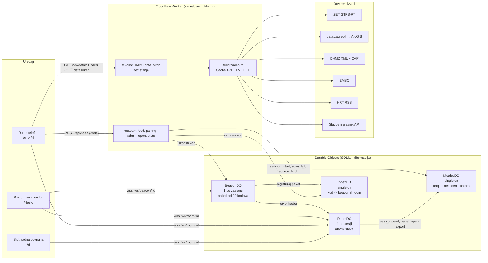

# Vidikovac Stage 1 Implementation Plan

> **For agentic workers:** REQUIRED SUB-SKILL: Use superpowers:subagent-driven-development (recommended) or superpowers:executing-plans to implement this plan task-by-task. Steps use checkbox (`- [ ]`) syntax for tracking.

**Goal:** Ship the stage-1 prototype of Vidikovac on zagreb.aningfilm.hr by 15 September 2026: a presence-unlocked, ten-minute, real-time dashboard of Zagreb on open data with rotating-QR public screens, an always-open safety tier, identifier-free counters, and the grant documents for the 16 September filing.

**Architecture:** One Cloudflare Worker (`worker/index.ts` dispatcher) serves a vite-built multi-page app from static assets and answers `/api/*`, `/ws/*`, `/hitno`, `/open/*` and `/stats` itself. Four SQLite Durable Objects carry the mechanic: `BeaconDO` per public screen mints batches of rotating codes, `RoomDO` per session holds both devices' WebSockets and the expiry alarm chain, `IndexDO` resolves codes, `MetricsDO` keeps `(day, hour, event, dim1, dim2) -> count`. A feed layer normalises nine open sources into one `ModuleSnapshot` shape with Cache API TTLs and a KV last-good copy, so panels are always live, honestly stale, or down, never blank. The browser app has three surfaces from one codebase: phone (`/s`, `/d`), kiosk (`/kiosk`) and desktop.

**Tech Stack:** TypeScript strict, Cloudflare Workers with static assets, Durable Objects (SQLite, WebSocket hibernation, alarms), KV, Rate Limiting bindings, vite multi-page build, vitest (`unit` project) and `@cloudflare/vitest-pool-workers` (`workers` project), Playwright two-context e2e, `gtfs-realtime-bindings`, `fast-xml-parser`, `uqr`, MapLibre GL, Remotion for the demo video. Deploy is `git push` to `main` (Workers Builds); never `wrangler deploy`.

**Spec:** `docs/superpowers/specs/2026-09-11-vidikovac-design.md` (approved 11 Sept 2026; the plan argues from it). Contracts every task must use verbatim: `worker/feed/schema.ts` (ModuleId, Tier, FeedItem, ModuleSnapshot, ModuleSpec, FetchContext) and `worker/protocol.ts` (CODE_ALPHABET, CODE_LENGTH, CODES_PER_BATCH, CODE_EARLY_MS, CODE_GRACE_MS, CodeSlot, ScanRequest, ScanOk, ScanFail, ScanError, Beacon and Room message unions, CLOSE_SESSION_EXPIRED, LayerId, LAYERS, ClientEvent, ServerEvent).

## Global Constraints

- Repository `D:\scratch\vidikovac`, GitHub `matijarma/vidikovac`, branch `main` is production; every push deploys. Commit after every green task.
- Node >= 22 (local 25), npm with `package-lock.json`, wrangler 4, TypeScript strict, `"type": "module"`.
- Worker config is `wrangler.jsonc`: assets `app/dist` with `run_worker_first` for `/api/*`, `/ws/*`, `/hitno`, `/hitno/*`, `/open/*`, `/stats`, `/stats/*`; DO bindings `BEACON_DO`, `ROOM_DO`, `INDEX_DO`, `METRICS_DO` (migration `v1`); KV `FEED` (id `8cb66336f0424a8ea1246bfc6a4ae29b`); rate limiters `RL_SCAN` 10/60 s, `RL_DATA` 240/60 s, `RL_OPEN` 120/60 s; cron `*/5 * * * *`; custom domain `zagreb.aningfilm.hr`; `keep_vars: true`.
- Runtime values come from `worker/config.ts`: `sessionMinutes(env)` default 10, `peerMinutes(env)` default 5, `codeRotateSeconds(env)` default 30, `networkCheck(env)` in `enforce | warn | off` default `enforce`. Secrets `SESSION_SECRET` and `NET_KEY_SECRET` are set with `wrangler secret put`, never committed; `.dev.vars` (ignored) holds dev values, `.dev.vars.example` documents them.
- File ownership for parallel work: Area A `worker/feed/**` (not `schema.ts`), `worker/routes/feed.ts`, `test/feed/**`; Area B `worker/pairing/**`, `worker/do/**`, `worker/routes/pairing.ts`, `worker/routes/admin.ts`, `worker/metrics.ts`, `worker/metrics-do.ts`, `test/pairing/**`; Area C `app/**`, `vite.config.ts`, `app/tsconfig.json`; Area D `worker/routes/open.ts`, `worker/routes/stats.ts`, `worker/hitno/**`, `worker/open/**`, `worker/stats/**`, `worker/security-headers.ts`, `app/public/_headers`, `test/open/**`; Area E `e2e/**`, `playwright.config.ts`, `docs/**`, `scripts/**`, `README.md`, `video/**`. `worker/index.ts` is the dispatcher already in place: it calls `handleFeed`, `handlePairing`, `handleAdmin`, `handleOpen`, `handleStats` (each `(request, env, ctx, url) => Promise<Response | null>`), falls back to `env.ASSETS.fetch`, and `scheduled()` calls `warmFeeds(env, ctx)` from `worker/feed/cache.ts`.
- Cross-area interfaces: `verifyDataToken(env: Env, token: string): Promise<{ roomId: string; expiresAt: number } | null>` in `worker/pairing/tokens.ts` (Area B, consumed by A); `getModules(env: Env, ctx: ExecutionContext, ids: ModuleId[]): Promise<ModuleSnapshot[]>` and `getModule(env, ctx, id)` in `worker/feed/cache.ts` (Area A, consumed by D); `recordMetric(env: Env, event: ServerEvent, dim1?: string, dim2?: string): void` in `worker/metrics.ts` (Area B, consumed by D); `verifyAccess(env: Env, request: Request): Promise<boolean>` in `worker/pairing/access.ts` (Area B, consumed by D), honouring `E2E_ADMIN_BYPASS` only when `networkCheck(env) === 'off'`.
- Every upstream fetch sends `User-Agent: Vidikovac/0.1 (zagreb.aningfilm.hr; kontakt@aningfilm.hr)` and times out at 6 s. Attribution strings are the ones in the spec, section "3. Privacy, counting, licences, WCAG", rendered in every panel footer, on `/izvori`, on the kiosk teaser and in every export.
- Privacy: no cookies, no IP or user agent stored, `netKey` only in the kiosk socket attachment, counters only from closed vocabularies. Croatian-first copy with singular imperatives (Skeniraj, Kopiraj, Podijeli), never "Vi". WCAG 2.2 AA except the declared time-limit deviation.
- Licence AGPL-3.0-or-later; ported psdlat files keep their headers.

---


## Area D: Open tier, derived data, operator stats, security headers

I'll start by reading the approved plan and the contracts in the required order.

# Area D: server-rendered open tier, derived open data, operator stats, security headers

**Area overview.** Area D delivers everything a visitor gets without a scan and everything the operator and the City get out of the counters: `GET /hitno`, a server-rendered, zero-JavaScript, edge-cached safety page (CAP warnings in words, EMSC quakes of the last 72 hours, active closures, civil-protection assembly points, a curated on-duty pharmacy table, emergency numbers, per-panel attribution); the `/open/*` derived-data surface (`catalog.json` in DCAT-AP-like JSON-LD, `/open/<module>.json` for open-tier snapshots, `/open/prometnice.geojson` with closures marked as adapted, and a `/open/` index with the republishing offer to Grad Zagreb); the Access-gated `/stats` page with raw counters, `export.csv`, `data.json` and the privacy-folded City variant `grad.csv` (rounded to 5, cells under 10 folded into `ostalo`); and the security-header policy for Worker responses plus `app/public/_headers` for static assets. All Worker HTML is built from template strings with one `escapeHtml`, uses one inline `<style>`, no fonts, no external requests, so `/hitno`, `/open/` and `/stats` can carry `default-src 'none'`. Consumed contracts: `getModules(env, ctx, ids)` from `worker/feed/cache.ts` (Area A), `recordMetric(env, event, dim1?, dim2?)` from `worker/metrics.ts`, `verifyAccess(env, request)` from `worker/pairing/access.ts`, `METRICS_DO_NAME`, `MetricsDO.query(sinceDay)` and `MetricsDailyRow` (with Area B's added `hour` column) from `worker/metrics-do.ts`. Tests assume Area A's root `vitest.config.ts` with two projects, `unit` (`test/**/*.test.ts` minus `*.workers.test.ts`, node) and `workers` (`test/**/*.workers.test.ts`); note for Area A: `@cloudflare/vitest-pool-workers` 0.18.8 installed in `node_modules` exports `cloudflareTest` (a Vite plugin taking `{ wrangler: { configPath: './wrangler.jsonc' } }`) and no `defineWorkersConfig`; `cloudflare:test` in this version exports `env`, `SELF`, `createExecutionContext`, `waitOnExecutionContext`, `runInDurableObject` and no `fetchMock`, so every test that would touch an upstream injects a fake `getModules` instead. Map tile host for the CSP: `app/src/layers` does not exist yet, so the policy allows `https://tile.openstreetmap.org` (raster tiles, MapLibre needs `worker-src blob:`); Area C changes one constant if it picks another host. Inline scripts: the CSP carries `script-src 'self'` and an `INLINE_SCRIPT_HASHES` list that is empty; the landing page's current inline `<script type="module">` in `app/index.html` must move to a module file (Area C) or its SHA-256 goes into that list. One shared-file change is needed in D5: `"/open"` added to `run_worker_first` in `wrangler.jsonc` so `/open` without a trailing slash reaches the Worker.

**Dependencies to add:** none (Area D uses only the runtime and `vitest`, `@cloudflare/vitest-pool-workers`, `@cloudflare/workers-types` already in `package.json`).

---

### Task D1: `/hitno` server-rendered safety page

**Files:**
- Create: `D:\scratch\vidikovac\worker\open\html.ts`, `D:\scratch\vidikovac\worker\open\time.ts`, `D:\scratch\vidikovac\worker\open\http.ts`, `D:\scratch\vidikovac\worker\hitno\brojevi.ts`, `D:\scratch\vidikovac\worker\hitno\ljekarne.ts`, `D:\scratch\vidikovac\worker\hitno\select.ts`, `D:\scratch\vidikovac\worker\hitno\render.ts`, `D:\scratch\vidikovac\worker\hitno\route.ts`
- Modify: `D:\scratch\vidikovac\worker\routes\open.ts` (replace the stub)
- Test: `D:\scratch\vidikovac\test\open\time.test.ts`, `D:\scratch\vidikovac\test\open\hitno-select.test.ts`, `D:\scratch\vidikovac\test\open\hitno-render.test.ts`, `D:\scratch\vidikovac\test\open\hitno.workers.test.ts`

**Interfaces:**
- Consumes: `ModuleId`, `ModuleSnapshot`, `FeedItem`, `Severity`, `Attribution` from `worker/feed/schema.ts`; `ServerEvent` value `'hitno_view'` from `worker/protocol.ts`; `Env`, `RateLimiter` from `worker/env.ts`; `RouteHandler` from `worker/index.ts`; Area A `getModules(env: Env, ctx: ExecutionContext, ids: ModuleId[]): Promise<ModuleSnapshot[]>` from `worker/feed/cache.ts`; Area B `recordMetric(env: Env, event: ServerEvent, dim1?: string, dim2?: string): void` from `worker/metrics.ts`; Area A's `ckan-geo` items carry `kind: 'poi'` and `data.dataset` equal to the CKAN package name (`zborna-mjesta-civilne-zastite-grada-zagreba`, verified on data.zagreb.hr on 11 Sept 2026); Area A's `dhmz-cap` module already restricts items to EMMA_ID HR002.
- Produces: `escapeHtml(value: unknown): string` (`worker/open/html.ts`); `zagrebParts(date: Date): ZagrebParts`, `zagrebDay(date: Date): string`, `formatZagrebTime(date: Date): string`, `formatZagrebDateTime(date: Date): string`, `parseIso(value: string | undefined): Date | null` (`worker/open/time.ts`); `clientIp(request): string`, `isBot(request): boolean`, `openRateLimited(env, bucket, request): Promise<boolean>`, `edgeCached(ctx, cacheKey, produce): Promise<{ response: Response; hit: boolean }>`, `cacheControl(seconds): string`, `jsonResponse(body, status?, headers?): Response` (`worker/open/http.ts`); `HITNO_MODULES`, `SEVERITY_WORDS`, `ZBORNA_MJESTA_DATASET`, `selectHitno(snapshots, now): HitnoData`, `HitnoData`, `HitnoPanel` (`worker/hitno/select.ts`); `renderHitnoPage(data: HitnoData, now: Date): string`, `renderTooManyRequests(): Response` (`worker/hitno/render.ts`); `handleHitno(request, env, ctx, url, deps?: HitnoDeps): Promise<Response>`, `HitnoDeps { getModules?; now? }`, `HITNO_TTL_SECONDS = 60` (`worker/hitno/route.ts`); `handleOpen(request, env, ctx, url, deps?: OpenRouteDeps): Promise<Response | null>` (`worker/routes/open.ts`).

- [ ] **Step 1: Write the failing time-helper test**

`D:\scratch\vidikovac\test\open\time.test.ts`:

```ts
import { describe, expect, it } from 'vitest';
import {
  formatZagrebDateTime,
  formatZagrebTime,
  parseIso,
  zagrebDay,
} from '../../worker/open/time';

describe('Europe/Zagreb formatting', () => {
  // 2026-09-11T22:30Z is 12 Sept 00:30 in Zagreb (CEST, UTC+2): the day flips.
  const lateEvening = new Date('2026-09-11T22:30:00Z');

  it('zagrebDay uses the Zagreb calendar day, not UTC', () => {
    expect(zagrebDay(lateEvening)).toBe('2026-09-12');
    expect(zagrebDay(new Date('2026-01-15T23:30:00Z'))).toBe('2026-01-16'); // CET, UTC+1
  });

  it('formats time as HH:mm in 24-hour clock', () => {
    expect(formatZagrebTime(lateEvening)).toBe('00:30');
    expect(formatZagrebTime(new Date('2026-09-11T08:05:00Z'))).toBe('10:05');
  });

  it('formats date and time in Croatian order without a year', () => {
    expect(formatZagrebDateTime(new Date('2026-09-11T03:00:00Z'))).toBe('11. 9. 05:00');
  });

  it('parseIso returns null for missing or garbage input', () => {
    expect(parseIso(undefined)).toBeNull();
    expect(parseIso('nije datum')).toBeNull();
    expect(parseIso('2026-09-11T05:00:00+02:00')?.toISOString()).toBe('2026-09-11T03:00:00.000Z');
  });
});
```

- [ ] **Step 2: Run it and watch it fail**

`npx vitest run --project unit test/open/time.test.ts`
Expected: fails with `Error: Failed to load url ../../worker/open/time` (module does not exist yet).

- [ ] **Step 3: Write the three shared helpers**

`D:\scratch\vidikovac\worker\open\html.ts`:

```ts
// The one sanctioned way a feed value reaches server-rendered markup. Every
// interpolated, non-literal string in worker/hitno, worker/open and
// worker/stats goes through this; the page copy itself is literal.
export function escapeHtml(value: unknown): string {
  return String(value ?? '')
    .replace(/&/g, '&amp;')
    .replace(/</g, '&lt;')
    .replace(/>/g, '&gt;')
    .replace(/"/g, '&quot;')
    .replace(/'/g, '&#39;');
}
```

`D:\scratch\vidikovac\worker\open\time.ts`:

```ts
// Everything a person reads on /hitno and /stats is in Europe/Zagreb local
// time. Counters are stored by Zagreb day and hour (worker/metrics-do.ts), so
// the same helpers decide the window boundaries of the operator page.
const ZAGREB = 'Europe/Zagreb';

const PARTS = new Intl.DateTimeFormat('hr-HR', {
  timeZone: ZAGREB,
  year: 'numeric',
  month: 'numeric',
  day: 'numeric',
  hour: '2-digit',
  minute: '2-digit',
  hourCycle: 'h23',
});

export interface ZagrebParts {
  year: string;
  month: string;
  day: string;
  hour: string;
  minute: string;
}

export function zagrebParts(date: Date): ZagrebParts {
  const out: Record<string, string> = {};
  for (const part of PARTS.formatToParts(date)) {
    if (part.type !== 'literal') out[part.type] = part.value;
  }
  return {
    year: out.year ?? '',
    month: out.month ?? '',
    day: out.day ?? '',
    hour: out.hour ?? '',
    minute: out.minute ?? '',
  };
}

/** `YYYY-MM-DD` of the Zagreb calendar day the instant falls on. */
export function zagrebDay(date: Date): string {
  const p = zagrebParts(date);
  return `${p.year}-${p.month.padStart(2, '0')}-${p.day.padStart(2, '0')}`;
}

/** `HH:mm`, 24-hour clock. */
export function formatZagrebTime(date: Date): string {
  const p = zagrebParts(date);
  return `${p.hour.padStart(2, '0')}:${p.minute.padStart(2, '0')}`;
}

/** `11. 9. 05:00`: Croatian day-month order, no year (the page states the year once). */
export function formatZagrebDateTime(date: Date): string {
  const p = zagrebParts(date);
  return `${Number(p.day)}. ${Number(p.month)}. ${formatZagrebTime(date)}`;
}

export function parseIso(value: string | undefined): Date | null {
  if (!value) return null;
  const t = Date.parse(value);
  return Number.isFinite(t) ? new Date(t) : null;
}
```

`D:\scratch\vidikovac\worker\open\http.ts`:

```ts
// HTTP plumbing shared by the open routes (/hitno, /open/*): IP-keyed rate
// limiting on RL_OPEN, bot detection for the hitno_view counter, and the
// Cache API wrapper that makes "edge-cached, s-maxage 60" true. A Worker
// response is NOT cached by Cloudflare's CDN on its own; putting it into
// caches.default with an s-maxage is what turns one render into one render
// per colo per minute.
import type { Env } from '../env';

/** Same list psdlat's metrics endpoint uses. The UA string is tested and dropped, never stored. */
export const BOT_UA_RE = /bot|spider|crawl|headless|lighthouse|preview/i;

export function clientIp(request: Request): string {
  return request.headers.get('cf-connecting-ip') ?? 'unknown';
}

export function isBot(request: Request): boolean {
  return BOT_UA_RE.test(request.headers.get('user-agent') ?? '');
}

/**
 * True when RL_OPEN (120 requests per 60 s, wrangler.jsonc) says this IP is
 * over the line. A failing binding admits the request: the safety tier must
 * never go dark because a limiter hiccuped. The IP is used as a key inside
 * the binding call and never logged or stored.
 */
export async function openRateLimited(env: Env, bucket: string, request: Request): Promise<boolean> {
  try {
    const { success } = await env.RL_OPEN.limit({ key: `${bucket}:${clientIp(request)}` });
    return !success;
  } catch (error) {
    console.error(
      `[vidikovac] open-ratelimit-failed ${error instanceof Error ? `${error.name}: ${error.message}` : 'unknown-error'}`,
    );
    return false;
  }
}

export function cacheControl(seconds: number): string {
  return `public, max-age=0, s-maxage=${seconds}`;
}

/**
 * Serve from caches.default when present, otherwise produce and store. Only
 * 2xx responses that carry an s-maxage are stored; a 429 or a no-store page
 * is never cached.
 */
export async function edgeCached(
  ctx: ExecutionContext,
  cacheKey: Request,
  produce: () => Promise<Response>,
): Promise<{ response: Response; hit: boolean }> {
  const cache = caches.default;
  const hit = await cache.match(cacheKey);
  if (hit) return { response: hit, hit: true };
  const response = await produce();
  const cc = response.headers.get('cache-control') ?? '';
  if (response.ok && cc.includes('s-maxage')) {
    ctx.waitUntil(cache.put(cacheKey, response.clone()));
  }
  return { response, hit: false };
}

export function jsonResponse(
  body: unknown,
  status = 200,
  headers: Record<string, string> = {},
): Response {
  return new Response(JSON.stringify(body), {
    status,
    headers: {
      'content-type': 'application/json; charset=utf-8',
      'cache-control': 'no-store',
      ...headers,
    },
  });
}
```

- [ ] **Step 4: Run the time test, then commit**

`npx vitest run --project unit test/open/time.test.ts`
Expected: 4 passed.

```
git add worker/open/html.ts worker/open/time.ts worker/open/http.ts test/open/time.test.ts
git commit -m "Open tier plumbing: escapeHtml, Europe/Zagreb formatting, RL_OPEN and Cache API helpers"
```

- [ ] **Step 5: Write the failing selection test**

`D:\scratch\vidikovac\test\open\hitno-select.test.ts`:

```ts
import { describe, expect, it } from 'vitest';
import type { FeedItem, ModuleSnapshot } from '../../worker/feed/schema';
import {
  HITNO_MODULES,
  SEVERITY_WORDS,
  ZBORNA_MJESTA_DATASET,
  selectHitno,
} from '../../worker/hitno/select';

// Friday 11 Sept 2026, 10:00 in Zagreb.
const NOW = new Date('2026-09-11T08:00:00Z');

function snapshot(module: ModuleSnapshot['module'], items: FeedItem[]): ModuleSnapshot {
  return {
    module,
    tier: 'open',
    status: 'live',
    fetchedAt: '2026-09-11T07:59:30Z',
    attribution: { text: `Izvor: ${module}`, url: 'https://example.test', licence: 'Otvorena dozvola' },
    items,
  };
}

function item(partial: Partial<FeedItem> & Pick<FeedItem, 'id' | 'module' | 'kind' | 'title'>): FeedItem {
  return { tier: 'open', ...partial };
}

describe('selectHitno', () => {
  it('lists the four modules the page needs, in page order', () => {
    expect([...HITNO_MODULES]).toEqual(['dhmz-cap', 'emsc', 'prometnice', 'ckan-geo']);
  });

  it('maps every CAP severity to a Croatian word', () => {
    expect(SEVERITY_WORDS).toEqual({
      info: 'obavijest',
      minor: 'blago',
      moderate: 'umjereno',
      severe: 'ozbiljno',
      extreme: 'izuzetno',
    });
  });

  it('keeps unexpired warnings, most severe first, and drops expired ones', () => {
    const cap = snapshot('dhmz-cap', [
      item({ id: 'a', module: 'dhmz-cap', kind: 'warning', title: 'Žuto upozorenje za grmljavinsku oluju', severity: 'moderate', at: '2026-09-11T05:00:00+02:00', until: '2026-09-11T17:00:00+02:00' }),
      item({ id: 'b', module: 'dhmz-cap', kind: 'warning', title: 'Narančasto upozorenje za vjetar', severity: 'severe', at: '2026-09-11T12:00:00+02:00', until: '2026-09-11T23:00:00+02:00' }),
      item({ id: 'c', module: 'dhmz-cap', kind: 'warning', title: 'Isteklo upozorenje', severity: 'moderate', at: '2026-09-11T00:00:00+02:00', until: '2026-09-11T08:00:00+02:00' }),
    ]);
    const data = selectHitno([cap], NOW);
    expect(data.warnings.items.map((w) => w.id)).toEqual(['b', 'a']);
    expect(data.warnings.snapshot?.module).toBe('dhmz-cap');
  });

  it('keeps quakes of the last 72 hours only, newest first', () => {
    const emsc = snapshot('emsc', [
      item({ id: 'old', module: 'emsc', kind: 'quake', title: 'M 2.1, Pokuplje', at: '2026-09-07T12:00:00Z' }),
      item({ id: 'q1', module: 'emsc', kind: 'quake', title: 'M 1.6, Rijeka', at: '2026-09-09T17:11:21Z' }),
      item({ id: 'q2', module: 'emsc', kind: 'quake', title: 'M 1.3, Krapina', at: '2026-09-10T11:08:40Z' }),
      item({ id: 'nodate', module: 'emsc', kind: 'quake', title: 'bez vremena' }),
    ]);
    const data = selectHitno([emsc], NOW);
    expect(data.quakes.items.map((q) => q.id)).toEqual(['q2', 'q1']);
  });

  it('keeps closures that have started and not ended, soonest reopening first', () => {
    const prometnice = snapshot('prometnice', [
      item({ id: 'future', module: 'prometnice', kind: 'closure', title: 'Ilica', at: '2026-09-12T07:00:00Z' }),
      item({ id: 'ended', module: 'prometnice', kind: 'closure', title: 'Savska', at: '2026-09-01T07:00:00Z', until: '2026-09-10T07:00:00Z' }),
      item({ id: 'open-ended', module: 'prometnice', kind: 'closure', title: 'Vukomerec', at: '2026-06-23T07:00:00Z' }),
      item({ id: 'today', module: 'prometnice', kind: 'closure', title: 'Sarajevska cesta', at: '2026-04-30T11:46:00Z', until: '2026-09-11T18:00:00Z' }),
    ]);
    const data = selectHitno([prometnice], NOW);
    expect(data.closures.items.map((c) => c.id)).toEqual(['today', 'open-ended']);
  });

  it('takes assembly points only from the zborna mjesta dataset, sorted by name', () => {
    const ckan = snapshot('ckan-geo', [
      item({ id: 'p2', module: 'ckan-geo', kind: 'poi', title: 'Trešnjevka – Park Stara Trešnjevka', data: { dataset: ZBORNA_MJESTA_DATASET }, geo: { type: 'Point', coordinates: [15.95, 45.8] } }),
      item({ id: 'p1', module: 'ckan-geo', kind: 'poi', title: 'Centar – Zrinjevac', data: { dataset: ZBORNA_MJESTA_DATASET } }),
      item({ id: 'lj', module: 'ckan-geo', kind: 'poi', title: 'Ljekarna', data: { dataset: 'ljekarne' } }),
    ]);
    const data = selectHitno([ckan], NOW);
    expect(data.assembly.items.map((p) => p.id)).toEqual(['p1', 'p2']);
  });

  it('yields a null snapshot and an empty list for a module that did not arrive', () => {
    const data = selectHitno([], NOW);
    expect(data.warnings).toEqual({ snapshot: null, items: [] });
    expect(data.quakes).toEqual({ snapshot: null, items: [] });
    expect(data.closures).toEqual({ snapshot: null, items: [] });
    expect(data.assembly).toEqual({ snapshot: null, items: [] });
  });
});
```

- [ ] **Step 6: Run it and watch it fail**

`npx vitest run --project unit test/open/hitno-select.test.ts`
Expected: fails with `Failed to load url ../../worker/hitno/select`.

- [ ] **Step 7: Write the curated tables and the selector**

`D:\scratch\vidikovac\worker\hitno\brojevi.ts`:

```ts
// Emergency numbers shown on /hitno.
//
// SOURCE, read 11 Sept 2026: Ravnateljstvo civilne zaštite, section "Pozivi za
// žurnu pomoć" on https://civilna-zastita.gov.hr/ lists 112 (jedinstveni broj
// za hitne službe), 192 (policija), 193 (vatrogasci), 194 (hitna pomoć), 195
// (traganje i spašavanje na moru) and 1987 (pomoć na cestama). 195 is left out
// because it is not a Zagreb number.
//
// VERIFY against that page before every release that touches this file. A wrong
// digit on a safety page is the one mistake this project may not make.
export interface EmergencyNumber {
  number: string;
  label: string;
}

export const EMERGENCY_NUMBERS: readonly EmergencyNumber[] = [
  { number: '112', label: 'jedinstveni europski broj za hitne službe' },
  { number: '192', label: 'policija' },
  { number: '193', label: 'vatrogasci' },
  { number: '194', label: 'hitna medicinska pomoć' },
  { number: '1987', label: 'pomoć na cesti (HAK)' },
];

export const EMERGENCY_NUMBERS_SOURCE = {
  text: 'Ravnateljstvo civilne zaštite, Pozivi za žurnu pomoć',
  url: 'https://civilna-zastita.gov.hr/',
} as const;
```

`D:\scratch\vidikovac\worker\hitno\ljekarne.ts`:

```ts
// On-duty pharmacies. Curated by hand because the City publishes this as a
// hand-maintained HTML page with no feed (design spec, source table, yellow).
//
// SOURCE: https://www.zagreb.hr/dezurne-ljekarne/497, page dated 20.10.2025.,
// read on LJEKARNE_CHECKED_ON. The five Gradska ljekarna Zagreb units run a
// day shift 7.00-20.00 and a night shift 20.00-7.00, which together cover the
// whole day; Ljekarna ZEUS is the one unit the page lists as 0-24 outright.
//
// The page renders every entry with the "provjeriti" mark and the source link.
// Re-check the page before each release; when the City changes the list, this
// file changes with it and LJEKARNE_CHECKED_ON moves.
export interface Pharmacy {
  label: string;
  address: string;
  /** E.164 for the tel: link, or null when the source page gives no number. */
  phoneE164: string | null;
  phoneDisplay: string | null;
  hours: string;
  operator: string;
}

export const LJEKARNE_CHECKED_ON = '2026-09-11';

export const LJEKARNE_SOURCE = {
  text: 'Grad Zagreb, Dežurne ljekarne (stranica ažurirana 20. 10. 2025.)',
  url: 'https://www.zagreb.hr/dezurne-ljekarne/497',
} as const;

const GLJZ = 'Gradska ljekarna Zagreb';
const SHIFTS = 'dnevna služba 7.00 – 20.00, noćna služba 20.00 – 7.00';

export const LJEKARNE: readonly Pharmacy[] = [
  {
    label: 'Trg bana J. Jelačića 3',
    address: 'Trg bana Josipa Jelačića 3, Zagreb',
    phoneE164: '+38514816198',
    phoneDisplay: '01 4816 198',
    hours: SHIFTS,
    operator: GLJZ,
  },
  {
    label: 'Ilica 291',
    address: 'Ilica 291, Zagreb',
    phoneE164: '+38513750321',
    phoneDisplay: '01 3750 321',
    hours: SHIFTS,
    operator: GLJZ,
  },
  {
    label: 'Ozaljska 1',
    address: 'Ozaljska 1, Zagreb',
    phoneE164: '+38513097586',
    phoneDisplay: '01 3097 586',
    hours: SHIFTS,
    operator: GLJZ,
  },
  {
    label: 'Grižanska 4',
    address: 'Grižanska 4, Zagreb (Dubrava)',
    phoneE164: '+38512992350',
    phoneDisplay: '01 2992 350',
    hours: SHIFTS,
    operator: GLJZ,
  },
  {
    label: 'Av. V. Holjevca 22',
    address: 'Avenija Većeslava Holjevca 22, Zagreb',
    phoneE164: '+38516525425',
    phoneDisplay: '01 6525 425',
    hours: SHIFTS,
    operator: GLJZ,
  },
  {
    label: 'Ljekarna ZEUS',
    address: 'Divka Budaka 17, Zagreb (Borongaj, okretište tramvaja)',
    phoneE164: null,
    phoneDisplay: null,
    hours: 'svaki dan 0 – 24, nedjeljom i praznicima 0 – 24',
    operator: 'Ljekarna ZEUS',
  },
];
```

`D:\scratch\vidikovac\worker\hitno\select.ts`:

```ts
// Pure selection: from the four open-tier snapshots to exactly what /hitno
// shows. No fetching, no HTML; render.ts turns the result into markup.
import type { FeedItem, ModuleId, ModuleSnapshot, Severity } from '../feed/schema';
import { parseIso } from '../open/time';

export const HITNO_MODULES: readonly ModuleId[] = ['dhmz-cap', 'emsc', 'prometnice', 'ckan-geo'];

export const QUAKE_WINDOW_MS = 72 * 60 * 60 * 1000;
/** A quake stamped slightly in the future (clock skew at the source) is still shown. */
const FUTURE_TOLERANCE_MS = 5 * 60 * 1000;

/** CKAN package name on data.zagreb.hr (read 11 Sept 2026). Area A's ckan-geo
 *  module writes it into FeedItem.data.dataset for every feature of that layer. */
export const ZBORNA_MJESTA_DATASET = 'zborna-mjesta-civilne-zastite-grada-zagreba';

/** CAP severity in words. Colour never carries this alone (design section 2). */
export const SEVERITY_WORDS: Readonly<Record<Severity, string>> = {
  info: 'obavijest',
  minor: 'blago',
  moderate: 'umjereno',
  severe: 'ozbiljno',
  extreme: 'izuzetno',
};

const SEVERITY_RANK: Readonly<Record<Severity, number>> = {
  extreme: 4,
  severe: 3,
  moderate: 2,
  minor: 1,
  info: 0,
};

export interface HitnoPanel {
  snapshot: ModuleSnapshot | null;
  items: FeedItem[];
}

export interface HitnoData {
  warnings: HitnoPanel;
  quakes: HitnoPanel;
  closures: HitnoPanel;
  assembly: HitnoPanel;
}

function ms(iso: string | undefined): number | null {
  const d = parseIso(iso);
  return d === null ? null : d.getTime();
}

function find(snapshots: readonly ModuleSnapshot[], id: ModuleId): ModuleSnapshot | null {
  return snapshots.find((s) => s.module === id) ?? null;
}

function byTitle(a: FeedItem, b: FeedItem): number {
  return a.title.localeCompare(b.title, 'hr');
}

export function isActiveWarning(item: FeedItem, now: Date): boolean {
  const start = ms(item.at);
  return start === null || start <= now.getTime();
}

export function selectWarnings(snapshot: ModuleSnapshot | null, now: Date): FeedItem[] {
  if (snapshot === null) return [];
  const t = now.getTime();
  return snapshot.items
    .filter((i) => i.kind === 'warning')
    .filter((i) => {
      const until = ms(i.until);
      return until === null || until >= t;
    })
    .sort((a, b) => {
      const rank = SEVERITY_RANK[b.severity ?? 'info'] - SEVERITY_RANK[a.severity ?? 'info'];
      return rank !== 0 ? rank : (ms(a.at) ?? 0) - (ms(b.at) ?? 0);
    });
}

export function selectQuakes(snapshot: ModuleSnapshot | null, now: Date): FeedItem[] {
  if (snapshot === null) return [];
  const t = now.getTime();
  return snapshot.items
    .filter((i) => i.kind === 'quake')
    .filter((i) => {
      const at = ms(i.at);
      return at !== null && at >= t - QUAKE_WINDOW_MS && at <= t + FUTURE_TOLERANCE_MS;
    })
    .sort((a, b) => (ms(b.at) ?? 0) - (ms(a.at) ?? 0));
}

export function selectClosures(snapshot: ModuleSnapshot | null, now: Date): FeedItem[] {
  if (snapshot === null) return [];
  const t = now.getTime();
  return snapshot.items
    .filter((i) => i.kind === 'closure')
    .filter((i) => {
      const start = ms(i.at);
      const until = ms(i.until);
      return (start === null || start <= t) && (until === null || until >= t);
    })
    .sort((a, b) => {
      const ua = ms(a.until);
      const ub = ms(b.until);
      if (ua === null && ub === null) return byTitle(a, b);
      if (ua === null) return 1;
      if (ub === null) return -1;
      return ua !== ub ? ua - ub : byTitle(a, b);
    });
}

export function selectAssemblyPoints(snapshot: ModuleSnapshot | null): FeedItem[] {
  if (snapshot === null) return [];
  return snapshot.items
    .filter((i) => i.kind === 'poi' && i.data?.dataset === ZBORNA_MJESTA_DATASET)
    .sort(byTitle);
}

export function selectHitno(snapshots: readonly ModuleSnapshot[], now: Date): HitnoData {
  const cap = find(snapshots, 'dhmz-cap');
  const emsc = find(snapshots, 'emsc');
  const prometnice = find(snapshots, 'prometnice');
  const ckan = find(snapshots, 'ckan-geo');
  return {
    warnings: { snapshot: cap, items: selectWarnings(cap, now) },
    quakes: { snapshot: emsc, items: selectQuakes(emsc, now) },
    closures: { snapshot: prometnice, items: selectClosures(prometnice, now) },
    assembly: { snapshot: ckan, items: selectAssemblyPoints(ckan) },
  };
}
```

- [ ] **Step 8: Run the selection test, then commit**

`npx vitest run --project unit test/open/hitno-select.test.ts`
Expected: 7 passed.

```
git add worker/hitno/brojevi.ts worker/hitno/ljekarne.ts worker/hitno/select.ts test/open/hitno-select.test.ts
git commit -m "/hitno selection: warnings, 72 h quakes, active closures, assembly points; curated pharmacies and emergency numbers"
```

- [ ] **Step 9: Write the failing render test**

`D:\scratch\vidikovac\test\open\hitno-render.test.ts`:

```ts
import { describe, expect, it } from 'vitest';
import type { FeedItem, ModuleSnapshot } from '../../worker/feed/schema';
import { renderHitnoPage } from '../../worker/hitno/render';
import { ZBORNA_MJESTA_DATASET, selectHitno } from '../../worker/hitno/select';

const NOW = new Date('2026-09-11T08:00:00Z'); // 10:00 in Zagreb

function snapshot(
  module: ModuleSnapshot['module'],
  items: FeedItem[],
  status: ModuleSnapshot['status'] = 'live',
): ModuleSnapshot {
  return {
    module,
    tier: 'open',
    status,
    fetchedAt: '2026-09-11T07:58:00Z',
    ...(status === 'stale' ? { staleSince: '2026-09-11T07:30:00Z' } : {}),
    attribution: {
      text: `Izvor: ${module.toUpperCase()}, Otvorena dozvola`,
      url: `https://example.test/${module}`,
      licence: 'Otvorena dozvola',
    },
    items,
  };
}

const CAP = snapshot('dhmz-cap', [
  {
    id: 'w1',
    module: 'dhmz-cap',
    kind: 'warning',
    tier: 'open',
    title: 'Žuto upozorenje za grmljavinsku oluju',
    summary: 'Lokalno mogući obilniji pljuskovi praćeni grmljavinom. Količina oborine > 20 mm',
    severity: 'moderate',
    at: '2026-09-11T05:00:00+02:00',
    until: '2026-09-11T17:00:00+02:00',
  },
]);

const PROMETNICE = snapshot('prometnice', [
  {
    id: 'c1',
    module: 'prometnice',
    kind: 'closure',
    tier: 'open',
    title: 'Sarajevska cesta',
    summary: 'Zatvoreno zbog radova, oba smjera',
    at: '2026-04-30T11:46:00+00:00',
    until: '2026-09-11T18:00:00+00:00',
    geo: { type: 'LineString', coordinates: [[16.0071, 45.7646], [16.0077, 45.7631]] },
  },
]);

const CKAN = snapshot('ckan-geo', [
  {
    id: 'z1',
    module: 'ckan-geo',
    kind: 'poi',
    tier: 'open',
    title: 'Zborno mjesto Zrinjevac',
    summary: 'Trg Nikole Šubića Zrinskog',
    geo: { type: 'Point', coordinates: [15.9785, 45.8093] },
    data: { dataset: ZBORNA_MJESTA_DATASET },
  },
]);

describe('renderHitnoPage', () => {
  const html = renderHitnoPage(selectHitno([CAP, PROMETNICE, CKAN], NOW), NOW);

  it('is a Croatian HTML document with no script, no link and no external fetch', () => {
    expect(html.startsWith('<!doctype html>')).toBe(true);
    expect(html).toContain('<html lang="hr">');
    expect(html).not.toContain('<script');
    expect(html).not.toContain('<link');
    expect(html).not.toMatch(/url\(\s*['"]?https?:/);
    expect(html).not.toMatch(/@(import|font-face)/);
  });

  it('lists the CAP warning in words with its severity, times and description', () => {
    expect(html).toContain('Žuto upozorenje za grmljavinsku oluju');
    expect(html).toContain('<span class="sev sev-moderate">umjereno</span>');
    expect(html).toContain('11. 9. 05:00');
    expect(html).toContain('11. 9. 17:00');
    expect(html).toContain('Količina oborine &gt; 20 mm');
  });

  it('says honestly when there is no quake and shows the active closure', () => {
    expect(html).toContain('U posljednja 72 sata EMSC nije zabilježio potres u okolici Zagreba.');
    expect(html).toContain('Izvor trenutačno nedostupan'); // emsc snapshot missing
    expect(html).toContain('Sarajevska cesta');
    expect(html).toContain('Zatvoreno zbog radova, oba smjera');
  });

  it('renders assembly points with an OpenStreetMap link built from the point', () => {
    expect(html).toContain('Zborno mjesto Zrinjevac');
    expect(html).toContain('https://www.openstreetmap.org/?mlat=45.8093&amp;mlon=15.9785#map=17/45.8093/15.9785');
  });

  it('renders the curated pharmacies marked provjeriti with the source link', () => {
    expect(html).toContain('Dežurne ljekarne');
    expect(html).toContain('Ilica 291');
    expect(html).toContain('href="tel:+38513750321"');
    expect(html).toContain('Ljekarna ZEUS');
    expect(html).toContain('<span class="check">provjeriti</span>');
    expect(html).toContain('https://www.zagreb.hr/dezurne-ljekarne/497');
  });

  it('renders the emergency numbers as tel links', () => {
    for (const n of ['112', '192', '193', '194', '1987']) {
      expect(html).toContain(`href="tel:${n}"`);
    }
    expect(html).toContain('https://civilna-zastita.gov.hr/');
  });

  it('carries every panel attribution verbatim with a link to the original', () => {
    expect(html).toContain('Izvor: DHMZ-CAP, Otvorena dozvola');
    expect(html).toContain('href="https://example.test/dhmz-cap"');
    expect(html).toContain('Izvor: PROMETNICE, Otvorena dozvola');
    expect(html).toContain('Izvor: CKAN-GEO, Otvorena dozvola');
  });

  it('escapes feed text', () => {
    const hostile = snapshot('dhmz-cap', [
      {
        id: 'x',
        module: 'dhmz-cap',
        kind: 'warning',
        tier: 'open',
        title: '',
        severity: 'extreme',
        until: '2026-09-11T23:00:00+02:00',
      },
    ]);
    const out = renderHitnoPage(selectHitno([hostile], NOW), NOW);
    expect(out).not.toContain('izuzetno</span>');
  });

  it('marks a stale snapshot as such', () => {
    const stale = snapshot('prometnice', [], 'stale');
    const out = renderHitnoPage(selectHitno([stale], NOW), NOW);
    expect(out).toContain('Zastarjelo');
    expect(out).toContain('Nema aktivnih zatvaranja.');
  });
});
```

- [ ] **Step 10: Run it and watch it fail**

`npx vitest run --project unit test/open/hitno-render.test.ts`
Expected: fails with `Failed to load url ../../worker/hitno/render`.

- [ ] **Step 11: Write the renderer**

`D:\scratch\vidikovac\worker\hitno\render.ts`:

```ts
// The open safety tier as HTML. Zero JavaScript, one inline <style>, no font,
// no image, no external request: it must work on an old phone with scripts
// off, in a library kiosk browser and on paper, and it is what lets the route
// carry `default-src 'none'` (worker/security-headers.ts, Task D4).
//
// Every value from a feed passes through escapeHtml. Severity, freshness and
// status are always a word plus a shape; colour only reinforces.
import type { Attribution, FeedItem } from '../feed/schema';
import { escapeHtml } from '../open/html';
import { formatZagrebDateTime, formatZagrebTime, parseIso } from '../open/time';
import { EMERGENCY_NUMBERS, EMERGENCY_NUMBERS_SOURCE } from './brojevi';
import { LJEKARNE, LJEKARNE_CHECKED_ON, LJEKARNE_SOURCE } from './ljekarne';
import { SEVERITY_WORDS, isActiveWarning, type HitnoData, type HitnoPanel } from './select';

/** "Živo" while the last fetch is younger than this; "Danas" otherwise. */
export const LIVE_WINDOW_MS = 5 * 60 * 1000;

const STYLE = `
:root{color-scheme:dark light;--bg:#0b1020;--fg:#e8ecf5;--muted:#9aa5bf;--accent:#7cd4ff;
--line:rgba(232,236,245,.16);--card:#121a30;--amber:#f5b942;--red:#ff7b7b;--ok:#7fe0a8}
@media (prefers-color-scheme:light){:root{--bg:#f7f3ea;--fg:#14181f;--muted:#5a6172;
--accent:#005f8a;--line:rgba(20,24,31,.16);--card:#fffdf8;--amber:#8a5a00;--red:#b3261e;--ok:#1d6b3f}}
*{box-sizing:border-box}
html,body{margin:0;background:var(--bg);color:var(--fg);
font:1.125rem/1.55 system-ui,-apple-system,"Segoe UI",Roboto,sans-serif}
a{color:var(--accent)}
.wrap{max-width:46rem;margin:0 auto;padding:1.25rem 1.25rem 4rem}
.skip{position:absolute;left:-999px}.skip:focus{left:1rem;top:1rem;background:var(--card);padding:.5rem}
header .brand{display:inline-block;font-weight:600;letter-spacing:.02em;text-decoration:none;color:var(--muted)}
h1{font-size:clamp(2rem,6vw,3rem);line-height:1.05;margin:.4rem 0 .5rem;letter-spacing:-.02em}
.lede{margin:0 0 .5rem;font-size:1.125rem}
.stamp{color:var(--muted);margin:0 0 1.25rem}
nav.toc ul{display:flex;flex-wrap:wrap;gap:.5rem 1rem;list-style:none;margin:0 0 1.5rem;padding:0}
nav.toc a{text-decoration:none;border-bottom:1px solid var(--line)}
section{margin:0 0 2rem;padding:1rem 1.1rem;border:1px solid var(--line);border-radius:14px;background:var(--card)}
h2{margin:0 0 .35rem;font-size:1.5rem;line-height:1.2;display:flex;gap:.6rem;align-items:baseline;flex-wrap:wrap}
.check{font-size:.75rem;font-weight:600;text-transform:uppercase;letter-spacing:.08em;
color:var(--amber);border:1px solid currentColor;border-radius:999px;padding:.05rem .5rem}
.status{margin:0 0 .75rem;color:var(--muted);font-size:1rem}
.status.stale .dot{color:var(--amber)}.status.down .dot{color:var(--red)}.status.live .dot{color:var(--ok)}
ul.items{list-style:none;margin:0;padding:0}
ul.items>li{padding:.7rem 0;border-top:1px solid var(--line)}
ul.items>li:first-child{border-top:0}
.title{font-weight:600}
.meta{color:var(--muted);font-size:1rem}
.sev{display:inline-block;font-weight:600;text-transform:uppercase;letter-spacing:.06em;font-size:.8rem;
border-radius:999px;padding:.1rem .6rem;border:1px solid currentColor;margin-right:.4rem}
.sev-moderate,.sev-minor{color:var(--amber)}.sev-severe,.sev-extreme{color:var(--red)}
.sev-info{color:var(--muted)}
.empty{margin:.25rem 0;color:var(--muted)}
.src{margin-top:.75rem;padding-top:.5rem;border-top:1px dashed var(--line);color:var(--muted);font-size:.95rem}
.src p{margin:0}
table{width:100%;border-collapse:collapse;font-size:1rem}
th,td{text-align:left;vertical-align:top;padding:.45rem .4rem;border-top:1px solid var(--line)}
th{font-weight:600}
thead th{border-top:0;color:var(--muted);font-size:.85rem;text-transform:uppercase;letter-spacing:.06em}
.numbers{display:grid;grid-template-columns:repeat(auto-fit,minmax(9rem,1fr));gap:.6rem;list-style:none;margin:0;padding:0}
.numbers a{display:block;text-decoration:none;border:1px solid var(--line);border-radius:12px;padding:.6rem .8rem;color:var(--fg)}
.numbers b{display:block;font-size:1.75rem;line-height:1.1;letter-spacing:-.01em}
.numbers span{color:var(--muted);font-size:.95rem}
details summary{cursor:pointer;font-weight:600;padding:.3rem 0}
footer.page{color:var(--muted);font-size:.95rem}
@media (max-width:480px){.wrap{padding:1rem .9rem 3rem}section{padding:.9rem .85rem}}
@media print{html,body{background:#fff;color:#000;font-size:11pt}section{border-color:#999;background:#fff;break-inside:avoid}
nav.toc,.skip{display:none}a{color:#000}.src a[href]::after,.numbers a[href]::after{content:""}
a.ext[href]::after{content:" (" attr(href) ")";font-size:.8em;color:#555}}
`;

function timeTag(iso: string | undefined): string {
  const d = parseIso(iso);
  if (d === null) return '<span class="meta">vrijeme nepoznato</span>';
  return `<time datetime="${escapeHtml(d.toISOString())}">${formatZagrebDateTime(d)}</time>`;
}

function freshness(panel: HitnoPanel, now: Date): string {
  const s = panel.snapshot;
  if (s === null || s.status === 'down') {
    return `<p class="status down"><span class="dot" aria-hidden="true">○</span> Izvor trenutačno nedostupan.</p>`;
  }
  if (s.status === 'stale') {
    return (
      `<p class="status stale"><span class="dot" aria-hidden="true">◐</span> Zastarjelo: ` +
      `posljednji uspješan dohvat ${timeTag(s.fetchedAt)}.</p>`
    );
  }
  const fetched = parseIso(s.fetchedAt);
  const live = fetched !== null && now.getTime() - fetched.getTime() < LIVE_WINDOW_MS;
  return (
    `<p class="status live"><span class="dot" aria-hidden="true">●</span> ${live ? 'Živo' : 'Danas'}: ` +
    `ažurirano ${fetched === null ? 'nepoznato' : formatZagrebTime(fetched)}.</p>`
  );
}

function sourceLine(a: Attribution | null, download: string | null): string {
  if (a === null) return '';
  const dl = download === null ? '' : ` · <a href="${escapeHtml(download)}">podaci (JSON)</a>`;
  return (
    `<footer class="src"><p>${escapeHtml(a.text)} · ${escapeHtml(a.licence)} · ` +
    `<a class="ext" href="${escapeHtml(a.url)}" rel="noopener">izvornik</a>${dl}</p></footer>`
  );
}

function osmLink(item: FeedItem): string {
  if (!item.geo || item.geo.type !== 'Point') return '';
  const [lon, lat] = item.geo.coordinates as number[];
  if (typeof lat !== 'number' || typeof lon !== 'number') return '';
  const href = `https://www.openstreetmap.org/?mlat=${lat}&mlon=${lon}#map=17/${lat}/${lon}`;
  return ` · <a class="ext" href="${escapeHtml(href)}" rel="noopener">karta</a>`;
}

function section(id: string, heading: string, body: string, badge = ''): string {
  return (
    `<section id="${id}" aria-labelledby="h-${id}">` +
    `<h2 id="h-${id}">${heading}${badge}</h2>${body}</section>`
  );
}

function warningsSection(panel: HitnoPanel, now: Date): string {
  let list: string;
  if (panel.items.length === 0) {
    list = `<p class="empty">Trenutačno nema upozorenja DHMZ-a za Zagrebačku regiju.</p>`;
  } else {
    list =
      `<ul class="items">` +
      panel.items
        .map((w) => {
          const sev = w.severity ?? 'info';
          const state = isActiveWarning(w, now) ? 'na snazi' : 'najavljeno';
          return (
            `<li><span class="sev sev-${sev}">${SEVERITY_WORDS[sev]}</span>` +
            `<span class="title">${escapeHtml(w.title)}</span>` +
            `<div class="meta">${state} · od ${timeTag(w.at)} do ${timeTag(w.until)}</div>` +
            (w.summary ? `<p>${escapeHtml(w.summary)}</p>` : '') +
            `</li>`
          );
        })
        .join('') +
      `</ul>`;
  }
  return section(
    'upozorenja',
    'Upozorenja DHMZ-a',
    freshness(panel, now) + list + sourceLine(panel.snapshot?.attribution ?? null, '/open/dhmz-cap.json'),
  );
}

function quakesSection(panel: HitnoPanel, now: Date): string {
  let list: string;
  if (panel.items.length === 0) {
    list = `<p class="empty">U posljednja 72 sata EMSC nije zabilježio potres u okolici Zagreba.</p>`;
  } else {
    list =
      `<ul class="items">` +
      panel.items
        .map(
          (q) =>
            `<li><span class="title">${escapeHtml(q.title)}</span>` +
            `<div class="meta">${timeTag(q.at)}${osmLink(q)}` +
            (q.link ? ` · <a class="ext" href="${escapeHtml(q.link)}" rel="noopener">EMSC</a>` : '') +
            `</div>` +
            (q.summary ? `<p>${escapeHtml(q.summary)}</p>` : '') +
            `</li>`,
        )
        .join('') +
      `</ul>`;
  }
  return section(
    'potresi',
    'Potresi u posljednja 72 sata',
    freshness(panel, now) + list + sourceLine(panel.snapshot?.attribution ?? null, '/open/emsc.json'),
  );
}

function closuresSection(panel: HitnoPanel, now: Date): string {
  let list: string;
  if (panel.items.length === 0) {
    list = `<p class="empty">Nema aktivnih zatvaranja.</p>`;
  } else {
    list =
      `<ul class="items">` +
      panel.items
        .map(
          (c) =>
            `<li><span class="title">${escapeHtml(c.title)}</span>` +
            (c.summary ? `<div>${escapeHtml(c.summary)}</div>` : '') +
            `<div class="meta">od ${timeTag(c.at)} · ${c.until ? `očekivano otvaranje ${timeTag(c.until)}` : 'kraj nije najavljen'}</div>` +
            `</li>`,
        )
        .join('') +
      `</ul>`;
  }
  return section(
    'prometnice',
    'Zatvorene prometnice',
    freshness(panel, now) +
      list +
      sourceLine(panel.snapshot?.attribution ?? null, '/open/prometnice.geojson'),
  );
}

function assemblySection(panel: HitnoPanel, now: Date): string {
  let body: string;
  if (panel.items.length === 0) {
    body = `<p class="empty">Popis zbornih mjesta trenutačno nije dostupan.</p>`;
  } else {
    body =
      `<p>Zborna mjesta su mjesta okupljanja građana nakon velike nesreće ili potresa. ` +
      `Na popisu je <b>${panel.items.length}</b> mjesta u Gradu Zagrebu.</p>` +
      `<details><summary>Prikaži sva zborna mjesta</summary><ul class="items">` +
      panel.items
        .map(
          (p) =>
            `<li><span class="title">${escapeHtml(p.title)}</span>` +
            `<div class="meta">${p.summary ? escapeHtml(p.summary) : ''}${osmLink(p)}</div></li>`,
        )
        .join('') +
      `</ul></details>`;
  }
  return section(
    'zborna-mjesta',
    'Zborna mjesta civilne zaštite',
    freshness(panel, now) + body + sourceLine(panel.snapshot?.attribution ?? null, '/open/ckan-geo.json'),
  );
}

function pharmaciesSection(): string {
  const rows = LJEKARNE.map(
    (p) =>
      `<tr><th scope="row">${escapeHtml(p.label)}</th>` +
      `<td>${escapeHtml(p.address)}</td>` +
      `<td>${p.phoneE164 && p.phoneDisplay ? `<a href="tel:${escapeHtml(p.phoneE164)}">${escapeHtml(p.phoneDisplay)}</a>` : '<span class="meta">nije naveden</span>'}</td>` +
      `<td>${escapeHtml(p.hours)}<div class="meta">${escapeHtml(p.operator)}</div></td></tr>`,
  ).join('');
  const checked = parseIso(`${LJEKARNE_CHECKED_ON}T12:00:00Z`);
  const checkedText = checked === null ? LJEKARNE_CHECKED_ON : formatZagrebDateTime(checked).replace(/ \d\d:\d\d$/, '');
  return section(
    'ljekarne',
    'Dežurne ljekarne',
    `<p class="status"><span aria-hidden="true">▣</span> Ručno održavan popis, provjeren ${escapeHtml(checkedText)} ` +
      `prema stranici Grada Zagreba. Prije puta provjeri na izvorniku ili nazovi ljekarnu.</p>` +
      `<table><thead><tr><th scope="col">Ljekarna</th><th scope="col">Adresa</th>` +
      `<th scope="col">Telefon</th><th scope="col">Radno vrijeme</th></tr></thead><tbody>${rows}</tbody></table>` +
      `<footer class="src"><p>${escapeHtml(LJEKARNE_SOURCE.text)} · ` +
      `<a class="ext" href="${escapeHtml(LJEKARNE_SOURCE.url)}" rel="noopener">izvornik</a></p></footer>`,
    ` <span class="check">provjeriti</span>`,
  );
}

function numbersSection(): string {
  return section(
    'brojevi',
    'Brojevi za hitne slučajeve',
    `<ul class="numbers">` +
      EMERGENCY_NUMBERS.map(
        (n) =>
          `<li><a href="tel:${escapeHtml(n.number)}"><b>${escapeHtml(n.number)}</b>` +
          `<span>${escapeHtml(n.label)}</span></a></li>`,
      ).join('') +
      `</ul>` +
      `<footer class="src"><p>${escapeHtml(EMERGENCY_NUMBERS_SOURCE.text)} · ` +
      `<a class="ext" href="${escapeHtml(EMERGENCY_NUMBERS_SOURCE.url)}" rel="noopener">izvornik</a></p></footer>`,
  );
}

export function renderHitnoPage(data: HitnoData, now: Date): string {
  const stamp = `${formatZagrebDateTime(now)} (${now.getUTCFullYear()}.)`;
  return `<!doctype html>
<html lang="hr">
<head>
<meta charset="utf-8">
<meta name="viewport" content="width=device-width, initial-scale=1">
<meta name="color-scheme" content="dark light">
<title>Hitno · Zagreb</title>
<meta name="description" content="Sigurnosne informacije za Zagreb: upozorenja DHMZ-a, potresi, zatvorene prometnice, zborna mjesta civilne zaštite, dežurne ljekarne i brojevi za hitne slučajeve. Otvoreno svima, bez skeniranja.">
<style>${STYLE}</style>
</head>
<body>
<a class="skip" href="#brojevi">Preskoči na brojeve za hitne slučajeve</a>
<div class="wrap">
<header>
<a class="brand" href="/">Vidikovac</a>
<h1>Hitno</h1>
<p class="lede">Sigurnosne informacije za Zagreb. Otvoreno svima, bez skeniranja i bez vremenskog ograničenja. Radi i bez JavaScripta; može se ispisati.</p>
<p class="stamp">Stanje <time datetime="${escapeHtml(now.toISOString())}">${escapeHtml(stamp)}</time>, vrijeme Zagreb. Stranica se osvježava svake minute.</p>
</header>
<nav class="toc" aria-label="Sadržaj"><ul>
<li><a href="#brojevi">Brojevi</a></li>
<li><a href="#upozorenja">Upozorenja</a></li>
<li><a href="#potresi">Potresi</a></li>
<li><a href="#prometnice">Prometnice</a></li>
<li><a href="#zborna-mjesta">Zborna mjesta</a></li>
<li><a href="#ljekarne">Ljekarne</a></li>
</ul></nav>
<main>
${numbersSection()}
${warningsSection(data.warnings, now)}
${quakesSection(data.quakes, now)}
${closuresSection(data.closures, now)}
${assemblySection(data.assembly, now)}
${pharmaciesSection()}
</main>
<footer class="page">
<p>Sadrži informacije tijela javne vlasti u skladu s Otvorenom dozvolom. Prikaz je prilagodba izvora; izvorni podaci i vrijeme zadnje izmjene navedeni su uz svaki panel. Ova stranica ne predstavlja službenu obavijest ni tijela koja podatke objavljuju.</p>
<p><a href="/open/">Otvoreni podaci</a> · <a href="/izvori/">Izvori i licence</a> · <a href="/privatnost/">Privatnost</a> · <a href="/pristupacnost/">Pristupačnost</a></p>
</footer>
</div>
</body>
</html>
`;
}

/** 429 for the open tier: a person, not a client library, reads this. */
export function renderTooManyRequests(): Response {
  const html = `<!doctype html>
<html lang="hr"><head><meta charset="utf-8"><meta name="viewport" content="width=device-width, initial-scale=1">
<title>Previše zahtjeva · Hitno</title>
<style>body{margin:0;padding:3rem 1.25rem;font:1.125rem/1.5 system-ui,sans-serif;background:#0b1020;color:#e8ecf5}
@media (prefers-color-scheme:light){body{background:#f7f3ea;color:#14181f}}main{max-width:36rem;margin:0 auto}</style></head>
<body><main><h1>Previše zahtjeva</h1><p>S ove mreže stiglo je više od 120 zahtjeva u minuti. Pokušaj ponovno za minutu.</p>
<p>U hitnom slučaju nazovi <a href="tel:112">112</a>.</p></main></body></html>
`;
  return new Response(html, {
    status: 429,
    headers: {
      'content-type': 'text/html; charset=utf-8',
      'content-language': 'hr',
      'cache-control': 'no-store',
      'retry-after': '60',
    },
  });
}
```

- [ ] **Step 12: Run the render test, then commit**

`npx vitest run --project unit test/open/hitno-render.test.ts`
Expected: 9 passed.

```
git add worker/hitno/render.ts test/open/hitno-render.test.ts
git commit -m "/hitno renderer: zero-JS Croatian safety page with severity words, freshness, attribution, print stylesheet"
```

- [ ] **Step 13: Write the failing route test (workers pool)**

`D:\scratch\vidikovac\test\open\hitno.workers.test.ts`:

```ts
import { createExecutionContext, env, waitOnExecutionContext } from 'cloudflare:test';
import { describe, expect, it } from 'vitest';
import type { Env } from '../../worker/env';
import type { ModuleId, ModuleSnapshot } from '../../worker/feed/schema';
import { HITNO_TTL_SECONDS } from '../../worker/hitno/route';
import { handleOpen } from '../../worker/routes/open';

const baseEnv = env as unknown as Env;
const admitAll: Env['RL_OPEN'] = { limit: async () => ({ success: true }) };
const denyAll: Env['RL_OPEN'] = { limit: async () => ({ success: false }) };

function capSnapshot(title: string): ModuleSnapshot {
  return {
    module: 'dhmz-cap',
    tier: 'open',
    status: 'live',
    fetchedAt: new Date().toISOString(),
    attribution: { text: 'Izvor: DHMZ, Otvorena dozvola', url: 'https://meteo.hr/upozorenja/cap_hr_today.xml', licence: 'Otvorena dozvola' },
    items: [
      {
        id: 'w1',
        module: 'dhmz-cap',
        kind: 'warning',
        tier: 'open',
        title,
        severity: 'severe',
        at: new Date(Date.now() - 3_600_000).toISOString(),
        until: new Date(Date.now() + 3_600_000).toISOString(),
      },
    ],
  };
}

function fakeGetModules(snapshots: ModuleSnapshot[]) {
  const calls: ModuleId[][] = [];
  const fn = async (_env: Env, _ctx: ExecutionContext, ids: ModuleId[]): Promise<ModuleSnapshot[]> => {
    calls.push(ids);
    return snapshots;
  };
  return { fn, calls };
}

async function get(host: string, path: string, init: RequestInit = {}) {
  const request = new Request(`https://${host}${path}`, init);
  return { request, url: new URL(request.url) };
}

describe('GET /hitno', () => {
  it('renders the warning from the snapshot, edge-cacheable for 60 s', async () => {
    const { fn } = fakeGetModules([capSnapshot('Narančasto upozorenje za olujni vjetar')]);
    const ctx = createExecutionContext();
    const { request, url } = await get('hitno-a.test', '/hitno');
    const response = await handleOpen(request, { ...baseEnv, RL_OPEN: admitAll }, ctx, url, { getModules: fn });
    await waitOnExecutionContext(ctx);

    expect(response).not.toBeNull();
    expect(response!.status).toBe(200);
    expect(response!.headers.get('content-type')).toBe('text/html; charset=utf-8');
    expect(response!.headers.get('cache-control')).toBe(`public, max-age=0, s-maxage=${HITNO_TTL_SECONDS}`);
    expect(response!.headers.get('content-language')).toBe('hr');
    const html = await response!.text();
    expect(html).toContain('Narančasto upozorenje za olujni vjetar');
    expect(html).toContain('<span class="sev sev-severe">ozbiljno</span>');
    expect(html).toContain('Izvor: DHMZ, Otvorena dozvola');
    expect(html).not.toContain('<script');
  });

  it('serves the second request of the same minute from the edge cache without calling the feed', async () => {
    const first = fakeGetModules([capSnapshot('Prvo upozorenje')]);
    const ctx1 = createExecutionContext();
    const a = await get('hitno-cache.test', '/hitno');
    await handleOpen(a.request, { ...baseEnv, RL_OPEN: admitAll }, ctx1, a.url, { getModules: first.fn });
    await waitOnExecutionContext(ctx1);

    const second = fakeGetModules([capSnapshot('Drugo upozorenje')]);
    const ctx2 = createExecutionContext();
    const b = await get('hitno-cache.test', '/hitno?x=1');
    const response = await handleOpen(b.request, { ...baseEnv, RL_OPEN: admitAll }, ctx2, b.url, { getModules: second.fn });
    await waitOnExecutionContext(ctx2);

    expect(second.calls).toHaveLength(0);
    expect(await response!.text()).toContain('Prvo upozorenje');
  });

  it('answers 429 in Croatian when RL_OPEN denies the IP, and does not touch the feed', async () => {
    const { fn, calls } = fakeGetModules([]);
    const ctx = createExecutionContext();
    const { request, url } = await get('hitno-429.test', '/hitno', { headers: { 'cf-connecting-ip': '203.0.113.9' } });
    const response = await handleOpen(request, { ...baseEnv, RL_OPEN: denyAll }, ctx, url, { getModules: fn });
    expect(response!.status).toBe(429);
    expect(response!.headers.get('retry-after')).toBe('60');
    expect(response!.headers.get('cache-control')).toBe('no-store');
    expect(await response!.text()).toContain('Previše zahtjeva');
    expect(calls).toHaveLength(0);
  });

  it('rejects methods other than GET and HEAD with 405', async () => {
    const { fn, calls } = fakeGetModules([]);
    const ctx = createExecutionContext();
    const { request, url } = await get('hitno-405.test', '/hitno', { method: 'POST' });
    const response = await handleOpen(request, { ...baseEnv, RL_OPEN: admitAll }, ctx, url, { getModules: fn });
    expect(response!.status).toBe(405);
    expect(response!.headers.get('allow')).toBe('GET, HEAD');
    expect(calls).toHaveLength(0);
  });

  it('renders every panel as unavailable, uncached, when the feed layer throws', async () => {
    const ctx = createExecutionContext();
    const { request, url } = await get('hitno-down.test', '/hitno');
    const response = await handleOpen(request, { ...baseEnv, RL_OPEN: admitAll }, ctx, url, {
      getModules: async () => {
        throw new Error('kv-unavailable');
      },
    });
    await waitOnExecutionContext(ctx);
    expect(response!.status).toBe(200);
    expect(response!.headers.get('cache-control')).toBe('no-store');
    const html = await response!.text();
    expect(html).toContain('Izvor trenutačno nedostupan');
    expect(html).toContain('href="tel:112"');
  });

  it('ignores paths that are not /hitno or /open', async () => {
    const ctx = createExecutionContext();
    const { request, url } = await get('hitno-null.test', '/nesto-drugo');
    expect(await handleOpen(request, baseEnv, ctx, url)).toBeNull();
  });
});
```

- [ ] **Step 14: Run it and watch it fail**

`npx vitest run --project workers test/open/hitno.workers.test.ts`
Expected: fails with `Failed to load url ../../worker/hitno/route` (and `handleOpen` still the stub returning null).

- [ ] **Step 15: Write the route and replace the stub**

`D:\scratch\vidikovac\worker\hitno\route.ts`:

```ts
// GET /hitno. Order of operations: method gate, RL_OPEN by IP, edge cache,
// render. The hitno_view counter is bumped for every human page load, cached
// or not, because the question it answers is "how often is the open tier
// read", not "how often did we render".
import type { Env } from '../env';
import { getModules } from '../feed/cache';
import type { ModuleId, ModuleSnapshot } from '../feed/schema';
import { recordMetric } from '../metrics';
import { cacheControl, edgeCached, isBot, openRateLimited } from '../open/http';
import { renderHitnoPage, renderTooManyRequests } from './render';
import { HITNO_MODULES, selectHitno } from './select';

export const HITNO_TTL_SECONDS = 60;

export interface HitnoDeps {
  /** Test seam; production uses worker/feed/cache.ts. */
  getModules?: (env: Env, ctx: ExecutionContext, ids: ModuleId[]) => Promise<ModuleSnapshot[]>;
  now?: () => Date;
}

const HTML_HEADERS = {
  'content-type': 'text/html; charset=utf-8',
  'content-language': 'hr',
} as const;

export async function handleHitno(
  request: Request,
  env: Env,
  ctx: ExecutionContext,
  url: URL,
  deps: HitnoDeps = {},
): Promise<Response> {
  if (request.method !== 'GET' && request.method !== 'HEAD') {
    return new Response('Metoda nije dopuštena.', {
      status: 405,
      headers: { allow: 'GET, HEAD', 'content-type': 'text/plain; charset=utf-8', 'cache-control': 'no-store' },
    });
  }
  if (await openRateLimited(env, 'hitno', request)) return renderTooManyRequests();

  const load = deps.getModules ?? getModules;
  const now = deps.now ?? (() => new Date());
  // One cache entry per origin regardless of query string.
  const cacheKey = new Request(`${url.origin}/hitno`, { method: 'GET' });

  const { response } = await edgeCached(ctx, cacheKey, async () => {
    try {
      const snapshots = await load(env, ctx, [...HITNO_MODULES]);
      const html = renderHitnoPage(selectHitno(snapshots, now()), now());
      return new Response(html, {
        status: 200,
        headers: { ...HTML_HEADERS, 'cache-control': cacheControl(HITNO_TTL_SECONDS) },
      });
    } catch (error) {
      // The feed layer promises never to throw; if it does, the page still
      // opens with every panel honestly "nedostupan" and is not cached.
      console.error(
        `[vidikovac] hitno-feed-failed ${error instanceof Error ? `${error.name}: ${error.message}` : 'unknown-error'}`,
      );
      const html = renderHitnoPage(selectHitno([], now()), now());
      return new Response(html, { status: 200, headers: { ...HTML_HEADERS, 'cache-control': 'no-store' } });
    }
  });

  if (!isBot(request)) recordMetric(env, 'hitno_view', 'page');
  if (request.method === 'HEAD') return new Response(null, response);
  return response;
}
```

`D:\scratch\vidikovac\worker\routes\open.ts` (replaces the stub):

```ts
import type { Env } from '../env';
import { handleHitno, type HitnoDeps } from '../hitno/route';

export type OpenRouteDeps = HitnoDeps;

/**
 * Open-tier dispatcher: /hitno now, /open/* in Task D2. Returns null for any
 * other path so worker/index.ts moves on to the next handler and finally to
 * the asset store. The optional fifth argument is a test seam only; the
 * dispatcher calls it with four.
 */
export async function handleOpen(
  request: Request,
  env: Env,
  ctx: ExecutionContext,
  url: URL,
  deps: OpenRouteDeps = {},
): Promise<Response | null> {
  if (url.pathname === '/hitno' || url.pathname === '/hitno/') {
    return handleHitno(request, env, ctx, url, deps);
  }
  return null;
}
```

- [ ] **Step 16: Run the route test and the typecheck, then commit**

`npx vitest run --project workers test/open/hitno.workers.test.ts`
Expected: 6 passed.
`npx tsc --noEmit -p worker/tsconfig.json`
Expected: no output (requires Area A's `worker/feed/cache.ts` and Area B's `worker/metrics.ts` to exist; until they land, the two import lines are the only errors).

```
git add worker/hitno/route.ts worker/routes/open.ts test/open/hitno.workers.test.ts
git commit -m "GET /hitno: rate-limited, edge-cached server-rendered safety page counting hitno_view"
```

---

### Task D2: `/open/catalog.json`, `/open/<module>.json`, `/open/prometnice.geojson`

**Files:**
- Create: `D:\scratch\vidikovac\worker\open\catalog.ts`, `D:\scratch\vidikovac\worker\open\geojson.ts`, `D:\scratch\vidikovac\worker\open\route.ts`
- Modify: `D:\scratch\vidikovac\worker\routes\open.ts`
- Test: `D:\scratch\vidikovac\test\open\catalog.test.ts`, `D:\scratch\vidikovac\test\open\catalog-registry.test.ts`, `D:\scratch\vidikovac\test\open\geojson.test.ts`, `D:\scratch\vidikovac\test\open\open-routes.workers.test.ts`

**Interfaces:**
- Consumes: `ModuleId`, `ModuleSnapshot`, `FeedItem`, `Geo`, `ModuleSpec` from `worker/feed/schema.ts`; Area A `getModules` as in D1; from D1 `edgeCached`, `cacheControl`, `jsonResponse`, `openRateLimited` (`worker/open/http.ts`), `HitnoDeps`; Area A's registry export for the parity test, assumed `MODULES: Record<ModuleId, ModuleSpec>` from `worker/feed/registry.ts` (if Area A names it differently, only the import line in `test/open/catalog-registry.test.ts` changes).
- Produces: `OPEN_LICENCE`, `OPEN_DATASETS: readonly OpenDataset[]`, `OpenDataset`, `CATALOG_TTL_SECONDS = 3600`, `isoDuration(seconds: number): string`, `buildCatalog(origin: string, issued: Date): CatalogDocument`, `findOpenDataset(id: string): OpenDataset | undefined` (`worker/open/catalog.ts`); `closuresToGeoJson(snapshot: ModuleSnapshot, origin: string): ClosuresGeoJson` (`worker/open/geojson.ts`); `handleOpenData(request, env, ctx, url, deps?: OpenDeps): Promise<Response>`, `OpenDeps` (`worker/open/route.ts`); `handleOpen` now also answers `/open/*`.

- [ ] **Step 1: Write the failing catalog tests**

`D:\scratch\vidikovac\test\open\catalog.test.ts`:

```ts
import { describe, expect, it } from 'vitest';
import {
  CATALOG_TTL_SECONDS,
  OPEN_DATASETS,
  OPEN_LICENCE,
  buildCatalog,
  findOpenDataset,
  isoDuration,
} from '../../worker/open/catalog';

const ORIGIN = 'https://zagreb.aningfilm.hr';
const ISSUED = new Date('2026-09-11T10:00:00Z');

describe('open data catalog', () => {
  it('turns refresh seconds into ISO 8601 durations', () => {
    expect(isoDuration(60)).toBe('PT1M');
    expect(isoDuration(180)).toBe('PT3M');
    expect(isoDuration(300)).toBe('PT5M');
    expect(isoDuration(3600)).toBe('PT1H');
    expect(isoDuration(86400)).toBe('P1D');
    expect(isoDuration(90)).toBe('PT90S');
  });

  it('lists exactly the open-tier modules', () => {
    expect(OPEN_DATASETS.map((d) => d.module)).toEqual(['dhmz-cap', 'emsc', 'prometnice', 'ckan-geo']);
    expect(findOpenDataset('prometnice')?.ttl).toBe(180);
    expect(findOpenDataset('zet-rt')).toBeUndefined();
    expect(CATALOG_TTL_SECONDS).toBe(3600);
  });

  it('builds a DCAT-AP-like JSON-LD catalog with absolute distribution URLs', () => {
    const catalog = buildCatalog(ORIGIN, ISSUED);
    expect(catalog['@type']).toBe('dcat:Catalog');
    expect(catalog['@id']).toBe(`${ORIGIN}/open/catalog.json`);
    expect(catalog['@context']).toMatchObject({
      dcat: 'http://www.w3.org/ns/dcat#',
      dct: 'http://purl.org/dc/terms/',
      foaf: 'http://xmlns.com/foaf/0.1/',
    });
    expect(catalog['dct:license']).toBe(OPEN_LICENCE.url);
    expect(catalog['dct:publisher']['foaf:name']).toBe('Aning Film d.o.o.');
    expect(catalog['dct:issued']).toBe('2026-09-11T10:00:00.000Z');
    expect(catalog['dcat:dataset']).toHaveLength(4);

    const prometnice = catalog['dcat:dataset'].find((d) => d['dct:identifier'] === 'prometnice')!;
    expect(prometnice['@type']).toBe('dcat:Dataset');
    expect(prometnice['dct:accrualPeriodicity']).toBe('PT3M');
    expect(prometnice['dct:license']).toBe(OPEN_LICENCE.url);
    expect(prometnice['dct:source']).toContain('data.zagreb.hr');
    expect(prometnice['dcat:distribution'].map((x) => x['dcat:downloadURL'])).toEqual([
      `${ORIGIN}/open/prometnice.json`,
      `${ORIGIN}/open/prometnice.geojson`,
    ]);
    expect(prometnice['dcat:distribution'][1]['dcat:mediaType']).toBe('application/geo+json');
    for (const dist of prometnice['dcat:distribution']) {
      expect(dist['dct:license']).toBe(OPEN_LICENCE.url);
      expect(dist['dct:description']).toContain('prilag');
    }
  });

  it('carries the republishing offer to Grad Zagreb in the catalog description', () => {
    const catalog = buildCatalog(ORIGIN, ISSUED);
    expect(catalog['dct:description']).toContain('data.zagreb.hr');
    expect(catalog['dct:description']).toContain('Grad Zagreb');
  });
});
```

`D:\scratch\vidikovac\test\open\catalog-registry.test.ts`:

```ts
// Guards the one duplication Area D carries: OPEN_DATASETS mirrors the ttl and
// tier Area A declares in worker/feed/registry.ts. If Area A's export is not
// named MODULES, change the import below (one line) and nothing else.
import { describe, expect, it } from 'vitest';
import { MODULES } from '../../worker/feed/registry';
import type { ModuleId, ModuleSpec } from '../../worker/feed/schema';
import { OPEN_DATASETS } from '../../worker/open/catalog';

const specs = MODULES as Record<ModuleId, ModuleSpec>;

describe('OPEN_DATASETS mirrors the feed registry', () => {
  it('every catalogued dataset is an open-tier module with the registry ttl', () => {
    for (const dataset of OPEN_DATASETS) {
      const spec = specs[dataset.module];
      expect(spec, dataset.module).toBeDefined();
      expect(spec.tier, `${dataset.module} tier`).toBe('open');
      expect(dataset.ttl, `${dataset.module} ttl`).toBe(spec.ttl);
      expect(dataset.source.url, `${dataset.module} attribution url`).toBe(spec.attribution.url);
    }
  });

  it('every open-tier module in the registry is catalogued', () => {
    const openIds = (Object.keys(specs) as ModuleId[]).filter((id) => specs[id].tier === 'open').sort();
    expect(OPEN_DATASETS.map((d) => d.module).sort()).toEqual(openIds);
  });
});
```

- [ ] **Step 2: Run them and watch them fail**

`npx vitest run --project unit test/open/catalog.test.ts test/open/catalog-registry.test.ts`
Expected: both fail with `Failed to load url ../../worker/open/catalog`.

- [ ] **Step 3: Write the catalog module**

`D:\scratch\vidikovac\worker\open\catalog.ts`:

```ts
// The open-data catalogue: which modules are republished at /open/*, under
// what licence, with which upstream attribution. Serialised as a DCAT-AP-like
// JSON-LD document at /open/catalog.json and rendered as HTML at /open/ (D5).
//
// ttl and source.url mirror worker/feed/registry.ts (Area A);
// test/open/catalog-registry.test.ts fails if they drift.
import type { ModuleId } from '../feed/schema';

export const OPEN_LICENCE = {
  title: 'Otvorena dozvola / Open Licence – Republika Hrvatska (NN 67/17)',
  url: 'https://data.gov.hr/otvorena-dozvola',
} as const;

export const PUBLISHER = {
  name: 'Aning Film d.o.o.',
  homepage: 'https://zagreb.aningfilm.hr',
} as const;

/** The catalogue itself is static per deploy; an hour at the edge is generous and harmless. */
export const CATALOG_TTL_SECONDS = 3600;

export interface OpenDistribution {
  path: string;
  format: 'JSON' | 'GeoJSON';
  mediaType: 'application/json' | 'application/geo+json';
  description: string;
}

export interface OpenDataset {
  module: ModuleId;
  title: string;
  description: string;
  keywords: readonly string[];
  /** Seconds between refreshes; equals the registry ttl. */
  ttl: number;
  source: { text: string; url: string; licence: string };
  distributions: readonly OpenDistribution[];
}

const ADAPTED = 'Prilagođeni (normalizirani) prikaz izvora u zajedničkom obliku ModuleSnapshot; izmjene u odnosu na izvornik su označene.';

export const OPEN_DATASETS: readonly OpenDataset[] = [
  {
    module: 'dhmz-cap',
    title: 'Meteorološka upozorenja za Zagrebačku regiju (DHMZ, CAP)',
    description:
      'Upozorenja Državnog hidrometeorološkog zavoda u formatu CAP 1.2 za područje EMMA_ID HR002 (Zagrebačka regija), svedena na naslov, opis, stupanj (u riječima) i vrijeme trajanja.',
    keywords: ['vrijeme', 'upozorenja', 'DHMZ', 'CAP', 'sigurnost'],
    ttl: 300,
    source: {
      text: 'Izvor: DHMZ, Otvorena dozvola',
      url: 'https://meteo.hr/upozorenja/cap_hr_today.xml',
      licence: 'Otvorena dozvola',
    },
    distributions: [
      { path: '/open/dhmz-cap.json', format: 'JSON', mediaType: 'application/json', description: ADAPTED },
    ],
  },
  {
    module: 'emsc',
    title: 'Potresi u krugu 1,5° oko Zagreba (EMSC)',
    description:
      'Seizmički događaji Europsko-mediteranskog seizmološkog centra (FDSN event servis) u krugu 1,5° oko Zagreba, s magnitudom, dubinom, vremenom i položajem.',
    keywords: ['potresi', 'EMSC', 'seizmologija', 'sigurnost'],
    ttl: 60,
    source: {
      text: 'Izvor: EMSC, seismicportal.eu',
      url: 'https://www.seismicportal.eu/fdsnws/event/1/query?lat=45.81&lon=15.98&maxradius=1.5&format=json',
      licence: 'EMSC uvjeti korištenja (slobodno uz navođenje izvora)',
    },
    distributions: [{ path: '/open/emsc.json', format: 'JSON', mediaType: 'application/json', description: ADAPTED }],
  },
  {
    module: 'prometnice',
    title: 'Zatvorene i ograničene prometnice (Grad Zagreb)',
    description:
      'Aktualna zatvaranja i ograničenja na gradskim prometnicama iz skupa "prometnice" na data.zagreb.hr, s ulicom, vrstom, smjerom, očekivanim početkom i završetkom te geometrijom.',
    keywords: ['promet', 'prometnice', 'zatvaranja', 'radovi', 'Grad Zagreb'],
    ttl: 180,
    source: {
      text: "Sadrži informacije Grada Zagreba (data.zagreb.hr) u skladu s Otvorenom dozvolom; skup 'prometnice'",
      url: 'https://data.zagreb.hr/dataset/prometnice',
      licence: 'Otvorena dozvola',
    },
    distributions: [
      { path: '/open/prometnice.json', format: 'JSON', mediaType: 'application/json', description: ADAPTED },
      {
        path: '/open/prometnice.geojson',
        format: 'GeoJSON',
        mediaType: 'application/geo+json',
        description:
          'GeoJSON FeatureCollection izvedena iz izvornih polilinija (prilagodba: koordinate pretvorene u GeoJSON redoslijed, atributi normalizirani, svaki objekt nosi "adapted": true).',
      },
    ],
  },
  {
    module: 'ckan-geo',
    title: 'Sigurnosne točke Grada Zagreba (zborna mjesta, ljekarne, vatrogasci, policija, zdenci, javni WC)',
    description:
      'Točkasti slojevi s data.zagreb.hr i ArcGIS servisa Grada Zagreba, svedeni na naziv, opis, položaj i izvorni skup (data.dataset). Osvježava se dnevno.',
    keywords: ['civilna zaštita', 'zborna mjesta', 'ljekarne', 'vatrogasci', 'policija', 'javni zdenci', 'javni WC'],
    ttl: 86400,
    source: {
      text: 'Sadrži informacije Grada Zagreba (data.zagreb.hr) u skladu s Otvorenom dozvolom',
      url: 'https://data.zagreb.hr/',
      licence: 'Otvorena dozvola',
    },
    distributions: [{ path: '/open/ckan-geo.json', format: 'JSON', mediaType: 'application/json', description: ADAPTED }],
  },
];

export function findOpenDataset(id: string): OpenDataset | undefined {
  return OPEN_DATASETS.find((d) => d.module === id);
}

export function isoDuration(seconds: number): string {
  if (seconds % 86400 === 0) return `P${seconds / 86

400}D`;
  if (seconds % 3600 === 0) return `PT${seconds / 3600}H`;
  if (seconds % 60 === 0) return `PT${seconds / 60}M`;
  return `PT${seconds}S`;
}

export interface CatalogDistribution {
  '@type': 'dcat:Distribution';
  'dcat:accessURL': string;
  'dcat:downloadURL': string;
  'dct:format': string;
  'dcat:mediaType': string;
  'dct:license': string;
  'dct:description': string;
}

export interface CatalogDataset {
  '@type': 'dcat:Dataset';
  '@id': string;
  'dct:identifier': string;
  'dct:title': string;
  'dct:description': string;
  'dcat:keyword': string[];
  'dct:accrualPeriodicity': string;
  'dct:license': string;
  'dct:source': string;
  'dct:provenance': string;
  'dct:language': 'hr';
  'dcat:distribution': CatalogDistribution[];
}

export interface CatalogDocument {
  '@context': Record<string, string>;
  '@type': 'dcat:Catalog';
  '@id': string;
  'dct:title': string;
  'dct:description': string;
  'dct:publisher': { '@type': 'foaf:Agent'; 'foaf:name': string; 'foaf:homepage': string };
  'dct:license': string;
  'dct:language': 'hr';
  'dct:issued': string;
  'dct:modified': string;
  'dcat:dataset': CatalogDataset[];
}

export function buildCatalog(origin: string, issued: Date): CatalogDocument {
  const iso = issued.toISOString();
  return {
    '@context': {
      dcat: 'http://www.w3.org/ns/dcat#',
      dct: 'http://purl.org/dc/terms/',
      foaf: 'http://xmlns.com/foaf/0.1/',
    },
    '@type': 'dcat:Catalog',
    '@id': `${origin}/open/catalog.json`,
    'dct:title': 'Vidikovac – izvedeni otvoreni podaci o Zagrebu',
    'dct:description':
      'Normalizirani, strojno čitljivi prikazi otvorenih izvora koje nadzorna ploča Vidikovac koristi u stvarnom vremenu. ' +
      'Svaki skup nosi izvornu atribuciju i oznaku prilagodbe. Objavljeno pod Otvorenom dozvolom. ' +
      'Grad Zagreb može svaki skup preuzeti i ponovno objaviti na data.zagreb.hr bez daljnjeg odobrenja; ovaj katalog je dovoljna poveznica.',
    'dct:publisher': { '@type': 'foaf:Agent', 'foaf:name': PUBLISHER.name, 'foaf:homepage': origin },
    'dct:license': OPEN_LICENCE.url,
    'dct:language': 'hr',
    'dct:issued': iso,
    'dct:modified': iso,
    'dcat:dataset': OPEN_DATASETS.map((d) => ({
      '@type': 'dcat:Dataset',
      '@id': `${origin}/open/${d.module}`,
      'dct:identifier': d.module,
      'dct:title': d.title,
      'dct:description': d.description,
      'dcat:keyword': [...d.keywords],
      'dct:accrualPeriodicity': isoDuration(d.ttl),
      'dct:license': OPEN_LICENCE.url,
      'dct:source': d.source.url,
      'dct:provenance': `${d.source.text} (${d.source.licence})`,
      'dct:language': 'hr',
      'dcat:distribution': d.distributions.map((x) => ({
        '@type': 'dcat:Distribution',
        'dcat:accessURL': `${origin}${x.path}`,
        'dcat:downloadURL': `${origin}${x.path}`,
        'dct:format': x.format,
        'dcat:mediaType': x.mediaType,
        'dct:license': OPEN_LICENCE.url,
        'dct:description': x.description,
      })),
    })),
  };
}
```

- [ ] **Step 4: Run the catalog tests, then commit**

`npx vitest run --project unit test/open/catalog.test.ts test/open/catalog-registry.test.ts`
Expected: `catalog.test.ts` 4 passed; `catalog-registry.test.ts` 2 passed once Area A's `worker/feed/registry.ts` exists (before that: `Failed to load url ../../worker/feed/registry`, which is the expected state of a parallel build, not a defect in this task).

```
git add worker/open/catalog.ts test/open/catalog.test.ts test/open/catalog-registry.test.ts
git commit -m "/open catalogue: DCAT-AP-like JSON-LD with Otvorena dozvola, per-module attribution and republishing offer"
```

- [ ] **Step 5: Write the failing GeoJSON test**

`D:\scratch\vidikovac\test\open\geojson.test.ts`:

```ts
import { describe, expect, it } from 'vitest';
import type { ModuleSnapshot } from '../../worker/feed/schema';
import { closuresToGeoJson } from '../../worker/open/geojson';

const SNAPSHOT: ModuleSnapshot = {
  module: 'prometnice',
  tier: 'open',
  status: 'live',
  fetchedAt: '2026-09-11T08:00:00Z',
  sourceUpdatedAt: '2026-09-11T07:57:00Z',
  attribution: {
    text: "Sadrži informacije Grada Zagreba (data.zagreb.hr) u skladu s Otvorenom dozvolom; skup 'prometnice'",
    url: 'https://data.zagreb.hr/dataset/prometnice',
    licence: 'Otvorena dozvola',
  },
  items: [
    {
      id: 'c1',
      module: 'prometnice',
      kind: 'closure',
      tier: 'open',
      title: 'Grada Vukovara',
      summary: 'Zatvoreno zbog radova, jedan smjer',
      at: '2026-04-18T07:00:00+00:00',
      until: '2026-09-11T22:00:00+00:00',
      geo: { type: 'LineString', coordinates: [[15.9599, 45.7994], [15.9590, 45.7993]] },
      data: { type: 'ROAD_CLOSED', subtype: 'ROAD_CLOSED_CONSTRUCTION', direction: 'ONE_DIRECTION', adapted: false },
    },
    {
      id: 'c2',
      module: 'prometnice',
      kind: 'closure',
      tier: 'open',
      title: 'Bez geometrije',
    },
    {
      id: 'x',
      module: 'prometnice',
      kind: 'poi',
      tier: 'open',
      title: 'Nije zatvaranje',
      geo: { type: 'Point', coordinates: [15.9, 45.8] },
    },
  ],
};

describe('closuresToGeoJson', () => {
  const fc = closuresToGeoJson(SNAPSHOT, 'https://zagreb.aningfilm.hr');

  it('emits one Feature per closure that has a geometry', () => {
    expect(fc.type).toBe('FeatureCollection');
    expect(fc.features).toHaveLength(1);
    const f = fc.features[0];
    expect(f.type).toBe('Feature');
    expect(f.id).toBe('c1');
    expect(f.geometry).toEqual({ type: 'LineString', coordinates: [[15.9599, 45.7994], [15.9590, 45.7993]] });
  });

  it('marks every feature and the collection as adapted, with the attribution', () => {
    const p = fc.features[0].properties;
    expect(p.adapted).toBe(true); // the item's own `adapted: false` extra does not win
    expect(p.title).toBe('Grada Vukovara');
    expect(p.summary).toBe('Zatvoreno zbog radova, jedan smjer');
    expect(p.from).toBe('2026-04-18T07:00:00+00:00');
    expect(p.until).toBe('2026-09-11T22:00:00+00:00');
    expect(p.direction).toBe('ONE_DIRECTION');
    expect(fc.adapted).toBe(true);
    expect(fc.adaptedBy).toBe('Vidikovac, https://zagreb.aningfilm.hr');
    expect(fc.attribution).toBe(SNAPSHOT.attribution.text);
    expect(fc.licence).toBe('Otvorena dozvola');
    expect(fc.source).toBe('https://data.zagreb.hr/dataset/prometnice');
    expect(fc.fetchedAt).toBe('2026-09-11T08:00:00Z');
    expect(fc.sourceUpdatedAt).toBe('2026-09-11T07:57:00Z');
    expect(fc.status).toBe('live');
  });
});
```

- [ ] **Step 6: Run it and watch it fail**

`npx vitest run --project unit test/open/geojson.test.ts`
Expected: fails with `Failed to load url ../../worker/open/geojson`.

- [ ] **Step 7: Write the GeoJSON module**

`D:\scratch\vidikovac\worker\open\geojson.ts`:

```ts
// /open/prometnice.geojson: the closures snapshot as a GeoJSON
// FeatureCollection. The Otvorena dozvola requires adaptations to be marked,
// so the collection and every feature carry `adapted: true` and the source
// attribution rides along as top-level foreign members (RFC 7946 §6.1).
import type { FeedItem, Geo, ModuleSnapshot } from '../feed/schema';

export interface ClosureFeature {
  type: 'Feature';
  id: string;
  geometry: Geo;
  properties: Record<string, string | number | boolean | null>;
}

export interface ClosuresGeoJson {
  type: 'FeatureCollection';
  features: ClosureFeature[];
  attribution: string;
  licence: string;
  source: string;
  adapted: true;
  adaptedBy: string;
  fetchedAt: string;
  sourceUpdatedAt: string | null;
  status: ModuleSnapshot['status'];
}

function toFeature(item: FeedItem, geo: Geo): ClosureFeature {
  return {
    type: 'Feature',
    id: item.id,
    geometry: { type: geo.type, coordinates: geo.coordinates },
    properties: {
      // Source-specific extras first (type, subtype, direction...); the named
      // keys below always win, so `adapted` cannot be overridden by a feed.
      ...(item.data ?? {}),
      id: item.id,
      title: item.title,
      summary: item.summary ?? null,
      severity: item.severity ?? null,
      from: item.at ?? null,
      until: item.until ?? null,
      module: item.module,
      adapted: true,
    },
  };
}

export function closuresToGeoJson(snapshot: ModuleSnapshot, origin: string): ClosuresGeoJson {
  const features: ClosureFeature[] = [];
  for (const item of snapshot.items) {
    if (item.kind !== 'closure' || item.geo === undefined) continue;
    features.push(toFeature(item, item.geo));
  }
  return {
    type: 'FeatureCollection',
    features,
    attribution: snapshot.attribution.text,
    licence: snapshot.attribution.licence,
    source: snapshot.attribution.url,
    adapted: true,
    adaptedBy: `Vidikovac, ${origin}`,
    fetchedAt: snapshot.fetchedAt,
    sourceUpdatedAt: snapshot.sourceUpdatedAt ?? null,
    status: snapshot.status,
  };
}
```

- [ ] **Step 8: Run the GeoJSON test, then commit**

`npx vitest run --project unit test/open/geojson.test.ts`
Expected: 2 passed.

```
git add worker/open/geojson.ts test/open/geojson.test.ts
git commit -m "/open/prometnice.geojson: closures as an adapted, attributed FeatureCollection"
```

- [ ] **Step 9: Write the failing /open route test**

`D:\scratch\vidikovac\test\open\open-routes.workers.test.ts`:

```ts
import { createExecutionContext, env, waitOnExecutionContext } from 'cloudflare:test';
import { describe, expect, it } from 'vitest';
import type { Env } from '../../worker/env';
import type { ModuleId, ModuleSnapshot } from '../../worker/feed/schema';
import { handleOpen } from '../../worker/routes/open';

const baseEnv = env as unknown as Env;
const admitAll: Env['RL_OPEN'] = { limit: async () => ({ success: true }) };
const denyAll: Env['RL_OPEN'] = { limit: async () => ({ success: false }) };

function snapshot(module: ModuleId, tier: ModuleSnapshot['tier'] = 'open'): ModuleSnapshot {
  return {
    module,
    tier,
    status: 'live',
    fetchedAt: '2026-09-11T08:00:00Z',
    attribution: { text: `Izvor: ${module}`, url: `https://example.test/${module}`, licence: 'Otvorena dozvola' },
    items:
      module === 'prometnice'
        ? [
            {
              id: 'c1',
              module,
              kind: 'closure',
              tier,
              title: 'Ilica',
              geo: { type: 'LineString', coordinates: [[15.97, 45.81], [15.96, 45.81]] },
            },
          ]
        : [],
  };
}

function fake(...snapshots: ModuleSnapshot[]) {
  const calls: ModuleId[][] = [];
  const getModules = async (_e: Env, _c: ExecutionContext, ids: ModuleId[]) => {
    calls.push(ids);
    return snapshots.filter((s) => ids.includes(s.module));
  };
  return { getModules, calls };
}

async function call(host: string, path: string, deps: Parameters<typeof handleOpen>[4], rl = admitAll, init: RequestInit = {}) {
  const request = new Request(`https://${host}${path}`, init);
  const ctx = createExecutionContext();
  const response = await handleOpen(request, { ...baseEnv, RL_OPEN: rl }, ctx, new URL(request.url), deps);
  await waitOnExecutionContext(ctx);
  return response!;
}

describe('/open/*', () => {
  it('serves catalog.json as JSON-LD with CORS and an hour at the edge', async () => {
    const { getModules, calls } = fake();
    const response = await call('open-cat.test', '/open/catalog.json', { getModules });
    expect(response.status).toBe(200);
    expect(response.headers.get('content-type')).toBe('application/json; charset=utf-8');
    expect(response.headers.get('cache-control')).toBe('public, max-age=0, s-maxage=3600');
    expect(response.headers.get('access-control-allow-origin')).toBe('*');
    const body = (await response.json()) as { '@type': string; '@id': string; 'dcat:dataset': unknown[] };
    expect(body['@type']).toBe('dcat:Catalog');
    expect(body['@id']).toBe('https://open-cat.test/open/catalog.json');
    expect(body['dcat:dataset']).toHaveLength(4);
    expect(calls).toHaveLength(0);
  });

  it('serves an open-tier module snapshot with s-maxage equal to its ttl', async () => {
    const { getModules, calls } = fake(snapshot('dhmz-cap'));
    const response = await call('open-cap.test', '/open/dhmz-cap.json', { getModules });
    expect(response.status).toBe(200);
    expect(response.headers.get('cache-control')).toBe('public, max-age=0, s-maxage=300');
    expect(response.headers.get('access-control-allow-origin')).toBe('*');
    const body = (await response.json()) as ModuleSnapshot;
    expect(body.module).toBe('dhmz-cap');
    expect(body.attribution.text).toBe('Izvor: dhmz-cap');
    expect(calls).toEqual([['dhmz-cap']]);
  });

  it('404s a module that is not in the catalogue without touching the feed', async () => {
    const { getModules, calls } = fake(snapshot('zet-rt', 'session'));
    const response = await call('open-zet.test', '/open/zet-rt.json', { getModules });
    expect(response.status).toBe(404);
    await expect(response.json()).resolves.toEqual({ error: 'not-found' });
    expect(calls).toHaveLength(0);
  });

  it('404s when the registry says the module is session-tier after all', async () => {
    const { getModules } = fake(snapshot('emsc', 'session'));
    const response = await call('open-tier.test', '/open/emsc.json', { getModules });
    expect(response.status).toBe(404);
  });

  it('serves closures as GeoJSON with the prometnice ttl', async () => {
    const { getModules } = fake(snapshot('prometnice'));
    const response = await call('open-geo.test', '/open/prometnice.geojson', { getModules });
    expect(response.status).toBe(200);
    expect(response.headers.get('content-type')).toBe('application/geo+json; charset=utf-8');
    expect(response.headers.get('cache-control')).toBe('public, max-age=0, s-maxage=180');
    const body = (await response.json()) as { type: string; features: unknown[]; adapted: boolean };
    expect(body.type).toBe('FeatureCollection');
    expect(body.features).toHaveLength(1);
    expect(body.adapted).toBe(true);
  });

  it('caches a module snapshot at the edge for the ttl', async () => {
    const first = fake(snapshot('emsc'));
    await call('open-cache.test', '/open/emsc.json', { getModules: first.getModules });
    const second = fake(snapshot('emsc'));
    const response = await call('open-cache.test', '/open/emsc.json', { getModules: second.getModules });
    expect(response.status).toBe(200);
    expect(second.calls).toHaveLength(0);
  });

  it('rate-limits by IP with a JSON 429', async () => {
    const { getModules, calls } = fake(snapshot('emsc'));
    const response = await call('open-429.test', '/open/emsc.json', { getModules }, denyAll);
    expect(response.status).toBe(429);
    expect(response.headers.get('retry-after')).toBe('60');
    await expect(response.json()).resolves.toEqual({
      error: 'rate-limited',
      message: 'Previše zahtjeva. Pokušaj ponovno za minutu.',
    });
    expect(calls).toHaveLength(0);
  });

  it('404s unknown paths under /open/ and 405s non-GET', async () => {
    const { getModules } = fake();
    expect((await call('open-404.test', '/open/nesto', { getModules })).status).toBe(404);
    expect((await call('open-404.test', '/open/../etc', { getModules })).status).toBe(404);
    const post = await call('open-405.test', '/open/catalog.json', { getModules }, admitAll, { method: 'POST' });
    expect(post.status).toBe(405);
    expect(post.headers.get('allow')).toBe('GET, HEAD');
  });
});
```

- [ ] **Step 10: Run it and watch it fail**

`npx vitest run --project workers test/open/open-routes.workers.test.ts`
Expected: every test fails with `TypeError: Cannot read properties of null (reading 'status')` because `handleOpen` still returns null for `/open/*`.

- [ ] **Step 11: Write the /open route and wire it**

`D:\scratch\vidikovac\worker\open\route.ts`:

```ts
// GET /open/*: catalog.json, <module>.json for open-tier modules,
// prometnice.geojson, and (Task D5) the /open/ index page. Same discipline as
// /hitno: method gate, RL_OPEN by IP, edge cache keyed on the path, then work.
import type { Env } from '../env';
import { getModules } from '../feed/cache';
import type { ModuleId, ModuleSnapshot } from '../feed/schema';
import { CATALOG_TTL_SECONDS, buildCatalog, findOpenDataset } from './catalog';
import { closuresToGeoJson } from './geojson';
import { cacheControl, edgeCached, jsonResponse, openRateLimited } from './http';

export interface OpenDeps {
  getModules?: (env: Env, ctx: ExecutionContext, ids: ModuleId[]) => Promise<ModuleSnapshot[]>;
  now?: () => Date;
}

const MODULE_JSON = /^\/open\/([a-z][a-z0-9-]*)\.json$/;

const CORS = { 'access-control-allow-origin': '*' } as const;

function notFound(): Response {
  return jsonResponse({ error: 'not-found' }, 404, CORS);
}

function data(body: string, contentType: string, ttl: number): Response {
  return new Response(body, {
    status: 200,
    headers: {
      'content-type': contentType,
      'cache-control': cacheControl(ttl),
      ...CORS,
    },
  });
}

export async function handleOpenData(
  request: Request,
  env: Env,
  ctx: ExecutionContext,
  url: URL,
  deps: OpenDeps = {},
): Promise<Response> {
  if (request.method !== 'GET' && request.method !== 'HEAD') {
    return jsonResponse({ error: 'method-not-allowed' }, 405, { allow: 'GET, HEAD', ...CORS });
  }
  if (await openRateLimited(env, 'open', request)) {
    return jsonResponse(
      { error: 'rate-limited', message: 'Previše zahtjeva. Pokušaj ponovno za minutu.' },
      429,
      { 'retry-after': '60', ...CORS },
    );
  }

  const load = deps.getModules ?? getModules;
  const now = deps.now ?? (() => new Date());
  const path = url.pathname;
  const cacheKey = new Request(`${url.origin}${path}`, { method: 'GET' });

  let produced: { response: Response } | null = null;

  if (path === '/open/catalog.json') {
    produced = await edgeCached(ctx, cacheKey, async () =>
      data(JSON.stringify(buildCatalog(url.origin, now()), null, 2), 'application/json; charset=utf-8', CATALOG_TTL_SECONDS),
    );
  } else if (path === '/open/prometnice.geojson') {
    const dataset = findOpenDataset('prometnice');
    if (dataset === undefined) return notFound();
    produced = await edgeCached(ctx, cacheKey, async () => {
      const [snapshot] = await load(env, ctx, ['prometnice']);
      if (snapshot === undefined || snapshot.tier !== 'open') return notFound();
      return data(JSON.stringify(closuresToGeoJson(snapshot, url.origin)), 'application/geo+json; charset=utf-8', dataset.ttl);
    });
  } else {
    const match = MODULE_JSON.exec(path);
    if (match !== null) {
      const dataset = findOpenDataset(match[1]);
      if (dataset === undefined) return notFound();
      produced = await edgeCached(ctx, cacheKey, async () => {
        const [snapshot] = await load(env, ctx, [dataset.module]);
        if (snapshot === undefined || snapshot.tier !== 'open') return notFound();
        return data(JSON.stringify(snapshot), 'application/json; charset=utf-8', dataset.ttl);
      });
    }
  }

  if (produced === null) return notFound();
  if (request.method === 'HEAD') return new Response(null, produced.response);
  return produced.response;
}
```

`D:\scratch\vidikovac\worker\routes\open.ts` (full file):

```ts
import type { Env } from '../env';
import { handleHitno, type HitnoDeps } from '../hitno/route';
import { handleOpenData, type OpenDeps } from '../open/route';

export type OpenRouteDeps = HitnoDeps & OpenDeps;

/**
 * Open-tier dispatcher: /hitno and /open/*. Returns null for any other path
 * so worker/index.ts moves on to the next handler and finally to the asset
 * store. The optional fifth argument is a test seam only; the dispatcher
 * calls it with four.
 */
export async function handleOpen(
  request: Request,
  env: Env,
  ctx: ExecutionContext,
  url: URL,
  deps: OpenRouteDeps = {},
): Promise<Response | null> {
  if (url.pathname === '/hitno' || url.pathname === '/hitno/') {
    return handleHitno(request, env, ctx, url, deps);
  }
  if (url.pathname === '/open' || url.pathname.startsWith('/open/')) {
    return handleOpenData(request, env, ctx, url, deps);
  }
  return null;
}
```

- [ ] **Step 12: Run the route test and the typecheck, then commit**

`npx vitest run --project workers test/open/open-routes.workers.test.ts`
Expected: 8 passed.
`npx tsc --noEmit -p worker/tsconfig.json`
Expected: no output.

```
git add worker/open/route.ts worker/routes/open.ts test/open/open-routes.workers.test.ts
git commit -m "/open/*: catalog.json, open-tier module snapshots and prometnice.geojson, edge-cached per ttl, CORS, RL_OPEN"
```

---

### Task D3: Access-gated `/stats` with CSV exports

**Files:**
- Create: `D:\scratch\vidikovac\worker\stats\export.ts`, `D:\scratch\vidikovac\worker\stats\page.ts`
- Modify: `D:\scratch\vidikovac\worker\routes\stats.ts` (replace the stub)
- Test: `D:\scratch\vidikovac\test\open\stats-export.test.ts`, `D:\scratch\vidikovac\test\open\stats-page.test.ts`, `D:\scratch\vidikovac\test\open\stats.workers.test.ts`

**Interfaces:**
- Consumes: Area B `verifyAccess(env: Env, request: Request): Promise<boolean>` from `worker/pairing/access.ts` (fail-closed, false when `CF_ACCESS_TEAM_DOMAIN`/`CF_ACCESS_AUD` are unset); Area B `METRICS_DO_NAME: string`, `MetricsDO` with `query(sinceDay: string): MetricsDailyRow[]`, and `MetricsDailyRow = { day: string; hour: number; event: string; dim1: string; dim2: string; count: number }` from `worker/metrics-do.ts` (psdlat's row plus the `hour` column the plan adds; `day` is the Europe/Zagreb day); `ServerEvent`, `ClientEvent` names from `worker/protocol.ts`; from D1 `escapeHtml`, `zagrebDay`, `jsonResponse`.
- Produces: `RAW_COLUMNS`, `CITY_COLUMNS`, `CITY_EXCLUDED_EVENTS`, `CITY_MIN_CELL = 10`, `CITY_ROUND_TO = 5`, `OSTALO = 'ostalo'`, `csvField(value): string`, `toCsv(columns, rows): string`, `rawCsv(rows): string`, `cityRows(rows): CityRow[]`, `cityCsv(rows): string` (`worker/stats/export.ts`); `MAX_DAYS = 365`, `DEFAULT_DAYS = 30`, `DAY_MS`, `StatsView`, `renderStatsPage(view: StatsView): string` (`worker/stats/page.ts`); `handleStats(request, env, ctx, url, deps?: StatsDeps): Promise<Response | null>`, `StatsDeps { verify?; loadRows?; now? }`, `STATS_PATHS` (`worker/routes/stats.ts`).

- [ ] **Step 1: Write the failing export test**

`D:\scratch\vidikovac\test\open\stats-export.test.ts`:

```ts
import { describe, expect, it } from 'vitest';
import type { MetricsDailyRow } from '../../worker/metrics-do';
import {
  CITY_COLUMNS,
  RAW_COLUMNS,
  cityCsv,
  cityRows,
  csvField,
  rawCsv,
} from '../../worker/stats/export';

const row = (hour: number, event: string, dim1: string, dim2: string, count: number, day = '2026-09-10'): MetricsDailyRow => ({
  day,
  hour,
  event,
  dim1,
  dim2,
  count,
});

const ROWS: MetricsDailyRow[] = [
  row(10, 'session_start', 'kiosk', 'donji-grad', 23),
  row(10, 'session_start', 'kiosk', 'tresnjevka', 4),
  row(10, 'session_start', 'phone', '', 3),
  row(11, 'session_start', 'phone', '', 6),
  row(12, 'over_cap', '', '', 50),
  row(12, 'source_fetch', 'zet-rt', 'ok', 120),
  row(12, 'hitno_view', 'page', '', 12),
  row(13, 'scan_fail', 'code-expired', '', 2),
];

describe('CSV primitives', () => {
  it('quotes fields with commas, quotes or line breaks and doubles inner quotes', () => {
    expect(csvField('plain')).toBe('plain');
    expect(csvField('a,b')).toBe('"a,b"');
    expect(csvField('say "hi"')).toBe('"say ""hi"""');
    expect(csvField('two\nlines')).toBe('"two\nlines"');
    expect(csvField(42)).toBe('42');
  });

  it('writes the raw export with CRLF line endings and the documented header', () => {
    const csv = rawCsv(ROWS.slice(0, 2));
    expect([...RAW_COLUMNS]).toEqual(['day', 'hour', 'event', 'dim1', 'dim2', 'count']);
    expect(csv).toBe(
      'day,hour,event,dim1,dim2,count\r\n' +
        '2026-09-10,10,session_start,kiosk,donji-grad,23\r\n' +
        '2026-09-10,10,session_start,kiosk,tresnjevka,4\r\n',
    );
  });
});

describe('City variant (grad.csv)', () => {
  it('drops over_cap and source_fetch, folds cells under 10 into ostalo, rounds to 5', () => {
    const out = cityRows(ROWS);
    expect(out).toEqual([
      { month: '2026-09', day: '2026-09-10', hour: '10', event: 'session_start', dim1: 'kiosk', dim2: 'donji-grad', count: 25 },
      { month: '2026-09', day: '2026-09-10', hour: '12', event: 'hitno_view', dim1: 'page', dim2: '', count: 10 },
      // 4 + 3 (hour 10) and 6 (hour 11) were each under 10; folded to ostalo per hour they were
      // still under 10, so they fold once more to the whole day: 13, rounded to 15.
      { month: '2026-09', day: '2026-09-10', hour: '', event: 'session_start', dim1: 'ostalo', dim2: 'ostalo', count: 15 },
    ]);
    // scan_fail 2 could not reach 10 even at day level and is gone; nothing under 10 survives.
    for (const r of out) expect(r.count).toBeGreaterThanOrEqual(10);
    expect(out.some((r) => r.event === 'scan_fail')).toBe(false);
    expect(out.some((r) => r.event === 'over_cap')).toBe(false);
    expect(out.some((r) => r.event === 'source_fetch')).toBe(false);
  });

  it('keeps days apart when folding', () => {
    const out = cityRows([
      row(9, 'export', 'sigurnost', 'ics', 7, '2026-09-10'),
      row(9, 'export', 'sigurnost', 'ics', 7, '2026-09-11'),
    ]);
    // 7 on each day: never combined across days, so both vanish.
    expect(out).toEqual([]);
  });

  it('writes grad.csv with the month column first', () => {
    const csv = cityCsv(ROWS);
    expect([...CITY_COLUMNS]).toEqual(['month', 'day', 'hour', 'event', 'dim1', 'dim2', 'count']);
    expect(csv.split('\r\n')[0]).toBe('month,day,hour,event,dim1,dim2,count');
    expect(csv).toContain('2026-09,2026-09-10,10,session_start,kiosk,donji-grad,25\r\n');
    expect(csv).toContain('2026-09,2026-09-10,,session_start,ostalo,ostalo,15\r\n');
    expect(csv).not.toContain('23');
  });
});
```

- [ ] **Step 2: Run it and watch it fail**

`npx vitest run --project unit test/open/stats-export.test.ts`
Expected: fails with `Failed to load url ../../worker/stats/export`.

- [ ] **Step 3: Write the export module**

`D:\scratch\vidikovac\worker\stats\export.ts`:

```ts
// Two CSV shapes over the same counter rows.
//
//   export.csv  raw rows for the operator: (day, hour, event, dim1, dim2, count).
//   grad.csv    the City variant from design section 3: (month, day, hour,
//               event, dim1, dim2, count), counts rounded to 5, cells under 10
//               folded into "ostalo", over_cap excluded (design: overflow is not
//               part of the City dataset), source_fetch excluded (it is an
//               operations signal reported separately in the reliability report).
//
// Folding is done in three passes so that no cell under CITY_MIN_CELL can ever
// appear: (1) sub-threshold cells lose their dimensions and merge into the
// hour's "ostalo" cell; (2) an "ostalo" cell still under threshold merges into
// the day's "ostalo" cell (hour left empty); (3) whatever is still under
// threshold is dropped. Days are never merged with each other.
import type { MetricsDailyRow } from '../metrics-do';

export const RAW_COLUMNS = ['day', 'hour', 'event', 'dim1', 'dim2', 'count'] as const;
export const CITY_COLUMNS = ['month', 'day', 'hour', 'event', 'dim1', 'dim2', 'count'] as const;

export const CITY_EXCLUDED_EVENTS: ReadonlySet<string> = new Set(['over_cap', 'source_fetch']);
export const CITY_MIN_CELL = 10;
export const CITY_ROUND_TO = 5;
export const OSTALO = 'ostalo';

export interface CityRow {
  month: string;
  day: string;
  /** '0'..'23', or '' for a cell folded to the whole day. */
  hour: string;
  event: string;
  dim1: string;
  dim2: string;
  count: number;
}

export function csvField(value: string | number): string {
  const text = String(value);
  return /[",\r\n]/.test(text) ? `"${text.replace(/"/g, '""')}"` : text;
}

export function toCsv(columns: readonly string[], rows: readonly (readonly (string | number)[])[]): string {
  const lines = [columns.map(csvField).join(',')];
  for (const r of rows) lines.push(r.map(csvField).join(','));
  return `${lines.join('\r\n')}\r\n`;
}

export function rawCsv(rows: readonly MetricsDailyRow[]): string {
  return toCsv(
    RAW_COLUMNS,
    rows.map((r) => [r.day, r.hour, r.event, r.dim1, r.dim2, r.count]),
  );
}

type CellKey = string;

interface Cell {
  day: string;
  hour: string;
  event: string;
  dim1: string;
  dim2: string;
  count: number;
}

function key(c: Omit<Cell, 'count'>): CellKey {
  return `${c.day}\u0000${c.hour}\u0000${c.event}\u0000${c.dim1}\u0000${c.dim2}`;
}

function add(cells: Map<CellKey, Cell>, c: Cell): void {
  const k = key(c);
  const existing = cells.get(k);
  if (existing === undefined) cells.set(k, { ...c });
  else existing.count += c.count;
}

function hourSortKey(hour: string): number {
  return hour === '' ? 24 : Number(hour);
}

export function cityRows(rows: readonly MetricsDailyRow[]): CityRow[] {
  // Pass 0: aggregate the eligible rows into cells.
  const cells = new Map<CellKey, Cell>();
  for (const r of rows) {
    if (CITY_EXCLUDED_EVENTS.has(r.event)) continue;
    add(cells, { day: r.day, hour: String(r.hour), event: r.event, dim1: r.dim1, dim2: r.dim2, count: r.count });
  }

  // Pass 1: sub-threshold cells fold into the hour's ostalo cell.
  const pass1 = new Map<CellKey, Cell>();
  for (const c of cells.values()) {
    if (c.count >= CITY_MIN_CELL) add(pass1, c);
    else add(pass1, { ...c, dim1: OSTALO, dim2: OSTALO });
  }

  // Pass 2: still under threshold -> the day's ostalo cell (hour '').
  const pass2 = new Map<CellKey, Cell>();
  for (const c of pass1.values()) {
    if (c.count >= CITY_MIN_CELL) add(pass2, c);
    else add(pass2, { ...c, hour: '', dim1: OSTALO, dim2: OSTALO });
  }

  // Pass 3: drop what could not be protected, round the rest.
  const out: CityRow[] = [];
  for (const c of pass2.values()) {
    if (c.count < CITY_MIN_CELL) continue;
    out.push({
      month: c.day.slice(0, 7),
      day: c.day,
      hour: c.hour,
      event: c.event,
      dim1: c.dim1,
      dim2: c.dim2,
      count: Math.round(c.count / CITY_ROUND_TO) * CITY_ROUND_TO,
    });
  }
  out.sort(
    (a, b) =>
      a.day.localeCompare(b.day) ||
      hourSortKey(a.hour) - hourSortKey(b.hour) ||
      a.event.localeCompare(b.event) ||
      a.dim1.localeCompare(b.dim1) ||
      a.dim2.localeCompare(b.dim2),
  );
  return out;
}

export function cityCsv(rows: readonly MetricsDailyRow[]): string {
  return toCsv(
    CITY_COLUMNS,
    cityRows(rows).map((r) => [r.month, r.day, r.hour, r.event, r.dim1, r.dim2, r.count]),
  );
}
```

- [ ] **Step 4: Run the export test, then commit**

`npx vitest run --project unit test/open/stats-export.test.ts`
Expected: 5 passed.

```
git add worker/stats/export.ts test/open/stats-export.test.ts
git commit -m "Stats exports: raw CSV and the City variant with ostalo folding and rounding to 5"
```

- [ ] **Step 5: Write the failing page test**

`D:\scratch\vidikovac\test\open\stats-page.test.ts`:

```ts
import { describe, expect, it } from 'vitest';
import type { MetricsDailyRow } from '../../worker/metrics-do';
import { DEFAULT_DAYS, MAX_DAYS, renderStatsPage } from '../../worker/stats/page';

const row = (day: string, hour: number, event: string, dim1: string, dim2: string, count: number): MetricsDailyRow => ({
  day,
  hour,
  event,
  dim1,
  dim2,
  count,
});

const ROWS: MetricsDailyRow[] = [
  row('2026-09-10', 10, 'session_start', 'kiosk', 'donji-grad', 23),
  row('2026-09-10', 10, 'session_start', 'phone', '', 3),
  row('2026-09-10', 10, 'session_end', 'expired', '10m', 20),
  row('2026-09-10', 10, 'session_end', 'left', '<1m', 6),
  row('2026-09-10', 11, 'scan_fail', 'code-expired', '', 2),
  row('2026-09-10', 12, 'hitno_view', 'page', '', 12),
  row('2026-09-10', 12, 'kiosk_online', 'donji-grad', '', 1),
  row('2026-09-10', 12, 'source_fetch', 'zet-rt', 'ok', 118),
  row('2026-09-10', 12, 'source_fetch', 'zet-rt', 'stale', 2),
  row('2026-09-10', 13, 'panel_open', 'u-pokretu', 'kiosk', 9),
  row('2026-09-10', 13, 'export', 'sigurnost', 'ics', 4),
  row('2026-09-10', 13, 'over_cap', '', '', 1),
  row('2026-09-11', 9, 'session_start', 'kiosk', 'donji-grad', 5),
];

const VIEW = { days: 7, since: '2026-09-05', today: '2026-09-11', rows: ROWS };

describe('renderStatsPage', () => {
  const html = renderStatsPage(VIEW);

  it('is Croatian, zero-JS, self-contained HTML', () => {
    expect(html).toContain('<html lang="hr">');
    expect(html).toContain('Statistika');
    expect(html).not.toContain('<script');
    expect(html).not.toContain('<link');
    expect(html).not.toMatch(/url\(\s*['"]?https?:/);
  });

  it('shows RAW counts, never rounded or folded, and no identifier column', () => {
    expect(html).toContain('>23<');
    expect(html).toContain('>3<');
    expect(html).toContain('>2<');
    expect(html).not.toContain('ostalo');
    for (const forbidden of ['IP', 'user-agent', 'roomId', 'beaconId', 'cookie']) {
      expect(html).not.toContain(forbidden);
    }
  });

  it('leads with the vitals: sessions, ended, failed scans, hitno views, screens, source health', () => {
    expect(html).toContain('<div class="vital-k">Sesije</div>');
    expect(html).toContain('<div class="vital-v">28</div>'); // 23 + 3 + 5 session_start
    expect(html).toContain('<div class="vital-k">Neuspjeli skenovi</div>');
    expect(html).toContain('<div class="vital-k">Pregledi /hitno</div>');
    expect(html).toContain('<div class="vital-k">Zasloni online</div>');
    expect(html).toContain('<div class="vital-k">Dohvati izvora u redu</div>');
    expect(html).toContain('98,3 %'); // 118 of 120
    expect(html.indexOf('class="vitals"')).toBeLessThan(html.indexOf('<h2>'));
  });

  it('breaks sessions down by screen type and district, and sources by status', () => {
    expect(html).toMatch(/Sesije po vrsti zaslona i četvrti[\s\S]*?<th scope="row">kiosk<\/th>[\s\S]*?>23</);
    expect(html).toMatch(/Izvori[\s\S]*?<th scope="row">zet-rt<\/th>[\s\S]*?>118<[\s\S]*?>2</);
    expect(html).toContain('Preko kapaciteta');
  });

  it('renders every day of the window, newest first, as real zeros where nothing happened', () => {
    const dayTable = html.slice(html.indexOf('Po danu'));
    expect(dayTable.indexOf('2026-09-11')).toBeLessThan(dayTable.indexOf('2026-09-10'));
    expect(dayTable).toContain('2026-09-05');
    expect(dayTable).toMatch(/<th scope="row">2026-09-07<\/th><td class="num">0<\/td>/);
  });

  it('renders a 24-row hour table in Zagreb time', () => {
    expect(html).toContain('Po satu (Europe/Zagreb)');
    expect(html).toMatch(/<th scope="row">10<\/th><td class="num">26<\/td>/); // 23 + 3 sessions at 10h
    expect(html).toMatch(/<th scope="row">23<\/th><td class="num">0<\/td>/);
  });

  it('links the three exports for the same window', () => {
    expect(html).toContain('href="/stats/export.csv?days=7"');
    expect(html).toContain('href="/stats/grad.csv?days=7"');
    expect(html).toContain('href="/stats/data.json?days=7"');
  });

  it('says once, plainly, when the window is empty', () => {
    const empty = renderStatsPage({ ...VIEW, rows: [] });
    expect(empty).toContain('Nema brojača u ovom razdoblju');
    expect(empty).not.toContain('<table');
    expect(empty).toContain('/stats?days=90');
  });

  it('exports the window constants the route clamps against', () => {
    expect(DEFAULT_DAYS).toBe(30);
    expect(MAX_DAYS).toBe(365);
  });
});
```

- [ ] **Step 6: Run it and watch it fail**

`npx vitest run --project unit test/open/stats-page.test.ts`
Expected: fails with `Failed to load url ../../worker/stats/page`.

- [ ] **Step 7: Write the page renderer**

`D:\scratch\vidikovac\worker\stats\page.ts`:

```ts
// The operator page over MetricsDO counters: raw numbers, Croatian, zero JS,
// one inline <style>, no external request (so Task D4 can pin
// `default-src 'none'`). Rounding and folding happen only in the City export
// (worker/stats/export.ts); this page is where the operator sees the truth.
import type { MetricsDailyRow } from '../metrics-do';
import { escapeHtml } from '../open/html';

export const MAX_DAYS = 365;
export const DEFAULT_DAYS = 30;
export const DAY_MS = 24 * 60 * 60 * 1000;
const RANGE_OPTIONS: readonly number[] = [7, 30, 90, 365];

export interface StatsView {
  days: number;
  /** First Zagreb day of the window, YYYY-MM-DD. */
  since: string;
  /** Today's Zagreb day, YYYY-MM-DD. */
  today: string;
  rows: MetricsDailyRow[];
}

type Pivot = Map<string, Map<string, number>>;

function fmt(n: number): string {
  return n.toLocaleString('hr-HR');
}

function pct(part: number, whole: number): string {
  if (whole <= 0) return '&mdash;';
  return `${((part / whole) * 100).toLocaleString('hr-HR', { minimumFractionDigits: 1, maximumFractionDigits: 1 })} %`;
}

function label(value: string): string {
  return value === '' ? '<span class="dim">(bez dimenzije)</span>' : escapeHtml(value);
}

function sum(rows: readonly MetricsDailyRow[], pred: (r: MetricsDailyRow) => boolean): number {
  let total = 0;
  for (const r of rows) if (pred(r)) total += r.count;
  return total;
}

function pivot(rows: readonly MetricsDailyRow[], event: string, rowDim: 'dim1' | 'dim2', colDim: 'dim1' | 'dim2' | null): Pivot {
  const out: Pivot = new Map();
  for (const r of rows) {
    if (r.event !== event) continue;
    const rk = r[rowDim];
    const ck = colDim === null ? 'ukupno' : r[colDim];
    let inner = out.get(rk);
    if (inner === undefined) {
      inner = new Map();
      out.set(rk, inner);
    }
    inner.set(ck, (inner.get(ck) ?? 0) + r.count);
  }
  return out;
}

function rowTotal(m: Map<string, number>): number {
  let t = 0;
  for (const v of m.values()) t += v;
  return t;
}

/** One table: a heading row, one row per first dimension, one column per second dimension, totals. */
function matrixTable(heading: string, rowLabel: string, p: Pivot, empty: string): string {
  if (p.size === 0) return `<h3>${escapeHtml(heading)}</h3><p class="empty">${escapeHtml(empty)}</p>`;
  const cols = [...new Set([...p.values()].flatMap((m) => [...m.keys()]))].sort((a, b) => a.localeCompare(b, 'hr'));
  const rows = [...p.entries()].sort((a, b) => rowTotal(b[1]) - rowTotal(a[1]));
  const colTotals = cols.map((c) => rows.reduce((t, [, m]) => t + (m.get(c) ?? 0), 0));
  const grand = colTotals.reduce((a, b) => a + b, 0);
  const showTotals = cols.length > 1;
  return (
    `<h3>${escapeHtml(heading)}</h3>` +
    `<div class="scroll" tabindex="0" role="region" aria-label="${escapeHtml(heading)}"><table class="tbl"><thead><tr>` +
    `<th scope="col">${escapeHtml(rowLabel)}</th>` +
    cols.map((c) => `<th scope="col" class="num">${label(c)}</th>`).join('') +
    (showTotals ? `<th scope="col" class="num">Ukupno</th>` : '') +
    `</tr></thead><tbody>` +
    rows
      .map(
        ([rk, m]) =>
          `<tr><th scope="row">${label(rk)}</th>` +
          cols.map((c) => `<td class="num${(m.get(c) ?? 0) === 0 ? ' dim' : ''}">${fmt(m.get(c) ?? 0)}</td>`).join('') +
          (showTotals ? `<td class="num">${fmt(rowTotal(m))}</td>` : '') +
          `</tr>`,
      )
      .join('') +
    `</tbody>` +
    (rows.length > 1
      ? `<tfoot><tr><th scope="row">Ukupno</th>${colTotals.map((t) => `<td class="num">${fmt(t)}</td>`).join('')}` +
        (showTotals ? `<td class="num">${fmt(grand)}</td>` : '') +
        `</tr></tfoot>`
      : '') +
    `</table></div>`
  );
}

/** Every Zagreb day in the window, oldest first, so a gap renders as a zero. */
function dayRange(since: string, today: string): string[] {
  const days: string[] = [];
  for (let t = Date.parse(`${since}T00:00:00Z`); days.length <= MAX_DAYS; t += DAY_MS) {
    const day = new Date(t).toISOString().slice(0, 10);
    days.push(day);
    if (day >= today) break;
  }
  return days;
}

const DAY_COLUMNS: readonly { event: string; label: string }[] = [
  { event: 'session_start', label: 'Sesije' },
  { event: 'session_end', label: 'Završene' },
  { event: 'scan_fail', label: 'Neuspjeli skenovi' },
  { event: 'hitno_view', label: '/hitno' },
  { event: 'kiosk_online', label: 'Zasloni' },
  { event: 'panel_open', label: 'Paneli' },
  { event: 'export', label: 'Izvozi' },
  { event: 'over_cap', label: 'Preko kapaciteta' },
];

const HOUR_COLUMNS: readonly { event: string; label: string }[] = [
  { event: 'session_start', label: 'Sesije' },
  { event: 'hitno_view', label: '/hitno' },
  { event: 'scan_fail', label: 'Neuspjeli skenovi' },
];

function dayTable(view: StatsView): string {
  const byDay = new Map<string, Map<string, number>>();
  for (const r of view.rows) {
    let inner = byDay.get(r.day);
    if (inner === undefined) {
      inner = new Map();
      byDay.set(r.day, inner);
    }
    inner.set(r.event, (inner.get(r.event) ?? 0) + r.count);
  }
  const days = dayRange(view.since, view.today).reverse();
  return (
    `<h2>Po danu</h2><p class="lede">Svaki dan razdoblja je u tablici; nula je stvarna nula.</p>` +
    `<div class="scroll" tabindex="0" role="region" aria-label="Po danu"><table class="tbl"><thead><tr><th scope="col">Dan</th>` +
    DAY_COLUMNS.map((c) => `<th scope="col" class="num">${escapeHtml(c.label)}</th>`).join('') +
    `</tr></thead><tbody>` +
    days
      .map(
        (day) =>
          `<tr><th scope="row">${escapeHtml(day)}</th>` +
          DAY_COLUMNS.map((c) => `<td class="num">${fmt(byDay.get(day)?.get(c.event) ?? 0)}</td>`).join('') +
          `</tr>`,
      )
      .join('') +
    `</tbody></table></div>`
  );
}

function hourTable(rows: readonly MetricsDailyRow[]): string {
  const byHour: number[][] = Array.from({ length: 24 }, () => HOUR_COLUMNS.map(() => 0));
  for (const r of rows) {
    if (!Number.isInteger(r.hour) || r.hour < 0 || r.hour > 23) continue;
    HOUR_COLUMNS.forEach((c, i) => {
      if (r.event === c.event) byHour[r.hour][i] += r.count;
    });
  }
  return (
    `<h2>Po satu (Europe/Zagreb)</h2><p class="lede">Zbroj cijelog razdoblja po satu u danu; pokazuje kada su zasloni i /hitno zaista u uporabi.</p>` +
    `<div class="scroll" tabindex="0" role="region" aria-label="Po satu"><table class="tbl"><thead><tr><th scope="col">Sat</th>` +
    HOUR_COLUMNS.map((c) => `<th scope="col" class="num">${escapeHtml(c.label)}</th>`).join('') +
    `</tr></thead><tbody>` +
    byHour
      .map(
        (counts, hour) =>
          `<tr><th scope="row">${hour}</th>${counts.map((n) => `<td class="num">${fmt(n)}</td>`).join('')}</tr>`,
      )
      .join('') +
    `</tbody></table></div>`
  );
}

const STYLE = `
:root{color-scheme:dark light;--bg:#0b1020;--fg:#e8ecf5;--muted:#9aa5bf;--accent:#7cd4ff;--line:rgba(232,236,245,.16);--card:#121a30}
@media (prefers-color-scheme:light){:root{--bg:#f7f3ea;--fg:#14181f;--muted:#5a6172;--accent:#005f8a;--line:rgba(20,24,31,.16);--card:#fffdf8}}
*{box-sizing:border-box}
body{margin:0;background:var(--bg);color:var(--fg);font:1rem/1.5 system-ui,-apple-system,"Segoe UI",Roboto,sans-serif}
a{color:var(--accent)}
.wrap{max-width:72rem;margin:0 auto;padding:1.25rem 1.25rem 4rem}
header{display:flex;flex-wrap:wrap;gap:.75rem 1.5rem;align-items:baseline;border-bottom:1px solid var(--line);padding-bottom:1rem}
h1{margin:0;font-size:1.25rem}h1 span{color:var(--muted);font-weight:400}
.window{color:var(--muted);margin:0 auto 0 0;font-variant-numeric:tabular-nums}
nav.range{display:flex;gap:.25rem}
nav.range a,nav.range span{padding:.15rem .5rem;border-radius:.4rem;text-decoration:none;font-variant-numeric:tabular-nums}
nav.range span{background:var(--card);border:1px solid var(--line)}
.exports{font-size:.95rem}
.vitals{display:grid;grid-template-columns:repeat(auto-fit,minmax(10rem,1fr));gap:1rem 1.5rem;margin:1.5rem 0 2rem;padding:1rem 0;border-block:1px solid var(--line)}
.vital-k{font-size:.75rem;letter-spacing:.08em;text-transform:uppercase;color:var(--muted)}
.vital-v{font-size:1.75rem;font-variant-numeric:tabular-nums;font-weight:500}
.vital-s{color:var(--muted);font-size:.9rem}
section{margin-top:2rem}
h2{margin:0 0 .25rem;font-size:1.25rem}h3{margin:1.25rem 0 .35rem;font-size:1.05rem}
.lede{margin:0 0 .75rem;color:var(--muted);max-width:70ch}
.tbl{border-collapse:collapse;font-size:.95rem;min-width:100%}
.tbl th,.tbl td{padding:.35rem .75rem .35rem 0;text-align:left;border-bottom:1px solid var(--line);vertical-align:top}
.tbl thead th{font-size:.75rem;letter-spacing:.08em;text-transform:uppercase;color:var(--muted);white-space:nowrap}
.tbl tfoot th,.tbl tfoot td{border-bottom:0;font-weight:600}
.num{text-align:right;font-variant-numeric:tabular-nums;white-space:nowrap}
.dim{color:var(--muted)}.empty{color:var(--muted);margin:.25rem 0}
.scroll{overflow-x:auto}
.blank{max-width:36rem;margin:3rem auto;padding:2rem;text-align:center;border:1px dashed var(--line);border-radius:12px;color:var(--muted)}
.blank b{display:block;color:var(--fg);font-size:1.25rem;margin-bottom:.5rem}
`;

function rangeSwitcher(days: number): string {
  return (
    `<nav class="range" aria-label="Razdoblje">` +
    RANGE_OPTIONS.map((n) =>
      n === days ? `<span aria-current="page">${n} d</span>` : `<a href="/stats?days=${n}">${n} d</a>`,
    ).join('') +
    `</nav>`
  );
}

function shell(view: StatsView, body: string): string {
  return `<!doctype html>
<html lang="hr">
<head>
<meta charset="utf-8">
<meta name="viewport" content="width=device-width, initial-scale=1">
<meta name="color-scheme" content="dark light">
<meta name="robots" content="noindex">
<title>Vidikovac · Statistika</title>
<style>${STYLE}</style>
</head>
<body>
<div class="wrap">
<header>
<h1>Vidikovac <span>/ Statistika</span></h1>
<p class="window">${view.days} dana do ${escapeHtml(view.today)} · od ${escapeHtml(view.since)} · Europe/Zagreb</p>
${rangeSwitcher(view.days)}
<p class="exports"><a href="/stats/export.csv?days=${view.days}">export.csv</a> · <a href="/stats/grad.csv?days=${view.days}">grad.csv (za Grad, zaokruženo)</a> · <a href="/stats/data.json?days=${view.days}">data.json</a></p>
</header>
<main>
${body}
</main>
</div>
</body>
</html>
`;
}

export function renderStatsPage(view: StatsView): string {
  const { rows } = view;
  if (rows.length === 0) {
    return shell(
      view,
      `<div class="blank"><b>Nema brojača u ovom razdoblju</b>` +
        `<p>Između ${escapeHtml(view.since)} i ${escapeHtml(view.today)} nije zabilježen nijedan događaj. ` +
        `Brojači počinju s prvom sesijom ili prvim pregledom /hitno; mirno razdoblje ovdje izgleda isto kao razdoblje prije objave. Odaberi šire razdoblje.</p></div>`,
    );
  }

  const sessions = sum(rows, (r) => r.event === 'session_start');
  const ended = sum(rows, (r) => r.event === 'session_end');
  const scanFails = sum(rows, (r) => r.event === 'scan_fail');
  const hitno = sum(rows, (r) => r.event === 'hitno_view');
  const kiosks = sum(rows, (r) => r.event === 'kiosk_online');
  const fetches = sum(rows, (r) => r.event === 'source_fetch');
  const fetchesOk = sum(rows, (r) => r.event === 'source_fetch' && r.dim2 === 'ok');
  const overCap = sum(rows, (r) => r.event === 'over_cap');
  const panelOpens = sum(rows, (r) => r.event === 'panel_open');
  const exportsN = sum(rows, (r) => r.event === 'export');

  const vitals: { k: string; v: string; s: string }[] = [
    { k: 'Sesije', v: fmt(sessions), s: `${fmt(ended)} završenih` },
    { k: 'Neuspjeli skenovi', v: fmt(scanFails), s: `${pct(scanFails, scanFails + sessions)} pokušaja` },
    { k: 'Pregledi /hitno', v: fmt(hitno), s: 'otvoreni sloj, bez skeniranja' },
    { k: 'Zasloni online', v: fmt(kiosks), s: 'dnevnih prijava zaslona' },
    { k: 'Dohvati izvora u redu', v: pct(fetchesOk, fetches), s: `${fmt(fetches)} dohvata` },
    { k: 'Paneli i izvozi', v: fmt(panelOpens), s: `${fmt(exportsN)} izvoza` },
  ];

  const body =
    `<div class="vitals">` +
    vitals
      .map(
        (v) =>
          `<div class="vital"><div class="vital-k">${escapeHtml(v.k)}</div><div class="vital-v">${v.v}</div><div class="vital-s">${v.s}</div></div>`,
      )
      .join('') +
    `</div>` +
    `<section><h2>Sesije</h2><p class="lede">Otključavanja i njihov kraj. Brojevi su sirovi; zaokruživanje i sažimanje primjenjuju se samo u grad.csv.</p>` +
    matrixTable('Sesije po vrsti zaslona i četvrti', 'Vrsta zaslona', pivot(rows, 'session_start', 'dim1', 'dim2'), 'još nema sesija') +
    matrixTable('Kraj sesije po razlogu i trajanju', 'Razlog', pivot(rows, 'session_end', 'dim1', 'dim2'), 'još nema završenih sesija') +
    matrixTable('Neuspjeli skenovi po razlogu', 'Razlog', pivot(rows, 'scan_fail', 'dim1', null), 'nema neuspjelih skenova') +
    `<h3>Preko kapaciteta</h3><p>${fmt(overCap)} sesija iznad ograničenja po zaslonu (30 na sat, 200 na dan); isključene iz skupa za Grad.</p>` +
    `</section>` +
    `<section><h2>Uporaba</h2><p class="lede">Što ljudi otvaraju i izvoze dok je sesija otključana; klijentski događaji stižu samo autenticiranom utičnicom sobe, najviše 60 po sesiji.</p>` +
    matrixTable('Otvoreni paneli po sloju i vrsti zaslona', 'Sloj', pivot(rows, 'panel_open', 'dim1', 'dim2'), 'još nema otvorenih panela') +
    matrixTable('Izvozi po sloju i vrsti', 'Sloj', pivot(rows, 'export', 'dim1', 'dim2'), 'još nema izvoza') +
    matrixTable('Pregledi otvorenog sloja', 'Stranica', pivot(rows, 'hitno_view', 'dim1', null), 'još nema pregleda /hitno') +
    `</section>` +
    `<section><h2>Izvori</h2><p class="lede">Dohvati po izvoru i ishodu. Stupac <em>error</em> je onaj koji treba gledati; <em>stale</em> znači da je poslužena zadnja dobra kopija.</p>` +
    matrixTable('Dohvati izvora po ishodu', 'Izvor', pivot(rows, 'source_fetch', 'dim1', 'dim2'), 'još nema dohvata') +
    matrixTable('Zasloni online po četvrti', 'Četvrt', pivot(rows, 'kiosk_online', 'dim1', null), 'nijedan zaslon se još nije prijavio') +
    `</section>` +
    `<section>${dayTable(view)}</section>` +
    `<section>${hourTable(rows)}</section>`;

  return shell(view, body);
}
```

- [ ] **Step 8: Run the page test, then commit**

`npx vitest run --project unit test/open/stats-page.test.ts`
Expected: 9 passed.

```
git add worker/stats/page.ts test/open/stats-page.test.ts
git commit -m "Stats page: raw counters by event, dimension, day and Zagreb hour; zero-JS Croatian HTML"
```

- [ ] **Step 9: Write the failing route test (workers pool)**

`D:\scratch\vidikovac\test\open\stats.workers.test.ts`:

```ts
import { SELF, createExecutionContext, env } from 'cloudflare:test';
import { describe, expect, it } from 'vitest';
import type { Env } from '../../worker/env';
import type { MetricsDailyRow } from '../../worker/metrics-do';
import { handleStats } from '../../worker/routes/stats';

const testEnv = env as unknown as Env;
const NOW = () => new Date('2026-09-11T10:00:00Z');

const ROWS: MetricsDailyRow[] = [
  { day: '2026-09-10', hour: 10, event: 'session_start', dim1: 'kiosk', dim2: 'donji-grad', count: 23 },
  { day: '2026-09-10', hour: 10, event: 'session_start', dim1: 'phone', dim2: '', count: 3 },
  { day: '2026-09-10', hour: 12, event: 'over_cap', dim1: '', dim2: '', count: 1 },
];

const allow = async () => true;
const deny = async () => false;
const loadRows = async (_env: Env, since: string) => ROWS.filter((r) => r.day >= since);

async function call(path: string, deps: Parameters<typeof handleStats>[4], init: RequestInit = {}) {
  const request = new Request(`https://zagreb.aningfilm.hr${path}`, init);
  return handleStats(request, testEnv, createExecutionContext(), new URL(request.url), deps);
}

async function expectNotFound(response: Response | null): Promise<void> {
  expect(response).not.toBeNull();
  expect(response!.status).toBe(404);
  expect(response!.headers.get('cache-control')).toBe('no-store');
  expect(response!.headers.get('x-robots-tag')).toBe('noindex');
  await expect(response!.json()).resolves.toEqual({ error: 'not-found' });
}

describe('/stats access control', () => {
  it('404s every /stats path when the verifier says no', async () => {
    for (const path of ['/stats', '/stats/data.json', '/stats/export.csv', '/stats/grad.csv', '/stats/anything']) {
      await expectNotFound(await call(path, { verify: deny, loadRows, now: NOW }));
    }
  });

  it('404s unknown paths and non-GET even when verified', async () => {
    await expectNotFound(await call('/stats/admin', { verify: allow, loadRows, now: NOW }));
    await expectNotFound(await call('/stats', { verify: allow, loadRows, now: NOW }, { method: 'POST' }));
  });

  it('404s when the row loader throws (an ops problem is not information for the caller)', async () => {
    await expectNotFound(
      await call('/stats', {
        verify: allow,
        now: NOW,
        loadRows: async () => {
          throw new Error('do-unavailable');
        },
      }),
    );
  });

  it('404s through the real Worker with no Access vars set', async () => {
    const response = await SELF.fetch('https://zagreb.aningfilm.hr/stats');
    expect(response.status).toBe(404);
    await expect(response.json()).resolves.toEqual({ error: 'not-found' });
  });

  it('returns null for paths outside /stats so the dispatcher moves on', async () => {
    expect(await call('/hitno', { verify: allow, loadRows, now: NOW })).toBeNull();
  });
});

describe('/stats with a verified caller', () => {
  it('renders the page with raw counts and a 7-day window in Zagreb days', async () => {
    const response = await call('/stats?days=7', { verify: allow, loadRows, now: NOW });
    expect(response!.status).toBe(200);
    expect(response!.headers.get('content-type')).toBe('text/html; charset=utf-8');
    expect(response!.headers.get('cache-control')).toBe('no-store');
    const html = await response!.text();
    expect(html).toContain('7 dana do 2026-09-11 · od 2026-09-05');
    expect(html).toContain('>23<');
    expect(html).not.toContain('<script');
  });

  it('clamps ?days= to 1..365 and defaults to 30', async () => {
    const big = await (await call('/stats?days=9999', { verify: allow, loadRows, now: NOW }))!.text();
    expect(big).toContain('365 dana');
    const bad = await (await call('/stats?days=abc', { verify: allow, loadRows, now: NOW }))!.text();
    expect(bad).toContain('30 dana');
    const zero = await (await call('/stats?days=0', { verify: allow, loadRows, now: NOW }))!.text();
    expect(zero).toContain('1 dana');
  });

  it('serves data.json with the window and the raw rows', async () => {
    const response = await call('/stats/data.json?days=30', { verify: allow, loadRows, now: NOW });
    expect(response!.status).toBe(200);
    expect(response!.headers.get('content-type')).toBe('application/json; charset=utf-8');
    const body = (await response!.json()) as { days: number; since: string; today: string; timeZone: string; rows: MetricsDailyRow[] };
    expect(body).toMatchObject({ days: 30, since: '2026-08-13', today: '2026-09-11', timeZone: 'Europe/Zagreb' });
    expect(body.rows).toEqual(ROWS);
  });

  it('serves export.csv raw and grad.csv folded, both as attachments', async () => {
    const raw = await call('/stats/export.csv?days=30', { verify: allow, loadRows, now: NOW });
    expect(raw!.headers.get('content-type')).toBe('text/csv; charset=utf-8');
    expect(raw!.headers.get('content-disposition')).toBe('attachment; filename="vidikovac-brojaci-2026-08-13-2026-09-11.csv"');
    const rawText = await raw!.text();
    expect(rawText).toContain('2026-09-10,10,session_start,kiosk,donji-grad,23\r\n');
    expect(rawText).toContain('over_cap');

    const city = await call('/stats/grad.csv?days=30', { verify: allow, loadRows, now: NOW });
    expect(city!.headers.get('content-disposition')).toBe('attachment; filename="vidikovac-grad-2026-08-13-2026-09-11.csv"');
    const cityText = await city!.text();
    expect(cityText).toContain('2026-09,2026-09-10,10,session_start,kiosk,donji-grad,25\r\n');
    expect(cityText).not.toContain(',23');
    expect(cityText).not.toContain('over_cap');
    expect(cityText).not.toContain('phone');
  });
});
```

- [ ] **Step 10: Run it and watch it fail**

`npx vitest run --project workers test/open/stats.workers.test.ts`
Expected: fails: the stub `handleStats` has no deps parameter and returns null, so `expectNotFound` fails on `expect(response).not.toBeNull()`.

- [ ] **Step 11: Write the stats route**

`D:\scratch\vidikovac\worker\routes\stats.ts` (replaces the stub):

```ts
// /stats: the operator surface over MetricsDO. TWO GATES, both required, as in
// psdlat's stats.ts: Cloudflare Access in front of the route, and Area B's
// verifyAccess re-checking the injected JWT in full inside the Worker. Every
// failure mode (verifier says no, non-GET, unknown path, storage error) is the
// same `404 {"error":"not-found"}`, so an unauthenticated caller cannot learn
// that the route exists.
import type { Env } from '../env';
import { METRICS_DO_NAME, type MetricsDO, type MetricsDailyRow } from '../metrics-do';
import { zagrebDay } from '../open/time';
import { verifyAccess } from '../pairing/access';
import { cityCsv, rawCsv } from '../stats/export';
import { DAY_MS, DEFAULT_DAYS, MAX_DAYS, renderStatsPage } from '../stats/page';

export const STATS_PATHS = ['/stats', '/stats/data.json', '/stats/export.csv', '/stats/grad.csv'] as const;
type StatsPath = (typeof STATS_PATHS)[number];

export interface StatsDeps {
  /** Test seam; production uses worker/pairing/access.ts. */
  verify?: (env: Env, request: Request) => Promise<boolean>;
  /** Test seam; production queries the MetricsDO singleton. */
  loadRows?: (env: Env, sinceDay: string) => Promise<MetricsDailyRow[]>;
  now?: () => Date;
}

const NO_STORE = { 'cache-control': 'no-store', 'x-robots-tag': 'noindex' } as const;

function notFound(): Response {
  return new Response(JSON.stringify({ error: 'not-found' }), {
    status: 404,
    headers: { 'content-type': 'application/json; charset=utf-8', ...NO_STORE },
  });
}

function clampDays(raw: string | null): number {
  const parsed = Number.parseInt(raw ?? '', 10);
  if (!Number.isFinite(parsed)) return DEFAULT_DAYS;
  return Math.min(MAX_DAYS, Math.max(1, parsed));
}

async function defaultLoadRows(env: Env, sinceDay: string): Promise<MetricsDailyRow[]> {
  const namespace = env.METRICS_DO as unknown as DurableObjectNamespace<MetricsDO>;
  const stub = namespace.get(namespace.idFromName(METRICS_DO_NAME));
  return await stub.query(sinceDay);
}

function isStatsPath(path: string): path is StatsPath {
  return (STATS_PATHS as readonly string[]).includes(path);
}

function csv(body: string, filename: string): Response {
  return new Response(body, {
    status: 200,
    headers: {
      'content-type': 'text/csv; charset=utf-8',
      'content-disposition': `attachment; filename="${filename}"`,
      ...NO_STORE,
    },
  });
}

export async function handleStats(
  request: Request,
  env: Env,
  _ctx: ExecutionContext,
  url: URL,
  deps: StatsDeps = {},
): Promise<Response | null> {
  if (url.pathname !== '/stats' && !url.pathname.startsWith('/stats/')) return null;

  const verify = deps.verify ?? verifyAccess;
  if (!(await verify(env, request))) return notFound();
  if (request.method !== 'GET') return notFound();
  if (!isStatsPath(url.pathname)) return notFound();

  const now = (deps.now ?? (() => new Date()))();
  const days = clampDays(url.searchParams.get('days'));
  const today = zagrebDay(now);
  const since = zagrebDay(new Date(now.getTime() - (days - 1) * DAY_MS));

  try {
    const rows = await (deps.loadRows ?? defaultLoadRows)(env, since);
    switch (url.pathname) {
      case '/stats':
        return new Response(renderStatsPage({ days, since, today, rows }), {
          status: 200,
          headers: { 'content-type': 'text/html; charset=utf-8', 'content-language': 'hr', ...NO_STORE },
        });
      case '/stats/data.json':
        return new Response(JSON.stringify({ days, since, today, timeZone: 'Europe/Zagreb', rows }), {
          status: 200,
          headers: { 'content-type': 'application/json; charset=utf-8', ...NO_STORE },
        });
      case '/stats/export.csv':
        return csv(rawCsv(rows), `vidikovac-brojaci-${since}-${today}.csv`);
      case '/stats/grad.csv':
        return csv(cityCsv(rows), `vidikovac-grad-${since}-${today}.csv`);
    }
  } catch (error) {
    console.error(
      `[vidikovac] stats-render-failed ${error instanceof Error ? `${error.name}: ${error.message}` : 'unknown-error'}`,
    );
  }
  return notFound();
}
```

- [ ] **Step 12: Run the route test and the typecheck, then commit**

`npx vitest run --project workers test/open/stats.workers.test.ts`
Expected: 9 passed (the `SELF.fetch` case needs Area B's `verifyAccess` to fail closed with unset vars, which is its contract).
`npx tsc --noEmit -p worker/tsconfig.json`
Expected: no output.

```
git add worker/routes/stats.ts test/open/stats.workers.test.ts
git commit -m "Access-gated /stats: page, data.json, export.csv and the folded City variant grad.csv, uniform 404"
```

---

### Task D4: security headers for Worker responses and static assets

**Files:**
- Create: `D:\scratch\vidikovac\worker\security-headers.ts`, `D:\scratch\vidikovac\app\public\_headers`
- Modify: `D:\scratch\vidikovac\worker\routes\open.ts`, `D:\scratch\vidikovac\worker\routes\stats.ts`
- Test: `D:\scratch\vidikovac\test\open\security-headers.test.ts`, `D:\scratch\vidikovac\test\open\security-headers.workers.test.ts`

**Interfaces:**
- Consumes: `handleOpen`, `handleStats` from D1–D3; Area C's tile host (assumed `https://tile.openstreetmap.org`; change `TILE_HOST` if Area C picks another) and Area C's decision to load theme init as an external module (`INLINE_SCRIPT_HASHES` stays empty; the landing page's current inline `<script type="module">` in `app/index.html` must move to a module file or its `sha256-` hash goes into the list).
- Produces: `TILE_HOST`, `INLINE_SCRIPT_HASHES`, `APP_CSP`, `APP_SECURITY_HEADERS`, `PAGE_SECURITY_HEADERS`, `DATA_SECURITY_HEADERS`, `STATS_SECURITY_HEADERS`, `withSecurityHeaders(response: Response, headers: Readonly<Record<string, string>>): Response`, `securityHeadersFor(response: Response): Readonly<Record<string, string>>` (`worker/security-headers.ts`); `app/public/_headers` with a `/*` rule identical to `APP_SECURITY_HEADERS`.

- [ ] **Step 1: Write the failing policy and parity test (unit)**

`D:\scratch\vidikovac\test\open\security-headers.test.ts`:

```ts
import { readFileSync } from 'node:fs';
import { fileURLToPath } from 'node:url';
import { describe, expect, it } from 'vitest';
import {
  APP_CSP,
  APP_SECURITY_HEADERS,
  DATA_SECURITY_HEADERS,
  PAGE_SECURITY_HEADERS,
  STATS_SECURITY_HEADERS,
  TILE_HOST,
} from '../../worker/security-headers';

/** Parses the Workers static-assets `_headers` format: a path rule line, then indented `Name: value` lines. */
function parseHeadersFile(text: string): Record<string, Record<string, string>> {
  const rules: Record<string, Record<string, string>> = {};
  let current: string | null = null;
  for (const raw of text.split(/\r?\n/)) {
    if (raw.trim() === '' || raw.trimStart().startsWith('#')) continue;
    if (!/^\s/.test(raw)) {
      current = raw.trim();
      rules[current] = {};
      continue;
    }
    if (current === null) throw new Error(`header line before any rule: ${raw}`);
    const idx = raw.indexOf(':');
    rules[current][raw.slice(0, idx).trim()] = raw.slice(idx + 1).trim();
  }
  return rules;
}

describe('security header policy', () => {
  it('keeps the app CSP strict: no inline or eval scripts, tiles only from the chosen host', () => {
    expect(TILE_HOST).toBe('https://tile.openstreetmap.org');
    expect(APP_CSP).toContain("default-src 'self'");
    expect(APP_CSP).toContain("script-src 'self'");
    expect(APP_CSP).not.toContain("'unsafe-eval'");
    expect(APP_CSP).not.toMatch(/script-src[^;]*'unsafe-inline'/);
    expect(APP_CSP).toContain(`img-src 'self' data: blob: ${TILE_HOST}`);
    expect(APP_CSP).toContain(`connect-src 'self' wss://zagreb.aningfilm.hr ${TILE_HOST}`);
    expect(APP_CSP).toContain("worker-src 'self' blob:"); // MapLibre GL spawns its worker from a blob URL
    expect(APP_CSP).toContain("style-src 'self' 'unsafe-inline'"); // MapLibre and theme.ts set style attributes
    expect(APP_CSP).toContain("object-src 'none'");
    expect(APP_CSP).toContain("frame-ancestors 'none'");
    expect(APP_CSP).toContain("base-uri 'self'");
  });

  it('carries the companion hardening headers with camera and geolocation for this origin only', () => {
    expect(APP_SECURITY_HEADERS['Content-Security-Policy']).toBe(APP_CSP);
    expect(APP_SECURITY_HEADERS['Strict-Transport-Security']).toBe('max-age=31536000');
    expect(APP_SECURITY_HEADERS['X-Content-Type-Options']).toBe('nosniff');
    expect(APP_SECURITY_HEADERS['Referrer-Policy']).toBe('strict-origin-when-cross-origin');
    expect(APP_SECURITY_HEADERS['X-Frame-Options']).toBe('DENY');
    expect(APP_SECURITY_HEADERS['Permissions-Policy']).toBe(
      'camera=(self), geolocation=(self), microphone=(), payment=(), usb=(), browsing-topics=()',
    );
  });

  it('pins default-src none for the server-rendered pages and the stats page', () => {
    for (const set of [PAGE_SECURITY_HEADERS, STATS_SECURITY_HEADERS]) {
      expect(set['Content-Security-Policy']).toBe(
        "default-src 'none'; style-src 'unsafe-inline'; img-src data:; base-uri 'none'; form-action 'none'; frame-ancestors 'none'",
      );
      expect(set['X-Content-Type-Options']).toBe('nosniff');
      expect(set['Referrer-Policy']).toBe('strict-origin-when-cross-origin');
      expect(set['Strict-Transport-Security']).toBe('max-age=31536000');
    }
    expect(PAGE_SECURITY_HEADERS['Permissions-Policy']).toBe(
      'camera=(), geolocation=(), microphone=(), payment=(), usb=(), browsing-topics=()',
    );
    expect(STATS_SECURITY_HEADERS['X-Robots-Tag']).toBe('noindex');
    expect(STATS_SECURITY_HEADERS['Cache-Control']).toBe('no-store');
    expect(PAGE_SECURITY_HEADERS['Cache-Control']).toBeUndefined(); // /hitno keeps its own s-maxage
  });

  it('keeps data responses framing-proof and sniff-proof without touching CORS', () => {
    expect(DATA_SECURITY_HEADERS['Content-Security-Policy']).toBe("default-src 'none'; frame-ancestors 'none'");
    expect(DATA_SECURITY_HEADERS['X-Content-Type-Options']).toBe('nosniff');
    expect(DATA_SECURITY_HEADERS['Access-Control-Allow-Origin']).toBeUndefined();
  });

  it('app/public/_headers carries exactly APP_SECURITY_HEADERS under /*', () => {
    const file = readFileSync(fileURLToPath(new URL('../../app/public/_headers', import.meta.url)), 'utf8');
    const rules = parseHeadersFile(file);
    expect(Object.keys(rules)).toEqual(['/*']);
    expect(rules['/*']).toEqual(APP_SECURITY_HEADERS);
  });
});
```

- [ ] **Step 2: Run it and watch it fail**

`npx vitest run --project unit test/open/security-headers.test.ts`
Expected: fails with `Failed to load url ../../worker/security-headers`.

- [ ] **Step 3: Write the policy module and the `_headers` file**

`D:\scratch\vidikovac\worker\security-headers.ts`:

```ts
// Security headers, one typed definition.
//
// HOW THEY ARE APPLIED. Static assets (everything under app/dist) never invoke
// the Worker: `run_worker_first` in wrangler.jsonc lists only /api/*, /ws/*,
// /hitno, /open, /open/*, /stats and /stats/*. Their headers come from
// `app/public/_headers`, which the asset layer applies without a Worker
// invocation; that file is hand-authored to equal APP_SECURITY_HEADERS and
// test/open/security-headers.test.ts fails when the two drift (psdlat's
// arrangement, worker/src/security-headers.ts). Worker-generated responses
// get their set stamped in code: worker/routes/open.ts and
// worker/routes/stats.ts call withSecurityHeaders.
//
// THE APP POLICY (kiosk, scan page, dashboard):
//   script-src 'self'            no inline scripts, no eval. Theme init is an
//                                external module. INLINE_SCRIPT_HASHES exists for
//                                the day a hashed inline bootstrap is unavoidable:
//                                add `sha256-<base64>` computed with
//                                node -e "const c=require('crypto');process.stdout.write('sha256-'+c.createHash('sha256').update(require('fs').readFileSync(process.argv[1])).digest('base64'))" script.js
//   style-src 'unsafe-inline'    MapLibre GL and theme.ts set style attributes.
//   img-src / connect-src TILE_HOST   raster tiles; MapLibre fetches tiles with
//                                fetch(), so both directives name the host.
//   worker-src 'self' blob:      MapLibre GL spawns its worker from a blob URL.
//   connect-src wss://zagreb.aningfilm.hr   the room and beacon sockets on the
//                                custom domain; 'self' already covers same-origin
//                                WebSockets in current browsers, the explicit
//                                entry is for older Safari.
//   Permissions-Policy camera=(self) for the in-app QR scanner, geolocation=(self)
//   for "departures at the nearest stop" (location stays on the phone).
//
// THE PAGE POLICY (/hitno, /open/): server-rendered, zero JS, one inline
// <style>, no fetch of any kind, so `default-src 'none'` holds.
// THE STATS POLICY adds noindex and no-store: the page sits behind Access.
// THE DATA POLICY (/open/*.json, .geojson): nothing executes, nothing frames.

export const TILE_HOST = 'https://tile.openstreetmap.org';
export const SOCKET_ORIGIN = 'wss://zagreb.aningfilm.hr';

/** `sha256-...` tokens for inline scripts the app cannot avoid. Empty by design. */
export const INLINE_SCRIPT_HASHES: readonly string[] = [];

const scriptSrc = ["'self'", ...INLINE_SCRIPT_HASHES.map((h) => `'${h}'`)].join(' ');

export const APP_CSP = [
  "default-src 'self'",
  `script-src ${scriptSrc}`,
  "style-src 'self' 'unsafe-inline'",
  `img-src 'self' data: blob: ${TILE_HOST}`,
  `connect-src 'self' ${SOCKET_ORIGIN} ${TILE_HOST}`,
  "worker-src 'self' blob:",
  "child-src 'self' blob:",
  "font-src 'self'",
  "manifest-src 'self'",
  "media-src 'none'",
  "object-src 'none'",
  "base-uri 'self'",
  "form-action 'self'",
  "frame-ancestors 'none'",
].join('; ');

const HSTS = 'max-age=31536000';
const REFERRER = 'strict-origin-when-cross-origin';

export const APP_SECURITY_HEADERS: Readonly<Record<string, string>> = {
  'Content-Security-Policy': APP_CSP,
  'Strict-Transport-Security': HSTS,
  'Referrer-Policy': REFERRER,
  'X-Content-Type-Options': 'nosniff',
  'X-Frame-Options': 'DENY',
  'Permissions-Policy': 'camera=(self), geolocation=(self), microphone=(), payment=(), usb=(), browsing-topics=()',
};

const NONE_CSP =
  "default-src 'none'; style-src 'unsafe-inline'; img-src data:; base-uri 'none'; form-action 'none'; frame-ancestors 'none'";

/** /hitno and /open/ index: public, cacheable, zero-JS pages. */
export const PAGE_SECURITY_HEADERS: Readonly<Record<string, string>> = {
  'Content-Security-Policy': NONE_CSP,
  'Strict-Transport-Security': HSTS,
  'Referrer-Policy': REFERRER,
  'X-Content-Type-Options': 'nosniff',
  'X-Frame-Options': 'DENY',
  'Permissions-Policy': 'camera=(), geolocation=(), microphone=(), payment=(), usb=(), browsing-topics=()',
};

/** /open/*.json and .geojson. CORS is set by the route, not here. */
export const DATA_SECURITY_HEADERS: Readonly<Record<string, string>> = {
  'Content-Security-Policy': "default-src 'none'; frame-ancestors 'none'",
  'Strict-Transport-Security': HSTS,
  'Referrer-Policy': REFERRER,
  'X-Content-Type-Options': 'nosniff',
};

/** /stats and every response under it, the fail-closed 404s included. */
export const STATS_SECURITY_HEADERS: Readonly<Record<string, string>> = {
  'Content-Security-Policy': NONE_CSP,
  'Strict-Transport-Security': HSTS,
  'Referrer-Policy': REFERRER,
  'X-Content-Type-Options': 'nosniff',
  'X-Frame-Options': 'DENY',
  'X-Robots-Tag': 'noindex',
  'Cache-Control': 'no-store',
};

export function withSecurityHeaders(response: Response, headers: Readonly<Record<string, string>>): Response {
  const secured = new Response(response.body, response);
  for (const [name, value] of Object.entries(headers)) secured.headers.set(name, value);
  return secured;
}

/** Pages get the page set, everything else the data set. */
export function securityHeadersFor(response: Response): Readonly<Record<string, string>> {
  const type = response.headers.get('content-type') ?? '';
  return type.startsWith('text/html') ? PAGE_SECURITY_HEADERS : DATA_SECURITY_HEADERS;
}
```

`D:\scratch\vidikovac\app\public\_headers`:

```
# Static-asset security headers. Applied by the Workers static-asset layer to
# everything it serves (never to Worker-generated responses; /api/*, /ws/*,
# /hitno, /open, /open/*, /stats and /stats/* are routed to the Worker first and
# get their headers from worker/security-headers.ts). This file must equal
# APP_SECURITY_HEADERS in worker/security-headers.ts; test/open/security-headers.test.ts
# fails when they drift.
/*
  Content-Security-Policy: default-src 'self'; script-src 'self'; style-src 'self' 'unsafe-inline'; img-src 'self' data: blob: https://tile.openstreetmap.org; connect-src 'self' wss://zagreb.aningfilm.hr https://tile.openstreetmap.org; worker-src 'self' blob:; child-src 'self' blob:; font-src 'self'; manifest-src 'self'; media-src 'none'; object-src 'none'; base-uri 'self'; form-action 'self'; frame-ancestors 'none'
  Strict-Transport-Security: max-age=31536000
  Referrer-Policy: strict-origin-when-cross-origin
  X-Content-Type-Options: nosniff
  X-Frame-Options: DENY
  Permissions-Policy: camera=(self), geolocation=(self), microphone=(), payment=(), usb=(), browsing-topics=()
```

- [ ] **Step 4: Run the unit test, then commit**

`npx vitest run --project unit test/open/security-headers.test.ts`
Expected: 5 passed.

```
git add worker/security-headers.ts app/public/_headers test/open/security-headers.test.ts
git commit -m "Security headers: one typed policy for app assets, open pages, open data and /stats; _headers parity pinned"
```

- [ ] **Step 5: Write the failing route-header test (workers pool)**

`D:\scratch\vidikovac\test\open\security-headers.workers.test.ts`:

```ts
import { createExecutionContext, env, waitOnExecutionContext } from 'cloudflare:test';
import { describe, expect, it } from 'vitest';
import type { Env } from '../../worker/env';
import type { ModuleSnapshot } from '../../worker/feed/schema';
import { handleOpen } from '../../worker/routes/open';
import { handleStats } from '../../worker/routes/stats';
import {
  DATA_SECURITY_HEADERS,
  PAGE_SECURITY_HEADERS,
  STATS_SECURITY_HEADERS,
} from '../../worker/security-headers';

const testEnv = { ...(env as unknown as Env), RL_OPEN: { limit: async () => ({ success: true }) } } as Env;

const CAP: ModuleSnapshot = {
  module: 'dhmz-cap',
  tier: 'open',
  status: 'live',
  fetchedAt: new Date().toISOString(),
  attribution: { text: 'Izvor: DHMZ', url: 'https://meteo.hr', licence: 'Otvorena dozvola' },
  items: [],
};
const getModules = async () => [CAP];

async function open(host: string, path: string) {
  const request = new Request(`https://${host}${path}`);
  const ctx = createExecutionContext();
  const response = await handleOpen(request, testEnv, ctx, new URL(request.url), { getModules });
  await waitOnExecutionContext(ctx);
  return response!;
}

function expectHeaders(response: Response, set: Readonly<Record<string, string>>): void {
  for (const [name, value] of Object.entries(set)) expect(response.headers.get(name), name).toBe(value);
}

describe('security headers on Worker responses', () => {
  it('/hitno carries the page set and keeps its own cache-control', async () => {
    const response = await open('sec-hitno.test', '/hitno');
    expect(response.status).toBe(200);
    expectHeaders(response, PAGE_SECURITY_HEADERS);
    expect(response.headers.get('cache-control')).toBe('public, max-age=0, s-maxage=60');
  });

  it('/open/*.json carries the data set and keeps CORS', async () => {
    const response = await open('sec-data.test', '/open/dhmz-cap.json');
    expect(response.status).toBe(200);
    expectHeaders(response, DATA_SECURITY_HEADERS);
    expect(response.headers.get('access-control-allow-origin')).toBe('*');
  });

  it('/open 404s carry the data set too', async () => {
    const response = await open('sec-404.test', '/open/nepoznato.json');
    expect(response.status).toBe(404);
    expectHeaders(response, DATA_SECURITY_HEADERS);
  });

  it('/stats carries the stats set on the fail-closed 404 and on the page', async () => {
    const denied = new Request('https://zagreb.aningfilm.hr/stats');
    const r404 = await handleStats(denied, testEnv, createExecutionContext(), new URL(denied.url), { verify: async () => false });
    expect(r404!.status).toBe(404);
    expectHeaders(r404!, STATS_SECURITY_HEADERS);

    const allowed = new Request('https://zagreb.aningfilm.hr/stats?days=7');
    const r200 = await handleStats(allowed, testEnv, createExecutionContext(), new URL(allowed.url), {
      verify: async () => true,
      loadRows: async () => [],
    });
    expect(r200!.status).toBe(200);
    expectHeaders(r200!, STATS_SECURITY_HEADERS);
    expect(r200!.headers.get('set-cookie')).toBeNull();
  });
});
```

- [ ] **Step 6: Run it and watch it fail**

`npx vitest run --project workers test/open/security-headers.workers.test.ts`
Expected: 4 failures, each `expected null to be "default-src 'none'; ..."` for `Content-Security-Policy`.

- [ ] **Step 7: Stamp the headers in both route files**

`D:\scratch\vidikovac\worker\routes\open.ts` (full file):

```ts
import type { Env } from '../env';
import { handleHitno, type HitnoDeps } from '../hitno/route';
import { handleOpenData, type OpenDeps } from '../open/route';
import { securityHeadersFor, withSecurityHeaders } from '../security-headers';

export type OpenRouteDeps = HitnoDeps & OpenDeps;

/**
 * Open-tier dispatcher: /hitno and /open/*. Returns null for any other path
 * so worker/index.ts moves on to the next handler and finally to the asset
 * store. Every response leaving here carries the page or data security set
 * (worker/security-headers.ts). The optional fifth argument is a test seam
 * only; the dispatcher calls it with four.
 */
export async function handleOpen(
  request: Request,
  env: Env,
  ctx: ExecutionContext,
  url: URL,
  deps: OpenRouteDeps = {},
): Promise<Response | null> {
  let response: Response | null = null;
  if (url.pathname === '/hitno' || url.pathname === '/hitno/') {
    response = await handleHitno(request, env, ctx, url, deps);
  } else if (url.pathname === '/open' || url.pathname.startsWith('/open/')) {
    response = await handleOpenData(request, env, ctx, url, deps);
  }
  return response === null ? null : withSecurityHeaders(response, securityHeadersFor(response));
}
```

`D:\scratch\vidikovac\worker\routes\stats.ts`: add the import and wrap every return. Replace the import block's first lines and the exported function with:

```ts
import type { Env } from '../env';
import { METRICS_DO_NAME, type MetricsDO, type MetricsDailyRow } from '../metrics-do';
import { zagrebDay } from '../open/time';
import { verifyAccess } from '../pairing/access';
import { STATS_SECURITY_HEADERS, withSecurityHeaders } from '../security-headers';
import { cityCsv, rawCsv } from '../stats/export';
import { DAY_MS, DEFAULT_DAYS, MAX_DAYS, renderStatsPage } from '../stats/page';
```

and rename the existing `handleStats` body to `handleStatsInner` (same signature, unchanged code), then add below it:

```ts
/** Every response under /stats, the fail-closed 404 included, carries STATS_SECURITY_HEADERS. */
export async function handleStats(
  request: Request,
  env: Env,
  ctx: ExecutionContext,
  url: URL,
  deps: StatsDeps = {},
): Promise<Response | null> {
  const response = await handleStatsInner(request, env, ctx, url, deps);
  return response === null ? null : withSecurityHeaders(response, STATS_SECURITY_HEADERS);
}
```

(`handleStatsInner` is not exported; the `export` keyword moves from it to the wrapper.)

- [ ] **Step 8: Run all Area D tests and the typecheck, then commit**

`npx vitest run --project workers test/open/security-headers.workers.test.ts test/open/hitno.workers.test.ts test/open/open-routes.workers.test.ts test/open/stats.workers.test.ts`
Expected: all pass (4 + 6 + 8 + 9).
`npx tsc --noEmit -p worker/tsconfig.json`
Expected: no output.

```
git add worker/routes/open.ts worker/routes/stats.ts test/open/security-headers.workers.test.ts
git commit -m "Stamp security headers on every /hitno, /open and /stats response"
```

---

### Task D5: `/open/` index page, `/open` routing, robots.txt note, integration test

**Files:**
- Create: `D:\scratch\vidikovac\worker\open\index-page.ts`
- Modify: `D:\scratch\vidikovac\worker\open\route.ts`, `D:\scratch\vidikovac\wrangler.jsonc` (one token added to `run_worker_first`; shared file, additive)
- Test: `D:\scratch\vidikovac\test\open\open-index.test.ts`, `D:\scratch\vidikovac\test\open\integration.workers.test.ts`

**Interfaces:**
- Consumes: `OPEN_DATASETS`, `OPEN_LICENCE`, `PUBLISHER`, `isoDuration` (D2); `escapeHtml`, `formatZagrebDateTime` (D1); `cacheControl`, `edgeCached` (D1); the dispatcher `worker/index.ts` default export and `SELF` from `cloudflare:test`; `app/public/robots.txt` (Area C, static, currently `User-agent: *` / `Allow: /`; nothing in this area changes it, `/stats` is protected by the uniform 404 and `X-Robots-Tag: noindex`, not by robots.txt).
- Produces: `renderOpenIndex(origin: string, now: Date): string` (`worker/open/index-page.ts`); `GET /open` and `GET /open/` answered by `handleOpenData` with the HTML index, `s-maxage=3600`.

- [ ] **Step 1: Write the failing index-page test**

`D:\scratch\vidikovac\test\open\open-index.test.ts`:

```ts
import { readFileSync } from 'node:fs';
import { fileURLToPath } from 'node:url';
import { describe, expect, it } from 'vitest';
import { OPEN_DATASETS } from '../../worker/open/catalog';
import { renderOpenIndex } from '../../worker/open/index-page';

const ORIGIN = 'https://zagreb.aningfilm.hr';
const NOW = new Date('2026-09-11T08:00:00Z');

describe('renderOpenIndex', () => {
  const html = renderOpenIndex(ORIGIN, NOW);

  it('is a zero-JS Croatian page listing every dataset with its distributions and attribution', () => {
    expect(html).toContain('<html lang="hr">');
    expect(html).not.toContain('<script');
    expect(html).not.toContain('<link');
    for (const d of OPEN_DATASETS) {
      expect(html).toContain(d.title);
      expect(html).toContain(d.source.text.replace(/'/g, '&#39;'));
      for (const x of d.distributions) expect(html).toContain(`href="${x.path}"`);
    }
    expect(html).toContain('href="/open/catalog.json"');
  });

  it('states refresh cadence in words and the licence once per dataset', () => {
    expect(html).toContain('svake 3 minute');
    expect(html).toContain('svakih 5 minuta');
    expect(html).toContain('svaku minutu');
    expect(html).toContain('svaki dan');
    expect((html.match(/Otvorena dozvola/g) ?? []).length).toBeGreaterThanOrEqual(OPEN_DATASETS.length);
  });

  it('makes the republishing offer to Grad Zagreb and marks adaptations', () => {
    expect(html).toContain('Ponuda Gradu Zagrebu');
    expect(html).toContain('data.zagreb.hr');
    expect(html).toContain('prilagodba izvora');
  });

  it('robots.txt stays a static asset that allows crawling', () => {
    const robots = readFileSync(fileURLToPath(new URL('../../app/public/robots.txt', import.meta.url)), 'utf8');
    expect(robots).toContain('User-agent: *');
    expect(robots).toContain('Allow: /');
  });
});
```

- [ ] **Step 2: Run it and watch it fail**

`npx vitest run --project unit test/open/open-index.test.ts`
Expected: fails with `Failed to load url ../../worker/open/index-page`.

- [ ] **Step 3: Write the index page**

`D:\scratch\vidikovac\worker\open\index-page.ts`:

```ts
// /open/ as HTML: the catalogue for people, with the same facts the JSON-LD
// carries and the standing offer to the City. Zero JS, one inline <style>,
// no external request (page security set, Task D4).
import { escapeHtml } from './html';
import { OPEN_DATASETS, OPEN_LICENCE, PUBLISHER, type OpenDataset } from './catalog';
import { formatZagrebDateTime } from './time';

export function cadenceWords(ttl: number): string {
  if (ttl % 86400 === 0) {
    const d = ttl / 86400;
    return d === 1 ? 'svaki dan' : `svakih ${d} dana`;
  }
  if (ttl % 3600 === 0) {
    const h = ttl / 3600;
    return h === 1 ? 'svaki sat' : `svakih ${h} sati`;
  }
  const m = Math.round(ttl / 60);
  if (m === 1) return 'svaku minutu';
  if (m >= 2 && m <= 4) return `svake ${m} minute`;
  return `svakih ${m} minuta`;
}

const STYLE = `
:root{color-scheme:dark light;--bg:#0b1020;--fg:#e8ecf5;--muted:#9aa5bf;--accent:#7cd4ff;--line:rgba(232,236,245,.16);--card:#121a30}
@media (prefers-color-scheme:light){:root{--bg:#f7f3ea;--fg:#14181f;--muted:#5a6172;--accent:#005f8a;--line:rgba(20,24,31,.16);--card:#fffdf8}}
*{box-sizing:border-box}
html,body{margin:0;background:var(--bg);color:var(--fg);font:1.125rem/1.55 system-ui,-apple-system,"Segoe UI",Roboto,sans-serif}
a{color:var(--accent)}
.wrap{max-width:46rem;margin:0 auto;padding:1.25rem 1.25rem 4rem}
.brand{font-weight:600;letter-spacing:.02em;text-decoration:none;color:var(--muted)}
h1{font-size:clamp(2rem,6vw,3rem);line-height:1.05;margin:.4rem 0 .5rem;letter-spacing:-.02em}
.lede{margin:0 0 1.5rem}
article{margin:0 0 1.5rem;padding:1rem 1.1rem;border:1px solid var(--line);border-radius:14px;background:var(--card)}
h2{margin:0 0 .35rem;font-size:1.35rem;line-height:1.25}
.meta{color:var(--muted);font-size:1rem;margin:0 0 .5rem}
ul.dl{list-style:none;padding:0;margin:.5rem 0 0;display:flex;flex-wrap:wrap;gap:.5rem}
ul.dl a{display:inline-block;padding:.3rem .75rem;border:1px solid var(--line);border-radius:999px;text-decoration:none}
.src{margin:.75rem 0 0;padding-top:.5rem;border-top:1px dashed var(--line);color:var(--muted);font-size:.95rem}
.offer{margin:2rem 0;padding:1rem 1.1rem;border-left:4px solid var(--accent)}
footer{color:var(--muted);font-size:.95rem}
`;

function datasetCard(d: OpenDataset): string {
  return (
    `<article id="${escapeHtml(d.module)}">` +
    `<h2>${escapeHtml(d.title)}</h2>` +
    `<p class="meta">Osvježava se ${escapeHtml(cadenceWords(d.ttl))} · ${escapeHtml(d.keywords.join(', '))}</p>` +
    `<p>${escapeHtml(d.description)}</p>` +
    `<ul class="dl">` +
    d.distributions
      .map((x) => `<li><a href="${escapeHtml(x.path)}" type="${escapeHtml(x.mediaType)}">${escapeHtml(x.format)}</a></li>`)
      .join('') +
    `</ul>` +
    `<p class="src">${escapeHtml(d.source.text)} · ${escapeHtml(d.source.licence)} · ` +
    `<a href="${escapeHtml(d.source.url)}" rel="noopener">izvornik</a>. Objavljeno pod: Otvorena dozvola. Prikaz je prilagodba izvora.</p>` +
    `</article>`
  );
}

export function renderOpenIndex(origin: string, now: Date): string {
  return `<!doctype html>
<html lang="hr">
<head>
<meta charset="utf-8">
<meta name="viewport" content="width=device-width, initial-scale=1">
<meta name="color-scheme" content="dark light">
<title>Otvoreni podaci · Vidikovac</title>
<meta name="description" content="Izvedeni otvoreni podaci o Zagrebu koje Vidikovac koristi u stvarnom vremenu: upozorenja DHMZ-a, potresi, prometnice, sigurnosne točke. Otvorena dozvola, DCAT katalog.">
<link rel="alternate" type="application/ld+json" href="/open/catalog.json">
<style>${STYLE}</style>
</head>
<body>
<div class="wrap">
<header>
<a class="brand" href="/">Vidikovac</a>
<h1>Otvoreni podaci</h1>
<p class="lede">Sve što nadzorna ploča prikazuje bez skeniranja objavljeno je i kao strojno čitljiv skup. Isti podaci, isti izvori, ista atribucija; bez ograničenja trajanja. Katalog u obliku DCAT-AP: <a href="/open/catalog.json">catalog.json</a>.</p>
</header>
<main>
${OPEN_DATASETS.map(datasetCard).join('\n')}
<aside class="offer" aria-labelledby="h-ponuda">
<h2 id="h-ponuda">Ponuda Gradu Zagrebu</h2>
<p>Svaki skup na ovoj stranici Grad Zagreb može preuzeti i ponovno objaviti na <a href="https://data.zagreb.hr/" rel="noopener">data.zagreb.hr</a> pod Otvorenom dozvolom, bez daljnjeg odobrenja i bez naknade. Katalog <a href="/open/catalog.json">/open/catalog.json</a> dovoljan je za automatsko preuzimanje; izvorni kod koji ga proizvodi objavljen je pod licencom AGPL-3.0-or-later, a Gradu se nudi i pod EUPL-1.2.</p>
</aside>
</main>
<footer>
<p>Izdavač: ${escapeHtml(PUBLISHER.name)} · Licenca: <a href="${escapeHtml(OPEN_LICENCE.url)}" rel="noopener">${escapeHtml(OPEN_LICENCE.title)}</a> · Stanje ${escapeHtml(formatZagrebDateTime(now))}</p>
<p>Sadrži informacije tijela javne vlasti u skladu s Otvorenom dozvolom. Izvorni skupovi i vrijeme zadnje izmjene navedeni su uz svaki skup; ovaj prikaz nije službena objava tijela koja podatke izdaju.</p>
<p><a href="/hitno">Hitno</a> · <a href="/izvori/">Izvori i licence</a> · <a href="/privatnost/">Privatnost</a></p>
</footer>
</div>
</body>
</html>
`;
}
```

Note on the `<link rel="alternate">`: the index test asserts `not.toContain('<link')`. Remove that `<link>` line from the template before running; the catalogue link already exists as an `<a>` in the lede, and the page policy's `default-src 'none'` makes any fetched `<link>` moot. Final template head is `<meta ...>` lines and `<style>` only.

- [ ] **Step 4: Run the index test, then commit**

`npx vitest run --project unit test/open/open-index.test.ts`
Expected: 4 passed.

```
git add worker/open/index-page.ts test/open/open-index.test.ts
git commit -m "/open/ index: datasets, cadence, attribution and the republishing offer to Grad Zagreb"
```

- [ ] **Step 5: Write the failing integration test**

`D:\scratch\vidikovac\test\open\integration.workers.test.ts`:

```ts
// Final check of Area D through the real dispatcher (worker/index.ts): the
// routes are reached, the headers are on, the 404s are uniform. /hitno is
// exercised through handleOpen with a fake feed (no fetchMock in this pool
// version) and through the dispatcher only for the method gate, which answers
// before any upstream call.
import { SELF, createExecutionContext, env, waitOnExecutionContext } from 'cloudflare:test';
import { describe, expect, it } from 'vitest';
import type { Env } from '../../worker/env';
import type { ModuleSnapshot } from '../../worker/feed/schema';
import worker from '../../worker/index';
import { handleOpen } from '../../worker/routes/open';
import { DATA_SECURITY_HEADERS, PAGE_SECURITY_HEADERS, STATS_SECURITY_HEADERS } from '../../worker/security-headers';

const testEnv = env as unknown as Env;

const CAP: ModuleSnapshot = {
  module: 'dhmz-cap',
  tier: 'open',
  status: 'live',
  fetchedAt: new Date().toISOString(),
  attribution: { text: 'Izvor: DHMZ, Otvorena dozvola', url: 'https://meteo.hr/upozorenja/cap_hr_today.xml', licence: 'Otvorena dozvola' },
  items: [
    {
      id: 'w',
      module: 'dhmz-cap',
      kind: 'warning',
      tier: 'open',
      title: 'Crveno upozorenje za obilnu kišu',
      severity: 'extreme',
      at: new Date(Date.now() - 60_000).toISOString(),
      until: new Date(Date.now() + 3_600_000).toISOString(),
    },
  ],
};

describe('Area D through the Worker', () => {
  it('GET /hitno renders the warning in words with the page security set', async () => {
    const request = new Request('https://integ-hitno.test/hitno');
    const ctx = createExecutionContext();
    const response = await handleOpen(request, { ...testEnv, RL_OPEN: { limit: async () => ({ success: true }) } }, ctx, new URL(request.url), {
      getModules: async () => [CAP],
    });
    await waitOnExecutionContext(ctx);
    expect(response!.status).toBe(200);
    const html = await response!.text();
    expect(html).toContain('Crveno upozorenje za obilnu kišu');
    expect(html).toContain('<span class="sev sev-extreme">izuzetno</span>');
    expect(html).toContain('href="tel:112"');
    for (const [k, v] of Object.entries(PAGE_SECURITY_HEADERS)) expect(response!.headers.get(k)).toBe(v);
  });

  it('the dispatcher routes /hitno to Area D (405 for POST arrives before any feed call)', async () => {
    const ctx = createExecutionContext();
    const response = await worker.fetch(new Request('https://zagreb.aningfilm.hr/hitno', { method: 'POST' }), testEnv, ctx);
    await waitOnExecutionContext(ctx);
    expect(response.status).toBe(405);
    expect(response.headers.get('allow')).toBe('GET, HEAD');
  });

  it('GET /open/catalog.json answers as specified through SELF', async () => {
    const response = await SELF.fetch('https://zagreb.aningfilm.hr/open/catalog.json');
    expect(response.status).toBe(200);
    expect(response.headers.get('content-type')).toBe('application/json; charset=utf-8');
    expect(response.headers.get('access-control-allow-origin')).toBe('*');
    for (const [k, v] of Object.entries(DATA_SECURITY_HEADERS)) expect(response.headers.get(k)).toBe(v);
    const body = (await response.json()) as { '@type': string; 'dct:license': string; 'dcat:dataset': { 'dct:identifier': string }[] };
    expect(body['@type']).toBe('dcat:Catalog');
    expect(body['dct:license']).toBe('https://data.gov.hr/otvorena-dozvola');
    expect(body['dcat:dataset'].map((d) => d['dct:identifier'])).toEqual(['dhmz-cap', 'emsc', 'prometnice', 'ckan-geo']);
  });

  it('GET /open/ and GET /open serve the HTML index with the page set', async () => {
    for (const path of ['/open/', '/open']) {
      const response = await SELF.fetch(`https://zagreb.aningfilm.hr${path}`);
      expect(response.status, path).toBe(200);
      expect(response.headers.get('content-type')).toBe('text/html; charset=utf-8');
      expect(response.headers.get('cache-control')).toBe('public, max-age=0, s-maxage=3600');
      for (const [k, v] of Object.entries(PAGE_SECURITY_HEADERS)) expect(response.headers.get(k)).toBe(v);
      const html = await response.text();
      expect(html).toContain('Ponuda Gradu Zagrebu');
      expect(html).toContain('href="/open/prometnice.geojson"');
    }
  });

  it('GET /open/<unknown>.json is a uniform JSON 404 without any upstream call', async () => {
    const response = await SELF.fetch('https://zagreb.aningfilm.hr/open/nepoznato.json');
    expect(response.status).toBe(404);
    await expect(response.json()).resolves.toEqual({ error: 'not-found' });
  });

  it('GET /stats without Access is the uniform 404 with the stats set', async () => {
    for (const path of ['/stats', '/stats/data.json', '/stats/export.csv', '/stats/grad.csv', '/stats/x']) {
      const response = await SELF.fetch(`https://zagreb.aningfilm.hr${path}`);
      expect(response.status, path).toBe(404);
      await expect(response.json()).resolves.toEqual({ error: 'not-found' });
      for (const [k, v] of Object.entries(STATS_SECURITY_HEADERS)) expect(response.headers.get(k), `${path} ${k}`).toBe(v);
    }
  });

  it('/api/health is untouched by Area D headers', async () => {
    const response = await SELF.fetch('https://zagreb.aningfilm.hr/api/health');
    expect(response.status).toBe(200);
    expect(response.headers.get('content-security-policy')).toBeNull();
  });
});
```

- [ ] **Step 6: Run it and watch it fail**

`npx vitest run --project workers test/open/integration.workers.test.ts`
Expected: the `/open/` case fails with `expected 404 to be 200` (index not implemented); the others pass.

- [ ] **Step 7: Serve the index and route bare `/open`**

`D:\scratch\vidikovac\worker\open\route.ts`: add `import { renderOpenIndex } from './index-page';` and, inside `handleOpenData`, replace the line `let produced: { response: Response } | null = null;` and the `if (path === '/open/catalog.json')` chain head with:

```ts
  let produced: { response: Response } | null = null;

  if (path === '/open' || path === '/open/') {
    const indexKey = new Request(`${url.origin}/open/`, { method: 'GET' });
    produced = await edgeCached(ctx, indexKey, async () =>
      new Response(renderOpenIndex(url.origin, now()), {
        status: 200,
        headers: {
          'content-type': 'text/html; charset=utf-8',
          'content-language': 'hr',
          'cache-control': cacheControl(CATALOG_TTL_SECONDS),
        },
      }),
    );
  } else if (path === '/open/catalog.json') {
```

(the rest of the chain, `else if (path === '/open/prometnice.geojson')` and the module match, stays as written in D2).

`D:\scratch\vidikovac\wrangler.jsonc`: change the `run_worker_first` line to

```jsonc
    "run_worker_first": ["/api/*", "/ws/*", "/hitno", "/hitno/*", "/open", "/open/*", "/stats", "/stats/*"],
```

(`/open/*` does not match `/open`; without this token the bare path falls to the asset store's 404 page.)

- [ ] **Step 8: Run the whole Area D suite, the typecheck and the build, then commit**

`npx vitest run --project workers test/open/integration.workers.test.ts`
Expected: 7 passed.
`npx vitest run test/open`
Expected: every Area D file passes in both projects (unit: time, hitno-select, hitno-render, catalog, catalog-registry, geojson, stats-export, stats-page, security-headers, open-index; workers: hitno, open-routes, stats, security-headers, integration).
`npm run typecheck`
Expected: no output.
`npm run build`
Expected: vite build writes `app/dist/_headers` next to `robots.txt` (copied from `app/public`), then the worker typecheck passes.

```
git add worker/open/route.ts wrangler.jsonc test/open/integration.workers.test.ts
git commit -m "/open index page, bare /open routed to the Worker, Area D integration test"
```

- [ ] **Step 9: Deploy check (after `git push` by the integrator)**

Read-only verification against production once the Workers Build is green:

```
curl -sI https://zagreb.aningfilm.hr/hitno | grep -i -E "^(content-security-policy|cache-control|content-language|strict-transport)"
curl -s https://zagreb.aningfilm.hr/open/catalog.json | head -c 400
curl -sI https://zagreb.aningfilm.hr/stats | head -1
curl -sI https://zagreb.aningfilm.hr/ | grep -i -E "^(content-security-policy|permissions-policy)"
```

Expected: `/hitno` shows `default-src 'none'...`, `public, max-age=0, s-maxage=60`, `content-language: hr`; the catalogue starts with `{"@context"`; `/stats` answers `HTTP/2 404`; `/` carries the `_headers` policy (the asset layer, not the Worker).

---

### Critical Files for Implementation
- `D:\scratch\vidikovac\worker\hitno\render.ts` (the zero-JS safety page; every attribution, severity word and empty state lives here)
- `D:\scratch\vidikovac\worker\open\route.ts` (catalog, module snapshots, GeoJSON, index; edge cache and RL_OPEN discipline)
- `D:\scratch\vidikovac\worker\stats\export.ts` (the City folding and rounding rules from design section 3)
- `D:\scratch\vidikovac\worker\routes\stats.ts` (fail-closed two-gate boundary over Area B's `verifyAccess` and MetricsDO)
- `D:\scratch\vidikovac\worker\security-headers.ts` (one typed policy; `app/public/_headers` must equal `APP_SECURITY_HEADERS`)


## Area E: Verification, tooling, documentation, video, grant documents

I'll start by reading the approved plan and the contracts in the prescribed order.

Everything needed is verified. Key facts I confirmed before writing: the ZET static GTFS is a 14.7 MB zip whose `routes.txt` (155 lines, deflate method 8, no data descriptors) has the header `route_id,agency_id,route_short_name,route_long_name,route_desc,route_type,route_url,route_color,route_text_color`; the installed `@cloudflare/vitest-pool-workers` 0.18.8 exports `cloudflareTest` (a Vite plugin), not `defineWorkersConfig`; Node 25 ships `crc32` in `node:zlib`; the Remotion pilot runs 4.0.518 with React 19.2.8; the Prilog 1 criteria are not in the call DOCX (only the Programme), so the criteria list and order come from the approved plan; the CKAN `prometnice` JSON resource URL and dataset id are in the fixture.

## Area overview

Area E is the proof and the paperwork: the static-GTFS route index the U pokretu layer needs, the Playwright tier that proves the pairing mechanic end to end (two isolated browser contexts, token gating, single-use codes, expiry with a 12-second session), the accessibility gates (axe in Playwright, Lighthouse as a script), the operator and architecture documentation, the source register that the attribution and licensing story rests on, the 90-second demo video shot list with a Remotion project for the title and end cards, the four grant documents as the actual Croatian application text, and a pre-filing check script that verifies every source URL still answers and no fill-in field is left in the application. Area E owns `e2e/**`, `playwright.config.ts`, `docs/**`, `scripts/**`, `README.md`, `video/**`, plus its own test directories `test/scripts/**`, `test/e2e/**`, `test/docs/**`, `test/video/**` (unclaimed by A, B or D). All unit tests here run in Area A's `unit` vitest project (`test/**/*.test.ts`, node); if `vitest.config.ts` is not yet present when a task runs, drop `--project unit` from the commands (vitest's default collects the same files in node). Note for Area A: with vitest 4.1 and `@cloudflare/vitest-pool-workers` 0.18.8 the workers project is `defineConfig({ plugins: [cloudflareTest({ wrangler: { configPath: './wrangler.jsonc' } })] })`; `defineWorkersConfig` no longer exists in that version.

**Dependencies to add** (root `package.json`, devDependencies): `@axe-core/playwright@^4.10.2`, `lighthouse@^12.8.2`, `chrome-launcher@^1.2.0`. Root scripts to add: `"check:izvori": "node scripts/check-plan-links.mjs"`, `"a11y:lighthouse": "node scripts/lighthouse-a11y.mjs"`, `"e2e:a11y": "playwright test e2e/a11y.spec.ts"`. Separate `video/package.json` (not the root): `remotion@4.0.518`, `@remotion/cli@4.0.518`, `@remotion/google-fonts@4.0.518`, `react@19.2.8`, `react-dom@19.2.8`; devDependencies `@types/react@^19.2.0`, `@types/react-dom@^19.2.0`, `typescript@^6.0.3`. Playwright browsers: `npx playwright install chromium` once.

**Contracts this area relies on (stated once, binding for the other areas):**

- Area B, `worker/routes/admin.ts` and `worker/env.ts`: add `E2E_ADMIN_BYPASS?: string` to `Env`. The admin access verifier treats a request as authorised, before the Cloudflare Access JWT check, only when all four hold: `networkCheck(env) === 'off'`, `typeof env.E2E_ADMIN_BYPASS === 'string'`, `env.E2E_ADMIN_BYPASS.length >= 32`, and the request header `x-e2e-admin-bypass` equals it under a constant-time comparison. Production runs `NETWORK_CHECK=enforce`, so the bypass is inert there whatever the variable holds. `POST /api/admin/beacons` accepts `CreateBeaconRequest` and answers 201 with `CreateBeaconResponse`; `provisionUrl` is `${request origin}/kiosk/#${beaconId}.${secret}`. `.dev.vars` gains `E2E_ADMIN_BYPASS=<48 base64url chars>`; `.dev.vars.example` documents the line.
- Area A, `worker/routes/feed.ts`: `GET /api/data/:module` for `tier: 'session'` modules requires `Authorization: Bearer <DataToken>`; absent or invalid token answers 401 JSON `{ "error": "unauthorized" }`; success answers the `ModuleSnapshot` JSON. `zet-rt` is a session-tier module.
- Area B, `POST /api/scan`: a second redemption of the same code answers 4xx with `ScanFail.error === 'code-used'`; the same-network refusal message is exactly the plan's sentence "Ovaj zaslon i tvoj telefon dijele istu mrežu. Isključi Wi-Fi i skeniraj mobilnim podacima."
- Area C, `app/**`: the kiosk page reads `location.hash` as `<beaconId>.<secret>`; `[data-testid=pair-code]` holds the current code as `ABCD-EFGH`; `[data-testid=pair-url]` is an `<a>` whose `href` is the QR payload `https://<origin>/s#ABCD-EFGH`; the scan page shows `[data-testid=confirm-card]` (contains the venue word and "10 minuta") with a button whose accessible name is `Otključaj`; after joining, kiosk and phone both render `[data-testid=session-label]` with text "Otključano do HH:MM" and attribute `data-expires-at="<expiresAt unix ms>"`; the phone stores the tokens in `sessionStorage` under `vidikovac.dataToken` and `vidikovac.resumeToken`; at expiry the phone renders `[data-testid=frozen-line]` starting with "Sesija je završila. Prikaz je zamrznut." and the kiosk removes `session-label` and shows `pair-code` again; the kiosk page applies `cursor: none` after five seconds without pointer movement. Area C reads `app/src/data/zet-routes.json` (generated and committed by Task E1) for route names.

---

### Task E1: scripts/gtfs-routes.mjs, the static GTFS route index

**Files:**
- Create: `D:\scratch\vidikovac\scripts\gtfs-routes.mjs`
- Create (generated by running the script): `D:\scratch\vidikovac\app\src\data\zet-routes.json`
- Test: `D:\scratch\vidikovac\test\scripts\gtfs-routes.test.ts`

**Interfaces:**
- Consumes: `https://www.zet.hr/gtfs-scheduled/latest` (zip, deflate entries, `routes.txt` header verified above); `node:zlib` `inflateRawSync`; the ZET attribution string from the plan.
- Produces: `readZipEntries(buf: Uint8Array): ZipEntry[]`, `extractEntry(buf: Uint8Array, entry: ZipEntry): Uint8Array`, `parseCsv(text: string): string[][]`, `buildRoutesIndex(rows: string[][]): Record<string, { shortName: string; longName: string; type: number }>`, `routesFromZip(buf: Uint8Array)`, `main(opts?: { fetchImpl?, url?, out?, log?, cwd? }): Promise<{ count: number; target: string }>`, constants `GTFS_URL`, `OUTPUT_PATH`, `ZET_ATTRIBUTION`. Output file shape `{ [routeId]: { shortName, longName, type } }`, keys sorted numerically, consumed by Area C.

- [ ] **Step 1: Write the failing test**

Create `test/scripts/gtfs-routes.test.ts`:

```ts
import { describe, expect, it } from 'vitest';
import { crc32, deflateRawSync } from 'node:zlib';
import { mkdtemp, readFile } from 'node:fs/promises';
import { tmpdir } from 'node:os';
import { join } from 'node:path';
import {
  buildRoutesIndex,
  extractEntry,
  main,
  parseCsv,
  readZipEntries,
  routesFromZip,
} from '../../scripts/gtfs-routes.mjs';

interface ZipInput {
  name: string;
  data: string;
  method: 0 | 8;
}

/** Builds a valid zip (local headers, central directory, EOCD) with no library. */
function makeZip(files: ZipInput[]): Uint8Array {
  const enc = new TextEncoder();
  const locals: Uint8Array[] = [];
  const centrals: Uint8Array[] = [];
  let offset = 0;
  for (const f of files) {
    const nameBytes = enc.encode(f.name);
    const raw = enc.encode(f.data);
    const packed = f.method === 8 ? new Uint8Array(deflateRawSync(raw)) : raw;
    const crc = crc32(raw);

    const local = new Uint8Array(30 + nameBytes.length + packed.length);
    const lv = new DataView(local.buffer);
    lv.setUint32(0, 0x04034b50, true);
    lv.setUint16(4, 20, true); // version needed
    lv.setUint16(6, 0, true); // flags: no data descriptor
    lv.setUint16(8, f.method, true);
    lv.setUint16(10, 0, true); // time
    lv.setUint16(12, 0, true); // date
    lv.setUint32(14, crc, true);
    lv.setUint32(18, packed.length, true);
    lv.setUint32(22, raw.length, true);
    lv.setUint16(26, nameBytes.length, true);
    lv.setUint16(28, 0, true); // extra length
    local.set(nameBytes, 30);
    local.set(packed, 30 + nameBytes.length);

    const central = new Uint8Array(46 + nameBytes.length);
    const cv = new DataView(central.buffer);
    cv.setUint32(0, 0x02014b50, true);
    cv.setUint16(4, 20, true); // version made by
    cv.setUint16(6, 20, true); // version needed
    cv.setUint16(8, 0, true); // flags
    cv.setUint16(10, f.method, true);
    cv.setUint16(12, 0, true);
    cv.setUint16(14, 0, true);
    cv.setUint32(16, crc, true);
    cv.setUint32(20, packed.length, true);
    cv.setUint32(24, raw.length, true);
    cv.setUint16(28, nameBytes.length, true);
    cv.setUint16(30, 0, true); // extra
    cv.setUint16(32, 0, true); // comment
    cv.setUint16(34, 0, true); // disk
    cv.setUint16(36, 0, true); // internal attrs
    cv.setUint32(38, 0, true); // external attrs
    cv.setUint32(42, offset, true); // local header offset
    central.set(nameBytes, 46);

    locals.push(local);
    centrals.push(central);
    offset += local.length;
  }
  const cdSize = centrals.reduce((n, c) => n + c.length, 0);
  const eocd = new Uint8Array(22);
  const ev = new DataView(eocd.buffer);
  ev.setUint32(0, 0x06054b50, true);
  ev.setUint16(4, 0, true);
  ev.setUint16(6, 0, true);
  ev.setUint16(8, files.length, true);
  ev.setUint16(10, files.length, true);
  ev.setUint32(12, cdSize, true);
  ev.setUint32(16, offset, true);
  ev.setUint16(20, 0, true);

  const parts = [...locals, ...centrals, eocd];
  const out = new Uint8Array(parts.reduce((n, p) => n + p.length, 0));
  let p = 0;
  for (const part of parts) {
    out.set(part, p);
    p += part.length;
  }
  return out;
}

// Header and three rows exactly in the shape ZET publishes (verified 11 Sept 2026),
// plus one row with an escaped quote and a comma inside a quoted field.
const ROUTES_TXT =
  '\uFEFFroute_id,agency_id,route_short_name,route_long_name,route_desc,route_type,route_url,route_color,route_text_color\r\n' +
  '330,0,"330","Zg.(Gl.k.)-V.G. brza",,3,,"ffffff","000000"\r\n' +
  '1,0,"1","Zap.kol. - Borongaj",,0,,"ffffff","000000"\r\n' +
  '17,0,"17","Prečko - Borongaj, ""Dubrava""",,0,,"ffffff","000000"\r\n';

const AGENCY_TXT = 'agency_id,agency_name,agency_url,agency_timezone\n0,ZET,https://www.zet.hr,Europe/Zagreb\n';

describe('readZipEntries', () => {
  it('lists entries from the central directory with method and sizes', () => {
    const zip = makeZip([
      { name: 'agency.txt', data: AGENCY_TXT, method: 0 },
      { name: 'routes.txt', data: ROUTES_TXT, method: 8 },
    ]);
    const entries = readZipEntries(zip);
    expect(entries.map((e) => e.name)).toEqual(['agency.txt', 'routes.txt']);
    expect(entries[0].method).toBe(0);
    expect(entries[1].method).toBe(8);
    expect(entries[1].uncompressedSize).toBe(new TextEncoder().encode(ROUTES_TXT).length);
    expect(entries[1].compressedSize).toBeLessThan(entries[1].uncompressedSize);
  });

  it('rejects data that is not a zip archive', () => {
    expect(() => readZipEntries(new TextEncoder().encode('<html>not a zip</html>'))).toThrow(/end-of-central-directory/);
  });
});

describe('extractEntry', () => {
  it('returns stored bytes as-is and inflates deflated entries', () => {
    const zip = makeZip([
      { name: 'agency.txt', data: AGENCY_TXT, method: 0 },
      { name: 'routes.txt', data: ROUTES_TXT, method: 8 },
    ]);
    const [agency, routes] = readZipEntries(zip);
    expect(new TextDecoder().decode(extractEntry(zip, agency))).toBe(AGENCY_TXT);
    expect(new TextDecoder().decode(extractEntry(zip, routes))).toBe(ROUTES_TXT);
  });
});

describe('parseCsv', () => {
  it('handles BOM, CRLF, quoted commas and doubled quotes', () => {
    const rows = parseCsv(ROUTES_TXT);
    expect(rows).toHaveLength(4);
    expect(rows[0][0]).toBe('route_id'); // BOM stripped
    expect(rows[3][3]).toBe('Prečko - Borongaj, "Dubrava"');
    expect(rows[1]).toHaveLength(9);
  });

  it('ignores a trailing empty line', () => {
    expect(parseCsv('a,b\n1,2\n')).toEqual([['a', 'b'], ['1', '2']]);
  });
});

describe('buildRoutesIndex', () => {
  it('maps route_id to shortName, longName and integer type, sorted numerically', () => {
    const index = buildRoutesIndex(parseCsv(ROUTES_TXT));
    expect(Object.keys(index)).toEqual(['1', '17', '330']);
    expect(index['330']).toEqual({ shortName: '330', longName: 'Zg.(Gl.k.)-V.G. brza', type: 3 });
    expect(index['1']).toEqual({ shortName: '1', longName: 'Zap.kol. - Borongaj', type: 0 });
  });

  it('fails loudly when a required column is missing', () => {
    expect(() => buildRoutesIndex([['route_id', 'route_short_name'], ['1', '1']])).toThrow(/route_long_name/);
  });
});

describe('routesFromZip and main', () => {
  it('reads routes.txt out of a zip end to end', () => {
    const zip = makeZip([
      { name: 'agency.txt', data: AGENCY_TXT, method: 0 },
      { name: 'routes.txt', data: ROUTES_TXT, method: 8 },
    ]);
    expect(Object.keys(routesFromZip(zip))).toHaveLength(3);
  });

  it('throws when routes.txt is absent', () => {
    const zip = makeZip([{ name: 'agency.txt', data: AGENCY_TXT, method: 0 }]);
    expect(() => routesFromZip(zip)).toThrow(/routes\.txt not in archive/);
  });

  it('downloads with a fake fetch and writes the JSON file', async () => {
    const zip = makeZip([{ name: 'routes.txt', data: ROUTES_TXT, method: 8 }]);
    const dir = await mkdtemp(join(tmpdir(), 'zet-routes-'));
    const calls: string[] = [];
    const fetchImpl = async (url: string) => {
      calls.push(url);
      return new Response(zip, { status: 200 });
    };
    const logs: string[] = [];
    const result = await main({ fetchImpl, cwd: dir, out: 'data/zet-routes.json', log: (s: string) => logs.push(s) });
    expect(calls).toEqual(['https://www.zet.hr/gtfs-scheduled/latest']);
    expect(result.count).toBe(3);
    const written = JSON.parse(await readFile(join(dir, 'data/zet-routes.json'), 'utf8'));
    expect(written['17'].longName).toBe('Prečko - Borongaj, "Dubrava"');
    expect(logs.join('\n')).toContain('Public dataset by ZET provided under Open license');
  });

  it('fails on a non-2xx download', async () => {
    const fetchImpl = async () => new Response('nope', { status: 503 });
    await expect(main({ fetchImpl, log: () => {} })).rejects.toThrow(/HTTP 503/);
  });
});
```

- [ ] **Step 2: Run the test and watch it fail**

```
npx vitest run --project unit test/scripts/gtfs-routes.test.ts
```

Expected: the suite fails to load with `Error: Failed to load url ../../scripts/gtfs-routes.mjs` (the module does not exist yet).

- [ ] **Step 3: Write the script**

Create `scripts/gtfs-routes.mjs`:

```js
#!/usr/bin/env node
// Builds app/src/data/zet-routes.json from ZET's static GTFS feed so the
// U pokretu layer can name a GTFS-RT routeId ("1" -> "Zap.kol. - Borongaj").
// Zero dependencies on purpose: the zip is walked from its central directory
// and inflated with node:zlib. Run locally with `npm run gtfs:routes` and
// commit the result; the Worker never downloads the 15 MB archive.
//
// Attribution obligation (Otvorena dozvola, ZET): wherever the generated file
// is used, show ZET_ATTRIBUTION verbatim.
import { inflateRawSync } from 'node:zlib';
import { mkdir, writeFile } from 'node:fs/promises';
import { dirname, resolve } from 'node:path';
import { pathToFileURL } from 'node:url';

export const GTFS_URL = 'https://www.zet.hr/gtfs-scheduled/latest';
export const OUTPUT_PATH = 'app/src/data/zet-routes.json';
export const ZET_ATTRIBUTION =
  'Public dataset by ZET provided under Open license, dataset source http://www.zet.hr/odredbe/datoteke-u-gtfs-formatu/669';

const SIG_EOCD = 0x06054b50;
const SIG_CENTRAL = 0x02014b50;
const SIG_LOCAL = 0x04034b50;
const EOCD_MIN_LENGTH = 22;
const MAX_COMMENT_LENGTH = 0xffff;
const ZIP64_MARK = 0xffffffff;

/**
 * @typedef {{ name: string; method: number; compressedSize: number; uncompressedSize: number; localHeaderOffset: number }} ZipEntry
 */

function viewOf(buf) {
  if (!(buf instanceof Uint8Array)) throw new TypeError('expected a Uint8Array');
  return new DataView(buf.buffer, buf.byteOffset, buf.byteLength);
}

function findEocd(view) {
  const stop = Math.max(0, view.byteLength - EOCD_MIN_LENGTH - MAX_COMMENT_LENGTH);
  for (let p = view.byteLength - EOCD_MIN_LENGTH; p >= stop; p--) {
    if (view.getUint32(p, true) === SIG_EOCD) return p;
  }
  throw new Error('Not a zip archive: end-of-central-directory record not found');
}

/** Lists the archive's entries by walking the central directory. @returns {ZipEntry[]} */
export function readZipEntries(buf) {
  const view = viewOf(buf);
  const eocd = findEocd(view);
  const total = view.getUint16(eocd + 10, true);
  const cdOffset = view.getUint32(eocd + 16, true);
  if (cdOffset === ZIP64_MARK) throw new Error('ZIP64 archives are not supported');
  const decoder = new TextDecoder('utf-8');
  const entries = [];
  let p = cdOffset;
  for (let i = 0; i < total; i++) {
    if (p + 46 > view.byteLength || view.getUint32(p, true) !== SIG_CENTRAL) {
      throw new Error(`Bad central directory header at offset ${p}`);
    }
    const method = view.getUint16(p + 10, true);
    const compressedSize = view.getUint32(p + 20, true);
    const uncompressedSize = view.getUint32(p + 24, true);
    const nameLength = view.getUint16(p + 28, true);
    const extraLength = view.getUint16(p + 30, true);
    const commentLength = view.getUint16(p + 32, true);
    const localHeaderOffset = view.getUint32(p + 42, true);
    if (compressedSize === ZIP64_MARK || uncompressedSize === ZIP64_MARK || localHeaderOffset === ZIP64_MARK) {
      throw new Error('ZIP64 archives are not supported');
    }
    const name = decoder.decode(buf.subarray(p + 46, p + 46 + nameLength));
    entries.push({ name, method, compressedSize, uncompressedSize, localHeaderOffset });
    p += 46 + nameLength + extraLength + commentLength;
  }
  return entries;
}

/** Decompresses one entry. Method 0 is stored, 8 is deflate; anything else is refused. */
export function extractEntry(buf, entry) {
  const view = viewOf(buf);
  const p = entry.localHeaderOffset;
  if (p + 30 > view.byteLength || view.getUint32(p, true) !== SIG_LOCAL) {
    throw new Error(`Bad local file header for ${entry.name} at offset ${p}`);
  }
  const nameLength = view.getUint16(p + 26, true);
  const extraLength = view.getUint16(p + 28, true);
  const start = p + 30 + nameLength + extraLength;
  const raw = buf.subarray(start, start + entry.compressedSize);
  if (entry.method === 0) return raw;
  if (entry.method === 8) {
    const out = inflateRawSync(raw);
    if (out.length !== entry.uncompressedSize) {
      throw new Error(`Size mismatch for ${entry.name}: expected ${entry.uncompressedSize} bytes, got ${out.length}`);
    }
    return new Uint8Array(out.buffer, out.byteOffset, out.byteLength);
  }
  throw new Error(`Unsupported compression method ${entry.method} for ${entry.name}`);
}

/** RFC 4180 parser: quoted fields, doubled quotes, CR LF, optional BOM. */
export function parseCsv(text) {
  const src = text.charCodeAt(0) === 0xfeff ? text.slice(1) : text;
  const rows = [];
  let row = [];
  let field = '';
  let quoted = false;
  for (let i = 0; i < src.length; i++) {
    const c = src[i];
    if (quoted) {
      if (c === '"') {
        if (src[i + 1] === '"') {
          field += '"';
          i++;
        } else {
          quoted = false;
        }
      } else {
        field += c;
      }
      continue;
    }
    if (c === '"') {
      quoted = true;
    } else if (c === ',') {
      row.push(field);
      field = '';
    } else if (c === '\n') {
      row.push(field);
      rows.push(row);
      row = [];
      field = '';
    } else if (c !== '\r') {
      field += c;
    }
  }
  if (field.length > 0 || row.length > 0) {
    row.push(field);
    rows.push(row);
  }
  return rows.filter((r) => !(r.length === 1 && r[0] === ''));
}

function compareRouteIds(a, b) {
  const na = Number(a);
  const nb = Number(b);
  if (Number.isFinite(na) && Number.isFinite(nb)) return na - nb;
  return a < b ? -1 : a > b ? 1 : 0;
}

/** routes.txt rows (header first) -> { [route_id]: { shortName, longName, type } }, keys sorted. */
export function buildRoutesIndex(rows) {
  if (rows.length === 0) throw new Error('routes.txt is empty');
  const header = rows[0];
  const column = (name) => {
    const i = header.indexOf(name);
    if (i === -1) throw new Error(`routes.txt lacks the column ${name} (header: ${header.join(',')})`);
    return i;
  };
  const idIdx = column('route_id');
  const shortIdx = column('route_short_name');
  const longIdx = column('route_long_name');
  const typeIdx = column('route_type');
  const unsorted = {};
  for (const r of rows.slice(1)) {
    const id = (r[idIdx] ?? '').trim();
    if (id === '') continue;
    const type = Number(r[typeIdx]);
    if (!Number.isInteger(type)) throw new Error(`route ${id} has a non-integer route_type "${r[typeIdx]}"`);
    unsorted[id] = {
      shortName: (r[shortIdx] ?? '').trim(),
      longName: (r[longIdx] ?? '').trim(),
      type,
    };
  }
  const sorted = {};
  for (const key of Object.keys(unsorted).sort(compareRouteIds)) sorted[key] = unsorted[key];
  return sorted;
}

export function routesFromZip(buf) {
  const entries = readZipEntries(buf);
  const routes = entries.find((e) => e.name === 'routes.txt' || e.name.endsWith('/routes.txt'));
  if (!routes) {
    throw new Error(`routes.txt not in archive (entries: ${entries.map((e) => e.name).join(', ')})`);
  }
  const text = new TextDecoder('utf-8').decode(extractEntry(buf, routes));
  return buildRoutesIndex(parseCsv(text));
}

export async function main({
  fetchImpl = fetch,
  url = GTFS_URL,
  out = OUTPUT_PATH,
  log = console.log,
  cwd = process.cwd(),
} = {}) {
  log(`Fetching ${url}`);
  const res = await fetchImpl(url, {
    headers: { 'user-agent': 'vidikovac-gtfs-routes/0.1 (+https://zagreb.aningfilm.hr)' },
    redirect: 'follow',
  });
  if (!res.ok) throw new Error(`GTFS download failed: HTTP ${res.status}`);
  const buf = new Uint8Array(await res.arrayBuffer());
  log(`Downloaded ${(buf.byteLength / 1048576).toFixed(1)} MiB`);
  const index = routesFromZip(buf);
  const target = resolve(cwd, out);
  await mkdir(dirname(target), { recursive: true });
  await writeFile(target, JSON.stringify(index, null, 1) + '\n', 'utf8');
  const count = Object.keys(index).length;
  log(`${count} routes -> ${out}`);
  log(`Attribution required wherever this file is used: ${ZET_ATTRIBUTION}`);
  return { count, target };
}

const invokedDirectly =
  typeof process.argv[1] === 'string' && import.meta.url === pathToFileURL(resolve(process.argv[1])).href;
if (invokedDirectly) {
  main().catch((err) => {
    console.error(err instanceof Error ? err.message : String(err));
    process.exitCode = 1;
  });
}
```

- [ ] **Step 4: Run the tests**

```
npx vitest run --project unit test/scripts/gtfs-routes.test.ts
```

Expected: `Test Files 1 passed`, `Tests 11 passed`.

- [ ] **Step 5: Generate the real file and inspect it**

```
npm run gtfs:routes
node -e "const r=require('./app/src/data/zet-routes.json');console.log(Object.keys(r).length, r['1'], r['330'])"
```

Expected: the script prints `Downloaded 14.0 MiB` (approximately), `154 routes -> app/src/data/zet-routes.json` and the attribution line; the node one-liner prints `154 { shortName: '1', longName: 'Zap.kol. - Borongaj', type: 0 } { shortName: '330', longName: 'Zg.(Gl.k.)-V.G. brza', type: 3 }`.

- [ ] **Step 6: Commit**

```
git add scripts/gtfs-routes.mjs test/scripts/gtfs-routes.test.ts app/src/data/zet-routes.json
git commit -m "GTFS route index: zero-dependency zip reader and routes.txt to zet-routes.json" -m "Co-Authored-By: Claude Fable 5.1 <noreply@anthropic.com>"
```

---

### Task E2: Playwright configuration and the pairing end-to-end spec

**Files:**
- Create: `D:\scratch\vidikovac\playwright.config.ts`
- Create: `D:\scratch\vidikovac\scripts\require-app-build.mjs`
- Create: `D:\scratch\vidikovac\e2e\lib.ts` (pure helpers, no Playwright import)
- Create: `D:\scratch\vidikovac\e2e\helpers.ts`
- Create: `D:\scratch\vidikovac\e2e\pairing.spec.ts`
- Test: `D:\scratch\vidikovac\test\e2e\lib.test.ts`

**Interfaces:**
- Consumes: `worker/protocol.ts` types `CreateBeaconRequest`, `CreateBeaconResponse`, `ScanFail`, and `CODE_ALPHABET`; `/api/health` JSON `{ ok, version, networkCheck, time }` from `worker/index.ts`; the contracts listed in the Area overview.
- Produces: `e2e/lib.ts` exports `CODE_RE: RegExp`, `rebaseUrl(url: string, base: string): string`, `kioskUrl(provisionUrl: string, base: string): string`, `parseDevVars(text: string): Record<string, string>`; `e2e/helpers.ts` exports `APP_URL: string`, `SHORT_URL: string | undefined`, `health(request, base)`, `provisionKiosk(request, base)`, `readPairing(kiosk, base)`, `unlockOnPhone(phone, scanUrl)`, `readDataToken(phone)`; env variables `E2E_APP_URL`, `E2E_SHORT_URL`, `E2E_NO_WEBSERVER`, `E2E_KIOSK_URL`, `E2E_ADMIN_BYPASS`.

- [ ] **Step 1: Write the failing unit test for the pure helpers**

Create `test/e2e/lib.test.ts`:

```ts
import { describe, expect, it } from 'vitest';
import { CODE_ALPHABET } from '../../worker/protocol';
import { CODE_RE, kioskUrl, parseDevVars, rebaseUrl } from '../../e2e/lib';

describe('CODE_RE', () => {
  it('accepts ABCD-EFGH built from the Crockford alphabet and rejects I, L, O, U', () => {
    expect(CODE_RE.test('7XKQ-M2ZR')).toBe(true);
    expect(CODE_RE.test('ABCD-EFGH')).toBe(true);
    expect(CODE_RE.test('ABCD-EFGI')).toBe(false);
    expect(CODE_RE.test('ABCDEFGH')).toBe(false);
    expect(CODE_RE.test('abcd-efgh')).toBe(false);
    for (const ch of CODE_ALPHABET) expect(CODE_RE.test(`${ch}${ch}${ch}${ch}-${ch}${ch}${ch}${ch}`)).toBe(true);
  });
});

describe('rebaseUrl', () => {
  it('swaps the origin and keeps path, query and fragment', () => {
    expect(rebaseUrl('https://zagreb.aningfilm.hr/s#7XKQ-M2ZR', 'http://localhost:8787')).toBe(
      'http://localhost:8787/s#7XKQ-M2ZR',
    );
    expect(rebaseUrl('https://a.example/x/y?q=1#h', 'https://b.example:8443/')).toBe('https://b.example:8443/x/y?q=1#h');
  });
});

describe('kioskUrl', () => {
  it('rebuilds the kiosk provisioning URL from its fragment on the target origin', () => {
    expect(kioskUrl('https://zagreb.aningfilm.hr/kiosk/#K7Q2M9XZ.s3cr3t-part', 'http://localhost:8788')).toBe(
      'http://localhost:8788/kiosk/#K7Q2M9XZ.s3cr3t-part',
    );
  });
  it('refuses a URL without a beaconId.secret fragment', () => {
    expect(() => kioskUrl('https://zagreb.aningfilm.hr/kiosk/', 'http://localhost:8787')).toThrow(/fragment/);
  });
});

describe('parseDevVars', () => {
  it('reads KEY=VALUE lines, strips quotes, skips comments and blanks', () => {
    const text = [
      '# runtime values for wrangler dev',
      'SESSION_MINUTES=10',
      'NETWORK_CHECK = off',
      'E2E_ADMIN_BYPASS="abc-DEF_123"',
      "SESSION_SECRET='with=equals=inside'",
      '',
    ].join('\n');
    expect(parseDevVars(text)).toEqual({
      SESSION_MINUTES: '10',
      NETWORK_CHECK: 'off',
      E2E_ADMIN_BYPASS: 'abc-DEF_123',
      SESSION_SECRET: 'with=equals=inside',
    });
  });
});
```

- [ ] **Step 2: Run it and watch it fail**

```
npx vitest run --project unit test/e2e/lib.test.ts
```

Expected: `Failed to load url ../../e2e/lib`.

- [ ] **Step 3: Write `e2e/lib.ts`**

```ts
// Pure helpers for the Playwright tier. No Playwright import here so vitest can
// cover them in node; e2e/helpers.ts wraps them with page-level actions.
import { CODE_ALPHABET, CODE_DISPLAY_SPLIT, CODE_LENGTH } from '../worker/protocol';

const group = `[${CODE_ALPHABET}]{${CODE_DISPLAY_SPLIT}}`;
/** ABCD-EFGH in the Crockford alphabet (0-9, A-Z without I, L, O, U). */
export const CODE_RE = new RegExp(`^${group}-${group}$`);
if (CODE_DISPLAY_SPLIT * 2 !== CODE_LENGTH) throw new Error('CODE_RE assumes two groups of CODE_DISPLAY_SPLIT');

/** Same path, query and fragment on another origin (kiosk and QR URLs are minted for production). */
export function rebaseUrl(url: string, base: string): string {
  const from = new URL(url);
  const to = new URL(base);
  return `${to.origin}${from.pathname}${from.search}${from.hash}`;
}

/** `/kiosk/#<beaconId>.<secret>` from a CreateBeaconResponse.provisionUrl, on the target origin. */
export function kioskUrl(provisionUrl: string, base: string): string {
  const hash = new URL(provisionUrl).hash;
  if (!/^#[^.]+\.[^.]+$/.test(hash)) throw new Error(`provisionUrl lacks a beaconId.secret fragment: ${provisionUrl}`);
  return `${new URL(base).origin}/kiosk/${hash}`;
}

/** Minimal .dev.vars reader: KEY=VALUE per line, optional quotes, # comments. */
export function parseDevVars(text: string): Record<string, string> {
  const out: Record<string, string> = {};
  for (const raw of text.split(/\r?\n/)) {
    const line = raw.trim();
    if (line === '' || line.startsWith('#')) continue;
    const eq = line.indexOf('=');
    if (eq === -1) continue;
    const key = line.slice(0, eq).trim();
    let value = line.slice(eq + 1).trim();
    if ((value.startsWith('"') && value.endsWith('"')) || (value.startsWith("'") && value.endsWith("'"))) {
      value = value.slice(1, -1);
    }
    out[key] = value;
  }
  return out;
}
```

- [ ] **Step 4: Run the unit test**

```
npx vitest run --project unit test/e2e/lib.test.ts
```

Expected: `Tests 6 passed`.

- [ ] **Step 5: Write the build gate, the Playwright config and the page helpers**

Create `scripts/require-app-build.mjs`:

```js
// wrangler dev refuses to boot when assets.directory (app/dist) is missing and,
// on Windows, then dies on a libuv assertion (exit code 3221226505) that reads
// like a wrangler bug. Fail with a sentence instead. Used by the second
// Playwright webServer entry; the first entry runs `npm run build` itself.
import { existsSync } from 'node:fs';
import { resolve } from 'node:path';

const marker = resolve(process.cwd(), 'app/dist/index.html');
if (!existsSync(marker)) {
  console.error('app/dist/index.html is missing. Run "npm run build" first; the :8787 webServer entry does this.');
  process.exit(1);
}
```

Create `playwright.config.ts`:

```ts
import { defineConfig, devices } from '@playwright/test';

// Two local servers, both `wrangler dev` on the same code:
//   :8787  .dev.vars as committed in .dev.vars.example (SESSION_MINUTES=10, NETWORK_CHECK=off)
//   :8788  the same plus --var SESSION_MINUTES:0.2, so the expiry spec sees a
//          12-second session without touching the main instance's state
//          (separate --persist-to so the two local DO stores never mix).
// Point the suite at production with:
//   E2E_NO_WEBSERVER=1 E2E_APP_URL=https://zagreb.aningfilm.hr E2E_KIOSK_URL=<provisioning URL of the E2E screen> npx playwright test
// Against production the pairing spec asserts the same-network refusal (both
// contexts share this machine's address) and the expiry spec is skipped unless
// E2E_SHORT_URL names a server running with SESSION_MINUTES=0.2.
const APP_URL = process.env.E2E_APP_URL ?? 'http://localhost:8787';
const SHORT_URL = process.env.E2E_SHORT_URL ?? 'http://localhost:8788';
const MANAGED_SERVERS = !process.env.E2E_NO_WEBSERVER;

export default defineConfig({
  testDir: './e2e',
  testMatch: '**/*.spec.ts', // vitest collects *.test.ts only, so the two never overlap
  fullyParallel: false, // one shared kiosk per spec; the expiry spec measures wall-clock time
  workers: 1,
  forbidOnly: !!process.env.CI,
  retries: process.env.CI ? 1 : 0,
  reporter: process.env.CI ? [['github'], ['html', { open: 'never' }]] : 'list',
  timeout: 120_000,
  expect: { timeout: 15_000 },
  use: {
    baseURL: APP_URL,
    trace: 'on-first-retry',
    locale: 'hr-HR',
    timezoneId: 'Europe/Zagreb',
  },
  projects: [{ name: 'chromium', use: { ...devices['Desktop Chrome'] } }],
  webServer: MANAGED_SERVERS
    ? [
        {
          command: 'npm run build && npm run dev -- --port 8787 --inspector-port 9229',
          url: `${APP_URL}/api/health`,
          timeout: 240_000,
          reuseExistingServer: !process.env.CI,
          stdout: 'pipe',
          stderr: 'pipe',
        },
        {
          command:
            'node scripts/require-app-build.mjs && npx wrangler dev --port 8788 --inspector-port 9230 --var SESSION_MINUTES:0.2 --persist-to .wrangler/state-e2e-short',
          url: `${SHORT_URL}/api/health`,
          timeout: 120_000,
          reuseExistingServer: !process.env.CI,
          stdout: 'pipe',
          stderr: 'pipe',
        },
      ]
    : undefined,
});
```

Create `e2e/helpers.ts`:

```ts
// Page-level helpers for the pairing tier. Two browser contexts per test so the
// kiosk and the phone share no storage, exactly like a screen in a café and a
// stranger's phone.
import { expect, type APIRequestContext, type Page } from '@playwright/test';
import { existsSync, readFileSync } from 'node:fs';
import type { CreateBeaconRequest, CreateBeaconResponse } from '../worker/protocol';
import { CODE_RE, kioskUrl, parseDevVars, rebaseUrl } from './lib';

export const APP_URL = process.env.E2E_APP_URL ?? 'http://localhost:8787';
/** Server running with SESSION_MINUTES=0.2; undefined when pointed at a hosted target without one. */
export const SHORT_URL: string | undefined = process.env.E2E_NO_WEBSERVER
  ? process.env.E2E_SHORT_URL
  : (process.env.E2E_SHORT_URL ?? 'http://localhost:8788');

export interface Health {
  ok: boolean;
  version: string;
  networkCheck: 'enforce' | 'warn' | 'off';
  time: string;
}

export async function health(request: APIRequestContext, base: string): Promise<Health> {
  const res = await request.get(`${base}/api/health`);
  expect(res.status(), `${base}/api/health`).toBe(200);
  return (await res.json()) as Health;
}

/** E2E_ADMIN_BYPASS from the environment, else from .dev.vars (gitignored). */
export function adminBypassToken(): string | undefined {
  if (process.env.E2E_ADMIN_BYPASS) return process.env.E2E_ADMIN_BYPASS;
  if (existsSync('.dev.vars')) return parseDevVars(readFileSync('.dev.vars', 'utf8')).E2E_ADMIN_BYPASS;
  return undefined;
}

/** A screen to test against: the pre-provisioned E2E screen (E2E_KIOSK_URL) or a fresh one via the test-only bypass. */
export async function provisionKiosk(
  request: APIRequestContext,
  base: string,
): Promise<{ kioskUrl: string; beaconId: string }> {
  const preset = process.env.E2E_KIOSK_URL;
  if (preset) {
    return { kioskUrl: kioskUrl(preset, base), beaconId: new URL(preset).hash.slice(1).split('.')[0] };
  }
  const token = adminBypassToken();
  if (!token) {
    throw new Error(
      'No E2E_KIOSK_URL and no E2E_ADMIN_BYPASS (env or .dev.vars): cannot provision a test screen. See docs/kiosk.md, section "Testni zaslon".',
    );
  }
  const body: CreateBeaconRequest = { venueType: 'kafic', area: 'Donji grad', operatorLabel: 'E2E testni zaslon' };
  const res = await request.post(`${base}/api/admin/beacons`, { headers: { 'x-e2e-admin-bypass': token }, data: body });
  expect([200, 201], `POST /api/admin/beacons answered ${res.status()}: ${await res.text()}`).toContain(res.status());
  const json = (await res.json()) as CreateBeaconResponse;
  expect(json.beaconId).toMatch(/^[0-9A-HJKMNP-TV-Z]{8}$/);
  return { kioskUrl: kioskUrl(json.provisionUrl, base), beaconId: json.beaconId };
}

/** Waits for the kiosk's rotating code and returns it with the QR's URL rebased onto `base`. */
export async function readPairing(kiosk: Page, base: string): Promise<{ code: string; scanUrl: string }> {
  const codeEl = kiosk.getByTestId('pair-code');
  await expect(codeEl).toHaveText(CODE_RE, { timeout: 30_000 });
  const code = ((await codeEl.textContent()) ?? '').trim();
  const urlEl = kiosk.getByTestId('pair-url');
  const href = ((await urlEl.getAttribute('href')) ?? (await urlEl.textContent()) ?? '').trim();
  expect(href, 'pair-url must carry the displayed code in its fragment').toContain(`#${code}`);
  return { code, scanUrl: rebaseUrl(href, base) };
}

/** Phone side: open the scanned URL, read the confirm card, press Otključaj, wait for the session label. */
export async function unlockOnPhone(phone: Page, scanUrl: string): Promise<void> {
  await phone.goto(scanUrl);
  const card = phone.getByTestId('confirm-card');
  await expect(card).toBeVisible({ timeout: 30_000 });
  await expect(card).toContainText('10 minuta');
  await phone.getByRole('button', { name: 'Otključaj' }).click();
  await expect(phone.getByTestId('session-label')).toBeVisible({ timeout: 30_000 });
}

export function readDataToken(phone: Page): Promise<string | null> {
  return phone.evaluate(() => sessionStorage.getItem('vidikovac.dataToken'));
}
```

- [ ] **Step 6: Write the pairing spec**

Create `e2e/pairing.spec.ts`:

```ts
// The mechanic, end to end, in a real browser: a screen mints a rotating code,
// a phone in a separate browser context opens the QR's URL, confirms, and both
// devices show the same session; the phone's data token gates /api/data; the
// code is single-use; and with a 12-second session both observe the expiry.
import { devices, expect, test, type Browser, type BrowserContext } from '@playwright/test';
import {
  APP_URL,
  SHORT_URL,
  health,
  provisionKiosk,
  readDataToken,
  readPairing,
  unlockOnPhone,
} from './helpers';

const SAME_NETWORK_MESSAGE = 'Ovaj zaslon i tvoj telefon dijele istu mrežu.';

async function twoContexts(browser: Browser): Promise<{ kioskCtx: BrowserContext; phoneCtx: BrowserContext }> {
  const kioskCtx = await browser.newContext({ ...devices['Desktop Chrome'], viewport: { width: 1920, height: 1080 } });
  const phoneCtx = await browser.newContext({ ...devices['Pixel 7'] });
  return { kioskCtx, phoneCtx };
}

test.describe('pairing: a public screen and a phone', () => {
  test('a scan unlocks both devices, the token gates /api/data, the code is single-use', async ({ browser, request }) => {
    const h = await health(request, APP_URL);
    const { kioskCtx, phoneCtx } = await twoContexts(browser);
    try {
      const { kioskUrl } = await provisionKiosk(request, APP_URL);
      const kiosk = await kioskCtx.newPage();
      await kiosk.goto(kioskUrl);
      const { code, scanUrl } = await readPairing(kiosk, APP_URL);
      const phone = await phoneCtx.newPage();

      if (h.networkCheck === 'enforce') {
        // Production: both contexts leave this machine with one address and one
        // ASN, so the gate must refuse. That refusal is the assertion here; the
        // unlock path is proven locally with NETWORK_CHECK=off and by hand at
        // the café with the phone on mobile data.
        await phone.goto(scanUrl);
        await expect(phone.getByText(SAME_NETWORK_MESSAGE)).toBeVisible({ timeout: 30_000 });
        await expect(kiosk.getByTestId('pair-code')).toBeVisible();
        await expect(kiosk.getByTestId('session-label')).toHaveCount(0);
        return;
      }

      await unlockOnPhone(phone, scanUrl);

      // Both devices are in the same session: identical expiry down to the millisecond.
      const kioskLabel = kiosk.getByTestId('session-label');
      await expect(kioskLabel).toBeVisible({ timeout: 30_000 });
      const phoneLabel = phone.getByTestId('session-label');
      const [kioskExpiry, phoneExpiry] = await Promise.all([
        kioskLabel.getAttribute('data-expires-at'),
        phoneLabel.getAttribute('data-expires-at'),
      ]);
      expect(kioskExpiry).toMatch(/^\d{13}$/);
      expect(phoneExpiry).toBe(kioskExpiry);
      await expect(kioskLabel).toContainText(/Otključano do \d{1,2}:\d{2}/);
      await expect(phoneLabel).toContainText(/Otključano do \d{1,2}:\d{2}/);

      // The phone's stateless data token opens the session tier; nothing else does.
      const token = await readDataToken(phone);
      expect(token).toMatch(/^[A-Za-z0-9_-]+\.\d+\.[A-Za-z0-9_-]+$/);
      const allowed = await phone.request.get(`${APP_URL}/api/data/zet-rt`, {
        headers: { authorization: `Bearer ${token}` },
      });
      expect(allowed.status()).toBe(200);
      const snapshot = await allowed.json();
      expect(snapshot.module).toBe('zet-rt');
      expect(['live', 'stale', 'down']).toContain(snapshot.status);
      expect(snapshot.attribution.text).toContain('Public dataset by ZET provided under Open license');
      const denied = await phone.request.get(`${APP_URL}/api/data/zet-rt`);
      expect(denied.status()).toBe(401);
      const tampered = await phone.request.get(`${APP_URL}/api/data/zet-rt`, {
        headers: { authorization: `Bearer ${token!.slice(0, -2)}AA` },
      });
      expect(tampered.status()).toBe(401);

      // The redeemed code is spent.
      const reuse = await request.post(`${APP_URL}/api/scan`, { data: { code } });
      expect(reuse.status()).toBeGreaterThanOrEqual(400);
      expect(reuse.status()).toBeLessThan(500);
      expect((await reuse.json()).error).toBe('code-used');
    } finally {
      await kioskCtx.close();
      await phoneCtx.close();
    }
  });
});

test.describe('expiry with SESSION_MINUTES=0.2', () => {
  test.skip(!SHORT_URL, 'set E2E_SHORT_URL to a server running with SESSION_MINUTES=0.2');

  test('the phone freezes with the closing line and the screen shows the QR again', async ({ browser, request }) => {
    const base = SHORT_URL!;
    const h = await health(request, base);
    test.skip(h.networkCheck === 'enforce', 'expiry needs NETWORK_CHECK=off or warn (both contexts share one address)');
    const { kioskCtx, phoneCtx } = await twoContexts(browser);
    try {
      const { kioskUrl } = await provisionKiosk(request, base);
      const kiosk = await kioskCtx.newPage();
      await kiosk.goto(kioskUrl);
      const { scanUrl } = await readPairing(kiosk, base);
      const phone = await phoneCtx.newPage();
      await unlockOnPhone(phone, scanUrl);
      await expect(kiosk.getByTestId('session-label')).toBeVisible({ timeout: 30_000 });

      // Guard: prove the short server really runs with 0.2 minutes, otherwise fail
      // in seconds with a sentence instead of timing out after two minutes.
      const expiresAt = Number(await phone.getByTestId('session-label').getAttribute('data-expires-at'));
      const secondsLeft = (expiresAt - Date.now()) / 1000;
      expect(secondsLeft, `session is ${secondsLeft.toFixed(0)} s long; is ${base} running with --var SESSION_MINUTES:0.2?`).toBeLessThan(20);

      const token = await readDataToken(phone);

      const frozen = phone.getByTestId('frozen-line');
      await expect(frozen).toBeVisible({ timeout: 45_000 });
      await expect(frozen).toContainText('Sesija je završila. Prikaz je zamrznut.');
      await expect(kiosk.getByTestId('pair-code')).toBeVisible({ timeout: 45_000 });
      await expect(kiosk.getByTestId('session-label')).toHaveCount(0);

      // The token carries its own expiry; the Worker refuses it without asking any DO.
      const late = await phone.request.get(`${base}/api/data/zet-rt`, { headers: { authorization: `Bearer ${token}` } });
      expect(late.status()).toBe(401);
    } finally {
      await kioskCtx.close();
      await phoneCtx.close();
    }
  });
});
```

- [ ] **Step 7: Prepare `.dev.vars` and run the tier**

Generate the bypass value and append it to `.dev.vars` (gitignored; the same line, with a placeholder value, goes into `.dev.vars.example` by Area B):

```
node -e "console.log('E2E_ADMIN_BYPASS=' + require('node:crypto').randomBytes(36).toString('base64url'))" >> .dev.vars
npx playwright install chromium
npx playwright test e2e/pairing.spec.ts
```

Expected before Areas A, B and C land: Playwright boots both servers (health checks pass on the existing `/api/health`), then the pairing test fails at `POST /api/admin/beacons answered 404` and the expiry test fails the same way. That is the correct red state; it goes green when the three areas ship their contracts. Expected once they have: `2 passed` in about 60 s (the expiry test waits about 12 s for the alarm).

- [ ] **Step 8: Commit**

```
git add playwright.config.ts scripts/require-app-build.mjs e2e/lib.ts e2e/helpers.ts e2e/pairing.spec.ts test/e2e/lib.test.ts
git commit -m "Playwright tier: two-context pairing spec, token gating, single-use codes, 12-second expiry" -m "Co-Authored-By: Claude Fable 5.1 <noreply@anthropic.com>"
```

---

### Task E3: Accessibility gates, axe in Playwright and Lighthouse as a script

**Files:**
- Create: `D:\scratch\vidikovac\e2e\a11y.spec.ts`
- Create: `D:\scratch\vidikovac\scripts\lib\lighthouse-report.mjs`
- Create: `D:\scratch\vidikovac\scripts\lighthouse-a11y.mjs`
- Test: `D:\scratch\vidikovac\test\scripts\lighthouse-report.test.ts`

**Interfaces:**
- Consumes: `@axe-core/playwright` default export `AxeBuilder` (`new AxeBuilder({ page }).withTags(tags).analyze()` returning `{ violations: { id, impact, help, helpUrl, nodes: { target, failureSummary }[] }[] }`); `lighthouse` default export `lighthouse(url, flags)` returning `{ lhr }`; `chrome-launcher` `launch({ chromeFlags })`; `APP_URL` from `e2e/helpers.ts`.
- Produces: `summarise(path: string, lhr): { path: string; score: number; failed: string[] }`, `renderTable(rows: { path; score; failed }[]): string`; npm scripts `e2e:a11y` and `a11y:lighthouse`; env `LH_MIN_A11Y` (default 95).

- [ ] **Step 1: Write the failing test for the report helpers**

Create `test/scripts/lighthouse-report.test.ts`:

```ts
import { describe, expect, it } from 'vitest';
import { renderTable, summarise } from '../../scripts/lib/lighthouse-report.mjs';

function lhr(score: number | null, audits: Record<string, { score: number | null; scoreDisplayMode: string }>) {
  return { categories: { accessibility: { score } }, audits };
}

describe('summarise', () => {
  it('rounds the category score to 0-100 and lists failing audits only', () => {
    const row = summarise(
      '/hitno',
      lhr(0.946, {
        'color-contrast': { score: 0, scoreDisplayMode: 'binary' },
        'html-has-lang': { score: 1, scoreDisplayMode: 'binary' },
        'focus-traps': { score: null, scoreDisplayMode: 'manual' },
        'aria-hidden-body': { score: null, scoreDisplayMode: 'notApplicable' },
      }),
    );
    expect(row).toEqual({ path: '/hitno', score: 95, failed: ['color-contrast'] });
  });

  it('treats a missing score as zero', () => {
    expect(summarise('/', lhr(null, {})).score).toBe(0);
  });
});

describe('renderTable', () => {
  it('prints one aligned line per page with the failing audit ids', () => {
    const text = renderTable([
      { path: '/', score: 100, failed: [] },
      { path: '/kiosk/', score: 92, failed: ['color-contrast', 'label'] },
    ]);
    const lines = text.split('\n');
    expect(lines[0]).toMatch(/^PAGE\s+A11Y\s+FAILING AUDITS$/);
    expect(lines[1]).toMatch(/^\/\s+100\s+-$/);
    expect(lines[2]).toMatch(/^\/kiosk\/\s+92\s+color-contrast, label$/);
  });
});
```

- [ ] **Step 2: Run it and watch it fail**

```
npx vitest run --project unit test/scripts/lighthouse-report.test.ts
```

Expected: `Failed to load url ../../scripts/lib/lighthouse-report.mjs`.

- [ ] **Step 3: Write the report helpers, the Lighthouse runner and the axe spec**

Create `scripts/lib/lighthouse-report.mjs`:

```js
// Pure helpers for scripts/lighthouse-a11y.mjs, kept separate so vitest covers them.

/** One row per page: rounded accessibility score and the ids of audits that scored below 1. */
export function summarise(path, lhr) {
  const raw = lhr?.categories?.accessibility?.score;
  const score = Math.round((typeof raw === 'number' ? raw : 0) * 100);
  const skip = new Set(['manual', 'notApplicable', 'informative']);
  const failed = Object.entries(lhr?.audits ?? {})
    .filter(([, a]) => typeof a.score === 'number' && a.score < 1 && !skip.has(a.scoreDisplayMode))
    .map(([id]) => id)
    .sort();
  return { path, score, failed };
}

export function renderTable(rows) {
  const pathWidth = Math.max('PAGE'.length, ...rows.map((r) => r.path.length));
  const line = (path, score, failed) => `${path.padEnd(pathWidth)}  ${String(score).padStart(4)}  ${failed}`;
  return [line('PAGE', 'A11Y', 'FAILING AUDITS'), ...rows.map((r) => line(r.path, r.score, r.failed.length ? r.failed.join(', ') : '-'))].join('\n');
}
```

Create `scripts/lighthouse-a11y.mjs`:

```js
#!/usr/bin/env node
// Lighthouse accessibility category over the five public surfaces. Requires a
// running server (default the wrangler dev instance on :8787) and a local
// Chrome or Chromium that chrome-launcher can find (CHROME_PATH overrides).
//   node scripts/lighthouse-a11y.mjs
//   E2E_APP_URL=https://zagreb.aningfilm.hr node scripts/lighthouse-a11y.mjs
// Exit 1 when any page scores below LH_MIN_A11Y (default 95).
import lighthouse from 'lighthouse';
import { launch } from 'chrome-launcher';
import { renderTable, summarise } from './lib/lighthouse-report.mjs';

const BASE = process.env.E2E_APP_URL ?? 'http://localhost:8787';
const PAGES = ['/', '/hitno', '/kiosk/', '/s/', '/d/'];
const MIN = Number(process.env.LH_MIN_A11Y ?? '95');

const chrome = await launch({ chromeFlags: ['--headless=new', '--no-sandbox', '--window-size=1366,768'] });
const rows = [];
try {
  for (const path of PAGES) {
    const result = await lighthouse(`${BASE}${path}`, {
      port: chrome.port,
      output: 'json',
      logLevel: 'error',
      onlyCategories: ['accessibility'],
      formFactor: 'desktop',
      screenEmulation: { mobile: false, width: 1366, height: 768, deviceScaleFactor: 1, disabled: false },
    });
    if (!result) throw new Error(`Lighthouse returned nothing for ${path}`);
    rows.push(summarise(path, result.lhr));
  }
} finally {
  await chrome.kill();
}

console.log(renderTable(rows));
const failing = rows.filter((r) => r.score < MIN);
if (failing.length > 0) {
  console.error(`\nAccessibility below ${MIN}: ${failing.map((f) => `${f.path} (${f.score})`).join(', ')}`);
  process.exitCode = 1;
}
```

Create `e2e/a11y.spec.ts`:

```ts
// axe-core over every public surface, in both colour schemes, against WCAG 2.x A
// and AA rules. Serious and critical violations fail the run; moderate and minor
// ones are printed for the record. The pages are loaded without a session, which
// is exactly how a person without a phone meets them.
import AxeBuilder from '@axe-core/playwright';
import { expect, test } from '@playwright/test';
import { APP_URL } from './helpers';

const PAGES: { path: string; viewport: { width: number; height: number } }[] = [
  { path: '/', viewport: { width: 1280, height: 800 } },
  { path: '/hitno', viewport: { width: 412, height: 915 } },
  { path: '/kiosk/', viewport: { width: 1920, height: 1080 } },
  { path: '/s/', viewport: { width: 412, height: 915 } },
  { path: '/d/', viewport: { width: 1280, height: 800 } },
];
const SCHEMES = ['light', 'dark'] as const;
const TAGS = ['wcag2a', 'wcag2aa', 'wcag21a', 'wcag21aa', 'wcag22aa'];
const BLOCKING = new Set(['serious', 'critical']);

for (const { path, viewport } of PAGES) {
  for (const scheme of SCHEMES) {
    test(`axe ${path} (${scheme}): no serious or critical violations`, async ({ page }) => {
      await page.setViewportSize(viewport);
      await page.emulateMedia({ colorScheme: scheme });
      const response = await page.goto(`${APP_URL}${path}`);
      expect(response?.status(), `${path} must answer 200`).toBe(200);
      await page.waitForLoadState('networkidle');

      const results = await new AxeBuilder({ page }).withTags(TAGS).analyze();
      const describe = (v: (typeof results.violations)[number]) =>
        `${v.impact} ${v.id}: ${v.help}\n  ${v.helpUrl}\n` +
        v.nodes
          .slice(0, 5)
          .map((n) => `  - ${n.target.join(' ')}: ${(n.failureSummary ?? '').split('\n')[0]}`)
          .join('\n');

      const advisory = results.violations.filter((v) => !v.impact || !BLOCKING.has(v.impact));
      if (advisory.length > 0) console.log(`[axe advisory] ${path} (${scheme})\n${advisory.map(describe).join('\n')}`);

      const blocking = results.violations.filter((v) => v.impact && BLOCKING.has(v.impact));
      expect(blocking, blocking.map(describe).join('\n\n')).toEqual([]);
    });
  }
}
```

- [ ] **Step 4: Run the unit test, then the spec**

```
npx vitest run --project unit test/scripts/lighthouse-report.test.ts
npx playwright test e2e/a11y.spec.ts
```

Expected: the unit test reports `Tests 3 passed`. The spec, before Areas C and D ship their pages, fails on `/hitno`, `/kiosk/`, `/s/`, `/d/` with `expected 404 to be 200` and passes for `/` in both schemes (the landing page already exists); after they ship, `10 passed`. Then, with the :8787 server still running (`npm run dev` in another shell):

```
npm run a11y:lighthouse
```

Expected: a five-row table with scores; exit code 0 once every page is at or above 95.

- [ ] **Step 5: Commit**

```
git add e2e/a11y.spec.ts scripts/lib/lighthouse-report.mjs scripts/lighthouse-a11y.mjs test/scripts/lighthouse-report.test.ts
git commit -m "Accessibility gates: axe over five surfaces in both schemes, Lighthouse a11y script" -m "Co-Authored-By: Claude Fable 5.1 <noreply@anthropic.com>"
```

---

### Task E4: Operator, architecture and source documentation, README final

**Files:**
- Create: `D:\scratch\vidikovac\docs\kiosk.md`
- Create: `D:\scratch\vidikovac\docs\arhitektura.md`
- Create: `D:\scratch\vidikovac\docs\izvori.md`
- Modify: `D:\scratch\vidikovac\README.md`
- Test: `D:\scratch\vidikovac\test\docs\docs.test.ts`

**Interfaces:**
- Consumes: `ModuleId` union from `worker/feed/schema.ts` (parsed textually by the test and by Task E7); attribution strings and TTL/maxStale table from the plan; the CKAN resource URL for `prometnice` from `test/fixtures/prometnice_package_show.json`.
- Produces: `docs/izvori.md` with one table row per `ModuleId` carrying the id in backticks in the first column (Task E7 depends on this), URLs as bare links; `docs/kiosk.md` section "Testni zaslon" referenced by `e2e/helpers.ts`.

- [ ] **Step 1: Write the failing documentation contract test**

Create `test/docs/docs.test.ts`:

```ts
import { describe, expect, it } from 'vitest';
import { readFileSync } from 'node:fs';

const read = (p: string) => readFileSync(new URL(`../../${p}`, import.meta.url), 'utf8');

export function moduleIdsFromSchema(src: string): string[] {
  const m = src.match(/export type ModuleId =([\s\S]*?);/);
  if (!m) throw new Error('ModuleId union not found in worker/feed/schema.ts');
  return [...m[1].matchAll(/'([a-z-]+)'/g)].map((x) => x[1]);
}

describe('docs/izvori.md', () => {
  const izvori = read('docs/izvori.md');
  it('documents every ModuleId from worker/feed/schema.ts as a table row', () => {
    const ids = moduleIdsFromSchema(read('worker/feed/schema.ts'));
    expect(ids.length).toBeGreaterThanOrEqual(9);
    for (const id of ids) expect(izvori, `missing row for module ${id}`).toMatch(new RegExp(`^\\| \`${id}\` \\|`, 'm'));
  });
  it('carries the verbatim attribution strings the plan fixes', () => {
    expect(izvori).toContain(
      'Public dataset by ZET provided under Open license, dataset source http://www.zet.hr/odredbe/datoteke-u-gtfs-formatu/669',
    );
    expect(izvori).toContain('Sadrži informacije Grada Zagreba (data.zagreb.hr) u skladu s Otvorenom dozvolom');
    expect(izvori).toContain('Izvor: DHMZ, Otvorena dozvola');
    expect(izvori).toContain('Izvor: EMSC, seismicportal.eu');
    expect(izvori).toContain('Izvor: HRT,');
    expect(izvori).toContain('https://data.zagreb.hr/dataset/7ff5514d-0a1f-4f6c-86bd-8ed9a3c55eee/resource/e48b6992-add0-45a1-ae95-c5d97d8db259/download/data.json');
  });
  it('states TTL and maxStale for the nine modules exactly as the plan does', () => {
    for (const pair of ['30 / 300', '180 / 1800', '60 / 3600', '300 / 7200', '600 / 7200', '1800 / 86400', '3600 / 604800', '86400 / 2592000']) {
      expect(izvori, `missing TTL pair ${pair}`).toContain(pair);
    }
  });
});

describe('docs/kiosk.md', () => {
  const kiosk = read('docs/kiosk.md');
  it('lists the Chromium kiosk flags and the same-network rule', () => {
    for (const flag of ['--kiosk', '--noerrdialogs', '--disable-infobars', '--incognito']) expect(kiosk).toContain(flag);
    expect(kiosk).toContain('Ovaj zaslon i tvoj telefon dijele istu mrežu.');
    expect(kiosk).toMatch(/^## Testni zaslon/m);
  });
});

describe('docs/arhitektura.md and README.md', () => {
  it('names the four Durable Objects and the deploy convention', () => {
    const arh = read('docs/arhitektura.md');
    for (const cls of ['BeaconDO', 'RoomDO', 'IndexDO', 'MetricsDO']) expect(arh).toContain(cls);
    const readme = read('README.md');
    expect(readme).toContain('git push');
    expect(readme).toContain('npm run e2e');
    expect(readme).toContain('AGPL-3.0-or-later');
  });
});
```

- [ ] **Step 2: Run it and watch it fail**

```
npx vitest run --project unit test/docs/docs.test.ts
```

Expected: `ENOENT: no such file or directory ... docs/izvori.md`.

- [ ] **Step 3: Write `docs/izvori.md`**

````markdown
# Izvori podataka, licence i atribucija

Ovaj popis je jedini izvor istine o tome odakle Vidikovac uzima podatke, pod kojim uvjetima i kako ih navodi. Svaki modul iz `worker/feed/schema.ts` (`ModuleId`) ima točno jedan red u prvoj tablici; `worker/feed/registry.ts` mora se s njom slagati, a `npm run check:izvori` provjerava da svaka poveznica odgovara i da nijedan modul nije izostavljen. Vremena su u sekundama: **TTL** je koliko dugo se živi snimak servira iz predmemorije prije ponovnog dohvata, **maxStale** koliko dugo se posljednja dobra kopija iz KV-a još smije prikazati kao "zastarjelo" prije nego što modul postane "nedostupno".

## Moduli u prototipu (zeleni izvori: otvorena licenca, strojno čitljivo, bez ključa)

| Modul | Izvor i skup | Adresa | Licenca | TTL / maxStale | Atribucija (doslovno) |
|---|---|---|---|---|---|
| `zet-rt` | ZET, GTFS-Realtime (protobuf: položaji vozila, kašnjenja) | https://www.zet.hr/gtfs-rt-protobuf | Otvorena dozvola; ZET feed označava "SAMO ZA POTREBE TESTIRANJA" (pismo ZET-u je zadatak M2) | 30 / 300 | Public dataset by ZET provided under Open license, dataset source http://www.zet.hr/odredbe/datoteke-u-gtfs-formatu/669 |
| `prometnice` | Grad Zagreb, data.zagreb.hr, skup "Zatvaranje prometnica na području Grada Zagreba" (JSON, osvježava se svake 3 minute) | https://data.zagreb.hr/dataset/7ff5514d-0a1f-4f6c-86bd-8ed9a3c55eee/resource/e48b6992-add0-45a1-ae95-c5d97d8db259/download/data.json | Otvorena dozvola (OD), http://data.gov.hr/otvorena-dozvola | 180 / 1800 | Sadrži informacije Grada Zagreba (data.zagreb.hr) u skladu s Otvorenom dozvolom; skup 'Zatvaranje prometnica na području Grada Zagreba', posljednja izmjena {datum} |
| `dhmz-now` | DHMZ, trenutna mjerenja (postaja Zagreb-Maksimir) | https://vrijeme.hr/hrvatska1_n.xml | Otvorena dozvola | 600 / 7200 | Izvor: DHMZ, Otvorena dozvola, {vrijeme} |
| `dhmz-forecast` | DHMZ, prognoza za danas (redak Zagreb i tekst `zg_text`) | https://prognoza.hr/prognoza_danas.xml | Otvorena dozvola | 1800 / 86400 | Izvor: DHMZ, Otvorena dozvola, {vrijeme} |
| `dhmz-cap` | DHMZ, upozorenja u formatu CAP 1.2 (područje "Zagrebačka regija", EMMA_ID HR002) | https://meteo.hr/upozorenja/cap_hr_today.xml | Otvorena dozvola | 300 / 7200 | Izvor: DHMZ, Otvorena dozvola, {vrijeme} |
| `emsc` | EMSC, FDSN event servis, potresi unutar 1,5° od Zagreba | https://www.seismicportal.eu/fdsnws/event/1/query?lat=45.81&lon=15.98&maxradius=1.5&format=json | Uvjeti EMSC-a: slobodno korištenje uz navođenje izvora | 60 / 3600 | Izvor: EMSC, seismicportal.eu |
| `hrt-news` | HRT, RSS Vijesti i Radio Sljeme (naslov, sažetak, poveznica) | https://feed.hrt.hr/vijesti/page.xml i https://feed.hrt.hr/sljeme/latest.xml | Tekst vijesti smije se preuzeti uz navođenje HRT-a i poveznicu na izvornik; audio i video su zabranjeni bez pisanog odobrenja i ne prikazuju se | 300 / 7200 | Izvor: HRT, {naslov}, poveznica na izvornik |
| `glasnik` | Grad Zagreb, Službeni glasnik Grada Zagreba, JSON API pristupnika (šifarnici, pretraga akata, puni tekst akta) | https://www1.zagreb.hr/sluzbeni-glasnik-gateway/api/v1/sifarnici | Službeni tekstovi akata; API nema objavljene uvjete, upit Gradskom uredu za digitalizaciju je zadatak M2; dijakritici se popravljaju na strani poslužitelja i to se označava kao prilagodba | 3600 / 604800 | Službeni glasnik Grada Zagreba {broj}/{godina}, akt {id} |
| `ckan-geo` | Grad Zagreb, prostorni slojevi (gradske četvrti, zborna mjesta civilne zaštite, ljekarne, vatrogasci, policija, javni zdenci, javni WC, knjižnice, muzeji) preko ArcGIS FeatureServera i CKAN API-ja | https://services8.arcgis.com/Usi0jGQwMmBUpFjr/arcgis/rest/services i https://data.zagreb.hr/api/3/action/package_show?id=prometnice | Otvorena dozvola (OD) | 86400 / 2592000 | Sadrži informacije Grada Zagreba (data.zagreb.hr) u skladu s Otvorenom dozvolom; skup '{naziv}', posljednja izmjena {datum} |

Pomoćni skup izvan modula: ZET statični GTFS https://www.zet.hr/gtfs-scheduled/latest (oko 15 MB) čita se lokalno skriptom `scripts/gtfs-routes.mjs` i pretvara u `app/src/data/zet-routes.json` (imena linija). Ista atribucija kao za `zet-rt`.

## Izvori planirani za financirano razdoblje

| Izvor | Adresa | Stanje | Licenca ili uvjet | Kako ćemo ga navesti |
|---|---|---|---|---|
| DHMZ hidrološki bilten (vodostaj Save) | https://hidro.hr/hidro_bilten.xml | zeleno, XML potvrđen 11. 9. 2026. | Otvorena dozvola | Izvor: DHMZ, Otvorena dozvola, {vrijeme} |
| Hrvatska agencija za okoliš i prirodu, indeks kvalitete zraka (INSPIRE WFS/WMS) | https://iszz.azo.hr/iskzl/ | zeleno, bez ograničenja pristupa; JSON izvoz vraćao prazne nizove 11. 9. | navesti izvor | Izvor: Hrvatska agencija za okoliš i prirodu (iszz.azo.hr) |
| HŽ Putnički prijevoz, statični GTFS | https://www.hzpp.hr/GTFS_files.zip | zeleno, licenca nije navedena na data.gov.hr; upit je zadatak M2 | upit poslan | Izvor: HŽ Putnički prijevoz, GTFS (data.gov.hr); licenca nije navedena, upit poslan |
| Narodne novine, dokumentirani API (ELI) | https://narodne-novine.nn.hr/nn_api_hr.aspx | zeleno, najviše 3 zahtjeva u sekundi | službeni tekstovi | {ELI} |
| Plan komunalnih aktivnosti, data.zagreb.hr | https://data.zagreb.hr/dataset/fddb4f87-c002-4e3c-b988-adf013997ecc/resource/f90738b6-8bfa-4dd9-9db7-b3c532d90c97/download/data.json | zeleno, dnevno | Otvorena dozvola | Sadrži informacije Grada Zagreba (data.zagreb.hr) u skladu s Otvorenom dozvolom; skup 'Plan komunalnih aktivnosti', posljednja izmjena {datum} |
| Europeana API (baština Zagreba) | https://api.europeana.eu/ | zeleno, ključ potreban, metapodaci CC0 | prava svakog djela zasebno | Metapodaci: Europeana, CC0; djelo: {rights statement} |
| Digitalne zbirke NSK | https://digitalna.nsk.hr/ | zeleno za djela u javnom vlasništvu | navesti NSK | Digitalne zbirke Nacionalne i sveučilišne knjižnice u Zagrebu |
| HAK, stanje na cestama (tekst) | https://www.hak.hr/info/stanje-na-cestama/ | žuto: HTML, dopušteno prenošenje uz izvor, poveznicu i izvorno vrijeme, samo u besplatnim proizvodima | tekst samo | Izvor: HAK, stanje na cestama, {izvorni timestamp} |
| HEP ODS, planirani radovi bez struje | https://www.hep.hr/ods/ostalo/poveznice/bez-struje/19 | žuto: HTML tablica, uvjeti nisu pregledani | neslužbeni prikaz | Izvor: HEP ODS, {datum}; neslužbeni prikaz |
| Dežurne ljekarne Grada Zagreba | https://www.zagreb.hr/dezurne-ljekarne/497 | žuto: ručno održavan HTML | neslužbeni prikaz | Izvor: Grad Zagreb, dežurne ljekarne; neslužbeni prikaz |
| Peludna prognoza, NZJZ "Dr. Andrija Štampar" | https://stampar.hr/ | žuto: HTML | neslužbeni prikaz | Izvor: NZJZ "Dr. Andrija Štampar"; neslužbeni prikaz |
| SkylineWebcams, Trg bana Jelačića (fotogram svakih 5 minuta) | https://www.skylinewebcams.com/ | žuto: ugradnja dopuštena uz njihov kredit | kredit prema uvjetima ugradnje | prema uvjetima SkylineWebcams |
| Index.hr, RSS Zagreb; ZGportal | https://www.index.hr/rss/vijesti-zagreb | žuto: uvjeti nisu navedeni | naslov i poveznica samo | naslov + poveznica |

Crveni izvori, ne prikazuju se dok ne dobijemo pisano odobrenje ili dok podaci ne postanu otvoreni: HRT audio i video, HAK kamere, Zračna luka Zagreb, Zagrebparking (zahtjev 368 na data.gov.hr), ELEN punionice, MUP prometni događaji, JVP intervencije, SRUUK, Čistoća rasporedi, zakon.hr. HINA se nikada ne preuzima.

## Kako navodimo izvore

Atribucija se prikazuje na četiri mjesta i nikad se ne izostavlja: (1) u podnožju svakog panela, s izvorom, licencom, poveznicom i vremenom "ažurirano"; (2) na stranici `/izvori`, koja se generira iz ovog popisa; (3) u rotaciji podnožja na javnim zaslonima; (4) na početku svakog izvoza (kopiranje, ICS, GeoJSON, PDF). Prema Otvorenoj dozvoli (NN 67/17) navodi se izvor i datum posljednje izmjene kako ga je tijelo označilo, prilagodbe se označavaju (na primjer "prilagođeno: geometrija pretvorena u GeoJSON"), a ništa ne smije sugerirati službeno odobrenje tijela. Žuti izvori nose oznaku "neslužbeni prikaz".

## Izvedeni podaci

Sve što Vidikovac izvede iz gornjih izvora (na primjer zatvorene prometnice kao GeoJSON, sažeci upozorenja, stanje izvora) objavljuje se na `/open/*.json` pod Otvorenom dozvolom, s katalogom DCAT-AP na `/open/catalog.json` i dnevnim snimkama. Time je ispunjen uvjet data.zagreb.hr "omogući dijeljenje pod sličnim uvjetima". Statistika korištenja (brojači bez identifikatora) isporučuje se Gradu Zagrebu pod posebnom licencom opisanom u `docs/prijava/prijedlog-projekta.md`; mi je ne objavljujemo.
````

- [ ] **Step 4: Write `docs/kiosk.md`**

````markdown
# Javni zaslon (Prozor): postavljanje i održavanje

Javni zaslon je bilo koji preglednik koji drži otvorenu stranicu `/kiosk/` na adresi https://zagreb.aningfilm.hr. Ne treba nikakav poseban softver: preporučeni uređaj je Raspberry Pi 5 s Chromiumom u kiosk načinu, ali jednako radi stari laptop, Windows PC iza televizora ili iPad u načinu "Vođeni pristup". Zaslon nema dodir (ako ga ima, dodir se ne koristi za navigaciju), prikazuje čitljiv javni pregled bez telefona i rotira QR kod koji otključava deset minuta nadzorne ploče.

## Što zaslon radi

- **Bez skeniranja (teaser):** uz donji rub stalno stoji sigurnosna traka (stanje upozorenja DHMZ-a, zatvorene prometnice u blizini, najbliža dežurna ljekarna); iznad nje se svakih 20 sekundi izmjenjuju kartice: vrijeme sada, sljedeći polasci na stanici koju je odabrao vlasnik prostora, zrak na najbližoj postaji, jedan naslov HRT-a, jedna arhivska slika "Zagreb, [godina]" s atribucijom i pozivna kartica ("Skeniraj za 10 minuta pogleda na Zagreb. Plaćaš pažnjom, ne novcem."). QR kod rotira svakih 30 sekundi unutar vidljivog prstena, a kod je ispisan u dvije skupine (`ABCD-EFGH`) da se može pročitati naglas ili utipkati.
- **Nakon skeniranja:** zaslon prikazuje isti sloj koji gleda osoba koja je skenirala (ona upravlja), u rasporedu za velike zaslone, sa sigurnosnom trakom i malim QR kodom "pridruži se" uz rub. Jedan zaslon vodi jedna osoba; sljedeći koji skeniraju dobivaju vlastitu sesiju na telefonu, ali ne upravljaju zaslonom.
- **Nakon deset minuta:** zaslon se vraća na teaser i novi QR kod. Nema hlađenja; ista osoba može odmah ponovno skenirati.

## Sklopovlje (preporuka)

| Dio | Napomena |
|---|---|
| Raspberry Pi 5, 2 GB ili više | s hladnjakom; napajanje 27 W (službeno) |
| microSD 32 GB ili SSD preko USB-a | Raspberry Pi OS (64-bit, Bookworm) s radnom površinom |
| Zaslon 24" do 43", HDMI | okomiti ili vodoravni; stranica se prilagođava omjeru |
| Nosač i kabeli | mikro-HDMI na HDMI, produžni kabel napajanja |

Proračun u prijavi računa 245 EUR po zaslonu (Pi, zaslon, nosač, napajanje).

## Prvo postavljanje (Raspberry Pi OS Bookworm)

1. Instaliraj Raspberry Pi OS (64-bit) s radnom površinom pomoću Raspberry Pi Imagera; u postavkama Imagera upiši Wi-Fi mrežu prostora, korisničko ime `kiosk` i uključi SSH.
2. Prvo pokretanje: `sudo apt update && sudo apt full-upgrade -y && sudo apt install -y chromium-browser`.
3. Isključi gašenje zaslona: `sudo raspi-config` → Display Options → Screen Blanking → No. Isključi i uštedu energije na samom zaslonu (izbornik zaslona).
4. Postavi vremensku zonu: `sudo timedatectl set-timezone Europe/Zagreb`. Kiosk rotira kodove po zidnom satu, pa sat mora biti točan (NTP je uključen po zadanom).
5. Stvori skriptu `/home/kiosk/vidikovac-kiosk.sh`:

```sh
#!/bin/sh
# Vidikovac public screen. Chromium in kiosk mode, incognito so nothing of a
# previous session survives a restart except the screen's own credential,
# which the page keeps in localStorage of the incognito profile only for the
# lifetime of this process; the provisioning URL below re-supplies it on
# every start.
URL="$(cat /home/kiosk/vidikovac-kiosk.url)"
while true; do
  chromium-browser \
    --kiosk \
    --noerrdialogs \
    --disable-infobars \
    --incognito \
    --disable-session-crashed-bubble \
    --disable-pinch \
    --overscroll-history-navigation=0 \
    --check-for-update-interval=31536000 \
    --autoplay-policy=no-user-gesture-required \
    --ozone-platform=wayland \
    "$URL"
  sleep 5
done
```

   `chmod +x /home/kiosk/vidikovac-kiosk.sh`. Datoteka `/home/kiosk/vidikovac-kiosk.url` sadrži jedan redak: adresu za provizioniranje iz sljedećeg odjeljka. Dopuštenja: `chmod 600 /home/kiosk/vidikovac-kiosk.url`.

6. Automatsko pokretanje (labwc, zadani Wayland kompozitor Bookworma): dodaj redak u `~/.config/labwc/autostart`:

```
/home/kiosk/vidikovac-kiosk.sh &
```

   Ako je sesija još na Wayfireu ili X11, koristi `~/.config/wayfire.ini` (`[autostart]` odjeljak, `kiosk = /home/kiosk/vidikovac-kiosk.sh`) odnosno `~/.config/lxsession/LXDE-pi/autostart` (`@/home/kiosk/vidikovac-kiosk.sh`). Na X11 sakrij pokazivač paketom `unclutter` (`sudo apt install unclutter`, redak `@unclutter -idle 1`); na Waylandu stranica sama skriva pokazivač nakon pet sekundi bez pomaka.

7. Ponovno pokreni (`sudo reboot`). Zaslon mora sam doći do teasera bez dodira miša ili tipkovnice.

## Drugi preglednici

- **Windows ili macOS, Chrome ili Edge:** `chrome --kiosk --noerrdialogs --disable-infobars --incognito "https://zagreb.aningfilm.hr/kiosk/#..."`. Na Windowsu stvori prečac u mapi `shell:startup` s tim argumentima.
- **iPad:** otvori adresu u Safariju, dodaj na početni zaslon, uključi Postavke → Pristupačnost → Vođeni pristup i pokreni ga trostrukim klikom.
- **Bilo koji preglednik, ručno:** otvori adresu i pritisni F11. Prvi dodir ili klik na stranici traži puni zaslon i zabranu gašenja zaslona (Screen Wake Lock), što preglednici dopuštaju samo nakon korisničke radnje.

## Provizioniranje zaslona (jedanput)

1. Voditelj projekta otvara administrativnu stranicu zaštićenu Cloudflare Accessom i upisuje: vrstu prostora (`kafic`, `knjiznica`, `cetvrt`, `udruga`, `zet`, `ostalo`), gradsku četvrt (jedna od 17), oznaku prostora (na primjer "Kavana Velebit") i po želji GTFS oznaku stanice za teaser.
2. Sustav vraća adresu za provizioniranje oblika `https://zagreb.aningfilm.hr/kiosk/#K7Q2M9XZ.tajna`, koja se prikazuje samo jednom. Dio iza `#` nikada ne odlazi poslužitelju u zahtjevu; stranica ga čita lokalno.
3. Adresa se upiše u `/home/kiosk/vidikovac-kiosk.url` (ili u prečac). Pri svakom pokretanju stranica se tajnom predstavlja preko WebSocket veze (`/ws/beacon/<id>`): poslužitelj šalje izazov, zaslon odgovara HMAC potpisom, tri pogrešna odgovora zatvaraju vezu.
4. Ako se zaslon izgubi ili ukrade, voditelj ga označi kao opozvan na istoj administrativnoj stranici: veza se zatvara, kodovi prestaju vrijediti, adresa više ne radi.

## Mrežni zahtjevi

- Izlazni HTTPS (443) prema `zagreb.aningfilm.hr`, uključujući WebSocket (`wss://`) na istom hostu. Ništa ulazno, nema otvaranja portova, nema statičke adrese.
- Promet je malen: teaser osvježava podatke svakih 30 do 300 sekundi, WebSocket miruje između paketa kodova.
- Ako mreža padne, zaslon nastavlja rotirati preostale kodove iz zadnjeg paketa (do deset minuta), prikazuje posljednje poznate podatke s oznakom "zastarjelo" i sam se ponovno spaja s rastućim razmacima.
- Captive portali (prijava klikom na Wi-Fi) ne rade s kioskom; prostor treba dati pristup mreži bez portala ili odvojenu mrežu za zaslon.

## Pravilo iste mreže: što reći gostima

Zaslon zna kojom mrežom izlazi na internet, a poslužitelj uspoređuje mrežu zaslona s mrežom telefona koji skenira. Ako su iste (telefon je na Wi-Fiju istog prostora), skeniranje se odbija s porukom:

> Ovaj zaslon i tvoj telefon dijele istu mrežu. Isključi Wi-Fi i skeniraj mobilnim podacima.

Razlog je jednostavan: otključavanje dokazuje da si tu, pred zaslonom, s vlastitim uređajem, a ne da si samo spojen na isti Wi-Fi iz susjedne zgrade. Ništa se o mreži ne pohranjuje; usporedba se radi u memoriji i odbacuje.

**Osoblju za tisak uz zaslon (Croatian, singular):** "Skeniraj kod s telefona na mobilnim podacima, ne na našem Wi-Fiju. Otvorit će se stranica koja pita želiš li otključati ovaj zaslon na deset minuta. Pritisni Otključaj. Ako ne ide, isključi Wi-Fi na telefonu i probaj ponovno, ili utipkaj kod na zagreb.aningfilm.hr/s."

## Testni zaslon (samo za razvoj i automatske testove)

Na lokalnom `wrangler dev` poslužitelju s `NETWORK_CHECK=off` u `.dev.vars`, Playwright spec `e2e/pairing.spec.ts` sam stvara testni zaslon pozivom `POST /api/admin/beacons` sa zaglavljem `x-e2e-admin-bypass`, čija vrijednost mora biti jednaka varijabli `E2E_ADMIN_BYPASS` iz `.dev.vars` (najmanje 32 znaka; generiraj s `node -e "console.log(require('node:crypto').randomBytes(36).toString('base64url'))"`). U produkciji je `NETWORK_CHECK=enforce`, pa je taj prolaz mrtav bez obzira na varijablu. Za testove protiv produkcije voditelj jednom stvori zaslon "E2E testni zaslon" (vrsta `ostalo`) kroz Access i njegovu adresu za provizioniranje daje testovima kao `E2E_KIOSK_URL`.

## Rješavanje problema

| Simptom | Uzrok i rješenje |
|---|---|
| Zaslon prikazuje "Zaslon nije provizioniran" | `#` dio adrese nedostaje ili je pogrešan; provjeri `vidikovac-kiosk.url`. |
| "Zaslon je opozvan" | Voditelj je opozvao zaslon; treba novo provizioniranje. |
| Kodovi se rotiraju, ali skeniranje kaže "kod je istekao" | Sat uređaja kasni ili ide naprijed; provjeri `timedatectl` i NTP. |
| Gosti vide poruku o istoj mreži | Ispravno ponašanje, vidi pravilo iste mreže. Ako se pojavljuje i s mobilnim podacima, javi voditelju (mogući CGNAT slučaj); privremeni `NETWORK_CHECK=warn` je odluka voditelja. |
| Podaci imaju oznaku "zastarjelo" | Izvor je nedostupan ili je mreža pala; zaslon prikazuje zadnju dobru kopiju i sam se oporavlja. |
| Zaslon se ugasio nakon 10 minuta neaktivnosti | Screen Blanking nije isključen; ponovi korak 3. |
````

- [ ] **Step 5: Write `docs/arhitektura.md`**

````markdown
# Arhitektura na jednoj stranici

Vidikovac je jedan Cloudflare Worker (`worker/index.ts`) sa statičkim datotekama (`app/dist`), četiri Durable Object klase sa SQLite pohranom, jednim KV prostorom za posljednju dobru kopiju svakog izvora i tri ograničivača brzine. Nema baze korisnika, nema kolačića, nema identifikatora uređaja. Kod je AGPL-3.0-or-later, izvedeni podaci Otvorena dozvola.



## Tok podataka (feed)

Svaki izvor je modul (`worker/feed/modules/*.ts`) koji dohvaća, parsira i normalizira u `ModuleSnapshot` (`worker/feed/schema.ts`): `{ module, tier, status: live|stale|down, fetchedAt, sourceUpdatedAt, attribution, items[] }`. `getModule(env, id)` prvo pita Cache API (unutar `ttl`), inače dohvaća s rokom 6 s, upisuje Cache i KV `feed:<id>` kao posljednju dobru kopiju; kad izvor padne, servira KV kopiju kao `stale` do `maxStale`, a nakon toga `down` s praznim popisom. `Promise.allSettled` preko modula: stranica nikad nije prazna, svaki panel nosi vlastitu oznaku svježine i atribuciju. Cron (`*/5`) grije spore module. Tablica TTL-ova je u `docs/izvori.md`.

Dvije razine: `open` (sigurnosni sloj `/hitno`, teaser zaslona, `/open/*`) ne traži ništa; `session` traži `Authorization: Bearer <dataToken>`. Token je `base64url(roomId).expiresAt.base64url(HMAC-SHA256(SESSION_SECRET, roomId|expiresAt))` i provjerava se bez ijednog poziva u DO, pa anketiranje s telefona ne budi ništa.

## Tok uparivanja

1. Zaslon se spaja na `/ws/beacon/<beaconId>`; `BeaconDO` šalje nonce, zaslon odgovara `HMAC(secret, nonce)`. Nakon uspjeha `BeaconDO` kuje paket od 20 kodova po 30 s (Crockford base32, 8 znakova, 40 bita), registrira ga u `IndexDO` jednim pozivom i šalje zaslonu s `serverNow`. Zaslon rotira po zidnom satu i traži novi paket kad ostanu tri.
2. Telefon skenira `https://zagreb.aningfilm.hr/s#ABCD-EFGH` (kod je u fragmentu, nikad u zahtjevu ni u logu) i šalje `POST /api/scan {code}`. Worker računa `netKey = HMAC(NET_KEY_SECRET, asn|adresa)` iz `request.cf.asn` i `CF-Connecting-IP`, odbacuje sirove vrijednosti, pita `IndexDO` čiji je kod, pa `BeaconDO` provjerava prozor (slotStart − 5 s do slotEnd + 30 s), jednokratnost, opoziv i istu mrežu (`NETWORK_CHECK` enforce|warn|off). `BeaconDO` otvara `RoomDO` s `expiresAt = now + 10 min` i dvije jednokratne ulaznice; zaslon dobiva `{t:'unlocked'}`, telefon `ScanOk` i prikazuje karticu potvrde ("Zaslon: kafić, Donji grad, 10 minuta").
3. Oba uređaja ulaze u sobu (`/ws/room/<roomId>`, `{t:'join', ticket}`) i dobivaju `{t:'joined', role, expiresAt, resumeToken, dataToken}`. `view` ide samo od vozača prema zaslonu; `share` kuje kodove za drugu osobu (5 svježih minuta, jedan skok, bez mrežne provjere).
4. Alarm `RoomDO`-a: `live → warned60 → warned20 → closed` (idempotentno po fazi); `expiring` na 60 i 20 s, `expired` pa zatvaranje koda 4000. Telefon zamrzava prikaz kao statičku snimku s atribucijom; zaslon se vraća na teaser. Soba briše sve (`storage.deleteAll()`).

## Što se pohranjuje

Registar zaslona (id, hash tajne, vrsta, četvrt, oznaka); redovi soba do 10 minuta; kodovi do 5 minuta nakon isteka; brojači `(dan, sat, dogadaj, dim1, dim2) → broj` u zatvorenim rječnicima. Ništa drugo: ni IP, ni User-Agent, ni identifikator uređaja, ni kolačić, ni koordinate. `netKey` zaslona živi samo u privitku WebSocket veze.

## Granice i ograničenja

`RL_SCAN` 10/60 s po IP-u, `RL_DATA` 240/60 s po tokenu, `RL_OPEN` 120/60 s po IP-u; `BeaconDO` usporava 60 s nakon 20 neuspjelih pokušaja; brojane sesije najviše 30 na sat i 200 na dan po zaslonu (višak se bilježi kao `over_cap` i ne ulazi u skup za Grad). Tijela zahtjeva su ograničena, `run_worker_first` drži statiku izvan Workera.

## Postavljanje

Deploy je `git push` (Workers Builds); `wrangler` služi samo za `secret put`, `kv namespace create` i `tail`. Runtime varijable žive u Cloudflareu (`keep_vars`): `SESSION_SECRET`, `NET_KEY_SECRET`, `SESSION_MINUTES=10`, `PEER_MINUTES=5`, `CODE_ROTATE_SECONDS=30`, `NETWORK_CHECK=enforce`, `SCAN_TURNSTILE=off`, `CF_ACCESS_TEAM_DOMAIN`, `CF_ACCESS_AUD`.
````

- [ ] **Step 6: Rewrite `README.md`**

````markdown
# Vidikovac (radni naziv) — Zagreb, povezan.

Pogled na Zagreb u stvarnom vremenu, izgrađen isključivo na otvorenim podacima, koji se otključava na deset minuta skeniranjem rotirajućeg QR koda s javnog zaslona ili s telefona druge osobe. Plaća se pažnjom i prisutnošću, ne novcem. Sigurnosni sloj (upozorenja DHMZ-a, potresi, zatvorene prometnice, dežurne ljekarne, zborna mjesta civilne zaštite) otvoren je svima bez skeniranja, a javni zasloni su čitljivi i bez telefona.

Prototip: https://zagreb.aningfilm.hr · Prijava na Javni poziv Grada Zagreba za financiranje projekata korištenja otvorenih podataka 2026.

*English: a real-time, accessible "god's view" of Zagreb built only on open data, unlocked for ten minutes by scanning a rotating QR code on a public screen or on another person's phone. Emergency information is always open; public screens are always readable; anonymous, identifier-free usage counts go to the City under a closed licence. Code AGPL-3.0-or-later.*

## Tri površine, sedam slojeva

Ruka (telefon, otključan), Prozor (javni zaslon, bez dodira, uvijek čitljiv), Stol (radna površina). Slojevi: Grad sada, U pokretu, Zrak i nebo, Sigurnost (otvoren), Uprava i pravo, Kultura i sjećanje, Vijesti. Svaki panel nosi oznaku svježine (Živo, Danas, Referenca) i atribuciju izvora.

## Pokretanje

```sh
npm install
cp .dev.vars.example .dev.vars        # lokalne vrijednosti; NETWORK_CHECK=off za razvoj
npm run gtfs:routes                   # jednom: imena ZET linija u app/src/data/zet-routes.json
npm run dev                           # wrangler dev na http://localhost:8787
```

## Testovi

```sh
npm test                              # vitest: unit (node) i workers (@cloudflare/vitest-pool-workers)
npm run e2e                           # Playwright: uparivanje u dva konteksta, istek s 12-sekundnom sesijom
npm run e2e:a11y                      # axe nad /, /hitno, /kiosk/, /s/, /d/ u svijetloj i tamnoj temi
npm run a11y:lighthouse               # Lighthouse pristupačnost (treba pokrenut poslužitelj)
npm run check:izvori                  # sve poveznice iz docs/izvori.md odgovaraju; svi moduli dokumentirani
```

Protiv produkcije: `E2E_NO_WEBSERVER=1 E2E_APP_URL=https://zagreb.aningfilm.hr E2E_KIOSK_URL=<adresa testnog zaslona> npx playwright test` (u PowerShellu `$env:E2E_NO_WEBSERVER='1'; ...`).

## Postavljanje

Deploy je `git push` na `main` (Cloudflare Workers Builds gradi `npm run build` i postavlja Worker). `wrangler deploy` se ne koristi. Tajne: `npx wrangler secret put SESSION_SECRET`, `npx wrangler secret put NET_KEY_SECRET`. Ostale runtime varijable žive u Cloudflare nadzornoj ploči (`keep_vars`).

## Struktura

```
worker/        Worker: index.ts (usmjerivač), routes/, feed/ (moduli izvora), do/ (BeaconDO, RoomDO, IndexDO, MetricsDO), protocol.ts
app/           statičke stranice (vite): index, hitno, s, d, kiosk, izvori, privatnost, pristupacnost, open; src/ui, src/layers
e2e/           Playwright: pairing.spec.ts, a11y.spec.ts
scripts/       gtfs-routes.mjs, check-plan-links.mjs, lighthouse-a11y.mjs
docs/          izvori.md, kiosk.md, arhitektura.md, privatnost.md, pristupacnost.md, video/, prijava/ (tekst prijave)
video/         Remotion: naslovna i završna kartica demo videa
test/          vitest; test/fixtures su spremljeni živi uzorci svakog izvora
```

## Dokumenti

- Dizajn i odluke: `docs/superpowers/specs/2026-09-11-vidikovac-design.md`
- Arhitektura: `docs/arhitektura.md` · Javni zasloni: `docs/kiosk.md` · Izvori i licence: `docs/izvori.md`
- Prijava (hrvatski): `docs/prijava/prijedlog-projekta.md`, `obrazac-3-financijski-plan.md`, `plan-provedbe.md`, `rizici-i-odgovori.md`

## Licenca

Kod: AGPL-3.0-or-later (`LICENSE`); Gradu Zagrebu nudi se isti kod i pod EUPL-1.2. Izvedeni podaci na `/open`: Otvorena dozvola. Podaci trećih strana pod uvjetima navedenima u `docs/izvori.md`; ZET: "Public dataset by ZET provided under Open license, dataset source http://www.zet.hr/odredbe/datoteke-u-gtfs-formatu/669".

Copyright (C) 2026 Aning Film d.o.o. / Matija Radeljak
````

- [ ] **Step 7: Run the documentation test**

```
npx vitest run --project unit test/docs/docs.test.ts
```

Expected: `Tests 6 passed`.

- [ ] **Step 8: Commit**

```
git add docs/izvori.md docs/kiosk.md docs/arhitektura.md README.md test/docs/docs.test.ts
git commit -m "Docs: source register with licences and attribution, kiosk guide, one-page architecture, README" -m "Co-Authored-By: Claude Fable 5.1 <noreply@anthropic.com>"
```

---

### Task E5: Demo video shot list and the Remotion title and end cards

**Files:**
- Create: `D:\scratch\vidikovac\docs\video\shot-list.md`
- Create: `D:\scratch\vidikovac\video\package.json`, `video\tsconfig.json`, `video\remotion.config.ts`, `video\.gitignore`
- Create: `D:\scratch\vidikovac\video\src\index.ts`, `video\src\Root.tsx`, `video\src\theme.ts`, `video\src\TitleCard.tsx`, `video\src\EndCard.tsx`
- Test: `D:\scratch\vidikovac\test\video\shot-list.test.ts`

**Interfaces:**
- Consumes: `remotion` 4.0.518 (`Composition`, `AbsoluteFill`, `Sequence`, `interpolate`, `Easing`, `useCurrentFrame`, `useVideoConfig`, `registerRoot`), `@remotion/google-fonts/Sp

aceGrotesk` and `@remotion/google-fonts/Inter` (`loadFont(style, { weights, subsets })` returning `{ fontFamily }`); colours from `app/index.html` (night `#0b1020`, fg `#e8ecf5`, muted `#9aa5bf`, accent `#7cd4ff`, paper `#f7f3ea`).
- Produces: compositions `TitleCard` (1920x1080, 30 fps, 120 frames) and `EndCard` (1920x1080, 30 fps, 180 frames); `docs/video/shot-list.md` table whose durations sum to 90 s (Task E5's test and the cut depend on it); render outputs `video/out/title.mp4`, `video/out/end.mp4`.

- [ ] **Step 1: Write the failing shot-list test**

Create `test/video/shot-list.test.ts`:

```ts
import { describe, expect, it } from 'vitest';
import { readFileSync } from 'node:fs';

interface Shot {
  n: number;
  from: number;
  to: number;
  seconds: number;
  source: string;
}

/** Parses the shot table: | # | Od | Do | s | Kadar | Izvor | Tekst/titl | */
export function parseShotList(md: string): Shot[] {
  const rows = md.split('\n').filter((l) => /^\| \d+ \|/.test(l));
  return rows.map((l) => {
    const c = l.split('|').map((s) => s.trim());
    return { n: Number(c[1]), from: Number(c[2]), to: Number(c[3]), seconds: Number(c[4]), source: c[6] };
  });
}

describe('docs/video/shot-list.md', () => {
  const shots = parseShotList(readFileSync(new URL('../../docs/video/shot-list.md', import.meta.url), 'utf8'));

  it('has fourteen contiguous shots that sum to exactly 90 seconds', () => {
    expect(shots).toHaveLength(14);
    expect(shots.reduce((n, s) => n + s.seconds, 0)).toBe(90);
    expect(shots[0].from).toBe(0);
    expect(shots.at(-1)!.to).toBe(90);
    for (let i = 0; i < shots.length; i++) {
      expect(shots[i].to - shots[i].from, `shot ${shots[i].n}`).toBe(shots[i].seconds);
      if (i > 0) expect(shots[i].from, `shot ${shots[i].n} starts where ${shots[i - 1].n} ends`).toBe(shots[i - 1].to);
    }
  });

  it('opens and closes with the Remotion cards and names a source for every shot', () => {
    expect(shots[0].source).toBe('Remotion TitleCard');
    expect(shots.at(-1)!.source).toBe('Remotion EndCard');
    for (const s of shots) expect(s.source.length, `shot ${s.n} has no source`).toBeGreaterThan(0);
  });

  it('card durations match the Remotion compositions (4 s title, 6 s end)', () => {
    expect(shots[0].seconds).toBe(4);
    expect(shots.at(-1)!.seconds).toBe(6);
  });
});
```

- [ ] **Step 2: Run it and watch it fail**

```
npx vitest run --project unit test/video/shot-list.test.ts
```

Expected: `ENOENT ... docs/video/shot-list.md`.

- [ ] **Step 3: Write `docs/video/shot-list.md`**

````markdown
# Demo video, 90 sekundi, 1920x1080, 30 fps

Hrvatski govor ili hrvatski titlovi urezani u sliku, engleski titlovi kao zasebna `.srt` datoteka. Snimanje u kafiću u ponedjeljak 14. 9. navečer (zaslon na Wi-Fiju prostora, telefon na mobilnim podacima, jedan iPhone i jedan Android), snimke zaslona u utorak 15. 9. ujutro protiv produkcije. Rez u DaVinci Resolveu; naslovna i završna kartica iz `video/` (Remotion). Video pokazuje samo ono što je gotovo.

| # | Od | Do | s | Kadar | Izvor | Tekst ili titl (hr) |
|---|---|---|---|---|---|---|
| 1 | 0 | 4 | 4 | Naslovna kartica: kicker, naslov, prsten QR-a | Remotion TitleCard | Dobro došli u budućnost. Zagreb, povezan. |
| 2 | 4 | 10 | 6 | Širok kadar kafića, zaslon na zidu u teaseru: sigurnosna traka, kartica vremena, QR u prstenu | Telefon, kafić | Javni zaslon. Čitljiv svima, bez telefona. |
| 3 | 10 | 16 | 6 | Krupni plan: telefon kamerom hvata rotirajući QR; kod ispisan u dvije skupine | Telefon, kafić | Skeniraj. Bez aplikacije, bez računa. |
| 4 | 16 | 22 | 6 | Dvostruki kadar: zaslon i telefon otključavaju se istodobno | Telefon, kafić | Oba uređaja se otključavaju u sekundi. |
| 5 | 22 | 26 | 4 | Krupni plan kartice potvrde na telefonu: "Zaslon: kafić, Donji grad, 10 minuta", gumb Otključaj | Telefon, kafić | Znaš što otključavaš i koliko traje. |
| 6 | 26 | 32 | 6 | Prijatelj skenira kod s telefona prve osobe ("Podijeli grad"), dobiva pet minuta | Telefon, kafić | Podijeli grad: pet minuta za drugu osobu. |
| 7 | 32 | 40 | 8 | Snimka zaslona: sloj Grad sada s upozorenjem DHMZ-a (CAP), vremenom i brojem ZET vozila | Snimka zaslona, /d/ | Sve u stvarnom vremenu, iz otvorenih podataka. |
| 8 | 40 | 48 | 8 | Snimka zaslona: U pokretu, karta sa ZET vozilima i zatvorenim prometnicama | Snimka zaslona, /d/ | ZET uživo. Zatvorene ceste na karti. |
| 9 | 48 | 54 | 6 | Snimka zaslona: Zrak i nebo, potresi EMSC-a i zrak | Snimka zaslona, /d/ | Potresi, zrak, nebo. |
| 10 | 54 | 60 | 6 | Snimka zaslona: Vijesti (HRT s poveznicom), izvoz "Kopiraj s izvorom" i ICS | Snimka zaslona, /d/ | Svaki podatak nosi izvor. Sve se može izvesti. |
| 11 | 60 | 68 | 8 | Snimka zaslona: odbrojavanje, upozorenje 60 s, istek: prikaz zamrznut, /hitno ostaje otvoren | Snimka zaslona, /d/ i /hitno | Deset minuta. Zatim se prikaz zamrzne, a sigurnosni sloj ostaje otvoren svima. |
| 12 | 68 | 76 | 8 | Snimka zaslona: /stats brojači bez identifikatora | Snimka zaslona, /stats | Gradu Zagrebu: anonimni zbrojevi po satu i četvrti. Bez IP adresa, bez kolačića. |
| 13 | 76 | 84 | 8 | Zaslon se vraća na teaser, novi QR u prstenu; osoblje briše stol | Telefon, kafić | Zaslon čeka sljedeću osobu. |
| 14 | 84 | 90 | 6 | Završna kartica: adresa, licenca, atribucije | Remotion EndCard | zagreb.aningfilm.hr · AGPL-3.0-or-later · izvori |

## Snimanje i rez

- Telefon vodoravno, 1080p 30 fps, zaključana ekspozicija na zaslonu (zaslon je izvor svjetla). Snimiti svaki kadar dva puta.
- Snimke zaslona: Chrome u prozoru 1920x1080, `chrome --window-size=1920,1080 --force-device-scale-factor=1`, snimanje s OBS-om ili `ffmpeg -f gdigrab`, bez pokazivača gdje nije potreban.
- Titlovi hr urezani (Inter 44 px, podloga 60 % crne); en `.srt` s istim vremenima iz ove tablice.
- Konačni izvoz: `ffmpeg -i rez.mov -c:v libx264 -crf 18 -preset slow -pix_fmt yuv420p -c:a aac -b:a 160k demo.mp4`. Ako je datoteka ispod 25 MiB, ide u `app/public/demo.mp4` (granica Cloudflare statičkih datoteka je 25 MiB); inače u R2 javni bucket, a `/demo.mp4` preusmjerava.
- Uvijek i neizlistan YouTube upload; poveznica u prijavi i u README-u.
````

- [ ] **Step 4: Run the shot-list test**

```
npx vitest run --project unit test/video/shot-list.test.ts
```

Expected: `Tests 3 passed`.

- [ ] **Step 5: Scaffold the Remotion project files**

Create `video/package.json`:

```json
{
  "name": "vidikovac-video",
  "private": true,
  "type": "module",
  "scripts": {
    "studio": "remotion studio src/index.ts",
    "check": "tsc --noEmit",
    "compositions": "remotion compositions src/index.ts",
    "still:title": "remotion still src/index.ts TitleCard out/title-check.png --frame=90",
    "still:end": "remotion still src/index.ts EndCard out/end-check.png --frame=150",
    "render:title": "remotion render src/index.ts TitleCard out/title.mp4 --codec=h264 --crf=18",
    "render:end": "remotion render src/index.ts EndCard out/end.mp4 --codec=h264 --crf=18",
    "render": "npm run render:title && npm run render:end"
  },
  "dependencies": {
    "@remotion/cli": "4.0.518",
    "@remotion/google-fonts": "4.0.518",
    "react": "19.2.8",
    "react-dom": "19.2.8",
    "remotion": "4.0.518"
  },
  "devDependencies": {
    "@types/react": "^19.2.0",
    "@types/react-dom": "^19.2.0",
    "typescript": "^6.0.3"
  }
}
```

Create `video/tsconfig.json`:

```json
{
  "compilerOptions": {
    "target": "ES2022",
    "lib": ["ES2022", "DOM", "DOM.Iterable"],
    "module": "ESNext",
    "moduleResolution": "Bundler",
    "jsx": "react-jsx",
    "strict": true,
    "noEmit": true,
    "skipLibCheck": true,
    "esModuleInterop": true,
    "isolatedModules": true,
    "resolveJsonModule": true
  },
  "include": ["src", "remotion.config.ts"]
}
```

Create `video/remotion.config.ts`:

```ts
import { Config } from '@remotion/cli/config';

Config.setVideoImageFormat('jpeg');
Config.setOverwriteOutput(true);
```

Create `video/.gitignore`:

```
node_modules/
out/
.remotion/
```

Create `video/src/index.ts`:

```ts
import { registerRoot } from 'remotion';
import { RemotionRoot } from './Root';

registerRoot(RemotionRoot);
```

Create `video/src/theme.ts`:

```ts
// The dashboard's layer-1 tokens, mirrored for the two cards so the video and
// the product share one canvas: deep night blue, paper white, one cool accent.
export const COLORS = {
  night: '#0b1020',
  fg: '#e8ecf5',
  muted: '#9aa5bf',
  accent: '#7cd4ff',
  paper: '#f7f3ea',
} as const;

export const FPS = 30;
export const WIDTH = 1920;
export const HEIGHT = 1080;
/** Safe area for 1920x1080: 140 px sides, 180 px top and bottom (scaled from the 80/100 rule at 1080 wide). */
export const SAFE = { x: 140, y: 180 } as const;
export const TITLE_SECONDS = 4;
export const END_SECONDS = 6;
```

- [ ] **Step 6: Write the compositions**

Create `video/src/Root.tsx`:

```tsx
import React from 'react';
import { Composition } from 'remotion';
import { EndCard } from './EndCard';
import { TitleCard } from './TitleCard';
import { END_SECONDS, FPS, HEIGHT, TITLE_SECONDS, WIDTH } from './theme';

export const RemotionRoot: React.FC = () => (
  <>
    <Composition
      id="TitleCard"
      component={TitleCard}
      durationInFrames={TITLE_SECONDS * FPS}
      fps={FPS}
      width={WIDTH}
      height={HEIGHT}
    />
    <Composition
      id="EndCard"
      component={EndCard}
      durationInFrames={END_SECONDS * FPS}
      fps={FPS}
      width={WIDTH}
      height={HEIGHT}
    />
  </>
);
```

Create `video/src/TitleCard.tsx`:

```tsx
import React from 'react';
import { AbsoluteFill, Easing, interpolate, useCurrentFrame, useVideoConfig } from 'remotion';
import { loadFont as loadSpaceGrotesk } from '@remotion/google-fonts/SpaceGrotesk';
import { loadFont as loadInter } from '@remotion/google-fonts/Inter';
import { COLORS, SAFE } from './theme';

const display = loadSpaceGrotesk('normal', { weights: ['700'], subsets: ['latin', 'latin-ext'] });
const body = loadInter('normal', { weights: ['500'], subsets: ['latin', 'latin-ext'] });

const EASE_OUT = Easing.bezier(0.16, 1, 0.3, 1);
const CLAMP = { extrapolateLeft: 'clamp', extrapolateRight: 'clamp' } as const;

/** The QR ring from the kiosk: the only continuous motion in the product, and here. */
const Ring: React.FC<{ progress: number }> = ({ progress }) => {
  const r = 54;
  const circumference = 2 * Math.PI * r;
  return (
    <svg
      width={140}
      height={140}
      viewBox="0 0 140 140"
      style={{ position: 'absolute', right: SAFE.x, bottom: SAFE.y - 40 }}
      aria-hidden
    >
      <circle cx={70} cy={70} r={r} fill="none" stroke={COLORS.fg} strokeOpacity={0.15} strokeWidth={6} />
      <circle
        cx={70}
        cy={70}
        r={r}
        fill="none"
        stroke={COLORS.accent}
        strokeWidth={6}
        strokeLinecap="round"
        strokeDasharray={circumference}
        strokeDashoffset={circumference * (1 - progress)}
        style={{ rotate: '-90deg', transformOrigin: '70px 70px' }}
      />
    </svg>
  );
};

export const TitleCard: React.FC = () => {
  const frame = useCurrentFrame();
  const { durationInFrames } = useVideoConfig();

  return (
    <AbsoluteFill
      style={{
        backgroundColor: COLORS.night,
        color: COLORS.fg,
        justifyContent: 'center',
        alignItems: 'center',
        opacity: interpolate(frame, [durationInFrames - 12, durationInFrames], [1, 0], CLAMP),
      }}
    >
      <div
        style={{
          display: 'flex',
          flexDirection: 'column',
          alignItems: 'center',
          gap: 32,
          maxWidth: 1920 - SAFE.x * 2,
          padding: `0 ${SAFE.x}px`,
          textAlign: 'center',
        }}
      >
        <div
          style={{
            fontFamily: body.fontFamily,
            fontWeight: 500,
            fontSize: 48,
            letterSpacing: '0.01em',
            color: COLORS.muted,
            opacity: interpolate(frame, [0, 24], [0, 1], { ...CLAMP, easing: EASE_OUT }),
            translate: `0px ${interpolate(frame, [0, 24], [16, 0], { ...CLAMP, easing: EASE_OUT })}px`,
          }}
        >
          Dobro došli u budućnost.
        </div>
        <div
          style={{
            fontFamily: display.fontFamily,
            fontWeight: 700,
            fontSize: 172,
            lineHeight: 1,
            letterSpacing: '-0.02em',
            opacity: interpolate(frame, [18, 54], [0, 1], { ...CLAMP, easing: EASE_OUT }),
            translate: `0px ${interpolate(frame, [18, 54], [48, 0], { ...CLAMP, easing: EASE_OUT })}px`,
          }}
        >
          Zagreb, povezan.
        </div>
      </div>
      <Ring progress={interpolate(frame, [0, durationInFrames], [0, 1], CLAMP)} />
    </AbsoluteFill>
  );
};
```

Create `video/src/EndCard.tsx`:

```tsx
import React from 'react';
import { AbsoluteFill, Easing, interpolate, useCurrentFrame, useVideoConfig } from 'remotion';
import { loadFont as loadSpaceGrotesk } from '@remotion/google-fonts/SpaceGrotesk';
import { loadFont as loadInter } from '@remotion/google-fonts/Inter';
import { COLORS, SAFE } from './theme';

const display = loadSpaceGrotesk('normal', { weights: ['700'], subsets: ['latin', 'latin-ext'] });
const body = loadInter('normal', { weights: ['400', '500'], subsets: ['latin', 'latin-ext'] });

const EASE_OUT = Easing.bezier(0.16, 1, 0.3, 1);
const CLAMP = { extrapolateLeft: 'clamp', extrapolateRight: 'clamp' } as const;

// Verbatim strings from docs/izvori.md; the end card is one of the four
// attribution places the plan requires.
const ATTRIBUTIONS = [
  'Public dataset by ZET provided under Open license, dataset source http://www.zet.hr/odredbe/datoteke-u-gtfs-formatu/669',
  'Sadrži informacije Grada Zagreba (data.zagreb.hr) u skladu s Otvorenom dozvolom',
  'Izvor: DHMZ, Otvorena dozvola',
  'Izvor: EMSC, seismicportal.eu',
  'Izvor: HRT, poveznica na izvornik',
];

const Line: React.FC<{ from: number; children: React.ReactNode; style?: React.CSSProperties }> = ({
  from,
  children,
  style,
}) => {
  const frame = useCurrentFrame();
  return (
    <div
      style={{
        opacity: interpolate(frame, [from, from + 20], [0, 1], { ...CLAMP, easing: EASE_OUT }),
        translate: `0px ${interpolate(frame, [from, from + 20], [14, 0], { ...CLAMP, easing: EASE_OUT })}px`,
        ...style,
      }}
    >
      {children}
    </div>
  );
};

export const EndCard: React.FC = () => {
  const frame = useCurrentFrame();
  const { durationInFrames } = useVideoConfig();

  return (
    <AbsoluteFill
      style={{
        backgroundColor: COLORS.night,
        color: COLORS.fg,
        opacity: interpolate(frame, [durationInFrames - 15, durationInFrames], [1, 0], CLAMP),
      }}
    >
      <div
        style={{
          position: 'absolute',
          inset: `${SAFE.y}px ${SAFE.x}px`,
          display: 'flex',
          flexDirection: 'column',
          justifyContent: 'space-between',
        }}
      >
        <div style={{ display: 'flex', flexDirection: 'column', gap: 20 }}>
          <Line from={0} style={{ fontFamily: display.fontFamily, fontWeight: 700, fontSize: 120, lineHeight: 1, letterSpacing: '-0.02em' }}>
            zagreb.aningfilm.hr
          </Line>
          <Line from={10} style={{ fontFamily: body.fontFamily, fontWeight: 500, fontSize: 52, color: COLORS.muted }}>
            Otvoreni kod: AGPL-3.0-or-later. Izvedeni podaci: Otvorena dozvola.
          </Line>
        </div>

        <div style={{ display: 'flex', flexDirection: 'column', gap: 18 }}>
          <Line from={30} style={{ fontFamily: body.fontFamily, fontWeight: 500, fontSize: 40, color: COLORS.accent }}>
            Izgrađeno na otvorenim podacima
          </Line>
          {ATTRIBUTIONS.map((text, i) => (
            <Line
              key={text}
              from={40 + i * 12}
              style={{ fontFamily: body.fontFamily, fontWeight: 400, fontSize: 36, lineHeight: 1.25, color: COLORS.fg, maxWidth: 1640 }}
            >
              {text}
            </Line>
          ))}
        </div>
      </div>
    </AbsoluteFill>
  );
};
```

- [ ] **Step 7: Install, typecheck, list compositions, render a still and both cards**

```
cd video
npm install
npm run check
npm run compositions
npm run still:title
npm run still:end
npm run render
```

Expected: `npm run check` prints nothing; `npm run compositions` lists `TitleCard 1920x1080 30fps 120 frames` and `EndCard 1920x1080 30fps 180 frames`; the stills appear at `video/out/title-check.png` and `video/out/end-check.png` (open both: one focal message each, nothing overlapping, text inside the safe area); `npm run render` writes `video/out/title.mp4` (4 s) and `video/out/end.mp4` (6 s).

- [ ] **Step 8: Commit**

```
cd ..
git add docs/video/shot-list.md test/video/shot-list.test.ts video/package.json video/package-lock.json video/tsconfig.json video/remotion.config.ts video/.gitignore video/src
git commit -m "Demo video: 90-second shot list and Remotion title and end cards" -m "Co-Authored-By: Claude Fable 5.1 <noreply@anthropic.com>"
```

---

### Task E6: The grant documents in Croatian (docs/prijava)

**Files:**
- Create: `D:\scratch\vidikovac\docs\prijava\prijedlog-projekta.md`
- Create: `D:\scratch\vidikovac\docs\prijava\obrazac-3-financijski-plan.md`
- Create: `D:\scratch\vidikovac\docs\prijava\plan-provedbe.md`
- Create: `D:\scratch\vidikovac\docs\prijava\rizici-i-odgovori.md`
- Test: `D:\scratch\vidikovac\test\docs\prijava.test.ts`

**Interfaces:**
- Consumes: the plan's section 4 (criteria, budget rows, work plan, objections), `docs/izvori.md` (source list), `docs/arhitektura.md`.
- Produces: the application text pasted into the Word proposal (item 8 of call točka 4) and into Obrazac 2.2 and Obrazac 3; fill-in fields are marked `[[POPUNITI: ...]]` and are the only thing Matija completes before filing (Task E7 refuses to pass with `--filing` while any remain).

- [ ] **Step 1: Write the failing test for the application's structure and arithmetic**

Create `test/docs/prijava.test.ts`:

```ts
import { describe, expect, it } from 'vitest';
import { readFileSync } from 'node:fs';

const read = (p: string) => readFileSync(new URL(`../../docs/prijava/${p}`, import.meta.url), 'utf8');
const headingIndex = (md: string, heading: string) => {
  const i = md.indexOf(`\n${heading}\n`);
  if (i === -1) throw new Error(`heading not found: ${heading}`);
  return i;
};
const eur = (s: string) => Number(s.replace(/\./g, '').replace(',', '.'));

describe('prijedlog-projekta.md', () => {
  const md = read('prijedlog-projekta.md');
  it('has the five mandatory item-8 headings in order', () => {
    const order = [
      '## 1. Popis funkcionalnosti',
      '## 2. Potencijalni profil korisnika',
      '## 3. Tip rješenja',
      '## 4. Obrazloženje interesa projekta za Grad Zagreb',
      '## 5. Popis otvorenih podataka koji bi se koristili',
    ].map((h) => headingIndex(md, h));
    expect([...order].sort((a, b) => a - b)).toEqual(order);
  });
  it('has one section per Prilog 1 criterion in the 2026 order with the points stated', () => {
    const order = [
      '### 6.1 Dosadašnje iskustvo prijavitelja u razvojnim ili istraživačkim programima (0–10 bodova)',
      '### 6.2 Kapacitet prijavitelja za provedbu projekta (0–10 bodova)',
      '### 6.3 Tehnička izvedivost (0–10 bodova)',
      '### 6.4 Društvena korist (0–30 bodova)',
      '### 6.5 Inovativnost (0–20 bodova)',
      '### 6.6 Konačni proizvod pod licencom otvorenog koda ili u javnom dobru (0–10 bodova)',
      '### 6.7 Kvaliteta financijskog plana i obrazloženje troškova (0–10 bodova)',
    ].map((h) => headingIndex(md, h));
    expect([...order].sort((a, b) => a - b)).toEqual(order);
  });
  it('never addresses the reader as Vi and uses the singular imperative in UI quotes', () => {
    expect(md).not.toMatch(/\bVi\b|\bVaš/);
    expect(md).toContain('Skeniraj');
  });
});

describe('obrazac-3-financijski-plan.md', () => {
  const md = read('obrazac-3-financijski-plan.md');
  const rows = md.split('\n').filter((l) => /^\| [1-5]\. /.test(l));
  const amounts = rows.map((l) => eur(l.split('|').map((s) => s.trim()).at(-2)!));
  it('has exactly the five rows of Obrazac 3 with the approved amounts', () => {
    expect(amounts).toEqual([6300, 11090, 1200, 320, 1090]);
  });
  it('sums to 20,000 EUR without VAT and keeps promotion at or above 5 percent', () => {
    const total = amounts.reduce((a, b) => a + b, 0);
    expect(total).toBe(20000);
    expect(amounts[2] / total).toBeGreaterThanOrEqual(0.05);
    expect(md).toContain('20.000,00');
    expect(md).toContain('bez PDV-a');
  });
  it('states the hourly formula and the 10.00 EUR alternative that still sums to 20,000', () => {
    expect(md).toContain('1.720');
    expect(md).toContain('12,60');
    expect(md).toContain('10,00');
    expect(md).toContain('5.000,00');
    expect(md).toContain('12.390,00');
  });
});

describe('plan-provedbe.md and rizici-i-odgovori.md', () => {
  it('has milestones M0 to M7 in order', () => {
    const md = read('plan-provedbe.md');
    const idx = ['M0', 'M1', 'M2', 'M3', 'M4', 'M5', 'M6', 'M7'].map((m) => headingIndex(md, `### ${m}`.slice(0, 6)) );
    expect([...idx].sort((a, b) => a - b)).toEqual(idx);
  });
  it('answers exactly seven committee objections', () => {
    const md = read('rizici-i-odgovori.md');
    expect(md.match(/^### \d\. /gm)).toHaveLength(7);
  });
});
```

Note on the M-heading lookup: `plan-provedbe.md` headings are written as `### M0 ...`, so `headingIndex(md, '### M0')` must match a whole line; replace that line of the test with `const idx = [...].map((m) => { const i = md.indexOf(`\n### ${m} `); if (i === -1) throw new Error(m); return i; });` when writing it.

- [ ] **Step 2: Run it and watch it fail**

```
npx vitest run --project unit test/docs/prijava.test.ts
```

Expected: `ENOENT ... docs/prijava/prijedlog-projekta.md`.

- [ ] **Step 3: Write `docs/prijava/prijedlog-projekta.md`**

````markdown
# Prijedlog projekta: Vidikovac. Zagreb, povezan.

**Prijavitelj:** Aning Film d.o.o., [[POPUNITI: adresa sjedišta]], OIB [[POPUNITI: OIB]]. Zakonski zastupnik: Matija Radeljak, direktor.
**Javni poziv:** za dodjelu potpora male vrijednosti za financiranje projekata korištenja otvorenih podataka za 2026.
**Zatraženi iznos:** 20.000,00 EUR (bez PDV-a). **Trajanje:** 10 mjeseci od potpisa ugovora, unutar 31. 12. 2027.
**Prototip:** https://zagreb.aningfilm.hr · **Izvorni kod:** https://github.com/matijarma/vidikovac (AGPL-3.0-or-later) · **Video (90 s):** [[POPUNITI: poveznica na video nakon 15. 9.]]

## Sažetak

Vidikovac je pogled na Zagreb u stvarnom vremenu, izgrađen isključivo na otvorenim podacima Grada Zagreba, ZET-a, DHMZ-a, EMSC-a i drugih javnih izvora, koji se otključava na deset minuta skeniranjem rotirajućeg QR koda s javnog zaslona u kafiću, knjižnici, uredu gradske četvrti ili prostoru udruge, ili na pet minuta s telefona druge osobe koja ga upravo gleda. Nitko ništa ne plaća: plaća se prisutnošću i pažnjom. Sigurnosni sloj (upozorenja DHMZ-a, potresi, zatvorene prometnice, dežurne ljekarne, zborna mjesta civilne zaštite, planirani prekidi) otvoren je svima, bez skeniranja i bez ograničenja trajanja. Javni zasloni su čitljivi i bez telefona. Sav kod je otvoren, svi izvedeni podaci su otvoreni, a Grad Zagreb mjesečno dobiva anonimne, identifikatorima neopterećene zbrojeve korištenja po satu, četvrti i vrsti prostora, kao podatak o potražnji za gradskim informacijama koji danas ne postoji. Prototip je javno dostupan prije roka prijave.

## 1. Popis funkcionalnosti

### 1.1 Otvoreni sloj, dostupan svima bez skeniranja

Stranica `/hitno` prikazuje se bez JavaScripta, na svakom uređaju i u svakom pregledniku, i može se ispisati: važeća upozorenja DHMZ-a za Zagrebačku regiju riječima i oblikom (nikad samo bojom), potresi u posljednja 72 sata u krugu od 150 km (EMSC), vodostaj Save iz hidrološkog biltena, brojevi za hitne slučajeve (provjereni prema službenoj stranici), dežurne ljekarne, zborna mjesta civilne zaštite, javni zdenci i javni zahodi, trenutno zatvorene prometnice, planirani prekidi struje, toplinske energije i vode (označeni kao neslužbeni prikaz) i tekst HAK-a o stanju na cestama s izvornim vremenom. Isti sloj identičan je unutar otključane sesije.

### 1.2 Javni zaslon (Prozor), čitljiv bez telefona

Zaslon bez dodira prikazuje sigurnosnu traku uz donji rub (stanje upozorenja, zatvorene prometnice u blizini, najbliža dežurna ljekarna) i iznad nje izmjenu kartica svakih 20 sekundi: vrijeme sada, sljedeći polasci na stanici prostora, zrak na najbližoj postaji, jedan naslov HRT-a s izvorom, jedna arhivska slika Zagreba s atribucijom i pozivna kartica "Skeniraj za 10 minuta pogleda na Zagreb. Plaćaš pažnjom, ne novcem." QR kod rotira svakih 30 sekundi unutar vidljivog prstena, kod je ispisan u dvije skupine za čitanje naglas ili tipkanje, a podnožje rotira izvore podataka. Tema je tamna nakon zalaska i svijetla danju, prema izračunatim vremenima sunca, uz mogućnost da prostor odabere. Nakon skeniranja zaslon prikazuje sloj koji gleda osoba koja ga vodi, u rasporedu za velike zaslone (tijelo najmanje 40 px, naslovi 72 px na 1080p).

### 1.3 Otključana nadzorna ploča (Ruka na telefonu, Stol na radnoj površini)

Sedam slojeva, svaki s oznakom svježine (Živo ispod 5 minuta, Danas, Referenca) i atribucijom u podnožju svakog panela:

- **Grad sada:** sat, mjerenje s postaje Zagreb-Maksimir, prognoza i tekst za Zagreb, stanje CAP upozorenja, broj ZET vozila u pokretu, broj aktivnih zatvaranja, peludni semafor, fotogram Trga bana Jelačića.
- **U pokretu:** karta ZET vozila u stvarnom vremenu s imenima linija, polasci sa stanice koju osoba odabere (lokacija ostaje na telefonu), zatvorene prometnice kao linije na karti, tekst HAK-a s atribucijom, polasci HŽPP-a prema voznom redu, poveznica na zračnu luku, BAJS ako se otvoreni GBFS izvor potvrdi.
- **Zrak i nebo:** indeks kvalitete zraka po postaji, prognoza, upozorenja, pelud, potresi u krugu od 1,5° u sedam dana, vodostaj Save, izlazak i zalazak sunca izračunati na uređaju.
- **Sigurnost:** otvoreni sloj, identičan.
- **Uprava i pravo:** najnoviji akti Službenog glasnika Grada Zagreba s popravljenim dijakriticima i ispisom u PDF, najnovija izdanja Narodnih novina (ELI), sljedeća sjednica Gradske skupštine s prijenosom, otvorena savjetovanja, plan komunalnih aktivnosti.
- **Kultura i sjećanje:** baština Zagreba iz Europeane i Digitalnih zbirki NSK s atribucijom, knjižnice i muzeji iz gradskih prostornih slojeva, događanja s atribucijom i poveznicom, "na današnji dan" iz Wikidate; program HRT-a i radija kao tekst s poveznicom na njihov vlastiti player, nikad ugrađeno.
- **Vijesti:** HRT i Radio Sljeme kao tekst s izvorom i poveznicom, ostali portali samo naslov i poveznica; HINA se ne preuzima.

### 1.4 Uparivanje bez računa, bez aplikacije i bez kolačića

Telefon skenira QR kod vlastitom kamerom; otvara se stranica koja prikazuje karticu potvrde ("Zaslon: kafić, Donji grad, 10 minuta") i gumb Otključaj. Kod je jednokratan, vrijedi 30 sekundi uz kratku toleranciju, a poslužitelj odbija skeniranje s telefona koji je na istoj mreži kao zaslon ("Ovaj zaslon i tvoj telefon dijele istu mrežu. Isključi Wi-Fi i skeniraj mobilnim podacima."), čime se dokazuje fizička prisutnost. Kod se uvijek može i utipkati, što je put za osobe koje ne mogu koristiti kameru. Osoba u sesiji može pritisnuti "Podijeli grad" i dati drugoj osobi pet svježih minuta s vlastitog telefona (jedan skok, bez lančanja).

### 1.5 Istek sesije koji ništa ne gubi

Šezdeset i dvadeset sekundi prije kraja prikazuje se upozorenje (i čita čitaču zaslona). Istekom se prikaz zamrzne kao statička, atribuirana snimka: navigacija i osvježavanje prestaju, ali kopiranje, dijeljenje i izvoz i dalje rade. Ponovno skeniranje istog zaslona vraća isti sloj ("Nastavi gdje si stao"). Nema hlađenja.

### 1.6 Izvoz i dijeljenje

Svaki panel: kopiraj s izvorom, podijeli poveznicu (otvara statičku stranicu "pogled izvana" s kartom javnih zaslona), ICS (zatvaranja, sjednice, događanja), GeoJSON izvedenih zatvaranja (označeno kao prilagodba), PDF akta kroz stilove za ispis. Atribucija je na početku svakog izvoza.

### 1.7 Otvoreni izvedeni podaci i sučelje

Sve što sustav izvede objavljuje se na `/open/*.json` pod Otvorenom dozvolom s katalogom DCAT-AP i dnevnim snimkama; stranica `/izvori` navodi svaki izvor, licencu i vrijeme posljednje promjene; `/privatnost` i `/pristupacnost` (izjava o pristupačnosti s deklariranim odstupanjem) su dio proizvoda.

### 1.8 Podaci za Grad Zagreb

Brojači bez identifikatora `(dan, sat, događaj, dimenzija 1, dimenzija 2) → broj` u zatvorenim rječnicima: početak i kraj sesije s vrstom prostora i četvrti, neuspjela skeniranja s razlogom, dostupnost svakog izvora podataka, otvaranja slojeva i izvozi, pogledi otvorenog sloja. Mjesečni CSV i JSON te tromjesečni HTML izvještaj Gradskom uredu za digitalizaciju, nove tehnologije i tehničke poslove: brojevi zaokruženi na 5, ćelije ispod 10 sažete u "ostalo". Grad dobiva trajnu, besplatnu, neisključivu licencu za planiranje i unapređenje gradskih usluga, s pravom objave na data.zagreb.hr.

### 1.9 Upravljanje zaslonima

Provizioniranje zaslona kroz stranicu zaštićenu Cloudflare Accessom (vrsta prostora, četvrt, oznaka, stanica), jednokratna adresa za postavljanje, opoziv jednim klikom, vodič za Raspberry Pi 5 i bilo koji preglednik (`docs/kiosk.md`).

## 2. Potencijalni profil korisnika

- **Stanovnici u prostoru s javnim zaslonom** (gosti kafića, posjetitelji knjižnice, stranke u uredu gradske četvrti, članovi udruge): deset minuta pregleda grada bez instaliranja, prijave ili kolačića; sigurnosni sloj uvijek.
- **Posjetitelji i turisti** s inozemnim SIM karticama: skeniranje radi s mobilnim podacima bilo kojeg operatera; engleski jezik jednim dodirom; nikakav račun.
- **Starije osobe i osobe koje ne koriste pametne telefone:** zaslon je čitljiv sam, s velikim tipom i riječima umjesto boja; osoblje može pročitati kod naglas; u knjižnicama i četvrtima zaslon je servis, ne reklama.
- **Osobe s invaliditetom:** utipkani kod umjesto kamere, čitač zaslona vodi kroz svaki korak, kontrast i zum 200 %, bez treptanja, ozbiljnost uvijek riječima i oblikom; otvoreni sloj bez vremenskog ograničenja za svaku informaciju (WCAG 2.2, kriterij 2.2.1 s deklariranim odstupanjem i alternativama).
- **Prostori koji ugošćuju zaslon** (kafići, knjižnice, četvrti, udruge, ZET): sadržaj koji zadržava ljude, bez troška i bez održavanja.
- **Grad Zagreb:** prvi skup podataka o potražnji za gradskim informacijama po satu, četvrti i vrsti prostora, te mjesečni izvještaj o pouzdanosti vlastitih otvorenih izvora.
- **Razvojna zajednica:** otvoreni kod, otvoreni izvedeni podaci, dokumentirani protokol uparivanja koji svatko može ponovno upotrijebiti.

## 3. Tip rješenja

Progresivna web-aplikacija (PWA) za telefon i radnu površinu, softver za javne zaslone (isti kod, kiosk raspored, radi u svakom pregledniku, preporučeno na Raspberry Pi 5) i otvoreno sučelje za izvedene podatke. Tehnički: jedan Cloudflare Worker sa statičkim datotekama, četiri Durable Object klase sa SQLite pohranom (zaslon, sesija, indeks kodova, brojači), KV za posljednju dobru kopiju svakog izvora, WebSocket s hibernacijom za zaslone i sesije, HMAC tokeni bez stanja za podatke, MapLibre GL karta s otvorenim pločicama. Bez baze korisnika, bez kolačića, bez identifikatora uređaja. Sve je opisano na jednoj stranici u `docs/arhitektura.md`.

## 4. Obrazloženje interesa projekta za Grad Zagreb

Grad Zagreb je usvojio okvirnu strategiju pametnog grada sa šest područja i 27 mjera, vodi Centar za upravljanje prometom sa 160 semaforiziranih raskrižja, pilotira ZET-ove e-ink zaslone sa stvarnim vremenom, razvija Pristupačni Zagreb i Guru za kulturu, te kroz ovaj Program i ZGBit susrete gradi zajednicu koja koristi njegove otvorene podatke. Vidikovac spaja te niti u jedan javni proizvod:

1. **Vidljivost otvorenih podataka na ulici.** Podaci s data.zagreb.hr, ZET-a i DHMZ-a danas žive u portalima i aplikacijama za one koji ih traže. Javni zaslon u kafiću, knjižnici ili uredu četvrti donosi ih ljudima koji ih ne traže, s izvorom i licencom ispisanima na zaslonu. Svaki zaslon je stalna, javna referenca na data.zagreb.hr.
2. **Sigurnosna informacija bez ikakve prepreke.** Otvoreni sloj s upozorenjima DHMZ-a, potresima, zatvaranjima i zbornim mjestima civilne zaštite radi bez JavaScripta i bez telefona, čitljiv na zaslonu, ispisiv na papir. To je javna usluga koju Grad može pokazati kao izravni rezultat svoje politike otvorenih podataka.
3. **Podatak koji Grad nema: potražnja.** Gradski uredi znaju što objavljuju, ali ne znaju kad i gdje građani traže gradske informacije. Anonimni zbrojevi po satu, četvrti i vrsti prostora, dostavljeni mjesečno pod licencom koja Gradu daje pravo objave, prvi su takav skup. Izvještaj o pouzdanosti izvora (koliko često koji gradski izvor kasni ili pada) izravna je povratna informacija timu za otvorene podatke.
4. **Inkluzivniji Zagreb.** Zasloni u knjižnicama, uredima gradskih četvrti i prostorima udruga, utipkani kod, čitač zaslona, veliki tip i riječi umjesto boja, engleski za posjetitelje. Projekt je izravno na temi 9. ZGBita "Otvoreni podaci za inkluzivniji Zagreb".
5. **Trajno vlasništvo.** Kod je pod AGPL-3.0-or-later s ponudom Gradu pod EUPL-1.2; Grad može preuzeti, pokrenuti i mijenjati sustav bez ikakve ovisnosti o prijavitelju. Predlažemo ugovorno da najmanje jedan zaslon bude na lokaciji koju Grad odabere (gradska četvrt, knjižnica ili ZET stanica).

## 5. Popis otvorenih podataka koji bi se koristili

Potpuni popis s licencama, adresama, učestalošću i doslovnim atribucijama je u `docs/izvori.md` u repozitoriju i na stranici `/izvori`; ovdje sažeto.

| Izvor | Skup | Licenca | Osvježavanje |
|---|---|---|---|
| ZET | GTFS-Realtime (položaji vozila, kašnjenja) i statični GTFS | Otvorena dozvola | 30 s; dnevno |
| Grad Zagreb, data.zagreb.hr | Zatvaranje prometnica; Plan komunalnih aktivnosti | Otvorena dozvola | 3 min; dnevno |
| Grad Zagreb, ArcGIS prostorni slojevi | Gradske četvrti, zborna mjesta civilne zaštite, ljekarne, vatrogasci, policija, javni zdenci, javni WC, knjižnice, muzeji, parkovi, biciklističke staze | Otvorena dozvola | dnevno |
| DHMZ | Trenutna mjerenja, prognoza, upozorenja CAP, hidrološki bilten | Otvorena dozvola | 10 min; 30 min; 5 min; dnevno |
| EMSC | Potresi (FDSN event servis) | slobodno uz izvor | 1 min |
| Hrvatska agencija za okoliš i prirodu | Indeks kvalitete zraka (INSPIRE WFS/WMS) | otvoreno uz izvor | 1 h |
| HŽ Putnički prijevoz | Statični GTFS (data.gov.hr) | nije navedena, upit poslan | dnevno |
| Grad Zagreb | Službeni glasnik Grada Zagreba (JSON API) | službeni tekstovi | 1 h |
| Narodne novine | API s ELI identifikatorima | službeni tekstovi | dnevno |
| HRT | RSS Vijesti i Radio Sljeme (tekst s poveznicom) | uz navođenje HRT-a i poveznicu | 5 min |
| Europeana, NSK, Wikidata, Wikimedia Commons | Baština Zagreba, metapodaci | CC0 / javno vlasništvo / CC BY-SA | dnevno |
| HAK | Stanje na cestama (tekst) | uz izvor, poveznicu i izvorno vrijeme | 10 min |
| HEP ODS, HEP Toplinarstvo, VIO | Planirani prekidi (neslužbeni prikaz) | uvjeti u provjeri | dnevno |

Izvori su ocijenjeni zeleno (otvorena licenca, strojno čitljivo, bez ključa), žuto (službeni HTML, uz oprez i oznaku "neslužbeni prikaz") i crveno (zatvoreno; prikazuje se samo poveznica dok pisano odobrenje ne stigne). U prototipu su isključivo zeleni izvori. Pisma ZET-u (oznaka "samo za testiranje" na GTFS-RT feedu), HRT-u i HAK-u te upit HŽPP-u o licenci dio su plana provedbe.

## 6. Kriteriji iz Priloga 1. Programa

### 6.1 Dosadašnje iskustvo prijavitelja u razvojnim ili istraživačkim programima (0–10 bodova)

Aning Film d.o.o. je produkcijska tvrtka čiji direktor posljednjih godina samostalno razvija i vodi softverske proizvode u produkciji, s tehnološkim temeljem identičnim ovom projektu: psh.lat (uparivanje uređaja QR kodom i WebSocket na Cloudflare Durable Objects, PWA s više od trideset komponenata bez okvira, dvojezično sučelje), kompmajstor.eu (Cloudflare Workers s ograničivačima brzine, Turnstile provjerom i brojanjem posjeta bez kolačića), radi.li (karta i servisni radnik) i cjenik.app (PWA). Svi su javno dostupni i mogu se provjeriti u trenutku ocjenjivanja. Filmski i produkcijski rad tvrtke: [[POPUNITI: tri do pet naslova s godinom i ulogom, iz službene filmografije]]. Ta dva iskustva se u ovom projektu sastaju: softver koji radi u produkciji i vizualni zanat za javne zaslone.

### 6.2 Kapacitet prijavitelja za provedbu projekta (0–10 bodova)

Prototip je na https://zagreb.aningfilm.hr prije roka prijave: otvoreni sloj, javni zaslon s rotirajućim kodom, skeniranje, sesija s istekom i pet izvora u stvarnom vremenu. Primitivi koje projekt koristi već rade u produkciji drugih proizvoda prijavitelja i preneseni su datoteka po datoteku (QR generator i skener, WebSocket Durable Object s hibernacijom, brojači bez identifikatora, sigurnosna zaglavlja, sustav tema, i18n, Playwright testovi u dva konteksta). Infrastruktura je plaćeni Cloudflare Workers račun s Durable Objects u produkciji. Suradnici po ulozi i satu su u financijskom planu: drugi razvojni inženjer za integracije izvora i testove, revizor pristupačnosti koji testira s korisnicima s invaliditetom, UX i motion dizajner, pravni i privacy pregled, instalater zaslona. Otvorena licenca uklanja rizik ovisnosti o jednoj osobi: kod je javan od prvog commita.

### 6.3 Tehnička izvedivost (0–10 bodova)

Arhitektura je na jednoj stranici (`docs/arhitektura.md`): jedan Worker, četiri Durable Object klase, KV, tri ograničivača, bez baze korisnika. Protokol uparivanja slijedi provjerene obrasce (OAuth device flow, rotacija kodova kao TOTP, jednokratni tokeni, 40 bita entropije, provjera posjedovanja karticom potvrde) i opisan je u `worker/protocol.ts`. Svaki izvor ima ocjenu, rok dohvata od 6 sekundi, predmemoriju s TTL-om, posljednju dobru kopiju i iskren status (živo, zastarjelo, nedostupno); stranica nikad nije prazna. Testovi: jedinični za svaki parser prema spremljenim živim uzorcima, integracijski za Durable Objects u Workers runtimeu, Playwright u dva preglednička konteksta za uparivanje i istek, axe i Lighthouse za pristupačnost. Postavljanje je `git push`; povratak na prethodnu inačicu je `git revert`. Prototip je dokaz izvedivosti u trenutku ocjenjivanja, ne obećanje.

### 6.4 Društvena korist (0–30 bodova)

Prvo, sigurnost bez prepreka: upozorenja, potresi, zatvaranja, ljekarne, zborna mjesta i prekidi na jednoj stranici koja radi bez JavaScripta, na zaslonu bez telefona i na papiru. Drugo, inkluzija: zasloni u knjižnicama, uredima gradskih četvrti i prostorima udruga (predlažemo da Grad ugovorno odabere najmanje jednu lokaciju), utipkani kod za osobe koje ne koriste kameru, čitač zaslona vodi kroz svaki korak, veliki tip i riječi umjesto boja, engleski za posjetitelje s inozemnim SIM karticama, izjava o pristupačnosti s revizijom uz korisnike s invaliditetom dvaput tijekom projekta. Treće, privatnost kao struktura, ne kao obećanje: nema računa, kolačića, identifikatora uređaja, IP adresa ni koordinata; mrežna usporedba radi se u memoriji i odbacuje; brojači nemaju identifikatore; nema pristanka koji treba tražiti jer nema ničega što bi se pratilo. Četvrto, podatak za Grad: skup o potražnji za gradskim informacijama i izvještaj o pouzdanosti gradskih izvora, mjesečno, s pravom objave. Peto, korist za prostore: kafić, knjižnica ili udruga dobivaju sadržaj koji zadržava ljude, bez troška, s pripremljenim uputama za osoblje. Šesto, vidljivost otvorenih podataka: svaki zaslon ispisuje "Sadrži informacije Grada Zagreba (data.zagreb.hr) u skladu s Otvorenom dozvolom" stotinama ljudi dnevno.

### 6.5 Inovativnost (0–20 bodova)

Dosad financirani projekti ovog Programa su vrijedne aplikacije za pojedina područja: promet (ZET info), gradski asistent (ZgInfo.AI), Skupština (Parlametar), Službeni glasnik (ZG Legalbot), zrak (ZG Air), hodljivost (Urban Score), proračun (ZagrebViz). Nijedan ne integrira područja, nijedan nije u stvarnom vremenu preko više područja, nijedan nema mehaniku fizičke prisutnosti ni javne zaslone i nijedan ne vraća Gradu uvid o korištenju. Vidikovac donosi četiri nove stvari: (1) jedan pogled na grad preko sedam slojeva u stvarnom vremenu; (2) otključavanje prisutnošću, bez računa, aplikacije i kolačića, s rotirajućim jednokratnim kodovima i provjerom da telefon nije na mreži zaslona; (3) javne zaslone koji su korisni i bez skeniranja i koje osoba s telefonom može voditi; (4) anonimni skup o potražnji koji Grad dobiva pod licencom s pravom objave. Presedani su poznati i navedeni pošteno: BeRealov dvominutni prozor (55 % korisnika objavljuje dnevno unutar njega) pokazuje da oskudica stvara ritual; Pokémon Go PokéStopovi pokazuju vrijednost prisutnosti za prostore; Nintendo StreetPass relejne točke pokazuju mrežu zaslona; Clubhouse pokazuje da vrata bez sadržaja propadaju kad se otvore, zato je naš sadržaj otvoren i bez vrata, a vrata ograničavaju samo vrijeme.

### 6.6 Konačni proizvod pod licencom otvorenog koda ili u javnom dobru (0–10 bodova)

Kod je pod AGPL-3.0-or-later, javan od prvog commita na https://github.com/matijarma/vidikovac, s zaglavljima prenesenih datoteka očuvanima. Gradu Zagrebu nudimo isti kod i pod EUPL-1.2, licencom Europske komisije prilagođenom javnim tijelima, kako bi ga mogao preuzeti i mijenjati pod uvjetima koje njegove službe već poznaju. Izvedeni podaci na `/open` su pod Otvorenom dozvolom s DCAT-AP katalogom i dnevnim snimkama, uz stalnu ponudu Gradu da ih objavi na data.zagreb.hr. Dokumentacija je na hrvatskom: arhitektura, protokol, vodič za zaslone, popis izvora, izjava o privatnosti, izjava o pristupačnosti. Skup o potražnji Grad dobiva pod posebnom neisključivom, trajnom, besplatnom licencom s pravom objave; mi ga ne objavljujemo, jer objava je odluka Grada.

### 6.7 Kvaliteta financijskog plana i obrazloženje troškova (0–10 bodova)

Financijski plan je u Obrascu 3 i u `obrazac-3-financijski-plan.md`: 20.000,00 EUR bez PDV-a u pet redaka. Troškovi zaposlenih (500 sati voditelja projekta i glavnog razvoja) računaju se po satnici izvedenoj iz stvarne bruto plaće formulom godišnji trošak rada / 1.720 produktivnih sati (12,60 EUR), s alternativom bruto / 155 (10,00 EUR) ako Grad tako propisuje, pri čemu se razlika premješta u sate drugog razvojnog inženjera, a ukupni iznos ostaje isti. Vanjski suradnici su navedeni po ulozi, satu i cijeni sata. Promidžba je 6 % ukupnog iznosa (iznad propisanih 5 %) i konkretna: video i titlovi, tiskani stalci i upute za prostore, prezentacija na ZGBitu, javno predstavljanje u pilot kafiću. Licence su stvarni godišnji trošak infrastrukture. Oprema su četiri zaslona za pilot lokacije po 245 EUR plus rezerva. Svaki euro ima isporuku i mjesec u planu provedbe.

## 7. Kako čitamo uvjet "rezultati nenaplatno dostupni javnosti"

Program i Javni poziv traže da rezultati budu nenaplatno dostupni javnosti; Program taj pojam definira kao dostupnost bez naknade. Vidikovac ni od koga ne traži novac ni protuvrijednost koja bi se mogla naplatiti. Sigurnosni sloj je otvoren svima bez ikakvog uvjeta; javni zaslon je čitljiv bez telefona; kod i izvedeni podaci su otvoreni; skeniranje ograničava trajanje pogleda, ne krug ljudi koji ga mogu vidjeti, a ponoviti ga može svatko odmah. Predlažemo ugovorni minimum zaslona na lokacijama koje Grad odabere kako bi pristup ne ovisio o komercijalnim prostorima.

## 8. Poveznice

- Prototip: https://zagreb.aningfilm.hr · otvoreni sloj: https://zagreb.aningfilm.hr/hitno · izvori: https://zagreb.aningfilm.hr/izvori
- Repozitorij: https://github.com/matijarma/vidikovac · arhitektura: `docs/arhitektura.md` · zasloni: `docs/kiosk.md`
- Video: [[POPUNITI: poveznica]]

## Polja za ispunu prije predaje

Sva mjesta označena `[[POPUNITI: ...]]` popunjavaju se iz službenih registara i dokumenata tvrtke (sudski registar, filmografija, poveznica na video). Skripta `npm run check:izvori -- --filing` odbija proći dok ijedno ostane.
````

- [ ] **Step 4: Write `docs/prijava/obrazac-3-financijski-plan.md`**

````markdown
# Obrazac 3. Financijski plan i izračun troškova

Prijavitelj: Aning Film d.o.o. · Projekt: Vidikovac. Zagreb, povezan. · Svi iznosi su u eurima **bez PDV-a**. Ukupno zatraženo: **20.000,00 EUR**.

| Redak | Stavka | Izračun | Iznos (EUR) |
|---|---|---|---|
| 1. Troškovi zaposlenih | Matija Radeljak, voditelj projekta i glavni razvoj (ugovor o radu, direktor). Ukupno 500 sati. | 500 h × 12,60 EUR/h | 6.300,00 |
| 2. Troškovi vanjskih suradnika | Drugi razvojni inženjer, integracije izvora podataka i testovi: 150 h × 40,00 = 6.000,00. Revizija pristupačnosti i testiranje s korisnicima s invaliditetom (dvije revizije): 50 h × 45,00 = 2.250,00. UX i motion dizajn: 40 h × 40,00 = 1.600,00. Pravni i privacy pregled (izjave, licenca skupa za Grad): 8 h × 80,00 = 640,00. Instalacija četiri zaslona: 4 × 150,00 = 600,00. | 6.000 + 2.250 + 1.600 + 640 + 600 | 11.090,00 |
| 3. Troškovi promidžbe | Postprodukcija demo videa i titlovi (hr, en); tiskani stalci i upute za osoblje prostora; prezentacija na ZGBit susretu; javno predstavljanje u pilot kafiću. Najmanje 5 % odobrenog iznosa: ovdje 6,0 %. | paušal po stavkama | 1.200,00 |
| 4. Troškovi licenci i druge nematerijalne imovine | Cloudflare Workers Paid 12 mjeseci (5 USD/mj.) s korištenjem Durable Objects i R2; domena i alati. | 12 × oko 5 USD + korištenje + domena | 320,00 |
| 5. Troškovi opreme i druge materijalne imovine | Četiri pilot zaslona (Raspberry Pi 5 2 GB, zaslon, nosač, napajanje) 4 × 245,00 = 980,00; rezervni Raspberry Pi 65,00; kabeli i sitni materijal 45,00. | 980 + 65 + 45 | 1.090,00 |
| **Ukupno** | | | **20.000,00** |

Zbroj: 6.300,00 + 11.090,00 + 1.200,00 + 320,00 + 1.090,00 = 20.000,00 EUR bez PDV-a. Prijavitelj je u sustavu PDV-a i PDV nije trošak projekta.

## Obrazloženje satnice u retku 1

Prijavitelj je društvo s ograničenom odgovornošću u kojem je direktor jedini zaposlenik na ugovoru o radu, s bruto plaćom (bruto 1) od oko 1.550,00 EUR mjesečno. Satnica se računa metodom koja se koristi u projektima financiranima iz europskih fondova: **godišnji trošak rada podijeljen s 1.720 produktivnih sati**. Godišnji trošak rada je bruto 2, to jest bruto 1 uvećan za doprinos za zdravstveno osiguranje na plaću (16,5 %): 1.550,00 × 1,165 × 12 = 21.669,00 EUR; 21.669,00 / 1.720 = **12,60 EUR po satu**. Broj sati (500) je procjena voditelja za deset mjeseci provedbe uz paralelno vođenje tvrtke i potvrđuje se evidencijom radnog vremena po projektu. Iznos se prije predaje provjerava prema obračunu plaće za kolovoz 2026.

**Alternativa ako Grad primjenjuje formulu bruto / 155:** 1.550,00 / 155 = **10,00 EUR po satu**; redak 1 tada iznosi 500 × 10,00 = **5.000,00 EUR**, a razlika od 1.300,00 EUR premješta se u sate drugog razvojnog inženjera (dodatnih 32,5 h × 40,00), pa redak 2 iznosi **12.390,00 EUR**. Ostali redci se ne mijenjaju; ukupno ostaje 20.000,00 EUR bez PDV-a. Prijavitelj prihvaća bilo koju od dvije metode; upit o metodi poslan je na otvoreni.podaci@zagreb.hr 11. 9. 2026.

## Obrazloženje ostalih redaka

**Redak 2.** Drugi razvojni inženjer preuzima integracije žutih izvora (HAK, HEP, VIO, AZO WFS, HŽPP, BAJS, kultura) i pisanje testova za svaki parser, čime voditelj ostaje na protokolu, zaslonima i izvještajima. Revizija pristupačnosti se provodi dvaput (mjesec 2 i mjesec 9) s korisnicima s invaliditetom i rezultira dvjema inačicama izjave o pristupačnosti. UX i motion dizajn pokriva raspored za kiosk, prsten QR koda, stanja skenera i prijelaz u zamrznuti prikaz. Pravni i privacy pregled potvrđuje izjavu o privatnosti, licencu skupa podataka za Grad i tekstove atribucija. Instalacija zaslona uključuje montažu, mrežu i puštanje u rad na četiri lokacije.

**Redak 3.** Promidžba je ono što projektu daje javnost: 90-sekundni video s titlovima za ZGBit, društvene mreže i stranicu projekta; tiskane upute na svakom zaslonu ("Skeniraj kod s telefona na mobilnim podacima"); jedno javno predstavljanje u pilot kafiću s pozivom Gradskom uredu i medijima. Iznos od 1.200,00 EUR je 6,0 % od 20.000,00 EUR; ako se odobri manji iznos, promidžba ostaje najmanje 5 % odobrenog iznosa.

**Redak 4.** Cloudflare Workers Paid je jedini stalni trošak rada sustava; Durable Objects, KV i R2 unutar uključenih kvota ili s malim prekoračenjem; domena aningfilm.hr već postoji. Nakon projekta trošak ostaje ispod 100 EUR godišnje, što je temelj održivosti.

**Redak 5.** Četiri zaslona su pilot: kafić, prostor udruge, jedna lokacija koju odabere Grad (gradska četvrt, knjižnica ili ZET stanica) i jedna rezervna lokacija. Raspberry Pi 5 je odabran zbog cijene, potrošnje i podrške za Chromium u kiosk načinu; zasloni su standardni HDMI. Oprema ostaje u vlasništvu prijavitelja i u funkciji projekta najmanje do kraja Programa (31. 12. 2027.).

## Napomene

- Projekt nije i neće biti financiran iz drugih javnih izvora (Prilog 5.).
- Potpora je de minimis prema Uredbi (EU) 2023/2831; Aning Film d.o.o. i KompMajstor čine jednog poduzetnika i zajednički su ispod praga od 300.000 EUR u tri fiskalne godine (Prilozi 7.a i 7.b).
- Vlastito sufinanciranje nije propisano; plan je financiran u cijelosti iz potpore. Ako Grad zatraži udio, prijavitelj ga pokriva iz retka 1 (sati iznad 500 koje ne fakturira).
````

- [ ] **Step 5: Write `docs/prijava/plan-provedbe.md`**

````markdown
# Plan provedbe

Trajanje: 10 mjeseci od potpisa ugovora, u cijelosti unutar Programa (do 31. 12. 2027.). Mjeseci su relativni prema potpisu (M1 = prvi mjesec nakon potpisa). M0 je gotov prije roka prijave i može se provjeriti u trenutku ocjenjivanja.

### M0 Prototip uživo (do 16. 9. 2026., prije potpisa)

Isporuke: https://zagreb.aningfilm.hr s otvorenim slojem `/hitno`, javnim zaslonom s rotirajućim kodom, skeniranjem s karticom potvrde, sesijom od deset minuta sa zamrzavanjem, pet izvora u stvarnom vremenu (upozorenja DHMZ-a, potresi, ZET, zatvorene prometnice, vrijeme) i tri u dnevnom ritmu (vijesti HRT-a, prognoza, gradski prostorni slojevi), stranice `/izvori`, `/privatnost`, `/pristupacnost`, javni repozitorij pod AGPL-3.0-or-later, Playwright testovi zeleni protiv produkcije, demo video. Mjera: definicija gotovog prototipa iz dizajnerske specifikacije.

### M1 Učvršćivanje protokola, izjave, prva revizija pristupačnosti (mjeseci 1 do 2)

Isporuke: dovršena provjera iste mreže u načinu enforce na stvarnim mrežama (kafić Wi-Fi, tri mobilna operatera, iPhone i Android), WASM rezervni skener za preglednike bez BarcodeDetectora, Turnstile iza zastavice, ograničenja po zaslonu (30 sesija na sat, 200 na dan), prva revizija pristupačnosti s korisnicima s invaliditetom i izjava o pristupačnosti v1 s deklariranim odstupanjem, izjava o privatnosti nakon pravnog pregleda. Mjera: revizijski izvještaj i dvije izjave objavljene na stranici.

### M2 Svi zeleni izvori u produkciji, pisma vlasnicima podataka (mjeseci 2 do 3)

Isporuke: hidrološki bilten, indeks zraka (INSPIRE WFS/WMS), HŽPP polasci prema voznom redu, Službeni glasnik s ispisom u PDF, Narodne novine (ELI), Europeana i NSK, Wikidata "na današnji dan", BAJS ako se GBFS izvor potvrdi; test za svaki parser prema spremljenom uzorku; pisma ZET-u (oznaka "samo za testiranje"), HRT-u (audio i video) i HAK-u (kamere), upit HŽPP-u o licenci, upit Gradu o uvjetima API-ja Službenog glasnika. Mjera: `/izvori` prikazuje sve zelene izvore sa statusom živo; kopije pisama u dokumentaciji.

### M3 Četiri zaslona instalirana, administracija zaslona (mjeseci 3 do 4)

Isporuke: zasloni u pilot kafiću, prostoru udruge, na lokaciji koju odabere Grad i na četvrtoj lokaciji; administracija zaslona (provizioniranje, opoziv, oznaka stanice, pregled dostupnosti) iza Cloudflare Accessa; tiskane upute za osoblje; `docs/kiosk.md` dopunjen iskustvom s terena. Mjera: četiri zaslona javljaju `kiosk_online` svakog dana u mjesecu 4.

### M4 Prvi skup podataka Gradu, ZGBit, javni katalog `/open` (mjesec 5)

Isporuke: prvi mjesečni CSV i JSON `(mjesec, dan, sat, događaj, dim1, dim2, broj)` s zaokruživanjem na 5 i sažimanjem ćelija ispod 10, uz tekst licence za Grad; prezentacija na ZGBit susretu; `/open/catalog.json` (DCAT-AP) s dnevnim snimkama u R2 i ponudom Gradu za objavu na data.zagreb.hr. Mjera: potvrda primitka Gradskog ureda; katalog validiran DCAT-AP validatorom.

### M5 Žuti izvori, sadržaj HRT-a i HAK-a ako je dopušten, izvještaj o pouzdanosti (mjeseci 6 do 8)

Isporuke: dežurne ljekarne, planirani prekidi HEP-a, Toplinarstva i VIO-a, peludni semafor, tekst HAK-a, sve s oznakom "neslužbeni prikaz" gdje je izvor HTML; ugradnja HRT-ovog ili HAK-ovog sadržaja samo ako pisano odobrenje stigne; prvi tromjesečni izvještaj o pouzdanosti izvora (postotak vremena živo, zastarjelo, nedostupno po izvoru) Gradskom uredu. Mjera: izvještaj dostavljen; svaki žuti izvor ima test i atribuciju.

### M6 Druga revizija pristupačnosti, izjava v2, javni izvještaj (mjesec 9)

Isporuke: druga revizija s korisnicima s invaliditetom na stvarnim zaslonima (knjižnica ili četvrt), ispravci, izjava o pristupačnosti v2; javni izvještaj o šest mjeseci rada (broj zaslona, sesija po četvrti i vrsti prostora, pouzdanost izvora, što nije uspjelo) na stranici projekta. Mjera: izjava v2 objavljena; izvještaj objavljen.

### M7 Završni izvještaj, inačica 1.0, paket za predaju (mjesec 10)

Isporuke: inačica 1.0 označena u repozitoriju; paket za predaju Gradu: kod pod EUPL-1.2, dokumentacija na hrvatskom, licenca skupa podataka, vodič za provizioniranje zaslona, popis izvora s uvjetima; završni sadržajni i financijski izvještaj prema ugovoru; dogovor o nastavku rada zaslona nakon projekta (trošak ispod 100 EUR godišnje, prostori zadržavaju zaslone). Mjera: izvještaj predan; paket zaprimljen.

## Tko što radi

| Uloga | M0 | M1 | M2 | M3 | M4 | M5 | M6 | M7 |
|---|---|---|---|---|---|---|---|---|
| Voditelj projekta i glavni razvoj (redak 1) | ● | ● | ● | ● | ● | ● | ● | ● |
| Drugi razvojni inženjer (redak 2) | | | ● | | | ● | | ● |
| Revizor pristupačnosti (redak 2) | | ● | | | | | ● | |
| UX i motion dizajner (redak 2) | | ● | | ● | | | | |
| Pravni i privacy pregled (redak 2) | | ● | | | ● | | | |
| Instalater zaslona (redak 2, redak 5) | | | | ● | | | | |
| Promidžba (redak 3) | ● | | | ● | ● | | ● | |
````

- [ ] **Step 6: Write `docs/prijava/rizici-i-odgovori.md`**

````markdown
# Rizici i odgovori na očekivane prigovore Povjerenstva

Sedam prigovora koje očekujemo, s odgovorom koji je već ugrađen u proizvod, a ne obećan.

### 1. "Još jedna ZET aplikacija."

ZET je jedan od dvadesetak panela u sedam slojeva, a mi ga ne pokušavamo zamijeniti: panel U pokretu prikazuje vozila i kašnjenja, a za planiranje putovanja upućuje na već financirane aplikacije. Vrijednost Vidikovca je u spoju: upozorenje DHMZ-a, zatvorena prometnica, potres, akt Službenog glasnika i vijest na istom mjestu, u istoj minuti, s istim standardom atribucije. Nijedan financirani projekt Programa to ne radi.

### 2. "Ograničen pristup se ne slaže s uvjetom 'rezultati nenaplatno dostupni javnosti'."

Nitko ništa ne plaća. Program pojam "nenaplatno" definira kao dostupnost bez naknade, i to je ispunjeno u cijelosti. Povrh toga: sigurnosni sloj je otvoren svima bez ikakvog uvjeta i bez ograničenja trajanja; javni zaslon je čitljiv bez telefona; kod i izvedeni podaci su otvoreni; skeniranje ograničava trajanje pogleda, ne krug ljudi, i može se ponoviti odmah. Nudimo ugovorni minimum zaslona na lokacijama koje odabere Grad, kako pristup ne bi ovisio o komercijalnim prostorima. Ograničenje trajanja je bit proizvoda: kratki pogled na grad koji se otključava prisutnošću, kao izlog, a ne pretplata.

### 3. "Jedna osoba nosi projekt."

Prijavitelj ima softverske proizvode u produkciji čije adrese su u prijedlogu i mogu se otvoriti u trenutku ocjenjivanja; prototip ovog projekta je uživo prije roka; drugi razvojni inženjer, revizor pristupačnosti, dizajner, pravnik i instalater su u proračunu po satu; kod je javan pod otvorenom licencom od prvog commita, pa projekt ne ovisi o jednoj osobi ni jednoj tvrtki. Grad dobiva ponudu pod EUPL-1.2 i može ga preuzeti u cijelosti.

### 4. "Izvori su krhki: ZET feed je označen 'samo za testiranje', vrijeme.hr pada, CKAN se mijenja."

Svaki izvor ima ocjenu (zeleno, žuto, crveno), rok dohvata, predmemoriju, posljednju dobru kopiju i iskren status na svakom panelu (živo, zastarjelo, nedostupno); stranica nikad nije prazna, a korisnik nikad ne vidi zastarjeli podatak kao svjež. Dostupnost svakog izvora se broji i tromjesečno izvještava Gradskom uredu, što je konkretna korist za tim otvorenih podataka: prvi sustavni zapis o tome koji gradski izvori kasne ili padaju. Pismo ZET-u o oznaci "samo za testiranje" dio je plana (M2), a do tada oznaka stoji uz panel.

### 5. "Kamere, praćenje, privatnost."

Ne upravljamo nikakvim kamerama i ne prikazujemo tuđe kamere bez dopuštenja; jedini ugrađeni fotogram je onaj čiji vlasnik ugradnju izričito dopušta. Sustav ne pohranjuje ništa što identificira osobu ili uređaj: nema računa, kolačića, identifikatora uređaja, IP adresa ni koordinata; usporedba mreže zaslona i telefona radi se u memoriji i odbacuje istog trenutka; brojači imaju samo dan, sat, događaj i dvije dimenzije iz zatvorenih rječnika. Nema bannera za pristanak jer nema ničega za što bi se pristanak tražio. Izjava o privatnosti prolazi pravni pregled u M1.

### 6. "Održivost nakon projekta."

Trošak rada sustava nakon projekta je ispod 100 EUR godišnje (jedan plaćeni Cloudflare račun). Zaslone drže prostori koji od njih imaju korist, uz upute i opoziv na daljinu. Kod je otvoren i dokumentiran na hrvatskom; Grad ima ponudu pod EUPL-1.2 i može preuzeti sustav bez ikakvog dogovora s prijaviteljem. Projekt ne stvara ovisnost ni o osobi, ni o tvrtki, ni o ugovoru.

### 7. "Zašto filmska tvrtka?"

Zato što je javni zaslon medij, a ne samo sučelje: tipografija čitljiva s tri metra, ritam izmjene kartica, tema koja prati dnevno svjetlo, prsten QR koda kao jedina kretnja, kartica potvrde koja se čita u sekundi, sve su to zanati vizualnog pripovijedanja koje Aning Film radi. Softverska strana nije obećanje: proizvodi prijavitelja u produkciji navedeni su adresama, a prototip ovog projekta je uživo prije roka. Spoj tih dviju kompetencija je razlog zašto ovaj projekt predlaže baš ova tvrtka.
````

- [ ] **Step 7: Run the application test**

```
npx vitest run --project unit test/docs/prijava.test.ts
```

Expected: `Tests 8 passed` (five mandatory headings in order; seven criteria in order; no "Vi"; five rows equal `[6300, 11090, 1200, 320, 1090]`; total 20,000 with promotion at 6 %; formula strings present; M0 to M7 in order; seven objections).

- [ ] **Step 8: Commit**

```
git add docs/prijava/prijedlog-projekta.md docs/prijava/obrazac-3-financijski-plan.md docs/prijava/plan-provedbe.md docs/prijava/rizici-i-odgovori.md test/docs/prijava.test.ts
git commit -m "Grant application text: project proposal with item-8 headings and Prilog 1 sections, Obrazac 3, work plan, objections" -m "Co-Authored-By: Claude Fable 5.1 <noreply@anthropic.com>"
```

---

### Task E7: Pre-filing check, scripts/check-plan-links.mjs

**Files:**
- Create: `D:\scratch\vidikovac\scripts\check-plan-links.mjs`
- Test: `D:\scratch\vidikovac\test\scripts\check-plan-links.test.ts`

**Interfaces:**
- Consumes: `docs/izvori.md` (Task E4), `worker/feed/schema.ts` (`ModuleId` union), `docs/prijava/*.md` (Task E6, `[[POPUNITI: ...]]` fields), global `fetch` with `AbortSignal.timeout`.
- Produces: `extractUrls(markdown: string): string[]`, `moduleIdsFromSchema(src: string): string[]`, `missingModuleIds(ids: string[], markdown: string): string[]`, `checkUrl(url: string, opts?: { fetchImpl?, timeoutMs? }): Promise<{ url; method: 'HEAD' | 'GET' | '-'; status: number; ok: boolean; ms: number; error?: string }>`, `findFillFields(text: string): string[]`, `renderTable(rows): string`, `main(argv: string[], deps?): Promise<number>`; npm script `check:izvori`; flag `--filing`.

- [ ] **Step 1: Write the failing test**

Create `test/scripts/check-plan-links.test.ts`:

```ts
import { describe, expect, it } from 'vitest';
import {
  checkUrl,
  extractUrls,
  findFillFields,
  missingModuleIds,
  moduleIdsFromSchema,
  renderTable,
} from '../../scripts/check-plan-links.mjs';

describe('extractUrls', () => {
  it('finds markdown links and bare URLs, dedupes, strips trailing punctuation, skips templates', () => {
    const md = [
      '| `zet-rt` | ZET | https://www.zet.hr/gtfs-rt-protobuf | OD |',
      'See [the API](https://www1.zagreb.hr/sluzbeni-glasnik-gateway/api/v1/sifarnici).',
      'Repeated: https://www.zet.hr/gtfs-rt-protobuf, and a template https://example.org/{datum} to skip.',
      'Query stays: https://www.seismicportal.eu/fdsnws/event/1/query?lat=45.81&lon=15.98&maxradius=1.5&format=json',
    ].join('\n');
    expect(extractUrls(md)).toEqual([
      'https://www.zet.hr/gtfs-rt-protobuf',
      'https://www1.zagreb.hr/sluzbeni-glasnik-gateway/api/v1/sifarnici',
      'https://www.seismicportal.eu/fdsnws/event/1/query?lat=45.81&lon=15.98&maxradius=1.5&format=json',
    ]);
  });
});

describe('module coverage', () => {
  const schema = `export type ModuleId =\n  | 'zet-rt'\n  | 'prometnice'\n  | 'emsc';\n\nexport type Tier = 'open' | 'session';`;
  it('reads the ModuleId union and reports ids without a table row', () => {
    const ids = moduleIdsFromSchema(schema);
    expect(ids).toEqual(['zet-rt', 'prometnice', 'emsc']);
    const md = '| `zet-rt` | ... |\n| `emsc` | ... |\n';
    expect(missingModuleIds(ids, md)).toEqual(['prometnice']);
  });
});

describe('checkUrl', () => {
  it('reports HEAD success without a GET', async () => {
    const calls: string[] = [];
    const fetchImpl = async (_url: string, init: RequestInit) => {
      calls.push(init.method as string);
      return new Response(null, { status: 200 });
    };
    const row = await checkUrl('https://a.example/x', { fetchImpl });
    expect(row).toMatchObject({ url: 'https://a.example/x', method: 'HEAD', status: 200, ok: true });
    expect(calls).toEqual(['HEAD']);
  });

  it('falls back to GET when HEAD is refused and cancels the body', async () => {
    let cancelled = false;
    const fetchImpl = async (_url: string, init: RequestInit) => {
      if (init.method === 'HEAD') return new Response(null, { status: 405 });
      const body = new ReadableStream({
        pull(controller) {
          controller.enqueue(new Uint8Array(1024));
        },
        cancel() {
          cancelled = true;
        },
      });
      return new Response(body, { status: 200 });
    };
    const row = await checkUrl('https://a.example/big.zip', { fetchImpl });
    expect(row).toMatchObject({ method: 'GET', status: 200, ok: true });
    expect(cancelled).toBe(true);
  });

  it('reports a network error as not ok with the message', async () => {
    const fetchImpl = async () => {
      throw new Error('getaddrinfo ENOTFOUND');
    };
    const row = await checkUrl('https://nope.invalid/', { fetchImpl });
    expect(row.ok).toBe(false);
    expect(row.method).toBe('-');
    expect(row.error).toContain('ENOTFOUND');
  });
});

describe('findFillFields and renderTable', () => {
  it('lists every [[POPUNITI ...]] marker', () => {
    expect(findFillFields('a [[POPUNITI: OIB]] b [[POPUNITI: adresa]] c')).toEqual(['[[POPUNITI: OIB]]', '[[POPUNITI: adresa]]']);
    expect(findFillFields('clean')).toEqual([]);
  });
  it('renders one aligned line per URL', () => {
    const text = renderTable([
      { url: 'https://a.example/', method: 'HEAD', status: 200, ok: true, ms: 120 },
      { url: 'https://b.example/', method: '-', status: 0, ok: false, ms: 10000, error: 'timeout' },
    ]);
    const lines = text.split('\n');
    expect(lines[0]).toMatch(/^OK\s+STATUS\s+METHOD\s+MS\s+URL$/);
    expect(lines[1]).toMatch(/^ok\s+200\s+HEAD\s+120\s+https:\/\/a\.example\/$/);
    expect(lines[2]).toMatch(/^FAIL\s+0\s+-\s+10000\s+https:\/\/b\.example\/ {2}timeout$/);
  });
});
```

- [ ] **Step 2: Run it and watch it fail**

```
npx vitest run --project unit test/scripts/check-plan-links.test.ts
```

Expected: `Failed to load url ../../scripts/check-plan-links.mjs`.

- [ ] **Step 3: Write the script**

Create `scripts/check-plan-links.mjs`:

```js
#!/usr/bin/env node
// Pre-filing check for the source register and the application text.
//   node scripts/check-plan-links.mjs            # every URL in docs/izvori.md answers; every ModuleId has a row
//   node scripts/check-plan-links.mjs --filing   # additionally: no [[POPUNITI ...]] field left in docs/prijava
// Prints a table and exits 1 on any failure. HEAD first, then GET with the body
// cancelled (the ZET static GTFS is 15 MB; we want its status, not its bytes).
import { readFile, readdir } from 'node:fs/promises';
import { resolve } from 'node:path';
import { pathToFileURL } from 'node:url';

const USER_AGENT = 'vidikovac-link-check/0.1 (+https://zagreb.aningfilm.hr)';
const URL_RE = /https?:\/\/[^\s<>()\[\]"'`|]+/g;

/** Unique http(s) URLs in document order; trailing punctuation dropped; template URLs ({...}) skipped. */
export function extractUrls(markdown) {
  const out = [];
  const seen = new Set();
  for (const m of markdown.matchAll(URL_RE)) {
    let url = m[0].replace(/[.,;:!?]+$/, '');
    if (url.includes('{') || url.includes('}')) continue;
    if (seen.has(url)) continue;
    seen.add(url);
    out.push(url);
  }
  return out;
}

export function moduleIdsFromSchema(src) {
  const m = src.match(/export type ModuleId =([\s\S]*?);/);
  if (!m) throw new Error('ModuleId union not found');
  return [...m[1].matchAll(/'([a-z-]+)'/g)].map((x) => x[1]);
}

/** Ids without a table row starting `| \`id\` |`. */
export function missingModuleIds(ids, markdown) {
  return ids.filter((id) => !new RegExp(`^\\| \`${id}\` \\|`, 'm').test(markdown));
}

export async function checkUrl(url, { fetchImpl = fetch, timeoutMs = 10_000 } = {}) {
  const started = Date.now();
  const attempt = async (method) => {
    const res = await fetchImpl(url, {
      method,
      redirect: 'follow',
      headers: { 'user-agent': USER_AGENT, accept: '*/*' },
      signal: AbortSignal.timeout(timeoutMs),
    });
    if (res.body) await res.body.cancel();
    return res;
  };
  try {
    let method = 'HEAD';
    let res = await attempt(method);
    if (res.status === 405 || res.status === 403 || res.status === 501 || res.status >= 500) {
      method = 'GET';
      res = await attempt(method);
    }
    return { url, method, status: res.status, ok: res.status >= 200 && res.status < 400, ms: Date.now() - started };
  } catch (err) {
    return { url, method: '-', status: 0, ok: false, ms: Date.now() - started, error: err instanceof Error ? err.message : String(err) };
  }
}

export function findFillFields(text) {
  return [...text.matchAll(/\[\[POPUNITI[^\]]*\]\]/g)].map((m) => m[0]);
}

export function renderTable(rows) {
  const urlWidth = Math.max('URL'.length, ...rows.map((r) => r.url.length));
  const line = (ok, status, method, ms, url, error) =>
    `${ok.padEnd(4)}  ${String(status).padStart(6)}  ${method.padEnd(6)}  ${String(ms).padStart(5)}  ${url.padEnd(urlWidth)}${error ? `  ${error}` : ''}`.trimEnd();
  return [
    line('OK', 'STATUS', 'METHOD', 'MS', 'URL'),
    ...rows.map((r) => line(r.ok ? 'ok' : 'FAIL', r.status, r.method, r.ms, r.url, r.error)),
  ].join('\n');
}

async function mapLimit(items, limit, fn) {
  const results = new Array(items.length);
  let next = 0;
  const workers = Array.from({ length: Math.min(limit, items.length) }, async () => {
    while (next < items.length) {
      const i = next++;
      results[i] = await fn(items[i]);
    }
  });
  await Promise.all(workers);
  return results;
}

export async function main(argv = process.argv.slice(2), { cwd = process.cwd(), log = console.log, fetchImpl = fetch } = {}) {
  const filing = argv.includes('--filing');
  const izvoriPath = argv.find((a) => a.endsWith('.md')) ?? 'docs/izvori.md';
  const izvori = await readFile(resolve(cwd, izvoriPath), 'utf8');
  const schema = await readFile(resolve(cwd, 'worker/feed/schema.ts'), 'utf8');
  let failures = 0;

  const missing = missingModuleIds(moduleIdsFromSchema(schema), izvori);
  if (missing.length > 0) {
    log(`Modules without a row in ${izvoriPath}: ${missing.join(', ')}`);
    failures += missing.length;
  }

  const urls = extractUrls(izvori);
  const rows = await mapLimit(urls, 4, (u) => checkUrl(u, { fetchImpl }));
  log(renderTable(rows));
  failures += rows.filter((r) => !r.ok).length;

  if (filing) {
    const dir = resolve(cwd, 'docs/prijava');
    for (const name of (await readdir(dir)).filter((n) => n.endsWith('.md')).sort()) {
      const fields = findFillFields(await readFile(resolve(dir, name), 'utf8'));
      for (const f of fields) log(`POPUNITI  docs/prijava/${name}  ${f}`);
      failures += fields.length;
    }
  }

  log(failures === 0 ? `\nAll ${urls.length} URLs answer; every module documented${filing ? '; no fill-in fields left' : ''}.` : `\n${failures} problem(s).`);
  return failures === 0 ? 0 : 1;
}

const invokedDirectly =
  typeof process.argv[1] === 'string' && import.meta.url === pathToFileURL(resolve(process.argv[1])).href;
if (invokedDirectly) {
  main().then((code) => {
    process.exitCode = code;
  }, (err) => {
    console.error(err instanceof Error ? err.message : String(err));
    process.exitCode = 1;
  });
}
```

- [ ] **Step 4: Run the unit test, then the script against the real register**

```
npx vitest run --project unit test/scripts/check-plan-links.test.ts
npm run check:izvori
npm run check:izvori -- --filing
```

Expected: the unit test reports `Tests 7 passed`. `npm run check:izvori` prints one `ok` line per URL in `docs/izvori.md` (about 30 rows; the ZET static GTFS row shows `GET` because zet.hr refuses HEAD) and ends with `All N URLs answer; every module documented.`, exit 0. With `--filing` it additionally lists the `[[POPUNITI: ...]]` fields still present in `docs/prijava/prijedlog-projekta.md` and exits 1; that is the expected state until Matija fills them on 16 September, after which the same command exits 0 and the application is ready to paste into Word.

- [ ] **Step 5: Commit**

```
git add scripts/check-plan-links.mjs test/scripts/check-plan-links.test.ts
git commit -m "Pre-filing check: every source URL answers, every module documented, no fill-in fields left" -m "Co-Authored-By: Claude Fable 5.1 <noreply@anthropic.com>"
```

---

### Critical Files for Implementation

- `D:\scratch\vidikovac\e2e\pairing.spec.ts` (with `e2e\helpers.ts` and `playwright.config.ts`): the only automated proof of the mechanic; its data-testid, sessionStorage, bypass-header and 401 contracts bind Areas A, B and C.
- `D:\scratch\vidikovac\scripts\gtfs-routes.mjs`: produces `app\src\data\zet-routes.json` that the U pokretu layer needs to name ZET lines.
- `D:\scratch\vidikovac\docs\izvori.md`: the source register every attribution, `/izvori` page, `registry.ts` row and grant table must match; checked by `scripts\check-plan-links.mjs`.
- `D:\scratch\vidikovac\docs\prijava\prijedlog-projekta.md` (with `obrazac-3-financijski-plan.md`): the application text itself, structure and arithmetic guarded by `test\docs\prijava.test.ts`.
- `D:\scratch\vidikovac\worker\protocol.ts` and `D:\scratch\vidikovac\worker\feed\schema.ts`: read-only contracts whose names (`CreateBeaconResponse`, `ScanFail`, `CODE_ALPHABET`, `ModuleId`) the specs, helpers and doc tests import directly.
